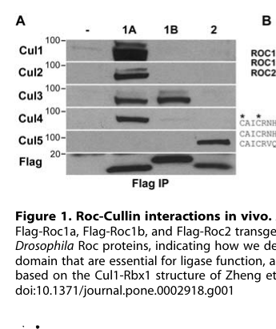

## Question

# Gene Research for Functional Annotation

## ⚠️ CRITICAL: Gene/Protein Identification Context

**BEFORE YOU BEGIN RESEARCH:** You MUST verify you are researching the CORRECT gene/protein. Gene symbols can be ambiguous, especially for less well-characterized genes from non-model organisms.

### Target Gene/Protein Identity (from UniProt):
- **UniProt Accession:** Q9V9R2
- **Protein Description:** RecName: Full=Cullin-2 {ECO:0000256|ARBA:ARBA00069610};
- **Gene Information:** Name=Cul2 {ECO:0000313|EMBL:AAF57224.3, ECO:0000313|FlyBase:FBgn0032956}; Synonyms=Cul-2 {ECO:0000313|EMBL:AAF57224.3}, cul-2 {ECO:0000313|EMBL:AAF57224.3}, CUL2 {ECO:0000313|EMBL:AAF57224.3}, cul2 {ECO:0000313|EMBL:AAF57224.3}, Cullin2 {ECO:0000313|EMBL:AAF57224.3}, dCul2 {ECO:0000313|EMBL:AAF57224.3}, DMcul-2 {ECO:0000313|EMBL:AAF57224.3}, Dmel\CG1512 {ECO:0000313|EMBL:AAF57224.3}, l(2)02074 {ECO:0000313|EMBL:AAF57224.3}; ORFNames=CG1512 {ECO:0000313|EMBL:AAF57224.3, ECO:0000313|FlyBase:FBgn0032956}, Dmel_CG1512 {ECO:0000313|EMBL:AAF57224.3};
- **Organism (full):** Drosophila melanogaster (Fruit fly).
- **Protein Family:** Belongs to the cullin family.
- **Key Domains:** Cullin. (IPR045093); Cullin-like_AB. (IPR059120); Cullin_CS. (IPR016157); Cullin_homology. (IPR016158); Cullin_homology_sf. (IPR036317)

### MANDATORY VERIFICATION STEPS:

1. **Check if the gene symbol "Cul2" matches the protein description above**
2. **Verify the organism is correct:** Drosophila melanogaster (Fruit fly).
3. **Check if protein family/domains align with what you find in literature**
4. **If you find literature for a DIFFERENT gene with the same or similar symbol, STOP**

### If Gene Symbol is Ambiguous or You Cannot Find Relevant Literature:

**DO NOT PROCEED WITH RESEARCH ON A DIFFERENT GENE.** Instead:
- State clearly: "The gene symbol 'Cul2' is ambiguous or literature is limited for this specific protein"
- Explain what you found (e.g., "Found extensive literature on a different gene with the same symbol in a different organism")
- Describe the protein based ONLY on the UniProt information provided above
- Suggest that the protein function can be inferred from domain/family information

### Research Target:

Please provide a comprehensive research report on the gene **Cul2** (gene ID: Cul2, UniProt: Q9V9R2) in DROME.

The research report should be a detailed narrative explaining the function, biological processes, and localization of the gene product. Citations should be given for all claims.

You should prioritize authoritative reviews and primary scientific literature when conducting research. You can supplement
this with annotations you find in gene/protein databases, but these can be outdated or inaccurate.

We are specifically interested in the primary function of the gene - for enzymes, what reaction is catalyzed, and what is the substrate specificity? For transporters, what is the substrate? For structural proteins or adapters, what is the broader structural role? For signaling molecules, what is the role in the pathway.

We are interested in where in or outside the cell the gene product carries out its function.

We are also interested in the signaling or biochemical pathways in which the gene functions. We are less interested in broad pleiotropic effects, except where these elucidate the precise role.

Include evidence where possible. We are interested in both experimental evidence as well as inference from structure, evolution, or bioinformatic analysis. Precise studies should be prioritized over high-throughput, where available.

## Output

Question: You are an expert researcher providing comprehensive, well-cited information.

Provide detailed information focusing on:
1. Key concepts and definitions with current understanding
2. Recent developments and latest research (prioritize 2023-2024 sources)
3. Current applications and real-world implementations
4. Expert opinions and analysis from authoritative sources
5. Relevant statistics and data from recent studies

Format as a comprehensive research report with proper citations. Include URLs and publication dates where available.
Always prioritize recent, authoritative sources and provide specific citations for all major claims.

# Gene Research for Functional Annotation

## ⚠️ CRITICAL: Gene/Protein Identification Context

**BEFORE YOU BEGIN RESEARCH:** You MUST verify you are researching the CORRECT gene/protein. Gene symbols can be ambiguous, especially for less well-characterized genes from non-model organisms.

### Target Gene/Protein Identity (from UniProt):
- **UniProt Accession:** Q9V9R2
- **Protein Description:** RecName: Full=Cullin-2 {ECO:0000256|ARBA:ARBA00069610};
- **Gene Information:** Name=Cul2 {ECO:0000313|EMBL:AAF57224.3, ECO:0000313|FlyBase:FBgn0032956}; Synonyms=Cul-2 {ECO:0000313|EMBL:AAF57224.3}, cul-2 {ECO:0000313|EMBL:AAF57224.3}, CUL2 {ECO:0000313|EMBL:AAF57224.3}, cul2 {ECO:0000313|EMBL:AAF57224.3}, Cullin2 {ECO:0000313|EMBL:AAF57224.3}, dCul2 {ECO:0000313|EMBL:AAF57224.3}, DMcul-2 {ECO:0000313|EMBL:AAF57224.3}, Dmel\CG1512 {ECO:0000313|EMBL:AAF57224.3}, l(2)02074 {ECO:0000313|EMBL:AAF57224.3}; ORFNames=CG1512 {ECO:0000313|EMBL:AAF57224.3, ECO:0000313|FlyBase:FBgn0032956}, Dmel_CG1512 {ECO:0000313|EMBL:AAF57224.3};
- **Organism (full):** Drosophila melanogaster (Fruit fly).
- **Protein Family:** Belongs to the cullin family.
- **Key Domains:** Cullin. (IPR045093); Cullin-like_AB. (IPR059120); Cullin_CS. (IPR016157); Cullin_homology. (IPR016158); Cullin_homology_sf. (IPR036317)

### MANDATORY VERIFICATION STEPS:

1. **Check if the gene symbol "Cul2" matches the protein description above**
2. **Verify the organism is correct:** Drosophila melanogaster (Fruit fly).
3. **Check if protein family/domains align with what you find in literature**
4. **If you find literature for a DIFFERENT gene with the same or similar symbol, STOP**

### If Gene Symbol is Ambiguous or You Cannot Find Relevant Literature:

**DO NOT PROCEED WITH RESEARCH ON A DIFFERENT GENE.** Instead:
- State clearly: "The gene symbol 'Cul2' is ambiguous or literature is limited for this specific protein"
- Explain what you found (e.g., "Found extensive literature on a different gene with the same symbol in a different organism")
- Describe the protein based ONLY on the UniProt information provided above
- Suggest that the protein function can be inferred from domain/family information

### Research Target:

Please provide a comprehensive research report on the gene **Cul2** (gene ID: Cul2, UniProt: Q9V9R2) in DROME.

The research report should be a detailed narrative explaining the function, biological processes, and localization of the gene product. Citations should be given for all claims.

You should prioritize authoritative reviews and primary scientific literature when conducting research. You can supplement
this with annotations you find in gene/protein databases, but these can be outdated or inaccurate.

We are specifically interested in the primary function of the gene - for enzymes, what reaction is catalyzed, and what is the substrate specificity? For transporters, what is the substrate? For structural proteins or adapters, what is the broader structural role? For signaling molecules, what is the role in the pathway.

We are interested in where in or outside the cell the gene product carries out its function.

We are also interested in the signaling or biochemical pathways in which the gene functions. We are less interested in broad pleiotropic effects, except where these elucidate the precise role.

Include evidence where possible. We are interested in both experimental evidence as well as inference from structure, evolution, or bioinformatic analysis. Precise studies should be prioritized over high-throughput, where available.

# Functional annotation of *Drosophila melanogaster* Cul2

## Identity and principal function

The target is **fruit-fly Cul2/CG1512**, corresponding to UniProt **[Q9V9R2](https://www.uniprot.org/uniprotkb/Q9V9R2/entry)** and FlyBase **[FBgn0032956](https://flybase.org/reports/FBgn0032956)**. An independent fly genetic study explicitly identifies **CG1512 as Cul2**, corroborating the supplied accession and organism. Its annotated cullin-family domains fit its experimentally observed interaction with a cullin–RING ligase partner. This report does **not** equate fly Cul2 with fly Cul3 or Cul5, or treat findings about human CUL2 as direct experiments on the fly protein. (ketosugbo2017ascreenfor pages 8-10, reynolds2008identifyingdeterminantsof pages 2-4)

**Primary molecular role:** Cul2 is the **scaffolding subunit of a Cullin-2–RING E3 ubiquitin ligase (CRL2)**, not a stand-alone enzyme with a defined catalytic reaction. It organizes a substrate-recruitment module at one end and a RING protein that recruits ubiquitin-charged E2 at the other, enabling transfer of ubiquitin to selected proteins. The receptor, rather than Cul2 alone, is the principal determinant of which protein is modified. Accordingly, there is no defensible single “Cul2 substrate” or Cul2-specific catalytic reaction independent of the assembled complex. This interpretation follows established CRL2 architecture and direct fly protein-association data. (reynolds2008identifyingdeterminantsof pages 2-4, cai2016thestructureand pages 1-2)

In **fly embryo co-immunoprecipitation**, Roc1a associated with Cul2 and the other Cul1–Cul4 proteins; Roc1b preferentially associated with Cul3, and Roc2 with Cul5. The Cul2 band in **Figure 1A** provides particularly useful visual evidence for the Roc1a association. A fly-specific biochemical complex comprising Cul2, Rbx1/Roc1, Elongins B and C, and the substrate receptor dVHL has also been described as supporting polyubiquitin-chain formation *in vitro*. These observations make a **Cul2–Roc1a–Elongin BC–receptor** complex the best-supported molecular annotation; they do not establish that every such component occupies the same complex in every tissue or identify every endogenous target. Reynolds *et al.*, **August 2008**, [DOI:10.1371/journal.pone.0002918](https://doi.org/10.1371/journal.pone.0002918). (reynolds2008identifyingdeterminantsof pages 7-8, reynolds2008identifyingdeterminantsof pages 2-4, reynolds2008identifyingdeterminantsof media 4a049ec6)

The evidence and its limits can be summarized as follows. (ketosugbo2017ascreenfor pages 8-10, reynolds2008identifyingdeterminantsof pages 2-4, vedelek2018analysisofdrosophila pages 6-8, drummondbarbosa2019localandphysiological pages 5-6, arquier2006analysisofthe pages 7-8, shmueli2014computationalandexperimental pages 4-6)

| Functional annotation | Direct fly experimental evidence, date, and DOI URL | Limitations |
|---|---|---|
| **CRL2 scaffold associated with Roc1a** | FLAG–Roc co-immunoprecipitation from transgenic *D. melanogaster* embryos showed that Roc1a binds Cul1–Cul4, including Cul2; Cul2 did not associate detectably with Roc2. Reynolds *et al.*, August 2008, [DOI: 10.1371/journal.pone.0002918](https://doi.org/10.1371/journal.pone.0002918) (reynolds2008identifyingdeterminantsof pages 7-8, reynolds2008identifyingdeterminantsof pages 2-4, reynolds2008identifyingdeterminantsof media 4a049ec6) | Strong direct evidence for Cul2–Roc1a association, but not a complete purification of endogenous Cul2–Roc1a–Elongin BC–receptor complexes or identification of a fly substrate in vivo. |
| **Probable CRL2–dVHL control of oxygen-sensitive Sima/HIF turnover** | dVHL bound a hydroxylated Sima P850-containing peptide; dVHL or pVHL reduced Sima and ODD–GFP abundance in flies. Earlier work demonstrated oxygen-regulated ODD–GFP stability, proteasome sensitivity, and tissue dependence on dVHL. Shmueli *et al.*, October 2014, [DOI: 10.1371/journal.pone.0109864](https://doi.org/10.1371/journal.pone.0109864); Arquier *et al.*, January 2006, [DOI: 10.1042/BJ20050675](https://doi.org/10.1042/BJ20050675) (arquier2006analysisofthe pages 7-8, arquier2006analysisofthe pages 3-4, shmueli2014computationalandexperimental pages 4-6) | **Cul2 involvement is mechanistic inference**, supported by CRL2 complex conservation, not by Cul2 knockout in these experiments. Some assays used human HIF ODD reporters or transgenic human VHL; they are not direct fly Cul2-substrate tests. |
| **Repression of ectopic Dpp/BMP signaling by Cul2 in ovarian escort cells** | Somatic escort-cell *cul-2* knockdown caused ectopic Dpp expression and expansion of GSC-like cells, linking Cul2 to the niche-to-differentiation transition. Ayyub *et al.*, September 2015, [DOI: 10.1016/j.ydbio.2015.07.019](https://doi.org/10.1016/j.ydbio.2015.07.019), summarized by Drummond-Barbosa, September 2019, [DOI: 10.1534/genetics.119.300234](https://doi.org/10.1534/genetics.119.300234) (drummondbarbosa2019localandphysiological pages 5-6) | Establishes a cell-type-specific genetic requirement, but the relevant CRL2 receptor, direct ubiquitination substrate, and mechanism of Dpp repression were not identified in the reviewed evidence. |
| **Expression during late spermatogenesis** | Region-resolved testis RNA-seq found stronger *Cul2* transcript accumulation in the basal testis, where post-meiotic stages predominate. Vedelek *et al.*, September 2018, [DOI: 10.1186/s12864-018-5085-z](https://doi.org/10.1186/s12864-018-5085-z) (vedelek2018analysisofdrosophila pages 6-8) | Transcript enrichment is not evidence of Cul2 protein abundance, intracellular localization, ligase activity, substrate identity, or an essential post-meiotic function. |
| **Genetic modifier of Cindr-dependent eye patterning** | In a sensitized GMR–*cindr*-RNAi eye screen, the *Cul2/CG1512* P-insertion allele 02074 suppressed mispatterning, whereas the UAS-insertion allele EY09124 enhanced it. Ketosugbo *et al.*, November 2017, [DOI: 10.1371/journal.pone.0187571](https://doi.org/10.1371/journal.pone.0187571) (ketosugbo2017ascreenfor pages 8-10) | Opposite allele effects and incompletely characterized insertion behavior prevent assignment of directionality or a direct Cul2–Cindr biochemical relationship. This is modifier-screen evidence, not substrate validation. |
| **Proposed Bam regulation in early germ-cell differentiation** | A 2023 primary report is titled “E3 ligase Cul2 mediates Drosophila early germ cell differentiation through targeting Bam.” Cai *et al.*, January 2023, [DOI: 10.1016/j.ydbio.2022.11.005](https://doi.org/10.1016/j.ydbio.2022.11.005). | Full text was unavailable for evidence inspection here; the reported Cul2–Bam targeting mechanism, ubiquitin linkage, degradation dependence, receptor, effect sizes, and cellular localization remain **unverified in this report** and should not be asserted strongly. |
| **Emerging proposed role in Imd antibacterial signaling** | A 2025 primary report is titled “Cul2 is essential for the Drosophila Imd signaling-mediated antimicrobial immune defense.” Duan *et al.*, March 2025, [DOI: 10.3390/ijms26062627](https://doi.org/10.3390/ijms26062627). | Full text was unavailable for evidence inspection here. Specific substrates, interaction with Diap2 or other Imd components, relevant tissues, infection statistics, and whether effects reflect direct CRL2 activity remain **unverified**. |

*Table: Evidence hierarchy for Drosophila melanogaster Cul2/CG1512 (UniProt Q9V9R2), separating direct fly experiments from pathway inference and unverified emerging reports.*

## Pathways, substrate recognition, and biological processes

**Oxygen sensing and HIF/Sima turnover.** The clearest receptor-to-substrate mechanism relevant to fly Cul2 is the **dVHL–Sima** pathway. Sima is the fly HIF-α homolog. In oxygen-replete conditions, the prolyl hydroxylase **Fatiga** acts on its oxygen-dependent degradation region; dVHL recognizes hydroxylated Sima, providing a route for ubiquitination and turnover by the VHL-associated CRL2. When oxygen limits hydroxylation, Sima can accumulate and drive hypoxia-responsive transcription with Tango/HIF-β. The assignment of Cul2 to this pathway is supported by the fly VHL-associated ligase complex and conserved CRL2 architecture; **the cited oxygen-response experiments manipulate dVHL, the hydroxylation pathway, or reporters rather than directly deleting Cul2**. Arquier *et al.*, **January 2006**, [DOI:10.1042/BJ20050675](https://doi.org/10.1042/BJ20050675); Shmueli *et al.*, **October 2014**, [DOI:10.1371/journal.pone.0109864](https://doi.org/10.1371/journal.pone.0109864). (reynolds2008identifyingdeterminantsof pages 7-8, arquier2006analysisofthe pages 1-2, shmueli2014computationalandexperimental pages 4-6, cai2016thestructureand pages 1-2)

The recognition evidence is unusually specific: purified dVHL bound a peptide containing **hydroxylated Sima Pro850**; dVHL expression reduced Sima or oxygen-dependent-degradation-domain reporter abundance in flies. In S2 cells, an **HIF-derived**, rather than native Sima-derived, degradation-domain reporter was stabilized by **1% oxygen** or proteasome inhibition. These complementary assays support the pathway but should not be conflated with an experiment proving that Cul2 directly ubiquitinates native Sima *in vivo*. (arquier2006analysisofthe pages 3-4, shmueli2014computationalandexperimental pages 4-6)

**Ovarian germline differentiation.** There is a more direct, tissue-specific **Cul2 genetic phenotype** in ovarian **somatic escort cells**. Knockdown was reported to produce **ectopic Decapentaplegic (Dpp/BMP) expression** and expansion of germline-stem-cell-like cells. Escort cells normally help keep Dpp activity confined to the niche so that stem-cell daughters can differentiate; Cul2 therefore contributes to restricting a self-renewal signal in the surrounding somatic tissue. This is a functional link to the **Dpp/BMP–germline differentiation** circuit, **not** proof that Dpp itself is ubiquitinated by Cul2. Ayyub *et al.*, **2015**, [DOI:10.1016/j.ydbio.2015.07.019](https://doi.org/10.1016/j.ydbio.2015.07.019), as discussed by Drummond-Barbosa, **September 2019**, [DOI:10.1534/genetics.119.300234](https://doi.org/10.1534/genetics.119.300234). The original 2015 full text was not available for independent inspection here. (drummondbarbosa2019localandphysiological pages 5-6)

**Bam and recent germline research.** A directly relevant paper, Cai *et al.*, **January 2023**, is titled *“E3 ligase Cul2 mediates Drosophila early germ cell differentiation through targeting Bam”* ([DOI:10.1016/j.ydbio.2022.11.005](https://doi.org/10.1016/j.ydbio.2022.11.005)). It is important **recent, fly-specific primary literature**, but its full text was unobtainable in this search. Its title identifies **Bag of marbles (Bam)** as a proposed Cul2-associated target; the exact receptor, ubiquitination reaction, effect on Bam stability, cell type, and experimental strength **could not be verified** and are therefore not presented as established mechanisms here. Earlier niche evidence concerns Cul2 in *somatic* cells and should not be silently merged with a claim about direct Bam targeting in *germ cells*. (drummondbarbosa2019localandphysiological pages 5-6)

**Other observed associations.** In a sensitized developing-eye screen, two **Cul2/CG1512** insertion alleles modified a phenotype caused by reducing the adaptor Cindr: **02074 suppressed**, while **EY09124 enhanced**, eye mispatterning. The opposing effects make this evidence for a **genetic interaction**, not a directional Cul2–Cindr signaling mechanism or a demonstrated biochemical substrate. Ketosugbo *et al.*, **November 2017**, [DOI:10.1371/journal.pone.0187571](https://doi.org/10.1371/journal.pone.0187571). (ketosugbo2017ascreenfor pages 8-10)

A newer paper, Duan *et al.*, **March 2025**, is titled *“Cul2 Is Essential for the Drosophila Imd Signaling-Mediated Antimicrobial Immune Defense”* ([DOI:10.3390/ijms26062627](https://doi.org/10.3390/ijms26062627)). Because its full text could not be inspected, an **Imd-pathway association is a research lead**, not a basis here for naming an immune-pathway substrate, specifying a tissue of action, or quoting an infection-survival effect size. This report postdates the requested 2023–2024 emphasis and does not displace the better-verifiable molecular evidence above. (cai2016thestructureand pages 1-2)

## Where Cul2 acts

The demonstrated activities concern **intracellular protein complexes**, not secretion or transport across a membrane. Cul2–Roc1a association was detected in **embryo extracts**, and the Cul2-dependent developmental requirement described above lies in **ovarian somatic escort cells**. A regional testis RNA-seq study found **Cul2 transcripts enriched toward the basal, post-meiotic region**; this establishes an expression pattern, **not** Cul2 protein localization or a proven late-spermatogenesis requirement. Vedelek *et al.*, **September 2018**, [DOI:10.1186/s12864-018-5085-z](https://doi.org/10.1186/s12864-018-5085-z). (reynolds2008identifyingdeterminantsof pages 2-4, vedelek2018analysisofdrosophila pages 6-8, drummondbarbosa2019localandphysiological pages 5-6)

At subcellular resolution, the retrieved experiments **do not establish an exclusive nuclear, cytoplasmic, membrane, or organelle location for endogenous fly Cul2**. The dVHL-dependent oxygen reporter was responsive in the **tracheal system** and showed different behavior in ectoderm; these results locate a *pathway response*, not Cul2 protein itself. Likewise, transgenic **human pVHL** was observed in both nucleus and cytoplasm of fly eye-disc cells, but that observation must **not** be relabeled as localization of fly Cul2. Arquier *et al.*, 2006; Shmueli *et al.*, 2014. (arquier2006analysisofthe pages 7-8, shmueli2014computationalandexperimental pages 6-8)

## Interpretation, applications, and outstanding evidence

The most useful current implementation of this annotation is **mechanism-guided fly genetics**: Roc1a/Cul2 association defines the ligase scaffold; dVHL/Sima assays probe oxygen-dependent substrate recognition; and escort-cell-specific Cul2 perturbation tests how somatic tissue restricts BMP signaling during germline differentiation. The 2014 study also used transgenic human VHL to rescue fly *dVHL* defects, illustrating the fly’s utility for studying conserved VHL biology; it was **not** a Cul2-targeted therapy or a Cul2 rescue experiment. (reynolds2008identifyingdeterminantsof pages 2-4, shmueli2014computationalandexperimental pages 4-6, drummondbarbosa2019localandphysiological pages 5-6)

Quantitatively, the VHL complementation experiment reported that **approximately 60%** of otherwise *dVHL*-null animals completed development after ubiquitous expression of fly or human VHL transgenes; that statistic concerns **VHL**, not a Cul2 mutant. The Cindr screen tested **two Cul2 alleles with opposite modifier outcomes**, and the regional transcriptome provides a **direction of Cul2 RNA enrichment**, not a measured Cul2 enzymatic rate or protein copy number. The key unresolved Cul2-specific questions are the identities of its receptor and directly ubiquitinated substrate in ovarian escort cells, whether and how the reported 2023 Bam interaction operates, and the endogenous protein’s compartment-resolved localization. (ketosugbo2017ascreenfor pages 8-10, vedelek2018analysisofdrosophila pages 6-8, shmueli2014computationalandexperimental pages 4-6, drummondbarbosa2019localandphysiological pages 5-6)

**Bottom line:** The strongest verified annotation of **Q9V9R2/CG1512** is an **intracellular CRL2 ubiquitin-ligase scaffold**, experimentally associated with **Roc1a**, with a direct fly genetic role in preventing ectopic **ovarian Dpp/BMP signaling**. A **dVHL-dependent Sima degradation pathway** provides a compelling, biochemically grounded CRL2 mechanism, while precise Cul2-dependent substrate specificity, the recent reported Bam mechanism, and endogenous subcellular localization require more direct evidence. (reynolds2008identifyingdeterminantsof pages 7-8, reynolds2008identifyingdeterminantsof pages 2-4, shmueli2014computationalandexperimental pages 4-6, reynolds2008identifyingdeterminantsof media 4a049ec6, drummondbarbosa2019localandphysiological pages 5-6)

References

1. (ketosugbo2017ascreenfor pages 8-10): Kwami F. Ketosugbo, Henry L. Bushnell, and Ruth I. Johnson. A screen for e3 ubiquitination ligases that genetically interact with the adaptor protein cindr during drosophila eye patterning. PLoS ONE, 12:e0187571, Nov 2017. URL: https://doi.org/10.1371/journal.pone.0187571, doi:10.1371/journal.pone.0187571. This article has 11 citations and is from a peer-reviewed journal.

2. (reynolds2008identifyingdeterminantsof pages 2-4): Patrick J. Reynolds, Jeffrey R. Simms, and Robert J. Duronio. Identifying determinants of cullin binding specificity among the three functionally different drosophila melanogaster roc proteins via domain swapping. PLoS ONE, 3:e2918, Aug 2008. URL: https://doi.org/10.1371/journal.pone.0002918, doi:10.1371/journal.pone.0002918. This article has 26 citations and is from a peer-reviewed journal.

3. (cai2016thestructureand pages 1-2): Weijia Cai and Haifeng Yang. The structure and regulation of cullin 2 based e3 ubiquitin ligases and their biological functions. Cell Division, Mar 2016. URL: https://doi.org/10.1186/s13008-016-0020-7, doi:10.1186/s13008-016-0020-7. This article has 111 citations and is from a peer-reviewed journal.

4. (reynolds2008identifyingdeterminantsof pages 7-8): Patrick J. Reynolds, Jeffrey R. Simms, and Robert J. Duronio. Identifying determinants of cullin binding specificity among the three functionally different drosophila melanogaster roc proteins via domain swapping. PLoS ONE, 3:e2918, Aug 2008. URL: https://doi.org/10.1371/journal.pone.0002918, doi:10.1371/journal.pone.0002918. This article has 26 citations and is from a peer-reviewed journal.

5. (reynolds2008identifyingdeterminantsof media 4a049ec6): Patrick J. Reynolds, Jeffrey R. Simms, and Robert J. Duronio. Identifying determinants of cullin binding specificity among the three functionally different drosophila melanogaster roc proteins via domain swapping. PLoS ONE, 3:e2918, Aug 2008. URL: https://doi.org/10.1371/journal.pone.0002918, doi:10.1371/journal.pone.0002918. This article has 26 citations and is from a peer-reviewed journal.

6. (vedelek2018analysisofdrosophila pages 6-8): Viktor Vedelek, László Bodai, Gábor Grézal, Bence Kovács, Imre M. Boros, Barbara Laurinyecz, and Rita Sinka. Analysis of drosophila melanogaster testis transcriptome. BMC Genomics, Sep 2018. URL: https://doi.org/10.1186/s12864-018-5085-z, doi:10.1186/s12864-018-5085-z. This article has 93 citations and is from a peer-reviewed journal.

7. (drummondbarbosa2019localandphysiological pages 5-6): Daniela Drummond-Barbosa. Local and physiological control of germline stem cell lineages in <i>drosophila melanogaster</i>. Genetics, 213:9-26, Sep 2019. URL: https://doi.org/10.1534/genetics.119.300234, doi:10.1534/genetics.119.300234. This article has 88 citations and is from a domain leading peer-reviewed journal.

8. (arquier2006analysisofthe pages 7-8): Nathalie Arquier, Paul Vigne, Eric Duplan, Tien Hsu, Pascal P. Therond, Christian Frelin, and Gisela D'Angelo. Analysis of the hypoxia-sensing pathway in drosophila melanogaster. The Biochemical journal, 393 Pt 2:471-80, Jan 2006. URL: https://doi.org/10.1042/bj20050675, doi:10.1042/bj20050675. This article has 92 citations.

9. (shmueli2014computationalandexperimental pages 4-6): Merav D. Shmueli, Lee Schnaider, Gal Herzog, Ehud Gazit, and Daniel Segal. Computational and experimental characterization of dvhl establish a drosophila model of vhl syndrome. PLoS ONE, 9:e109864, Oct 2014. URL: https://doi.org/10.1371/journal.pone.0109864, doi:10.1371/journal.pone.0109864. This article has 3 citations and is from a peer-reviewed journal.

10. (arquier2006analysisofthe pages 3-4): Nathalie Arquier, Paul Vigne, Eric Duplan, Tien Hsu, Pascal P. Therond, Christian Frelin, and Gisela D'Angelo. Analysis of the hypoxia-sensing pathway in drosophila melanogaster. The Biochemical journal, 393 Pt 2:471-80, Jan 2006. URL: https://doi.org/10.1042/bj20050675, doi:10.1042/bj20050675. This article has 92 citations.

11. (arquier2006analysisofthe pages 1-2): Nathalie Arquier, Paul Vigne, Eric Duplan, Tien Hsu, Pascal P. Therond, Christian Frelin, and Gisela D'Angelo. Analysis of the hypoxia-sensing pathway in drosophila melanogaster. The Biochemical journal, 393 Pt 2:471-80, Jan 2006. URL: https://doi.org/10.1042/bj20050675, doi:10.1042/bj20050675. This article has 92 citations.

12. (shmueli2014computationalandexperimental pages 6-8): Merav D. Shmueli, Lee Schnaider, Gal Herzog, Ehud Gazit, and Daniel Segal. Computational and experimental characterization of dvhl establish a drosophila model of vhl syndrome. PLoS ONE, 9:e109864, Oct 2014. URL: https://doi.org/10.1371/journal.pone.0109864, doi:10.1371/journal.pone.0109864. This article has 3 citations and is from a peer-reviewed journal.

## Artifacts

- [Edison artifact artifact-00](Cul2-deep-research-falcon_artifacts/artifact-00.md)

## Citations

1. drummondbarbosa2019localandphysiological pages 5-6
2. vedelek2018analysisofdrosophila pages 6-8
3. ketosugbo2017ascreenfor pages 8-10
4. cai2016thestructureand pages 1-2
5. reynolds2008identifyingdeterminantsof pages 2-4
6. reynolds2008identifyingdeterminantsof pages 7-8
7. arquier2006analysisofthe pages 7-8
8. shmueli2014computationalandexperimental pages 4-6
9. arquier2006analysisofthe pages 3-4
10. arquier2006analysisofthe pages 1-2
11. shmueli2014computationalandexperimental pages 6-8
12. Q9V9R2
13. FBgn0032956
14. DOI:10.1371/journal.pone.0002918
15. DOI: 10.1371/journal.pone.0002918
16. DOI: 10.1371/journal.pone.0109864
17. DOI: 10.1042/BJ20050675
18. DOI: 10.1016/j.ydbio.2015.07.019
19. DOI: 10.1534/genetics.119.300234
20. DOI: 10.1186/s12864-018-5085-z
21. DOI: 10.1371/journal.pone.0187571
22. DOI: 10.1016/j.ydbio.2022.11.005
23. DOI: 10.3390/ijms26062627
24. DOI:10.1042/BJ20050675
25. DOI:10.1371/journal.pone.0109864
26. DOI:10.1016/j.ydbio.2015.07.019
27. DOI:10.1534/genetics.119.300234
28. DOI:10.1016/j.ydbio.2022.11.005
29. DOI:10.1371/journal.pone.0187571
30. DOI:10.3390/ijms26062627
31. DOI:10.1186/s12864-018-5085-z
32. https://www.uniprot.org/uniprotkb/Q9V9R2/entry
33. https://flybase.org/reports/FBgn0032956
34. https://doi.org/10.1371/journal.pone.0002918
35. https://doi.org/10.1371/journal.pone.0109864
36. https://doi.org/10.1042/BJ20050675
37. https://doi.org/10.1016/j.ydbio.2015.07.019
38. https://doi.org/10.1534/genetics.119.300234
39. https://doi.org/10.1186/s12864-018-5085-z
40. https://doi.org/10.1371/journal.pone.0187571
41. https://doi.org/10.1016/j.ydbio.2022.11.005
42. https://doi.org/10.3390/ijms26062627
43. https://doi.org/10.1371/journal.pone.0187571,
44. https://doi.org/10.1371/journal.pone.0002918,
45. https://doi.org/10.1186/s13008-016-0020-7,
46. https://doi.org/10.1186/s12864-018-5085-z,
47. https://doi.org/10.1534/genetics.119.300234,
48. https://doi.org/10.1042/bj20050675,
49. https://doi.org/10.1371/journal.pone.0109864,