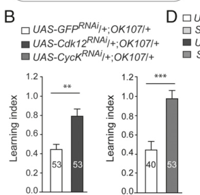

## Question

# Gene Research for Functional Annotation

## ⚠️ CRITICAL: Gene/Protein Identification Context

**BEFORE YOU BEGIN RESEARCH:** You MUST verify you are researching the CORRECT gene/protein. Gene symbols can be ambiguous, especially for less well-characterized genes from non-model organisms.

### Target Gene/Protein Identity (from UniProt):
- **UniProt Accession:** Q961D1
- **Protein Description:** RecName: Full=Cyclin-K {ECO:0000256|ARBA:ARBA00073757};
- **Gene Information:** Name=CycK {ECO:0000313|EMBL:AAK93091.1, ECO:0000313|FlyBase:FBgn0025674}; ORFNames=CG15218 {ECO:0000313|FlyBase:FBgn0025674};
- **Organism (full):** Drosophila melanogaster (Fruit fly).
- **Protein Family:** Belongs to the cyclin family.
- **Key Domains:** Cyclin-like_dom. (IPR013763); Cyclin-like_sf. (IPR036915); Cyclin/Ssn8. (IPR043198); Cyclin_C-dom. (IPR004367); Cyclin_N. (IPR006671)

### MANDATORY VERIFICATION STEPS:

1. **Check if the gene symbol "CycK" matches the protein description above**
2. **Verify the organism is correct:** Drosophila melanogaster (Fruit fly).
3. **Check if protein family/domains align with what you find in literature**
4. **If you find literature for a DIFFERENT gene with the same or similar symbol, STOP**

### If Gene Symbol is Ambiguous or You Cannot Find Relevant Literature:

**DO NOT PROCEED WITH RESEARCH ON A DIFFERENT GENE.** Instead:
- State clearly: "The gene symbol 'CycK' is ambiguous or literature is limited for this specific protein"
- Explain what you found (e.g., "Found extensive literature on a different gene with the same symbol in a different organism")
- Describe the protein based ONLY on the UniProt information provided above
- Suggest that the protein function can be inferred from domain/family information

### Research Target:

Please provide a comprehensive research report on the gene **CycK** (gene ID: CycK, UniProt: Q961D1) in DROME.

The research report should be a detailed narrative explaining the function, biological processes, and localization of the gene product. Citations should be given for all claims.

You should prioritize authoritative reviews and primary scientific literature when conducting research. You can supplement
this with annotations you find in gene/protein databases, but these can be outdated or inaccurate.

We are specifically interested in the primary function of the gene - for enzymes, what reaction is catalyzed, and what is the substrate specificity? For transporters, what is the substrate? For structural proteins or adapters, what is the broader structural role? For signaling molecules, what is the role in the pathway.

We are interested in where in or outside the cell the gene product carries out its function.

We are also interested in the signaling or biochemical pathways in which the gene functions. We are less interested in broad pleiotropic effects, except where these elucidate the precise role.

Include evidence where possible. We are interested in both experimental evidence as well as inference from structure, evolution, or bioinformatic analysis. Precise studies should be prioritized over high-throughput, where available.

## Output

Question: You are an expert researcher providing comprehensive, well-cited information.

Provide detailed information focusing on:
1. Key concepts and definitions with current understanding
2. Recent developments and latest research (prioritize 2023-2024 sources)
3. Current applications and real-world implementations
4. Expert opinions and analysis from authoritative sources
5. Relevant statistics and data from recent studies

Format as a comprehensive research report with proper citations. Include URLs and publication dates where available.
Always prioritize recent, authoritative sources and provide specific citations for all major claims.

# Gene Research for Functional Annotation

## ⚠️ CRITICAL: Gene/Protein Identification Context

**BEFORE YOU BEGIN RESEARCH:** You MUST verify you are researching the CORRECT gene/protein. Gene symbols can be ambiguous, especially for less well-characterized genes from non-model organisms.

### Target Gene/Protein Identity (from UniProt):
- **UniProt Accession:** Q961D1
- **Protein Description:** RecName: Full=Cyclin-K {ECO:0000256|ARBA:ARBA00073757};
- **Gene Information:** Name=CycK {ECO:0000313|EMBL:AAK93091.1, ECO:0000313|FlyBase:FBgn0025674}; ORFNames=CG15218 {ECO:0000313|FlyBase:FBgn0025674};
- **Organism (full):** Drosophila melanogaster (Fruit fly).
- **Protein Family:** Belongs to the cyclin family.
- **Key Domains:** Cyclin-like_dom. (IPR013763); Cyclin-like_sf. (IPR036915); Cyclin/Ssn8. (IPR043198); Cyclin_C-dom. (IPR004367); Cyclin_N. (IPR006671)

### MANDATORY VERIFICATION STEPS:

1. **Check if the gene symbol "CycK" matches the protein description above**
2. **Verify the organism is correct:** Drosophila melanogaster (Fruit fly).
3. **Check if protein family/domains align with what you find in literature**
4. **If you find literature for a DIFFERENT gene with the same or similar symbol, STOP**

### If Gene Symbol is Ambiguous or You Cannot Find Relevant Literature:

**DO NOT PROCEED WITH RESEARCH ON A DIFFERENT GENE.** Instead:
- State clearly: "The gene symbol 'CycK' is ambiguous or literature is limited for this specific protein"
- Explain what you found (e.g., "Found extensive literature on a different gene with the same symbol in a different organism")
- Describe the protein based ONLY on the UniProt information provided above
- Suggest that the protein function can be inferred from domain/family information

### Research Target:

Please provide a comprehensive research report on the gene **CycK** (gene ID: CycK, UniProt: Q961D1) in DROME.

The research report should be a detailed narrative explaining the function, biological processes, and localization of the gene product. Citations should be given for all claims.

You should prioritize authoritative reviews and primary scientific literature when conducting research. You can supplement
this with annotations you find in gene/protein databases, but these can be outdated or inaccurate.

We are specifically interested in the primary function of the gene - for enzymes, what reaction is catalyzed, and what is the substrate specificity? For transporters, what is the substrate? For structural proteins or adapters, what is the broader structural role? For signaling molecules, what is the role in the pathway.

We are interested in where in or outside the cell the gene product carries out its function.

We are also interested in the signaling or biochemical pathways in which the gene functions. We are less interested in broad pleiotropic effects, except where these elucidate the precise role.

Include evidence where possible. We are interested in both experimental evidence as well as inference from structure, evolution, or bioinformatic analysis. Precise studies should be prioritized over high-throughput, where available.

# Functional annotation of *Drosophila melanogaster* CycK (UniProt Q961D1)

## Identity and principal function

**Identity verified:** The specified protein is fruit-fly **cyclin K**, encoded by **CycK/CG15218** (FlyBase **FBgn0025674**), not the distinct kinase gene *Cdk12* (CG7597) or human **CCNK**. The supplied UniProt record assigns cyclin-family and cyclin-like domains; these are consistent with a **regulatory cyclin that associates with a cyclin-dependent kinase**, rather than an enzyme with its own catalytic reaction. Human cyclin K has two cyclin boxes, but its complete domain architecture should not be transferred uncritically to the fly sequence. UniProt record: https://www.uniprot.org/uniprotkb/Q961D1/entry; FlyBase record: https://flybase.org/reports/FBgn0025674.html. (bartkowiak2010cdk12isa pages 1-2, kohoutek2012cyclinkgoes pages 2-4)

**Best-supported primary role:** Fly CycK is a regulatory partner of **CDK12** in a nuclear, transcription-associated kinase complex. The complex phosphorylates the C-terminal domain (CTD) of the largest RNA polymerase II subunit, particularly contributing to **Ser2 phosphorylation during productive transcription elongation**. CycK supplies the cyclin component; **CDK12 catalyzes phosphate transfer**, so it would be inaccurate to describe CycK itself as an ATP-dependent CTD kinase. Endogenous CDK12 immunopurified from fly Kc-cell nuclear extract brought down CycK as the *only cyclin detected* in the analyzed bands: mass spectrometry identified **two CycK peptides**, although the investigators cautioned that this did not prove CycK was CDK12’s exclusive cyclin partner. The purified CDK12-containing material phosphorylated CTD substrates in vitro. (bartkowiak2010cdk12isa pages 5-6, bartkowiak2010cdk12isa pages 1-2)

The evidence below distinguishes measurements **on CycK itself** from measurements **on its kinase partner** and from experiments in other organisms.

| Finding | Organism and evidence | Significance for fly CycK | Limitation |
|---|---|---|---|
| **Identity:** UniProt Q961D1 corresponds to *Drosophila melanogaster* CycK, CG15218, and FBgn0025674; it is annotated with cyclin-like domains. | Fly database identity supplied for the target record; the architecture is consistent with the two cyclin boxes described for metazoan cyclin K. (kohoutek2012cyclinkgoes pages 2-4) | Confirms that the target is a regulatory cyclin-family protein, not a catalytic kinase; its likely molecular role is binding and activating a CDK. | The functional interpretation is domain-based; no experimentally determined structure of fly Q961D1 was identified. |
| **Endogenous dCDK12 complex:** immunopurification and LC-MS/MS detected CycK as the only cyclin associated with dCDK12, based on two CycK peptides with reported 100% identification probability. The purified complex phosphorylated RNAPII CTD, while dCDK12 RNAi strongly reduced Ser2P but not Ser5P. [Bartkowiak et al., 2010](https://doi.org/10.1101/gad.1968210) (bartkowiak2010cdk12isa pages 8-9, bartkowiak2010cdk12isa pages 5-6) | Fly Kc-cell nuclear extract, biochemical kinase assays, and 48-hour dCDK12 RNAi in S2 cells. | Strongest direct evidence that CycK is the regulatory partner of the major fly elongation-associated RNAPII CTD kinase dCDK12. | CycK itself was not depleted in these experiments; kinase activity, Ser2P dependence, and chromosome localization were measured for dCDK12 rather than independently for CycK. Two peptides support association but do not prove an exclusive partnership. |
| **CycK depletion phenocopies key dCDK12 functions:** CycK RNAi caused chromosome heterochromatin enrichment, reduced tested neuronal transcripts, paralysis and eclosion abnormalities, and defective courtship learning but not courtship memory. [Pan et al., 2015](https://doi.org/10.1073/pnas.1502943112) (pan2015heterochromatinremodelingby pages 1-2, pan2015heterochromatinremodelingby pages 4-5, pan2015heterochromatinremodelingby pages 3-4, pan2015heterochromatinremodelingby pages 5-6, pan2015heterochromatinremodelingby media bc2b85ea) | Fly tissue-specific RNAi, polytene-chromosome staining, adult-brain qRT-PCR, and behavioral assays. | Direct genetic evidence that CycK supports the dCDK12-associated transcription and chromatin pathway, including neuronal-gene activation and learning. | Genome-wide HP1 and H3K9me2 ChIP-seq and mechanistic Ser2P analyses were performed after dCDK12 depletion, not CycK depletion; CycK RNAi therefore does not independently establish every proposed chromatin step. |
| **Earlier CDK9 pairing remains uncertain:** CycK was initially considered an alternative CDK9 cyclin, but later mass-spectrometry and interaction studies did not consistently recover CycK with CDK9, whereas endogenous fly CycK was recovered with dCDK12. [Kohoutek and Blazek, 2012](https://doi.org/10.1186/1747-1028-7-12) (kohoutek2012cyclinkgoes pages 1-2) | Historical fly and human biochemical evidence; some earlier fly studies used tagged overexpression, localization, and rescue assays. | The best-supported primary annotation is dCDK12 regulatory cyclin rather than canonical P-TEFb or CDK9 cyclin. | A conditional, developmental-stage-specific, or secondary CDK9 interaction cannot be excluded; older tagged-expression experiments provided some support for that model. |
| **Recent mechanism:** PAF1C directly stimulated human CDK12–Cyclin K through a CDC73 motif; reconstituted CDK12–Cyclin K predominantly generated Ser2P–Ser5P doubly phosphorylated CTD. [Lopez Martinez et al., 2024 preprint](https://doi.org/10.1101/2024.10.14.618141) (martinez2024paf1callostericallyactivates pages 1-5, martinez2024paf1callostericallyactivates pages 8-11) | Human proteins and cells; biochemical reconstitution and cellular perturbation in a 2024 bioRxiv preprint. | Provides a current mechanistic hypothesis for selective activation of CDK12–CycK within elongating RNAPII complexes. | The 2024 source was a non-peer-reviewed preprint and did not test fly CycK/Q961D1; this mechanism is not established in *Drosophila*. |

*Table: Evidence-weighted summary distinguishing direct Drosophila CycK findings from CDK12-partner measurements, disputed historical assignments, and human mechanistic extrapolation.*

## Reaction, substrate, and pathway

The relevant reaction is **CDK12–CycK-dependent phosphorylation of RNA polymerase II CTD repeats**, using ATP as the phosphate donor; the repeating CTD consensus is **YSPTSPS**. In fly S2 cells, RNAi against *Cdk12* for **48 hours** strongly diminished the antibody-detected bulk **CTD Ser2-phosphorylated** signal, while the **Ser5-phosphorylated** signal did not change significantly. This establishes CDK12 as an important determinant of fly CTD Ser2 phosphorylation, **not** that isolated CycK catalyzes this reaction or that a CycK-only knockdown was conducted in that experiment. Ser2 phosphorylation is associated with elongating polymerase and helps coordinate transcription with nascent-RNA maturation. (bartkowiak2010cdk12isa pages 8-9, bartkowiak2010cdk12isa pages 5-6, dahlberg2015ptefbthesuper pages 1-2)

The complex functions principally in the **RNA polymerase II transcription-elongation pathway**, rather than serving as the conventional mitotic cyclin machinery. On larval polytene chromosomes, CDK12 closely followed hyperphosphorylated polymerase but differed in distribution from **P-TEFb, the CDK9–Cyclin T complex**. At the heat-shock gene *Hsp70*, CDK12 became detectable along the gene after induction, whereas promoter-proximally paused polymerase was present before induction; its amount relative to polymerase rose downstream from the promoter and stayed comparatively high across the transcription unit. These are **CDK12-localization measurements**, supporting the likely site of action of its CycK-containing complex, rather than a direct map of endogenous CycK. (bartkowiak2010cdk12isa pages 3-5, bartkowiak2010cdk12isa pages 1-2)

**Substrate-specificity qualification:** Fly studies support a prominent role in CTD Ser2 phosphorylation, but do not establish that Ser2 is the complex’s *only* biochemical target or define a complete fly substrate hierarchy. A crystal-structure and biochemical study of **human**, not fly, CDK12–Cyclin K found its greatest activity on CTD substrate already phosphorylated at **Ser7**, suggesting that prior CTD modification affects recognition. More recent human reconstitution indicates that CDK12–Cyclin K can produce **Ser2/Ser5 doubly phosphorylated** CTD, complicating a simplistic “Ser2-only kinase” description. These are informative conserved-mechanism hypotheses, not direct substrate-specificity measurements for Q961D1. Human structural study: https://doi.org/10.1038/ncomms4505 (March 2014); recent preprint: https://doi.org/10.1101/2024.10.14.618141 (posted October 16, 2024). (martinez2024paf1callostericallyactivates pages 1-5, martinez2024paf1callostericallyactivates pages 8-11)

## Localization and direct fly phenotypes

**Site of action:** Nuclear transcription-associated chromatin is strongly supported by purification of the endogenous CDK12-associated CycK complex from **nuclear extract** and by CDK12 occupancy at transcribed loci. Nevertheless, nuclear-extract co-purification and CDK12 staining do **not** independently establish the precise subnuclear distribution of endogenous CycK. Reports of **nuclear-speckle localization** principally concern mammalian cyclin K/CDK12/CDK13 systems; fly-specific localization to speckles should therefore be regarded as unverified here. (bartkowiak2010cdk12isa pages 5-6, bartkowiak2010cdk12isa pages 3-5, kohoutek2012cyclinkgoes pages 2-4)

A fly perturbation study provides unusually useful **CycK-specific** functional evidence. CycK RNAi caused ectopic chromosome **heterochromatin enrichment**, similar to CDK12 depletion. In adult brains, CycK depletion reduced expression of tested neuronal genes; neuronal knockdown also produced failure to eclose or paralysis under the reported conditions. Mushroom-body-targeted CycK knockdown impaired **courtship learning**, while the investigators did **not** detect a corresponding courtship-memory defect. The focused Figure 5B comparison directly shows the learning-index effect for CycK and CDK12 knockdown. These convergent phenotypes support a functional CDK12–CycK partnership in sustaining transcription of neuronal genes and opposing inappropriate heterochromatinization. (pan2015heterochromatinremodelingby pages 1-2, pan2015heterochromatinremodelingby pages 4-5, pan2015heterochromatinremodelingby pages 3-4, pan2015heterochromatinremodelingby pages 5-6, pan2015heterochromatinremodelingby media bc2b85ea)

The mechanistic attribution needs care. Pan and colleagues’ genome-wide chromatin profiling was performed after **CDK12 depletion**: **299** HP1-binding peaks increased versus **29** decreased, while **540** H3K9me2 peaks increased. More than **30%** of euchromatic peaks gaining HP1 occurred on the X chromosome, and roughly **60%** of the increased heterochromatin binding mapped to gene bodies. Adult-brain expression of examined neuronal genes fell approximately **two- to threefold** after CDK12 depletion, with similar directional decreases reported for tested transcripts after CycK depletion. Thus, the genome-wide counts establish the chromatin consequences of **CDK12 loss**, while the CycK RNAi, brain-expression and learning assays provide complementary support for the same pathway; they are **not** genome-wide CycK ChIP-seq measurements. HP1 reduction genetically suppressed the learning defect of **CDK12-depleted** flies; the paper did not thereby demonstrate the same rescue for CycK-depleted flies. https://doi.org/10.1073/pnas.1502943112 (published October 2015). (pan2015heterochromatinremodelingby pages 2-3, pan2015heterochromatinremodelingby pages 3-4, pan2015heterochromatinremodelingby pages 4-5, pan2015heterochromatinremodelingby pages 5-6)

## Historical assignment and developments through 2024

Early research described cyclin K as a possible **CDK9** partner. That assignment should not replace the CDK12 annotation: later endogenous-complex work recovered fly CycK with CDK12, and a specialist review reports unsuccessful recovery of cyclin K with CDK9 in several human-cell systems. An interaction restricted to particular conditions cannot be categorically excluded, but **CDK9–Cyclin T**, not CDK9–CycK, is the established P-TEFb comparison in the fly transcription studies. In particular, experiments depleting maternal *Cdk9* or *CycT* in early embryos should **not** be cited as CycK-depletion results. Review: https://doi.org/10.1186/1747-1028-7-12 (April 2012); fly embryo study: https://doi.org/10.1371/journal.pgen.1004971 (February 13, 2015). (kohoutek2012cyclinkgoes pages 1-2, dahlberg2015ptefbthesuper pages 2-4, bartkowiak2010cdk12isa pages 1-2)

The most pertinent **2024 mechanistic development** identified here concerns **human** CDK12–Cyclin K: purified PAF1 complex stimulated CTD phosphorylation by the CDK12–Cyclin K complex, and its **CDC73** subunit contained an interaction/activation motif; comparable stimulation was not observed for CDK9–Cyclin T in those assays. This provides a plausible mechanism for directing CDK12–cyclin-K activity along elongating polymerase. The cited 2024 version was a **bioRxiv preprint**, however, and its CDC73-dependent mechanism has **not been shown for fly Q961D1** in the evidence reviewed. https://doi.org/10.1101/2024.10.14.618141 (October 16, 2024). (martinez2024paf1callostericallyactivates pages 1-5, martinez2024paf1callostericallyactivates pages 8-11)

**Assessment:** The defensible annotation is **“nuclear transcriptional cyclin; regulatory subunit associated with Drosophila CDK12, promoting RNA polymerase II CTD phosphorylation and productive gene expression.”** CycK-specific fly genetics substantiate roles in opposing ectopic heterochromatin and sustaining neuronal transcription and learning. Exact endogenous CycK localization, its full range of kinase partners and its effects on particular RNA-processing reactions remain less securely established than its CDK12 association and the downstream fly phenotypes. Human DNA-repair and cancer findings should not be assigned as experimentally demonstrated fly CycK functions. (bartkowiak2010cdk12isa pages 5-6, pan2015heterochromatinremodelingby pages 1-2, pan2015heterochromatinremodelingby pages 5-6, kohoutek2012cyclinkgoes pages 1-2)

References

1. (bartkowiak2010cdk12isa pages 1-2): Bartlomiej Bartkowiak, Pengda Liu, Hemali P. Phatnani, Nicholas J. Fuda, Jeffrey J. Cooper, David H. Price, Karen Adelman, John T. Lis, and Arno L. Greenleaf. Cdk12 is a transcription elongation-associated ctd kinase, the metazoan ortholog of yeast ctk1. Genes &amp; Development, 24:2303-2316, Oct 2010. URL: https://doi.org/10.1101/gad.1968210, doi:10.1101/gad.1968210. This article has 534 citations and is from a highest quality peer-reviewed journal.

2. (kohoutek2012cyclinkgoes pages 2-4): Jiri Kohoutek and Dalibor Blazek. Cyclin k goes with cdk12 and cdk13. Cell Division, 7:12-12, Apr 2012. URL: https://doi.org/10.1186/1747-1028-7-12, doi:10.1186/1747-1028-7-12. This article has 173 citations and is from a peer-reviewed journal.

3. (bartkowiak2010cdk12isa pages 5-6): Bartlomiej Bartkowiak, Pengda Liu, Hemali P. Phatnani, Nicholas J. Fuda, Jeffrey J. Cooper, David H. Price, Karen Adelman, John T. Lis, and Arno L. Greenleaf. Cdk12 is a transcription elongation-associated ctd kinase, the metazoan ortholog of yeast ctk1. Genes &amp; Development, 24:2303-2316, Oct 2010. URL: https://doi.org/10.1101/gad.1968210, doi:10.1101/gad.1968210. This article has 534 citations and is from a highest quality peer-reviewed journal.

4. (bartkowiak2010cdk12isa pages 8-9): Bartlomiej Bartkowiak, Pengda Liu, Hemali P. Phatnani, Nicholas J. Fuda, Jeffrey J. Cooper, David H. Price, Karen Adelman, John T. Lis, and Arno L. Greenleaf. Cdk12 is a transcription elongation-associated ctd kinase, the metazoan ortholog of yeast ctk1. Genes &amp; Development, 24:2303-2316, Oct 2010. URL: https://doi.org/10.1101/gad.1968210, doi:10.1101/gad.1968210. This article has 534 citations and is from a highest quality peer-reviewed journal.

5. (pan2015heterochromatinremodelingby pages 1-2): Lixia Pan, Wenbing Xie, Kai-Le Li, Zhihao Yang, Jiang Xu, Wenhao Zhang, Lu-Ping Liu, Xingjie Ren, Zhimin He, Junyu Wu, Jin Sun, Hui-Min Wei, Daliang Wang, Wei Xie, Wei Li, Jian-Quan Ni, and Fang-Lin Sun. Heterochromatin remodeling by cdk12 contributes to learning in drosophila. Proceedings of the National Academy of Sciences, 112:13988-13993, Oct 2015. URL: https://doi.org/10.1073/pnas.1502943112, doi:10.1073/pnas.1502943112. This article has 26 citations and is from a highest quality peer-reviewed journal.

6. (pan2015heterochromatinremodelingby pages 4-5): Lixia Pan, Wenbing Xie, Kai-Le Li, Zhihao Yang, Jiang Xu, Wenhao Zhang, Lu-Ping Liu, Xingjie Ren, Zhimin He, Junyu Wu, Jin Sun, Hui-Min Wei, Daliang Wang, Wei Xie, Wei Li, Jian-Quan Ni, and Fang-Lin Sun. Heterochromatin remodeling by cdk12 contributes to learning in drosophila. Proceedings of the National Academy of Sciences, 112:13988-13993, Oct 2015. URL: https://doi.org/10.1073/pnas.1502943112, doi:10.1073/pnas.1502943112. This article has 26 citations and is from a highest quality peer-reviewed journal.

7. (pan2015heterochromatinremodelingby pages 3-4): Lixia Pan, Wenbing Xie, Kai-Le Li, Zhihao Yang, Jiang Xu, Wenhao Zhang, Lu-Ping Liu, Xingjie Ren, Zhimin He, Junyu Wu, Jin Sun, Hui-Min Wei, Daliang Wang, Wei Xie, Wei Li, Jian-Quan Ni, and Fang-Lin Sun. Heterochromatin remodeling by cdk12 contributes to learning in drosophila. Proceedings of the National Academy of Sciences, 112:13988-13993, Oct 2015. URL: https://doi.org/10.1073/pnas.1502943112, doi:10.1073/pnas.1502943112. This article has 26 citations and is from a highest quality peer-reviewed journal.

8. (pan2015heterochromatinremodelingby pages 5-6): Lixia Pan, Wenbing Xie, Kai-Le Li, Zhihao Yang, Jiang Xu, Wenhao Zhang, Lu-Ping Liu, Xingjie Ren, Zhimin He, Junyu Wu, Jin Sun, Hui-Min Wei, Daliang Wang, Wei Xie, Wei Li, Jian-Quan Ni, and Fang-Lin Sun. Heterochromatin remodeling by cdk12 contributes to learning in drosophila. Proceedings of the National Academy of Sciences, 112:13988-13993, Oct 2015. URL: https://doi.org/10.1073/pnas.1502943112, doi:10.1073/pnas.1502943112. This article has 26 citations and is from a highest quality peer-reviewed journal.

9. (pan2015heterochromatinremodelingby media bc2b85ea): Lixia Pan, Wenbing Xie, Kai-Le Li, Zhihao Yang, Jiang Xu, Wenhao Zhang, Lu-Ping Liu, Xingjie Ren, Zhimin He, Junyu Wu, Jin Sun, Hui-Min Wei, Daliang Wang, Wei Xie, Wei Li, Jian-Quan Ni, and Fang-Lin Sun. Heterochromatin remodeling by cdk12 contributes to learning in drosophila. Proceedings of the National Academy of Sciences, 112:13988-13993, Oct 2015. URL: https://doi.org/10.1073/pnas.1502943112, doi:10.1073/pnas.1502943112. This article has 26 citations and is from a highest quality peer-reviewed journal.

10. (kohoutek2012cyclinkgoes pages 1-2): Jiri Kohoutek and Dalibor Blazek. Cyclin k goes with cdk12 and cdk13. Cell Division, 7:12-12, Apr 2012. URL: https://doi.org/10.1186/1747-1028-7-12, doi:10.1186/1747-1028-7-12. This article has 173 citations and is from a peer-reviewed journal.

11. (martinez2024paf1callostericallyactivates pages 1-5): David Lopez Martinez, Izabela Todorovski, Melvin Noe Gonzalez, Charlotte Rusimbi, Daniel Blears, Nessrine Khallou, Zhong Han, A. Barbara Dirac-Svejstrup, and Jesper Q. Svejstrup. Paf1c allosterically activates cdk12/13 kinase during rnapii transcript elongation. bioRxiv, Oct 2024. URL: https://doi.org/10.1101/2024.10.14.618141, doi:10.1101/2024.10.14.618141. This article has 1 citations.

12. (martinez2024paf1callostericallyactivates pages 8-11): David Lopez Martinez, Izabela Todorovski, Melvin Noe Gonzalez, Charlotte Rusimbi, Daniel Blears, Nessrine Khallou, Zhong Han, A. Barbara Dirac-Svejstrup, and Jesper Q. Svejstrup. Paf1c allosterically activates cdk12/13 kinase during rnapii transcript elongation. bioRxiv, Oct 2024. URL: https://doi.org/10.1101/2024.10.14.618141, doi:10.1101/2024.10.14.618141. This article has 1 citations.

13. (dahlberg2015ptefbthesuper pages 1-2): Olle Dahlberg, Olga Shilkova, Min Tang, Per-Henrik Holmqvist, and Mattias Mannervik. P-tefb, the super elongation complex and mediator regulate a subset of non-paused genes during early drosophila embryo development. PLOS Genetics, 11:e1004971, Feb 2015. URL: https://doi.org/10.1371/journal.pgen.1004971, doi:10.1371/journal.pgen.1004971. This article has 30 citations and is from a domain leading peer-reviewed journal.

14. (bartkowiak2010cdk12isa pages 3-5): Bartlomiej Bartkowiak, Pengda Liu, Hemali P. Phatnani, Nicholas J. Fuda, Jeffrey J. Cooper, David H. Price, Karen Adelman, John T. Lis, and Arno L. Greenleaf. Cdk12 is a transcription elongation-associated ctd kinase, the metazoan ortholog of yeast ctk1. Genes &amp; Development, 24:2303-2316, Oct 2010. URL: https://doi.org/10.1101/gad.1968210, doi:10.1101/gad.1968210. This article has 534 citations and is from a highest quality peer-reviewed journal.

15. (pan2015heterochromatinremodelingby pages 2-3): Lixia Pan, Wenbing Xie, Kai-Le Li, Zhihao Yang, Jiang Xu, Wenhao Zhang, Lu-Ping Liu, Xingjie Ren, Zhimin He, Junyu Wu, Jin Sun, Hui-Min Wei, Daliang Wang, Wei Xie, Wei Li, Jian-Quan Ni, and Fang-Lin Sun. Heterochromatin remodeling by cdk12 contributes to learning in drosophila. Proceedings of the National Academy of Sciences, 112:13988-13993, Oct 2015. URL: https://doi.org/10.1073/pnas.1502943112, doi:10.1073/pnas.1502943112. This article has 26 citations and is from a highest quality peer-reviewed journal.

16. (dahlberg2015ptefbthesuper pages 2-4): Olle Dahlberg, Olga Shilkova, Min Tang, Per-Henrik Holmqvist, and Mattias Mannervik. P-tefb, the super elongation complex and mediator regulate a subset of non-paused genes during early drosophila embryo development. PLOS Genetics, 11:e1004971, Feb 2015. URL: https://doi.org/10.1371/journal.pgen.1004971, doi:10.1371/journal.pgen.1004971. This article has 30 citations and is from a domain leading peer-reviewed journal.

## Artifacts

- [Edison artifact artifact-00](CycK-deep-research-falcon_artifacts/artifact-00.md)

## Citations

1. kohoutek2012cyclinkgoes pages 2-4
2. kohoutek2012cyclinkgoes pages 1-2
3. pan2015heterochromatinremodelingby pages 1-2
4. pan2015heterochromatinremodelingby pages 4-5
5. pan2015heterochromatinremodelingby pages 3-4
6. pan2015heterochromatinremodelingby pages 5-6
7. dahlberg2015ptefbthesuper pages 1-2
8. pan2015heterochromatinremodelingby pages 2-3
9. dahlberg2015ptefbthesuper pages 2-4
10. Bartkowiak et al., 2010
11. Pan et al., 2015
12. Kohoutek and Blazek, 2012
13. Lopez Martinez et al., 2024 preprint
14. https://www.uniprot.org/uniprotkb/Q961D1/entry;
15. https://flybase.org/reports/FBgn0025674.html.
16. https://doi.org/10.1101/gad.1968210
17. https://doi.org/10.1073/pnas.1502943112
18. https://doi.org/10.1186/1747-1028-7-12
19. https://doi.org/10.1101/2024.10.14.618141
20. https://doi.org/10.1038/ncomms4505
21. https://doi.org/10.1371/journal.pgen.1004971
22. https://doi.org/10.1101/gad.1968210,
23. https://doi.org/10.1186/1747-1028-7-12,
24. https://doi.org/10.1073/pnas.1502943112,
25. https://doi.org/10.1101/2024.10.14.618141,
26. https://doi.org/10.1371/journal.pgen.1004971,