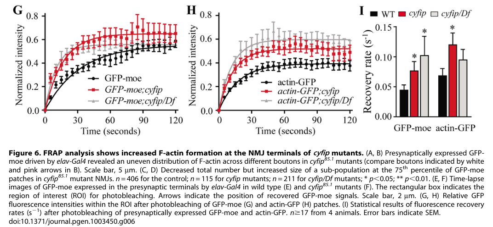

## Question

# Gene Research for Functional Annotation

## ⚠️ CRITICAL: Gene/Protein Identification Context

**BEFORE YOU BEGIN RESEARCH:** You MUST verify you are researching the CORRECT gene/protein. Gene symbols can be ambiguous, especially for less well-characterized genes from non-model organisms.

### Target Gene/Protein Identity (from UniProt):
- **UniProt Accession:** Q9VF87
- **Protein Description:** RecName: Full=Cytoplasmic FMR1-interacting protein {ECO:0000303|PubMed:11438699}; AltName: Full=Specifically Rac1-associated protein 1 {ECO:0000303|Ref.2};
- **Gene Information:** Name=Cyfip {ECO:0000303|PubMed:11438699}; Synonyms=Sra-1 {ECO:0000312|EMBL:AAF55173.1, ECO:0000312|FlyBase:FBgn0038320}; ORFNames=CG4931 {ECO:0000312|FlyBase:FBgn0038320};
- **Organism (full):** Drosophila melanogaster (Fruit fly).
- **Protein Family:** Belongs to the CYFIP family. .
- **Key Domains:** CYRIA/CYRIB_Rac1-bd. (IPR009828); Cytoplasmic_FMR1-int. (IPR008081); CYRIA-B_Rac1-bd (PF07159); FragX_IP (PF05994)

### MANDATORY VERIFICATION STEPS:

1. **Check if the gene symbol "Cyfip" matches the protein description above**
2. **Verify the organism is correct:** Drosophila melanogaster (Fruit fly).
3. **Check if protein family/domains align with what you find in literature**
4. **If you find literature for a DIFFERENT gene with the same or similar symbol, STOP**

### If Gene Symbol is Ambiguous or You Cannot Find Relevant Literature:

**DO NOT PROCEED WITH RESEARCH ON A DIFFERENT GENE.** Instead:
- State clearly: "The gene symbol 'Cyfip' is ambiguous or literature is limited for this specific protein"
- Explain what you found (e.g., "Found extensive literature on a different gene with the same symbol in a different organism")
- Describe the protein based ONLY on the UniProt information provided above
- Suggest that the protein function can be inferred from domain/family information

### Research Target:

Please provide a comprehensive research report on the gene **Cyfip** (gene ID: Cyfip, UniProt: Q9VF87) in DROME.

The research report should be a detailed narrative explaining the function, biological processes, and localization of the gene product. Citations should be given for all claims.

You should prioritize authoritative reviews and primary scientific literature when conducting research. You can supplement
this with annotations you find in gene/protein databases, but these can be outdated or inaccurate.

We are specifically interested in the primary function of the gene - for enzymes, what reaction is catalyzed, and what is the substrate specificity? For transporters, what is the substrate? For structural proteins or adapters, what is the broader structural role? For signaling molecules, what is the role in the pathway.

We are interested in where in or outside the cell the gene product carries out its function.

We are also interested in the signaling or biochemical pathways in which the gene functions. We are less interested in broad pleiotropic effects, except where these elucidate the precise role.

Include evidence where possible. We are interested in both experimental evidence as well as inference from structure, evolution, or bioinformatic analysis. Precise studies should be prioritized over high-throughput, where available.

## Output

Question: You are an expert researcher providing comprehensive, well-cited information.

Provide detailed information focusing on:
1. Key concepts and definitions with current understanding
2. Recent developments and latest research (prioritize 2023-2024 sources)
3. Current applications and real-world implementations
4. Expert opinions and analysis from authoritative sources
5. Relevant statistics and data from recent studies

Format as a comprehensive research report with proper citations. Include URLs and publication dates where available.
Always prioritize recent, authoritative sources and provide specific citations for all major claims.

# Gene Research for Functional Annotation

## ⚠️ CRITICAL: Gene/Protein Identification Context

**BEFORE YOU BEGIN RESEARCH:** You MUST verify you are researching the CORRECT gene/protein. Gene symbols can be ambiguous, especially for less well-characterized genes from non-model organisms.

### Target Gene/Protein Identity (from UniProt):
- **UniProt Accession:** Q9VF87
- **Protein Description:** RecName: Full=Cytoplasmic FMR1-interacting protein {ECO:0000303|PubMed:11438699}; AltName: Full=Specifically Rac1-associated protein 1 {ECO:0000303|Ref.2};
- **Gene Information:** Name=Cyfip {ECO:0000303|PubMed:11438699}; Synonyms=Sra-1 {ECO:0000312|EMBL:AAF55173.1, ECO:0000312|FlyBase:FBgn0038320}; ORFNames=CG4931 {ECO:0000312|FlyBase:FBgn0038320};
- **Organism (full):** Drosophila melanogaster (Fruit fly).
- **Protein Family:** Belongs to the CYFIP family. .
- **Key Domains:** CYRIA/CYRIB_Rac1-bd. (IPR009828); Cytoplasmic_FMR1-int. (IPR008081); CYRIA-B_Rac1-bd (PF07159); FragX_IP (PF05994)

### MANDATORY VERIFICATION STEPS:

1. **Check if the gene symbol "Cyfip" matches the protein description above**
2. **Verify the organism is correct:** Drosophila melanogaster (Fruit fly).
3. **Check if protein family/domains align with what you find in literature**
4. **If you find literature for a DIFFERENT gene with the same or similar symbol, STOP**

### If Gene Symbol is Ambiguous or You Cannot Find Relevant Literature:

**DO NOT PROCEED WITH RESEARCH ON A DIFFERENT GENE.** Instead:
- State clearly: "The gene symbol 'Cyfip' is ambiguous or literature is limited for this specific protein"
- Explain what you found (e.g., "Found extensive literature on a different gene with the same symbol in a different organism")
- Describe the protein based ONLY on the UniProt information provided above
- Suggest that the protein function can be inferred from domain/family information

### Research Target:

Please provide a comprehensive research report on the gene **Cyfip** (gene ID: Cyfip, UniProt: Q9VF87) in DROME.

The research report should be a detailed narrative explaining the function, biological processes, and localization of the gene product. Citations should be given for all claims.

You should prioritize authoritative reviews and primary scientific literature when conducting research. You can supplement
this with annotations you find in gene/protein databases, but these can be outdated or inaccurate.

We are specifically interested in the primary function of the gene - for enzymes, what reaction is catalyzed, and what is the substrate specificity? For transporters, what is the substrate? For structural proteins or adapters, what is the broader structural role? For signaling molecules, what is the role in the pathway.

We are interested in where in or outside the cell the gene product carries out its function.

We are also interested in the signaling or biochemical pathways in which the gene functions. We are less interested in broad pleiotropic effects, except where these elucidate the precise role.

Include evidence where possible. We are interested in both experimental evidence as well as inference from structure, evolution, or bioinformatic analysis. Precise studies should be prioritized over high-throughput, where available.

# Functional annotation of *Drosophila melanogaster Cyfip* (UniProt Q9VF87)

## Identity and principal function

**The target is fly Cyfip, also called Sra-1, not a human *CYFIP1* or *CYFIP2* gene.** The supplied UniProt record assigns Q9VF87 to *D. melanogaster* Cyfip/Sra-1, with CG4931 as an ORF name and CYFIP-family and Rac1-binding/CYFIP-related domain annotations. The primary fly literature independently calls the protein CYFIP/Sra-1 and identifies **one fly CYFIP ortholog** of the two vertebrate proteins; it reports approximately **67% protein identity** with the human homologs. The accession and CG4931 alias are taken from the supplied record rather than independently confirmed in the retrieved papers. (schenck2003cyfipsra1controlsneuronal pages 1-2, zhao2013drosophilacyfipregulates pages 1-2)

**Primary annotation:** Cyfip is a **nonenzymatic, cytoplasmic signaling and structural-regulatory subunit** of the five-protein SCAR/WAVE regulatory complex (WRC). It couples activated Rac GTPase to spatial control of the SCAR/WAVE–Arp2/3 pathway, which builds branched actin networks. The fly complex comprises Cyfip/Sra-1, SCAR/WAVE, Kette/Nap1, Abi and HSPC300. Cyfip also binds the translational regulator dFMR1, although its best-resolved fly mechanism is regulation of SCAR-dependent actin dynamics. Cyfip does **not** itself catalyze actin nucleation: the WAVE subunit stimulates Arp2/3, which nucleates branched filaments. Accordingly, there is no catalytic reaction or transporter substrate to assign to Cyfip. (kunda2003abisra1and pages 1-2, chen2010structureandcontrol pages 1-3, schenck2003cyfipsra1controlsneuronal pages 5-7, qurashi2007hspc300andits pages 1-2)

## Molecular mechanism and pathways

Biochemical experiments in fly S2 cells found endogenous Cyfip associated with **constitutively active dRac1-V12, but not dominant-negative dRac1-N17**. GST pull-down experiments showed binding between fly Cyfip fragments and dFMR1, and endogenous Cyfip co-immunoprecipitated with dFMR1. dFMR1 was not detected in the dRac1-V12–Cyfip precipitate in that experiment, suggesting—but not proving—that Rac-associated and FMR1-associated Cyfip can reside in different complexes. These results establish an activity-dependent Rac interaction and a separate physical FMR1 interaction for the *fly* protein. (schenck2003cyfipsra1controlsneuronal pages 5-7)

Cyfip has a **context-dependent dual effect on WAVE signaling**, rather than being simply an activator or inhibitor. In cultured fly cells, depletion of Sra-1, Kette or Abi reduced SCAR protein by roughly **90%**, with impaired localization and loss of normal actin-rich protrusions; proteasome inhibition partly restored SCAR abundance. Thus the assembled WRC protects and positions SCAR. Conversely, at larval neuromuscular junctions (NMJs), loss of Cyfip **accelerated F-actin assembly**; reducing *SCAR* gene dosage partly corrected the excess actin assembly, bouton phenotype and transmission defect. In this setting Cyfip restrains inappropriate SCAR activity. These experimentally distinct observations should not be collapsed into a universal claim that Cyfip always promotes—or always suppresses—polymerization. (kunda2003abisra1and pages 1-2, kunda2003abisra1and pages 3-5, zhao2013drosophilacyfipregulates pages 7-9, zhao2013drosophilacyfipregulates pages 9-12)

Structural work on a reconstituted **mammalian**, not fly, WRC resolved an approximately **400-kDa** pentamer at **2.3 Å** and showed how CYFIP-associated contacts sequester WAVE’s actin/Arp2/3-activating VCA region. A 2023 expert review describes distinct Rac-binding sites on mammalian CYFIP: engagement of an A site favors allosteric exposure of the WAVE activation region, while a D site can facilitate cooperation with Arf1. This is a useful conserved mechanistic model for interpreting fly Rac–Cyfip–SCAR results, **not proof that those individual binding-site or Arf1 mechanisms have been demonstrated for Q9VF87**. The intact-complex, allosteric model also cautions against assuming that activation must physically dissociate WAVE from the other subunits. (chen2010structureandcontrol pages 1-3, han2023orchestrationofsynaptic pages 1-2)

The physical dFMR1 interaction connects Cyfip to pathways controlling neuronal growth and protein expression. Fly genetics show opposing effects of the two proteins on NMJ growth: in a 2017 double-mutant experiment, mean NMJ lengths were **69.8 µm** in *Cyfip* mutants, **134.6 µm** in *dFMR1* mutants and **107.8 µm** in double mutants, with more than 30 NMJs assessed per condition. This supports functional antagonism but does not, by itself, demonstrate that fly Cyfip directly represses translation of a particular dFMR1-bound mRNA. Likewise, a proposed CYFIP–eIF4E translational-initiation mechanism largely derives from mammalian work; recent fly experiments establish additional dFMRP–miRISC-dependent translational repression **without directly testing Cyfip**. Mammalian CYFIP1 findings should therefore not be assigned to fly Q9VF87 as experimentally established facts. (schenck2003cyfipsra1controlsneuronal pages 5-7, abekhoukh2017newinsightsinto pages 6-8, abekhoukh2017newinsightsinto pages 3-6, kaul2024fmrpcooperateswith pages 1-2)

## Sites of action and experimentally resolved biological roles

Cyfip is **intracellular**. In embryos, it is detectable in the developing central nervous system, becomes concentrated along central axon commissures and longitudinal connectives, and occurs at motor-axon terminals during initial synaptogenesis. The transcript is present through development and in ovaries; maternal Cyfip contributes approximately **10–15%** of wild-type embryonic protein measured in zygotic-null embryos, helping explain why a zygotic mutation may underestimate early requirements. Cyfip was also detected in fly cultured cells and in some embryonic non-neural structures. Its WRC role places relevant activity at actin-rich cell cortices and neural terminals; these observations do **not** support an extracellular or secreted primary function. (schenck2003cyfipsra1controlsneuronal pages 2-3, schenck2003cyfipsra1controlsneuronal pages 5-7)

**Axon wiring.** In the original fly loss-of-function study, **79% of approximately 150** Cyfip-null embryos exhibited abnormal midline axon crossing; motor-axon growth and branching were also affected. Neuronal Cyfip re-expression lowered the midline-crossing frequency to **10%**, supporting a neuronal requirement rather than merely an association with malformed tissue. Removing both maternal and zygotic Cyfip caused stronger nervous-system disruption and embryonic lethality. (schenck2003cyfipsra1controlsneuronal pages 3-4, schenck2003cyfipsra1controlsneuronal pages 4-5, schenck2003cyfipsra1controlsneuronal pages 5-7)

**Synaptic structure, actin and vesicle cycling.** In a 2013 fly NMJ study, *cyfip* null terminals were approximately **50% shorter** than controls and developed about **15-fold more satellite boutons** under that study’s assay conditions. Live F-actin reporters showed faster recovery after photobleaching; for GFP-moesin, fluorescence at 20 seconds recovered to **43.1%** of baseline in mutants versus **35.1%** in controls. The cropped experimental figure independently shows the direction of this FRAP difference. These measurements indicate altered **actin dynamics**, not necessarily a sustained increase in total F-actin, which varied with cellular setting. (zhao2013drosophilacyfipregulates pages 2-3, zhao2013drosophilacyfipregulates pages 4-7, zhao2013drosophilacyfipregulates pages 9-12, zhao2013drosophilacyfipregulates media 12fa6feb)

The same mutants had synaptic vesicles of approximately **19.8% larger mean diameter**, accumulated large presynaptic cisternae and showed defective maintenance of neurotransmission. During **10-Hz stimulation for 10 minutes**, evoked junctional-potential amplitude declined to **24.8%** of its initial value in mutants versus **65.4%** in controls; mutant miniature responses were approximately **40% larger**, while calculated quantal content was **35% lower**. These findings strongly implicate Cyfip-dependent actin organization in vesicle recycling and synaptic function. Nevertheless, FM1-43 dye uptake was reported as normal: the precise endocytic step affected, and whether Cyfip acts directly on endocytic machinery, remain unresolved. (zhao2013drosophilacyfipregulates pages 2-3, zhao2013drosophilacyfipregulates pages 3-4, zhao2013drosophilacyfipregulates pages 12-13)

**BMP signaling downstream of trafficking.** Mutant NMJs displayed increased phosphorylated Mad, a readout of retrograde bone-morphogenetic-protein signaling. Reducing the dosage of either *mad* or the BMP receptor *tkv* suppressed excess satellite-bouton formation. The supported pathway-level interpretation is that disrupted Cyfip-dependent cortical actin and membrane trafficking fail to constrain growth-promoting BMP signaling; receptor internalization by Cyfip itself was not directly established. Subsequent fly work places the broader Abi–Rac–SCAR machinery in BMP-receptor macropinocytosis, consistent with—but not a substitute for—direct Cyfip-specific mechanistic tests. (zhao2013drosophilacyfipregulates pages 3-4, zhao2013drosophilacyfipregulates pages 7-9, zhao2013drosophilacyfipregulates pages 12-13)

The following table collects the main **fly-specific primary observations** and keeps measurements from different experimental protocols separate. (schenck2003cyfipsra1controlsneuronal pages 4-5, zhao2013drosophilacyfipregulates pages 2-3, zhao2013drosophilacyfipregulates pages 3-4, chaudhari2024ahumandcc pages 8-9, calvary2024tricellularjunctionrecruitment pages 4-6)

| Study and setting | Primary observation | Functional interpretation | Citation |
|---|---|---|---|
| Schenck et al. (2003), fly S2 cells; Kunda et al. (2003), S2R/UC88 cells | Endogenous Cyfip associated with active dRac1-V12 but not dominant-negative dRac1-N17; GST pull-down and co-immunoprecipitation demonstrated binding to dFMR1. Separately, Sra1 RNAi reduced SCAR protein by approximately 90% and abolished normal actin-rich protrusions. | Cyfip is an activity-dependent Rac1 effector and dFMR1-binding adaptor; as a WRC subunit, it stabilizes/localizes SCAR and enables Rac–SCAR–Arp2/3 protrusive signaling. | (schenck2003cyfipsra1controlsneuronal pages 5-7, kunda2003abisra1and pages 1-2, kunda2003abisra1and pages 3-5) |
| Zhao et al. (2013), larval neuromuscular junction | *cyfip* null NMJs were approximately 50% shorter and had a 15-fold increase in satellite boutons. At 20 s after GFP-moesin photobleaching, fluorescence recovered to 43.1% in mutants versus 35.1% in wild type. | Cyfip restrains the rate and spatial distribution of synaptic F-actin assembly, thereby controlling bouton formation and terminal growth. | (zhao2013drosophilacyfipregulates pages 2-3, zhao2013drosophilacyfipregulates pages 4-7, zhao2013drosophilacyfipregulates media 12fa6feb) |
| Zhao et al. (2013), NMJ electrophysiology, ultrastructure and BMP signaling | After 10-Hz stimulation for 10 min, mutant EJP amplitude fell to 24.8% of its initial value versus 65.4% in wild type; synaptic vesicles were approximately 19.8% larger, cisternae accumulated, and synaptic pMad was elevated. | Cyfip-dependent actin regulation supports synaptic-vesicle recycling/endocytosis and limits BMP growth signaling; its loss compromises sustained neurotransmission. | (zhao2013drosophilacyfipregulates pages 3-4, zhao2013drosophilacyfipregulates pages 4-7, zhao2013drosophilacyfipregulates pages 12-13) |
| Chaudhari et al. (2024), embryonic commissural neurons | EW axons failed to cross the midline in 18% of segments in *fra4/fra6* hypomorphs, rising to almost 80% when *cyfip* was also removed; *cyfip* mutants alone showed no EW non-crossing defect, likely because of maternal protein. | Cyfip-containing WRC genetically promotes Frazzled/netrin-dependent midline attraction, although severe *cyfip; fra* null development indicates additional Fra-independent functions. | (chaudhari2024ahumandcc pages 8-9) |
| Calvary et al. (2024 preprint), ovarian follicular epithelium | *Cyfip* or *SCAR* null clones accumulated approximately threefold more four-way vertices than wild-type cells and developed rosettes that were nearly absent from controls. | The Cyfip-containing WRC promotes branched-actin protrusions needed to resolve cell intercalation and elongate newly formed epithelial junctions; this evidence remains pre-peer-review. | (calvary2024tricellularjunctionrecruitment pages 1-4, calvary2024tricellularjunctionrecruitment pages 4-6, calvary2024tricellularjunctionrecruitment pages 6-8) |

*Table: Fly primary-data evidence linking Cyfip to Rac1/dFMR1 interactions, WRC stability, synaptic actin dynamics and endocytosis, axon guidance, and epithelial morphogenesis. Quantitative results are kept specific to each study’s experimental protocol.*

## Developments in 2023–2024

**An experimentally specified axon-guidance input emerged in 2024.** Chaudhari and colleagues found that the cytoplasmic **WRC-interacting receptor sequence (WIRS)** of fly Frazzled—the netrin receptor homolog—binds purified fly WRC and is needed for efficient attractive axon guidance. The study directly tested *cyfip* genetics: Eagle-neuron axons failed to cross in **18%** of segments in a *fra* hypomorphic background, but in **almost 80%** when Cyfip was also removed. Removing one *cyfip* copy also increased non-crossing in a sensitized dominant-negative *fra* background from **33% to 49%**. These findings support participation of Cyfip-containing WRC in **netrin–Frazzled signaling**. They do not establish that Cyfip binds Frazzled individually: receptor binding was measured for the **complex**, and severe developmental defects prevented analysis of *cyfip; fra* double-null embryos at the relevant guidance stage. (chaudhari2024ahumandcc pages 6-8, chaudhari2024ahumandcc pages 8-9)

**A non-neuronal site was described in a June 2024 preprint.** In ovarian follicular epithelium, null clones for *Cyfip* or *SCAR* accumulated approximately **three times as many four-way junctional vertices** as wild-type tissue, along with abnormal rosettes. The study located WRC-associated SCAR and Abi at **tricellular junctions**, observed SCAR at the front of short-lived actin-rich protrusions, and found that loss of both Sidekick and Lar prevented WRC recruitment there. This supports a role for fly Cyfip-containing WRC in local branched-actin protrusions that resolve cell intercalation and facilitate epithelial elongation. **The localization measurements directly tracked other WRC subunits, not Cyfip itself, and this report was a preprint rather than peer-reviewed evidence in the retrieved version.** (calvary2024tricellularjunctionrecruitment pages 1-4, calvary2024tricellularjunctionrecruitment pages 4-6, calvary2024tricellularjunctionrecruitment pages 6-8, calvary2024tricellularjunctionrecruitment pages 8-11)

**Expert synthesis in 2023** emphasized the WRC as a signal-integration apparatus linking receptors, small GTPases and membrane cues to Arp2/3-mediated neuronal actin remodeling. It provides a framework for interpreting the original fly experiments, but the most detailed CYFIP1-binding-site conclusions in that review come from other experimental systems. The fly Cyfip–dFMR1 connection remains established at the physical-interaction and genetic levels, while the exact molecular mechanism linking those interactions to specific translation targets remains less certain. (schenck2003cyfipsra1controlsneuronal pages 5-7, abekhoukh2017newinsightsinto pages 3-6, han2023orchestrationofsynaptic pages 1-2)

## Evidence assessment and research use

The **highest-confidence functional assignment** is an intracellular Rac-responsive WRC adaptor/regulator that controls SCAR availability and the timing and placement of Arp2/3-dependent branched actin assembly. Direct fly interaction experiments, loss-of-function phenotypes, neuronal rescue and *SCAR* dosage suppression converge on that assignment. Its demonstrated outputs encompass axon guidance, NMJ maturation and sustained synaptic performance; WRC-mediated epithelial intercalation is a promising additional setting with preprint-level Cyfip-specific evidence. Fly loss-of-function and rescue provide a practical experimental model for dissecting conserved neural actin regulation, but human neurodevelopmental-disease associations of *CYFIP1/2* are **ortholog-based context**, not evidence that fly Q9VF87 itself is a human disease gene or an established therapeutic target. (kunda2003abisra1and pages 1-2, schenck2003cyfipsra1controlsneuronal pages 4-5, zhao2013drosophilacyfipregulates pages 7-9, schenck2003cyfipsra1controlsneuronal pages 5-7, chaudhari2024ahumandcc pages 8-9, calvary2024tricellularjunctionrecruitment pages 4-6)

### Principal sources and publication links

- Schenck *et al.*, **19 June 2003**, *Neuron*, “CYFIP/Sra-1 Controls Neuronal Connectivity in Drosophila and Links the Rac1 GTPase Pathway to the Fragile X Protein.” https://doi.org/10.1016/S0896-6273(03)00354-4. (schenck2003cyfipsra1controlsneuronal pages 1-2, schenck2003cyfipsra1controlsneuronal pages 5-7)
- Kunda *et al.*, **28 October 2003**, *Current Biology*, “Abi, Sra1, and Kette Control the Stability and Localization of SCAR/WAVE.” https://doi.org/10.1016/j.cub.2003.10.005. (kunda2003abisra1and pages 1-2, kunda2003abisra1and pages 3-5)
- Qurashi *et al.*, **25 September 2007**, *Neural Development*, “HSPC300 and its role in neuronal connectivity.” https://doi.org/10.1186/1749-8104-2-18. (qurashi2007hspc300andits pages 1-2)
- Chen *et al.*, **25 November 2010**, *Nature*, “Structure and Control of the Actin Regulatory WAVE Complex”; **mammalian structural context**. https://doi.org/10.1038/nature09623. (chen2010structureandcontrol pages 1-3)
- Zhao *et al.*, **4 April 2013**, *PLOS Genetics*, “Drosophila cyfip Regulates Synaptic Development and Endocytosis by Suppressing Filamentous Actin Assembly.” https://doi.org/10.1371/journal.pgen.1003450. (zhao2013drosophilacyfipregulates pages 1-2, zhao2013drosophilacyfipregulates pages 3-4)
- Abekhoukh *et al.*, **April 2017**, *Disease Models & Mechanisms*, “New insights into the regulatory function of CYFIP1 in the context of WAVE- and FMRP-containing complexes”; includes **fly genetic experiments**. https://doi.org/10.1242/dmm.025809. (abekhoukh2017newinsightsinto pages 6-8, abekhoukh2017newinsightsinto pages 3-6)
- Han and Ko, **June 2023**, *Experimental & Molecular Medicine*, “Orchestration of synaptic functions by WAVE regulatory complex-mediated actin reorganization”; **review**. https://doi.org/10.1038/s12276-023-01004-1. (han2023orchestrationofsynaptic pages 1-2)
- Chaudhari *et al.*, **October 2024**, *Science Signaling*, “A human DCC variant causing mirror movement disorder reveals that the WAVE regulatory complex mediates axon guidance by netrin-1–DCC”; includes **direct fly *cyfip* genetic tests**. https://doi.org/10.1126/scisignal.adk2345. (chaudhari2024ahumandcc pages 1-3, chaudhari2024ahumandcc pages 8-9)
- Calvary *et al.*, **28 June 2024**, *bioRxiv preprint*, “Tricellular junction recruitment of the Wave regulatory complex by Sidekick and Lar induces protrusive activity resolving cell intercalation.” https://doi.org/10.1101/2024.06.28.599016. (calvary2024tricellularjunctionrecruitment pages 1-4, calvary2024tricellularjunctionrecruitment pages 4-6)

References

1. (schenck2003cyfipsra1controlsneuronal pages 1-2): Annette Schenck, Barbara Bardoni, Caillin Langmann, Nicholas Harden, Jean-Louis Mandel, and Angela Giangrande. Cyfip/sra-1 controls neuronal connectivity in drosophila and links the rac1 gtpase pathway to the fragile x protein. Neuron, 38:887-898, Jun 2003. URL: https://doi.org/10.1016/s0896-6273(03)00354-4, doi:10.1016/s0896-6273(03)00354-4. This article has 383 citations and is from a highest quality peer-reviewed journal.

2. (zhao2013drosophilacyfipregulates pages 1-2): Lu Zhao, Dan Wang, Qifu Wang, Avital A. Rodal, and Yong Q. Zhang. Drosophila cyfip regulates synaptic development and endocytosis by suppressing filamentous actin assembly. PLoS Genetics, 9:e1003450, Apr 2013. URL: https://doi.org/10.1371/journal.pgen.1003450, doi:10.1371/journal.pgen.1003450. This article has 80 citations and is from a domain leading peer-reviewed journal.

3. (kunda2003abisra1and pages 1-2): Patricia Kunda, Gavin Craig, Veronica Dominguez, and Buzz Baum. Abi, sra1, and kette control the stability and localization of scar/wave to regulate the formation of actin-based protrusions. Current Biology, 13:1867-1875, Oct 2003. URL: https://doi.org/10.1016/j.cub.2003.10.005, doi:10.1016/j.cub.2003.10.005. This article has 425 citations and is from a highest quality peer-reviewed journal.

4. (chen2010structureandcontrol pages 1-3): Zhucheng Chen, D. Borek, S. Padrick, T. Gomez, Zoltan Metlagel, A. Ismail, Junko Umetani, D. Billadeau, Z. Otwinowski, and M. Rosen. Structure and control of the actin regulatory wave complex. ArXiv, Dec 2010. URL: https://doi.org/10.2210/pdb3p8c/pdb, doi:10.2210/pdb3p8c/pdb. This article has 641 citations.

5. (schenck2003cyfipsra1controlsneuronal pages 5-7): Annette Schenck, Barbara Bardoni, Caillin Langmann, Nicholas Harden, Jean-Louis Mandel, and Angela Giangrande. Cyfip/sra-1 controls neuronal connectivity in drosophila and links the rac1 gtpase pathway to the fragile x protein. Neuron, 38:887-898, Jun 2003. URL: https://doi.org/10.1016/s0896-6273(03)00354-4, doi:10.1016/s0896-6273(03)00354-4. This article has 383 citations and is from a highest quality peer-reviewed journal.

6. (qurashi2007hspc300andits pages 1-2): A. Qurashi, A. Qurashi, H. B. Şahin, Pilar Carrera, Pilar Carrera, A. Gautreau, Annette Schenck, Annette Schenck, and A. Giangrande. Hspc300 and its role in neuronal connectivity. Neural Development, 2:18-18, Sep 2007. URL: https://doi.org/10.1186/1749-8104-2-18, doi:10.1186/1749-8104-2-18. This article has 42 citations and is from a peer-reviewed journal.

7. (kunda2003abisra1and pages 3-5): Patricia Kunda, Gavin Craig, Veronica Dominguez, and Buzz Baum. Abi, sra1, and kette control the stability and localization of scar/wave to regulate the formation of actin-based protrusions. Current Biology, 13:1867-1875, Oct 2003. URL: https://doi.org/10.1016/j.cub.2003.10.005, doi:10.1016/j.cub.2003.10.005. This article has 425 citations and is from a highest quality peer-reviewed journal.

8. (zhao2013drosophilacyfipregulates pages 7-9): Lu Zhao, Dan Wang, Qifu Wang, Avital A. Rodal, and Yong Q. Zhang. Drosophila cyfip regulates synaptic development and endocytosis by suppressing filamentous actin assembly. PLoS Genetics, 9:e1003450, Apr 2013. URL: https://doi.org/10.1371/journal.pgen.1003450, doi:10.1371/journal.pgen.1003450. This article has 80 citations and is from a domain leading peer-reviewed journal.

9. (zhao2013drosophilacyfipregulates pages 9-12): Lu Zhao, Dan Wang, Qifu Wang, Avital A. Rodal, and Yong Q. Zhang. Drosophila cyfip regulates synaptic development and endocytosis by suppressing filamentous actin assembly. PLoS Genetics, 9:e1003450, Apr 2013. URL: https://doi.org/10.1371/journal.pgen.1003450, doi:10.1371/journal.pgen.1003450. This article has 80 citations and is from a domain leading peer-reviewed journal.

10. (han2023orchestrationofsynaptic pages 1-2): Kyung Ah Han and Jaewon Ko. Orchestration of synaptic functions by wave regulatory complex-mediated actin reorganization. Experimental & Molecular Medicine, 55:1065-1075, Jun 2023. URL: https://doi.org/10.1038/s12276-023-01004-1, doi:10.1038/s12276-023-01004-1. This article has 43 citations and is from a peer-reviewed journal.

11. (abekhoukh2017newinsightsinto pages 6-8): Sabiha Abekhoukh, H Bahar Sahin, Mauro Grossi, Samantha Zongaro, Thomas Maurin, Irene Madrigal, Daniele Kazue-Sugioka, Annick Raas-Rothschild, Mohamed Doulazmi, Pilar Carrera, Andrea Stachon, Steven Scherer, Maria Rita Drula Do Nascimento, Alain Trembleau, Ignacio Arroyo, Szatmari Peter, Isabel M. Smith, Montserrat Milà, Adam C. Smith, Angela Giangrande, Isabelle Caillé, and Barbara Bardoni. New insights into the regulatory function of cyfip1 in the context of wave- and fmrp-containing complexes. Disease Models & Mechanisms, 10:463-474, Apr 2017. URL: https://doi.org/10.1242/dmm.025809, doi:10.1242/dmm.025809. This article has 87 citations and is from a domain leading peer-reviewed journal.

12. (abekhoukh2017newinsightsinto pages 3-6): Sabiha Abekhoukh, H Bahar Sahin, Mauro Grossi, Samantha Zongaro, Thomas Maurin, Irene Madrigal, Daniele Kazue-Sugioka, Annick Raas-Rothschild, Mohamed Doulazmi, Pilar Carrera, Andrea Stachon, Steven Scherer, Maria Rita Drula Do Nascimento, Alain Trembleau, Ignacio Arroyo, Szatmari Peter, Isabel M. Smith, Montserrat Milà, Adam C. Smith, Angela Giangrande, Isabelle Caillé, and Barbara Bardoni. New insights into the regulatory function of cyfip1 in the context of wave- and fmrp-containing complexes. Disease Models & Mechanisms, 10:463-474, Apr 2017. URL: https://doi.org/10.1242/dmm.025809, doi:10.1242/dmm.025809. This article has 87 citations and is from a domain leading peer-reviewed journal.

13. (kaul2024fmrpcooperateswith pages 1-2): Navneeta Kaul, Sarala J. Pradhan, Nathan G. Boin, Madeleine M. Mason, Julian Rosales, Emily L. Starke, Emily C. Wilkinson, Erich G. Chapman, and Scott A. Barbee. Fmrp cooperates with mirisc components to repress translation and regulate neurite morphogenesis in <i>drosophila</i>. RNA Biology, 21:859-870, Aug 2024. URL: https://doi.org/10.1080/15476286.2024.2392304, doi:10.1080/15476286.2024.2392304. This article has 2 citations and is from a peer-reviewed journal.

14. (schenck2003cyfipsra1controlsneuronal pages 2-3): Annette Schenck, Barbara Bardoni, Caillin Langmann, Nicholas Harden, Jean-Louis Mandel, and Angela Giangrande. Cyfip/sra-1 controls neuronal connectivity in drosophila and links the rac1 gtpase pathway to the fragile x protein. Neuron, 38:887-898, Jun 2003. URL: https://doi.org/10.1016/s0896-6273(03)00354-4, doi:10.1016/s0896-6273(03)00354-4. This article has 383 citations and is from a highest quality peer-reviewed journal.

15. (schenck2003cyfipsra1controlsneuronal pages 3-4): Annette Schenck, Barbara Bardoni, Caillin Langmann, Nicholas Harden, Jean-Louis Mandel, and Angela Giangrande. Cyfip/sra-1 controls neuronal connectivity in drosophila and links the rac1 gtpase pathway to the fragile x protein. Neuron, 38:887-898, Jun 2003. URL: https://doi.org/10.1016/s0896-6273(03)00354-4, doi:10.1016/s0896-6273(03)00354-4. This article has 383 citations and is from a highest quality peer-reviewed journal.

16. (schenck2003cyfipsra1controlsneuronal pages 4-5): Annette Schenck, Barbara Bardoni, Caillin Langmann, Nicholas Harden, Jean-Louis Mandel, and Angela Giangrande. Cyfip/sra-1 controls neuronal connectivity in drosophila and links the rac1 gtpase pathway to the fragile x protein. Neuron, 38:887-898, Jun 2003. URL: https://doi.org/10.1016/s0896-6273(03)00354-4, doi:10.1016/s0896-6273(03)00354-4. This article has 383 citations and is from a highest quality peer-reviewed journal.

17. (zhao2013drosophilacyfipregulates pages 2-3): Lu Zhao, Dan Wang, Qifu Wang, Avital A. Rodal, and Yong Q. Zhang. Drosophila cyfip regulates synaptic development and endocytosis by suppressing filamentous actin assembly. PLoS Genetics, 9:e1003450, Apr 2013. URL: https://doi.org/10.1371/journal.pgen.1003450, doi:10.1371/journal.pgen.1003450. This article has 80 citations and is from a domain leading peer-reviewed journal.

18. (zhao2013drosophilacyfipregulates pages 4-7): Lu Zhao, Dan Wang, Qifu Wang, Avital A. Rodal, and Yong Q. Zhang. Drosophila cyfip regulates synaptic development and endocytosis by suppressing filamentous actin assembly. PLoS Genetics, 9:e1003450, Apr 2013. URL: https://doi.org/10.1371/journal.pgen.1003450, doi:10.1371/journal.pgen.1003450. This article has 80 citations and is from a domain leading peer-reviewed journal.

19. (zhao2013drosophilacyfipregulates media 12fa6feb): Lu Zhao, Dan Wang, Qifu Wang, Avital A. Rodal, and Yong Q. Zhang. Drosophila cyfip regulates synaptic development and endocytosis by suppressing filamentous actin assembly. PLoS Genetics, 9:e1003450, Apr 2013. URL: https://doi.org/10.1371/journal.pgen.1003450, doi:10.1371/journal.pgen.1003450. This article has 80 citations and is from a domain leading peer-reviewed journal.

20. (zhao2013drosophilacyfipregulates pages 3-4): Lu Zhao, Dan Wang, Qifu Wang, Avital A. Rodal, and Yong Q. Zhang. Drosophila cyfip regulates synaptic development and endocytosis by suppressing filamentous actin assembly. PLoS Genetics, 9:e1003450, Apr 2013. URL: https://doi.org/10.1371/journal.pgen.1003450, doi:10.1371/journal.pgen.1003450. This article has 80 citations and is from a domain leading peer-reviewed journal.

21. (zhao2013drosophilacyfipregulates pages 12-13): Lu Zhao, Dan Wang, Qifu Wang, Avital A. Rodal, and Yong Q. Zhang. Drosophila cyfip regulates synaptic development and endocytosis by suppressing filamentous actin assembly. PLoS Genetics, 9:e1003450, Apr 2013. URL: https://doi.org/10.1371/journal.pgen.1003450, doi:10.1371/journal.pgen.1003450. This article has 80 citations and is from a domain leading peer-reviewed journal.

22. (chaudhari2024ahumandcc pages 8-9): Karina Chaudhari, Kaiyue Zhang, Patricia T. Yam, Yixin Zang, Daniel A. Kramer, Sarah Gagnon, Sabrina Schlienger, Sara Calabretta, Jean-Francois Michaud, Meagan Collins, Junmei Wang, Myriam Srour, Baoyu Chen, Frédéric Charron, and Greg J. Bashaw. A human dcc variant causing mirror movement disorder reveals that the wave regulatory complex mediates axon guidance by netrin-1–dcc. Science Signaling, Oct 2024. URL: https://doi.org/10.1126/scisignal.adk2345, doi:10.1126/scisignal.adk2345. This article has 5 citations and is from a domain leading peer-reviewed journal.

23. (calvary2024tricellularjunctionrecruitment pages 4-6): Lisa Calvary, Hervé Alégot, Pierre Pouchin, Graziella Richard, Caroline Vachias, and Vincent Mirouse. Tricellular junction recruitment of the wave regulatory complex by sidekick and lar induces protrusive activity resolving cell intercalation. bioRxiv, Jun 2024. URL: https://doi.org/10.1101/2024.06.28.599016, doi:10.1101/2024.06.28.599016. This article has 2 citations.

24. (calvary2024tricellularjunctionrecruitment pages 1-4): Lisa Calvary, Hervé Alégot, Pierre Pouchin, Graziella Richard, Caroline Vachias, and Vincent Mirouse. Tricellular junction recruitment of the wave regulatory complex by sidekick and lar induces protrusive activity resolving cell intercalation. bioRxiv, Jun 2024. URL: https://doi.org/10.1101/2024.06.28.599016, doi:10.1101/2024.06.28.599016. This article has 2 citations.

25. (calvary2024tricellularjunctionrecruitment pages 6-8): Lisa Calvary, Hervé Alégot, Pierre Pouchin, Graziella Richard, Caroline Vachias, and Vincent Mirouse. Tricellular junction recruitment of the wave regulatory complex by sidekick and lar induces protrusive activity resolving cell intercalation. bioRxiv, Jun 2024. URL: https://doi.org/10.1101/2024.06.28.599016, doi:10.1101/2024.06.28.599016. This article has 2 citations.

26. (chaudhari2024ahumandcc pages 6-8): Karina Chaudhari, Kaiyue Zhang, Patricia T. Yam, Yixin Zang, Daniel A. Kramer, Sarah Gagnon, Sabrina Schlienger, Sara Calabretta, Jean-Francois Michaud, Meagan Collins, Junmei Wang, Myriam Srour, Baoyu Chen, Frédéric Charron, and Greg J. Bashaw. A human dcc variant causing mirror movement disorder reveals that the wave regulatory complex mediates axon guidance by netrin-1–dcc. Science Signaling, Oct 2024. URL: https://doi.org/10.1126/scisignal.adk2345, doi:10.1126/scisignal.adk2345. This article has 5 citations and is from a domain leading peer-reviewed journal.

27. (calvary2024tricellularjunctionrecruitment pages 8-11): Lisa Calvary, Hervé Alégot, Pierre Pouchin, Graziella Richard, Caroline Vachias, and Vincent Mirouse. Tricellular junction recruitment of the wave regulatory complex by sidekick and lar induces protrusive activity resolving cell intercalation. bioRxiv, Jun 2024. URL: https://doi.org/10.1101/2024.06.28.599016, doi:10.1101/2024.06.28.599016. This article has 2 citations.

28. (chaudhari2024ahumandcc pages 1-3): Karina Chaudhari, Kaiyue Zhang, Patricia T. Yam, Yixin Zang, Daniel A. Kramer, Sarah Gagnon, Sabrina Schlienger, Sara Calabretta, Jean-Francois Michaud, Meagan Collins, Junmei Wang, Myriam Srour, Baoyu Chen, Frédéric Charron, and Greg J. Bashaw. A human dcc variant causing mirror movement disorder reveals that the wave regulatory complex mediates axon guidance by netrin-1–dcc. Science Signaling, Oct 2024. URL: https://doi.org/10.1126/scisignal.adk2345, doi:10.1126/scisignal.adk2345. This article has 5 citations and is from a domain leading peer-reviewed journal.

## Artifacts

- [Edison artifact artifact-00](Cyfip-deep-research-falcon_artifacts/artifact-00.md)

## Citations

1. chaudhari2024ahumandcc pages 8-9
2. chen2010structureandcontrol pages 1-3
3. han2023orchestrationofsynaptic pages 1-2
4. zhao2013drosophilacyfipregulates pages 1-2
5. zhao2013drosophilacyfipregulates pages 7-9
6. zhao2013drosophilacyfipregulates pages 9-12
7. abekhoukh2017newinsightsinto pages 6-8
8. abekhoukh2017newinsightsinto pages 3-6
9. kaul2024fmrpcooperateswith pages 1-2
10. zhao2013drosophilacyfipregulates pages 2-3
11. zhao2013drosophilacyfipregulates pages 4-7
12. zhao2013drosophilacyfipregulates pages 3-4
13. zhao2013drosophilacyfipregulates pages 12-13
14. calvary2024tricellularjunctionrecruitment pages 4-6
15. calvary2024tricellularjunctionrecruitment pages 1-4
16. calvary2024tricellularjunctionrecruitment pages 6-8
17. chaudhari2024ahumandcc pages 6-8
18. calvary2024tricellularjunctionrecruitment pages 8-11
19. chaudhari2024ahumandcc pages 1-3
20. https://doi.org/10.1016/S0896-6273(03
21. https://doi.org/10.1016/j.cub.2003.10.005.
22. https://doi.org/10.1186/1749-8104-2-18.
23. https://doi.org/10.1038/nature09623.
24. https://doi.org/10.1371/journal.pgen.1003450.
25. https://doi.org/10.1242/dmm.025809.
26. https://doi.org/10.1038/s12276-023-01004-1.
27. https://doi.org/10.1126/scisignal.adk2345.
28. https://doi.org/10.1101/2024.06.28.599016.
29. https://doi.org/10.1016/s0896-6273(03
30. https://doi.org/10.1371/journal.pgen.1003450,
31. https://doi.org/10.1016/j.cub.2003.10.005,
32. https://doi.org/10.2210/pdb3p8c/pdb,
33. https://doi.org/10.1186/1749-8104-2-18,
34. https://doi.org/10.1038/s12276-023-01004-1,
35. https://doi.org/10.1242/dmm.025809,
36. https://doi.org/10.1080/15476286.2024.2392304,
37. https://doi.org/10.1126/scisignal.adk2345,
38. https://doi.org/10.1101/2024.06.28.599016,