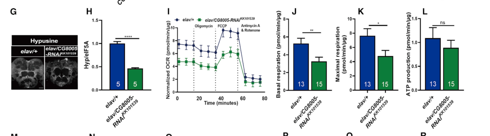

## Question

# Gene Research for Functional Annotation

## ⚠️ CRITICAL: Gene/Protein Identification Context

**BEFORE YOU BEGIN RESEARCH:** You MUST verify you are researching the CORRECT gene/protein. Gene symbols can be ambiguous, especially for less well-characterized genes from non-model organisms.

### Target Gene/Protein Identity (from UniProt):
- **UniProt Accession:** Q9VSF4
- **Protein Description:** RecName: Full=Probable deoxyhypusine synthase; Short=DHS; EC=2.5.1.46;
- **Gene Information:** ORFNames=CG8005;
- **Organism (full):** Drosophila melanogaster (Fruit fly).
- **Protein Family:** Belongs to the deoxyhypusine synthase family.
- **Key Domains:** Deoxyhypusine_synthase. (IPR002773); Deoxyhypusine_synthase_sf. (IPR036982); DHS-like_NAD/FAD-binding_dom. (IPR029035); DS (PF01916)

### MANDATORY VERIFICATION STEPS:

1. **Check if the gene symbol "Dhps" matches the protein description above**
2. **Verify the organism is correct:** Drosophila melanogaster (Fruit fly).
3. **Check if protein family/domains align with what you find in literature**
4. **If you find literature for a DIFFERENT gene with the same or similar symbol, STOP**

### If Gene Symbol is Ambiguous or You Cannot Find Relevant Literature:

**DO NOT PROCEED WITH RESEARCH ON A DIFFERENT GENE.** Instead:
- State clearly: "The gene symbol 'Dhps' is ambiguous or literature is limited for this specific protein"
- Explain what you found (e.g., "Found extensive literature on a different gene with the same symbol in a different organism")
- Describe the protein based ONLY on the UniProt information provided above
- Suggest that the protein function can be inferred from domain/family information

### Research Target:

Please provide a comprehensive research report on the gene **Dhps** (gene ID: Dhps, UniProt: Q9VSF4) in DROME.

The research report should be a detailed narrative explaining the function, biological processes, and localization of the gene product. Citations should be given for all claims.

You should prioritize authoritative reviews and primary scientific literature when conducting research. You can supplement
this with annotations you find in gene/protein databases, but these can be outdated or inaccurate.

We are specifically interested in the primary function of the gene - for enzymes, what reaction is catalyzed, and what is the substrate specificity? For transporters, what is the substrate? For structural proteins or adapters, what is the broader structural role? For signaling molecules, what is the role in the pathway.

We are interested in where in or outside the cell the gene product carries out its function.

We are also interested in the signaling or biochemical pathways in which the gene functions. We are less interested in broad pleiotropic effects, except where these elucidate the precise role.

Include evidence where possible. We are interested in both experimental evidence as well as inference from structure, evolution, or bioinformatic analysis. Precise studies should be prioritized over high-throughput, where available.

## Output

Question: You are an expert researcher providing comprehensive, well-cited information.

Provide detailed information focusing on:
1. Key concepts and definitions with current understanding
2. Recent developments and latest research (prioritize 2023-2024 sources)
3. Current applications and real-world implementations
4. Expert opinions and analysis from authoritative sources
5. Relevant statistics and data from recent studies

Format as a comprehensive research report with proper citations. Include URLs and publication dates where available.
Always prioritize recent, authoritative sources and provide specific citations for all major claims.

# Gene Research for Functional Annotation

## ⚠️ CRITICAL: Gene/Protein Identification Context

**BEFORE YOU BEGIN RESEARCH:** You MUST verify you are researching the CORRECT gene/protein. Gene symbols can be ambiguous, especially for less well-characterized genes from non-model organisms.

### Target Gene/Protein Identity (from UniProt):
- **UniProt Accession:** Q9VSF4
- **Protein Description:** RecName: Full=Probable deoxyhypusine synthase; Short=DHS; EC=2.5.1.46;
- **Gene Information:** ORFNames=CG8005;
- **Organism (full):** Drosophila melanogaster (Fruit fly).
- **Protein Family:** Belongs to the deoxyhypusine synthase family.
- **Key Domains:** Deoxyhypusine_synthase. (IPR002773); Deoxyhypusine_synthase_sf. (IPR036982); DHS-like_NAD/FAD-binding_dom. (IPR029035); DS (PF01916)

### MANDATORY VERIFICATION STEPS:

1. **Check if the gene symbol "Dhps" matches the protein description above**
2. **Verify the organism is correct:** Drosophila melanogaster (Fruit fly).
3. **Check if protein family/domains align with what you find in literature**
4. **If you find literature for a DIFFERENT gene with the same or similar symbol, STOP**

### If Gene Symbol is Ambiguous or You Cannot Find Relevant Literature:

**DO NOT PROCEED WITH RESEARCH ON A DIFFERENT GENE.** Instead:
- State clearly: "The gene symbol 'Dhps' is ambiguous or literature is limited for this specific protein"
- Explain what you found (e.g., "Found extensive literature on a different gene with the same symbol in a different organism")
- Describe the protein based ONLY on the UniProt information provided above
- Suggest that the protein function can be inferred from domain/family information

### Research Target:

Please provide a comprehensive research report on the gene **Dhps** (gene ID: Dhps, UniProt: Q9VSF4) in DROME.

The research report should be a detailed narrative explaining the function, biological processes, and localization of the gene product. Citations should be given for all claims.

You should prioritize authoritative reviews and primary scientific literature when conducting research. You can supplement
this with annotations you find in gene/protein databases, but these can be outdated or inaccurate.

We are specifically interested in the primary function of the gene - for enzymes, what reaction is catalyzed, and what is the substrate specificity? For transporters, what is the substrate? For structural proteins or adapters, what is the broader structural role? For signaling molecules, what is the role in the pathway.

We are interested in where in or outside the cell the gene product carries out its function.

We are also interested in the signaling or biochemical pathways in which the gene functions. We are less interested in broad pleiotropic effects, except where these elucidate the precise role.

Include evidence where possible. We are interested in both experimental evidence as well as inference from structure, evolution, or bioinformatic analysis. Precise studies should be prioritized over high-throughput, where available.

# Functional annotation report: *Drosophila melanogaster* Dhps (CG8005; UniProt Q9VSF4)

## Identity and conclusion

**The gene symbol can be resolved in this case:** the relevant fly literature explicitly identifies **CG8005 as the *D. melanogaster* ortholog of deoxyhypusine synthase (DHS)**. It is not *nero*, which encodes the downstream deoxyhypusine hydroxylase, or *eIF5A*, which encodes the protein substrate. The supplied UniProt accession Q9VSF4 and DHS-family/domain annotations are consistent with that identification; the accession-to-sequence and domain assignments themselves were not independently tested in the papers reviewed here. Consequently, biochemical details established with human DHS are identified below as **conserved-function inferences**, rather than direct measurements of purified fly CG8005. (liang2021eif5ahypusinationboosted pages 3-4)

**Primary function:** CG8005/Dhps catalyzes the first step of eIF5A hypusination. It transfers the 4-aminobutyl portion of **spermidine** onto a particular lysine of eIF5A, producing **deoxyhypusinated eIF5A** and **1,3-diaminopropane**. NAD⁺ participates in the multistep reaction through transient enzyme-bound NADH; it is a cofactor, not ordinarily a net-consumed reactant in the complete transfer. The relevant fly eIF5A residue is **Lys51**, tested genetically by substituting arginine; the corresponding human residue is **Lys50**. A second enzyme, Nero/DOHH, hydroxylates the deoxyhypusine to mature hypusine. Thus Dhps performs a specialized **protein post-translational modification**, not spermidine synthesis, polyamine transport, or the hydroxylation step. (park2018hypusineapolyaminederived pages 3-5, liang2021eif5ahypusinationboosted pages 4-7, nakanishi2024themanyfaces pages 1-2)

## Reaction, specificity and molecular basis

The physiological reaction can be written schematically as **spermidine + eIF5A–Lys → 1,3-diaminopropane + eIF5A–deoxyhypusine**. Studies of conserved DHS enzymes resolve spermidine oxidation, cleavage and formation of an enzyme-bound aminobutyl-imine intermediate, transfer to eIF5A, and NADH-mediated reduction to deoxyhypusine. The DHS product is an *intermediate*: the mature hypusine residue is formed only after Nero/DOHH acts. Fly loss-of-function experiments substantiate CG8005’s position in this pathway, but a purified-Q9VSF4 kinetic or product-characterization experiment was not identified. (park2018hypusineapolyaminederived pages 3-5, liang2021eif5ahypusinationboosted pages 9-11, liang2021eif5ahypusinationboosted pages 3-4)

**Substrate specificity requires a distinction between physiological modification and what an enzyme can bind in vitro.** eIF5A is the established cellular protein target of hypusination, and spermidine is its physiological aminobutyl donor. For the human enzyme, a 2020 structural/biochemical study measured apparent binding dissociation constants of **4.00 ± 0.064 μM for spermidine** versus **81.48 ± 3.36 μM for spermine**. Spermine supported a weaker signal in an assay of an *initial* DHS reaction, but this does **not** establish spermine as a physiological donor for complete fly eIF5A hypusination. Conversely, conserved DHS can use alternative small-molecule acceptors under experimental conditions—for example, putrescine can yield homospermidine—without changing the assignment of its principal cellular function. No corresponding substrate-preference constants were found for fly CG8005. (wator2020halfwayto pages 9-12, park2006theposttranslationalsynthesis pages 3-4, nakanishi2024themanyfaces pages 1-2)

The user-provided deoxyhypusine-synthase and DHS-like NAD-binding domain annotations accord with that reaction. As **structural support from a homolog, not a fly structure**, a March 2023 human study resolved an eIF5A–DHS complex at **2.8 Å**: tetrameric DHS binds an eIF5A molecule at a protomer interface, with a movable N-terminal element exposing the active site. These findings explain selective protein recognition and suggest how conserved DHS-family architecture could support CG8005 activity; they do not demonstrate the fly protein’s oligomeric state or individual catalytic constants. (wator2023cryoemstructureof pages 1-2)

## Biological pathway and experimental fly evidence

The direct biochemical pathway is **polyamine availability → CG8005/DHS-dependent eIF5A deoxyhypusination → Nero/DOHH-dependent hypusination → eIF5A-dependent translation**. A July 2024 review emphasizes that hypusinated eIF5A relieves ribosome pausing at difficult sequences, notably polyproline motifs, and contributes to translation elongation and termination. This makes Dhps an upstream regulator of translational capacity for particular proteins—not itself a ribosomal component or a direct mitochondrial enzyme. Precise downstream translational targets in fly neurons remain incompletely established. (nakanishi2024themanyfaces pages 1-2, hofer2021spermidineinducedhypusinationpreserves pages 1-2)

The strongest direct functional study is Liang and colleagues’ April 2021 *Cell Reports* paper. Homozygous loss of a CG8005 loss-of-function allele caused **late-larval lethality**. Viable heterozygotes showed reduced brain hypusine relative to eIF5A and diminished basal and maximal mitochondrial respiration and ATP production. **Two independent neuron-directed CG8005 RNAi constructs** also lowered brain hypusination and respiration; independently disrupting the eIF5A acceptor site with **K51R** produced convergent effects. Dietary spermidine raised brain hypusination in controls at **15 days**, but not detectably at **30 days** in that study, and its protection of mitochondrial function and memory was substantially diminished when CG8005-dependent hypusination was attenuated. Those convergent perturbations support the pathway assignment more strongly than an association between dietary spermidine and aging alone. (liang2021eif5ahypusinationboosted pages 3-4, liang2021eif5ahypusinationboosted pages 4-7, liang2021eif5ahypusinationboosted pages 9-11)

The neuronal RNAi and respiration results can also be inspected in the study’s **Figure 3**, which contrasts CG8005 knockdown with controls. Its hypusine staining is a readout of the **modified substrate**, not an image localizing the CG8005 enzyme. (liang2021eif5ahypusinationboosted media 97c532eb, liang2021eif5ahypusinationboosted pages 4-7)

A more recent **2023 *Scientific Reports*** study knocked down CG8005 in fly S2 cells and reported increased reactive oxygen species and apoptosis, reduced proliferation, and improvement after antioxidant **N-acetylcysteine** treatment; the reported comparisons were significant at **P < 0.05**. These are useful cell-level phenotypes, but the study did not establish a direct ROS-related catalytic reaction for CG8005 or measure eIF5A hypusination as the causal intermediary. A **2025** fly dietary follow-up further found that reduced CG8005 dosage shortened lifespan under both tested yeast diets, while protein restriction still conferred a lifespan benefit: not every dietary effect can therefore be attributed exclusively to Dhps-dependent hypusination. (chen2023effectsofnacetylcysteine pages 3-4, liang2025spermidinesupplementationand pages 4-7)

## Where the protein functions

**Cell type is supported; intracellular compartment is not resolved by these studies.** Neuron-specific CG8005 depletion reduces brain hypusination, and most detected brain hypusine signal overlaps a neuronal rather than glial marker. CG8005 also has a measurable role in cultured S2 cells. However, these observations locate *functional consequences* in neurons and cultured cells; they do not directly image or biochemically fractionate the CG8005 protein. Its proposed action on eIF5A is an **intracellular protein-modification reaction**, plausibly associated with the cellular translation machinery, but an exact cytosolic-versus-nuclear address for **fly CG8005** should remain unassigned on the evidence retrieved. In particular, reduced mitochondrial respiration **does not demonstrate mitochondrial localization** of DHS. (liang2021eif5ahypusinationboosted pages 4-7, liang2021eif5ahypusinationboosted pages 9-11, chen2023effectsofnacetylcysteine pages 3-4)

## Evidence-graded summary and research implications

The following summary separates findings established in flies from conserved-enzyme inference and unresolved localization.

| Evidence tier | Finding specific to CG8005/Dhps | Evidence and interpretation | Source |
|---|---|---|---|
| Direct fly identity and pathway evidence | **CG8005 is the *Drosophila melanogaster* ortholog of deoxyhypusine synthase (DHS)** and acts before the fly deoxyhypusine hydroxylase Nero in eIF5A hypusination. | A homozygous CG8005 loss-of-function allele caused late-larval lethality. Heterozygosity and two independent pan-neuronal RNAi constructs reduced brain hypusination and mitochondrial respiration. | Liang *et al.*, *Cell Reports*, 13 April 2021, [DOI](https://doi.org/10.1016/j.celrep.2021.108941) (liang2021eif5ahypusinationboosted pages 3-4, liang2021eif5ahypusinationboosted pages 4-7) |
| Conserved biochemical function inferred for fly protein | **Reaction:** spermidine + eIF5A–Lys → 1,3-diaminopropane + eIF5A–deoxyhypusine. NAD⁺ is transiently reduced to enzyme-bound NADH and regenerated, making it a cofactor rather than a net substrate. | No retrieved study purified Q9VSF4/CG8005 and assayed this reaction directly. The detailed chemistry is a strong inference from conserved mammalian and yeast DHS biochemistry plus fly genetic pathway evidence. | Park and Wolff, *JBC*, 30 November 2018, [DOI](https://doi.org/10.1074/jbc.TM118.003341) (park2018hypusineapolyaminederived pages 3-5, park2018hypusineapolyaminederived pages 22-26); Liang *et al.* (liang2021eif5ahypusinationboosted pages 9-11) |
| Conserved substrate specificity inferred for fly protein | The physiological aminobutyl donor is **spermidine**, while the protein acceptor is a specific conserved lysine of eIF5A, corresponding to Lys51 in the tested fly allele. Nero/DOHH subsequently hydroxylates deoxyhypusine to mature hypusine. | Human DHS bound spermine much more weakly than spermidine, with apparent Kd values of **81.48 ± 3.36 μM** and **4.00 ± 0.064 μM**, respectively. Limited human DHS activity with spermine does not establish it as a physiological fly substrate. | Wątor *et al.*, *Biomolecules*, 27 March 2020, [DOI](https://doi.org/10.3390/biom10040522) (wator2020halfwayto pages 9-12); Nakanishi and Cleveland, *IJMS*, 26 July 2024, [DOI](https://doi.org/10.3390/ijms25158171) (nakanishi2024themanyfaces pages 1-2) |
| Direct fly organismal evidence | Reduced CG8005 dosage or neuronal knockdown accelerated locomotor decline, impaired memory and mitochondrial respiration, and eliminated much of the protective response to dietary spermidine. | Convergent evidence came from CG8005 heterozygotes, two neuronal RNAi lines, and an endogenous eIF5A-K51R allele. These results support a CG8005-to-eIF5A-hypusination pathway but do not show that CG8005 itself resides in mitochondria. | Liang *et al.*, *Cell Reports*, 13 April 2021, [DOI](https://doi.org/10.1016/j.celrep.2021.108941) (liang2021eif5ahypusinationboosted pages 9-11, liang2021eif5ahypusinationboosted pages 4-7) |
| Direct fly-cell phenotype evidence | CG8005 RNAi in *Drosophila* S2 cells increased reactive oxygen species and apoptosis while reducing proliferation. N-acetylcysteine reduced oxidative stress and apoptosis and improved survival. | This 2023 study connects CG8005 depletion with redox imbalance but did not directly measure DHS catalysis, eIF5A hypusination, or a causal biochemical link between hypusination and ROS. | Chen *et al.*, *Scientific Reports*, 1 August 2023, [DOI](https://doi.org/10.1038/s41598-023-39668-4) (chen2023effectsofnacetylcysteine pages 3-4) |
| Recent structural evidence from human homolog | Human DHS is tetrameric. A **2.8 Å cryo-EM structure** showed one eIF5A molecule contacting two DHS protomers and displacing an N-terminal ball-and-chain element to expose the active site. | This provides a strong structural model consistent with the DHS-family and NAD-binding annotations of Q9VSF4, but it is not a fly structure and does not directly establish the oligomeric state or kinetics of CG8005. | Wątor *et al.*, *Nature Communications*, 23 March 2023, [DOI](https://doi.org/10.1038/s41467-023-37305-2) (wator2023cryoemstructureof pages 1-2) |
| Neuronal context established; subcellular location unresolved | CG8005 function is established in fly neurons: neuron-specific RNAi reduced brain hypusination, and most brain hypusine staining colocalized with neuronal rather than glial markers. | These experiments identify a relevant cell type, not the enzyme’s intracellular compartment. No retrieved fly study directly imaged or fractionated CG8005/DHS; therefore cytosolic, nuclear, or mitochondrial localization should not be reported as directly measured. Mitochondrial defects are downstream phenotypes. | Liang *et al.*, *Cell Reports*, 13 April 2021, [DOI](https://doi.org/10.1016/j.celrep.2021.108941) (liang2021eif5ahypusinationboosted pages 3-4, liang2021eif5ahypusinationboosted pages 4-7, liang2021eif5ahypusinationboosted pages 9-11) |

*Table: Evidence-graded annotation of fly CG8005/Dhps that separates direct Drosophila findings from conserved biochemical and structural inference. It also distinguishes neuronal functional context from unresolved intracellular localization.*

**Assessment.** CG8005/Q9VSF4 has a well-supported **pathway-level annotation as the fly DHS enzyme**, with direct genetic evidence that its activity is required for effective eIF5A hypusination. The exact fly enzyme’s purified catalytic constants, alternative-substrate tolerance, oligomeric structure and subcellular distribution remain less certain than its core reaction. Fly neuronal knockdown and dietary spermidine manipulation are established **experimental applications** of this pathway; human DHS structures and disease-variant studies provide mechanistic context, not evidence that CG8005 is already a validated clinical target. (liang2021eif5ahypusinationboosted pages 4-7, wator2023cryoemstructureof pages 1-2, nakanishi2024themanyfaces pages 1-2)

**Key sources and publication dates:** Liang *et al.*, *Cell Reports*, **13 April 2021**, https://doi.org/10.1016/j.celrep.2021.108941 (liang2021eif5ahypusinationboosted pages 3-4); Chen *et al.*, *Scientific Reports*, **August 2023**, https://doi.org/10.1038/s41598-023-39668-4 (chen2023effectsofnacetylcysteine pages 3-4); Wątor *et al.*, *Nature Communications*, **March 2023**, https://doi.org/10.1038/s41467-023-37305-2 (wator2023cryoemstructureof pages 1-2); Nakanishi and Cleveland, *International Journal of Molecular Sciences*, **26 July 2024**, https://doi.org/10.3390/ijms25158171 (nakanishi2024themanyfaces pages 1-2); Wątor *et al.*, *Biomolecules*, **March 2020**, https://doi.org/10.3390/biom10040522 (wator2020halfwayto pages 9-12); Liang *et al.*, *Aging*, **June 2025**, https://doi.org/10.18632/aging.206267 (liang2025spermidinesupplementationand pages 4-7).

References

1. (liang2021eif5ahypusinationboosted pages 3-4): YongTian Liang, Chengji Piao, Christine B. Beuschel, David Toppe, Laxmikanth Kollipara, Boris Bogdanow, Marta Maglione, Janine Lützkendorf, Jason Chun Kit See, Sheng Huang, Tim O.F. Conrad, Ulrich Kintscher, Frank Madeo, Fan Liu, Albert Sickmann, and Stephan J. Sigrist. Eif5a hypusination, boosted by dietary spermidine, protects from premature brain aging and mitochondrial dysfunction. Cell reports, 35 2:108941, Apr 2021. URL: https://doi.org/10.1016/j.celrep.2021.108941, doi:10.1016/j.celrep.2021.108941. This article has 145 citations and is from a highest quality peer-reviewed journal.

2. (park2018hypusineapolyaminederived pages 3-5): Myung Hee Park and Edith C. Wolff. Hypusine, a polyamine-derived amino acid critical for eukaryotic translation. Journal of Biological Chemistry, 293:18710-18718, Nov 2018. URL: https://doi.org/10.1074/jbc.tm118.003341, doi:10.1074/jbc.tm118.003341. This article has 247 citations and is from a domain leading peer-reviewed journal.

3. (liang2021eif5ahypusinationboosted pages 4-7): YongTian Liang, Chengji Piao, Christine B. Beuschel, David Toppe, Laxmikanth Kollipara, Boris Bogdanow, Marta Maglione, Janine Lützkendorf, Jason Chun Kit See, Sheng Huang, Tim O.F. Conrad, Ulrich Kintscher, Frank Madeo, Fan Liu, Albert Sickmann, and Stephan J. Sigrist. Eif5a hypusination, boosted by dietary spermidine, protects from premature brain aging and mitochondrial dysfunction. Cell reports, 35 2:108941, Apr 2021. URL: https://doi.org/10.1016/j.celrep.2021.108941, doi:10.1016/j.celrep.2021.108941. This article has 145 citations and is from a highest quality peer-reviewed journal.

4. (nakanishi2024themanyfaces pages 1-2): Shima Nakanishi and John L. Cleveland. The many faces of hypusinated eif5a: cell context-specific effects of the hypusine circuit and implications for human health. International Journal of Molecular Sciences, 25:8171, Jul 2024. URL: https://doi.org/10.3390/ijms25158171, doi:10.3390/ijms25158171. This article has 16 citations.

5. (liang2021eif5ahypusinationboosted pages 9-11): YongTian Liang, Chengji Piao, Christine B. Beuschel, David Toppe, Laxmikanth Kollipara, Boris Bogdanow, Marta Maglione, Janine Lützkendorf, Jason Chun Kit See, Sheng Huang, Tim O.F. Conrad, Ulrich Kintscher, Frank Madeo, Fan Liu, Albert Sickmann, and Stephan J. Sigrist. Eif5a hypusination, boosted by dietary spermidine, protects from premature brain aging and mitochondrial dysfunction. Cell reports, 35 2:108941, Apr 2021. URL: https://doi.org/10.1016/j.celrep.2021.108941, doi:10.1016/j.celrep.2021.108941. This article has 145 citations and is from a highest quality peer-reviewed journal.

6. (wator2020halfwayto pages 9-12): Elżbieta Wątor, Piotr Wilk, and Przemysław Grudnik. Half way to hypusine—structural basis for substrate recognition by human deoxyhypusine synthase. Biomolecules, 10:522, Mar 2020. URL: https://doi.org/10.3390/biom10040522, doi:10.3390/biom10040522. This article has 39 citations.

7. (park2006theposttranslationalsynthesis pages 3-4): Myung Hee Park. The post-translational synthesis of a polyamine-derived amino acid, hypusine, in the eukaryotic translation initiation factor 5a (eif5a). Journal of biochemistry, 139 2:161-9, Feb 2006. URL: https://doi.org/10.1093/jb/mvj034, doi:10.1093/jb/mvj034. This article has 459 citations and is from a peer-reviewed journal.

8. (wator2023cryoemstructureof pages 1-2): Elżbieta Wątor, Piotr Wilk, Artur Biela, Michał Rawski, Krzysztof M. Zak, Wieland Steinchen, Gert Bange, Sebastian Glatt, and Przemysław Grudnik. Cryo-em structure of human eif5a-dhs complex reveals the molecular basis of hypusination-associated neurodegenerative disorders. Nature Communications, Mar 2023. URL: https://doi.org/10.1038/s41467-023-37305-2, doi:10.1038/s41467-023-37305-2. This article has 33 citations and is from a highest quality peer-reviewed journal.

9. (hofer2021spermidineinducedhypusinationpreserves pages 1-2): Sebastian J. Hofer, YongTian Liang, Andreas Zimmermann, Sabrina Schroeder, Jörn Dengjel, Guido Kroemer, Tobias Eisenberg, Stephan J. Sigrist, and Frank Madeo. Spermidine-induced hypusination preserves mitochondrial and cognitive function during aging. Autophagy, 17:2037-2039, Jun 2021. URL: https://doi.org/10.1080/15548627.2021.1933299, doi:10.1080/15548627.2021.1933299. This article has 107 citations and is from a domain leading peer-reviewed journal.

10. (liang2021eif5ahypusinationboosted media 97c532eb): YongTian Liang, Chengji Piao, Christine B. Beuschel, David Toppe, Laxmikanth Kollipara, Boris Bogdanow, Marta Maglione, Janine Lützkendorf, Jason Chun Kit See, Sheng Huang, Tim O.F. Conrad, Ulrich Kintscher, Frank Madeo, Fan Liu, Albert Sickmann, and Stephan J. Sigrist. Eif5a hypusination, boosted by dietary spermidine, protects from premature brain aging and mitochondrial dysfunction. Cell reports, 35 2:108941, Apr 2021. URL: https://doi.org/10.1016/j.celrep.2021.108941, doi:10.1016/j.celrep.2021.108941. This article has 145 citations and is from a highest quality peer-reviewed journal.

11. (chen2023effectsofnacetylcysteine pages 3-4): Wanyin Chen, Yifei Yin, and Zheng Zhang. Effects of n-acetylcysteine on cg8005 gene-mediated proliferation and apoptosis of drosophila s2 embryonic cells. Scientific Reports, Aug 2023. URL: https://doi.org/10.1038/s41598-023-39668-4, doi:10.1038/s41598-023-39668-4. This article has 3 citations and is from a peer-reviewed journal.

12. (liang2025spermidinesupplementationand pages 4-7): YongTian Liang, Anja Krivograd, Sebastian J. Hofer, Laxmikanth Kollipara, Thomas Züllig, Albert Sickmann, Tobias Eisenberg, and Stephan J. Sigrist. Spermidine supplementation and protein restriction protect from organismal and brain aging independently. Aging (Albany NY), 17:1429-1451, Jun 2025. URL: https://doi.org/10.18632/aging.206267, doi:10.18632/aging.206267. This article has 9 citations.

13. (park2018hypusineapolyaminederived pages 22-26): Myung Hee Park and Edith C. Wolff. Hypusine, a polyamine-derived amino acid critical for eukaryotic translation. Journal of Biological Chemistry, 293:18710-18718, Nov 2018. URL: https://doi.org/10.1074/jbc.tm118.003341, doi:10.1074/jbc.tm118.003341. This article has 247 citations and is from a domain leading peer-reviewed journal.

## Artifacts

- [Edison artifact artifact-00](Dhps-deep-research-falcon_artifacts/artifact-00.md)

## Citations

1. wator2023cryoemstructureof pages 1-2
2. wator2020halfwayto pages 9-12
3. nakanishi2024themanyfaces pages 1-2
4. chen2023effectsofnacetylcysteine pages 3-4
5. liang2025spermidinesupplementationand pages 4-7
6. park2018hypusineapolyaminederived pages 3-5
7. park2006theposttranslationalsynthesis pages 3-4
8. hofer2021spermidineinducedhypusinationpreserves pages 1-2
9. park2018hypusineapolyaminederived pages 22-26
10. DOI
11. https://doi.org/10.1016/j.celrep.2021.108941
12. https://doi.org/10.1074/jbc.TM118.003341
13. https://doi.org/10.3390/biom10040522
14. https://doi.org/10.3390/ijms25158171
15. https://doi.org/10.1038/s41598-023-39668-4
16. https://doi.org/10.1038/s41467-023-37305-2
17. https://doi.org/10.18632/aging.206267
18. https://doi.org/10.1016/j.celrep.2021.108941,
19. https://doi.org/10.1074/jbc.tm118.003341,
20. https://doi.org/10.3390/ijms25158171,
21. https://doi.org/10.3390/biom10040522,
22. https://doi.org/10.1093/jb/mvj034,
23. https://doi.org/10.1038/s41467-023-37305-2,
24. https://doi.org/10.1080/15548627.2021.1933299,
25. https://doi.org/10.1038/s41598-023-39668-4,
26. https://doi.org/10.18632/aging.206267,