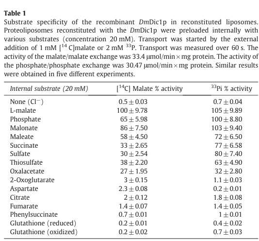

## Question

# Gene Research for Functional Annotation

## ⚠️ CRITICAL: Gene/Protein Identification Context

**BEFORE YOU BEGIN RESEARCH:** You MUST verify you are researching the CORRECT gene/protein. Gene symbols can be ambiguous, especially for less well-characterized genes from non-model organisms.

### Target Gene/Protein Identity (from UniProt):
- **UniProt Accession:** Q9Y166
- **Protein Description:** SubName: Full=Dicarboxylate carrier 1, isoform A {ECO:0000313|EMBL:AAF54933.1}; SubName: Full=Dicarboxylate carrier 1, isoform B {ECO:0000313|EMBL:AAF54932.1}; SubName: Full=Dicarboxylate carrier 1, isoform C {ECO:0000313|EMBL:AHN57312.1};
- **Gene Information:** Name=Dic1 {ECO:0000313|EMBL:AAF54933.1, ECO:0000313|FlyBase:FBgn0027610}; Synonyms=BcDNA:GH02431 {ECO:0000313|EMBL:AAF54933.1}, DmDic1p {ECO:0000313|EMBL:AAF54933.1}, Dmel\CG8790 {ECO:0000313|EMBL:AAF54933.1}; ORFNames=CG8790 {ECO:0000313|EMBL:AAF54933.1, ECO:0000313|FlyBase:FBgn0027610}, Dmel_CG8790 {ECO:0000313|EMBL:AAF54933.1};
- **Organism (full):** Drosophila melanogaster (Fruit fly).
- **Protein Family:** Belongs to the mitochondrial carrier (TC 2.A.29) family.
- **Key Domains:** MCP_dom_sf. (IPR023395); MCP_transmembrane. (IPR018108); Mito_Metabolite_Transporter. (IPR050391); Mito_carr (PF00153)

### MANDATORY VERIFICATION STEPS:

1. **Check if the gene symbol "Dic1" matches the protein description above**
2. **Verify the organism is correct:** Drosophila melanogaster (Fruit fly).
3. **Check if protein family/domains align with what you find in literature**
4. **If you find literature for a DIFFERENT gene with the same or similar symbol, STOP**

### If Gene Symbol is Ambiguous or You Cannot Find Relevant Literature:

**DO NOT PROCEED WITH RESEARCH ON A DIFFERENT GENE.** Instead:
- State clearly: "The gene symbol 'Dic1' is ambiguous or literature is limited for this specific protein"
- Explain what you found (e.g., "Found extensive literature on a different gene with the same symbol in a different organism")
- Describe the protein based ONLY on the UniProt information provided above
- Suggest that the protein function can be inferred from domain/family information

### Research Target:

Please provide a comprehensive research report on the gene **Dic1** (gene ID: Dic1, UniProt: Q9Y166) in DROME.

The research report should be a detailed narrative explaining the function, biological processes, and localization of the gene product. Citations should be given for all claims.

You should prioritize authoritative reviews and primary scientific literature when conducting research. You can supplement
this with annotations you find in gene/protein databases, but these can be outdated or inaccurate.

We are specifically interested in the primary function of the gene - for enzymes, what reaction is catalyzed, and what is the substrate specificity? For transporters, what is the substrate? For structural proteins or adapters, what is the broader structural role? For signaling molecules, what is the role in the pathway.

We are interested in where in or outside the cell the gene product carries out its function.

We are also interested in the signaling or biochemical pathways in which the gene functions. We are less interested in broad pleiotropic effects, except where these elucidate the precise role.

Include evidence where possible. We are interested in both experimental evidence as well as inference from structure, evolution, or bioinformatic analysis. Precise studies should be prioritized over high-throughput, where available.

## Output

Question: You are an expert researcher providing comprehensive, well-cited information.

Provide detailed information focusing on:
1. Key concepts and definitions with current understanding
2. Recent developments and latest research (prioritize 2023-2024 sources)
3. Current applications and real-world implementations
4. Expert opinions and analysis from authoritative sources
5. Relevant statistics and data from recent studies

Format as a comprehensive research report with proper citations. Include URLs and publication dates where available.
Always prioritize recent, authoritative sources and provide specific citations for all major claims.

# Gene Research for Functional Annotation

## ⚠️ CRITICAL: Gene/Protein Identification Context

**BEFORE YOU BEGIN RESEARCH:** You MUST verify you are researching the CORRECT gene/protein. Gene symbols can be ambiguous, especially for less well-characterized genes from non-model organisms.

### Target Gene/Protein Identity (from UniProt):
- **UniProt Accession:** Q9Y166
- **Protein Description:** SubName: Full=Dicarboxylate carrier 1, isoform A {ECO:0000313|EMBL:AAF54933.1}; SubName: Full=Dicarboxylate carrier 1, isoform B {ECO:0000313|EMBL:AAF54932.1}; SubName: Full=Dicarboxylate carrier 1, isoform C {ECO:0000313|EMBL:AHN57312.1};
- **Gene Information:** Name=Dic1 {ECO:0000313|EMBL:AAF54933.1, ECO:0000313|FlyBase:FBgn0027610}; Synonyms=BcDNA:GH02431 {ECO:0000313|EMBL:AAF54933.1}, DmDic1p {ECO:0000313|EMBL:AAF54933.1}, Dmel\CG8790 {ECO:0000313|EMBL:AAF54933.1}; ORFNames=CG8790 {ECO:0000313|EMBL:AAF54933.1, ECO:0000313|FlyBase:FBgn0027610}, Dmel_CG8790 {ECO:0000313|EMBL:AAF54933.1};
- **Organism (full):** Drosophila melanogaster (Fruit fly).
- **Protein Family:** Belongs to the mitochondrial carrier (TC 2.A.29) family.
- **Key Domains:** MCP_dom_sf. (IPR023395); MCP_transmembrane. (IPR018108); Mito_Metabolite_Transporter. (IPR050391); Mito_carr (PF00153)

### MANDATORY VERIFICATION STEPS:

1. **Check if the gene symbol "Dic1" matches the protein description above**
2. **Verify the organism is correct:** Drosophila melanogaster (Fruit fly).
3. **Check if protein family/domains align with what you find in literature**
4. **If you find literature for a DIFFERENT gene with the same or similar symbol, STOP**

### If Gene Symbol is Ambiguous or You Cannot Find Relevant Literature:

**DO NOT PROCEED WITH RESEARCH ON A DIFFERENT GENE.** Instead:
- State clearly: "The gene symbol 'Dic1' is ambiguous or literature is limited for this specific protein"
- Explain what you found (e.g., "Found extensive literature on a different gene with the same symbol in a different organism")
- Describe the protein based ONLY on the UniProt information provided above
- Suggest that the protein function can be inferred from domain/family information

### Research Target:

Please provide a comprehensive research report on the gene **Dic1** (gene ID: Dic1, UniProt: Q9Y166) in DROME.

The research report should be a detailed narrative explaining the function, biological processes, and localization of the gene product. Citations should be given for all claims.

You should prioritize authoritative reviews and primary scientific literature when conducting research. You can supplement
this with annotations you find in gene/protein databases, but these can be outdated or inaccurate.

We are specifically interested in the primary function of the gene - for enzymes, what reaction is catalyzed, and what is the substrate specificity? For transporters, what is the substrate? For structural proteins or adapters, what is the broader structural role? For signaling molecules, what is the role in the pathway.

We are interested in where in or outside the cell the gene product carries out its function.

We are also interested in the signaling or biochemical pathways in which the gene functions. We are less interested in broad pleiotropic effects, except where these elucidate the precise role.

Include evidence where possible. We are interested in both experimental evidence as well as inference from structure, evolution, or bioinformatic analysis. Precise studies should be prioritized over high-throughput, where available.

# Functional annotation of *Drosophila melanogaster* Dic1

## Identity and principal function

**Dic1 is the fly gene CG8790 (FlyBase FBgn0027610), whose product is termed DmDic1p.** The supplied UniProt accession is **Q9Y166**. This identification is supported independently by a primary study that explicitly maps CG8790 to DmDic1p; that study does not itself establish the UniProt accession. Importantly, DmDic1p is **not** the related fly proteins DmDic2p/CG4323, DmDic3p/CG11196, or DmDic4p/CG18363, nor should results for a plant or yeast protein also named Dic1 be assigned to it. The authors identified the fly candidates using human dicarboxylate carrier SLC25A10 and reported 57% amino-acid identity between DmDic1p and the human protein. Its repeated mitochondrial-carrier sequence architecture agrees with the mitochondrial-carrier family and domains specified in the question. (iacopetta2011anovelsubfamily pages 3-4, iacopetta2011anovelsubfamily pages 8-9)

**The experimentally established function is mitochondrial dicarboxylate/phosphate exchange, not catalysis of a chemical reaction.** Recombinant DmDic1p purified from bacteria and reconstituted into liposomes transported radiolabeled L-malate or inorganic phosphate when an appropriate counter-substrate was present inside. Uptake without an internal substrate was nearly absent, supporting an **antiport mechanism** in this system. These experiments establish substrate compatibility and exchange activity, but not the predominant direction or magnitude of flux in a living fly. (iacopetta2011anovelsubfamily pages 3-4, iacopetta2011anovelsubfamily pages 4-5, iacopetta2011anovelsubfamily media 9cd15788)

The table below separates measured properties from less certain physiological assignments.

| Aspect | CG8790/DmDic1p result | Evidence/qualification |
|---|---|---|
| Identity | **DmDic1p is the 280-aa, 30.7-kDa product of *D. melanogaster* CG8790.** It is distinct from DmDic2p/CG4323, DmDic3p/CG11196, and DmDic4p/CG18363. Two reported CG8790 5′-UTR transcript variants encode the same polypeptide. | Sequence comparison and cDNA annotation; DmDic1p has 57% identity and 71% similarity to human DIC/SLC25A10. No experimentally established functional difference between CG8790 transcript variants (iacopetta2011anovelsubfamily pages 3-4). |
| Transport specificity | Strong exchange with **L-malate, phosphate, malonate, and maleate**; weaker exchange with **succinate, sulfate, thiosulfate, and oxaloacetate**; negligible exchange with **2-oxoglutarate, citrate, and fumarate**. | Direct radiotracer assays using purified recombinant protein reconstituted into proteoliposomes; substrate rankings depend somewhat on whether labeled malate or phosphate was supplied externally (iacopetta2011anovelsubfamily pages 3-4, iacopetta2011anovelsubfamily pages 4-5, iacopetta2011anovelsubfamily media 9cd15788). |
| Transport mechanism | Functions as a **strict exchanger/antiporter** in the reconstituted system: labeled malate or phosphate uptake required an internal counter-substrate; essentially no uptake occurred without one. | Strong direct *in vitro* evidence. This establishes exchange behavior in liposomes, not transport direction or flux under intact-cell physiological conditions (iacopetta2011anovelsubfamily pages 3-4, iacopetta2011anovelsubfamily pages 4-5). |
| Kinetics | **Kₘ(L-malate) = 0.81 ± 0.10 mM; Kₘ(phosphate) = 2.35 ± 0.30 mM; Vₘₐₓ = 64 ± 2.5 μmol·min⁻¹·mg protein⁻¹** for both tested homo-exchanges after correction for reconstitution efficiency. | Direct initial-rate measurements in recombinant-protein proteoliposomes; six experiments were reported (iacopetta2011anovelsubfamily pages 4-5). |
| Localization | Reported to localize to the **mitochondrial compartment**. | The primary paper attributes this to immunofluorescence but states “data not shown”; therefore supportive but less independently assessable than the transport assays (iacopetta2011anovelsubfamily pages 8-9). |
| Developmental expression | CG8790-RA/RB transcripts were detected at high levels in **embryos, larvae, pupae, and adults**. | Semi-quantitative RT-PCR across developmental stages; this is transcript evidence, not quantitative protein abundance or tissue/cell-type resolution (iacopetta2011anovelsubfamily pages 3-4, iacopetta2011anovelsubfamily pages 8-9). |
| Proposed biological roles | Likely supports mitochondrial–cytosolic dicarboxylate/phosphate exchange, with proposed contributions to **TCA-cycle anaplerosis** and **gluconeogenesis from pyruvate**. | Mechanistically plausible interpretations based on transport specificity and homolog biology, but not validated by CG8790 loss-of-function, isotope tracing, or other *in vivo* pathway experiments in the cited study (iacopetta2011anovelsubfamily pages 8-9). |

*Table: Evidence-weighted summary of the identity, biochemical transport properties, localization, expression, and proposed metabolic roles of Drosophila CG8790/DmDic1p. It distinguishes direct proteoliposome measurements from localization evidence and unvalidated pathway interpretations.*

## Substrates, selectivity, and quantitative evidence

The primary study’s substrate matrix shows strongest exchange with **L-malate, phosphate, malonate, and maleate**. Succinate, sulfate, thiosulfate, and oxaloacetate also supported exchange, generally less effectively; citrate, fumarate, 2-oxoglutarate, and aspartate supported little or none under the tested conditions. These are *in-vitro* counter-substrate measurements, not evidence that every transported compound is a major physiological substrate. In particular, although sulfate and thiosulfate exchange was observed, their contribution to fly sulfur metabolism was not established. (iacopetta2011anovelsubfamily pages 3-4, iacopetta2011anovelsubfamily pages 4-5, iacopetta2011anovelsubfamily media 9cd15788)

For scale, with **20 mM internal substrate**, external **1 mM labeled malate**, and a **60-second assay**, internal L-malate, phosphate, malonate, and maleate gave approximately **100%, 65%, 86%, and 58%**, respectively, of the malate/malate reference activity. Internal succinate, sulfate, thiosulfate, and oxaloacetate gave **33%, 30%, 38%, and 27%**. With external **2 mM labeled phosphate**, the relative activities differed: phosphate, malonate, succinate, sulfate, and thiosulfate gave approximately **100%, 103%, 77%, 80%, and 63%** of the phosphate/phosphate reference. Thus, calling these latter substrates uniformly “weak” would obscure their relatively substantial phosphate-exchange activities. The reported reference activities were **33.4 μmol·min⁻¹·mg protein⁻¹** for malate/malate and **30.47 μmol·min⁻¹·mg protein⁻¹** for phosphate/phosphate in this substrate-screening assay. (iacopetta2011anovelsubfamily pages 3-4, iacopetta2011anovelsubfamily media 9cd15788)

In separate initial-rate measurements, the reported apparent **Kₘ was 0.81 ± 0.10 mM for L-malate** and **2.35 ± 0.30 mM for phosphate**; the reconstitution-efficiency-corrected **Vₘₐₓ was 64 ± 2.5 μmol·min⁻¹·mg protein⁻¹** for the tested malate/malate and phosphate/phosphate homo-exchanges. These kinetic values describe purified, reconstituted protein, not measured intracellular concentrations or whole-animal transport rates. (iacopetta2011anovelsubfamily pages 4-5)

The malate/phosphate exchange assay was inhibited by **10 mM benzylmalonate (95%)**, **10 mM butylmalonate (91%)**, **10 mM phenylsuccinate (54%)**, **10 mM bathophenanthroline (97%)**, and **10 mM pyridoxal 5′-phosphate (98%)**. Carboxyatractyloside and 1,2,3-benzenetricarboxylate produced little inhibition under the reported conditions. This pharmacological profile supports the assignment as a dicarboxylate carrier; it should not be read as evidence of selective inhibition in intact animals. (iacopetta2011anovelsubfamily pages 4-5)

## Localization, expression, and biological role

DmDic1p acts in the **mitochondrial compartment**. The primary paper reports mitochondrial localization by immunofluorescence, although it labels those images **“data not shown.”** Together with the characteristic carrier architecture and mitochondrial-metabolite exchange biochemistry, this supports annotation as a mitochondrial carrier; the exact membrane topology was not directly visualized in the cited experiment. The likely functional location is the **mitochondrial inner membrane**, across which carriers of this family exchange metabolites between matrix and surrounding compartment. (iacopetta2011anovelsubfamily pages 3-4, iacopetta2011anovelsubfamily pages 8-9, curcio2020drosophilamelanogastermitochondrial pages 17-19)

CG8790 transcripts were detected by semiquantitative RT-PCR in **embryos, larvae, pupae, and adults**. The study identified two CG8790 transcripts differing in their **5′ untranslated regions** that encode the **same 280-amino-acid, approximately 30.7-kDa polypeptide**. These findings do not resolve tissue-specific abundance or establish distinct transport functions for the UniProt-listed isoforms A, B, and C. Broad developmental transcript detection likewise does not demonstrate uniform protein expression in every tissue. (iacopetta2011anovelsubfamily pages 3-4, iacopetta2011anovelsubfamily pages 8-9)

Biochemically, malate/phosphate exchange could connect cytosolic and mitochondrial **carbon metabolism**, including provision of dicarboxylates for the **tricarboxylic-acid cycle** and metabolite exchange relevant to **gluconeogenesis**. The primary authors specifically proposed a role in **anaplerosis** and **gluconeogenesis from pyruvate**; these are **physiological hypotheses inferred from transport properties**, not pathways demonstrated by a Dic1 mutant or *in-vivo* flux experiment in that study. They argued against simply transferring the mammalian urea-synthesis role to this uricotelic insect. The stronger annotation is therefore *mitochondrial dicarboxylate/phosphate antiporter*; precise pathway contributions remain less certain. (iacopetta2011anovelsubfamily pages 8-9, iacopetta2011anovelsubfamily pages 9-10)

The paralog distinction has functional consequences: reconstituted **DmDic3p/CG11196** exchanged phosphate with phosphate and sulfur-containing anions but showed little malate exchange, unlike **DmDic1p/CG8790**. Assigning DmDic3p’s narrow specificity to the target gene would therefore be incorrect. Comparative structural modeling offered possible explanations for these differences, but those models are supplementary to, rather than replacements for, the direct transport assays. (iacopetta2011anovelsubfamily pages 3-4, iacopetta2011anovelsubfamily pages 4-5, iacopetta2011anovelsubfamily pages 8-9)

## Research status and practical interpretation

**Direct application:** Dic1/CG8790 can be used as a biochemically characterized candidate when investigating mitochondrial malate–phosphate exchange in fly metabolism. The published expression, purification, and proteoliposome radiotracer approach provides a concrete way to test its substrate specificity and inhibition. This is a research implementation, **not** an established therapeutic, diagnostic, or industrial application. The focused literature search did not identify a **2023–2024 gene-specific experimental study** that supersedes the 2011 biochemical characterization; the 2020 specialist review continues to summarize that work. Absence of a retrieved newer study should not be interpreted as proof that none exists. (iacopetta2011anovelsubfamily pages 2-3, iacopetta2011anovelsubfamily pages 3-4, curcio2020drosophilamelanogastermitochondrial pages 17-19)

**Principal sources and publication dates:** Iacopetta *et al.*, “A novel subfamily of mitochondrial dicarboxylate carriers from *Drosophila melanogaster*: Biochemical and computational studies,” *Biochimica et Biophysica Acta—Bioenergetics* **1807**, 251–261 (**March 2011**), https://doi.org/10.1016/j.bbabio.2010.11.013; Curcio *et al.*, “*Drosophila melanogaster* Mitochondrial Carriers: Similarities and Differences with the Human Carriers,” *International Journal of Molecular Sciences* **21**, 6052 (**August 2020**), https://doi.org/10.3390/ijms21176052. The first is the primary source for the measured properties above; the second is a contextual review. (iacopetta2011anovelsubfamily pages 3-4, iacopetta2011anovelsubfamily pages 4-5, iacopetta2011anovelsubfamily pages 8-9, curcio2020drosophilamelanogastermitochondrial pages 17-19)

References

1. (iacopetta2011anovelsubfamily pages 3-4): Domenico Iacopetta, Marianna Madeo, Gianluca Tasco, Chiara Carrisi, Rosita Curcio, Emanuela Martello, Rita Casadio, Loredana Capobianco, and Vincenza Dolce. A novel subfamily of mitochondrial dicarboxylate carriers from drosophila melanogaster: biochemical and computational studies. Biochimica et Biophysica Acta (BBA) - Bioenergetics, 1807:251-261, Mar 2011. URL: https://doi.org/10.1016/j.bbabio.2010.11.013, doi:10.1016/j.bbabio.2010.11.013. This article has 18 citations and is from a peer-reviewed journal.

2. (iacopetta2011anovelsubfamily pages 8-9): Domenico Iacopetta, Marianna Madeo, Gianluca Tasco, Chiara Carrisi, Rosita Curcio, Emanuela Martello, Rita Casadio, Loredana Capobianco, and Vincenza Dolce. A novel subfamily of mitochondrial dicarboxylate carriers from drosophila melanogaster: biochemical and computational studies. Biochimica et Biophysica Acta (BBA) - Bioenergetics, 1807:251-261, Mar 2011. URL: https://doi.org/10.1016/j.bbabio.2010.11.013, doi:10.1016/j.bbabio.2010.11.013. This article has 18 citations and is from a peer-reviewed journal.

3. (iacopetta2011anovelsubfamily pages 4-5): Domenico Iacopetta, Marianna Madeo, Gianluca Tasco, Chiara Carrisi, Rosita Curcio, Emanuela Martello, Rita Casadio, Loredana Capobianco, and Vincenza Dolce. A novel subfamily of mitochondrial dicarboxylate carriers from drosophila melanogaster: biochemical and computational studies. Biochimica et Biophysica Acta (BBA) - Bioenergetics, 1807:251-261, Mar 2011. URL: https://doi.org/10.1016/j.bbabio.2010.11.013, doi:10.1016/j.bbabio.2010.11.013. This article has 18 citations and is from a peer-reviewed journal.

4. (iacopetta2011anovelsubfamily media 9cd15788): Domenico Iacopetta, Marianna Madeo, Gianluca Tasco, Chiara Carrisi, Rosita Curcio, Emanuela Martello, Rita Casadio, Loredana Capobianco, and Vincenza Dolce. A novel subfamily of mitochondrial dicarboxylate carriers from drosophila melanogaster: biochemical and computational studies. Biochimica et Biophysica Acta (BBA) - Bioenergetics, 1807:251-261, Mar 2011. URL: https://doi.org/10.1016/j.bbabio.2010.11.013, doi:10.1016/j.bbabio.2010.11.013. This article has 18 citations and is from a peer-reviewed journal.

5. (curcio2020drosophilamelanogastermitochondrial pages 17-19): Rosita Curcio, Paola Lunetti, Vincenzo Zara, Alessandra Ferramosca, Federica Marra, Giuseppe Fiermonte, Anna Rita Cappello, Francesco De Leonardis, Loredana Capobianco, and Vincenza Dolce. Drosophila melanogaster mitochondrial carriers: similarities and differences with the human carriers. International Journal of Molecular Sciences, 21:6052, Aug 2020. URL: https://doi.org/10.3390/ijms21176052, doi:10.3390/ijms21176052. This article has 32 citations.

6. (iacopetta2011anovelsubfamily pages 9-10): Domenico Iacopetta, Marianna Madeo, Gianluca Tasco, Chiara Carrisi, Rosita Curcio, Emanuela Martello, Rita Casadio, Loredana Capobianco, and Vincenza Dolce. A novel subfamily of mitochondrial dicarboxylate carriers from drosophila melanogaster: biochemical and computational studies. Biochimica et Biophysica Acta (BBA) - Bioenergetics, 1807:251-261, Mar 2011. URL: https://doi.org/10.1016/j.bbabio.2010.11.013, doi:10.1016/j.bbabio.2010.11.013. This article has 18 citations and is from a peer-reviewed journal.

7. (iacopetta2011anovelsubfamily pages 2-3): Domenico Iacopetta, Marianna Madeo, Gianluca Tasco, Chiara Carrisi, Rosita Curcio, Emanuela Martello, Rita Casadio, Loredana Capobianco, and Vincenza Dolce. A novel subfamily of mitochondrial dicarboxylate carriers from drosophila melanogaster: biochemical and computational studies. Biochimica et Biophysica Acta (BBA) - Bioenergetics, 1807:251-261, Mar 2011. URL: https://doi.org/10.1016/j.bbabio.2010.11.013, doi:10.1016/j.bbabio.2010.11.013. This article has 18 citations and is from a peer-reviewed journal.

## Artifacts

- [Edison artifact artifact-00](Dic1-deep-research-falcon_artifacts/artifact-00.md)

## Citations

1. iacopetta2011anovelsubfamily pages 3-4
2. iacopetta2011anovelsubfamily pages 4-5
3. iacopetta2011anovelsubfamily pages 8-9
4. curcio2020drosophilamelanogastermitochondrial pages 17-19
5. iacopetta2011anovelsubfamily pages 9-10
6. iacopetta2011anovelsubfamily pages 2-3
7. https://doi.org/10.1016/j.bbabio.2010.11.013;
8. https://doi.org/10.3390/ijms21176052.
9. https://doi.org/10.1016/j.bbabio.2010.11.013,
10. https://doi.org/10.3390/ijms21176052,