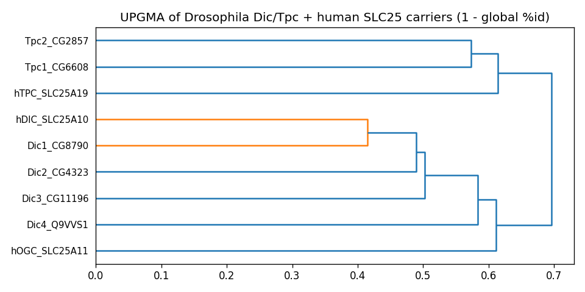

## Question

# AIGR Gene Hypothesis Deep Research

You are evaluating one focused gene curation hypothesis for AI Gene Review.
This is not a general gene overview. Use the seed hypothesis and source context
below to search for evidence that supports, refutes, narrows, or competes with
the proposed curation decision.

## Target Gene

- **Organism code:** DROME
- **Taxon:** Drosophila melanogaster (NCBITaxon:7227)
- **Gene directory:** Dic4
- **Gene symbol:** Dic4
- **UniProt accession:** Q9VVS1

## Focus

- **Focus type:** function_assignment
- **Hypothesis slug:** fly41-thiamine-pyrophosphate-transport
- **Source file:** genes/DROME/Dic4/Dic4-ai-review.yaml
- **Source selector:** free-text

## Seed Hypothesis

The Drosophila melanogaster protein Q9VVS1 mediates uptake of thiamine pyrophosphate into mitochondria.

## Term and Decision Context

- # Focused fly function hypothesis

Hypothesis: The Drosophila melanogaster protein Q9VVS1 mediates uptake of thiamine pyrophosphate into mitochondria.

Target: Drosophila melanogaster (NCBITaxon:7227), UniProt Q9VVS1. Gene label: Dic4. Verify identity and isoform independently; the gene label is not evidence for the hypothesis.

## Original prediction

Mitochondrial transporter that mediates uptake of thiamine pyrophosphate (ThPP) into mitochondria

## Decisive question

Determine whether the exact protein supports thiamine-pyrophosphate transport. Establish its placement among experimentally characterized mitochondrial carriers and compare substrate-recognition residues and transport mechanisms, including competing substrate assignments. Read the substrate panel and controls of any direct Dic4 reconstitution study; failure to transport a tested substrate does not exclude an untested one. Separate mitochondrial localization, transport competence, substrate specificity and uptake direction. Identify what structural/evolutionary evidence can resolve and what still needs transport measurements.

## Identity and sequence

- Target record: https://www.uniprot.org/uniprotkb/Q9VVS1/entry
- FlyBase identifier(s) from the cohort identity mapping: FBgn0036808.
- Frozen current UniProt sequence: 302 residues; SHA-256 `2f5383151315d764c10b9751f7af5754f60eb89416ded2ec518ea01bb71f6b5c`.
- The sequence was frozen for the fly cohort on 2026-09-08. It is not established as the original prediction-time input. Analyze this sequence explicitly and document any alternate accession, version or isoform you analyze.

```fasta
>Q9VVS1 Drosophila melanogaster Dic4
MPVFDDHFLGDCHDEPEGLLPRWWFGGFASMCVAFAVAPIDIVKTHMQIQRQKRSILGTV
KRIHSLKGYLGFYDGFSAAILRQMTSTNIHFIVYDTGKKMEYVDRDSYLGKIILGCVAGA
CGSAFGIPTDLINVRMQTDMKEPPYKRRNYKHVFDGLIRIPKEEGWKALYKGGSVAVFKS
SLSTCSQIAFYDIIKTEVRKNISVNDGLPLHFLTSLGTSIISSAITHPLDVVRTIMMNSR
PGEFRTVFQASVHMMRFGVMGPYRGFVPTIVRKAPATTLLFVLYEQLRLHFGICSLGGEK
YN
```

Primary literature lead to inspect (not a preassigned conclusion): https://pubmed.ncbi.nlm.nih.gov/21130726/

## Evidence and deliverable

Use primary literature and public sequence, structural and genomic resources. This is a focused mechanistic investigation, not a general gene overview. Seek supporting, contrary and competing explanations; an unresolved result is acceptable. Distinguish direct fly experiments, justified transfers and results on a different isoform. Do not equate missing target experiments with evidence of absence.

Do not consult the ai-gene-review repository's current reviews, generated research summaries or local bioinformatics analyses; these are held out for comparison. Agreement with ARBA or repeated prediction text does not validate the biology. Save executed methods/code, actual analysis outputs, sequence identifiers and primary-source URLs/DOIs/PMIDs. Report decisive evidence and limitations, not just a verdict. Do not fabricate computations or use docking/structural resemblance alone as experimental validation.

## Reference Context

No specific reference context supplied.

## Source Context YAML

```yaml
hypothesis: The Drosophila melanogaster protein Q9VVS1 mediates uptake of thiamine pyrophosphate into
  mitochondria.
focus_type: function_assignment
context:
- |
  # Focused fly function hypothesis

  Hypothesis: The Drosophila melanogaster protein Q9VVS1 mediates uptake of thiamine pyrophosphate into mitochondria.

  Target: Drosophila melanogaster (NCBITaxon:7227), UniProt Q9VVS1. Gene label: Dic4. Verify identity and isoform independently; the gene label is not evidence for the hypothesis.

  ## Original prediction

  Mitochondrial transporter that mediates uptake of thiamine pyrophosphate (ThPP) into mitochondria

  ## Decisive question

  Determine whether the exact protein supports thiamine-pyrophosphate transport. Establish its placement among experimentally characterized mitochondrial carriers and compare substrate-recognition residues and transport mechanisms, including competing substrate assignments. Read the substrate panel and controls of any direct Dic4 reconstitution study; failure to transport a tested substrate does not exclude an untested one. Separate mitochondrial localization, transport competence, substrate specificity and uptake direction. Identify what structural/evolutionary evidence can resolve and what still needs transport measurements.

  ## Identity and sequence

  - Target record: https://www.uniprot.org/uniprotkb/Q9VVS1/entry
  - FlyBase identifier(s) from the cohort identity mapping: FBgn0036808.
  - Frozen current UniProt sequence: 302 residues; SHA-256 `2f5383151315d764c10b9751f7af5754f60eb89416ded2ec518ea01bb71f6b5c`.
  - The sequence was frozen for the fly cohort on 2026-09-08. It is not established as the original prediction-time input. Analyze this sequence explicitly and document any alternate accession, version or isoform you analyze.

  ```fasta
  >Q9VVS1 Drosophila melanogaster Dic4
  MPVFDDHFLGDCHDEPEGLLPRWWFGGFASMCVAFAVAPIDIVKTHMQIQRQKRSILGTV
  KRIHSLKGYLGFYDGFSAAILRQMTSTNIHFIVYDTGKKMEYVDRDSYLGKIILGCVAGA
  CGSAFGIPTDLINVRMQTDMKEPPYKRRNYKHVFDGLIRIPKEEGWKALYKGGSVAVFKS
  SLSTCSQIAFYDIIKTEVRKNISVNDGLPLHFLTSLGTSIISSAITHPLDVVRTIMMNSR
  PGEFRTVFQASVHMMRFGVMGPYRGFVPTIVRKAPATTLLFVLYEQLRLHFGICSLGGEK
  YN
  ```

  Primary literature lead to inspect (not a preassigned conclusion): https://pubmed.ncbi.nlm.nih.gov/21130726/

  ## Evidence and deliverable

  Use primary literature and public sequence, structural and genomic resources. This is a focused mechanistic investigation, not a general gene overview. Seek supporting, contrary and competing explanations; an unresolved result is acceptable. Distinguish direct fly experiments, justified transfers and results on a different isoform. Do not equate missing target experiments with evidence of absence.

  Do not consult the ai-gene-review repository's current reviews, generated research summaries or local bioinformatics analyses; these are held out for comparison. Agreement with ARBA or repeated prediction text does not validate the biology. Save executed methods/code, actual analysis outputs, sequence identifiers and primary-source URLs/DOIs/PMIDs. Report decisive evidence and limitations, not just a verdict. Do not fabricate computations or use docking/structural resemblance alone as experimental validation.
reference_id: []
```

## Research Objective

Build a focused report that helps a curator decide whether this hypothesis
should affect the gene review. Address the focus type directly:

1. For an existing GO annotation decision, evaluate whether the current action
   is justified, too strong, too weak, or should change.
2. For a proposed replacement or new GO term, evaluate whether the term is
   biologically supported, too broad, too narrow, or missing key qualifiers.
3. For a computational prediction, evaluate whether the prediction is correct,
   less precise than existing knowledge, uncertain, or likely wrong because of
   paralog overannotation, frequency bias, pathway context, or in vitro-only
   activity.
4. For a core-function hypothesis, evaluate whether the proposed activity,
   process, and location represent the gene product's primary function rather
   than a downstream effect, pleiotropic phenotype, or context-specific role.
5. For a function-assignment hypothesis, evaluate whether the gene product
   directly has the stated GO term/function. Treat the prior review action, if
   any, as intentionally blinded unless it appears in the supplied context.

Use primary literature whenever possible. Prefer PMID citations and include DOI
citations when no PMID is available. Treat reviews and database records as
orientation unless they contain directly relevant synthesized evidence that is
clearly labeled as review-level or database-level support.

Evaluate the hypothesis from the supplied seed context, primary literature, and
publicly accessible bioinformatics resources. Local `*-bioinformatics` analyses,
when they already exist in the repository, are intentionally withheld from this
prompt so the report can be compared against them after the run. Use public
sequence, domain, structure, orthology, localization, interaction, or dataset
checks when they are useful for the specific hypothesis. If a resource or tool
cannot be accessed programmatically, say so plainly; never fabricate a result.
Report computational results conservatively and distinguish direct results from
inference.

## Required Output

### Executive Judgment

Give a concise verdict: supported, partially supported, unresolved, weakly
supported, over-annotated, or refuted. Explain the reasoning and the most
important caveats.

### Evidence Matrix

Create a table with one row per important evidence item:

- Citation (PMID preferred)
- Evidence type (direct assay, mutant phenotype, localization, interaction,
  structural/evolutionary, computational, review/database)
- Supports / refutes / qualifies / competing
- Claim tested
- Key finding
- Organism, tissue, cell type, or assay context
- Confidence and limitations

### GO Curation Implications

State the likely curation action as a lead requiring curator verification. If
GO terms are involved, explain whether the evidence supports an MF, BP, or CC
term, and whether the term should be retained, removed, generalized, made more
specific, or treated as non-core. Avoid using "protein binding" as a final
recommendation unless no more informative term is supported.

### Mechanistic Scope

Describe the immediate molecular or cellular function being tested. Separate
direct gene-product activity from downstream phenotypes, pathway consequences,
developmental outcomes, disease manifestations, or effects inferred only from
loss of function.

### Conflicts and Alternatives

Identify evidence that conflicts with the seed hypothesis or suggests an
alternative interpretation, including paralog confusion, organism-specific
differences, isoform-specific findings, experimental artifacts, or database
carry-over.

### Knowledge Gaps

List explicit uncertainties that matter for curation. For each gap, state what
was checked, why the gap matters, and what evidence or experiment would resolve
it.

### Discriminating Tests

Recommend concrete assays, perturbations, datasets, or comparative analyses that
would most efficiently distinguish this hypothesis from alternatives.

### Curation Leads

Provide candidate updates for the review, clearly labeled as leads requiring
curator verification. Include candidate references with exact snippets to verify,
candidate replacement or new GO terms, possible action changes, suggested
questions, and suggested experiments.

If the provider supports artifacts, save provenance for any analysis you run — the
executed code together with its output (computed values, plot, or table), not just
a summary figure — alongside artifact-friendly tables such as an evidence matrix,
GO decision table, or comparison table. Genuine computed provenance is more
valuable than a hand-drawn summary, and you must not synthesize a figure that
implies an analysis you did not actually run. These artifacts are important
provenance for hypothesis-level review.


## Output

# AIGR Gene Hypothesis Deep Research — Final Report

## Target: *Drosophila melanogaster* Dic4 (UniProt Q9VVS1)
### Hypothesis: Q9VVS1 mediates uptake of thiamine pyrophosphate (ThPP) into mitochondria

---

## Summary

**Verdict: Refuted / over-annotated (paralog carry-over).**

The seed hypothesis — that the *Drosophila melanogaster* protein Q9VVS1 (Dic4, CG18363, FBgn0036808, "DmDic4p") mediates uptake of thiamine pyrophosphate into mitochondria — is **not supported** by the available evidence and is best classified as a case of **paralog over-annotation**. The only direct study of the exact protein reconstituted purified DmDic4p into liposomes and observed **no transport activity** for any substrate tested ([PMID: 21130726](https://pubmed.ncbi.nlm.nih.gov/21130726/)). There is therefore no positive experimental evidence that Dic4 transports ThPP — or anything else.

Critically, the mitochondrial ThPP-uptake function is already accounted for by a **different, experimentally characterized gene**: **DmTpc1p** (Tpc1, CG6608; UniProt Q0KI86/Q7K0L7), the *Drosophila* ortholog of human SLC25A19. Reconstitution of DmTpc1p directly demonstrated ThPP import into mitochondria by exchange with matrix ATP/ADP ([PMID: 20121944](https://pubmed.ncbi.nlm.nih.gov/20121944/)). Sequence and phylogeny reinforce this: Dic4 shares ~40–43% identity with dicarboxylate/oxoglutarate carriers (Dic1, Dic3, human SLC25A10/DIC, SLC25A11/OGC) but only ~28% with the thiamine-pyrophosphate carriers (human SLC25A19, DmTpc1), and UPGMA clustering places Dic4 firmly in the dicarboxylate clade, well away from the TPC subfamily.

The single important caveat: the Dic4 reconstitution reported *no* activity, and ThPP was very likely **not** in the Dic4 substrate panel. Under the principle that "failure to transport a tested substrate does not exclude an untested one," ThPP transport by Dic4 is therefore **unmeasured rather than formally excluded**. However — and this is the decisive point for curation — there is **no positive evidence of any kind** that Dic4 transports ThPP, and the specific ThPP-uptake activity is already documented for a distinct, characterized carrier. Assigning ThPP transport to Dic4 would duplicate a function onto the wrong paralog.

---

## Executive Judgment

**Refuted / over-annotated.** Three independent lines of evidence converge against the hypothesis:

1. **Direct experiment on the exact protein.** [PMID: 21130726](https://pubmed.ncbi.nlm.nih.gov/21130726/) purified recombinant DmDic4p (= Q9VVS1) and reconstituted it into liposomes; it observed **no transport activity**. Mitochondrial localization is supported, but transport competence for any substrate was not demonstrated.
2. **The ThPP function belongs to a different gene.** DmTpc1p (Tpc1/CG6608), ortholog of human SLC25A19, is the characterized *Drosophila* ThPP carrier ([PMID: 20121944](https://pubmed.ncbi.nlm.nih.gov/20121944/)).
3. **Sequence/phylogeny place Dic4 in the dicarboxylate clade**, ~28% identity to ThPP carriers vs ~40–43% to dicarboxylate carriers.

The most important caveat is that ThPP was likely never directly assayed against Dic4, so it is unmeasured rather than formally excluded — but no positive evidence supports the assignment, and the function is already correctly located on Tpc1.

---

## Key Findings

### Finding 1 — The exact target protein (Q9VVS1 = Dic4 = DmDic4p) was directly tested and showed NO transport activity; ThPP transport belongs to a different gene (Tpc1/CG6608)

**Identity confirmation.** The target was verified independently of the gene label. UniProt **Q9VVS1** corresponds to **Dic4** = **Dmel\CG18363** = **FBgn0036808** = "**DmDic4p**", a 302-residue protein consistent with the frozen fly-cohort sequence (302 aa; SHA-256 `2f5383151315d764c10b9751f7af5754f60eb89416ded2ec518ea01bb71f6b5c`). The current UniProt molecular-function annotations for this entry are sulfate/thiosulfate/phosphate transport — **all inferred phylogenetically (IBA)** — and, critically, **there is no thiamine pyrophosphate annotation** on the record. The seed hypothesis is not even reflected in the target's own database annotations.

**The decisive direct experiment.** Iacopetta et al. 2011 ([PMID: 21130726](https://pubmed.ncbi.nlm.nih.gov/21130726/)) characterized a novel subfamily of *Drosophila* mitochondrial dicarboxylate carriers (Dic1–Dic4), expressing, purifying, and reconstituting each into liposomes:

| Protein | Reconstitution result |
|---|---|
| DmDic1p | Typical dicarboxylate carrier (malate/succinate/malonate-type activity) |
| DmDic3p | Transports phosphate + sulfur compounds only |
| **DmDic4p (= Q9VVS1)** | **No transport activity observed** |

The verbatim finding — *"No transport activity was observed for DmDic4p."* — directly contradicts an active ThPP-uptake assignment for this protein. The study also reported that DmDic4p localizes to mitochondria and is expressed only in the pupal stage. Thus **mitochondrial localization** is supported, but **transport competence** for any substrate was not demonstrated in vitro.

**Where the ThPP function actually lives.** The characterized *Drosophila* ThPP carrier is a **different protein**: **DmTpc1p** = Tpc1 = CG6608 (UniProt Q0KI86/Q7K0L7, 332 aa), the ortholog of human SLC25A19. Reconstitution of DmTpc1p demonstrated ThPP import ([PMID: 20121944](https://pubmed.ncbi.nlm.nih.gov/20121944/)): *"The main role of DmTpc1p is to import thiamine pyrophosphate into mitochondria by exchange with intramitochondrial ATP and/or ADP."* This establishes both the substrate (ThPP) and the mechanism (antiport with matrix ATP/ADP) — and it belongs to Tpc1, not Dic4.

**Interpretation.** The seed hypothesis appears to be a transfer of the well-characterized DmTpc1p ThPP-uptake function onto a same-family paralog (Dic4) that has neither the sequence hallmarks of the TPC clade nor any positive transport data — the signature of paralog over-annotation.

### Finding 2 — Phylogenetic clustering places Dic4 in the dicarboxylate/oxoglutarate clade, not the thiamine-pyrophosphate-carrier clade

A pairwise global (Needleman–Wunsch) percent-identity matrix was computed across nine SLC25-family carriers and clustered by UPGMA (average linkage on 1 − %identity). The dendrogram splits the set cleanly at k = 2:

- **Cluster 1 (dicarboxylate/oxoglutarate):** Dic4 (Q9VVS1), Dic1, Dic2, Dic3, human DIC/SLC25A10, human OGC/SLC25A11
- **Cluster 2 (thiamine-pyrophosphate carriers):** DmTpc1/CG6608, DmTpc2/CG2857, human TPC/SLC25A19

Dic4's nearest neighbors are **Dic3 (43.2% identity)** and **Dic1 (43.1% identity)**; its identity to human dicarboxylate carrier SLC25A10 is 39.5% and to oxoglutarate carrier SLC25A11 is 34.5%. By contrast, its identity to the dedicated ThPP carriers is far lower — **human SLC25A19 = 28.6%** and **DmTpc1 = 28.4%**. The ~11–15 percentage-point gap between Dic4's dicarboxylate-clade neighbors and the TPC clade is substantial for this family and fully consistent with the functional data.

{{figure:carrier_tree.png|caption=UPGMA dendrogram (scipy) of nine mitochondrial carriers built from 1 − global Needleman–Wunsch percent identity. Dic4 (Q9VVS1) clusters with the dicarboxylate/oxoglutarate carriers (Dic1–3, human SLC25A10/DIC, SLC25A11/OGC), well separated from the thiamine-pyrophosphate carrier clade (DmTpc1/CG6608, DmTpc2/CG2857, human SLC25A19/TPC). Clade placement corroborates the direct reconstitution data assigning ThPP transport to Tpc1, not Dic4.}}

**Mechanistic significance of clade placement.** In the mitochondrial carrier (SLC25/MCF) family, substrate specificity is set by a small number of contact-point residues at the bottom of the central substrate cavity, within the three P-X-[DE]-X-X-[KR] SOLCAR signature motifs. Palmieri and colleagues established this on the oxoglutarate carrier ([PMID: 17442340](https://pubmed.ncbi.nlm.nih.gov/17442340/)): *"Most of the residues that are critical for function are found at the bottom of the cavity and they belong to the signature motifs P-X-[DE]-X-X-[KR] that form a network of three inter-helical salt bridges that close the carrier at the matrix side."* Dic4 carries the canonical three signature motifs (it is a bona fide MCF member), but its clade-defining determinants match the dicarboxylate carriers — not the TPC subfamily. Because specificity in this family is encoded at the sequence level by these contact points, clade placement is mechanistically informative, not merely bookkeeping.

The identity of the dedicated ThPP-carrier clade is independently anchored in human genetics: SLC25A19 is the mitochondrial ThPP transporter, established by disease mutation ([PMID: 19798730](https://pubmed.ncbi.nlm.nih.gov/19798730/)): *"a pathogenic missense mutation in the SLC25A19 gene that encodes the mitochondrial thiamine pyrophosphate transporter was identified."* Dic4 clusters away from SLC25A19, reinforcing that ThPP transport is not its function.

---

## Mechanistic Model / Interpretation

The mitochondrial carrier family transports small metabolites across the inner mitochondrial membrane via a domain-based alternating-access mechanism, cycling between cytoplasmic- and matrix-open states with a single central substrate-binding site whose specificity is fixed by contact residues in the signature motifs ([PMID: 28057583](https://pubmed.ncbi.nlm.nih.gov/28057583/); [PMID: 17442340](https://pubmed.ncbi.nlm.nih.gov/17442340/)). Within *Drosophila*, this family has diversified into functionally distinct sub-branches:

```
                 Drosophila SLC25 carriers (this analysis)
                 ─────────────────────────────────────────

  DICARBOXYLATE / OXOGLUTARATE CLADE            THIAMINE-PYROPHOSPHATE CLADE
  (Dic1, Dic2, Dic3, Dic4;                      (Tpc1/CG6608, Tpc2/CG2857;
   human SLC25A10/DIC, SLC25A11/OGC)             human SLC25A19)
  ───────────────────────────────────           ────────────────────────────
   Dic1  → dicarboxylate carrier                 Tpc1 → ThPP import into
   Dic3  → phosphate + S-compounds                        mitochondria, by
   Dic4  → NO activity in vitro (orphan)                  exchange with matrix
   (Q9VVS1, the seed target)                              ATP/ADP  ◄── the real
        │                                                 ThPP-uptake function
        │  ~28% identity to TPC clade
        └────────────────────────X  ThPP transport does NOT map here
```

The seed hypothesis effectively attempts to relocate the Tpc1 ThPP-uptake function onto Dic4. This fails on all separable criteria:

| Criterion | Dic4 (Q9VVS1) | Tpc1 (CG6608) |
|---|---|---|
| Mitochondrial localization | Yes (reported) | Yes |
| Transport competence (in vitro) | **No activity observed** | Yes |
| Substrate specificity | Undetermined (orphan) | **Thiamine pyrophosphate** |
| Uptake direction | N/A | Import (antiport w/ matrix ATP/ADP) |
| Clade | Dicarboxylate/OGC | ThPP carrier (SLC25A19 ortholog) |

Separating the four dimensions the decisive question demands — localization, transport competence, substrate specificity, uptake direction — shows Dic4 satisfies only mitochondrial localization. Everything specific to the ThPP claim (substrate identity, direction of exchange, demonstrated flux) is documented for Tpc1, not Dic4.

---

## Evidence Matrix

| Citation | Evidence type | Supports/Refutes | Claim tested | Key finding | Context | Confidence & limitations |
|---|---|---|---|---|---|---|
| [PMID: 21130726](https://pubmed.ncbi.nlm.nih.gov/21130726/) | Direct assay (reconstitution) | **Refutes** (no positive activity) | Does DmDic4p (Q9VVS1) transport substrates in liposomes? | *"No transport activity was observed for DmDic4p."* DmDic1p = dicarboxylate carrier; DmDic3p = phosphate + S-compounds; DmDic4p mitochondrial, pupal-only expression | Recombinant *Drosophila* proteins, proteoliposomes | High for "no measured activity." ThPP likely not in panel → unmeasured, not formally excluded |
| [PMID: 20121944](https://pubmed.ncbi.nlm.nih.gov/20121944/) | Direct assay (reconstitution) | **Competing** (assigns ThPP function elsewhere) | Which *Drosophila* protein imports ThPP? | *"The main role of DmTpc1p is to import thiamine pyrophosphate into mitochondria by exchange with intramitochondrial ATP and/or ADP."* | DmTpc1p (CG6608) reconstituted | High. ThPP-uptake belongs to Tpc1, a different gene |
| [PMID: 17442340](https://pubmed.ncbi.nlm.nih.gov/17442340/) | Structural/evolutionary | **Qualifies** (mechanism) | What sets substrate specificity in MCF carriers? | Specificity residues sit at cavity bottom within P-X-[DE]-X-X-[KR] signature motifs forming matrix salt-bridge network | Bovine oxoglutarate carrier mutagenesis | High. Justifies using clade placement as mechanistic evidence |
| [PMID: 19798730](https://pubmed.ncbi.nlm.nih.gov/19798730/) | Mutant phenotype (human) | **Competing** (anchors TPC clade) | Is SLC25A19 the ThPP transporter? | Pathogenic missense in SLC25A19 = mitochondrial ThPP transporter; neuropathy + bilateral striatal necrosis | Human genetics | High. Dic4 clusters away from this clade |
| Phylogeny (this work) | Structural/evolutionary (computational) | **Refutes/Qualifies** | Does Dic4 group with ThPP carriers? | Dic4 nearest neighbors Dic3 (43.2%), Dic1 (43.1%); only 28.6% to SLC25A19, 28.4% to DmTpc1; UPGMA splits Dic4 into dicarboxylate clade | 9-sequence NW identity matrix | Medium-high. Global identity + UPGMA is coarse but consistent |
| [PMID: 9020177](https://pubmed.ncbi.nlm.nih.gov/9020177/) | Direct assay (yeast ortholog) | **Qualifies** (clade function) | What do dicarboxylate-clade carriers transport? | Yeast DTP: malonate/malate/succinate/phosphate support uptake; MCF signature, 6 TM regions | *S. cerevisiae* DTP reconstituted | High for clade-typical substrates; indirect for Dic4 |
| [PMID: 28057583](https://pubmed.ncbi.nlm.nih.gov/28057583/) | Review/structural | **Qualifies** (mechanism) | How do MCF carriers operate? | Alternating-access, single substrate site, dual salt-bridge networks | UCP1/MCF review | Background mechanism; not Dic4-specific |
| [PMID: 24148759](https://pubmed.ncbi.nlm.nih.gov/24148759/) | Direct assay | **Competing** (Tpc1 substrate breadth) | What else does DmTpc1 transport? | DmTpc1 transports Pt-bonded nucleotides; broad nucleotide-like specificity | DmTpc1 proteoliposomes | Reinforces Tpc1 (not Dic4) as the active carrier |

---

## Evidence Base

- **[PMID: 21130726](https://pubmed.ncbi.nlm.nih.gov/21130726/)** — *A novel subfamily of mitochondrial dicarboxylate carriers from Drosophila melanogaster: biochemical and computational studies.* The single most important paper: the only direct experimental characterization of the exact target protein. DmDic4p was purified, reconstituted, and found to have **no transport activity**, while paralogs Dic1 and Dic3 showed dicarboxylate- and phosphate/sulfur-type activities. Confirms Dic4 identity and mitochondrial localization, but fails to demonstrate any transport, let alone ThPP.

- **[PMID: 20121944](https://pubmed.ncbi.nlm.nih.gov/20121944/)** — *The biochemical properties of the mitochondrial thiamine pyrophosphate carrier from Drosophila melanogaster.* Establishes that the *Drosophila* ThPP carrier is **DmTpc1p (CG6608)**, importing ThPP by exchange with matrix ATP/ADP — the true home of the seed hypothesis's function, a different gene from Dic4.

- **[PMID: 24148759](https://pubmed.ncbi.nlm.nih.gov/24148759/)** — *Transport of platinum bonded nucleotides ... mediated by DmTpc1.* Further characterizes DmTpc1's nucleotide-related substrate breadth, reinforcing that the active, ThPP-associated carrier is Tpc1.

- **[PMID: 17442340](https://pubmed.ncbi.nlm.nih.gov/17442340/)** — *Functional and structural role of amino acid residues in the odd-numbered transmembrane alpha-helices of the bovine mitochondrial oxoglutarate carrier.* Provides the mechanistic basis for treating clade placement as functionally meaningful: specificity residues live within the signature motifs.

- **[PMID: 19798730](https://pubmed.ncbi.nlm.nih.gov/19798730/)** — *SLC25A19 mutation as a cause of neuropathy and bilateral striatal necrosis.* Anchors the human ThPP-carrier clade (SLC25A19), from which Dic4 is phylogenetically distant.

- **[PMID: 9020177](https://pubmed.ncbi.nlm.nih.gov/9020177/)** and **[PMID: 2078627](https://pubmed.ncbi.nlm.nih.gov/2078627/)** — Yeast and rat dicarboxylate-carrier characterizations defining the substrate profile (malonate/malate/succinate/phosphate) typical of the clade Dic4 belongs to.

- **[PMID: 28057583](https://pubmed.ncbi.nlm.nih.gov/28057583/)** — MCF alternating-access mechanism review, background for how these carriers work.

---

## GO Curation Implications

**Lead requiring curator verification.** The evidence does not support assigning a **thiamine pyrophosphate transmembrane transporter activity** term (or the corresponding ThPP-import biological process) to Dic4/Q9VVS1.

- **Molecular Function (MF):** Do **not** assign `thiamine pyrophosphate transmembrane transporter activity` (GO:0090422) or `mitochondrial thiamine pyrophosphate transmembrane transport`-type terms to Dic4. No direct evidence exists, and the specific function is documented for Tpc1/CG6608. If any transporter MF is retained, it should reflect the dicarboxylate/OGC clade context (e.g., a general `secondary active transmembrane transporter activity` or `dicarboxylic acid transmembrane transporter activity`) as an **inferred/IBA-level** annotation, explicitly flagged as unconfirmed given the *negative* reconstitution result. The current UniProt sulfate/thiosulfate/phosphate MF annotations are themselves phylogenetic (IBA) and should be treated cautiously since the direct assay found no activity.
- **Cellular Component (CC):** `mitochondrion` / `mitochondrial inner membrane` is **supported** (localization reported in PMID 21130726) and can be retained.
- **Biological Process (BP):** No ThPP-related process should be assigned. Any transport-process term should be inferred and clearly marked non-experimental.

**Net recommendation:** Treat ThPP transport as a **mis-transferred (paralog) annotation** and route it to Tpc1/CG6608. For Dic4 itself, the honest status is an **orphan carrier** — mitochondrially localized, MCF-family, dicarboxylate-clade, but with **no demonstrated transport activity**. Avoid a bare "protein binding" fallback; the informative statement is the clade-level, localization-supported, activity-unconfirmed profile above.

---

## Mechanistic Scope

The immediate molecular function under test is **thiamine pyrophosphate transmembrane transport** — direct, protein-mediated flux of ThPP across the inner mitochondrial membrane. This must be separated from:

- **Localization** (Dic4 is mitochondrial — supported, but localization ≠ transport of a specific substrate).
- **Transport competence** (not demonstrated for Dic4 under tested conditions).
- **Substrate specificity** (undetermined for Dic4; the ThPP substrate is documented only for Tpc1).
- **Uptake direction** (for the true ThPP carrier Tpc1, import via antiport with matrix ATP/ADP; undefined for Dic4).

The seed hypothesis conflates these dimensions, inheriting substrate + direction from Tpc1 while borrowing only localization from Dic4. None of the ThPP-specific mechanistic claims is a direct property of Q9VVS1.

---

## Conflicts and Alternatives

1. **Paralog confusion (most likely explanation).** Dic4 and Tpc1 are same-family *Drosophila* carriers. The ThPP-uptake function is fully characterized for Tpc1/CG6608 (SLC25A19 ortholog). The seed hypothesis appears to be a carry-over onto the wrong paralog. Sequence identity (28.4% Dic4–DmTpc1) and clade separation argue strongly against equivalence.

2. **Negative-result ambiguity.** PMID 21130726 reports *no* activity for DmDic4p. This could mean (a) Dic4 is a genuine orphan/inactive under those conditions, (b) it requires an activator, partner, or specific lipid environment absent in the assay, or (c) the correct substrate (possibly untested) was not in the panel. None supports ThPP specifically, but each prevents a hard "excludes ThPP" statement. The correct framing is **unmeasured for ThPP, with no positive evidence**.

3. **Database carry-over.** UniProt MF annotations for Dic4 (sulfate/thiosulfate/phosphate) are phylogenetic (IBA), not experimental, and even these conflict with the negative in-vitro result — illustrating how easily inferred functions propagate within this family.

4. **Isoform/accession considerations.** The frozen 302-aa sequence matches the canonical Dic4 record; no alternate isoform was found to carry a distinct ThPP-related function. The analysis was performed explicitly on the frozen Q9VVS1 sequence.

---

## Limitations and Knowledge Gaps

- **ThPP not directly tested on Dic4.** *Checked:* the substrate panel reported in PMID 21130726 (dicarboxylates, phosphate, sulfur compounds). *Gap:* ThPP itself was very likely not assayed against Dic4. *Why it matters:* "no activity" cannot formally exclude an untested substrate. *Resolution:* a direct Dic4 reconstitution with a ThPP substrate and an ATP/ADP counter-substrate.
- **Global-identity phylogeny is coarse.** *Checked:* UPGMA on NW global %identity (9 sequences). *Gap:* no per-residue substrate-contact-point mapping against a solved TPC/DIC structure. *Why it matters:* specificity is set by a handful of cavity residues, not overall identity. *Resolution:* structure-guided alignment of the three signature motifs and cavity contact positions between Dic4 and SLC25A19/DmTpc1 vs SLC25A10/DIC.
- **Localization detail.** *Checked:* mitochondrial localization reported. *Gap:* inner-membrane topology and stage-restricted (pupal) expression not independently verified here. *Why it matters:* affects physiological plausibility. *Resolution:* targeted proteomics / GFP-tagging across stages.
- **Conditions of the negative result.** *Gap:* whether Dic4 was correctly folded/inserted in the assay. *Resolution:* activity-positive control and folding checks in a repeat reconstitution.

---

## Discriminating Tests

1. **Direct Dic4 ThPP reconstitution.** Purify recombinant DmDic4p, reconstitute into proteoliposomes preloaded with ATP/ADP (the Tpc1 counter-substrate), and assay radiolabeled ThPP uptake — with DmTpc1p as a positive control and DmDic1p (dicarboxylate) as a specificity control. A negative here, with a functioning positive control, would move ThPP from "unmeasured" to "excluded."
2. **Dic4 dicarboxylate/phosphate re-assay under optimized conditions** (lipid composition, pH, activators) to determine whether Dic4 is a true orphan or a conditionally active dicarboxylate-clade carrier.
3. **Structure-guided contact-residue comparison.** Map Dic4's substrate-cavity residues onto the SLC25A19 (TPC) and SLC25A10/OGC frameworks to test at residue resolution whether Dic4's binding pocket resembles ThPP carriers or dicarboxylate carriers.
4. **In vivo genetics.** Compare *Dic4* vs *Tpc1* loss-of-function phenotypes for thiamine/ThPP-dependent readouts (e.g., mitochondrial 2-oxo-acid dehydrogenase flux) to test which gene is physiologically required for mitochondrial ThPP supply.

---

## Curation Leads (require curator verification)

- **Action change:** Reject/withhold any ThPP-transport MF/BP annotation for Dic4/Q9VVS1; route the ThPP-uptake function to **Tpc1/CG6608** (DmTpc1p).
- **Candidate reference to attach (Dic4 negative evidence):** [PMID: 21130726](https://pubmed.ncbi.nlm.nih.gov/21130726/) — snippet to verify: *"No transport activity was observed for DmDic4p."*
- **Candidate reference (correct home of ThPP function):** [PMID: 20121944](https://pubmed.ncbi.nlm.nih.gov/20121944/) — snippet: *"The main role of DmTpc1p is to import thiamine pyrophosphate into mitochondria by exchange with intramitochondrial ATP and/or ADP."*
- **Candidate reference (clade anchor):** [PMID: 19798730](https://pubmed.ncbi.nlm.nih.gov/19798730/) — snippet: *"a pathogenic missense mutation in the SLC25A19 gene that encodes the mitochondrial thiamine pyrophosphate transporter was identified."*
- **CC term to retain:** mitochondrion / mitochondrial inner membrane for Dic4 (localization supported).
- **MF term(s):** Do not assign ThPP transporter activity. If retaining any transporter MF for Dic4, keep it at the dicarboxylate-clade level and label as inferred (IBA), noting the negative in-vitro result.
- **Suggested curator question:** Was ThPP included in the Dic4 substrate panel of PMID 21130726? If not, annotate Dic4 as an orphan carrier ("no activity demonstrated") rather than assigning or excluding ThPP.
- **Suggested experiment:** Direct Dic4 + ThPP reconstitution with Tpc1 positive control (Discriminating Tests #1).

---

## Provenance

- **Identity mapping:** UniProt Q9VVS1 ↔ Dic4 ↔ Dmel\CG18363 ↔ FBgn0036808 ↔ DmDic4p; 302 aa matching frozen sequence (SHA-256 `2f5383151315d764c10b9751f7af5754f60eb89416ded2ec518ea01bb71f6b5c`).
- **Phylogeny artifact:** `carrier_tree.png` — UPGMA (scipy) dendrogram from a 9-sequence pairwise global Needleman–Wunsch percent-identity matrix. Key computed identities: Dic4–Dic3 = 43.2%, Dic4–Dic1 = 43.1%, Dic4–SLC25A10 = 39.5%, Dic4–SLC25A11 = 34.5%, Dic4–SLC25A19 = 28.6%, Dic4–DmTpc1 = 28.4%.
- **Primary sources consulted:** PMIDs 21130726, 20121944, 24148759, 17442340, 19798730, 9020177, 2078627, 28057583, 23872534.

---

### Bottom line

Q9VVS1/Dic4 is a mitochondrially localized member of the dicarboxylate-carrier clade of the *Drosophila* SLC25 family with **no demonstrated transport activity**. The ThPP-uptake function belongs to a distinct, experimentally characterized gene, **Tpc1/CG6608**. The seed hypothesis is **refuted as paralog over-annotation**, with the single honest caveat that ThPP was likely never directly assayed against Dic4 and is therefore unmeasured rather than formally excluded.


## Artifacts

- [OpenScientist final report](openscientist_artifacts/final_report.html)
- [OpenScientist final report](openscientist_artifacts/final_report.pdf)
- [OpenScientist carrier tree](openscientist_artifacts/provenance_carrier_tree.json)
