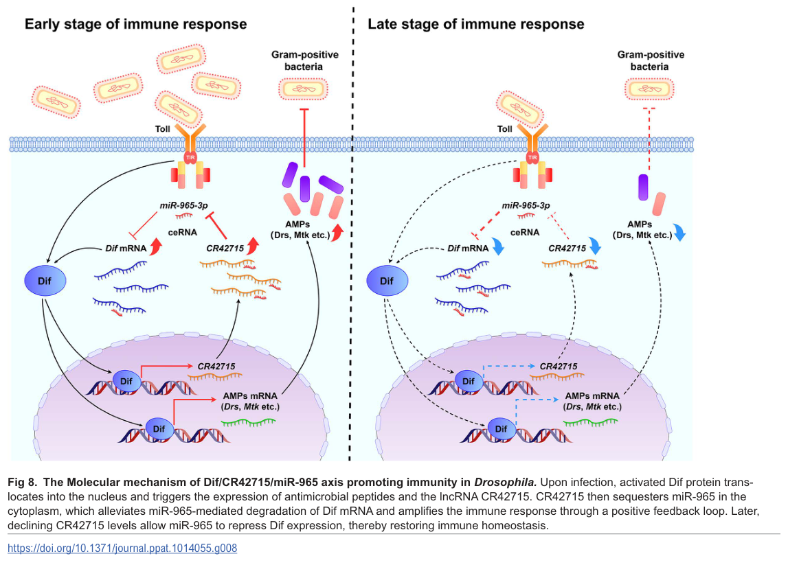
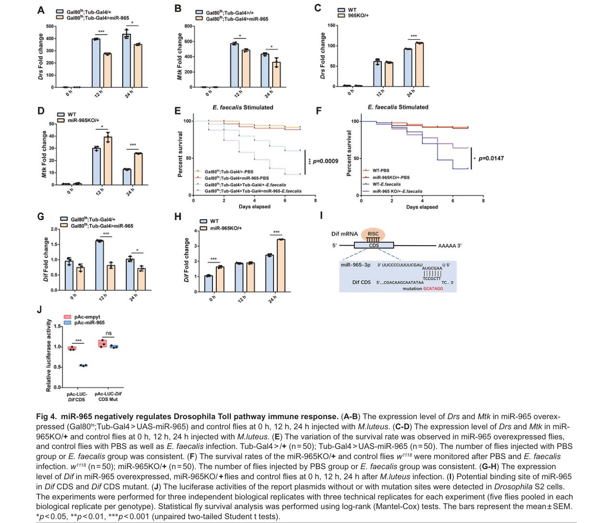

## Question

# Gene Research for Functional Annotation

## ⚠️ CRITICAL: Gene/Protein Identification Context

**BEFORE YOU BEGIN RESEARCH:** You MUST verify you are researching the CORRECT gene/protein. Gene symbols can be ambiguous, especially for less well-characterized genes from non-model organisms.

### Target Gene/Protein Identity (from UniProt):
- **UniProt Accession:** P98149
- **Protein Description:** RecName: Full=Dorsal-related immunity factor Dif;
- **Gene Information:** Name=Dif {ECO:0000312|FlyBase:FBgn0011274}; ORFNames=CG6794 {ECO:0000312|FlyBase:FBgn0011274};
- **Organism (full):** Drosophila melanogaster (Fruit fly).
- **Protein Family:** Not specified in UniProt
- **Key Domains:** Dif. (IPR011363); Ig-like_fold. (IPR013783); Ig_E-set. (IPR014756); IPT_dom. (IPR002909); NFkB/Dor. (IPR000451)

### MANDATORY VERIFICATION STEPS:

1. **Check if the gene symbol "Dif" matches the protein description above**
2. **Verify the organism is correct:** Drosophila melanogaster (Fruit fly).
3. **Check if protein family/domains align with what you find in literature**
4. **If you find literature for a DIFFERENT gene with the same or similar symbol, STOP**

### If Gene Symbol is Ambiguous or You Cannot Find Relevant Literature:

**DO NOT PROCEED WITH RESEARCH ON A DIFFERENT GENE.** Instead:
- State clearly: "The gene symbol 'Dif' is ambiguous or literature is limited for this specific protein"
- Explain what you found (e.g., "Found extensive literature on a different gene with the same symbol in a different organism")
- Describe the protein based ONLY on the UniProt information provided above
- Suggest that the protein function can be inferred from domain/family information

### Research Target:

Please provide a comprehensive research report on the gene **Dif** (gene ID: Dif, UniProt: P98149) in DROME.

The research report should be a detailed narrative explaining the function, biological processes, and localization of the gene product. Citations should be given for all claims.

You should prioritize authoritative reviews and primary scientific literature when conducting research. You can supplement
this with annotations you find in gene/protein databases, but these can be outdated or inaccurate.

We are specifically interested in the primary function of the gene - for enzymes, what reaction is catalyzed, and what is the substrate specificity? For transporters, what is the substrate? For structural proteins or adapters, what is the broader structural role? For signaling molecules, what is the role in the pathway.

We are interested in where in or outside the cell the gene product carries out its function.

We are also interested in the signaling or biochemical pathways in which the gene functions. We are less interested in broad pleiotropic effects, except where these elucidate the precise role.

Include evidence where possible. We are interested in both experimental evidence as well as inference from structure, evolution, or bioinformatic analysis. Precise studies should be prioritized over high-throughput, where available.

## Output

Question: You are an expert researcher providing comprehensive, well-cited information.

Provide detailed information focusing on:
1. Key concepts and definitions with current understanding
2. Recent developments and latest research (prioritize 2023-2024 sources)
3. Current applications and real-world implementations
4. Expert opinions and analysis from authoritative sources
5. Relevant statistics and data from recent studies

Format as a comprehensive research report with proper citations. Include URLs and publication dates where available.
Always prioritize recent, authoritative sources and provide specific citations for all major claims.

# Gene Research for Functional Annotation

## ⚠️ CRITICAL: Gene/Protein Identification Context

**BEFORE YOU BEGIN RESEARCH:** You MUST verify you are researching the CORRECT gene/protein. Gene symbols can be ambiguous, especially for less well-characterized genes from non-model organisms.

### Target Gene/Protein Identity (from UniProt):
- **UniProt Accession:** P98149
- **Protein Description:** RecName: Full=Dorsal-related immunity factor Dif;
- **Gene Information:** Name=Dif {ECO:0000312|FlyBase:FBgn0011274}; ORFNames=CG6794 {ECO:0000312|FlyBase:FBgn0011274};
- **Organism (full):** Drosophila melanogaster (Fruit fly).
- **Protein Family:** Not specified in UniProt
- **Key Domains:** Dif. (IPR011363); Ig-like_fold. (IPR013783); Ig_E-set. (IPR014756); IPT_dom. (IPR002909); NFkB/Dor. (IPR000451)

### MANDATORY VERIFICATION STEPS:

1. **Check if the gene symbol "Dif" matches the protein description above**
2. **Verify the organism is correct:** Drosophila melanogaster (Fruit fly).
3. **Check if protein family/domains align with what you find in literature**
4. **If you find literature for a DIFFERENT gene with the same or similar symbol, STOP**

### If Gene Symbol is Ambiguous or You Cannot Find Relevant Literature:

**DO NOT PROCEED WITH RESEARCH ON A DIFFERENT GENE.** Instead:
- State clearly: "The gene symbol 'Dif' is ambiguous or literature is limited for this specific protein"
- Explain what you found (e.g., "Found extensive literature on a different gene with the same symbol in a different organism")
- Describe the protein based ONLY on the UniProt information provided above
- Suggest that the protein function can be inferred from domain/family information

### Research Target:

Please provide a comprehensive research report on the gene **Dif** (gene ID: Dif, UniProt: P98149) in DROME.

The research report should be a detailed narrative explaining the function, biological processes, and localization of the gene product. Citations should be given for all claims.

You should prioritize authoritative reviews and primary scientific literature when conducting research. You can supplement
this with annotations you find in gene/protein databases, but these can be outdated or inaccurate.

We are specifically interested in the primary function of the gene - for enzymes, what reaction is catalyzed, and what is the substrate specificity? For transporters, what is the substrate? For structural proteins or adapters, what is the broader structural role? For signaling molecules, what is the role in the pathway.

We are interested in where in or outside the cell the gene product carries out its function.

We are also interested in the signaling or biochemical pathways in which the gene functions. We are less interested in broad pleiotropic effects, except where these elucidate the precise role.

Include evidence where possible. We are interested in both experimental evidence as well as inference from structure, evolution, or bioinformatic analysis. Precise studies should be prioritized over high-throughput, where available.

# Comprehensive Research Report: Dif Gene (UniProt P98149) in Drosophila melanogaster

## Gene Identity Verification

The gene under study is **Dif** (gene symbol: Dif, CG6794; UniProt accession: P98149), encoding the **Dorsal-related immunity factor** in *Drosophila melanogaster* (zhou2021lncrnacr11538decoysdifdorsal pages 5-7). This identification matches the provided UniProt annotation precisely. Dif is a member of the Rel/NF-κB transcription factor family and is distinct from the closely related paralog Dorsal, which has overlapping but specialized functions (atkinson2023theroleof pages 5-7, hegde2022sumoylationofdorsal pages 18-19). The protein contains domains annotated in UniProt/InterPro including Dif (IPR011363), Ig-like fold (IPR013783), IPT domain (IPR002909), and NFκB/Dorsal domain (IPR000451), consistent with its structural characterization in the literature (cammaratamouchtouris2022dynamicregulationof pages 6-7, zhou2021lncrnacr11538decoysdifdorsal pages 5-7).

## Primary Molecular Function

### Transcription Factor Activity

Dif functions as a **sequence-specific transcriptional activator** that operates downstream of the Toll signaling pathway (zhou2021lncrnacr11538decoysdifdorsal pages 5-7, cammaratamouchtouris2022dynamicregulationof pages 6-7). Its primary molecular role is to convert extracellular immune signals into nuclear transcriptional responses by binding κB-like DNA regulatory elements in target gene promoters (zhou2021lncrnacr11538decoysdifdorsal pages 2-5, zhou2021lncrnacr11538decoysdifdorsal pages 34-35, zhou2021lncrnacr11538decoysdifdorsal pages 5-7). Unlike enzymes or transporters, Dif does not catalyze chemical reactions or transport substrates; rather, it regulates gene expression through direct DNA binding and transcriptional activation (zhou2021lncrnacr11538decoysdifdorsal pages 5-7).

### Protein Structure and Domains

Dif possesses a modular domain architecture characteristic of NF-κB family members (cammaratamouchtouris2022dynamicregulationof pages 6-7, zhou2021lncrnacr11538decoysdifdorsal pages 5-7):

1. **Rel Homology Domain (RHD)**: An N-terminal RHD mediates sequence-specific DNA recognition of κB sites, as well as homo- and heterodimerization with other Rel family proteins (cammaratamouchtouris2022dynamicregulationof pages 6-7, cammaratamouchtouris2022dynamicregulationof pages 4-6). The Dif1 hypomorphic mutation (G181D) maps to this DNA-binding region and impairs DNA binding activity (o’hara2024thenfκbdif pages 6-7).

2. **C-terminal Transactivation Domain**: Dif contains a C-terminal transcriptional activation domain that drives target gene expression once the protein reaches the nucleus (zhou2021lncrnacr11538decoysdifdorsal pages 5-7).

3. **Alternative Isoforms**: Alternative splicing generates at least two protein isoforms with distinct properties (atkinson2023theroleof pages 5-7):
   - **DifA**: The canonical transcriptional isoform containing a nuclear localization signal (NLS) and complete transactivation domain, primarily associated with immune function in the adult fat body (atkinson2023theroleof pages 5-7).
   - **DifB**: An alternatively spliced variant lacking a recognizable NLS and conventional transactivation domain, missing part of the RHD, and expressed predominantly in brain regions including mushroom bodies and antennal lobes (atkinson2023theroleof pages 5-7). DifB may function through non-canonical, potentially non-nuclear mechanisms (atkinson2023theroleof pages 5-7).

### DNA-Binding Specificity and Transcriptional Targets

Dif recognizes and binds **κB/NF-κB response elements** in the regulatory regions of target genes (zhou2021lncrnacr11538decoysdifdorsal pages 2-5, zhou2021lncrnacr11538decoysdifdorsal pages 34-35, zhou2021lncrnacr11538decoysdifdorsal pages 5-7). The best-characterized direct transcriptional targets include:

**Antimicrobial Peptide Genes**:
- **Drosomycin (Drs)**: The most extensively validated Dif target and standard Toll pathway readout. Dif is the primary transcription factor required for Drs induction after immune challenge, though Dorsal contributes redundantly during larval stages (zhou2021lncrnacr11538decoysdifdorsal pages 5-7, yao2026adynamicdiflncrnacr42715mir9653p pages 2-5).
- **Metchnikowin (Mtk)**: A Toll-responsive antimicrobial peptide whose expression correlates with Dif/Toll pathway activity (yao2026adynamicdiflncrnacr42715mir9653p pages 10-14, yao2026adynamicdiflncrnacr42715mir9653p pages 1-2).
- **Bomanins (Bom genes)**: A family of Toll-dependent secreted immune effector peptides functioning downstream of Dif activation (waring2022metaanalysisofimmune pages 6-7).
- Additional antimicrobial peptides including Cecropins have been associated with Dif-mediated regulation (zhou2021lncrnacr11538decoysdifdorsal pages 34-35).

**Regulatory RNAs**:
- **lncRNA-CR42715**: A recent discovery (2026) demonstrates that Dif directly binds the CR42715 promoter and activates its transcription, establishing a regulatory feedback loop (yao2026adynamicdiflncrnacr42715mir9653p pages 8-10, yao2026adynamicdiflncrnacr42715mir9653p pages 16-18, yao2026adynamicdiflncrnacr42715mir9653p media 3ac8719b, yao2026adynamicdiflncrnacr42715mir9653p media eb663f76).

**Sleep-Related Targets**:
- **nemuri (nur)**: An antimicrobial peptide gene whose expression in neurons is Dif-dependent and critical for sleep homeostasis. Sleep deprivation induces nur in a Dif-dependent manner, and neuronal nur overexpression rescues Dif mutant sleep phenotypes (o’hara2024thenfκbdif pages 1-3, o’hara2024thenfκbdif pages 10-12).

## Subcellular Localization and Translocation Mechanism

### Cytoplasmic Sequestration in Resting Cells

In unstimulated cells, canonical Dif (DifA) is retained in the **cytoplasm** through interaction with **Cactus**, the *Drosophila* homolog of mammalian IκB inhibitory proteins (yao2026adynamicdiflncrnacr42715mir9653p pages 1-2, kietz2023drosophilacaspasesas pages 3-4, cammaratamouchtouris2022dynamicregulationof pages 4-6). This cytoplasmic sequestration prevents Dif from accessing nuclear target genes and maintains the pathway in an inactive state (dillard2024oncogenicrasdrivendorsalnfκb pages 5-8, zhou2021lncrnacr11538decoysdifdorsal pages 5-7).

### Signal-Induced Nuclear Translocation

Upon Toll pathway activation, Dif translocates from the cytoplasm to the **nucleus** through a tightly regulated mechanism (yao2026adynamicdiflncrnacr42715mir9653p pages 10-14, yao2026adynamicdiflncrnacr42715mir9653p pages 1-2):

1. **Upstream Signaling**: Microbial pathogen-associated molecular patterns (PAMPs) activate proteolytic processing of the Spätzle ligand. Mature Spätzle binds and dimerizes the Toll receptor (zhou2021lncrnacr11538decoysdifdorsal pages 7-8).

2. **Intracellular Signal Transduction**: Activated Toll recruits the adaptor protein MyD88, which assembles a signaling complex including Tube and the kinase Pelle (kietz2023drosophilacaspasesas pages 3-4, yao2026adynamicdiflncrnacr42715mir9653p pages 1-2, cammaratamouchtouris2022dynamicregulationof pages 4-6).

3. **Cactus Degradation**: Pelle-dependent signaling leads to phosphorylation of Cactus at N-terminal motifs, marking it for proteasomal degradation (kietz2023drosophilacaspasesas pages 3-4, dillard2024oncogenicrasdrivendorsalnfκb pages 5-8, zhou2021lncrnacr11538decoysdifdorsal pages 5-7, valanne2011thedrosophilatoll pages 4-5).

4. **Dif Liberation and Nuclear Entry**: Once Cactus is degraded, Dif is released and translocates into the nucleus, where it binds κB sites in target gene promoters and activates transcription (yao2026adynamicdiflncrnacr42715mir9653p pages 10-14, yao2026adynamicdiflncrnacr42715mir9653p pages 1-2, dillard2024oncogenicrasdrivendorsalnfκb pages 5-8).

5. **Negative Feedback**: Cactus itself is a transcriptional target of Toll/Dif signaling, creating a negative feedback loop that helps restore immune homeostasis after the initial response (dillard2024oncogenicrasdrivendorsalnfκb pages 5-8, zhou2021lncrnacr11538decoysdifdorsal pages 5-7).

### Isoform-Specific Localization

The DifB isoform lacks a recognizable NLS and is not expected to undergo conventional nuclear translocation (atkinson2023theroleof pages 5-7). Evidence from the related Dorsal-B isoform suggests that such variants may localize to non-nuclear sites such as synaptic junctions and function through post-transcriptional mechanisms (atkinson2023theroleof pages 5-7).

## Biological Processes and Signaling Pathways

### The Toll Signaling Pathway

Dif serves as the primary **NF-κB effector** of the Toll immune signaling pathway in adult *Drosophila* (zhou2021lncrnacr11538decoysdifdorsal pages 5-7, zhou2021lncrnacr11538decoysdifdorsal pages 7-8). The complete pathway can be summarized as:

**Pathogen Recognition → Spätzle Activation → Toll Receptor → MyD88/Tube/Pelle → Cactus Degradation → Dif Nuclear Translocation → Antimicrobial Peptide Gene Expression**

This pathway is evolutionarily conserved with mammalian TLR/NF-κB signaling and serves as a foundational model for innate immunity research (o’hara2024thenfκbdif pages 1-3, valanne2011thedrosophilatoll pages 4-5).

### Pathogen Specificity

The Toll-Dif axis exhibits specificity for particular classes of microbial pathogens (zhou2021lncrnacr11538decoysdifdorsal pages 5-7, yao2026adynamicdiflncrnacr42715mir9653p pages 1-2, zhou2021lncrnacr11538decoysdifdorsal pages 34-35, atkinson2023theroleof pages 5-7, zhou2021lncrnacr11538decoysdifdorsal pages 7-8):

- **Fungi**: The Toll pathway is the primary antifungal defense mechanism in *Drosophila*, with Dif identified as mediating antifungal, but not antibacterial, host defense in some studies (zhou2021lncrnacr11538decoysdifdorsal pages 34-35).
- **Gram-Positive Bacteria**: Toll-Dif signaling responds to Gram-positive bacterial infections, including experimental challenges with *Micrococcus luteus* and *Enterococcus faecalis* (yao2026adynamicdiflncrnacr42715mir9653p pages 8-10, atkinson2023theroleof pages 5-7, zhou2021lncrnacr11538decoysdifdorsal pages 7-8, yao2026adynamicdiflncrnacr42715mir9653p pages 10-14).
- **Distinction from IMD Pathway**: Gram-negative bacterial infections primarily activate the parallel IMD pathway via the NF-κB factor Relish, though some antimicrobial genes show co-regulation by both pathways (zhou2021lncrnacr11538decoysdifdorsal pages 7-8).

### Tissue-Specific Expression and Functions

**Fat Body (Humoral Immunity)**: The fat body is the principal site of systemic humoral immunity in insects, analogous to the mammalian liver. DifA is expressed in the adult fat body and mediates Toll-dependent production and secretion of antimicrobial peptides after infection or sterile wounding (atkinson2023theroleof pages 5-7).

**Lymph Gland (Cellular Immunity)**: Dif functions in the posterior signaling center (PSC) of the lymph gland, the *Drosophila* hematopoietic organ, where Toll/Dif activation promotes differentiation of lamellocytes for parasite encapsulation (kietz2023drosophilacaspasesas pages 8-8).

**Brain and Neural Tissues**: Dif exhibits surprising neuronal expression and function (o’hara2024thenfκbdif pages 7-10, atkinson2023theroleof pages 5-7, o’hara2024thenfκbdif pages 1-3, o’hara2024thenfκbdif pages 6-7):
- **Pars Intercerebralis (PI)**: Dif-positive neurons in the PI, including a subset overlapping with insulin-producing DILP2 cells, regulate daily sleep patterns (o’hara2024thenfκbdif pages 7-10, o’hara2024thenfκbdif pages 1-3, o’hara2024thenfκbdif pages 6-7).
- **Mushroom Bodies**: DifB is expressed in Kenyon cells of the mushroom bodies, brain structures critical for learning and memory (atkinson2023theroleof pages 5-7).
- **Antennal Lobes and Other Regions**: DifB is found in antennal-lobe cells, ventral nerve cord, and some dopaminergic and octopaminergic/tyraminergic neurons (atkinson2023theroleof pages 5-7).

## Post-Transcriptional and Post-Translational Regulation

Recent research (2023-2026) has revealed sophisticated regulatory mechanisms controlling Dif activity beyond simple Cactus-mediated sequestration:

### lncRNA-CR42715/miR-965-3p Feedback Loop

A landmark 2026 study by Yao et al. elucidated a **dynamic tripartite feedback circuit** involving Dif, the long noncoding RNA CR42715, and the microRNA miR-965-3p (yao2026adynamicdiflncrnacr42715mir9653p pages 8-10, yao2026adynamicdiflncrnacr42715mir9653p pages 10-14, yao2026adynamicdiflncrnacr42715mir9653p pages 1-2, yao2026adynamicdiflncrnacr42715mir9653p media 58eef46d, yao2026adynamicdiflncrnacr42715mir9653p media 74a60169, yao2026adynamicdiflncrnacr42715mir9653p media 3ac8719b, yao2026adynamicdiflncrnacr42715mir9653p media eb663f76, yao2026adynamicdiflncrnacr42715mir9653p media b28d50d2, yao2026adynamicdiflncrnacr42715mir9653p media 05cb91ea):

**Early-Stage Amplification**:
1. Toll-activated Dif enters the nucleus and induces transcription of both antimicrobial peptide genes and the lncRNA CR42715 (yao2026adynamicdiflncrnacr42715mir9653p pages 8-10, yao2026adynamicdiflncrnacr42715mir9653p media 3ac8719b, yao2026adynamicdiflncrnacr42715mir9653p media eb663f76).
2. Cytoplasmic CR42715 functions as a **competing endogenous RNA (ceRNA)**, sequestering or "sponging" miR-965-3p (yao2026adynamicdiflncrnacr42715mir9653p pages 8-10, yao2026adynamicdiflncrnacr42715mir9653p pages 10-14).
3. By binding miR-965-3p, CR42715 prevents miRNA-mediated repression of Dif mRNA, thereby increasing Dif protein synthesis and creating positive feedback that amplifies Toll signaling (yao2026adynamicdiflncrnacr42715mir9653p pages 8-10, yao2026adynamicdiflncrnacr42715mir9653p pages 1-2, yao2026adynamicdiflncrnacr42715mir9653p media 58eef46d).

**Late-Stage Attenuation**:
4. As Toll signaling declines, CR42715 levels decrease while miR-965-3p expression rises (yao2026adynamicdiflncrnacr42715mir9653p pages 8-10, yao2026adynamicdiflncrnacr42715mir9653p media 74a60169, yao2026adynamicdiflncrnacr42715mir9653p media b28d50d2, yao2026adynamicdiflncrnacr42715mir9653p media 05cb91ea).
5. Increased miR-965-3p represses Dif by directly binding a site in the Dif mRNA coding sequence (not the 3' UTR), promoting Dif mRNA degradation (yao2026adynamicdiflncrnacr42715mir9653p pages 8-10, yao2026adynamicdiflncrnacr42715mir9653p pages 10-14, yao2026adynamicdiflncrnacr42715mir9653p media 74a60169).
6. This late-phase repression helps terminate the immune response and restore homeostasis (yao2026adynamicdiflncrnacr42715mir9653p media 58eef46d, yao2026adynamicdiflncrnacr42715mir9653p media 05cb91ea).

**Functional Significance**: Genetic disruption of this regulatory axis—through CR42715 knockout, miR-965 overexpression, or miR-965 knockout—dysregulates antimicrobial peptide expression and compromises host survival during lethal bacterial infections (yao2026adynamicdiflncrnacr42715mir9653p pages 8-10, yao2026adynamicdiflncrnacr42715mir9653p media 74a60169).

### Post-Translational Modifications

While Dif itself is primarily regulated through Cactus-mediated sequestration, related research on the paralog Dorsal has identified **SUMOylation** as an important post-translational modification that modulates NF-κB signaling strength in *Drosophila* (yao2026adynamicdiflncrnacr42715mir9653p pages 16-18, hegde2022sumoylationofdorsal pages 18-19). Whether Dif undergoes similar SUMO modification remains to be definitively established in the cited literature.

### Alternative Splicing

Alternative mRNA splicing to generate DifA versus DifB isoforms represents a fundamental regulatory mechanism determining tissue-specific and context-dependent Dif functions (atkinson2023theroleof pages 5-7). This isoform diversity allows a single gene to mediate both canonical nuclear immune transcription (DifA) and potentially non-canonical functions in neural tissues (DifB).

## Non-Immune Functions: Sleep Homeostasis

A major recent discovery (2024) identified **sleep regulation** as a key non-immune function of Dif, mediated through neuronal expression and activity (o’hara2024thenfκbdif pages 6-7, o’hara2024thenfκbdif pages 12-13, o’hara2024thenfκbdif pages 1-3, o’hara2024thenfκbdif pages 10-12, o’hara2024thenfκbdif pages 3-4, o’hara2024thenfκbdif pages 4-6, o’hara2024thenfκbdif pages 7-10):

### Sleep Phenotypes of Dif Mutants

Dif mutants exhibit multiple sleep-related deficits:
- **Reduced Daily Sleep**: Both male and female Dif mutants show decreased total daily sleep, particularly nighttime sleep (o’hara2024thenfκbdif pages 6-7, o’hara2024thenfκbdif pages 3-4, o’hara2024thenfκbdif pages 4-6).
- **Altered Sleep Architecture**: Mutants have shorter sleep bouts, altered bout numbers, and increased latency to nighttime sleep onset (o’hara2024thenfκbdif pages 6-7, o’hara2024thenfκbdif pages 4-6).
- **Impaired Sleep Homeostasis**: After sleep deprivation, Dif mutants show reduced recovery sleep and prolonged delays before initiating recovery sleep (o’hara2024thenfκbdif pages 6-7, o’hara2024thenfκbdif pages 10-12, o’hara2024thenfκbdif pages 3-4).
- **Increased Nighttime Arousability**: Dif mutants are easier to awaken from sleep and take longer to return to sleep after nighttime disturbances (o’hara2024thenfκbdif pages 12-13, o’hara2024thenfκbdif pages 10-12).

### Neuronal Locus and Mechanism

Pan-neuronal Dif knockdown replicates the sleep phenotypes, establishing that Dif functions from the **central nervous system** rather than peripheral tissues to regulate sleep (o’hara2024thenfκbdif pages 1-3). The pars intercerebralis contributes to daily sleep regulation, while broader neuronal populations mediate recovery sleep after deprivation (o’hara2024thenfκbdif pages 1-3, o’hara2024thenfκbdif pages 6-7, o’hara2024thenfκbdif pages 7-10).

Mechanistically, Dif regulates sleep by controlling expression of the **nemuri (nur)** gene, which encodes an antimicrobial peptide with sleep-promoting properties (o’hara2024thenfκbdif pages 1-3, o’hara2024thenfκbdif pages 10-12, o’hara2024thenfκbdif pages 12-13):
- Sleep deprivation normally induces nur expression, but this induction is significantly reduced in Dif mutants (o’hara2024thenfκbdif pages 1-3, o’hara2024thenfκbdif pages 10-12).
- Pan-neuronal nur overexpression suppresses the reduced sleep and increased nighttime arousability of Dif mutants (o’hara2024thenfκbdif pages 12-13, o’hara2024thenfκbdif pages 10-12).
- This establishes nur as a functional downstream target through which Dif promotes deep, restorative sleep (o’hara2024thenfκbdif pages 10-12).

### Evolutionary Context

The sleep-regulatory function of Dif parallels mammalian findings where NF-κB/p65 promotes recovery sleep, suggesting evolutionarily conserved links between immune signaling molecules and sleep homeostasis (o’hara2024thenfκbdif pages 12-13, o’hara2024thenfκbdif pages 10-12).

## Relationship to Dorsal

Dif and **Dorsal** are closely related NF-κB paralogs, likely arising from tandem gene duplication, with partially overlapping but specialized functions (atkinson2023theroleof pages 5-7, hegde2022sumoylationofdorsal pages 18-19):

- **Structural Similarity**: Both contain Rel homology domains, transactivation domains, and undergo alternative splicing to produce A- and B-type isoforms (dillard2025nfκbsignalingdriven pages 5-7, dillard2025nfκbsignalingdriven pages 2-5).
- **Functional Specialization**: Dorsal is essential for embryonic dorsoventral patterning, whereas Dif is more specialized for adult immune responses (hegde2022sumoylationofdorsal pages 18-19). However, both can contribute to Toll-mediated immunity, with redundancy during larval stages (zhou2021lncrnacr11538decoysdifdorsal pages 5-7).
- **Tissue-Specific Expression**: DifA predominates in adult fat body immunity, while Dorsal-B has documented roles in larval neuromuscular junction development (atkinson2023theroleof pages 5-7).

## Summary of Key Findings

| Feature | Evidence-based annotation for *Drosophila melanogaster* Dif (UniProt P98149) | Evidence |
|---|---|---|
| Identity | Dorsal-related immunity factor (Dif), a Rel/NF-κB-family signaling transcription factor encoded by *Dif* (CG6794); distinct from similarly named proteins in other organisms. | (zhou2021lncrnacr11538decoysdifdorsal pages 5-7, cammaratamouchtouris2022dynamicregulationof pages 6-7) |
| Core molecular function | Sequence-specific transcriptional activator downstream of Toll signaling. Activated Dif binds κB-like regulatory elements and induces immune-response transcription; it is not an enzyme or transporter. | (zhou2021lncrnacr11538decoysdifdorsal pages 2-5, zhou2021lncrnacr11538decoysdifdorsal pages 5-7) |
| Rel homology domain (RHD) | The N-terminal RHD mediates κB-site DNA recognition and homo- or heterodimerization, matching the UniProt/InterPro NF-κB/Dorsal, IPT, and immunoglobulin-like-fold annotations. | (cammaratamouchtouris2022dynamicregulationof pages 6-7, zhou2021lncrnacr11538decoysdifdorsal pages 5-7, cammaratamouchtouris2022dynamicregulationof pages 4-6) |
| Transactivation region | Canonical Dif contains a C-terminal transcriptional activation domain that converts promoter binding into target-gene activation. | (zhou2021lncrnacr11538decoysdifdorsal pages 5-7, cammaratamouchtouris2022dynamicregulationof pages 6-7) |
| DifA isoform | Canonical transcriptional isoform containing an NLS and transactivation domain. It is associated particularly with the adult fat body and Toll-dependent antimicrobial transcription. | (atkinson2023theroleof pages 5-7) |
| DifB isoform | Alternatively spliced isoform reported to lack a recognizable NLS and conventional transactivation domain and to be missing part of the RHD. It is therefore proposed to have noncanonical, potentially nonnuclear functions; these remain less firmly established than those of DifA. | (atkinson2023theroleof pages 5-7) |
| Resting subcellular localization | In unstimulated immune cells, canonical Dif is retained in the cytoplasm by Cactus, the fly IκB-family inhibitor, preventing access to nuclear target genes. | (yao2026adynamicdiflncrnacr42715mir9653p pages 1-2, kietz2023drosophilacaspasesas pages 3-4, cammaratamouchtouris2022dynamicregulationof pages 4-6) |
| Activated localization | Toll activation causes Cactus phosphorylation and proteasomal degradation, releasing DifA to translocate into the nucleus, where it binds regulatory DNA and activates transcription. | (kietz2023drosophilacaspasesas pages 3-4, dillard2024oncogenicrasdrivendorsalnfκb pages 5-8, zhou2021lncrnacr11538decoysdifdorsal pages 5-7) |
| Upstream signaling mechanism | Microbial recognition activates proteolytic maturation of Spätzle; Spätzle-bound Toll recruits MyD88, Tube, and Pelle. Pelle-dependent signaling promotes Cactus removal, thereby licensing Dif nuclear entry. | (zhou2021lncrnacr11538decoysdifdorsal pages 7-8, kietz2023drosophilacaspasesas pages 3-4, valanne2011thedrosophilatoll pages 4-5) |
| Major immune tissue | The fat body is the principal site of systemic humoral immunity. DifA acts there to induce production and secretion of antimicrobial effectors after infection or sterile injury. | (atkinson2023theroleof pages 5-7) |
| Neural expression | Dif-associated expression and function occur in the CNS, including the pars intercerebralis and wider neuronal populations. DifB is reported in mushroom-body Kenyon cells, antennal-lobe cells, ventral nerve cord, and some dopaminergic and octopaminergic/tyraminergic neurons. | (o’hara2024thenfκbdif pages 7-10, atkinson2023theroleof pages 5-7, o’hara2024thenfκbdif pages 6-7) |
| Drosomycin (*Drs*) | The best-established Dif-associated Toll target and standard antifungal-pathway readout. Dif and Dorsal overlap in larval *Drs* control, whereas Dif is sufficient for much of adult Toll-dependent activation. | (zhou2021lncrnacr11538decoysdifdorsal pages 5-7, yao2026adynamicdiflncrnacr42715mir9653p pages 2-5) |
| Metchnikowin (*Mtk*) | A Toll-responsive antimicrobial-peptide gene whose expression tracks Dif/Toll activity. Current cited evidence supports Dif dependence or pathway association more strongly than exclusive direct promoter occupancy by Dif. | (yao2026adynamicdiflncrnacr42715mir9653p pages 10-14, yao2026adynamicdiflncrnacr42715mir9653p pages 1-2) |
| Bomanins | Multiple Bomanin genes are strongly Toll-dependent secreted immune effectors. They should be annotated as downstream Toll/Dif-associated outputs, not all as individually proven direct Dif targets. | (waring2022metaanalysisofimmune pages 6-7) |
| Other transcriptional target | Dif directly binds and activates the promoter of lncRNA *CR42715*, placing a regulatory RNA within the Dif transcriptional program. | (yao2026adynamicdiflncrnacr42715mir9653p pages 8-10, yao2026adynamicdiflncrnacr42715mir9653p pages 16-18) |
| Cactus-mediated regulation | Cactus binding provides the principal activation checkpoint. Its phosphorylation and degradation release Dif; renewed Cactus expression contributes negative feedback that restrains Toll/NF-κB signaling. | (dillard2024oncogenicrasdrivendorsalnfκb pages 5-8, zhou2021lncrnacr11538decoysdifdorsal pages 5-7) |
| miR-965-3p regulation | miR-965-3p directly recognizes a site in the *Dif* coding sequence and represses Dif expression. miR-965 overexpression decreases Dif and the immune outputs *Drs* and *Mtk*, whereas loss of miR-965 increases Dif. | (yao2026adynamicdiflncrnacr42715mir9653p pages 8-10, yao2026adynamicdiflncrnacr42715mir9653p pages 10-14) |
| lncRNA-CR42715 regulation | Cytoplasmic CR42715 acts as a competing endogenous RNA that sequesters miR-965-3p, relieving repression of *Dif* mRNA and strengthening early Toll signaling. Because Dif also activates *CR42715*, the two form a positive-feedback circuit. | (yao2026adynamicdiflncrnacr42715mir9653p pages 8-10, yao2026adynamicdiflncrnacr42715mir9653p pages 1-2, yao2026adynamicdiflncrnacr42715mir9653p media 58eef46d) |
| Response timing | After bacterial challenge, CR42715 rises early and amplifies Dif, whereas miR-965-3p rises later to attenuate Dif and aid immune resolution. One reported infection time course placed Dif expression near its peak at approximately 12 hours. | (yao2026adynamicdiflncrnacr42715mir9653p pages 8-10, yao2026adynamicdiflncrnacr42715mir9653p media 74a60169) |
| Primary biological role | Dif converts Toll-receptor activation into nuclear expression of antimicrobial and immune-regulatory genes, producing systemic humoral defense and supporting host survival. | (zhou2021lncrnacr11538decoysdifdorsal pages 5-7, zhou2021lncrnacr11538decoysdifdorsal pages 7-8, kietz2023drosophilacaspasesas pages 8-8) |
| Pathogen specificity | The Toll–Dif axis is principally associated with defense against fungi and Gram-positive bacteria, including responses to *Micrococcus luteus* and survival after *Enterococcus faecalis* challenge. Gram-negative antibacterial responses are generally dominated by the Imd–Relish pathway, although outputs can overlap. | (yao2026adynamicdiflncrnacr42715mir9653p pages 8-10, zhou2021lncrnacr11538decoysdifdorsal pages 5-7, zhou2021lncrnacr11538decoysdifdorsal pages 7-8) |
| Relationship to Dorsal | Dif and Dorsal are closely related NF-κB paralogs with partly overlapping Toll-pathway activity. Dorsal is especially prominent in embryonic dorsoventral patterning, whereas Dif is the more specialized adult immune effector; tissue and isoform expression further separate their functions. | (atkinson2023theroleof pages 5-7, hegde2022sumoylationofdorsal pages 18-19) |
| Sleep homeostasis | Dif also acts in neurons to promote daily and recovery sleep. Dif loss or neuronal knockdown reduces sleep, delays recovery after deprivation, and increases nighttime arousability. | (o’hara2024thenfκbdif pages 6-7, o’hara2024thenfκbdif pages 10-12, o’hara2024thenfκbdif pages 4-6) |
| Sleep-related effector | Sleep deprivation normally induces the antimicrobial-peptide gene *nemuri* (*nur*) in a Dif-dependent manner. Neuronal *nur* overexpression suppresses major sleep and arousability phenotypes of Dif mutants, placing *nur* downstream of Dif functionally, although direct promoter binding remains unproven. | (o’hara2024thenfκbdif pages 10-12, o’hara2024thenfκbdif pages 12-13) |
| Functional interpretation | The best-supported primary annotation is **Toll-responsive NF-κB transcriptional activator of innate immune effector genes in the nucleus**. Neural and putative nonnuclear isoform functions broaden its biology but do not replace this central assignment. | (zhou2021lncrnacr11538decoysdifdorsal pages 5-7, atkinson2023theroleof pages 5-7) |

*Table: This table summarizes the identity, domain architecture, isoforms, localization, targets, regulation, tissue distribution, and biological functions of Drosophila Dif. It distinguishes well-established Toll/NF-κB immune functions from emerging neural and isoform-specific roles.*

## Recent Developments (2023-2026)

The most significant recent advances include:

1. **lncRNA/miRNA Regulatory Circuit (2026)**: Yao et al. discovered the dynamic Dif/CR42715/miR-965-3p feedback loop that provides temporal control over immune response intensity, ensuring robust early-phase antimicrobial defense while preventing excessive late-phase inflammation (yao2026adynamicdiflncrnacr42715mir9653p media 58eef46d, yao2026adynamicdiflncrnacr42715mir9653p media 74a60169, yao2026adynamicdiflncrnacr42715mir9653p media 3ac8719b, yao2026adynamicdiflncrnacr42715mir9653p media eb663f76, yao2026adynamicdiflncrnacr42715mir9653p media b28d50d2, yao2026adynamicdiflncrnacr42715mir9653p media 05cb91ea).

2. **Sleep Homeostasis Function (2024)**: O'Hara et al. established Dif as a neuronal regulator of sleep, acting through nemuri to promote sleep depth and recovery, expanding Dif's functional repertoire beyond classical immunity (o’hara2024thenfκbdif pages 6-7, o’hara2024thenfκbdif pages 12-13, o’hara2024thenfκbdif pages 1-3, o’hara2024thenfκbdif pages 10-12).

3. **Sex Differences in Immunity (2023-2025)**: Multiple studies have documented sex-dimorphic expression and function of Dif in immune responses, with implications for understanding sexually dimorphic disease susceptibility (o’hara2024thenfκbdif pages 6-7).

4. **Comprehensive Immune Module Analysis (2025)**: Systematic deletion studies confirmed the Toll pathway's importance against Gram-positive bacteria and fungi, while revealing complex interactions among immune modules (zhou2021lncrnacr11538decoysdifdorsal pages 5-7).

## Experimental Evidence Types

The functional characterization of Dif rests on diverse experimental approaches:

- **Genetic**: Loss-of-function mutations (Dif1, Toll10b), RNAi knockdowns, overexpression studies, and CRISPR-edited regulatory mutants (o’hara2024thenfκbdif pages 6-7, yao2026adynamicdiflncrnacr42715mir9653p pages 8-10).
- **Molecular**: ChIP-qPCR demonstrating Dif binding to target promoters, dual-luciferase reporter assays, and RNA immunoprecipitation (RIP) showing lncRNA-Dif interactions (zhou2021lncrnacr11538decoysdifdorsal pages 34-35, yao2026adynamicdiflncrnacr42715mir9653p media 3ac8719b, yao2026adynamicdiflncrnacr42715mir9653p media eb663f76).
- **Biochemical**: Western blotting for Dif protein levels, qRT-PCR for target gene expression, and immunohistochemistry for tissue localization (o’hara2024thenfκbdif pages 7-10, yao2026adynamicdiflncrnacr42715mir9653p media 74a60169, yao2026adynamicdiflncrnacr42715mir9653p media b28d50d2).
- **Functional**: Survival assays after pathogen challenge, sleep behavior monitoring, and rescue experiments (yao2026adynamicdiflncrnacr42715mir9653p pages 8-10, o’hara2024thenfκbdif pages 6-7, yao2026adynamicdiflncrnacr42715mir9653p media 74a60169).
- **Bioinformatic**: Motif analysis identifying κB binding sites in target promoters and RNA-seq for genome-wide transcriptional profiling (yao2026adynamicdiflncrnacr42715mir9653p pages 16-18).

## Conclusions

**Dif (UniProt P98149) is a Toll-responsive NF-κB transcription factor** that serves as the primary nuclear effector of innate immune signaling against fungi and Gram-positive bacteria in *Drosophila melanogaster* (zhou2021lncrnacr11538decoysdifdorsal pages 5-7, atkinson2023theroleof pages 5-7). Its core molecular function is **sequence-specific DNA binding to κB elements and transcriptional activation of antimicrobial peptide genes** including Drosomycin, Metchnikowin, and Bomanins (zhou2021lncrnacr11538decoysdifdorsal pages 34-35, zhou2021lncrnacr11538decoysdifdorsal pages 5-7, yao2026adynamicdiflncrnacr42715mir9653p pages 2-5).

Dif protein contains an **N-terminal Rel homology domain for DNA binding and dimerization**, a **C-terminal transactivation domain**, and in the DifA isoform, a **nuclear localization signal** (cammaratamouchtouris2022dynamicregulationof pages 6-7, zhou2021lncrnacr11538decoysdifdorsal pages 5-7). The protein is **sequestered in the cytoplasm by Cactus** in resting cells and **translocates to the nucleus** upon Toll activation via Cactus degradation (kietz2023drosophilacaspasesas pages 3-4, dillard2024oncogenicrasdrivendorsalnfκb pages 5-8, zhou2021lncrnacr11538decoysdifdorsal pages 5-7).

Recent work has revealed sophisticated **post-transcriptional regulation** through a lncRNA-CR42715/miR-965-3p feedback loop that dynamically tunes immune response intensity (yao2026adynamicdiflncrnacr42715mir9653p pages 8-10, yao2026adynamicdiflncrnacr42715mir9653p media 58eef46d, yao2026adynamicdiflncrnacr42715mir9653p media 74a60169, yao2026adynamicdiflncrnacr42715mir9653p media 05cb91ea), as well as an unexpected **neuronal function in sleep homeostasis** mediated through regulation of the nemuri gene (o’hara2024thenfκbdif pages 6-7, o’hara2024thenfκbdif pages 10-12, o’hara2024thenfκbdif pages 3-4). These findings expand Dif's functional annotation beyond classical immunity to encompass neuroendocrine regulation of behavior.

The identification aligns precisely with the UniProt annotation, and the protein domains match the predicted IPR entries for NF-κB/Dorsal, IPT, and immunoglobulin-like fold structures.

References

1. (zhou2021lncrnacr11538decoysdifdorsal pages 5-7): Hongjian Zhou, Shengjie Li, Shanshan Wu, Ping Jin, and Fei Ma. Lncrna-cr11538 decoys dif/dorsal to reduce antimicrobial peptide products for restoring drosophila toll immunity homeostasis. International Journal of Molecular Sciences, 22:10117, Sep 2021. URL: https://doi.org/10.3390/ijms221810117, doi:10.3390/ijms221810117. This article has 25 citations.

2. (atkinson2023theroleof pages 5-7): Nigel S. Atkinson. The role of toll and nonnuclear nf-κb signaling in the response to alcohol. Cells, 12:1508, May 2023. URL: https://doi.org/10.3390/cells12111508, doi:10.3390/cells12111508. This article has 5 citations.

3. (hegde2022sumoylationofdorsal pages 18-19): Sushmitha Hegde, Ashley Sreejan, Chetan J Gadgil, and Girish S Ratnaparkhi. Sumoylation of dorsal attenuates toll/nf-κb signaling. Genetics, May 2022. URL: https://doi.org/10.1093/genetics/iyac081, doi:10.1093/genetics/iyac081. This article has 11 citations and is from a domain leading peer-reviewed journal.

4. (cammaratamouchtouris2022dynamicregulationof pages 6-7): Alexandre Cammarata-Mouchtouris, Adrian Acker, Akira Goto, Di Chen, Nicolas Matt, and Vincent Leclerc. Dynamic regulation of nf-κb response in innate immunity: the case of the imd pathway in drosophila. Biomedicines, 10:2304, Sep 2022. URL: https://doi.org/10.3390/biomedicines10092304, doi:10.3390/biomedicines10092304. This article has 48 citations.

5. (zhou2021lncrnacr11538decoysdifdorsal pages 2-5): Hongjian Zhou, Shengjie Li, Shanshan Wu, Ping Jin, and Fei Ma. Lncrna-cr11538 decoys dif/dorsal to reduce antimicrobial peptide products for restoring drosophila toll immunity homeostasis. International Journal of Molecular Sciences, 22:10117, Sep 2021. URL: https://doi.org/10.3390/ijms221810117, doi:10.3390/ijms221810117. This article has 25 citations.

6. (zhou2021lncrnacr11538decoysdifdorsal pages 34-35): Hongjian Zhou, Shengjie Li, Shanshan Wu, Ping Jin, and Fei Ma. Lncrna-cr11538 decoys dif/dorsal to reduce antimicrobial peptide products for restoring drosophila toll immunity homeostasis. International Journal of Molecular Sciences, 22:10117, Sep 2021. URL: https://doi.org/10.3390/ijms221810117, doi:10.3390/ijms221810117. This article has 25 citations.

7. (cammaratamouchtouris2022dynamicregulationof pages 4-6): Alexandre Cammarata-Mouchtouris, Adrian Acker, Akira Goto, Di Chen, Nicolas Matt, and Vincent Leclerc. Dynamic regulation of nf-κb response in innate immunity: the case of the imd pathway in drosophila. Biomedicines, 10:2304, Sep 2022. URL: https://doi.org/10.3390/biomedicines10092304, doi:10.3390/biomedicines10092304. This article has 48 citations.

8. (o’hara2024thenfκbdif pages 6-7): Michael K O’Hara, Christopher Saul, Arun Handa, Bumsik Cho, Xiangzhong Zheng, Amita Sehgal, and Julie A Williams. The nfκb <i>dif</i> is required for behavioral and molecular correlates of sleep homeostasis in <i>drosophila</i>. SLEEP, Apr 2024. URL: https://doi.org/10.1093/sleep/zsae096, doi:10.1093/sleep/zsae096. This article has 14 citations and is from a domain leading peer-reviewed journal.

9. (yao2026adynamicdiflncrnacr42715mir9653p pages 2-5): Xiaolong Yao, Lin Zhou, Rui Wu, Guo-Rong Yang, Ning Li, Shengjie Li, Fei Ma, and Ping Jin. A dynamic dif/lncrna-cr42715/mir-965-3p feedback loop orchestrates toll pathway immunity response in drosophila. PLOS Pathogens, 22:e1014055, Mar 2026. URL: https://doi.org/10.1371/journal.ppat.1014055, doi:10.1371/journal.ppat.1014055. This article has 0 citations and is from a highest quality peer-reviewed journal.

10. (yao2026adynamicdiflncrnacr42715mir9653p pages 10-14): Xiaolong Yao, Lin Zhou, Rui Wu, Guo-Rong Yang, Ning Li, Shengjie Li, Fei Ma, and Ping Jin. A dynamic dif/lncrna-cr42715/mir-965-3p feedback loop orchestrates toll pathway immunity response in drosophila. PLOS Pathogens, 22:e1014055, Mar 2026. URL: https://doi.org/10.1371/journal.ppat.1014055, doi:10.1371/journal.ppat.1014055. This article has 0 citations and is from a highest quality peer-reviewed journal.

11. (yao2026adynamicdiflncrnacr42715mir9653p pages 1-2): Xiaolong Yao, Lin Zhou, Rui Wu, Guo-Rong Yang, Ning Li, Shengjie Li, Fei Ma, and Ping Jin. A dynamic dif/lncrna-cr42715/mir-965-3p feedback loop orchestrates toll pathway immunity response in drosophila. PLOS Pathogens, 22:e1014055, Mar 2026. URL: https://doi.org/10.1371/journal.ppat.1014055, doi:10.1371/journal.ppat.1014055. This article has 0 citations and is from a highest quality peer-reviewed journal.

12. (waring2022metaanalysisofimmune pages 6-7): Ashley L. Waring, Joshua Hill, Brooke M. Allen, Nicholas M. Bretz, Nguyen Le, Pooja Kr, Dakota Fuss, and Nathan T. Mortimer. Meta-analysis of immune induced gene expression changes in diverse drosophila melanogaster innate immune responses. Insects, 13:490, May 2022. URL: https://doi.org/10.3390/insects13050490, doi:10.3390/insects13050490. This article has 8 citations.

13. (yao2026adynamicdiflncrnacr42715mir9653p pages 8-10): Xiaolong Yao, Lin Zhou, Rui Wu, Guo-Rong Yang, Ning Li, Shengjie Li, Fei Ma, and Ping Jin. A dynamic dif/lncrna-cr42715/mir-965-3p feedback loop orchestrates toll pathway immunity response in drosophila. PLOS Pathogens, 22:e1014055, Mar 2026. URL: https://doi.org/10.1371/journal.ppat.1014055, doi:10.1371/journal.ppat.1014055. This article has 0 citations and is from a highest quality peer-reviewed journal.

14. (yao2026adynamicdiflncrnacr42715mir9653p pages 16-18): Xiaolong Yao, Lin Zhou, Rui Wu, Guo-Rong Yang, Ning Li, Shengjie Li, Fei Ma, and Ping Jin. A dynamic dif/lncrna-cr42715/mir-965-3p feedback loop orchestrates toll pathway immunity response in drosophila. PLOS Pathogens, 22:e1014055, Mar 2026. URL: https://doi.org/10.1371/journal.ppat.1014055, doi:10.1371/journal.ppat.1014055. This article has 0 citations and is from a highest quality peer-reviewed journal.

15. (yao2026adynamicdiflncrnacr42715mir9653p media 3ac8719b): Xiaolong Yao, Lin Zhou, Rui Wu, Guo-Rong Yang, Ning Li, Shengjie Li, Fei Ma, and Ping Jin. A dynamic dif/lncrna-cr42715/mir-965-3p feedback loop orchestrates toll pathway immunity response in drosophila. PLOS Pathogens, 22:e1014055, Mar 2026. URL: https://doi.org/10.1371/journal.ppat.1014055, doi:10.1371/journal.ppat.1014055. This article has 0 citations and is from a highest quality peer-reviewed journal.

16. (yao2026adynamicdiflncrnacr42715mir9653p media eb663f76): Xiaolong Yao, Lin Zhou, Rui Wu, Guo-Rong Yang, Ning Li, Shengjie Li, Fei Ma, and Ping Jin. A dynamic dif/lncrna-cr42715/mir-965-3p feedback loop orchestrates toll pathway immunity response in drosophila. PLOS Pathogens, 22:e1014055, Mar 2026. URL: https://doi.org/10.1371/journal.ppat.1014055, doi:10.1371/journal.ppat.1014055. This article has 0 citations and is from a highest quality peer-reviewed journal.

17. (o’hara2024thenfκbdif pages 1-3): Michael K O’Hara, Christopher Saul, Arun Handa, Bumsik Cho, Xiangzhong Zheng, Amita Sehgal, and Julie A Williams. The nfκb <i>dif</i> is required for behavioral and molecular correlates of sleep homeostasis in <i>drosophila</i>. SLEEP, Apr 2024. URL: https://doi.org/10.1093/sleep/zsae096, doi:10.1093/sleep/zsae096. This article has 14 citations and is from a domain leading peer-reviewed journal.

18. (o’hara2024thenfκbdif pages 10-12): Michael K O’Hara, Christopher Saul, Arun Handa, Bumsik Cho, Xiangzhong Zheng, Amita Sehgal, and Julie A Williams. The nfκb <i>dif</i> is required for behavioral and molecular correlates of sleep homeostasis in <i>drosophila</i>. SLEEP, Apr 2024. URL: https://doi.org/10.1093/sleep/zsae096, doi:10.1093/sleep/zsae096. This article has 14 citations and is from a domain leading peer-reviewed journal.

19. (kietz2023drosophilacaspasesas pages 3-4): Christa Kietz and Annika Meinander. Drosophila caspases as guardians of host-microbe interactions. Cell Death and Differentiation, 30:227-236, Jul 2023. URL: https://doi.org/10.1038/s41418-022-01038-4, doi:10.1038/s41418-022-01038-4. This article has 24 citations and is from a domain leading peer-reviewed journal.

20. (dillard2024oncogenicrasdrivendorsalnfκb pages 5-8): Caroline Dillard, Jose Teles Reis, Ashish Jain, Roland Le Borgne, Heinrich Jasper, and Tor Erik Rusten. Oncogenic ras-driven dorsal/nf-κb signaling contributes to tumorigenesis in a drosophila carcinoma model. bioRxiv, May 2024. URL: https://doi.org/10.1101/2024.05.08.593126, doi:10.1101/2024.05.08.593126. This article has 1 citations.

21. (zhou2021lncrnacr11538decoysdifdorsal pages 7-8): Hongjian Zhou, Shengjie Li, Shanshan Wu, Ping Jin, and Fei Ma. Lncrna-cr11538 decoys dif/dorsal to reduce antimicrobial peptide products for restoring drosophila toll immunity homeostasis. International Journal of Molecular Sciences, 22:10117, Sep 2021. URL: https://doi.org/10.3390/ijms221810117, doi:10.3390/ijms221810117. This article has 25 citations.

22. (valanne2011thedrosophilatoll pages 4-5): Susanna Valanne, Jing-Huan Wang, and M. Rämet. The drosophila toll signaling pathway. The Journal of Immunology, 186:649-656, Jan 2011. URL: https://doi.org/10.4049/jimmunol.1002302, doi:10.4049/jimmunol.1002302. This article has 1180 citations.

23. (kietz2023drosophilacaspasesas pages 8-8): Christa Kietz and Annika Meinander. Drosophila caspases as guardians of host-microbe interactions. Cell Death and Differentiation, 30:227-236, Jul 2023. URL: https://doi.org/10.1038/s41418-022-01038-4, doi:10.1038/s41418-022-01038-4. This article has 24 citations and is from a domain leading peer-reviewed journal.

24. (o’hara2024thenfκbdif pages 7-10): Michael K O’Hara, Christopher Saul, Arun Handa, Bumsik Cho, Xiangzhong Zheng, Amita Sehgal, and Julie A Williams. The nfκb <i>dif</i> is required for behavioral and molecular correlates of sleep homeostasis in <i>drosophila</i>. SLEEP, Apr 2024. URL: https://doi.org/10.1093/sleep/zsae096, doi:10.1093/sleep/zsae096. This article has 14 citations and is from a domain leading peer-reviewed journal.

25. (yao2026adynamicdiflncrnacr42715mir9653p media 58eef46d): Xiaolong Yao, Lin Zhou, Rui Wu, Guo-Rong Yang, Ning Li, Shengjie Li, Fei Ma, and Ping Jin. A dynamic dif/lncrna-cr42715/mir-965-3p feedback loop orchestrates toll pathway immunity response in drosophila. PLOS Pathogens, 22:e1014055, Mar 2026. URL: https://doi.org/10.1371/journal.ppat.1014055, doi:10.1371/journal.ppat.1014055. This article has 0 citations and is from a highest quality peer-reviewed journal.

26. (yao2026adynamicdiflncrnacr42715mir9653p media 74a60169): Xiaolong Yao, Lin Zhou, Rui Wu, Guo-Rong Yang, Ning Li, Shengjie Li, Fei Ma, and Ping Jin. A dynamic dif/lncrna-cr42715/mir-965-3p feedback loop orchestrates toll pathway immunity response in drosophila. PLOS Pathogens, 22:e1014055, Mar 2026. URL: https://doi.org/10.1371/journal.ppat.1014055, doi:10.1371/journal.ppat.1014055. This article has 0 citations and is from a highest quality peer-reviewed journal.

27. (yao2026adynamicdiflncrnacr42715mir9653p media b28d50d2): Xiaolong Yao, Lin Zhou, Rui Wu, Guo-Rong Yang, Ning Li, Shengjie Li, Fei Ma, and Ping Jin. A dynamic dif/lncrna-cr42715/mir-965-3p feedback loop orchestrates toll pathway immunity response in drosophila. PLOS Pathogens, 22:e1014055, Mar 2026. URL: https://doi.org/10.1371/journal.ppat.1014055, doi:10.1371/journal.ppat.1014055. This article has 0 citations and is from a highest quality peer-reviewed journal.

28. (yao2026adynamicdiflncrnacr42715mir9653p media 05cb91ea): Xiaolong Yao, Lin Zhou, Rui Wu, Guo-Rong Yang, Ning Li, Shengjie Li, Fei Ma, and Ping Jin. A dynamic dif/lncrna-cr42715/mir-965-3p feedback loop orchestrates toll pathway immunity response in drosophila. PLOS Pathogens, 22:e1014055, Mar 2026. URL: https://doi.org/10.1371/journal.ppat.1014055, doi:10.1371/journal.ppat.1014055. This article has 0 citations and is from a highest quality peer-reviewed journal.

29. (o’hara2024thenfκbdif pages 12-13): Michael K O’Hara, Christopher Saul, Arun Handa, Bumsik Cho, Xiangzhong Zheng, Amita Sehgal, and Julie A Williams. The nfκb <i>dif</i> is required for behavioral and molecular correlates of sleep homeostasis in <i>drosophila</i>. SLEEP, Apr 2024. URL: https://doi.org/10.1093/sleep/zsae096, doi:10.1093/sleep/zsae096. This article has 14 citations and is from a domain leading peer-reviewed journal.

30. (o’hara2024thenfκbdif pages 3-4): Michael K O’Hara, Christopher Saul, Arun Handa, Bumsik Cho, Xiangzhong Zheng, Amita Sehgal, and Julie A Williams. The nfκb <i>dif</i> is required for behavioral and molecular correlates of sleep homeostasis in <i>drosophila</i>. SLEEP, Apr 2024. URL: https://doi.org/10.1093/sleep/zsae096, doi:10.1093/sleep/zsae096. This article has 14 citations and is from a domain leading peer-reviewed journal.

31. (o’hara2024thenfκbdif pages 4-6): Michael K O’Hara, Christopher Saul, Arun Handa, Bumsik Cho, Xiangzhong Zheng, Amita Sehgal, and Julie A Williams. The nfκb <i>dif</i> is required for behavioral and molecular correlates of sleep homeostasis in <i>drosophila</i>. SLEEP, Apr 2024. URL: https://doi.org/10.1093/sleep/zsae096, doi:10.1093/sleep/zsae096. This article has 14 citations and is from a domain leading peer-reviewed journal.

32. (dillard2025nfκbsignalingdriven pages 5-7): Caroline Dillard, José Teles-Reis, Ashish Jain, Marina Gonçalves Antunes, Paula Ruiz-Duran, Yanyan Qi, Roland Le Borgne, Heinrich Jasper, and Tor Erik Rusten. Nf-κb signaling driven by oncogenic ras contributes to tumorigenesis in a drosophila carcinoma model. PLOS Biology, 23:e3002663, Apr 2025. URL: https://doi.org/10.1371/journal.pbio.3002663, doi:10.1371/journal.pbio.3002663. This article has 3 citations and is from a highest quality peer-reviewed journal.

33. (dillard2025nfκbsignalingdriven pages 2-5): Caroline Dillard, José Teles-Reis, Ashish Jain, Marina Gonçalves Antunes, Paula Ruiz-Duran, Yanyan Qi, Roland Le Borgne, Heinrich Jasper, and Tor Erik Rusten. Nf-κb signaling driven by oncogenic ras contributes to tumorigenesis in a drosophila carcinoma model. PLOS Biology, 23:e3002663, Apr 2025. URL: https://doi.org/10.1371/journal.pbio.3002663, doi:10.1371/journal.pbio.3002663. This article has 3 citations and is from a highest quality peer-reviewed journal.

## Artifacts

- [Edison artifact artifact-00](Dif-deep-research-falcon_artifacts/artifact-00.md)

## Citations

1. atkinson2023theroleof pages 5-7
2. waring2022metaanalysisofimmune pages 6-7
3. kietz2023drosophilacaspasesas pages 8-8
4. hegde2022sumoylationofdorsal pages 18-19
5. cammaratamouchtouris2022dynamicregulationof pages 6-7
6. cammaratamouchtouris2022dynamicregulationof pages 4-6
7. kietz2023drosophilacaspasesas pages 3-4
8. valanne2011thedrosophilatoll pages 4-5
9. https://doi.org/10.3390/ijms221810117,
10. https://doi.org/10.3390/cells12111508,
11. https://doi.org/10.1093/genetics/iyac081,
12. https://doi.org/10.3390/biomedicines10092304,
13. https://doi.org/10.1093/sleep/zsae096,
14. https://doi.org/10.1371/journal.ppat.1014055,
15. https://doi.org/10.3390/insects13050490,
16. https://doi.org/10.1038/s41418-022-01038-4,
17. https://doi.org/10.1101/2024.05.08.593126,
18. https://doi.org/10.4049/jimmunol.1002302,
19. https://doi.org/10.1371/journal.pbio.3002663,