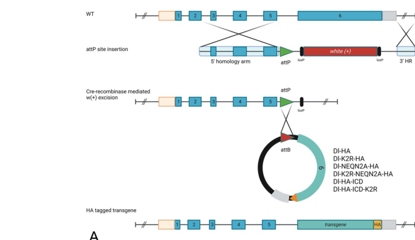
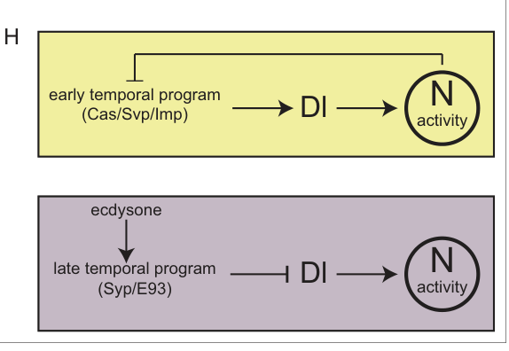

## Question

# Gene Research for Functional Annotation

## ⚠️ CRITICAL: Gene/Protein Identification Context

**BEFORE YOU BEGIN RESEARCH:** You MUST verify you are researching the CORRECT gene/protein. Gene symbols can be ambiguous, especially for less well-characterized genes from non-model organisms.

### Target Gene/Protein Identity (from UniProt):
- **UniProt Accession:** P10041
- **Protein Description:** RecName: Full=Neurogenic locus protein delta {ECO:0000303|PubMed:16453806}; Flags: Precursor;
- **Gene Information:** Name=Delta {ECO:0000303|PubMed:16453806, ECO:0000312|FlyBase:FBgn0000463}; Synonyms=Dl; ORFNames=CG3619 {ECO:0000312|FlyBase:FBgn0000463};
- **Organism (full):** Drosophila melanogaster (Fruit fly).
- **Protein Family:** Not specified in UniProt
- **Key Domains:** DSL. (IPR001774); EGF. (IPR000742); EGF-like_Ca-bd_dom. (IPR001881); EGF-like_CS. (IPR013032); EGF-type_Asp/Asn_hydroxyl_site. (IPR000152)

### MANDATORY VERIFICATION STEPS:

1. **Check if the gene symbol "Delta" matches the protein description above**
2. **Verify the organism is correct:** Drosophila melanogaster (Fruit fly).
3. **Check if protein family/domains align with what you find in literature**
4. **If you find literature for a DIFFERENT gene with the same or similar symbol, STOP**

### If Gene Symbol is Ambiguous or You Cannot Find Relevant Literature:

**DO NOT PROCEED WITH RESEARCH ON A DIFFERENT GENE.** Instead:
- State clearly: "The gene symbol 'Delta' is ambiguous or literature is limited for this specific protein"
- Explain what you found (e.g., "Found extensive literature on a different gene with the same symbol in a different organism")
- Describe the protein based ONLY on the UniProt information provided above
- Suggest that the protein function can be inferred from domain/family information

### Research Target:

Please provide a comprehensive research report on the gene **Delta** (gene ID: Dl, UniProt: P10041) in DROME.

The research report should be a detailed narrative explaining the function, biological processes, and localization of the gene product. Citations should be given for all claims.

You should prioritize authoritative reviews and primary scientific literature when conducting research. You can supplement
this with annotations you find in gene/protein databases, but these can be outdated or inaccurate.

We are specifically interested in the primary function of the gene - for enzymes, what reaction is catalyzed, and what is the substrate specificity? For transporters, what is the substrate? For structural proteins or adapters, what is the broader structural role? For signaling molecules, what is the role in the pathway.

We are interested in where in or outside the cell the gene product carries out its function.

We are also interested in the signaling or biochemical pathways in which the gene functions. We are less interested in broad pleiotropic effects, except where these elucidate the precise role.

Include evidence where possible. We are interested in both experimental evidence as well as inference from structure, evolution, or bioinformatic analysis. Precise studies should be prioritized over high-throughput, where available.

## Output

Question: You are an expert researcher providing comprehensive, well-cited information.

Provide detailed information focusing on:
1. Key concepts and definitions with current understanding
2. Recent developments and latest research (prioritize 2023-2024 sources)
3. Current applications and real-world implementations
4. Expert opinions and analysis from authoritative sources
5. Relevant statistics and data from recent studies

Format as a comprehensive research report with proper citations. Include URLs and publication dates where available.
Always prioritize recent, authoritative sources and provide specific citations for all major claims.

# Gene Research for Functional Annotation

## ⚠️ CRITICAL: Gene/Protein Identification Context

**BEFORE YOU BEGIN RESEARCH:** You MUST verify you are researching the CORRECT gene/protein. Gene symbols can be ambiguous, especially for less well-characterized genes from non-model organisms.

### Target Gene/Protein Identity (from UniProt):
- **UniProt Accession:** P10041
- **Protein Description:** RecName: Full=Neurogenic locus protein delta {ECO:0000303|PubMed:16453806}; Flags: Precursor;
- **Gene Information:** Name=Delta {ECO:0000303|PubMed:16453806, ECO:0000312|FlyBase:FBgn0000463}; Synonyms=Dl; ORFNames=CG3619 {ECO:0000312|FlyBase:FBgn0000463};
- **Organism (full):** Drosophila melanogaster (Fruit fly).
- **Protein Family:** Not specified in UniProt
- **Key Domains:** DSL. (IPR001774); EGF. (IPR000742); EGF-like_Ca-bd_dom. (IPR001881); EGF-like_CS. (IPR013032); EGF-type_Asp/Asn_hydroxyl_site. (IPR000152)

### MANDATORY VERIFICATION STEPS:

1. **Check if the gene symbol "Delta" matches the protein description above**
2. **Verify the organism is correct:** Drosophila melanogaster (Fruit fly).
3. **Check if protein family/domains align with what you find in literature**
4. **If you find literature for a DIFFERENT gene with the same or similar symbol, STOP**

### If Gene Symbol is Ambiguous or You Cannot Find Relevant Literature:

**DO NOT PROCEED WITH RESEARCH ON A DIFFERENT GENE.** Instead:
- State clearly: "The gene symbol 'Delta' is ambiguous or literature is limited for this specific protein"
- Explain what you found (e.g., "Found extensive literature on a different gene with the same symbol in a different organism")
- Describe the protein based ONLY on the UniProt information provided above
- Suggest that the protein function can be inferred from domain/family information

### Research Target:

Please provide a comprehensive research report on the gene **Delta** (gene ID: Dl, UniProt: P10041) in DROME.

The research report should be a detailed narrative explaining the function, biological processes, and localization of the gene product. Citations should be given for all claims.

You should prioritize authoritative reviews and primary scientific literature when conducting research. You can supplement
this with annotations you find in gene/protein databases, but these can be outdated or inaccurate.

We are specifically interested in the primary function of the gene - for enzymes, what reaction is catalyzed, and what is the substrate specificity? For transporters, what is the substrate? For structural proteins or adapters, what is the broader structural role? For signaling molecules, what is the role in the pathway.

We are interested in where in or outside the cell the gene product carries out its function.

We are also interested in the signaling or biochemical pathways in which the gene functions. We are less interested in broad pleiotropic effects, except where these elucidate the precise role.

Include evidence where possible. We are interested in both experimental evidence as well as inference from structure, evolution, or bioinformatic analysis. Precise studies should be prioritized over high-throughput, where available.

# Comprehensive Research Report: Delta (Dl) Gene in Drosophila melanogaster

## Gene Identity Verification

The gene Delta (Dl, UniProt accession P10041) encodes the neurogenic locus protein Delta in *Drosophila melanogaster* (lv2024evolutionandfunction pages 2-4, sachan2023notchsignallingmultifaceted pages 2-2). This is confirmed to be the correct protein, distinct from vertebrate Delta-like proteins or DLK homologs. Delta is one of two canonical Notch ligands in *Drosophila*, the other being Serrate (sood2024deltadependentnotchactivation pages 2-3, chillakuri2012notchreceptor–ligandbinding pages 5-6).

## 1. Protein Structure and Domain Organization

Delta is a type I single-pass transmembrane glycoprotein belonging to the evolutionarily conserved Delta/Serrate/LAG-2 (DSL) family of Notch ligands (pinot2024spatiotemporalregulationof pages 1-2, pinot2024spatiotemporalregulationof pages 2-4, martins2021theconservedc2 pages 1-2). The protein architecture includes:

### Extracellular Domains

**C2 Domain**: At the N-terminus, Delta contains a conserved phospholipid-binding C2 domain that adopts the characteristic C2 fold (martins2021theconservedc2 pages 1-2). Recent structural studies from 2021 revealed that this domain contains variable loop regions, particularly the β1-2 loop, that mediate phospholipid interactions with cell membranes. Deletion of five residues from the β1-2 loop in endogenous Delta reduced liposome binding in vitro and compromised ligand function in vivo without eliminating Notch binding, demonstrating that the C2 domain fine-tunes the balance of trans and cis ligand-receptor interactions (martins2021theconservedc2 pages 1-2).

**DSL Domain**: Following the C2 domain is the DSL (Delta/Serrate/LAG-2) domain, which has a unique fold and forms the principal Notch receptor-binding site (chillakuri2012notchreceptor–ligandbinding pages 5-6, martins2021theconservedc2 pages 1-2). Conserved residues on one face of the DSL domain are critical for receptor interactions (chillakuri2012notchreceptor–ligandbinding pages 5-6).

**EGF-like Repeats**: Delta contains multiple calcium-binding epidermal growth factor (EGF)-like repeats in its extracellular region (pinot2024spatiotemporalregulationof pages 2-4, chillakuri2012notchreceptor–ligandbinding pages 5-6, richards2012theexpressionof pages 2-3). The first two EGF repeats are unusual with short loop sequences and resemble the Delta/OSM-11 (DOS) domain; the remaining EGF repeats are more canonical (chillakuri2012notchreceptor–ligandbinding pages 5-6). These EGF repeats mediate receptor binding, with Notch EGF repeats 11 and 12 serving as the principal Delta-binding region (sachan2023notchsignallingmultifaceted pages 8-8, sachan2023notchsignallingmultifaceted pages 7-8).

### Transmembrane and Intracellular Regions

The single transmembrane segment anchors Delta in the plasma membrane (martins2021theconservedc2 pages 1-2, richards2012theexpressionof pages 2-3). The cytoplasmic intracellular domain (ICD) contains multiple lysines that serve as ubiquitination sites, phosphorylation sites, PDZ-binding motifs, and protein-interaction domains essential for trafficking and signaling regulation (kalodimou2023separablerolesfor pages 17-19, richards2012theexpressionof pages 2-3).

## 2. Primary Molecular Function and Mechanism

### Ligand Function

Delta functions as a membrane-tethered signaling ligand that **trans-activates** the Notch receptor on adjacent cells, thereby converting direct cell-to-cell contact into a transcriptional fate signal (pinot2024spatiotemporalregulationof pages 2-4, sood2024deltadependentnotchactivation pages 2-3, sachan2023notchsignallingmultifaceted pages 2-2). Unlike enzymes or transporters, Delta does not catalyze chemical reactions or transport substrates. Instead, its primary function is receptor activation through physical binding and mechanical force transmission (pinot2024spatiotemporalregulationof pages 2-4, lv2024evolutionandfunction pages 2-4).

### Mechanotransduction Mechanism

The molecular mechanism of Delta-mediated Notch activation involves several sequential steps, as extensively characterized in recent studies:

1. **Receptor Binding**: Delta on the signal-sending cell binds to the Notch receptor on an adjacent signal-receiving cell through interactions between the DSL domain and Notch EGF repeats 11-12 (pinot2024spatiotemporalregulationof pages 2-4, sachan2023notchsignallingmultifaceted pages 8-8, sachan2023notchsignallingmultifaceted pages 7-8).

2. **Mechanical Force Generation**: Following binding, Delta undergoes endocytosis into the signal-sending cell. This internalization generates a mechanical pulling force on the bound Notch receptor (lv2024evolutionandfunction pages 2-4, pinot2024spatiotemporalregulationof pages 10-12). During sensory organ precursor divisions, WASp and Arp2/3-dependent branched-actin polymerization provides additional pushing force for efficient Delta uptake while bound to Notch (pinot2024spatiotemporalregulationof pages 10-12).

3. **Conformational Change**: The pulling force induces conformational changes in Notch's negative regulatory region, exposing the otherwise masked S2 cleavage site (lv2024evolutionandfunction pages 2-4).

4. **Proteolytic Processing**: The ADAM metalloprotease Kuzbanian cleaves Notch at the extracellular S2 site, followed by γ-secretase cleavage at the intramembranous S3 site (pinot2024spatiotemporalregulationof pages 2-4, sood2024deltadependentnotchactivation pages 2-3, lv2024evolutionandfunction pages 2-4).

5. **Nuclear Signaling**: The released Notch intracellular domain (NICD) translocates to the nucleus, where it associates with Suppressor of Hairless [Su(H)] and Mastermind to activate transcription of Notch target genes (pinot2024spatiotemporalregulationof pages 2-4, sood2024deltadependentnotchactivation pages 2-3).

## 3. Subcellular Localization and Functional Sites

Delta is localized primarily at the **plasma membrane** of signal-sending cells, where it carries out its signaling function at cell-cell interfaces (pinot2024spatiotemporalregulationof pages 2-4, kalodimou2023separablerolesfor pages 1-2, pinot2024spatiotemporalregulationof pages 4-6). Recent studies from 2023-2024 have provided detailed spatial resolution:

### Plasma Membrane Localization

Delta is positioned at the cell surface with its large extracellular domain facing the intercellular space and its cytoplasmic tail in the signal-sending cell (pinot2024spatiotemporalregulationof pages 1-2, pinot2024spatiotemporalregulationof pages 2-4). In asymmetrically dividing sensory organ precursor cells, Delta, Notch, and the adaptor protein Sanpodo are enriched in specialized Baz-containing clusters at the daughter-cell interface, facilitating spatially controlled signaling (pinot2024spatiotemporalregulationof pages 4-6).

### Endocytic Compartments

Delta undergoes regulated endocytosis and is found in intracellular puncta representing endocytic vesicles and endosomes (kalodimou2023separablerolesfor pages 14-15, kalodimou2023separablerolesfor pages 17-19). This trafficking is not merely degradative but is essential for generating the force required for Notch activation (kalodimou2023separablerolesfor pages 1-2, kalodimou2023separablerolesfor pages 19-20). Delta does not function as a freely secreted extracellular protein; its activity depends on membrane anchoring and cell-cell contact (pinot2024spatiotemporalregulationof pages 2-4, kalodimou2023separablerolesfor pages 1-2).

## 4. Regulation of Delta Activity

### Ubiquitination and E3 Ligase Regulation

Delta activity is intricately regulated by two E3 ubiquitin ligases: **Neuralized (Neur)** and **Mindbomb1 (Mib1)**, as characterized in multiple 2023 studies:

**Neuralized-Dependent Regulation**: Neur has two separable functions in Delta regulation (kalodimou2023separablerolesfor pages 10-14, kalodimou2023separablerolesfor pages 14-15, kalodimou2023separablerolesfor pages 1-2). First, it acts as an adaptor that directly binds Delta's intracellular domain and promotes ligand internalization. Second, its E3 ubiquitin ligase activity can enhance signaling, though it is not strictly essential. A 2023 study by Troost et al. demonstrated using a knock-in allele (Dl^attP-DlK2R-HA) where all lysines in Delta's ICD were replaced with arginine, that Delta can still provide sufficient activity for completion of development, particularly in Neur-controlled neural development (troost2023themeaningof pages 1-2). Recent work by Kalodimou et al. (2023) showed that the Delta-Neur interaction per se, rather than ubiquitylation, is needed for baseline activity in CNS lineages, supporting the existence of a Delta-Neur signaling complex (kalodimou2023separablerolesfor pages 10-14, kalodimou2023separablerolesfor pages 17-19).

**Mindbomb1-Dependent Regulation**: Mib1 binds to different intracellular motifs (icd2 and icd3) and ubiquitylates multiple Delta lysines (kalodimou2023separablerolesfor pages 17-19). The 2023 Troost study revealed three distinct modes of Delta signaling: Mib1-dependent processes specifically require ubiquitylation for full Delta activity, whereas Neur can efficiently activate Delta without ubiquitylation (troost2023themeaningof pages 1-2). Mib1-dependent ubiquitylation promotes recognition by ubiquitin-sensitive endocytic adaptors and enhances signaling efficiency (kalodimou2023separablerolesfor pages 14-15, kalodimou2023separablerolesfor pages 17-19).

### Endocytosis Requirement

Productive Delta signaling generally requires a specialized, force-generating endocytic event (kalodimou2023separablerolesfor pages 14-15, pinot2024spatiotemporalregulationof pages 10-12, kalodimou2023separablerolesfor pages 1-2). A 2024 review by Pinot and Le Borgne emphasized that during SOP cytokinesis, Neur ubiquitinates Delta, directing it into endocytic vesicles, and this internalization generates the pulling force on Notch required for activation (pinot2024spatiotemporalregulationof pages 10-12). However, simply forcing rapid endocytosis through artificial means does not restore signaling, demonstrating that the Delta-Neur interaction itself is essential beyond mere internalization (kalodimou2023separablerolesfor pages 14-15). The endocytic adaptor Epsin is important in many contexts but is largely dispensable in CNS lineage signaling, where Delta-Neur employs a specialized, dynamin-dependent but Epsin-independent pathway (kalodimou2023separablerolesfor pages 14-15, troost2023themeaningof pages 1-2).

### Trans-Activation versus Cis-Inhibition

Delta exhibits dual regulatory interactions with Notch (troost2023themeaningof pages 1-2, sood2024deltadependentnotchactivation pages 2-3, kalodimou2023separablerolesfor pages 17-19):

**Trans-activation**: Delta on one cell binds and activates Notch on a neighboring cell, the productive signaling mode (pinot2024spatiotemporalregulationof pages 2-4, sood2024deltadependentnotchactivation pages 2-3).

**Cis-inhibition**: When Delta and Notch are coexpressed in the same cell, Delta can bind Notch in cis and reduce that cell's responsiveness to Delta from neighboring cells (sood2024deltadependentnotchactivation pages 2-3, kalodimou2023separablerolesfor pages 17-19). The 2023 Troost study found that Delta's intracellular lysines help tune down this cis-inhibitory interaction, and ubiquitylation-dependent or -independent endocytosis can remove Delta from inhibitory cis complexes (troost2023themeaningof pages 1-2, kalodimou2023separablerolesfor pages 17-19).

## 5. Signaling Pathways and Biological Functions

Delta functions exclusively through the canonical Notch signaling pathway, which is essential for cell fate determination, tissue patterning, and developmental timing throughout *Drosophila* development (lv2024evolutionandfunction pages 2-4, sachan2023notchsignallingmultifaceted pages 2-2). The following sections detail Delta's context-specific roles based on recent research.

### Neurogenesis and Lateral Inhibition

Delta plays a central role in embryonic neurogenesis through the lateral inhibition mechanism (sachan2023notchsignallingmultifaceted pages 4-4). During neural development, proneural genes confer neural competence to clusters of equivalent cells. The cell that will become a neuroblast or sensory organ precursor (SOP) expresses particularly high levels of Delta, which activates Notch signaling in adjacent cells (sachan2023notchsignallingmultifaceted pages 4-4). Notch activation in neighboring cells suppresses their proneural gene expression, preventing them from adopting neural fates and directing them instead toward epidermal differentiation (sachan2023notchsignallingmultifaceted pages 4-4). Loss of Notch function disrupts this inhibitory mechanism, leading to excessive neuron production at the expense of epidermis, the hallmark "neurogenic phenotype" (sachan2023notchsignallingmultifaceted pages 4-4).

### Neuroblast Asymmetric Divisions and Temporal Patterning

A significant advance in 2024 came from Sood et al., who demonstrated that Delta-dependent Notch activation controls neuroblast temporal programs and neurogenesis termination (sood2024deltadependentnotchactivation pages 2-3, sood2024deltadependentnotchactivation pages 11-12). In central brain neuroblasts (CB NBs), Delta is expressed by neuroblasts and becomes segregated into their ganglion mother cell (GMC) daughters after division. Delta on neighboring GMCs and cortex glia transactivates Notch in neuroblasts (sood2024deltadependentnotchactivation pages 2-3). This local cell-cell signaling brings the early temporal program to a close, promotes expression of late temporal factors, and contributes to neuroblast elimination and termination of neurogenesis during pupal development (sood2024deltadependentnotchactivation pages 2-3).

Importantly, Delta expression itself is temporally regulated: the early temporal factor Imp promotes Delta, while late factors Syp and E93 reduce Delta expression (sood2024deltadependentnotchactivation pages 2-3, sood2024deltadependentnotchactivation pages 11-12, sood2024deltadependentnotchactivation media d029057c). This creates a temporal switch where high early Delta supports Notch activity to close the early program, while declining Delta as late factors accumulate helps neuroblasts progress toward terminal differentiation (sood2024deltadependentnotchactivation pages 11-12, sood2024deltadependentnotchactivation media d029057c).

### CNS Lineage Development

In central nervous system lineages, Delta mediates sibling-cell fate specification during asymmetric divisions (kalodimou2023separablerolesfor pages 5-7, kalodimou2023separablerolesfor pages 17-19). Neuroblasts undergo asymmetric divisions that maintain the stem-cell lineage while producing GMCs; each GMC then divides asymmetrically to generate sibling cells with different fates. A 2023 study by Kalodimou et al. showed that Delta, together with Neuralized, is central to this asymmetric fate adoption process, with Delta prominently expressed throughout neuroblast lineages (kalodimou2023separablerolesfor pages 5-7). Delta-mediated lateral inhibition ensures neighboring sibling cells receive different Notch signals and adopt distinct identities (kalodimou2023separablerolesfor pages 5-7).

### Sensory Organ Precursor Development

In sensory organ development, Delta functions at two stages (pinot2024spatiotemporalregulationof pages 4-6, pinot2024spatiotemporalregulationof pages 10-12). First, Delta-Notch lateral inhibition spaces SOPs across the epithelium during their selection (pinot2024spatiotemporalregulationof pages 4-6). Second, during SOP cytokinesis, Delta concentrated in the Neuralized-enriched pIIb daughter cell activates Notch in the pIIa daughter at specialized Baz-containing clusters at the cell interface (pinot2024spatiotemporalregulationof pages 4-6, pinot2024spatiotemporalregulationof pages 10-12). This establishes the binary pIIa versus pIIb fate decision essential for mechanosensory organ construction (pinot2024spatiotemporalregulationof pages 10-12).

### Additional Developmental Contexts

Delta functions broadly across *Drosophila* development (chen2023notchsignalingin pages 21-22, nair2024extramacrochaetaeregulatesnotch pages 22-23, martin2023anovelproneural pages 27-28):

- **Wing and eye development**: Delta activates Notch to coordinate wing-vein and boundary patterning, growth control, and retinal-cell specification. Abnormal Delta accumulation can inhibit Notch in cis and disrupt photoreceptor or cone-cell differentiation (nair2024extramacrochaetaeregulatesnotch pages 22-23, kalodimou2023separablerolesfor pages 17-19).

- **Germline stem-cell niche**: Membrane-bound Delta supplies short-range signals to Notch-expressing somatic cells, supporting niche establishment and germline lineage survival (pinot2024spatiotemporalregulationof pages 2-4).

- **Intestinal stem cells**: In the adult intestine, Delta from stem cells activates Notch in daughter cells to promote enteroblast/enterocyte differentiation and distinguish this from enteroendocrine lineage specification (troost2023themeaningof media 63375e68, troost2023themeaningof media 7449e3a3).

## 6. Recent Developments (2023-2024)

Several key advances have been made in understanding Delta function:

1. **Ubiquitin-independent signaling**: The 2023 Troost et al. study using a knock-in lysine-deficient Delta allele demonstrated that ubiquitylation is not absolutely required for Delta signaling, particularly in Neur-dependent contexts, challenging the long-held assumption that ubiquitylation is essential (troost2023themeaningof pages 1-2).

2. **Temporal control of neurogenesis**: The 2024 Sood et al. study revealed Delta's role in controlling neuroblast temporal programs and identified the intrinsic temporal factors (Imp, Syp, E93) that regulate Delta expression levels (sood2024deltadependentnotchactivation pages 2-3, sood2024deltadependentnotchactivation pages 11-12, sood2024deltadependentnotchactivation media d029057c).

3. **Separable Neur functions**: The 2023 Kalodimou et al. study dissected Neuralized's dual roles as both an E3 ligase and an endocytic adaptor, showing that the adaptor function can support Delta signaling even without catalytic activity (kalodimou2023separablerolesfor pages 10-14, kalodimou2023separablerolesfor pages 14-15, kalodimou2023separablerolesfor pages 17-19).

4. **Spatiotemporal regulation**: The 2024 Pinot and Le Borgne review synthesized current understanding of how epithelial cell polarity, cell cycle, and intracellular trafficking control the directionality, subcellular localization, and timing of Delta-mediated Notch activation during asymmetric divisions (pinot2024spatiotemporalregulationof pages 10-12).

## 7. Summary Tables

| Developmental context | Delta-expressing/signal-sending cell | Specific Delta function | Developmental or biological outcome | Evidence |
|---|---|---|---|---|
| Neurogenesis and lateral inhibition | Prospective neuroblast or sensory precursor with relatively high Delta | Activates Notch in adjacent equipotent cells, suppressing their proneural program and amplifying initially small differences between neighboring cells | Restricts neural fate to selected precursors; neighboring cells adopt epidermal or other non-neural identities. Loss of this communication causes excess neural differentiation at the expense of epidermis | (sachan2023notchsignallingmultifaceted pages 4-4) |
| Neuroblast asymmetric divisions and CNS sibling-fate decisions | Neuroblasts, ganglion mother cells, or one daughter/sibling cell; signaling competence is promoted by Neuralized | Delta engages Notch on the adjacent sibling. Neuralized-dependent ligand internalization helps generate the pulling force required for receptor activation | Produces unequal Notch activity and distinct sibling-cell identities during CNS lineage development | (kalodimou2023separablerolesfor pages 5-7, kalodimou2023separablerolesfor pages 17-19, pinot2024spatiotemporalregulationof pages 10-12) |
| Neuroblast temporal patterning and neurogenesis termination | Central-brain neuroblasts, cortex glia, and ganglion mother-cell progeny | Neighbor-derived Delta transactivates Notch in neuroblasts. The early factor Imp promotes Delta, whereas late factors Syp and E93 reduce its expression | Closes the early temporal program, promotes progression to late temporal states, and contributes to eventual neuroblast elimination and termination of neurogenesis | (sood2024deltadependentnotchactivation pages 2-3, sood2024deltadependentnotchactivation pages 11-12, sood2024deltadependentnotchactivation media d029057c) |
| Sensory-organ precursor specification and daughter-cell diversification | High-Delta prospective SOPs during selection; after SOP division, the Neuralized-enriched pIIb daughter is the principal signal sender | Before division, Delta–Notch lateral inhibition spaces SOPs in the epithelium. During cytokinesis, Delta endocytosis in pIIb activates Notch in pIIa at specialized daughter-cell interfaces | Selects appropriately spaced SOPs and establishes the pIIa versus pIIb binary fate decision that builds mechanosensory organs | (pinot2024spatiotemporalregulationof pages 4-6, pinot2024spatiotemporalregulationof pages 10-12) |
| Wing and eye development | Spatially patterned epithelial or differentiating retinal cells | Delta activates Notch across cell boundaries to coordinate tissue patterning; signaling is influenced by ligand dosage, trafficking, cis-inhibition, and interactions with other developmental pathways | Contributes to wing-vein and boundary patterning, growth control, retinal-cell specification, and progression of the eye differentiation wave; abnormal Delta accumulation can inhibit Notch in cis and disrupt R7 or cone-cell differentiation | (chen2023notchsignalingin pages 21-22, nair2024extramacrochaetaeregulatesnotch pages 22-23, martin2023anovelproneural pages 27-28, kalodimou2023separablerolesfor pages 17-19) |
| Germline stem-cell niche and germline–soma coordination | Germline or neighboring niche-associated cells, depending on developmental stage and gonadal context | Membrane-bound Delta supplies a short-range signal to Notch-expressing adjacent somatic cells, coupling germline development to specification or maintenance of its supporting cellular environment | Supports establishment of gonadal niche identities and continued survival or differentiation of the germline lineage through direct germline–somatic communication | (pinot2024spatiotemporalregulationof pages 2-4) |
| Intestinal stem-cell differentiation | Adult intestinal stem cell | Delta activates Notch in the adjacent daughter cell; signal strength and cell context bias differentiation toward alternative intestinal progenitor outcomes | Promotes enteroblast/enterocyte differentiation and helps distinguish this trajectory from enteroendocrine-lineage specification, thereby supporting epithelial homeostasis | (troost2023themeaningof media 63375e68, troost2023themeaningof media 7449e3a3) |

*Table: This table organizes the principal experimentally supported roles of Drosophila Delta by tissue and developmental context. It distinguishes the signal-sending cells, local Notch mechanism, and resulting fate or tissue-level outcome.*

| Property | Functional annotation | Evidence and interpretation |
|---|---|---|
| Identity | **Delta (Dl; UniProt P10041)** is the *Drosophila melanogaster* neurogenic-locus protein Delta—not a vertebrate Delta-like protein or DLK paralogue. | Literature identifies fly Dl as one of two canonical Notch ligands, the other being Serrate, consistent with the supplied UniProt identity. (lv2024evolutionandfunction pages 2-4, sood2024deltadependentnotchactivation pages 2-3) |
| Protein type | Precursor-encoded, single-pass **type-I transmembrane glycoprotein** and canonical member of the **Delta/Serrate/LAG-2 (DSL) ligand family**; it is a signaling ligand, not an enzyme or transporter. | Its large extracellular region faces the intercellular space, followed by one transmembrane segment and a cytoplasmic tail. (pinot2024spatiotemporalregulationof pages 1-2, martins2021theconservedc2 pages 1-2, richards2012theexpressionof pages 2-3) |
| Domain architecture | The extracellular region contains an N-terminal phospholipid-binding **C2 domain**, the receptor-binding **DSL domain**, and multiple EGF-like repeats, including calcium-binding EGF-like features; the cytoplasmic tail contains lysines and ligase-interaction motifs involved in trafficking. | Mutation of the C2-domain β1–2 loop impaired phospholipid binding and robust in-vivo signaling without eliminating Notch binding, separating membrane engagement from receptor recognition. (chillakuri2012notchreceptor–ligandbinding pages 5-6, martins2021theconservedc2 pages 1-2, richards2012theexpressionof pages 2-3) |
| Primary molecular function | Delta is a membrane-tethered ligand that **trans-activates Notch** on an adjacent cell, thereby converting direct cell contact into a transcriptional cell-fate signal. | Delta engages the Notch extracellular domain; Notch EGF repeats 11–12 constitute a principal Delta-binding region. (pinot2024spatiotemporalregulationof pages 2-4, sachan2023notchsignallingmultifaceted pages 8-8, sachan2023notchsignallingmultifaceted pages 7-8) |
| Core signaling mechanism | Ligand binding plus pulling exposes Notch’s normally protected S2 site. Kuzbanian/ADAM cleavage at S2 is followed by γ-secretase cleavage at S3; released Notch intracellular domain enters the nucleus and complexes with Suppressor of Hairless and Mastermind to regulate target genes. | Delta therefore initiates canonical Notch mechanotransduction but does not itself catalyze receptor proteolysis. (pinot2024spatiotemporalregulationof pages 2-4, sood2024deltadependentnotchactivation pages 2-3, lv2024evolutionandfunction pages 2-4) |
| Mechanical force generation | Endocytosis of receptor-bound Delta into the signal-sending cell applies tensile force to Notch, changing the receptor conformation so that S2 becomes protease-accessible. | During sensory-organ lineage signaling, WASp/Arp2/3-dependent actin polymerization assists Delta uptake and force production. (lv2024evolutionandfunction pages 2-4, pinot2024spatiotemporalregulationof pages 10-12, pinot2024spatiotemporalregulationof pages 16-17) |
| Principal binding and regulatory partners | **Notch** is the receptor; **Neuralized (Neur)** and **Mindbomb1 (Mib1)** are E3 ligases that engage Delta’s intracellular region; endocytic factors include dynamin and, in many contexts, Epsin. | Neur binds strongly to one intracellular motif and can remain in a signaling/endocytic complex, whereas Mib1 recognizes additional motifs and promotes lysine ubiquitylation. (kalodimou2023separablerolesfor pages 17-19, kalodimou2023separablerolesfor pages 1-2, troost2023themeaningof pages 1-2) |
| Subcellular localization | Functional Delta resides at the **plasma membrane of the signal-sending cell**, particularly at cell–cell contacts, with its DSL/EGF-containing region extracellular and its tail cytoplasmic. It subsequently enters endocytic vesicles and endosomes. | In sensory-organ daughters, Delta, Notch, and Sanpodo occupy specialized clusters at the intercellular interface; intracellular Delta puncta reflect regulated trafficking rather than a freely secreted mode of action. (pinot2024spatiotemporalregulationof pages 2-4, kalodimou2023separablerolesfor pages 17-19, pinot2024spatiotemporalregulationof pages 4-6) |
| Neur-dependent regulation | Neur promotes Delta internalization and signaling through separable **adaptor** and **E3-ligase** functions. Direct Delta–Neur complex formation can support signaling even when Delta lysines or Neur’s catalytic RING activity are compromised. | Recent CNS-lineage experiments show that ubiquitylation increases efficiency but is not an absolute requirement for Neur-dependent Delta activity. (kalodimou2023separablerolesfor pages 10-14, kalodimou2023separablerolesfor pages 14-15, kalodimou2023separablerolesfor pages 1-2) |
| Mib1-dependent regulation | Mib1-dependent signaling relies more strongly on ubiquitylation of Delta’s intracellular lysines, which recruits ubiquitin-sensitive trafficking machinery and supports productive endocytosis. | A lysine-deficient knock-in retained enough activity to complete development, but Mib1-dependent processes showed reduced activity, demonstrating tissue-specific rather than universal ubiquitin dependence. (kalodimou2023separablerolesfor pages 17-19, troost2023themeaningof pages 1-2, kalodimou2023separablerolesfor pages 15-17) |
| Endocytosis requirement | Productive signaling generally requires a specialized, force-generating endocytic event; mere bulk removal of Delta or artificially rapid internalization is insufficient. Dynamin is important, whereas Epsin dependence varies by tissue and signaling mode. | Forced endocytosis did not substitute for the Delta–Neur interaction in CNS lineages; other developmental contexts require Epsin-mediated uptake. (kalodimou2023separablerolesfor pages 14-15, pinot2024spatiotemporalregulationof pages 10-12, troost2023themeaningof pages 1-2) |
| Trans-activation versus cis-inhibition | Delta on one cell activates Notch **in trans** on a neighbor, but Delta coexpressed with Notch can bind or sequester it **in cis**, reducing that cell’s responsiveness. | Ubiquitylation-dependent or -independent trafficking can remove Delta from inhibitory cis complexes and tune the balance between signal sending and receiving. (troost2023themeaningof pages 1-2, sood2024deltadependentnotchactivation pages 2-3, kalodimou2023separablerolesfor pages 17-19) |
| Functional consequence | Delta-driven Notch signaling establishes unequal signaling states between neighboring cells, supporting lateral inhibition, asymmetric sibling-fate decisions, temporal lineage progression, and termination of neurogenesis. | High Delta in a selected neural precursor activates Notch in neighbors and suppresses their proneural program; in central-brain lineages, Delta from GMCs and glia activates neuroblast Notch to close the early temporal program. (sachan2023notchsignallingmultifaceted pages 4-4, kalodimou2023separablerolesfor pages 5-7, sood2024deltadependentnotchactivation pages 2-3) |

*Table: Key molecular properties of Drosophila Delta (Dl/P10041), integrating its DSL-ligand identity, membrane localization, force-dependent Notch activation, and context-dependent regulation by ubiquitylation and endocytosis.*

## 8. Visual Evidence

Recent structural and functional studies have provided visual representations of Delta organization and signaling contexts (troost2023themeaningof media 63375e68, troost2023themeaningof media 7449e3a3, sood2024deltadependentnotchactivation media d029057c). These include domain organization schematics showing the arrangement of Delta variants and their intracellular modifications, pathway diagrams illustrating Delta-Notch signaling in intestinal stem cell lineages, and temporal patterning models showing how early and late temporal programs differentially regulate Delta expression to control Notch activity.

## Conclusions

Delta (Dl/P10041) is a membrane-anchored signaling ligand of the DSL family that functions as the primary activator of canonical Notch signaling in *Drosophila melanogaster*. Its molecular mechanism involves trans-binding to Notch receptors on adjacent cells, followed by endocytosis-driven mechanical force generation that triggers proteolytic activation of the receptor. Delta is localized at the plasma membrane where it functions at cell-cell interfaces, and its activity is regulated through complex interactions with E3 ubiquitin ligases Neuralized and Mindbomb1, though recent evidence demonstrates that ubiquitylation enhances rather than enables signaling in many contexts.

Delta plays essential roles throughout development, most prominently in neurogenesis through lateral inhibition, neuroblast temporal patterning and lineage progression, asymmetric cell fate decisions, and tissue patterning. Recent 2023-2024 studies have revealed new dimensions of Delta regulation, including context-dependent ubiquitin requirements, intrinsic temporal control mechanisms, and separable adaptor versus enzymatic functions of its regulatory partners.

The protein's function can be inferred from its conserved domain architecture (C2, DSL, EGF repeats) and extensive experimental characterization in multiple developmental contexts, supported by genetic, biochemical, cell biological, and structural studies spanning over a century of *Drosophila* research.

References

1. (lv2024evolutionandfunction pages 2-4): Yan Lv, Xuan Pang, Zhonghong Cao, Changping Song, Baohua Liu, Weiwei Wu, and Qiuxiang Pang. Evolution and function of the notch signaling pathway: an invertebrate perspective. International Journal of Molecular Sciences, 25:3322, Mar 2024. URL: https://doi.org/10.3390/ijms25063322, doi:10.3390/ijms25063322. This article has 36 citations.

2. (sachan2023notchsignallingmultifaceted pages 2-2): Nalani Sachan, Vartika Sharma, Mousumi Mutsuddi, and Ashim Mukherjee. Notch signalling: multifaceted role in development and disease. The FEBS Journal, 291:3030-3059, May 2024. URL: https://doi.org/10.1111/febs.16815, doi:10.1111/febs.16815. This article has 124 citations.

3. (sood2024deltadependentnotchactivation pages 2-3): Chhavi Sood, Md Ausrafuggaman Nahid, Kendall R. Branham, Matthew C. Pahl, Susan E. Doyle, and Sarah E. Siegrist. Delta-dependent notch activation closes the early neuroblast temporal program to promote lineage progression and neurogenesis termination in drosophila. ArXiv, Nov 2024. URL: https://doi.org/10.7554/elife.88565.2, doi:10.7554/elife.88565.2. This article has 16 citations.

4. (chillakuri2012notchreceptor–ligandbinding pages 5-6): Chandramouli R. Chillakuri, Devon Sheppard, Susan M. Lea, and Penny A. Handford. Notch receptor–ligand binding and activation: insights from molecular studies. Seminars in Cell & Developmental Biology, 23:421-428, Jun 2012. URL: https://doi.org/10.1016/j.semcdb.2012.01.009, doi:10.1016/j.semcdb.2012.01.009. This article has 295 citations and is from a peer-reviewed journal.

5. (pinot2024spatiotemporalregulationof pages 1-2): Mathieu Pinot and Roland Le Borgne. Spatio-temporal regulation of notch activation in asymmetrically dividing sensory organ precursor cells in drosophila melanogaster epithelium. Cells, 13:1133, Jun 2024. URL: https://doi.org/10.3390/cells13131133, doi:10.3390/cells13131133. This article has 3 citations.

6. (pinot2024spatiotemporalregulationof pages 2-4): Mathieu Pinot and Roland Le Borgne. Spatio-temporal regulation of notch activation in asymmetrically dividing sensory organ precursor cells in drosophila melanogaster epithelium. Cells, 13:1133, Jun 2024. URL: https://doi.org/10.3390/cells13131133, doi:10.3390/cells13131133. This article has 3 citations.

7. (martins2021theconservedc2 pages 1-2): Torcato Martins, Yao Meng, Boguslawa Korona, Richard Suckling, Steven Johnson, Penny A Handford, Susan M Lea, and Sarah J Bray. The conserved c2 phospholipid‐binding domain in delta contributes to robust notch signalling. EMBO Reports, Aug 2021. URL: https://doi.org/10.15252/embr.202152729, doi:10.15252/embr.202152729. This article has 10 citations and is from a highest quality peer-reviewed journal.

8. (richards2012theexpressionof pages 2-3): Gemma S Richards and Bernard M Degnan. The expression of delta ligands in the sponge amphimedon queenslandica suggests an ancient role for notch signaling in metazoan development. EvoDevo, 3:15-15, Jul 2012. URL: https://doi.org/10.1186/2041-9139-3-15, doi:10.1186/2041-9139-3-15. This article has 54 citations and is from a peer-reviewed journal.

9. (sachan2023notchsignallingmultifaceted pages 8-8): Nalani Sachan, Vartika Sharma, Mousumi Mutsuddi, and Ashim Mukherjee. Notch signalling: multifaceted role in development and disease. The FEBS Journal, 291:3030-3059, May 2024. URL: https://doi.org/10.1111/febs.16815, doi:10.1111/febs.16815. This article has 124 citations.

10. (sachan2023notchsignallingmultifaceted pages 7-8): Nalani Sachan, Vartika Sharma, Mousumi Mutsuddi, and Ashim Mukherjee. Notch signalling: multifaceted role in development and disease. The FEBS Journal, 291:3030-3059, May 2024. URL: https://doi.org/10.1111/febs.16815, doi:10.1111/febs.16815. This article has 124 citations.

11. (kalodimou2023separablerolesfor pages 17-19): Konstantina Kalodimou, Margarita Stapountzi, Nicole Vüllings, Ekaterina Seib, Thomas Klein, and Christos Delidakis. Separable roles for neur and ubiquitin in delta signalling in the drosophila cns lineages. Cells, 12:2833, Dec 2023. URL: https://doi.org/10.3390/cells12242833, doi:10.3390/cells12242833. This article has 4 citations.

12. (pinot2024spatiotemporalregulationof pages 10-12): Mathieu Pinot and Roland Le Borgne. Spatio-temporal regulation of notch activation in asymmetrically dividing sensory organ precursor cells in drosophila melanogaster epithelium. Cells, 13:1133, Jun 2024. URL: https://doi.org/10.3390/cells13131133, doi:10.3390/cells13131133. This article has 3 citations.

13. (kalodimou2023separablerolesfor pages 1-2): Konstantina Kalodimou, Margarita Stapountzi, Nicole Vüllings, Ekaterina Seib, Thomas Klein, and Christos Delidakis. Separable roles for neur and ubiquitin in delta signalling in the drosophila cns lineages. Cells, 12:2833, Dec 2023. URL: https://doi.org/10.3390/cells12242833, doi:10.3390/cells12242833. This article has 4 citations.

14. (pinot2024spatiotemporalregulationof pages 4-6): Mathieu Pinot and Roland Le Borgne. Spatio-temporal regulation of notch activation in asymmetrically dividing sensory organ precursor cells in drosophila melanogaster epithelium. Cells, 13:1133, Jun 2024. URL: https://doi.org/10.3390/cells13131133, doi:10.3390/cells13131133. This article has 3 citations.

15. (kalodimou2023separablerolesfor pages 14-15): Konstantina Kalodimou, Margarita Stapountzi, Nicole Vüllings, Ekaterina Seib, Thomas Klein, and Christos Delidakis. Separable roles for neur and ubiquitin in delta signalling in the drosophila cns lineages. Cells, 12:2833, Dec 2023. URL: https://doi.org/10.3390/cells12242833, doi:10.3390/cells12242833. This article has 4 citations.

16. (kalodimou2023separablerolesfor pages 19-20): Konstantina Kalodimou, Margarita Stapountzi, Nicole Vüllings, Ekaterina Seib, Thomas Klein, and Christos Delidakis. Separable roles for neur and ubiquitin in delta signalling in the drosophila cns lineages. Cells, 12:2833, Dec 2023. URL: https://doi.org/10.3390/cells12242833, doi:10.3390/cells12242833. This article has 4 citations.

17. (kalodimou2023separablerolesfor pages 10-14): Konstantina Kalodimou, Margarita Stapountzi, Nicole Vüllings, Ekaterina Seib, Thomas Klein, and Christos Delidakis. Separable roles for neur and ubiquitin in delta signalling in the drosophila cns lineages. Cells, 12:2833, Dec 2023. URL: https://doi.org/10.3390/cells12242833, doi:10.3390/cells12242833. This article has 4 citations.

18. (troost2023themeaningof pages 1-2): Tobias Troost, Ekaterina Seib, Alina Airich, Nicole Vüllings, Aleksandar Necakov, Stefano De Renzis, and Thomas Klein. The meaning of ubiquitylation of the dsl ligand delta for the development of drosophila. BMC Biology, Nov 2023. URL: https://doi.org/10.1186/s12915-023-01759-z, doi:10.1186/s12915-023-01759-z. This article has 9 citations and is from a domain leading peer-reviewed journal.

19. (sachan2023notchsignallingmultifaceted pages 4-4): Nalani Sachan, Vartika Sharma, Mousumi Mutsuddi, and Ashim Mukherjee. Notch signalling: multifaceted role in development and disease. The FEBS Journal, 291:3030-3059, May 2024. URL: https://doi.org/10.1111/febs.16815, doi:10.1111/febs.16815. This article has 124 citations.

20. (sood2024deltadependentnotchactivation pages 11-12): Chhavi Sood, Md Ausrafuggaman Nahid, Kendall R. Branham, Matthew C. Pahl, Susan E. Doyle, and Sarah E. Siegrist. Delta-dependent notch activation closes the early neuroblast temporal program to promote lineage progression and neurogenesis termination in drosophila. ArXiv, Nov 2024. URL: https://doi.org/10.7554/elife.88565.2, doi:10.7554/elife.88565.2. This article has 16 citations.

21. (sood2024deltadependentnotchactivation media d029057c): Chhavi Sood, Md Ausrafuggaman Nahid, Kendall R. Branham, Matthew C. Pahl, Susan E. Doyle, and Sarah E. Siegrist. Delta-dependent notch activation closes the early neuroblast temporal program to promote lineage progression and neurogenesis termination in drosophila. ArXiv, Nov 2024. URL: https://doi.org/10.7554/elife.88565.2, doi:10.7554/elife.88565.2. This article has 16 citations.

22. (kalodimou2023separablerolesfor pages 5-7): Konstantina Kalodimou, Margarita Stapountzi, Nicole Vüllings, Ekaterina Seib, Thomas Klein, and Christos Delidakis. Separable roles for neur and ubiquitin in delta signalling in the drosophila cns lineages. Cells, 12:2833, Dec 2023. URL: https://doi.org/10.3390/cells12242833, doi:10.3390/cells12242833. This article has 4 citations.

23. (chen2023notchsignalingin pages 21-22): Yao Chen, Haomiao Li, Tian-Ci Yi, Jie Shen, and Junzheng Zhang. Notch signaling in insect development: a simple pathway with diverse functions. International Journal of Molecular Sciences, 24:14028, Sep 2023. URL: https://doi.org/10.3390/ijms241814028, doi:10.3390/ijms241814028. This article has 35 citations.

24. (nair2024extramacrochaetaeregulatesnotch pages 22-23): Sudershana Nair and Nicholas E Baker. Extramacrochaetae regulates notch signaling in the drosophila eye through non-apoptotic caspase activity. Oct 2024. URL: https://doi.org/10.7554/elife.91988.2, doi:10.7554/elife.91988.2. This article has 6 citations.

25. (martin2023anovelproneural pages 27-28): Mercedes Martin, Francisco Gutierrez-Avino, Mirja N. Shaikh, and Francisco J. Tejedor. A novel proneural function of asense is integrated with the sequential actions of delta-notch, l’sc and su(h) to promote the neuroepithelial to neuroblast transition. PLOS Genetics, 19:e1010991, Oct 2023. URL: https://doi.org/10.1371/journal.pgen.1010991, doi:10.1371/journal.pgen.1010991. This article has 1 citations and is from a domain leading peer-reviewed journal.

26. (troost2023themeaningof media 63375e68): Tobias Troost, Ekaterina Seib, Alina Airich, Nicole Vüllings, Aleksandar Necakov, Stefano De Renzis, and Thomas Klein. The meaning of ubiquitylation of the dsl ligand delta for the development of drosophila. BMC Biology, Nov 2023. URL: https://doi.org/10.1186/s12915-023-01759-z, doi:10.1186/s12915-023-01759-z. This article has 9 citations and is from a domain leading peer-reviewed journal.

27. (troost2023themeaningof media 7449e3a3): Tobias Troost, Ekaterina Seib, Alina Airich, Nicole Vüllings, Aleksandar Necakov, Stefano De Renzis, and Thomas Klein. The meaning of ubiquitylation of the dsl ligand delta for the development of drosophila. BMC Biology, Nov 2023. URL: https://doi.org/10.1186/s12915-023-01759-z, doi:10.1186/s12915-023-01759-z. This article has 9 citations and is from a domain leading peer-reviewed journal.

28. (pinot2024spatiotemporalregulationof pages 16-17): Mathieu Pinot and Roland Le Borgne. Spatio-temporal regulation of notch activation in asymmetrically dividing sensory organ precursor cells in drosophila melanogaster epithelium. Cells, 13:1133, Jun 2024. URL: https://doi.org/10.3390/cells13131133, doi:10.3390/cells13131133. This article has 3 citations.

29. (kalodimou2023separablerolesfor pages 15-17): Konstantina Kalodimou, Margarita Stapountzi, Nicole Vüllings, Ekaterina Seib, Thomas Klein, and Christos Delidakis. Separable roles for neur and ubiquitin in delta signalling in the drosophila cns lineages. Cells, 12:2833, Dec 2023. URL: https://doi.org/10.3390/cells12242833, doi:10.3390/cells12242833. This article has 4 citations.

## Artifacts

- [Edison artifact artifact-00](Dl-deep-research-falcon_artifacts/artifact-00.md)
- [Edison artifact artifact-01](Dl-deep-research-falcon_artifacts/artifact-01.md)

## Citations

1. pinot2024spatiotemporalregulationof pages 10-12
2. lv2024evolutionandfunction pages 2-4
3. pinot2024spatiotemporalregulationof pages 4-6
4. troost2023themeaningof pages 1-2
5. kalodimou2023separablerolesfor pages 17-19
6. kalodimou2023separablerolesfor pages 14-15
7. sachan2023notchsignallingmultifaceted pages 4-4
8. sood2024deltadependentnotchactivation pages 2-3
9. kalodimou2023separablerolesfor pages 5-7
10. pinot2024spatiotemporalregulationof pages 2-4
11. sachan2023notchsignallingmultifaceted pages 2-2
12. pinot2024spatiotemporalregulationof pages 1-2
13. richards2012theexpressionof pages 2-3
14. sachan2023notchsignallingmultifaceted pages 8-8
15. sachan2023notchsignallingmultifaceted pages 7-8
16. kalodimou2023separablerolesfor pages 1-2
17. kalodimou2023separablerolesfor pages 19-20
18. kalodimou2023separablerolesfor pages 10-14
19. sood2024deltadependentnotchactivation pages 11-12
20. chen2023notchsignalingin pages 21-22
21. nair2024extramacrochaetaeregulatesnotch pages 22-23
22. martin2023anovelproneural pages 27-28
23. pinot2024spatiotemporalregulationof pages 16-17
24. kalodimou2023separablerolesfor pages 15-17
25. Su(H)
26. https://doi.org/10.3390/ijms25063322,
27. https://doi.org/10.1111/febs.16815,
28. https://doi.org/10.7554/elife.88565.2,
29. https://doi.org/10.1016/j.semcdb.2012.01.009,
30. https://doi.org/10.3390/cells13131133,
31. https://doi.org/10.15252/embr.202152729,
32. https://doi.org/10.1186/2041-9139-3-15,
33. https://doi.org/10.3390/cells12242833,
34. https://doi.org/10.1186/s12915-023-01759-z,
35. https://doi.org/10.3390/ijms241814028,
36. https://doi.org/10.7554/elife.91988.2,
37. https://doi.org/10.1371/journal.pgen.1010991,