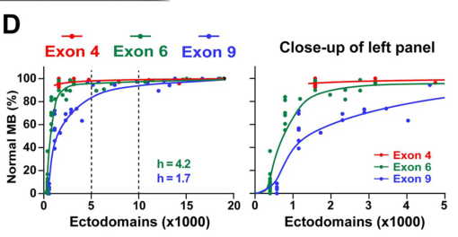

## Question

# Gene Research for Functional Annotation

## ⚠️ CRITICAL: Gene/Protein Identification Context

**BEFORE YOU BEGIN RESEARCH:** You MUST verify you are researching the CORRECT gene/protein. Gene symbols can be ambiguous, especially for less well-characterized genes from non-model organisms.

### Target Gene/Protein Identity (from UniProt):
- **UniProt Accession:** Q0E9H9
- **Protein Description:** RecName: Full=Cell adhesion molecule Dscam1 {ECO:0000305}; AltName: Full=Down syndrome cell adhesion molecule homolog {ECO:0000305}; Flags: Precursor;
- **Gene Information:** Name=Dscam1 {ECO:0000312|FlyBase:FBgn0033159}; Synonyms=Dscam {ECO:0000303|PubMed:10892653, ECO:0000312|FlyBase:FBgn0033159}, p270 {ECO:0000303|PubMed:10892653, ECO:0000312|FlyBase:FBgn0033159}; ORFNames=CG17800 {ECO:0000312|FlyBase:FBgn0033159};
- **Organism (full):** Drosophila melanogaster (Fruit fly).
- **Protein Family:** Not specified in UniProt
- **Key Domains:** DSCAM/DSCAML_C. (IPR056754); Dscam1_C. (IPR021012); FN3_dom. (IPR003961); FN3_sf. (IPR036116); Ig-like_dom. (IPR007110)

### MANDATORY VERIFICATION STEPS:

1. **Check if the gene symbol "Dscam1" matches the protein description above**
2. **Verify the organism is correct:** Drosophila melanogaster (Fruit fly).
3. **Check if protein family/domains align with what you find in literature**
4. **If you find literature for a DIFFERENT gene with the same or similar symbol, STOP**

### If Gene Symbol is Ambiguous or You Cannot Find Relevant Literature:

**DO NOT PROCEED WITH RESEARCH ON A DIFFERENT GENE.** Instead:
- State clearly: "The gene symbol 'Dscam1' is ambiguous or literature is limited for this specific protein"
- Explain what you found (e.g., "Found extensive literature on a different gene with the same symbol in a different organism")
- Describe the protein based ONLY on the UniProt information provided above
- Suggest that the protein function can be inferred from domain/family information

### Research Target:

Please provide a comprehensive research report on the gene **Dscam1** (gene ID: Dscam1, UniProt: Q0E9H9) in DROME.

The research report should be a detailed narrative explaining the function, biological processes, and localization of the gene product. Citations should be given for all claims.

You should prioritize authoritative reviews and primary scientific literature when conducting research. You can supplement
this with annotations you find in gene/protein databases, but these can be outdated or inaccurate.

We are specifically interested in the primary function of the gene - for enzymes, what reaction is catalyzed, and what is the substrate specificity? For transporters, what is the substrate? For structural proteins or adapters, what is the broader structural role? For signaling molecules, what is the role in the pathway.

We are interested in where in or outside the cell the gene product carries out its function.

We are also interested in the signaling or biochemical pathways in which the gene functions. We are less interested in broad pleiotropic effects, except where these elucidate the precise role.

Include evidence where possible. We are interested in both experimental evidence as well as inference from structure, evolution, or bioinformatic analysis. Precise studies should be prioritized over high-throughput, where available.

## Output

Question: You are an expert researcher providing comprehensive, well-cited information.

Provide detailed information focusing on:
1. Key concepts and definitions with current understanding
2. Recent developments and latest research (prioritize 2023-2024 sources)
3. Current applications and real-world implementations
4. Expert opinions and analysis from authoritative sources
5. Relevant statistics and data from recent studies

Format as a comprehensive research report with proper citations. Include URLs and publication dates where available.
Always prioritize recent, authoritative sources and provide specific citations for all major claims.

# Gene Research for Functional Annotation

## ⚠️ CRITICAL: Gene/Protein Identification Context

**BEFORE YOU BEGIN RESEARCH:** You MUST verify you are researching the CORRECT gene/protein. Gene symbols can be ambiguous, especially for less well-characterized genes from non-model organisms.

### Target Gene/Protein Identity (from UniProt):
- **UniProt Accession:** Q0E9H9
- **Protein Description:** RecName: Full=Cell adhesion molecule Dscam1 {ECO:0000305}; AltName: Full=Down syndrome cell adhesion molecule homolog {ECO:0000305}; Flags: Precursor;
- **Gene Information:** Name=Dscam1 {ECO:0000312|FlyBase:FBgn0033159}; Synonyms=Dscam {ECO:0000303|PubMed:10892653, ECO:0000312|FlyBase:FBgn0033159}, p270 {ECO:0000303|PubMed:10892653, ECO:0000312|FlyBase:FBgn0033159}; ORFNames=CG17800 {ECO:0000312|FlyBase:FBgn0033159};
- **Organism (full):** Drosophila melanogaster (Fruit fly).
- **Protein Family:** Not specified in UniProt
- **Key Domains:** DSCAM/DSCAML_C. (IPR056754); Dscam1_C. (IPR021012); FN3_dom. (IPR003961); FN3_sf. (IPR036116); Ig-like_dom. (IPR007110)

### MANDATORY VERIFICATION STEPS:

1. **Check if the gene symbol "Dscam1" matches the protein description above**
2. **Verify the organism is correct:** Drosophila melanogaster (Fruit fly).
3. **Check if protein family/domains align with what you find in literature**
4. **If you find literature for a DIFFERENT gene with the same or similar symbol, STOP**

### If Gene Symbol is Ambiguous or You Cannot Find Relevant Literature:

**DO NOT PROCEED WITH RESEARCH ON A DIFFERENT GENE.** Instead:
- State clearly: "The gene symbol 'Dscam1' is ambiguous or literature is limited for this specific protein"
- Explain what you found (e.g., "Found extensive literature on a different gene with the same symbol in a different organism")
- Describe the protein based ONLY on the UniProt information provided above
- Suggest that the protein function can be inferred from domain/family information

### Research Target:

Please provide a comprehensive research report on the gene **Dscam1** (gene ID: Dscam1, UniProt: Q0E9H9) in DROME.

The research report should be a detailed narrative explaining the function, biological processes, and localization of the gene product. Citations should be given for all claims.

You should prioritize authoritative reviews and primary scientific literature when conducting research. You can supplement
this with annotations you find in gene/protein databases, but these can be outdated or inaccurate.

We are specifically interested in the primary function of the gene - for enzymes, what reaction is catalyzed, and what is the substrate specificity? For transporters, what is the substrate? For structural proteins or adapters, what is the broader structural role? For signaling molecules, what is the role in the pathway.

We are interested in where in or outside the cell the gene product carries out its function.

We are also interested in the signaling or biochemical pathways in which the gene functions. We are less interested in broad pleiotropic effects, except where these elucidate the precise role.

Include evidence where possible. We are interested in both experimental evidence as well as inference from structure, evolution, or bioinformatic analysis. Precise studies should be prioritized over high-throughput, where available.

# Research report: Functional annotation of **Drosophila melanogaster Dscam1** (UniProt **Q0E9H9**, FlyBase **FBgn0033159**)

## 0. Target verification (critical identity check)
The literature retrieved here consistently describes **Drosophila melanogaster Dscam1 (Down syndrome cell adhesion molecule 1)** as an **immunoglobulin superfamily (IgSF) single-pass transmembrane cell-surface receptor** with massive isoform diversity generated by mutually exclusive alternative splicing—matching the UniProt record for **Q0E9H9** (RecName: *Cell adhesion molecule Dscam1*, precursor) and the stated domain types (multiple Ig-like and FNIII domains) (hattori2008dscammediatedcellrecognition pages 2-4, wojtowicz2004alternativesplicingof pages 1-2, hattori2007dscamdiversityis pages 1-2, zhan2004analysisofdscam pages 1-2). No conflicting organism/gene with an ambiguous symbol was used.

## 1. Key concepts and definitions (current understanding)

### 1.1 What Dscam1 is
**Dscam1** is a neuronal cell-surface recognition molecule whose isoforms share a conserved architecture: **10 Ig domains + 6 fibronectin type III (FNIII) domains** extracellularly, a **single transmembrane segment**, and a **C-terminal cytoplasmic tail** (hattori2008dscammediatedcellrecognition pages 2-4, wojtowicz2004alternativesplicingof pages 1-2, zhan2004analysisofdscam pages 1-2). The protein is therefore primarily positioned to mediate **contact-dependent (juxtacrine) recognition** at neurite surfaces.

### 1.2 Isoform diversity and how it is generated
A defining feature of Drosophila Dscam1 is combinatorial **mutually exclusive alternative splicing** of three variable exon clusters encoding parts of specific Ig domains:
- **Exon 4 cluster (12 alternatives)** contributes to Ig2 (first half)
- **Exon 6 cluster (48 alternatives)** contributes to Ig3
- **Exon 9 cluster (33 alternatives)** contributes to Ig7
and Dscam1 additionally uses **two alternative transmembrane segments** (hattori2008dscammediatedcellrecognition pages 2-4, wojtowicz2004alternativesplicingof pages 1-2, hattori2007dscamdiversityis pages 1-2).

These choices can produce up to **19,008 distinct extracellular (ectodomain) variants** and **38,016 total isoforms** when including alternative transmembrane usage (wojtowicz2004alternativesplicingof pages 1-2, hattori2007dscamdiversityis pages 1-2). The field’s prevailing model is that **individual neurons express a stochastic but biased subset of isoforms**, contributing to neuron-specific identity; one estimate described in the recent context is ~**10–50 isoforms per neuron** (dong2023asystematiccrispr pages 1-2).

### 1.3 Isoform-specific homophilic binding (self-recognition code)
Dscam1 isoforms display **exquisite isoform-specific homophilic binding**: a given ectodomain isoform binds strongly to itself but weakly or not at all to nonmatching isoforms, and binding specificity is determined by the sequences in the **three variable Ig domains** (wojtowicz2004alternativesplicingof pages 1-2, hattori2008dscammediatedcellrecognition pages 13-15, hattori2007dscamdiversityis pages 1-2). A structural framework for this extreme specificity is described as a distinctive **“double S”** ectodomain conformation associated with strict matching requirements (wiseglass2024followingtheevolutionarya pages 15-17).

### 1.4 Self-avoidance and tiling (definitions)
- **Self-avoidance**: repulsion between neurites (dendrites and/or axon branches) originating from the **same neuron**, preventing self-crossing and enabling even coverage of a receptive/synaptic field (hattori2008dscammediatedcellrecognition pages 1-2, hattori2008dscammediatedcellrecognition pages 24-27).
- **Tiling**: repulsive mechanisms that prevent overlap among neurites from **neurons of the same class**; in Drosophila this concept is classically associated with the related family member **Dscam2** rather than Dscam1, but the Dscam family is treated as a paradigm for recognition-driven repulsion in circuit assembly (hattori2008dscammediatedcellrecognition pages 2-4, hattori2008dscammediatedcellrecognition pages 1-2).

## 2. Molecular mechanisms and pathways

### 2.1 Core mechanism: matching-driven repulsive signaling
Although Dscam1 isoforms can produce homophilic adhesion/aggregation in vitro, in vivo the predominant wiring outcome emphasized in authoritative reviews is **homophilic recognition coupled to repulsive signaling**, driving separation/spacing of sister branches (hattori2008dscammediatedcellrecognition pages 13-15, hattori2008dscammediatedcellrecognition pages 1-2, hattori2008dscammediatedcellrecognition pages 24-27). In mushroom body neurons, the model summarized in an authoritative review is that each neuron expresses a unique combination of isoforms and **“sister branches recognize each other through Dscam1 matching”**, which **signals repulsion** and branch segregation into distinct pathways (hattori2008dscammediatedcellrecognition pages 24-27).

### 2.2 Pathway links and intracellular effectors (evidence-supported)
Recent and foundational sources in this corpus link Dscam1 to multiple guidance and morphogenesis modules:
- **Netrin guidance**: Dscam/DSCAM is discussed as functioning as a **netrin receptor collaborating with DCC** (cited within the 2023 Dscam1 isoform diversity screen’s synthesis of the literature) (dong2023asystematiccrispr pages 25-26).
- **Slit/Robo-associated branching patterning**: Dscam1 is discussed as functioning in branching contexts in association with Slit/Robo-related circuitry (tamura2023assemblyofmolecular pages 27-31, dong2023asystematiccrispr pages 25-26).
- **Pak1 and dendritogenesis site specification**: the 2023 synthesis cites evidence that **Pak1 membrane enrichment through Dscam1** can specify dendritogenesis sites (tamura2023assemblyofmolecular pages 27-31, dong2023asystematiccrispr pages 25-26).
- **Abelson (Abl) tyrosine kinase pathway**: altered Dscam levels can signal through **Abl** to affect presynaptic arbor size, as referenced in the 2023 synthesis (dong2023asystematiccrispr pages 25-26).

Mechanistic granularity (e.g., specific motifs in the cytoplasmic tail and direct adaptor binding) is not fully extractable from the currently retrieved excerpts, but the consistent theme is that Dscam1’s extracellular matching triggers **intracellular signaling** affecting cytoskeletal dynamics and neurite motility (hattori2008dscammediatedcellrecognition pages 13-15, hattori2008dscammediatedcellrecognition pages 1-2).

## 3. Cellular and subcellular localization (where Dscam1 acts)
Dscam1 is a **membrane-tethered cell-surface receptor** (single transmembrane segment) whose recognition occurs through its extracellular Ig/FNIII ectodomain, with signaling mediated by a C-terminal cytoplasmic tail (hattori2008dscammediatedcellrecognition pages 2-4, wojtowicz2004alternativesplicingof pages 1-2). Functionally, it is emphasized in **axons and dendrites**:
- Dscam is reported as highly expressed in developing **mushroom body axons**, and these neurons express different arrays of Dscam isoforms (zhan2004analysisofdscam pages 1-2).
- In dendritic arborization neurons, Dscam1 loss causes dendrites to **fasciculate**, consistent with loss of repulsive self-avoidance at neurite contact sites (hattori2008dscammediatedcellrecognition pages 24-27).

Thus, the best-supported localization statement from the evidence is that Dscam1 acts **on the neuronal surface in developing neurites (axonal and dendritic compartments)** where sister branches contact one another.

## 4. Recent developments and latest research (prioritizing 2023–2024)

### 4.1 2023: Quantitative dissection of “how much diversity is enough” (CRISPR genetics)
A 2023 PLOS Biology study performed systematic, endogenous-locus manipulations of Dscam1 exon clusters to reduce potential ectodomain diversity across a range (reported reductions down to **396** and up to **18,612** possible ectodomains) and linked diversity to neuron-type-specific wiring phenotypes (publication date: **July 2023**; URL: https://doi.org/10.1371/journal.pbio.3002197) (dong2023asystematiccrispr pages 1-2, dong2023asystematiccrispr pages 8-10).

Key findings with quantitative implications:
- **Dendrite self/non-self discrimination** required a minimum of approximately **~2,000 isoforms**, and this requirement was **independent of exon cluster identity** (i.e., largely a generic diversity requirement) (dong2023asystematiccrispr pages 1-2, dong2023asystematiccrispr pages 23-24).
- **Axon patterning** (e.g., mushroom body and mechanosensory contexts) required **many more isoforms**, with the study summarizing that requirements can rise to **~10,000 isoforms** and can depend more on specific exon clusters/isoforms (dong2023asystematiccrispr pages 23-24).
- In mushroom body wiring, phenotype frequency decreased as available exon diversity increased, and certain exon-9 deletions caused very high defect rates in specific categories (e.g., truncation/thinning of two lobes up to ~**76%** in one described mutant class) (dong2023asystematiccrispr pages 8-10).

A key visualization from this paper shows a **sigmoidal relationship** between Dscam1 ectodomain diversity and the fraction of normal mushroom bodies, with different sensitivity depending on which exon cluster is reduced (Figure evidence) (dong2023asystematiccrispr media 6044bf1e).

### 4.2 2024: Evolutionary reinforcement of strict homophilic specificity
A 2024 Molecular Biology and Evolution paper (publication month **July 2024**; URL: https://doi.org/10.1093/molbev/msae141) used phylogenetic/ancestral reconstruction and functional assays to analyze how Dscam1 exon-4 variants evolved and concluded that Dscam1 evolved under strong selective pressure for **strict homophilic recognition**, with evolutionary intermediates occasionally showing promiscuous interactions but maintaining self-binding capacity (wiseglass2024followingtheevolutionary pages 1-2). This supports the interpretation that homophilic specificity is a central constraint on Dscam1 function across insect lineages.

## 5. Current applications and real-world implementations

### 5.1 Experimental and practical use in neuroscience and developmental biology
Dscam1 is widely used as a **model system** to study how cell-surface molecular diversity can encode **self-identity** and regulate neurite patterning through contact-dependent repulsion, including experimental manipulations where expressing a single isoform can restore aspects of branch segregation in a null background, and overexpression of a common isoform across neurons can enforce non-overlap (hattori2008dscammediatedcellrecognition pages 24-27). In practical terms, Dscam1’s biology provides a mechanistic template for interpreting how neuronal arbors achieve **space-filling coverage** without self-crossing (hattori2008dscammediatedcellrecognition pages 1-2, hattori2008dscammediatedcellrecognition pages 24-27).

### 5.2 Quantitative genotype-to-phenotype design rules for engineering wiring
The 2023 CRISPR study provides actionable design principles: (i) for dendrite self-avoidance phenotypes, the key control parameter is overall diversity above a threshold (~2,000), whereas (ii) for certain axonal wiring tasks, the relevant parameter can be both higher diversity and exon-cluster-dependent composition (dong2023asystematiccrispr pages 1-2, dong2023asystematiccrispr pages 23-24). This kind of relationship can inform how to engineer or interpret partial-loss diversity alleles in circuit-development experiments.

## 6. Expert opinions and authoritative synthesis
Authoritative reviews and high-impact primary papers converge on a consensus:
- Dscam1 isoform diversity provides a **Sperry-like molecular identity tag** for individual neurons, implemented via isoform-specific homophilic recognition (hattori2008dscammediatedcellrecognition pages 12-13).
- The central developmental function is **self-avoidance** mediated by **homophilic recognition coupled to repulsion**, enabling even arbor coverage and preventing fasciculation/crossing among sister branches (hattori2008dscammediatedcellrecognition pages 1-2, hattori2008dscammediatedcellrecognition pages 24-27).
- A key nuance sharpened by recent work is that Dscam1 has both **redundant “diversity-as-such” functions** and **context-specific isoform/exon-cluster-dependent functions** in wiring (dong2023asystematiccrispr pages 1-2, dong2023asystematiccrispr pages 23-24).

## 7. Key statistics and data points (from retrieved sources)
- Alternative exon counts for variable Ig regions: **12 (exon 4), 48 (exon 6), 33 (exon 9)** (hattori2008dscammediatedcellrecognition pages 2-4, hattori2007dscamdiversityis pages 1-2).
- Maximum theoretical diversity: **19,008 ectodomains** and **38,016 total isoforms** (ectodomain × two TM forms) (wojtowicz2004alternativesplicingof pages 1-2, hattori2007dscamdiversityis pages 1-2).
- Per-neuron expression estimate (from recent synthesis): ~**10–50 isoforms per neuron** (dong2023asystematiccrispr pages 1-2).
- Functional thresholds from systematic genetics (2023): **~2,000 isoforms** sufficient for dendrite self/non-self discrimination, versus up to **~10,000** needed for certain axonal wiring contexts (dong2023asystematiccrispr pages 1-2, dong2023asystematiccrispr pages 23-24).
- Visual evidence: sigmoidal dependence of mushroom body normality on ectodomain diversity, with exon-cluster-dependent sensitivity (dong2023asystematiccrispr media 6044bf1e).

## 8. Consolidated functional annotation (narrative)
Drosophila Dscam1 (UniProt Q0E9H9) is a membrane-anchored IgSF cell-adhesion/recognition receptor whose primary function is to provide **highly specific self-recognition codes** on neuronal surfaces through massive isoform diversity generated by mutually exclusive alternative splicing (wojtowicz2004alternativesplicingof pages 1-2, hattori2007dscamdiversityis pages 1-2). Isoform-specific homophilic binding—requiring precise matching across three variable Ig domains—enables contact-dependent recognition between sister branches (hattori2008dscammediatedcellrecognition pages 13-15, hattori2007dscamdiversityis pages 1-2). In vivo, this recognition is coupled to **repulsive intracellular signaling**, producing **self-avoidance** that prevents dendritic/axonal self-crossing and supports uniform coverage of synaptic territories; loss of Dscam1 can lead to fasciculation and circuit disorganization (hattori2008dscammediatedcellrecognition pages 1-2, hattori2008dscammediatedcellrecognition pages 24-27).

Recent quantitative genetics demonstrates that not all Dscam1-dependent wiring tasks require the same level or type of diversity: dendritic self/non-self discrimination behaves largely as a **thresholded diversity requirement** (≈2,000 isoforms), whereas some axonal patterning tasks require substantially higher diversity and show exon-cluster-dependent sensitivity (dong2023asystematiccrispr pages 1-2, dong2023asystematiccrispr pages 23-24). Evolutionary analysis further indicates sustained selective pressure for strict homophilic specificity, reinforcing the view that the Dscam1 system is optimized for self-recognition without cross-interactions (wiseglass2024followingtheevolutionary pages 1-2).

## Summary table
| Aspect | Key points | Key citations |
|---|---|---|
| Identity/Architecture | Verified target matches **Drosophila melanogaster Dscam1** (UniProt Q0E9H9): an Ig-superfamily **single-pass transmembrane** cell-surface receptor with **10 Ig domains, 6 FNIII domains, one transmembrane segment, and a C-terminal cytoplasmic tail**; variable exons encode parts of Ig2, Ig3, and Ig7, and alternative TM usage adds membrane-proximal diversity. | (hattori2008dscammediatedcellrecognition pages 2-4, wojtowicz2004alternativesplicingof pages 1-2, hattori2007dscamdiversityis pages 1-2, zhan2004analysisofdscam pages 1-2) |
| Isoform diversity | Mutually exclusive splicing of exon clusters **4/6/9** (12, 48, 33 alternatives) plus two TM choices yields up to **19,008 distinct ectodomains** and **38,016 total isoforms**; individual neurons express a stochastic/biased subset, giving cell-specific identity. | (wiseglass2024followingtheevolutionary pages 1-2, hattori2008dscammediatedcellrecognition pages 2-4, wojtowicz2004alternativesplicingof pages 1-2, hattori2007dscamdiversityis pages 1-2) |
| Binding mechanism | Dscam1 isoforms show **exquisite isoform-specific homophilic binding**: a given ectodomain binds strongly to itself and weakly, if at all, to nonmatching isoforms; matching across the three variable Ig domains is required. Structural work supports a **"double S"** ectodomain arrangement underlying extreme specificity. | (wojtowicz2004alternativesplicingof pages 1-2, hattori2008dscammediatedcellrecognition pages 13-15, hattori2008dscammediatedcellrecognition pages 1-2) |
| Core neuronal roles | Primary function is **neuronal self/non-self discrimination** leading to **self-avoidance** of sister dendrites/axons. Dscam1 also contributes to **axon guidance, axon branch segregation, dendritic field organization, mechanosensory and mushroom body wiring, collateral formation, and dendritogenesis**. Loss causes fasciculation, branch crossing, and disorganized circuits. | (dong2023asystematiccrispr pages 1-2, dong2023asystematiccrispr pages 24-25, hattori2007dscamdiversityis pages 1-2, hattori2008dscammediatedcellrecognition pages 1-2, hattori2008dscammediatedcellrecognition pages 24-27) |
| Quantitative thresholds | 2023 CRISPR data show dendrite self/non-self discrimination needs roughly **~2,000 isoforms**, whereas normal axon patterning in mushroom body and mechanosensory neurons can require **many more, up to ~10,000**, with exon-cluster-specific sensitivity; engineered mutants spanned **396 to 18,612 ectodomains**. Figure evidence shows a **sigmoidal** relation between isoform diversity and normal MB wiring. | (dong2023asystematiccrispr pages 1-2, dong2023asystematiccrispr pages 8-10, dong2023asystematiccrispr pages 23-24, dong2023asystematiccrispr media 6044bf1e) |
| Pathways/signaling | Dscam1-mediated recognition triggers **repulsive intracellular signaling** rather than simple adhesion. Cited pathway links include roles as/with a **netrin receptor collaborating with DCC**, interaction with **Slit/Robo-related branching pathways**, **Pak1 membrane enrichment** during dendritogenesis, and signaling through **Abelson tyrosine kinase** when Dscam levels are dysregulated. | (tamura2023assemblyofmolecular pages 27-31, dong2023asystematiccrispr pages 25-26, hattori2008dscammediatedcellrecognition pages 13-15, hattori2008dscammediatedcellrecognition pages 1-2) |
| Localization | Functional localization is primarily at the **neuronal cell surface** on **axons and dendrites**; Dscam1 is reported in developing **mushroom body axons**, dendritic arbors, and other neurites where contact-dependent recognition occurs. The protein is membrane-anchored via a single TM segment with an extracellular recognition region and intracellular tail. | (hattori2008dscammediatedcellrecognition pages 2-4, wojtowicz2004alternativesplicingof pages 1-2, zhan2004analysisofdscam pages 1-2, hattori2008dscammediatedcellrecognition pages 24-27) |
| Recent developments 2023-2024 | 2023 work refined the field from a simple "more diversity is better" model to one with **redundant vs isoform-specific roles** across neuronal contexts. 2024 work showed **adjacent fascicle-guided motoneuron patterning via Dscam1**, and evolutionary analysis emphasized persistent **selective pressure for strict homophilic specificity**. | (dong2023asystematiccrispr pages 1-2, dong2023asystematiccrispr pages 8-10, dong2023asystematiccrispr pages 23-24, wiseglass2024followingtheevolutionary pages 1-2) |
| Applications/implementations | Dscam1 biology has informed **neural identity/barcoding concepts** and was directly repurposed in 2024 for **PXGS**, a poly-transgene expression platform exploiting Dscam1 mutually exclusive splicing to conditionally express up to **12 genes** in vivo, including circuit rewiring demonstrations in Drosophila. | (dong2023asystematiccrispr pages 1-2, wiseglass2024followingtheevolutionary pages 1-2) |

*Table: This table condenses the main functional annotation points for Drosophila melanogaster Dscam1, including verified identity, molecular architecture, core functions, mechanisms, localization, and recent 2023-2024 advances. It is useful as a high-density reference linking each major claim to the available context evidence.*

## Key figure (visual evidence)
The following cropped panel documents the diversity–phenotype relationship for mushroom body wiring in the 2023 CRISPR study (dong2023asystematiccrispr media 6044bf1e).

---

## URLs and publication dates (from retrieved sources)
- Dong et al. **2023-07**. *PLOS Biology*: “A systematic CRISPR screen reveals redundant and specific roles for Dscam1 isoform diversity in neuronal wiring.” https://doi.org/10.1371/journal.pbio.3002197 (dong2023asystematiccrispr pages 1-2)
- Wiseglass & Rubinstein **2024-07**. *Molecular Biology and Evolution*: “Following the evolutionary paths of Dscam1 proteins toward highly specific homophilic interactions.” https://doi.org/10.1093/molbev/msae141 (wiseglass2024followingtheevolutionary pages 1-2)
- Wojtowicz et al. **2004-09**. *Cell*: “Alternative Splicing of Drosophila Dscam Generates Axon Guidance Receptors that Exhibit Isoform-Specific Homophilic Binding.” https://doi.org/10.1016/j.cell.2004.08.021 (wojtowicz2004alternativesplicingof pages 1-2)
- Hattori et al. **2007-09**. *Nature*: “Dscam diversity is essential for neuronal wiring and self-recognition.” https://doi.org/10.1038/nature06099 (hattori2007dscamdiversityis pages 1-2)
- Hattori et al. **2008-11**. *Annual Review of Cell and Developmental Biology*: “Dscam-mediated cell recognition regulates neural circuit formation.” https://doi.org/10.1146/annurev.cellbio.24.110707.175250 (hattori2008dscammediatedcellrecognition pages 1-2)
- Zhan et al. **2004-09**. *Neuron*: “Analysis of Dscam Diversity in Regulating Axon Guidance in Drosophila Mushroom Bodies.” https://doi.org/10.1016/j.neuron.2004.07.020 (zhan2004analysisofdscam pages 1-2)

## Evidence limitations (transparency)
The retrieved excerpts strongly support Dscam1 identity, architecture, isoform generation, homophilic recognition, and repulsion-based self-avoidance, and they provide recent quantitative thresholds (2023) and evolutionary interpretation (2024). However, fine-grained mechanistic details of **specific cytoplasmic binding partners and motifs** (e.g., direct adaptor docking sites in the intracellular tail) are only referenced at a high level in the available excerpts; deeper extraction would require obtaining and citing additional primary sources focused on intracellular signaling complexes.

References

1. (hattori2008dscammediatedcellrecognition pages 2-4): Daisuke Hattori, S. Sean Millard, Woj M. Wojtowicz, and S. Lawrence Zipursky. Dscam-mediated cell recognition regulates neural circuit formation. Nov 2008. URL: https://doi.org/10.1146/annurev.cellbio.24.110707.175250, doi:10.1146/annurev.cellbio.24.110707.175250. This article has 268 citations and is from a domain leading peer-reviewed journal.

2. (wojtowicz2004alternativesplicingof pages 1-2): Woj M. Wojtowicz, John J. Flanagan, S.Sean Millard, S.Lawrence Zipursky, and James C. Clemens. Alternative splicing of drosophila dscam generates axon guidance receptors that exhibit isoform-specific homophilic binding. Cell, 118:619-633, Sep 2004. URL: https://doi.org/10.1016/j.cell.2004.08.021, doi:10.1016/j.cell.2004.08.021. This article has 403 citations and is from a highest quality peer-reviewed journal.

3. (hattori2007dscamdiversityis pages 1-2): Daisuke Hattori, Ebru Demir, Ho Won Kim, Erika Viragh, S. Lawrence Zipursky, and Barry J. Dickson. Dscam diversity is essential for neuronal wiring and self-recognition. Nature, 449:223-227, Sep 2007. URL: https://doi.org/10.1038/nature06099, doi:10.1038/nature06099. This article has 290 citations and is from a highest quality peer-reviewed journal.

4. (zhan2004analysisofdscam pages 1-2): Xiao-Li Zhan, James C. Clemens, Guilherme Neves, Daisuke Hattori, John J. Flanagan, Thomas Hummel, M.Luisa Vasconcelos, Andrew Chess, and S.Lawrence Zipursky. Analysis of dscam diversity in regulating axon guidance in drosophila mushroom bodies. Neuron, 43:673-686, Sep 2004. URL: https://doi.org/10.1016/j.neuron.2004.07.020, doi:10.1016/j.neuron.2004.07.020. This article has 259 citations and is from a highest quality peer-reviewed journal.

5. (dong2023asystematiccrispr pages 1-2): Haiyang Dong, Xi Yang, Lili Wu, Shixin Zhang, Jian Zhang, Pengjuan Guo, Yiwen Du, Changkun Pan, Ying Fu, Lei Li, Jilong Shi, Yanda Zhu, Hongru Ma, Lina Bian, Bingbing Xu, Guo Li, Feng Shi, Jianhua Huang, Haihuai He, and Yongfeng Jin. A systematic crispr screen reveals redundant and specific roles for dscam1 isoform diversity in neuronal wiring. PLOS Biology, 21:e3002197, Jul 2023. URL: https://doi.org/10.1371/journal.pbio.3002197, doi:10.1371/journal.pbio.3002197. This article has 8 citations and is from a highest quality peer-reviewed journal.

6. (hattori2008dscammediatedcellrecognition pages 13-15): Daisuke Hattori, S. Sean Millard, Woj M. Wojtowicz, and S. Lawrence Zipursky. Dscam-mediated cell recognition regulates neural circuit formation. Nov 2008. URL: https://doi.org/10.1146/annurev.cellbio.24.110707.175250, doi:10.1146/annurev.cellbio.24.110707.175250. This article has 268 citations and is from a domain leading peer-reviewed journal.

7. (wiseglass2024followingtheevolutionarya pages 15-17): Gil Wiseglass and Rotem Rubinstein. Following the evolutionary paths of highly specific homophilic adhesion proteins. bioRxiv, Mar 2024. URL: https://doi.org/10.1101/2024.03.18.585463, doi:10.1101/2024.03.18.585463. This article has 0 citations.

8. (hattori2008dscammediatedcellrecognition pages 1-2): Daisuke Hattori, S. Sean Millard, Woj M. Wojtowicz, and S. Lawrence Zipursky. Dscam-mediated cell recognition regulates neural circuit formation. Nov 2008. URL: https://doi.org/10.1146/annurev.cellbio.24.110707.175250, doi:10.1146/annurev.cellbio.24.110707.175250. This article has 268 citations and is from a domain leading peer-reviewed journal.

9. (hattori2008dscammediatedcellrecognition pages 24-27): Daisuke Hattori, S. Sean Millard, Woj M. Wojtowicz, and S. Lawrence Zipursky. Dscam-mediated cell recognition regulates neural circuit formation. Nov 2008. URL: https://doi.org/10.1146/annurev.cellbio.24.110707.175250, doi:10.1146/annurev.cellbio.24.110707.175250. This article has 268 citations and is from a domain leading peer-reviewed journal.

10. (dong2023asystematiccrispr pages 25-26): Haiyang Dong, Xi Yang, Lili Wu, Shixin Zhang, Jian Zhang, Pengjuan Guo, Yiwen Du, Changkun Pan, Ying Fu, Lei Li, Jilong Shi, Yanda Zhu, Hongru Ma, Lina Bian, Bingbing Xu, Guo Li, Feng Shi, Jianhua Huang, Haihuai He, and Yongfeng Jin. A systematic crispr screen reveals redundant and specific roles for dscam1 isoform diversity in neuronal wiring. PLOS Biology, 21:e3002197, Jul 2023. URL: https://doi.org/10.1371/journal.pbio.3002197, doi:10.1371/journal.pbio.3002197. This article has 8 citations and is from a highest quality peer-reviewed journal.

11. (tamura2023assemblyofmolecular pages 27-31): R Tamura. Assembly of molecular complex in dendritogenesis. Unknown journal, 2023.

12. (dong2023asystematiccrispr pages 8-10): Haiyang Dong, Xi Yang, Lili Wu, Shixin Zhang, Jian Zhang, Pengjuan Guo, Yiwen Du, Changkun Pan, Ying Fu, Lei Li, Jilong Shi, Yanda Zhu, Hongru Ma, Lina Bian, Bingbing Xu, Guo Li, Feng Shi, Jianhua Huang, Haihuai He, and Yongfeng Jin. A systematic crispr screen reveals redundant and specific roles for dscam1 isoform diversity in neuronal wiring. PLOS Biology, 21:e3002197, Jul 2023. URL: https://doi.org/10.1371/journal.pbio.3002197, doi:10.1371/journal.pbio.3002197. This article has 8 citations and is from a highest quality peer-reviewed journal.

13. (dong2023asystematiccrispr pages 23-24): Haiyang Dong, Xi Yang, Lili Wu, Shixin Zhang, Jian Zhang, Pengjuan Guo, Yiwen Du, Changkun Pan, Ying Fu, Lei Li, Jilong Shi, Yanda Zhu, Hongru Ma, Lina Bian, Bingbing Xu, Guo Li, Feng Shi, Jianhua Huang, Haihuai He, and Yongfeng Jin. A systematic crispr screen reveals redundant and specific roles for dscam1 isoform diversity in neuronal wiring. PLOS Biology, 21:e3002197, Jul 2023. URL: https://doi.org/10.1371/journal.pbio.3002197, doi:10.1371/journal.pbio.3002197. This article has 8 citations and is from a highest quality peer-reviewed journal.

14. (dong2023asystematiccrispr media 6044bf1e): Haiyang Dong, Xi Yang, Lili Wu, Shixin Zhang, Jian Zhang, Pengjuan Guo, Yiwen Du, Changkun Pan, Ying Fu, Lei Li, Jilong Shi, Yanda Zhu, Hongru Ma, Lina Bian, Bingbing Xu, Guo Li, Feng Shi, Jianhua Huang, Haihuai He, and Yongfeng Jin. A systematic crispr screen reveals redundant and specific roles for dscam1 isoform diversity in neuronal wiring. PLOS Biology, 21:e3002197, Jul 2023. URL: https://doi.org/10.1371/journal.pbio.3002197, doi:10.1371/journal.pbio.3002197. This article has 8 citations and is from a highest quality peer-reviewed journal.

15. (wiseglass2024followingtheevolutionary pages 1-2): Gil Wiseglass and Rotem Rubinstein. Following the evolutionary paths of dscam1 proteins toward highly specific homophilic interactions. Molecular Biology and Evolution, Jul 2024. URL: https://doi.org/10.1093/molbev/msae141, doi:10.1093/molbev/msae141. This article has 6 citations and is from a highest quality peer-reviewed journal.

16. (hattori2008dscammediatedcellrecognition pages 12-13): Daisuke Hattori, S. Sean Millard, Woj M. Wojtowicz, and S. Lawrence Zipursky. Dscam-mediated cell recognition regulates neural circuit formation. Nov 2008. URL: https://doi.org/10.1146/annurev.cellbio.24.110707.175250, doi:10.1146/annurev.cellbio.24.110707.175250. This article has 268 citations and is from a domain leading peer-reviewed journal.

17. (dong2023asystematiccrispr pages 24-25): Haiyang Dong, Xi Yang, Lili Wu, Shixin Zhang, Jian Zhang, Pengjuan Guo, Yiwen Du, Changkun Pan, Ying Fu, Lei Li, Jilong Shi, Yanda Zhu, Hongru Ma, Lina Bian, Bingbing Xu, Guo Li, Feng Shi, Jianhua Huang, Haihuai He, and Yongfeng Jin. A systematic crispr screen reveals redundant and specific roles for dscam1 isoform diversity in neuronal wiring. PLOS Biology, 21:e3002197, Jul 2023. URL: https://doi.org/10.1371/journal.pbio.3002197, doi:10.1371/journal.pbio.3002197. This article has 8 citations and is from a highest quality peer-reviewed journal.

## Artifacts

- [Edison artifact artifact-00](Dscam1-deep-research-falcon_artifacts/artifact-00.md)

## Citations

1. dong2023asystematiccrispr pages 1-2
2. wiseglass2024followingtheevolutionarya pages 15-17
3. hattori2008dscammediatedcellrecognition pages 24-27
4. dong2023asystematiccrispr pages 25-26
5. zhan2004analysisofdscam pages 1-2
6. dong2023asystematiccrispr pages 23-24
7. dong2023asystematiccrispr pages 8-10
8. wiseglass2024followingtheevolutionary pages 1-2
9. hattori2008dscammediatedcellrecognition pages 12-13
10. wojtowicz2004alternativesplicingof pages 1-2
11. hattori2007dscamdiversityis pages 1-2
12. hattori2008dscammediatedcellrecognition pages 1-2
13. hattori2008dscammediatedcellrecognition pages 2-4
14. hattori2008dscammediatedcellrecognition pages 13-15
15. tamura2023assemblyofmolecular pages 27-31
16. dong2023asystematiccrispr pages 24-25
17. https://doi.org/10.1371/journal.pbio.3002197
18. https://doi.org/10.1093/molbev/msae141
19. https://doi.org/10.1016/j.cell.2004.08.021
20. https://doi.org/10.1038/nature06099
21. https://doi.org/10.1146/annurev.cellbio.24.110707.175250
22. https://doi.org/10.1016/j.neuron.2004.07.020
23. https://doi.org/10.1146/annurev.cellbio.24.110707.175250,
24. https://doi.org/10.1016/j.cell.2004.08.021,
25. https://doi.org/10.1038/nature06099,
26. https://doi.org/10.1016/j.neuron.2004.07.020,
27. https://doi.org/10.1371/journal.pbio.3002197,
28. https://doi.org/10.1101/2024.03.18.585463,
29. https://doi.org/10.1093/molbev/msae141,