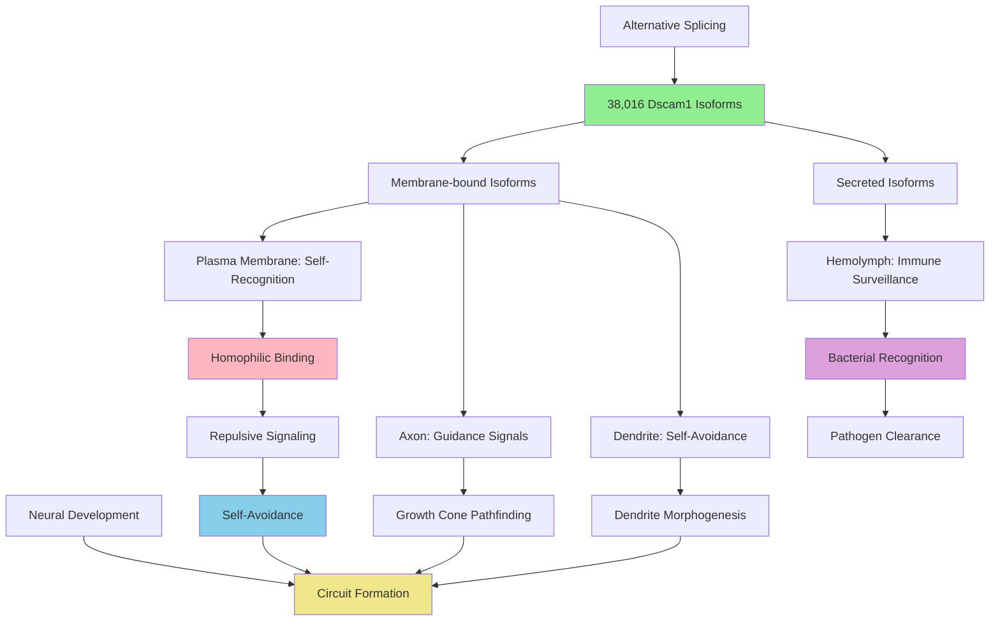

# Pathway Summary for Dscam1

## Overview
Dscam1 is a cell adhesion molecule with extraordinary molecular diversity, capable of generating 38,016 potential isoforms through extensive alternative splicing [Q0E9H9]. This immunoglobulin superfamily protein functions as an axon guidance receptor and mediates isoform-specific homophilic binding for self-recognition, playing essential roles in dendrite self-avoidance and neural circuit formation [PMID:10892653]. Additionally, secreted isoforms function in innate immunity through bacterial recognition in hemolymph [PMID:16109846].

## Neural Self-Recognition and Avoidance Pathway
Dscam1 serves as the central molecular mechanism for neuronal self-recognition through its ability to generate diverse isoforms that exhibit isoform-specific homophilic binding [file:fly/Dscam1/Dscam1-deep-research.md]. When sister dendrites or axons from the same neuron encounter each other, identical Dscam1 isoforms bind homophilically, triggering repulsive signals that prevent crossing or contact. This self-avoidance mechanism is essential for proper dendritic and axonal arborization patterns, ensuring that branches from the same neuron avoid each other while allowing interactions with different neurons.

## Axon Guidance and Pathfinding
Dscam1 functions as a critical axon guidance receptor during neural development, localizing to axonal growth cones where it mediates pathfinding decisions [GO_REF:0000044]. The protein's diverse isoforms provide a molecular code that allows axons to recognize appropriate targets while avoiding inappropriate connections. Through its homophilic binding properties and subsequent repulsive signaling, Dscam1 helps establish the precise wiring patterns necessary for functional neural circuits.

## Dendrite Morphogenesis and Branching
The protein plays a fundamental role in dendrite morphogenesis by preventing sister branches from the same neuron from crossing or bundling together [file:fly/Dscam1/Dscam1-deep-research.md]. This self-avoidance function is essential for creating non-overlapping dendritic territories that maximize coverage of synaptic space without redundancy. Loss of Dscam1 function results in dendrites that cross and clump together, severely disrupting normal dendritic architecture and synaptic connectivity.

## Innate Immune Recognition Pathway
Beyond its neural functions, Dscam1 participates in innate immune responses through secreted isoforms that function as pattern recognition molecules [PMID:16109846]. These soluble ectodomains are released into the hemolymph where they bind to bacterial surfaces, facilitating pathogen recognition and clearance. The molecular diversity of Dscam1 provides a broad repertoire of recognition specificities, analogous to adaptive immune systems in vertebrates.

## Pathway Diagram

## Molecular Diversity and Isoform Generation
Dscam1 achieves its remarkable diversity through extensive alternative splicing of four variable exon clusters, allowing for the theoretical generation of 38,016 different protein isoforms [Q0E9H9]. This diversity provides a vast molecular repertoire for self-recognition, with each neuron expressing a unique subset of isoforms that serves as a molecular identity code. The stochastic nature of isoform selection ensures that sister branches from the same neuron express identical isoforms while different neurons express distinct combinations.

## Mushroom Body Development and Learning Circuits
Dscam1 plays crucial roles in mushroom body development, the learning and memory center of the fly brain [file:fly/Dscam1/Dscam1-deep-research.md]. The protein's self-avoidance function is essential for proper arborization of mushroom body neurons, ensuring that dendrites and axons form appropriate connection patterns. Disruption of Dscam1 function leads to abnormal mushroom body architecture and impaired learning and memory behaviors.

## Synaptic Specificity and Circuit Assembly
Through its role in dendrite self-avoidance and axon guidance, Dscam1 contributes to synaptic specificity by ensuring that appropriate pre- and post-synaptic partners connect while preventing inappropriate synaptic connections [file:fly/Dscam1/Dscam1-deep-research.md]. The protein's self-recognition mechanism prevents formation of autapses (self-synapses) and helps establish the precise connectivity patterns required for neural circuit function.

## Evolutionary Significance and Conservation
Dscam1 represents an evolutionarily ancient mechanism for neural self-recognition that has been elaborated in arthropods through extensive alternative splicing. While vertebrates use different mechanisms for neural self-avoidance, the fundamental principle of self-recognition through cell surface molecules is conserved. The dual function of Dscam1 in both neural development and innate immunity suggests an evolutionary link between these two systems.

## Pathological Implications and Neural Disorders
Disruption of Dscam1 function leads to severe defects in neural circuit formation, including abnormal dendrite morphology, aberrant axon pathfinding, and impaired mushroom body development. Understanding Dscam1 mechanisms may provide insights into neurodevelopmental disorders characterized by abnormal neural connectivity and circuit formation. The protein's role in self-recognition also has implications for understanding autism spectrum disorders and other conditions involving altered neural connectivity.