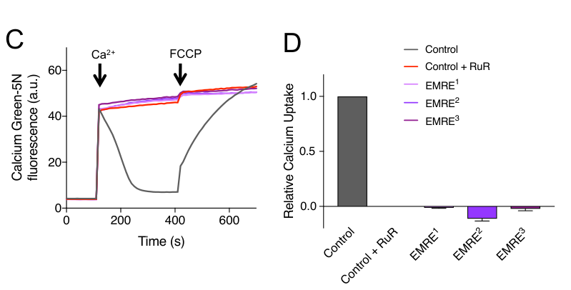

## Question

# Gene Research for Functional Annotation

## ⚠️ CRITICAL: Gene/Protein Identification Context

**BEFORE YOU BEGIN RESEARCH:** You MUST verify you are researching the CORRECT gene/protein. Gene symbols can be ambiguous, especially for less well-characterized genes from non-model organisms.

### Target Gene/Protein Identity (from UniProt):
- **UniProt Accession:** Q7JX57
- **Protein Description:** RecName: Full=Essential MCU regulator, mitochondrial {ECO:0000250|UniProtKB:Q9H4I9}; Flags: Precursor;
- **Gene Information:** Name=EMRE {ECO:0000303|PubMed:27099988, ECO:0000312|FlyBase:FBgn0062440}; ORFNames=CG17680 {ECO:0000312|FlyBase:FBgn0062440};
- **Organism (full):** Drosophila melanogaster (Fruit fly).
- **Protein Family:** Belongs to the SMDT1/EMRE family. .
- **Key Domains:** MCU_reg. (IPR018782); DDDD (PF10161)

### MANDATORY VERIFICATION STEPS:

1. **Check if the gene symbol "EMRE" matches the protein description above**
2. **Verify the organism is correct:** Drosophila melanogaster (Fruit fly).
3. **Check if protein family/domains align with what you find in literature**
4. **If you find literature for a DIFFERENT gene with the same or similar symbol, STOP**

### If Gene Symbol is Ambiguous or You Cannot Find Relevant Literature:

**DO NOT PROCEED WITH RESEARCH ON A DIFFERENT GENE.** Instead:
- State clearly: "The gene symbol 'EMRE' is ambiguous or literature is limited for this specific protein"
- Explain what you found (e.g., "Found extensive literature on a different gene with the same symbol in a different organism")
- Describe the protein based ONLY on the UniProt information provided above
- Suggest that the protein function can be inferred from domain/family information

### Research Target:

Please provide a comprehensive research report on the gene **EMRE** (gene ID: EMRE, UniProt: Q7JX57) in DROME.

The research report should be a detailed narrative explaining the function, biological processes, and localization of the gene product. Citations should be given for all claims.

You should prioritize authoritative reviews and primary scientific literature when conducting research. You can supplement
this with annotations you find in gene/protein databases, but these can be outdated or inaccurate.

We are specifically interested in the primary function of the gene - for enzymes, what reaction is catalyzed, and what is the substrate specificity? For transporters, what is the substrate? For structural proteins or adapters, what is the broader structural role? For signaling molecules, what is the role in the pathway.

We are interested in where in or outside the cell the gene product carries out its function.

We are also interested in the signaling or biochemical pathways in which the gene functions. We are less interested in broad pleiotropic effects, except where these elucidate the precise role.

Include evidence where possible. We are interested in both experimental evidence as well as inference from structure, evolution, or bioinformatic analysis. Precise studies should be prioritized over high-throughput, where available.

## Output

Question: You are an expert researcher providing comprehensive, well-cited information.

Provide detailed information focusing on:
1. Key concepts and definitions with current understanding
2. Recent developments and latest research (prioritize 2023-2024 sources)
3. Current applications and real-world implementations
4. Expert opinions and analysis from authoritative sources
5. Relevant statistics and data from recent studies

Format as a comprehensive research report with proper citations. Include URLs and publication dates where available.
Always prioritize recent, authoritative sources and provide specific citations for all major claims.

# Gene Research for Functional Annotation

## ⚠️ CRITICAL: Gene/Protein Identification Context

**BEFORE YOU BEGIN RESEARCH:** You MUST verify you are researching the CORRECT gene/protein. Gene symbols can be ambiguous, especially for less well-characterized genes from non-model organisms.

### Target Gene/Protein Identity (from UniProt):
- **UniProt Accession:** Q7JX57
- **Protein Description:** RecName: Full=Essential MCU regulator, mitochondrial {ECO:0000250|UniProtKB:Q9H4I9}; Flags: Precursor;
- **Gene Information:** Name=EMRE {ECO:0000303|PubMed:27099988, ECO:0000312|FlyBase:FBgn0062440}; ORFNames=CG17680 {ECO:0000312|FlyBase:FBgn0062440};
- **Organism (full):** Drosophila melanogaster (Fruit fly).
- **Protein Family:** Belongs to the SMDT1/EMRE family. .
- **Key Domains:** MCU_reg. (IPR018782); DDDD (PF10161)

### MANDATORY VERIFICATION STEPS:

1. **Check if the gene symbol "EMRE" matches the protein description above**
2. **Verify the organism is correct:** Drosophila melanogaster (Fruit fly).
3. **Check if protein family/domains align with what you find in literature**
4. **If you find literature for a DIFFERENT gene with the same or similar symbol, STOP**

### If Gene Symbol is Ambiguous or You Cannot Find Relevant Literature:

**DO NOT PROCEED WITH RESEARCH ON A DIFFERENT GENE.** Instead:
- State clearly: "The gene symbol 'EMRE' is ambiguous or literature is limited for this specific protein"
- Explain what you found (e.g., "Found extensive literature on a different gene with the same symbol in a different organism")
- Describe the protein based ONLY on the UniProt information provided above
- Suggest that the protein function can be inferred from domain/family information

### Research Target:

Please provide a comprehensive research report on the gene **EMRE** (gene ID: EMRE, UniProt: Q7JX57) in DROME.

The research report should be a detailed narrative explaining the function, biological processes, and localization of the gene product. Citations should be given for all claims.

You should prioritize authoritative reviews and primary scientific literature when conducting research. You can supplement
this with annotations you find in gene/protein databases, but these can be outdated or inaccurate.

We are specifically interested in the primary function of the gene - for enzymes, what reaction is catalyzed, and what is the substrate specificity? For transporters, what is the substrate? For structural proteins or adapters, what is the broader structural role? For signaling molecules, what is the role in the pathway.

We are interested in where in or outside the cell the gene product carries out its function.

We are also interested in the signaling or biochemical pathways in which the gene functions. We are less interested in broad pleiotropic effects, except where these elucidate the precise role.

Include evidence where possible. We are interested in both experimental evidence as well as inference from structure, evolution, or bioinformatic analysis. Precise studies should be prioritized over high-throughput, where available.

# Functional annotation of *Drosophila melanogaster* EMRE (UniProt Q7JX57)

## Identity and principal function

**Identity verified.** The requested protein is fly **EMRE**, encoded by **CG17680**, not the similarly named human EMRE/SMDT1 protein or the pore-forming fly gene **MCU/CG18769**. The supplied UniProt record identifies Q7JX57 as an SMDT1/EMRE-family protein with MCU_reg and DDDD annotations; a fly genetic study independently identifies EMRE as CG17680. The family annotations are consistent with a mitochondrial-calcium-uniporter regulator, but are not themselves experimental demonstrations of its molecular contacts. (tufi2018acomprehensivegenetic pages 9-12)

**Recommended primary annotation:** EMRE is an **essential accessory subunit of the mitochondrial calcium uniporter (MCU) complex**. It enables rapid, MCU-dependent **Ca²⁺ movement into the mitochondrial matrix** across the inner mitochondrial membrane. EMRE is **not a separately demonstrated enzyme or the Ca²⁺-selective pore**: MCU forms the pore, whereas EMRE supports channel activity and its regulation. The calcium-selectivity DIME motif belongs to **MCU**, not to EMRE; it should not be confused with the DDDD annotation supplied for Q7JX57. (choi2017mitochondrialcalciumuniporter pages 4-5, tufi2018acomprehensivegenetic pages 1-4, wang2019structuralmechanismof pages 4-6)

## Direct evidence in flies

Two complementary interventions establish the core assignment. Choi *et al.* depleted fly EMRE in larval muscle and measured caffeine-evoked mitochondrial Ca²⁺ signals. Knockdown impaired the signal, resembling an MCU-null mutant; increasing MCU expression **did not bypass EMRE depletion**. This establishes functional dependence in living fly tissue, though not direct physical binding between the fly proteins. [Choi *et al.*, *Journal of Biological Chemistry*, September 2017](https://doi.org/10.1074/jbc.M116.765578). (choi2017mitochondrialcalciumuniporter pages 6-8, choi2017mitochondrialcalciumuniporter pages 4-5)

Independently, Tufi *et al.* generated **three distinct CRISPR-induced EMRE frameshift alleles** at CG17680. Mitochondria isolated from these flies retained normal energization but **all lacked fast Ca²⁺ uptake**. The assay monitored extramitochondrial Ca²⁺ with Calcium Green-5N after **45 μM CaCl₂** addition; the loss of uptake resembled inhibition by **2 μM ruthenium red**. Their Figure 3C–D displays the mutant traces and uptake comparison. Thus the phenotype is not simply attributable to loss of the mitochondrial electrical driving force. [Tufi *et al.*, bioRxiv preprint, October 2018](https://doi.org/10.1101/458174). (tufi2018acomprehensivegenetic pages 18-21, tufi2018acomprehensivegenetic pages 4-7, tufi2018acomprehensivegenetic pages 9-12, tufi2018acomprehensivegenetic media b0e57575)

The experiments also place EMRE within a **regulated protein complex**, rather than an independent transport pathway. Fly eye expression of MCU together with EMRE caused severe retinal disruption, whereas either alone caused little or no comparable defect in the Tufi study. Co-expression of either MICU1 isoform suppressed the combined-expression phenotype, supporting MICU1-mediated gatekeeping of MCU–EMRE activity. This is an **overexpression-based genetic interaction**, not a direct measurement of eye-cell Ca²⁺ flux or rescue of an EMRE-null allele. (tufi2018acomprehensivegenetic pages 4-7)

## Localization and mechanism

**Site of action:** the **mitochondrial inner membrane**, where the uniporter conveys Ca²⁺ from the intermembrane-space side to the matrix. For fly Q7JX57, this localization is strongly supported **functionally and by homology**: its loss eliminates uptake by isolated fly mitochondria. The accessed fly experiments did **not** independently demonstrate EMRE’s precise position by localization imaging or topology mapping, so assigning the fly protein’s orientation remains an ortholog-based inference. (choi2017mitochondrialcalciumuniporter pages 6-8, tufi2018acomprehensivegenetic pages 4-7, wang2019structuralmechanismof pages 6-8)

Structural work explains that inference while making its species limits clear. A **3.6-Å human MCU–EMRE structure** places single-pass EMRE subunits around the MCU pore, with the EMRE N-terminal region facing the matrix and contacting MCU’s matrix-facing coiled-coil and juxtamembrane regions. Human EMRE’s C-terminal acidic region was disordered in that structure, so its detailed contacts were not directly resolved there. A separate **3.3-Å hybrid structure**, comprising *Tribolium castaneum* MCU–EMRE and **human** MICU1–MICU2, shows MICU1 contacting an intermembrane-space-facing receptor formed by MCU **and one EMRE**. Neither structure is a determination of fly Q7JX57 itself. [Wang *et al.*, *Cell*, May 2019](https://doi.org/10.1016/j.cell.2019.03.050); [Wang *et al.*, *eLife*, July 2020](https://doi.org/10.7554/eLife.59991). (wang2020structuresrevealgatekeeping pages 3-5, wang2020structuresrevealgatekeeping pages 2-3, wang2019structuralmechanismof pages 6-8)

There is a particularly relevant cross-species test: replacing the human MCU juxtamembrane loop with the **fly MCU loop** left the engineered channel **EMRE-dependent** in HEK293 cells, whereas loops from certain EMRE-independent organisms removed that requirement. This supports conservation of an EMRE-dependent channel-opening mechanism, but tests a **human MCU chimera**, not direct contacts made by fly EMRE. (wang2019structuralmechanismof pages 6-8)

## Biological pathway and physiological interpretation

EMRE functions in **mitochondrial Ca²⁺ uptake and intracellular Ca²⁺ signaling**. Ca²⁺ released from the endoplasmic reticulum can be taken up by mitochondria through the MCU pathway; in flies, MCU loss blocks stimulated mitochondrial Ca²⁺ responses and protects against several oxidative-stress-associated mitochondrial and cell-death readouts. Because those stress experiments principally manipulated **MCU**, they support the pathway context but do not independently establish an EMRE-specific protective phenotype. [Choi *et al.*, 2017](https://doi.org/10.1074/jbc.M116.765578). (choi2017mitochondrialcalciumuniporter pages 2-4, choi2017mitochondrialcalciumuniporter pages 1-2, choi2017mitochondrialcalciumuniporter pages 4-5)

Importantly, **“essential” describes EMRE’s requirement for fast uniporter activity, not an absolute requirement for fly viability**. EMRE1 homozygotes developed to adults at expected Mendelian ratios despite absent fast uptake, but had a **23% shorter median lifespan** than controls. Young adults showed a small climbing deficit that was absent at 20 days; ATP and respiratory changes were comparatively mild. These observations distinguish a strong, well-defined transport defect from more context-dependent organismal consequences. The same study found that removing EMRE did **not** suppress the developmental lethality of MICU1 mutants; therefore, MICU1’s entire phenotype should not be attributed simply to excess flux through EMRE-dependent MCU channels. [Tufi *et al.*, 2018](https://doi.org/10.1101/458174). (tufi2018acomprehensivegenetic pages 4-7, tufi2018acomprehensivegenetic pages 1-4)

## Recent research and practical use

The strongest retrieved **gene-specific fly functional experiments** remain the 2017–2018 studies above; the retrieved **2023–2024** literature did not provide a new direct mechanistic test of fly Q7JX57. A notable 2024 advance instead comes from **human HEK293 cells**: quantitative mapping identified **89 high-confidence mitochondrial-uniporter-complex interactors**, and EMRE depletion markedly reduced MCU-network connectivity. This broadens understanding of the complex as a mitochondrial signaling hub, but its interactors and effects must **not** be assigned to fly EMRE without validation. [Delgado de la Herran *et al.*, *The EMBO Journal*, September 2024](https://doi.org/10.1038/s44318-024-00219-w). (herran2024systematicmappingof pages 1-2, herran2024systematicmappingof pages 2-4)

In practice, fly EMRE **CRISPR alleles and RNAi** are research tools for separating rapid uniporter-mediated Ca²⁺ uptake from developmental viability and for testing genetic interactions with MCU and MICU1. No clinical implementation or approved intervention specific to fly Q7JX57 is established by these studies. The principal outstanding annotation limits are the lack, in the accessed fly studies, of an **EMRE-null transgene-rescue experiment**, direct submitochondrial topology measurement for Q7JX57, or a fly-EMRE atomic structure. (choi2017mitochondrialcalciumuniporter pages 6-8, tufi2018acomprehensivegenetic pages 4-7, tufi2018acomprehensivegenetic pages 9-12)

**Bottom line:** annotate **Q7JX57/CG17680** as a *D. melanogaster* **mitochondrial inner-membrane MCU-complex accessory regulator required for fast Ca²⁺ import into the mitochondrial matrix**. This primary function has direct fly loss-of-function support; detailed pore-opening and MICU-binding models draw chiefly on human and other-insect orthologs. (choi2017mitochondrialcalciumuniporter pages 6-8, tufi2018acomprehensivegenetic pages 4-7, wang2019structuralmechanismof pages 6-8)

References

1. (tufi2018acomprehensivegenetic pages 9-12): Roberta Tufi, Thomas P. Gleeson, Sophia von Stockum, Victoria L. Hewitt, Juliette J. Lee, Ana Terriente-Felix, Alvaro Sanchez-Martinez, Elena Ziviani, and Alexander J. Whitworth. A comprehensive genetic characterisation of the mitochondrial ca2+ uniporter in drosophila. bioRxiv, Oct 2018. URL: https://doi.org/10.1101/458174, doi:10.1101/458174. This article has 3 citations.

2. (choi2017mitochondrialcalciumuniporter pages 4-5): Sekyu Choi, Xianglan Quan, Sunhoe Bang, Heesuk Yoo, Jiyoung Kim, Jiwon Park, Kyu-Sang Park, and Jongkyeong Chung. Mitochondrial calcium uniporter in drosophila transfers calcium between the endoplasmic reticulum and mitochondria in oxidative stress-induced cell death. Journal of Biological Chemistry, 292:14473-14485, Sep 2017. URL: https://doi.org/10.1074/jbc.m116.765578, doi:10.1074/jbc.m116.765578. This article has 62 citations and is from a domain leading peer-reviewed journal.

3. (tufi2018acomprehensivegenetic pages 1-4): Roberta Tufi, Thomas P. Gleeson, Sophia von Stockum, Victoria L. Hewitt, Juliette J. Lee, Ana Terriente-Felix, Alvaro Sanchez-Martinez, Elena Ziviani, and Alexander J. Whitworth. A comprehensive genetic characterisation of the mitochondrial ca2+ uniporter in drosophila. bioRxiv, Oct 2018. URL: https://doi.org/10.1101/458174, doi:10.1101/458174. This article has 3 citations.

4. (wang2019structuralmechanismof pages 4-6): Yan Wang, Nam X. Nguyen, Ji She, Weizhong Zeng, Yi Yang, Xiao-chen Bai, and Youxing Jiang. Structural mechanism of emre-dependent gating of the human mitochondrial calcium uniporter. Cell, 177:1252-1261.e13, May 2019. URL: https://doi.org/10.1016/j.cell.2019.03.050, doi:10.1016/j.cell.2019.03.050. This article has 150 citations and is from a highest quality peer-reviewed journal.

5. (choi2017mitochondrialcalciumuniporter pages 6-8): Sekyu Choi, Xianglan Quan, Sunhoe Bang, Heesuk Yoo, Jiyoung Kim, Jiwon Park, Kyu-Sang Park, and Jongkyeong Chung. Mitochondrial calcium uniporter in drosophila transfers calcium between the endoplasmic reticulum and mitochondria in oxidative stress-induced cell death. Journal of Biological Chemistry, 292:14473-14485, Sep 2017. URL: https://doi.org/10.1074/jbc.m116.765578, doi:10.1074/jbc.m116.765578. This article has 62 citations and is from a domain leading peer-reviewed journal.

6. (tufi2018acomprehensivegenetic pages 18-21): Roberta Tufi, Thomas P. Gleeson, Sophia von Stockum, Victoria L. Hewitt, Juliette J. Lee, Ana Terriente-Felix, Alvaro Sanchez-Martinez, Elena Ziviani, and Alexander J. Whitworth. A comprehensive genetic characterisation of the mitochondrial ca2+ uniporter in drosophila. bioRxiv, Oct 2018. URL: https://doi.org/10.1101/458174, doi:10.1101/458174. This article has 3 citations.

7. (tufi2018acomprehensivegenetic pages 4-7): Roberta Tufi, Thomas P. Gleeson, Sophia von Stockum, Victoria L. Hewitt, Juliette J. Lee, Ana Terriente-Felix, Alvaro Sanchez-Martinez, Elena Ziviani, and Alexander J. Whitworth. A comprehensive genetic characterisation of the mitochondrial ca2+ uniporter in drosophila. bioRxiv, Oct 2018. URL: https://doi.org/10.1101/458174, doi:10.1101/458174. This article has 3 citations.

8. (tufi2018acomprehensivegenetic media b0e57575): Roberta Tufi, Thomas P. Gleeson, Sophia von Stockum, Victoria L. Hewitt, Juliette J. Lee, Ana Terriente-Felix, Alvaro Sanchez-Martinez, Elena Ziviani, and Alexander J. Whitworth. A comprehensive genetic characterisation of the mitochondrial ca2+ uniporter in drosophila. bioRxiv, Oct 2018. URL: https://doi.org/10.1101/458174, doi:10.1101/458174. This article has 3 citations.

9. (wang2019structuralmechanismof pages 6-8): Yan Wang, Nam X. Nguyen, Ji She, Weizhong Zeng, Yi Yang, Xiao-chen Bai, and Youxing Jiang. Structural mechanism of emre-dependent gating of the human mitochondrial calcium uniporter. Cell, 177:1252-1261.e13, May 2019. URL: https://doi.org/10.1016/j.cell.2019.03.050, doi:10.1016/j.cell.2019.03.050. This article has 150 citations and is from a highest quality peer-reviewed journal.

10. (wang2020structuresrevealgatekeeping pages 3-5): Chongyuan Wang, Agata Jacewicz, Bryce D Delgado, Rozbeh Baradaran, and Stephen Barstow Long. Structures reveal gatekeeping of the mitochondrial ca2+ uniporter by micu1-micu2. eLife, Jul 2020. URL: https://doi.org/10.7554/elife.59991, doi:10.7554/elife.59991. This article has 74 citations and is from a domain leading peer-reviewed journal.

11. (wang2020structuresrevealgatekeeping pages 2-3): Chongyuan Wang, Agata Jacewicz, Bryce D Delgado, Rozbeh Baradaran, and Stephen Barstow Long. Structures reveal gatekeeping of the mitochondrial ca2+ uniporter by micu1-micu2. eLife, Jul 2020. URL: https://doi.org/10.7554/elife.59991, doi:10.7554/elife.59991. This article has 74 citations and is from a domain leading peer-reviewed journal.

12. (choi2017mitochondrialcalciumuniporter pages 2-4): Sekyu Choi, Xianglan Quan, Sunhoe Bang, Heesuk Yoo, Jiyoung Kim, Jiwon Park, Kyu-Sang Park, and Jongkyeong Chung. Mitochondrial calcium uniporter in drosophila transfers calcium between the endoplasmic reticulum and mitochondria in oxidative stress-induced cell death. Journal of Biological Chemistry, 292:14473-14485, Sep 2017. URL: https://doi.org/10.1074/jbc.m116.765578, doi:10.1074/jbc.m116.765578. This article has 62 citations and is from a domain leading peer-reviewed journal.

13. (choi2017mitochondrialcalciumuniporter pages 1-2): Sekyu Choi, Xianglan Quan, Sunhoe Bang, Heesuk Yoo, Jiyoung Kim, Jiwon Park, Kyu-Sang Park, and Jongkyeong Chung. Mitochondrial calcium uniporter in drosophila transfers calcium between the endoplasmic reticulum and mitochondria in oxidative stress-induced cell death. Journal of Biological Chemistry, 292:14473-14485, Sep 2017. URL: https://doi.org/10.1074/jbc.m116.765578, doi:10.1074/jbc.m116.765578. This article has 62 citations and is from a domain leading peer-reviewed journal.

14. (herran2024systematicmappingof pages 1-2): Hilda Delgado de la Herran, Denis Vecellio Reane, Yiming Cheng, Máté Katona, Fabian Hosp, Elisa Greotti, Jennifer Wettmarshausen, Maria Patron, Hermine Mohr, Natalia Prudente de Mello, Margarita Chudenkova, Matteo Gorza, Safal Walia, Michael Sheng-Fu Feng, Anja Leimpek, Dirk Mielenz, Natalia S Pellegata, Thomas Langer, György Hajnóczky, Matthias Mann, Marta Murgia, and Fabiana Perocchi. Systematic mapping of mitochondrial calcium uniporter channel (mcuc)-mediated calcium signaling networks. The EMBO Journal, 43:5288-5326, Sep 2024. URL: https://doi.org/10.1038/s44318-024-00219-w, doi:10.1038/s44318-024-00219-w. This article has 29 citations.

15. (herran2024systematicmappingof pages 2-4): Hilda Delgado de la Herran, Denis Vecellio Reane, Yiming Cheng, Máté Katona, Fabian Hosp, Elisa Greotti, Jennifer Wettmarshausen, Maria Patron, Hermine Mohr, Natalia Prudente de Mello, Margarita Chudenkova, Matteo Gorza, Safal Walia, Michael Sheng-Fu Feng, Anja Leimpek, Dirk Mielenz, Natalia S Pellegata, Thomas Langer, György Hajnóczky, Matthias Mann, Marta Murgia, and Fabiana Perocchi. Systematic mapping of mitochondrial calcium uniporter channel (mcuc)-mediated calcium signaling networks. The EMBO Journal, 43:5288-5326, Sep 2024. URL: https://doi.org/10.1038/s44318-024-00219-w, doi:10.1038/s44318-024-00219-w. This article has 29 citations.

## Artifacts

- [Edison artifact artifact-00](EMRE-deep-research-falcon_artifacts/artifact-00.md)

## Citations

1. tufi2018acomprehensivegenetic pages 9-12
2. tufi2018acomprehensivegenetic pages 4-7
3. wang2019structuralmechanismof pages 6-8
4. choi2017mitochondrialcalciumuniporter pages 4-5
5. tufi2018acomprehensivegenetic pages 1-4
6. wang2019structuralmechanismof pages 4-6
7. choi2017mitochondrialcalciumuniporter pages 6-8
8. tufi2018acomprehensivegenetic pages 18-21
9. wang2020structuresrevealgatekeeping pages 3-5
10. wang2020structuresrevealgatekeeping pages 2-3
11. choi2017mitochondrialcalciumuniporter pages 2-4
12. choi2017mitochondrialcalciumuniporter pages 1-2
13. herran2024systematicmappingof pages 1-2
14. herran2024systematicmappingof pages 2-4
15. Choi *et al.*, *Journal of Biological Chemistry*, September 2017
16. Tufi *et al.*, bioRxiv preprint, October 2018
17. Wang *et al.*, *Cell*, May 2019
18. Wang *et al.*, *eLife*, July 2020
19. Choi *et al.*, 2017
20. Tufi *et al.*, 2018
21. Delgado de la Herran *et al.*, *The EMBO Journal*, September 2024
22. https://doi.org/10.1074/jbc.M116.765578
23. https://doi.org/10.1101/458174
24. https://doi.org/10.1016/j.cell.2019.03.050
25. https://doi.org/10.7554/eLife.59991
26. https://doi.org/10.1038/s44318-024-00219-w
27. https://doi.org/10.1101/458174,
28. https://doi.org/10.1074/jbc.m116.765578,
29. https://doi.org/10.1016/j.cell.2019.03.050,
30. https://doi.org/10.7554/elife.59991,
31. https://doi.org/10.1038/s44318-024-00219-w,