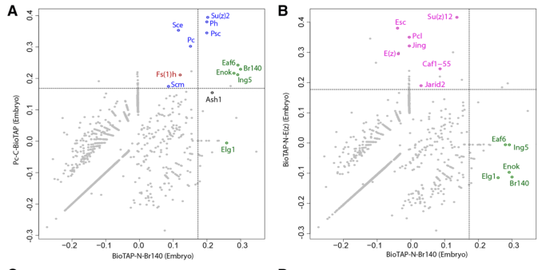

## Question

# Gene Research for Functional Annotation

## ⚠️ CRITICAL: Gene/Protein Identification Context

**BEFORE YOU BEGIN RESEARCH:** You MUST verify you are researching the CORRECT gene/protein. Gene symbols can be ambiguous, especially for less well-characterized genes from non-model organisms.

### Target Gene/Protein Identity (from UniProt):
- **UniProt Accession:** Q9VRN3
- **Protein Description:** RecName: Full=Chromatin modification-related protein MEAF6 {ECO:0000305}; AltName: Full=Esa1-associated factor 6 {ECO:0000312|FlyBase:FBgn0035624};
- **Gene Information:** Name=Eaf6 {ECO:0000312|FlyBase:FBgn0035624}; ORFNames=CG12756 {ECO:0000312|FlyBase:FBgn0035624};
- **Organism (full):** Drosophila melanogaster (Fruit fly).
- **Protein Family:** Belongs to the EAF6 family.
- **Key Domains:** Eaf6. (IPR015418); NuA4 (PF09340)

### MANDATORY VERIFICATION STEPS:

1. **Check if the gene symbol "Eaf6" matches the protein description above**
2. **Verify the organism is correct:** Drosophila melanogaster (Fruit fly).
3. **Check if protein family/domains align with what you find in literature**
4. **If you find literature for a DIFFERENT gene with the same or similar symbol, STOP**

### If Gene Symbol is Ambiguous or You Cannot Find Relevant Literature:

**DO NOT PROCEED WITH RESEARCH ON A DIFFERENT GENE.** Instead:
- State clearly: "The gene symbol 'Eaf6' is ambiguous or literature is limited for this specific protein"
- Explain what you found (e.g., "Found extensive literature on a different gene with the same symbol in a different organism")
- Describe the protein based ONLY on the UniProt information provided above
- Suggest that the protein function can be inferred from domain/family information

### Research Target:

Please provide a comprehensive research report on the gene **Eaf6** (gene ID: Eaf6, UniProt: Q9VRN3) in DROME.

The research report should be a detailed narrative explaining the function, biological processes, and localization of the gene product. Citations should be given for all claims.

You should prioritize authoritative reviews and primary scientific literature when conducting research. You can supplement
this with annotations you find in gene/protein databases, but these can be outdated or inaccurate.

We are specifically interested in the primary function of the gene - for enzymes, what reaction is catalyzed, and what is the substrate specificity? For transporters, what is the substrate? For structural proteins or adapters, what is the broader structural role? For signaling molecules, what is the role in the pathway.

We are interested in where in or outside the cell the gene product carries out its function.

We are also interested in the signaling or biochemical pathways in which the gene functions. We are less interested in broad pleiotropic effects, except where these elucidate the precise role.

Include evidence where possible. We are interested in both experimental evidence as well as inference from structure, evolution, or bioinformatic analysis. Precise studies should be prioritized over high-throughput, where available.

## Output

Question: You are an expert researcher providing comprehensive, well-cited information.

Provide detailed information focusing on:
1. Key concepts and definitions with current understanding
2. Recent developments and latest research (prioritize 2023-2024 sources)
3. Current applications and real-world implementations
4. Expert opinions and analysis from authoritative sources
5. Relevant statistics and data from recent studies

Format as a comprehensive research report with proper citations. Include URLs and publication dates where available.
Always prioritize recent, authoritative sources and provide specific citations for all major claims.

# Gene Research for Functional Annotation

## ⚠️ CRITICAL: Gene/Protein Identification Context

**BEFORE YOU BEGIN RESEARCH:** You MUST verify you are researching the CORRECT gene/protein. Gene symbols can be ambiguous, especially for less well-characterized genes from non-model organisms.

### Target Gene/Protein Identity (from UniProt):
- **UniProt Accession:** Q9VRN3
- **Protein Description:** RecName: Full=Chromatin modification-related protein MEAF6 {ECO:0000305}; AltName: Full=Esa1-associated factor 6 {ECO:0000312|FlyBase:FBgn0035624};
- **Gene Information:** Name=Eaf6 {ECO:0000312|FlyBase:FBgn0035624}; ORFNames=CG12756 {ECO:0000312|FlyBase:FBgn0035624};
- **Organism (full):** Drosophila melanogaster (Fruit fly).
- **Protein Family:** Belongs to the EAF6 family.
- **Key Domains:** Eaf6. (IPR015418); NuA4 (PF09340)

### MANDATORY VERIFICATION STEPS:

1. **Check if the gene symbol "Eaf6" matches the protein description above**
2. **Verify the organism is correct:** Drosophila melanogaster (Fruit fly).
3. **Check if protein family/domains align with what you find in literature**
4. **If you find literature for a DIFFERENT gene with the same or similar symbol, STOP**

### If Gene Symbol is Ambiguous or You Cannot Find Relevant Literature:

**DO NOT PROCEED WITH RESEARCH ON A DIFFERENT GENE.** Instead:
- State clearly: "The gene symbol 'Eaf6' is ambiguous or literature is limited for this specific protein"
- Explain what you found (e.g., "Found extensive literature on a different gene with the same symbol in a different organism")
- Describe the protein based ONLY on the UniProt information provided above
- Suggest that the protein function can be inferred from domain/family information

### Research Target:

Please provide a comprehensive research report on the gene **Eaf6** (gene ID: Eaf6, UniProt: Q9VRN3) in DROME.

The research report should be a detailed narrative explaining the function, biological processes, and localization of the gene product. Citations should be given for all claims.

You should prioritize authoritative reviews and primary scientific literature when conducting research. You can supplement
this with annotations you find in gene/protein databases, but these can be outdated or inaccurate.

We are specifically interested in the primary function of the gene - for enzymes, what reaction is catalyzed, and what is the substrate specificity? For transporters, what is the substrate? For structural proteins or adapters, what is the broader structural role? For signaling molecules, what is the role in the pathway.

We are interested in where in or outside the cell the gene product carries out its function.

We are also interested in the signaling or biochemical pathways in which the gene functions. We are less interested in broad pleiotropic effects, except where these elucidate the precise role.

Include evidence where possible. We are interested in both experimental evidence as well as inference from structure, evolution, or bioinformatic analysis. Precise studies should be prioritized over high-throughput, where available.

# Functional annotation of *Drosophila melanogaster* Eaf6

**Identity and conclusion.** The target is fly **Eaf6/CG12756**, UniProt [Q9VRN3](https://www.uniprot.org/uniprotkb/Q9VRN3/entry), an EAF6-family chromatin-associated protein with an Eaf6/NuA4-related domain. The symbol also denotes related proteins in yeast and humans; findings for those proteins should not automatically be assigned to Q9VRN3. Crucially, fly-specific biochemical evidence places Eaf6 in the **Enok–Br140–Ing5 acetyltransferase assembly**, whereas its status as a stable component of the fly **DOM-A–Tip60** assembly is less certain. Eaf6 is best annotated as a **noncatalytic accessory subunit of nuclear histone-acetyltransferase machinery**, not as an acetyltransferase or ATP-dependent remodeler in its own right. (kang2017bivalentcomplexesof pages 2-3, scacchetti2020drosophilaswr1and pages 2-3, genais2020thedrosophilamoz pages 8-11)

## Molecular function and pathway assignment

The strongest direct complex-membership result comes from Kang and colleagues’ **2017** study of fly embryos. Affinity purification and mass spectrometry of functional, tagged **Br140** recovered **Eaf6 together with Enok and Ing5**. Br140 is the scaffold and Enok is the catalytic KAT6/MOZ-like acetyltransferase in this assembly. The result establishes Eaf6’s physical association with the complex in embryos, but does not establish which subunit Eaf6 contacts directly or a unique architectural task for it. The study also detected an association between the Br140 assembly and Polycomb repressive complex 1 (PRC1); that association does not, by itself, prove that Eaf6 independently binds PRC1 or specifies PRC1 target genes. Figure 2 shows the Br140-purification proteomic evidence. [Kang *et al.*, *Genes & Development*, October 2017](https://doi.org/10.1101/gad.305987.117). (kang2017bivalentcomplexesof pages 2-3, kang2017bivalentcomplexesof media b94c1309)

The most specific functional output supported for **fly Eaf6** is its contribution to **histone H3 lysine-23 acetylation (H3K23ac)** by the Enok pathway. In a **2020 preprint**, CRISPR-generated *Eaf6*^M26^ mutant circulating hemocytes had **mildly reduced H3K23ac**; loss of *enok* or *Br140* caused substantially stronger reductions. The catalytic reaction belongs to **Enok**, not Eaf6: acetyl-group transfer to histone H3 K23 is the complex-level output, while Eaf6’s experimentally supported contribution is accessory. A KAT6-focused review likewise concludes that Enok-complex components contribute to H3K23 acetylation in vivo and identifies **Br140**, rather than Eaf6, as a determinant of Enok abundance and in-vitro substrate specificity. [Genais *et al.*, bioRxiv, posted July 28, 2020](https://doi.org/10.1101/2020.07.27.222620); [Huang, Abmayr and Workman, *Molecular and Cellular Biology*, July 2016](https://doi.org/10.1128/mcb.00055-16). (genais2020thedrosophilamoz pages 8-11, huang2016regulationofkat6 pages 5-9)

**Do not conflate Enok with Tip60.** The older description “Esa1-associated factor 6” and the NuA4 domain/family relationship are useful evolutionary clues, but they do not establish that fly Eaf6 is constitutively incorporated into every fly Tip60 complex. In **2020**, Scacchetti and colleagues endogenously tagged the two Domino isoforms and purified their associated proteins from fly-cell nuclear extracts under stringent conditions. They resolved **DOM-A–Tip60**, a NuA4-like histone-acetyltransferase assembly, from **DOM-B**, an ATP-dependent **H2A.V-deposition** assembly. **Eaf6 was not among the significantly recovered DOM-A or DOM-B interactors** in that experiment; non-recovery under stringent conditions cannot exclude weak or context-dependent association. The authors assigned **H4K12 acetylation** primarily to the DOM-A–Tip60 arm, not to Eaf6 or Enok. [Scacchetti *et al.*, *eLife*, published May 20, 2020](https://doi.org/10.7554/eLife.56325). (scacchetti2020drosophilaswr1and pages 2-3, scacchetti2020drosophilaswr1and pages 1-2, scacchetti2020drosophilaswr1and pages 3-5, prozzillo2021invivosilencing pages 1-2)

An emerging, potentially complementary result warrants caution: quantitative nuclear proteomics in a **July 2025 preprint** found that **Tip60 depletion lowered Eaf6 and Ing3 protein abundance** in fly Kc167 cells; the authors called them Tip60 core-module subunits. This supports a relationship between Tip60 and Eaf6 abundance, but neither demonstrates direct binding nor resolves why Eaf6 was absent from the stringent 2020 DOM-A purification. Complex composition may depend on experimental conditions or cellular context; that remains an interpretation, not an established mechanism. [Apostolou *et al.*, bioRxiv, July 2025](https://doi.org/10.1101/2025.07.15.664872). (apostolou2025thetip60acetylome pages 10-14, scacchetti2020drosophilaswr1and pages 2-3)

## Biological processes and quantitative fly evidence

Eaf6 has experimentally observed roles in chromatin organization and cell division, although those phenotypes do not identify its direct molecular interaction partners in each tissue. The following table separates physical, genetic and emerging proteomic evidence. (kang2017bivalentcomplexesof pages 2-3, prozzillo2021invivosilencing pages 5-8, prozzillo2023knockdownofdomtip60 pages 6-8)

| Evidence tier | Year and study | Method | Eaf6-specific finding | Interpretation and caveat |
|---|---|---|---|---|
| **Direct physical association** | **2017**, Kang et al., *Genes & Development*; [doi:10.1101/gad.305987.117](https://doi.org/10.1101/gad.305987.117) | Embryonic Br140 BioTAP-XL affinity purification–mass spectrometry using a functional tagged transgene | Eaf6 co-purified with Br140, Enok and Ing5 as part of the fly MOZ/MORF-like acetyltransferase complex. (kang2017bivalentcomplexesof pages 2-3, kang2017bivalentcomplexesof media b94c1309) | Strong evidence of complex membership in embryos; it does **not** demonstrate catalytic activity by Eaf6 itself. |
| **Genetic and biochemical function** | **2020 preprint**, Genais et al.; [doi:10.1101/2020.07.27.222620](https://doi.org/10.1101/2020.07.27.222620) | CRISPR-derived **Eaf6M26** allele and H3K23ac immunostaining in circulating hemocytes | Loss of Eaf6 caused a mild reduction in H3K23 acetylation, whereas Enok or Br140 loss caused a stronger reduction. Eaf6 loss did not impair Notch-dependent Lozenge expression or crystal-cell differentiation. (genais2020thedrosophilamoz pages 8-11) | Supports an accessory contribution to **Enok-catalyzed H3K23ac** and context-dependent dispensability; this is preprint evidence, and no direct Eaf6-catalyzed reaction was shown. |
| **Negative complex-membership result** | **2020**, Scacchetti et al., *eLife*; [doi:10.7554/eLife.56325](https://doi.org/10.7554/eLife.56325) | Stringent FLAG affinity purification–mass spectrometry of endogenous DOM-A and DOM-B from fly cells | Eaf6 was not among the 13 DOM-A or 12 DOM-B significantly enriched interactors; DOM-A instead specifically recovered Tip60, Ing3, E(Pc) and Nipped-A. (scacchetti2020drosophilaswr1and pages 2-3, scacchetti2020drosophilaswr1and pages 3-5, scacchetti2020invivofunctional pages 48-50) | Argues against treating Eaf6 as a stable canonical DOM-A/B component under these conditions. Non-recovery cannot exclude weak, transient or condition-specific association. |
| **Developmental and chromatin phenotype** | **2021**, Prozzillo et al., *International Journal of Molecular Sciences*; [doi:10.3390/ijms22094525](https://doi.org/10.3390/ijms22094525) | GAL4-driven RNAi, salivary-gland chromosome cytology and position-effect-variegation genetics | Ubiquitous Eaf6 RNAi was early lethal. Salivary-gland knockdown reduced measured transcript signal to **51.4 ± 0.6%** and produced abnormal polytene chromosomes in **28.1 ± 1.0%**, versus **1.8 ± 1.7%** in controls. The **Eaf6d06605** allele suppressed *In(1)wm4* variegation. (prozzillo2021invivosilencing pages 8-10, prozzillo2021invivosilencing pages 5-8, prozzillo2021invivosilencing pages 1-2) | Supports roles in viability, higher-order chromosome organization and epigenetic silencing. Partial RNAi and pleiotropy preclude assignment of a single molecular mechanism. |
| **Meiotic functional phenotype** | **2023**, Prozzillo et al., *Cells*; [doi:10.3390/cells12101348](https://doi.org/10.3390/cells12101348) | Germline RNAi with fluorescent chromatin, H2A.V, spindle and cytokinesis assays | Eaf6 RNAi produced chromatin-integrity defects (**75.96 ± 7.20%** versus **0.90 ± 1.56%** control), H2A.V mislocalization (**71.41 ± 5.27%** versus **0%**), abnormal spindle morphology (**59.60 ± 13.94%** versus **1.75 ± 3.04%**) and cytokinesis defects (**2.41 ± 0.63%** versus **0.44 ± 0.16%**). (prozzillo2023knockdownofdomtip60 pages 4-6, prozzillo2023knockdownofdomtip60 pages 6-8, prozzillo2023knockdownofdomtip60 pages 8-10) | Demonstrates that Eaf6 is required for normal male meiosis, but does **not** establish direct Eaf6 localization to spindles; localization experiments examined other subunits, not Eaf6. |
| **Emerging complex-stability evidence** | **2025 preprint**, Apostolou et al.; [doi:10.1101/2025.07.15.664872](https://doi.org/10.1101/2025.07.15.664872) | Quantitative nuclear proteomics after Tip60 RNAi in Kc167 cells | Tip60 depletion reduced Eaf6 and Ing3 protein abundance; the authors classified them as Tip60 core-module subunits. (apostolou2025thetip60acetylome pages 10-14) | Suggests biochemical interdependence or conditional association with Tip60, but does not prove direct binding and requires reconciliation with Eaf6 non-recovery in the 2020 stringent DOM-A purification; preprint evidence. |

*Table: Evidence specific to Drosophila melanogaster Eaf6 (Q9VRN3/CG12756), ordered from physical association to organismal phenotypes and emerging proteomics. Caveats distinguish demonstrated accessory functions from unsupported claims of intrinsic enzymatic activity or spindle localization.*

In salivary glands, stage-controlled *Eaf6* RNAi reduced its measured transcript signal to **51.4 ± 0.6% of control** and yielded abnormal polytene chromosomes in **28.1 ± 1.0%** of scored preparations versus **1.8 ± 1.7%** for controls. Ubiquitous knockdown caused early lethality. Separately, the *Eaf6*^d06605^ insertion allele dominantly suppressed *In(1)w*^m4^ position-effect variegation, consistent with a contribution to chromatin-dependent gene silencing. These are functional findings, not proof that Eaf6 itself binds DNA or modifies histones. Notably, eye-directed RNAi caused **0% scored eye defects** in that assay, indicating that effects differ by context. [Prozzillo *et al.*, *International Journal of Molecular Sciences*, published April 26, 2021](https://doi.org/10.3390/ijms22094525). (prozzillo2021invivosilencing pages 2-5, prozzillo2021invivosilencing pages 5-8, prozzillo2021invivosilencing pages 8-10)

Germline-directed *Eaf6* RNAi in a **2023** male-meiosis study produced **H2A.V mislocalization in 71.41 ± 5.27%** of scored cells versus **0%** in controls, and **abnormal spindle morphology in 59.60 ± 13.94%** versus **1.75 ± 3.04%**. Chromatin-integrity and cytokinesis defects were also reported, as detailed in the table. These observations establish a requirement for normal meiotic chromosome organization and division; they **do not** show that Eaf6 directly deposits H2A.V, polymerizes microtubules, or resides on meiotic spindles. The microscopy localization experiment examined other complex-associated proteins, **not Eaf6**. [Prozzillo *et al.*, *Cells*, May 2023](https://doi.org/10.3390/cells12101348). (prozzillo2023knockdownofdomtip60 pages 4-6, prozzillo2023knockdownofdomtip60 pages 6-8, prozzillo2023knockdownofdomtip60 pages 8-10)

A useful pathway boundary comes from the *Eaf6*^M26^ hemocyte experiment: despite its reduced H3K23ac, **Eaf6 loss did not prevent Notch-dependent Lozenge expression or circulating crystal-cell differentiation**. By contrast, Enok and Br140 were required in this setting through a mechanism reported to be independent of Enok catalytic activity. Accordingly, that particular **Notch–Lozenge** phenotype should **not** be attributed to Eaf6 simply because Eaf6 participates in the Enok complex elsewhere. [Genais *et al.*, bioRxiv, July 2020; preprint](https://doi.org/10.1101/2020.07.27.222620). (genais2020thedrosophilamoz pages 8-11)

## Subcellular location and evidence limits

The **nucleus and chromatin** are the best-supported functional setting for Eaf6: it was recovered with chromatin-associated Br140 from fly embryos, its loss changes a nuclear histone-acetylation mark in hemocytes, and its depletion alters polytene-chromosome organization. These observations support nuclear/chromatin activity but are **not** a direct, Eaf6-specific localization image establishing exclusive residence in any compartment. The reported spindle and centrosome localization of *other* DOM/Tip60-related subunits must not be transferred to Eaf6. [Kang *et al.*, 2017](https://doi.org/10.1101/gad.305987.117); [Genais *et al.*, 2020 preprint](https://doi.org/10.1101/2020.07.27.222620); [Prozzillo *et al.*, 2023](https://doi.org/10.3390/cells12101348). (kang2017bivalentcomplexesof pages 2-3, genais2020thedrosophilamoz pages 8-11, prozzillo2023knockdownofdomtip60 pages 4-6)

**Annotation judgment.** Assign **high confidence** to fly Eaf6 as an Enok–Br140–Ing5-associated, nonenzymatic chromatin regulator and **moderate confidence** to its accessory contribution to Enok-dependent H3K23ac, given the mild mutant effect and preprint status of the direct hemocyte experiment. Assign **lower confidence** to constitutive DOM-A–Tip60 membership or any precise direct role in H2A.V exchange or spindle structure: available experiments show context-dependent phenotypes and Tip60-linked abundance, but do not resolve Eaf6’s molecular action in those processes. The principal remaining questions are its direct binding interface, complex occupancy across cell types, and whether its meiotic effects arise through Enok-associated acetylation, Tip60-linked activity, or another interaction. (kang2017bivalentcomplexesof pages 2-3, genais2020thedrosophilamoz pages 8-11, scacchetti2020drosophilaswr1and pages 2-3, apostolou2025thetip60acetylome pages 10-14, prozzillo2023knockdownofdomtip60 pages 8-10)

References

1. (kang2017bivalentcomplexesof pages 2-3): Hyuckjoon Kang, Youngsook L. Jung, Kyle A. McElroy, Barry M. Zee, Heather A. Wallace, Jessica L. Woolnough, Peter J. Park, and Mitzi I. Kuroda. Bivalent complexes of prc1 with orthologs of brd4 and moz/morf target developmental genes in drosophila. Genes & Development, 31:1988-2002, Oct 2017. URL: https://doi.org/10.1101/gad.305987.117, doi:10.1101/gad.305987.117. This article has 49 citations and is from a highest quality peer-reviewed journal.

2. (scacchetti2020drosophilaswr1and pages 2-3): Alessandro Scacchetti, Tamas Schauer, Alexander Reim, Zivkos Apostolou, Aline Campos Sparr, Silke Krause, Patrick Heun, Michael Wierer, and Peter B Becker. Drosophila swr1 and nua4 complexes are defined by domino isoforms. eLife, May 2020. URL: https://doi.org/10.7554/elife.56325, doi:10.7554/elife.56325. This article has 40 citations and is from a domain leading peer-reviewed journal.

3. (genais2020thedrosophilamoz pages 8-11): Thomas Genais, Delhia Gigan, Benoit Augé, Douaa Moussalem, Lucas Waltzer, Marc Haenlin, and Vanessa Gobert. The drosophila moz homolog enok controls notch-dependent induction of the runx gene lozenge independently of its histone-acetyl transferase activity. bioRxiv, Jul 2020. URL: https://doi.org/10.1101/2020.07.27.222620, doi:10.1101/2020.07.27.222620. This article has 2 citations.

4. (kang2017bivalentcomplexesof media b94c1309): Hyuckjoon Kang, Youngsook L. Jung, Kyle A. McElroy, Barry M. Zee, Heather A. Wallace, Jessica L. Woolnough, Peter J. Park, and Mitzi I. Kuroda. Bivalent complexes of prc1 with orthologs of brd4 and moz/morf target developmental genes in drosophila. Genes & Development, 31:1988-2002, Oct 2017. URL: https://doi.org/10.1101/gad.305987.117, doi:10.1101/gad.305987.117. This article has 49 citations and is from a highest quality peer-reviewed journal.

5. (huang2016regulationofkat6 pages 5-9): Fu Huang, Susan M. Abmayr, and Jerry L. Workman. Regulation of kat6 acetyltransferases and their roles in cell cycle progression, stem cell maintenance, and human disease. Molecular and Cellular Biology, 36:1900-1907, Jul 2016. URL: https://doi.org/10.1128/mcb.00055-16, doi:10.1128/mcb.00055-16. This article has 113 citations and is from a domain leading peer-reviewed journal.

6. (scacchetti2020drosophilaswr1and pages 1-2): Alessandro Scacchetti, Tamas Schauer, Alexander Reim, Zivkos Apostolou, Aline Campos Sparr, Silke Krause, Patrick Heun, Michael Wierer, and Peter B Becker. Drosophila swr1 and nua4 complexes are defined by domino isoforms. eLife, May 2020. URL: https://doi.org/10.7554/elife.56325, doi:10.7554/elife.56325. This article has 40 citations and is from a domain leading peer-reviewed journal.

7. (scacchetti2020drosophilaswr1and pages 3-5): Alessandro Scacchetti, Tamas Schauer, Alexander Reim, Zivkos Apostolou, Aline Campos Sparr, Silke Krause, Patrick Heun, Michael Wierer, and Peter B Becker. Drosophila swr1 and nua4 complexes are defined by domino isoforms. eLife, May 2020. URL: https://doi.org/10.7554/elife.56325, doi:10.7554/elife.56325. This article has 40 citations and is from a domain leading peer-reviewed journal.

8. (prozzillo2021invivosilencing pages 1-2): Yuri Prozzillo, Stefano Cuticone, Diego Ferreri, Gaia Fattorini, Giovanni Messina, and Patrizio Dimitri. In vivo silencing of genes coding for dtip60 chromatin remodeling complex subunits affects polytene chromosome organization and proper development in drosophila melanogaster. International Journal of Molecular Sciences, 22:4525, Apr 2021. URL: https://doi.org/10.3390/ijms22094525, doi:10.3390/ijms22094525. This article has 14 citations.

9. (apostolou2025thetip60acetylome pages 10-14): Zivkos Apostolou, Anuroop V Venkatasubramani, Lara C Kopp, Gizem Kars, Alessandro Scacchetti, Aline C Sparr, Tamas Schauer, Axel Imhof, and Peter B Becker. The tip60 acetylome is a hallmark of the proliferative state in drosophila. BioRxiv, Jul 2025. URL: https://doi.org/10.1101/2025.07.15.664872, doi:10.1101/2025.07.15.664872. This article has 3 citations.

10. (prozzillo2021invivosilencing pages 5-8): Yuri Prozzillo, Stefano Cuticone, Diego Ferreri, Gaia Fattorini, Giovanni Messina, and Patrizio Dimitri. In vivo silencing of genes coding for dtip60 chromatin remodeling complex subunits affects polytene chromosome organization and proper development in drosophila melanogaster. International Journal of Molecular Sciences, 22:4525, Apr 2021. URL: https://doi.org/10.3390/ijms22094525, doi:10.3390/ijms22094525. This article has 14 citations.

11. (prozzillo2023knockdownofdomtip60 pages 6-8): Yuri Prozzillo, Gaia Fattorini, Diego Ferreri, Manuela Leo, Patrizio Dimitri, and Giovanni Messina. Knockdown of dom/tip60 complex subunits impairs male meiosis of drosophila melanogaster. Cells, 12:1348, May 2023. URL: https://doi.org/10.3390/cells12101348, doi:10.3390/cells12101348. This article has 7 citations.

12. (scacchetti2020invivofunctional pages 48-50): Alessandro Scacchetti. In vivo functional dissection of chrac/acf and domino chromatin regulators. Dissertation, Jan 2020. URL: https://doi.org/10.5282/edoc.27141, doi:10.5282/edoc.27141. This article has 0 citations.

13. (prozzillo2021invivosilencing pages 8-10): Yuri Prozzillo, Stefano Cuticone, Diego Ferreri, Gaia Fattorini, Giovanni Messina, and Patrizio Dimitri. In vivo silencing of genes coding for dtip60 chromatin remodeling complex subunits affects polytene chromosome organization and proper development in drosophila melanogaster. International Journal of Molecular Sciences, 22:4525, Apr 2021. URL: https://doi.org/10.3390/ijms22094525, doi:10.3390/ijms22094525. This article has 14 citations.

14. (prozzillo2023knockdownofdomtip60 pages 4-6): Yuri Prozzillo, Gaia Fattorini, Diego Ferreri, Manuela Leo, Patrizio Dimitri, and Giovanni Messina. Knockdown of dom/tip60 complex subunits impairs male meiosis of drosophila melanogaster. Cells, 12:1348, May 2023. URL: https://doi.org/10.3390/cells12101348, doi:10.3390/cells12101348. This article has 7 citations.

15. (prozzillo2023knockdownofdomtip60 pages 8-10): Yuri Prozzillo, Gaia Fattorini, Diego Ferreri, Manuela Leo, Patrizio Dimitri, and Giovanni Messina. Knockdown of dom/tip60 complex subunits impairs male meiosis of drosophila melanogaster. Cells, 12:1348, May 2023. URL: https://doi.org/10.3390/cells12101348, doi:10.3390/cells12101348. This article has 7 citations.

16. (prozzillo2021invivosilencing pages 2-5): Yuri Prozzillo, Stefano Cuticone, Diego Ferreri, Gaia Fattorini, Giovanni Messina, and Patrizio Dimitri. In vivo silencing of genes coding for dtip60 chromatin remodeling complex subunits affects polytene chromosome organization and proper development in drosophila melanogaster. International Journal of Molecular Sciences, 22:4525, Apr 2021. URL: https://doi.org/10.3390/ijms22094525, doi:10.3390/ijms22094525. This article has 14 citations.

## Artifacts

- [Edison artifact artifact-00](Eaf6-deep-research-falcon_artifacts/artifact-00.md)

## Citations

1. genais2020thedrosophilamoz pages 8-11
2. kang2017bivalentcomplexesof pages 2-3
3. prozzillo2021invivosilencing pages 1-2
4. prozzillo2021invivosilencing pages 5-8
5. scacchetti2020invivofunctional pages 48-50
6. prozzillo2021invivosilencing pages 8-10
7. prozzillo2021invivosilencing pages 2-5
8. Q9VRN3
9. Kang *et al.*, *Genes & Development*, October 2017
10. Genais *et al.*, bioRxiv, posted July 28, 2020
11. Huang, Abmayr and Workman, *Molecular and Cellular Biology*, July 2016
12. Scacchetti *et al.*, *eLife*, published May 20, 2020
13. Apostolou *et al.*, bioRxiv, July 2025
14. doi:10.1101/gad.305987.117
15. doi:10.1101/2020.07.27.222620
16. doi:10.7554/eLife.56325
17. doi:10.3390/ijms22094525
18. doi:10.3390/cells12101348
19. doi:10.1101/2025.07.15.664872
20. Prozzillo *et al.*, *International Journal of Molecular Sciences*, published April 26, 2021
21. Prozzillo *et al.*, *Cells*, May 2023
22. Genais *et al.*, bioRxiv, July 2020; preprint
23. Kang *et al.*, 2017
24. Genais *et al.*, 2020 preprint
25. Prozzillo *et al.*, 2023
26. https://www.uniprot.org/uniprotkb/Q9VRN3/entry
27. https://doi.org/10.1101/gad.305987.117
28. https://doi.org/10.1101/2020.07.27.222620
29. https://doi.org/10.1128/mcb.00055-16
30. https://doi.org/10.7554/eLife.56325
31. https://doi.org/10.1101/2025.07.15.664872
32. https://doi.org/10.3390/ijms22094525
33. https://doi.org/10.3390/cells12101348
34. https://doi.org/10.1101/gad.305987.117,
35. https://doi.org/10.7554/elife.56325,
36. https://doi.org/10.1101/2020.07.27.222620,
37. https://doi.org/10.1128/mcb.00055-16,
38. https://doi.org/10.3390/ijms22094525,
39. https://doi.org/10.1101/2025.07.15.664872,
40. https://doi.org/10.3390/cells12101348,
41. https://doi.org/10.5282/edoc.27141,