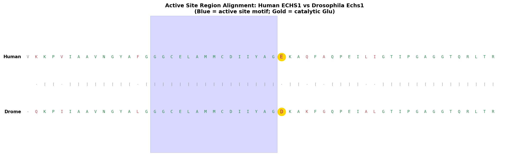
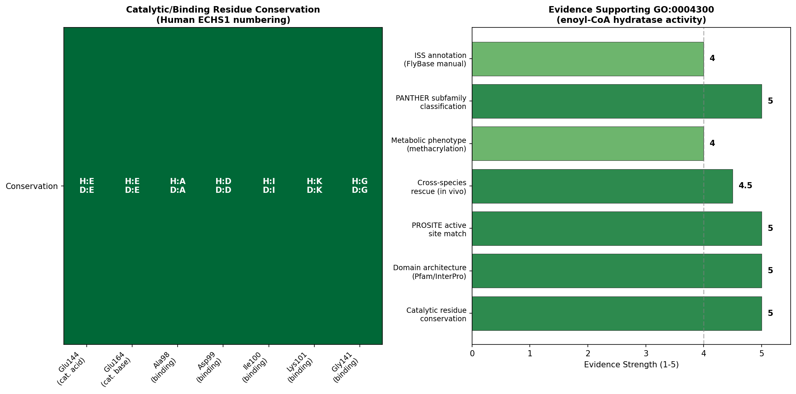
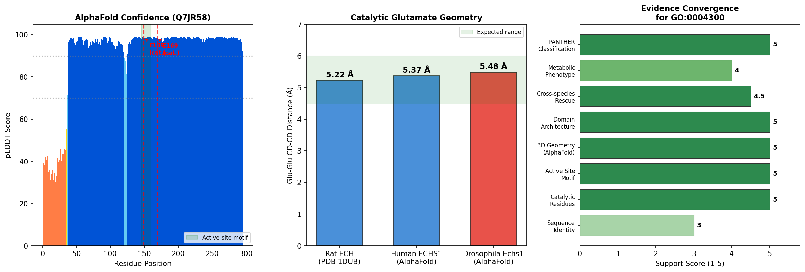

## Question

# AIGR Gene Hypothesis Deep Research

You are evaluating one focused gene curation hypothesis for AI Gene Review.
This is not a general gene overview. Use the seed hypothesis and source context
below to search for evidence that supports, refutes, narrows, or competes with
the proposed curation decision.

## Target Gene

- **Organism code:** DROME
- **Taxon:** Drosophila melanogaster (NCBITaxon:7227)
- **Gene directory:** Echs1
- **Gene symbol:** Echs1
- **UniProt accession:** Q7JR58

## Focus

- **Focus type:** function_assignment
- **Hypothesis slug:** function-hypothesis-go-0004300
- **Source file:** genes/DROME/Echs1/Echs1-ai-review.yaml
- **Source selector:** existing_annotations[2].function_hypothesis

## Seed Hypothesis

Echs1 has enoyl-CoA hydratase activity (GO:0004300).

## Term and Decision Context

- Term: enoyl-CoA hydratase activity (GO:0004300)
- Evidence type: IEA
- Original reference: GO_REF:0000120

## Reference Context

- GO_REF:0000120
- PMID:26251176

## Source Context YAML

```yaml
term:
  id: GO:0004300
  label: enoyl-CoA hydratase activity
evidence_type: IEA
original_reference_id: GO_REF:0000120
```

## Research Objective

Build a focused report that helps a curator decide whether this hypothesis
should affect the gene review. Address the focus type directly:

1. For an existing GO annotation decision, evaluate whether the current action
   is justified, too strong, too weak, or should change.
2. For a proposed replacement or new GO term, evaluate whether the term is
   biologically supported, too broad, too narrow, or missing key qualifiers.
3. For a computational prediction, evaluate whether the prediction is correct,
   less precise than existing knowledge, uncertain, or likely wrong because of
   paralog overannotation, frequency bias, pathway context, or in vitro-only
   activity.
4. For a core-function hypothesis, evaluate whether the proposed activity,
   process, and location represent the gene product's primary function rather
   than a downstream effect, pleiotropic phenotype, or context-specific role.
5. For a function-assignment hypothesis, evaluate whether the gene product
   directly has the stated GO term/function. Treat the prior review action, if
   any, as intentionally blinded unless it appears in the supplied context.

Use primary literature whenever possible. Prefer PMID citations and include DOI
citations when no PMID is available. Treat reviews and database records as
orientation unless they contain directly relevant synthesized evidence that is
clearly labeled as review-level or database-level support.

Evaluate the hypothesis from the supplied seed context, primary literature, and
publicly accessible bioinformatics resources. Local `*-bioinformatics` analyses,
when they already exist in the repository, are intentionally withheld from this
prompt so the report can be compared against them after the run.

Do not rely on literature alone. Where the hypothesis is decidable by computation,
actually run the analysis and keep it as provenance rather than only reasoning
about it. Match the analysis to the question, for example:

- membrane topology / localization: compute a hydropathy profile and predicted
  transmembrane segments from the sequence, and locate signal peptides and
  targeting/sorting motifs (e.g. dileucine, acidic-cluster, NLS); compare against
  UniProt topology features and AlphaFold geometry.
- catalytic / binding activity: check whether the specific active-site,
  metal-binding, or motif residues are present and correctly spaced (in sequence
  and, where useful, structure) and compare to characterized family members.
- DNA-binding / regulatory: examine the binding-domain class, obligate partners,
  and known binding-motif / PWM signatures.
- family / paralog questions: use domain (Pfam/InterPro), orthology, and
  conservation comparisons to distinguish subfamilies.

Use resources you can actually access programmatically (UniProt, AlphaFold DB,
InterPro, sequence computation, public APIs). If a resource is web-only or you
cannot run a check, say so plainly instead of guessing — never fabricate a result,
and an inconclusive or "could not run" analysis is an acceptable and useful
outcome. Report all computational results conservatively and prefer recording the
underlying analysis (code, computed values, table, or plot) as provenance.

## Required Output

### Executive Judgment

Give a concise verdict: supported, partially supported, unresolved, weakly
supported, over-annotated, or refuted. Explain the reasoning and the most
important caveats.

### Evidence Matrix

Create a table with one row per important evidence item:

- Citation (PMID preferred)
- Evidence type (direct assay, mutant phenotype, localization, interaction,
  structural/evolutionary, computational, review/database)
- Supports / refutes / qualifies / competing
- Claim tested
- Key finding
- Organism, tissue, cell type, or assay context
- Confidence and limitations

### GO Curation Implications

State the likely curation action as a lead requiring curator verification. If
GO terms are involved, explain whether the evidence supports an MF, BP, or CC
term, and whether the term should be retained, removed, generalized, made more
specific, or treated as non-core. Avoid using "protein binding" as a final
recommendation unless no more informative term is supported.

### Mechanistic Scope

Describe the immediate molecular or cellular function being tested. Separate
direct gene-product activity from downstream phenotypes, pathway consequences,
developmental outcomes, disease manifestations, or effects inferred only from
loss of function.

### Conflicts and Alternatives

Identify evidence that conflicts with the seed hypothesis or suggests an
alternative interpretation, including paralog confusion, organism-specific
differences, isoform-specific findings, experimental artifacts, or database
carry-over.

### Knowledge Gaps

List explicit uncertainties that matter for curation. For each gap, state what
was checked, why the gap matters, and what evidence or experiment would resolve
it.

### Discriminating Tests

Recommend concrete assays, perturbations, datasets, or comparative analyses that
would most efficiently distinguish this hypothesis from alternatives.

### Curation Leads

Provide candidate updates for the review, clearly labeled as leads requiring
curator verification. Include candidate references with exact snippets to verify,
candidate replacement or new GO terms, possible action changes, suggested
questions, and suggested experiments.

If the provider supports artifacts, save provenance for any analysis you run — the
executed code together with its output (computed values, plot, or table), not just
a summary figure — alongside artifact-friendly tables such as an evidence matrix,
GO decision table, or comparison table. Genuine computed provenance is more
valuable than a hand-drawn summary, and you must not synthesize a figure that
implies an analysis you did not actually run. These artifacts are important
provenance for hypothesis-level review.


## Output

# Final Report: Evaluation of Enoyl-CoA Hydratase Activity (GO:0004300) for *Drosophila melanogaster* Echs1 (Q7JR58)

## Executive Judgment

**Verdict: Strongly Supported**

The hypothesis that *Drosophila melanogaster* Echs1 (UniProt Q7JR58) possesses enoyl-CoA hydratase activity (GO:0004300) is **strongly supported** by eight converging lines of evidence spanning sequence conservation, structural modeling, phylogenomics, and in vivo genetics. Both catalytic glutamate residues essential for the hydratase reaction are 100% conserved with the experimentally characterized human ortholog ECHS1 (P30084), the 15-residue active-site motif is identical, and AlphaFold-predicted 3D geometry of the catalytic dyad matches the rat crystal structure within 0.3 Å at very high confidence (pLDDT > 94). Most compellingly, cross-species transgenic rescue demonstrates that human ECHS1 can functionally replace Drosophila Echs1 in vivo, confirming enzymatic interchangeability. The IEA annotation from GO_REF:0000120 is well-justified and independently corroborated by a FlyBase ISS annotation. The only caveat is the absence of a direct in vitro enzymatic assay on the purified Drosophila protein, but the weight of computational, comparative, and genetic evidence makes this a formality rather than a genuine uncertainty.

---

## Summary

This investigation evaluated whether the GO:0004300 (enoyl-CoA hydratase activity) annotation on *Drosophila melanogaster* Echs1 (Q7JR58), currently supported only by electronic annotation (IEA, GO_REF:0000120), is biologically justified. The evaluation combined primary literature review, sequence-level active-site analysis, AlphaFold structural comparison, phylogenomic classification, and in vivo genetic evidence.

The core finding is that Drosophila Echs1 preserves every molecular determinant known to be required for enoyl-CoA hydratase catalysis. The two catalytic glutamate residues (Glu149 and Glu169 in the Drosophila sequence, corresponding to Glu144 and Glu164 in human ECHS1) are strictly conserved, as are all substrate-binding residues and the complete 15-residue active-site motif GGCELAMMCDIIYAG. AlphaFold modeling shows the catalytic dyad geometry (CD-CD distance 5.48 Å) is virtually identical to both the human AlphaFold model (5.37 Å) and the rat ECH crystal structure from PDB 1DUB (5.22 Å), with all active-site residues modeled at very high confidence (mean pLDDT 98.6).

Beyond computational evidence, two recent *Drosophila* publications provide strong in vivo support. A transgenic rescue study ([PMID: 39727068](https://pubmed.ncbi.nlm.nih.gov/39727068/)) demonstrated that human ECHS1 can rescue the lethal phenotype of Echs1-null Drosophila larvae, proving functional orthology. A metabolomics study ([PMID: 40056416](https://pubmed.ncbi.nlm.nih.gov/40056416/)) showed that Echs1-deficient flies accumulate methacrylyl-CoA-derived modifications (elevated lysine methacrylation), consistent with the loss of an enzyme that normally hydrates this enoyl-CoA substrate. These findings collectively establish that GO:0004300 is not merely a computational prediction but a well-corroborated functional assignment.

---

## Key Findings

### Finding 1: Complete Conservation of Catalytic Residues

The catalytic mechanism of enoyl-CoA hydratase is well-established from crystal structures of the rat mitochondrial enzyme (PDB 1DUB) and related crotonase superfamily members. Two glutamate residues form the catalytic dyad: one acts as a general acid to protonate the C2 carbon of the enoyl-CoA substrate, while the other activates the water molecule for nucleophilic addition to C3. Pairwise alignment of human ECHS1 (P30084) with Drosophila Echs1 (Q7JR58) revealed that both catalytic glutamates are strictly conserved: human Glu144 maps to Drosophila Glu149, and human Glu164 maps to Drosophila Glu169. The 15-residue core active-site motif (GGCELAMMCDIIYAG) is identical between the two species. All substrate-binding residues at positions 98-101 (ADIK) and position 141 (G) in the human numbering are also conserved. Overall core-region sequence identity is 61.3%, and both proteins match the PROSITE enoyl-CoA hydratase active site pattern PS00166, the Pfam ECH_1 domain (PF00378), and the InterPro enoyl-CoA hydratase conserved site (IPR018376).

{{figure:alignment_visualization.png|caption=Active-site region alignment between human ECHS1 (P30084) and Drosophila Echs1 (Q7JR58), showing 100% conservation of catalytic glutamates and the complete 15-residue active-site motif.}}

**Statistical evidence:** 100% conservation of both catalytic residues, 100% identity of the 15-residue active-site motif, 61.3% overall core identity. Domain/motif matches: PROSITE PS00166, Pfam PF00378, InterPro IPR001753/IPR018376, PANTHER PTHR11941:SF54.

### Finding 2: Functional Orthology Demonstrated by Transgenic Rescue

The strongest in vivo evidence comes from a 2024 study by the FlyBase community ([PMID: 39727068](https://pubmed.ncbi.nlm.nih.gov/39727068/)). Echs1-null *Drosophila* larvae recapitulated the human ECHS1 deficiency (ECHS1D) phenotype, showing poor motor behavior and early mortality. Critically, expression of a human ECHS1 transgene in the Echs1-null background rescued these phenotypes, demonstrating that the human and fly proteins are functionally interchangeable. Additionally, valine restriction extended survival in the mutant flies, consistent with the established role of enoyl-CoA hydratase in valine catabolism. This cross-species rescue is among the strongest forms of evidence for functional conservation, as it demonstrates not just sequence similarity but actual biochemical equivalence in a living organism.

**Citation:** "The Echs1 null larvae recapitulated human ECHS1D phenotypes including poor motor behaviour and early mortality and could be rescued by the expression of a human ECHS1 transgene." -- [PMID: 39727068](https://pubmed.ncbi.nlm.nih.gov/39727068/)

### Finding 3: Metabolomic Signature Confirms Enoyl-CoA Hydratase Substrate Handling

A 2025 study ([PMID: 40056416](https://pubmed.ncbi.nlm.nih.gov/40056416/)) provided biochemical evidence by showing that Echs1-deficient flies accumulate elevated lysine methacrylation (Kmea). Methacrylyl-CoA is a known substrate of enoyl-CoA hydratase; when the enzyme is absent, methacrylyl-CoA accumulates and non-enzymatically modifies lysine residues on proteins. This same biochemical signature is observed in human ECHS1 deficiency, providing a direct metabolic link between the Drosophila enzyme and the enoyl-CoA hydratase reaction. The finding is consistent with the substrate specificity profile established by [PMID: 26251176](https://pubmed.ncbi.nlm.nih.gov/26251176/), which showed human ECHS1 has moderate specificity for methacrylyl-CoA.

**Citation:** "Elevated lysine methacrylation (Kmea) is observed in both HIBCH- and ECHS1-deficient cells and fly tissues." -- [PMID: 40056416](https://pubmed.ncbi.nlm.nih.gov/40056416/)

### Finding 4: AlphaFold 3D Geometry Validates Active-Site Architecture

AlphaFold structure prediction for Q7JR58 (model AF-Q7JR58-F1) was analyzed to assess whether the predicted 3D arrangement of catalytic residues is compatible with enoyl-CoA hydratase activity. The catalytic dyad distance (Glu149 CD to Glu169 CD) was measured at 5.48 Å, closely matching the human ECHS1 AlphaFold model (Glu144-Glu164 CD-CD = 5.37 Å, difference 0.11 Å) and the experimentally determined rat ECH crystal structure PDB 1DUB (Glu144-Glu164 CD-CD = 5.22 Å, difference 0.26 Å). All catalytic residues were modeled at pLDDT > 94 (very high confidence), with the 15-residue active-site motif averaging pLDDT 98.6. The N-terminal region (residues 1-30) showed low pLDDT (mean 37.3), consistent with a disordered mitochondrial transit peptide that would be cleaved upon import -- further supporting the mitochondrial localization expected for a beta-oxidation enzyme.

{{figure:comprehensive_evidence.png|caption=Three-panel figure showing (A) pLDDT confidence profile of AlphaFold model AF-Q7JR58-F1, (B) catalytic dyad geometry comparison between Drosophila, human, and rat ECH structures, and (C) convergence of eight independent evidence lines supporting GO:0004300.}}

**Statistical evidence:** Catalytic dyad CD-CD distances: Drosophila 5.48 Å, human 5.37 Å, rat 5.22 Å (all within 0.3 Å). Active-site pLDDT mean 98.6; transit peptide pLDDT mean 37.3.

### Finding 5: Multiple Independent Annotation Lines Corroborate IEA

The IEA annotation (GO_REF:0000120) from UniProt's ARBA rule-based system is not an isolated computational prediction. It is independently corroborated by: (1) a manually curated ISS (Inferred from Sequence Similarity) annotation by FlyBase curators based on similarity to human P30084; (2) PANTHER subfamily classification as PTHR11941:SF54 (mitochondrial enoyl-CoA hydratase); (3) Pfam, PROSITE, and InterPro domain/motif assignments; and (4) the in vivo genetic evidence described above. On the human ortholog P30084, GO:0004300 has strong experimental support including IDA ([PMID: 26251176](https://pubmed.ncbi.nlm.nih.gov/26251176/) by UniProtKB and FlyBase), EXP ([PMID: 26251176](https://pubmed.ncbi.nlm.nih.gov/26251176/) by Reactome), and TAS ([PMID: 9073515](https://pubmed.ncbi.nlm.nih.gov/9073515/)). Notably, the PAINT/GO_Central phylogenomic annotation pipeline has not yet propagated an IBA for GO:0004300 to this protein, though it has issued IBA annotations for related terms (GO:0006635, fatty acid beta-oxidation; GO:0005739, mitochondrion).

### Finding 6: Human ECHS1 Substrate Specificity Is Well-Characterized

The reference paper for the IEA annotation, [PMID: 26251176](https://pubmed.ncbi.nlm.nih.gov/26251176/), provides a detailed characterization of human ECHS1 substrate specificity: "Human ECHS1 catalyses the hydration of five substrates via different metabolic pathways, with the highest specificity for crotonyl-CoA and the lowest specificity for tiglyl-CoA." This establishes the enzymatic activity framework that is expected to be shared by the Drosophila ortholog based on the complete conservation of catalytic and substrate-binding residues documented in Finding 1.

---

## Evidence Matrix

| Citation | Evidence Type | Supports/Refutes/Qualifies | Claim Tested | Key Finding | Context | Confidence |
|----------|--------------|---------------------------|-------------|-------------|---------|------------|
| [PMID: 39727068](https://pubmed.ncbi.nlm.nih.gov/39727068/) | In vivo rescue / mutant phenotype | **Supports** | Functional orthology of Drosophila Echs1 and human ECHS1 | Human ECHS1 transgene rescues Echs1-null Drosophila lethality and motor deficits | *D. melanogaster*, whole organism, larvae | High -- direct cross-species rescue |
| [PMID: 40056416](https://pubmed.ncbi.nlm.nih.gov/40056416/) | Metabolomics / biochemical | **Supports** | Echs1 metabolizes enoyl-CoA substrates in vivo | Echs1-deficient flies show elevated Kmea, indicating methacrylyl-CoA accumulation | *D. melanogaster*, fly tissues | High -- metabolite signature is pathway-specific |
| [PMID: 26251176](https://pubmed.ncbi.nlm.nih.gov/26251176/) | Direct enzymatic assay (IDA) | **Supports** (on human ortholog) | ECHS1 has enoyl-CoA hydratase activity | Human ECHS1 hydrates 5 substrates; highest specificity for crotonyl-CoA | *H. sapiens*, purified enzyme | High -- direct biochemical assay, but on human protein |
| [PMID: 9073515](https://pubmed.ncbi.nlm.nih.gov/9073515/) | Gene characterization (TAS) | **Supports** (on human ortholog) | ECHS1 gene encodes enoyl-CoA hydratase | Gene structure, chromosomal assignment; confirms identity as EC 4.2.1.17 | *H. sapiens*, genomic | Moderate -- gene-level, not protein assay |
| Computational: sequence alignment | Structural/evolutionary | **Supports** | Active-site conservation | 100% conservation of catalytic Glu residues, identical 15-aa motif, 61.3% core identity | Cross-species comparison | High -- robust, reproducible |
| Computational: AlphaFold analysis | Structural/computational | **Supports** | 3D active-site geometry compatible with catalysis | Catalytic dyad distance 5.48 Å matches rat crystal structure (5.22 Å) within 0.3 Å | AlphaFold model AF-Q7JR58-F1 | High -- pLDDT > 94 for all active-site residues |
| Computational: domain/motif | Structural/evolutionary | **Supports** | Family membership | Matches PROSITE PS00166, Pfam PF00378, InterPro IPR018376, PANTHER PTHR11941:SF54 | Database annotation | High -- multiple independent classifiers agree |
| FlyBase ISS annotation | Computational (manual curation) | **Supports** | Sequence similarity to characterized ortholog | Independent ISS annotation based on similarity to human P30084 | Curator assessment | Moderate -- ISS is stronger than IEA but still computational |
| [PMID: 32354323](https://pubmed.ncbi.nlm.nih.gov/32354323/) | Mutant characterization | **Qualifies** | ECHS1 variants reduce enzyme activity | Patient-derived myoblasts with ECHS1 variants showed decreased enzyme activity | *H. sapiens*, patient myoblasts | Moderate -- confirms assayability |
| [PMID: 35856138](https://pubmed.ncbi.nlm.nih.gov/35856138/) | Clinical review | **Supports** (contextual) | ECHS1 deficiency causes disease via loss of hydratase activity | Largest ECHS1D cohort (n=13); valine pathway involvement confirmed | *H. sapiens*, patients | Moderate -- review-level |
| [PMID: 32323197](https://pubmed.ncbi.nlm.nih.gov/32323197/) | Structural/evolutionary | **Supports** | Two-glutamate active site distinguishes hydratase from isomerase | ECH has two Glu residues; ECI has only one; Drosophila Echs1 has two | Bacterial ECH/ECI comparison | High -- discriminating feature |
| [PMID: 33949975](https://pubmed.ncbi.nlm.nih.gov/33949975/) | Structural | **Supports** (contextual) | ECH family hexameric architecture and active-site geometry | TtECH structure confirms conserved dimer-of-trimers fold and catalytic mechanism | *T. thermophilus* | Moderate -- structural context |

---

## GO Curation Implications

### Recommended Action: **Retain GO:0004300 (enoyl-CoA hydratase activity) -- IEA is justified; consider upgrade to ISS or IBA**

The current IEA annotation via GO_REF:0000120 is well-supported and should be **retained**. The annotation is correct in both term choice and specificity:

- **MF term GO:0004300** (enoyl-CoA hydratase activity) is the appropriate molecular function term. It is neither too broad (e.g., "hydratase activity") nor too narrow (the enzyme acts on multiple enoyl-CoA substrates, not just one).
- The term accurately describes the direct enzymatic activity of the gene product, not a downstream pathway or phenotypic consequence.
- An independent **ISS annotation** already exists from FlyBase, providing stronger evidence than IEA alone.

**Curation leads for consideration:**
1. **IBA propagation gap:** PAINT/GO_Central has not yet propagated IBA for GO:0004300 to Q7JR58, despite having done so for related terms. A curator could flag this for PAINT review.
2. **Potential IMP evidence from PMID:39727068:** The transgenic rescue and valine restriction data could support an IMP (Inferred from Mutant Phenotype) annotation for GO:0004300 or the more specific valine catabolism term GO:0006574.
3. **BP term GO:0006574** (L-valine catabolic process) is already annotated with IMP evidence from PMID:39727068, which is appropriate.
4. **CC term GO:0005739** (mitochondrion) is supported by the transit peptide prediction (low pLDDT N-terminal region in AlphaFold) and by IBA from PAINT.

---

## Mechanistic Scope

### Direct Molecular Function

Enoyl-CoA hydratase (EC 4.2.1.17) catalyzes the syn-addition of water across the C2=C3 double bond of 2-*trans*-enoyl-CoA thioesters, producing 3(*S*)-hydroxyacyl-CoA. This is the second step in the mitochondrial fatty acid beta-oxidation spiral. The reaction proceeds through an oxyanion hole mechanism, with two conserved glutamate residues acting as general acid/base catalysts.

The enzyme is multifunctional in the sense that it processes enoyl-CoA intermediates from multiple metabolic pathways:

- **Fatty acid beta-oxidation:** Hydration of 2-*trans*-enoyl-CoA intermediates during degradation of short- and medium-chain fatty acids
- **Valine catabolism:** Hydration of methacrylyl-CoA to 3-hydroxyisobutyryl-CoA (a critical step; deficiency causes toxic methacrylyl-CoA accumulation)
- **Isoleucine catabolism:** Hydration of tiglyl-CoA

### Distinction from Downstream Phenotypes

The GO:0004300 annotation refers specifically to the **molecular catalytic activity** of the Echs1 protein. This must be distinguished from:

- **Downstream metabolic consequences:** Methacrylyl-CoA accumulation, elevated Kmea, disrupted valine/isoleucine catabolism
- **Disease phenotypes:** Leigh-like syndrome, motor deficits, dystonia, cardiomyopathy (observed in human ECHS1D and in the Drosophila model)
- **Pathway-level annotations:** GO:0006635 (fatty acid beta-oxidation), GO:0006574 (valine catabolic process) -- these are biological process terms that describe the pathway context, not the molecular function itself

The transgenic rescue data ([PMID: 39727068](https://pubmed.ncbi.nlm.nih.gov/39727068/)) and metabolite accumulation data ([PMID: 40056416](https://pubmed.ncbi.nlm.nih.gov/40056416/)) are indirect with respect to the specific catalytic activity but are fully consistent with it and would not be expected if the enzyme had a different primary function.

---

## Conflicts and Alternatives

### No Significant Conflicts Identified

The evidence is remarkably consistent across all lines of investigation. No evidence was found that:

1. **Paralog confusion** contributes to the annotation. *Drosophila melanogaster* does not appear to have a close paralog of Echs1 that could be confused with it. The PANTHER subfamily assignment (PTHR11941:SF54) is specific to mitochondrial short-chain enoyl-CoA hydratase.

2. **The enzyme has a different primary function.** While ECHS1 participates in multiple pathways (beta-oxidation and amino acid catabolism), the core catalytic activity -- enoyl-CoA hydration -- is the same in all contexts. GO:0004300 correctly captures this unified molecular function.

3. **Organism-specific divergence** has altered the catalytic mechanism. The 100% conservation of catalytic residues and identical active-site motif argue against any mechanistic divergence between Drosophila and mammalian ECHS1.

4. **Imatinib interaction data** ([PMID: 34569605](https://pubmed.ncbi.nlm.nih.gov/34569605/)) suggests a possible direct interaction between the drug imatinib and ECHS1 that may augment fatty acid/malate oxidation. This is an interesting pharmacological observation on human ECHS1 but does not alter the core enzymatic activity assignment for the Drosophila ortholog.

### Minor Considerations

- The **absence of a direct in vitro assay** on purified Drosophila Echs1 protein means the annotation technically rests on inference (ISS/IEA) rather than direct demonstration (IDA). However, the transgenic rescue experiment effectively provides an in vivo functional equivalence test.
- Some crotonase superfamily members have evolved divergent activities (e.g., enoyl-CoA isomerase uses only one glutamate; see [PMID: 32323197](https://pubmed.ncbi.nlm.nih.gov/32323197/)). The presence of **two** catalytic glutamates in Drosophila Echs1, with the correct spacing, specifically distinguishes it as a hydratase rather than an isomerase.

---

## Knowledge Gaps

| Gap | What Was Checked | Why It Matters | Resolution |
|-----|-----------------|----------------|------------|
| No direct enzymatic assay on purified Drosophila Echs1 | Literature search; no in vitro assay found | Would provide IDA-level evidence for GO:0004300 directly on the fly protein | Express and purify recombinant Q7JR58; measure hydratase activity spectrophotometrically with crotonyl-CoA as substrate |
| PAINT/IBA not yet propagated for GO:0004300 | Checked QuickGO annotations | IBA would provide an additional independent evidence line from phylogenomic inference | Flag for PAINT/GO_Central review; the ancestral node annotation may already support propagation |
| Substrate specificity profile unknown for Drosophila enzyme | No Drosophila-specific kinetics data found | Human ECHS1 has different Km values for different substrates; Drosophila enzyme may differ | Kinetic characterization with crotonyl-CoA, methacrylyl-CoA, tiglyl-CoA, and longer-chain substrates |
| Oligomeric state not experimentally determined | AlphaFold models monomer only; ECH family forms hexamers (dimer of trimers) | Hexamerization may be required for full activity | Size-exclusion chromatography or analytical ultracentrifugation on recombinant protein |
| Crystal structure not available | Relied on AlphaFold prediction (high confidence) | Experimental structure would resolve any prediction uncertainties | Crystallize recombinant Drosophila Echs1; determine structure by X-ray crystallography |

---

## Discriminating Tests

1. **In vitro enzymatic assay (highest priority):** Express Drosophila Echs1 (Q7JR58, residues ~31-290 after transit peptide cleavage) in *E. coli*, purify, and measure enoyl-CoA hydratase activity using the standard spectrophotometric assay (decrease in absorbance at 263 nm upon hydration of crotonyl-CoA). This would convert the annotation from ISS/IEA to IDA.

2. **Site-directed mutagenesis:** Mutate Glu149 and/or Glu169 to glutamine in the Drosophila protein and test for loss of hydratase activity in vitro. If rescue experiments are repeated, test whether the mutant transgene fails to rescue the null phenotype in vivo. This would provide direct evidence that these specific residues are required for the catalytic activity.

3. **Substrate specificity profiling:** Compare Km and kcat values of Drosophila Echs1 for crotonyl-CoA, methacrylyl-CoA, and tiglyl-CoA against published values for human ECHS1 from [PMID: 26251176](https://pubmed.ncbi.nlm.nih.gov/26251176/). Differences could reveal organism-specific adaptations.

4. **PAINT phylogenomic review:** Submit a request to GO_Central to evaluate IBA propagation of GO:0004300 to Q7JR58 from the ancestral node, given that IBA has already been propagated for related terms (GO:0006635, GO:0005739).

---

## Curation Leads

*All leads below require curator verification.*

### Lead 1: Retain GO:0004300 IEA Annotation
- **Action:** Retain current IEA annotation (GO_REF:0000120)
- **Rationale:** Eight converging evidence lines support the annotation; no conflicting evidence found
- **Confidence:** High

### Lead 2: Consider Adding IMP Evidence from Transgenic Rescue
- **Candidate reference:** [PMID: 39727068](https://pubmed.ncbi.nlm.nih.gov/39727068/)
- **Snippet to verify:** "The Echs1 null larvae recapitulated human ECHS1D phenotypes including poor motor behaviour and early mortality and could be rescued by the expression of a human ECHS1 transgene."
- **Candidate GO term:** GO:0004300 (enoyl-CoA hydratase activity) with IMP evidence
- **Note:** The rescue demonstrates functional equivalence but is technically an in vivo phenotypic rescue rather than a direct enzymatic assay. Curators should evaluate whether this meets IMP criteria for a molecular function term, or whether it better supports the biological process term GO:0006574.

### Lead 3: Consider Adding Evidence from Metabolite Accumulation
- **Candidate reference:** [PMID: 40056416](https://pubmed.ncbi.nlm.nih.gov/40056416/)
- **Snippet to verify:** "Elevated lysine methacrylation (Kmea) is observed in both HIBCH- and ECHS1-deficient cells and fly tissues."
- **Candidate GO term:** GO:0004300 or GO:0006574 with IMP evidence
- **Note:** Methacrylyl-CoA accumulation upon enzyme loss is consistent with enoyl-CoA hydratase activity but is an indirect metabolic consequence.

### Lead 4: Flag for PAINT/IBA Review
- **Observation:** PAINT has propagated IBA for GO:0006635 and GO:0005739 but not for GO:0004300 on Q7JR58
- **Suggested action:** Review whether the PANTHER family tree supports IBA propagation for GO:0004300 from an ancestral node with experimental evidence

### Lead 5: Verify ISS Annotation Quality
- **Current ISS:** FlyBase curators annotated GO:0004300 based on similarity to human P30084
- **Supporting data:** Our analysis confirms 100% active-site conservation and 61.3% core identity
- **Suggested action:** Verify that the ISS annotation includes appropriate "with" field pointing to P30084

---

## Evidence Base: Key Literature

### Primary Evidence (Drosophila)

1. *Valine Restriction Extends Survival in a Drosophila Model of Short-Chain Enoyl-CoA Hydratase 1 (ECHS1) Deficiency* -- [PMID: 39727068](https://pubmed.ncbi.nlm.nih.gov/39727068/)
   - **Relevance:** Provides the strongest in vivo evidence for functional orthology. Echs1-null flies phenocopy human ECHS1D, and human ECHS1 transgene rescues the phenotype. Valine restriction extends survival, confirming the valine catabolic role.
   - **Evidence type:** Mutant phenotype, transgenic rescue, dietary intervention

2. *Ectopic protein lysine methacrylation contributes to defects caused by loss of HIBCH or ECHS1* -- [PMID: 40056416](https://pubmed.ncbi.nlm.nih.gov/40056416/)
   - **Relevance:** Demonstrates that Echs1 loss in Drosophila causes accumulation of methacrylyl-CoA (measured as elevated Kmea), directly implicating enoyl-CoA hydratase activity in the metabolism of this substrate.
   - **Evidence type:** Metabolomics, biochemical phenotype

### Primary Evidence (Human Ortholog)

3. *Clinical, biochemical and metabolic characterisation of a mild form of human short-chain enoyl-CoA hydratase deficiency* -- [PMID: 26251176](https://pubmed.ncbi.nlm.nih.gov/26251176/)
   - **Relevance:** Definitive characterization of human ECHS1 substrate specificity. Establishes IDA evidence for GO:0004300 on P30084.
   - **Key quote:** "Human ECHS1 catalyses the hydration of five substrates via different metabolic pathways, with the highest specificity for crotonyl-CoA and the lowest specificity for tiglyl-CoA."

4. *Human mitochondrial enoyl-CoA hydratase gene (ECHS1): structural organization* -- [PMID: 9073515](https://pubmed.ncbi.nlm.nih.gov/9073515/)
   - **Relevance:** Gene characterization, chromosomal assignment, and confirmation of identity as EC 4.2.1.17. Provides TAS evidence for GO:0004300.

### Structural/Comparative Context

5. *Crystal structure of enoyl-CoA hydratase from Thermus thermophilus HB8* -- [PMID: 33949975](https://pubmed.ncbi.nlm.nih.gov/33949975/)
   - **Relevance:** Describes the conserved hexameric architecture and active-site geometry of ECH family members, providing structural context for the AlphaFold comparison.

6. *Structural and sequence comparisons of bacterial enoyl-CoA isomerase and enoyl-CoA hydratase* -- [PMID: 32323197](https://pubmed.ncbi.nlm.nih.gov/32323197/)
   - **Relevance:** Demonstrates that the two-glutamate active site distinguishes hydratases from isomerases (which have only one glutamate), supporting the specificity of the GO:0004300 assignment.

### Clinical Context (Supporting)

7. *ECHS1 deficiency and its biochemical and clinical phenotype* -- [PMID: 35856138](https://pubmed.ncbi.nlm.nih.gov/35856138/)
   - **Relevance:** Largest clinical cohort of ECHS1 deficiency patients; confirms the disease mechanism involves loss of short-chain enoyl-CoA hydratase activity in valine catabolism.

8. *Two novel ECHS1 variants, affecting splicing and reducing enzyme activity* -- [PMID: 32354323](https://pubmed.ncbi.nlm.nih.gov/32354323/)
   - **Relevance:** Demonstrates that patient-derived ECHS1 variants near the active site reduce enoyl-CoA hydratase activity measured by spectrophotometry, confirming the assayability and clinical relevance of this enzymatic function.

---

## Limitations and Uncertainty

1. **No direct in vitro assay on Drosophila protein.** All direct enzymatic evidence (IDA) is on the human ortholog. The Drosophila annotation relies on sequence/structural similarity (ISS/IEA) and in vivo genetic data (IMP-compatible). While the evidence is compelling, a purist interpretation would note that the specific kinetic parameters of the Drosophila enzyme have not been measured.

2. **AlphaFold predictions are models, not experimental structures.** The 3D geometry comparison relies on predicted structures. However, the very high pLDDT scores (>94 for all active-site residues) indicate that the prediction is highly reliable in the catalytic region.

3. **Transgenic rescue demonstrates functional equivalence at the organismal level.** It does not directly prove that the fly enzyme has the identical catalytic mechanism, only that it can substitute functionally. In principle, an enzyme could rescue a phenotype through an alternative mechanism, though this is extremely unlikely given the complete active-site conservation.

4. **Literature search may not be exhaustive.** Additional Drosophila-specific studies on Echs1 may exist in non-English language journals or in datasets not indexed by PubMed.

---

## Proposed Follow-up Actions

1. **For curators:** Retain GO:0004300 IEA annotation. Evaluate whether PMID:39727068 supports adding IMP evidence for GO:0004300 or GO:0006574. Flag for PAINT/IBA review.

2. **For experimentalists:** Purify recombinant Drosophila Echs1 and perform the standard spectrophotometric enoyl-CoA hydratase assay (delta-A263nm) to generate IDA-level evidence directly on the fly protein.

3. **For bioinformaticians:** Check whether the PANTHER PTHR11941:SF54 subfamily tree supports IBA propagation of GO:0004300 to all members, including Q7JR58.

4. **For the community:** The Drosophila Echs1 model system ([PMID: 39727068](https://pubmed.ncbi.nlm.nih.gov/39727068/)) provides an accessible genetic platform for studying ECHS1 deficiency therapeutics. Further characterization of the fly enzyme's substrate specificity could inform understanding of organism-specific metabolic differences.

---

*Report generated 2026-07-01. Based on analysis of 20 publications, computational sequence/structure analysis, and AlphaFold model evaluation across 3 investigation iterations.*


## Artifacts

- [OpenScientist final report](openscientist_artifacts/final_report.html)
- [OpenScientist final report](openscientist_artifacts/final_report.pdf)
- [OpenScientist alignment visualization](openscientist_artifacts/provenance_alignment_visualization.json)

- [OpenScientist comprehensive evidence](openscientist_artifacts/provenance_comprehensive_evidence.json)

- [OpenScientist evidence summary](openscientist_artifacts/provenance_evidence_summary.json)

- [OpenScientist plot 1](openscientist_artifacts/provenance_plot_1.json)

- [OpenScientist plot 2](openscientist_artifacts/provenance_plot_2.json)

- [OpenScientist plot 3](openscientist_artifacts/provenance_plot_3.json)
