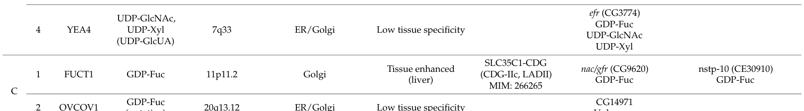

## Question

# Gene Research for Functional Annotation

## ⚠️ CRITICAL: Gene/Protein Identification Context

**BEFORE YOU BEGIN RESEARCH:** You MUST verify you are researching the CORRECT gene/protein. Gene symbols can be ambiguous, especially for less well-characterized genes from non-model organisms.

### Target Gene/Protein Identity (from UniProt):
- **UniProt Accession:** Q9W429
- **Protein Description:** RecName: Full=Endoplasmic reticulum GDP-fucose transporter {ECO:0000312|FlyBase:FBgn0029849}; AltName: Full=Solute carrier family 35 member B4 homolog; AltName: Full=UDP-xylose and UDP-N-acetylglucosamine transporter;
- **Gene Information:** Name=Efr {ECO:0000312|FlyBase:FBgn0029849}; ORFNames=CG3774 {ECO:0000312|FlyBase:FBgn0029849};
- **Organism (full):** Drosophila melanogaster (Fruit fly).
- **Protein Family:** Belongs to the nucleotide-sugar transporter family. SLC35B
- **Key Domains:** EmrE-like. (IPR037185); HUT1. (IPR013657); UAA (PF08449)

### MANDATORY VERIFICATION STEPS:

1. **Check if the gene symbol "Efr" matches the protein description above**
2. **Verify the organism is correct:** Drosophila melanogaster (Fruit fly).
3. **Check if protein family/domains align with what you find in literature**
4. **If you find literature for a DIFFERENT gene with the same or similar symbol, STOP**

### If Gene Symbol is Ambiguous or You Cannot Find Relevant Literature:

**DO NOT PROCEED WITH RESEARCH ON A DIFFERENT GENE.** Instead:
- State clearly: "The gene symbol 'Efr' is ambiguous or literature is limited for this specific protein"
- Explain what you found (e.g., "Found extensive literature on a different gene with the same symbol in a different organism")
- Describe the protein based ONLY on the UniProt information provided above
- Suggest that the protein function can be inferred from domain/family information

### Research Target:

Please provide a comprehensive research report on the gene **Efr** (gene ID: Efr, UniProt: Q9W429) in DROME.

The research report should be a detailed narrative explaining the function, biological processes, and localization of the gene product. Citations should be given for all claims.

You should prioritize authoritative reviews and primary scientific literature when conducting research. You can supplement
this with annotations you find in gene/protein databases, but these can be outdated or inaccurate.

We are specifically interested in the primary function of the gene - for enzymes, what reaction is catalyzed, and what is the substrate specificity? For transporters, what is the substrate? For structural proteins or adapters, what is the broader structural role? For signaling molecules, what is the role in the pathway.

We are interested in where in or outside the cell the gene product carries out its function.

We are also interested in the signaling or biochemical pathways in which the gene functions. We are less interested in broad pleiotropic effects, except where these elucidate the precise role.

Include evidence where possible. We are interested in both experimental evidence as well as inference from structure, evolution, or bioinformatic analysis. Precise studies should be prioritized over high-throughput, where available.

## Output

Question: You are an expert researcher providing comprehensive, well-cited information.

Provide detailed information focusing on:
1. Key concepts and definitions with current understanding
2. Recent developments and latest research (prioritize 2023-2024 sources)
3. Current applications and real-world implementations
4. Expert opinions and analysis from authoritative sources
5. Relevant statistics and data from recent studies

Format as a comprehensive research report with proper citations. Include URLs and publication dates where available.
Always prioritize recent, authoritative sources and provide specific citations for all major claims.

# Gene Research for Functional Annotation

## ⚠️ CRITICAL: Gene/Protein Identification Context

**BEFORE YOU BEGIN RESEARCH:** You MUST verify you are researching the CORRECT gene/protein. Gene symbols can be ambiguous, especially for less well-characterized genes from non-model organisms.

### Target Gene/Protein Identity (from UniProt):
- **UniProt Accession:** Q9W429
- **Protein Description:** RecName: Full=Endoplasmic reticulum GDP-fucose transporter {ECO:0000312|FlyBase:FBgn0029849}; AltName: Full=Solute carrier family 35 member B4 homolog; AltName: Full=UDP-xylose and UDP-N-acetylglucosamine transporter;
- **Gene Information:** Name=Efr {ECO:0000312|FlyBase:FBgn0029849}; ORFNames=CG3774 {ECO:0000312|FlyBase:FBgn0029849};
- **Organism (full):** Drosophila melanogaster (Fruit fly).
- **Protein Family:** Belongs to the nucleotide-sugar transporter family. SLC35B
- **Key Domains:** EmrE-like. (IPR037185); HUT1. (IPR013657); UAA (PF08449)

### MANDATORY VERIFICATION STEPS:

1. **Check if the gene symbol "Efr" matches the protein description above**
2. **Verify the organism is correct:** Drosophila melanogaster (Fruit fly).
3. **Check if protein family/domains align with what you find in literature**
4. **If you find literature for a DIFFERENT gene with the same or similar symbol, STOP**

### If Gene Symbol is Ambiguous or You Cannot Find Relevant Literature:

**DO NOT PROCEED WITH RESEARCH ON A DIFFERENT GENE.** Instead:
- State clearly: "The gene symbol 'Efr' is ambiguous or literature is limited for this specific protein"
- Explain what you found (e.g., "Found extensive literature on a different gene with the same symbol in a different organism")
- Describe the protein based ONLY on the UniProt information provided above
- Suggest that the protein function can be inferred from domain/family information

### Research Target:

Please provide a comprehensive research report on the gene **Efr** (gene ID: Efr, UniProt: Q9W429) in DROME.

The research report should be a detailed narrative explaining the function, biological processes, and localization of the gene product. Citations should be given for all claims.

You should prioritize authoritative reviews and primary scientific literature when conducting research. You can supplement
this with annotations you find in gene/protein databases, but these can be outdated or inaccurate.

We are specifically interested in the primary function of the gene - for enzymes, what reaction is catalyzed, and what is the substrate specificity? For transporters, what is the substrate? For structural proteins or adapters, what is the broader structural role? For signaling molecules, what is the role in the pathway.

We are interested in where in or outside the cell the gene product carries out its function.

We are also interested in the signaling or biochemical pathways in which the gene functions. We are less interested in broad pleiotropic effects, except where these elucidate the precise role.

Include evidence where possible. We are interested in both experimental evidence as well as inference from structure, evolution, or bioinformatic analysis. Precise studies should be prioritized over high-throughput, where available.

# Functional annotation of *Drosophila melanogaster* Efr

**Identity check.** The target is **Efr/CG3774**, the fly endoplasmic-reticulum (ER) GDP-fucose transporter identified by the user as UniProt **Q9W429**. A Drosophila gene survey and a 2024 SLC35-family review independently identify *efr* as CG3774. They distinguish it from **Gfr/Nac/CG9620**, the *Golgi* GDP-fucose transporter. The Q9W429 accession is supplied in the question; the literature examined verifies the gene-symbol/CG-number assignment rather than independently establishing that accession mapping. (yamamoto‐hino2015phenotypebasedclusteringof pages 11-13, kamiyama2024solutecarrierfamily pages 4-6, kamiyama2024solutecarrierfamily media b7c1eb9e)

## Molecular function and location

**Efr is a multisubstrate nucleotide-sugar transporter, not a fucosyltransferase.** Its reported cargoes are **GDP-fucose, UDP-*N*-acetylglucosamine (UDP-GlcNAc), and UDP-xylose**. Its functional direction is delivery of these cytosolic donors into the **ER lumen**, where luminal glycosylation machinery can use them; it does not itself attach sugars to proteins. The 2024 review specifically attributes this fly substrate profile and ER localization to Ishikawa and colleagues’ primary study, published in 2010. Thus GDP-fucose import is the best-established explanation of the name “ER GDP-fucose transporter,” but the name does **not** imply exclusive GDP-fucose specificity. (kamiyama2024solutecarrierfamily pages 16-18, kamiyama2024solutecarrierfamily pages 33-35, yamamoto‐hino2015phenotypebasedclusteringof pages 11-13)

The protein belongs to the **SLC35B nucleotide-sugar-transporter family**, consistent with the HUT1/UAA and EmrE-like domain annotations provided for Q9W429. Those annotations support a membrane-transport role; they do not independently determine which sugars this particular fly protein transports. A 2024 account describes a 352-residue protein with approximately **10 predicted transmembrane segments** and a C-terminal dilysine ER-retrieval signal; the segment count is a *prediction*, whereas ER localization is also reported experimentally in the literature summarized by the SLC35 review. (alwan2024characterizingtheeffect pages 30-36, kamiyama2024solutecarrierfamily pages 16-18)

The following comparison is essential because transferring a substrate annotation from a similarly named gene or a human homolog would give the wrong answer. (kamiyama2024solutecarrierfamily pages 4-6, kamiyama2024solutecarrierfamily pages 16-18)

| Identity / localization | Substrates | Most relevant biological interpretation |
|---|---|---|
| **Drosophila Efr (CG3774; Q9W429)** — ER-localized SLC35B-family nucleotide-sugar transporter (yamamoto‐hino2015phenotypebasedclusteringof pages 11-13, kamiyama2024solutecarrierfamily pages 16-18) | GDP-fucose, UDP-GlcNAc, and UDP-xylose (kamiyama2024solutecarrierfamily pages 4-6, kamiyama2024solutecarrierfamily media b7c1eb9e) | Supplies the ER with GDP-fucose for Notch O-fucosylation, acting redundantly with Gfr; its UDP-sugar transport may also support glycosaminoglycan biosynthesis (alwan2024characterizingtheeffect pages 30-36, kamiyama2024solutecarrierfamily pages 16-18) |
| **Drosophila Gfr/Nac (CG9620)** — Golgi-localized SLC35C1-family transporter; distinct from Efr (yamamoto‐hino2015phenotypebasedclusteringof pages 11-13, kamiyama2024solutecarrierfamily media b7c1eb9e) | GDP-fucose (geisler2012thedrosophilaneurally pages 4-6, geisler2012thedrosophilaneurally pages 7-8) | Principal characterized route supplying Golgi GDP-fucose for glycan fucosylation, especially N-glycan core fucosylation; loss strongly lowers, but does not eliminate, core-fucosylated N-glycans (geisler2012thedrosophilaneurally pages 8-9, geisler2012thedrosophilaneurally pages 4-6) |
| **Human SLC35B4 (YEA4)** — related ER/Golgi nucleotide-sugar transporter, but not functionally identical to fly Efr (kamiyama2024solutecarrierfamily pages 4-6, kamiyama2024solutecarrierfamily pages 16-18) | UDP-xylose and UDP-GlcNAc; UDP-glucuronic-acid transport has also been reported. **No GDP-fucose transport activity** (kamiyama2024solutecarrierfamily pages 16-18) | Proposed to supply nucleotide sugars for proteoglycan and other glycosylation pathways. It cannot complement GDP-fucose-transporter-deficient cells, so fly Efr’s GDP-fucose activity must not be transferred to human SLC35B4 by orthology alone (kamiyama2024solutecarrierfamily pages 16-18) |

*Table: A strict comparison of fly Efr, fly Gfr, and human SLC35B4 that prevents cross-gene or cross-species functional attribution. It highlights the unique experimentally reported GDP-fucose activity of Drosophila Efr.*

## Biochemical pathway and genetic evidence

**Notch O-fucosylation is Efr’s clearest pathway-level role.** Cytosolic GDP-fucose must reach the secretory-pathway lumen to supply protein O-fucosylation of the Notch receptor’s extracellular EGF-like repeats. Efr supplies an ER route; the distinct, predominantly Golgi-localized Gfr supplies an overlapping route. Although the two proteins occupy different principal compartments, experimental genetics led the 2010 investigators—and the 2024 review—to conclude that their contributions to Notch O-fucosylation are functionally redundant. O-fucosylation by the separate enzyme Ofut1 and subsequent Fringe-dependent modification help regulate Notch signaling; **Efr supplies donor substrate rather than catalyzing either modification**. (kamiyama2024solutecarrierfamily pages 16-18, kamiyama2024solutecarrierfamily pages 18-19, ameen2025geneticdiseasesof pages 9-11, kamiyama2024solutecarrierfamily pages 33-35)

The genetic distinction matters: Efr single mutants were reported to retain normal expression of the Notch-responsive wing-disc marker **Wingless (*wg*)**, whereas combined disruption of **Efr and Gfr** reduced that expression. Normal *wg* in an Efr single mutant therefore does not establish that Efr is dispensable for Notch glycosylation; it is consistent with compensation by the other import route. A 2024 RNAi investigation likewise observed no conspicuous difference in wing-disc Wingless staining after Efr knockdown alone, but its microscopy is not a direct measurement of Notch O-fucose occupancy. (alwan2024characterizingtheeffect pages 30-36, alwan2024characterizingtheeffect pages 64-72)

**Other glycans are a more qualified connection.** Efr’s UDP-GlcNAc and UDP-xylose substrate range makes participation in proteoglycan/glycosaminoglycan synthesis plausible. Efr mutant wing-vein and Dpp-signaling observations have been interpreted as evidence of a *partial* contribution to heparan-sulfate glycosaminoglycans, rather than proof that Efr is the sole donor-supply route for that pathway. In the 2024 RNAi investigation, wheat-germ-agglutinin staining of larval wing discs appeared reduced after Efr knockdown; this is preliminary evidence of an altered glycan phenotype, **not** a direct assay of UDP-GlcNAc flux or of a particular glycosaminoglycan linkage. (alwan2024characterizingtheeffect pages 30-36, alwan2024characterizingtheeffect pages 64-72)

Efr should also **not** be assigned Gfr’s dominant Golgi N-glycan phenotype. In a separate glycomic and transport study, flies lacking Gfr alone and flies lacking both Gfr and Efr retained comparable residual core-fucosylated N-glycans. That result argues against Efr being the transporter responsible for residual *Golgi* N-glycan core fucosylation when Gfr is absent, even though Efr contributes to the Notch-related ER route. The study’s quantitative N-glycan changes concern **Gfr/Nac**, not Efr: one monofucosylated glycan class was **21% in wild type versus 10% in nac1**, and another was **5% versus 1.4%**. These figures must not be presented as Efr-specific transport rates. (geisler2012thedrosophilaneurally pages 8-9, geisler2012thedrosophilaneurally pages 4-6)

## Recent research, applications, and limits of inference

The peer-reviewed **August 2024** SLC35-family review continues to classify fly Efr as an ER-localized GDP-fucose/UDP-GlcNAc/UDP-xylose transporter, citing the 2010 characterization; it does not report a new Efr-specific substrate-discovery experiment. A **July 2025** review likewise distinguishes fly ER transporter Efr from Golgi Gfr and cautions that the corresponding mammalian ER GDP-fucose-import mechanism remains unresolved. These are important qualifications for using the fly as a model of secretory-pathway fucosylation. (kamiyama2024solutecarrierfamily pages 16-18, ameen2025geneticdiseasesof pages 9-11)

One **2024 thesis**, rather than a peer-reviewed mechanistic transport study, provides recent Efr-targeted implementation of the fly **GAL4/UAS-RNAi** system. It reports larval RT-qPCR validation using **three sets of 20 larvae** per group and selected the stronger of two Efr RNAi lines for phenotyping. Adult survival at day 30 was reported as **61% after Efr knockdown versus 36% in the wild-type group** (*n* = 30 and 31, respectively); wing-disc staining was also examined. These observations illustrate the practical use of Efr perturbation to study glycan-related development and physiology, but partial knockdown, non-mechanistic endpoints, and the thesis’s differing comparison groups prevent assigning the survival difference to a specific transported sugar or calling it Efr’s primary function. (alwan2024characterizingtheeffect pages 46-53, alwan2024characterizingtheeffect pages 53-59, alwan2024characterizingtheeffect pages 64-72)

**Cross-species caution:** Human **SLC35B4** is a related transporter of UDP-xylose and UDP-GlcNAc, but, according to the 2024 review, **does not display fly Efr’s GDP-fucose transport activity** or complement GDP-fucose-transporter-deficient fibroblasts. Similarly, human SLC35C2 has been proposed as a GDP-fucose-related transporter but cannot simply be substituted for fly Efr: the 2025 review notes preserved ER fucosylation and no detected Notch-signaling defect in the relevant *Slc35c2* mouse knockout comparison. No human disease mechanism or therapy should therefore be attributed directly to *Drosophila efr* on orthology alone. (kamiyama2024solutecarrierfamily pages 16-18, ameen2025geneticdiseasesof pages 6-8)

**Evidence assessment.** The strongest functional annotation is **ER-membrane transport of GDP-fucose, UDP-GlcNAc, and UDP-xylose, with GDP-fucose supply contributing redundantly to Notch O-fucosylation**. The full text of the foundational 2010 Efr experiment was not obtainable in this search; its substrate and localization findings are reported here through an authoritative 2024 review and independent gene annotations, rather than through independently checked uptake curves, kinetic constants, or microscopy panels. The available evidence does not justify inventing an Efr-specific transport rate, substrate ranking, or antiport stoichiometry. (kamiyama2024solutecarrierfamily pages 16-18, yamamoto‐hino2015phenotypebasedclusteringof pages 11-13, kamiyama2024solutecarrierfamily pages 33-35)

### Principal sources and URLs

- Ishikawa HO *et al.* **2010**. “Two pathways for importing GDP-fucose into the endoplasmic reticulum lumen function redundantly in the O-fucosylation of Notch in *Drosophila*.” *Journal of Biological Chemistry* **285**, 4122–4129. https://doi.org/10.1074/jbc.M109.016964. Foundational study, identified in the 2024 review; its full text was not available for direct inspection here. (kamiyama2024solutecarrierfamily pages 33-35)
- Kamiyama S, Sone H. **August 2024**. “Solute Carrier Family 35 (SLC35)—An Overview and Recent Progress.” *Biologics* **4**, 242–279. https://doi.org/10.3390/biologics4030017. Recent expert synthesis and the source of the inspected Efr/Gfr comparison in Table 1. (kamiyama2024solutecarrierfamily pages 16-18, kamiyama2024solutecarrierfamily media b7c1eb9e)
- Geisler C *et al.* **August 2012**. “The *Drosophila* Neurally Altered Carbohydrate Mutant Has a Defective Golgi GDP-fucose Transporter.” *Journal of Biological Chemistry* **287**, 29599–29609. https://doi.org/10.1074/jbc.M112.379313. Experimental distinction between Golgi Gfr and ER Efr. (geisler2012thedrosophilaneurally pages 8-9, geisler2012thedrosophilaneurally pages 4-6)
- Yamamoto-Hino M *et al.* **May 2015**. “Phenotype-based clustering of glycosylation-related genes by RNAi-mediated gene silencing.” *Genes to Cells* **20**, 521–542. https://doi.org/10.1111/gtc.12246. Lists **Efr/CG3774** separately from **Gfr/Nac/CG9620**; its own Efr RNAi phenotype was **not tested**. (yamamoto‐hino2015phenotypebasedclusteringof pages 11-13)
- Ameen MT, French CR. **July 2025**. “Genetic Diseases of Fucosylation: Insights from Model Organisms.” *Genes* **16**, 800. https://doi.org/10.3390/genes16070800. Comparative assessment of fly and mammalian GDP-fucose transport. (ameen2025geneticdiseasesof pages 9-11, ameen2025geneticdiseasesof pages 6-8)

References

1. (yamamoto‐hino2015phenotypebasedclusteringof pages 11-13): Miki Yamamoto‐Hino, Hideki Yoshida, Tomomi Ichimiya, Sho Sakamura, Megumi Maeda, Yoshinobu Kimura, Norihiko Sasaki, Kiyoko F. Aoki‐Kinoshita, Akiko Kinoshita‐Toyoda, Hidenao Toyoda, Ryu Ueda, Shoko Nishihara, and Satoshi Goto. Phenotype-based clustering of glycosylation-related genes by rnai-mediated gene silencing. Genes to Cells, 20:521-542, May 2015. URL: https://doi.org/10.1111/gtc.12246, doi:10.1111/gtc.12246. This article has 42 citations and is from a peer-reviewed journal.

2. (kamiyama2024solutecarrierfamily pages 4-6): Shin Kamiyama and Hideyuki Sone. Solute carrier family 35 (slc35)—an overview and recent progress. Biologics, 4:242-279, Aug 2024. URL: https://doi.org/10.3390/biologics4030017, doi:10.3390/biologics4030017. This article has 15 citations and is from a peer-reviewed journal.

3. (kamiyama2024solutecarrierfamily media b7c1eb9e): Shin Kamiyama and Hideyuki Sone. Solute carrier family 35 (slc35)—an overview and recent progress. Biologics, 4:242-279, Aug 2024. URL: https://doi.org/10.3390/biologics4030017, doi:10.3390/biologics4030017. This article has 15 citations and is from a peer-reviewed journal.

4. (kamiyama2024solutecarrierfamily pages 16-18): Shin Kamiyama and Hideyuki Sone. Solute carrier family 35 (slc35)—an overview and recent progress. Biologics, 4:242-279, Aug 2024. URL: https://doi.org/10.3390/biologics4030017, doi:10.3390/biologics4030017. This article has 15 citations and is from a peer-reviewed journal.

5. (kamiyama2024solutecarrierfamily pages 33-35): Shin Kamiyama and Hideyuki Sone. Solute carrier family 35 (slc35)—an overview and recent progress. Biologics, 4:242-279, Aug 2024. URL: https://doi.org/10.3390/biologics4030017, doi:10.3390/biologics4030017. This article has 15 citations and is from a peer-reviewed journal.

6. (alwan2024characterizingtheeffect pages 30-36): MC ALWAN. Characterizing the effect of knocking down slc35b4 orthologs in drosophila melanogaster. Unknown journal, 2024.

7. (geisler2012thedrosophilaneurally pages 4-6): Christoph Geisler, Varshika Kotu, Mary Sharrow, Dubravko Rendić, Gerald Pöltl, Michael Tiemeyer, Iain B.H. Wilson, and Donald L. Jarvis. The drosophila neurally altered carbohydrate mutant has a defective golgi gdp-fucose transporter. Journal of Biological Chemistry, 287:29599-29609, Aug 2012. URL: https://doi.org/10.1074/jbc.m112.379313, doi:10.1074/jbc.m112.379313. This article has 15 citations and is from a domain leading peer-reviewed journal.

8. (geisler2012thedrosophilaneurally pages 7-8): Christoph Geisler, Varshika Kotu, Mary Sharrow, Dubravko Rendić, Gerald Pöltl, Michael Tiemeyer, Iain B.H. Wilson, and Donald L. Jarvis. The drosophila neurally altered carbohydrate mutant has a defective golgi gdp-fucose transporter. Journal of Biological Chemistry, 287:29599-29609, Aug 2012. URL: https://doi.org/10.1074/jbc.m112.379313, doi:10.1074/jbc.m112.379313. This article has 15 citations and is from a domain leading peer-reviewed journal.

9. (geisler2012thedrosophilaneurally pages 8-9): Christoph Geisler, Varshika Kotu, Mary Sharrow, Dubravko Rendić, Gerald Pöltl, Michael Tiemeyer, Iain B.H. Wilson, and Donald L. Jarvis. The drosophila neurally altered carbohydrate mutant has a defective golgi gdp-fucose transporter. Journal of Biological Chemistry, 287:29599-29609, Aug 2012. URL: https://doi.org/10.1074/jbc.m112.379313, doi:10.1074/jbc.m112.379313. This article has 15 citations and is from a domain leading peer-reviewed journal.

10. (kamiyama2024solutecarrierfamily pages 18-19): Shin Kamiyama and Hideyuki Sone. Solute carrier family 35 (slc35)—an overview and recent progress. Biologics, 4:242-279, Aug 2024. URL: https://doi.org/10.3390/biologics4030017, doi:10.3390/biologics4030017. This article has 15 citations and is from a peer-reviewed journal.

11. (ameen2025geneticdiseasesof pages 9-11): Muhammad T. Ameen and Curtis R. French. Genetic diseases of fucosylation: insights from model organisms. Genes, 16:800, Jul 2025. URL: https://doi.org/10.3390/genes16070800, doi:10.3390/genes16070800. This article has 5 citations.

12. (alwan2024characterizingtheeffect pages 64-72): MC ALWAN. Characterizing the effect of knocking down slc35b4 orthologs in drosophila melanogaster. Unknown journal, 2024.

13. (alwan2024characterizingtheeffect pages 46-53): MC ALWAN. Characterizing the effect of knocking down slc35b4 orthologs in drosophila melanogaster. Unknown journal, 2024.

14. (alwan2024characterizingtheeffect pages 53-59): MC ALWAN. Characterizing the effect of knocking down slc35b4 orthologs in drosophila melanogaster. Unknown journal, 2024.

15. (ameen2025geneticdiseasesof pages 6-8): Muhammad T. Ameen and Curtis R. French. Genetic diseases of fucosylation: insights from model organisms. Genes, 16:800, Jul 2025. URL: https://doi.org/10.3390/genes16070800, doi:10.3390/genes16070800. This article has 5 citations.

## Artifacts

- [Edison artifact artifact-00](Efr-deep-research-falcon_artifacts/artifact-00.md)

## Citations

1. kamiyama2024solutecarrierfamily pages 16-18
2. kamiyama2024solutecarrierfamily pages 33-35
3. kamiyama2024solutecarrierfamily pages 4-6
4. alwan2024characterizingtheeffect pages 30-36
5. geisler2012thedrosophilaneurally pages 4-6
6. geisler2012thedrosophilaneurally pages 7-8
7. geisler2012thedrosophilaneurally pages 8-9
8. kamiyama2024solutecarrierfamily pages 18-19
9. ameen2025geneticdiseasesof pages 9-11
10. alwan2024characterizingtheeffect pages 64-72
11. alwan2024characterizingtheeffect pages 46-53
12. alwan2024characterizingtheeffect pages 53-59
13. ameen2025geneticdiseasesof pages 6-8
14. https://doi.org/10.1074/jbc.M109.016964.
15. https://doi.org/10.3390/biologics4030017.
16. https://doi.org/10.1074/jbc.M112.379313.
17. https://doi.org/10.1111/gtc.12246.
18. https://doi.org/10.3390/genes16070800.
19. https://doi.org/10.1111/gtc.12246,
20. https://doi.org/10.3390/biologics4030017,
21. https://doi.org/10.1074/jbc.m112.379313,
22. https://doi.org/10.3390/genes16070800,