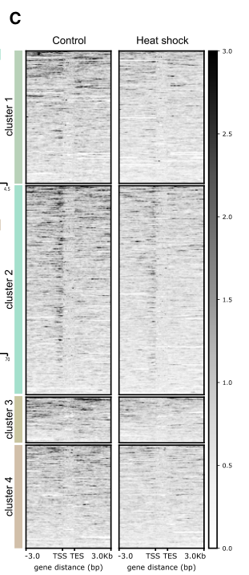

## Question

# Gene Research for Functional Annotation

## ⚠️ CRITICAL: Gene/Protein Identification Context

**BEFORE YOU BEGIN RESEARCH:** You MUST verify you are researching the CORRECT gene/protein. Gene symbols can be ambiguous, especially for less well-characterized genes from non-model organisms.

### Target Gene/Protein Identity (from UniProt):
- **UniProt Accession:** Q9VR17
- **Protein Description:** RecName: Full=Early boundary activity protein 1 {ECO:0000303|PubMed:23240086}; AltName: Full=Blastoderm-specific gene 25A {ECO:0000303|PubMed:25561495};
- **Gene Information:** Name=Elba1 {ECO:0000303|PubMed:23240086, ECO:0000312|FlyBase:FBgn0000227}; Synonyms=Bsg25A {ECO:0000303|PubMed:25561495}; ORFNames=CG12205 {ECO:0000312|FlyBase:FBgn0000227};
- **Organism (full):** Drosophila melanogaster (Fruit fly).
- **Protein Family:** Not specified in UniProt
- **Key Domains:** BEN_domain. (IPR018379); BEND6-like. (IPR037496); BEN (PF10523)

### MANDATORY VERIFICATION STEPS:

1. **Check if the gene symbol "Elba1" matches the protein description above**
2. **Verify the organism is correct:** Drosophila melanogaster (Fruit fly).
3. **Check if protein family/domains align with what you find in literature**
4. **If you find literature for a DIFFERENT gene with the same or similar symbol, STOP**

### If Gene Symbol is Ambiguous or You Cannot Find Relevant Literature:

**DO NOT PROCEED WITH RESEARCH ON A DIFFERENT GENE.** Instead:
- State clearly: "The gene symbol 'Elba1' is ambiguous or literature is limited for this specific protein"
- Explain what you found (e.g., "Found extensive literature on a different gene with the same symbol in a different organism")
- Describe the protein based ONLY on the UniProt information provided above
- Suggest that the protein function can be inferred from domain/family information

### Research Target:

Please provide a comprehensive research report on the gene **Elba1** (gene ID: Elba1, UniProt: Q9VR17) in DROME.

The research report should be a detailed narrative explaining the function, biological processes, and localization of the gene product. Citations should be given for all claims.

You should prioritize authoritative reviews and primary scientific literature when conducting research. You can supplement
this with annotations you find in gene/protein databases, but these can be outdated or inaccurate.

We are specifically interested in the primary function of the gene - for enzymes, what reaction is catalyzed, and what is the substrate specificity? For transporters, what is the substrate? For structural proteins or adapters, what is the broader structural role? For signaling molecules, what is the role in the pathway.

We are interested in where in or outside the cell the gene product carries out its function.

We are also interested in the signaling or biochemical pathways in which the gene functions. We are less interested in broad pleiotropic effects, except where these elucidate the precise role.

Include evidence where possible. We are interested in both experimental evidence as well as inference from structure, evolution, or bioinformatic analysis. Precise studies should be prioritized over high-throughput, where available.

## Output

Question: You are an expert researcher providing comprehensive, well-cited information.

Provide detailed information focusing on:
1. Key concepts and definitions with current understanding
2. Recent developments and latest research (prioritize 2023-2024 sources)
3. Current applications and real-world implementations
4. Expert opinions and analysis from authoritative sources
5. Relevant statistics and data from recent studies

Format as a comprehensive research report with proper citations. Include URLs and publication dates where available.
Always prioritize recent, authoritative sources and provide specific citations for all major claims.

# Gene Research for Functional Annotation

## ⚠️ CRITICAL: Gene/Protein Identification Context

**BEFORE YOU BEGIN RESEARCH:** You MUST verify you are researching the CORRECT gene/protein. Gene symbols can be ambiguous, especially for less well-characterized genes from non-model organisms.

### Target Gene/Protein Identity (from UniProt):
- **UniProt Accession:** Q9VR17
- **Protein Description:** RecName: Full=Early boundary activity protein 1 {ECO:0000303|PubMed:23240086}; AltName: Full=Blastoderm-specific gene 25A {ECO:0000303|PubMed:25561495};
- **Gene Information:** Name=Elba1 {ECO:0000303|PubMed:23240086, ECO:0000312|FlyBase:FBgn0000227}; Synonyms=Bsg25A {ECO:0000303|PubMed:25561495}; ORFNames=CG12205 {ECO:0000312|FlyBase:FBgn0000227};
- **Organism (full):** Drosophila melanogaster (Fruit fly).
- **Protein Family:** Not specified in UniProt
- **Key Domains:** BEN_domain. (IPR018379); BEND6-like. (IPR037496); BEN (PF10523)

### MANDATORY VERIFICATION STEPS:

1. **Check if the gene symbol "Elba1" matches the protein description above**
2. **Verify the organism is correct:** Drosophila melanogaster (Fruit fly).
3. **Check if protein family/domains align with what you find in literature**
4. **If you find literature for a DIFFERENT gene with the same or similar symbol, STOP**

### If Gene Symbol is Ambiguous or You Cannot Find Relevant Literature:

**DO NOT PROCEED WITH RESEARCH ON A DIFFERENT GENE.** Instead:
- State clearly: "The gene symbol 'Elba1' is ambiguous or literature is limited for this specific protein"
- Explain what you found (e.g., "Found extensive literature on a different gene with the same symbol in a different organism")
- Describe the protein based ONLY on the UniProt information provided above
- Suggest that the protein function can be inferred from domain/family information

### Research Target:

Please provide a comprehensive research report on the gene **Elba1** (gene ID: Elba1, UniProt: Q9VR17) in DROME.

The research report should be a detailed narrative explaining the function, biological processes, and localization of the gene product. Citations should be given for all claims.

You should prioritize authoritative reviews and primary scientific literature when conducting research. You can supplement
this with annotations you find in gene/protein databases, but these can be outdated or inaccurate.

We are specifically interested in the primary function of the gene - for enzymes, what reaction is catalyzed, and what is the substrate specificity? For transporters, what is the substrate? For structural proteins or adapters, what is the broader structural role? For signaling molecules, what is the role in the pathway.

We are interested in where in or outside the cell the gene product carries out its function.

We are also interested in the signaling or biochemical pathways in which the gene functions. We are less interested in broad pleiotropic effects, except where these elucidate the precise role.

Include evidence where possible. We are interested in both experimental evidence as well as inference from structure, evolution, or bioinformatic analysis. Precise studies should be prioritized over high-throughput, where available.

# Functional annotation of *Drosophila melanogaster* Elba1

**Identity check.** The protein specified as UniProt **Q9VR17** in the supplied record is the intended fly target: primary studies identify **Elba1 = Bsg25A = CG12205**. Elba1 is a BEN-domain-containing protein and is distinct from **Elba2/CG9883**, another BEN protein, and **Elba3/CG15634**, an assembly partner without a BEN domain. The papers verify the gene names, organism, and domain assignment; the Q9VR17 accession mapping comes from the UniProt information supplied with the question. Consequently, results concerning Elba2—for example, its reported ability to substitute for linker histone H1—should not be assigned to Elba1. (aoki2012elbaanovel pages 5-6, dai2015commonanddistinct pages 2-3, xu2016bendomainprotein pages 2-3)

## Primary function and molecular mechanism

**Elba1 is principally a sequence-specific chromatin-boundary component, not an enzyme or transporter.** In early embryos it supplies one DNA-recognition subunit of the **ELBA complex**, together with Elba2 and the bridging protein Elba3. Its C-terminal BEN domain contributes to recognition of the asymmetric **CCAATAAG** element at the *Fab-7* boundary of the bithorax complex. Individually translated full-length subunits, and tested pairs, did not produce the characteristic DNA-binding shift; the three together did. Engineered dimerization of the Elba1 and Elba2 DNA-binding regions could bypass Elba3 in vitro, supporting the interpretation that Elba3 facilitates assembly of the two BEN-containing subunits. This is a protein–DNA architectural and transcription-regulatory activity; no catalytic reaction or transported substrate has been established. (aoki2012elbaanovel pages 4-5, aoki2012elbaanovel pages 5-6, aoki2012elbaanovel pages 8-10)

The physiological consequence is **insulation**: an ELBA-bound element between an enhancer and promoter limits inappropriate enhancer–promoter communication and helps neighboring transcription units retain distinct expression programs. At *Fab-7*, the early-active pHS1 fragment blocked the *ftz* UPS enhancer in transgenic embryos; changing the recognition sequence impaired blocking, while multimerized recognition-site DNA conferred early blocking activity. RNA interference against **elba1**, **elba2**, or **elba3** weakened pHS1 reporter insulation, unlike interference against the related factor *insv*. This establishes a requirement for Elba1 in the tested early reporter, **not** that Elba1 alone controls the entire endogenous *Fab-7* boundary: other boundary factors provide redundancy. (aoki2012elbaanovel pages 2-4, aoki2012elbaanovel pages 12-14)

Elba1 also has **context-dependent transcriptional effects**. In cultured S2-cell assays, full-length Elba1/Bsg25A alone repressed a reporter carrying palindromic Insv sites *between* an enhancer and transcription start site; robust repression through asymmetric ELBA sites instead required coexpression of all three ELBA proteins. Because enhancer blocking could also explain a decrease when sites occupy that intervening position—and Elba1 did **not** show repression when Insv sites were placed upstream of the enhancer—the experiment should not be taken as proof of a general, position-independent autonomous Elba1 repressor activity. Elba2, but not Elba1, showed such distal-site repression in that comparison. (dai2015commonanddistinct pages 5-7, dai2015commonanddistinct pages 7-9)

Structural work explains why Elba1 can recognize more than one DNA arrangement. Its purified BEN-containing region, residues **248–362**, formed a homodimer on a palindromic DNA duplex in a crystal structure resolved to approximately **3.2 Å**. Base-substitution assays supported sequence-selective binding, and an Elba1 BEN–VP16 fusion activated a palindromic-site reporter approximately **80-fold**. These results demonstrate intrinsic BEN-domain DNA recognition and potential homodimer binding under experimental conditions; they do **not** replace the evidence that the native asymmetric *Fab-7* site is preferentially engaged by assembled ELBA. The VP16 result measures an engineered activator, not native Elba1-mediated activation. (dai2015commonanddistinct pages 3-5, dai2015commonanddistinct pages 5-7, ueberschar2019bensolofactorspartition pages 4-5)

## Biological process, location, and developmental timing

Elba1 acts **inside embryonic nuclei, on chromosomal DNA**. Its presence in early-embryo nuclear extracts, chromatin immunoprecipitation at *Fab-7*, and later Elba1-GFP chromatin-profiling and nuclear-imaging experiments support nuclear/chromatin localization rather than an extracellular, membrane, or cytoplasmic effector role. Elba1 and Elba2 occupied *Fab-7* in **2–5-hour** embryos but not **9–12-hour** embryos. Elba1 and Elba3 transcripts peak around the **2–4-hour blastoderm stage** and then decline; Elba2 persists more broadly, explaining why its presence alone does not maintain the same *Fab-7* occupancy later. These measurements establish the setting of Elba1’s principal demonstrated activity: the early embryonic establishment of appropriately separated regulatory domains. (aoki2012elbaanovel pages 5-6, aoki2012elbaanovel pages 12-14, aoki2012elbaanovel pages 10-12, orkenby2023stress‐sensitivedynamicsof pages 8-11)

Genome-wide evidence extends the function beyond *Fab-7*. Blastoderm ChIP-seq identified **3,151 Elba1 peaks**, compared with **1,468 Elba2** and **6,525 Elba3** peaks. Elba1 binding was strongly dependent on the other subunits: **712** Elba1 peaks remained in an *elba2* mutant, many at redistributed rather than normal sites, and Elba1 binding was nearly eliminated in an *elba3* mutant. In the same study, pairs of neighboring promoters separated by ELBA-associated sites became **less differentially transcribed** in ELBA mutants, particularly when their wild-type expression differed by more than fourfold. This is evidence for an ELBA-system role in partitioning active transcription units; the promoter-pair result is not, by itself, proof that each expression change is caused solely by Elba1. Reporter-tested fragments at the *wg*, *Parp*, and *Lasp* loci also blocked enhancer action, with the tested *wg* fragment losing that activity in an *elba3* mutant. (ueberschar2019bensolofactorspartition pages 3-4, ueberschar2019bensolofactorspartition pages 4-4, ueberschar2019bensolofactorspartition pages 9-10, ueberschar2019bensolofactorspartition pages 11-12, ueberschar2019bensolofactorspartition pages 12-13)

The relevant biochemical pathway is therefore **BEN-domain DNA recognition → ELBA complex assembly and chromatin occupancy → enhancer blocking and separation of neighboring gene activity**. ELBA also collaborates genetically with other fly insulator systems, including GAF and CP190; related BEN protein Insv has overlapping DNA recognition but should not be treated as an interchangeable ELBA subunit or as evidence that Elba1 has Insv’s other signaling functions. An authoritative genome-organization review places ELBA among Drosophila boundary factors, while the direct genetic and genomic tests provide the stronger Elba1-specific evidence. (ueberschar2019bensolofactorspartition pages 1-2, ueberschar2019bensolofactorspartition pages 8-9, peterson2021multiscaleorganizationof pages 7-8)

## Most recent directly relevant primary evidence: embryonic stress, 2023

A **2023** study connected Elba1 abundance to an early environmental response. Embryos exposed to a **30-minute, 37°C heat shock** before the midblastula transition retained elevated maternal microRNAs and had reduced stage-5 Elba1 expression. In Elba1-GFP imaging, protein signal was lower after heat shock (**eight control versus five heat-shocked embryos; P = 0.0186**). The heat-shock-associated Elba1 transcript decrease was not detectable in *Dicer-1* mutant embryos, and Elba1 RNA was enriched following Ago1 immunoprecipitation, implicating microRNA-processing and effector machinery. A predicted site for miR-283-3p makes it a candidate regulator, but these experiments do **not** establish that this particular microRNA directly targets Elba1. (orkenby2023stress‐sensitivedynamicsof pages 1-2, orkenby2023stress‐sensitivedynamicsof pages 5-7, orkenby2023stress‐sensitivedynamicsof pages 7-8, orkenby2023stress‐sensitivedynamicsof pages 8-11, orkenby2023stress‐sensitivedynamicsof pages 11-12)

Elba1-GFP CUT&RUN detected enrichment near transcription start sites of a group of stress-responsive developmental genes; that enrichment was weaker after heat shock. The experiment used **five sets of 20 stage-5 embryos per condition**, merged for the reported peak-score analysis. In a separate genetic test, flies heterozygous for an *Elba1* mutation showed increased expression of the variegating *white* eye-color reporter, consistent with **suppression of position-effect variegation** and weaker reporter silencing (**51 Elba1-heterozygous versus 58 control males; P < 0.0001**). Elba2 and Elba3 heterozygotes also showed the phenotype. Thus the data connect Elba1 dosage and ELBA function to a persistent chromatin-state readout, but do not establish a unique Elba1-only mechanism or prove direct recruitment of HP1a or formation of a particular heterochromatin border. The study’s Figure 6 directly displays both the CUT&RUN comparison and eye-pigmentation result. (orkenby2023stress‐sensitivedynamicsof pages 7-8, orkenby2023stress‐sensitivedynamicsof pages 8-11, orkenby2023stress‐sensitivedynamicsof media 715b42f6, orkenby2023stress‐sensitivedynamicsof pages 11-12)

The strongest evidence across these studies can be compared by question and experimental scale below.

| Question | Strongest study and date | Quantitative / experimental evidence | Confidence or caveat |
|---|---|---|---|
| Identity and domains | Aoki et al., published 18 Dec 2012, [DOI: 10.7554/eLife.00171](https://doi.org/10.7554/eLife.00171) | Affinity purification identified **Elba1 = CG12205 = Bsg25A** as an approximately 40-kDa ELBA subunit. Its C-terminal region contains an approximately 90-aa BEN domain; Elba3 lacks this domain. (aoki2012elbaanovel pages 5-6) | **High.** Direct biochemical identification agrees with the supplied Q9VR17 record. Similarity to human BEND proteins does not establish orthology or conserved function. |
| Primary tripartite enhancer-blocking mechanism | Aoki et al., published 18 Dec 2012, [DOI: 10.7554/eLife.00171](https://doi.org/10.7554/eLife.00171) | Elba1, Elba2 and Elba3 were all required to reconstitute binding to the asymmetric Fab-7 motif **CCAATAAG**. Elba1 and Elba2 supply BEN DNA-binding regions; Elba3 bridges their N termini. Elba1 occupied Fab-7 in 2–5-h but not 9–12-h embryos. Elba1 RNAi weakened pHS1×4 blockade of the early *ftz* UPS enhancer. (aoki2012elbaanovel pages 4-5, aoki2012elbaanovel pages 12-14) | **High for ELBA-complex activity.** Intact Fab-7 uses redundant factors, so Elba1 is not its sole determinant; evidence supports early, complex-dependent insulation rather than autonomous Elba1 action. |
| Structural specificity and Elba1-alone reporter context | Dai et al., published Jan 2015, [DOI: 10.1101/gad.252122.114](https://doi.org/10.1101/gad.252122.114) | The Elba1/Bsg25A BEN domain, residues 248–362, formed a homodimer on a palindromic 13-mer; its structure was solved at **3.2 Å**. Elba1-BEN–VP16 activated an Insv-site reporter approximately **80-fold**. Full-length Elba1 alone repressed a promoter-proximal 4×Insv-site reporter, whereas robust asymmetric ELBA-site repression required the tripartite complex. (dai2015commonanddistinct pages 3-5, dai2015commonanddistinct pages 5-7) | **High for DNA recognition; moderate for autonomous repression.** The VP16 fusion demonstrates binding, not native repression. Elba1 did **not** show distal-site repression in the positional test; that finding applied to Insv and Elba2. |
| Genome-wide occupancy and transcription-unit partitioning | Ueberschär et al., published 6 Dec 2019, [DOI: 10.1038/s41467-019-13558-8](https://doi.org/10.1038/s41467-019-13558-8) | Blastoderm ChIP-seq identified **3,151 Elba1 peaks**. Only **712** remained in an *elba2* mutant; 496 of 712 were new relative to wild type, and Elba1 binding was nearly eliminated in an *elba3* mutant. Adjacent promoters separated by ELBA peaks became less differentially transcribed in ELBA mutants, especially when wild-type expression differed by more than fourfold. (ueberschar2019bensolofactorspartition pages 9-10, ueberschar2019bensolofactorspartition pages 4-4, ueberschar2019bensolofactorspartition pages 3-4, ueberschar2019bensolofactorspartition pages 11-12) | **High for occupancy and complex dependence.** Residual or redistributed peaks in *elba2* mutants do not prove normal Elba1-alone targeting. Promoter-pair effects implicate the ELBA system collectively. |
| Stress–miRNA regulation, CUT-and-RUN and *wm4h* PEV | Örkenby et al., published online 20 Mar 2023, [DOI: 10.15252/msb.202211148](https://doi.org/10.15252/msb.202211148) | A 30-min, 37°C pre-MBT heat shock reduced stage-5 Elba1-GFP: controls **n=8**, heat shock **n=5**, *P*=0.0186. Elba1 reduction required Dicer-1, *P*=0.0018, and Elba1 RNA was enriched in Ago1 IP, **n=8**. CUT-and-RUN used five sets of 20 embryos per condition and showed reduced Elba1 signal near TSSs of induced developmental genes. Heterozygous *Elba1* mutation increased *wm4h* eye pigmentation: **n=51** versus **n=58** controls, *P*<0.0001. (orkenby2023stress‐sensitivedynamicsof pages 7-8, orkenby2023stress‐sensitivedynamicsof pages 11-12, orkenby2023stress‐sensitivedynamicsof pages 8-11) | **Moderate.** Evidence supports miRNA-machinery-dependent regulation and a suppressor-of-variegation phenotype, but not direct targeting by a specific miRNA or an Elba1-specific heterochromatin mechanism. Elba2 and Elba3 mutants also altered PEV; this is unrelated to Elba2–histone-H1 activity. |

*Table: A compact hierarchy of identity, mechanistic, structural, genomic and stress-response evidence for Drosophila Elba1/Bsg25A. Caveats distinguish Elba1-specific results from collective ELBA-complex effects and unrelated Elba2 functions.*

## Research use and limits of the annotation

**Current implementations are research assays, not clinical applications:** *Fab-7*/pHS1 and candidate genomic fragments are used in fly transgenic enhancer-blocking reporters; ChIP or CUT&RUN maps Elba1-bound chromatin; and the *wᵐ⁴ʰ* eye-color reporter tests lasting effects of developmental perturbation on variegation. Elba1 chromatin recovery can depend on fixation method: a study using bifunctional DSG–formaldehyde cross-linking obtained approximately **sevenfold** Elba1 ChIP enrichment at a *Fab-8* recognition site, compared with approximately **twofold** in one standard-formaldehyde comparison. This is a methodological consideration when interpreting apparent absence of occupancy. (aoki2012elbaanovel pages 12-14, ueberschar2019bensolofactorspartition pages 12-13, orkenby2023stress‐sensitivedynamicsof pages 8-11, aoki2014bifunctionalcrosslinkingreagents pages 4-5)

**Assessment.** The high-confidence annotation is an **early embryonic, nuclear BEN-domain DNA-binding subunit of a heterotrimeric chromatin insulator**. The best-supported direct mechanism is assembly-dependent recognition of boundary DNA and restriction of regulatory interactions between transcription units. Homodimeric DNA binding is biochemically established, whereas its contribution at endogenous sites, the identity of any direct stress-responsive microRNA regulator, and the route from ELBA dosage to adult heterochromatin readouts remain less certain. Among the retrieved Elba1-specific primary studies, the most recent is the 2023 stress-response report; no separate 2024 mechanistic result was identified. (aoki2012elbaanovel pages 4-5, dai2015commonanddistinct pages 3-5, ueberschar2019bensolofactorspartition pages 9-10, orkenby2023stress‐sensitivedynamicsof pages 11-12)

**Principal sources and publication dates:** Aoki *et al.*, *eLife*, **December 2012**, [doi:10.7554/eLife.00171](https://doi.org/10.7554/eLife.00171); Dai *et al.*, *Genes & Development*, **January 2015**, [doi:10.1101/gad.252122.114](https://doi.org/10.1101/gad.252122.114); Ueberschär *et al.*, *Nature Communications*, **December 2019**, [doi:10.1038/s41467-019-13558-8](https://doi.org/10.1038/s41467-019-13558-8); Örkenby *et al.*, *Molecular Systems Biology*, **published online 20 March 2023**, [doi:10.15252/msb.202211148](https://doi.org/10.15252/msb.202211148). Supporting sources: Aoki *et al.*, *Fly*, **2014**, [doi:10.4161/fly.26805](https://doi.org/10.4161/fly.26805); Peterson *et al.*, *Genes*, **2021**, [doi:10.3390/genes12060817](https://doi.org/10.3390/genes12060817). (aoki2012elbaanovel pages 5-6, dai2015commonanddistinct pages 3-5, ueberschar2019bensolofactorspartition pages 3-4, orkenby2023stress‐sensitivedynamicsof pages 1-2, aoki2014bifunctionalcrosslinkingreagents pages 4-5, peterson2021multiscaleorganizationof pages 7-8)

References

1. (aoki2012elbaanovel pages 5-6): Tsutomu Aoki, Ali Sarkeshik, John Yates, and Paul Schedl. Elba, a novel developmentally regulated chromatin boundary factor is a hetero-tripartite dna binding complex. eLife, Dec 2012. URL: https://doi.org/10.7554/elife.00171, doi:10.7554/elife.00171. This article has 59 citations and is from a domain leading peer-reviewed journal.

2. (dai2015commonanddistinct pages 2-3): Qi Dai, Aiming Ren, Jakub O. Westholm, Hong Duan, Dinshaw J. Patel, and Eric C. Lai. Common and distinct dna-binding and regulatory activities of the ben-solo transcription factor family. Genes & Development, 29:48-62, Jan 2015. URL: https://doi.org/10.1101/gad.252122.114, doi:10.1101/gad.252122.114. This article has 52 citations and is from a highest quality peer-reviewed journal.

3. (xu2016bendomainprotein pages 2-3): Na Xu, Xingwu Lu, Harsh Kavi, Alexander V. Emelyanov, Travis J. Bernardo, Elena Vershilova, Arthur I. Skoultchi, and Dmitry V. Fyodorov. Ben domain protein elba2 can functionally substitute for linker histone h1 in drosophila in vivo. Scientific Reports, Sep 2016. URL: https://doi.org/10.1038/srep34354, doi:10.1038/srep34354. This article has 4 citations and is from a peer-reviewed journal.

4. (aoki2012elbaanovel pages 4-5): Tsutomu Aoki, Ali Sarkeshik, John Yates, and Paul Schedl. Elba, a novel developmentally regulated chromatin boundary factor is a hetero-tripartite dna binding complex. eLife, Dec 2012. URL: https://doi.org/10.7554/elife.00171, doi:10.7554/elife.00171. This article has 59 citations and is from a domain leading peer-reviewed journal.

5. (aoki2012elbaanovel pages 8-10): Tsutomu Aoki, Ali Sarkeshik, John Yates, and Paul Schedl. Elba, a novel developmentally regulated chromatin boundary factor is a hetero-tripartite dna binding complex. eLife, Dec 2012. URL: https://doi.org/10.7554/elife.00171, doi:10.7554/elife.00171. This article has 59 citations and is from a domain leading peer-reviewed journal.

6. (aoki2012elbaanovel pages 2-4): Tsutomu Aoki, Ali Sarkeshik, John Yates, and Paul Schedl. Elba, a novel developmentally regulated chromatin boundary factor is a hetero-tripartite dna binding complex. eLife, Dec 2012. URL: https://doi.org/10.7554/elife.00171, doi:10.7554/elife.00171. This article has 59 citations and is from a domain leading peer-reviewed journal.

7. (aoki2012elbaanovel pages 12-14): Tsutomu Aoki, Ali Sarkeshik, John Yates, and Paul Schedl. Elba, a novel developmentally regulated chromatin boundary factor is a hetero-tripartite dna binding complex. eLife, Dec 2012. URL: https://doi.org/10.7554/elife.00171, doi:10.7554/elife.00171. This article has 59 citations and is from a domain leading peer-reviewed journal.

8. (dai2015commonanddistinct pages 5-7): Qi Dai, Aiming Ren, Jakub O. Westholm, Hong Duan, Dinshaw J. Patel, and Eric C. Lai. Common and distinct dna-binding and regulatory activities of the ben-solo transcription factor family. Genes & Development, 29:48-62, Jan 2015. URL: https://doi.org/10.1101/gad.252122.114, doi:10.1101/gad.252122.114. This article has 52 citations and is from a highest quality peer-reviewed journal.

9. (dai2015commonanddistinct pages 7-9): Qi Dai, Aiming Ren, Jakub O. Westholm, Hong Duan, Dinshaw J. Patel, and Eric C. Lai. Common and distinct dna-binding and regulatory activities of the ben-solo transcription factor family. Genes & Development, 29:48-62, Jan 2015. URL: https://doi.org/10.1101/gad.252122.114, doi:10.1101/gad.252122.114. This article has 52 citations and is from a highest quality peer-reviewed journal.

10. (dai2015commonanddistinct pages 3-5): Qi Dai, Aiming Ren, Jakub O. Westholm, Hong Duan, Dinshaw J. Patel, and Eric C. Lai. Common and distinct dna-binding and regulatory activities of the ben-solo transcription factor family. Genes & Development, 29:48-62, Jan 2015. URL: https://doi.org/10.1101/gad.252122.114, doi:10.1101/gad.252122.114. This article has 52 citations and is from a highest quality peer-reviewed journal.

11. (ueberschar2019bensolofactorspartition pages 4-5): Malin Ueberschär, Huazhen Wang, Chun Zhang, Shu Kondo, Tsutomu Aoki, Paul Schedl, Eric C. Lai, Jiayu Wen, and Qi Dai. Ben-solo factors partition active chromatin to ensure proper gene activation in drosophila. Nature Communications, Dec 2019. URL: https://doi.org/10.1038/s41467-019-13558-8, doi:10.1038/s41467-019-13558-8. This article has 22 citations and is from a highest quality peer-reviewed journal.

12. (aoki2012elbaanovel pages 10-12): Tsutomu Aoki, Ali Sarkeshik, John Yates, and Paul Schedl. Elba, a novel developmentally regulated chromatin boundary factor is a hetero-tripartite dna binding complex. eLife, Dec 2012. URL: https://doi.org/10.7554/elife.00171, doi:10.7554/elife.00171. This article has 59 citations and is from a domain leading peer-reviewed journal.

13. (orkenby2023stress‐sensitivedynamicsof pages 8-11): Lovisa Örkenby, Signe Skog, Helen Ekman, Alessandro Gozzo, Unn Kugelberg, Rashmi Ramesh, Srivathsa Magadi, Gianluca Zambanini, Anna Nordin, Claudio Cantú, Daniel Nätt, and Anita Öst. Stress‐sensitive dynamics of mirnas and elba1 in drosophila embryogenesis. Molecular Systems Biology, Mar 2023. URL: https://doi.org/10.15252/msb.202211148, doi:10.15252/msb.202211148. This article has 7 citations and is from a highest quality peer-reviewed journal.

14. (ueberschar2019bensolofactorspartition pages 3-4): Malin Ueberschär, Huazhen Wang, Chun Zhang, Shu Kondo, Tsutomu Aoki, Paul Schedl, Eric C. Lai, Jiayu Wen, and Qi Dai. Ben-solo factors partition active chromatin to ensure proper gene activation in drosophila. Nature Communications, Dec 2019. URL: https://doi.org/10.1038/s41467-019-13558-8, doi:10.1038/s41467-019-13558-8. This article has 22 citations and is from a highest quality peer-reviewed journal.

15. (ueberschar2019bensolofactorspartition pages 4-4): Malin Ueberschär, Huazhen Wang, Chun Zhang, Shu Kondo, Tsutomu Aoki, Paul Schedl, Eric C. Lai, Jiayu Wen, and Qi Dai. Ben-solo factors partition active chromatin to ensure proper gene activation in drosophila. Nature Communications, Dec 2019. URL: https://doi.org/10.1038/s41467-019-13558-8, doi:10.1038/s41467-019-13558-8. This article has 22 citations and is from a highest quality peer-reviewed journal.

16. (ueberschar2019bensolofactorspartition pages 9-10): Malin Ueberschär, Huazhen Wang, Chun Zhang, Shu Kondo, Tsutomu Aoki, Paul Schedl, Eric C. Lai, Jiayu Wen, and Qi Dai. Ben-solo factors partition active chromatin to ensure proper gene activation in drosophila. Nature Communications, Dec 2019. URL: https://doi.org/10.1038/s41467-019-13558-8, doi:10.1038/s41467-019-13558-8. This article has 22 citations and is from a highest quality peer-reviewed journal.

17. (ueberschar2019bensolofactorspartition pages 11-12): Malin Ueberschär, Huazhen Wang, Chun Zhang, Shu Kondo, Tsutomu Aoki, Paul Schedl, Eric C. Lai, Jiayu Wen, and Qi Dai. Ben-solo factors partition active chromatin to ensure proper gene activation in drosophila. Nature Communications, Dec 2019. URL: https://doi.org/10.1038/s41467-019-13558-8, doi:10.1038/s41467-019-13558-8. This article has 22 citations and is from a highest quality peer-reviewed journal.

18. (ueberschar2019bensolofactorspartition pages 12-13): Malin Ueberschär, Huazhen Wang, Chun Zhang, Shu Kondo, Tsutomu Aoki, Paul Schedl, Eric C. Lai, Jiayu Wen, and Qi Dai. Ben-solo factors partition active chromatin to ensure proper gene activation in drosophila. Nature Communications, Dec 2019. URL: https://doi.org/10.1038/s41467-019-13558-8, doi:10.1038/s41467-019-13558-8. This article has 22 citations and is from a highest quality peer-reviewed journal.

19. (ueberschar2019bensolofactorspartition pages 1-2): Malin Ueberschär, Huazhen Wang, Chun Zhang, Shu Kondo, Tsutomu Aoki, Paul Schedl, Eric C. Lai, Jiayu Wen, and Qi Dai. Ben-solo factors partition active chromatin to ensure proper gene activation in drosophila. Nature Communications, Dec 2019. URL: https://doi.org/10.1038/s41467-019-13558-8, doi:10.1038/s41467-019-13558-8. This article has 22 citations and is from a highest quality peer-reviewed journal.

20. (ueberschar2019bensolofactorspartition pages 8-9): Malin Ueberschär, Huazhen Wang, Chun Zhang, Shu Kondo, Tsutomu Aoki, Paul Schedl, Eric C. Lai, Jiayu Wen, and Qi Dai. Ben-solo factors partition active chromatin to ensure proper gene activation in drosophila. Nature Communications, Dec 2019. URL: https://doi.org/10.1038/s41467-019-13558-8, doi:10.1038/s41467-019-13558-8. This article has 22 citations and is from a highest quality peer-reviewed journal.

21. (peterson2021multiscaleorganizationof pages 7-8): Samantha C. Peterson, Kaylah B. Samuelson, and Stacey L. Hanlon. Multi-scale organization of the drosophila melanogaster genome. Genes, 12:817, May 2021. URL: https://doi.org/10.3390/genes12060817, doi:10.3390/genes12060817. This article has 21 citations.

22. (orkenby2023stress‐sensitivedynamicsof pages 1-2): Lovisa Örkenby, Signe Skog, Helen Ekman, Alessandro Gozzo, Unn Kugelberg, Rashmi Ramesh, Srivathsa Magadi, Gianluca Zambanini, Anna Nordin, Claudio Cantú, Daniel Nätt, and Anita Öst. Stress‐sensitive dynamics of mirnas and elba1 in drosophila embryogenesis. Molecular Systems Biology, Mar 2023. URL: https://doi.org/10.15252/msb.202211148, doi:10.15252/msb.202211148. This article has 7 citations and is from a highest quality peer-reviewed journal.

23. (orkenby2023stress‐sensitivedynamicsof pages 5-7): Lovisa Örkenby, Signe Skog, Helen Ekman, Alessandro Gozzo, Unn Kugelberg, Rashmi Ramesh, Srivathsa Magadi, Gianluca Zambanini, Anna Nordin, Claudio Cantú, Daniel Nätt, and Anita Öst. Stress‐sensitive dynamics of mirnas and elba1 in drosophila embryogenesis. Molecular Systems Biology, Mar 2023. URL: https://doi.org/10.15252/msb.202211148, doi:10.15252/msb.202211148. This article has 7 citations and is from a highest quality peer-reviewed journal.

24. (orkenby2023stress‐sensitivedynamicsof pages 7-8): Lovisa Örkenby, Signe Skog, Helen Ekman, Alessandro Gozzo, Unn Kugelberg, Rashmi Ramesh, Srivathsa Magadi, Gianluca Zambanini, Anna Nordin, Claudio Cantú, Daniel Nätt, and Anita Öst. Stress‐sensitive dynamics of mirnas and elba1 in drosophila embryogenesis. Molecular Systems Biology, Mar 2023. URL: https://doi.org/10.15252/msb.202211148, doi:10.15252/msb.202211148. This article has 7 citations and is from a highest quality peer-reviewed journal.

25. (orkenby2023stress‐sensitivedynamicsof pages 11-12): Lovisa Örkenby, Signe Skog, Helen Ekman, Alessandro Gozzo, Unn Kugelberg, Rashmi Ramesh, Srivathsa Magadi, Gianluca Zambanini, Anna Nordin, Claudio Cantú, Daniel Nätt, and Anita Öst. Stress‐sensitive dynamics of mirnas and elba1 in drosophila embryogenesis. Molecular Systems Biology, Mar 2023. URL: https://doi.org/10.15252/msb.202211148, doi:10.15252/msb.202211148. This article has 7 citations and is from a highest quality peer-reviewed journal.

26. (orkenby2023stress‐sensitivedynamicsof media 715b42f6): Lovisa Örkenby, Signe Skog, Helen Ekman, Alessandro Gozzo, Unn Kugelberg, Rashmi Ramesh, Srivathsa Magadi, Gianluca Zambanini, Anna Nordin, Claudio Cantú, Daniel Nätt, and Anita Öst. Stress‐sensitive dynamics of mirnas and elba1 in drosophila embryogenesis. Molecular Systems Biology, Mar 2023. URL: https://doi.org/10.15252/msb.202211148, doi:10.15252/msb.202211148. This article has 7 citations and is from a highest quality peer-reviewed journal.

27. (aoki2014bifunctionalcrosslinkingreagents pages 4-5): Tsutomu Aoki, Daniel Wolle, Ella Preger-Ben Noon, Qi Dai, Eric C Lai, and Paul Schedl. Bi-functional cross-linking reagents efficiently capture protein-dna complexes in drosophila embryos. Fly, 8:43-51, Jan 2014. URL: https://doi.org/10.4161/fly.26805, doi:10.4161/fly.26805. This article has 26 citations and is from a peer-reviewed journal.

## Artifacts

- [Edison artifact artifact-00](Elba1-deep-research-falcon_artifacts/artifact-00.md)

## Citations

1. aoki2012elbaanovel pages 5-6
2. dai2015commonanddistinct pages 2-3
3. xu2016bendomainprotein pages 2-3
4. aoki2012elbaanovel pages 4-5
5. aoki2012elbaanovel pages 8-10
6. aoki2012elbaanovel pages 2-4
7. aoki2012elbaanovel pages 12-14
8. dai2015commonanddistinct pages 5-7
9. dai2015commonanddistinct pages 7-9
10. dai2015commonanddistinct pages 3-5
11. ueberschar2019bensolofactorspartition pages 4-5
12. aoki2012elbaanovel pages 10-12
13. ueberschar2019bensolofactorspartition pages 3-4
14. ueberschar2019bensolofactorspartition pages 4-4
15. ueberschar2019bensolofactorspartition pages 9-10
16. ueberschar2019bensolofactorspartition pages 11-12
17. ueberschar2019bensolofactorspartition pages 12-13
18. ueberschar2019bensolofactorspartition pages 1-2
19. ueberschar2019bensolofactorspartition pages 8-9
20. peterson2021multiscaleorganizationof pages 7-8
21. aoki2014bifunctionalcrosslinkingreagents pages 4-5
22. DOI: 10.7554/eLife.00171
23. DOI: 10.1101/gad.252122.114
24. DOI: 10.1038/s41467-019-13558-8
25. DOI: 10.15252/msb.202211148
26. doi:10.7554/eLife.00171
27. doi:10.1101/gad.252122.114
28. doi:10.1038/s41467-019-13558-8
29. doi:10.15252/msb.202211148
30. doi:10.4161/fly.26805
31. doi:10.3390/genes12060817
32. https://doi.org/10.7554/eLife.00171
33. https://doi.org/10.1101/gad.252122.114
34. https://doi.org/10.1038/s41467-019-13558-8
35. https://doi.org/10.15252/msb.202211148
36. https://doi.org/10.4161/fly.26805
37. https://doi.org/10.3390/genes12060817
38. https://doi.org/10.7554/elife.00171,
39. https://doi.org/10.1101/gad.252122.114,
40. https://doi.org/10.1038/srep34354,
41. https://doi.org/10.1038/s41467-019-13558-8,
42. https://doi.org/10.15252/msb.202211148,
43. https://doi.org/10.3390/genes12060817,
44. https://doi.org/10.4161/fly.26805,