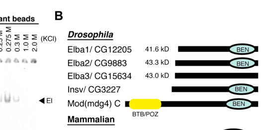

## Question

# Gene Research for Functional Annotation

## ⚠️ CRITICAL: Gene/Protein Identification Context

**BEFORE YOU BEGIN RESEARCH:** You MUST verify you are researching the CORRECT gene/protein. Gene symbols can be ambiguous, especially for less well-characterized genes from non-model organisms.

### Target Gene/Protein Identity (from UniProt):
- **UniProt Accession:** Q9VQD6
- **Protein Description:** RecName: Full=Early boundary activity protein 2 {ECO:0000303|PubMed:23240086};
- **Gene Information:** Name=Elba2 {ECO:0000303|PubMed:23240086, ECO:0000312|FlyBase:FBgn0031435}; ORFNames=CG9883 {ECO:0000312|FlyBase:FBgn0031435};
- **Organism (full):** Drosophila melanogaster (Fruit fly).
- **Protein Family:** Not specified in UniProt
- **Key Domains:** BEN_domain. (IPR018379); BEND6-like. (IPR037496); BEN (PF10523)

### MANDATORY VERIFICATION STEPS:

1. **Check if the gene symbol "Elba2" matches the protein description above**
2. **Verify the organism is correct:** Drosophila melanogaster (Fruit fly).
3. **Check if protein family/domains align with what you find in literature**
4. **If you find literature for a DIFFERENT gene with the same or similar symbol, STOP**

### If Gene Symbol is Ambiguous or You Cannot Find Relevant Literature:

**DO NOT PROCEED WITH RESEARCH ON A DIFFERENT GENE.** Instead:
- State clearly: "The gene symbol 'Elba2' is ambiguous or literature is limited for this specific protein"
- Explain what you found (e.g., "Found extensive literature on a different gene with the same symbol in a different organism")
- Describe the protein based ONLY on the UniProt information provided above
- Suggest that the protein function can be inferred from domain/family information

### Research Target:

Please provide a comprehensive research report on the gene **Elba2** (gene ID: Elba2, UniProt: Q9VQD6) in DROME.

The research report should be a detailed narrative explaining the function, biological processes, and localization of the gene product. Citations should be given for all claims.

You should prioritize authoritative reviews and primary scientific literature when conducting research. You can supplement
this with annotations you find in gene/protein databases, but these can be outdated or inaccurate.

We are specifically interested in the primary function of the gene - for enzymes, what reaction is catalyzed, and what is the substrate specificity? For transporters, what is the substrate? For structural proteins or adapters, what is the broader structural role? For signaling molecules, what is the role in the pathway.

We are interested in where in or outside the cell the gene product carries out its function.

We are also interested in the signaling or biochemical pathways in which the gene functions. We are less interested in broad pleiotropic effects, except where these elucidate the precise role.

Include evidence where possible. We are interested in both experimental evidence as well as inference from structure, evolution, or bioinformatic analysis. Precise studies should be prioritized over high-throughput, where available.

## Output

Question: You are an expert researcher providing comprehensive, well-cited information.

Provide detailed information focusing on:
1. Key concepts and definitions with current understanding
2. Recent developments and latest research (prioritize 2023-2024 sources)
3. Current applications and real-world implementations
4. Expert opinions and analysis from authoritative sources
5. Relevant statistics and data from recent studies

Format as a comprehensive research report with proper citations. Include URLs and publication dates where available.
Always prioritize recent, authoritative sources and provide specific citations for all major claims.

# Gene Research for Functional Annotation

## ⚠️ CRITICAL: Gene/Protein Identification Context

**BEFORE YOU BEGIN RESEARCH:** You MUST verify you are researching the CORRECT gene/protein. Gene symbols can be ambiguous, especially for less well-characterized genes from non-model organisms.

### Target Gene/Protein Identity (from UniProt):
- **UniProt Accession:** Q9VQD6
- **Protein Description:** RecName: Full=Early boundary activity protein 2 {ECO:0000303|PubMed:23240086};
- **Gene Information:** Name=Elba2 {ECO:0000303|PubMed:23240086, ECO:0000312|FlyBase:FBgn0031435}; ORFNames=CG9883 {ECO:0000312|FlyBase:FBgn0031435};
- **Organism (full):** Drosophila melanogaster (Fruit fly).
- **Protein Family:** Not specified in UniProt
- **Key Domains:** BEN_domain. (IPR018379); BEND6-like. (IPR037496); BEN (PF10523)

### MANDATORY VERIFICATION STEPS:

1. **Check if the gene symbol "Elba2" matches the protein description above**
2. **Verify the organism is correct:** Drosophila melanogaster (Fruit fly).
3. **Check if protein family/domains align with what you find in literature**
4. **If you find literature for a DIFFERENT gene with the same or similar symbol, STOP**

### If Gene Symbol is Ambiguous or You Cannot Find Relevant Literature:

**DO NOT PROCEED WITH RESEARCH ON A DIFFERENT GENE.** Instead:
- State clearly: "The gene symbol 'Elba2' is ambiguous or literature is limited for this specific protein"
- Explain what you found (e.g., "Found extensive literature on a different gene with the same symbol in a different organism")
- Describe the protein based ONLY on the UniProt information provided above
- Suggest that the protein function can be inferred from domain/family information

### Research Target:

Please provide a comprehensive research report on the gene **Elba2** (gene ID: Elba2, UniProt: Q9VQD6) in DROME.

The research report should be a detailed narrative explaining the function, biological processes, and localization of the gene product. Citations should be given for all claims.

You should prioritize authoritative reviews and primary scientific literature when conducting research. You can supplement
this with annotations you find in gene/protein databases, but these can be outdated or inaccurate.

We are specifically interested in the primary function of the gene - for enzymes, what reaction is catalyzed, and what is the substrate specificity? For transporters, what is the substrate? For structural proteins or adapters, what is the broader structural role? For signaling molecules, what is the role in the pathway.

We are interested in where in or outside the cell the gene product carries out its function.

We are also interested in the signaling or biochemical pathways in which the gene functions. We are less interested in broad pleiotropic effects, except where these elucidate the precise role.

Include evidence where possible. We are interested in both experimental evidence as well as inference from structure, evolution, or bioinformatic analysis. Precise studies should be prioritized over high-throughput, where available.

# Functional annotation of *Drosophila melanogaster* Elba2

## Identity and principal function

**Elba2 is the fruit-fly protein encoded by CG9883**, matching the supplied UniProt accession **Q9VQD6** and description “early boundary activity protein 2.” It is distinct from Elba1/Bsg25A (CG12205), Elba3 (CG15634), and the related BEN-domain protein Insensitive (Insv). Elba2 contains a conserved C-terminal BEN domain, consistent with the supplied domain annotations; the primary literature identifies it as a DNA-recognition component of the **ELBA chromatin-boundary complex**. It is not known as an enzyme or transporter, and there is no catalytic reaction or transported substrate to assign. (aoki2012elbaanovel pages 5-6, dai2015commonanddistinct pages 1-2)

The best-supported functional annotation is **nuclear, DNA-associated regulation of chromatin boundaries and gene expression**, with an experimentally supported additional contribution to chromatin spacing and compaction. ELBA comprises Elba1 and Elba2, which provide BEN-domain-containing DNA-binding regions, and Elba3, which helps assemble and recruit the complex. Its established developmental context is the early embryo, particularly the blastoderm period. (aoki2012elbaanovel pages 14-15, ueberschar2019bensolofactorspartition pages 1-2, xu2016bendomainprotein pages 5-5)

The following evidence matrix distinguishes observations on Elba2 itself from effects measured for the entire ELBA complex.

| Functional inference | Direct experimental evidence | Context / limits | Paper year and DOI URL |
|---|---|---|---|
| Elba2 is the BEN-domain DNA-recognition subunit of an ELBA heterotrimer with Elba1 and adaptor Elba3; the assembled complex recognizes the asymmetric Fab-7 motif `CCAATAAG`. | Affinity purification identified CG9883/Elba2 with Elba1 and Elba3. EMSA showed that no single subunit or pair bound the Elba probe detectably; all three were required to reconstitute the native-like shift. (aoki2012elbaanovel pages 5-6) | Applies to the asymmetric ELBA site under these biochemical conditions. It does not mean that an isolated Elba2 BEN domain lacks all DNA-binding capacity. | Aoki et al., 2012 — [https://doi.org/10.7554/eLife.00171](https://doi.org/10.7554/eLife.00171) |
| Elba2's BEN domain can recognize palindromic Insv-consensus sites and support repression independently of the complete ELBA complex in a cultured-cell reporter context. | An Elba2-BEN–VP16 fusion strongly and specifically activated an S2-cell reporter carrying four Insv sites; full-length Elba2 could repress through such sites without the other ELBA factors. (dai2015commonanddistinct pages 3-5) | Reporter evidence is not proof of endogenous standalone Elba2 occupancy. Crystallographic evidence in this study was for Bsg25A/Elba1, **not Elba2**. Notch-corepressor activity was specific to Insv/BEND6 and should not be assigned to Elba2. | Dai et al., 2015 — [https://doi.org/10.1101/gad.252122.114](https://doi.org/10.1101/gad.252122.114) |
| ELBA, including Elba2, mediates developmentally restricted enhancer blocking at the Fab-7 pHS1 boundary in early embryos. | The pHS1×4 reporter blocked an early enhancer; depletion of any ELBA subunit disrupted blocking, whereas Insv depletion did not. ChIP detected Elba1 and Elba2 at Fab-7 in 2–5-hour embryos but not 9–12-hour embryos. (aoki2012elbaanovel pages 12-14) | Elba2 transcript/protein can persist later, but Fab-7 occupancy requires the other developmentally restricted subunits. The assay establishes an early, sequence- and context-dependent boundary function rather than constitutive insulation. | Aoki et al., 2012 — [https://doi.org/10.7554/eLife.00171](https://doi.org/10.7554/eLife.00171) |
| In blastoderm embryos, Elba2 acts predominantly through ELBA to partition neighboring active transcription units. | ChIP-seq identified 1,468 Elba2, 3,151 Elba1 and 6,525 Elba3 peaks. Only 68 Elba2 peaks remained in an `elba3` mutant. Across convergent, divergent and tandem promoter pairs separated by ELBA peaks, wild-type expression differences greater than fourfold were significantly reduced in all three ELBA mutants; an ELBA-bound element also showed enhancer-blocking activity in a transgenic reporter. (ueberschar2019bensolofactorspartition pages 3-4, ueberschar2019bensolofactorspartition pages 4-5, ueberschar2019bensolofactorspartition pages 11-12) | Peak totals are affected by antibody and peak-calling performance. Elba3 has Elba1/2-independent occupancy, so Elba3 peaks cannot all be attributed to Elba2. Expression and reporter phenotypes establish ELBA-complex function, not necessarily an Elba2-only mechanism. | Ueberschär et al., 2019 — [https://doi.org/10.1038/s41467-019-13558-8](https://doi.org/10.1038/s41467-019-13558-8) |
| Elba2 also contributes broadly to chromatin spacing and compaction and can partially substitute for linker histone H1 when ectopically expressed. | In `elba2`-null 0–4-hour embryos, nucleosome repeat length fell from about 189 to 182 bp and nuclear size increased. Endogenous Elba2 occupied broad polytene-chromosome bands and colocalized strongly with H1. In H1-depleted animals, ectopic Elba2 increased adult viability from 26% to 72% of the Mendelian expectation. (xu2016bendomainprotein pages 5-5, xu2016bendomainprotein pages 2-3) | Elba2 loss alone was compatible with viability. H1 rescue used overexpression and was partial; broad chromosomal localization does not reveal whether Elba2 binds independently, through ELBA, or through other recruiters. Increased nuclear size supports reduced compaction but could include indirect effects. | Xu et al., 2016 — [https://doi.org/10.1038/srep34354](https://doi.org/10.1038/srep34354) |

*Table: Experimental evidence linking Drosophila Elba2 to ELBA-dependent DNA recognition and insulation, autonomous BEN-domain reporter activity, and broader chromatin compaction. The matrix separates direct findings from assay-specific limitations and unsupported extrapolations.*

## Molecular mechanism and DNA specificity

At the *Fab-7* boundary of the bithorax complex, assembled ELBA recognizes the **asymmetric sequence `CCAATAAG`**. In the original purification and reconstitution experiments, neither Elba2 alone nor any two-subunit mixture detectably shifted the ELBA-site probe; all three subunits were needed for a native-like shift. Removing the BEN domain from either Elba1 or Elba2 prevented binding. Artificially bringing the two BEN-containing proteins together with GST fusions bypassed Elba3 in vitro, supporting a model in which Elba3 organizes a productive Elba1–Elba2 DNA-binding unit rather than serving as its sequence-reading domain. Aoki and colleagues’ domain schematic and binding experiments directly illustrate these conclusions. (aoki2012elbaanovel pages 8-10, aoki2012elbaanovel pages 14-15, aoki2012elbaanovel media a0d8a06a, aoki2012elbaanovel media e1741393)

**The ELBA-site requirement should not be interpreted as a universal inability of Elba2 to recognize DNA independently.** Dai and colleagues subsequently showed that an isolated Elba2 BEN-domain fusion specifically activated an S2-cell reporter bearing palindromic Insv-consensus sites; full-length Elba2 could also repress through those sites without the other ELBA proteins in that assay. This differs from recognition of the asymmetric *Fab-7* site by physiological ELBA. The DNA-bound crystal structure reported in that study was of **Elba1/Bsg25A**, not Elba2, so its atomic contacts inform BEN-family mechanism by comparison rather than directly establishing an Elba2 structure. Insv’s Notch-corepressor activity likewise must **not** be assigned to Elba2 merely because the proteins share a BEN domain or can recognize some of the same sequences. (dai2015commonanddistinct pages 3-5, dai2015commonanddistinct pages 2-3, dai2015commonanddistinct pages 1-2, dai2015commonanddistinct pages 11-12)

## Biological process: boundary activity and transcriptional partitioning

*Fab-7* separates regulatory domains controlling the homeotic gene *Abd-B*. In early embryos, its pHS1 subelement can block enhancer–promoter communication: changing its ELBA recognition sequence weakens early boundary activity, while multimerized recognition sites confer early enhancer blocking in a reporter. Depleting **any** ELBA subunit, including Elba2, disrupted blocking in the tested pHS1 reporter, whereas depleting Insv did not. Chromatin immunoprecipitation detected Elba1 and Elba2 at the *Fab-7* ELBA site in **2–5-hour embryos**, but not in **9–12-hour embryos**. Thus, Elba2 expression alone does not ensure later *Fab-7* occupancy when its complex partners are not appropriately deployed. These experiments directly establish a stage-dependent **insulator function**—separating regulatory inputs—not a catalytic step in a signaling cascade. (aoki2012elbaanovel pages 4-5, aoki2012elbaanovel pages 12-14, aoki2012elbaanovel pages 15-16)

This function extends beyond a single engineered boundary. Blastoderm-embryo ChIP-seq identified **1,468 Elba2 peaks**, compared with **3,151 Elba1** and **6,525 Elba3** peaks. Only **68 Elba2 peaks** remained in an *elba3* mutant, consistent with strong dependence on the assembled complex for most endogenous Elba2 occupancy; some Elba3 sites, conversely, persisted without Elba1 or Elba2. These peak totals should not be equated with numbers of equally occupied functional boundaries: the study noted technical limitations of the Elba2 antibody, and peak calling depends on assay sensitivity. (ueberschar2019bensolofactorspartition pages 3-4, ueberschar2019bensolofactorspartition pages 4-5, ueberschar2019bensolofactorspartition pages 1-2)

Genome-wide nascent-transcription analysis of **2–4-hour embryos** found that neighboring genes separated by ELBA-bound regions became **less differentially expressed** in ELBA mutants, particularly when the neighboring promoters differed by **more than fourfold** in wild type. Transgenic enhancer-blocking assays provided a functional test of ELBA-bound elements. Together, these results support a role in **partitioning adjacent active transcription units** rather than simply repressing every nearby gene. Because these experiments perturb complex subunits and Elba3 also has Elba1/2-independent occupancy, not every ELBA-associated transcriptional change can be attributed exclusively to Elba2. (ueberschar2019bensolofactorspartition pages 9-10, ueberschar2019bensolofactorspartition pages 11-12, ueberschar2019bensolofactorspartition pages 1-2)

At *Fab-7*, ELBA and Insv have **overlapping but nonidentical** recognition: both can recognize some `CCAATTGG`-containing sites, whereas ELBA additionally recognizes the asymmetric `CCAATAAG` site. Later work demonstrated an **Insv-dependent segment-identity phenotype in a sensitized endogenous *Fab-7* background**. That result clarifies boundary-factor redundancy, but it is an Insv experiment—not direct evidence that loss of Elba2 alone produces the same *Abd-B* or abdominal transformation. (fedotova2018thebendomain pages 1-2, fedotova2018thebendomain pages 9-11)

## Additional structural role and subcellular location

Elba2 acts **inside the nucleus on chromatin**. Antibody staining detected endogenous Elba2 broadly across salivary-gland polytene chromosomes, predominantly in chromosome bands, with substantial overlap with linker histone H1; loss of staining in Elba2-null material supported specificity. This widespread distribution is broader than a picture based solely on selected, motif-defined ELBA binding sites. Whether all of that chromosomal association represents independent Elba2 binding, binding within ELBA, or recruitment by additional factors remains unresolved. (xu2016bendomainprotein pages 6-8, xu2016bendomainprotein pages 5-5, xu2016bendomainprotein pages 8-9)

An Elba2-null mutation reduced the measured nucleosome repeat length in **0–4-hour embryos from approximately 189 to 182 base pairs** and enlarged syncytial nuclei, supporting a contribution to nucleosome spacing and nuclear compaction. Elba2 loss alone was compatible with survival, but it exacerbated H1-depletion phenotypes. Conversely, ectopic Elba2 raised adult viability in an H1-depleted experimental background from **26% to 72% of the Mendelian expectation** and ameliorated chromosome-architecture and heterochromatin defects **without restoring H1 protein**. This is evidence for *partial functional substitution under experimental expression conditions*, not proof that endogenous Elba2 is itself a linker histone or that H1 replacement is its only normal function. The mechanism connecting its broad chromatin activity to sequence-specific ELBA insulation has not been resolved. (xu2016bendomainprotein pages 5-5, xu2016bendomainprotein pages 5-6, xu2016bendomainprotein pages 3-5, xu2016bendomainprotein pages 2-3)

## Assessment and research currency

**High-confidence conclusions** are the identity of CG9883/Elba2, its BEN domain, nuclear chromatin association, contribution to ELBA-dependent early insulation, and experimentally observed effect on embryonic chromatin organization. **Context-dependent conclusions** are autonomous recognition and repression at palindromic sites, demonstrated in cultured-cell assays, and broad H1-like rescue, demonstrated largely through ectopic expression. Direct Elba2-specific evidence for a Notch-signaling role, a catalytic activity, or an extracellular location is lacking in the studies reviewed. Targeted searches did not identify a 2023–2024 primary study that supersedes the Elba2-specific mechanistic work summarized here; the key experimental publications span **2012–2019**. (aoki2012elbaanovel pages 5-6, dai2015commonanddistinct pages 2-3, xu2016bendomainprotein pages 5-5, ueberschar2019bensolofactorspartition pages 3-4)

### Principal primary sources

- Aoki T, Sarkeshik A, Yates J, Schedl P. **December 2012.** “Elba, a novel developmentally regulated chromatin boundary factor is a hetero-tripartite DNA binding complex.” *eLife* 1:e00171. https://doi.org/10.7554/eLife.00171. (aoki2012elbaanovel pages 5-6)
- Dai Q, et al. **January 2015.** “Common and distinct DNA-binding and regulatory activities of the BEN-solo transcription factor family.” *Genes & Development* 29:48–62. https://doi.org/10.1101/gad.252122.114. (dai2015commonanddistinct pages 1-2)
- Xu N, et al. **September 2016.** “BEN domain protein Elba2 can functionally substitute for linker histone H1 in Drosophila in vivo.” *Scientific Reports* 6. https://doi.org/10.1038/srep34354. (xu2016bendomainprotein pages 2-3)
- Fedotova A, et al. **2018.** “The BEN Domain Protein Insensitive Binds to the Fab-7 Chromatin Boundary To Establish Proper Segmental Identity in Drosophila.” *Genetics* 210:573–585. https://doi.org/10.1534/genetics.118.301259. Relevant for distinguishing Insv from ELBA. (fedotova2018thebendomain pages 1-2)
- Ueberschär M, et al. **December 2019.** “BEN-solo factors partition active chromatin to ensure proper gene activation in Drosophila.” *Nature Communications* 10. https://doi.org/10.1038/s41467-019-13558-8. (ueberschar2019bensolofactorspartition pages 3-4, ueberschar2019bensolofactorspartition pages 9-10)

References

1. (aoki2012elbaanovel pages 5-6): Tsutomu Aoki, Ali Sarkeshik, John Yates, and Paul Schedl. Elba, a novel developmentally regulated chromatin boundary factor is a hetero-tripartite dna binding complex. eLife, Dec 2012. URL: https://doi.org/10.7554/elife.00171, doi:10.7554/elife.00171. This article has 59 citations and is from a domain leading peer-reviewed journal.

2. (dai2015commonanddistinct pages 1-2): Qi Dai, Aiming Ren, Jakub O. Westholm, Hong Duan, Dinshaw J. Patel, and Eric C. Lai. Common and distinct dna-binding and regulatory activities of the ben-solo transcription factor family. Genes & Development, 29:48-62, Jan 2015. URL: https://doi.org/10.1101/gad.252122.114, doi:10.1101/gad.252122.114. This article has 52 citations and is from a highest quality peer-reviewed journal.

3. (aoki2012elbaanovel pages 14-15): Tsutomu Aoki, Ali Sarkeshik, John Yates, and Paul Schedl. Elba, a novel developmentally regulated chromatin boundary factor is a hetero-tripartite dna binding complex. eLife, Dec 2012. URL: https://doi.org/10.7554/elife.00171, doi:10.7554/elife.00171. This article has 59 citations and is from a domain leading peer-reviewed journal.

4. (ueberschar2019bensolofactorspartition pages 1-2): Malin Ueberschär, Huazhen Wang, Chun Zhang, Shu Kondo, Tsutomu Aoki, Paul Schedl, Eric C. Lai, Jiayu Wen, and Qi Dai. Ben-solo factors partition active chromatin to ensure proper gene activation in drosophila. Nature Communications, Dec 2019. URL: https://doi.org/10.1038/s41467-019-13558-8, doi:10.1038/s41467-019-13558-8. This article has 21 citations and is from a highest quality peer-reviewed journal.

5. (xu2016bendomainprotein pages 5-5): Na Xu, Xingwu Lu, Harsh Kavi, Alexander V. Emelyanov, Travis J. Bernardo, Elena Vershilova, Arthur I. Skoultchi, and Dmitry V. Fyodorov. Ben domain protein elba2 can functionally substitute for linker histone h1 in drosophila in vivo. Scientific Reports, Sep 2016. URL: https://doi.org/10.1038/srep34354, doi:10.1038/srep34354. This article has 4 citations and is from a peer-reviewed journal.

6. (dai2015commonanddistinct pages 3-5): Qi Dai, Aiming Ren, Jakub O. Westholm, Hong Duan, Dinshaw J. Patel, and Eric C. Lai. Common and distinct dna-binding and regulatory activities of the ben-solo transcription factor family. Genes & Development, 29:48-62, Jan 2015. URL: https://doi.org/10.1101/gad.252122.114, doi:10.1101/gad.252122.114. This article has 52 citations and is from a highest quality peer-reviewed journal.

7. (aoki2012elbaanovel pages 12-14): Tsutomu Aoki, Ali Sarkeshik, John Yates, and Paul Schedl. Elba, a novel developmentally regulated chromatin boundary factor is a hetero-tripartite dna binding complex. eLife, Dec 2012. URL: https://doi.org/10.7554/elife.00171, doi:10.7554/elife.00171. This article has 59 citations and is from a domain leading peer-reviewed journal.

8. (ueberschar2019bensolofactorspartition pages 3-4): Malin Ueberschär, Huazhen Wang, Chun Zhang, Shu Kondo, Tsutomu Aoki, Paul Schedl, Eric C. Lai, Jiayu Wen, and Qi Dai. Ben-solo factors partition active chromatin to ensure proper gene activation in drosophila. Nature Communications, Dec 2019. URL: https://doi.org/10.1038/s41467-019-13558-8, doi:10.1038/s41467-019-13558-8. This article has 21 citations and is from a highest quality peer-reviewed journal.

9. (ueberschar2019bensolofactorspartition pages 4-5): Malin Ueberschär, Huazhen Wang, Chun Zhang, Shu Kondo, Tsutomu Aoki, Paul Schedl, Eric C. Lai, Jiayu Wen, and Qi Dai. Ben-solo factors partition active chromatin to ensure proper gene activation in drosophila. Nature Communications, Dec 2019. URL: https://doi.org/10.1038/s41467-019-13558-8, doi:10.1038/s41467-019-13558-8. This article has 21 citations and is from a highest quality peer-reviewed journal.

10. (ueberschar2019bensolofactorspartition pages 11-12): Malin Ueberschär, Huazhen Wang, Chun Zhang, Shu Kondo, Tsutomu Aoki, Paul Schedl, Eric C. Lai, Jiayu Wen, and Qi Dai. Ben-solo factors partition active chromatin to ensure proper gene activation in drosophila. Nature Communications, Dec 2019. URL: https://doi.org/10.1038/s41467-019-13558-8, doi:10.1038/s41467-019-13558-8. This article has 21 citations and is from a highest quality peer-reviewed journal.

11. (xu2016bendomainprotein pages 2-3): Na Xu, Xingwu Lu, Harsh Kavi, Alexander V. Emelyanov, Travis J. Bernardo, Elena Vershilova, Arthur I. Skoultchi, and Dmitry V. Fyodorov. Ben domain protein elba2 can functionally substitute for linker histone h1 in drosophila in vivo. Scientific Reports, Sep 2016. URL: https://doi.org/10.1038/srep34354, doi:10.1038/srep34354. This article has 4 citations and is from a peer-reviewed journal.

12. (aoki2012elbaanovel pages 8-10): Tsutomu Aoki, Ali Sarkeshik, John Yates, and Paul Schedl. Elba, a novel developmentally regulated chromatin boundary factor is a hetero-tripartite dna binding complex. eLife, Dec 2012. URL: https://doi.org/10.7554/elife.00171, doi:10.7554/elife.00171. This article has 59 citations and is from a domain leading peer-reviewed journal.

13. (aoki2012elbaanovel media a0d8a06a): Tsutomu Aoki, Ali Sarkeshik, John Yates, and Paul Schedl. Elba, a novel developmentally regulated chromatin boundary factor is a hetero-tripartite dna binding complex. eLife, Dec 2012. URL: https://doi.org/10.7554/elife.00171, doi:10.7554/elife.00171. This article has 59 citations and is from a domain leading peer-reviewed journal.

14. (aoki2012elbaanovel media e1741393): Tsutomu Aoki, Ali Sarkeshik, John Yates, and Paul Schedl. Elba, a novel developmentally regulated chromatin boundary factor is a hetero-tripartite dna binding complex. eLife, Dec 2012. URL: https://doi.org/10.7554/elife.00171, doi:10.7554/elife.00171. This article has 59 citations and is from a domain leading peer-reviewed journal.

15. (dai2015commonanddistinct pages 2-3): Qi Dai, Aiming Ren, Jakub O. Westholm, Hong Duan, Dinshaw J. Patel, and Eric C. Lai. Common and distinct dna-binding and regulatory activities of the ben-solo transcription factor family. Genes & Development, 29:48-62, Jan 2015. URL: https://doi.org/10.1101/gad.252122.114, doi:10.1101/gad.252122.114. This article has 52 citations and is from a highest quality peer-reviewed journal.

16. (dai2015commonanddistinct pages 11-12): Qi Dai, Aiming Ren, Jakub O. Westholm, Hong Duan, Dinshaw J. Patel, and Eric C. Lai. Common and distinct dna-binding and regulatory activities of the ben-solo transcription factor family. Genes & Development, 29:48-62, Jan 2015. URL: https://doi.org/10.1101/gad.252122.114, doi:10.1101/gad.252122.114. This article has 52 citations and is from a highest quality peer-reviewed journal.

17. (aoki2012elbaanovel pages 4-5): Tsutomu Aoki, Ali Sarkeshik, John Yates, and Paul Schedl. Elba, a novel developmentally regulated chromatin boundary factor is a hetero-tripartite dna binding complex. eLife, Dec 2012. URL: https://doi.org/10.7554/elife.00171, doi:10.7554/elife.00171. This article has 59 citations and is from a domain leading peer-reviewed journal.

18. (aoki2012elbaanovel pages 15-16): Tsutomu Aoki, Ali Sarkeshik, John Yates, and Paul Schedl. Elba, a novel developmentally regulated chromatin boundary factor is a hetero-tripartite dna binding complex. eLife, Dec 2012. URL: https://doi.org/10.7554/elife.00171, doi:10.7554/elife.00171. This article has 59 citations and is from a domain leading peer-reviewed journal.

19. (ueberschar2019bensolofactorspartition pages 9-10): Malin Ueberschär, Huazhen Wang, Chun Zhang, Shu Kondo, Tsutomu Aoki, Paul Schedl, Eric C. Lai, Jiayu Wen, and Qi Dai. Ben-solo factors partition active chromatin to ensure proper gene activation in drosophila. Nature Communications, Dec 2019. URL: https://doi.org/10.1038/s41467-019-13558-8, doi:10.1038/s41467-019-13558-8. This article has 21 citations and is from a highest quality peer-reviewed journal.

20. (fedotova2018thebendomain pages 1-2): Anna Fedotova, Tsutomu Aoki, Mikaël Rossier, Rakesh Kumar Mishra, Chaevia Clendinen, Olga Kyrchanova, Daniel Wolle, Artem Bonchuk, Robert K Maeda, Annick Mutero, Fabienne Cleard, Vladic Mogila, François Karch, Pavel Georgiev, and Paul Schedl. The ben domain protein insensitive binds to the fab-7 chromatin boundary to establish proper segmental identity in drosophila. Genetics, 210:573-585, Jun 2018. URL: https://doi.org/10.1534/genetics.118.301259, doi:10.1534/genetics.118.301259. This article has 15 citations and is from a domain leading peer-reviewed journal.

21. (fedotova2018thebendomain pages 9-11): Anna Fedotova, Tsutomu Aoki, Mikaël Rossier, Rakesh Kumar Mishra, Chaevia Clendinen, Olga Kyrchanova, Daniel Wolle, Artem Bonchuk, Robert K Maeda, Annick Mutero, Fabienne Cleard, Vladic Mogila, François Karch, Pavel Georgiev, and Paul Schedl. The ben domain protein insensitive binds to the fab-7 chromatin boundary to establish proper segmental identity in drosophila. Genetics, 210:573-585, Jun 2018. URL: https://doi.org/10.1534/genetics.118.301259, doi:10.1534/genetics.118.301259. This article has 15 citations and is from a domain leading peer-reviewed journal.

22. (xu2016bendomainprotein pages 6-8): Na Xu, Xingwu Lu, Harsh Kavi, Alexander V. Emelyanov, Travis J. Bernardo, Elena Vershilova, Arthur I. Skoultchi, and Dmitry V. Fyodorov. Ben domain protein elba2 can functionally substitute for linker histone h1 in drosophila in vivo. Scientific Reports, Sep 2016. URL: https://doi.org/10.1038/srep34354, doi:10.1038/srep34354. This article has 4 citations and is from a peer-reviewed journal.

23. (xu2016bendomainprotein pages 8-9): Na Xu, Xingwu Lu, Harsh Kavi, Alexander V. Emelyanov, Travis J. Bernardo, Elena Vershilova, Arthur I. Skoultchi, and Dmitry V. Fyodorov. Ben domain protein elba2 can functionally substitute for linker histone h1 in drosophila in vivo. Scientific Reports, Sep 2016. URL: https://doi.org/10.1038/srep34354, doi:10.1038/srep34354. This article has 4 citations and is from a peer-reviewed journal.

24. (xu2016bendomainprotein pages 5-6): Na Xu, Xingwu Lu, Harsh Kavi, Alexander V. Emelyanov, Travis J. Bernardo, Elena Vershilova, Arthur I. Skoultchi, and Dmitry V. Fyodorov. Ben domain protein elba2 can functionally substitute for linker histone h1 in drosophila in vivo. Scientific Reports, Sep 2016. URL: https://doi.org/10.1038/srep34354, doi:10.1038/srep34354. This article has 4 citations and is from a peer-reviewed journal.

25. (xu2016bendomainprotein pages 3-5): Na Xu, Xingwu Lu, Harsh Kavi, Alexander V. Emelyanov, Travis J. Bernardo, Elena Vershilova, Arthur I. Skoultchi, and Dmitry V. Fyodorov. Ben domain protein elba2 can functionally substitute for linker histone h1 in drosophila in vivo. Scientific Reports, Sep 2016. URL: https://doi.org/10.1038/srep34354, doi:10.1038/srep34354. This article has 4 citations and is from a peer-reviewed journal.

## Artifacts

- [Edison artifact artifact-00](Elba2-deep-research-falcon_artifacts/artifact-00.md)

## Citations

1. aoki2012elbaanovel pages 5-6
2. dai2015commonanddistinct pages 3-5
3. aoki2012elbaanovel pages 12-14
4. dai2015commonanddistinct pages 1-2
5. xu2016bendomainprotein pages 2-3
6. fedotova2018thebendomain pages 1-2
7. aoki2012elbaanovel pages 14-15
8. ueberschar2019bensolofactorspartition pages 1-2
9. xu2016bendomainprotein pages 5-5
10. ueberschar2019bensolofactorspartition pages 3-4
11. ueberschar2019bensolofactorspartition pages 4-5
12. ueberschar2019bensolofactorspartition pages 11-12
13. aoki2012elbaanovel pages 8-10
14. dai2015commonanddistinct pages 2-3
15. dai2015commonanddistinct pages 11-12
16. aoki2012elbaanovel pages 4-5
17. aoki2012elbaanovel pages 15-16
18. ueberschar2019bensolofactorspartition pages 9-10
19. fedotova2018thebendomain pages 9-11
20. xu2016bendomainprotein pages 6-8
21. xu2016bendomainprotein pages 8-9
22. xu2016bendomainprotein pages 5-6
23. xu2016bendomainprotein pages 3-5
24. https://doi.org/10.7554/eLife.00171
25. https://doi.org/10.1101/gad.252122.114
26. https://doi.org/10.1038/s41467-019-13558-8
27. https://doi.org/10.1038/srep34354
28. https://doi.org/10.7554/eLife.00171](https://doi.org/10.7554/eLife.00171
29. https://doi.org/10.1101/gad.252122.114](https://doi.org/10.1101/gad.252122.114
30. https://doi.org/10.1038/s41467-019-13558-8](https://doi.org/10.1038/s41467-019-13558-8
31. https://doi.org/10.1038/srep34354](https://doi.org/10.1038/srep34354
32. https://doi.org/10.7554/eLife.00171.
33. https://doi.org/10.1101/gad.252122.114.
34. https://doi.org/10.1038/srep34354.
35. https://doi.org/10.1534/genetics.118.301259.
36. https://doi.org/10.1038/s41467-019-13558-8.
37. https://doi.org/10.7554/elife.00171,
38. https://doi.org/10.1101/gad.252122.114,
39. https://doi.org/10.1038/s41467-019-13558-8,
40. https://doi.org/10.1038/srep34354,
41. https://doi.org/10.1534/genetics.118.301259,