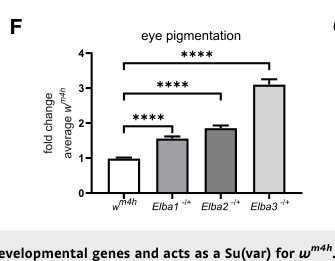

## Question

# Gene Research for Functional Annotation

## ⚠️ CRITICAL: Gene/Protein Identification Context

**BEFORE YOU BEGIN RESEARCH:** You MUST verify you are researching the CORRECT gene/protein. Gene symbols can be ambiguous, especially for less well-characterized genes from non-model organisms.

### Target Gene/Protein Identity (from UniProt):
- **UniProt Accession:** Q9VR19
- **Protein Description:** RecName: Full=Early boundary activity protein 3 {ECO:0000303|PubMed:23240086};
- **Gene Information:** Name=Elba3 {ECO:0000303|PubMed:23240086, ECO:0000312|FlyBase:FBgn0031621}; ORFNames=CG15634 {ECO:0000312|FlyBase:FBgn0031621};
- **Organism (full):** Drosophila melanogaster (Fruit fly).
- **Protein Family:** Not specified in UniProt
- **Key Domains:** Elba3_M. (IPR062751); Elba3_N. (IPR062714); Elba3_M (PF30086); Elba3_N (PF30085)

### MANDATORY VERIFICATION STEPS:

1. **Check if the gene symbol "Elba3" matches the protein description above**
2. **Verify the organism is correct:** Drosophila melanogaster (Fruit fly).
3. **Check if protein family/domains align with what you find in literature**
4. **If you find literature for a DIFFERENT gene with the same or similar symbol, STOP**

### If Gene Symbol is Ambiguous or You Cannot Find Relevant Literature:

**DO NOT PROCEED WITH RESEARCH ON A DIFFERENT GENE.** Instead:
- State clearly: "The gene symbol 'Elba3' is ambiguous or literature is limited for this specific protein"
- Explain what you found (e.g., "Found extensive literature on a different gene with the same symbol in a different organism")
- Describe the protein based ONLY on the UniProt information provided above
- Suggest that the protein function can be inferred from domain/family information

### Research Target:

Please provide a comprehensive research report on the gene **Elba3** (gene ID: Elba3, UniProt: Q9VR19) in DROME.

The research report should be a detailed narrative explaining the function, biological processes, and localization of the gene product. Citations should be given for all claims.

You should prioritize authoritative reviews and primary scientific literature when conducting research. You can supplement
this with annotations you find in gene/protein databases, but these can be outdated or inaccurate.

We are specifically interested in the primary function of the gene - for enzymes, what reaction is catalyzed, and what is the substrate specificity? For transporters, what is the substrate? For structural proteins or adapters, what is the broader structural role? For signaling molecules, what is the role in the pathway.

We are interested in where in or outside the cell the gene product carries out its function.

We are also interested in the signaling or biochemical pathways in which the gene functions. We are less interested in broad pleiotropic effects, except where these elucidate the precise role.

Include evidence where possible. We are interested in both experimental evidence as well as inference from structure, evolution, or bioinformatic analysis. Precise studies should be prioritized over high-throughput, where available.

## Output

Question: You are an expert researcher providing comprehensive, well-cited information.

Provide detailed information focusing on:
1. Key concepts and definitions with current understanding
2. Recent developments and latest research (prioritize 2023-2024 sources)
3. Current applications and real-world implementations
4. Expert opinions and analysis from authoritative sources
5. Relevant statistics and data from recent studies

Format as a comprehensive research report with proper citations. Include URLs and publication dates where available.
Always prioritize recent, authoritative sources and provide specific citations for all major claims.

# Gene Research for Functional Annotation

## ⚠️ CRITICAL: Gene/Protein Identification Context

**BEFORE YOU BEGIN RESEARCH:** You MUST verify you are researching the CORRECT gene/protein. Gene symbols can be ambiguous, especially for less well-characterized genes from non-model organisms.

### Target Gene/Protein Identity (from UniProt):
- **UniProt Accession:** Q9VR19
- **Protein Description:** RecName: Full=Early boundary activity protein 3 {ECO:0000303|PubMed:23240086};
- **Gene Information:** Name=Elba3 {ECO:0000303|PubMed:23240086, ECO:0000312|FlyBase:FBgn0031621}; ORFNames=CG15634 {ECO:0000312|FlyBase:FBgn0031621};
- **Organism (full):** Drosophila melanogaster (Fruit fly).
- **Protein Family:** Not specified in UniProt
- **Key Domains:** Elba3_M. (IPR062751); Elba3_N. (IPR062714); Elba3_M (PF30086); Elba3_N (PF30085)

### MANDATORY VERIFICATION STEPS:

1. **Check if the gene symbol "Elba3" matches the protein description above**
2. **Verify the organism is correct:** Drosophila melanogaster (Fruit fly).
3. **Check if protein family/domains align with what you find in literature**
4. **If you find literature for a DIFFERENT gene with the same or similar symbol, STOP**

### If Gene Symbol is Ambiguous or You Cannot Find Relevant Literature:

**DO NOT PROCEED WITH RESEARCH ON A DIFFERENT GENE.** Instead:
- State clearly: "The gene symbol 'Elba3' is ambiguous or literature is limited for this specific protein"
- Explain what you found (e.g., "Found extensive literature on a different gene with the same symbol in a different organism")
- Describe the protein based ONLY on the UniProt information provided above
- Suggest that the protein function can be inferred from domain/family information

### Research Target:

Please provide a comprehensive research report on the gene **Elba3** (gene ID: Elba3, UniProt: Q9VR19) in DROME.

The research report should be a detailed narrative explaining the function, biological processes, and localization of the gene product. Citations should be given for all claims.

You should prioritize authoritative reviews and primary scientific literature when conducting research. You can supplement
this with annotations you find in gene/protein databases, but these can be outdated or inaccurate.

We are specifically interested in the primary function of the gene - for enzymes, what reaction is catalyzed, and what is the substrate specificity? For transporters, what is the substrate? For structural proteins or adapters, what is the broader structural role? For signaling molecules, what is the role in the pathway.

We are interested in where in or outside the cell the gene product carries out its function.

We are also interested in the signaling or biochemical pathways in which the gene functions. We are less interested in broad pleiotropic effects, except where these elucidate the precise role.

Include evidence where possible. We are interested in both experimental evidence as well as inference from structure, evolution, or bioinformatic analysis. Precise studies should be prioritized over high-throughput, where available.

# Functional annotation of *Drosophila melanogaster* Elba3

**Identity and conclusion.** The target is **Elba3/CG15634**, the *D. melanogaster* protein identified by the supplied UniProt accession **Q9VR19**—not the distinct proteins Elba1/CG12205 or Elba2/CG9883. The best-supported primary function of Elba3 is as a **protein-assembly and chromatin-regulatory subunit**: it brings the two BEN-domain proteins Elba1 and Elba2 together to form the sequence-recognizing ELBA complex, which helps insulate neighboring regulatory activities during early embryogenesis. Elba3 is not an established enzyme, transporter, or autonomous sequence-specific DNA-binding protein. The original biochemical purification identified CG15634 as the third ELBA component; the purified protein was approximately 43 kDa. (aoki2012elbaanovel pages 5-6, aoki2012elbaanovel pages 6-8, aoki2012elbaanovel pages 14-15)

## Molecular mechanism and domain interpretation

The canonical ELBA complex comprises Elba1, Elba2, and Elba3. In biochemical reconstitution, no individual protein or pair produced the native DNA-binding shift, whereas all three together did. Removing the **BEN domain from either Elba1 or Elba2** abolished binding. Conversely, experimentally forcing those two proteins to dimerize with GST largely bypassed the need for Elba3 while preserving recognition specificity. These experiments support a structural model in which **Elba3 associates with the N-terminal regions of Elba1 and Elba2**, positioning their BEN-containing regions to recognize DNA; they do not establish direct DNA contact by Elba3 itself. (aoki2012elbaanovel pages 5-6, aoki2012elbaanovel pages 8-10, aoki2012elbaanovel pages 6-8, aoki2012elbaanovel pages 14-15)

The best-characterized ELBA recognition site is the **asymmetric 8-bp sequence CCAATAAG** in the *Fab-7* chromatin boundary, although binding also depends on surrounding sequence and genome-wide ELBA occupancy is not restricted to that one motif. The Elba3_N/Elba3_M labels **IPR062714/IPR062751 and PF30085/PF30086** supplied with the target describe annotated regions of Elba3; they should **not** be confused with the experimentally characterized BEN DNA-binding domains of Elba1 and Elba2. The original investigators reported no previously recognized conserved domain in Elba3, and the examined experiments do not assign distinct biochemical activities to its annotated N and M regions. (aoki2012elbaanovel pages 4-5, aoki2012elbaanovel pages 2-4, aoki2012elbaanovel pages 14-15, orkenby2023stress‐sensitivedynamicsof pages 11-12)

## Biological process and site of action

Elba3 acts **in embryonic nuclei at chromatin-associated regulatory elements**. The endogenous ELBA DNA-binding activity, including Elba3, was isolated from 0–6-hour embryo **nuclear extracts**; antibody experiments identified all three proteins in that nuclear complex. Chromatin immunoprecipitation and subsequent genome-wide mapping further place Elba3 at genomic sites. These results support a nuclear/chromatin site of action, rather than a cytoplasmic or secreted function, without specifying a particular nuclear subcompartment. (aoki2012elbaanovel pages 6-8, ueberschar2019bensolofactorspartition pages 1-2, ueberschar2019bensolofactorspartition pages 3-4)

ELBA is a **chromatin-boundary or insulator factor**: at appropriate sites it limits an enhancer’s ability to activate a promoter across the boundary and helps maintain distinct expression programs for adjacent transcription units. This is a gene-regulatory and chromatin-organization role, **not an established signaling-cascade or catalytic pathway**. At the *Fab-7* boundary of the bithorax complex, a 236-bp proximal HS1 subelement (*pHS1*) has early-embryonic insulating activity. A four-copy *pHS1* transgene blocked an early *fushi tarazu* enhancer from activating *lacZ*; embryonic **elba3 RNAi weakened this block**, whereas RNAi against the related protein Insv did not. The subelement did not block the later neural enhancer in the same way. Because intact endogenous *Fab-7* has **redundant boundary elements**, this reporter result should not be recast as proof that Elba3 loss alone causes an endogenous *Abd-B* or segment-identity defect. (aoki2012elbaanovel pages 4-5, aoki2012elbaanovel pages 12-14, fedotova2018thebendomain pages 1-2)

The developmental window is important. *elba3* mRNA is largely absent from ovaries and 0–2-hour embryos, **peaks at approximately 2–4 hours**, and subsequently declines; lower-level transcript can reappear in older embryos. ELBA association with *Fab-7* was detected early, at 2–5 hours, but not at 9–12 hours in the staged assay. Thus the strongest evidence concerns **early embryonic boundary function around the blastoderm transition**, not an exclusively embryonic expression rule for every later context. (aoki2012elbaanovel pages 10-12, aoki2012elbaanovel pages 12-14)

## Genome-wide evidence and quantitative findings

The genome-wide analysis substantially extended the original *Fab-7* model. Embryonic ChIP-seq called **6,525 Elba3 peaks**, versus **3,151 Elba1** and **1,468 Elba2** peaks. Approximately **half of Elba3 sites remained occupied** when either Elba1 or Elba2 was absent, whereas Elba1/Elba2 occupancy depended much more strongly on the other ELBA components. Elba3 therefore has chromatin-association behavior beyond that of an obligatorily intact heterotrimer; how it reaches all of those independent sites remains unresolved. Proposed additional recruiters are candidates, not established universal Elba3 partners. (ueberschar2019bensolofactorspartition pages 3-4, ueberschar2019bensolofactorspartition pages 4-5, ueberschar2019bensolofactorspartition pages 9-10)

Functional assays give this occupancy biological meaning. Elba3 artificially tethered to a reporter **repressed transcription** even without the other ELBA proteins, demonstrating repressive capacity under forced recruitment. At endogenous adjacent genes separated by ELBA-bound sequences, ELBA mutants showed **reduced differences in expression**—consistent with weakened partitioning of transcription units—with a particularly strong result for pairs initially differing by more than fourfold. An ELBA-bound enhancer-blocking reporter also regained its ventral *lacZ* stripe in an *elba3* mutant. Tethered repression, reporter insulation, and genome-wide expression are complementary observations, but do not yet specify one molecular mechanism that explains every Elba3-bound site. (ueberschar2019bensolofactorspartition pages 5-6, ueberschar2019bensolofactorspartition pages 9-10)

The table distinguishes direct observations from functional interpretation and unresolved mechanisms. (aoki2012elbaanovel pages 5-6, ueberschar2019bensolofactorspartition pages 3-4, orkenby2023stress‐sensitivedynamicsof pages 8-11)

| Finding | Experimental observation and date/source URL | Inference / limitation |
|---|---|---|
| **Identity and physical membership in ELBA** | Cross-affinity purification from *D. melanogaster* embryo nuclear extracts identified CG15634/Elba3 with **16 unique peptides, 150 spectra, and 32.2% sequence coverage**. EMSA showed that Elba1, Elba2, or Elba3 alone—and every pairwise combination—failed to produce the native shift; combining **all three** restored sequence-specific binding. **Aoki et al., 2012, eLife:** https://doi.org/10.7554/eLife.00171 (aoki2012elbaanovel pages 5-6, aoki2012elbaanovel pages 6-8) | Strong biochemical evidence that Q9VR19/CG15634 is a required ELBA subunit. DNA recognition is principally mediated by the BEN-containing Elba1/Elba2 pair; Elba3 is best interpreted as an assembly/adaptor subunit, not a demonstrated autonomous DNA-binding protein. |
| **Developmentally restricted expression and boundary function** | *elba3* mRNA is largely absent at 0–2 h, peaks during the **2–4 h blastoderm stage**, and then declines. In the **4×pHS1** early-embryo reporter, *elba3* dsRNA disrupted blocking of the *ftz* UPS enhancer; the effect was strongest for *elba1* and *elba3*. **Aoki et al., 2012, eLife:** https://doi.org/10.7554/eLife.00171 (aoki2012elbaanovel pages 10-12, aoki2012elbaanovel pages 12-14) | Directly supports an early-embryonic role in enhancer blocking. The reporter uses a multimerized Fab-7 subelement, not intact endogenous Fab-7; redundancy within the native boundary limits locus-wide causal attribution to Elba3 alone. |
| **Genome-wide chromatin association and partial partner independence** | Embryonic ChIP-seq identified **6,525 Elba3 peaks**, versus **3,151 Elba1** and **1,468 Elba2** peaks. Approximately **half of Elba3 sites persisted** when either Elba1 or Elba2 was absent, whereas Elba1/Elba2 occupancy was much more dependent on the intact complex. **Ueberschär et al., 2019, Nature Communications:** https://doi.org/10.1038/s41467-019-13558-8 (ueberschar2019bensolofactorspartition pages 3-4) | Elba3 has a broader chromatin-association profile than the canonical heterotrimer and may be recruited by additional factors. ChIP occupancy alone does not establish direct DNA contact or identify the proteins responsible for Elba1/2-independent recruitment. |
| **Transcriptional repression and partitioning of transcription units** | Tethering TetR–Elba3 to an actin-enhancer/tet-operator luciferase reporter repressed transcription comparably to other ELBA factors, independently of Elba1, Elba2, and Insv. Genome-wide, ELBA mutants reduced expression differences between adjacent genes separated by ELBA-bound elements; an ELBA-bound reporter element also lost enhancer blocking in an *elba3* mutant. **Ueberschär et al., 2019, Nature Communications:** https://doi.org/10.1038/s41467-019-13558-8 (ueberschar2019bensolofactorspartition pages 5-6, ueberschar2019bensolofactorspartition pages 9-10) | Supports two related functions: local repression when Elba3 is recruited and insulation between neighboring transcription units. Artificial tethering establishes repressive capacity but does not reveal normal recruitment or prove that repression is the sole mechanism of insulation. |
| **Position-effect variegation and proposed heterochromatin link** | In the *w^m4h* position-effect-variegation assay, heterozygous *Elba3* mutants showed significantly altered adult eye pigmentation (**n = 13**) relative to controls (**n = 58; P < 0.0001** in the reported Elba-factor comparisons). The authors noted a putative Elba3 **PxVxL** motif and proposed possible HP1a recruitment. **Örkenby et al., 2023, Molecular Systems Biology:** https://doi.org/10.15252/msb.202211148 (orkenby2023stress‐sensitivedynamicsof pages 8-11, orkenby2023stress‐sensitivedynamicsof pages 11-12) | Genetic evidence supports Elba3 as a modifier of variegation and suggests that transient embryonic ELBA activity can influence later chromatin states. The Elba3–HP1a interaction was **hypothetical and sequence-based**, not demonstrated biochemically. The study’s Dicer-1/Ago1/miRNA causal experiments concerned **Elba1**, not Elba3. |

*Table: Experimental evidence supporting the identity, molecular role, developmental timing, chromatin functions, and phenotypes of Drosophila Elba3. The limitations column distinguishes direct Elba3 findings from complex-level inference and speculative mechanisms.*

## Recent research and applications

A **2023** embryonic-stress study provides newer, distinct genetic evidence. In a *white-mottled-4h* (**wᵐ⁴ʰ**) position-effect-variegation assay, flies heterozygous for an *Elba3* frameshift allele had **increased adult eye pigmentation**, indicating reduced silencing of the *white* reporter; the reported comparison included **13 Elba3-heterozygous males and 58 controls**. This makes Elba3 a modifier of this experimental chromatin-silencing phenotype and suggests that altered ELBA dosage can have effects detectable long after embryogenesis. It does **not** establish direct Elba3-dependent recruitment of heterochromatin machinery. The authors noted an Elba3 **PxVxL motif** and proposed possible interaction with HP1a, but explicitly presented that mechanism as speculative, without a demonstrated Elba3–HP1a binding experiment. Their Dicer-1, Ago1, and heat-shock mechanistic tests centered on **Elba1**, and should not be attributed specifically to Elba3. (orkenby2023stress‐sensitivedynamicsof pages 8-11, orkenby2023stress‐sensitivedynamicsof pages 11-12, orkenby2023stress‐sensitivedynamicsof media f7bc960e)

These findings make Elba3 useful **as an experimental handle on early enhancer blocking, separation of neighboring transcription units, and position-effect variegation** in flies. The cited studies establish research assays and genetic phenotypes, not a clinical application or an Elba3-targeted intervention. Within the literature examined, the most direct molecular dissection remains the **2012** complex-reconstitution study and the broad functional mapping remains the **2019** genome-wide study; the relevant **2023** work adds a chromatin-silencing phenotype rather than replacing those mechanistic results. No comparably direct **2024 Elba3-specific mechanistic result** was verified here. (aoki2012elbaanovel pages 8-10, ueberschar2019bensolofactorspartition pages 3-4, orkenby2023stress‐sensitivedynamicsof pages 8-11)

**Principal sources:** Aoki *et al.*, *eLife*, **December 2012**, https://doi.org/10.7554/eLife.00171; Ueberschär *et al.*, *Nature Communications*, **December 2019**, https://doi.org/10.1038/s41467-019-13558-8; Örkenby *et al.*, *Molecular Systems Biology*, **published online 20 March 2023**, https://doi.org/10.15252/msb.202211148. The first two underpin the primary functional annotation; the third provides the recent genetic and environmental-stress context. (aoki2012elbaanovel pages 5-6, ueberschar2019bensolofactorspartition pages 3-4, orkenby2023stress‐sensitivedynamicsof pages 1-2)

References

1. (aoki2012elbaanovel pages 5-6): Tsutomu Aoki, Ali Sarkeshik, John Yates, and Paul Schedl. Elba, a novel developmentally regulated chromatin boundary factor is a hetero-tripartite dna binding complex. eLife, Dec 2012. URL: https://doi.org/10.7554/elife.00171, doi:10.7554/elife.00171. This article has 59 citations and is from a domain leading peer-reviewed journal.

2. (aoki2012elbaanovel pages 6-8): Tsutomu Aoki, Ali Sarkeshik, John Yates, and Paul Schedl. Elba, a novel developmentally regulated chromatin boundary factor is a hetero-tripartite dna binding complex. eLife, Dec 2012. URL: https://doi.org/10.7554/elife.00171, doi:10.7554/elife.00171. This article has 59 citations and is from a domain leading peer-reviewed journal.

3. (aoki2012elbaanovel pages 14-15): Tsutomu Aoki, Ali Sarkeshik, John Yates, and Paul Schedl. Elba, a novel developmentally regulated chromatin boundary factor is a hetero-tripartite dna binding complex. eLife, Dec 2012. URL: https://doi.org/10.7554/elife.00171, doi:10.7554/elife.00171. This article has 59 citations and is from a domain leading peer-reviewed journal.

4. (aoki2012elbaanovel pages 8-10): Tsutomu Aoki, Ali Sarkeshik, John Yates, and Paul Schedl. Elba, a novel developmentally regulated chromatin boundary factor is a hetero-tripartite dna binding complex. eLife, Dec 2012. URL: https://doi.org/10.7554/elife.00171, doi:10.7554/elife.00171. This article has 59 citations and is from a domain leading peer-reviewed journal.

5. (aoki2012elbaanovel pages 4-5): Tsutomu Aoki, Ali Sarkeshik, John Yates, and Paul Schedl. Elba, a novel developmentally regulated chromatin boundary factor is a hetero-tripartite dna binding complex. eLife, Dec 2012. URL: https://doi.org/10.7554/elife.00171, doi:10.7554/elife.00171. This article has 59 citations and is from a domain leading peer-reviewed journal.

6. (aoki2012elbaanovel pages 2-4): Tsutomu Aoki, Ali Sarkeshik, John Yates, and Paul Schedl. Elba, a novel developmentally regulated chromatin boundary factor is a hetero-tripartite dna binding complex. eLife, Dec 2012. URL: https://doi.org/10.7554/elife.00171, doi:10.7554/elife.00171. This article has 59 citations and is from a domain leading peer-reviewed journal.

7. (orkenby2023stress‐sensitivedynamicsof pages 11-12): Lovisa Örkenby, Signe Skog, Helen Ekman, Alessandro Gozzo, Unn Kugelberg, Rashmi Ramesh, Srivathsa Magadi, Gianluca Zambanini, Anna Nordin, Claudio Cantú, Daniel Nätt, and Anita Öst. Stress‐sensitive dynamics of mirnas and elba1 in drosophila embryogenesis. Molecular Systems Biology, Mar 2023. URL: https://doi.org/10.15252/msb.202211148, doi:10.15252/msb.202211148. This article has 7 citations and is from a highest quality peer-reviewed journal.

8. (ueberschar2019bensolofactorspartition pages 1-2): Malin Ueberschär, Huazhen Wang, Chun Zhang, Shu Kondo, Tsutomu Aoki, Paul Schedl, Eric C. Lai, Jiayu Wen, and Qi Dai. Ben-solo factors partition active chromatin to ensure proper gene activation in drosophila. Nature Communications, Dec 2019. URL: https://doi.org/10.1038/s41467-019-13558-8, doi:10.1038/s41467-019-13558-8. This article has 21 citations and is from a highest quality peer-reviewed journal.

9. (ueberschar2019bensolofactorspartition pages 3-4): Malin Ueberschär, Huazhen Wang, Chun Zhang, Shu Kondo, Tsutomu Aoki, Paul Schedl, Eric C. Lai, Jiayu Wen, and Qi Dai. Ben-solo factors partition active chromatin to ensure proper gene activation in drosophila. Nature Communications, Dec 2019. URL: https://doi.org/10.1038/s41467-019-13558-8, doi:10.1038/s41467-019-13558-8. This article has 21 citations and is from a highest quality peer-reviewed journal.

10. (aoki2012elbaanovel pages 12-14): Tsutomu Aoki, Ali Sarkeshik, John Yates, and Paul Schedl. Elba, a novel developmentally regulated chromatin boundary factor is a hetero-tripartite dna binding complex. eLife, Dec 2012. URL: https://doi.org/10.7554/elife.00171, doi:10.7554/elife.00171. This article has 59 citations and is from a domain leading peer-reviewed journal.

11. (fedotova2018thebendomain pages 1-2): Anna Fedotova, Tsutomu Aoki, Mikaël Rossier, Rakesh Kumar Mishra, Chaevia Clendinen, Olga Kyrchanova, Daniel Wolle, Artem Bonchuk, Robert K Maeda, Annick Mutero, Fabienne Cleard, Vladic Mogila, François Karch, Pavel Georgiev, and Paul Schedl. The ben domain protein insensitive binds to the fab-7 chromatin boundary to establish proper segmental identity in drosophila. Genetics, 210:573-585, Jun 2018. URL: https://doi.org/10.1534/genetics.118.301259, doi:10.1534/genetics.118.301259. This article has 15 citations and is from a domain leading peer-reviewed journal.

12. (aoki2012elbaanovel pages 10-12): Tsutomu Aoki, Ali Sarkeshik, John Yates, and Paul Schedl. Elba, a novel developmentally regulated chromatin boundary factor is a hetero-tripartite dna binding complex. eLife, Dec 2012. URL: https://doi.org/10.7554/elife.00171, doi:10.7554/elife.00171. This article has 59 citations and is from a domain leading peer-reviewed journal.

13. (ueberschar2019bensolofactorspartition pages 4-5): Malin Ueberschär, Huazhen Wang, Chun Zhang, Shu Kondo, Tsutomu Aoki, Paul Schedl, Eric C. Lai, Jiayu Wen, and Qi Dai. Ben-solo factors partition active chromatin to ensure proper gene activation in drosophila. Nature Communications, Dec 2019. URL: https://doi.org/10.1038/s41467-019-13558-8, doi:10.1038/s41467-019-13558-8. This article has 21 citations and is from a highest quality peer-reviewed journal.

14. (ueberschar2019bensolofactorspartition pages 9-10): Malin Ueberschär, Huazhen Wang, Chun Zhang, Shu Kondo, Tsutomu Aoki, Paul Schedl, Eric C. Lai, Jiayu Wen, and Qi Dai. Ben-solo factors partition active chromatin to ensure proper gene activation in drosophila. Nature Communications, Dec 2019. URL: https://doi.org/10.1038/s41467-019-13558-8, doi:10.1038/s41467-019-13558-8. This article has 21 citations and is from a highest quality peer-reviewed journal.

15. (ueberschar2019bensolofactorspartition pages 5-6): Malin Ueberschär, Huazhen Wang, Chun Zhang, Shu Kondo, Tsutomu Aoki, Paul Schedl, Eric C. Lai, Jiayu Wen, and Qi Dai. Ben-solo factors partition active chromatin to ensure proper gene activation in drosophila. Nature Communications, Dec 2019. URL: https://doi.org/10.1038/s41467-019-13558-8, doi:10.1038/s41467-019-13558-8. This article has 21 citations and is from a highest quality peer-reviewed journal.

16. (orkenby2023stress‐sensitivedynamicsof pages 8-11): Lovisa Örkenby, Signe Skog, Helen Ekman, Alessandro Gozzo, Unn Kugelberg, Rashmi Ramesh, Srivathsa Magadi, Gianluca Zambanini, Anna Nordin, Claudio Cantú, Daniel Nätt, and Anita Öst. Stress‐sensitive dynamics of mirnas and elba1 in drosophila embryogenesis. Molecular Systems Biology, Mar 2023. URL: https://doi.org/10.15252/msb.202211148, doi:10.15252/msb.202211148. This article has 7 citations and is from a highest quality peer-reviewed journal.

17. (orkenby2023stress‐sensitivedynamicsof media f7bc960e): Lovisa Örkenby, Signe Skog, Helen Ekman, Alessandro Gozzo, Unn Kugelberg, Rashmi Ramesh, Srivathsa Magadi, Gianluca Zambanini, Anna Nordin, Claudio Cantú, Daniel Nätt, and Anita Öst. Stress‐sensitive dynamics of mirnas and elba1 in drosophila embryogenesis. Molecular Systems Biology, Mar 2023. URL: https://doi.org/10.15252/msb.202211148, doi:10.15252/msb.202211148. This article has 7 citations and is from a highest quality peer-reviewed journal.

18. (orkenby2023stress‐sensitivedynamicsof pages 1-2): Lovisa Örkenby, Signe Skog, Helen Ekman, Alessandro Gozzo, Unn Kugelberg, Rashmi Ramesh, Srivathsa Magadi, Gianluca Zambanini, Anna Nordin, Claudio Cantú, Daniel Nätt, and Anita Öst. Stress‐sensitive dynamics of mirnas and elba1 in drosophila embryogenesis. Molecular Systems Biology, Mar 2023. URL: https://doi.org/10.15252/msb.202211148, doi:10.15252/msb.202211148. This article has 7 citations and is from a highest quality peer-reviewed journal.

## Artifacts

- [Edison artifact artifact-00](Elba3-deep-research-falcon_artifacts/artifact-00.md)

## Citations

1. ueberschar2019bensolofactorspartition pages 3-4
2. aoki2012elbaanovel pages 5-6
3. aoki2012elbaanovel pages 6-8
4. aoki2012elbaanovel pages 14-15
5. aoki2012elbaanovel pages 8-10
6. aoki2012elbaanovel pages 4-5
7. aoki2012elbaanovel pages 2-4
8. ueberschar2019bensolofactorspartition pages 1-2
9. aoki2012elbaanovel pages 12-14
10. fedotova2018thebendomain pages 1-2
11. aoki2012elbaanovel pages 10-12
12. ueberschar2019bensolofactorspartition pages 4-5
13. ueberschar2019bensolofactorspartition pages 9-10
14. ueberschar2019bensolofactorspartition pages 5-6
15. https://doi.org/10.7554/eLife.00171
16. https://doi.org/10.1038/s41467-019-13558-8
17. https://doi.org/10.15252/msb.202211148
18. https://doi.org/10.7554/eLife.00171;
19. https://doi.org/10.1038/s41467-019-13558-8;
20. https://doi.org/10.15252/msb.202211148.
21. https://doi.org/10.7554/elife.00171,
22. https://doi.org/10.15252/msb.202211148,
23. https://doi.org/10.1038/s41467-019-13558-8,
24. https://doi.org/10.1534/genetics.118.301259,