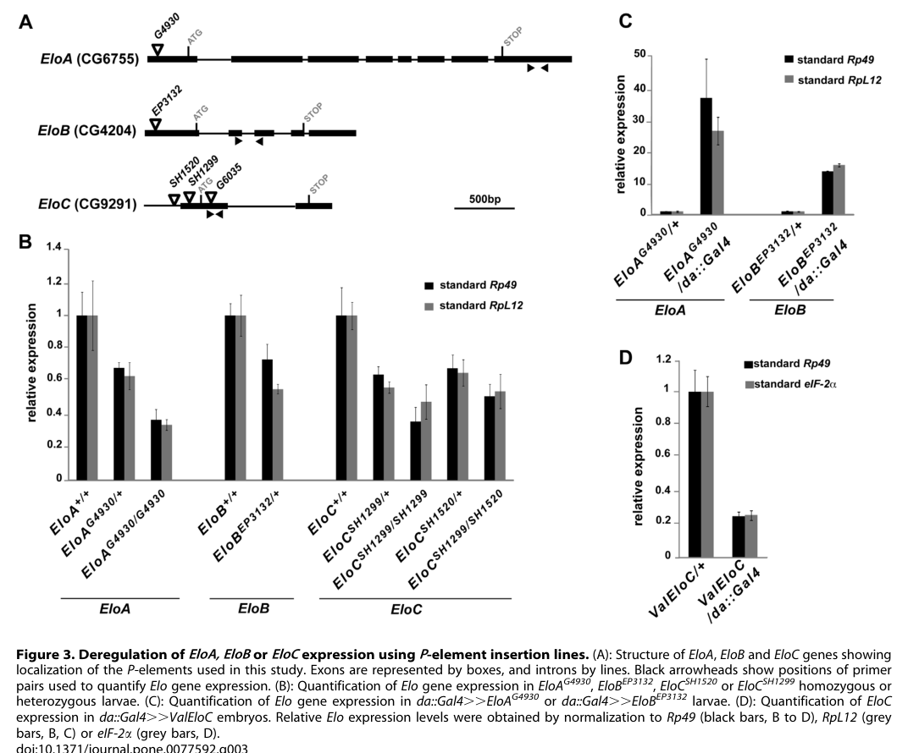

## Question

# Gene Research for Functional Annotation

## ⚠️ CRITICAL: Gene/Protein Identification Context

**BEFORE YOU BEGIN RESEARCH:** You MUST verify you are researching the CORRECT gene/protein. Gene symbols can be ambiguous, especially for less well-characterized genes from non-model organisms.

### Target Gene/Protein Identity (from UniProt):
- **UniProt Accession:** Q7KSB2
- **Protein Description:** RecName: Full=Elongin-B {ECO:0000256|ARBA:ARBA00074516}; AltName: Full=Elongin 18 kDa subunit {ECO:0000256|ARBA:ARBA00081013}; AltName: Full=RNA polymerase II transcription factor SIII subunit B {ECO:0000256|ARBA:ARBA00076690}; AltName: Full=SIII p18 {ECO:0000256|ARBA:ARBA00083653}; AltName: Full=Transcription elongation factor B polypeptide 2 {ECO:0000256|ARBA:ARBA00080438};
- **Gene Information:** Name=EloB {ECO:0000313|EMBL:AAG22163.1}; Synonyms=Dmel\CG4204 {ECO:0000313|EMBL:AAG22163.1}, Elo-B {ECO:0000313|EMBL:AAG22163.1}, Elongin-B {ECO:0000313|EMBL:AAG22163.1}; ORFNames=CG4204 {ECO:0000313|EMBL:AAG22163.1}, Dmel_CG4204 {ECO:0000313|EMBL:AAG22163.1};
- **Organism (full):** Drosophila melanogaster (Fruit fly).
- **Protein Family:** Belongs to the Elongin B family.
- **Key Domains:** ELOB. (IPR039049); Ubiquitin-like_dom. (IPR000626); Ubiquitin-like_domsf. (IPR029071); ubiquitin (PF00240)

### MANDATORY VERIFICATION STEPS:

1. **Check if the gene symbol "EloB" matches the protein description above**
2. **Verify the organism is correct:** Drosophila melanogaster (Fruit fly).
3. **Check if protein family/domains align with what you find in literature**
4. **If you find literature for a DIFFERENT gene with the same or similar symbol, STOP**

### If Gene Symbol is Ambiguous or You Cannot Find Relevant Literature:

**DO NOT PROCEED WITH RESEARCH ON A DIFFERENT GENE.** Instead:
- State clearly: "The gene symbol 'EloB' is ambiguous or literature is limited for this specific protein"
- Explain what you found (e.g., "Found extensive literature on a different gene with the same symbol in a different organism")
- Describe the protein based ONLY on the UniProt information provided above
- Suggest that the protein function can be inferred from domain/family information

### Research Target:

Please provide a comprehensive research report on the gene **EloB** (gene ID: EloB, UniProt: Q7KSB2) in DROME.

The research report should be a detailed narrative explaining the function, biological processes, and localization of the gene product. Citations should be given for all claims.

You should prioritize authoritative reviews and primary scientific literature when conducting research. You can supplement
this with annotations you find in gene/protein databases, but these can be outdated or inaccurate.

We are specifically interested in the primary function of the gene - for enzymes, what reaction is catalyzed, and what is the substrate specificity? For transporters, what is the substrate? For structural proteins or adapters, what is the broader structural role? For signaling molecules, what is the role in the pathway.

We are interested in where in or outside the cell the gene product carries out its function.

We are also interested in the signaling or biochemical pathways in which the gene functions. We are less interested in broad pleiotropic effects, except where these elucidate the precise role.

Include evidence where possible. We are interested in both experimental evidence as well as inference from structure, evolution, or bioinformatic analysis. Precise studies should be prioritized over high-throughput, where available.

## Output

Question: You are an expert researcher providing comprehensive, well-cited information.

Provide detailed information focusing on:
1. Key concepts and definitions with current understanding
2. Recent developments and latest research (prioritize 2023-2024 sources)
3. Current applications and real-world implementations
4. Expert opinions and analysis from authoritative sources
5. Relevant statistics and data from recent studies

Format as a comprehensive research report with proper citations. Include URLs and publication dates where available.
Always prioritize recent, authoritative sources and provide specific citations for all major claims.

# Gene Research for Functional Annotation

## ⚠️ CRITICAL: Gene/Protein Identification Context

**BEFORE YOU BEGIN RESEARCH:** You MUST verify you are researching the CORRECT gene/protein. Gene symbols can be ambiguous, especially for less well-characterized genes from non-model organisms.

### Target Gene/Protein Identity (from UniProt):
- **UniProt Accession:** Q7KSB2
- **Protein Description:** RecName: Full=Elongin-B {ECO:0000256|ARBA:ARBA00074516}; AltName: Full=Elongin 18 kDa subunit {ECO:0000256|ARBA:ARBA00081013}; AltName: Full=RNA polymerase II transcription factor SIII subunit B {ECO:0000256|ARBA:ARBA00076690}; AltName: Full=SIII p18 {ECO:0000256|ARBA:ARBA00083653}; AltName: Full=Transcription elongation factor B polypeptide 2 {ECO:0000256|ARBA:ARBA00080438};
- **Gene Information:** Name=EloB {ECO:0000313|EMBL:AAG22163.1}; Synonyms=Dmel\CG4204 {ECO:0000313|EMBL:AAG22163.1}, Elo-B {ECO:0000313|EMBL:AAG22163.1}, Elongin-B {ECO:0000313|EMBL:AAG22163.1}; ORFNames=CG4204 {ECO:0000313|EMBL:AAG22163.1}, Dmel_CG4204 {ECO:0000313|EMBL:AAG22163.1};
- **Organism (full):** Drosophila melanogaster (Fruit fly).
- **Protein Family:** Belongs to the Elongin B family.
- **Key Domains:** ELOB. (IPR039049); Ubiquitin-like_dom. (IPR000626); Ubiquitin-like_domsf. (IPR029071); ubiquitin (PF00240)

### MANDATORY VERIFICATION STEPS:

1. **Check if the gene symbol "EloB" matches the protein description above**
2. **Verify the organism is correct:** Drosophila melanogaster (Fruit fly).
3. **Check if protein family/domains align with what you find in literature**
4. **If you find literature for a DIFFERENT gene with the same or similar symbol, STOP**

### If Gene Symbol is Ambiguous or You Cannot Find Relevant Literature:

**DO NOT PROCEED WITH RESEARCH ON A DIFFERENT GENE.** Instead:
- State clearly: "The gene symbol 'EloB' is ambiguous or literature is limited for this specific protein"
- Explain what you found (e.g., "Found extensive literature on a different gene with the same symbol in a different organism")
- Describe the protein based ONLY on the UniProt information provided above
- Suggest that the protein function can be inferred from domain/family information

### Research Target:

Please provide a comprehensive research report on the gene **EloB** (gene ID: EloB, UniProt: Q7KSB2) in DROME.

The research report should be a detailed narrative explaining the function, biological processes, and localization of the gene product. Citations should be given for all claims.

You should prioritize authoritative reviews and primary scientific literature when conducting research. You can supplement
this with annotations you find in gene/protein databases, but these can be outdated or inaccurate.

We are specifically interested in the primary function of the gene - for enzymes, what reaction is catalyzed, and what is the substrate specificity? For transporters, what is the substrate? For structural proteins or adapters, what is the broader structural role? For signaling molecules, what is the role in the pathway.

We are interested in where in or outside the cell the gene product carries out its function.

We are also interested in the signaling or biochemical pathways in which the gene functions. We are less interested in broad pleiotropic effects, except where these elucidate the precise role.

Include evidence where possible. We are interested in both experimental evidence as well as inference from structure, evolution, or bioinformatic analysis. Precise studies should be prioritized over high-throughput, where available.

# Functional annotation report: *Drosophila melanogaster* EloB (CG4204; UniProt Q7KSB2)

## Identity and principal function

**The target is correctly identified.** The supplied UniProt record identifies Q7KSB2 as fruit-fly Elongin B, and a primary *Drosophila* study explicitly identifies **EloB as CG4204**, distinct from EloA/CG6755 and EloC/CG9291. Its annotated Elongin-B-family and ubiquitin-like domains agree with the established architecture of Elongin B; a ubiquitin-like fold does **not** mean that EloB itself is ubiquitin or a ubiquitin-conjugating enzyme. Human ELOB studies below concern an ortholog, not this fly protein. [UniProt Q7KSB2](https://www.uniprot.org/uniprotkb/Q7KSB2/entry); [Rougeot *et al.*, October 2013](https://doi.org/10.1371/journal.pone.0077592). (rougeot2013theelongincomplex pages 2-3, chen2023structureofthe pages 1-2, okumura2012theroleof pages 1-2)

**The best-supported primary function of fly EloB is as a noncatalytic protein-complex assembly and stabilizing subunit.** It associates strongly with EloC to support the Elongin A–B–C transcription complex. EloA supplies the Pol II elongation-stimulatory machinery; EloB helps assemble and stabilize the complex rather than catalyzing RNA synthesis. Elongin B/C can also serve as an adaptor in cullin–RING E3 ubiquitin ligases, in which a separate receptor selects the protein substrate and the RING/E2 machinery effects ubiquitin transfer. No intrinsic reaction, direct substrate specificity, or ubiquitin-transfer activity has been demonstrated for fly EloB itself. [Rougeot *et al.*, 2013](https://doi.org/10.1371/journal.pone.0077592); [Okumura *et al.*, January 2012, review](https://doi.org/10.3389/fonc.2012.00010). (rougeot2013theelongincomplex pages 2-3, rougeot2013theelongincomplex pages 3-4, okumura2012theroleof pages 1-2)

The principal fly experiments and their interpretive limits are summarized here. (rougeot2013theelongincomplex pages 3-4, rougeot2013theelongincomplex pages 4-6, rougeot2013theelongincomplex pages 6-9, rougeot2013theelongincomplex pages 9-10)

| Mechanistic claim | Evidence and precise quantitative data | Interpretation / limits | DOI reference |
|---|---|---|---|
| **EloB forms a nuclear Elongin complex with EloC in fly cells** | Tagged EloB/CG4204 and EloC strongly co-immunoprecipitated from *Drosophila* S2 cells without cross-linking; tagged Elongin subunits were detected mainly in nuclear extracts. (rougeot2013theelongincomplex pages 3-4) | Direct fly evidence for nuclear enrichment and EloB–EloC association. It does **not** demonstrate EloB enzymatic or ubiquitin-transfer activity. | [10.1371/journal.pone.0077592](https://doi.org/10.1371/journal.pone.0077592) |
| **EloB is essential for development** | The hypomorphic *EloB*^EP3132^ insertion reduced *EloB* expression; homozygotes died before the third larval instar. With deficiency Df(3R)BSC518, only **1 adult escaper among 272 balanced progeny** was recovered. (rougeot2013theelongincomplex pages 3-4, rougeot2013theelongincomplex pages 4-6) | Strong fly genetic evidence for an essential role, although the insertion is not a clean molecular null and residual or background effects cannot be excluded. | [10.1371/journal.pone.0077592](https://doi.org/10.1371/journal.pone.0077592) |
| **Reduced EloB dosage impairs wing-vein identity** | **28.8% of 170** heterozygous +/*EloB*^EP3132^ females had a truncated longitudinal L5 vein; the rare deficiency escaper showed the same phenotype. (rougeot2013theelongincomplex pages 6-9, rougeot2013theelongincomplex media 687a2fe3, rougeot2013theelongincomplex media 450cab30) | Direct phenotypic evidence that EloB promotes normal vein development, but it does not identify the biochemical target or prove a transcriptional rather than ubiquitin-ligase mechanism. | [10.1371/journal.pone.0077592](https://doi.org/10.1371/journal.pone.0077592) |
| **EloB genetically antagonizes Corto during vein/intervein specification; direct rho occupancy remains unproven for EloB** | Combining *EloB*^EP3132^ with *corto*^07128^ reduced ectopic veins to **26.6% (n=128)** versus **93.8–97.4%** in *corto* controls; with *corto*^L1^, the frequency fell to **0.8% (n=129)** versus **40.2–49%** in controls (z-test, *p*<0.001). ChIP detected **EloC**, not EloB, at *rhomboid (rho)* and used two independent experiments. (rougeot2013theelongincomplex pages 9-10, rougeot2013theelongincomplex pages 10-12) | Strong fly genetic interaction supports a shared pathway, but assigning *rho* as a direct EloB target is an **Elongin-complex inference**: no EloB ChIP or EloB-specific occupancy experiment was reported. | [10.1371/journal.pone.0077592](https://doi.org/10.1371/journal.pone.0077592) |
| **Conserved structural role in Pol II elongation — non-fly ortholog inference** | A 2023 human cryo-EM study showed ELOA contacting Pol II and using a latch near the bridge and funnel helices to stimulate elongation; ELOB–ELOC forms the supporting heterodimer anchored by ELOA, with no identified direct ELOB–Pol II interface. (chen2023structureofthe pages 1-2, chen2023structureofthe pages 4-5, chen2023structureofthe pages 7-9) | High-resolution mechanistic support for a conserved assembly and stabilization role of ELOB, but this is **human ortholog evidence**, not a direct demonstration for fly Q7KSB2. It does not establish intrinsic EloB catalytic activity. | [10.1038/s41594-023-01138-w](https://doi.org/10.1038/s41594-023-01138-w) |

*Table: Direct Drosophila EloB/CG4204 findings are separated from complex-level interpretation and human ortholog inference. The table highlights quantitative genetic evidence and key mechanistic limitations.*

## Biochemical role, processes, and pathways

**Transcription and wing-cell identity—direct fly evidence with a complex-level mechanistic interpretation.** In *Drosophila* S2 cells, tagged EloB strongly co-immunoprecipitates with EloC without cross-linking; EloA also associates strongly with EloC, whereas EloA–EloB association is much weaker. Corto, a chromatin regulator, associates strongly with EloC; its association with EloB is weak and detected only after cross-linking. These observations establish physical participation of EloB in the Elongin interaction network, but do not establish direct EloB–Corto binding. [Rougeot *et al.*, 2013](https://doi.org/10.1371/journal.pone.0077592). (rougeot2013theelongincomplex pages 3-4, rougeot2013theelongincomplex pages 9-10)

Reduced EloB dosage affects the vein-versus-intervein decision in developing wings. The *EloB*^EP3132^ insertion lowers EloB expression; homozygous larvae die before the third instar, and an *EloB*^EP3132^/deficiency combination produced **one adult escaper among 272 balanced progeny**. Among **170** heterozygous females, **28.8%** had a truncated longitudinal L5 wing vein. The insertion and wing phenotype are shown in the study’s Figures 3 and 5, respectively. These experiments support an essential developmental role and a contribution to normal vein formation, but the insertion is hypomorphic rather than a clean, independently rescued null. [Rougeot *et al.*, 2013, Figures 3 and 5](https://doi.org/10.1371/journal.pone.0077592). (rougeot2013theelongincomplex pages 3-4, rougeot2013theelongincomplex pages 4-6, rougeot2013theelongincomplex pages 6-9, rougeot2013theelongincomplex media 687a2fe3, rougeot2013theelongincomplex media 450cab30)

There is a more specific genetic link to Corto: combining *EloB*^EP3132^ with *corto*^07128^ reduced ectopic-vein penetrance to **26.6% of 128 females**, versus **93.8–97.4%** in the corresponding *corto* controls. With *corto*^L1^, penetrance was **0.8% of 129 females**, versus **40.2–49%** in controls; the authors report *p* < 0.001 for these comparisons. The vein-promoting gene *rhomboid* (*rho*) is a plausible downstream locus because tagged **EloC**, not EloB, and a Corto chromodomain were detected there by chromatin immunoprecipitation in wing discs. The proposed model—that Corto restrains *rho* expression in intervein cells whereas Elongin favors transcription in vein cells—remains a model for **EloB specifically**: neither EloB occupancy at *rho* nor an EloB-dependent change in Pol II elongation at that gene was directly measured. [Rougeot *et al.*, 2013, Tables 1 and 3 and Figure 7](https://doi.org/10.1371/journal.pone.0077592). (rougeot2013theelongincomplex pages 6-9, rougeot2013theelongincomplex pages 9-10, rougeot2013theelongincomplex pages 10-12)

**Ubiquitin-ligase pathways—plausible fly role, but substrate attribution requires caution.** The conserved Elongin B/C module bridges BC-box-containing substrate receptors to cullin scaffolds in many CRL2 or CRL5 ligases; receptor identity determines what is recognized, rather than EloB conferring a fixed substrate specificity. In flies, the SOCS-box receptor Gustavus binds the germ-cell regulator Vasa and has been structurally associated with EloB/C; Gustavus and Cul5 affect Vasa deployment and primordial germ-cell formation. This makes a Gustavus–EloB/C–Cul5 assembly a biologically relevant **candidate** context, but the reported Vasa experiments do not demonstrate a requirement for perturbing *EloB/CG4204* or show that EloB directly binds or ubiquitinates Vasa. Importantly, Fsn, the other Vasa-associated receptor in that study, is an **F-box** protein, not evidence for an EloB-containing Fsn ligase. [Kugler *et al.*, April 2010](https://doi.org/10.1128/MCB.01100-09); [Okumura *et al.*, 2012](https://doi.org/10.3389/fonc.2012.00010). (kugler2010regulationofdrosophila pages 1-2, kugler2010regulationofdrosophila pages 9-10, okumura2012theroleof pages 1-2)

## Cellular localization

The most direct localization evidence for fly EloB is **predominant detection of tagged EloB in nuclear extracts of S2 cells** alongside the other Elongin subunits. This is consistent with a function in nuclear transcription complexes, but it is not an EloB-specific immunofluorescence map across tissues. In particular, the experiments showing occupancy of transcription-associated polytene-chromosome sites, overlap with H3K36me3, and binding at *rho* examined **EloC**; assigning those precise chromatin locations to EloB would exceed the evidence. Its possible locations in individual cytoplasmic cullin-ligase assemblies have not been established by the cited EloB-specific experiments. [Rougeot *et al.*, 2013](https://doi.org/10.1371/journal.pone.0077592). (rougeot2013theelongincomplex pages 3-4, rougeot2013theelongincomplex pages 10-12)

## What 2023–2024 research adds—and does not add

A **November 2023 human** cryo-electron-microscopy study resolved transcribing Pol II with the ELOA–ELOB–ELOC complex. ELOA anchors the ELOB–ELOC heterodimer and contacts Pol II; an ELOA “latch” near the polymerase bridge and funnel helices is required for elongation stimulation without being required for polymerase binding. No corresponding direct ELOB–Pol II catalytic interface was identified. This supplies a strong *structural rationale* for the conserved fly EloB assembly role, **not a direct structural experiment on Q7KSB2**. Moreover, a **2021 mouse** in-vivo study found that loss of EloA had limited effects on overall Pol II elongation rate despite pronounced in-vitro stimulation; a universal EloB-dependent increase in elongation rate should therefore not be assumed in flies. [Chen *et al.*, November 2023](https://doi.org/10.1038/s41594-023-01138-w); [Ardehali *et al.*, January 2021](https://doi.org/10.1074/jbc.ra120.015877). (chen2023structureofthe pages 1-2, chen2023structureofthe pages 5-6, chen2023structureofthe pages 4-5, ardehali2021elonginaassociates pages 1-2)

A **February 2024 human-cell** study identified an Elongin-containing CRL5–SPSB3 pathway that ubiquitinates nuclear cGAS. It demonstrates how an Elongin-associated ligase can act in a defined compartment with receptor-determined substrate recognition, but **does not identify cGAS as a fly EloB substrate**. Similarly, recent *Drosophila* Dora/ZSWIM8 work on target-directed microRNA degradation detected EloC with Dora but did **not** establish EloB incorporation or EloB dependence; that pathway should not currently be assigned as a demonstrated CG4204 function. [Xu *et al.*, February 2024](https://doi.org/10.1038/s41586-024-07112-w); [Akulenko *et al.*, August 2023, preprint](https://doi.org/10.1101/2023.08.30.555489); [Buhagiar and Kleaveland, January 2024, review](https://doi.org/10.1093/nar/gkae003). (xu2024thecrl5–spsb3ubiquitin pages 1-2, akulenko2023evidenceoftargetmediated pages 9-12, buhagiar2024tokilla pages 3-4)

**Annotation conclusion.** For Q7KSB2, assign high confidence to *Drosophila* Elongin-B identity, EloC-containing complex membership, predominant nuclear detection in S2 cells, and an essential developmental role with measurable wing-vein genetic effects. Assign a **complex-supported, rather than EloB-specifically proven**, role in regulating Pol II-associated gene expression and a conserved adaptor role in cullin-based ubiquitination. The identity of a direct fly EloB-dependent protein substrate, its exact contribution at *rho*, and its localization within individual fly ubiquitin-ligase assemblies remain unresolved. (rougeot2013theelongincomplex pages 2-3, rougeot2013theelongincomplex pages 3-4, rougeot2013theelongincomplex pages 4-6, rougeot2013theelongincomplex pages 9-10, kugler2010regulationofdrosophila pages 1-2)

References

1. (rougeot2013theelongincomplex pages 2-3): Julien Rougeot, Myrtille Renard, Neel B. Randsholt, Frédérique Peronnet, and Emmanuèle Mouchel-Vielh. The elongin complex antagonizes the chromatin factor corto for vein versus intervein cell identity in drosophila wings. PLoS ONE, 8:e77592, Oct 2013. URL: https://doi.org/10.1371/journal.pone.0077592, doi:10.1371/journal.pone.0077592. This article has 10 citations and is from a peer-reviewed journal.

2. (chen2023structureofthe pages 1-2): Ying Chen, Goran Kokic, Christian Dienemann, Olexandr Dybkov, Henning Urlaub, and Patrick Cramer. Structure of the transcribing rna polymerase ii–elongin complex. Nature Structural & Molecular Biology, 30:1925-1935, Nov 2023. URL: https://doi.org/10.1038/s41594-023-01138-w, doi:10.1038/s41594-023-01138-w. This article has 38 citations and is from a highest quality peer-reviewed journal.

3. (okumura2012theroleof pages 1-2): Fumihiko Okumura, Mariko Matsuzaki, Kunio Nakatsukasa, and Takumi Kamura. The role of elongin bc-containing ubiquitin ligases. Frontiers in Oncology, Jan 2012. URL: https://doi.org/10.3389/fonc.2012.00010, doi:10.3389/fonc.2012.00010. This article has 119 citations.

4. (rougeot2013theelongincomplex pages 3-4): Julien Rougeot, Myrtille Renard, Neel B. Randsholt, Frédérique Peronnet, and Emmanuèle Mouchel-Vielh. The elongin complex antagonizes the chromatin factor corto for vein versus intervein cell identity in drosophila wings. PLoS ONE, 8:e77592, Oct 2013. URL: https://doi.org/10.1371/journal.pone.0077592, doi:10.1371/journal.pone.0077592. This article has 10 citations and is from a peer-reviewed journal.

5. (rougeot2013theelongincomplex pages 4-6): Julien Rougeot, Myrtille Renard, Neel B. Randsholt, Frédérique Peronnet, and Emmanuèle Mouchel-Vielh. The elongin complex antagonizes the chromatin factor corto for vein versus intervein cell identity in drosophila wings. PLoS ONE, 8:e77592, Oct 2013. URL: https://doi.org/10.1371/journal.pone.0077592, doi:10.1371/journal.pone.0077592. This article has 10 citations and is from a peer-reviewed journal.

6. (rougeot2013theelongincomplex pages 6-9): Julien Rougeot, Myrtille Renard, Neel B. Randsholt, Frédérique Peronnet, and Emmanuèle Mouchel-Vielh. The elongin complex antagonizes the chromatin factor corto for vein versus intervein cell identity in drosophila wings. PLoS ONE, 8:e77592, Oct 2013. URL: https://doi.org/10.1371/journal.pone.0077592, doi:10.1371/journal.pone.0077592. This article has 10 citations and is from a peer-reviewed journal.

7. (rougeot2013theelongincomplex pages 9-10): Julien Rougeot, Myrtille Renard, Neel B. Randsholt, Frédérique Peronnet, and Emmanuèle Mouchel-Vielh. The elongin complex antagonizes the chromatin factor corto for vein versus intervein cell identity in drosophila wings. PLoS ONE, 8:e77592, Oct 2013. URL: https://doi.org/10.1371/journal.pone.0077592, doi:10.1371/journal.pone.0077592. This article has 10 citations and is from a peer-reviewed journal.

8. (rougeot2013theelongincomplex media 687a2fe3): Julien Rougeot, Myrtille Renard, Neel B. Randsholt, Frédérique Peronnet, and Emmanuèle Mouchel-Vielh. The elongin complex antagonizes the chromatin factor corto for vein versus intervein cell identity in drosophila wings. PLoS ONE, 8:e77592, Oct 2013. URL: https://doi.org/10.1371/journal.pone.0077592, doi:10.1371/journal.pone.0077592. This article has 10 citations and is from a peer-reviewed journal.

9. (rougeot2013theelongincomplex media 450cab30): Julien Rougeot, Myrtille Renard, Neel B. Randsholt, Frédérique Peronnet, and Emmanuèle Mouchel-Vielh. The elongin complex antagonizes the chromatin factor corto for vein versus intervein cell identity in drosophila wings. PLoS ONE, 8:e77592, Oct 2013. URL: https://doi.org/10.1371/journal.pone.0077592, doi:10.1371/journal.pone.0077592. This article has 10 citations and is from a peer-reviewed journal.

10. (rougeot2013theelongincomplex pages 10-12): Julien Rougeot, Myrtille Renard, Neel B. Randsholt, Frédérique Peronnet, and Emmanuèle Mouchel-Vielh. The elongin complex antagonizes the chromatin factor corto for vein versus intervein cell identity in drosophila wings. PLoS ONE, 8:e77592, Oct 2013. URL: https://doi.org/10.1371/journal.pone.0077592, doi:10.1371/journal.pone.0077592. This article has 10 citations and is from a peer-reviewed journal.

11. (chen2023structureofthe pages 4-5): Ying Chen, Goran Kokic, Christian Dienemann, Olexandr Dybkov, Henning Urlaub, and Patrick Cramer. Structure of the transcribing rna polymerase ii–elongin complex. Nature Structural & Molecular Biology, 30:1925-1935, Nov 2023. URL: https://doi.org/10.1038/s41594-023-01138-w, doi:10.1038/s41594-023-01138-w. This article has 38 citations and is from a highest quality peer-reviewed journal.

12. (chen2023structureofthe pages 7-9): Ying Chen, Goran Kokic, Christian Dienemann, Olexandr Dybkov, Henning Urlaub, and Patrick Cramer. Structure of the transcribing rna polymerase ii–elongin complex. Nature Structural & Molecular Biology, 30:1925-1935, Nov 2023. URL: https://doi.org/10.1038/s41594-023-01138-w, doi:10.1038/s41594-023-01138-w. This article has 38 citations and is from a highest quality peer-reviewed journal.

13. (kugler2010regulationofdrosophila pages 1-2): Jan-Michael Kugler, Jae-Sung Woo, Byung-Ha Oh, and Paul Lasko. Regulation of <i>drosophila</i> vasa <i>in vivo</i> through paralogous cullin-ring e3 ligase specificity receptors. Molecular and Cellular Biology, 30:1769-1782, Apr 2010. URL: https://doi.org/10.1128/mcb.01100-09, doi:10.1128/mcb.01100-09. This article has 46 citations and is from a domain leading peer-reviewed journal.

14. (kugler2010regulationofdrosophila pages 9-10): Jan-Michael Kugler, Jae-Sung Woo, Byung-Ha Oh, and Paul Lasko. Regulation of <i>drosophila</i> vasa <i>in vivo</i> through paralogous cullin-ring e3 ligase specificity receptors. Molecular and Cellular Biology, 30:1769-1782, Apr 2010. URL: https://doi.org/10.1128/mcb.01100-09, doi:10.1128/mcb.01100-09. This article has 46 citations and is from a domain leading peer-reviewed journal.

15. (chen2023structureofthe pages 5-6): Ying Chen, Goran Kokic, Christian Dienemann, Olexandr Dybkov, Henning Urlaub, and Patrick Cramer. Structure of the transcribing rna polymerase ii–elongin complex. Nature Structural & Molecular Biology, 30:1925-1935, Nov 2023. URL: https://doi.org/10.1038/s41594-023-01138-w, doi:10.1038/s41594-023-01138-w. This article has 38 citations and is from a highest quality peer-reviewed journal.

16. (ardehali2021elonginaassociates pages 1-2): M. Behfar Ardehali, Manashree Damle, Carlos Perea-Resa, Michael D. Blower, and Robert E. Kingston. Elongin a associates with actively transcribed genes and modulates enhancer rna levels with limited impact on transcription elongation rate in vivo. Journal of Biological Chemistry, 296:100202, Jan 2021. URL: https://doi.org/10.1074/jbc.ra120.015877, doi:10.1074/jbc.ra120.015877. This article has 37 citations and is from a domain leading peer-reviewed journal.

17. (xu2024thecrl5–spsb3ubiquitin pages 1-2): Pengbiao Xu, Ying Liu, Chong Liu, Baptiste Guey, Lingyun Li, Pauline Melenec, Jonathan Ricci, and Andrea Ablasser. The crl5–spsb3 ubiquitin ligase targets nuclear cgas for degradation. Nature, 627:873-879, Feb 2024. URL: https://doi.org/10.1038/s41586-024-07112-w, doi:10.1038/s41586-024-07112-w. This article has 91 citations and is from a highest quality peer-reviewed journal.

18. (akulenko2023evidenceoftargetmediated pages 9-12): Natalia Akulenko, Elena Mikhaleva, Sofya Marfina, Dmitry Kornyakov, Vlad Bobrov, Georgij Arapidi, Victoria Shender, and Sergei Ryazansky. Evidence of target-mediated mirna degradation in drosophila ovarian cell culture. bioRxiv, Aug 2023. URL: https://doi.org/10.1101/2023.08.30.555489, doi:10.1101/2023.08.30.555489. This article has 1 citations.

19. (buhagiar2024tokilla pages 3-4): Amber F. Buhagiar and Benjamin Kleaveland. To kill a microrna: emerging concepts in target-directed microrna degradation. Nucleic Acids Research, 52:1558-1574, Jan 2024. URL: https://doi.org/10.1093/nar/gkae003, doi:10.1093/nar/gkae003. This article has 68 citations and is from a highest quality peer-reviewed journal.

## Artifacts

- [Edison artifact artifact-00](EloB-deep-research-falcon_artifacts/artifact-00.md)

## Citations

1. rougeot2013theelongincomplex pages 3-4
2. rougeot2013theelongincomplex pages 2-3
3. chen2023structureofthe pages 1-2
4. okumura2012theroleof pages 1-2
5. rougeot2013theelongincomplex pages 4-6
6. rougeot2013theelongincomplex pages 6-9
7. rougeot2013theelongincomplex pages 9-10
8. rougeot2013theelongincomplex pages 10-12
9. chen2023structureofthe pages 4-5
10. chen2023structureofthe pages 7-9
11. kugler2010regulationofdrosophila pages 1-2
12. kugler2010regulationofdrosophila pages 9-10
13. chen2023structureofthe pages 5-6
14. ardehali2021elonginaassociates pages 1-2
15. akulenko2023evidenceoftargetmediated pages 9-12
16. buhagiar2024tokilla pages 3-4
17. UniProt Q7KSB2
18. Rougeot *et al.*, October 2013
19. Rougeot *et al.*, 2013
20. Okumura *et al.*, January 2012, review
21. 10.1371/journal.pone.0077592
22. 10.1038/s41594-023-01138-w
23. Rougeot *et al.*, 2013, Figures 3 and 5
24. Rougeot *et al.*, 2013, Tables 1 and 3 and Figure 7
25. Kugler *et al.*, April 2010
26. Okumura *et al.*, 2012
27. Chen *et al.*, November 2023
28. Ardehali *et al.*, January 2021
29. Xu *et al.*, February 2024
30. Akulenko *et al.*, August 2023, preprint
31. Buhagiar and Kleaveland, January 2024, review
32. https://www.uniprot.org/uniprotkb/Q7KSB2/entry
33. https://doi.org/10.1371/journal.pone.0077592
34. https://doi.org/10.3389/fonc.2012.00010
35. https://doi.org/10.1038/s41594-023-01138-w
36. https://doi.org/10.1128/MCB.01100-09
37. https://doi.org/10.1074/jbc.ra120.015877
38. https://doi.org/10.1038/s41586-024-07112-w
39. https://doi.org/10.1101/2023.08.30.555489
40. https://doi.org/10.1093/nar/gkae003
41. https://doi.org/10.1371/journal.pone.0077592,
42. https://doi.org/10.1038/s41594-023-01138-w,
43. https://doi.org/10.3389/fonc.2012.00010,
44. https://doi.org/10.1128/mcb.01100-09,
45. https://doi.org/10.1074/jbc.ra120.015877,
46. https://doi.org/10.1038/s41586-024-07112-w,
47. https://doi.org/10.1101/2023.08.30.555489,
48. https://doi.org/10.1093/nar/gkae003,