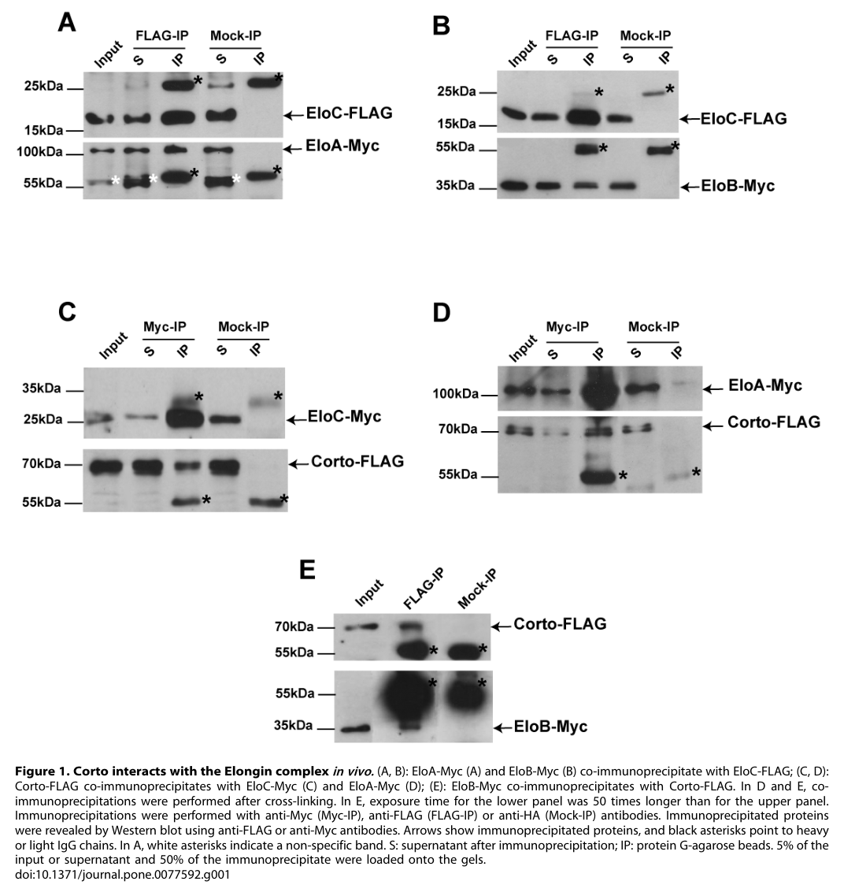

## Question

# Gene Research for Functional Annotation

## ⚠️ CRITICAL: Gene/Protein Identification Context

**BEFORE YOU BEGIN RESEARCH:** You MUST verify you are researching the CORRECT gene/protein. Gene symbols can be ambiguous, especially for less well-characterized genes from non-model organisms.

### Target Gene/Protein Identity (from UniProt):
- **UniProt Accession:** E2QCI6
- **Protein Description:** RecName: Full=Elongin-C {ECO:0000256|ARBA:ARBA00021347}; AltName: Full=Elongin 15 kDa subunit {ECO:0000256|ARBA:ARBA00075906}; AltName: Full=RNA polymerase II transcription factor SIII subunit C {ECO:0000256|ARBA:ARBA00076689}; AltName: Full=SIII p15 {ECO:0000256|ARBA:ARBA00083625}; AltName: Full=Transcription elongation factor B polypeptide 1 {ECO:0000256|ARBA:ARBA00080440};
- **Gene Information:** Name=EloC {ECO:0000313|EMBL:AAF57557.1}; Synonyms=BcDNA:RH71704 {ECO:0000313|EMBL:AAF57557.1}, dElongin C {ECO:0000313|EMBL:AAF57557.1}, Dmel\CG9291 {ECO:0000313|EMBL:AAF57557.1}, Elongin-C {ECO:0000313|EMBL:AAF57557.1}, ElonginC {ECO:0000313|EMBL:AAF57557.1}, l(2)SH1299 {ECO:0000313|EMBL:AAF57557.1}, l(2)SH1520 {ECO:0000313|EMBL:AAF57557.1}, l(2)SH2 1520 {ECO:0000313|EMBL:AAF57557.1}; ORFNames=CG9291 {ECO:0000313|EMBL:AAF57557.1}, Dmel_CG9291 {ECO:0000313|EMBL:AAF57557.1};
- **Organism (full):** Drosophila melanogaster (Fruit fly).
- **Protein Family:** Belongs to the SKP1 family.
- **Key Domains:** ELC1. (IPR039948); SKP1-like. (IPR001232); SKP1/BTB/POZ_sf. (IPR011333); Skp1_comp_POZ. (IPR016073); Skp1_POZ (PF03931)

### MANDATORY VERIFICATION STEPS:

1. **Check if the gene symbol "EloC" matches the protein description above**
2. **Verify the organism is correct:** Drosophila melanogaster (Fruit fly).
3. **Check if protein family/domains align with what you find in literature**
4. **If you find literature for a DIFFERENT gene with the same or similar symbol, STOP**

### If Gene Symbol is Ambiguous or You Cannot Find Relevant Literature:

**DO NOT PROCEED WITH RESEARCH ON A DIFFERENT GENE.** Instead:
- State clearly: "The gene symbol 'EloC' is ambiguous or literature is limited for this specific protein"
- Explain what you found (e.g., "Found extensive literature on a different gene with the same symbol in a different organism")
- Describe the protein based ONLY on the UniProt information provided above
- Suggest that the protein function can be inferred from domain/family information

### Research Target:

Please provide a comprehensive research report on the gene **EloC** (gene ID: EloC, UniProt: E2QCI6) in DROME.

The research report should be a detailed narrative explaining the function, biological processes, and localization of the gene product. Citations should be given for all claims.

You should prioritize authoritative reviews and primary scientific literature when conducting research. You can supplement
this with annotations you find in gene/protein databases, but these can be outdated or inaccurate.

We are specifically interested in the primary function of the gene - for enzymes, what reaction is catalyzed, and what is the substrate specificity? For transporters, what is the substrate? For structural proteins or adapters, what is the broader structural role? For signaling molecules, what is the role in the pathway.

We are interested in where in or outside the cell the gene product carries out its function.

We are also interested in the signaling or biochemical pathways in which the gene functions. We are less interested in broad pleiotropic effects, except where these elucidate the precise role.

Include evidence where possible. We are interested in both experimental evidence as well as inference from structure, evolution, or bioinformatic analysis. Precise studies should be prioritized over high-throughput, where available.

## Output

Question: You are an expert researcher providing comprehensive, well-cited information.

Provide detailed information focusing on:
1. Key concepts and definitions with current understanding
2. Recent developments and latest research (prioritize 2023-2024 sources)
3. Current applications and real-world implementations
4. Expert opinions and analysis from authoritative sources
5. Relevant statistics and data from recent studies

Format as a comprehensive research report with proper citations. Include URLs and publication dates where available.
Always prioritize recent, authoritative sources and provide specific citations for all major claims.

# Gene Research for Functional Annotation

## ⚠️ CRITICAL: Gene/Protein Identification Context

**BEFORE YOU BEGIN RESEARCH:** You MUST verify you are researching the CORRECT gene/protein. Gene symbols can be ambiguous, especially for less well-characterized genes from non-model organisms.

### Target Gene/Protein Identity (from UniProt):
- **UniProt Accession:** E2QCI6
- **Protein Description:** RecName: Full=Elongin-C {ECO:0000256|ARBA:ARBA00021347}; AltName: Full=Elongin 15 kDa subunit {ECO:0000256|ARBA:ARBA00075906}; AltName: Full=RNA polymerase II transcription factor SIII subunit C {ECO:0000256|ARBA:ARBA00076689}; AltName: Full=SIII p15 {ECO:0000256|ARBA:ARBA00083625}; AltName: Full=Transcription elongation factor B polypeptide 1 {ECO:0000256|ARBA:ARBA00080440};
- **Gene Information:** Name=EloC {ECO:0000313|EMBL:AAF57557.1}; Synonyms=BcDNA:RH71704 {ECO:0000313|EMBL:AAF57557.1}, dElongin C {ECO:0000313|EMBL:AAF57557.1}, Dmel\CG9291 {ECO:0000313|EMBL:AAF57557.1}, Elongin-C {ECO:0000313|EMBL:AAF57557.1}, ElonginC {ECO:0000313|EMBL:AAF57557.1}, l(2)SH1299 {ECO:0000313|EMBL:AAF57557.1}, l(2)SH1520 {ECO:0000313|EMBL:AAF57557.1}, l(2)SH2 1520 {ECO:0000313|EMBL:AAF57557.1}; ORFNames=CG9291 {ECO:0000313|EMBL:AAF57557.1}, Dmel_CG9291 {ECO:0000313|EMBL:AAF57557.1};
- **Organism (full):** Drosophila melanogaster (Fruit fly).
- **Protein Family:** Belongs to the SKP1 family.
- **Key Domains:** ELC1. (IPR039948); SKP1-like. (IPR001232); SKP1/BTB/POZ_sf. (IPR011333); Skp1_comp_POZ. (IPR016073); Skp1_POZ (PF03931)

### MANDATORY VERIFICATION STEPS:

1. **Check if the gene symbol "EloC" matches the protein description above**
2. **Verify the organism is correct:** Drosophila melanogaster (Fruit fly).
3. **Check if protein family/domains align with what you find in literature**
4. **If you find literature for a DIFFERENT gene with the same or similar symbol, STOP**

### If Gene Symbol is Ambiguous or You Cannot Find Relevant Literature:

**DO NOT PROCEED WITH RESEARCH ON A DIFFERENT GENE.** Instead:
- State clearly: "The gene symbol 'EloC' is ambiguous or literature is limited for this specific protein"
- Explain what you found (e.g., "Found extensive literature on a different gene with the same symbol in a different organism")
- Describe the protein based ONLY on the UniProt information provided above
- Suggest that the protein function can be inferred from domain/family information

### Research Target:

Please provide a comprehensive research report on the gene **EloC** (gene ID: EloC, UniProt: E2QCI6) in DROME.

The research report should be a detailed narrative explaining the function, biological processes, and localization of the gene product. Citations should be given for all claims.

You should prioritize authoritative reviews and primary scientific literature when conducting research. You can supplement
this with annotations you find in gene/protein databases, but these can be outdated or inaccurate.

We are specifically interested in the primary function of the gene - for enzymes, what reaction is catalyzed, and what is the substrate specificity? For transporters, what is the substrate? For structural proteins or adapters, what is the broader structural role? For signaling molecules, what is the role in the pathway.

We are interested in where in or outside the cell the gene product carries out its function.

We are also interested in the signaling or biochemical pathways in which the gene functions. We are less interested in broad pleiotropic effects, except where these elucidate the precise role.

Include evidence where possible. We are interested in both experimental evidence as well as inference from structure, evolution, or bioinformatic analysis. Precise studies should be prioritized over high-throughput, where available.

# Functional annotation of *Drosophila melanogaster* EloC

## Identity and principal molecular role

**The target is fly Elongin C, encoded by *EloC*/*CG9291*, not a similarly named gene in another organism.** Rougeot and colleagues explicitly identify the cloned *D. melanogaster* *EloC* cDNA as *CG9291* and demonstrate interactions of its product with fly Elongins A and B. The accession **E2QCI6** and the ELC1/SKP1-like domain assignments come from the UniProt identification supplied in the question; the papers examined independently substantiate the gene name, organism and Elongin-complex identity, but do not themselves verify that accession or experimentally map those domains. (rougeot2013theelongincomplex pages 2-3, rougeot2013theelongincomplex pages 3-4)

EloC is best annotated as a **nonenzymatic protein-interaction adaptor**. In the nuclear Elongin A–B–C complex it associates strongly with EloA and EloB, consistent with a scaffolding role; EloA is the subunit assigned transcription-elongation activity. An Elongin B/C module also connects BC-box-containing partner proteins to cullin–RING ubiquitin-ligase machinery. The supplied SKP1-like annotations fit this adaptor architecture, but do not imply that EloC itself catalyzes ubiquitin transfer or recognizes one invariant substrate. Its functional specificity depends on the partner complex and its substrate-recruiting protein. (rougeot2013theelongincomplex pages 2-3, rougeot2013theelongincomplex pages 3-4, nayak2018aviralprotein pages 10-11)

The major fly-specific observations, and their limits, are compared below. Figure 1 of the original wing study provides visual evidence for EloC co-immunoprecipitation with EloA, EloB and the chromatin factor Corto in S2 cells. (rougeot2013theelongincomplex media c55bb02f)

| Complex / compartment | Direct evidence in *Drosophila* | Functional inference and limits | Source, DOI URL, publication date |
|---|---|---|---|
| Nuclear EloA–EloB–EloC transcription complex; active chromatin | In S2 cells, EloC strongly co-immunoprecipitated with EloA and EloB. Tagged EloC was mainly nuclear, occupied polytene-chromosome interbands, and extensively colocalized with the elongation-associated H3K36me3 mark. EloC and Corto also occupied the *rhomboid* (*rho*) locus in wing discs. EloC hypomorphs/RNAi caused lethality and wing-growth or vein defects; reduced EloC suppressed *corto*, *blistered*, and Trithorax-group ectopic-vein phenotypes. (rougeot2013theelongincomplex pages 3-4, rougeot2013theelongincomplex pages 9-10) | Best-supported primary role: a nonenzymatic, SKP1-like interaction scaffold that couples EloA to EloB and chromatin-associated regulators. Association with active chromatin and *rho* supports transcriptional regulation, but no fly experiment directly measured EloC-dependent RNA-polymerase-II elongation velocity; transient-pause suppression derives from conserved Elongin biochemistry. | Rougeot et al., *PLOS ONE*; [https://doi.org/10.1371/journal.pone.0077592](https://doi.org/10.1371/journal.pone.0077592); 17 October 2013. |
| CrPV-1A–EloB/EloC–Cul2–Rbx1 ubiquitin ligase; S2-cell antiviral-RNAi context | AP-MS identified EloC, EloB, Cul2 and Rbx1 among prominent CrPV-1A interactors. CrPV-1A cofractionated with this machinery and Ago2. Its BC-box formed recombinant CrPV-1A–EloBC and EloBC–Cul2 complexes; BC-box mutation abolished EloBC/Cul2 recruitment. CrPV-1A promoted proteasome-sensitive Ago2 loss; Cul2 or EloB depletion stabilized Ago2. Viral BC-box mutants showed a greater than three-log titre reduction, partially rescued by Ago2 depletion. (nayak2018aviralprotein pages 10-11, nayak2018aviralprotein pages 11-12) | Demonstrates that fly EloC can serve as an adaptor in a pathogen-hijacked Cul2 E3 ligase that disables antiviral RNAi. EloC itself was not selectively depleted, so its necessity is inferred from complex formation and BC-box-dependent recruitment rather than an EloC-specific loss/rescue test. EloC is not the ubiquitin-transfer enzyme or substrate receptor. | Nayak et al., *Cell Host & Microbe*; [https://doi.org/10.1016/j.chom.2018.09.006](https://doi.org/10.1016/j.chom.2018.09.006); 10 October 2018. |
| Dora/ZSWIM8–EloC–Cul3-associated TDMD machinery; ovarian somatic cells | Endogenously tagged Dora co-immunoprecipitated EloC and the Cullin-neddylation factor UbcE2M. Dora loss altered miRNAs and downstream transcripts; Cul3 depletion increased miR-7-5p, and inhibition of neddylation or the proteasome supported a CRL3-dependent degradation pathway. Dora formed cytoplasmic granules distinct from P- and GW-bodies. (akulenko2023evidenceoftargetmediated pages 9-12) | Supports EloC association with a fly Dora/CRL3 target-directed miRNA-degradation complex, but remains a 2023 non-peer-reviewed preprint. No EloC knockdown/rescue established that EloC is required for fly TDMD. The reported cytoplasmic-granule localization belongs to Dora, not directly to EloC, and granule function remains unresolved. | Akulenko et al., *bioRxiv* preprint; [https://doi.org/10.1101/2023.08.30.555489](https://doi.org/10.1101/2023.08.30.555489); 30 August 2023. |

*Table: Evidence-based comparison of the three experimentally supported molecular contexts for Drosophila CG9291/EloC. The table separates direct fly observations from conserved inference and unresolved requirements.*

## Transcription, chromatin and developmental signaling

In fly S2-cell extracts, tagged EloC co-immunoprecipitates strongly with EloA and EloB without chemical cross-linking; EloA–EloB association was weaker and required cross-linking. Corto also co-immunoprecipitates strongly with EloC, whereas its detectable associations with EloA and EloB required cross-linking. These results make EloC a plausible interface between the Elongin complex and Corto, although co-immunoprecipitation does not establish a direct binding surface. (rougeot2013theelongincomplex pages 3-4, rougeot2013theelongincomplex media c55bb02f)

**Where this function occurs:** the tagged Elongin proteins were detected mainly in S2-cell nuclear extracts. In larval salivary glands, Myc-tagged EloC bound numerous polytene-chromosome sites, preferentially DAPI-poor interbands, and extensively overlapped H3K36me3, a chromatin mark associated with elongating transcription. Chromatin immunoprecipitation from third-instar wing discs additionally detected EloC and Corto at the vein-promoting *rhomboid* (*rho*) locus, including its promoter/transcription-start region. Thus, the strongest direct localization assignment for fly EloC is **nuclear, chromatin-associated**; the tagged-protein experiments do not establish that every endogenous EloC complex is confined to the nucleus. (rougeot2013theelongincomplex pages 3-4, rougeot2013theelongincomplex pages 9-10)

The mechanistic model is that Elongin-associated EloC helps regulate RNA polymerase II transcription of selected genes, including potentially *rho*, in opposition to Corto during wing vein-versus-intervein specification. *Rho* processes ligands for the Drosophila EGF-receptor pathway, placing this proposed transcriptional effect upstream of a vein-patterning signal rather than making EloC an EGFR-pathway enzyme. **Qualification:** suppression of transient polymerase pausing is established for the Elongin complex in earlier biochemical work cited by Rougeot and colleagues, not by a direct measurement of fly EloC-dependent polymerase velocity or *rho* transcription kinetics in that study. Occupancy of *rho* and genetic interaction support the model but do not prove direct activation by EloC. (rougeot2013theelongincomplex pages 2-3, rougeot2013theelongincomplex pages 10-12, rougeot2013theelongincomplex pages 9-10)

Fly genetics establish biological importance while distinguishing complex function from a narrowly defined direct target. The tested EloC insertions behaved as hypomorphs, reducing transcript abundance approximately **1.4–3-fold**; ubiquitous EloC RNAi reduced expression approximately **fivefold** and caused embryonic lethality. Strong insertion combinations were lethal, and wing-directed depletion produced small clones or severely defective wings. Heterozygous EloC alleles could cause low-penetrance truncation of the L5 vein, whereas EloC overexpression alone did not produce a reported wing phenotype. (rougeot2013theelongincomplex pages 3-4, rougeot2013theelongincomplex pages 4-6, rougeot2013theelongincomplex pages 9-10)

A more pathway-specific genetic result is that reducing EloC suppressed ectopic veins caused by loss of *blistered* or *corto*: the strong ectopic-vein phenotype in a *blistered* background fell from **92%** in the control to **17%** or **24.2%** with the two tested EloC alleles; one *corto* background fell from **93.8%** ectopic-vein penetrance to **14.8%** with *EloC*^SH1520^. Interactions with *mor*, *kis* and *trx* likewise support antagonism of several chromatin-regulatory activities. These are informative genetic relationships, not proof that each gene is a direct EloC biochemical substrate. (rougeot2013theelongincomplex pages 9-10, rougeot2013theelongincomplex pages 10-12)

## Ubiquitin-ligase adaptor function and antiviral RNA interference

The clearest fly example of EloC in a ubiquitin-ligase assembly comes from **cricket paralysis virus (CrPV)**. During infection or expression in Drosophila S2 cells, viral CrPV-1A associates with EloC, EloB, Cul2 and Rbx1. Biochemical reconstitution and mutation of a CrPV-1A **BC box** show that the viral protein recruits the EloB/C module and Cul2 through that motif; a separate viral interface binds the antiviral effector Ago2. Here EloC is an **assembly adaptor** in a pathogen-hijacked Cul2–RING E3 complex, while CrPV-1A provides substrate recruitment and the ligase machinery mediates ubiquitination. (nayak2018aviralprotein pages 10-11, nayak2018aviralprotein pages 11-12)

CrPV-1A expression increased ubiquitination at several Ago2 sites; proteasome inhibition prevented CrPV-1A-associated Ago2 loss, and depletion of **EloB or Cul2** stabilized Ago2 during infection. Viral BC-box mutants lost EloB/C–Cul2 recruitment and suffered a **greater than three-log decrease in viral titre**; depleting Ago2 partially rescued their replication defect. This supports a mechanism in which the virus uses the host ligase to degrade Ago2 and sustain infection by weakening antiviral RNA interference. The study did **not** report an EloC-selective depletion/rescue test, so EloC’s necessity for Ago2 destruction is supported by its demonstrated participation in the assembled complex rather than independently established by EloC genetics. This is an experimental model of viral exploitation, not evidence that an uninfected fly ordinarily targets Ago2 by the same CrPV-dependent mechanism. (nayak2018aviralprotein pages 11-12, nayak2018aviralprotein pages 10-11)

## Recent work: candidate role in target-directed microRNA degradation

A **30 August 2023 bioRxiv preprint** examining fly ovarian somatic cells reported that endogenously tagged **Dora**, the Drosophila ZSWIM8 ortholog, co-immunoprecipitated **EloC** and the cullin-neddylation factor UbcE2M. Dora deletion altered microRNA abundance; Cul3 depletion increased miR-7-5p, and neddylation or proteasome inhibition supported participation of a Cul3-associated ubiquitin-ligase pathway. These observations identify a further *fly* EloC-containing molecular association compatible with target-directed microRNA degradation (TDMD). **They do not establish that EloC is required for fly TDMD:** an EloC-specific depletion and rescue were not reported. The proposed downstream effects on *Tom* and Notch signaling were measured following **Dora** perturbation, and should not be assigned specifically to EloC. (akulenko2023evidenceoftargetmediated pages 9-12, akulenko2023evidenceoftargetmediated pages 1-4)

The subcellular distinction matters: the 2023 preprint observed **Dora**, not EloC itself, in cytoplasmic granules distinct from conventional P- and GW-bodies; whether EloC enters those granules, or whether the granules are necessary for TDMD, remains untested there. The independently observed association with a virus-recruited Ago2 ligase is consistent with EloC acting outside its chromatin-associated transcriptional role, but does not precisely map endogenous EloC’s cytoplasmic distribution. (akulenko2023evidenceoftargetmediated pages 9-12, nayak2018aviralprotein pages 10-11)

A **January 2024 authoritative review** describes the conserved ZSWIM8/Dora pathway: unusual target RNAs with extensive pairing to an Ago-bound microRNA can trigger Argonaute ubiquitination, proteasomal loss and microRNA decay. It summarizes **21 Drosophila microRNAs** reported to be ZSWIM8/Dora-regulated across the studies it reviewed. That number concerns the **Dora pathway, not EloC-specific substrates**. Elongin B/C binding and a Cul3 requirement were characterized particularly in human-cell experiments; the fly Dora–EloC co-immunoprecipitation strengthens cross-species plausibility without resolving EloC’s fly-specific functional requirement. Importantly, this Ago1-associated microRNA-turnover setting should not be conflated with the **CrPV/Ago2 antiviral-siRNA** setting described above. (buhagiar2024tokilla pages 3-4, buhagiar2024tokilla pages 11-12, akulenko2023evidenceoftargetmediated pages 9-12, mcjunkin2024whatgoesup pages 8-9)

## Functional-annotation conclusion and evidence limits

The most defensible annotation is **“SKP1-like Elongin C adaptor that assembles protein complexes for selective transcriptional regulation and cullin-associated ubiquitination.”** Direct fly evidence supports EloA/EloB/C and Corto association, nuclear active-chromatin localization, *rho*-locus occupancy, and essential developmental/wing-patterning functions; separate biochemical and infection experiments support its participation in a CrPV-recruited EloB/C–Cul2 ligase. A 2023 fly preprint extends its interaction network to Dora-associated Cul3 machinery, but an EloC-specific role in TDMD and its precise cytoplasmic site remain open. No substrate-specific catalytic reaction should be assigned to EloC itself, and neither fly polymerase elongation rates nor endogenous EloC-dependent TDMD have been directly established by the evidence cited here. (rougeot2013theelongincomplex pages 3-4, rougeot2013theelongincomplex pages 9-10, nayak2018aviralprotein pages 10-11, nayak2018aviralprotein pages 11-12, akulenko2023evidenceoftargetmediated pages 9-12)

References

1. (rougeot2013theelongincomplex pages 2-3): Julien Rougeot, Myrtille Renard, Neel B. Randsholt, Frédérique Peronnet, and Emmanuèle Mouchel-Vielh. The elongin complex antagonizes the chromatin factor corto for vein versus intervein cell identity in drosophila wings. PLoS ONE, 8:e77592, Oct 2013. URL: https://doi.org/10.1371/journal.pone.0077592, doi:10.1371/journal.pone.0077592. This article has 10 citations and is from a peer-reviewed journal.

2. (rougeot2013theelongincomplex pages 3-4): Julien Rougeot, Myrtille Renard, Neel B. Randsholt, Frédérique Peronnet, and Emmanuèle Mouchel-Vielh. The elongin complex antagonizes the chromatin factor corto for vein versus intervein cell identity in drosophila wings. PLoS ONE, 8:e77592, Oct 2013. URL: https://doi.org/10.1371/journal.pone.0077592, doi:10.1371/journal.pone.0077592. This article has 10 citations and is from a peer-reviewed journal.

3. (nayak2018aviralprotein pages 10-11): Arabinda Nayak, Dong Young Kim, Michael J. Trnka, Craig H. Kerr, Peter V. Lidsky, David J. Stanley, Brianna Monique Rivera, Kathy H. Li, Alma L. Burlingame, Eric Jan, Judith Frydman, John D. Gross, and Raul Andino. A viral protein restricts drosophila rnai immunity by regulating argonaute activity and stability. Cell host & microbe, 24 4:542-557.e9, Oct 2018. URL: https://doi.org/10.1016/j.chom.2018.09.006, doi:10.1016/j.chom.2018.09.006. This article has 51 citations and is from a highest quality peer-reviewed journal.

4. (rougeot2013theelongincomplex media c55bb02f): Julien Rougeot, Myrtille Renard, Neel B. Randsholt, Frédérique Peronnet, and Emmanuèle Mouchel-Vielh. The elongin complex antagonizes the chromatin factor corto for vein versus intervein cell identity in drosophila wings. PLoS ONE, 8:e77592, Oct 2013. URL: https://doi.org/10.1371/journal.pone.0077592, doi:10.1371/journal.pone.0077592. This article has 10 citations and is from a peer-reviewed journal.

5. (rougeot2013theelongincomplex pages 9-10): Julien Rougeot, Myrtille Renard, Neel B. Randsholt, Frédérique Peronnet, and Emmanuèle Mouchel-Vielh. The elongin complex antagonizes the chromatin factor corto for vein versus intervein cell identity in drosophila wings. PLoS ONE, 8:e77592, Oct 2013. URL: https://doi.org/10.1371/journal.pone.0077592, doi:10.1371/journal.pone.0077592. This article has 10 citations and is from a peer-reviewed journal.

6. (nayak2018aviralprotein pages 11-12): Arabinda Nayak, Dong Young Kim, Michael J. Trnka, Craig H. Kerr, Peter V. Lidsky, David J. Stanley, Brianna Monique Rivera, Kathy H. Li, Alma L. Burlingame, Eric Jan, Judith Frydman, John D. Gross, and Raul Andino. A viral protein restricts drosophila rnai immunity by regulating argonaute activity and stability. Cell host & microbe, 24 4:542-557.e9, Oct 2018. URL: https://doi.org/10.1016/j.chom.2018.09.006, doi:10.1016/j.chom.2018.09.006. This article has 51 citations and is from a highest quality peer-reviewed journal.

7. (akulenko2023evidenceoftargetmediated pages 9-12): Natalia Akulenko, Elena Mikhaleva, Sofya Marfina, Dmitry Kornyakov, Vlad Bobrov, Georgij Arapidi, Victoria Shender, and Sergei Ryazansky. Evidence of target-mediated mirna degradation in drosophila ovarian cell culture. bioRxiv, Aug 2023. URL: https://doi.org/10.1101/2023.08.30.555489, doi:10.1101/2023.08.30.555489. This article has 1 citations.

8. (rougeot2013theelongincomplex pages 10-12): Julien Rougeot, Myrtille Renard, Neel B. Randsholt, Frédérique Peronnet, and Emmanuèle Mouchel-Vielh. The elongin complex antagonizes the chromatin factor corto for vein versus intervein cell identity in drosophila wings. PLoS ONE, 8:e77592, Oct 2013. URL: https://doi.org/10.1371/journal.pone.0077592, doi:10.1371/journal.pone.0077592. This article has 10 citations and is from a peer-reviewed journal.

9. (rougeot2013theelongincomplex pages 4-6): Julien Rougeot, Myrtille Renard, Neel B. Randsholt, Frédérique Peronnet, and Emmanuèle Mouchel-Vielh. The elongin complex antagonizes the chromatin factor corto for vein versus intervein cell identity in drosophila wings. PLoS ONE, 8:e77592, Oct 2013. URL: https://doi.org/10.1371/journal.pone.0077592, doi:10.1371/journal.pone.0077592. This article has 10 citations and is from a peer-reviewed journal.

10. (akulenko2023evidenceoftargetmediated pages 1-4): Natalia Akulenko, Elena Mikhaleva, Sofya Marfina, Dmitry Kornyakov, Vlad Bobrov, Georgij Arapidi, Victoria Shender, and Sergei Ryazansky. Evidence of target-mediated mirna degradation in drosophila ovarian cell culture. bioRxiv, Aug 2023. URL: https://doi.org/10.1101/2023.08.30.555489, doi:10.1101/2023.08.30.555489. This article has 1 citations.

11. (buhagiar2024tokilla pages 3-4): Amber F. Buhagiar and Benjamin Kleaveland. To kill a microrna: emerging concepts in target-directed microrna degradation. Nucleic Acids Research, 52:1558-1574, Jan 2024. URL: https://doi.org/10.1093/nar/gkae003, doi:10.1093/nar/gkae003. This article has 68 citations and is from a highest quality peer-reviewed journal.

12. (buhagiar2024tokilla pages 11-12): Amber F. Buhagiar and Benjamin Kleaveland. To kill a microrna: emerging concepts in target-directed microrna degradation. Nucleic Acids Research, 52:1558-1574, Jan 2024. URL: https://doi.org/10.1093/nar/gkae003, doi:10.1093/nar/gkae003. This article has 68 citations and is from a highest quality peer-reviewed journal.

13. (mcjunkin2024whatgoesup pages 8-9): Katherine McJunkin and Susan Gottesman. What goes up must come down: off switches for regulatory rnas. Genes &amp; Development, Aug 2024. URL: https://doi.org/10.1101/gad.351934.124, doi:10.1101/gad.351934.124. This article has 10 citations and is from a highest quality peer-reviewed journal.

## Artifacts

- [Edison artifact artifact-00](EloC-deep-research-falcon_artifacts/artifact-00.md)

## Citations

1. akulenko2023evidenceoftargetmediated pages 9-12
2. rougeot2013theelongincomplex pages 2-3
3. rougeot2013theelongincomplex pages 3-4
4. nayak2018aviralprotein pages 10-11
5. rougeot2013theelongincomplex pages 9-10
6. nayak2018aviralprotein pages 11-12
7. rougeot2013theelongincomplex pages 10-12
8. rougeot2013theelongincomplex pages 4-6
9. akulenko2023evidenceoftargetmediated pages 1-4
10. buhagiar2024tokilla pages 3-4
11. buhagiar2024tokilla pages 11-12
12. mcjunkin2024whatgoesup pages 8-9
13. https://doi.org/10.1371/journal.pone.0077592
14. https://doi.org/10.1016/j.chom.2018.09.006
15. https://doi.org/10.1101/2023.08.30.555489
16. https://doi.org/10.1371/journal.pone.0077592](https://doi.org/10.1371/journal.pone.0077592
17. https://doi.org/10.1016/j.chom.2018.09.006](https://doi.org/10.1016/j.chom.2018.09.006
18. https://doi.org/10.1101/2023.08.30.555489](https://doi.org/10.1101/2023.08.30.555489
19. https://doi.org/10.1371/journal.pone.0077592,
20. https://doi.org/10.1016/j.chom.2018.09.006,
21. https://doi.org/10.1101/2023.08.30.555489,
22. https://doi.org/10.1093/nar/gkae003,
23. https://doi.org/10.1101/gad.351934.124,