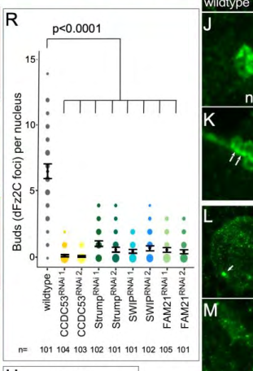

## Question

# Gene Research for Functional Annotation

## ⚠️ CRITICAL: Gene/Protein Identification Context

**BEFORE YOU BEGIN RESEARCH:** You MUST verify you are researching the CORRECT gene/protein. Gene symbols can be ambiguous, especially for less well-characterized genes from non-model organisms.

### Target Gene/Protein Identity (from UniProt):
- **UniProt Accession:** A1ZBW7
- **Protein Description:** RecName: Full=WASH complex subunit 2 {ECO:0000250|UniProtKB:Q6PGL7}; AltName: Full=Family with sequence similarity 21 {ECO:0000312|FlyBase:FBgn0034529};
- **Gene Information:** Name=FAM21 {ECO:0000312|FlyBase:FBgn0034529}; ORFNames=CG16742 {ECO:0000312|FlyBase:FBgn0034529};
- **Organism (full):** Drosophila melanogaster (Fruit fly).
- **Protein Family:** Belongs to the FAM21 family. .
- **Key Domains:** Not specified in UniProt

### MANDATORY VERIFICATION STEPS:

1. **Check if the gene symbol "FAM21" matches the protein description above**
2. **Verify the organism is correct:** Drosophila melanogaster (Fruit fly).
3. **Check if protein family/domains align with what you find in literature**
4. **If you find literature for a DIFFERENT gene with the same or similar symbol, STOP**

### If Gene Symbol is Ambiguous or You Cannot Find Relevant Literature:

**DO NOT PROCEED WITH RESEARCH ON A DIFFERENT GENE.** Instead:
- State clearly: "The gene symbol 'FAM21' is ambiguous or literature is limited for this specific protein"
- Explain what you found (e.g., "Found extensive literature on a different gene with the same symbol in a different organism")
- Describe the protein based ONLY on the UniProt information provided above
- Suggest that the protein function can be inferred from domain/family information

### Research Target:

Please provide a comprehensive research report on the gene **FAM21** (gene ID: FAM21, UniProt: A1ZBW7) in DROME.

The research report should be a detailed narrative explaining the function, biological processes, and localization of the gene product. Citations should be given for all claims.

You should prioritize authoritative reviews and primary scientific literature when conducting research. You can supplement
this with annotations you find in gene/protein databases, but these can be outdated or inaccurate.

We are specifically interested in the primary function of the gene - for enzymes, what reaction is catalyzed, and what is the substrate specificity? For transporters, what is the substrate? For structural proteins or adapters, what is the broader structural role? For signaling molecules, what is the role in the pathway.

We are interested in where in or outside the cell the gene product carries out its function.

We are also interested in the signaling or biochemical pathways in which the gene functions. We are less interested in broad pleiotropic effects, except where these elucidate the precise role.

Include evidence where possible. We are interested in both experimental evidence as well as inference from structure, evolution, or bioinformatic analysis. Precise studies should be prioritized over high-throughput, where available.

## Output

Question: You are an expert researcher providing comprehensive, well-cited information.

Provide detailed information focusing on:
1. Key concepts and definitions with current understanding
2. Recent developments and latest research (prioritize 2023-2024 sources)
3. Current applications and real-world implementations
4. Expert opinions and analysis from authoritative sources
5. Relevant statistics and data from recent studies

Format as a comprehensive research report with proper citations. Include URLs and publication dates where available.
Always prioritize recent, authoritative sources and provide specific citations for all major claims.

# Gene Research for Functional Annotation

## ⚠️ CRITICAL: Gene/Protein Identification Context

**BEFORE YOU BEGIN RESEARCH:** You MUST verify you are researching the CORRECT gene/protein. Gene symbols can be ambiguous, especially for less well-characterized genes from non-model organisms.

### Target Gene/Protein Identity (from UniProt):
- **UniProt Accession:** A1ZBW7
- **Protein Description:** RecName: Full=WASH complex subunit 2 {ECO:0000250|UniProtKB:Q6PGL7}; AltName: Full=Family with sequence similarity 21 {ECO:0000312|FlyBase:FBgn0034529};
- **Gene Information:** Name=FAM21 {ECO:0000312|FlyBase:FBgn0034529}; ORFNames=CG16742 {ECO:0000312|FlyBase:FBgn0034529};
- **Organism (full):** Drosophila melanogaster (Fruit fly).
- **Protein Family:** Belongs to the FAM21 family. .
- **Key Domains:** Not specified in UniProt

### MANDATORY VERIFICATION STEPS:

1. **Check if the gene symbol "FAM21" matches the protein description above**
2. **Verify the organism is correct:** Drosophila melanogaster (Fruit fly).
3. **Check if protein family/domains align with what you find in literature**
4. **If you find literature for a DIFFERENT gene with the same or similar symbol, STOP**

### If Gene Symbol is Ambiguous or You Cannot Find Relevant Literature:

**DO NOT PROCEED WITH RESEARCH ON A DIFFERENT GENE.** Instead:
- State clearly: "The gene symbol 'FAM21' is ambiguous or literature is limited for this specific protein"
- Explain what you found (e.g., "Found extensive literature on a different gene with the same symbol in a different organism")
- Describe the protein based ONLY on the UniProt information provided above
- Suggest that the protein function can be inferred from domain/family information

### Research Target:

Please provide a comprehensive research report on the gene **FAM21** (gene ID: FAM21, UniProt: A1ZBW7) in DROME.

The research report should be a detailed narrative explaining the function, biological processes, and localization of the gene product. Citations should be given for all claims.

You should prioritize authoritative reviews and primary scientific literature when conducting research. You can supplement
this with annotations you find in gene/protein databases, but these can be outdated or inaccurate.

We are specifically interested in the primary function of the gene - for enzymes, what reaction is catalyzed, and what is the substrate specificity? For transporters, what is the substrate? For structural proteins or adapters, what is the broader structural role? For signaling molecules, what is the role in the pathway.

We are interested in where in or outside the cell the gene product carries out its function.

We are also interested in the signaling or biochemical pathways in which the gene functions. We are less interested in broad pleiotropic effects, except where these elucidate the precise role.

Include evidence where possible. We are interested in both experimental evidence as well as inference from structure, evolution, or bioinformatic analysis. Precise studies should be prioritized over high-throughput, where available.

# Functional annotation report: *Drosophila melanogaster* FAM21 (A1ZBW7)

## Identity and principal function

**Identity check.** The specified UniProt entry [A1ZBW7](https://www.uniprot.org/uniprotkb/A1ZBW7/entry) identifies the *D. melanogaster* gene **FAM21**, also called **CG16742**, as a FAM21-family protein annotated “WASH complex subunit 2.” Importantly, fly studies identify **FAM21 protein itself** as a member of the Wash regulatory complex (SHRC), alongside CCDC53, Strumpellin and SWIP. This is the intended fly protein, not an assertion that experiments on human FAM21 were conducted in flies. (verboon2020drosophilawashand pages 4-6, verboon2018washexhibitscontextdependent pages 9-12)

**Best-supported molecular annotation:** FAM21 is a **nonenzymatic regulatory/scaffolding subunit** of the Wash complex. Its experimentally demonstrated fly roles include maintaining the abundance of other complex components, supporting actin organization during oogenesis, and enabling nuclear-envelope budding. Wash—not FAM21—is the complex’s Arp2/3-activating actin-nucleation-promoting subunit; FAM21 has no established catalytic reaction or transported substrate. An additional, strongly supported *ortholog-based* model places FAM21 in endosomal Wash recruitment and actin-dependent membrane remodeling, but the precise fly-specific binding interactions and cargoes remain to be established. (verboon2018washexhibitscontextdependent pages 9-12, verboon2020drosophilawashand pages 6-8, verboon2020drosophilawashand pages 11-14, fokin2021assemblyandactivity pages 4-5, carosi2023receptorrecyclingby pages 5-6)

The evidence levels are summarized below; the figure evidence for fly FAM21 knockdown and nuclear complex formation comes from the 2020 study’s cropped figures. (verboon2020drosophilawashand media 2afa11eb, verboon2020drosophilawashand media 1a7f52f1)

| Evidence level and system | Evidence | Functional interpretation | Key limitation |
|---|---|---|---|
| **Direct — fly oogenesis (2018)** | Antibody staining detected *D. melanogaster* FAM21 in stage 7–9 germ cells, enriched at the oocyte cortex. Two independent germline RNAi lines were used per WASH-regulatory-complex subunit; FAM21 depletion caused premature ooplasmic streaming, disorganized cortical F-actin, and abnormal outer ring-canal actin. Depleting FAM21 also reduced Wash and other tested complex subunits in ovary lysates. (verboon2018washexhibitscontextdependent pages 9-12) | Fly FAM21 is a structural/regulatory WASH-complex component required for complex stability and proper actin organization during oogenesis. (verboon2018washexhibitscontextdependent pages 9-12) | RNAi phenotypes cannot assign an autonomous biochemical activity to FAM21 because depletion destabilized the larger complex. Cargo trafficking was not measured. (verboon2018washexhibitscontextdependent pages 9-12) |
| **Direct — fly salivary-gland nuclei (2020)** | FAM21 was strongly nuclear by antibody staining. Two FAM21 RNAi constructs reduced dFz2C-positive nuclear-envelope buds; across **all** SHRC RNAi lines, counts ranged from **0.1–1.1 ± 0.1 buds/nucleus**, versus **6.6 ± 0.3** in controls (**n > 100 per line; p < 0.0001**). (verboon2020drosophilawashand pages 6-8, verboon2019washandthe pages 7-9, verboon2020drosophilawashand pages 32-36) | FAM21 is required, as part of nuclear SHRC, for efficient nuclear-envelope budding—an Arp2/3-dependent export mechanism for large macromolecular cargo. (verboon2020drosophilawashand pages 4-6, verboon2020drosophilawashand pages 11-14) | The paper does not state a separate numerical mean for either FAM21 RNAi line in the text. FAM21 was not specifically reported as enriched at bud necks; that localization was shown for CCDC53 and SWIP. (verboon2019washandthe pages 7-9, verboon2020drosophilawashand pages 32-36) |
| **Direct — fly Kc-cell nuclear biochemistry (2020)** | Blue-native PAGE placed FAM21 with Wash, CCDC53 and Strumpellin in a putative **~900-kDa** nuclear complex. Co-immunoprecipitation supported association among SHRC subunits. A separate **~450-kDa** Wash–Lamin B complex lacked SHRC association. (verboon2020drosophilawashand pages 8-9, verboon2020drosophilawashand pages 36-40) | Fly FAM21 physically belongs to a nuclear WASH regulatory complex distinct from Wash’s Lamin-associated complex, supporting an adapter/scaffold rather than catalytic role. (verboon2020drosophilawashand pages 8-9) | Complex sizes are approximate, and these experiments do not establish direct pairwise FAM21–Wash binding or endosomal localization. (verboon2020drosophilawashand pages 8-9, verboon2020drosophilawashand pages 36-40) |
| **Screen-level — fly enterocytes (2022)** | FAM21 RNAi was included in a candidate screen for genes reproducing both Rab21-depletion readouts: increased phospho-histone-H3-positive proliferation and increased Upd3 inflammatory signaling. FAM21 was not among the perturbations reported to phenocopy **both** readouts. (nassari2022rab21inenterocytes pages 8-10) | In this tissue and assay, FAM21 depletion did not reproduce the full Rab21-loss phenotype; the result argues against treating FAM21 as a universal proxy for early-endosomal failure. (nassari2022rab21inenterocytes pages 8-10) | This is a negative candidate-screen result, not proof that FAM21 lacks enterocyte or endosomal function; RNAi efficiency and narrower trafficking phenotypes were not established. (nassari2022rab21inenterocytes pages 8-10) |
| **Ortholog-based inference — metazoan endosomes** | Mammalian FAM21’s extended tail recruits WASH complex through repeated VPS35-binding motifs; its C-terminal CPI motif binds capping protein and helps initiate branched actin on endosomes. WASH-dependent actin supports endosomal cargo-domain organization, tubule remodeling and scission. (fokin2021assemblyandactivity pages 5-7, fokin2021assemblyandactivity pages 4-5, carosi2023receptorrecyclingby pages 5-6) | Because A1ZBW7 belongs to the FAM21 family and fly FAM21 is experimentally a WASH-complex subunit, the most plausible conserved primary role is scaffolding/localizing WASH-dependent actin-remodeling machinery. | Direct binding of **fly** A1ZBW7 to VPS35 or capping protein, fly endosomal localization, motif functionality, and specific fly cargoes were not demonstrated in the cited fly experiments; these details must remain explicitly inferred. (smolyn2020thefirstcharacterization pages 58-59, verboon2020drosophilawashand pages 8-9) |

*Table: Evidence hierarchy for *Drosophila melanogaster* FAM21 (A1ZBW7), separating direct fly experiments from mammalian-ortholog-based mechanistic inference. The table highlights where quantitative or localization claims should be interpreted cautiously.*

## Direct evidence in flies: processes and localization

**Oogenesis and cortical actin.** In stage 7–9 egg chambers, antibodies detected FAM21 in the germline, enriched at the **oocyte cortex**. Germline knockdown using two independent RNAi lines per SHRC component produced premature ooplasmic streaming, disorganized cortical actin and abnormal actin surrounding the outer ring canals. FAM21 depletion also lowered Wash and other assayed SHRC proteins in ovary lysates. These observations support a role in **complex stability and actin organization**, rather than showing that FAM21 directly polymerizes actin. Because loss of one component lowers others, the knockdown phenotype cannot be attributed to an autonomous FAM21 biochemical activity. See Verboon and colleagues, *Journal of Cell Science*, **April 2018**, https://doi.org/10.1242/jcs.211573. (verboon2018washexhibitscontextdependent pages 9-12)

**Nuclear-envelope budding.** Antibody staining found fly FAM21 prominently in **larval salivary-gland nuclei**. Depleting each SHRC subunit, including FAM21, with two independent RNAi constructs substantially reduced dFz2C-positive nuclear-envelope buds. Across **all SHRC knockdown lines**, counts were **0.1–1.1 ± 0.1 buds per nucleus**, versus **6.6 ± 0.3** in controls (**more than 100 nuclei per line; p < 0.0001 for each line**). This is a range across subunits, **not a FAM21-specific mean**. The authors reported enrichment of CCDC53 and SWIP at budding sites; they did **not** establish equivalent bud-neck enrichment for FAM21. See Verboon and colleagues, *Journal of Cell Science*, **July 2020** (advance online June 2020), https://doi.org/10.1242/jcs.243576; Figure 3 includes the FAM21 RNAi conditions. (verboon2020drosophilawashand pages 6-8, verboon2020drosophilawashand pages 32-36, verboon2020drosophilawashand media 2afa11eb)

Fly Kc-cell nuclear extracts provide biochemical support: FAM21 overlapped with Wash, CCDC53 and Strumpellin in a **putative ~900-kDa complex**, and SHRC members co-immunoprecipitated. A distinct **~450-kDa Wash–Lamin B complex** lacked the SHRC association. Thus, FAM21 participates in a **nuclear Wash complex**, while Wash’s Lamin-associated nuclear role should not be assigned to FAM21. Perturbations of SHRC association and Arp2/3 separately support the authors’ model that nuclear Wash–SHRC enables actin-dependent bud formation, rather than merely altering overall nuclear shape. Complex sizes are approximate, and co-immunoprecipitation does not establish direct pairwise binding. (verboon2020drosophilawashand pages 8-9, verboon2020drosophilawashand pages 36-40, verboon2020drosophilawashand pages 11-14, verboon2020drosophilawashand media 1a7f52f1)

**Endosomes: likely conserved site, not directly demonstrated here for fly FAM21.** In other metazoan systems, FAM21’s extended tail provides multiple binding sites for the retromer component VPS35, coupling Wash-dependent branched-actin assembly to sorting domains on the **cytosolic surface of endosomes**. Its C-terminal capping-protein-interacting region contributes to initiation of endosomal actin networks; these networks help organize cargo domains and remodel or sever transport tubules. The 2023 retromer review and 2021 WASH-mechanism review support this molecular model, while the latter cautions that endosomal WASH recruitment is **not exclusively retromer-dependent**. These findings make endosomal localization and adaptor function plausible for fly A1ZBW7, but the cited fly experiments do not establish fly FAM21–VPS35 or –capping-protein binding, its endosomal residence, or a particular recycled fly cargo. See Fokin and Gautreau, *Frontiers in Cell and Developmental Biology*, **April 2021**, https://doi.org/10.3389/fcell.2021.658865; Carosi and colleagues, *Molecular and Cellular Biology*, **June 2023**, https://doi.org/10.1080/10985549.2023.2222053. (fokin2021assemblyandactivity pages 4-5, fokin2021assemblyandactivity pages 5-7, carosi2023receptorrecyclingby pages 5-6)

## Pathways, recent context and annotation limits

The most precise pathway-level placement is **FAM21 → Wash regulatory complex → Wash/Arp2/3-dependent actin organization**, supported directly for fly oogenesis and nuclear-envelope budding. The broader **retromer/related endosomal sorting → Wash recruitment → actin-assisted cargo recycling** pathway is a mechanistic inference for this fly subunit from conserved family membership and experiments largely performed outside flies. Sequence comparisons support conservation of FAM21-family features, but human residue numbers or motif-binding assignments should not be transferred untested to A1ZBW7. Wash can also function independently of SHRC—for example, in distinct Lamin-associated nuclear complexes—so a phenotype of *wash* loss is not automatically a phenotype of *FAM21* loss. (verboon2018washexhibitscontextdependent pages 9-12, verboon2020drosophilawashand pages 8-9, verboon2020drosophilawashand pages 11-14, smolyn2020thefirstcharacterization pages 58-59, fokin2021assemblyandactivity pages 4-5)

A useful **negative, tissue-specific result** comes from a fly-enterocyte candidate RNAi screen: FAM21 was tested among WASH/retromer-associated genes, but was **not among the perturbations reported to reproduce both** Rab21-loss readouts—elevated intestinal proliferation and Upd3-associated inflammation. This does not rule out a narrower endosomal role for FAM21, and the Rab21-dependent EGFR or JAK–STAT effects must not be presented as FAM21-specific signaling functions. See Nassari and colleagues, *Molecular Biology of the Cell*, **April 2022**, https://doi.org/10.1091/mbc.e21-03-0139. (nassari2022rab21inenterocytes pages 8-10)

**2023–2024 perspective.** The 2023 retromer synthesis explains why FAM21 is viewed as a link between cargo-sorting machinery and endosomal actin, while noting that assignments of particular sorting routes can be contested. A **February 2024** review discusses impaired VPS35–WASH association in Parkinson-disease models; that is informative about retromer biology, **not evidence that fly FAM21 causes Parkinson disease or that A1ZBW7 has a validated therapeutic application**. Rowlands and Moore, *Philosophical Transactions of the Royal Society B*, https://doi.org/10.1098/rstb.2022.0384. The cited 2023–2024 literature does not replace the **2018 and 2020 fly experiments** as the strongest direct evidence for this particular gene. (carosi2023receptorrecyclingby pages 5-6, rowlands2024vps35andretromer pages 4-5, verboon2018washexhibitscontextdependent pages 9-12, verboon2020drosophilawashand pages 6-8)

**Conclusion.** Annotate A1ZBW7 as a *D. melanogaster* **WASH-complex adaptor/regulatory subunit** with experimentally supported functions at the **oocyte cortex** and in **nuclear Wash-dependent budding**. Endosomal Wash recruitment and cargo recycling are well-motivated conserved functions, but their exact molecular contacts, location and cargo specificity for **fly FAM21 itself** remain inferential on the evidence reviewed here. (verboon2018washexhibitscontextdependent pages 9-12, verboon2020drosophilawashand pages 6-8, verboon2020drosophilawashand pages 8-9, fokin2021assemblyandactivity pages 4-5)

References

1. (verboon2020drosophilawashand pages 4-6): Jeffrey M. Verboon, Mitsutoshi Nakamura, Kerri A. Davidson, Jacob R. Decker, Vivek Nandakumar, and Susan M. Parkhurst. <i>drosophila</i> wash and the wash regulatory complex function in nuclear envelope budding. Journal of Cell Science, Jul 2020. URL: https://doi.org/10.1242/jcs.243576, doi:10.1242/jcs.243576. This article has 16 citations and is from a domain leading peer-reviewed journal.

2. (verboon2018washexhibitscontextdependent pages 9-12): Jeffrey M. Verboon, Jacob R. Decker, Mitsutoshi Nakamura, and Susan M. Parkhurst. Wash exhibits context-dependent phenotypes and, along with the wash regulatory complex, regulates drosophila oogenesis. Journal of Cell Science, Apr 2018. URL: https://doi.org/10.1242/jcs.211573, doi:10.1242/jcs.211573. This article has 17 citations and is from a domain leading peer-reviewed journal.

3. (verboon2020drosophilawashand pages 6-8): Jeffrey M. Verboon, Mitsutoshi Nakamura, Kerri A. Davidson, Jacob R. Decker, Vivek Nandakumar, and Susan M. Parkhurst. <i>drosophila</i> wash and the wash regulatory complex function in nuclear envelope budding. Journal of Cell Science, Jul 2020. URL: https://doi.org/10.1242/jcs.243576, doi:10.1242/jcs.243576. This article has 16 citations and is from a domain leading peer-reviewed journal.

4. (verboon2020drosophilawashand pages 11-14): Jeffrey M. Verboon, Mitsutoshi Nakamura, Kerri A. Davidson, Jacob R. Decker, Vivek Nandakumar, and Susan M. Parkhurst. <i>drosophila</i> wash and the wash regulatory complex function in nuclear envelope budding. Journal of Cell Science, Jul 2020. URL: https://doi.org/10.1242/jcs.243576, doi:10.1242/jcs.243576. This article has 16 citations and is from a domain leading peer-reviewed journal.

5. (fokin2021assemblyandactivity pages 4-5): Artem I. Fokin and Alexis M. Gautreau. Assembly and activity of the wash molecular machine: distinctive features at the crossroads of the actin and microtubule cytoskeletons. Frontiers in Cell and Developmental Biology, Apr 2021. URL: https://doi.org/10.3389/fcell.2021.658865, doi:10.3389/fcell.2021.658865. This article has 34 citations.

6. (carosi2023receptorrecyclingby pages 5-6): Julian M. Carosi, Donna Denton, Sharad Kumar, and Timothy J. Sargeant. Receptor recycling by retromer. Molecular and Cellular Biology, 43:317-334, Jun 2023. URL: https://doi.org/10.1080/10985549.2023.2222053, doi:10.1080/10985549.2023.2222053. This article has 32 citations and is from a domain leading peer-reviewed journal.

7. (verboon2020drosophilawashand media 2afa11eb): Jeffrey M. Verboon, Mitsutoshi Nakamura, Kerri A. Davidson, Jacob R. Decker, Vivek Nandakumar, and Susan M. Parkhurst. <i>drosophila</i> wash and the wash regulatory complex function in nuclear envelope budding. Journal of Cell Science, Jul 2020. URL: https://doi.org/10.1242/jcs.243576, doi:10.1242/jcs.243576. This article has 16 citations and is from a domain leading peer-reviewed journal.

8. (verboon2020drosophilawashand media 1a7f52f1): Jeffrey M. Verboon, Mitsutoshi Nakamura, Kerri A. Davidson, Jacob R. Decker, Vivek Nandakumar, and Susan M. Parkhurst. <i>drosophila</i> wash and the wash regulatory complex function in nuclear envelope budding. Journal of Cell Science, Jul 2020. URL: https://doi.org/10.1242/jcs.243576, doi:10.1242/jcs.243576. This article has 16 citations and is from a domain leading peer-reviewed journal.

9. (verboon2019washandthe pages 7-9): Jeffrey M. Verboon, Mitsutoshi Nakamura, Jacob R. Decker, Kerri A. Davidson, Vivek Nandakumar, and Susan M. Parkhurst. Wash and the wash regulatory complex function in nuclear envelope budding. bioRxiv, Dec 2019. URL: https://doi.org/10.1101/2019.12.18.881763, doi:10.1101/2019.12.18.881763. This article has 1 citations.

10. (verboon2020drosophilawashand pages 32-36): Jeffrey M. Verboon, Mitsutoshi Nakamura, Kerri A. Davidson, Jacob R. Decker, Vivek Nandakumar, and Susan M. Parkhurst. <i>drosophila</i> wash and the wash regulatory complex function in nuclear envelope budding. Journal of Cell Science, Jul 2020. URL: https://doi.org/10.1242/jcs.243576, doi:10.1242/jcs.243576. This article has 16 citations and is from a domain leading peer-reviewed journal.

11. (verboon2020drosophilawashand pages 8-9): Jeffrey M. Verboon, Mitsutoshi Nakamura, Kerri A. Davidson, Jacob R. Decker, Vivek Nandakumar, and Susan M. Parkhurst. <i>drosophila</i> wash and the wash regulatory complex function in nuclear envelope budding. Journal of Cell Science, Jul 2020. URL: https://doi.org/10.1242/jcs.243576, doi:10.1242/jcs.243576. This article has 16 citations and is from a domain leading peer-reviewed journal.

12. (verboon2020drosophilawashand pages 36-40): Jeffrey M. Verboon, Mitsutoshi Nakamura, Kerri A. Davidson, Jacob R. Decker, Vivek Nandakumar, and Susan M. Parkhurst. <i>drosophila</i> wash and the wash regulatory complex function in nuclear envelope budding. Journal of Cell Science, Jul 2020. URL: https://doi.org/10.1242/jcs.243576, doi:10.1242/jcs.243576. This article has 16 citations and is from a domain leading peer-reviewed journal.

13. (nassari2022rab21inenterocytes pages 8-10): Sonya Nassari, Camille Lacarrière-Keïta, Dominique Lévesque, François-Michel Boisvert, and Steve Jean. Rab21 in enterocytes participates in intestinal epithelium maintenance. Molecular Biology of the Cell, Apr 2022. URL: https://doi.org/10.1091/mbc.e21-03-0139, doi:10.1091/mbc.e21-03-0139. This article has 15 citations and is from a domain leading peer-reviewed journal.

14. (fokin2021assemblyandactivity pages 5-7): Artem I. Fokin and Alexis M. Gautreau. Assembly and activity of the wash molecular machine: distinctive features at the crossroads of the actin and microtubule cytoskeletons. Frontiers in Cell and Developmental Biology, Apr 2021. URL: https://doi.org/10.3389/fcell.2021.658865, doi:10.3389/fcell.2021.658865. This article has 34 citations.

15. (smolyn2020thefirstcharacterization pages 58-59): Jennifer Smolyn. The first characterization of the wash complex in c. elegans endocytic recycling. ArXiv, Jan 2020. URL: https://doi.org/10.7282/t3-sgsb-mr58, doi:10.7282/t3-sgsb-mr58. This article has 2 citations.

16. (rowlands2024vps35andretromer pages 4-5): Jordan Rowlands and Darren J. Moore. Vps35 and retromer dysfunction in parkinson's disease. Philosophical Transactions of the Royal Society B: Biological Sciences, Feb 2024. URL: https://doi.org/10.1098/rstb.2022.0384, doi:10.1098/rstb.2022.0384. This article has 32 citations and is from a domain leading peer-reviewed journal.

## Artifacts

- [Edison artifact artifact-00](FAM21-deep-research-falcon_artifacts/artifact-00.md)

## Citations

1. verboon2018washexhibitscontextdependent pages 9-12
2. verboon2020drosophilawashand pages 8-9
3. verboon2020drosophilawashand pages 4-6
4. verboon2020drosophilawashand pages 6-8
5. verboon2020drosophilawashand pages 11-14
6. fokin2021assemblyandactivity pages 4-5
7. carosi2023receptorrecyclingby pages 5-6
8. verboon2019washandthe pages 7-9
9. verboon2020drosophilawashand pages 32-36
10. verboon2020drosophilawashand pages 36-40
11. fokin2021assemblyandactivity pages 5-7
12. smolyn2020thefirstcharacterization pages 58-59
13. A1ZBW7
14. https://www.uniprot.org/uniprotkb/A1ZBW7/entry
15. https://doi.org/10.1242/jcs.211573.
16. https://doi.org/10.1242/jcs.243576;
17. https://doi.org/10.3389/fcell.2021.658865;
18. https://doi.org/10.1080/10985549.2023.2222053.
19. https://doi.org/10.1091/mbc.e21-03-0139.
20. https://doi.org/10.1098/rstb.2022.0384.
21. https://doi.org/10.1242/jcs.243576,
22. https://doi.org/10.1242/jcs.211573,
23. https://doi.org/10.3389/fcell.2021.658865,
24. https://doi.org/10.1080/10985549.2023.2222053,
25. https://doi.org/10.1101/2019.12.18.881763,
26. https://doi.org/10.1091/mbc.e21-03-0139,
27. https://doi.org/10.7282/t3-sgsb-mr58,
28. https://doi.org/10.1098/rstb.2022.0384,