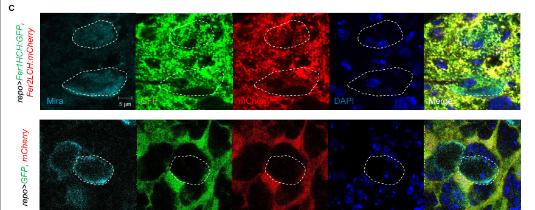

## Question

# Gene Research for Functional Annotation

## ⚠️ CRITICAL: Gene/Protein Identification Context

**BEFORE YOU BEGIN RESEARCH:** You MUST verify you are researching the CORRECT gene/protein. Gene symbols can be ambiguous, especially for less well-characterized genes from non-model organisms.

### Target Gene/Protein Identity (from UniProt):
- **UniProt Accession:** Q7KRU8
- **Protein Description:** RecName: Full=Ferritin heavy chain {ECO:0000303|PubMed:9266686}; EC=1.16.3.1 {ECO:0000255|RuleBase:RU361145}; Flags: Precursor;
- **Gene Information:** Name=Fer1HCH {ECO:0000303|PubMed:10619605, ECO:0000312|FlyBase:FBgn0015222}; Synonyms=HCH {ECO:0000303|PubMed:10619605}; ORFNames=CG2216 {ECO:0000312|FlyBase:FBgn0015222};
- **Organism (full):** Drosophila melanogaster (Fruit fly).
- **Protein Family:** Belongs to the ferritin family.
- **Key Domains:** Ferritin. (IPR001519); Ferritin-like. (IPR012347); Ferritin-like_diiron. (IPR009040); Ferritin-like_SF. (IPR009078); Ferritin_DPS_dom. (IPR008331)

### MANDATORY VERIFICATION STEPS:

1. **Check if the gene symbol "Fer1HCH" matches the protein description above**
2. **Verify the organism is correct:** Drosophila melanogaster (Fruit fly).
3. **Check if protein family/domains align with what you find in literature**
4. **If you find literature for a DIFFERENT gene with the same or similar symbol, STOP**

### If Gene Symbol is Ambiguous or You Cannot Find Relevant Literature:

**DO NOT PROCEED WITH RESEARCH ON A DIFFERENT GENE.** Instead:
- State clearly: "The gene symbol 'Fer1HCH' is ambiguous or literature is limited for this specific protein"
- Explain what you found (e.g., "Found extensive literature on a different gene with the same symbol in a different organism")
- Describe the protein based ONLY on the UniProt information provided above
- Suggest that the protein function can be inferred from domain/family information

### Research Target:

Please provide a comprehensive research report on the gene **Fer1HCH** (gene ID: Fer1HCH, UniProt: Q7KRU8) in DROME.

The research report should be a detailed narrative explaining the function, biological processes, and localization of the gene product. Citations should be given for all claims.

You should prioritize authoritative reviews and primary scientific literature when conducting research. You can supplement
this with annotations you find in gene/protein databases, but these can be outdated or inaccurate.

We are specifically interested in the primary function of the gene - for enzymes, what reaction is catalyzed, and what is the substrate specificity? For transporters, what is the substrate? For structural proteins or adapters, what is the broader structural role? For signaling molecules, what is the role in the pathway.

We are interested in where in or outside the cell the gene product carries out its function.

We are also interested in the signaling or biochemical pathways in which the gene functions. We are less interested in broad pleiotropic effects, except where these elucidate the precise role.

Include evidence where possible. We are interested in both experimental evidence as well as inference from structure, evolution, or bioinformatic analysis. Precise studies should be prioritized over high-throughput, where available.

## Output

Question: You are an expert researcher providing comprehensive, well-cited information.

Provide detailed information focusing on:
1. Key concepts and definitions with current understanding
2. Recent developments and latest research (prioritize 2023-2024 sources)
3. Current applications and real-world implementations
4. Expert opinions and analysis from authoritative sources
5. Relevant statistics and data from recent studies

Format as a comprehensive research report with proper citations. Include URLs and publication dates where available.
Always prioritize recent, authoritative sources and provide specific citations for all major claims.

# Gene Research for Functional Annotation

## ⚠️ CRITICAL: Gene/Protein Identification Context

**BEFORE YOU BEGIN RESEARCH:** You MUST verify you are researching the CORRECT gene/protein. Gene symbols can be ambiguous, especially for less well-characterized genes from non-model organisms.

### Target Gene/Protein Identity (from UniProt):
- **UniProt Accession:** Q7KRU8
- **Protein Description:** RecName: Full=Ferritin heavy chain {ECO:0000303|PubMed:9266686}; EC=1.16.3.1 {ECO:0000255|RuleBase:RU361145}; Flags: Precursor;
- **Gene Information:** Name=Fer1HCH {ECO:0000303|PubMed:10619605, ECO:0000312|FlyBase:FBgn0015222}; Synonyms=HCH {ECO:0000303|PubMed:10619605}; ORFNames=CG2216 {ECO:0000312|FlyBase:FBgn0015222};
- **Organism (full):** Drosophila melanogaster (Fruit fly).
- **Protein Family:** Belongs to the ferritin family.
- **Key Domains:** Ferritin. (IPR001519); Ferritin-like. (IPR012347); Ferritin-like_diiron. (IPR009040); Ferritin-like_SF. (IPR009078); Ferritin_DPS_dom. (IPR008331)

### MANDATORY VERIFICATION STEPS:

1. **Check if the gene symbol "Fer1HCH" matches the protein description above**
2. **Verify the organism is correct:** Drosophila melanogaster (Fruit fly).
3. **Check if protein family/domains align with what you find in literature**
4. **If you find literature for a DIFFERENT gene with the same or similar symbol, STOP**

### If Gene Symbol is Ambiguous or You Cannot Find Relevant Literature:

**DO NOT PROCEED WITH RESEARCH ON A DIFFERENT GENE.** Instead:
- State clearly: "The gene symbol 'Fer1HCH' is ambiguous or literature is limited for this specific protein"
- Explain what you found (e.g., "Found extensive literature on a different gene with the same symbol in a different organism")
- Describe the protein based ONLY on the UniProt information provided above
- Suggest that the protein function can be inferred from domain/family information

### Research Target:

Please provide a comprehensive research report on the gene **Fer1HCH** (gene ID: Fer1HCH, UniProt: Q7KRU8) in DROME.

The research report should be a detailed narrative explaining the function, biological processes, and localization of the gene product. Citations should be given for all claims.

You should prioritize authoritative reviews and primary scientific literature when conducting research. You can supplement
this with annotations you find in gene/protein databases, but these can be outdated or inaccurate.

We are specifically interested in the primary function of the gene - for enzymes, what reaction is catalyzed, and what is the substrate specificity? For transporters, what is the substrate? For structural proteins or adapters, what is the broader structural role? For signaling molecules, what is the role in the pathway.

We are interested in where in or outside the cell the gene product carries out its function.

We are also interested in the signaling or biochemical pathways in which the gene functions. We are less interested in broad pleiotropic effects, except where these elucidate the precise role.

Include evidence where possible. We are interested in both experimental evidence as well as inference from structure, evolution, or bioinformatic analysis. Precise studies should be prioritized over high-throughput, where available.

# Functional annotation of *Drosophila melanogaster* Fer1HCH

## Target verification and principal function

**Fer1HCH is the correct target:** the supplied UniProt accession **Q7KRU8** describes the fruit-fly ferritin heavy-chain precursor, and independent literature identifies *D. melanogaster* **Fer1HCH as CG2216**, distinct from its ferritin light-chain partner **Fer2LCH/CG1469**. Its annotated ferritin and ferritin-like diiron domains agree with the experimentally established heavy-chain ferroxidase role. The Q7KRU8 accession-to-protein assignment comes from the UniProt information supplied in the question; the retrieved papers independently confirm the gene, organism, and protein identity, but do not print that accession. (tang2013ironhomeostasisin pages 2-4, missirlis2007homeostaticmechanismsfor pages 1-2)

**Primary biochemical function:** Fer1HCH provides the ferroxidase center of insect ferritin. Its relevant metal substrate is soluble **ferrous iron, Fe²⁺**, which it oxidizes to **ferric iron, Fe³⁺** for sequestration as an oxygen- and phosphate-associated, ferrihydrite-like mineral inside the ferritin cage. Fer2LCH contributes interior sites that facilitate mineral nucleation; it is not interchangeable with the catalytic heavy chain. This is iron *storage and packaging* chemistry, not reduction of dietary Fe³⁺ for uptake, nor the separate ferroxidase activity of multicopper oxidase MCO1. Although molecular oxygen participates in ferritin ferroxidation generally, the retrieved fly experiments do not establish a Fer1HCH-specific oxygen-product stoichiometry; an exact equation yielding H₂O₂ or H₂O should therefore not be presented as measured for this protein. (missirlis2007homeostaticmechanismsfor pages 1-2, gonzalezmorales2015ferritinisrequired pages 1-2, rosasarellano2016ferritinassemblyin pages 1-3, mandilaras2013ironabsorptionin pages 6-9, gorman2023ironhomeostasisin pages 6-7)

The strongest causal test is genetic: Missirlis and colleagues changed the putative iron-coordinating residues **E87K and H90G** to make ferroxidase-deficient Fer1HCH*. Wild-type Fer1HCH restored viability in Fer1HCH-deficient flies, whereas the mutant transgene did not rescue the tested lethality. Loss of either ferritin-subunit gene causes embryonic or first-instar lethality, and expressing one chain does not substitute for loss of the other. These experiments establish the importance of the heavy-chain catalytic center *in vivo*, while not providing purified-enzyme kinetic constants or demonstrating specificity against a panel of alternative metals. (missirlis2007homeostaticmechanismsfor pages 1-2, missirlis2007homeostaticmechanismsfor pages 5-6, missirlis2007homeostaticmechanismsfor pages 3-4)

The following table separates well-supported molecular functions from more recent, partly inferential transport mechanisms.

| Aspect | Supported conclusion | Strongest experiment/review and evidence grade |
|---|---|---|
| Target identity | **Fer1HCH** is the *Drosophila melanogaster* ferritin heavy-chain homolog encoded by **CG2216**; **Q7KRU8** is the UniProt accession supplied for this target. It is distinct from the light-chain homolog **Fer2LCH/CG1469**. | Independent literature maps Fer1HCH to CG2216 and identifies it as the H-chain partner of Fer2LCH. **High confidence for gene identity; Q7KRU8 linkage derives from the supplied UniProt record.** (tang2013ironhomeostasisin pages 2-4) |
| Primary biochemical function | Fer1HCH supplies the ferritin **diiron ferroxidase center**, oxidizing soluble **Fe²⁺ to Fe³⁺** so iron can be mineralized inside the ferritin cage. The exact oxygen-derived product has not been established specifically for fly Fer1HCH in the cited experiments. | The ferroxidase-deficient **E87K/H90G** Fer1HCH construct failed to rescue Fer1HCH lethality, whereas wild-type Fer1HCH rescued it. **High-confidence genetic evidence for catalytic necessity.** (missirlis2007homeostaticmechanismsfor pages 1-2, missirlis2007homeostaticmechanismsfor pages 3-4, missirlis2007homeostaticmechanismsfor pages 5-6) |
| Ferritin architecture | Native insect ferritin is a **24-subunit heteropolymer containing 12 Fer1HCH and 12 Fer2LCH subunits**. Fer1HCH performs Fe²⁺ oxidation, while Fer2LCH promotes nucleation/mineralization of the ferric core; H–L contacts are stabilized by disulfide bonding. | Biochemical assembly studies and synthesis of prior evidence support a 12H:12L, disulfide-stabilized cage and iron-loaded mixed complexes. **High confidence.** (rosasarellano2016ferritinassemblyin pages 1-3, mandilaras2013ironabsorptionin pages 6-9) |
| Substrate specificity and product | The demonstrated metal substrate is **ferrous iron (Fe²⁺)**; the functional product is oxidized **ferric iron (Fe³⁺)** incorporated into a ferrihydrite-like mineral core. Fer1HCH is not the intestinal ferric reductase and should not be conflated with multicopper oxidases such as MCO1. | Catalytic-mutant genetics plus ferritin iron-loading assays and authoritative review. **High confidence for Fe²⁺ oxidation; moderate confidence for detailed mineral chemistry in vivo.** (missirlis2007homeostaticmechanismsfor pages 1-2, mandilaras2013ironabsorptionin pages 6-9, gorman2023ironhomeostasisin pages 6-7) |
| Cellular localization | Fer1HCH has an N-terminal signal peptide and enters the **ER**, where insect ferritin assembles; iron-loaded complexes traffic through the **Golgi and vesicular endomembrane system** and can be secreted into **hemolymph**. In Diptera, the principal pool is secretory-pathway associated rather than a generic cytosolic ferritin pool. | Signal-peptide targeting, tagged-protein imaging, secretory-pathway disruption, and reviews converge on this localization. **High confidence**, with fluorescent-tag caveats. (missirlis2007homeostaticmechanismsfor pages 4-5, gonzalezmorales2015ferritinisrequired pages 13-15, gorman2023ironhomeostasisin pages 6-7, tang2013ironhomeostasisin pages 2-4) |
| Systemic biological role | Fer1HCH-dependent ferritin couples **dietary iron storage, detoxification, and inter-tissue delivery**. Midgut ferritin depletion traps iron in the intestine while causing systemic deficiency, supporting a transport role beyond passive storage. | Tissue-specific RNAi and radioactive/Prussian-blue iron studies. **High-confidence functional evidence, although exact flux rates remain unresolved.** (mandilaras2013ironabsorptionin pages 6-9) |
| Zip13 pathway | **Zip13/Zip99C** supplies iron to the ER/Golgi secretory pathway and is required for normal ferritin iron loading and systemic distribution. It acts upstream of the Fer1HCH–Fer2LCH cage rather than serving as a ferritin subunit. | ER/Golgi localization, knockdown effects on compartmental and ferritin-bound iron, and enterocyte assembly experiments. **High confidence.** (gorman2023ironhomeostasisin pages 6-7, rosasarellano2016ferritinassemblyin pages 7-10) |
| Translational regulation | Fer1HCH transcripts contain a **5′-UTR iron-responsive element (IRE)** that supports IRP-dependent post-transcriptional regulation; Fer2LCH transcripts lack this IRE. Some Fer1HCH transcript forms complicate simple reporter interpretation. | Comparative IRE analysis and endogenous/transgenic genetic studies. **High confidence.** (missirlis2007homeostaticmechanismsfor pages 3-4, missirlis2007homeostaticmechanismsfor pages 2-3) |
| Glia-to-neuroblast delivery | In the larval CNS, glia are the major ferritin-producing cells, and glially expressed Fer1HCH/Fer2LCH reporters appear in neuroblasts. Blocking glial dynamin-dependent vesicular traffic retains Fer1HCH in glia and reduces neuroblast signal, supporting vesicle-mediated transfer needed for iron-dependent self-renewal. | Cell-specific RNAi/rescue, tagged-protein localization, and Shibire-dependent trafficking experiments published in 2024. **Moderate-to-high confidence for ferritin-protein transfer; direct iron-atom tracing was not achieved.** (ma2024glialferritinmaintains pages 5-6, ma2024glialferritinmaintains pages 16-18, ma2024glialferritinmaintains media 09d7ef92) |
| Evi5 and prothoracic-gland iron | Evi5 physically associates with Fer1HCH and is implicated in ferritin-linked iron delivery to the prothoracic gland. Rescue by intact **equine holo-ferritin** was stronger than by apo- or denatured ferritin, but uptake of fly GFP–Fer1HCH into the gland was not directly demonstrated. | Evi5–Fer1HCH interactomes/co-immunoprecipitation and heterologous holo-ferritin injection provide **moderate, indirect evidence** for ferritin uptake and iron delivery rather than proof of direct Evi5-mediated Fe transport. (soltani2024drosophilaevi5is pages 11-13, soltani2024drosophilaevi5is pages 13-15, soltani2024drosophilaevi5is pages 1-2) |

*Table: Compact annotation of Fer1HCH identity, catalytic function, assembly, localization, regulation, and recently characterized transport roles. Evidence grades distinguish direct genetic and biochemical findings from newer mechanistic models that remain partly indirect.*

## Molecular assembly and site of action

Fly ferritin is predominantly a **24-subunit cage containing 12 Fer1HCH and 12 Fer2LCH chains**; H–L interactions are additionally stabilized by disulfide bonds. Both precursors have signal peptides directing them into the **endoplasmic reticulum (ER)**. Ferritin assembles within the secretory endomembrane system, accumulates and loads iron in **Golgi-associated and other membrane-bound compartments**, and can be secreted as iron-loaded ferritin into the **hemolymph**. Thus, its sites of action encompass the lumen of the ER/Golgi/secretory vesicles for cellular iron sequestration and the extracellular hemolymph for potential inter-tissue iron distribution; it should **not** be annotated simply as a conventional cytosolic mammalian-type ferritin. (gonzalezmorales2015ferritinisrequired pages 1-2, rosasarellano2016ferritinassemblyin pages 1-3, gorman2023ironhomeostasisin pages 6-7, tang2013ironhomeostasisin pages 2-4)

The **midgut** is a major site of ferritin expression and iron storage. Dietary iron induces ferritin in anterior-midgut enterocytes, while ferritin is also associated with the specialized midgut iron region. In a 2016 enterocyte study, **1 mM ferric ammonium citrate** induced coordinated expression of the two chains compared with an iron-limited diet containing **200 µM bathophenanthroline sulfonate**. Fluorescent-subunit and biochemical experiments indicate that co-ordinated expression and assembly determine which ferritin cages become iron loaded. These are experimental exposure concentrations, **not** measured intracellular iron concentrations or physiological iron-flux rates. Moreover, GFP/mCherry tags and expression timing can impair incorporation or iron loading, so tagged-protein signal alone should not be equated with fully functional native ferritin. (rosasarellano2016ferritinassemblyin pages 3-5, rosasarellano2016ferritinassemblyin pages 5-7, rosasarellano2016ferritinassemblyin pages 7-10)

Other documented sites include hemolymph and, depending on developmental stage, neural and immune-associated tissues. Secretory trafficking matters: disrupting the COPII component **Sec23** alters the distribution of Fer1HCH-tagged ferritin between embryonic intestine and hemocytes. These results support an endomembrane-dependent distribution mechanism, although altered fluorescence does not, by itself, prove the route followed by each iron atom. (gonzalezmorales2015ferritinisrequired pages 13-15, gonzalezmorales2015ferritinisrequired pages 1-2)

## Biological pathway and regulatory context

Fer1HCH functions in an **iron-homeostasis pathway** that couples dietary acquisition to safe storage and redistribution. Iron delivered into enterocytes ultimately reaches the secretory compartments containing ferritin; the ER/Golgi-associated iron transporter **Zip13/Zip99C** supports ferritin iron loading. Once packaged, iron can remain in intracellular ferritin or circulate in secreted ferritin. Notably, midgut-specific ferritin depletion causes iron to accumulate in the intestine **while the rest of the animal becomes iron deficient**. This supports a role in making absorbed iron available systemically, not just immobilizing excess iron, but does not specify a unique molecular route for exporting the assembled cage. (gorman2023ironhomeostasisin pages 6-7, mandilaras2013ironabsorptionin pages 6-9)

Iron availability also regulates ferritin production. **Fer1HCH transcripts can carry a 5′-untranslated-region iron-responsive element (IRE)** subject to iron-regulatory-protein-dependent translational control; Fer2LCH transcripts lack that IRE. Expression and stability of the two subunits are interdependent: reducing either chain lowers abundance of both, and increasing only one does not necessarily increase total assembled ferritin. Distinct Fer1HCH transcript forms, some without the IRE, limit overly simple interpretations of a single reporter as a readout of all iron-dependent regulation. (missirlis2007homeostaticmechanismsfor pages 3-4, missirlis2007homeostaticmechanismsfor pages 2-3, missirlis2007homeostaticmechanismsfor pages 5-6)

Sequestering redox-active iron also protects cells from damage. In developing wing discs, Fer1HCH depletion produces stronger growth and survival defects than Fer2LCH depletion and is accompanied by reactive-oxygen-species accumulation and mitochondrial damage; reducing oxidative stress alleviates some defects. Association with **Hippo/Yorkie** growth-control phenotypes is genetic and physiological, rather than evidence that Fer1HCH directly binds a Hippo signaling protein. In other contexts, iron *delivery* rather than protection from oxidation appears to dominate, underscoring that these phenotypes reflect the same primary iron-handling function expressed in different tissues. (mumbauer2019ferritinheavychain pages 4-5, mumbauer2019ferritinheavychain pages 10-11, ma2024glialferritinmaintains pages 9-10)

## Recent research: 2023–2024

**Authoritative synthesis, 2023.** Gorman’s review places insect ferritin assembly and mineralization within the ER/Golgi pathway and distinguishes intracellular storage from hemolymph transport. It identifies how assembled ferritin releases iron within recipient cells, and details of ferritin assembly and routing, as outstanding questions. This is the appropriate framework for interpreting emerging tissue-specific transport models rather than presuming that fly ferritin works exactly like mammalian cytosolic ferritin. (gorman2023ironhomeostasisin pages 6-7)

**Glial delivery to neural stem cells, 2024.** Ma and colleagues found that ferritin production in the larval brain is concentrated in glia, whereas glia-expressed **Fer1HCH::GFP and Fer2LCH::mCherry** can be detected in neuroblasts. Blocking glial Shibire/dynamin-dependent vesicle traffic retains the Fer1HCH reporter in glia and diminishes its neuroblast signal; the relevant localization and trafficking observations are shown in their **Figure 2C–E**. Glial knockdown of either ferritin chain reduces neuroblast maintenance and proliferation, and RNAi-resistant ferritin constructs rescue those phenotypes. Zip13 perturbation and decreased aconitase activity link the phenotype to iron-dependent metabolism. The findings support **glia-to-neuroblast ferritin-protein transfer**, but the authors could not directly map iron atoms in the brain, so delivery of iron by the observed fluorescent cages remains a strongly supported interpretation rather than directly imaged iron flux. (ma2024glialferritinmaintains pages 5-6, ma2024glialferritinmaintains media 09d7ef92, ma2024glialferritinmaintains pages 3-5, ma2024glialferritinmaintains pages 6-8, ma2024glialferritinmaintains pages 9-10, ma2024glialferritinmaintains pages 16-18)

**Prothoracic-gland trafficking, 2024.** Soltani and colleagues identified an association between **Evi5 and Fer1HCH**, including interaction assays, in a study of endosomal iron trafficking. Injection of **iron-loaded equine ferritin**, rather than purified native fly ferritin, alleviated developmental defects more effectively than apo-ferritin or denatured holo-ferritin. In the **Fer1HCH-depleted prothoracic-gland control**, holo-ferritin injection allowed approximately **50%** of larvae to reach the third instar, **20%** to pupate, and **10%** to become adults, versus no adults without effective rescue. Intact holo-ferritin also accelerated development in an Evi5-deficient setting. Crucially, the authors **did not directly demonstrate uptake of fly GFP–Fer1HCH into the gland** in their co-culture assay; Evi5-dependent ferritin uptake and intracellular iron release consequently remain mechanistic models, not proven direct transport activities of Fer1HCH itself. (soltani2024drosophilaevi5is pages 11-13, soltani2024drosophilaevi5is pages 13-15, soltani2024drosophilaevi5is pages 1-2)

## Assessment and sources

**Best-supported annotation:** Fer1HCH is the essential, secretory-pathway **ferritin heavy-chain ferroxidase** that converts Fe²⁺ into cage-stored Fe³⁺ in partnership with Fer2LCH, enabling iron sequestration, protection from labile iron, and—through secreted ferritin—iron distribution. The exact biochemical route by which recipient cells release iron from native fly ferritin, precise in-vivo iron-flux rates, and the oxygen-product stoichiometry of purified Fer1HCH remain unresolved by the cited studies. There is no basis here for assigning Fer1HCH a separate plasma-membrane transporter or canonical signaling-receptor activity. (missirlis2007homeostaticmechanismsfor pages 1-2, rosasarellano2016ferritinassemblyin pages 1-3, gorman2023ironhomeostasisin pages 6-7, soltani2024drosophilaevi5is pages 13-15)

**Selected primary literature and review, with publication dates and URLs:**

- Missirlis *et al.*, **September 2007**, *Genetics*, “Homeostatic Mechanisms for Iron Storage Revealed by Genetic Manipulations and Live Imaging of Drosophila Ferritin.” https://doi.org/10.1534/genetics.107.075150. Catalytic-site mutants, genetic rescue, iron loading and regulation. (missirlis2007homeostaticmechanismsfor pages 1-2, missirlis2007homeostaticmechanismsfor pages 5-6)
- Mandilaras *et al.*, **May 2013**, *Nutrients*, “Iron Absorption in *Drosophila melanogaster*.” https://doi.org/10.3390/nu5051622. Interpretation of ferritin in dietary iron absorption and systemic distribution. (mandilaras2013ironabsorptionin pages 6-9)
- González-Morales *et al.*, **July 2015**, *PLOS ONE*, “Ferritin Is Required in Multiple Tissues during *Drosophila melanogaster* Development.” https://doi.org/10.1371/journal.pone.0133499. Developmental genetics and secretory-pathway evidence. (gonzalezmorales2015ferritinisrequired pages 1-2, gonzalezmorales2015ferritinisrequired pages 13-15)
- Rosas-Arellano *et al.*, **2016**, *International Journal of Molecular Sciences*, “Ferritin Assembly in Enterocytes of *Drosophila melanogaster*.” https://doi.org/10.3390/ijms17020027. H/L assembly, intestinal imaging and iron loading. (rosasarellano2016ferritinassemblyin pages 1-3, rosasarellano2016ferritinassemblyin pages 7-10)
- Mumbauer *et al.*, **September 2019**, *PLOS Genetics*, “Ferritin heavy chain protects the developing wing from reactive oxygen species and ferroptosis.” https://doi.org/10.1371/journal.pgen.1008396. Wing-specific genetic and oxidative-stress phenotypes. (mumbauer2019ferritinheavychain pages 4-5, mumbauer2019ferritinheavychain pages 10-11)
- Gorman, **2023**, *Annual Review of Entomology*, “Iron Homeostasis in Insects.” https://doi.org/10.1146/annurev-ento-040622-092836. Recent authoritative pathway synthesis and uncertainties. (gorman2023ironhomeostasisin pages 6-7)
- Soltani *et al.*, **May 2024**, *Nature Communications*, “Drosophila Evi5 is a critical regulator of intracellular iron transport via transferrin and ferritin interactions.” https://doi.org/10.1038/s41467-024-48165-9. Ferritin interaction and injection-based functional tests, with uptake limitations. (soltani2024drosophilaevi5is pages 11-13, soltani2024drosophilaevi5is pages 13-15)
- Ma *et al.*, **September 2024**, *eLife*, “Glial ferritin maintains neural stem cells via transporting iron required for self-renewal in Drosophila.” https://doi.org/10.7554/elife.93604. Cell-specific transfer, trafficking perturbation and neural-stem-cell function. (ma2024glialferritinmaintains pages 5-6, ma2024glialferritinmaintains pages 16-18)

References

1. (tang2013ironhomeostasisin pages 2-4): Xiaona Tang and Bing Zhou. Iron homeostasis in insects: insights from drosophila studies. IUBMB Life, 65:863-872, Oct 2013. URL: https://doi.org/10.1002/iub.1211, doi:10.1002/iub.1211. This article has 115 citations and is from a peer-reviewed journal.

2. (missirlis2007homeostaticmechanismsfor pages 1-2): Fanis Missirlis, Stylianos Kosmidis, Tom Brody, Manos Mavrakis, Sara Holmberg, Ward F Odenwald, Efthimios M C Skoulakis, and Tracey A Rouault. Homeostatic mechanisms for iron storage revealed by genetic manipulations and live imaging of drosophila ferritin. Genetics, 177:100-89, Sep 2007. URL: https://doi.org/10.1534/genetics.107.075150, doi:10.1534/genetics.107.075150. This article has 158 citations and is from a domain leading peer-reviewed journal.

3. (gonzalezmorales2015ferritinisrequired pages 1-2): Nicanor González-Morales, Miguel Ángel Mendoza-Ortíz, Liisa M. Blowes, Fanis Missirlis, and Juan R. Riesgo-Escovar. Ferritin is required in multiple tissues during drosophila melanogaster development. PLoS ONE, 10:e0133499, Jul 2015. URL: https://doi.org/10.1371/journal.pone.0133499, doi:10.1371/journal.pone.0133499. This article has 66 citations and is from a peer-reviewed journal.

4. (rosasarellano2016ferritinassemblyin pages 1-3): Abraham Rosas-Arellano, Johana Vásquez-Procopio, Alexis Gambis, Liisa Blowes, Hermann Steller, Bertrand Mollereau, and Fanis Missirlis. Ferritin assembly in enterocytes of drosophila melanogaster. International Journal of Molecular Sciences, 17:27, Feb 2016. URL: https://doi.org/10.3390/ijms17020027, doi:10.3390/ijms17020027. This article has 28 citations.

5. (mandilaras2013ironabsorptionin pages 6-9): Konstantinos Mandilaras, Tharse Pathmanathan, and Fanis Missirlis. Iron absorption in drosophila melanogaster. Nutrients, 5:1622-1647, May 2013. URL: https://doi.org/10.3390/nu5051622, doi:10.3390/nu5051622. This article has 130 citations.

6. (gorman2023ironhomeostasisin pages 6-7): Maureen J. Gorman. Iron homeostasis in insects. Annual Review of Entomology, 68:51-67, Jan 2023. URL: https://doi.org/10.1146/annurev-ento-040622-092836, doi:10.1146/annurev-ento-040622-092836. This article has 62 citations and is from a domain leading peer-reviewed journal.

7. (missirlis2007homeostaticmechanismsfor pages 5-6): Fanis Missirlis, Stylianos Kosmidis, Tom Brody, Manos Mavrakis, Sara Holmberg, Ward F Odenwald, Efthimios M C Skoulakis, and Tracey A Rouault. Homeostatic mechanisms for iron storage revealed by genetic manipulations and live imaging of drosophila ferritin. Genetics, 177:100-89, Sep 2007. URL: https://doi.org/10.1534/genetics.107.075150, doi:10.1534/genetics.107.075150. This article has 158 citations and is from a domain leading peer-reviewed journal.

8. (missirlis2007homeostaticmechanismsfor pages 3-4): Fanis Missirlis, Stylianos Kosmidis, Tom Brody, Manos Mavrakis, Sara Holmberg, Ward F Odenwald, Efthimios M C Skoulakis, and Tracey A Rouault. Homeostatic mechanisms for iron storage revealed by genetic manipulations and live imaging of drosophila ferritin. Genetics, 177:100-89, Sep 2007. URL: https://doi.org/10.1534/genetics.107.075150, doi:10.1534/genetics.107.075150. This article has 158 citations and is from a domain leading peer-reviewed journal.

9. (missirlis2007homeostaticmechanismsfor pages 4-5): Fanis Missirlis, Stylianos Kosmidis, Tom Brody, Manos Mavrakis, Sara Holmberg, Ward F Odenwald, Efthimios M C Skoulakis, and Tracey A Rouault. Homeostatic mechanisms for iron storage revealed by genetic manipulations and live imaging of drosophila ferritin. Genetics, 177:100-89, Sep 2007. URL: https://doi.org/10.1534/genetics.107.075150, doi:10.1534/genetics.107.075150. This article has 158 citations and is from a domain leading peer-reviewed journal.

10. (gonzalezmorales2015ferritinisrequired pages 13-15): Nicanor González-Morales, Miguel Ángel Mendoza-Ortíz, Liisa M. Blowes, Fanis Missirlis, and Juan R. Riesgo-Escovar. Ferritin is required in multiple tissues during drosophila melanogaster development. PLoS ONE, 10:e0133499, Jul 2015. URL: https://doi.org/10.1371/journal.pone.0133499, doi:10.1371/journal.pone.0133499. This article has 66 citations and is from a peer-reviewed journal.

11. (rosasarellano2016ferritinassemblyin pages 7-10): Abraham Rosas-Arellano, Johana Vásquez-Procopio, Alexis Gambis, Liisa Blowes, Hermann Steller, Bertrand Mollereau, and Fanis Missirlis. Ferritin assembly in enterocytes of drosophila melanogaster. International Journal of Molecular Sciences, 17:27, Feb 2016. URL: https://doi.org/10.3390/ijms17020027, doi:10.3390/ijms17020027. This article has 28 citations.

12. (missirlis2007homeostaticmechanismsfor pages 2-3): Fanis Missirlis, Stylianos Kosmidis, Tom Brody, Manos Mavrakis, Sara Holmberg, Ward F Odenwald, Efthimios M C Skoulakis, and Tracey A Rouault. Homeostatic mechanisms for iron storage revealed by genetic manipulations and live imaging of drosophila ferritin. Genetics, 177:100-89, Sep 2007. URL: https://doi.org/10.1534/genetics.107.075150, doi:10.1534/genetics.107.075150. This article has 158 citations and is from a domain leading peer-reviewed journal.

13. (ma2024glialferritinmaintains pages 5-6): Zhixin Ma, Wenshu Wang, Xiaojing Yang, Menglong Rui, and Su Wang. Glial ferritin maintains neural stem cells via transporting iron required for self-renewal in drosophila. eLife, Sep 2024. URL: https://doi.org/10.7554/elife.93604, doi:10.7554/elife.93604. This article has 8 citations and is from a domain leading peer-reviewed journal.

14. (ma2024glialferritinmaintains pages 16-18): Zhixin Ma, Wenshu Wang, Xiaojing Yang, Menglong Rui, and Su Wang. Glial ferritin maintains neural stem cells via transporting iron required for self-renewal in drosophila. eLife, Sep 2024. URL: https://doi.org/10.7554/elife.93604, doi:10.7554/elife.93604. This article has 8 citations and is from a domain leading peer-reviewed journal.

15. (ma2024glialferritinmaintains media 09d7ef92): Zhixin Ma, Wenshu Wang, Xiaojing Yang, Menglong Rui, and Su Wang. Glial ferritin maintains neural stem cells via transporting iron required for self-renewal in drosophila. eLife, Sep 2024. URL: https://doi.org/10.7554/elife.93604, doi:10.7554/elife.93604. This article has 8 citations and is from a domain leading peer-reviewed journal.

16. (soltani2024drosophilaevi5is pages 11-13): Sattar Soltani, Samuel M. Webb, Thomas Kroll, and Kirst King-Jones. Drosophila evi5 is a critical regulator of intracellular iron transport via transferrin and ferritin interactions. Nature Communications, May 2024. URL: https://doi.org/10.1038/s41467-024-48165-9, doi:10.1038/s41467-024-48165-9. This article has 16 citations and is from a highest quality peer-reviewed journal.

17. (soltani2024drosophilaevi5is pages 13-15): Sattar Soltani, Samuel M. Webb, Thomas Kroll, and Kirst King-Jones. Drosophila evi5 is a critical regulator of intracellular iron transport via transferrin and ferritin interactions. Nature Communications, May 2024. URL: https://doi.org/10.1038/s41467-024-48165-9, doi:10.1038/s41467-024-48165-9. This article has 16 citations and is from a highest quality peer-reviewed journal.

18. (soltani2024drosophilaevi5is pages 1-2): Sattar Soltani, Samuel M. Webb, Thomas Kroll, and Kirst King-Jones. Drosophila evi5 is a critical regulator of intracellular iron transport via transferrin and ferritin interactions. Nature Communications, May 2024. URL: https://doi.org/10.1038/s41467-024-48165-9, doi:10.1038/s41467-024-48165-9. This article has 16 citations and is from a highest quality peer-reviewed journal.

19. (rosasarellano2016ferritinassemblyin pages 3-5): Abraham Rosas-Arellano, Johana Vásquez-Procopio, Alexis Gambis, Liisa Blowes, Hermann Steller, Bertrand Mollereau, and Fanis Missirlis. Ferritin assembly in enterocytes of drosophila melanogaster. International Journal of Molecular Sciences, 17:27, Feb 2016. URL: https://doi.org/10.3390/ijms17020027, doi:10.3390/ijms17020027. This article has 28 citations.

20. (rosasarellano2016ferritinassemblyin pages 5-7): Abraham Rosas-Arellano, Johana Vásquez-Procopio, Alexis Gambis, Liisa Blowes, Hermann Steller, Bertrand Mollereau, and Fanis Missirlis. Ferritin assembly in enterocytes of drosophila melanogaster. International Journal of Molecular Sciences, 17:27, Feb 2016. URL: https://doi.org/10.3390/ijms17020027, doi:10.3390/ijms17020027. This article has 28 citations.

21. (mumbauer2019ferritinheavychain pages 4-5): Simone Mumbauer, Justine Pascual, Irina Kolotuev, and Fisun Hamaratoglu. Ferritin heavy chain protects the developing wing from reactive oxygen species and ferroptosis. PLOS Genetics, 15:e1008396, Sep 2019. URL: https://doi.org/10.1371/journal.pgen.1008396, doi:10.1371/journal.pgen.1008396. This article has 99 citations and is from a domain leading peer-reviewed journal.

22. (mumbauer2019ferritinheavychain pages 10-11): Simone Mumbauer, Justine Pascual, Irina Kolotuev, and Fisun Hamaratoglu. Ferritin heavy chain protects the developing wing from reactive oxygen species and ferroptosis. PLOS Genetics, 15:e1008396, Sep 2019. URL: https://doi.org/10.1371/journal.pgen.1008396, doi:10.1371/journal.pgen.1008396. This article has 99 citations and is from a domain leading peer-reviewed journal.

23. (ma2024glialferritinmaintains pages 9-10): Zhixin Ma, Wenshu Wang, Xiaojing Yang, Menglong Rui, and Su Wang. Glial ferritin maintains neural stem cells via transporting iron required for self-renewal in drosophila. eLife, Sep 2024. URL: https://doi.org/10.7554/elife.93604, doi:10.7554/elife.93604. This article has 8 citations and is from a domain leading peer-reviewed journal.

24. (ma2024glialferritinmaintains pages 3-5): Zhixin Ma, Wenshu Wang, Xiaojing Yang, Menglong Rui, and Su Wang. Glial ferritin maintains neural stem cells via transporting iron required for self-renewal in drosophila. eLife, Sep 2024. URL: https://doi.org/10.7554/elife.93604, doi:10.7554/elife.93604. This article has 8 citations and is from a domain leading peer-reviewed journal.

25. (ma2024glialferritinmaintains pages 6-8): Zhixin Ma, Wenshu Wang, Xiaojing Yang, Menglong Rui, and Su Wang. Glial ferritin maintains neural stem cells via transporting iron required for self-renewal in drosophila. eLife, Sep 2024. URL: https://doi.org/10.7554/elife.93604, doi:10.7554/elife.93604. This article has 8 citations and is from a domain leading peer-reviewed journal.

## Artifacts

- [Edison artifact artifact-00](Fer1HCH-deep-research-falcon_artifacts/artifact-00.md)

## Citations

1. tang2013ironhomeostasisin pages 2-4
2. mandilaras2013ironabsorptionin pages 6-9
3. gorman2023ironhomeostasisin pages 6-7
4. missirlis2007homeostaticmechanismsfor pages 1-2
5. gonzalezmorales2015ferritinisrequired pages 1-2
6. rosasarellano2016ferritinassemblyin pages 1-3
7. missirlis2007homeostaticmechanismsfor pages 5-6
8. missirlis2007homeostaticmechanismsfor pages 3-4
9. missirlis2007homeostaticmechanismsfor pages 4-5
10. gonzalezmorales2015ferritinisrequired pages 13-15
11. rosasarellano2016ferritinassemblyin pages 7-10
12. missirlis2007homeostaticmechanismsfor pages 2-3
13. ma2024glialferritinmaintains pages 5-6
14. ma2024glialferritinmaintains pages 16-18
15. rosasarellano2016ferritinassemblyin pages 3-5
16. rosasarellano2016ferritinassemblyin pages 5-7
17. mumbauer2019ferritinheavychain pages 4-5
18. mumbauer2019ferritinheavychain pages 10-11
19. ma2024glialferritinmaintains pages 9-10
20. ma2024glialferritinmaintains pages 3-5
21. ma2024glialferritinmaintains pages 6-8
22. https://doi.org/10.1534/genetics.107.075150.
23. https://doi.org/10.3390/nu5051622.
24. https://doi.org/10.1371/journal.pone.0133499.
25. https://doi.org/10.3390/ijms17020027.
26. https://doi.org/10.1371/journal.pgen.1008396.
27. https://doi.org/10.1146/annurev-ento-040622-092836.
28. https://doi.org/10.1038/s41467-024-48165-9.
29. https://doi.org/10.7554/elife.93604.
30. https://doi.org/10.1002/iub.1211,
31. https://doi.org/10.1534/genetics.107.075150,
32. https://doi.org/10.1371/journal.pone.0133499,
33. https://doi.org/10.3390/ijms17020027,
34. https://doi.org/10.3390/nu5051622,
35. https://doi.org/10.1146/annurev-ento-040622-092836,
36. https://doi.org/10.7554/elife.93604,
37. https://doi.org/10.1038/s41467-024-48165-9,
38. https://doi.org/10.1371/journal.pgen.1008396,