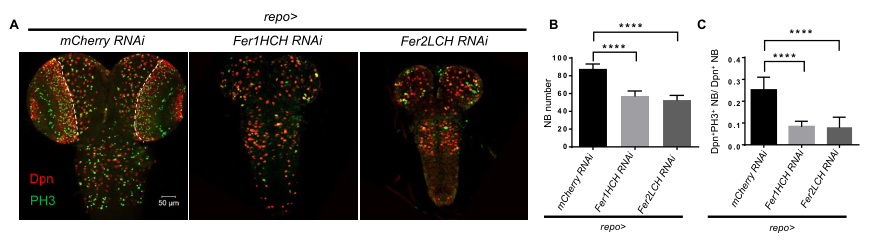

## Question

# Gene Research for Functional Annotation

## ⚠️ CRITICAL: Gene/Protein Identification Context

**BEFORE YOU BEGIN RESEARCH:** You MUST verify you are researching the CORRECT gene/protein. Gene symbols can be ambiguous, especially for less well-characterized genes from non-model organisms.

### Target Gene/Protein Identity (from UniProt):
- **UniProt Accession:** Q9VA83
- **Protein Description:** RecName: Full=Ferritin light chain {ECO:0000303|PubMed:11804801}; Flags: Precursor;
- **Gene Information:** Name=Fer2LCH {ECO:0000303|PubMed:11804801, ECO:0000312|FlyBase:FBgn0015221}; Synonyms=LCH {ECO:0000303|PubMed:11804801}; ORFNames=CG1469 {ECO:0000312|FlyBase:FBgn0015221};
- **Organism (full):** Drosophila melanogaster (Fruit fly).
- **Protein Family:** Belongs to the ferritin family.
- **Key Domains:** Ferritin. (IPR001519); Ferritin-like. (IPR012347); Ferritin-like_diiron. (IPR009040); Ferritin-like_SF. (IPR009078); Ferritin_DPS_dom. (IPR008331)

### MANDATORY VERIFICATION STEPS:

1. **Check if the gene symbol "Fer2LCH" matches the protein description above**
2. **Verify the organism is correct:** Drosophila melanogaster (Fruit fly).
3. **Check if protein family/domains align with what you find in literature**
4. **If you find literature for a DIFFERENT gene with the same or similar symbol, STOP**

### If Gene Symbol is Ambiguous or You Cannot Find Relevant Literature:

**DO NOT PROCEED WITH RESEARCH ON A DIFFERENT GENE.** Instead:
- State clearly: "The gene symbol 'Fer2LCH' is ambiguous or literature is limited for this specific protein"
- Explain what you found (e.g., "Found extensive literature on a different gene with the same symbol in a different organism")
- Describe the protein based ONLY on the UniProt information provided above
- Suggest that the protein function can be inferred from domain/family information

### Research Target:

Please provide a comprehensive research report on the gene **Fer2LCH** (gene ID: Fer2LCH, UniProt: Q9VA83) in DROME.

The research report should be a detailed narrative explaining the function, biological processes, and localization of the gene product. Citations should be given for all claims.

You should prioritize authoritative reviews and primary scientific literature when conducting research. You can supplement
this with annotations you find in gene/protein databases, but these can be outdated or inaccurate.

We are specifically interested in the primary function of the gene - for enzymes, what reaction is catalyzed, and what is the substrate specificity? For transporters, what is the substrate? For structural proteins or adapters, what is the broader structural role? For signaling molecules, what is the role in the pathway.

We are interested in where in or outside the cell the gene product carries out its function.

We are also interested in the signaling or biochemical pathways in which the gene functions. We are less interested in broad pleiotropic effects, except where these elucidate the precise role.

Include evidence where possible. We are interested in both experimental evidence as well as inference from structure, evolution, or bioinformatic analysis. Precise studies should be prioritized over high-throughput, where available.

## Output

Question: You are an expert researcher providing comprehensive, well-cited information.

Provide detailed information focusing on:
1. Key concepts and definitions with current understanding
2. Recent developments and latest research (prioritize 2023-2024 sources)
3. Current applications and real-world implementations
4. Expert opinions and analysis from authoritative sources
5. Relevant statistics and data from recent studies

Format as a comprehensive research report with proper citations. Include URLs and publication dates where available.
Always prioritize recent, authoritative sources and provide specific citations for all major claims.

# Gene Research for Functional Annotation

## ⚠️ CRITICAL: Gene/Protein Identification Context

**BEFORE YOU BEGIN RESEARCH:** You MUST verify you are researching the CORRECT gene/protein. Gene symbols can be ambiguous, especially for less well-characterized genes from non-model organisms.

### Target Gene/Protein Identity (from UniProt):
- **UniProt Accession:** Q9VA83
- **Protein Description:** RecName: Full=Ferritin light chain {ECO:0000303|PubMed:11804801}; Flags: Precursor;
- **Gene Information:** Name=Fer2LCH {ECO:0000303|PubMed:11804801, ECO:0000312|FlyBase:FBgn0015221}; Synonyms=LCH {ECO:0000303|PubMed:11804801}; ORFNames=CG1469 {ECO:0000312|FlyBase:FBgn0015221};
- **Organism (full):** Drosophila melanogaster (Fruit fly).
- **Protein Family:** Belongs to the ferritin family.
- **Key Domains:** Ferritin. (IPR001519); Ferritin-like. (IPR012347); Ferritin-like_diiron. (IPR009040); Ferritin-like_SF. (IPR009078); Ferritin_DPS_dom. (IPR008331)

### MANDATORY VERIFICATION STEPS:

1. **Check if the gene symbol "Fer2LCH" matches the protein description above**
2. **Verify the organism is correct:** Drosophila melanogaster (Fruit fly).
3. **Check if protein family/domains align with what you find in literature**
4. **If you find literature for a DIFFERENT gene with the same or similar symbol, STOP**

### If Gene Symbol is Ambiguous or You Cannot Find Relevant Literature:

**DO NOT PROCEED WITH RESEARCH ON A DIFFERENT GENE.** Instead:
- State clearly: "The gene symbol 'Fer2LCH' is ambiguous or literature is limited for this specific protein"
- Explain what you found (e.g., "Found extensive literature on a different gene with the same symbol in a different organism")
- Describe the protein based ONLY on the UniProt information provided above
- Suggest that the protein function can be inferred from domain/family information

### Research Target:

Please provide a comprehensive research report on the gene **Fer2LCH** (gene ID: Fer2LCH, UniProt: Q9VA83) in DROME.

The research report should be a detailed narrative explaining the function, biological processes, and localization of the gene product. Citations should be given for all claims.

You should prioritize authoritative reviews and primary scientific literature when conducting research. You can supplement
this with annotations you find in gene/protein databases, but these can be outdated or inaccurate.

We are specifically interested in the primary function of the gene - for enzymes, what reaction is catalyzed, and what is the substrate specificity? For transporters, what is the substrate? For structural proteins or adapters, what is the broader structural role? For signaling molecules, what is the role in the pathway.

We are interested in where in or outside the cell the gene product carries out its function.

We are also interested in the signaling or biochemical pathways in which the gene functions. We are less interested in broad pleiotropic effects, except where these elucidate the precise role.

Include evidence where possible. We are interested in both experimental evidence as well as inference from structure, evolution, or bioinformatic analysis. Precise studies should be prioritized over high-throughput, where available.

# Functional annotation of *Drosophila melanogaster* Fer2LCH

**Identity check.** The requested UniProt entry **Q9VA83** is identified in the supplied record as *Fer2LCH* (also *LCH* or *CG1469*), the **ferritin 2 light-chain homolog** of *D. melanogaster*. Fly studies independently identify Fer2LCH by that name as the light-chain partner of Fer1HCH in the major ferritin complex. Its ferritin-family domains and precursor designation are consistent with that assignment. **Fer1HCH** is the distinct heavy-chain partner; **Fer3HCH** is a distinct mitochondrial ferritin, not an alternative name for Fer2LCH. (rosasarellano2016ferritinassemblyin pages 1-3, gonzalezmorales2015ferritinisrequired pages 1-2)

## Primary molecular function

Fer2LCH is an **iron-storage and iron-transport nanocage subunit**, rather than a demonstrated independently acting enzyme or membrane transporter. Fly ferritin contains **24 subunits—approximately 12 Fer2LCH and 12 Fer1HCH—**arranged as a disulfide-stabilized heteropolymer. The heavy-chain subunit has the principal **ferroxidase center**, which converts soluble Fe²⁺ toward Fe³⁺ for sequestration; acidic residues facing the cage interior assign the light chain a **mineral-nucleation and stabilization role** in forming the ferric iron–oxygen/phosphate core. Thus **Fe²⁺ is the physiologically relevant input to the *assembled* ferritin iron-storage process**, but a separate Fer2LCH-catalyzed reaction or Fer2LCH-specific substrate preference has **not** been established. Estimates of thousands of ferric ions per cage describe ferritin capacity, not an experimentally established iron-binding stoichiometry for an isolated Fer2LCH molecule. (gonzalezmorales2015ferritinisrequired pages 1-2, rosasarellano2016ferritinassemblyin pages 1-3, missirlis2007homeostaticmechanismsfor pages 1-2, gorman2023ironhomeostasisin pages 6-7)

This division of labor has functional support. Disrupting either fly gene causes severe developmental loss, and expressing the corresponding intact chain rescues its own mutant but not the opposite-chain mutant. Conversely, a ferroxidase-inactive **Fer1HCH** cannot support normal ferritin function: heavy-chain oxidation and the light-chain contribution are both needed for the functional complex. These observations do **not** establish that Fer2LCH itself oxidizes iron. (missirlis2007homeostaticmechanismsfor pages 3-4, missirlis2007homeostaticmechanismsfor pages 2-3)

## Where Fer2LCH functions and how iron moves

Fer2LCH carries an **N-terminal secretory signal peptide**. It enters the **endoplasmic reticulum (ER)** and participates in ferritin assembly and iron loading along the **ER–Golgi/endosomal secretory pathway**, rather than acting chiefly as a freely cytosolic or mitochondrial ferritin. Iron-rich ferritin accumulates in specialized Golgi-associated compartments of intestinal cells; some ferritin is retained for intracellular storage, and some is exported into the **hemolymph** for delivery to other tissues. Fluorescently marked ferritin made in one fly tissue has also been observed in other tissues, consistent with intercellular trafficking. The exact vesicle in which every assembly and mineralization step occurs remains less certain than the overall secretory localization. (rosasarellano2016ferritinassemblyin pages 1-3, missirlis2007homeostaticmechanismsfor pages 9-10, gorman2023ironhomeostasisin pages 6-7, gonzalezmorales2015ferritinisrequired pages 10-13)

A useful biochemical sequence is: **dietary iron uptake → iron delivery into ER/Golgi compartments by Zip13 → assembly of Fer1HCH–Fer2LCH ferritin → oxidation and mineral sequestration → intracellular retention or secretion of iron-loaded ferritin**. Fly Zip13 perturbation impairs secretory-compartment iron availability and ferritin loading; this makes Zip13 an **upstream iron-supply transporter**, not a transport activity of Fer2LCH. The 2023 insect-iron review describes holo-ferritin secretion as a major insect route for cellular iron export, while emphasizing that the identity of recipient-cell ferritin receptors and the route by which ferritin releases its iron remain unresolved. Measurements of hemolymph ferritin concentrations in other insect species should **not** be presented as measurements in *Drosophila*. (gorman2023ironhomeostasisin pages 7-9, gorman2023ironhomeostasisin pages 6-7)

Fer2LCH-containing ferritin is prominent in the **larval midgut**, particularly iron-handling enterocytes, and is found in **hemolymph**, nervous-system-associated cells and other tissues. In the anterior midgut, the subunits could be seen in separate compartments **one hour** after iron feeding, whereas assembled, iron-loaded complexes were detected by **four hours**. An experimentally tagged Fer2LCH entered iron-loaded ferritin when its expression was coordinated with endogenous subunits; delayed Gal4-driven production incorporated inefficiently. These experiments demonstrate **regulated, time-sensitive assembly** and caution against treating every tagged-transgene localization result as native protein localization. Fer2LCH mRNA also **lacks the iron-responsive element** described for certain *Fer1HCH* transcripts; equivalent direct IRP–IRE translational regulation should therefore not be assigned to Fer2LCH. (rosasarellano2016ferritinassemblyin pages 1-3, missirlis2007homeostaticmechanismsfor pages 2-3, rosasarellano2016ferritinassemblyin pages 10-12, gonzalezmorales2015ferritinisrequired pages 1-2)

## Biological processes and experimental evidence

The most direct biological annotation is **iron homeostasis**: Fer2LCH enables ferritin-dependent sequestration of excess reactive iron, supports its redistribution between tissues, and helps maintain iron availability for iron-dependent metabolism. These functions explain both the protective effect of storing potentially damaging iron and the risk that excessive sequestration creates under iron scarcity. Co-overexpression of the ferritin chains improved survival under paraquat exposure, whereas ferritin overexpression was disadvantageous during iron deprivation and could be countered by dietary iron; these results concern the **assembled ferritin system**, not a standalone Fer2LCH antioxidant enzyme. (gonzalezmorales2015ferritinisrequired pages 1-2, missirlis2007homeostaticmechanismsfor pages 6-8)

Genetics establishes its developmental importance. A 2015 study reported **36% embryonic lethality** for its *Fer2LCH* mutant allele, versus **43%** for a *Fer1HCH* allele, **90%** for a deficiency removing both genes and **1%** in controls. The less-than-complete lethality of individual zygotic mutants should not be interpreted as dispensability: **maternally deposited ferritin** modifies early outcomes. In that study, feeding mothers **200 µM** iron chelator approximately doubled embryonic defects, and mutant germline-clone experiments exposed much stronger early requirements. The two subunit mutants produced similar cuticular and nervous-system phenotypes, consistent with failure of their shared ferritin complex rather than evidence for an independent developmental signaling pathway of Fer2LCH. (gonzalezmorales2015ferritinisrequired pages 3-5, gonzalezmorales2015ferritinisrequired pages 1-2, gonzalezmorales2015ferritinisrequired pages 2-3)

### Developments in 2023–2024

**Neural stem-cell niche, 2024.** Ma and colleagues found that knocking down *Fer2LCH* **in glia** reduced larval neuroblast number and proliferation; glial expression of an **RNAi-resistant Fer2LCH** restored both. Their Figure 1 directly documents these knockdown and rescue comparisons. Glia-expressed **Fer2LCH–mCherry** was detected in neuroblasts, while blocking glial vesicular trafficking reduced transfer of tagged ferritin, supporting a local **glia-to-neuroblast delivery route**. Loss of either ferritin subunit was associated with reduced aconitase activity and defects in iron-dependent Fe–S/respiratory metabolism and energy production; the investigators linked these changes to impaired stem-cell self-renewal. This is a fly **cell-niche iron-supply mechanism**, not evidence that Fer2LCH is itself a signaling ligand or an Fe–S enzyme. Importantly, the authors could **not directly visualize movement of iron in the brain**, so movement of tagged ferritin protein is stronger evidence than direct measurement of its iron cargo arriving in neuroblasts. The study also used glial ferritin depletion in fly brain-tumor models, a **research application**, not an established clinical use of Fer2LCH targeting. (ma2024glialferritinmaintains pages 5-6, ma2024glialferritinmaintains pages 16-18, ma2024glialferritinmaintains pages 10-11, ma2024glialferritinmaintains pages 9-10, ma2024glialferritinmaintains pages 15-16, ma2024glialferritinmaintains media 61ff3fe5)

**Steroidogenic iron supply, 2024.** Soltani and colleagues implicated ferritin alongside transferrin in iron delivery to the **prothoracic gland**, whose steroidogenesis requires iron. Their Evi5 trafficking experiments identified a physical association specifically with **Fer1HCH**; Evi5 depletion raised glandular Fer1HCH–GFP signal by approximately **fourfold**, whereas ferritin-chain transcripts rose only about **1.2–1.3-fold**. Injected **intact iron-loaded ferritin**, more effectively than apo-ferritin or denatured ferritin, alleviated developmental and iron-deficiency-associated phenotypes. This adds evidence for ferritin-cage trafficking but is **indirect for Fer2LCH individually**: the reported Evi5 interaction is with Fer1HCH, and the work did not directly establish ferritin uptake or its iron-release mechanism in the gland. (soltani2024drosophilaevi5is pages 11-13, soltani2024drosophilaevi5is pages 13-15, soltani2024drosophilaevi5is pages 10-11)

The following table separates subunit-specific experiments from conclusions about the complete ferritin cage. (rosasarellano2016ferritinassemblyin pages 1-3, ma2024glialferritinmaintains pages 5-6, soltani2024drosophilaevi5is pages 10-11)

| Evidence tier / study and date | Direct Fer2LCH-relevant observation | Functional inference / limitation |
|---|---|---|
| **Primary genetics** — Missirlis et al., *Genetics* (September 2007); [doi:10.1534/genetics.107.075150](https://doi.org/10.1534/genetics.107.075150) | Null disruption of either **Fer2LCH** or **Fer1HCH** caused embryonic/early-larval lethality. Ubiquitous Fer2LCH restored viability specifically to Fer2LCH mutants, while Fer1HCH rescued Fer1HCH mutants; a ferroxidase-inactive **Fer1HCH** transgene did not support normal ferritin function. (missirlis2007homeostaticmechanismsfor pages 3-4) | Establishes nonredundant, chain-specific requirements and dependence of the assembled ferritin on heavy-chain ferroxidase activity. It does **not** demonstrate ferroxidase catalysis by Fer2LCH; the light chain is instead assigned a mineral-nucleation role. (missirlis2007homeostaticmechanismsfor pages 1-2) |
| **Primary developmental genetics** — González-Morales et al., *PLOS ONE* (20 July 2015); [doi:10.1371/journal.pone.0133499](https://doi.org/10.1371/journal.pone.0133499) | Reported embryonic lethality was **36%** for *Fer2LCH*35, **43%** for *Fer1HCH*451, **90%** for a deficiency deleting both ferritin genes, and **1%** in controls. Mutants had broadly similar developmental phenotypes. (gonzalezmorales2015ferritinisrequired pages 2-3) | Supports Fer2LCH as an essential component of joint holoferritin function. Maternal ferritin partly masks zygotic loss: maternal iron depletion with **200 μM BPS** approximately doubled defects, and germline-clone experiments produced much stronger phenotypes. (gonzalezmorales2015ferritinisrequired pages 3-5) |
| **Primary assembly/feeding study** — Rosas-Arellano et al., *IJMS* (5 February 2016); [doi:10.3390/ijms17020027](https://doi.org/10.3390/ijms17020027) | Drosophila ferritin was described as a disulfide-stabilized **H12L12** cage. After an iron-rich meal, Fer1HCH and Fer2LCH were still separated at **1 h** but colocalized in assembled, iron-loaded Golgi-associated complexes by **4 h**. Simultaneous expression allowed mCherry-Fer2LCH to join Fer1HCH-containing, iron-loaded complexes; delayed Gal4-driven tagged Fer2LCH was incorporated inefficiently. (rosasarellano2016ferritinassemblyin pages 1-3, rosasarellano2016ferritinassemblyin pages 7-10) | Demonstrates that Fer2LCH is an assembly and iron-mineralization subunit whose incorporation is tightly timed. Fluorescent tags and delayed transgene induction can perturb incorporation, so tagged-subunit localization does not always reproduce endogenous ferritin behavior. (rosasarellano2016ferritinassemblyin pages 10-12, rosasarellano2016ferritinassemblyin pages 5-7) |
| **Authoritative review/current consensus** — Gorman, *Annual Review of Entomology* (January 2023); [doi:10.1146/annurev-ento-040622-092836](https://doi.org/10.1146/annurev-ento-040622-092836) | Fer1HCH is the principal Fe²⁺-oxidizing subunit, whereas Fer2LCH is thought to promote ferrihydrite mineral formation. Both signal-peptide-bearing chains enter the ER/Golgi secretory pathway; Zip13 supplies iron to this compartment, and iron-loaded ferritin can be secreted into hemolymph. (gorman2023ironhomeostasisin pages 6-7) | Current model: Fer2LCH supports storage, detoxification, and systemic transport as part of heteropolymeric ferritin—not as an independently demonstrated ferroxidase. The insect ferritin uptake receptor and mechanism of iron release in recipient cells remain unknown. (gorman2023ironhomeostasisin pages 7-9) |
| **Primary neurobiology study** — Ma et al., *eLife* (10 September 2024); [doi:10.7554/eLife.93604](https://doi.org/10.7554/eLife.93604) | Pan-glial Fer2LCH RNAi reduced neuroblast number and proliferation; an RNAi-resistant Fer2LCH construct rescued both. Glia-expressed Fer2LCH-mCherry was detected in neuroblasts, while blocking glial vesicle trafficking reduced ferritin transfer. Loss of either ferritin subunit was associated with reduced aconitase activity, Fe–S/respiratory dysfunction and impaired energy production. (ma2024glialferritinmaintains pages 6-8, ma2024glialferritinmaintains pages 5-6, ma2024glialferritinmaintains pages 10-11, ma2024glialferritinmaintains media 61ff3fe5) | Supports vesicle-dependent delivery of Fer2LCH-containing ferritin from glia to neural stem cells and a downstream requirement for iron-dependent metabolism. Effects were attributable to the assembled ferritin system rather than a unique Fer2LCH catalytic reaction; brain iron movement itself could not be directly visualized because concentrations were low and methods were technically limited. (ma2024glialferritinmaintains pages 16-18) |
| **Primary trafficking study; indirect for Fer2LCH** — Soltani et al., *Nature Communications* (May 2024); [doi:10.1038/s41467-024-48165-9](https://doi.org/10.1038/s41467-024-48165-9) | Evi5 co-immunoprecipitated with **Fer1HCH**, not specifically Fer2LCH. Evi5 depletion caused about a **fourfold** increase in Fer1HCH-GFP in the prothoracic gland while ferritin-gene transcripts rose only **1.2–1.3-fold**. Injected intact holo-ferritin rescued developmental and iron-deficiency phenotypes better than apo- or denatured ferritin. (soltani2024drosophilaevi5is pages 11-13, soltani2024drosophilaevi5is pages 10-11) | Supports Evi5-dependent uptake/handling of the complete ferritin nanocage and ferritin-mediated iron delivery to steroidogenic tissue. Fer2LCH involvement is inferred from its obligatory presence in Drosophila ferritin; direct uptake was not visualized, and the molecular receptor and intracellular iron-release route remain unresolved. (soltani2024drosophilaevi5is pages 13-15, soltani2024drosophilaevi5is pages 1-2) |

*Table: Evidence supporting the functional annotation of Drosophila Fer2LCH/Q9VA83, separating direct subunit-level results from conclusions about the assembled ferritin complex. The table highlights experimental limitations and avoids assigning ferroxidase catalysis to Fer2LCH.*

## Interpretation and evidence limits

**High confidence:** Fer2LCH is an essential light-chain component of fly secretory ferritin; it contributes to cage assembly and ferric-core mineralization and functions with Fer1HCH in iron storage and distribution. **Moderate confidence at the subunit-mechanism level:** its proposed acidic mineral-nucleation role is supported by ferritin structure and the behavior of the complete fly cage, but a purified Fer2LCH-specific reaction has not been demonstrated in the cited studies. **Open questions:** exactly how recipient cells recognize ferritin, release its iron and regulate Fer2LCH-specific processing remain unresolved. The recent glial and Evi5 studies extend the physiological relevance of ferritin transport without resolving those molecular steps or establishing a unique Fer2LCH signaling pathway. (gonzalezmorales2015ferritinisrequired pages 1-2, ma2024glialferritinmaintains pages 16-18, soltani2024drosophilaevi5is pages 13-15, gorman2023ironhomeostasisin pages 7-9)

**Selected source links and publication dates:** Gorman, *Annual Review of Entomology* (**January 2023**), https://doi.org/10.1146/annurev-ento-040622-092836; Ma *et al.*, *eLife* (**10 September 2024**), https://doi.org/10.7554/eLife.93604; Soltani *et al.*, *Nature Communications* (**May 2024**), https://doi.org/10.1038/s41467-024-48165-9; Rosas-Arellano *et al.*, *International Journal of Molecular Sciences* (**5 February 2016**), https://doi.org/10.3390/ijms17020027; González-Morales *et al.*, *PLOS ONE* (**20 July 2015**), https://doi.org/10.1371/journal.pone.0133499; Missirlis *et al.*, *Genetics* (**September 2007**), https://doi.org/10.1534/genetics.107.075150. (ma2024glialferritinmaintains pages 1-2, rosasarellano2016ferritinassemblyin pages 1-3, gonzalezmorales2015ferritinisrequired pages 1-2, soltani2024drosophilaevi5is pages 11-13, gorman2023ironhomeostasisin pages 6-7, missirlis2007homeostaticmechanismsfor pages 3-4)

References

1. (rosasarellano2016ferritinassemblyin pages 1-3): Abraham Rosas-Arellano, Johana Vásquez-Procopio, Alexis Gambis, Liisa Blowes, Hermann Steller, Bertrand Mollereau, and Fanis Missirlis. Ferritin assembly in enterocytes of drosophila melanogaster. International Journal of Molecular Sciences, 17:27, Feb 2016. URL: https://doi.org/10.3390/ijms17020027, doi:10.3390/ijms17020027. This article has 28 citations.

2. (gonzalezmorales2015ferritinisrequired pages 1-2): Nicanor González-Morales, Miguel Ángel Mendoza-Ortíz, Liisa M. Blowes, Fanis Missirlis, and Juan R. Riesgo-Escovar. Ferritin is required in multiple tissues during drosophila melanogaster development. PLoS ONE, 10:e0133499, Jul 2015. URL: https://doi.org/10.1371/journal.pone.0133499, doi:10.1371/journal.pone.0133499. This article has 66 citations and is from a peer-reviewed journal.

3. (missirlis2007homeostaticmechanismsfor pages 1-2): Fanis Missirlis, Stylianos Kosmidis, Tom Brody, Manos Mavrakis, Sara Holmberg, Ward F Odenwald, Efthimios M C Skoulakis, and Tracey A Rouault. Homeostatic mechanisms for iron storage revealed by genetic manipulations and live imaging of drosophila ferritin. Genetics, 177:100-89, Sep 2007. URL: https://doi.org/10.1534/genetics.107.075150, doi:10.1534/genetics.107.075150. This article has 158 citations and is from a domain leading peer-reviewed journal.

4. (gorman2023ironhomeostasisin pages 6-7): Maureen J. Gorman. Iron homeostasis in insects. Annual Review of Entomology, 68:51-67, Jan 2023. URL: https://doi.org/10.1146/annurev-ento-040622-092836, doi:10.1146/annurev-ento-040622-092836. This article has 62 citations and is from a domain leading peer-reviewed journal.

5. (missirlis2007homeostaticmechanismsfor pages 3-4): Fanis Missirlis, Stylianos Kosmidis, Tom Brody, Manos Mavrakis, Sara Holmberg, Ward F Odenwald, Efthimios M C Skoulakis, and Tracey A Rouault. Homeostatic mechanisms for iron storage revealed by genetic manipulations and live imaging of drosophila ferritin. Genetics, 177:100-89, Sep 2007. URL: https://doi.org/10.1534/genetics.107.075150, doi:10.1534/genetics.107.075150. This article has 158 citations and is from a domain leading peer-reviewed journal.

6. (missirlis2007homeostaticmechanismsfor pages 2-3): Fanis Missirlis, Stylianos Kosmidis, Tom Brody, Manos Mavrakis, Sara Holmberg, Ward F Odenwald, Efthimios M C Skoulakis, and Tracey A Rouault. Homeostatic mechanisms for iron storage revealed by genetic manipulations and live imaging of drosophila ferritin. Genetics, 177:100-89, Sep 2007. URL: https://doi.org/10.1534/genetics.107.075150, doi:10.1534/genetics.107.075150. This article has 158 citations and is from a domain leading peer-reviewed journal.

7. (missirlis2007homeostaticmechanismsfor pages 9-10): Fanis Missirlis, Stylianos Kosmidis, Tom Brody, Manos Mavrakis, Sara Holmberg, Ward F Odenwald, Efthimios M C Skoulakis, and Tracey A Rouault. Homeostatic mechanisms for iron storage revealed by genetic manipulations and live imaging of drosophila ferritin. Genetics, 177:100-89, Sep 2007. URL: https://doi.org/10.1534/genetics.107.075150, doi:10.1534/genetics.107.075150. This article has 158 citations and is from a domain leading peer-reviewed journal.

8. (gonzalezmorales2015ferritinisrequired pages 10-13): Nicanor González-Morales, Miguel Ángel Mendoza-Ortíz, Liisa M. Blowes, Fanis Missirlis, and Juan R. Riesgo-Escovar. Ferritin is required in multiple tissues during drosophila melanogaster development. PLoS ONE, 10:e0133499, Jul 2015. URL: https://doi.org/10.1371/journal.pone.0133499, doi:10.1371/journal.pone.0133499. This article has 66 citations and is from a peer-reviewed journal.

9. (gorman2023ironhomeostasisin pages 7-9): Maureen J. Gorman. Iron homeostasis in insects. Annual Review of Entomology, 68:51-67, Jan 2023. URL: https://doi.org/10.1146/annurev-ento-040622-092836, doi:10.1146/annurev-ento-040622-092836. This article has 62 citations and is from a domain leading peer-reviewed journal.

10. (rosasarellano2016ferritinassemblyin pages 10-12): Abraham Rosas-Arellano, Johana Vásquez-Procopio, Alexis Gambis, Liisa Blowes, Hermann Steller, Bertrand Mollereau, and Fanis Missirlis. Ferritin assembly in enterocytes of drosophila melanogaster. International Journal of Molecular Sciences, 17:27, Feb 2016. URL: https://doi.org/10.3390/ijms17020027, doi:10.3390/ijms17020027. This article has 28 citations.

11. (missirlis2007homeostaticmechanismsfor pages 6-8): Fanis Missirlis, Stylianos Kosmidis, Tom Brody, Manos Mavrakis, Sara Holmberg, Ward F Odenwald, Efthimios M C Skoulakis, and Tracey A Rouault. Homeostatic mechanisms for iron storage revealed by genetic manipulations and live imaging of drosophila ferritin. Genetics, 177:100-89, Sep 2007. URL: https://doi.org/10.1534/genetics.107.075150, doi:10.1534/genetics.107.075150. This article has 158 citations and is from a domain leading peer-reviewed journal.

12. (gonzalezmorales2015ferritinisrequired pages 3-5): Nicanor González-Morales, Miguel Ángel Mendoza-Ortíz, Liisa M. Blowes, Fanis Missirlis, and Juan R. Riesgo-Escovar. Ferritin is required in multiple tissues during drosophila melanogaster development. PLoS ONE, 10:e0133499, Jul 2015. URL: https://doi.org/10.1371/journal.pone.0133499, doi:10.1371/journal.pone.0133499. This article has 66 citations and is from a peer-reviewed journal.

13. (gonzalezmorales2015ferritinisrequired pages 2-3): Nicanor González-Morales, Miguel Ángel Mendoza-Ortíz, Liisa M. Blowes, Fanis Missirlis, and Juan R. Riesgo-Escovar. Ferritin is required in multiple tissues during drosophila melanogaster development. PLoS ONE, 10:e0133499, Jul 2015. URL: https://doi.org/10.1371/journal.pone.0133499, doi:10.1371/journal.pone.0133499. This article has 66 citations and is from a peer-reviewed journal.

14. (ma2024glialferritinmaintains pages 5-6): Zhixin Ma, Wenshu Wang, Xiaojing Yang, Menglong Rui, and Su Wang. Glial ferritin maintains neural stem cells via transporting iron required for self-renewal in drosophila. eLife, Sep 2024. URL: https://doi.org/10.7554/elife.93604, doi:10.7554/elife.93604. This article has 8 citations and is from a domain leading peer-reviewed journal.

15. (ma2024glialferritinmaintains pages 16-18): Zhixin Ma, Wenshu Wang, Xiaojing Yang, Menglong Rui, and Su Wang. Glial ferritin maintains neural stem cells via transporting iron required for self-renewal in drosophila. eLife, Sep 2024. URL: https://doi.org/10.7554/elife.93604, doi:10.7554/elife.93604. This article has 8 citations and is from a domain leading peer-reviewed journal.

16. (ma2024glialferritinmaintains pages 10-11): Zhixin Ma, Wenshu Wang, Xiaojing Yang, Menglong Rui, and Su Wang. Glial ferritin maintains neural stem cells via transporting iron required for self-renewal in drosophila. eLife, Sep 2024. URL: https://doi.org/10.7554/elife.93604, doi:10.7554/elife.93604. This article has 8 citations and is from a domain leading peer-reviewed journal.

17. (ma2024glialferritinmaintains pages 9-10): Zhixin Ma, Wenshu Wang, Xiaojing Yang, Menglong Rui, and Su Wang. Glial ferritin maintains neural stem cells via transporting iron required for self-renewal in drosophila. eLife, Sep 2024. URL: https://doi.org/10.7554/elife.93604, doi:10.7554/elife.93604. This article has 8 citations and is from a domain leading peer-reviewed journal.

18. (ma2024glialferritinmaintains pages 15-16): Zhixin Ma, Wenshu Wang, Xiaojing Yang, Menglong Rui, and Su Wang. Glial ferritin maintains neural stem cells via transporting iron required for self-renewal in drosophila. eLife, Sep 2024. URL: https://doi.org/10.7554/elife.93604, doi:10.7554/elife.93604. This article has 8 citations and is from a domain leading peer-reviewed journal.

19. (ma2024glialferritinmaintains media 61ff3fe5): Zhixin Ma, Wenshu Wang, Xiaojing Yang, Menglong Rui, and Su Wang. Glial ferritin maintains neural stem cells via transporting iron required for self-renewal in drosophila. eLife, Sep 2024. URL: https://doi.org/10.7554/elife.93604, doi:10.7554/elife.93604. This article has 8 citations and is from a domain leading peer-reviewed journal.

20. (soltani2024drosophilaevi5is pages 11-13): Sattar Soltani, Samuel M. Webb, Thomas Kroll, and Kirst King-Jones. Drosophila evi5 is a critical regulator of intracellular iron transport via transferrin and ferritin interactions. Nature Communications, May 2024. URL: https://doi.org/10.1038/s41467-024-48165-9, doi:10.1038/s41467-024-48165-9. This article has 16 citations and is from a highest quality peer-reviewed journal.

21. (soltani2024drosophilaevi5is pages 13-15): Sattar Soltani, Samuel M. Webb, Thomas Kroll, and Kirst King-Jones. Drosophila evi5 is a critical regulator of intracellular iron transport via transferrin and ferritin interactions. Nature Communications, May 2024. URL: https://doi.org/10.1038/s41467-024-48165-9, doi:10.1038/s41467-024-48165-9. This article has 16 citations and is from a highest quality peer-reviewed journal.

22. (soltani2024drosophilaevi5is pages 10-11): Sattar Soltani, Samuel M. Webb, Thomas Kroll, and Kirst King-Jones. Drosophila evi5 is a critical regulator of intracellular iron transport via transferrin and ferritin interactions. Nature Communications, May 2024. URL: https://doi.org/10.1038/s41467-024-48165-9, doi:10.1038/s41467-024-48165-9. This article has 16 citations and is from a highest quality peer-reviewed journal.

23. (rosasarellano2016ferritinassemblyin pages 7-10): Abraham Rosas-Arellano, Johana Vásquez-Procopio, Alexis Gambis, Liisa Blowes, Hermann Steller, Bertrand Mollereau, and Fanis Missirlis. Ferritin assembly in enterocytes of drosophila melanogaster. International Journal of Molecular Sciences, 17:27, Feb 2016. URL: https://doi.org/10.3390/ijms17020027, doi:10.3390/ijms17020027. This article has 28 citations.

24. (rosasarellano2016ferritinassemblyin pages 5-7): Abraham Rosas-Arellano, Johana Vásquez-Procopio, Alexis Gambis, Liisa Blowes, Hermann Steller, Bertrand Mollereau, and Fanis Missirlis. Ferritin assembly in enterocytes of drosophila melanogaster. International Journal of Molecular Sciences, 17:27, Feb 2016. URL: https://doi.org/10.3390/ijms17020027, doi:10.3390/ijms17020027. This article has 28 citations.

25. (ma2024glialferritinmaintains pages 6-8): Zhixin Ma, Wenshu Wang, Xiaojing Yang, Menglong Rui, and Su Wang. Glial ferritin maintains neural stem cells via transporting iron required for self-renewal in drosophila. eLife, Sep 2024. URL: https://doi.org/10.7554/elife.93604, doi:10.7554/elife.93604. This article has 8 citations and is from a domain leading peer-reviewed journal.

26. (soltani2024drosophilaevi5is pages 1-2): Sattar Soltani, Samuel M. Webb, Thomas Kroll, and Kirst King-Jones. Drosophila evi5 is a critical regulator of intracellular iron transport via transferrin and ferritin interactions. Nature Communications, May 2024. URL: https://doi.org/10.1038/s41467-024-48165-9, doi:10.1038/s41467-024-48165-9. This article has 16 citations and is from a highest quality peer-reviewed journal.

27. (ma2024glialferritinmaintains pages 1-2): Zhixin Ma, Wenshu Wang, Xiaojing Yang, Menglong Rui, and Su Wang. Glial ferritin maintains neural stem cells via transporting iron required for self-renewal in drosophila. eLife, Sep 2024. URL: https://doi.org/10.7554/elife.93604, doi:10.7554/elife.93604. This article has 8 citations and is from a domain leading peer-reviewed journal.

## Artifacts

- [Edison artifact artifact-00](Fer2LCH-deep-research-falcon_artifacts/artifact-00.md)

## Citations

1. missirlis2007homeostaticmechanismsfor pages 3-4
2. missirlis2007homeostaticmechanismsfor pages 1-2
3. gonzalezmorales2015ferritinisrequired pages 2-3
4. gonzalezmorales2015ferritinisrequired pages 3-5
5. gorman2023ironhomeostasisin pages 6-7
6. gorman2023ironhomeostasisin pages 7-9
7. ma2024glialferritinmaintains pages 16-18
8. rosasarellano2016ferritinassemblyin pages 1-3
9. gonzalezmorales2015ferritinisrequired pages 1-2
10. missirlis2007homeostaticmechanismsfor pages 2-3
11. missirlis2007homeostaticmechanismsfor pages 9-10
12. gonzalezmorales2015ferritinisrequired pages 10-13
13. rosasarellano2016ferritinassemblyin pages 10-12
14. missirlis2007homeostaticmechanismsfor pages 6-8
15. ma2024glialferritinmaintains pages 5-6
16. ma2024glialferritinmaintains pages 10-11
17. ma2024glialferritinmaintains pages 9-10
18. ma2024glialferritinmaintains pages 15-16
19. rosasarellano2016ferritinassemblyin pages 7-10
20. rosasarellano2016ferritinassemblyin pages 5-7
21. ma2024glialferritinmaintains pages 6-8
22. ma2024glialferritinmaintains pages 1-2
23. doi:10.1534/genetics.107.075150
24. doi:10.1371/journal.pone.0133499
25. doi:10.3390/ijms17020027
26. doi:10.1146/annurev-ento-040622-092836
27. doi:10.7554/eLife.93604
28. doi:10.1038/s41467-024-48165-9
29. https://doi.org/10.1534/genetics.107.075150
30. https://doi.org/10.1371/journal.pone.0133499
31. https://doi.org/10.3390/ijms17020027
32. https://doi.org/10.1146/annurev-ento-040622-092836
33. https://doi.org/10.7554/eLife.93604
34. https://doi.org/10.1038/s41467-024-48165-9
35. https://doi.org/10.1146/annurev-ento-040622-092836;
36. https://doi.org/10.7554/eLife.93604;
37. https://doi.org/10.1038/s41467-024-48165-9;
38. https://doi.org/10.3390/ijms17020027;
39. https://doi.org/10.1371/journal.pone.0133499;
40. https://doi.org/10.1534/genetics.107.075150.
41. https://doi.org/10.3390/ijms17020027,
42. https://doi.org/10.1371/journal.pone.0133499,
43. https://doi.org/10.1534/genetics.107.075150,
44. https://doi.org/10.1146/annurev-ento-040622-092836,
45. https://doi.org/10.7554/elife.93604,
46. https://doi.org/10.1038/s41467-024-48165-9,