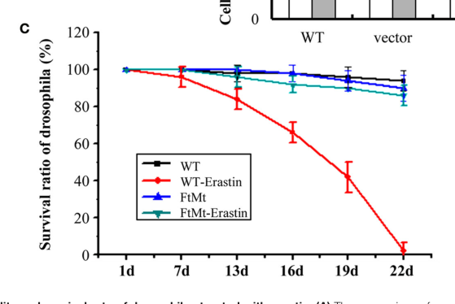

## Question

# Gene Research for Functional Annotation

## ⚠️ CRITICAL: Gene/Protein Identification Context

**BEFORE YOU BEGIN RESEARCH:** You MUST verify you are researching the CORRECT gene/protein. Gene symbols can be ambiguous, especially for less well-characterized genes from non-model organisms.

### Target Gene/Protein Identity (from UniProt):
- **UniProt Accession:** Q9VYH1
- **Protein Description:** RecName: Full=Ferritin {ECO:0000256|RuleBase:RU361145}; EC=1.16.3.1 {ECO:0000256|RuleBase:RU361145};
- **Gene Information:** Name=Fer3HCH {ECO:0000313|EMBL:AAF48226.1, ECO:0000313|FlyBase:FBgn0030449}; Synonyms=Dmel\CG4349 {ECO:0000313|EMBL:AAF48226.1}, Fer3 {ECO:0000313|EMBL:AAF48226.1}, Fer3 HCH {ECO:0000313|EMBL:AAF48226.1}, FtMt {ECO:0000313|EMBL:AAF48226.1}; ORFNames=CG4349 {ECO:0000313|EMBL:AAF48226.1, ECO:0000313|FlyBase:FBgn0030449}, Dmel_CG4349 {ECO:0000313|EMBL:AAF48226.1};
- **Organism (full):** Drosophila melanogaster (Fruit fly).
- **Protein Family:** Belongs to the ferritin family.
- **Key Domains:** Ferritin. (IPR001519); Ferritin-like. (IPR012347); Ferritin-like_diiron. (IPR009040); Ferritin-like_SF. (IPR009078); Ferritin_CS. (IPR014034)

### MANDATORY VERIFICATION STEPS:

1. **Check if the gene symbol "Fer3HCH" matches the protein description above**
2. **Verify the organism is correct:** Drosophila melanogaster (Fruit fly).
3. **Check if protein family/domains align with what you find in literature**
4. **If you find literature for a DIFFERENT gene with the same or similar symbol, STOP**

### If Gene Symbol is Ambiguous or You Cannot Find Relevant Literature:

**DO NOT PROCEED WITH RESEARCH ON A DIFFERENT GENE.** Instead:
- State clearly: "The gene symbol 'Fer3HCH' is ambiguous or literature is limited for this specific protein"
- Explain what you found (e.g., "Found extensive literature on a different gene with the same symbol in a different organism")
- Describe the protein based ONLY on the UniProt information provided above
- Suggest that the protein function can be inferred from domain/family information

### Research Target:

Please provide a comprehensive research report on the gene **Fer3HCH** (gene ID: Fer3HCH, UniProt: Q9VYH1) in DROME.

The research report should be a detailed narrative explaining the function, biological processes, and localization of the gene product. Citations should be given for all claims.

You should prioritize authoritative reviews and primary scientific literature when conducting research. You can supplement
this with annotations you find in gene/protein databases, but these can be outdated or inaccurate.

We are specifically interested in the primary function of the gene - for enzymes, what reaction is catalyzed, and what is the substrate specificity? For transporters, what is the substrate? For structural proteins or adapters, what is the broader structural role? For signaling molecules, what is the role in the pathway.

We are interested in where in or outside the cell the gene product carries out its function.

We are also interested in the signaling or biochemical pathways in which the gene functions. We are less interested in broad pleiotropic effects, except where these elucidate the precise role.

Include evidence where possible. We are interested in both experimental evidence as well as inference from structure, evolution, or bioinformatic analysis. Precise studies should be prioritized over high-throughput, where available.

## Output

Question: You are an expert researcher providing comprehensive, well-cited information.

Provide detailed information focusing on:
1. Key concepts and definitions with current understanding
2. Recent developments and latest research (prioritize 2023-2024 sources)
3. Current applications and real-world implementations
4. Expert opinions and analysis from authoritative sources
5. Relevant statistics and data from recent studies

Format as a comprehensive research report with proper citations. Include URLs and publication dates where available.
Always prioritize recent, authoritative sources and provide specific citations for all major claims.

# Gene Research for Functional Annotation

## ⚠️ CRITICAL: Gene/Protein Identification Context

**BEFORE YOU BEGIN RESEARCH:** You MUST verify you are researching the CORRECT gene/protein. Gene symbols can be ambiguous, especially for less well-characterized genes from non-model organisms.

### Target Gene/Protein Identity (from UniProt):
- **UniProt Accession:** Q9VYH1
- **Protein Description:** RecName: Full=Ferritin {ECO:0000256|RuleBase:RU361145}; EC=1.16.3.1 {ECO:0000256|RuleBase:RU361145};
- **Gene Information:** Name=Fer3HCH {ECO:0000313|EMBL:AAF48226.1, ECO:0000313|FlyBase:FBgn0030449}; Synonyms=Dmel\CG4349 {ECO:0000313|EMBL:AAF48226.1}, Fer3 {ECO:0000313|EMBL:AAF48226.1}, Fer3 HCH {ECO:0000313|EMBL:AAF48226.1}, FtMt {ECO:0000313|EMBL:AAF48226.1}; ORFNames=CG4349 {ECO:0000313|EMBL:AAF48226.1, ECO:0000313|FlyBase:FBgn0030449}, Dmel_CG4349 {ECO:0000313|EMBL:AAF48226.1};
- **Organism (full):** Drosophila melanogaster (Fruit fly).
- **Protein Family:** Belongs to the ferritin family.
- **Key Domains:** Ferritin. (IPR001519); Ferritin-like. (IPR012347); Ferritin-like_diiron. (IPR009040); Ferritin-like_SF. (IPR009078); Ferritin_CS. (IPR014034)

### MANDATORY VERIFICATION STEPS:

1. **Check if the gene symbol "Fer3HCH" matches the protein description above**
2. **Verify the organism is correct:** Drosophila melanogaster (Fruit fly).
3. **Check if protein family/domains align with what you find in literature**
4. **If you find literature for a DIFFERENT gene with the same or similar symbol, STOP**

### If Gene Symbol is Ambiguous or You Cannot Find Relevant Literature:

**DO NOT PROCEED WITH RESEARCH ON A DIFFERENT GENE.** Instead:
- State clearly: "The gene symbol 'Fer3HCH' is ambiguous or literature is limited for this specific protein"
- Explain what you found (e.g., "Found extensive literature on a different gene with the same symbol in a different organism")
- Describe the protein based ONLY on the UniProt information provided above
- Suggest that the protein function can be inferred from domain/family information

### Research Target:

Please provide a comprehensive research report on the gene **Fer3HCH** (gene ID: Fer3HCH, UniProt: Q9VYH1) in DROME.

The research report should be a detailed narrative explaining the function, biological processes, and localization of the gene product. Citations should be given for all claims.

You should prioritize authoritative reviews and primary scientific literature when conducting research. You can supplement
this with annotations you find in gene/protein databases, but these can be outdated or inaccurate.

We are specifically interested in the primary function of the gene - for enzymes, what reaction is catalyzed, and what is the substrate specificity? For transporters, what is the substrate? For structural proteins or adapters, what is the broader structural role? For signaling molecules, what is the role in the pathway.

We are interested in where in or outside the cell the gene product carries out its function.

We are also interested in the signaling or biochemical pathways in which the gene functions. We are less interested in broad pleiotropic effects, except where these elucidate the precise role.

Include evidence where possible. We are interested in both experimental evidence as well as inference from structure, evolution, or bioinformatic analysis. Precise studies should be prioritized over high-throughput, where available.

# Functional annotation report: *Drosophila melanogaster* Fer3HCH

## Identity and principal function

**Identity verified.** Fer3HCH is the *D. melanogaster* gene **CG4349** (UniProt **[Q9VYH1](https://www.uniprot.org/uniprotkb/Q9VYH1/entry)**), not either of the fly’s secretory ferritins, Fer1HCH and Fer2LCH. Its experimentally characterized product is a 186-amino-acid mitochondrial ferritin heavy-chain homolog. It retains all seven residues of the canonical ferritin ferroxidase center, consistent with the ferritin-family and diiron-domain annotations supplied for Q9VYH1. The original study identified a single intron in the fly gene, in contrast to mammalian mitochondrial ferritin genes. (missirlis2006characterizationofmitochondrial pages 1-3, missirlis2006characterizationofmitochondrial pages 1-1)

**Best-supported molecular role:** Fer3HCH is a mitochondrial iron-buffering ferritin. Its predicted substrate is **ferrous iron (Fe²⁺)**: by analogy with characterized ferritins, a diiron ferroxidase center oxidizes Fe²⁺ to ferric iron (Fe³⁺), which can be sequestered in a ferritin assembly rather than remaining readily available for iron-dependent radical formation. This is a *functional inference* from conserved active-site residues, ferritin structure and fly genetic evidence—not a report of a purified Fer3HCH enzyme assay. Consequently, the supplied **EC 1.16.3.1** annotation should not be read as experimental determination of this fly protein’s reaction stoichiometry, oxygen dependence, kinetic constants or specificity among other metals. A 2023 authoritative review likewise describes insect mitochondrial ferritin as an apparent iron-storage protein, while distinguishing it from the Fer1HCH–Fer2LCH complex that operates in the secretory pathway. (missirlis2006characterizationofmitochondrial pages 1-3, gorman2023ironhomeostasisin pages 6-7)

## Site of action and biological context

Fer3HCH has a predicted **N-terminal mitochondrial-targeting sequence**. Experimentally, Fer3HCH–GFP colocalized with a mitochondrial marker in transfected HeLa cells, rather than showing the distribution of free GFP or a cytosolic marker. This supports mitochondrial targeting, although the experiment did **not** image endogenous Fer3HCH in fly mitochondria or map its leader-peptide cleavage site. Its precise intramitochondrial location is therefore best described as *inferred*—the matrix is the expected compartment for mitochondrial ferritin-mediated iron storage, rather than a fly-specific localization established by that imaging experiment. (missirlis2006characterizationofmitochondrial pages 1-3)

Endogenous expression is **strongly enriched in testes**. Northern blots detected transcript in male abdomens, and comparative expression datasets showed high levels in testis; developmental blots showed only faint pupal and mixed-adult signals. Dietary iron did not measurably induce its transcript in the original experiments. Testis enrichment suggests a specialized role during the extensive mitochondrial remodeling of spermatogenesis, but does **not** establish that Fer3HCH is required for sperm formation or male fertility. A 2024 review explicitly notes that its *Pink1*-related neuronal phenotype has not been studied in testes; a separate review attributes a demonstrated male-sterility phenotype to **mitoferrin**, not Fer3HCH. (missirlis2006characterizationofmitochondrial pages 1-3, missirlis2006characterizationofmitochondrial pages 3-4, vedelek2024mitochondrialdifferentiationduring pages 7-10, mandilaras2013ironabsorptionin pages 11-14)

In pathway terms, Fer3HCH belongs to **mitochondrial iron homeostasis**, alongside mitochondrial iron import and the use of iron for heme and iron–sulfur-cluster synthesis. Mitoferrin supplies ferrous iron to mitochondria; Fer3HCH is proposed to buffer iron within that compartment. It is **not** the fly’s established intestinal iron-absorption system or the Fer1HCH–Fer2LCH ferritin used for iron storage and transport through the secretory pathway. Gorman’s review, published **23 January 2023**, emphasizes both this mitochondrial similarity to mammals and the broader differences between insect and mammalian systemic iron handling. (gorman2023ironhomeostasisin pages 6-7, mandilaras2013ironabsorptionin pages 4-6, gorman2023ironhomeostasisin pages 1-3)

## Experimental findings and current interpretation

The target-specific evidence, including its limits, is summarized below. (missirlis2006characterizationofmitochondrial pages 1-3, esposito2013aconitasecausesiron pages 4-7, wang2016theprotectiverole pages 3-5)

| Question/feature | Direct evidence and measured quantitative outcome | Interpretation/limit | Primary source and DOI |
|---|---|---|---|
| Sequence and predicted catalytic function | **Fer3HCH/CG4349 encodes a 186-aa protein**, and all seven residues forming the canonical ferritin ferroxidase center are conserved. | Strong sequence evidence for a ferritin heavy-chain-like **Fe²⁺-oxidation and iron-sequestration** function, but the fly protein was **not subjected to a purified-enzyme ferroxidase kinetic or substrate-specificity assay**; EC 1.16.3.1 therefore remains homology/rule-based rather than directly demonstrated. | Missirlis et al., 2006 (missirlis2006characterizationofmitochondrial pages 1-3) — [DOI: 10.1073/pnas.0601471103](https://doi.org/10.1073/pnas.0601471103) |
| Subcellular localization | Fer3HCH–GFP produced a mitochondrial fluorescence pattern in transfected **HeLa cells**, matching mitochondrial TrxR-1 and differing from cytosolic TrxR-1, free GFP, and nuclear/cytoplasmic patterns. | Experimental support that its N-terminal leader is sufficient for mitochondrial targeting. Localization was demonstrated with a fusion protein in heterologous human cells, not by endogenous Fer3HCH imaging in fly tissue; the precise leader-cleavage site was not mapped. | Missirlis et al., 2006 (missirlis2006characterizationofmitochondrial pages 1-3) — [DOI: 10.1073/pnas.0601471103](https://doi.org/10.1073/pnas.0601471103) |
| Endogenous expression | Northern blots detected expression only in **male abdomens**; comparative microarrays showed high expression only in **testis**. Developmental signal was faint at pupal and adult stages and was not induced by dietary iron. | Establishes strong testis enrichment, not absolute testis exclusivity at single-cell resolution. High expression suggests a specialized role in testicular mitochondrial iron management, but a direct requirement for spermatogenesis or fertility has not been demonstrated. | Missirlis et al., 2006 (missirlis2006characterizationofmitochondrial pages 1-3, missirlis2006characterizationofmitochondrial pages 3-4) — [DOI: 10.1073/pnas.0601471103](https://doi.org/10.1073/pnas.0601471103) |
| Iron loading and systemic iron effects | Overexpressed Fer3HCH assembled into high-molecular-mass homopolymers, but **⁵⁵Fe was detectable only in Fer1HCH–Fer2LCH ferritin**, not Fer3HCH. Ubiquitous or fat-body Fer3HCH overexpression did not increase total-body iron and did not alter Fer1HCH or Fer2LCH abundance. | The overexpressed homopolymer was relatively iron-poor under the tested conditions. This does not disprove physiological iron storage: whole-fly assays could miss small, cell-specific mitochondrial pools, and absence of detectable radiolabel is not a direct ferroxidase assay. | Missirlis et al., 2006 (missirlis2006characterizationofmitochondrial pages 4-5, missirlis2006characterizationofmitochondrial pages 5-6, missirlis2006characterizationofmitochondrial pages 3-4) — [DOI: 10.1073/pnas.0601471103](https://doi.org/10.1073/pnas.0601471103) |
| Iron limitation and oxidative stress | Under lifelong iron limitation with **0.2 mM BPS**, ubiquitous Fer3HCH overexpression shortened female mean lifespan by **25%**; the effect in males was negligible. It also produced robust protection of young adult females exposed to **10 mM paraquat**. Development/eclosion ratios remained approximately Mendelian across limiting, normal, and excess-iron diets. | Consistent with mitochondrial iron sequestration becoming harmful when iron is scarce and protective during oxidant stress. The sex specificity and absence of direct mitochondrial iron measurements prevent a simple quantitative storage mechanism from being assigned. | Missirlis et al., 2006 (missirlis2006characterizationofmitochondrial pages 4-5, missirlis2006characterizationofmitochondrial pages 5-6) — [DOI: 10.1073/pnas.0601471103](https://doi.org/10.1073/pnas.0601471103) |
| Pink1, aconitase, and respiratory-complex stress | Dopaminergic-neuron expression of Fer3HCH significantly reduced mitochondrial swelling/aggregation in **pink1** mutants and in flies overexpressing wild-type aconitase. It also alleviated mitochondrial defects caused by neuronal RNAi against Complex I subunit **NDUFA8**; aggregate-size comparisons were significant at **p < 0.01**. | Functional genetic evidence that Fer3HCH buffers an iron-dependent mitochondrial injury pathway downstream of superoxide-mediated aconitase [4Fe–4S] disruption. Rescue demonstrates protection but does not directly measure iron oxidation, storage capacity, or catalytic kinetics. | Esposito et al., 2013 (esposito2013aconitasecausesiron pages 4-7, esposito2013aconitasecausesiron pages 7-8) — [DOI: 10.1371/journal.pgen.1003478](https://doi.org/10.1371/journal.pgen.1003478) |
| Erastin-associated lethality | Three-day-old male flies with pan-neuronal **elav-Gal4-driven UAS-Fer3HCH** were fed **10 µM erastin** for 22 days. Wild-type survival fell to approximately **0%**, whereas Fer3HCH-overexpressing survival was approximately **87.5%**; **100 flies per replicate, three replicates per group**. | Supports a neuroprotective effect against erastin-associated lethality. In flies, only survival was measured; canonical ferroptosis inhibitors and molecular/lipid-peroxidation markers were not tested, so this does not conclusively establish ferroptosis. The paper’s labile-iron, ROS, VDAC, NOX2, and ferritin measurements were from mouse-FTMT-expressing **human SH-SY5Y cells**, not fly Fer3HCH. | Wang et al., 2016 (wang2016theprotectiverole pages 2-3, wang2016theprotectiverole pages 3-5, wang2016theprotectiverole media 418b2256) — [DOI: 10.3389/fnagi.2016.00308](https://doi.org/10.3389/fnagi.2016.00308) |

*Table: Target-specific evidence for Drosophila melanogaster Fer3HCH/CG4349/Q9VYH1, separating direct observations from functional inference. The table also identifies key assay limitations and avoids attributing mouse FTMT cell-culture results to the fly protein.*

The most mechanistically informative fly experiment places Fer3HCH in an **iron-dependent mitochondrial injury pathway**, rather than identifying it as a signaling protein. In *pink1* mutants, elevated mitochondrial superoxide and oxidative disruption of aconitase’s [4Fe–4S] cluster were linked to ferrous-iron-associated mitochondrial damage. Expressing Fer3HCH in dopaminergic neurons significantly improved mitochondrial morphology in *pink1* mutants, in flies overexpressing aconitase, and after neuronal knockdown of respiratory-complex-I component **NDUFA8**. These genetic rescues support buffering of damaging mitochondrial iron; they do not directly measure iron stored by Fer3HCH or demonstrate that its ferroxidase activity is necessary for rescue. The *pink1*–aconitase study appeared in **April 2013**. (esposito2013aconitasecausesiron pages 4-7, esposito2013aconitasecausesiron pages 7-8)

A second application of the fly overexpression model tested **erastin-associated lethality**. In the **December 2016** study, males expressing UAS-Fer3HCH with the pan-neuronal *elav*-Gal4 driver received **10 µM erastin**. By day 22, reported survival was approximately **87.5%** in Fer3HCH-overexpressing flies versus **0%** in controls, with **100 flies per replicate and three replicates per group**. This establishes protection in that experimental model, **not** a demonstrated endogenous role in neuronal survival or definitive suppression of fly ferroptosis. In particular, the study’s labile-iron, ROS and iron-regulatory-protein measurements came from human SH-SY5Y cells overexpressing **mouse** mitochondrial ferritin, not from fly Fer3HCH. A **June 2023** expert perspective notes that the molecular and biochemical ferroptosis markers accompanying Fer3HCH-mediated fly protection remain untested. (wang2016theprotectiverole pages 2-3, wang2016theprotectiverole pages 3-5, wang2016theprotectiverole media 418b2256, saini2023dissectingthemechanism pages 2-3)

The original **April 2006** fly study also sets an important constraint on the storage model. Overexpressed Fer3HCH formed high-molecular-mass assemblies, yet detectable administered **⁵⁵Fe** associated with Fer1HCH–Fer2LCH rather than Fer3HCH. Fer3HCH overexpression neither increased whole-body iron nor changed the abundance of those secretory-ferritin subunits. These negative whole-fly measurements cannot exclude localized or low-occupancy mitochondrial iron storage. Under **0.2 mM** iron chelator, female overexpressors had a **25% shorter mean lifespan**, whereas young adult females were more resistant to **10 mM paraquat**; the lifespan effect was negligible in males. These sex- and condition-dependent phenotypes are consistent with altered iron availability and oxidant protection, but do not establish a single quantitative mechanism. (missirlis2006characterizationofmitochondrial pages 3-4, missirlis2006characterizationofmitochondrial pages 4-5, missirlis2006characterizationofmitochondrial pages 5-6)

## Assessment and research gaps

The **high-confidence annotation** is a testis-enriched, mitochondria-targeted **ferritin heavy-chain homolog associated with mitochondrial iron homeostasis**. Ferrous-iron oxidation and ferric-iron sequestration are the most plausible primary biochemical activities, supported by conserved ferroxidase-center residues and iron-stress genetic rescue, but **direct fly-protein catalytic activity and substrate specificity remain unmeasured in the studies reviewed**. Nor do the cited experiments establish endogenous matrix localization at subcompartment resolution, mitochondrial iron-loading capacity under physiological conditions, or an essential testicular function through a Fer3HCH-specific loss-of-function phenotype. Its demonstrated research use is chiefly as a **genetic overexpression tool** for probing iron-associated mitochondrial injury—not a validated therapeutic target or a demonstrated component of a canonical signaling cascade. (missirlis2006characterizationofmitochondrial pages 1-3, missirlis2006characterizationofmitochondrial pages 5-6, esposito2013aconitasecausesiron pages 4-7, vedelek2024mitochondrialdifferentiationduring pages 7-10, saini2023dissectingthemechanism pages 2-3)

### Key sources and publication dates

- Missirlis *et al.* **11 April 2006**, *PNAS*, “Characterization of mitochondrial ferritin in Drosophila.” [https://doi.org/10.1073/pnas.0601471103](https://doi.org/10.1073/pnas.0601471103). Original identity, localization, expression and overexpression experiments. (missirlis2006characterizationofmitochondrial pages 1-3, missirlis2006characterizationofmitochondrial pages 1-1)
- Esposito *et al.* **April 2013**, *PLoS Genetics*, “Aconitase Causes Iron Toxicity in Drosophila pink1 Mutants.” [https://doi.org/10.1371/journal.pgen.1003478](https://doi.org/10.1371/journal.pgen.1003478). Target-specific neuronal rescue experiments. (esposito2013aconitasecausesiron pages 4-7, esposito2013aconitasecausesiron pages 7-8)
- Wang *et al.* **December 2016**, *Frontiers in Aging Neuroscience*, “The Protective Role of Mitochondrial Ferritin on Erastin-Induced Ferroptosis.” [https://doi.org/10.3389/fnagi.2016.00308](https://doi.org/10.3389/fnagi.2016.00308). Fly Fer3HCH erastin-survival experiment, alongside separate mouse-FTMT cell experiments. (wang2016theprotectiverole pages 2-3, wang2016theprotectiverole pages 3-5)
- Gorman, **23 January 2023**, *Annual Review of Entomology*, “Iron Homeostasis in Insects.” [https://doi.org/10.1146/annurev-ento-040622-092836](https://doi.org/10.1146/annurev-ento-040622-092836). Authoritative pathway context. (gorman2023ironhomeostasisin pages 6-7, gorman2023ironhomeostasisin pages 1-3)
- Saini and Owusu-Ansah, **20 June 2023**, *Frontiers in Cell Death*, “Dissecting the mechanism of regulation of a ferroptosis-like form of cell death in Drosophila melanogaster.” [https://doi.org/10.3389/fceld.2023.1209641](https://doi.org/10.3389/fceld.2023.1209641). Expert assessment of the ferroptosis evidence gap. (saini2023dissectingthemechanism pages 1-2, saini2023dissectingthemechanism pages 2-3)
- Vedelek *et al.* **April 2024**, *International Journal of Molecular Sciences*, “Mitochondrial Differentiation during Spermatogenesis: Lessons from Drosophila melanogaster.” [https://doi.org/10.3390/ijms25073980](https://doi.org/10.3390/ijms25073980). Recent review distinguishing neuronal rescue from untested testicular function. (vedelek2024mitochondrialdifferentiationduring pages 7-10)

References

1. (missirlis2006characterizationofmitochondrial pages 1-3): Fanis Missirlis, Sara Holmberg, Teodora Georgieva, Boris C. Dunkov, Tracey A. Rouault, and John H. Law. Characterization of mitochondrial ferritin in drosophila. Proceedings of the National Academy of Sciences of the United States of America, 103 15:5893-8, Apr 2006. URL: https://doi.org/10.1073/pnas.0601471103, doi:10.1073/pnas.0601471103. This article has 161 citations and is from a highest quality peer-reviewed journal.

2. (missirlis2006characterizationofmitochondrial pages 1-1): Fanis Missirlis, Sara Holmberg, Teodora Georgieva, Boris C. Dunkov, Tracey A. Rouault, and John H. Law. Characterization of mitochondrial ferritin in drosophila. Proceedings of the National Academy of Sciences of the United States of America, 103 15:5893-8, Apr 2006. URL: https://doi.org/10.1073/pnas.0601471103, doi:10.1073/pnas.0601471103. This article has 161 citations and is from a highest quality peer-reviewed journal.

3. (gorman2023ironhomeostasisin pages 6-7): Maureen J. Gorman. Iron homeostasis in insects. Annual Review of Entomology, 68:51-67, Jan 2023. URL: https://doi.org/10.1146/annurev-ento-040622-092836, doi:10.1146/annurev-ento-040622-092836. This article has 62 citations and is from a domain leading peer-reviewed journal.

4. (missirlis2006characterizationofmitochondrial pages 3-4): Fanis Missirlis, Sara Holmberg, Teodora Georgieva, Boris C. Dunkov, Tracey A. Rouault, and John H. Law. Characterization of mitochondrial ferritin in drosophila. Proceedings of the National Academy of Sciences of the United States of America, 103 15:5893-8, Apr 2006. URL: https://doi.org/10.1073/pnas.0601471103, doi:10.1073/pnas.0601471103. This article has 161 citations and is from a highest quality peer-reviewed journal.

5. (vedelek2024mitochondrialdifferentiationduring pages 7-10): Viktor Vedelek, Ferenc Jankovics, János Zádori, and Rita Sinka. Mitochondrial differentiation during spermatogenesis: lessons from drosophila melanogaster. International Journal of Molecular Sciences, 25:3980, Apr 2024. URL: https://doi.org/10.3390/ijms25073980, doi:10.3390/ijms25073980. This article has 25 citations.

6. (mandilaras2013ironabsorptionin pages 11-14): Konstantinos Mandilaras, Tharse Pathmanathan, and Fanis Missirlis. Iron absorption in drosophila melanogaster. Nutrients, 5:1622-1647, May 2013. URL: https://doi.org/10.3390/nu5051622, doi:10.3390/nu5051622. This article has 130 citations.

7. (mandilaras2013ironabsorptionin pages 4-6): Konstantinos Mandilaras, Tharse Pathmanathan, and Fanis Missirlis. Iron absorption in drosophila melanogaster. Nutrients, 5:1622-1647, May 2013. URL: https://doi.org/10.3390/nu5051622, doi:10.3390/nu5051622. This article has 130 citations.

8. (gorman2023ironhomeostasisin pages 1-3): Maureen J. Gorman. Iron homeostasis in insects. Annual Review of Entomology, 68:51-67, Jan 2023. URL: https://doi.org/10.1146/annurev-ento-040622-092836, doi:10.1146/annurev-ento-040622-092836. This article has 62 citations and is from a domain leading peer-reviewed journal.

9. (esposito2013aconitasecausesiron pages 4-7): Giovanni Esposito, Melissa Vos, Sven Vilain, Jef Swerts, Jorge De Sousa Valadas, Stefanie Van Meensel, Onno Schaap, and Patrik Verstreken. Aconitase causes iron toxicity in drosophila pink1 mutants. PLoS Genetics, 9:e1003478, Apr 2013. URL: https://doi.org/10.1371/journal.pgen.1003478, doi:10.1371/journal.pgen.1003478. This article has 89 citations and is from a domain leading peer-reviewed journal.

10. (wang2016theprotectiverole pages 3-5): Yue-Qi Wang, Shi-Yang Chang, Qiong Wu, Yu-Jing Gou, Linpei Jia, Yan-Mei Cui, Peng Yu, Zhen-Hua Shi, Wen-Shuang Wu, Guofen Gao, and Yan-Zhong Chang. The protective role of mitochondrial ferritin on erastin-induced ferroptosis. Frontiers in Aging Neuroscience, Dec 2016. URL: https://doi.org/10.3389/fnagi.2016.00308, doi:10.3389/fnagi.2016.00308. This article has 351 citations and is from a peer-reviewed journal.

11. (missirlis2006characterizationofmitochondrial pages 4-5): Fanis Missirlis, Sara Holmberg, Teodora Georgieva, Boris C. Dunkov, Tracey A. Rouault, and John H. Law. Characterization of mitochondrial ferritin in drosophila. Proceedings of the National Academy of Sciences of the United States of America, 103 15:5893-8, Apr 2006. URL: https://doi.org/10.1073/pnas.0601471103, doi:10.1073/pnas.0601471103. This article has 161 citations and is from a highest quality peer-reviewed journal.

12. (missirlis2006characterizationofmitochondrial pages 5-6): Fanis Missirlis, Sara Holmberg, Teodora Georgieva, Boris C. Dunkov, Tracey A. Rouault, and John H. Law. Characterization of mitochondrial ferritin in drosophila. Proceedings of the National Academy of Sciences of the United States of America, 103 15:5893-8, Apr 2006. URL: https://doi.org/10.1073/pnas.0601471103, doi:10.1073/pnas.0601471103. This article has 161 citations and is from a highest quality peer-reviewed journal.

13. (esposito2013aconitasecausesiron pages 7-8): Giovanni Esposito, Melissa Vos, Sven Vilain, Jef Swerts, Jorge De Sousa Valadas, Stefanie Van Meensel, Onno Schaap, and Patrik Verstreken. Aconitase causes iron toxicity in drosophila pink1 mutants. PLoS Genetics, 9:e1003478, Apr 2013. URL: https://doi.org/10.1371/journal.pgen.1003478, doi:10.1371/journal.pgen.1003478. This article has 89 citations and is from a domain leading peer-reviewed journal.

14. (wang2016theprotectiverole pages 2-3): Yue-Qi Wang, Shi-Yang Chang, Qiong Wu, Yu-Jing Gou, Linpei Jia, Yan-Mei Cui, Peng Yu, Zhen-Hua Shi, Wen-Shuang Wu, Guofen Gao, and Yan-Zhong Chang. The protective role of mitochondrial ferritin on erastin-induced ferroptosis. Frontiers in Aging Neuroscience, Dec 2016. URL: https://doi.org/10.3389/fnagi.2016.00308, doi:10.3389/fnagi.2016.00308. This article has 351 citations and is from a peer-reviewed journal.

15. (wang2016theprotectiverole media 418b2256): Yue-Qi Wang, Shi-Yang Chang, Qiong Wu, Yu-Jing Gou, Linpei Jia, Yan-Mei Cui, Peng Yu, Zhen-Hua Shi, Wen-Shuang Wu, Guofen Gao, and Yan-Zhong Chang. The protective role of mitochondrial ferritin on erastin-induced ferroptosis. Frontiers in Aging Neuroscience, Dec 2016. URL: https://doi.org/10.3389/fnagi.2016.00308, doi:10.3389/fnagi.2016.00308. This article has 351 citations and is from a peer-reviewed journal.

16. (saini2023dissectingthemechanism pages 2-3): Sanjay Saini and Edward Owusu-Ansah. Dissecting the mechanism of regulation of a ferroptosis-like form of cell death in drosophila melanogaster. Frontiers in Cell Death, Jun 2023. URL: https://doi.org/10.3389/fceld.2023.1209641, doi:10.3389/fceld.2023.1209641. This article has 3 citations.

17. (saini2023dissectingthemechanism pages 1-2): Sanjay Saini and Edward Owusu-Ansah. Dissecting the mechanism of regulation of a ferroptosis-like form of cell death in drosophila melanogaster. Frontiers in Cell Death, Jun 2023. URL: https://doi.org/10.3389/fceld.2023.1209641, doi:10.3389/fceld.2023.1209641. This article has 3 citations.

## Artifacts

- [Edison artifact artifact-00](Fer3HCH-deep-research-falcon_artifacts/artifact-00.md)

## Citations

1. missirlis2006characterizationofmitochondrial pages 1-3
2. vedelek2024mitochondrialdifferentiationduring pages 7-10
3. missirlis2006characterizationofmitochondrial pages 1-1
4. gorman2023ironhomeostasisin pages 6-7
5. missirlis2006characterizationofmitochondrial pages 3-4
6. mandilaras2013ironabsorptionin pages 11-14
7. mandilaras2013ironabsorptionin pages 4-6
8. gorman2023ironhomeostasisin pages 1-3
9. esposito2013aconitasecausesiron pages 4-7
10. wang2016theprotectiverole pages 3-5
11. missirlis2006characterizationofmitochondrial pages 4-5
12. missirlis2006characterizationofmitochondrial pages 5-6
13. esposito2013aconitasecausesiron pages 7-8
14. wang2016theprotectiverole pages 2-3
15. saini2023dissectingthemechanism pages 2-3
16. saini2023dissectingthemechanism pages 1-2
17. Q9VYH1
18. DOI: 10.1073/pnas.0601471103
19. 4Fe–4S
20. DOI: 10.1371/journal.pgen.1003478
21. DOI: 10.3389/fnagi.2016.00308
22. https://doi.org/10.1073/pnas.0601471103
23. https://doi.org/10.1371/journal.pgen.1003478
24. https://doi.org/10.3389/fnagi.2016.00308
25. https://doi.org/10.1146/annurev-ento-040622-092836
26. https://doi.org/10.3389/fceld.2023.1209641
27. https://doi.org/10.3390/ijms25073980
28. https://www.uniprot.org/uniprotkb/Q9VYH1/entry
29. https://doi.org/10.1073/pnas.0601471103](https://doi.org/10.1073/pnas.0601471103
30. https://doi.org/10.1371/journal.pgen.1003478](https://doi.org/10.1371/journal.pgen.1003478
31. https://doi.org/10.3389/fnagi.2016.00308](https://doi.org/10.3389/fnagi.2016.00308
32. https://doi.org/10.1146/annurev-ento-040622-092836](https://doi.org/10.1146/annurev-ento-040622-092836
33. https://doi.org/10.3389/fceld.2023.1209641](https://doi.org/10.3389/fceld.2023.1209641
34. https://doi.org/10.3390/ijms25073980](https://doi.org/10.3390/ijms25073980
35. https://doi.org/10.1073/pnas.0601471103,
36. https://doi.org/10.1146/annurev-ento-040622-092836,
37. https://doi.org/10.3390/ijms25073980,
38. https://doi.org/10.3390/nu5051622,
39. https://doi.org/10.1371/journal.pgen.1003478,
40. https://doi.org/10.3389/fnagi.2016.00308,
41. https://doi.org/10.3389/fceld.2023.1209641,