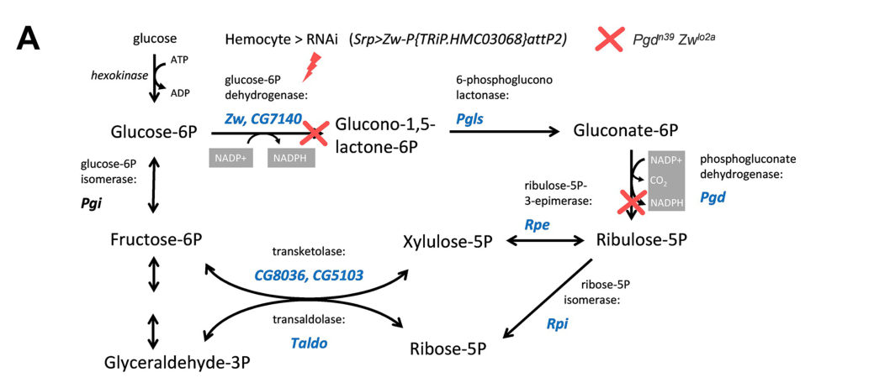

## Question

# Gene Research for Functional Annotation

## ⚠️ CRITICAL: Gene/Protein Identification Context

**BEFORE YOU BEGIN RESEARCH:** You MUST verify you are researching the CORRECT gene/protein. Gene symbols can be ambiguous, especially for less well-characterized genes from non-model organisms.

### Target Gene/Protein Identity (from UniProt):
- **UniProt Accession:** P12646
- **Protein Description:** RecName: Full=Glucose-6-phosphate 1-dehydrogenase {ECO:0000312|FlyBase:FBgn0004057}; EC=1.1.1.49 {ECO:0000250|UniProtKB:P11413}; AltName: Full=Protein zwischenferment {ECO:0000305};
- **Gene Information:** Name=G6pd {ECO:0000312|FlyBase:FBgn0004057}; Synonyms=Zw {ECO:0000312|FlyBase:FBgn0004057}; ORFNames=CG12529 {ECO:0000312|FlyBase:FBgn0004057};
- **Organism (full):** Drosophila melanogaster (Fruit fly).
- **Protein Family:** Belongs to the glucose-6-phosphate dehydrogenase family.
- **Key Domains:** G6P_DH. (IPR001282); G6P_DH_AS. (IPR019796); G6P_DH_C. (IPR022675); G6P_DH_NAD-bd. (IPR022674); NAD(P)-bd_dom_sf. (IPR036291)

### MANDATORY VERIFICATION STEPS:

1. **Check if the gene symbol "G6pd" matches the protein description above**
2. **Verify the organism is correct:** Drosophila melanogaster (Fruit fly).
3. **Check if protein family/domains align with what you find in literature**
4. **If you find literature for a DIFFERENT gene with the same or similar symbol, STOP**

### If Gene Symbol is Ambiguous or You Cannot Find Relevant Literature:

**DO NOT PROCEED WITH RESEARCH ON A DIFFERENT GENE.** Instead:
- State clearly: "The gene symbol 'G6pd' is ambiguous or literature is limited for this specific protein"
- Explain what you found (e.g., "Found extensive literature on a different gene with the same symbol in a different organism")
- Describe the protein based ONLY on the UniProt information provided above
- Suggest that the protein function can be inferred from domain/family information

### Research Target:

Please provide a comprehensive research report on the gene **G6pd** (gene ID: G6pd, UniProt: P12646) in DROME.

The research report should be a detailed narrative explaining the function, biological processes, and localization of the gene product. Citations should be given for all claims.

You should prioritize authoritative reviews and primary scientific literature when conducting research. You can supplement
this with annotations you find in gene/protein databases, but these can be outdated or inaccurate.

We are specifically interested in the primary function of the gene - for enzymes, what reaction is catalyzed, and what is the substrate specificity? For transporters, what is the substrate? For structural proteins or adapters, what is the broader structural role? For signaling molecules, what is the role in the pathway.

We are interested in where in or outside the cell the gene product carries out its function.

We are also interested in the signaling or biochemical pathways in which the gene functions. We are less interested in broad pleiotropic effects, except where these elucidate the precise role.

Include evidence where possible. We are interested in both experimental evidence as well as inference from structure, evolution, or bioinformatic analysis. Precise studies should be prioritized over high-throughput, where available.

## Output

Question: You are an expert researcher providing comprehensive, well-cited information.

Provide detailed information focusing on:
1. Key concepts and definitions with current understanding
2. Recent developments and latest research (prioritize 2023-2024 sources)
3. Current applications and real-world implementations
4. Expert opinions and analysis from authoritative sources
5. Relevant statistics and data from recent studies

Format as a comprehensive research report with proper citations. Include URLs and publication dates where available.
Always prioritize recent, authoritative sources and provide specific citations for all major claims.

# Gene Research for Functional Annotation

## ⚠️ CRITICAL: Gene/Protein Identification Context

**BEFORE YOU BEGIN RESEARCH:** You MUST verify you are researching the CORRECT gene/protein. Gene symbols can be ambiguous, especially for less well-characterized genes from non-model organisms.

### Target Gene/Protein Identity (from UniProt):
- **UniProt Accession:** P12646
- **Protein Description:** RecName: Full=Glucose-6-phosphate 1-dehydrogenase {ECO:0000312|FlyBase:FBgn0004057}; EC=1.1.1.49 {ECO:0000250|UniProtKB:P11413}; AltName: Full=Protein zwischenferment {ECO:0000305};
- **Gene Information:** Name=G6pd {ECO:0000312|FlyBase:FBgn0004057}; Synonyms=Zw {ECO:0000312|FlyBase:FBgn0004057}; ORFNames=CG12529 {ECO:0000312|FlyBase:FBgn0004057};
- **Organism (full):** Drosophila melanogaster (Fruit fly).
- **Protein Family:** Belongs to the glucose-6-phosphate dehydrogenase family.
- **Key Domains:** G6P_DH. (IPR001282); G6P_DH_AS. (IPR019796); G6P_DH_C. (IPR022675); G6P_DH_NAD-bd. (IPR022674); NAD(P)-bd_dom_sf. (IPR036291)

### MANDATORY VERIFICATION STEPS:

1. **Check if the gene symbol "G6pd" matches the protein description above**
2. **Verify the organism is correct:** Drosophila melanogaster (Fruit fly).
3. **Check if protein family/domains align with what you find in literature**
4. **If you find literature for a DIFFERENT gene with the same or similar symbol, STOP**

### If Gene Symbol is Ambiguous or You Cannot Find Relevant Literature:

**DO NOT PROCEED WITH RESEARCH ON A DIFFERENT GENE.** Instead:
- State clearly: "The gene symbol 'G6pd' is ambiguous or literature is limited for this specific protein"
- Explain what you found (e.g., "Found extensive literature on a different gene with the same symbol in a different organism")
- Describe the protein based ONLY on the UniProt information provided above
- Suggest that the protein function can be inferred from domain/family information

### Research Target:

Please provide a comprehensive research report on the gene **G6pd** (gene ID: G6pd, UniProt: P12646) in DROME.

The research report should be a detailed narrative explaining the function, biological processes, and localization of the gene product. Citations should be given for all claims.

You should prioritize authoritative reviews and primary scientific literature when conducting research. You can supplement
this with annotations you find in gene/protein databases, but these can be outdated or inaccurate.

We are specifically interested in the primary function of the gene - for enzymes, what reaction is catalyzed, and what is the substrate specificity? For transporters, what is the substrate? For structural proteins or adapters, what is the broader structural role? For signaling molecules, what is the role in the pathway.

We are interested in where in or outside the cell the gene product carries out its function.

We are also interested in the signaling or biochemical pathways in which the gene functions. We are less interested in broad pleiotropic effects, except where these elucidate the precise role.

Include evidence where possible. We are interested in both experimental evidence as well as inference from structure, evolution, or bioinformatic analysis. Precise studies should be prioritized over high-throughput, where available.

# Functional annotation report: *Drosophila melanogaster* G6pd/Zw

## Identity and scope

The target is the fruit-fly gene **G6pd**, historically called **Zw** (*zwischenferment*), with the identifiers **CG12529**, **FlyBase FBgn0004057**, and **UniProt [P12646](https://www.uniprot.org/uniprotkb/P12646/entry)** supplied in the question. This identification is consistent with fly-specific experiments: genetically defined *Zw* alleles alter glucose-6-phosphate dehydrogenase (G6PD) activity and enzyme properties, and a 2024 study explicitly identifies *Zw* as the fly G6PD gene. The supplied UniProt family assignment and G6PD catalytic and NAD(P)-binding domains agree with that biochemical evidence. The modern CG12529–P12646 identifier linkage is taken from the supplied UniProt record, rather than independently established by the older experiments. (williamson1983comparativepropertiesof pages 1-4, williamson1983comparativepropertiesof pages 7-10, kazek2024glucoseandtrehalose pages 10-11)

**Principal annotation:** G6pd/Zw encodes a **soluble, predominantly cytosolic NADP⁺-dependent glucose-6-phosphate dehydrogenase (EC 1.1.1.49)**. Its primary role is to initiate the oxidative pentose phosphate pathway (PPP), producing NADPH and committing glucose-6-phosphate to a route that supplies reducing power and, downstream, pentose phosphates. It is an enzyme in this metabolic pathway, **not** a glucose transporter or an established signaling receptor. (williamson1983comparativepropertiesof pages 1-4, williamson1983comparativepropertiesof pages 7-10, wang2019jnkmodifiesneuronal pages 4-7, kazek2024glucoseandtrehalose pages 7-10)

## Catalytic function and substrate specificity

The assigned reaction is **D-glucose-6-phosphate + NADP⁺ → 6-phospho-D-glucono-δ-lactone + NADPH + H⁺**. Lactonase subsequently converts the lactone to 6-phosphogluconate; 6-phosphogluconate dehydrogenase, encoded by the distinct gene *Pgd*, catalyzes a later NADPH-producing oxidative-PPP step. Thus, 6-phosphogluconate and ribulose-5-phosphate are downstream pathway products, **not the immediate product of Zw’s reaction**. Purified fly G6PD was assayed directly by monitoring NADP⁺ reduction at 340 nm with glucose-6-phosphate supplied; the precise lactone assignment follows the established EC 1.1.1.49 reaction rather than a reported direct lactone measurement in that purification study. (williamson1983comparativepropertiesof pages 1-4, williamson1983comparativepropertiesof pages 7-10, schwarz2024age‐regulatedcyclingmetabolites pages 5-6)

Williamson and Bentley’s fly-enzyme purification, published **December 1983**, provides unusually specific functional evidence. With 0.01 mM NADP⁺ in extraction buffer, the apparent *K*m values for glucose-6-phosphate were **119 ± 11.2 µM** (*Zw* A), **58 ± 6.3 µM** (*Zw* B), and **201 ± 5.5 µM** (low-activity *Zw* *lo1*); corresponding NADP⁺ values were **16.9 ± 0.5**, **14.4 ± 0.5**, and **12.6 ± 0.4 µM**. Higher NADP⁺ during extraction changed apparent molecular sizes and kinetic estimates, so these are **assay-dependent apparent affinities**, not universal intracellular constants. The experiments establish utilization of glucose-6-phosphate and NADP⁺; they do not constitute a comprehensive screen proving absolute exclusion of every alternative sugar phosphate or cofactor. [Study URL](https://doi.org/10.1007/bf00488467). (williamson1983comparativepropertiesof pages 1-4, williamson1983comparativepropertiesof pages 7-10)

The alleles also clarify the relationship between gene and protein: low-activity *Zw* *lo1* adults retained only **10–15%** of normal measured enzyme activity despite substantial immunoreactive G6PD protein. This, together with allele-dependent assembly and glucose-6-phosphate kinetics, supports a defect in enzyme function or assembly rather than simply no protein synthesis. A **January 1974** genetic and radiotracer study independently found **less than 10%** of wild-type activity in another *Zw*-deficient adult strain and reported blockage of the oxidative pentose shunt. These percentages concern different strains and should not be treated as estimates for one identical allele. [1983 study](https://doi.org/10.1007/bf00488467); [1974 study](https://doi.org/10.1002/jez.1401870110). (williamson1983comparativepropertiesof pages 7-10, geer1974thepentoseshunt pages 1-2)

## Where the protein works

The best direct localization evidence places fly G6PD in the **soluble cytosolic fraction**: Williamson and Bentley recovered **100% of detectable G6PD activity in the 105,000 × *g* supernatant**, while approximately **70% of succinate dehydrogenase activity** partitioned with particulate material as a fractionation control. This strongly supports a cytosolic site for the measured glucose-6-phosphate-to-NADPH reaction; it does not rule out a small undetected pool elsewhere, and the cited experiment is biochemical fractionation rather than high-resolution protein imaging. The 2024 hemocyte work additionally places the relevant *Zw*-dependent metabolism **inside immune cells**; the cytoplasmic trehalase discussed there is a separate enzyme, not evidence that Zw is secreted. [Localization study](https://doi.org/10.1007/bf00488467); [hemocyte study](https://doi.org/10.1371/journal.pbio.3002299). (williamson1983comparativepropertiesof pages 7-10, kazek2024glucoseandtrehalose pages 11-13, kazek2024glucoseandtrehalose pages 2-3)

## Pathway role and biological processes

**Oxidative and cyclic PPP.** Zw acts at the oxidative pathway’s entry point. Its NADPH can support reductive biosynthesis and cellular redox maintenance; subsequent PPP reactions generate pentose phosphates used in nucleotide production. In a **May 7, 2024** primary study, Kazek and colleagues traced labeled glucose and trehalose in fly larval hemocytes. Infection increased carbohydrate metabolism, and partially labeled glucose-6-phosphate—notably the **m+3** isotopologue—supported recycling of PPP-derived carbon back into glucose-6-phosphate for repeated oxidative passage. The infected-cell patterns also contained nonoxidative-PPP intermediates: the pathway operates as a network, not as Zw acting alone. Ex-vivo measurements used **40-minute incubations**, **five biological replicates**, and either **0.5 mM glucose-¹³C₆** or **5 mM trehalose-¹³C₁₂**. Labeling patterns support cyclic-PPP operation but do not individually measure purified Zw turnover in those cells. [2024 study](https://doi.org/10.1371/journal.pbio.3002299). (kazek2024glucoseandtrehalose pages 7-10)

**Immune-cell requirement.** In the same study, hemocyte-specific *Zw* RNA interference, verified by RT-qPCR, left basal plasmatocyte numbers unchanged but reduced infection-induced lamellocyte numbers and host survival following parasitoid-wasp infection. A viable *Zw/Pgd* double-null produced similar defects. These experiments identify an important role for Zw-dependent oxidative PPP in **lamellocyte differentiation and effective resistance**, rather than a general requirement for basal plasmatocyte production under those conditions. Importantly, the double-null alone cannot assign its phenotype specifically to Zw, because *Pgd* was also removed; the hemocyte-directed *Zw* RNAi supplies the more specific genetic test. Figure 4 presents the pathway, knockdown validation, cell counts, and infection-survival readouts. [2024 study and Figure 4](https://doi.org/10.1371/journal.pbio.3002299.g004). (kazek2024glucoseandtrehalose pages 11-13, kazek2024glucoseandtrehalose media f240d188)

**Neuronal metabolic regulation.** A **February 2019** study found that increased neuronal JNK signaling induced *Zw*/G6PD expression, raised head NADPH, and accompanied changes in glutathione redox state. Neuron-specific G6PD overexpression reduced age-associated protein-aggregate measures and extended fly lifespan; it did not produce additional lifespan extension in the tested JNK-activated *puc* background. This positions Zw as a **metabolic effector downstream of JNK**, not as the JNK signaling molecule itself. Head redox and lifespan are downstream measures, and other JNK-regulated genes may contribute. [2019 study](https://doi.org/10.1111/acel.12849). (wang2019jnkmodifiesneuronal pages 4-7, wang2019jnkmodifiesneuronal pages 7-9)

An **Aging Cell study published in 2024** extended neuronal observations to circadian behavior. Among **159** metabolites measured in fly heads, **17** cycled in young flies and **17** in old flies, with only **four** shared; glucose-6-phosphate and ribulose-5-phosphate lost detectable cycling with age. Wild-type head NADPH/NADP⁺ ratios differed between time points—ZT0 versus ZT8, ZT12, and ZT20 gave *p* = **0.0405**, **0.0256**, and **0.0008**, respectively—whereas the tested *per⁰* circadian mutants lacked significant time-point differences. These whole-head measurements suggest circadian control of redox metabolism, **not direct proof that isolated Zw catalytic activity itself oscillates**. Both G6PD overexpression **and** either of two G6PD RNAi interventions in PDF-positive clock neurons reduced sleep. Overexpression also increased nighttime neuronal calcium and mitochondrial oxidation in measured populations; effects differed across neuronal circuits. The bidirectional sleep phenotype argues against a simple interpretation that more Zw activity uniformly produces a beneficial outcome. [2024 study](https://doi.org/10.1111/acel.14082). (schwarz2024age‐regulatedcyclingmetabolites pages 4-5, schwarz2024age‐regulatedcyclingmetabolites pages 5-6, schwarz2024age‐regulatedcyclingmetabolites pages 7-9)

**Redox-state context.** In a **June 2013** fly model expressing disease-associated human αB-crystallin, lowering Zw/G6PD expression ameliorated cardiac dysfunction, whereas increased G6PD aggravated modeled pathology. This demonstrates that NADPH-generating activity can be disadvantageous in a particular **reductive-stress model**; it does not alter Zw’s principal catalytic annotation or establish a universal cardiac effect. [2013 study](https://doi.org/10.1371/journal.pgen.1003544). (xie2013thenadphmetabolic pages 7-9)

The following table separates the strongest direct functional tests from pathway-level and organismal inferences.

| Question | Specific primary result | Experimental design | Inference / limitations | Source |
|---|---|---|---|---|
| What reaction and substrates define fly Zw/G6PD? | Purified enzyme reduced NADP⁺ in the presence of glucose-6-phosphate (G6P), supporting **G6P + NADP⁺ → 6-phosphoglucono-δ-lactone + NADPH + H⁺**. At low-NADP⁺ extraction conditions, apparent *K*m values for Zw allelic forms A, B, and *lo1* were, respectively: G6P **119, 58, and 201 µM**; NADP⁺ **16.9, 14.4, and 12.6 µM**. | Affinity purification of three genetically defined enzyme forms; NADP⁺ reduction monitored at 340 nm; substrate/cofactor kinetics and gel filtration. | Strong direct biochemical evidence for G6P and NADP⁺ utilization and allele-dependent G6P kinetics. The assays did **not** systematically test all possible alternative substrates or cofactors, so they do not prove absolute exclusion of alternatives. | Williamson & Bentley (1983), *Biochemical Genetics*. [DOI](https://doi.org/10.1007/bf00488467) (williamson1983comparativepropertiesof pages 1-4, williamson1983comparativepropertiesof pages 7-10) |
| Is Zw/G6PD cytosolic? | **100%** of measured G6PD activity occurred in the **105,000×g supernatant**; about 70% of succinate-dehydrogenase activity partitioned into particulate fractions, validating the fractionation. | Differential centrifugation of *D. melanogaster* homogenates with enzyme-activity assays. | Direct evidence that detectable fly G6PD is a soluble, operationally cytosolic enzyme. It does not provide organelle-resolution imaging or exclude minor pools below assay sensitivity. | Williamson & Bentley (1983), *Biochemical Genetics*. [DOI](https://doi.org/10.1007/bf00488467) (williamson1983comparativepropertiesof pages 7-10) |
| Does Zw control oxidative-PPP flux in vivo? | Zw-deficient adults retained **slightly less than 10%** of wild-type G6PD activity; radiotracing indicated that the oxidative pentose shunt was blocked, while nonoxidative-shunt enzyme activities increased. | Genetically controlled Zw⁻ versus Zw⁺ adults; spectrophotometric enzyme assays and radiotracer measurements. | Strong genetic and metabolic evidence that Zw supplies the entry reaction of the oxidative PPP. Whole-fly measurements cannot resolve tissue-specific effects. | Geer, Bowman & Simmons (1974), *Journal of Experimental Zoology*. [DOI](https://doi.org/10.1002/jez.1401870110) (geer1974thepentoseshunt pages 1-2) |
| Is cyclic PPP active in immune cells? | Infection increased partially labeled **G6P m+3**; the fraction was especially pronounced when labeled trehalose was supplied and was attributed mainly to lamellocytes. G6P m+2/m+3 appeared during infection in vivo but not in uninfected larvae, supporting recycling of pentoses to hexose phosphate and repeated G6P oxidation. | Ex-vivo 40-min tracing with 0.5 mM glucose-¹³C₆ or 5 mM trehalose-¹³C₁₂ (five biological replicates), plus six-hour in-vivo glucose-¹³C₆ feeding and LC–MS metabolomics. | Strong pathway-level evidence for oxidative/cyclic PPP, but labeling alone does not measure Zw catalytic rate directly; heterogeneous hemocyte populations complicate cell-type attribution. | Kazek et al. (2024), *PLOS Biology*, published May 7, 2024. [DOI](https://doi.org/10.1371/journal.pbio.3002299) (kazek2024glucoseandtrehalose pages 7-10) |
| Is Zw required cell-autonomously for fly immunity? | Hemocyte-specific **Zw RNAi** left basal plasmatocyte numbers unchanged but reduced infection-induced lamellocyte numbers and larval survival after parasitoid infection. A viable **Zw/Pgd double-null** produced corresponding defects. | Srp-Gal4-driven Zw RNAi verified by RT-qPCR; comparison with *Pgd[n39] pn[1] Zw[lo2a]* animals; hemocyte counts and infection-survival assays. | Zw-specific RNAi supports a hemocyte-autonomous requirement. The **Zw/Pgd double-null phenotype cannot be attributed uniquely to Zw**, because two oxidative-PPP enzymes were eliminated. The outcomes establish physiological requirement, not a separate signaling function of G6PD. | Kazek et al. (2024), *PLOS Biology*, published May 7, 2024. [DOI](https://doi.org/10.1371/journal.pbio.3002299) (kazek2024glucoseandtrehalose pages 11-13, kazek2024glucoseandtrehalose media f240d188) |
| Is G6PD/PPP activity circadian or age-sensitive? | Of 159 measured head metabolites, 17 cycled in young and 17 in old flies, but only four overlapped. G6P and ribulose-5-phosphate cycled in young but not old flies. Wild-type head NADPH/NADP⁺ ratios varied by time—ZT0 differed from ZT8 (*p*=0.0405), ZT12 (*p*=0.0256), and ZT20 (*p*=0.0008)—whereas *per⁰* mutants lacked significant time-point differences. | Head metabolomics and lipidomics across six time points; approximately 300 heads per metabolomics replicate and 200 heads per NADPH/NADP⁺ replicate. | Supports circadian regulation of PPP/redox state and age-associated loss of metabolite rhythmicity. **Head NADPH/NADP⁺ is an indirect, whole-tissue proxy—not a direct assay of Zw enzyme activity—and other NADPH-producing enzymes contribute.** | Schwarz et al. (2024), *Aging Cell*, published January 2024. [DOI](https://doi.org/10.1111/acel.14082) (schwarz2024age‐regulatedcyclingmetabolites pages 4-5, schwarz2024age‐regulatedcyclingmetabolites pages 5-6) |
| How does neuronal G6PD manipulation affect behavior? | G6PD overexpression in PDF⁺ clock neurons decreased sleep across ages and sexes, increased activity, nighttime calcium, and mitochondrial oxidation. Two independent G6PD RNAi lines also decreased sleep. Overexpression reduced sleep in dorsal fan-shaped-body and ellipsoid-body neurons but not DN1 neurons. | Cell-type-specific GAL4/UAS overexpression or RNAi; locomotor/sleep assays, CaLexA calcium reporting, and mito-roGFP redox imaging. Calcium groups contained 6–8 flies and redox groups 15–19; behavioral groups generally contained about 41–48 flies. | Bidirectional perturbation producing similar sleep loss implies that tightly regulated PPP activity—not simply “more NADPH”—supports normal sleep. Circuit specificity and indirect physiological readouts caution against assigning a direct signaling role to Zw. | Schwarz et al. (2024), *Aging Cell*, published January 2024. [DOI](https://doi.org/10.1111/acel.14082) (schwarz2024age‐regulatedcyclingmetabolites pages 6-7, schwarz2024age‐regulatedcyclingmetabolites pages 7-9, schwarz2024age‐regulatedcyclingmetabolites pages 7-7, schwarz2024age‐regulatedcyclingmetabolites pages 5-6) |
| How is Zw linked to stress signaling, proteostasis, and longevity? | Elevated neuronal JNK signaling induced Zw/G6PD expression, increased NADPH and GSH/GSSG, and reduced age-associated protein aggregates. Neuronal G6PD overexpression reproduced improved proteostasis and extended lifespan, but did not add further benefit in JNK-activated *puc* mutants. | RNA-seq/qRT-PCR, ¹³C-glucose flux analysis, NADPH and glutathione assays, p62/polyubiquitin measurements, inducible neuronal G6PD overexpression, and survival analysis. | Supports Zw as a metabolic effector downstream of JNK and is consistent with pathway saturation or epistasis. Lifespan and proteostasis are downstream phenotypes; they do not establish that all JNK effects are mediated by Zw. | Wang et al. (2019), *Aging Cell*, published February 2019. [DOI](https://doi.org/10.1111/acel.12849) (wang2019jnkmodifiesneuronal pages 4-7, wang2019jnkmodifiesneuronal pages 7-9) |

*Table: Primary evidence for the catalytic activity, localization, pathway role, and tissue-specific functions of Drosophila G6pd/Zw. The limitations column separates direct biochemical evidence from indirect redox and organismal phenotypes.*

## Interpretation, applications, and limits of the evidence

The practical, demonstrated use of *Zw* is as a **genetic handle on oxidative-PPP/NADPH metabolism in flies**: investigators combine *Zw* alleles or tissue-specific RNAi with enzyme assays, isotope tracing, immune challenges, neuronal imaging, and survival measurements. These are research-model implementations, **not demonstrated clinical applications of the fly protein**. Tissue context matters: decreasing Zw impairs the studied parasitoid response, while altering G6PD in either direction can perturb sleep and decreasing it can ameliorate a specific reductive-stress phenotype. (kazek2024glucoseandtrehalose pages 11-13, kazek2024glucoseandtrehalose pages 7-10, schwarz2024age‐regulatedcyclingmetabolites pages 5-6, xie2013thenadphmetabolic pages 7-9)

A **2024** amyloid-toxicity fly study illustrates why targeted validation should outweigh high-throughput association: its transcriptomic analysis suggested altered *Zw* expression, but its qRT-PCR measurements **did not confirm a change in Zw** under the tested conditions. It therefore does not provide robust evidence for a new direct biochemical function of the protein. [2024 study](https://doi.org/10.1111/cns.14527). (li2024icaritingreatlyattenuates pages 7-10)

Finally, an older **1976** electrophoretic study interpreted fly G6PD bands as products of duplicate structural genes and *Zw* as a modifier. That historical model should not be silently substituted for the specified P12646 identity: later purification of defined *Zw* alleles found NADP⁺-dependent shifts in enzyme oligomerization alongside allele-specific G6PD activity and antigen, and modern fly experiments explicitly manipulate *Zw* as G6PD. Electrophoretic multiplicity by itself is not proof that the target protein is a different gene. The precise annotation supported here remains **cytosolic G6P:NADP⁺ oxidoreductase initiating the oxidative PPP**, with organismal effects interpreted as consequences of its metabolic role unless independently demonstrated otherwise. [1976 report](https://doi.org/10.1007/bf00485344); [1983 biochemical analysis](https://doi.org/10.1007/bf00488467); [2024 functional study](https://doi.org/10.1371/journal.pbio.3002299). (giesel1976biologyofa pages 1-5, williamson1983comparativepropertiesof pages 7-10, kazek2024glucoseandtrehalose pages 11-13)

References

1. (williamson1983comparativepropertiesof pages 1-4): John H. Williamson and Michael M. Bentley. Comparative properties of three forms of glucose-6-phosphate dehydrogenase in drosophila melanogaster. Biochemical Genetics, 21:1153-1166, Dec 1983. URL: https://doi.org/10.1007/bf00488467, doi:10.1007/bf00488467. This article has 18 citations and is from a peer-reviewed journal.

2. (williamson1983comparativepropertiesof pages 7-10): John H. Williamson and Michael M. Bentley. Comparative properties of three forms of glucose-6-phosphate dehydrogenase in drosophila melanogaster. Biochemical Genetics, 21:1153-1166, Dec 1983. URL: https://doi.org/10.1007/bf00488467, doi:10.1007/bf00488467. This article has 18 citations and is from a peer-reviewed journal.

3. (kazek2024glucoseandtrehalose pages 10-11): Michalina Kazek, Lenka Chodáková, Katharina Lehr, Lukáš Strych, Pavla Nedbalová, Ellen McMullen, Adam Bajgar, Stanislav Opekar, Petr Šimek, Martin Moos, and Tomáš Doležal. Glucose and trehalose metabolism through the cyclic pentose phosphate pathway shapes pathogen resistance and host protection in drosophila. PLOS Biology, 22:e3002299, May 2024. URL: https://doi.org/10.1371/journal.pbio.3002299, doi:10.1371/journal.pbio.3002299. This article has 29 citations and is from a highest quality peer-reviewed journal.

4. (wang2019jnkmodifiesneuronal pages 4-7): Lifen Wang, Sonnet S. Davis, Martin Borch Jensen, Imilce A. Rodriguez‐Fernandez, Cagsar Apaydin, Gabor Juhasz, Bradford W. Gibson, Birgit Schilling, Arvind Ramanathan, Sina Ghaemmaghami, and Heinrich Jasper. Jnk modifies neuronal metabolism to promote proteostasis and longevity. Aging Cell, Feb 2019. URL: https://doi.org/10.1111/acel.12849, doi:10.1111/acel.12849. This article has 30 citations and is from a domain leading peer-reviewed journal.

5. (kazek2024glucoseandtrehalose pages 7-10): Michalina Kazek, Lenka Chodáková, Katharina Lehr, Lukáš Strych, Pavla Nedbalová, Ellen McMullen, Adam Bajgar, Stanislav Opekar, Petr Šimek, Martin Moos, and Tomáš Doležal. Glucose and trehalose metabolism through the cyclic pentose phosphate pathway shapes pathogen resistance and host protection in drosophila. PLOS Biology, 22:e3002299, May 2024. URL: https://doi.org/10.1371/journal.pbio.3002299, doi:10.1371/journal.pbio.3002299. This article has 29 citations and is from a highest quality peer-reviewed journal.

6. (schwarz2024age‐regulatedcyclingmetabolites pages 5-6): Jessica E. Schwarz, Arjun Sengupta, Camilo Guevara, Annika F. Barber, Cynthia T. Hsu, Shirley L. Zhang, Aalim Weljie, and Amita Sehgal. Age‐regulated cycling metabolites are relevant for behavior. Aging Cell, Jan 2024. URL: https://doi.org/10.1111/acel.14082, doi:10.1111/acel.14082. This article has 9 citations and is from a domain leading peer-reviewed journal.

7. (geer1974thepentoseshunt pages 1-2): B. W. Geer, J. T. Bowman, and J. R. Simmons. The pentose shunt in wild-type and glucose-6-phosphate dehydrogenase deficient drosophila melanogaster. The Journal of experimental zoology, 187 1:77-86, Jan 1974. URL: https://doi.org/10.1002/jez.1401870110, doi:10.1002/jez.1401870110. This article has 36 citations.

8. (kazek2024glucoseandtrehalose pages 11-13): Michalina Kazek, Lenka Chodáková, Katharina Lehr, Lukáš Strych, Pavla Nedbalová, Ellen McMullen, Adam Bajgar, Stanislav Opekar, Petr Šimek, Martin Moos, and Tomáš Doležal. Glucose and trehalose metabolism through the cyclic pentose phosphate pathway shapes pathogen resistance and host protection in drosophila. PLOS Biology, 22:e3002299, May 2024. URL: https://doi.org/10.1371/journal.pbio.3002299, doi:10.1371/journal.pbio.3002299. This article has 29 citations and is from a highest quality peer-reviewed journal.

9. (kazek2024glucoseandtrehalose pages 2-3): Michalina Kazek, Lenka Chodáková, Katharina Lehr, Lukáš Strych, Pavla Nedbalová, Ellen McMullen, Adam Bajgar, Stanislav Opekar, Petr Šimek, Martin Moos, and Tomáš Doležal. Glucose and trehalose metabolism through the cyclic pentose phosphate pathway shapes pathogen resistance and host protection in drosophila. PLOS Biology, 22:e3002299, May 2024. URL: https://doi.org/10.1371/journal.pbio.3002299, doi:10.1371/journal.pbio.3002299. This article has 29 citations and is from a highest quality peer-reviewed journal.

10. (kazek2024glucoseandtrehalose media f240d188): Michalina Kazek, Lenka Chodáková, Katharina Lehr, Lukáš Strych, Pavla Nedbalová, Ellen McMullen, Adam Bajgar, Stanislav Opekar, Petr Šimek, Martin Moos, and Tomáš Doležal. Glucose and trehalose metabolism through the cyclic pentose phosphate pathway shapes pathogen resistance and host protection in drosophila. PLOS Biology, 22:e3002299, May 2024. URL: https://doi.org/10.1371/journal.pbio.3002299, doi:10.1371/journal.pbio.3002299. This article has 29 citations and is from a highest quality peer-reviewed journal.

11. (wang2019jnkmodifiesneuronal pages 7-9): Lifen Wang, Sonnet S. Davis, Martin Borch Jensen, Imilce A. Rodriguez‐Fernandez, Cagsar Apaydin, Gabor Juhasz, Bradford W. Gibson, Birgit Schilling, Arvind Ramanathan, Sina Ghaemmaghami, and Heinrich Jasper. Jnk modifies neuronal metabolism to promote proteostasis and longevity. Aging Cell, Feb 2019. URL: https://doi.org/10.1111/acel.12849, doi:10.1111/acel.12849. This article has 30 citations and is from a domain leading peer-reviewed journal.

12. (schwarz2024age‐regulatedcyclingmetabolites pages 4-5): Jessica E. Schwarz, Arjun Sengupta, Camilo Guevara, Annika F. Barber, Cynthia T. Hsu, Shirley L. Zhang, Aalim Weljie, and Amita Sehgal. Age‐regulated cycling metabolites are relevant for behavior. Aging Cell, Jan 2024. URL: https://doi.org/10.1111/acel.14082, doi:10.1111/acel.14082. This article has 9 citations and is from a domain leading peer-reviewed journal.

13. (schwarz2024age‐regulatedcyclingmetabolites pages 7-9): Jessica E. Schwarz, Arjun Sengupta, Camilo Guevara, Annika F. Barber, Cynthia T. Hsu, Shirley L. Zhang, Aalim Weljie, and Amita Sehgal. Age‐regulated cycling metabolites are relevant for behavior. Aging Cell, Jan 2024. URL: https://doi.org/10.1111/acel.14082, doi:10.1111/acel.14082. This article has 9 citations and is from a domain leading peer-reviewed journal.

14. (xie2013thenadphmetabolic pages 7-9): Heng B. Xie, Anthony Cammarato, Namakkal S. Rajasekaran, Huali Zhang, Jennifer A. Suggs, Ho-Chen Lin, Sanford I. Bernstein, Ivor J. Benjamin, and Kent G. Golic. The nadph metabolic network regulates human αb-crystallin cardiomyopathy and reductive stress in drosophila melanogaster. PLoS Genetics, 9:e1003544, Jun 2013. URL: https://doi.org/10.1371/journal.pgen.1003544, doi:10.1371/journal.pgen.1003544. This article has 35 citations and is from a domain leading peer-reviewed journal.

15. (schwarz2024age‐regulatedcyclingmetabolites pages 6-7): Jessica E. Schwarz, Arjun Sengupta, Camilo Guevara, Annika F. Barber, Cynthia T. Hsu, Shirley L. Zhang, Aalim Weljie, and Amita Sehgal. Age‐regulated cycling metabolites are relevant for behavior. Aging Cell, Jan 2024. URL: https://doi.org/10.1111/acel.14082, doi:10.1111/acel.14082. This article has 9 citations and is from a domain leading peer-reviewed journal.

16. (schwarz2024age‐regulatedcyclingmetabolites pages 7-7): Jessica E. Schwarz, Arjun Sengupta, Camilo Guevara, Annika F. Barber, Cynthia T. Hsu, Shirley L. Zhang, Aalim Weljie, and Amita Sehgal. Age‐regulated cycling metabolites are relevant for behavior. Aging Cell, Jan 2024. URL: https://doi.org/10.1111/acel.14082, doi:10.1111/acel.14082. This article has 9 citations and is from a domain leading peer-reviewed journal.

17. (li2024icaritingreatlyattenuates pages 7-10): Liangxian Li, Zaiwa Wei, Yafang Tang, Mingyue Jin, Hua Yao, Xia Li, Qinghua Li, Jie Tan, and Bo Xiao. Icaritin greatly attenuates β‐amyloid‐induced toxicity in vivo. CNS Neuroscience & Therapeutics, Nov 2024. URL: https://doi.org/10.1111/cns.14527, doi:10.1111/cns.14527. This article has 11 citations and is from a peer-reviewed journal.

18. (giesel1976biologyofa pages 1-5): James T. Giesel. Biology of a duplicate gene system with glucose 6-phosphate dehydrogenase activity in drosophila melanogaster: genetic analysis and differences in fitness components and reaction to environmental parameters among zw genotypes. Biochemical Genetics, 14:823-833, Oct 1976. URL: https://doi.org/10.1007/bf00485344, doi:10.1007/bf00485344. This article has 14 citations and is from a peer-reviewed journal.

## Artifacts

- [Edison artifact artifact-00](G6pd-deep-research-falcon_artifacts/artifact-00.md)

## Citations

1. kazek2024glucoseandtrehalose pages 7-10
2. xie2013thenadphmetabolic pages 7-9
3. williamson1983comparativepropertiesof pages 7-10
4. geer1974thepentoseshunt pages 1-2
5. li2024icaritingreatlyattenuates pages 7-10
6. williamson1983comparativepropertiesof pages 1-4
7. kazek2024glucoseandtrehalose pages 10-11
8. wang2019jnkmodifiesneuronal pages 4-7
9. kazek2024glucoseandtrehalose pages 11-13
10. kazek2024glucoseandtrehalose pages 2-3
11. wang2019jnkmodifiesneuronal pages 7-9
12. giesel1976biologyofa pages 1-5
13. P12646
14. Study URL
15. 1983 study
16. 1974 study
17. Localization study
18. hemocyte study
19. 2024 study
20. 2024 study and Figure 4
21. 2019 study
22. 2013 study
23. DOI
24. n39
25. 1
26. lo2a
27. 1976 report
28. 1983 biochemical analysis
29. 2024 functional study
30. https://www.uniprot.org/uniprotkb/P12646/entry
31. https://doi.org/10.1007/bf00488467
32. https://doi.org/10.1002/jez.1401870110
33. https://doi.org/10.1371/journal.pbio.3002299
34. https://doi.org/10.1371/journal.pbio.3002299.g004
35. https://doi.org/10.1111/acel.12849
36. https://doi.org/10.1111/acel.14082
37. https://doi.org/10.1371/journal.pgen.1003544
38. https://doi.org/10.1111/cns.14527
39. https://doi.org/10.1007/bf00485344
40. https://doi.org/10.1007/bf00488467,
41. https://doi.org/10.1371/journal.pbio.3002299,
42. https://doi.org/10.1111/acel.12849,
43. https://doi.org/10.1111/acel.14082,
44. https://doi.org/10.1002/jez.1401870110,
45. https://doi.org/10.1371/journal.pgen.1003544,
46. https://doi.org/10.1111/cns.14527,
47. https://doi.org/10.1007/bf00485344,