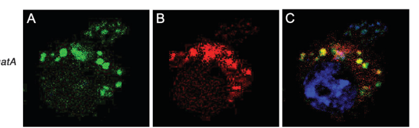

## Question

# Gene Research for Functional Annotation

## ⚠️ CRITICAL: Gene/Protein Identification Context

**BEFORE YOU BEGIN RESEARCH:** You MUST verify you are researching the CORRECT gene/protein. Gene symbols can be ambiguous, especially for less well-characterized genes from non-model organisms.

### Target Gene/Protein Identity (from UniProt):
- **UniProt Accession:** Q9VE09
- **Protein Description:** RecName: Full=Glutamyl-tRNA(Gln) amidotransferase subunit A, mitochondrial {ECO:0000255|HAMAP-Rule:MF_03150}; Short=Glu-AdT subunit A {ECO:0000255|HAMAP-Rule:MF_03150}; EC=3.5.1.2 {ECO:0000255|HAMAP-Rule:MF_03150};
- **Gene Information:** Name=GatA {ECO:0000255|HAMAP-Rule:MF_03150}; ORFNames=CG6007 {ECO:0000312|FlyBase:FBgn0260779};
- **Organism (full):** Drosophila melanogaster (Fruit fly).
- **Protein Family:** Belongs to the amidase family. GatA subfamily.
- **Key Domains:** Amidase. (IPR000120); Amidase_dom. (IPR023631); AS_sf. (IPR036928); GatA. (IPR004412); Amidase (PF01425)

### MANDATORY VERIFICATION STEPS:

1. **Check if the gene symbol "GatA" matches the protein description above**
2. **Verify the organism is correct:** Drosophila melanogaster (Fruit fly).
3. **Check if protein family/domains align with what you find in literature**
4. **If you find literature for a DIFFERENT gene with the same or similar symbol, STOP**

### If Gene Symbol is Ambiguous or You Cannot Find Relevant Literature:

**DO NOT PROCEED WITH RESEARCH ON A DIFFERENT GENE.** Instead:
- State clearly: "The gene symbol 'GatA' is ambiguous or literature is limited for this specific protein"
- Explain what you found (e.g., "Found extensive literature on a different gene with the same symbol in a different organism")
- Describe the protein based ONLY on the UniProt information provided above
- Suggest that the protein function can be inferred from domain/family information

### Research Target:

Please provide a comprehensive research report on the gene **GatA** (gene ID: GatA, UniProt: Q9VE09) in DROME.

The research report should be a detailed narrative explaining the function, biological processes, and localization of the gene product. Citations should be given for all claims.

You should prioritize authoritative reviews and primary scientific literature when conducting research. You can supplement
this with annotations you find in gene/protein databases, but these can be outdated or inaccurate.

We are specifically interested in the primary function of the gene - for enzymes, what reaction is catalyzed, and what is the substrate specificity? For transporters, what is the substrate? For structural proteins or adapters, what is the broader structural role? For signaling molecules, what is the role in the pathway.

We are interested in where in or outside the cell the gene product carries out its function.

We are also interested in the signaling or biochemical pathways in which the gene functions. We are less interested in broad pleiotropic effects, except where these elucidate the precise role.

Include evidence where possible. We are interested in both experimental evidence as well as inference from structure, evolution, or bioinformatic analysis. Precise studies should be prioritized over high-throughput, where available.

## Output

Question: You are an expert researcher providing comprehensive, well-cited information.

Provide detailed information focusing on:
1. Key concepts and definitions with current understanding
2. Recent developments and latest research (prioritize 2023-2024 sources)
3. Current applications and real-world implementations
4. Expert opinions and analysis from authoritative sources
5. Relevant statistics and data from recent studies

Format as a comprehensive research report with proper citations. Include URLs and publication dates where available.
Always prioritize recent, authoritative sources and provide specific citations for all major claims.

# Gene Research for Functional Annotation

## ⚠️ CRITICAL: Gene/Protein Identification Context

**BEFORE YOU BEGIN RESEARCH:** You MUST verify you are researching the CORRECT gene/protein. Gene symbols can be ambiguous, especially for less well-characterized genes from non-model organisms.

### Target Gene/Protein Identity (from UniProt):
- **UniProt Accession:** Q9VE09
- **Protein Description:** RecName: Full=Glutamyl-tRNA(Gln) amidotransferase subunit A, mitochondrial {ECO:0000255|HAMAP-Rule:MF_03150}; Short=Glu-AdT subunit A {ECO:0000255|HAMAP-Rule:MF_03150}; EC=3.5.1.2 {ECO:0000255|HAMAP-Rule:MF_03150};
- **Gene Information:** Name=GatA {ECO:0000255|HAMAP-Rule:MF_03150}; ORFNames=CG6007 {ECO:0000312|FlyBase:FBgn0260779};
- **Organism (full):** Drosophila melanogaster (Fruit fly).
- **Protein Family:** Belongs to the amidase family. GatA subfamily.
- **Key Domains:** Amidase. (IPR000120); Amidase_dom. (IPR023631); AS_sf. (IPR036928); GatA. (IPR004412); Amidase (PF01425)

### MANDATORY VERIFICATION STEPS:

1. **Check if the gene symbol "GatA" matches the protein description above**
2. **Verify the organism is correct:** Drosophila melanogaster (Fruit fly).
3. **Check if protein family/domains align with what you find in literature**
4. **If you find literature for a DIFFERENT gene with the same or similar symbol, STOP**

### If Gene Symbol is Ambiguous or You Cannot Find Relevant Literature:

**DO NOT PROCEED WITH RESEARCH ON A DIFFERENT GENE.** Instead:
- State clearly: "The gene symbol 'GatA' is ambiguous or literature is limited for this specific protein"
- Explain what you found (e.g., "Found extensive literature on a different gene with the same symbol in a different organism")
- Describe the protein based ONLY on the UniProt information provided above
- Suggest that the protein function can be inferred from domain/family information

### Research Target:

Please provide a comprehensive research report on the gene **GatA** (gene ID: GatA, UniProt: Q9VE09) in DROME.

The research report should be a detailed narrative explaining the function, biological processes, and localization of the gene product. Citations should be given for all claims.

You should prioritize authoritative reviews and primary scientific literature when conducting research. You can supplement
this with annotations you find in gene/protein databases, but these can be outdated or inaccurate.

We are specifically interested in the primary function of the gene - for enzymes, what reaction is catalyzed, and what is the substrate specificity? For transporters, what is the substrate? For structural proteins or adapters, what is the broader structural role? For signaling molecules, what is the role in the pathway.

We are interested in where in or outside the cell the gene product carries out its function.

We are also interested in the signaling or biochemical pathways in which the gene functions. We are less interested in broad pleiotropic effects, except where these elucidate the precise role.

Include evidence where possible. We are interested in both experimental evidence as well as inference from structure, evolution, or bioinformatic analysis. Precise studies should be prioritized over high-throughput, where available.

# Functional annotation report: *Drosophila melanogaster* GatA

## Identity and scope

The target is the fruit-fly gene *GatA*, previously called *benedict* (*bene*), corresponding to the user-specified CG6007/FlyBase FBgn0260779 and UniProt Q9VE09. Its product is the mitochondrial glutamyl-tRNA(Gln) amidotransferase **A subunit**, not a transcription factor or a glutaminyl-tRNA synthetase. Fly genetic studies identified *bene* mutations in *gatA* and found GatA to be the only obvious fly ortholog of this amidotransferase subunit; sequence similarity to human GatA was approximately 53%. The Q9VE09 accession and domain identifiers are supplied in the question rather than independently verified from a retrieved UniProt record. Human **QRSL1** and bacterial *gatA* encode related proteins but are **not** the fly gene; their biochemical results are identified below as comparative evidence. (morris2008mutationsinthe pages 1-2, morris2008mutationsinthe pages 4-6)

**Principal assignment:** GatA is the amidase-family, nitrogen-donating component of the mitochondrial tRNA-dependent pathway that produces **glutaminyl-tRNA^Gln (Gln-tRNA^Gln)** for translation of mitochondrial glutamine codons. This precise catalytic assignment is strongly supported by conservation and experiments on homologous GatCAB complexes; direct fly evidence establishes gene identity, mitochondrial localization and physiological necessity, but does not include a purified-fly-enzyme assay. The user-provided amidase/GatA InterPro and Pfam annotations are consistent with the A-subunit assignment and with the 2024 mechanistic review. (morris2008mutationsinthe pages 4-6, liao2006anefficientgenetic pages 4-5, lewis2024evolutionandvariation pages 8-9, nagao2009biogenesisofglutaminylmt pages 1-2)

## Reaction, substrate and pathway

The substrate is **glutamate attached to mitochondrial tRNA^Gln**, written Glu-tRNA^Gln—not free glutamate, uncharged tRNA^Gln or Glu-tRNA^Glu. A non-discriminating mitochondrial glutamyl-tRNA synthetase first attaches glutamate to tRNA^Gln. The Gat-containing amidotransferase then converts the glutamate side chain *while it remains tRNA-bound* into glutamine, yielding Gln-tRNA^Gln. The distinction between the mischarged tRNA^Gln intermediate and correctly charged Glu-tRNA^Glu is fundamental to the enzyme’s proposed specificity. This is the **indirect glutaminylation pathway**, rather than signaling through a conventional receptor cascade. (morris2008mutationsinthe pages 6-8, lewis2024evolutionandvariation pages 1-2, nagao2009biogenesisofglutaminylmt pages 1-2, antolinezfernandez2024molecularpathwaysin pages 10-11)

In the conserved GatCAB mechanism, **GatA hydrolyzes glutamine to supply ammonia**, **GatB uses ATP to phosphorylate the glutamyl group on Glu-tRNA^Gln**, and the ammonia amidates that activated group to form Gln-tRNA^Gln. GatC participates in complex assembly/stability: human GatC contacts GatA extensively and was coexpressed with it to obtain a soluble GatA–GatC complex. Thus GatA supplies the amide nitrogen; attributing ATP-dependent phosphorylation or tRNA recognition solely to isolated GatA would misstate the complex’s division of labor. The 2024 review notes that some bacterial GatCAB systems can also convert Asp-tRNA^Asn to Asn-tRNA^Asn; **an Asp-tRNA^Asn activity has not been demonstrated for fly GatA** and should not be assigned to Q9VE09 without evidence. (lewis2024evolutionandvariation pages 8-9, nagao2009biogenesisofglutaminylmt pages 4-5, lewis2024evolutionandvariation pages 7-7, nagao2009biogenesisofglutaminylmt pages 4-4)

The strongest substrate-specificity experiment available here is **human**, not fly, work: recombinant human GatCAB converted Glu-tRNA^Gln to Gln-tRNA^Gln but did **not** convert Glu-tRNA^Glu under the tested conditions. Conversion required the complete reconstituted system and a nitrogen donor; glutamine or NH₄⁺ supported product formation. The assembled human complex was estimated at approximately **132 kDa**. These observations support the fly functional annotation by homology, without establishing fly-specific kinetic constants, donor preferences or complex composition experimentally. (nagao2009biogenesisofglutaminylmt pages 4-5, nagao2009biogenesisofglutaminylmt pages 4-4)

The resulting Gln-tRNA^Gln supplies mitochondrial protein synthesis and thereby supports biogenesis of mitochondrially encoded respiratory-chain subunits. In the human system, mitochondrial EF-Tu bound the mischarged Glu-tRNA^Gln poorly relative to correctly charged Gln-tRNA^Gln, providing a plausible fidelity mechanism; this particular surveillance result has **not** been directly tested for fly GatA. The fly study noted glutamine residues in each of the **13** mitochondrially encoded polypeptides, but did not directly establish whether fly GatA deficiency causes glutamate misincorporation, translation arrest or a particular quantitative respiratory defect. (morris2008mutationsinthe pages 6-8, nagao2009biogenesisofglutaminylmt pages 4-5, nagao2009biogenesisofglutaminylmt pages 4-4)

## Site of action and direct fly evidence

**Mitochondrial localization is experimentally supported:** GatA–GFP expressed in *Drosophila* S2 cells colocalized with MitoTracker Orange. The cropped localization panels are shown in Liao *et al.*, **Figure 4A–C**. This is stronger evidence than the study’s approximately **56%** MitoProt localization prediction, but an expressed GFP fusion does not, by itself, establish the precise *submitochondrial* compartment or demonstrate localization of endogenous protein in every fly tissue. A mitochondrial-matrix site of tRNA processing is biochemically plausible; it should be treated as an inference rather than an imaging result for fly Q9VE09. (liao2006anefficientgenetic pages 4-5, liao2006anefficientgenetic media de419eaa)

Independent fly genetics supports the gene assignment. Morris *et al.* identified two premature-stop alleles (**W145STOP** and **W154STOP**) and a third allele affecting the **intron-3 splice donor**; mutant-allele and deficiency combinations had similar phenotypes. Importantly, the neighboring/nested gene *NP15.6* had no identified sequence change in these alleles and remained expressed in mutant larvae, helping separate *gatA*-specific effects from a nearby-gene artifact. The authors considered the characterized alleles genetic and molecular nulls. These experiments establish a requirement for *gatA*, although they do not constitute direct measurement of the tRNA amidation reaction in mutant flies. (morris2008mutationsinthe pages 3-4, morris2008mutationsinthe pages 4-6)

The physiological phenotype is consistent with a mitochondrial translation requirement. GatA-deficient larvae show impaired growth of **both mitotically dividing tissues and endoreplicating tissues**, reduced DNA accumulation in endoreplicating cells, delayed molts and death **before pupariation**. In one developmental comparison, at **five days after egg laying**, **76%** of mutant larvae had reached third instar and **24%** remained second instar, whereas wild-type siblings were third instar by day four (**P < 0.01**). Mutant eye clones are small and exhibit differentiation defects, indicating a cell-autonomous requirement. *gatA* transcripts were detected across examined larval tissues and adult ovary. These are informative functional consequences, **not proof that GatA directly regulates growth signaling, cell-cycle enzymes or eye specification**. (morris2008mutationsinthe pages 1-2, morris2008mutationsinthe pages 3-4, morris2008mutationsinthe pages 4-6, morris2008mutationsinthe pages 6-8)

The evidence hierarchy is summarized here; in particular, biochemical findings from human GatCAB must not be presented as fly measurements. (morris2008mutationsinthe pages 4-6, liao2006anefficientgenetic pages 4-5, nagao2009biogenesisofglutaminylmt pages 4-4)

| Evidence class | Exact observation | Interpretation / limitations for *Drosophila* GatA (Q9VE09; CG6007) |
|---|---|---|
| **Direct fly molecular genetics** | Morris et al., published **February 2008**, identified *bene* as *gatA*. The alleles encode **W145STOP**, **W154STOP**, and a **T→A intron-3 donor-site mutation** predicted to disrupt splicing. No sequence changes occurred in the nested *NP15.6* gene, and *NP15.6* remained strongly expressed in mutant larvae. [DOI/URL](https://doi.org/10.1534/genetics.107.084376) (morris2008mutationsinthe pages 3-4, morris2008mutationsinthe pages 4-6) | Strong, gene-specific evidence that the observed phenotypes result from loss of CG6007/*gatA*, rather than the neighboring/nested *NP15.6* gene. The study identifies the fly protein by genetics and homology but does not assay purified GatA catalysis. |
| **Direct fly localization** | Liao et al., published **September 2006**, expressed **GatA–GFP in Drosophila S2 cells**; GFP signal colocalized with membrane-potential-dependent **MitoTracker Orange CM-H₂TMRos**. [DOI/URL](https://doi.org/10.1534/genetics.106.061705) (liao2006anefficientgenetic pages 4-5, liao2006anefficientgenetic media de419eaa) | Direct evidence that fly GatA is mitochondrial, although obtained with an overexpressed fusion in cultured cells rather than endogenous protein in intact flies. It supports mitochondrial-matrix function but does not by itself resolve the submitochondrial compartment. |
| **Direct fly developmental phenotype** | Morris et al. found that mutants stopped substantial growth after approximately day 3, were markedly undersized by day 5, and died before pupariation. At **5 days after egg laying, 76%** were third instar and **24%** remained second instar, whereas wild-type siblings had reached third instar by day 4 (**P < 0.01**). [DOI/URL](https://doi.org/10.1534/genetics.107.084376) (morris2008mutationsinthe pages 1-2, morris2008mutationsinthe pages 3-4) | Demonstrates that GatA is required for larval growth, molting, viability, and growth of mitotic and endoreplicating tissues. These are downstream physiological effects and do not directly measure mitochondrial tRNA amidation or respiratory-chain activity. |
| **Biochemical evidence from the human homolog—not direct fly evidence** | Nagao et al., published **22 September 2009**, reconstituted an approximately **132-kDa human GatCAB heterotrimer**. Recombinant hGatCAB converted **Glu-tRNA^Gln**, but not **Glu-tRNA^Glu**, into Gln-tRNA^Gln; either **glutamine or NH₄⁺** supplied the amide nitrogen, and omission of hGatB, hGatCA, or the nitrogen donor abolished product formation. [DOI/URL](https://doi.org/10.1073/pnas.0907602106) (nagao2009biogenesisofglutaminylmt pages 4-5, nagao2009biogenesisofglutaminylmt pages 4-4) | Strong conserved-function evidence for assigning fly Q9VE09 to mitochondrial Glu-tRNA^Gln amidation, but the substrate specificity and complex mass were measured for **human hGatCAB/QRSL1**, not fly CG6007. They therefore remain orthology-based inferences for the fly protein. |
| **Current mechanistic synthesis** | Lewis et al., published **February 2024**, describe GatCAB as a three-step system: **GatA**, an amidase-family glutaminase, releases ammonia from an amide donor; **GatB** uses ATP to phosphorylate Glu-tRNA^Gln (or Asp-tRNA^Asn in other biological settings); ammonia then amidates the activated aminoacyl group. [DOI/URL](https://doi.org/10.1002/iub.2811) (lewis2024evolutionandvariation pages 8-9) | Supports the GatA amidase-domain assignment and catalytic division of labor. The reviewed passage does **not** itself establish GatC as a catalytic subunit; human structural/reconstitution work instead shows that GatC interacts extensively with GatA’s hydrophobic core and permits soluble GatA–GatC complex formation, consistent with a stabilizing/assembly role. This mechanism has not been purified and tested directly for fly Q9VE09. (nagao2009biogenesisofglutaminylmt pages 4-4) |

*Table: Evidence matrix separating direct Drosophila observations from biochemical conclusions inferred through conserved human and bacterial GatCAB mechanisms. It highlights what is established for CG6007/Q9VE09 and what remains untested in the fly protein.*

## Recent research and practical relevance

The **2024** review by Lewis *et al.* retains the indirect glutaminyl-tRNA pathway as the interpretation of the fly mutant data while emphasizing evolutionary variability: the presence of GatCAB homologs alone does not establish every possible substrate or rule out alternative pathways in other species. A separate **2024** review explains the corresponding human mitochondrial pathway—misaminoacylation of tRNA^Gln by EARS2 followed by glutamine-dependent GatCAB transamidation. The recent reviews refine mechanistic context; the fly-specific experimental foundation identified here remains the **2006 localization** and **2008 genetics** studies. The searches did not identify a 2023–2024 study measuring purified *Drosophila* Q9VE09 substrate specificity or reaction kinetics. (liao2006anefficientgenetic pages 4-5, lewis2024evolutionandvariation pages 7-7, antolinezfernandez2024molecularpathwaysin pages 10-11)

As an application, *gatA/bene* loss-of-function flies provide a genetically defined model for consequences of impaired mitochondrial tRNA maturation during development, while human **QRSL1/GatA** studies supply a clinically relevant *homologous* example. Human GatCAB depletion caused accumulation of Glu-charged mitochondrial tRNA^Gln and impaired growth under respiratory culture conditions; pathogenic human **QRSL1 p.G133V** was reported in a family with severe infantile mitochondrial disease and combined respiratory-chain deficiencies. Neither result establishes a fly clinical phenotype, a fly treatment or a direct biochemical assay of Q9VE09. (morris2008mutationsinthe pages 3-4, nagao2009biogenesisofglutaminylmt pages 3-4, kohda2016acomprehensivegenomic pages 7-8, nagao2009biogenesisofglutaminylmt pages 4-4)

## Principal sources and publication dates

- **Lewis AM *et al*.**, “Evolution and variation in amide aminoacyl-tRNA synthesis,” *IUBMB Life*, **February 2024**. https://doi.org/10.1002/iub.2811 — current expert synthesis of GatCAB mechanism and pathway diversity. (lewis2024evolutionandvariation pages 8-9, lewis2024evolutionandvariation pages 7-7)
- **Antolínez-Fernández Á *et al*.**, “Molecular pathways in mitochondrial disorders due to a defective mitochondrial protein synthesis,” *Frontiers in Cell and Developmental Biology*, **May 2024**. https://doi.org/10.3389/fcell.2024.1410245 — recent mitochondrial-translation context. (antolinezfernandez2024molecularpathwaysin pages 10-11)
- **Liao TSV *et al*.**, “An efficient genetic screen in Drosophila to identify nuclear-encoded genes with mitochondrial function,” *Genetics*, **September 2006**. https://doi.org/10.1534/genetics.106.061705 — fly GatA–GFP localization and mutant screen. (liao2006anefficientgenetic pages 4-5, liao2006anefficientgenetic media de419eaa)
- **Morris JZ *et al*.**, “Mutations in the Drosophila mitochondrial tRNA amidotransferase, bene/gatA, cause growth defects in mitotic and endoreplicating tissues,” *Genetics*, **February 2008**. https://doi.org/10.1534/genetics.107.084376 — fly gene identification, sequence conservation and loss-of-function genetics. (morris2008mutationsinthe pages 1-2, morris2008mutationsinthe pages 4-6)
- **Nagao A *et al*.**, “Biogenesis of glutaminyl-mt tRNA^Gln in human mitochondria,” *PNAS*, **September 2009**. https://doi.org/10.1073/pnas.0907602106 — human homolog reconstitution, tRNA-substrate discrimination and cellular pathway evidence. (nagao2009biogenesisofglutaminylmt pages 1-2, nagao2009biogenesisofglutaminylmt pages 4-4)

References

1. (morris2008mutationsinthe pages 1-2): Jason Z Morris, Leah Bergman, Anna Kruyer, Mikhail Gertsberg, Adriana Guigova, Ronald Arias, and Monika Pogorzelska. Mutations in the drosophila mitochondrial trna amidotransferase, bene/gata, cause growth defects in mitotic and endoreplicating tissues. Genetics, 178:979-987, Feb 2008. URL: https://doi.org/10.1534/genetics.107.084376, doi:10.1534/genetics.107.084376. This article has 13 citations and is from a domain leading peer-reviewed journal.

2. (morris2008mutationsinthe pages 4-6): Jason Z Morris, Leah Bergman, Anna Kruyer, Mikhail Gertsberg, Adriana Guigova, Ronald Arias, and Monika Pogorzelska. Mutations in the drosophila mitochondrial trna amidotransferase, bene/gata, cause growth defects in mitotic and endoreplicating tissues. Genetics, 178:979-987, Feb 2008. URL: https://doi.org/10.1534/genetics.107.084376, doi:10.1534/genetics.107.084376. This article has 13 citations and is from a domain leading peer-reviewed journal.

3. (liao2006anefficientgenetic pages 4-5): T S Vivian Liao, Gerald B Call, Preeta Guptan, Albert Cespedes, Jamie Marshall, Kevin Yackle, Edward Owusu-Ansah, Sudip Mandal, Q Angela Fang, Gelsey L Goodstein, William Kim, and Utpal Banerjee. An efficient genetic screen in drosophila to identify nuclear-encoded genes with mitochondrial function. Genetics, 174:525-533, Sep 2006. URL: https://doi.org/10.1534/genetics.106.061705, doi:10.1534/genetics.106.061705. This article has 49 citations and is from a domain leading peer-reviewed journal.

4. (lewis2024evolutionandvariation pages 8-9): Alexander M. Lewis, Trevor Fallon, Georgia A. Dittemore, and Kelly Sheppard. Evolution and variation in amide aminoacyl‐trna synthesis. IUBMB Life, 76:505-522, Feb 2024. URL: https://doi.org/10.1002/iub.2811, doi:10.1002/iub.2811. This article has 15 citations and is from a peer-reviewed journal.

5. (nagao2009biogenesisofglutaminylmt pages 1-2): Asuteka Nagao, Takeo Suzuki, Takayuki Katoh, Yuriko Sakaguchi, and Tsutomu Suzuki. Biogenesis of glutaminyl-mt trnagln in human mitochondria. Proceedings of the National Academy of Sciences, 106:16209-16214, Sep 2009. URL: https://doi.org/10.1073/pnas.0907602106, doi:10.1073/pnas.0907602106. This article has 145 citations and is from a highest quality peer-reviewed journal.

6. (morris2008mutationsinthe pages 6-8): Jason Z Morris, Leah Bergman, Anna Kruyer, Mikhail Gertsberg, Adriana Guigova, Ronald Arias, and Monika Pogorzelska. Mutations in the drosophila mitochondrial trna amidotransferase, bene/gata, cause growth defects in mitotic and endoreplicating tissues. Genetics, 178:979-987, Feb 2008. URL: https://doi.org/10.1534/genetics.107.084376, doi:10.1534/genetics.107.084376. This article has 13 citations and is from a domain leading peer-reviewed journal.

7. (lewis2024evolutionandvariation pages 1-2): Alexander M. Lewis, Trevor Fallon, Georgia A. Dittemore, and Kelly Sheppard. Evolution and variation in amide aminoacyl‐trna synthesis. IUBMB Life, 76:505-522, Feb 2024. URL: https://doi.org/10.1002/iub.2811, doi:10.1002/iub.2811. This article has 15 citations and is from a peer-reviewed journal.

8. (antolinezfernandez2024molecularpathwaysin pages 10-11): Álvaro Antolínez-Fernández, Paula Esteban-Ramos, Miguel Ángel Fernández-Moreno, and Paula Clemente. Molecular pathways in mitochondrial disorders due to a defective mitochondrial protein synthesis. Frontiers in Cell and Developmental Biology, May 2024. URL: https://doi.org/10.3389/fcell.2024.1410245, doi:10.3389/fcell.2024.1410245. This article has 19 citations.

9. (nagao2009biogenesisofglutaminylmt pages 4-5): Asuteka Nagao, Takeo Suzuki, Takayuki Katoh, Yuriko Sakaguchi, and Tsutomu Suzuki. Biogenesis of glutaminyl-mt trnagln in human mitochondria. Proceedings of the National Academy of Sciences, 106:16209-16214, Sep 2009. URL: https://doi.org/10.1073/pnas.0907602106, doi:10.1073/pnas.0907602106. This article has 145 citations and is from a highest quality peer-reviewed journal.

10. (lewis2024evolutionandvariation pages 7-7): Alexander M. Lewis, Trevor Fallon, Georgia A. Dittemore, and Kelly Sheppard. Evolution and variation in amide aminoacyl‐trna synthesis. IUBMB Life, 76:505-522, Feb 2024. URL: https://doi.org/10.1002/iub.2811, doi:10.1002/iub.2811. This article has 15 citations and is from a peer-reviewed journal.

11. (nagao2009biogenesisofglutaminylmt pages 4-4): Asuteka Nagao, Takeo Suzuki, Takayuki Katoh, Yuriko Sakaguchi, and Tsutomu Suzuki. Biogenesis of glutaminyl-mt trnagln in human mitochondria. Proceedings of the National Academy of Sciences, 106:16209-16214, Sep 2009. URL: https://doi.org/10.1073/pnas.0907602106, doi:10.1073/pnas.0907602106. This article has 145 citations and is from a highest quality peer-reviewed journal.

12. (liao2006anefficientgenetic media de419eaa): T S Vivian Liao, Gerald B Call, Preeta Guptan, Albert Cespedes, Jamie Marshall, Kevin Yackle, Edward Owusu-Ansah, Sudip Mandal, Q Angela Fang, Gelsey L Goodstein, William Kim, and Utpal Banerjee. An efficient genetic screen in drosophila to identify nuclear-encoded genes with mitochondrial function. Genetics, 174:525-533, Sep 2006. URL: https://doi.org/10.1534/genetics.106.061705, doi:10.1534/genetics.106.061705. This article has 49 citations and is from a domain leading peer-reviewed journal.

13. (morris2008mutationsinthe pages 3-4): Jason Z Morris, Leah Bergman, Anna Kruyer, Mikhail Gertsberg, Adriana Guigova, Ronald Arias, and Monika Pogorzelska. Mutations in the drosophila mitochondrial trna amidotransferase, bene/gata, cause growth defects in mitotic and endoreplicating tissues. Genetics, 178:979-987, Feb 2008. URL: https://doi.org/10.1534/genetics.107.084376, doi:10.1534/genetics.107.084376. This article has 13 citations and is from a domain leading peer-reviewed journal.

14. (nagao2009biogenesisofglutaminylmt pages 3-4): Asuteka Nagao, Takeo Suzuki, Takayuki Katoh, Yuriko Sakaguchi, and Tsutomu Suzuki. Biogenesis of glutaminyl-mt trnagln in human mitochondria. Proceedings of the National Academy of Sciences, 106:16209-16214, Sep 2009. URL: https://doi.org/10.1073/pnas.0907602106, doi:10.1073/pnas.0907602106. This article has 145 citations and is from a highest quality peer-reviewed journal.

15. (kohda2016acomprehensivegenomic pages 7-8): Masakazu Kohda, Yoshimi Tokuzawa, Yoshihito Kishita, Hiromi Nyuzuki, Yohsuke Moriyama, Yosuke Mizuno, Tomoko Hirata, Yukiko Yatsuka, Yzumi Yamashita-Sugahara, Yutaka Nakachi, Hidemasa Kato, Akihiko Okuda, Shunsuke Tamaru, Nurun Nahar Borna, Kengo Banshoya, Toshiro Aigaki, Yukiko Sato-Miyata, Kohei Ohnuma, Tsutomu Suzuki, Asuteka Nagao, Hazuki Maehata, Fumihiko Matsuda, Koichiro Higasa, Masao Nagasaki, Jun Yasuda, Masayuki Yamamoto, Takuya Fushimi, Masaru Shimura, Keiko Kaiho-Ichimoto, Hiroko Harashima, Taro Yamazaki, Masato Mori, Kei Murayama, Akira Ohtake, and Yasushi Okazaki. A comprehensive genomic analysis reveals the genetic landscape of mitochondrial respiratory chain complex deficiencies. PLOS Genetics, 12:e1005679, Jan 2016. URL: https://doi.org/10.1371/journal.pgen.1005679, doi:10.1371/journal.pgen.1005679. This article has 383 citations and is from a domain leading peer-reviewed journal.

## Artifacts

- [Edison artifact artifact-00](GatA-deep-research-falcon_artifacts/artifact-00.md)

## Citations

1. lewis2024evolutionandvariation pages 8-9
2. nagao2009biogenesisofglutaminylmt pages 4-4
3. antolinezfernandez2024molecularpathwaysin pages 10-11
4. morris2008mutationsinthe pages 1-2
5. morris2008mutationsinthe pages 4-6
6. liao2006anefficientgenetic pages 4-5
7. nagao2009biogenesisofglutaminylmt pages 1-2
8. morris2008mutationsinthe pages 6-8
9. lewis2024evolutionandvariation pages 1-2
10. nagao2009biogenesisofglutaminylmt pages 4-5
11. lewis2024evolutionandvariation pages 7-7
12. morris2008mutationsinthe pages 3-4
13. nagao2009biogenesisofglutaminylmt pages 3-4
14. kohda2016acomprehensivegenomic pages 7-8
15. DOI/URL
16. https://doi.org/10.1534/genetics.107.084376
17. https://doi.org/10.1534/genetics.106.061705
18. https://doi.org/10.1073/pnas.0907602106
19. https://doi.org/10.1002/iub.2811
20. https://doi.org/10.3389/fcell.2024.1410245
21. https://doi.org/10.1534/genetics.107.084376,
22. https://doi.org/10.1534/genetics.106.061705,
23. https://doi.org/10.1002/iub.2811,
24. https://doi.org/10.1073/pnas.0907602106,
25. https://doi.org/10.3389/fcell.2024.1410245,
26. https://doi.org/10.1371/journal.pgen.1005679,