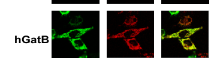

## Question

# Gene Research for Functional Annotation

## ⚠️ CRITICAL: Gene/Protein Identification Context

**BEFORE YOU BEGIN RESEARCH:** You MUST verify you are researching the CORRECT gene/protein. Gene symbols can be ambiguous, especially for less well-characterized genes from non-model organisms.

### Target Gene/Protein Identity (from UniProt):
- **UniProt Accession:** Q9VCD0
- **Protein Description:** RecName: Full=Glutamyl-tRNA(Gln) amidotransferase subunit B, mitochondrial {ECO:0000255|HAMAP-Rule:MF_03147}; Short=Glu-AdT subunit B {ECO:0000255|HAMAP-Rule:MF_03147}; EC=6.3.5.7 {ECO:0000255|HAMAP-Rule:MF_03147};
- **Gene Information:** Name=GatB {ECO:0000312|FlyBase:FBgn0039153}; ORFNames=CG5463 {ECO:0000312|FlyBase:FBgn0039153};
- **Organism (full):** Drosophila melanogaster (Fruit fly).
- **Protein Family:** Belongs to the GatB/GatE family. GatB subfamily.
- **Key Domains:** Asn/Gln-tRNA_amidoTrfase_suB/E. (IPR017959); Asn/Gln-tRNA_Trfase_suB/E_cat. (IPR006075); Asn/Gln_amidotransferase. (IPR018027); Asn/Gln_tRNA_amidoTrase-B-like. (IPR003789); GatB. (IPR004413)

### MANDATORY VERIFICATION STEPS:

1. **Check if the gene symbol "GatB" matches the protein description above**
2. **Verify the organism is correct:** Drosophila melanogaster (Fruit fly).
3. **Check if protein family/domains align with what you find in literature**
4. **If you find literature for a DIFFERENT gene with the same or similar symbol, STOP**

### If Gene Symbol is Ambiguous or You Cannot Find Relevant Literature:

**DO NOT PROCEED WITH RESEARCH ON A DIFFERENT GENE.** Instead:
- State clearly: "The gene symbol 'GatB' is ambiguous or literature is limited for this specific protein"
- Explain what you found (e.g., "Found extensive literature on a different gene with the same symbol in a different organism")
- Describe the protein based ONLY on the UniProt information provided above
- Suggest that the protein function can be inferred from domain/family information

### Research Target:

Please provide a comprehensive research report on the gene **GatB** (gene ID: GatB, UniProt: Q9VCD0) in DROME.

The research report should be a detailed narrative explaining the function, biological processes, and localization of the gene product. Citations should be given for all claims.

You should prioritize authoritative reviews and primary scientific literature when conducting research. You can supplement
this with annotations you find in gene/protein databases, but these can be outdated or inaccurate.

We are specifically interested in the primary function of the gene - for enzymes, what reaction is catalyzed, and what is the substrate specificity? For transporters, what is the substrate? For structural proteins or adapters, what is the broader structural role? For signaling molecules, what is the role in the pathway.

We are interested in where in or outside the cell the gene product carries out its function.

We are also interested in the signaling or biochemical pathways in which the gene functions. We are less interested in broad pleiotropic effects, except where these elucidate the precise role.

Include evidence where possible. We are interested in both experimental evidence as well as inference from structure, evolution, or bioinformatic analysis. Precise studies should be prioritized over high-throughput, where available.

## Output

Question: You are an expert researcher providing comprehensive, well-cited information.

Provide detailed information focusing on:
1. Key concepts and definitions with current understanding
2. Recent developments and latest research (prioritize 2023-2024 sources)
3. Current applications and real-world implementations
4. Expert opinions and analysis from authoritative sources
5. Relevant statistics and data from recent studies

Format as a comprehensive research report with proper citations. Include URLs and publication dates where available.
Always prioritize recent, authoritative sources and provide specific citations for all major claims.

# Gene Research for Functional Annotation

## ⚠️ CRITICAL: Gene/Protein Identification Context

**BEFORE YOU BEGIN RESEARCH:** You MUST verify you are researching the CORRECT gene/protein. Gene symbols can be ambiguous, especially for less well-characterized genes from non-model organisms.

### Target Gene/Protein Identity (from UniProt):
- **UniProt Accession:** Q9VCD0
- **Protein Description:** RecName: Full=Glutamyl-tRNA(Gln) amidotransferase subunit B, mitochondrial {ECO:0000255|HAMAP-Rule:MF_03147}; Short=Glu-AdT subunit B {ECO:0000255|HAMAP-Rule:MF_03147}; EC=6.3.5.7 {ECO:0000255|HAMAP-Rule:MF_03147};
- **Gene Information:** Name=GatB {ECO:0000312|FlyBase:FBgn0039153}; ORFNames=CG5463 {ECO:0000312|FlyBase:FBgn0039153};
- **Organism (full):** Drosophila melanogaster (Fruit fly).
- **Protein Family:** Belongs to the GatB/GatE family. GatB subfamily.
- **Key Domains:** Asn/Gln-tRNA_amidoTrfase_suB/E. (IPR017959); Asn/Gln-tRNA_Trfase_suB/E_cat. (IPR006075); Asn/Gln_amidotransferase. (IPR018027); Asn/Gln_tRNA_amidoTrase-B-like. (IPR003789); GatB. (IPR004413)

### MANDATORY VERIFICATION STEPS:

1. **Check if the gene symbol "GatB" matches the protein description above**
2. **Verify the organism is correct:** Drosophila melanogaster (Fruit fly).
3. **Check if protein family/domains align with what you find in literature**
4. **If you find literature for a DIFFERENT gene with the same or similar symbol, STOP**

### If Gene Symbol is Ambiguous or You Cannot Find Relevant Literature:

**DO NOT PROCEED WITH RESEARCH ON A DIFFERENT GENE.** Instead:
- State clearly: "The gene symbol 'GatB' is ambiguous or literature is limited for this specific protein"
- Explain what you found (e.g., "Found extensive literature on a different gene with the same symbol in a different organism")
- Describe the protein based ONLY on the UniProt information provided above
- Suggest that the protein function can be inferred from domain/family information

### Research Target:

Please provide a comprehensive research report on the gene **GatB** (gene ID: GatB, UniProt: Q9VCD0) in DROME.

The research report should be a detailed narrative explaining the function, biological processes, and localization of the gene product. Citations should be given for all claims.

You should prioritize authoritative reviews and primary scientific literature when conducting research. You can supplement
this with annotations you find in gene/protein databases, but these can be outdated or inaccurate.

We are specifically interested in the primary function of the gene - for enzymes, what reaction is catalyzed, and what is the substrate specificity? For transporters, what is the substrate? For structural proteins or adapters, what is the broader structural role? For signaling molecules, what is the role in the pathway.

We are interested in where in or outside the cell the gene product carries out its function.

We are also interested in the signaling or biochemical pathways in which the gene functions. We are less interested in broad pleiotropic effects, except where these elucidate the precise role.

Include evidence where possible. We are interested in both experimental evidence as well as inference from structure, evolution, or bioinformatic analysis. Precise studies should be prioritized over high-throughput, where available.

# Functional annotation report: *Drosophila melanogaster* GatB

**Identity and scope.** The target is the fruit-fly nuclear gene **GatB/CG5463**, corresponding to the supplied UniProt accession **Q9VCD0**. A fly-focused analysis explicitly assigns CG5463 to the B subunit of mitochondrial glutamyl-tRNA(Gln) amidotransferase; it identifies *GatA* as a separate gene and proposes **CG33649** as *GatC*. This verifies that the report concerns the fly’s GatB rather than its GatA partner, human **GATB**, or a bacterial gene of the same name. The supplied UniProt record additionally places Q9VCD0 in the GatB/GatE family, GatB subfamily, with tRNA-dependent amidotransferase B/E domains; that accession-to-protein mapping was supplied with the question rather than independently established by the retrieved papers. **Literature directly testing fly CG5463 is limited**, so the molecular annotation below distinguishes fly evidence from experiments on orthologs. [Lu et al., *Fly*, 2015, https://doi.org/10.1080/19336934.2015.1101196.] (lu2015theaminoacyltrnasynthetases pages 5-6)

## Primary molecular function and substrate

GatB is best annotated as the **ATP-dependent substrate-activation and tRNA-recognition subunit** of mitochondrial **GatCAB**, the complex that makes glutaminyl–mitochondrial tRNA^Gln for protein synthesis. In the indirect pathway, mitochondrial glutamyl-tRNA synthetase first attaches **glutamate** to mitochondrial tRNA^Gln, forming **Glu–tRNA^Gln**. GatCAB then converts the *glutamate already attached to that tRNA* into **glutamine**, yielding **Gln–tRNA^Gln**; it does not simply synthesize free glutamine or directly ligate free glutamine to tRNA. The complex uses ATP to activate the tRNA-bound glutamyl group and uses ammonia generated from **free glutamine** as the nitrogen source. GatA supplies the glutaminase activity, GatB activates and processes the aminoacyl-tRNA substrate, and GatC supports complex assembly. These assignments are experimentally established for mammalian and yeast complexes and are a **conservation-based inference for fly CG5463**, consistent with its fly annotation and supplied protein domains. [Nagao et al., *PNAS*, 22 September 2009, https://doi.org/10.1073/pnas.0907602106; Araiso et al., *Nucleic Acids Research*, 2014, https://doi.org/10.1093/nar/gku234; Lewis et al., *IUBMB Life*, 2024, https://doi.org/10.1002/iub.2811.] (lu2015theaminoacyltrnasynthetases pages 5-6, nagao2009biogenesisofglutaminylmt pages 1-2, lewis2024evolutionandvariation pages 8-9, araiso2014crystalstructureof pages 5-6)

**Substrate specificity matters:** the relevant mitochondrial substrate is **Glu–tRNA^Gln**, not normally charged **Glu–tRNA^Glu**. In human experiments, mitochondrial GluRS charged both tRNA species, while reconstituted GatCAB converted the mischarged tRNA^Gln to Gln–tRNA^Gln; depletion of GatCAB accumulated Glu–tRNA^Gln while mitochondrial tRNA^Glu remained aminoacylated. The 2024 biochemical review explains how GatCAB recognizes tRNA identity features and notes that GatCAB enzymes *in some other organisms* can also act on **Asp–tRNA^Asn**. That broader family capability **does not establish** Asp–tRNA^Asn activity for *Drosophila* mitochondrial GatB; no fly-specific substrate panel or kinetic constants were found. [Nagao et al., 2009, https://doi.org/10.1073/pnas.0907602106; Lewis et al., 2024, https://doi.org/10.1002/iub.2811.] (nagao2009biogenesisofglutaminylmt pages 4-5, nagao2009biogenesisofglutaminylmt pages 5-6, lewis2024evolutionandvariation pages 7-7, lewis2024evolutionandvariation pages 8-9)

## Biological pathway and cellular location

The immediate pathway is **mitochondrial tRNA^Gln maturation for mitochondrial translation**, upstream of synthesis of mitochondrially encoded respiratory-chain proteins. It is a translation-fidelity and oxidative-phosphorylation-support function, **not an established signaling role** for fly GatB. Lu and colleagues identified no fly mitochondrial glutaminyl-tRNA synthetase gene and assigned the GatA–GatB–GatC complex to the alternative, indirect route. A 2024 review likewise describes human mitochondrial EARS2-generated Glu–tRNA^Gln followed by glutamine-dependent GatCAB transamidation. These sources establish the pathway assignment but do not demonstrate that every biochemical intermediate has been measured in flies. [Lu et al., 2015, https://doi.org/10.1080/19336934.2015.1101196; Antolínez-Fernández et al., *Frontiers in Cell and Developmental Biology*, May 2024, https://doi.org/10.3389/fcell.2024.1410245.] (lu2015theaminoacyltrnasynthetases pages 5-6, antolinezfernandez2024molecularpathwaysin pages 10-11)

**Expected functional site: mitochondria, most plausibly the matrix**, where mitochondrial tRNAs and translation machinery operate. This is a localization **inference for Q9VCD0**, not a recovered fly imaging result. In direct ortholog experiments, fluorescently tagged human GatB colocalized with a mitochondrial marker, and human GatB expressed in another human cell assay localized to mitochondria. Those experiments support the organelle assignment but do not resolve the fly protein’s precise intramitochondrial compartment. [Nagao et al., 2009, https://doi.org/10.1073/pnas.0907602106; Friederich et al., *Nature Communications*, October 2018, https://doi.org/10.1038/s41467-018-06250-w.] (nagao2009biogenesisofglutaminylmt pages 2-3, nagao2009biogenesisofglutaminylmt media 5eab5188, friederich2018pathogenicvariantsin pages 8-9)

## Strength of evidence and quantitative findings

The evidence hierarchy is important for using this annotation responsibly:

| Topic | Specific evidence and organism | Confidence and limitation |
|:---|:---|:---|
| Target identity | A fly-focused analysis assigns *Drosophila melanogaster* CG5463 to GatB in the mitochondrial heterotrimeric glutamyl-tRNA(Gln) amidotransferase complex. GatA is separate, while CG33649 was proposed as GatC. (lu2015theaminoacyltrnasynthetases pages 5-6) | High confidence for gene assignment. The study did not directly test CG5463 enzymology or localization. |
| Fly genetics | Morris et al. studied *bene/gatA*, not CG5463/GatB. Fly *gatA* mutants had slow-growing mitotic and endoreplicating tissues, reduced tissue size, and larval death before pupariation. No GatB mutant, interaction test, mitochondrial-translation assay, or respiration assay was reported. (morris2008mutationsinthe pages 4-6, morris2008mutationsinthe pages 6-8) | Moderate pathway-level support only. These findings concern a partner subunit, not GatB itself. |
| Biochemical reaction | Recombinant human GatA–GatB–GatC formed an approximately 132-kDa complex and reconstituted conversion of mitochondrial Glu-tRNA(Gln) into Gln-tRNA(Gln). GatB provides ATP-dependent substrate activation, whereas GatA supplies ammonia from glutamine. (nagao2009biogenesisofglutaminylmt pages 4-5, nagao2009biogenesisofglutaminylmt pages 1-2) | High confidence for human GatCAB; inferred for fly GatB. No equivalent CG5463 biochemical assay was located. |
| Mitochondrial localization | In human HeLa cells, EGFP-tagged GatB and the other GatCAB subunits colocalized with MitoTracker. (nagao2009biogenesisofglutaminylmt pages 2-3, nagao2009biogenesisofglutaminylmt media 5eab5188) | High confidence for human mitochondrial localization. Neither mitochondrial nor matrix localization was directly imaged for fly CG5463 in the recovered literature. |
| Cellular requirement | Human siRNA reduced each GatCAB-subunit transcript to less than 15% of control. Depletion of any subunit impaired growth in galactose medium, while combined depletion caused Glu-tRNA(Gln) accumulation. (nagao2009biogenesisofglutaminylmt pages 3-4) | High confidence for human cells; indirect evidence for the fly protein. |
| Structure and mechanism | A 2.0-Å structure of yeast mitochondrial GatFAB revealed a GatA-to-GatB ammonia channel and a GatB active site modeled with ADP and Mg²⁺. Full-length enzyme converted Glu-tRNA(Gln) into Gln-tRNA(Gln), whereas deletion of GatB C-terminal helical or YqeY regions abolished measurable transamidation and impaired respiratory growth. (araiso2014crystalstructureof pages 5-6, araiso2014crystalstructureof pages 4-5) | Strong mechanistic evidence from yeast. Conservation supports application to fly GatB, but fly residues and kinetics remain untested. |
| Human physiological relevance | GatCAB defects were reported in nine human patients from five families. Lentiviral expression of wild-type GATB completely rescued respiratory-chain enzyme deficiency in GATB-patient fibroblasts, and tagged human GatB localized to mitochondria. (friederich2018pathogenicvariantsin pages 1-2, friederich2018pathogenicvariantsin pages 8-9) | High confidence for human GATB. The disease and rescue findings are not fly phenotypes. |
| Current understanding | A 2024 review describes GatCAB as coupling glutaminase-mediated ammonia production, ATP-dependent phosphorylation of Glu-tRNA(Gln) or Asp-tRNA(Asn), and final amidation. GatB is the kinase subunit, and tRNA determinants support substrate discrimination. (lewis2024evolutionandvariation pages 8-9) | Authoritative current synthesis, not a new fly experiment. It does not establish that fly mitochondrial GatCAB accepts Asp-tRNA(Asn). |
| Annotation judgment | Q9VCD0/CG5463 is best annotated as the mitochondrial GatB catalytic and tRNA-recognition subunit supporting indirect Gln-tRNA(Gln) synthesis and mitochondrial translation. (lu2015theaminoacyltrnasynthetases pages 5-6, nagao2009biogenesisofglutaminylmt pages 4-5, araiso2014crystalstructureof pages 5-6) | Strong orthology-based annotation with limited target-specific validation. Direct fly enzymology, complex purification, matrix imaging, loss-of-function phenotyping, and quantitative substrate-specificity data remain absent. |

*Table: Evidence supporting the functional annotation of Drosophila CG5463/Q9VCD0, with direct fly observations clearly separated from human and yeast ortholog evidence.*

In the most direct **fly pathway-related** study, mutations affected ***bene/gatA***—**not GatB/CG5463**. Mutant larvae died before pupariation, and mitotic and endoreplicating tissues grew abnormally slowly. The investigators did **not** directly assay CG5463, mitochondrial protein synthesis, or respiratory-chain activity in those mutants. These findings support biological importance of a fly GatCAB-associated subunit but cannot be reported as a GatB loss-of-function phenotype. [Morris et al., *Genetics*, February 2008, https://doi.org/10.1534/genetics.107.084376.] (morris2008mutationsinthe pages 4-6, morris2008mutationsinthe pages 6-8, morris2008mutationsinthe pages 1-2)

More precise **non-fly** tests establish the mechanistic interpretation. In human cells, purified GatA–GatB–GatC formed an approximately **132-kDa** complex with reconstituted transamidation activity. siRNA reduced individual subunit transcripts to **less than 15% of control**; depletion compromised growth under conditions demanding mitochondrial function and exposed accumulation of mischarged Glu–tRNA^Gln. In yeast, a **2.0-Å** mitochondrial GatFAB structure revealed the GatA/GatB catalytic arrangement and a potential ammonia-transfer tunnel; removal of GatB C-terminal regions eliminated measurable transamidation in the reported assay and impaired respiratory growth. These are quantitative or functional observations **in human cells and yeast, not measurements on fly Q9VCD0**. [Nagao et al., 2009, https://doi.org/10.1073/pnas.0907602106; Araiso et al., 2014, https://doi.org/10.1093/nar/gku234.] (nagao2009biogenesisofglutaminylmt pages 4-5, nagao2009biogenesisofglutaminylmt pages 3-4, araiso2014crystalstructureof pages 5-6)

## Current research and applications

Recent authoritative syntheses from **2024** continue to place mitochondrial GatCAB within indirect amide–aminoacyl-tRNA synthesis and mitochondrial protein-synthesis disorders. They clarify that bacterial, archaeal, and organellar amidotransferases differ in substrate range; they **do not provide a new experimental characterization of fly CG5463**. The most informative applications of the established biology are functional annotation of poorly characterized mitochondrial genes and interpretation of human mitochondrial-disease variants, rather than a demonstrated therapeutic application of fly GatB. [Lewis et al., 2024, https://doi.org/10.1002/iub.2811; Antolínez-Fernández et al., 2024, https://doi.org/10.3389/fcell.2024.1410245.] (lewis2024evolutionandvariation pages 7-7, lewis2024evolutionandvariation pages 8-9, antolinezfernandez2024molecularpathwaysin pages 10-11)

For clinical context **only**, a 2018 study identified GatCAB-subunit defects among **nine human patients from five families**, including a family with **GATB** variants. Expressing wild-type human GATB in affected fibroblasts rescued their respiratory-chain enzyme deficiency. This strongly validates the conserved pathway’s physiological importance, but the patients’ cardiomyopathy and rescue results are **human findings, not fly GatB phenotypes**. [Friederich et al., *Nature Communications*, October 2018, https://doi.org/10.1038/s41467-018-06250-w.] (friederich2018pathogenicvariantsin pages 1-2, friederich2018pathogenicvariantsin pages 8-9)

**Annotation conclusion.** *D. melanogaster* GatB/CG5463 (supplied accession Q9VCD0) is most defensibly described as the predicted **mitochondrial GatCAB B subunit**, enabling ATP-dependent conversion of **Glu–mt-tRNA^Gln to Gln–mt-tRNA^Gln** and thus supplying correctly charged tRNA for mitochondrial translation. Gene identity and pathway assignment are supported by fly-focused annotation; detailed catalytic mechanism and mitochondrial localization rely substantially on conserved human and yeast proteins. A direct assay of purified fly GatCAB, CG5463-specific genetics, fly-protein localization, and tests of possible alternative tRNA substrates remain unestablished in the literature recovered for this report. (lu2015theaminoacyltrnasynthetases pages 5-6, nagao2009biogenesisofglutaminylmt pages 4-5, morris2008mutationsinthe pages 4-6, araiso2014crystalstructureof pages 5-6)

References

1. (lu2015theaminoacyltrnasynthetases pages 5-6): Jiongming Lu, Steven J Marygold, Walid H Gharib, and Beat Suter. The aminoacyl-trna synthetases of drosophila melanogaster. Fly, 9:53-61, Apr 2015. URL: https://doi.org/10.1080/19336934.2015.1101196, doi:10.1080/19336934.2015.1101196. This article has 15 citations and is from a peer-reviewed journal.

2. (nagao2009biogenesisofglutaminylmt pages 1-2): Asuteka Nagao, Takeo Suzuki, Takayuki Katoh, Yuriko Sakaguchi, and Tsutomu Suzuki. Biogenesis of glutaminyl-mt trnagln in human mitochondria. Proceedings of the National Academy of Sciences, 106:16209-16214, Sep 2009. URL: https://doi.org/10.1073/pnas.0907602106, doi:10.1073/pnas.0907602106. This article has 145 citations and is from a highest quality peer-reviewed journal.

3. (lewis2024evolutionandvariation pages 8-9): Alexander M. Lewis, Trevor Fallon, Georgia A. Dittemore, and Kelly Sheppard. Evolution and variation in amide aminoacyl‐trna synthesis. IUBMB Life, 76:505-522, Feb 2024. URL: https://doi.org/10.1002/iub.2811, doi:10.1002/iub.2811. This article has 15 citations and is from a peer-reviewed journal.

4. (araiso2014crystalstructureof pages 5-6): Yuhei Araiso, Jonathan L. Huot, Takuya Sekiguchi, Mathieu Frechin, Frédéric Fischer, Ludovic Enkler, Bruno Senger, Ryuichiro Ishitani, Hubert D. Becker, and Osamu Nureki. Crystal structure of saccharomyces cerevisiae mitochondrial gatfab reveals a novel subunit assembly in trna-dependent amidotransferases. Nucleic Acids Research, 42:6052-6063, Apr 2014. URL: https://doi.org/10.1093/nar/gku234, doi:10.1093/nar/gku234. This article has 18 citations and is from a highest quality peer-reviewed journal.

5. (nagao2009biogenesisofglutaminylmt pages 4-5): Asuteka Nagao, Takeo Suzuki, Takayuki Katoh, Yuriko Sakaguchi, and Tsutomu Suzuki. Biogenesis of glutaminyl-mt trnagln in human mitochondria. Proceedings of the National Academy of Sciences, 106:16209-16214, Sep 2009. URL: https://doi.org/10.1073/pnas.0907602106, doi:10.1073/pnas.0907602106. This article has 145 citations and is from a highest quality peer-reviewed journal.

6. (nagao2009biogenesisofglutaminylmt pages 5-6): Asuteka Nagao, Takeo Suzuki, Takayuki Katoh, Yuriko Sakaguchi, and Tsutomu Suzuki. Biogenesis of glutaminyl-mt trnagln in human mitochondria. Proceedings of the National Academy of Sciences, 106:16209-16214, Sep 2009. URL: https://doi.org/10.1073/pnas.0907602106, doi:10.1073/pnas.0907602106. This article has 145 citations and is from a highest quality peer-reviewed journal.

7. (lewis2024evolutionandvariation pages 7-7): Alexander M. Lewis, Trevor Fallon, Georgia A. Dittemore, and Kelly Sheppard. Evolution and variation in amide aminoacyl‐trna synthesis. IUBMB Life, 76:505-522, Feb 2024. URL: https://doi.org/10.1002/iub.2811, doi:10.1002/iub.2811. This article has 15 citations and is from a peer-reviewed journal.

8. (antolinezfernandez2024molecularpathwaysin pages 10-11): Álvaro Antolínez-Fernández, Paula Esteban-Ramos, Miguel Ángel Fernández-Moreno, and Paula Clemente. Molecular pathways in mitochondrial disorders due to a defective mitochondrial protein synthesis. Frontiers in Cell and Developmental Biology, May 2024. URL: https://doi.org/10.3389/fcell.2024.1410245, doi:10.3389/fcell.2024.1410245. This article has 19 citations.

9. (nagao2009biogenesisofglutaminylmt pages 2-3): Asuteka Nagao, Takeo Suzuki, Takayuki Katoh, Yuriko Sakaguchi, and Tsutomu Suzuki. Biogenesis of glutaminyl-mt trnagln in human mitochondria. Proceedings of the National Academy of Sciences, 106:16209-16214, Sep 2009. URL: https://doi.org/10.1073/pnas.0907602106, doi:10.1073/pnas.0907602106. This article has 145 citations and is from a highest quality peer-reviewed journal.

10. (nagao2009biogenesisofglutaminylmt media 5eab5188): Asuteka Nagao, Takeo Suzuki, Takayuki Katoh, Yuriko Sakaguchi, and Tsutomu Suzuki. Biogenesis of glutaminyl-mt trnagln in human mitochondria. Proceedings of the National Academy of Sciences, 106:16209-16214, Sep 2009. URL: https://doi.org/10.1073/pnas.0907602106, doi:10.1073/pnas.0907602106. This article has 145 citations and is from a highest quality peer-reviewed journal.

11. (friederich2018pathogenicvariantsin pages 8-9): Marisa W. Friederich, Sharita Timal, Christopher A. Powell, Cristina Dallabona, Alina Kurolap, Sara Palacios-Zambrano, Drago Bratkovic, Terry G. J. Derks, David Bick, Katelijne Bouman, Kathryn C. Chatfield, Nadine Damouny-Naoum, Megan K. Dishop, Tzipora C. Falik-Zaccai, Fuad Fares, Ayalla Fedida, Ileana Ferrero, Renata C. Gallagher, Rafael Garesse, Micol Gilberti, Cristina González, Katherine Gowan, Clair Habib, Rebecca K. Halligan, Limor Kalfon, Kaz Knight, Dirk Lefeber, Laura Mamblona, Hanna Mandel, Adi Mory, John Ottoson, Tamar Paperna, Ger J. M. Pruijn, Pedro F. Rebelo-Guiomar, Ann Saada, Bruno Sainz, Hayley Salvemini, Mirthe H. Schoots, Jan A. Smeitink, Maciej J. Szukszto, Hendrik J. ter Horst, Frans van den Brandt, Francjan J. van Spronsen, Joris A. Veltman, Eric Wartchow, Liesbeth T. Wintjes, Yaniv Zohar, Miguel A. Fernández-Moreno, Hagit N. Baris, Claudia Donnini, Michal Minczuk, Richard J. Rodenburg, and Johan L. K. Van Hove. Pathogenic variants in glutamyl-trnagln amidotransferase subunits cause a lethal mitochondrial cardiomyopathy disorder. Nature Communications, Oct 2018. URL: https://doi.org/10.1038/s41467-018-06250-w, doi:10.1038/s41467-018-06250-w. This article has 61 citations and is from a highest quality peer-reviewed journal.

12. (morris2008mutationsinthe pages 4-6): Jason Z Morris, Leah Bergman, Anna Kruyer, Mikhail Gertsberg, Adriana Guigova, Ronald Arias, and Monika Pogorzelska. Mutations in the drosophila mitochondrial trna amidotransferase, bene/gata, cause growth defects in mitotic and endoreplicating tissues. Genetics, 178:979-987, Feb 2008. URL: https://doi.org/10.1534/genetics.107.084376, doi:10.1534/genetics.107.084376. This article has 13 citations and is from a domain leading peer-reviewed journal.

13. (morris2008mutationsinthe pages 6-8): Jason Z Morris, Leah Bergman, Anna Kruyer, Mikhail Gertsberg, Adriana Guigova, Ronald Arias, and Monika Pogorzelska. Mutations in the drosophila mitochondrial trna amidotransferase, bene/gata, cause growth defects in mitotic and endoreplicating tissues. Genetics, 178:979-987, Feb 2008. URL: https://doi.org/10.1534/genetics.107.084376, doi:10.1534/genetics.107.084376. This article has 13 citations and is from a domain leading peer-reviewed journal.

14. (nagao2009biogenesisofglutaminylmt pages 3-4): Asuteka Nagao, Takeo Suzuki, Takayuki Katoh, Yuriko Sakaguchi, and Tsutomu Suzuki. Biogenesis of glutaminyl-mt trnagln in human mitochondria. Proceedings of the National Academy of Sciences, 106:16209-16214, Sep 2009. URL: https://doi.org/10.1073/pnas.0907602106, doi:10.1073/pnas.0907602106. This article has 145 citations and is from a highest quality peer-reviewed journal.

15. (araiso2014crystalstructureof pages 4-5): Yuhei Araiso, Jonathan L. Huot, Takuya Sekiguchi, Mathieu Frechin, Frédéric Fischer, Ludovic Enkler, Bruno Senger, Ryuichiro Ishitani, Hubert D. Becker, and Osamu Nureki. Crystal structure of saccharomyces cerevisiae mitochondrial gatfab reveals a novel subunit assembly in trna-dependent amidotransferases. Nucleic Acids Research, 42:6052-6063, Apr 2014. URL: https://doi.org/10.1093/nar/gku234, doi:10.1093/nar/gku234. This article has 18 citations and is from a highest quality peer-reviewed journal.

16. (friederich2018pathogenicvariantsin pages 1-2): Marisa W. Friederich, Sharita Timal, Christopher A. Powell, Cristina Dallabona, Alina Kurolap, Sara Palacios-Zambrano, Drago Bratkovic, Terry G. J. Derks, David Bick, Katelijne Bouman, Kathryn C. Chatfield, Nadine Damouny-Naoum, Megan K. Dishop, Tzipora C. Falik-Zaccai, Fuad Fares, Ayalla Fedida, Ileana Ferrero, Renata C. Gallagher, Rafael Garesse, Micol Gilberti, Cristina González, Katherine Gowan, Clair Habib, Rebecca K. Halligan, Limor Kalfon, Kaz Knight, Dirk Lefeber, Laura Mamblona, Hanna Mandel, Adi Mory, John Ottoson, Tamar Paperna, Ger J. M. Pruijn, Pedro F. Rebelo-Guiomar, Ann Saada, Bruno Sainz, Hayley Salvemini, Mirthe H. Schoots, Jan A. Smeitink, Maciej J. Szukszto, Hendrik J. ter Horst, Frans van den Brandt, Francjan J. van Spronsen, Joris A. Veltman, Eric Wartchow, Liesbeth T. Wintjes, Yaniv Zohar, Miguel A. Fernández-Moreno, Hagit N. Baris, Claudia Donnini, Michal Minczuk, Richard J. Rodenburg, and Johan L. K. Van Hove. Pathogenic variants in glutamyl-trnagln amidotransferase subunits cause a lethal mitochondrial cardiomyopathy disorder. Nature Communications, Oct 2018. URL: https://doi.org/10.1038/s41467-018-06250-w, doi:10.1038/s41467-018-06250-w. This article has 61 citations and is from a highest quality peer-reviewed journal.

17. (morris2008mutationsinthe pages 1-2): Jason Z Morris, Leah Bergman, Anna Kruyer, Mikhail Gertsberg, Adriana Guigova, Ronald Arias, and Monika Pogorzelska. Mutations in the drosophila mitochondrial trna amidotransferase, bene/gata, cause growth defects in mitotic and endoreplicating tissues. Genetics, 178:979-987, Feb 2008. URL: https://doi.org/10.1534/genetics.107.084376, doi:10.1534/genetics.107.084376. This article has 13 citations and is from a domain leading peer-reviewed journal.

## Artifacts

- [Edison artifact artifact-00](GatB-deep-research-falcon_artifacts/artifact-00.md)

## Citations

1. lu2015theaminoacyltrnasynthetases pages 5-6
2. nagao2009biogenesisofglutaminylmt pages 3-4
3. lewis2024evolutionandvariation pages 8-9
4. nagao2009biogenesisofglutaminylmt pages 1-2
5. araiso2014crystalstructureof pages 5-6
6. nagao2009biogenesisofglutaminylmt pages 4-5
7. nagao2009biogenesisofglutaminylmt pages 5-6
8. lewis2024evolutionandvariation pages 7-7
9. antolinezfernandez2024molecularpathwaysin pages 10-11
10. nagao2009biogenesisofglutaminylmt pages 2-3
11. friederich2018pathogenicvariantsin pages 8-9
12. morris2008mutationsinthe pages 4-6
13. morris2008mutationsinthe pages 6-8
14. araiso2014crystalstructureof pages 4-5
15. friederich2018pathogenicvariantsin pages 1-2
16. morris2008mutationsinthe pages 1-2
17. Lu et al., *Fly*, 2015, https://doi.org/10.1080/19336934.2015.1101196.
18. Nagao et al., *PNAS*, 22 September 2009, https://doi.org/10.1073/pnas.0907602106; Araiso et al., *Nucleic Acids Research*, 2014, https://doi.org/10.1093/nar/gku234; Lewis et al., *IUBMB Life*, 2024, https://doi.org/10.1002/iub.2811.
19. Nagao et al., 2009, https://doi.org/10.1073/pnas.0907602106; Lewis et al., 2024, https://doi.org/10.1002/iub.2811.
20. Lu et al., 2015, https://doi.org/10.1080/19336934.2015.1101196; Antolínez-Fernández et al., *Frontiers in Cell and Developmental Biology*, May 2024, https://doi.org/10.3389/fcell.2024.1410245.
21. Nagao et al., 2009, https://doi.org/10.1073/pnas.0907602106; Friederich et al., *Nature Communications*, October 2018, https://doi.org/10.1038/s41467-018-06250-w.
22. Morris et al., *Genetics*, February 2008, https://doi.org/10.1534/genetics.107.084376.
23. Nagao et al., 2009, https://doi.org/10.1073/pnas.0907602106; Araiso et al., 2014, https://doi.org/10.1093/nar/gku234.
24. Lewis et al., 2024, https://doi.org/10.1002/iub.2811; Antolínez-Fernández et al., 2024, https://doi.org/10.3389/fcell.2024.1410245.
25. Friederich et al., *Nature Communications*, October 2018, https://doi.org/10.1038/s41467-018-06250-w.
26. https://doi.org/10.1080/19336934.2015.1101196.]
27. https://doi.org/10.1073/pnas.0907602106;
28. https://doi.org/10.1093/nar/gku234;
29. https://doi.org/10.1002/iub.2811.]
30. https://doi.org/10.1080/19336934.2015.1101196;
31. https://doi.org/10.3389/fcell.2024.1410245.]
32. https://doi.org/10.1038/s41467-018-06250-w.]
33. https://doi.org/10.1534/genetics.107.084376.]
34. https://doi.org/10.1093/nar/gku234.]
35. https://doi.org/10.1002/iub.2811;
36. https://doi.org/10.1080/19336934.2015.1101196,
37. https://doi.org/10.1073/pnas.0907602106,
38. https://doi.org/10.1002/iub.2811,
39. https://doi.org/10.1093/nar/gku234,
40. https://doi.org/10.3389/fcell.2024.1410245,
41. https://doi.org/10.1038/s41467-018-06250-w,
42. https://doi.org/10.1534/genetics.107.084376,