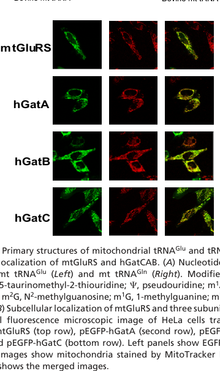

## Question

# Gene Research for Functional Annotation

## ⚠️ CRITICAL: Gene/Protein Identification Context

**BEFORE YOU BEGIN RESEARCH:** You MUST verify you are researching the CORRECT gene/protein. Gene symbols can be ambiguous, especially for less well-characterized genes from non-model organisms.

### Target Gene/Protein Identity (from UniProt):
- **UniProt Accession:** Q86BL4
- **Protein Description:** RecName: Full=Glutamyl-tRNA(Gln) amidotransferase subunit C, mitochondrial {ECO:0000255|HAMAP-Rule:MF_03149}; Short=Glu-AdT subunit C {ECO:0000255|HAMAP-Rule:MF_03149};
- **Gene Information:** Name=GatC {ECO:0000312|FlyBase:FBgn0064115}; ORFNames=CG33649 {ECO:0000312|FlyBase:FBgn0064115};
- **Organism (full):** Drosophila melanogaster (Fruit fly).
- **Protein Family:** Belongs to the GatC family. {ECO:0000255|HAMAP-
- **Key Domains:** Asp/Glu-ADT_sf_sub_c. (IPR036113); GatC. (IPR003837); GatC (PF02686)

### MANDATORY VERIFICATION STEPS:

1. **Check if the gene symbol "GatC" matches the protein description above**
2. **Verify the organism is correct:** Drosophila melanogaster (Fruit fly).
3. **Check if protein family/domains align with what you find in literature**
4. **If you find literature for a DIFFERENT gene with the same or similar symbol, STOP**

### If Gene Symbol is Ambiguous or You Cannot Find Relevant Literature:

**DO NOT PROCEED WITH RESEARCH ON A DIFFERENT GENE.** Instead:
- State clearly: "The gene symbol 'GatC' is ambiguous or literature is limited for this specific protein"
- Explain what you found (e.g., "Found extensive literature on a different gene with the same symbol in a different organism")
- Describe the protein based ONLY on the UniProt information provided above
- Suggest that the protein function can be inferred from domain/family information

### Research Target:

Please provide a comprehensive research report on the gene **GatC** (gene ID: GatC, UniProt: Q86BL4) in DROME.

The research report should be a detailed narrative explaining the function, biological processes, and localization of the gene product. Citations should be given for all claims.

You should prioritize authoritative reviews and primary scientific literature when conducting research. You can supplement
this with annotations you find in gene/protein databases, but these can be outdated or inaccurate.

We are specifically interested in the primary function of the gene - for enzymes, what reaction is catalyzed, and what is the substrate specificity? For transporters, what is the substrate? For structural proteins or adapters, what is the broader structural role? For signaling molecules, what is the role in the pathway.

We are interested in where in or outside the cell the gene product carries out its function.

We are also interested in the signaling or biochemical pathways in which the gene functions. We are less interested in broad pleiotropic effects, except where these elucidate the precise role.

Include evidence where possible. We are interested in both experimental evidence as well as inference from structure, evolution, or bioinformatic analysis. Precise studies should be prioritized over high-throughput, where available.

## Output

Question: You are an expert researcher providing comprehensive, well-cited information.

Provide detailed information focusing on:
1. Key concepts and definitions with current understanding
2. Recent developments and latest research (prioritize 2023-2024 sources)
3. Current applications and real-world implementations
4. Expert opinions and analysis from authoritative sources
5. Relevant statistics and data from recent studies

Format as a comprehensive research report with proper citations. Include URLs and publication dates where available.
Always prioritize recent, authoritative sources and provide specific citations for all major claims.

# Gene Research for Functional Annotation

## ⚠️ CRITICAL: Gene/Protein Identification Context

**BEFORE YOU BEGIN RESEARCH:** You MUST verify you are researching the CORRECT gene/protein. Gene symbols can be ambiguous, especially for less well-characterized genes from non-model organisms.

### Target Gene/Protein Identity (from UniProt):
- **UniProt Accession:** Q86BL4
- **Protein Description:** RecName: Full=Glutamyl-tRNA(Gln) amidotransferase subunit C, mitochondrial {ECO:0000255|HAMAP-Rule:MF_03149}; Short=Glu-AdT subunit C {ECO:0000255|HAMAP-Rule:MF_03149};
- **Gene Information:** Name=GatC {ECO:0000312|FlyBase:FBgn0064115}; ORFNames=CG33649 {ECO:0000312|FlyBase:FBgn0064115};
- **Organism (full):** Drosophila melanogaster (Fruit fly).
- **Protein Family:** Belongs to the GatC family. {ECO:0000255|HAMAP-
- **Key Domains:** Asp/Glu-ADT_sf_sub_c. (IPR036113); GatC. (IPR003837); GatC (PF02686)

### MANDATORY VERIFICATION STEPS:

1. **Check if the gene symbol "GatC" matches the protein description above**
2. **Verify the organism is correct:** Drosophila melanogaster (Fruit fly).
3. **Check if protein family/domains align with what you find in literature**
4. **If you find literature for a DIFFERENT gene with the same or similar symbol, STOP**

### If Gene Symbol is Ambiguous or You Cannot Find Relevant Literature:

**DO NOT PROCEED WITH RESEARCH ON A DIFFERENT GENE.** Instead:
- State clearly: "The gene symbol 'GatC' is ambiguous or literature is limited for this specific protein"
- Explain what you found (e.g., "Found extensive literature on a different gene with the same symbol in a different organism")
- Describe the protein based ONLY on the UniProt information provided above
- Suggest that the protein function can be inferred from domain/family information

### Research Target:

Please provide a comprehensive research report on the gene **GatC** (gene ID: GatC, UniProt: Q86BL4) in DROME.

The research report should be a detailed narrative explaining the function, biological processes, and localization of the gene product. Citations should be given for all claims.

You should prioritize authoritative reviews and primary scientific literature when conducting research. You can supplement
this with annotations you find in gene/protein databases, but these can be outdated or inaccurate.

We are specifically interested in the primary function of the gene - for enzymes, what reaction is catalyzed, and what is the substrate specificity? For transporters, what is the substrate? For structural proteins or adapters, what is the broader structural role? For signaling molecules, what is the role in the pathway.

We are interested in where in or outside the cell the gene product carries out its function.

We are also interested in the signaling or biochemical pathways in which the gene functions. We are less interested in broad pleiotropic effects, except where these elucidate the precise role.

Include evidence where possible. We are interested in both experimental evidence as well as inference from structure, evolution, or bioinformatic analysis. Precise studies should be prioritized over high-throughput, where available.

# Functional annotation of *Drosophila melanogaster* GatC

**Identity and evidence boundary.** The requested protein is **GatC/CG33649**, identified in the question as UniProt **Q86BL4**. A fly-focused analysis independently assigns **CG33649 to GatC**, **CG5463 to GatB**, and the previously characterized **gatA/bene** gene to GatA: these are three distinct genes proposed to encode the mitochondrial GatCAB complex. The supplied GatC-family annotations—**PF02686, IPR003837 and IPR036113**—are consistent with this assignment, although the accession-to-sequence and domain calls were supplied in the question rather than independently established by the cited experiments. “GATC” can also denote the human homolog or the unrelated DNA sequence 5′-GATC-3′; neither should be confused with the fly gene. **Literature directly testing fly CG33649 is limited**, so its detailed molecular role is principally an orthology-based annotation, not a demonstrated fly-specific biochemical activity. [Lu et al., *Fly*, published 2015, https://doi.org/10.1080/19336934.2015.1101196.] (lu2015theaminoacyltrnasynthetases pages 5-6)

The distinction between direct and inferred evidence is summarized here:

| Finding | Evidence/species | Interpretation / limitation |
|---|---|---|
| **Identity:** *D. melanogaster* CG33649 was assigned the name **GatC** as the third subunit of mitochondrial Glu-tRNA(Gln) amidotransferase, alongside GatA and CG5463/GatB (lu2015theaminoacyltrnasynthetases pages 5-6). | Comparative annotation of the fly aminoacyl-tRNA machinery; **Q86BL4**, PF02686/GatC, IPR003837/GatC and IPR036113/Asp/Glu-ADT subunit C were supplied in the query. | The gene symbol and predicted protein family are mutually consistent. The accession and domain identifiers are supplied database annotations, not independently validated experimental findings. |
| **Structural role:** GatC wraps around the GatA–GatB interface as a molecular “belt,” stabilizing the catalytic subunits (nakamura2006ammoniachannelcouples pages 13-18, nakamura2006ammoniachannelcouples pages 1-6, lewis2024evolutionandvariation pages 9-9). | *Staphylococcus aureus* GatCAB crystal structures (2006) and a conserved-mechanism review (2024). | Strong support for the function of the GatC family, but no structure or binding experiment was performed with fly Q86BL4. |
| **Pathway and substrate:** GatCAB converts misacylated **Glu-mt-tRNA(Gln)** to **Gln-mt-tRNA(Gln)**. GatA generates ammonia from glutamine; GatB uses ATP to activate the tRNA-linked glutamyl group and catalyze amidation (nakamura2006ammoniachannelcouples pages 6-10, nakamura2006ammoniachannelcouples pages 1-6, lewis2024evolutionandvariation pages 9-9). | Bacterial structural biochemistry, human mitochondrial reconstitution and yeast mitochondrial studies (araiso2014crystalstructureof pages 1-2, nagao2009biogenesisofglutaminylmt pages 4-5). | GatC is principally architectural, not the catalytic glutaminase or ATP-dependent transamidase. Fly specificity is inferred rather than demonstrated with purified Q86BL4. |
| **Mitochondrial localization and requirement:** EGFP-tagged human GatC colocalized with a mitochondrial marker; GatC knockdown to below 15% of control transcript impaired HeLa-cell growth in respiration-dependent galactose medium (nagao2009biogenesisofglutaminylmt pages 2-3, nagao2009biogenesisofglutaminylmt media 49349652, nagao2009biogenesisofglutaminylmt pages 3-4). | Human cells, 2009. | Strong ortholog-level evidence for mitochondrial localization and respiratory importance, but not direct localization of Drosophila Q86BL4. |
| **Human disease relevance:** Pathogenic variants across **QRSL1/GatA, GATB and GATC** were reported in **nine patients from five families**, with lethal metabolic cardiomyopathy and lactic acidosis; GATC-affected fibroblasts showed reduced GatC, secondary loss of GatA/GatB and defective mitochondrial translation (friederich2018pathogenicvariantsin pages 1-2, friederich2018pathogenicvariantsin pages 6-7, friederich2018pathogenicvariantsin pages 5-6). | Human cohort, 2018; summarized in a 2024 review (antolinezfernandez2024molecularpathwaysin pages 11-12). | Nine is the size of the entire three-gene cohort, not nine GATC cases. These data support GatC-mediated complex stability but do not establish a fly phenotype. |
| **Fly genetic evidence is indirect:** Loss of **gatA/bene** caused slow growth of mitotic and endoreplicating tissues, small mutant eye clones and death before pupariation (morris2008mutationsinthe pages 1-2, morris2008mutationsinthe pages 6-8). | *D. melanogaster*, 2008. | This experiment concerns the catalytic **GatA** subunit, not CG33649/GatC. It supports the pathway’s importance in flies but is not direct Q86BL4 evidence. |

*Table: Evidence-level summary for Drosophila Q86BL4/CG33649, separating direct fly annotation from mechanistic evidence obtained in bacterial, yeast and human systems. It highlights where functional conclusions remain orthology-based.*

## Primary function, reaction and substrate specificity

**Best-supported function:** fly GatC is the predicted **noncatalytic assembly/stabilizing subunit** of mitochondrial glutamyl-tRNA(Gln) amidotransferase, rather than an independently acting glutaminyl-tRNA synthetase. The *complex* supplies Gln-charged mitochondrial tRNA for translation through two reactions:

1. A nondiscriminating mitochondrial glutamyl-tRNA synthetase attaches **glutamate** to mitochondrial **tRNA^Gln**, yielding **Glu–mt-tRNA^Gln**.
2. GatCAB converts that *tRNA-bound glutamate* into glutamine, yielding **Gln–mt-tRNA^Gln**. GatA hydrolyzes **glutamine** to supply ammonia; GatB uses **ATP** to activate the glutamyl side chain and catalyzes its amidation. GatC holds the catalytic partners together. Thus the relevant immediate substrate is **Glu–mt-tRNA^Gln**, not free glutamate or uncharged tRNA^Gln; the product is correctly charged tRNA, not principally a pool of free glutamine. This specific mitochondrial pathway is experimentally established in humans and assigned to the corresponding fly genes by comparative analysis, but **substrate specificity has not been measured with purified fly Q86BL4**. [Nagao et al., *PNAS*, September 2009, https://doi.org/10.1073/pnas.0907602106; Lewis et al., *IUBMB Life*, published 2024, https://doi.org/10.1002/iub.2811; Lu et al., 2015.] (friederich2018pathogenicvariantsin pages 1-2, lewis2024evolutionandvariation pages 9-9, nagao2009biogenesisofglutaminylmt pages 2-3, lu2015theaminoacyltrnasynthetases pages 5-6)

Structural experiments clarify why GatC is classified as a structural subunit despite the enzyme-like name. In *Staphylococcus aureus* GatCAB crystal structures, GatC wraps around the GatA–GatB interface like a **molecular belt**, making contacts with both proteins; the GatA and GatB catalytic sites are connected by an approximately **30-Å ammonia channel**. These are observations about a **bacterial homolog**, not a solved structure of fly GatC. The 2024 review retains the same division of labor—GatA glutaminase, GatB ATP-dependent tRNA-linked chemistry, GatC scaffold. [Nakamura et al., *Science*, 30 June 2006, https://doi.org/10.1126/science.1127156; Lewis et al., 2024.] (nakamura2006ammoniachannelcouples pages 1-6, lewis2024evolutionandvariation pages 9-9)

**Specificity qualification:** bacterial GatCAB can also amidate **Asp–tRNA^Asn** in species using the indirect asparagine pathway. That broader bacterial capability must **not** be assigned to fly GatC without a fly mitochondrial substrate assay. The fly annotation and experimentally established human mitochondrial pathway concern **Glu–mt-tRNA^Gln → Gln–mt-tRNA^Gln**. Fungal mitochondrial complexes provide another caution: yeast has the divergent GatC-like **GatF** subunit, whose additional N-terminal region affects complex behavior; yeast GatF results are informative but not direct measurements of animal GatC. [Nakamura et al., 2006; Araiso et al., *Nucleic Acids Research*, April 2014, https://doi.org/10.1093/nar/gku234; Lewis et al., 2024.] (araiso2014crystalstructureof pages 1-2, nakamura2006ammoniachannelcouples pages 1-6, lewis2024evolutionandvariation pages 7-7, lewis2024evolutionandvariation pages 9-9)

## Where GatC acts and what pathway it serves

**Mitochondrial localization is strongly predicted for fly GatC, but direct fly localization was not established in the sources reviewed.** In human HeLa cells, tagged GatC colocalized with a mitochondrial dye, as did GatA and GatB; the microscopy is shown in **Figure 1B** of Nagao and colleagues. Fly GatC is accordingly assigned to the mitochondrial tRNA-charging machinery rather than the cytosolic glutaminyl-tRNA synthetase pathway. Its precise *submitochondrial* position should not be stated as experimentally measured for Q86BL4. [Nagao et al., 2009, Figure 1B, https://doi.org/10.1073/pnas.0907602106; Lu et al., 2015.] (lu2015theaminoacyltrnasynthetases pages 5-6, nagao2009biogenesisofglutaminylmt pages 2-3, nagao2009biogenesisofglutaminylmt media 49349652)

The immediate biological process is **mitochondrial glutaminyl-tRNA^Gln biogenesis and translational fidelity**, enabling correct interpretation of glutamine codons during mitochondrial protein synthesis. Downstream effects on respiratory-chain assembly and oxidative phosphorylation follow from impaired translation of mitochondrially encoded respiratory proteins; they are **consequences**, not evidence that GatC is itself a respiratory-chain subunit or a signaling molecule. The 2024 synthesis discusses proposed *transamidosomes*—associations of aminoacyl-tRNA synthetases, amidotransferases and tRNA that can channel misacylated intermediates—but identifies the best-established examples in bacteria. A corresponding physical transamidosome should **not be asserted as demonstrated for fly GatC**. [Lewis et al., 2024; Antolínez-Fernández et al., *Frontiers in Cell and Developmental Biology*, May 2024, https://doi.org/10.3389/fcell.2024.1410245.] (lewis2024evolutionandvariation pages 9-9, antolinezfernandez2024molecularpathwaysin pages 11-12)

## Experimental evidence and practical relevance

Human biochemical reconstitution provides particularly relevant ortholog evidence: coexpressed **GatA–GatC** formed a soluble complex that associated with GatB to yield an approximately **132-kDa** heterotrimer. In a separate human-cell test, siRNA directed against **each** GatCAB subunit reduced its target transcript to **below 15% of control** and impaired growth under respiration-dependent galactose-culture conditions. These experiments support a requirement for **human GatC** in complex assembly and mitochondrial function; they are **not** fly CG33649 knockdowns. [Nagao et al., 2009.] (nagao2009biogenesisofglutaminylmt pages 4-5, nagao2009biogenesisofglutaminylmt pages 3-4)

Clinical genetics provides an implementation of this pathway in **diagnosis and functional assessment of mitochondrial disease**, not a GatC-targeted treatment. A 2018 study reported **nine patients from five families across all three genes**—**QRSL1/GatA, GATB and GATC**—with severe metabolic cardiomyopathy and mitochondrial dysfunction; **nine is not the number of GATC-only cases**. In GATC-affected patient fibroblasts, reduced GatC accompanied reduced amounts of the other subunits and defective mitochondrial translation, consistent with complex destabilization. Aminoacylation and translation deficits could become more apparent under glutamine limitation. The 2024 clinical review summarizes this as a GatCAB-dependent mitochondrial tRNA-charging disorder, but does not report a separate GatC-specific fly model or an established therapy. [Friederich et al., *Nature Communications*, October 2018, https://doi.org/10.1038/s41467-018-06250-w; Antolínez-Fernández et al., 2024.] (friederich2018pathogenicvariantsin pages 1-2, friederich2018pathogenicvariantsin pages 6-7, friederich2018pathogenicvariantsin pages 5-6, antolinezfernandez2024molecularpathwaysin pages 11-12)

There **is** fly genetic support for the importance of the *pathway*: **gatA/bene** loss-of-function caused impaired growth in mitotic and endoreplicating tissues, abnormal mutant eye clones, and death before pupariation. However, that 2008 experiment disrupted **GatA**, not GatC/CG33649; it cannot establish the fly GatC phenotype. Likewise, the authoritative 2024 review describes fly models for several *other* mitochondrial tRNA-charging genes, not an experimentally characterized GatC fly model. [Morris et al., *Genetics*, February 2008, https://doi.org/10.1534/genetics.107.084376; Antolínez-Fernández et al., 2024.] (morris2008mutationsinthe pages 1-2, morris2008mutationsinthe pages 6-8, antolinezfernandez2024molecularpathwaysin pages 11-12)

**Conclusion.** For **Q86BL4/CG33649 specifically**, the defensible annotation is a **predicted mitochondrial GatCAB scaffold required for production of Gln–mt-tRNA^Gln and, consequently, mitochondrial translation**. The reaction and architectural mechanism are well supported in homologous systems, while direct fly GatC localization, substrate assays, structural data and gene-specific loss-of-function effects remain unestablished in the literature identified here. (lu2015theaminoacyltrnasynthetases pages 5-6, nakamura2006ammoniachannelcouples pages 1-6, nagao2009biogenesisofglutaminylmt pages 4-5, lewis2024evolutionandvariation pages 9-9)

References

1. (lu2015theaminoacyltrnasynthetases pages 5-6): Jiongming Lu, Steven J Marygold, Walid H Gharib, and Beat Suter. The aminoacyl-trna synthetases of drosophila melanogaster. Fly, 9:53-61, Apr 2015. URL: https://doi.org/10.1080/19336934.2015.1101196, doi:10.1080/19336934.2015.1101196. This article has 15 citations and is from a peer-reviewed journal.

2. (nakamura2006ammoniachannelcouples pages 13-18): Akiyoshi Nakamura, Min Yao, Sarin Chimnaronk, Naoki Sakai, and Isao Tanaka. Ammonia channel couples glutaminase with transamidase reactions in gatcab. Science, 312:1954-1958, Jun 2006. URL: https://doi.org/10.1126/science.1127156, doi:10.1126/science.1127156. This article has 160 citations and is from a highest quality peer-reviewed journal.

3. (nakamura2006ammoniachannelcouples pages 1-6): Akiyoshi Nakamura, Min Yao, Sarin Chimnaronk, Naoki Sakai, and Isao Tanaka. Ammonia channel couples glutaminase with transamidase reactions in gatcab. Science, 312:1954-1958, Jun 2006. URL: https://doi.org/10.1126/science.1127156, doi:10.1126/science.1127156. This article has 160 citations and is from a highest quality peer-reviewed journal.

4. (lewis2024evolutionandvariation pages 9-9): Alexander M. Lewis, Trevor Fallon, Georgia A. Dittemore, and Kelly Sheppard. Evolution and variation in amide aminoacyl‐trna synthesis. IUBMB Life, 76:505-522, Feb 2024. URL: https://doi.org/10.1002/iub.2811, doi:10.1002/iub.2811. This article has 15 citations and is from a peer-reviewed journal.

5. (nakamura2006ammoniachannelcouples pages 6-10): Akiyoshi Nakamura, Min Yao, Sarin Chimnaronk, Naoki Sakai, and Isao Tanaka. Ammonia channel couples glutaminase with transamidase reactions in gatcab. Science, 312:1954-1958, Jun 2006. URL: https://doi.org/10.1126/science.1127156, doi:10.1126/science.1127156. This article has 160 citations and is from a highest quality peer-reviewed journal.

6. (araiso2014crystalstructureof pages 1-2): Yuhei Araiso, Jonathan L. Huot, Takuya Sekiguchi, Mathieu Frechin, Frédéric Fischer, Ludovic Enkler, Bruno Senger, Ryuichiro Ishitani, Hubert D. Becker, and Osamu Nureki. Crystal structure of saccharomyces cerevisiae mitochondrial gatfab reveals a novel subunit assembly in trna-dependent amidotransferases. Nucleic Acids Research, 42:6052-6063, Apr 2014. URL: https://doi.org/10.1093/nar/gku234, doi:10.1093/nar/gku234. This article has 18 citations and is from a highest quality peer-reviewed journal.

7. (nagao2009biogenesisofglutaminylmt pages 4-5): Asuteka Nagao, Takeo Suzuki, Takayuki Katoh, Yuriko Sakaguchi, and Tsutomu Suzuki. Biogenesis of glutaminyl-mt trnagln in human mitochondria. Proceedings of the National Academy of Sciences, 106:16209-16214, Sep 2009. URL: https://doi.org/10.1073/pnas.0907602106, doi:10.1073/pnas.0907602106. This article has 145 citations and is from a highest quality peer-reviewed journal.

8. (nagao2009biogenesisofglutaminylmt pages 2-3): Asuteka Nagao, Takeo Suzuki, Takayuki Katoh, Yuriko Sakaguchi, and Tsutomu Suzuki. Biogenesis of glutaminyl-mt trnagln in human mitochondria. Proceedings of the National Academy of Sciences, 106:16209-16214, Sep 2009. URL: https://doi.org/10.1073/pnas.0907602106, doi:10.1073/pnas.0907602106. This article has 145 citations and is from a highest quality peer-reviewed journal.

9. (nagao2009biogenesisofglutaminylmt media 49349652): Asuteka Nagao, Takeo Suzuki, Takayuki Katoh, Yuriko Sakaguchi, and Tsutomu Suzuki. Biogenesis of glutaminyl-mt trnagln in human mitochondria. Proceedings of the National Academy of Sciences, 106:16209-16214, Sep 2009. URL: https://doi.org/10.1073/pnas.0907602106, doi:10.1073/pnas.0907602106. This article has 145 citations and is from a highest quality peer-reviewed journal.

10. (nagao2009biogenesisofglutaminylmt pages 3-4): Asuteka Nagao, Takeo Suzuki, Takayuki Katoh, Yuriko Sakaguchi, and Tsutomu Suzuki. Biogenesis of glutaminyl-mt trnagln in human mitochondria. Proceedings of the National Academy of Sciences, 106:16209-16214, Sep 2009. URL: https://doi.org/10.1073/pnas.0907602106, doi:10.1073/pnas.0907602106. This article has 145 citations and is from a highest quality peer-reviewed journal.

11. (friederich2018pathogenicvariantsin pages 1-2): Marisa W. Friederich, Sharita Timal, Christopher A. Powell, Cristina Dallabona, Alina Kurolap, Sara Palacios-Zambrano, Drago Bratkovic, Terry G. J. Derks, David Bick, Katelijne Bouman, Kathryn C. Chatfield, Nadine Damouny-Naoum, Megan K. Dishop, Tzipora C. Falik-Zaccai, Fuad Fares, Ayalla Fedida, Ileana Ferrero, Renata C. Gallagher, Rafael Garesse, Micol Gilberti, Cristina González, Katherine Gowan, Clair Habib, Rebecca K. Halligan, Limor Kalfon, Kaz Knight, Dirk Lefeber, Laura Mamblona, Hanna Mandel, Adi Mory, John Ottoson, Tamar Paperna, Ger J. M. Pruijn, Pedro F. Rebelo-Guiomar, Ann Saada, Bruno Sainz, Hayley Salvemini, Mirthe H. Schoots, Jan A. Smeitink, Maciej J. Szukszto, Hendrik J. ter Horst, Frans van den Brandt, Francjan J. van Spronsen, Joris A. Veltman, Eric Wartchow, Liesbeth T. Wintjes, Yaniv Zohar, Miguel A. Fernández-Moreno, Hagit N. Baris, Claudia Donnini, Michal Minczuk, Richard J. Rodenburg, and Johan L. K. Van Hove. Pathogenic variants in glutamyl-trnagln amidotransferase subunits cause a lethal mitochondrial cardiomyopathy disorder. Nature Communications, Oct 2018. URL: https://doi.org/10.1038/s41467-018-06250-w, doi:10.1038/s41467-018-06250-w. This article has 61 citations and is from a highest quality peer-reviewed journal.

12. (friederich2018pathogenicvariantsin pages 6-7): Marisa W. Friederich, Sharita Timal, Christopher A. Powell, Cristina Dallabona, Alina Kurolap, Sara Palacios-Zambrano, Drago Bratkovic, Terry G. J. Derks, David Bick, Katelijne Bouman, Kathryn C. Chatfield, Nadine Damouny-Naoum, Megan K. Dishop, Tzipora C. Falik-Zaccai, Fuad Fares, Ayalla Fedida, Ileana Ferrero, Renata C. Gallagher, Rafael Garesse, Micol Gilberti, Cristina González, Katherine Gowan, Clair Habib, Rebecca K. Halligan, Limor Kalfon, Kaz Knight, Dirk Lefeber, Laura Mamblona, Hanna Mandel, Adi Mory, John Ottoson, Tamar Paperna, Ger J. M. Pruijn, Pedro F. Rebelo-Guiomar, Ann Saada, Bruno Sainz, Hayley Salvemini, Mirthe H. Schoots, Jan A. Smeitink, Maciej J. Szukszto, Hendrik J. ter Horst, Frans van den Brandt, Francjan J. van Spronsen, Joris A. Veltman, Eric Wartchow, Liesbeth T. Wintjes, Yaniv Zohar, Miguel A. Fernández-Moreno, Hagit N. Baris, Claudia Donnini, Michal Minczuk, Richard J. Rodenburg, and Johan L. K. Van Hove. Pathogenic variants in glutamyl-trnagln amidotransferase subunits cause a lethal mitochondrial cardiomyopathy disorder. Nature Communications, Oct 2018. URL: https://doi.org/10.1038/s41467-018-06250-w, doi:10.1038/s41467-018-06250-w. This article has 61 citations and is from a highest quality peer-reviewed journal.

13. (friederich2018pathogenicvariantsin pages 5-6): Marisa W. Friederich, Sharita Timal, Christopher A. Powell, Cristina Dallabona, Alina Kurolap, Sara Palacios-Zambrano, Drago Bratkovic, Terry G. J. Derks, David Bick, Katelijne Bouman, Kathryn C. Chatfield, Nadine Damouny-Naoum, Megan K. Dishop, Tzipora C. Falik-Zaccai, Fuad Fares, Ayalla Fedida, Ileana Ferrero, Renata C. Gallagher, Rafael Garesse, Micol Gilberti, Cristina González, Katherine Gowan, Clair Habib, Rebecca K. Halligan, Limor Kalfon, Kaz Knight, Dirk Lefeber, Laura Mamblona, Hanna Mandel, Adi Mory, John Ottoson, Tamar Paperna, Ger J. M. Pruijn, Pedro F. Rebelo-Guiomar, Ann Saada, Bruno Sainz, Hayley Salvemini, Mirthe H. Schoots, Jan A. Smeitink, Maciej J. Szukszto, Hendrik J. ter Horst, Frans van den Brandt, Francjan J. van Spronsen, Joris A. Veltman, Eric Wartchow, Liesbeth T. Wintjes, Yaniv Zohar, Miguel A. Fernández-Moreno, Hagit N. Baris, Claudia Donnini, Michal Minczuk, Richard J. Rodenburg, and Johan L. K. Van Hove. Pathogenic variants in glutamyl-trnagln amidotransferase subunits cause a lethal mitochondrial cardiomyopathy disorder. Nature Communications, Oct 2018. URL: https://doi.org/10.1038/s41467-018-06250-w, doi:10.1038/s41467-018-06250-w. This article has 61 citations and is from a highest quality peer-reviewed journal.

14. (antolinezfernandez2024molecularpathwaysin pages 11-12): Álvaro Antolínez-Fernández, Paula Esteban-Ramos, Miguel Ángel Fernández-Moreno, and Paula Clemente. Molecular pathways in mitochondrial disorders due to a defective mitochondrial protein synthesis. Frontiers in Cell and Developmental Biology, May 2024. URL: https://doi.org/10.3389/fcell.2024.1410245, doi:10.3389/fcell.2024.1410245. This article has 19 citations.

15. (morris2008mutationsinthe pages 1-2): Jason Z Morris, Leah Bergman, Anna Kruyer, Mikhail Gertsberg, Adriana Guigova, Ronald Arias, and Monika Pogorzelska. Mutations in the drosophila mitochondrial trna amidotransferase, bene/gata, cause growth defects in mitotic and endoreplicating tissues. Genetics, 178:979-987, Feb 2008. URL: https://doi.org/10.1534/genetics.107.084376, doi:10.1534/genetics.107.084376. This article has 13 citations and is from a domain leading peer-reviewed journal.

16. (morris2008mutationsinthe pages 6-8): Jason Z Morris, Leah Bergman, Anna Kruyer, Mikhail Gertsberg, Adriana Guigova, Ronald Arias, and Monika Pogorzelska. Mutations in the drosophila mitochondrial trna amidotransferase, bene/gata, cause growth defects in mitotic and endoreplicating tissues. Genetics, 178:979-987, Feb 2008. URL: https://doi.org/10.1534/genetics.107.084376, doi:10.1534/genetics.107.084376. This article has 13 citations and is from a domain leading peer-reviewed journal.

17. (lewis2024evolutionandvariation pages 7-7): Alexander M. Lewis, Trevor Fallon, Georgia A. Dittemore, and Kelly Sheppard. Evolution and variation in amide aminoacyl‐trna synthesis. IUBMB Life, 76:505-522, Feb 2024. URL: https://doi.org/10.1002/iub.2811, doi:10.1002/iub.2811. This article has 15 citations and is from a peer-reviewed journal.

## Artifacts

- [Edison artifact artifact-00](GatC-deep-research-falcon_artifacts/artifact-00.md)

## Citations

1. lu2015theaminoacyltrnasynthetases pages 5-6
2. antolinezfernandez2024molecularpathwaysin pages 11-12
3. nakamura2006ammoniachannelcouples pages 13-18
4. nakamura2006ammoniachannelcouples pages 1-6
5. lewis2024evolutionandvariation pages 9-9
6. nakamura2006ammoniachannelcouples pages 6-10
7. araiso2014crystalstructureof pages 1-2
8. nagao2009biogenesisofglutaminylmt pages 4-5
9. nagao2009biogenesisofglutaminylmt pages 2-3
10. nagao2009biogenesisofglutaminylmt pages 3-4
11. friederich2018pathogenicvariantsin pages 1-2
12. friederich2018pathogenicvariantsin pages 6-7
13. friederich2018pathogenicvariantsin pages 5-6
14. morris2008mutationsinthe pages 1-2
15. morris2008mutationsinthe pages 6-8
16. lewis2024evolutionandvariation pages 7-7
17. Lu et al., *Fly*, published 2015, https://doi.org/10.1080/19336934.2015.1101196.
18. Nagao et al., *PNAS*, September 2009, https://doi.org/10.1073/pnas.0907602106; Lewis et al., *IUBMB Life*, published 2024, https://doi.org/10.1002/iub.2811; Lu et al., 2015.
19. Nakamura et al., *Science*, 30 June 2006, https://doi.org/10.1126/science.1127156; Lewis et al., 2024.
20. Nakamura et al., 2006; Araiso et al., *Nucleic Acids Research*, April 2014, https://doi.org/10.1093/nar/gku234; Lewis et al., 2024.
21. Nagao et al., 2009, Figure 1B, https://doi.org/10.1073/pnas.0907602106; Lu et al., 2015.
22. Lewis et al., 2024; Antolínez-Fernández et al., *Frontiers in Cell and Developmental Biology*, May 2024, https://doi.org/10.3389/fcell.2024.1410245.
23. Nagao et al., 2009.
24. Friederich et al., *Nature Communications*, October 2018, https://doi.org/10.1038/s41467-018-06250-w; Antolínez-Fernández et al., 2024.
25. Morris et al., *Genetics*, February 2008, https://doi.org/10.1534/genetics.107.084376; Antolínez-Fernández et al., 2024.
26. https://doi.org/10.1080/19336934.2015.1101196.]
27. https://doi.org/10.1073/pnas.0907602106;
28. https://doi.org/10.1002/iub.2811;
29. https://doi.org/10.1126/science.1127156;
30. https://doi.org/10.1093/nar/gku234;
31. https://doi.org/10.3389/fcell.2024.1410245.]
32. https://doi.org/10.1038/s41467-018-06250-w;
33. https://doi.org/10.1534/genetics.107.084376;
34. https://doi.org/10.1080/19336934.2015.1101196,
35. https://doi.org/10.1126/science.1127156,
36. https://doi.org/10.1002/iub.2811,
37. https://doi.org/10.1093/nar/gku234,
38. https://doi.org/10.1073/pnas.0907602106,
39. https://doi.org/10.1038/s41467-018-06250-w,
40. https://doi.org/10.3389/fcell.2024.1410245,
41. https://doi.org/10.1534/genetics.107.084376,