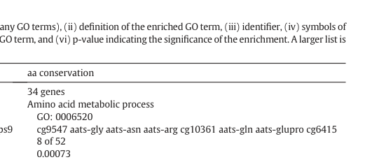
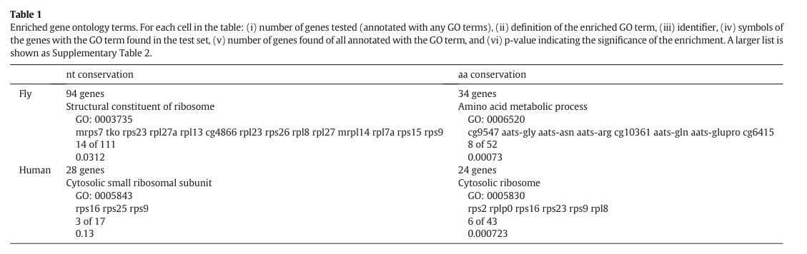

## Question

# Gene Research for Functional Annotation

## ⚠️ CRITICAL: Gene/Protein Identification Context

**BEFORE YOU BEGIN RESEARCH:** You MUST verify you are researching the CORRECT gene/protein. Gene symbols can be ambiguous, especially for less well-characterized genes from non-model organisms.

### Target Gene/Protein Identity (from UniProt):
- **UniProt Accession:** Q9VTN9
- **Protein Description:** RecName: Full=2-amino-3-ketobutyrate coenzyme A ligase, mitochondrial {ECO:0000256|ARBA:ARBA00069660}; EC=2.3.1.29 {ECO:0000256|ARBA:ARBA00067076}; AltName: Full=Aminoacetone synthase {ECO:0000256|ARBA:ARBA00075633}; AltName: Full=Glycine acetyltransferase {ECO:0000256|ARBA:ARBA00078624};
- **Gene Information:** Name=Gcat {ECO:0000313|EMBL:AAF50007.2, ECO:0000313|FlyBase:FBgn0036208}; Synonyms=Dmel\CG10361 {ECO:0000313|EMBL:AAF50007.2}, GCAT {ECO:0000313|EMBL:AAF50007.2}; ORFNames=CG10361 {ECO:0000313|EMBL:AAF50007.2, ECO:0000313|FlyBase:FBgn0036208}, Dmel_CG10361 {ECO:0000313|EMBL:AAF50007.2};
- **Organism (full):** Drosophila melanogaster (Fruit fly).
- **Protein Family:** Belongs to the class-II pyridoxal-phosphate-dependent
- **Key Domains:** 2am3keto_CoA_ligase. (IPR011282); Aminotrans_II_pyridoxalP_BS. (IPR001917); Aminotransferase_I/II_large. (IPR004839); AON_synthase_class-II. (IPR050087); PyrdxlP-dep_Trfase. (IPR015424)

### MANDATORY VERIFICATION STEPS:

1. **Check if the gene symbol "Gcat" matches the protein description above**
2. **Verify the organism is correct:** Drosophila melanogaster (Fruit fly).
3. **Check if protein family/domains align with what you find in literature**
4. **If you find literature for a DIFFERENT gene with the same or similar symbol, STOP**

### If Gene Symbol is Ambiguous or You Cannot Find Relevant Literature:

**DO NOT PROCEED WITH RESEARCH ON A DIFFERENT GENE.** Instead:
- State clearly: "The gene symbol 'Gcat' is ambiguous or literature is limited for this specific protein"
- Explain what you found (e.g., "Found extensive literature on a different gene with the same symbol in a different organism")
- Describe the protein based ONLY on the UniProt information provided above
- Suggest that the protein function can be inferred from domain/family information

### Research Target:

Please provide a comprehensive research report on the gene **Gcat** (gene ID: Gcat, UniProt: Q9VTN9) in DROME.

The research report should be a detailed narrative explaining the function, biological processes, and localization of the gene product. Citations should be given for all claims.

You should prioritize authoritative reviews and primary scientific literature when conducting research. You can supplement
this with annotations you find in gene/protein databases, but these can be outdated or inaccurate.

We are specifically interested in the primary function of the gene - for enzymes, what reaction is catalyzed, and what is the substrate specificity? For transporters, what is the substrate? For structural proteins or adapters, what is the broader structural role? For signaling molecules, what is the role in the pathway.

We are interested in where in or outside the cell the gene product carries out its function.

We are also interested in the signaling or biochemical pathways in which the gene functions. We are less interested in broad pleiotropic effects, except where these elucidate the precise role.

Include evidence where possible. We are interested in both experimental evidence as well as inference from structure, evolution, or bioinformatic analysis. Precise studies should be prioritized over high-throughput, where available.

## Output

Question: You are an expert researcher providing comprehensive, well-cited information.

Provide detailed information focusing on:
1. Key concepts and definitions with current understanding
2. Recent developments and latest research (prioritize 2023-2024 sources)
3. Current applications and real-world implementations
4. Expert opinions and analysis from authoritative sources
5. Relevant statistics and data from recent studies

Format as a comprehensive research report with proper citations. Include URLs and publication dates where available.
Always prioritize recent, authoritative sources and provide specific citations for all major claims.

# Gene Research for Functional Annotation

## ⚠️ CRITICAL: Gene/Protein Identification Context

**BEFORE YOU BEGIN RESEARCH:** You MUST verify you are researching the CORRECT gene/protein. Gene symbols can be ambiguous, especially for less well-characterized genes from non-model organisms.

### Target Gene/Protein Identity (from UniProt):
- **UniProt Accession:** Q9VTN9
- **Protein Description:** RecName: Full=2-amino-3-ketobutyrate coenzyme A ligase, mitochondrial {ECO:0000256|ARBA:ARBA00069660}; EC=2.3.1.29 {ECO:0000256|ARBA:ARBA00067076}; AltName: Full=Aminoacetone synthase {ECO:0000256|ARBA:ARBA00075633}; AltName: Full=Glycine acetyltransferase {ECO:0000256|ARBA:ARBA00078624};
- **Gene Information:** Name=Gcat {ECO:0000313|EMBL:AAF50007.2, ECO:0000313|FlyBase:FBgn0036208}; Synonyms=Dmel\CG10361 {ECO:0000313|EMBL:AAF50007.2}, GCAT {ECO:0000313|EMBL:AAF50007.2}; ORFNames=CG10361 {ECO:0000313|EMBL:AAF50007.2, ECO:0000313|FlyBase:FBgn0036208}, Dmel_CG10361 {ECO:0000313|EMBL:AAF50007.2};
- **Organism (full):** Drosophila melanogaster (Fruit fly).
- **Protein Family:** Belongs to the class-II pyridoxal-phosphate-dependent
- **Key Domains:** 2am3keto_CoA_ligase. (IPR011282); Aminotrans_II_pyridoxalP_BS. (IPR001917); Aminotransferase_I/II_large. (IPR004839); AON_synthase_class-II. (IPR050087); PyrdxlP-dep_Trfase. (IPR015424)

### MANDATORY VERIFICATION STEPS:

1. **Check if the gene symbol "Gcat" matches the protein description above**
2. **Verify the organism is correct:** Drosophila melanogaster (Fruit fly).
3. **Check if protein family/domains align with what you find in literature**
4. **If you find literature for a DIFFERENT gene with the same or similar symbol, STOP**

### If Gene Symbol is Ambiguous or You Cannot Find Relevant Literature:

**DO NOT PROCEED WITH RESEARCH ON A DIFFERENT GENE.** Instead:
- State clearly: "The gene symbol 'Gcat' is ambiguous or literature is limited for this specific protein"
- Explain what you found (e.g., "Found extensive literature on a different gene with the same symbol in a different organism")
- Describe the protein based ONLY on the UniProt information provided above
- Suggest that the protein function can be inferred from domain/family information

### Research Target:

Please provide a comprehensive research report on the gene **Gcat** (gene ID: Gcat, UniProt: Q9VTN9) in DROME.

The research report should be a detailed narrative explaining the function, biological processes, and localization of the gene product. Citations should be given for all claims.

You should prioritize authoritative reviews and primary scientific literature when conducting research. You can supplement
this with annotations you find in gene/protein databases, but these can be outdated or inaccurate.

We are specifically interested in the primary function of the gene - for enzymes, what reaction is catalyzed, and what is the substrate specificity? For transporters, what is the substrate? For structural proteins or adapters, what is the broader structural role? For signaling molecules, what is the role in the pathway.

We are interested in where in or outside the cell the gene product carries out its function.

We are also interested in the signaling or biochemical pathways in which the gene functions. We are less interested in broad pleiotropic effects, except where these elucidate the precise role.

Include evidence where possible. We are interested in both experimental evidence as well as inference from structure, evolution, or bioinformatic analysis. Precise studies should be prioritized over high-throughput, where available.

# Functional annotation of *Drosophila melanogaster* Gcat

**Identity and scope.** The target is fly **Gcat/CG10361**, identified in the supplied UniProt record as **Q9VTN9** (FlyBase **FBgn0036208**), not a gene inferred from the symbol alone. An independent comparative study explicitly pairs human **GCAT** with fly **CG10361** and associates the pair with threonine degradation. Its Table 1 lists *cg10361* among fly genes annotated to amino-acid metabolism (GO:0006520; enrichment *p* = 0.00073). The publication establishes an orthology-based annotation, **not** an enzyme assay of Q9VTN9. The protein-family and pyridoxal-phosphate (PLP)-binding domains specified in the question are consistent with experimentally characterized 2-amino-3-ketobutyrate CoA ligases. (shih2015comparisonofinter pages 5-6, schmidt2001threedimensionalstructureof pages 1-2, shih2015comparisonofinter media b1bcc071)

**Qualification:** Literature directly characterizing fly Gcat is limited. The strongest assignment of its *molecular reaction and mitochondrial location* remains an inference from the supplied UniProt annotation, orthology and experiments on other organisms. Fly experiments more directly establish its expression and pathway context. (shih2015comparisonofinter pages 5-6, schmidt2001threedimensionalstructureof pages 1-2, yoshinari2026cg14075mmtpromotesamino pages 5-7)

## Molecular function and substrate specificity

The best-supported **predicted primary reaction** is the PLP-dependent conversion of **2-amino-3-ketobutyrate + coenzyme A → glycine + acetyl-CoA** (EC **2.3.1.29**). Thus, the immediate substrate proposed for Gcat is **2-amino-3-ketobutyrate**, *not threonine itself*; CoA is a reactant, not merely a generic indicator of acetyltransferase activity. Upstream, threonine dehydrogenase (Tdh) oxidizes L-threonine with NAD⁺ to produce that intermediate. Together, the two proposed steps connect L-threonine catabolism to glycine and acetyl-CoA production. These reaction assignments are directly supported for characterized ligases, particularly *Escherichia coli* KBL, but have not been measured for purified fly Q9VTN9 in the retrieved studies. (schmidt2001threedimensionalstructureof pages 1-2, mukherjee19902amino3ketobutyratecoaligase pages 1-2)

Structural evidence makes the domain-based inference specific rather than a generic prediction of “aminotransferase” activity: the *E. coli* enzyme structure, resolved at **2.0 Å**, traps an external aldimine between PLP and 2-amino-3-ketobutyrate. Its two active sites lie at a dimer interface. This supports a PLP-mediated CoA-ligase mechanism compatible with the supplied class-II PLP-dependent and 2am3keto_CoA_ligase domain calls; it does **not** establish the fly protein’s oligomeric state or active-site kinetics. (schmidt2001threedimensionalstructureof pages 1-2, schmidt2001threedimensionalstructureof pages 4-6)

**Specificity boundaries matter.** The available evidence supports the canonical intermediate/CoA reaction as the primary annotation, but does not establish Q9VTN9’s substrate range, relative catalytic efficiency or alternative activities. A *Cupriavidus necator* KBL can additionally cleave L-threonine to glycine and acetaldehyde by **threonine-aldolase side activity**, especially under low-CoA experimental conditions; that bacterial result should not be transferred to fly Gcat as an established activity. Likewise, the annotation “aminoacetone synthase” does not prove that fly Gcat synthesizes aminoacetone: the unstable 2-amino-3-ketobutyrate intermediate can **spontaneously** decarboxylate to aminoacetone and CO₂ when it is not captured by the ligase reaction. (schmidt2001threedimensionalstructureof pages 1-2, motoyama2021chemoenzymaticsynthesisof pages 4-5, motoyama2021chemoenzymaticsynthesisof pages 1-2)

## Biological pathway, tissue and intracellular site

Gcat is best placed in the **Tdh-dependent branch of glycine, serine and threonine metabolism**, rather than assigned a primary signaling function. Glycine produced by this branch can enter connected serine/one-carbon metabolism; acetyl-CoA connects the reaction to central carbon metabolism. This describes the pathway’s biochemical possibilities, not measured downstream flux through Gcat itself in flies. (schmidt2001threedimensionalstructureof pages 1-2, yoshinari2026cg14075mmtpromotesamino pages 9-11)

The supplied UniProt description calls Q9VTN9 **mitochondrial**, and the human–fly orthology study describes GCAT as a mitochondrial protein. A mitochondrial site of action for fly Gcat is therefore plausible and consistent with the pathway, but the retrieved fly studies do **not** demonstrate mitochondrial import or matrix localization of the endogenous protein. **Fat-body expression is evidence for a tissue of expression, not evidence for an intracellular compartment.** (shih2015comparisonofinter pages 5-6, yoshinari2026cg14075mmtpromotesamino pages 9-11)

A recent primary fly study identifies **Gcat expression predominantly in the fat body** and examines its mRNA in abdominal-carcass preparations. During **24-hour starvation**, Gcat expression increased in controls, whereas this response was attenuated after perturbation of **CG14075/Mmt**, a starvation-associated endocrine factor. Mmt overexpression also induced Gcat expression under the experimental conditions. These findings place Gcat within a regulated fat-body amino-acid-catabolic program; they do not by themselves show that Gcat protein abundance, activity or flux changed in parallel with its mRNA. An ex vivo Mmt-peptide treatment induced *Bcat* but **not Gcat** under the conditions tested, further cautioning against treating all Mmt effects as direct regulation of Gcat. (yoshinari2026cg14075mmtpromotesamino pages 5-7, yoshinari2026cg14075mmtpromotesamino pages 7-9)

The same study supplies **pathway-level**, but not Gcat-specific, functional evidence: fat-body **Tdh knockdown** reduced incorporation of threonine-derived isotope into **glycine and serine**, supporting active threonine-to-glycine metabolism in the relevant tissue. Tdh manipulation also affected starvation responses, but attributing those phenotypes specifically to Gcat would exceed the data: the manipulated gene was **Tdh**, not Gcat. The available excerpts report no Gcat-specific fold changes, sample sizes or exact significance values suitable for a quantitative claim. (yoshinari2026cg14075mmtpromotesamino pages 9-11, yoshinari2026cg14075mmtpromotesamino pages 5-7)

## Recent developments, applications and evidence quality

The most directly relevant **recent fly experiment** retrieved is Yoshinari and colleagues’ **September 2026** study of Mmt-dependent starvation metabolism, which measures Gcat expression and tests the upstream Tdh pathway. A **2023** fly time-restricted-feeding study performed RNA interference against **CG5955** in flight muscle, but identifies **CG5955 and CG10361 as separate loci** in its pathway representation. Its CG5955 knockdown phenotypes are therefore **not** experiments on Q9VTN9 and must not be used to assign Gcat a muscle-maintenance function. Similarly, a **2018** study experimentally manipulating *gcat* in *Caenorhabditis elegans* concerns a **worm ortholog**, not the fly gene. No 2023–2024 primary study establishing fly CG10361 enzymatic specificity or localization was identified in the retrieved literature. (yoshinari2026cg14075mmtpromotesamino pages 5-7, livelo2023timerestrictedfeedingpromotes pages 3-4, livelo2023timerestrictedfeedingpromotes pages 2-3, ravichandran2018impairinglthreoninecatabolism pages 1-3)

The presently defensible **research application** is to use Gcat/CG10361 as a *candidate* marker or perturbation target for the threonine-to-glycine branch of fly fat-body metabolism—not as an already validated causal target for starvation tolerance or a directly established mitochondrial enzyme. Discriminating experiments would include CG10361-specific loss of function and rescue, recombinant-enzyme assays with 2-amino-3-ketobutyrate and CoA, isotope-flux measurements after **Gcat** rather than Tdh perturbation, and protein-level localization. This is a proposed validation strategy, not a report that those experiments have been completed. (schmidt2001threedimensionalstructureof pages 1-2, yoshinari2026cg14075mmtpromotesamino pages 5-7, yoshinari2026cg14075mmtpromotesamino pages 9-11)

The following summary separates findings on the target fly locus from biochemical results obtained in homologs.

| Evidence area | Target-specific finding | Organism and evidence type | Confidence | Explicit limitation |
|---|---|---|---|---|
| Identity and orthology | **Gcat/CG10361** is the *Drosophila melanogaster* counterpart of human **GCAT**, a glycine C-acetyltransferase involved in threonine degradation. This supports the supplied mapping to UniProt **Q9VTN9** and FlyBase **FBgn0036208**. (shih2015comparisonofinter pages 4-5, shih2015comparisonofinter pages 5-6) | *D. melanogaster*; comparative orthology and functional annotation (Shih et al., 2015) | **Moderate–high for identity; moderate for function** | The study did not biochemically assay Q9VTN9 or independently verify the UniProt accession; its functional assignment relied on orthology and annotation. |
| Canonical biochemical reaction | The predicted reaction is **2-amino-3-ketobutyrate + CoA → glycine + acetyl-CoA**, the second step of the TDH-dependent threonine-degradation pathway. Bacterial KBL is PLP dependent, dimeric, and contains active sites at the subunit interface. (schmidt2001threedimensionalstructureof pages 1-2, schmidt2001threedimensionalstructureof pages 6-7) | *Escherichia coli* KBL; purified-enzyme structural and mechanistic evidence (Schmidt et al., 2001) | **High for bacterial KBL; moderate by homology for fly Gcat** | No retrieved study purified fly Gcat or measured its substrate specificity, kinetics, PLP dependence, oligomeric state, or reaction products directly. “Aminoacetone synthase” should not be interpreted as a proven fly side activity: aminoacetone can arise by spontaneous decarboxylation of the unstable intermediate. |
| Family and domain consistency | The supplied class-II PLP-dependent/AON-synthase-related domains are consistent with the experimentally established KBL fold and PLP chemistry. Bacterial KBL traps a PLP–2-amino-3-ketobutyrate external aldimine, supporting the inferred catalytic mechanism. (schmidt2001threedimensionalstructureof pages 1-2, schmidt2001threedimensionalstructureof pages 4-6) | *E. coli*; crystallography and evolutionary comparison | **High for family alignment; moderate for fly mechanism** | Structural conservation supports—but does not substitute for—an experimental structure or activity assay of Q9VTN9. |
| Subcellular localization | Q9VTN9 is annotated as **mitochondrial** in the supplied UniProt record. Published orthology analysis likewise describes GCAT as a mitochondrial protein. (shih2015comparisonofinter pages 4-5, shih2015comparisonofinter pages 5-6) | UniProt computational annotation plus cross-species literature inference | **Moderate** | No retrieved fly study demonstrated mitochondrial import or matrix localization of endogenous Gcat by microscopy, fractionation, proteomics, or targeting-sequence mutagenesis. Fat-body expression is tissue-level evidence, not organelle-localization evidence. |
| Fly tissue and starvation response | **Gcat mRNA is predominantly expressed in the fat body** and rises in abdominal carcass during starvation; this induction is attenuated by loss of the endocrine factor CG14075/Mmt. CG14075/Mmt overexpression also induces Gcat expression. (yoshinari2026cg14075mmtpromotesamino pages 5-7, yoshinari2026cg14075mmtpromotesamino pages 7-9) | *D. melanogaster*; tissue-expression and perturbational mRNA assays (Yoshinari et al., 2026) | **Moderate for regulation and tissue context** | Gcat itself was not knocked out or knocked down in the reported experiments, so these data do not prove that Gcat is required for starvation adaptation or threonine flux. The supplied excerpts do not provide Gcat-specific fold changes or exact statistical values. |
| Pathway-level functional support | In the same fly study, fat-body **Tdh** knockdown reduced transfer of threonine-derived isotope into glycine, serine, and fumarate, supporting active TDH-linked threonine catabolism in the tissue where Gcat is expressed. (yoshinari2026cg14075mmtpromotesamino pages 9-11) | *D. melanogaster*; Tdh RNAi and stable-isotope tracing (Yoshinari et al., 2026) | **Moderate–high for the pathway; indirect for Gcat** | The manipulated enzyme was Tdh, not Gcat. The tracing therefore supports the pathway context but cannot uniquely assign the downstream flux to Q9VTN9. |
| Gene-symbol disambiguation | The 2023 time-restricted-feeding study manipulated **CG5955**, whereas its pathway diagram lists **CG5955 and CG10361 separately**. CG5955 RNAi phenotypes must not be attributed to Gcat/Q9VTN9. (livelo2023timerestrictedfeedingpromotes pages 4-5, livelo2023timerestrictedfeedingpromotes pages 3-4, livelo2023timerestrictedfeedingpromotes pages 2-3) | *D. melanogaster*; RNAi study and pathway mapping (Livelo et al., 2023) | **High that CG5955 evidence is not target-specific** | CG5955 knockdown effects on muscle function, lipid accumulation, and feeding responses provide no direct functional evidence for Gcat/CG10361. |
| Overall annotation | The best-supported model is that fly Gcat is a mitochondrial, PLP-dependent 2-amino-3-ketobutyrate CoA ligase participating with Tdh in conversion of threonine to glycine and acetyl-CoA, particularly in fat-body amino-acid metabolism during starvation. (shih2015comparisonofinter pages 5-6, schmidt2001threedimensionalstructureof pages 1-2, yoshinari2026cg14075mmtpromotesamino pages 5-7, yoshinari2026cg14075mmtpromotesamino pages 9-11) | Integrated fly expression/pathway evidence plus homolog biochemistry | **Moderate overall** | The precise enzymatic activity, substrate range, organellar localization, physiological necessity, and quantitative contribution of Q9VTN9 remain unvalidated directly in *D. melanogaster*. |

*Table: Evidence-graded summary separating target-specific fly observations from homolog-based biochemical inference. It highlights the absence of a direct Q9VTN9 enzyme assay or Gcat loss-of-function study and prevents conflation with CG5955.*

**Bottom line.** The most precise current annotation is **probable mitochondrial, PLP-dependent 2-amino-3-ketobutyrate CoA ligase participating downstream of Tdh in fly threonine catabolism**, with Gcat mRNA detected predominantly in the fat body and regulated during starvation. The proposed reaction has strong biochemical support **in homologs** and fly pathway-context support, but its catalytic specificity, organellar location and physiological necessity **have not been directly established for Q9VTN9** by the retrieved studies. (shih2015comparisonofinter pages 5-6, schmidt2001threedimensionalstructureof pages 1-2, yoshinari2026cg14075mmtpromotesamino pages 5-7, yoshinari2026cg14075mmtpromotesamino pages 9-11)

### Key sources and dates

- Shih J, Hodge R, Andrade-Navarro MA. “Comparison of inter- and intraspecies variation in humans and fruit flies.” *Genomics Data*, **March 2015**. https://doi.org/10.1016/j.gdata.2014.11.010. Fly CG10361/human GCAT orthology and annotation. (shih2015comparisonofinter pages 5-6, shih2015comparisonofinter media b1bcc071)
- Schmidt A *et al.* “Three-dimensional structure of 2-amino-3-ketobutyrate CoA ligase from *Escherichia coli* complexed with a PLP-substrate intermediate.” *Biochemistry*, **May 2001**. https://doi.org/10.1021/bi002204y. Primary reaction and structural mechanism **in bacteria**. (schmidt2001threedimensionalstructureof pages 1-2)
- Motoyama T *et al.* “Chemoenzymatic synthesis of 3-ethyl-2,5-dimethylpyrazine by L-threonine 3-dehydrogenase and 2-amino-3-ketobutyrate CoA ligase/L-threonine aldolase.” *Communications Chemistry*, **July 2021**. https://doi.org/10.1038/s42004-021-00545-8. Bacterial KBL side activity and CoA dependence; **not fly Gcat**. (motoyama2021chemoenzymaticsynthesisof pages 4-5, motoyama2021chemoenzymaticsynthesisof pages 1-2)
- Livelo C *et al.* “Time-restricted feeding promotes muscle function through purine cycle and AMPK signaling in *Drosophila* obesity models.” *Nature Communications*, **February 2023**. https://doi.org/10.1038/s41467-023-36474-4. Perturbation of **CG5955**, a distinct locus. (livelo2023timerestrictedfeedingpromotes pages 3-4, livelo2023timerestrictedfeedingpromotes pages 2-3)
- Yoshinari Y *et al.* “CG14075/Mmt promotes amino acid catabolism and cooperates with AKH during starvation in *Drosophila*.” *Nature Communications*, **September 2026**. https://doi.org/10.1038/s41467-026-77687-7. Fly Gcat expression, tissue context and Tdh-linked pathway experiments. (yoshinari2026cg14075mmtpromotesamino pages 5-7, yoshinari2026cg14075mmtpromotesamino pages 7-9, yoshinari2026cg14075mmtpromotesamino pages 9-11)

References

1. (shih2015comparisonofinter pages 5-6): Juliann Shih, Russ Hodge, and Miguel A. Andrade-Navarro. Comparison of inter- and intraspecies variation in humans and fruit flies. Genomics Data, 3:49-54, Mar 2015. URL: https://doi.org/10.1016/j.gdata.2014.11.010, doi:10.1016/j.gdata.2014.11.010. This article has 43 citations and is from a peer-reviewed journal.

2. (schmidt2001threedimensionalstructureof pages 1-2): A. Schmidt, J. Sivaraman, Yun-Ge Li, R. Larocque, J. Barbosa, Christopher R. Smith, A. Matte, J. Schrag, and M. Cygler. Three-dimensional structure of 2-amino-3-ketobutyrate coa ligase from escherichia coli complexed with a plp-substrate intermediate: inferred reaction mechanism. Biochemistry, 40 17:5151-60, May 2001. URL: https://doi.org/10.1021/bi002204y, doi:10.1021/bi002204y. This article has 120 citations and is from a peer-reviewed journal.

3. (shih2015comparisonofinter media b1bcc071): Juliann Shih, Russ Hodge, and Miguel A. Andrade-Navarro. Comparison of inter- and intraspecies variation in humans and fruit flies. Genomics Data, 3:49-54, Mar 2015. URL: https://doi.org/10.1016/j.gdata.2014.11.010, doi:10.1016/j.gdata.2014.11.010. This article has 43 citations and is from a peer-reviewed journal.

4. (yoshinari2026cg14075mmtpromotesamino pages 5-7): Yuto Yoshinari, Maiko Abe, Ryo Hoshino, Yosuke Mizuno, Yoshitomo Kurogi, Eisuke Imura, Akira Nakamura, Fuminori Tsuruta, Ryusuke Niwa, and Takashi Nishimura. Cg14075/mmt promotes amino acid catabolism and cooperates with akh during starvation in drosophila. Nature Communications, Sep 2026. URL: https://doi.org/10.1038/s41467-026-77687-7, doi:10.1038/s41467-026-77687-7. This article has 0 citations and is from a highest quality peer-reviewed journal.

5. (mukherjee19902amino3ketobutyratecoaligase pages 1-2): Jagat J. Mukherjee and Eugene E. Dekker. 2-amino-3-ketobutyrate coa ligase of escherichia coli: stoichiometry of pyridoxal phosphate binding and location of the pyridoxyllysine peptide in the primary structure of the enzyme. Biochimica et biophysica acta, 1037 1:24-9, Jan 1990. URL: https://doi.org/10.1016/0167-4838(90)90097-y, doi:10.1016/0167-4838(90)90097-y. This article has 42 citations.

6. (schmidt2001threedimensionalstructureof pages 4-6): A. Schmidt, J. Sivaraman, Yun-Ge Li, R. Larocque, J. Barbosa, Christopher R. Smith, A. Matte, J. Schrag, and M. Cygler. Three-dimensional structure of 2-amino-3-ketobutyrate coa ligase from escherichia coli complexed with a plp-substrate intermediate: inferred reaction mechanism. Biochemistry, 40 17:5151-60, May 2001. URL: https://doi.org/10.1021/bi002204y, doi:10.1021/bi002204y. This article has 120 citations and is from a peer-reviewed journal.

7. (motoyama2021chemoenzymaticsynthesisof pages 4-5): Tomoharu Motoyama, Shogo Nakano, Fumihito Hasebe, Ryo Miyata, Shigenori Kumazawa, Noriyuki Miyoshi, and Sohei Ito. Chemoenzymatic synthesis of 3-ethyl-2,5-dimethylpyrazine by l-threonine 3-dehydrogenase and 2-amino-3-ketobutyrate coa ligase/l-threonine aldolase. Communications Chemistry, Jul 2021. URL: https://doi.org/10.1038/s42004-021-00545-8, doi:10.1038/s42004-021-00545-8. This article has 23 citations and is from a peer-reviewed journal.

8. (motoyama2021chemoenzymaticsynthesisof pages 1-2): Tomoharu Motoyama, Shogo Nakano, Fumihito Hasebe, Ryo Miyata, Shigenori Kumazawa, Noriyuki Miyoshi, and Sohei Ito. Chemoenzymatic synthesis of 3-ethyl-2,5-dimethylpyrazine by l-threonine 3-dehydrogenase and 2-amino-3-ketobutyrate coa ligase/l-threonine aldolase. Communications Chemistry, Jul 2021. URL: https://doi.org/10.1038/s42004-021-00545-8, doi:10.1038/s42004-021-00545-8. This article has 23 citations and is from a peer-reviewed journal.

9. (yoshinari2026cg14075mmtpromotesamino pages 9-11): Yuto Yoshinari, Maiko Abe, Ryo Hoshino, Yosuke Mizuno, Yoshitomo Kurogi, Eisuke Imura, Akira Nakamura, Fuminori Tsuruta, Ryusuke Niwa, and Takashi Nishimura. Cg14075/mmt promotes amino acid catabolism and cooperates with akh during starvation in drosophila. Nature Communications, Sep 2026. URL: https://doi.org/10.1038/s41467-026-77687-7, doi:10.1038/s41467-026-77687-7. This article has 0 citations and is from a highest quality peer-reviewed journal.

10. (yoshinari2026cg14075mmtpromotesamino pages 7-9): Yuto Yoshinari, Maiko Abe, Ryo Hoshino, Yosuke Mizuno, Yoshitomo Kurogi, Eisuke Imura, Akira Nakamura, Fuminori Tsuruta, Ryusuke Niwa, and Takashi Nishimura. Cg14075/mmt promotes amino acid catabolism and cooperates with akh during starvation in drosophila. Nature Communications, Sep 2026. URL: https://doi.org/10.1038/s41467-026-77687-7, doi:10.1038/s41467-026-77687-7. This article has 0 citations and is from a highest quality peer-reviewed journal.

11. (livelo2023timerestrictedfeedingpromotes pages 3-4): Christopher Livelo, Yiming Guo, Farah Abou Daya, Vasanthi Rajasekaran, Shweta Varshney, Hiep D. Le, Stephen Barnes, Satchidananda Panda, and Girish C. Melkani. Time-restricted feeding promotes muscle function through purine cycle and ampk signaling in drosophila obesity models. Nature Communications, Feb 2023. URL: https://doi.org/10.1038/s41467-023-36474-4, doi:10.1038/s41467-023-36474-4. This article has 54 citations and is from a highest quality peer-reviewed journal.

12. (livelo2023timerestrictedfeedingpromotes pages 2-3): Christopher Livelo, Yiming Guo, Farah Abou Daya, Vasanthi Rajasekaran, Shweta Varshney, Hiep D. Le, Stephen Barnes, Satchidananda Panda, and Girish C. Melkani. Time-restricted feeding promotes muscle function through purine cycle and ampk signaling in drosophila obesity models. Nature Communications, Feb 2023. URL: https://doi.org/10.1038/s41467-023-36474-4, doi:10.1038/s41467-023-36474-4. This article has 54 citations and is from a highest quality peer-reviewed journal.

13. (ravichandran2018impairinglthreoninecatabolism pages 1-3): Meenakshi Ravichandran, Steffen Priebe, Giovanna Grigolon, Leonid Rozanov, Marco Groth, Beate Laube, Reinhard Guthke, Matthias Platzer, Kim Zarse, and Michael Ristow. Impairing l-threonine catabolism promotes healthspan through methylglyoxal-mediated proteohormesis. Cell metabolism, 27 4:914-925.e5, Apr 2018. URL: https://doi.org/10.1016/j.cmet.2018.02.004, doi:10.1016/j.cmet.2018.02.004. This article has 93 citations and is from a highest quality peer-reviewed journal.

14. (shih2015comparisonofinter pages 4-5): Juliann Shih, Russ Hodge, and Miguel A. Andrade-Navarro. Comparison of inter- and intraspecies variation in humans and fruit flies. Genomics Data, 3:49-54, Mar 2015. URL: https://doi.org/10.1016/j.gdata.2014.11.010, doi:10.1016/j.gdata.2014.11.010. This article has 43 citations and is from a peer-reviewed journal.

15. (schmidt2001threedimensionalstructureof pages 6-7): A. Schmidt, J. Sivaraman, Yun-Ge Li, R. Larocque, J. Barbosa, Christopher R. Smith, A. Matte, J. Schrag, and M. Cygler. Three-dimensional structure of 2-amino-3-ketobutyrate coa ligase from escherichia coli complexed with a plp-substrate intermediate: inferred reaction mechanism. Biochemistry, 40 17:5151-60, May 2001. URL: https://doi.org/10.1021/bi002204y, doi:10.1021/bi002204y. This article has 120 citations and is from a peer-reviewed journal.

16. (livelo2023timerestrictedfeedingpromotes pages 4-5): Christopher Livelo, Yiming Guo, Farah Abou Daya, Vasanthi Rajasekaran, Shweta Varshney, Hiep D. Le, Stephen Barnes, Satchidananda Panda, and Girish C. Melkani. Time-restricted feeding promotes muscle function through purine cycle and ampk signaling in drosophila obesity models. Nature Communications, Feb 2023. URL: https://doi.org/10.1038/s41467-023-36474-4, doi:10.1038/s41467-023-36474-4. This article has 54 citations and is from a highest quality peer-reviewed journal.

## Artifacts

- [Edison artifact artifact-00](Gcat-deep-research-falcon_artifacts/artifact-00.md)

## Citations

1. schmidt2001threedimensionalstructureof pages 1-2
2. shih2015comparisonofinter pages 5-6
3. schmidt2001threedimensionalstructureof pages 4-6
4. motoyama2021chemoenzymaticsynthesisof pages 4-5
5. motoyama2021chemoenzymaticsynthesisof pages 1-2
6. livelo2023timerestrictedfeedingpromotes pages 3-4
7. livelo2023timerestrictedfeedingpromotes pages 2-3
8. ravichandran2018impairinglthreoninecatabolism pages 1-3
9. shih2015comparisonofinter pages 4-5
10. schmidt2001threedimensionalstructureof pages 6-7
11. livelo2023timerestrictedfeedingpromotes pages 4-5
12. https://doi.org/10.1016/j.gdata.2014.11.010.
13. https://doi.org/10.1021/bi002204y.
14. https://doi.org/10.1038/s42004-021-00545-8.
15. https://doi.org/10.1038/s41467-023-36474-4.
16. https://doi.org/10.1038/s41467-026-77687-7.
17. https://doi.org/10.1016/j.gdata.2014.11.010,
18. https://doi.org/10.1021/bi002204y,
19. https://doi.org/10.1038/s41467-026-77687-7,
20. https://doi.org/10.1016/0167-4838(90
21. https://doi.org/10.1038/s42004-021-00545-8,
22. https://doi.org/10.1038/s41467-023-36474-4,
23. https://doi.org/10.1016/j.cmet.2018.02.004,