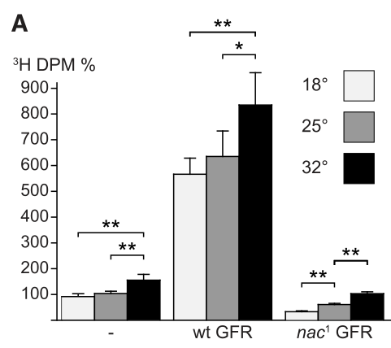

## Question

# Gene Research for Functional Annotation

## ⚠️ CRITICAL: Gene/Protein Identification Context

**BEFORE YOU BEGIN RESEARCH:** You MUST verify you are researching the CORRECT gene/protein. Gene symbols can be ambiguous, especially for less well-characterized genes from non-model organisms.

### Target Gene/Protein Identity (from UniProt):
- **UniProt Accession:** Q9VHT4
- **Protein Description:** RecName: Full=GDP-fucose transporter, Golgi {ECO:0000312|FlyBase:FBgn0265351}; AltName: Full=Neuronally altered carbohydrate {ECO:0000312|FlyBase:FBgn0265351}; AltName: Full=Solute carrier family 35 member C1 homolog;
- **Gene Information:** Name=Gfr {ECO:0000312|FlyBase:FBgn0265351}; Synonyms=nac {ECO:0000312|FlyBase:FBgn0265351}; ORFNames=CG9620 {ECO:0000312|FlyBase:FBgn0265351};
- **Organism (full):** Drosophila melanogaster (Fruit fly).
- **Protein Family:** Belongs to the TPT transporter family. SLC35C subfamily.
- **Key Domains:** EmrE-like. (IPR037185); Sugar_P_trans_dom. (IPR004853); TPT_transporter. (IPR050186); TPT (PF03151)

### MANDATORY VERIFICATION STEPS:

1. **Check if the gene symbol "Gfr" matches the protein description above**
2. **Verify the organism is correct:** Drosophila melanogaster (Fruit fly).
3. **Check if protein family/domains align with what you find in literature**
4. **If you find literature for a DIFFERENT gene with the same or similar symbol, STOP**

### If Gene Symbol is Ambiguous or You Cannot Find Relevant Literature:

**DO NOT PROCEED WITH RESEARCH ON A DIFFERENT GENE.** Instead:
- State clearly: "The gene symbol 'Gfr' is ambiguous or literature is limited for this specific protein"
- Explain what you found (e.g., "Found extensive literature on a different gene with the same symbol in a different organism")
- Describe the protein based ONLY on the UniProt information provided above
- Suggest that the protein function can be inferred from domain/family information

### Research Target:

Please provide a comprehensive research report on the gene **Gfr** (gene ID: Gfr, UniProt: Q9VHT4) in DROME.

The research report should be a detailed narrative explaining the function, biological processes, and localization of the gene product. Citations should be given for all claims.

You should prioritize authoritative reviews and primary scientific literature when conducting research. You can supplement
this with annotations you find in gene/protein databases, but these can be outdated or inaccurate.

We are specifically interested in the primary function of the gene - for enzymes, what reaction is catalyzed, and what is the substrate specificity? For transporters, what is the substrate? For structural proteins or adapters, what is the broader structural role? For signaling molecules, what is the role in the pathway.

We are interested in where in or outside the cell the gene product carries out its function.

We are also interested in the signaling or biochemical pathways in which the gene functions. We are less interested in broad pleiotropic effects, except where these elucidate the precise role.

Include evidence where possible. We are interested in both experimental evidence as well as inference from structure, evolution, or bioinformatic analysis. Precise studies should be prioritized over high-throughput, where available.

## Output

Question: You are an expert researcher providing comprehensive, well-cited information.

Provide detailed information focusing on:
1. Key concepts and definitions with current understanding
2. Recent developments and latest research (prioritize 2023-2024 sources)
3. Current applications and real-world implementations
4. Expert opinions and analysis from authoritative sources
5. Relevant statistics and data from recent studies

Format as a comprehensive research report with proper citations. Include URLs and publication dates where available.
Always prioritize recent, authoritative sources and provide specific citations for all major claims.

# Gene Research for Functional Annotation

## ⚠️ CRITICAL: Gene/Protein Identification Context

**BEFORE YOU BEGIN RESEARCH:** You MUST verify you are researching the CORRECT gene/protein. Gene symbols can be ambiguous, especially for less well-characterized genes from non-model organisms.

### Target Gene/Protein Identity (from UniProt):
- **UniProt Accession:** Q9VHT4
- **Protein Description:** RecName: Full=GDP-fucose transporter, Golgi {ECO:0000312|FlyBase:FBgn0265351}; AltName: Full=Neuronally altered carbohydrate {ECO:0000312|FlyBase:FBgn0265351}; AltName: Full=Solute carrier family 35 member C1 homolog;
- **Gene Information:** Name=Gfr {ECO:0000312|FlyBase:FBgn0265351}; Synonyms=nac {ECO:0000312|FlyBase:FBgn0265351}; ORFNames=CG9620 {ECO:0000312|FlyBase:FBgn0265351};
- **Organism (full):** Drosophila melanogaster (Fruit fly).
- **Protein Family:** Belongs to the TPT transporter family. SLC35C subfamily.
- **Key Domains:** EmrE-like. (IPR037185); Sugar_P_trans_dom. (IPR004853); TPT_transporter. (IPR050186); TPT (PF03151)

### MANDATORY VERIFICATION STEPS:

1. **Check if the gene symbol "Gfr" matches the protein description above**
2. **Verify the organism is correct:** Drosophila melanogaster (Fruit fly).
3. **Check if protein family/domains align with what you find in literature**
4. **If you find literature for a DIFFERENT gene with the same or similar symbol, STOP**

### If Gene Symbol is Ambiguous or You Cannot Find Relevant Literature:

**DO NOT PROCEED WITH RESEARCH ON A DIFFERENT GENE.** Instead:
- State clearly: "The gene symbol 'Gfr' is ambiguous or literature is limited for this specific protein"
- Explain what you found (e.g., "Found extensive literature on a different gene with the same symbol in a different organism")
- Describe the protein based ONLY on the UniProt information provided above
- Suggest that the protein function can be inferred from domain/family information

### Research Target:

Please provide a comprehensive research report on the gene **Gfr** (gene ID: Gfr, UniProt: Q9VHT4) in DROME.

The research report should be a detailed narrative explaining the function, biological processes, and localization of the gene product. Citations should be given for all claims.

You should prioritize authoritative reviews and primary scientific literature when conducting research. You can supplement
this with annotations you find in gene/protein databases, but these can be outdated or inaccurate.

We are specifically interested in the primary function of the gene - for enzymes, what reaction is catalyzed, and what is the substrate specificity? For transporters, what is the substrate? For structural proteins or adapters, what is the broader structural role? For signaling molecules, what is the role in the pathway.

We are interested in where in or outside the cell the gene product carries out its function.

We are also interested in the signaling or biochemical pathways in which the gene functions. We are less interested in broad pleiotropic effects, except where these elucidate the precise role.

Include evidence where possible. We are interested in both experimental evidence as well as inference from structure, evolution, or bioinformatic analysis. Precise studies should be prioritized over high-throughput, where available.

# Functional annotation of *Drosophila melanogaster* Gfr

## Identity and principal conclusion

This report concerns the fruit-fly gene **Gfr**, also called **nac** or **CG9620**, identified in the supplied UniProt record as **Q9VHT4** (FlyBase **FBgn0265351**). The literature independently connects *Drosophila* Gfr with the *neurally altered carbohydrate* mutant and identifies CG9620 as the fly ortholog of the SLC35C1 GDP-fucose transporter. The accession and FlyBase identifier come from the supplied record; the primary papers examined did not independently print that accession-to-gene cross-reference. No similarly named gene from another organism is used as evidence for this protein. (roos2002compositionofdrosophila pages 1-2, geisler2012thedrosophilaneurally pages 1-2, kamiyama2024solutecarrierfamily pages 18-19)

**Primary function:** GFR is a **Golgi-membrane nucleotide-sugar transporter** that supplies **GDP-*L*-fucose** from the cytosolic pool to the Golgi lumen. Its best-established biological role is making that fucose donor available for **core α1,3- and α1,6-fucosylation of N-linked glycans**. It transports the donor; it is **not** the fucosyltransferase that attaches fucose to a glycan. GDP-fucose/GMP exchange is the transport cycle depicted by the primary investigators, but their GFR microsome experiment directly assayed GDP-fucose uptake, not the exchange stoichiometry. (geisler2012thedrosophilaneurally pages 1-2, geisler2012thedrosophilaneurally pages 4-6, geisler2012thedrosophilaneurally pages 6-7, geisler2012thedrosophilaneurally pages 3-4)

## Molecular function and site of action

Wild-type GFR increased radiolabeled GDP-fucose uptake into Golgi-enriched insect-cell microsomes by approximately **sixfold** over background. The *nac¹* allele carries a **C86T** coding change that replaces a conserved **Ser-29 with leucine** in the first *predicted* transmembrane segment. Mutant GFR had greatly impaired uptake; unlike wild-type fly Gfr, it also failed to restore fucosylation when expressed in GDP-fucose-transporter-deficient human LAD-II cells. These experiments establish GDP-fucose as the experimentally tested substrate; they do not establish a complete specificity profile against every other nucleotide sugar. (geisler2012thedrosophilaneurally pages 3-4, geisler2012thedrosophilaneurally pages 7-8)

GFP-tagged wild-type and S29L GFR both colocalized with the Golgi marker MGAT1 in *Drosophila* S2 and Sf9 cells. Thus, the observed S29L defect is principally a loss of transport function, not obvious mislocalization. Localization was measured with tagged, expressed protein rather than an untagged endogenous-protein assay. **Figure 2** of the primary study juxtaposes the transport assay and Golgi-marker images. (geisler2012thedrosophilaneurally pages 4-6, geisler2012thedrosophilaneurally media 8296dd25, geisler2012thedrosophilaneurally media 179d721b)

The supplied UniProt entry assigns GFR to the **TPT/SLC35C transporter family** and lists EmrE-like, Sugar_P_trans_dom and TPT-related domain signatures. This is compatible with a membrane nucleotide-sugar transporter; these domain labels are **sequence annotations**, not an experimentally solved structure of fly GFR. Conservation of Ser-29 among animal GDP-fucose transporters supplies additional evolutionary support for its functional importance. (kamiyama2024solutecarrierfamily pages 18-19, geisler2012thedrosophilaneurally pages 3-4, geisler2012thedrosophilaneurally pages 7-8)

The principal evidence and its limits can be summarized as follows.

| Functional aspect | Key finding | Evidence strength or caveat |
|---|---|---|
| Direct substrate | Wild-type GFR increased [³H]GDP-fucose uptake approximately sixfold over background in Golgi-enriched Sf9 microsomes. (geisler2012thedrosophilaneurally pages 7-8) | **Direct biochemical evidence** for GDP-fucose transport in a heterologous microsomal system; not a purified-protein assay. (geisler2012thedrosophilaneurally pages 7-8) |
| Subcellular localization | GFP-tagged wild-type GFR colocalized with the Golgi marker MGAT1 in Drosophila S2 and Sf9 cells. (geisler2012thedrosophilaneurally pages 4-6, geisler2012thedrosophilaneurally media 179d721b) | **Direct cell-biological evidence** for Golgi localization, although based on tagged, heterologously expressed protein. (geisler2012thedrosophilaneurally pages 4-6) |
| Critical residue and mutant mechanism | The nac¹ C86T lesion causes S29L in the first predicted transmembrane region. Mutant GFR remained Golgi-localized but showed impaired GDP-fucose transport. (geisler2012thedrosophilaneurally pages 3-4) | **Strong combined genetic, biochemical, and localization evidence:** the defect affects transport rather than gross targeting. (geisler2012thedrosophilaneurally pages 3-4) |
| N-glycan core fucosylation | Hex₃HexNAc₂Fuc decreased from 21% of N-glycans in wild type to 10% in nac¹; Hex₂HexNAc₂Fuc decreased from 5% to 1.4%. Both core α1,3- and α1,6-fucosylation were reduced. (geisler2012thedrosophilaneurally pages 4-6, geisler2012thedrosophilaneurally pages 6-7) | **Direct in-vivo glycomic evidence** from complementary analytical methods; residual fucosylation indicates incomplete dependence on GFR. (geisler2012thedrosophilaneurally pages 6-7) |
| Genetic causality and rescue | Wild-type Gfr restored the neuronal HRP epitope. At 18 °C, adult survival increased from 6% in nac¹ homozygotes to 82% with moderately expressed Gfr. (geisler2012thedrosophilaneurally pages 6-7) | **Strong in-vivo rescue evidence** linking Gfr to the glycosylation and survival phenotypes; strong overexpression was itself embryonic lethal. (geisler2012thedrosophilaneurally pages 6-7) |
| Notch pathway | Combined Gfr/Efr deficiency largely abolished the Notch-responsive markers Cut and Wingless at the wing-disc dorsal–ventral boundary. (ayukawa2012rescueofnotch pages 2-3) | **Genetic pathway evidence** for redundant GDP-fucose delivery supporting Notch O-fucosylation; it does **not** directly demonstrate ER localization of GFR itself. (ayukawa2012rescueofnotch pages 2-3) |
| Mechanistic interpretations | Residual activity might involve FRC; GDP-fucose/GMP exchange is the proposed transport cycle; a mutant dominant-negative effect through GFR homodimerization was also proposed. (geisler2012thedrosophilaneurally pages 8-9, geisler2012thedrosophilaneurally pages 7-8) | **Hypotheses rather than established mechanisms:** the alternative transporter and GFR oligomeric state remain unresolved in these experiments. (geisler2012thedrosophilaneurally pages 8-9, geisler2012thedrosophilaneurally pages 7-8) |

*Table: Evidence hierarchy for the Drosophila Gfr/nac/CG9620 GDP-fucose transporter, identified as Q9VHT4 in the supplied UniProt context. The table separates direct biochemical, localization, glycomic, and rescue evidence from pathway-level or speculative interpretations.*

## Biochemical and signaling pathways

**N-glycan fucosylation is the strongest direct pathway assignment.** GDP-fucose is generated in the cytoplasm; after GFR-dependent Golgi import, the Golgi fucosyltransferase FucTA uses it to create the neural **HRP epitope**, a core α1,3-fucosylated N-glycan. GFR supplies donor for core α1,6-fucosylation as well. In adult *nac¹* flies, the monofucosylated glycan Hex₃HexNAc₂Fuc fell from **21%** of measured N-glycans in wild type to **10%**; Hex₂HexNAc₂Fuc fell from **5%** to **1.4%**. Mass spectrometry and chromatography also showed greatly diminished α1,3/α1,6-difucosylated species and increased unfucosylated glycans. These are glycan-class measurements, not percentages of all cellular proteins. (geisler2012thedrosophilaneurally pages 1-2, geisler2012thedrosophilaneurally pages 4-6, geisler2012thedrosophilaneurally pages 6-7)

The genetic link is particularly strong: neuronal expression of wild-type Gfr restored the embryonic neural HRP epitope in *nac¹* flies. In a separate, moderately expressing transgenic line tested at **18 °C**, adult survival increased from **6%** in *nac¹* homozygotes to **82%** in the transgene-bearing mutant animals. Stronger experimental overexpression caused embryonic lethality, so overexpression phenotypes should not be interpreted as normal GFR physiology. (geisler2012thedrosophilaneurally pages 6-7, geisler2012thedrosophilaneurally pages 7-8)

**Notch is a related, but distinct, pathway.** Notch receptor **O-fucosylation** takes place in the endoplasmic-reticulum secretory pathway and should not be confused with the directly demonstrated Golgi **N-glycan core-fucosylation** phenotype. The Golgi transporter Gfr and the ER transporter Efr provide partly redundant routes supporting Notch O-fucosylation: in wing-disc clones lacking **both** transporters, the Notch-responsive markers **Cut and Wingless** were largely lost. Earlier genetic observations linked Gfr loss to cold-sensitive wing-margin and Fringe-dependent Notch phenotypes, but loss of Gfr alone causes comparatively mild Notch defects. This genetic evidence does **not** demonstrate that GFR itself resides in the ER or directly O-fucosylates Notch. (kamiyama2024solutecarrierfamily pages 18-19, ayukawa2012rescueofnotch pages 2-3, jafarnejad2010roleofglycans pages 12-13)

## Current interpretation, applications and uncertainties

The August **2024** SLC35-family review identifies fly Gfr/CG9620 as an **SLC35C1 ortholog** and emphasizes a useful distinction: severe loss of Golgi GDP-fucose-transporter activity can coexist with comparatively preserved Notch functions, whereas removing the O-fucosyltransferase has much broader Notch consequences. In humans, SLC35C1 deficiency causes the congenital disorder **SLC35C1-CDG**, formerly CDG-IIc or leukocyte adhesion deficiency II. Fly Gfr has consequently been used as an **experimental model of transporter-deficient glycosylation**, notably through the *nac¹* mutant, glycan profiling, transgenic rescue and cross-species cell complementation; this is a research application, not an established therapy based on fly Gfr. The 2024 review synthesizes older Gfr experiments rather than reporting a new Gfr-specific 2023–2024 functional assay. (geisler2012thedrosophilaneurally pages 1-2, kamiyama2024solutecarrierfamily pages 18-19, geisler2012thedrosophilaneurally pages 3-4)

Residual fucosylated glycans in *nac¹* or Gfr-deficient flies suggest **some alternative Golgi GDP-fucose supply**. The proposed involvement of the related transporter **FRC** remains a hypothesis in the cited work; ER-localized Efr does not account for the residual **core N-glycan** fucosylation. Likewise, proposed GFR homodimerization, a dominant-negative action of S29L, and retrograde delivery of Golgi-derived GDP-fucose to the ER should not be treated as established molecular mechanisms for this fly protein. The evidence supports **GDP-fucose import at the Golgi membrane** more firmly than it resolves these secondary routes. (geisler2012thedrosophilaneurally pages 8-9, geisler2012thedrosophilaneurally pages 7-8, jafarnejad2010roleofglycans pages 12-13)

### Key sources and dates

- Geisler *et al.*, **24 August 2012**, “The Drosophila Neurally Altered Carbohydrate Mutant Has a Defective Golgi GDP-fucose Transporter,” *Journal of Biological Chemistry* **287**, 29599–29609. Primary transport, localization, glycomics and rescue study. https://doi.org/10.1074/jbc.M112.379313 (geisler2012thedrosophilaneurally pages 1-2, geisler2012thedrosophilaneurally pages 4-6, geisler2012thedrosophilaneurally pages 6-7)
- Ayukawa *et al.*, **18 September 2012**, “Rescue of Notch signaling in cells incapable of GDP-L-fucose synthesis by gap junction transfer of GDP-L-fucose in Drosophila,” *PNAS* **109**, 15318–15323. Primary Gfr/Efr double-mutant Notch-pathway evidence. https://doi.org/10.1073/pnas.1202369109 (ayukawa2012rescueofnotch pages 2-3)
- Kamiyama and Sone, **August 2024**, “Solute Carrier Family 35 (SLC35)—An Overview and Recent Progress,” *Biologics* **4**, 242–279. Recent review of SLC35C1 and Gfr orthology. https://doi.org/10.3390/biologics4030017 (kamiyama2024solutecarrierfamily pages 18-19)
- Jafar-Nejad *et al.*, **August 2010**, “Role of glycans and glycosyltransferases in the regulation of Notch signaling,” *Glycobiology* **20**, 931–949. Specialist synthesis of Golgi Gfr, ER Efr and Notch-pathway interpretation. https://doi.org/10.1093/glycob/cwq053 (jafarnejad2010roleofglycans pages 12-13)

References

1. (roos2002compositionofdrosophila pages 1-2): Christophe Roos, Meelis Kolmer, Pirkko Mattila, and Risto Renkonen. Composition of drosophila melanogaster proteome involved in fucosylated glycan metabolism*. The Journal of Biological Chemistry, 277:3168-3175, Feb 2002. URL: https://doi.org/10.1074/jbc.m107927200, doi:10.1074/jbc.m107927200. This article has 117 citations.

2. (geisler2012thedrosophilaneurally pages 1-2): Christoph Geisler, Varshika Kotu, Mary Sharrow, Dubravko Rendić, Gerald Pöltl, Michael Tiemeyer, Iain B.H. Wilson, and Donald L. Jarvis. The drosophila neurally altered carbohydrate mutant has a defective golgi gdp-fucose transporter. Journal of Biological Chemistry, 287:29599-29609, Aug 2012. URL: https://doi.org/10.1074/jbc.m112.379313, doi:10.1074/jbc.m112.379313. This article has 15 citations and is from a domain leading peer-reviewed journal.

3. (kamiyama2024solutecarrierfamily pages 18-19): Shin Kamiyama and Hideyuki Sone. Solute carrier family 35 (slc35)—an overview and recent progress. Biologics, 4:242-279, Aug 2024. URL: https://doi.org/10.3390/biologics4030017, doi:10.3390/biologics4030017. This article has 15 citations and is from a peer-reviewed journal.

4. (geisler2012thedrosophilaneurally pages 4-6): Christoph Geisler, Varshika Kotu, Mary Sharrow, Dubravko Rendić, Gerald Pöltl, Michael Tiemeyer, Iain B.H. Wilson, and Donald L. Jarvis. The drosophila neurally altered carbohydrate mutant has a defective golgi gdp-fucose transporter. Journal of Biological Chemistry, 287:29599-29609, Aug 2012. URL: https://doi.org/10.1074/jbc.m112.379313, doi:10.1074/jbc.m112.379313. This article has 15 citations and is from a domain leading peer-reviewed journal.

5. (geisler2012thedrosophilaneurally pages 6-7): Christoph Geisler, Varshika Kotu, Mary Sharrow, Dubravko Rendić, Gerald Pöltl, Michael Tiemeyer, Iain B.H. Wilson, and Donald L. Jarvis. The drosophila neurally altered carbohydrate mutant has a defective golgi gdp-fucose transporter. Journal of Biological Chemistry, 287:29599-29609, Aug 2012. URL: https://doi.org/10.1074/jbc.m112.379313, doi:10.1074/jbc.m112.379313. This article has 15 citations and is from a domain leading peer-reviewed journal.

6. (geisler2012thedrosophilaneurally pages 3-4): Christoph Geisler, Varshika Kotu, Mary Sharrow, Dubravko Rendić, Gerald Pöltl, Michael Tiemeyer, Iain B.H. Wilson, and Donald L. Jarvis. The drosophila neurally altered carbohydrate mutant has a defective golgi gdp-fucose transporter. Journal of Biological Chemistry, 287:29599-29609, Aug 2012. URL: https://doi.org/10.1074/jbc.m112.379313, doi:10.1074/jbc.m112.379313. This article has 15 citations and is from a domain leading peer-reviewed journal.

7. (geisler2012thedrosophilaneurally pages 7-8): Christoph Geisler, Varshika Kotu, Mary Sharrow, Dubravko Rendić, Gerald Pöltl, Michael Tiemeyer, Iain B.H. Wilson, and Donald L. Jarvis. The drosophila neurally altered carbohydrate mutant has a defective golgi gdp-fucose transporter. Journal of Biological Chemistry, 287:29599-29609, Aug 2012. URL: https://doi.org/10.1074/jbc.m112.379313, doi:10.1074/jbc.m112.379313. This article has 15 citations and is from a domain leading peer-reviewed journal.

8. (geisler2012thedrosophilaneurally media 8296dd25): Christoph Geisler, Varshika Kotu, Mary Sharrow, Dubravko Rendić, Gerald Pöltl, Michael Tiemeyer, Iain B.H. Wilson, and Donald L. Jarvis. The drosophila neurally altered carbohydrate mutant has a defective golgi gdp-fucose transporter. Journal of Biological Chemistry, 287:29599-29609, Aug 2012. URL: https://doi.org/10.1074/jbc.m112.379313, doi:10.1074/jbc.m112.379313. This article has 15 citations and is from a domain leading peer-reviewed journal.

9. (geisler2012thedrosophilaneurally media 179d721b): Christoph Geisler, Varshika Kotu, Mary Sharrow, Dubravko Rendić, Gerald Pöltl, Michael Tiemeyer, Iain B.H. Wilson, and Donald L. Jarvis. The drosophila neurally altered carbohydrate mutant has a defective golgi gdp-fucose transporter. Journal of Biological Chemistry, 287:29599-29609, Aug 2012. URL: https://doi.org/10.1074/jbc.m112.379313, doi:10.1074/jbc.m112.379313. This article has 15 citations and is from a domain leading peer-reviewed journal.

10. (ayukawa2012rescueofnotch pages 2-3): Tomonori Ayukawa, Kenjiroo Matsumoto, Hiroyuki O. Ishikawa, Akira Ishio, Tomoko Yamakawa, Naoki Aoyama, Takuya Suzuki, and Kenji Matsuno. Rescue of notch signaling in cells incapable of gdp-l-fucose synthesis by gap junction transfer of gdp-l-fucose in drosophila. Proceedings of the National Academy of Sciences, 109:15318-15323, Sep 2012. URL: https://doi.org/10.1073/pnas.1202369109, doi:10.1073/pnas.1202369109. This article has 38 citations and is from a highest quality peer-reviewed journal.

11. (geisler2012thedrosophilaneurally pages 8-9): Christoph Geisler, Varshika Kotu, Mary Sharrow, Dubravko Rendić, Gerald Pöltl, Michael Tiemeyer, Iain B.H. Wilson, and Donald L. Jarvis. The drosophila neurally altered carbohydrate mutant has a defective golgi gdp-fucose transporter. Journal of Biological Chemistry, 287:29599-29609, Aug 2012. URL: https://doi.org/10.1074/jbc.m112.379313, doi:10.1074/jbc.m112.379313. This article has 15 citations and is from a domain leading peer-reviewed journal.

12. (jafarnejad2010roleofglycans pages 12-13): H. Jafar-Nejad, Jessica Leonardi, and R. Fernandez‐Valdivia. Role of glycans and glycosyltransferases in the regulation of notch signaling. Glycobiology, 20 8:931-49, Aug 2010. URL: https://doi.org/10.1093/glycob/cwq053, doi:10.1093/glycob/cwq053. This article has 92 citations and is from a peer-reviewed journal.

## Artifacts

- [Edison artifact artifact-00](Gfr-deep-research-falcon_artifacts/artifact-00.md)

## Citations

1. geisler2012thedrosophilaneurally pages 7-8
2. geisler2012thedrosophilaneurally pages 4-6
3. geisler2012thedrosophilaneurally pages 3-4
4. geisler2012thedrosophilaneurally pages 6-7
5. ayukawa2012rescueofnotch pages 2-3
6. kamiyama2024solutecarrierfamily pages 18-19
7. jafarnejad2010roleofglycans pages 12-13
8. roos2002compositionofdrosophila pages 1-2
9. geisler2012thedrosophilaneurally pages 1-2
10. geisler2012thedrosophilaneurally pages 8-9
11. ³H
12. https://doi.org/10.1074/jbc.M112.379313
13. https://doi.org/10.1073/pnas.1202369109
14. https://doi.org/10.3390/biologics4030017
15. https://doi.org/10.1093/glycob/cwq053
16. https://doi.org/10.1074/jbc.m107927200,
17. https://doi.org/10.1074/jbc.m112.379313,
18. https://doi.org/10.3390/biologics4030017,
19. https://doi.org/10.1073/pnas.1202369109,
20. https://doi.org/10.1093/glycob/cwq053,