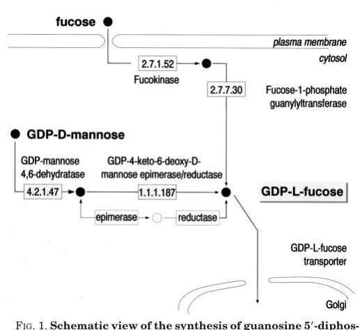

## Question

# Gene Research for Functional Annotation

## ⚠️ CRITICAL: Gene/Protein Identification Context

**BEFORE YOU BEGIN RESEARCH:** You MUST verify you are researching the CORRECT gene/protein. Gene symbols can be ambiguous, especially for less well-characterized genes from non-model organisms.

### Target Gene/Protein Identity (from UniProt):
- **UniProt Accession:** Q9VMW9
- **Protein Description:** RecName: Full=GDP-mannose 4,6-dehydratase {ECO:0000312|FlyBase:FBgn0031661}; EC=4.2.1.47 {ECO:0000305|PubMed:16650000}; AltName: Full=GDP-D-mannose dehydratase; Short=Dm-gmd; AltName: Full=GDP-mannose dehydratase {ECO:0000303|PubMed:16650000};
- **Gene Information:** Name=Gmd; ORFNames=CG8890;
- **Organism (full):** Drosophila melanogaster (Fruit fly).
- **Protein Family:** Belongs to the NAD(P)-dependent epimerase/dehydratase
- **Key Domains:** GDP_Man_deHydtase. (IPR006368); NAD(P)-bd_dom. (IPR016040); NAD(P)-bd_dom_sf. (IPR036291); GDP_Man_Dehyd (PF16363)

### MANDATORY VERIFICATION STEPS:

1. **Check if the gene symbol "Gmd" matches the protein description above**
2. **Verify the organism is correct:** Drosophila melanogaster (Fruit fly).
3. **Check if protein family/domains align with what you find in literature**
4. **If you find literature for a DIFFERENT gene with the same or similar symbol, STOP**

### If Gene Symbol is Ambiguous or You Cannot Find Relevant Literature:

**DO NOT PROCEED WITH RESEARCH ON A DIFFERENT GENE.** Instead:
- State clearly: "The gene symbol 'Gmd' is ambiguous or literature is limited for this specific protein"
- Explain what you found (e.g., "Found extensive literature on a different gene with the same symbol in a different organism")
- Describe the protein based ONLY on the UniProt information provided above
- Suggest that the protein function can be inferred from domain/family information

### Research Target:

Please provide a comprehensive research report on the gene **Gmd** (gene ID: Gmd, UniProt: Q9VMW9) in DROME.

The research report should be a detailed narrative explaining the function, biological processes, and localization of the gene product. Citations should be given for all claims.

You should prioritize authoritative reviews and primary scientific literature when conducting research. You can supplement
this with annotations you find in gene/protein databases, but these can be outdated or inaccurate.

We are specifically interested in the primary function of the gene - for enzymes, what reaction is catalyzed, and what is the substrate specificity? For transporters, what is the substrate? For structural proteins or adapters, what is the broader structural role? For signaling molecules, what is the role in the pathway.

We are interested in where in or outside the cell the gene product carries out its function.

We are also interested in the signaling or biochemical pathways in which the gene functions. We are less interested in broad pleiotropic effects, except where these elucidate the precise role.

Include evidence where possible. We are interested in both experimental evidence as well as inference from structure, evolution, or bioinformatic analysis. Precise studies should be prioritized over high-throughput, where available.

## Output

Question: You are an expert researcher providing comprehensive, well-cited information.

Provide detailed information focusing on:
1. Key concepts and definitions with current understanding
2. Recent developments and latest research (prioritize 2023-2024 sources)
3. Current applications and real-world implementations
4. Expert opinions and analysis from authoritative sources
5. Relevant statistics and data from recent studies

Format as a comprehensive research report with proper citations. Include URLs and publication dates where available.
Always prioritize recent, authoritative sources and provide specific citations for all major claims.

# Gene Research for Functional Annotation

## ⚠️ CRITICAL: Gene/Protein Identification Context

**BEFORE YOU BEGIN RESEARCH:** You MUST verify you are researching the CORRECT gene/protein. Gene symbols can be ambiguous, especially for less well-characterized genes from non-model organisms.

### Target Gene/Protein Identity (from UniProt):
- **UniProt Accession:** Q9VMW9
- **Protein Description:** RecName: Full=GDP-mannose 4,6-dehydratase {ECO:0000312|FlyBase:FBgn0031661}; EC=4.2.1.47 {ECO:0000305|PubMed:16650000}; AltName: Full=GDP-D-mannose dehydratase; Short=Dm-gmd; AltName: Full=GDP-mannose dehydratase {ECO:0000303|PubMed:16650000};
- **Gene Information:** Name=Gmd; ORFNames=CG8890;
- **Organism (full):** Drosophila melanogaster (Fruit fly).
- **Protein Family:** Belongs to the NAD(P)-dependent epimerase/dehydratase
- **Key Domains:** GDP_Man_deHydtase. (IPR006368); NAD(P)-bd_dom. (IPR016040); NAD(P)-bd_dom_sf. (IPR036291); GDP_Man_Dehyd (PF16363)

### MANDATORY VERIFICATION STEPS:

1. **Check if the gene symbol "Gmd" matches the protein description above**
2. **Verify the organism is correct:** Drosophila melanogaster (Fruit fly).
3. **Check if protein family/domains align with what you find in literature**
4. **If you find literature for a DIFFERENT gene with the same or similar symbol, STOP**

### If Gene Symbol is Ambiguous or You Cannot Find Relevant Literature:

**DO NOT PROCEED WITH RESEARCH ON A DIFFERENT GENE.** Instead:
- State clearly: "The gene symbol 'Gmd' is ambiguous or literature is limited for this specific protein"
- Explain what you found (e.g., "Found extensive literature on a different gene with the same symbol in a different organism")
- Describe the protein based ONLY on the UniProt information provided above
- Suggest that the protein function can be inferred from domain/family information

### Research Target:

Please provide a comprehensive research report on the gene **Gmd** (gene ID: Gmd, UniProt: Q9VMW9) in DROME.

The research report should be a detailed narrative explaining the function, biological processes, and localization of the gene product. Citations should be given for all claims.

You should prioritize authoritative reviews and primary scientific literature when conducting research. You can supplement
this with annotations you find in gene/protein databases, but these can be outdated or inaccurate.

We are specifically interested in the primary function of the gene - for enzymes, what reaction is catalyzed, and what is the substrate specificity? For transporters, what is the substrate? For structural proteins or adapters, what is the broader structural role? For signaling molecules, what is the role in the pathway.

We are interested in where in or outside the cell the gene product carries out its function.

We are also interested in the signaling or biochemical pathways in which the gene functions. We are less interested in broad pleiotropic effects, except where these elucidate the precise role.

Include evidence where possible. We are interested in both experimental evidence as well as inference from structure, evolution, or bioinformatic analysis. Precise studies should be prioritized over high-throughput, where available.

# Functional annotation of *Drosophila melanogaster* Gmd (Q9VMW9)

## Identity and principal function

**Identity verified.** The fly gene **Gmd**, also designated **CG8890** (FlyBase **FBgn0031661**), encodes **GDP-D-mannose 4,6-dehydratase** (GMD; EC 4.2.1.47), not a similarly named gene from another organism. Roos and colleagues explicitly associate *D. melanogaster* CG8890 with protein accession **Q9VMW9**. Its assignment to the NAD(P)-dependent epimerase/dehydratase family, including the supplied GDP-mannose-dehydratase and nucleotide-binding domain annotations, is consistent with the reported conservation of GMD proteins; those domain annotations alone do not establish a measured cofactor preference for the fly enzyme. (roos2002compositionofdrosophila pages 1-2, roos2002compositionofdrosophila pages 4-6, peterson2013insilicoanalysis pages 2-4)

GMD performs the **first committed conversion in de novo GDP-L-fucose synthesis**:

**GDP-D-mannose → GDP-4-keto-6-deoxy-D-mannose → GDP-L-fucose.**

Gmd is assigned the first, dehydration reaction; **Gmer**, a distinct epimerase/reductase, converts the intermediate toward GDP-L-fucose. Thus Gmd does **not** itself make GDP-L-fucose in a single reaction, transport nucleotide sugars, or transfer fucose to proteins. GDP-L-fucose is the activated donor subsequently used for protein and glycan fucosylation. Roos *et al.* depict both the intermediate and compartmentalized pathway in their Figure 1. (roos2002compositionofdrosophila media a2f6e59e, roos2002compositionofdrosophila pages 1-1, ayukawa2012rescueofnotch pages 1-2)

**Substrate specificity and strength of evidence.** GDP-D-mannose is the established pathway substrate for this enzyme class and the supported functional assignment for fly Gmd. The original CG8890 assignment relied substantially on sequence conservation; the accessible fly studies establish its *in vivo* requirement through genetics and GDP-fucose depletion, but do not supply a fly-specific substrate panel, kinetic constants, or a measured NAD⁺-versus-NADP⁺ preference. Recombinant GMD from the **fungus** *Mortierella alpina* converts GDP-mannose to the specified intermediate with either cofactor tested; those measurements must not be reported as measurements of Q9VMW9. A specifically relevant fly-and-nematode *in vitro* reconstitution was published by Rhomberg *et al.* in **May 2006** ([DOI: 10.1111/j.1742-4658.2006.05239.x](https://doi.org/10.1111/j.1742-4658.2006.05239.x)), but its full text could not be assessed here; consequently, no narrower fly substrate or cofactor claim is made. (roos2002compositionofdrosophila pages 3-4, roos2002compositionofdrosophila pages 1-1, ren2010biochemicalcharacterizationof pages 2-4, ren2010biochemicalcharacterizationof pages 4-6, ren2010biochemicalcharacterizationof pages 1-2)

## Biological process and cellular site

Fly Gmd and Gmer supply GDP-L-fucose through the **de novo nucleotide-sugar pathway**. Genome analysis found no recognizable fly orthologs of the enzymes required to salvage free fucose into GDP-fucose; subsequent fly mutant experiments support the de novo pathway’s physiological importance: Gmd-null animals have **no detectable GDP-fucose**. This is a distinction from mammals, which also possess a salvage route. The most defensible site for Gmd’s reaction is the **cytoplasm/cytosol**, as described in fly pathway studies and a specialist review; a direct imaging-based localization of Q9VMW9 itself was not verified in the retrieved studies. (roos2002compositionofdrosophila pages 4-6, glavic2011locationmattersthe pages 1-2, jafarnejad2010roleofglycans pages 7-7, ameen2025geneticdiseasesof pages 9-11)

Synthesis must be distinguished from the locations where GDP-fucose is *used*. **Gfr** imports cytosolic GDP-fucose into the **Golgi** for glycan fucosylation; **Efr** supplies the **endoplasmic reticulum (ER)**, where **Ofut1** O-fucosylates Notch EGF-like repeats. Efr and Gfr can provide overlapping support for Notch O-fucosylation. These are transporter and fucosyltransferase functions, **not evidence that Gmd itself is an ER or Golgi enzyme**. (jafarnejad2010roleofglycans pages 13-13, jafarnejad2010roleofglycans pages 7-7, ayukawa2012rescueofnotch pages 2-3)

The pathway’s best-resolved signaling consequence is **substrate supply for Notch glycosylation**. Ofut1 transfers fucose from GDP-fucose to Notch; Fringe then adds N-acetylglucosamine to that O-fucose, changing Notch responses to the Delta and Serrate ligands in particular developmental contexts. Gmd therefore influences Notch **indirectly through GDP-fucose availability**, rather than acting as a Notch receptor component or signaling enzyme. GDP-fucose also supports fucosylation of N-glycans and other acceptors, so Gmd perturbation cannot automatically be interpreted as a Notch-specific intervention. (ayukawa2012rescueofnotch pages 1-2, okajima2008contributionsofchaperone pages 1-2, ayukawa2012rescueofnotch pages 4-5)

## Experimental evidence and biological interpretation

In fly loss-of-function experiments, **Gmd^H78** is a null allele. Homozygotes with maternal contribution can survive to the **third larval instar**, whereas those lacking maternal Gmd product die as embryos. Homozygous wing discs show markedly diminished staining by the fucose-binding lectin AAL and lose **Notch-dependent wingless expression** at the dorsal–ventral boundary, linking GDP-fucose shortage to deficient protein fucosylation and a defined signaling output. These observations do not measure purified GMD catalysis, but strongly validate the gene’s physiological pathway assignment. (ayukawa2012rescueofnotch pages 1-2, ayukawa2012rescueofnotch pages 2-2)

**The Notch requirement is context-dependent.** Okajima *et al.* found that Fringe-independent embryonic neurogenesis can proceed without O-fucosylation: a catalytically inactive Ofut1 variant retained the chaperone activity needed for this Notch function, and their Gmd-mutant analysis did not support an obligatory O-fucose requirement in that setting. Conversely, Gmd loss disrupts Fringe-dependent wing-boundary outputs. Glavic *et al.* reported that altering Gmd dosage also changes Notch abundance and activity and proposed an **OFUT1-dependent effect on Notch stability**; they did not measure GDP-fucose in every overexpression condition, so this dosage model should not be treated as proof of a direct Gmd–Notch interaction or a universal requirement for O-fucosylation. (okajima2008contributionsofchaperone pages 1-2, okajima2008contributionsofchaperone pages 4-6, glavic2011locationmattersthe pages 3-4, glavic2011locationmattersthe pages 1-2)

Gmd provides a particularly useful **genetic model for metabolite sharing**. In wing-disc mosaics, neighboring Gmd-positive cells can compensate for Gmd-deficient cells. Expressing Gmd only in a restricted part of a mutant wing disc restored dorsal–ventral wingless expression across the boundary in **all examined discs (n > 20)**; expressing it in attached tracheal tissue also rescued this output (**n > 20**), whereas expression in a separate organ did not rescue the wing disc. In a complementary test, Gmd RNAi alone (**n = 30**) or **inx2** RNAi alone (**n = 27**) preserved the examined AAL and Cut readouts, but combined knockdown reduced both in **all 23 examined discs**; co-expression of wild-type **inx2** rescued the combined condition (**n = 27**). These findings support Innexin-2-dependent, **within-tissue transfer of GDP-L-fucose**, not extracellular activity or movement of the Gmd protein itself. The authors cautioned that innexin channels carry other molecules too, and noted that Gmd-mutant adult intestinal stem-cell clones instead behave cell-autonomously. (ayukawa2012rescueofnotch pages 2-3, ayukawa2012rescueofnotch pages 3-4, ayukawa2012rescueofnotch pages 4-5)

The evidence hierarchy for this annotation is summarized below. (roos2002compositionofdrosophila pages 1-2, roos2002compositionofdrosophila media a2f6e59e, ayukawa2012rescueofnotch pages 4-5)

| Claim | Evidence class | Precise finding and limitations | Source (author/date/DOI) |
|---|---|---|---|
| **Identity: Gmd = CG8890 = Q9VMW9 in *Drosophila melanogaster*** | Comparative genomics plus transcription/genetic support | CG8890 was mapped to Q9VMW9 and annotated as GDP-mannose 4,6-dehydratase. Conservation with known GMD proteins and expressed-sequence-tag evidence support the assignment. The original study was principally genome-based rather than a purified-enzyme kinetic analysis. (roos2002compositionofdrosophila pages 4-6, roos2002compositionofdrosophila pages 1-2) | Roos *et al.*; 1 February 2002; [10.1074/jbc.M107927200](https://doi.org/10.1074/jbc.M107927200) |
| **Primary reaction and pathway position** | Pathway reconstruction and comparative enzymology | GMD catalyzes the first de novo GDP-L-fucose step: GDP-D-mannose → GDP-4-keto-6-deoxy-D-mannose; Gmer/GMER subsequently forms GDP-L-fucose. The fly lacks recognizable salvage-pathway enzymes. Figure 1 supports the reaction scheme, but the available Roos text does **not** provide fly-specific kinetics, substrate-panel testing, or cofactor-preference measurements; therefore no fly Km or strict exclusivity claim is warranted. (roos2002compositionofdrosophila media a2f6e59e, roos2002compositionofdrosophila pages 1-1) | Roos *et al.*; 1 February 2002; [10.1074/jbc.M107927200](https://doi.org/10.1074/jbc.M107927200) |
| **Subcellular site: cytosolic synthesis, not ER/Golgi catalysis by GMD** | Pathway-level localization plus transporter genetics | GMD is described as a cytoplasmic enzyme, and GDP-fucose synthesis by Gmd/Gmer is assigned to the cytosol. GDP-L-fucose must then be imported into the ER or Golgi: Efr and Gfr perform those transport functions. No direct microscopy/localization experiment for Q9VMW9 itself was verified, so “cytosolic” is well-supported pathway localization rather than demonstrated protein imaging. (glavic2011locationmattersthe pages 1-2, jafarnejad2010roleofglycans pages 7-7, ayukawa2012rescueofnotch pages 2-3) | Glavic *et al.*; 2011; [10.4067/S0716-97602011000100004](https://doi.org/10.4067/S0716-97602011000100004). Ayukawa *et al.*; 18 September 2012; [10.1073/pnas.1202369109](https://doi.org/10.1073/pnas.1202369109) |
| **Loss of Gmd depletes GDP-L-fucose and impairs selected Notch outputs** | Null-mutant genetics, lectin staining, developmental signaling assays | Gmd-null animals lack detectable GDP-fucose; Gmd^H78 homozygotes retain strongly reduced AAL staining and lose Notch-dependent wingless expression at the wing dorsal–ventral boundary. Maternal Gmd permits survival to third-instar larvae, whereas removal of maternal contribution causes embryonic death. However, Okajima *et al.* showed that Fringe-independent embryonic Notch signaling can proceed without O-fucosylation, separating GDP-fucose-dependent Fringe modulation from OFUT1’s essential chaperone function. (ayukawa2012rescueofnotch pages 1-2, ayukawa2012rescueofnotch pages 2-2, okajima2008contributionsofchaperone pages 1-2) | Okajima *et al.*; 14 January 2008; [10.1186/1741-7007-6-1](https://doi.org/10.1186/1741-7007-6-1). Ayukawa *et al.*; 18 September 2012; [10.1073/pnas.1202369109](https://doi.org/10.1073/pnas.1202369109) |
| **Innexin-2 enables intercellular complementation of Gmd deficiency** | Tissue-specific double-RNAi and rescue experiment | Gmd RNAi alone (n=30) or inx2 RNAi alone (n=27) did not alter AAL or Cut readouts, but combined Gmd+inx2 RNAi reduced both in every case examined (n=23); wild-type inx2 overexpression completely rescued the combined condition (n=27). These data support Innexin-2-dependent GDP-L-fucose transfer within wing epithelium, but not universal transfer: adult intestinal stem-cell clones behaved cell-autonomously, and innexin perturbation can affect molecules besides GDP-L-fucose. (ayukawa2012rescueofnotch pages 4-5) | Ayukawa *et al.*; 18 September 2012; [10.1073/pnas.1202369109](https://doi.org/10.1073/pnas.1202369109) |
| **Modern synthesis and species boundary** | Authoritative recent review | The review confirms that fly Gmd is the single GMDS homolog acting with Gmer in de novo GDP-L-fucose synthesis and that no fly salvage pathway has been demonstrated. It separately discusses *Drosophila* intestinal stem-cell/Notch phenotypes and zebrafish gmds neural, hemorrhagic, retinal, and curly-tail phenotypes; those zebrafish observations must not be assigned to Q9VMW9. (ameen2025geneticdiseasesof pages 6-8, ameen2025geneticdiseasesof pages 9-11) | Ameen & French; July 2025; [10.3390/genes16070800](https://doi.org/10.3390/genes16070800) |

*Table: Evidence hierarchy for *Drosophila melanogaster* Gmd/CG8890/Q9VMW9, separating direct fly genetics from pathway inference and explicitly flagging localization, kinetic, and cross-species limitations.*

## Recent understanding and research use

A **July 2025** review by Ameen and French continues to identify fly **gmd** as the single homolog of human **GMDS** in de novo GDP-L-fucose synthesis, paired with fly **gmer**; it also summarizes a reported Gmd-mutant intestinal stem-cell/Notch phenotype. Its tables combine observations from different organisms: zebrafish **gmds** neural, hemorrhagic, retinal, and tail phenotypes are **not** phenotypes established for fly Q9VMW9. No retrieved **2023–2024** study independently established a new fly-Q9VMW9 reaction, substrate panel, or cellular localization; the most informative gene-specific experimental sources remain earlier fly studies. (ameen2025geneticdiseasesof pages 9-11, ameen2025geneticdiseasesof pages 6-8, ayukawa2012rescueofnotch pages 4-5)

In practice, Gmd null alleles, tissue-specific expression and RNAi provide fly researchers with ways to perturb the **supply of GDP-fucose** while comparing fucosylation, Notch readouts and intercellular metabolic rescue. This is a **research implementation**, not evidence of a clinical treatment or of an established industrial application of the fly protein. A key experimental limitation is that changing Gmd affects the shared donor for several fucosylation reactions, rather than selectively modifying one Notch site. (glavic2011locationmattersthe pages 3-4, ayukawa2012rescueofnotch pages 2-3, ayukawa2012rescueofnotch pages 4-5)

### Principal sources

- Roos C *et al.* **February 2002**. “Composition of *Drosophila melanogaster* proteome involved in fucosylated glycan metabolism.” *Journal of Biological Chemistry* 277:3168–3175. [https://doi.org/10.1074/jbc.M107927200](https://doi.org/10.1074/jbc.M107927200). (roos2002compositionofdrosophila pages 1-2, roos2002compositionofdrosophila media a2f6e59e)
- Okajima T *et al.* **14 January 2008**. “Contributions of chaperone and glycosyltransferase activities of O-fucosyltransferase 1 to Notch signaling.” *BMC Biology* 6:1. [https://doi.org/10.1186/1741-7007-6-1](https://doi.org/10.1186/1741-7007-6-1). (okajima2008contributionsofchaperone pages 1-2)
- Glavic A *et al.* **2011**. “The balance between GMD and OFUT1 regulates Notch signaling pathway activity by modulating Notch stability.” *Biological Research* 44:25–34. [https://doi.org/10.4067/S0716-97602011000100004](https://doi.org/10.4067/S0716-97602011000100004). (glavic2011locationmattersthe pages 1-2, glavic2011locationmattersthe pages 3-4)
- Ayukawa T *et al.* **18 September 2012**. “Rescue of Notch signaling in cells incapable of GDP-L-fucose synthesis by gap junction transfer of GDP-L-fucose in *Drosophila*.” *PNAS* 109:15318–15323. [https://doi.org/10.1073/pnas.1202369109](https://doi.org/10.1073/pnas.1202369109). (ayukawa2012rescueofnotch pages 1-2, ayukawa2012rescueofnotch pages 4-5)
- Ameen MT and French CR. **July 2025**. “Genetic Diseases of Fucosylation: Insights from Model Organisms.” *Genes* 16:800. [https://doi.org/10.3390/genes16070800](https://doi.org/10.3390/genes16070800). (ameen2025geneticdiseasesof pages 9-11)

References

1. (roos2002compositionofdrosophila pages 1-2): Christophe Roos, Meelis Kolmer, Pirkko Mattila, and Risto Renkonen. Composition of drosophila melanogaster proteome involved in fucosylated glycan metabolism*. The Journal of Biological Chemistry, 277:3168-3175, Feb 2002. URL: https://doi.org/10.1074/jbc.m107927200, doi:10.1074/jbc.m107927200. This article has 117 citations.

2. (roos2002compositionofdrosophila pages 4-6): Christophe Roos, Meelis Kolmer, Pirkko Mattila, and Risto Renkonen. Composition of drosophila melanogaster proteome involved in fucosylated glycan metabolism*. The Journal of Biological Chemistry, 277:3168-3175, Feb 2002. URL: https://doi.org/10.1074/jbc.m107927200, doi:10.1074/jbc.m107927200. This article has 117 citations.

3. (peterson2013insilicoanalysis pages 2-4): Nathan A Peterson, Tavis K Anderson, Xiao-Jun Wu, and Timothy P Yoshino. In silico analysis of the fucosylation-associated genome of the human blood fluke schistosoma mansoni: cloning and characterization of the enzymes involved in gdp-l-fucose synthesis and golgi import. Parasites & Vectors, Jul 2013. URL: https://doi.org/10.1186/1756-3305-6-201, doi:10.1186/1756-3305-6-201. This article has 24 citations and is from a peer-reviewed journal.

4. (roos2002compositionofdrosophila media a2f6e59e): Christophe Roos, Meelis Kolmer, Pirkko Mattila, and Risto Renkonen. Composition of drosophila melanogaster proteome involved in fucosylated glycan metabolism*. The Journal of Biological Chemistry, 277:3168-3175, Feb 2002. URL: https://doi.org/10.1074/jbc.m107927200, doi:10.1074/jbc.m107927200. This article has 117 citations.

5. (roos2002compositionofdrosophila pages 1-1): Christophe Roos, Meelis Kolmer, Pirkko Mattila, and Risto Renkonen. Composition of drosophila melanogaster proteome involved in fucosylated glycan metabolism*. The Journal of Biological Chemistry, 277:3168-3175, Feb 2002. URL: https://doi.org/10.1074/jbc.m107927200, doi:10.1074/jbc.m107927200. This article has 117 citations.

6. (ayukawa2012rescueofnotch pages 1-2): Tomonori Ayukawa, Kenjiroo Matsumoto, Hiroyuki O. Ishikawa, Akira Ishio, Tomoko Yamakawa, Naoki Aoyama, Takuya Suzuki, and Kenji Matsuno. Rescue of notch signaling in cells incapable of gdp-l-fucose synthesis by gap junction transfer of gdp-l-fucose in drosophila. Proceedings of the National Academy of Sciences, 109:15318-15323, Sep 2012. URL: https://doi.org/10.1073/pnas.1202369109, doi:10.1073/pnas.1202369109. This article has 38 citations and is from a highest quality peer-reviewed journal.

7. (roos2002compositionofdrosophila pages 3-4): Christophe Roos, Meelis Kolmer, Pirkko Mattila, and Risto Renkonen. Composition of drosophila melanogaster proteome involved in fucosylated glycan metabolism*. The Journal of Biological Chemistry, 277:3168-3175, Feb 2002. URL: https://doi.org/10.1074/jbc.m107927200, doi:10.1074/jbc.m107927200. This article has 117 citations.

8. (ren2010biochemicalcharacterizationof pages 2-4): Yan Ren, Andrei V. Perepelov, Haiyan Wang, Hao Zhang, Yuriy A. Knirel, Lei Wang, and Wei Chen. Biochemical characterization of gdp-l-fucose de novo synthesis pathway in fungus mortierella alpina. Biochemical and biophysical research communications, 391 4:1663-9, Jan 2010. URL: https://doi.org/10.1016/j.bbrc.2009.12.116, doi:10.1016/j.bbrc.2009.12.116. This article has 34 citations and is from a peer-reviewed journal.

9. (ren2010biochemicalcharacterizationof pages 4-6): Yan Ren, Andrei V. Perepelov, Haiyan Wang, Hao Zhang, Yuriy A. Knirel, Lei Wang, and Wei Chen. Biochemical characterization of gdp-l-fucose de novo synthesis pathway in fungus mortierella alpina. Biochemical and biophysical research communications, 391 4:1663-9, Jan 2010. URL: https://doi.org/10.1016/j.bbrc.2009.12.116, doi:10.1016/j.bbrc.2009.12.116. This article has 34 citations and is from a peer-reviewed journal.

10. (ren2010biochemicalcharacterizationof pages 1-2): Yan Ren, Andrei V. Perepelov, Haiyan Wang, Hao Zhang, Yuriy A. Knirel, Lei Wang, and Wei Chen. Biochemical characterization of gdp-l-fucose de novo synthesis pathway in fungus mortierella alpina. Biochemical and biophysical research communications, 391 4:1663-9, Jan 2010. URL: https://doi.org/10.1016/j.bbrc.2009.12.116, doi:10.1016/j.bbrc.2009.12.116. This article has 34 citations and is from a peer-reviewed journal.

11. (glavic2011locationmattersthe pages 1-2): Alvaro Glavic, Ana López-Varea, and José F de Celis. Location matters: the endoplasmic reticulum and protein trafficking in dendrites. Biological research, 44 1:17-23, Jan 2011. URL: https://doi.org/10.4067/s0716-97602011000100004, doi:10.4067/s0716-97602011000100004. This article has 7 citations and is from a peer-reviewed journal.

12. (jafarnejad2010roleofglycans pages 7-7): H. Jafar-Nejad, Jessica Leonardi, and R. Fernandez‐Valdivia. Role of glycans and glycosyltransferases in the regulation of notch signaling. Glycobiology, 20 8:931-49, Aug 2010. URL: https://doi.org/10.1093/glycob/cwq053, doi:10.1093/glycob/cwq053. This article has 92 citations and is from a peer-reviewed journal.

13. (ameen2025geneticdiseasesof pages 9-11): Muhammad T. Ameen and Curtis R. French. Genetic diseases of fucosylation: insights from model organisms. Genes, 16:800, Jul 2025. URL: https://doi.org/10.3390/genes16070800, doi:10.3390/genes16070800. This article has 5 citations.

14. (jafarnejad2010roleofglycans pages 13-13): H. Jafar-Nejad, Jessica Leonardi, and R. Fernandez‐Valdivia. Role of glycans and glycosyltransferases in the regulation of notch signaling. Glycobiology, 20 8:931-49, Aug 2010. URL: https://doi.org/10.1093/glycob/cwq053, doi:10.1093/glycob/cwq053. This article has 92 citations and is from a peer-reviewed journal.

15. (ayukawa2012rescueofnotch pages 2-3): Tomonori Ayukawa, Kenjiroo Matsumoto, Hiroyuki O. Ishikawa, Akira Ishio, Tomoko Yamakawa, Naoki Aoyama, Takuya Suzuki, and Kenji Matsuno. Rescue of notch signaling in cells incapable of gdp-l-fucose synthesis by gap junction transfer of gdp-l-fucose in drosophila. Proceedings of the National Academy of Sciences, 109:15318-15323, Sep 2012. URL: https://doi.org/10.1073/pnas.1202369109, doi:10.1073/pnas.1202369109. This article has 38 citations and is from a highest quality peer-reviewed journal.

16. (okajima2008contributionsofchaperone pages 1-2): Tetsuya Okajima, BVVG Reddy, Tsukasa Matsuda, and Kenneth D Irvine. Contributions of chaperone and glycosyltransferase activities of o-fucosyltransferase 1 to notch signaling. BMC Biology, 6:1-1, Jan 2008. URL: https://doi.org/10.1186/1741-7007-6-1, doi:10.1186/1741-7007-6-1. This article has 107 citations and is from a domain leading peer-reviewed journal.

17. (ayukawa2012rescueofnotch pages 4-5): Tomonori Ayukawa, Kenjiroo Matsumoto, Hiroyuki O. Ishikawa, Akira Ishio, Tomoko Yamakawa, Naoki Aoyama, Takuya Suzuki, and Kenji Matsuno. Rescue of notch signaling in cells incapable of gdp-l-fucose synthesis by gap junction transfer of gdp-l-fucose in drosophila. Proceedings of the National Academy of Sciences, 109:15318-15323, Sep 2012. URL: https://doi.org/10.1073/pnas.1202369109, doi:10.1073/pnas.1202369109. This article has 38 citations and is from a highest quality peer-reviewed journal.

18. (ayukawa2012rescueofnotch pages 2-2): Tomonori Ayukawa, Kenjiroo Matsumoto, Hiroyuki O. Ishikawa, Akira Ishio, Tomoko Yamakawa, Naoki Aoyama, Takuya Suzuki, and Kenji Matsuno. Rescue of notch signaling in cells incapable of gdp-l-fucose synthesis by gap junction transfer of gdp-l-fucose in drosophila. Proceedings of the National Academy of Sciences, 109:15318-15323, Sep 2012. URL: https://doi.org/10.1073/pnas.1202369109, doi:10.1073/pnas.1202369109. This article has 38 citations and is from a highest quality peer-reviewed journal.

19. (okajima2008contributionsofchaperone pages 4-6): Tetsuya Okajima, BVVG Reddy, Tsukasa Matsuda, and Kenneth D Irvine. Contributions of chaperone and glycosyltransferase activities of o-fucosyltransferase 1 to notch signaling. BMC Biology, 6:1-1, Jan 2008. URL: https://doi.org/10.1186/1741-7007-6-1, doi:10.1186/1741-7007-6-1. This article has 107 citations and is from a domain leading peer-reviewed journal.

20. (glavic2011locationmattersthe pages 3-4): Alvaro Glavic, Ana López-Varea, and José F de Celis. Location matters: the endoplasmic reticulum and protein trafficking in dendrites. Biological research, 44 1:17-23, Jan 2011. URL: https://doi.org/10.4067/s0716-97602011000100004, doi:10.4067/s0716-97602011000100004. This article has 7 citations and is from a peer-reviewed journal.

21. (ayukawa2012rescueofnotch pages 3-4): Tomonori Ayukawa, Kenjiroo Matsumoto, Hiroyuki O. Ishikawa, Akira Ishio, Tomoko Yamakawa, Naoki Aoyama, Takuya Suzuki, and Kenji Matsuno. Rescue of notch signaling in cells incapable of gdp-l-fucose synthesis by gap junction transfer of gdp-l-fucose in drosophila. Proceedings of the National Academy of Sciences, 109:15318-15323, Sep 2012. URL: https://doi.org/10.1073/pnas.1202369109, doi:10.1073/pnas.1202369109. This article has 38 citations and is from a highest quality peer-reviewed journal.

22. (ameen2025geneticdiseasesof pages 6-8): Muhammad T. Ameen and Curtis R. French. Genetic diseases of fucosylation: insights from model organisms. Genes, 16:800, Jul 2025. URL: https://doi.org/10.3390/genes16070800, doi:10.3390/genes16070800. This article has 5 citations.

## Artifacts

- [Edison artifact artifact-00](Gmd-deep-research-falcon_artifacts/artifact-00.md)

## Citations

1. ayukawa2012rescueofnotch pages 4-5
2. okajima2008contributionsofchaperone pages 1-2
3. ameen2025geneticdiseasesof pages 9-11
4. roos2002compositionofdrosophila pages 1-2
5. roos2002compositionofdrosophila pages 4-6
6. peterson2013insilicoanalysis pages 2-4
7. roos2002compositionofdrosophila pages 1-1
8. ayukawa2012rescueofnotch pages 1-2
9. roos2002compositionofdrosophila pages 3-4
10. ren2010biochemicalcharacterizationof pages 2-4
11. ren2010biochemicalcharacterizationof pages 4-6
12. ren2010biochemicalcharacterizationof pages 1-2
13. glavic2011locationmattersthe pages 1-2
14. jafarnejad2010roleofglycans pages 7-7
15. jafarnejad2010roleofglycans pages 13-13
16. ayukawa2012rescueofnotch pages 2-3
17. ayukawa2012rescueofnotch pages 2-2
18. okajima2008contributionsofchaperone pages 4-6
19. glavic2011locationmattersthe pages 3-4
20. ayukawa2012rescueofnotch pages 3-4
21. ameen2025geneticdiseasesof pages 6-8
22. DOI: 10.1111/j.1742-4658.2006.05239.x
23. 10.1074/jbc.M107927200
24. 10.4067/S0716-97602011000100004
25. 10.1073/pnas.1202369109
26. 10.1186/1741-7007-6-1
27. 10.3390/genes16070800
28. https://doi.org/10.1074/jbc.M107927200
29. https://doi.org/10.1186/1741-7007-6-1
30. https://doi.org/10.4067/S0716-97602011000100004
31. https://doi.org/10.1073/pnas.1202369109
32. https://doi.org/10.3390/genes16070800
33. https://doi.org/10.1111/j.1742-4658.2006.05239.x
34. https://doi.org/10.1074/jbc.M107927200](https://doi.org/10.1074/jbc.M107927200
35. https://doi.org/10.1186/1741-7007-6-1](https://doi.org/10.1186/1741-7007-6-1
36. https://doi.org/10.4067/S0716-97602011000100004](https://doi.org/10.4067/S0716-97602011000100004
37. https://doi.org/10.1073/pnas.1202369109](https://doi.org/10.1073/pnas.1202369109
38. https://doi.org/10.3390/genes16070800](https://doi.org/10.3390/genes16070800
39. https://doi.org/10.1074/jbc.m107927200,
40. https://doi.org/10.1186/1756-3305-6-201,
41. https://doi.org/10.1073/pnas.1202369109,
42. https://doi.org/10.1016/j.bbrc.2009.12.116,
43. https://doi.org/10.4067/s0716-97602011000100004,
44. https://doi.org/10.1093/glycob/cwq053,
45. https://doi.org/10.3390/genes16070800,
46. https://doi.org/10.1186/1741-7007-6-1,