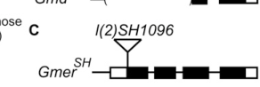

## Question

# Gene Research for Functional Annotation

## ⚠️ CRITICAL: Gene/Protein Identification Context

**BEFORE YOU BEGIN RESEARCH:** You MUST verify you are researching the CORRECT gene/protein. Gene symbols can be ambiguous, especially for less well-characterized genes from non-model organisms.

### Target Gene/Protein Identity (from UniProt):
- **UniProt Accession:** Q9W1X8
- **Protein Description:** RecName: Full=Probable GDP-L-fucose synthase; EC=1.1.1.271 {ECO:0000305|PubMed:16650000}; AltName: Full=GDP-4-keto-6-deoxy-D-mannose-3,5-epimerase-4-reductase {ECO:0000303|PubMed:16650000}; Short=GER {ECO:0000303|PubMed:16650000}; AltName: Full=Protein FX;
- **Gene Information:** Name=Gmer; ORFNames=CG3495;
- **Organism (full):** Drosophila melanogaster (Fruit fly).
- **Protein Family:** Belongs to the NAD(P)-dependent epimerase/dehydratase
- **Key Domains:** Epimerase_deHydtase. (IPR001509); GDP_fucose/colitose_synth. (IPR028614); NAD(P)-bd_dom_sf. (IPR036291); Epimerase (PF01370)

### MANDATORY VERIFICATION STEPS:

1. **Check if the gene symbol "Gmer" matches the protein description above**
2. **Verify the organism is correct:** Drosophila melanogaster (Fruit fly).
3. **Check if protein family/domains align with what you find in literature**
4. **If you find literature for a DIFFERENT gene with the same or similar symbol, STOP**

### If Gene Symbol is Ambiguous or You Cannot Find Relevant Literature:

**DO NOT PROCEED WITH RESEARCH ON A DIFFERENT GENE.** Instead:
- State clearly: "The gene symbol 'Gmer' is ambiguous or literature is limited for this specific protein"
- Explain what you found (e.g., "Found extensive literature on a different gene with the same symbol in a different organism")
- Describe the protein based ONLY on the UniProt information provided above
- Suggest that the protein function can be inferred from domain/family information

### Research Target:

Please provide a comprehensive research report on the gene **Gmer** (gene ID: Gmer, UniProt: Q9W1X8) in DROME.

The research report should be a detailed narrative explaining the function, biological processes, and localization of the gene product. Citations should be given for all claims.

You should prioritize authoritative reviews and primary scientific literature when conducting research. You can supplement
this with annotations you find in gene/protein databases, but these can be outdated or inaccurate.

We are specifically interested in the primary function of the gene - for enzymes, what reaction is catalyzed, and what is the substrate specificity? For transporters, what is the substrate? For structural proteins or adapters, what is the broader structural role? For signaling molecules, what is the role in the pathway.

We are interested in where in or outside the cell the gene product carries out its function.

We are also interested in the signaling or biochemical pathways in which the gene functions. We are less interested in broad pleiotropic effects, except where these elucidate the precise role.

Include evidence where possible. We are interested in both experimental evidence as well as inference from structure, evolution, or bioinformatic analysis. Precise studies should be prioritized over high-throughput, where available.

## Output

Question: You are an expert researcher providing comprehensive, well-cited information.

Provide detailed information focusing on:
1. Key concepts and definitions with current understanding
2. Recent developments and latest research (prioritize 2023-2024 sources)
3. Current applications and real-world implementations
4. Expert opinions and analysis from authoritative sources
5. Relevant statistics and data from recent studies

Format as a comprehensive research report with proper citations. Include URLs and publication dates where available.
Always prioritize recent, authoritative sources and provide specific citations for all major claims.

# Gene Research for Functional Annotation

## ⚠️ CRITICAL: Gene/Protein Identification Context

**BEFORE YOU BEGIN RESEARCH:** You MUST verify you are researching the CORRECT gene/protein. Gene symbols can be ambiguous, especially for less well-characterized genes from non-model organisms.

### Target Gene/Protein Identity (from UniProt):
- **UniProt Accession:** Q9W1X8
- **Protein Description:** RecName: Full=Probable GDP-L-fucose synthase; EC=1.1.1.271 {ECO:0000305|PubMed:16650000}; AltName: Full=GDP-4-keto-6-deoxy-D-mannose-3,5-epimerase-4-reductase {ECO:0000303|PubMed:16650000}; Short=GER {ECO:0000303|PubMed:16650000}; AltName: Full=Protein FX;
- **Gene Information:** Name=Gmer; ORFNames=CG3495;
- **Organism (full):** Drosophila melanogaster (Fruit fly).
- **Protein Family:** Belongs to the NAD(P)-dependent epimerase/dehydratase
- **Key Domains:** Epimerase_deHydtase. (IPR001509); GDP_fucose/colitose_synth. (IPR028614); NAD(P)-bd_dom_sf. (IPR036291); Epimerase (PF01370)

### MANDATORY VERIFICATION STEPS:

1. **Check if the gene symbol "Gmer" matches the protein description above**
2. **Verify the organism is correct:** Drosophila melanogaster (Fruit fly).
3. **Check if protein family/domains align with what you find in literature**
4. **If you find literature for a DIFFERENT gene with the same or similar symbol, STOP**

### If Gene Symbol is Ambiguous or You Cannot Find Relevant Literature:

**DO NOT PROCEED WITH RESEARCH ON A DIFFERENT GENE.** Instead:
- State clearly: "The gene symbol 'Gmer' is ambiguous or literature is limited for this specific protein"
- Explain what you found (e.g., "Found extensive literature on a different gene with the same symbol in a different organism")
- Describe the protein based ONLY on the UniProt information provided above
- Suggest that the protein function can be inferred from domain/family information

### Research Target:

Please provide a comprehensive research report on the gene **Gmer** (gene ID: Gmer, UniProt: Q9W1X8) in DROME.

The research report should be a detailed narrative explaining the function, biological processes, and localization of the gene product. Citations should be given for all claims.

You should prioritize authoritative reviews and primary scientific literature when conducting research. You can supplement
this with annotations you find in gene/protein databases, but these can be outdated or inaccurate.

We are specifically interested in the primary function of the gene - for enzymes, what reaction is catalyzed, and what is the substrate specificity? For transporters, what is the substrate? For structural proteins or adapters, what is the broader structural role? For signaling molecules, what is the role in the pathway.

We are interested in where in or outside the cell the gene product carries out its function.

We are also interested in the signaling or biochemical pathways in which the gene functions. We are less interested in broad pleiotropic effects, except where these elucidate the precise role.

Include evidence where possible. We are interested in both experimental evidence as well as inference from structure, evolution, or bioinformatic analysis. Precise studies should be prioritized over high-throughput, where available.

# Functional annotation of *Drosophila melanogaster* Gmer (CG3495; UniProt Q9W1X8)

## Identity and principal function

**Identity verified.** In *D. melanogaster*, **Gmer/CG3495/Q9W1X8** is the GDP-l-fucose-synthase candidate also called GDP-4-keto-6-deoxy-d-mannose 3,5-epimerase/4-reductase (GMER or FX; EC 1.1.1.271). It is **not** Gmd/CG8890, which encodes the preceding GDP-d-mannose 4,6-dehydratase. The original fly assignment rested on sequence comparisons with GMER/FX proteins; subsequent fly genetics established that Gmer is required for the pathway’s final step *in vivo*. The supplied UniProt epimerase and NAD(P)-binding domain annotations are consistent with this enzyme family, but are not themselves measurements of fly catalytic activity. (roos2002compositionofdrosophila pages 3-4, roos2002compositionofdrosophila pages 1-2, peterson2013insilicoanalysis pages 9-13, ayukawa2012rescueofnotch pages 2-2)

**Reaction and substrate.** In the de novo pathway, Gmd first converts GDP-d-mannose to **GDP-4-keto-6-deoxy-d-mannose**. The assigned Gmer reaction epimerizes that nucleotide sugar at C3 and C5 and then reduces its C4 keto group to yield **GDP-l-fucose**; the reduction uses **NADPH**, producing NADP⁺. Thus Gmer supplies a nucleotide-sugar donor—it does **not** transfer fucose onto proteins or glycans. The substrate, reaction order and cofactor are well supported for the GMER/FX enzyme class and by pathway comparisons, while the accessible Gmer-specific fly studies establish pathway function primarily by genetics rather than reporting a purified-CG3495 substrate panel, NADPH-versus-NADH comparison or kinetic constants. Specificity toward alternative GDP sugars should therefore not be claimed as experimentally established for this fly protein. (becker2003fucosebiosynthesisand pages 5-6, becker2003fucosebiosynthesisand pages 6-7, peterson2013insilicoanalysis pages 2-4, ayukawa2012rescueofnotch pages 2-2)

The Gmer assignment also fits evolutionary evidence: homolog comparisons place it among conserved NAD(P)-dependent epimerase/reductases with a dinucleotide-binding Rossmann-type region and short-chain dehydrogenase/reductase catalytic features. These family features support, but do not replace, fly-specific enzymology. (roos2002compositionofdrosophila pages 3-4, peterson2013insilicoanalysis pages 9-13)

## Pathway, location and downstream use

The best-supported **site of Gmer action is the cytosol**: GDP-l-fucose is synthesized there in the de novo pathway before its import into secretory compartments, and GMER-family proteins are described as soluble enzymes. This is a pathway- and homology-based localization, **not a reported direct immunolocalization or fractionation result for Drosophila Gmer**. No extracellular catalytic role is indicated. (peterson2013insilicoanalysis pages 8-9, jafarnejad2010roleofglycans pages 7-7, roos2002compositionofdrosophila pages 1-1)

Gmer’s product has multiple destinations. The distinct transporter **Gfr** imports cytoplasmic GDP-l-fucose into the **Golgi**, supporting fucosylation of glycans, including fucosylated N-glycans. **Efr** supplies an **endoplasmic-reticulum (ER)** GDP-fucose-import route; Gfr and Efr function redundantly in making GDP-fucose available for ER-lumenal O-fucosylation of Notch. *Ofut1* transfers fucose to appropriate serine/threonine residues on Notch EGF-like repeats, after which **Fringe** can extend the O-fucose modification and alter Notch–ligand responses. These are downstream uses of the metabolite produced by Gmer, not additional Gmer reactions. (ayukawa2012rescueofnotch pages 1-2, ayukawa2012rescueofnotch pages 2-3, jafarnejad2010roleofglycans pages 13-13, kamiyama2024solutecarrierfamily pages 4-6)

Fly GDP-l-fucose synthesis is described as relying on the **de novo Gmd–Gmer route**. Genome analysis did not identify orthologs of the canonical free-fucose salvage enzymes fucokinase and GDP-fucose pyrophosphorylase; a 2025 model-organism review continues to report no evidence of a fly salvage pathway. This is stronger than merely saying that salvage has not been studied, but the genomic observation alone cannot exclude every hypothetical unconventional reaction. Mammalian free-fucose salvage findings must not be transferred to Gmer in flies. (roos2002compositionofdrosophila pages 1-1, ayukawa2012rescueofnotch pages 1-2, ameen2025geneticdiseasesof pages 9-11)

## Direct experimental evidence in the fly

Ayukawa and colleagues examined **Gmer^SH**, a P-element insertion **29 base pairs downstream of the predicted initiation codon**. Both homozygotes and Gmer^SH/deficiency animals died as **third-instar larvae** and showed similarly severe loss of **Aleuria aurantia** lectin staining, consistent with a null allele and substantially reduced bulk-protein fucosylation. In their wing discs, **Notch-dependent Wingless expression at the dorsal–ventral boundary disappeared**, whereas Notch-independent Wingless expression around the pouch remained. The staining and boundary phenotype can also be inspected in the study’s Figure 1. These experiments establish a requirement for Gmer in fucose-donor production and a specific developmental Notch-signaling context; lectin staining is not a direct assay of Gmer’s catalytic rate or a selective measure of Notch O-fucose. (ayukawa2012rescueofnotch pages 2-2, ayukawa2012rescueofnotch media e6d1dffa)

Gmer-deficient clones **surrounded by Gmer-competent cells** retained fucosylation staining and the Notch target **Cut**, unlike transporter-deficient clones in the corresponding assays. Moreover, expressing Gmer only along the wing’s anterior–posterior boundary restored Notch-dependent Wingless expression along the **entire dorsal–ventral boundary in all examined discs (n > 20)**. The interpretation is that neighboring cells can supply the **GDP-l-fucose product**, rather than Gmer protein acting extracellularly. Supporting experiments implicated **Innexin-2 gap junctions**: combined *Gmd*/*inx2* knockdown caused wing-margin loss in **30/30** flies, whereas either knockdown alone did not produce that phenotype in the groups examined (**n = 41** and **n = 52**, respectively). The gap-junction knockdown statistic concerns Gmd, not a direct Gmer enzyme assay; transfer was observed within organs rather than established as systemic delivery through body fluids. (ayukawa2012rescueofnotch pages 2-3, ayukawa2012rescueofnotch pages 3-4)

The following summary distinguishes fly experiments from catalytic and localization inferences. (roos2002compositionofdrosophila pages 3-4, peterson2013insilicoanalysis pages 8-9, ayukawa2012rescueofnotch pages 2-2)

| Claim | Evidence | Confidence and limitations |
|---|---|---|
| **Identity:** *D. melanogaster* **Gmer = CG3495 = UniProt Q9W1X8**, distinct from **Gmd = CG8890 = Q9VMW9** | CG3495/Q9W1X8 was listed as Gmer and aligned with GMER/FX homologs; CG8890 was separately assigned GDP-mannose 4,6-dehydratase activity. [Roos et al., 2002](https://doi.org/10.1074/jbc.M107927200) (roos2002compositionofdrosophila pages 3-4, roos2002compositionofdrosophila pages 1-2) | **High.** The gene, accession, organism, and distinction from Gmd are directly documented; the original catalytic assignment was based primarily on homology. |
| **Primary function:** Gmer is the terminal enzyme of de novo GDP-L-fucose synthesis, catalyzing C3/C5 epimerization followed by NADPH-dependent C4 reduction | Canonical enzyme-class reaction: GDP-4-keto-6-deoxy-D-mannose + NADPH + H⁺ → GDP-L-fucose + NADP⁺. Comparative biochemistry establishes epimerization before reduction, while fly genetics identifies Gmer as the pathway's final enzyme. [Becker and Lowe, 2003](https://doi.org/10.1093/glycob/cwg054); [Ayukawa et al., 2012](https://doi.org/10.1073/pnas.1202369109) (becker2003fucosebiosynthesisand pages 5-6, becker2003fucosebiosynthesisand pages 6-7, ayukawa2012rescueofnotch pages 2-2) | **High for the GMER-class reaction; moderate for fly-specific enzymology.** No fly-specific kinetic constants, cofactor-comparison assay, or substrate panel were established in the retrieved evidence. |
| **Pathway specificity:** flies rely on de novo GDP-L-fucose synthesis rather than the conventional free-fucose salvage pathway | No fly orthologs of fucokinase or GDP-fucose pyrophosphorylase were identified; subsequent fly work also describes GDP-L-fucose synthesis as de novo only. [Roos et al., 2002](https://doi.org/10.1074/jbc.M107927200); [Ayukawa et al., 2012](https://doi.org/10.1073/pnas.1202369109) (roos2002compositionofdrosophila pages 1-1, ayukawa2012rescueofnotch pages 1-2) | **Moderate–high.** Supported by comparative genomics and accumulated pathway evidence, although the absence of canonical genes is not a direct flux experiment excluding every unconventional salvage reaction. |
| **Localization:** Gmer is expected to be a soluble cytosolic enzyme | De novo GDP-L-fucose synthesis is described as cytosolic, and GMER homologs are soluble NAD(P)-dependent epimerase/reductases rather than membrane proteins. [Peterson et al., 2013](https://doi.org/10.1186/1756-3305-6-201) (peterson2013insilicoanalysis pages 8-9, roos2002compositionofdrosophila pages 1-1, peterson2013insilicoanalysis pages 2-4) | **Moderate.** Mechanistically and evolutionarily well supported, but no direct immunolocalization or fractionation experiment for fly Gmer was found. |
| **Compartmental delivery:** cytosolic GDP-L-fucose is imported into the Golgi by Gfr and supplied to the ER through Efr/Gfr-dependent routes | Gfr transports cytoplasmic GDP-L-fucose into the Golgi, while Gfr and Efr redundantly support Notch O-fucosylation in the ER lumen. A 2024 review associates fly gfr/CG9620 with the Golgi GDP-fucose-transporter family and efr/CG3774 with an ER/Golgi nucleotide-sugar-transporter family. [Ayukawa et al., 2012](https://doi.org/10.1073/pnas.1202369109); [Kamiyama and Sone, 2024](https://doi.org/10.3390/biologics4030017) (ayukawa2012rescueofnotch pages 2-3, jafarnejad2010roleofglycans pages 13-13, kamiyama2024solutecarrierfamily pages 4-6) | **High for the compartmental pathway; moderate for the exact ER-routing model.** Gfr and Efr are membrane transporters distinct from soluble Gmer; Golgi-to-ER retrograde delivery may contribute to their functional redundancy. |
| **Loss-of-function phenotype:** **GmerSH** behaves as a null allele and causes larval lethality with strongly reduced fucosylation | The P element lies 29 bp downstream of the predicted initiation codon. Homozygotes and GmerSH/deficiency transheterozygotes died as third-instar larvae and showed similarly severe loss of Aleuria aurantia lectin staining. [Ayukawa et al., 2012](https://doi.org/10.1073/pnas.1202369109) (ayukawa2012rescueofnotch pages 2-2, ayukawa2012rescueofnotch media e6d1dffa) | **High.** Supported by allele–deficiency comparison, lethality, glycan staining, and the published figure. AAL primarily reports α1,3/α1,6-fucosylated bulk glycans, not Gmer catalytic activity directly. |
| **Notch-pathway role:** Gmer-dependent GDP-L-fucose supports Fringe-dependent Notch signaling at the wing dorsal–ventral boundary | GmerSH wing discs lost Notch-dependent boundary Wingless while retaining Notch-independent Wingless around the pouch. Gmer-null clones surrounded by heterozygous cells retained fucosylation and Cut, demonstrating non-cell-autonomous metabolite supply. [Ayukawa et al., 2012](https://doi.org/10.1073/pnas.1202369109) (ayukawa2012rescueofnotch pages 2-3, ayukawa2012rescueofnotch pages 2-2, ayukawa2012rescueofnotch media e6d1dffa) | **High.** Spatial controls distinguish a specific Notch-dependent defect from generalized tissue failure. Gmer supplies the donor metabolite rather than modifying Notch directly. |
| **Rescue and intercellular transfer:** localized Gmer expression restores organ-wide signaling because GDP-L-fucose can cross Inx2-containing gap junctions | Gmer expression restricted to the wing anterior–posterior boundary restored Wingless along the complete dorsal–ventral boundary in every examined GmerSH disc (**n > 20**). GDP-L-fucose is 589.34 Da, below the approximate 1-kDa gap-junction permeability threshold. Combined Gmd/inx2 knockdown caused wing-margin loss in **30/30** animals, whereas either knockdown alone did not (**n = 41** and **n = 52**). [Ayukawa et al., 2012](https://doi.org/10.1073/pnas.1202369109) (ayukawa2012rescueofnotch pages 2-3, ayukawa2012rescueofnotch pages 3-4) | **High for within-organ transfer and rescue.** Rescue was organ-restricted rather than systemic; the quantitative Inx2 interaction used Gmd knockdown, supporting transfer of the shared pathway product rather than directly testing Gmer catalysis. |

*Table: Evidence-calibrated summary of the identity, catalytic role, localization, intracellular routing, mutant phenotypes, and rescue data for Drosophila Gmer/CG3495/Q9W1X8. It distinguishes direct fly evidence from enzyme-family inference and avoids unsupported fly-specific kinetic claims.*

## Research status and application

**Recent-literature assessment.** Searches did not establish a new **2023–2024 direct biochemical or localization study of fly Gmer/CG3495**. A **2024** review updates the separate nucleotide-sugar-transporter context, including fly Gfr, while a **2025** model-organism review explicitly retains the Gmd/Gmer de novo pathway and the lack of an identified fly salvage route. Neither should be mistaken for a new measurement of CG3495 substrate specificity. (stanley2024geneticsofglycosylation pages 15-15, ameen2025geneticdiseasesof pages 9-11, kamiyama2024solutecarrierfamily pages 4-6, kamiyama2024solutecarrierfamily pages 18-19)

The demonstrated practical use of Gmer is as a **fly genetic handle on GDP-fucose availability**: Gmer loss, mosaic clones and restricted Gmer re-expression distinguish nucleotide-sugar synthesis from Golgi/ER transport and from the subsequent effects of Notch glycosylation. This is an experimental model application, not evidence that the fly protein is itself a clinical or industrially implemented target. A paper entitled *Reconstitution in vitro of the GDP-fucose biosynthetic pathways of Caenorhabditis elegans and Drosophila melanogaster* exists, but its full text was not available in this search; consequently, this report does not infer fly-specific enzyme constants or substrate-panel results from its title. (ayukawa2012rescueofnotch pages 2-3, ayukawa2012rescueofnotch pages 2-2, roos2002compositionofdrosophila pages 1-2)

### Principal sources and dates

- Roos C *et al.* **February 2002**. “Composition of *Drosophila melanogaster* Proteome Involved in Fucosylated Glycan Metabolism.” *Journal of Biological Chemistry* 277:3168–3175. https://doi.org/10.1074/jbc.M107927200. Fly accession mapping, sequence-based GMER assignment and salvage-pathway genome analysis. (roos2002compositionofdrosophila pages 3-4, roos2002compositionofdrosophila pages 1-2)
- Becker DJ and Lowe JB. **July 2003**. “Fucose: biosynthesis and biological function in mammals.” *Glycobiology* 13:41R–53R. https://doi.org/10.1093/glycob/cwg054. Authoritative **homolog-class**, not fly-specific, reaction mechanism. (becker2003fucosebiosynthesisand pages 5-6, becker2003fucosebiosynthesisand pages 6-7)
- Ayukawa T *et al.* **September 2012**. “Rescue of Notch signaling in cells incapable of GDP-l-fucose synthesis by gap junction transfer of GDP-l-fucose in *Drosophila*.” *PNAS* 109:15318–15323. https://doi.org/10.1073/pnas.1202369109. Primary Gmer loss-of-function, spatial rescue and intercellular-supply experiments. (ayukawa2012rescueofnotch pages 1-2, ayukawa2012rescueofnotch pages 2-2)
- Peterson NA *et al.* **July 2013**. “In silico analysis of the fucosylation-associated genome of the human blood fluke *Schistosoma mansoni*.” *Parasites & Vectors* 6:201. https://doi.org/10.1186/1756-3305-6-201. Comparative pathway chemistry and separately identified fly Gmer; **schistosome experiments are not fly localization experiments**. (peterson2013insilicoanalysis pages 9-13, peterson2013insilicoanalysis pages 2-4)
- Kamiyama S and Sone H. **August 2024**. “Solute Carrier Family 35 (SLC35)—An Overview and Recent Progress.” *Biologics* 4:242–279. https://doi.org/10.3390/biologics4030017. Recent transporter context, not a characterization of Gmer catalysis. (kamiyama2024solutecarrierfamily pages 4-6, kamiyama2024solutecarrierfamily pages 18-19)
- Ameen MT and French CR. **July 2025**. “Genetic Diseases of Fucosylation: Insights from Model Organisms.” *Genes* 16:800. https://doi.org/10.3390/genes16070800. Recent synthesis of the fly de novo pathway and model-organism evidence. (ameen2025geneticdiseasesof pages 9-11)

**Bottom line:** Gmer is the fly’s terminal **de novo GDP-l-fucose biosynthetic enzyme**, acting most plausibly in the cytosol to supply fucose donor for glycan modification in the Golgi and ER. Its necessity for fucosylation and Notch-dependent wing development is experimentally demonstrated; its detailed substrate-panel specificity, fly-specific kinetics and direct intracellular localization remain less firmly established in the accessible evidence. (roos2002compositionofdrosophila pages 3-4, peterson2013insilicoanalysis pages 8-9, ayukawa2012rescueofnotch pages 2-2)

References

1. (roos2002compositionofdrosophila pages 3-4): Christophe Roos, Meelis Kolmer, Pirkko Mattila, and Risto Renkonen. Composition of drosophila melanogaster proteome involved in fucosylated glycan metabolism*. The Journal of Biological Chemistry, 277:3168-3175, Feb 2002. URL: https://doi.org/10.1074/jbc.m107927200, doi:10.1074/jbc.m107927200. This article has 117 citations.

2. (roos2002compositionofdrosophila pages 1-2): Christophe Roos, Meelis Kolmer, Pirkko Mattila, and Risto Renkonen. Composition of drosophila melanogaster proteome involved in fucosylated glycan metabolism*. The Journal of Biological Chemistry, 277:3168-3175, Feb 2002. URL: https://doi.org/10.1074/jbc.m107927200, doi:10.1074/jbc.m107927200. This article has 117 citations.

3. (peterson2013insilicoanalysis pages 9-13): Nathan A Peterson, Tavis K Anderson, Xiao-Jun Wu, and Timothy P Yoshino. In silico analysis of the fucosylation-associated genome of the human blood fluke schistosoma mansoni: cloning and characterization of the enzymes involved in gdp-l-fucose synthesis and golgi import. Parasites & Vectors, Jul 2013. URL: https://doi.org/10.1186/1756-3305-6-201, doi:10.1186/1756-3305-6-201. This article has 24 citations and is from a peer-reviewed journal.

4. (ayukawa2012rescueofnotch pages 2-2): Tomonori Ayukawa, Kenjiroo Matsumoto, Hiroyuki O. Ishikawa, Akira Ishio, Tomoko Yamakawa, Naoki Aoyama, Takuya Suzuki, and Kenji Matsuno. Rescue of notch signaling in cells incapable of gdp-l-fucose synthesis by gap junction transfer of gdp-l-fucose in drosophila. Proceedings of the National Academy of Sciences, 109:15318-15323, Sep 2012. URL: https://doi.org/10.1073/pnas.1202369109, doi:10.1073/pnas.1202369109. This article has 38 citations and is from a highest quality peer-reviewed journal.

5. (becker2003fucosebiosynthesisand pages 5-6): D. J. Becker and J. B. Lowe. Fucose: biosynthesis and biological function in mammals. Glycobiology, 13 7:41R-53R, Jul 2003. URL: https://doi.org/10.1093/glycob/cwg054, doi:10.1093/glycob/cwg054. This article has 722 citations and is from a peer-reviewed journal.

6. (becker2003fucosebiosynthesisand pages 6-7): D. J. Becker and J. B. Lowe. Fucose: biosynthesis and biological function in mammals. Glycobiology, 13 7:41R-53R, Jul 2003. URL: https://doi.org/10.1093/glycob/cwg054, doi:10.1093/glycob/cwg054. This article has 722 citations and is from a peer-reviewed journal.

7. (peterson2013insilicoanalysis pages 2-4): Nathan A Peterson, Tavis K Anderson, Xiao-Jun Wu, and Timothy P Yoshino. In silico analysis of the fucosylation-associated genome of the human blood fluke schistosoma mansoni: cloning and characterization of the enzymes involved in gdp-l-fucose synthesis and golgi import. Parasites & Vectors, Jul 2013. URL: https://doi.org/10.1186/1756-3305-6-201, doi:10.1186/1756-3305-6-201. This article has 24 citations and is from a peer-reviewed journal.

8. (peterson2013insilicoanalysis pages 8-9): Nathan A Peterson, Tavis K Anderson, Xiao-Jun Wu, and Timothy P Yoshino. In silico analysis of the fucosylation-associated genome of the human blood fluke schistosoma mansoni: cloning and characterization of the enzymes involved in gdp-l-fucose synthesis and golgi import. Parasites & Vectors, Jul 2013. URL: https://doi.org/10.1186/1756-3305-6-201, doi:10.1186/1756-3305-6-201. This article has 24 citations and is from a peer-reviewed journal.

9. (jafarnejad2010roleofglycans pages 7-7): H. Jafar-Nejad, Jessica Leonardi, and R. Fernandez‐Valdivia. Role of glycans and glycosyltransferases in the regulation of notch signaling. Glycobiology, 20 8:931-49, Aug 2010. URL: https://doi.org/10.1093/glycob/cwq053, doi:10.1093/glycob/cwq053. This article has 92 citations and is from a peer-reviewed journal.

10. (roos2002compositionofdrosophila pages 1-1): Christophe Roos, Meelis Kolmer, Pirkko Mattila, and Risto Renkonen. Composition of drosophila melanogaster proteome involved in fucosylated glycan metabolism*. The Journal of Biological Chemistry, 277:3168-3175, Feb 2002. URL: https://doi.org/10.1074/jbc.m107927200, doi:10.1074/jbc.m107927200. This article has 117 citations.

11. (ayukawa2012rescueofnotch pages 1-2): Tomonori Ayukawa, Kenjiroo Matsumoto, Hiroyuki O. Ishikawa, Akira Ishio, Tomoko Yamakawa, Naoki Aoyama, Takuya Suzuki, and Kenji Matsuno. Rescue of notch signaling in cells incapable of gdp-l-fucose synthesis by gap junction transfer of gdp-l-fucose in drosophila. Proceedings of the National Academy of Sciences, 109:15318-15323, Sep 2012. URL: https://doi.org/10.1073/pnas.1202369109, doi:10.1073/pnas.1202369109. This article has 38 citations and is from a highest quality peer-reviewed journal.

12. (ayukawa2012rescueofnotch pages 2-3): Tomonori Ayukawa, Kenjiroo Matsumoto, Hiroyuki O. Ishikawa, Akira Ishio, Tomoko Yamakawa, Naoki Aoyama, Takuya Suzuki, and Kenji Matsuno. Rescue of notch signaling in cells incapable of gdp-l-fucose synthesis by gap junction transfer of gdp-l-fucose in drosophila. Proceedings of the National Academy of Sciences, 109:15318-15323, Sep 2012. URL: https://doi.org/10.1073/pnas.1202369109, doi:10.1073/pnas.1202369109. This article has 38 citations and is from a highest quality peer-reviewed journal.

13. (jafarnejad2010roleofglycans pages 13-13): H. Jafar-Nejad, Jessica Leonardi, and R. Fernandez‐Valdivia. Role of glycans and glycosyltransferases in the regulation of notch signaling. Glycobiology, 20 8:931-49, Aug 2010. URL: https://doi.org/10.1093/glycob/cwq053, doi:10.1093/glycob/cwq053. This article has 92 citations and is from a peer-reviewed journal.

14. (kamiyama2024solutecarrierfamily pages 4-6): Shin Kamiyama and Hideyuki Sone. Solute carrier family 35 (slc35)—an overview and recent progress. Biologics, 4:242-279, Aug 2024. URL: https://doi.org/10.3390/biologics4030017, doi:10.3390/biologics4030017. This article has 15 citations and is from a peer-reviewed journal.

15. (ameen2025geneticdiseasesof pages 9-11): Muhammad T. Ameen and Curtis R. French. Genetic diseases of fucosylation: insights from model organisms. Genes, 16:800, Jul 2025. URL: https://doi.org/10.3390/genes16070800, doi:10.3390/genes16070800. This article has 5 citations.

16. (ayukawa2012rescueofnotch media e6d1dffa): Tomonori Ayukawa, Kenjiroo Matsumoto, Hiroyuki O. Ishikawa, Akira Ishio, Tomoko Yamakawa, Naoki Aoyama, Takuya Suzuki, and Kenji Matsuno. Rescue of notch signaling in cells incapable of gdp-l-fucose synthesis by gap junction transfer of gdp-l-fucose in drosophila. Proceedings of the National Academy of Sciences, 109:15318-15323, Sep 2012. URL: https://doi.org/10.1073/pnas.1202369109, doi:10.1073/pnas.1202369109. This article has 38 citations and is from a highest quality peer-reviewed journal.

17. (ayukawa2012rescueofnotch pages 3-4): Tomonori Ayukawa, Kenjiroo Matsumoto, Hiroyuki O. Ishikawa, Akira Ishio, Tomoko Yamakawa, Naoki Aoyama, Takuya Suzuki, and Kenji Matsuno. Rescue of notch signaling in cells incapable of gdp-l-fucose synthesis by gap junction transfer of gdp-l-fucose in drosophila. Proceedings of the National Academy of Sciences, 109:15318-15323, Sep 2012. URL: https://doi.org/10.1073/pnas.1202369109, doi:10.1073/pnas.1202369109. This article has 38 citations and is from a highest quality peer-reviewed journal.

18. (stanley2024geneticsofglycosylation pages 15-15): Pamela Stanley. Genetics of glycosylation in mammalian development and disease. Nature reviews. Genetics, May 2024. URL: https://doi.org/10.1038/s41576-024-00725-x, doi:10.1038/s41576-024-00725-x. This article has 58 citations.

19. (kamiyama2024solutecarrierfamily pages 18-19): Shin Kamiyama and Hideyuki Sone. Solute carrier family 35 (slc35)—an overview and recent progress. Biologics, 4:242-279, Aug 2024. URL: https://doi.org/10.3390/biologics4030017, doi:10.3390/biologics4030017. This article has 15 citations and is from a peer-reviewed journal.

## Artifacts

- [Edison artifact artifact-00](Gmer-deep-research-falcon_artifacts/artifact-00.md)

## Citations

1. ameen2025geneticdiseasesof pages 9-11
2. roos2002compositionofdrosophila pages 3-4
3. roos2002compositionofdrosophila pages 1-2
4. peterson2013insilicoanalysis pages 9-13
5. ayukawa2012rescueofnotch pages 2-2
6. becker2003fucosebiosynthesisand pages 5-6
7. becker2003fucosebiosynthesisand pages 6-7
8. peterson2013insilicoanalysis pages 2-4
9. peterson2013insilicoanalysis pages 8-9
10. jafarnejad2010roleofglycans pages 7-7
11. roos2002compositionofdrosophila pages 1-1
12. ayukawa2012rescueofnotch pages 1-2
13. ayukawa2012rescueofnotch pages 2-3
14. jafarnejad2010roleofglycans pages 13-13
15. kamiyama2024solutecarrierfamily pages 4-6
16. ayukawa2012rescueofnotch pages 3-4
17. stanley2024geneticsofglycosylation pages 15-15
18. kamiyama2024solutecarrierfamily pages 18-19
19. Roos et al., 2002
20. Becker and Lowe, 2003
21. Ayukawa et al., 2012
22. Peterson et al., 2013
23. Kamiyama and Sone, 2024
24. https://doi.org/10.1074/jbc.M107927200
25. https://doi.org/10.1093/glycob/cwg054
26. https://doi.org/10.1073/pnas.1202369109
27. https://doi.org/10.1186/1756-3305-6-201
28. https://doi.org/10.3390/biologics4030017
29. https://doi.org/10.1074/jbc.M107927200.
30. https://doi.org/10.1093/glycob/cwg054.
31. https://doi.org/10.1073/pnas.1202369109.
32. https://doi.org/10.1186/1756-3305-6-201.
33. https://doi.org/10.3390/biologics4030017.
34. https://doi.org/10.3390/genes16070800.
35. https://doi.org/10.1074/jbc.m107927200,
36. https://doi.org/10.1186/1756-3305-6-201,
37. https://doi.org/10.1073/pnas.1202369109,
38. https://doi.org/10.1093/glycob/cwg054,
39. https://doi.org/10.1093/glycob/cwq053,
40. https://doi.org/10.3390/biologics4030017,
41. https://doi.org/10.3390/genes16070800,
42. https://doi.org/10.1038/s41576-024-00725-x,