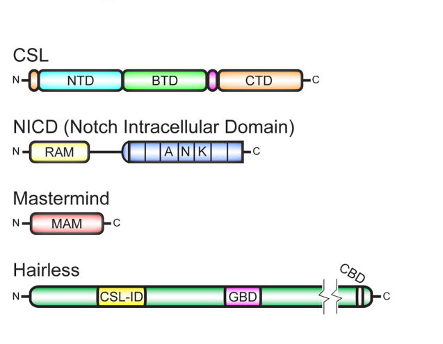

## Question

# Gene Research for Functional Annotation

## ⚠️ CRITICAL: Gene/Protein Identification Context

**BEFORE YOU BEGIN RESEARCH:** You MUST verify you are researching the CORRECT gene/protein. Gene symbols can be ambiguous, especially for less well-characterized genes from non-model organisms.

### Target Gene/Protein Identity (from UniProt):
- **UniProt Accession:** Q02308
- **Protein Description:** RecName: Full=Protein hairless;
- **Gene Information:** Name=H; ORFNames=CG5460;
- **Organism (full):** Drosophila melanogaster (Fruit fly).
- **Protein Family:** Not specified in UniProt
- **Key Domains:** Not specified in UniProt

### MANDATORY VERIFICATION STEPS:

1. **Check if the gene symbol "H" matches the protein description above**
2. **Verify the organism is correct:** Drosophila melanogaster (Fruit fly).
3. **Check if protein family/domains align with what you find in literature**
4. **If you find literature for a DIFFERENT gene with the same or similar symbol, STOP**

### If Gene Symbol is Ambiguous or You Cannot Find Relevant Literature:

**DO NOT PROCEED WITH RESEARCH ON A DIFFERENT GENE.** Instead:
- State clearly: "The gene symbol 'H' is ambiguous or literature is limited for this specific protein"
- Explain what you found (e.g., "Found extensive literature on a different gene with the same symbol in a different organism")
- Describe the protein based ONLY on the UniProt information provided above
- Suggest that the protein function can be inferred from domain/family information

### Research Target:

Please provide a comprehensive research report on the gene **H** (gene ID: Q02308, UniProt: Q02308) in DROME.

The research report should be a detailed narrative explaining the function, biological processes, and localization of the gene product. Citations should be given for all claims.

You should prioritize authoritative reviews and primary scientific literature when conducting research. You can supplement
this with annotations you find in gene/protein databases, but these can be outdated or inaccurate.

We are specifically interested in the primary function of the gene - for enzymes, what reaction is catalyzed, and what is the substrate specificity? For transporters, what is the substrate? For structural proteins or adapters, what is the broader structural role? For signaling molecules, what is the role in the pathway.

We are interested in where in or outside the cell the gene product carries out its function.

We are also interested in the signaling or biochemical pathways in which the gene functions. We are less interested in broad pleiotropic effects, except where these elucidate the precise role.

Include evidence where possible. We are interested in both experimental evidence as well as inference from structure, evolution, or bioinformatic analysis. Precise studies should be prioritized over high-throughput, where available.

## Output

Question: You are an expert researcher providing comprehensive, well-cited information.

Provide detailed information focusing on:
1. Key concepts and definitions with current understanding
2. Recent developments and latest research (prioritize 2023-2024 sources)
3. Current applications and real-world implementations
4. Expert opinions and analysis from authoritative sources
5. Relevant statistics and data from recent studies

Format as a comprehensive research report with proper citations. Include URLs and publication dates where available.
Always prioritize recent, authoritative sources and provide specific citations for all major claims.

# Gene Research for Functional Annotation

## ⚠️ CRITICAL: Gene/Protein Identification Context

**BEFORE YOU BEGIN RESEARCH:** You MUST verify you are researching the CORRECT gene/protein. Gene symbols can be ambiguous, especially for less well-characterized genes from non-model organisms.

### Target Gene/Protein Identity (from UniProt):
- **UniProt Accession:** Q02308
- **Protein Description:** RecName: Full=Protein hairless;
- **Gene Information:** Name=H; ORFNames=CG5460;
- **Organism (full):** Drosophila melanogaster (Fruit fly).
- **Protein Family:** Not specified in UniProt
- **Key Domains:** Not specified in UniProt

### MANDATORY VERIFICATION STEPS:

1. **Check if the gene symbol "H" matches the protein description above**
2. **Verify the organism is correct:** Drosophila melanogaster (Fruit fly).
3. **Check if protein family/domains align with what you find in literature**
4. **If you find literature for a DIFFERENT gene with the same or similar symbol, STOP**

### If Gene Symbol is Ambiguous or You Cannot Find Relevant Literature:

**DO NOT PROCEED WITH RESEARCH ON A DIFFERENT GENE.** Instead:
- State clearly: "The gene symbol 'H' is ambiguous or literature is limited for this specific protein"
- Explain what you found (e.g., "Found extensive literature on a different gene with the same symbol in a different organism")
- Describe the protein based ONLY on the UniProt information provided above
- Suggest that the protein function can be inferred from domain/family information

### Research Target:

Please provide a comprehensive research report on the gene **H** (gene ID: Q02308, UniProt: Q02308) in DROME.

The research report should be a detailed narrative explaining the function, biological processes, and localization of the gene product. Citations should be given for all claims.

You should prioritize authoritative reviews and primary scientific literature when conducting research. You can supplement
this with annotations you find in gene/protein databases, but these can be outdated or inaccurate.

We are specifically interested in the primary function of the gene - for enzymes, what reaction is catalyzed, and what is the substrate specificity? For transporters, what is the substrate? For structural proteins or adapters, what is the broader structural role? For signaling molecules, what is the role in the pathway.

We are interested in where in or outside the cell the gene product carries out its function.

We are also interested in the signaling or biochemical pathways in which the gene functions. We are less interested in broad pleiotropic effects, except where these elucidate the precise role.

Include evidence where possible. We are interested in both experimental evidence as well as inference from structure, evolution, or bioinformatic analysis. Precise studies should be prioritized over high-throughput, where available.

# Comprehensive Research Report: Hairless (H) Gene in Drosophila melanogaster

## Gene Identity Verification

The gene H (UniProt: Q02308) encodes the Hairless protein in *Drosophila melanogaster* (fruit fly). This protein is correctly identified as a major antagonist of Notch signaling and functions as a transcriptional corepressor (monch2024novelgenomeengineeredh pages 1-2). The gene symbol "H" and protein name "Hairless" are unambiguous in this organism and consistently used throughout the scientific literature.

## 1. Primary Molecular Function and Biochemical Role

### Core Function as Transcriptional Corepressor

Hairless functions primarily as a **non-enzymatic transcriptional corepressor and molecular adaptor** in the Notch signaling pathway (barolo2002defaultrepressionand pages 11-12, barolo2002defaultrepressionand pages 1-2). Unlike enzymes with catalytic activity or transporters with specific substrates, Hairless operates through protein-protein interactions to regulate gene expression. The protein serves as a molecular bridge that connects the DNA-binding transcription factor Suppressor of Hairless [Su(H)], the Drosophila ortholog of mammalian CSL/RBP-J, to general transcriptional corepressors (barolo2002defaultrepressionand pages 1-2, maier2008thetinyhairless pages 1-2).

### Mechanism of Transcriptional Repression

The molecular mechanism of Hairless involves assembly of a multiprotein repressor complex. Hairless directly binds Su(H) and simultaneously recruits two key corepressors: Groucho (Gro) and Drosophila C-terminal Binding Protein (dCtBP) (barolo2002defaultrepressionand pages 1-2, barolo2002defaultrepressionand pages 2-4). These corepressors are associated with histone deacetylase complexes and chromatin-modifying activities that silence transcription (barolo2002defaultrepressionand pages 1-2). In the absence of Notch signaling, the Su(H)-Hairless-Gro-dCtBP complex binds to Notch-responsive enhancers and maintains target genes in a repressed state, establishing what is termed "default repression" (barolo2002defaultrepressionand pages 11-12, barolo2002defaultrepressionand pages 9-10).

When Notch signaling is activated, the Notch intracellular domain (NICD) enters the nucleus and competes with Hairless for binding to Su(H) (morel2001transcriptionalrepressionby pages 2-4, maier2011structuralandfunctional pages 6-7, morel2001transcriptionalrepressionby pages 4-4). The binding of Hairless and NICD to Su(H) is mutually exclusive: NICD displaces Hairless and converts Su(H) from a repressor into an activator by recruiting the coactivator Mastermind, thereby allowing transcription of Notch target genes (morel2001transcriptionalrepressionby pages 2-4, praxenthaler2015generationofnew pages 16-17).

## 2. Protein Structure and Domains

### Domain Organization

Hairless is a large protein with a modular architecture containing several distinct functional domains (barolo2002defaultrepressionand pages 1-2, maier2008thetinyhairless pages 2-4, yuan2016structureandfunction media c4b15a11):

1. **CSL-Interaction Domain (CSL-ID)**: A conserved region spanning approximately residues 232–269 that mediates binding to Su(H) (yuan2016structureandfunction pages 2-4, yuan2016structureandfunction pages 4-7)

2. **Groucho-Binding Domain (GBD)**: Contains the conserved octapeptide-like motif YSIHSLLG that directly binds the Groucho corepressor (barolo2002defaultrepressionand pages 2-4, barolo2002defaultrepressionand pages 1-2)

3. **CtBP-Binding Domain (CBD)**: Located at the extreme C-terminus, containing the sequence PLNLSKH with the conserved CtBP-recognition motif PLNLS (barolo2002defaultrepressionand pages 2-4, barolo2002defaultrepressionand pages 1-2)

4. **Alanine-rich regions**: The protein contains extended alanine-repeat sequences, though these are not universally conserved across insect species and may not be essential for core function (barolo2002defaultrepressionand pages 1-2)

### Structural Characteristics

The overall protein architecture is largely non-globular with substantial intrinsically disordered or low-complexity character (maier2011structuralandfunctional pages 5-6). Circular dichroism analysis of the N-terminal region shows a spectrum characteristic of random coil structure rather than well-defined secondary structure (maier2011structuralandfunctional pages 5-6). This structural flexibility may facilitate the protein's function as a molecular adaptor capable of simultaneously engaging multiple binding partners.

### Crystal Structure of Su(H)-Hairless Complex

High-resolution structural studies have provided atomic-level insights into how Hairless binds Su(H). The crystal structure of the Su(H)-Hairless-DNA complex (PDB: 5E24, resolved at 2.14 Å) reveals a remarkable binding mode (yuan2016structureandfunction pages 2-4, yuan2016structureandfunction pages 4-7, yuan2016structureandfunction media c64465a7, yuan2016structureandfunction media 43fea982). Hairless binds exclusively to the C-terminal domain (CTD) of Su(H), which adopts an immunoglobulin-like seven-stranded β-sandwich fold (yuan2016structureandfunction pages 2-4, yuan2016structureandfunction pages 4-7).

The Hairless segment inserts or "wedges" between the first and last β-strands of the Su(H) CTD, substantially distorting the normal architecture of this domain (yuan2016structureandfunction pages 2-4, yuan2016structureandfunction pages 4-7, yuan2016structureandfunction media 43fea982). This unusual binding mode allows Hairless to make extensive contacts with residues that are normally buried in the hydrophobic core of the CTD, burying approximately 900 Ų of surface area (yuan2016structureandfunction pages 4-7). The binding causes the first β-hairpin of the CTD to shift outward by up to 6 Å (yuan2016structureandfunction pages 4-7, yuan2016structureandfunction pages 14-17).

**Key binding residues** on Hairless include L235, F237, L245, L247, and W258, with L235 and F237 being particularly critical (yuan2016structureandfunction pages 9-10, yuan2016structureandfunction pages 10-12, yuan2016structureandfunction media 43fea982). On Su(H), residues L445 and L514 work cooperatively to form the binding interface (yuan2016structureandfunction pages 9-10, yuan2016structureandfunction pages 10-12). The interaction is primarily hydrophobic and is enthalpically driven, with a remarkably high affinity of approximately 1–2 nM and a stoichiometry of 1:1 (yuan2016structureandfunction pages 9-10, maier2011structuralandfunctional pages 7-8).

### Structural Basis for Mutual Exclusivity

The crystal structure also explains why Hairless and NICD cannot simultaneously bind Su(H). The Hairless-induced conformational changes in the Su(H) CTD create steric incompatibility with the binding of NICD's ankyrin repeats and the coactivator Mastermind (yuan2016structureandfunction pages 9-10, yuan2016structureandfunction pages 14-17). This structural mechanism ensures a binary switch between the repressive (Hairless-containing) and activating (NICD-containing) states of Su(H) complexes.

## 3. Subcellular Localization

Hairless is **predominantly localized to the nucleus**, where it carries out its function in transcriptional regulation (praxenthaler2015generationofnew pages 17-19, maier2011structuralandfunctional pages 7-8, kurth2011molecularanalysisof pages 8-9, morel2001transcriptionalrepressionby pages 4-4). Multiple studies confirm that the major focus of Hairless activity is within the nucleus, consistent with its role in regulating gene expression at the chromatin level (praxenthaler2015generationofnew pages 17-19, maier2011structuralandfunctional pages 7-8). The protein functions at Notch-regulated enhancers and promoters, where it assembles with Su(H) and corepressors to form DNA-bound repressor complexes (maier2011structuralandfunctional pages 7-8, maier2011structuralandfunctional pages 2-3).

## 4. Signaling Pathways and Biological Processes

### Role in Notch Signaling Pathway

Hairless is the **principal antagonist of canonical Notch signaling** in *Drosophila* (praxenthaler2015generationofnew pages 17-19, praxenthaler2017hairlessbindingdeficientsuppressor pages 21-22, praxenthaler2015generationofnew pages 16-17, monch2024novelgenomeengineeredh pages 1-2). The Notch pathway is a highly conserved cell-cell communication system that controls numerous developmental decisions in metazoans. The pathway operates through a transcriptional switch mechanism in which Su(H) can function as either a repressor or an activator depending on its associated cofactors.

**In the absence of Notch signaling** (Notch OFF state):
- Hairless binds Su(H) on DNA at Notch-responsive elements
- Hairless recruits Groucho and dCtBP to form a repressor complex
- Target genes remain transcriptionally silent (barolo2002defaultrepressionand pages 11-12, barolo2002defaultrepressionand pages 1-2, praxenthaler2015generationofnew pages 16-17)

**Upon Notch activation** (Notch ON state):
- Receptor-ligand interaction leads to proteolytic cleavage of Notch
- NICD enters the nucleus and displaces Hairless from Su(H)
- NICD recruits Mastermind to form an activator complex
- Target genes are transcribed (morel2001transcriptionalrepressionby pages 2-4, maier2011structuralandfunctional pages 6-7, morel2001transcriptionalrepressionby pages 4-4)

### Notch Target Genes Regulated by Hairless

Hairless regulates several well-characterized Notch target genes:

1. **Enhancer of split [E(spl)] complex genes**: These are the best-characterized direct Notch targets, with specific genes including E(spl)-mγ and E(spl)-mδ being regulated through Su(H) and subject to Hairless-mediated repression (kurth2011molecularanalysisof pages 8-9, barolo2002defaultrepressionand pages 13-14, morel2001transcriptionalrepressionby pages 4-4)

2. **cut**: Expressed at the wing margin and regulated by Notch signaling, with Hairless antagonizing its Notch-dependent activation (kurth2011molecularanalysisof pages 8-9)

3. **wingless (wg)**: Regulated by Notch during wing development, with Hairless contributing to its repression in the absence of Notch activity (kurth2011molecularanalysisof pages 8-9, praxenthaler2015generationofnew pages 17-19, maier2011structuralandfunctional pages 5-6)

### Developmental Processes

Hairless plays critical roles in multiple developmental contexts:

**Sensory Organ Development**: Hairless is essential for proper development of mechanosensory bristles and external sensory organs in the adult epidermis (maier2011structuralandfunctional pages 6-7, praxenthaler2015generationofnew pages 16-17, morel2001transcriptionalrepressionby pages 4-4). Loss of Hairless function produces Notch gain-of-function phenotypes including ectopic bristles and altered sensory organ cell fates.

**Lateral Inhibition**: During selection of neural precursors and sensory organ precursors, Hairless maintains the repression of Notch targets in non-selected cells, ensuring proper spacing and patterning of sensory structures (maier2011structuralandfunctional pages 6-7, monch2024novelgenomeengineeredh pages 1-2).

**Cell Fate Specification**: Hairless regulates binary cell fate decisions, particularly the shaft-versus-socket cell dichotomy in bristle organ development (monch2024novelgenomeengineeredh pages 1-2). Recent 2024 studies using genome-engineered alleles have shown that different Hairless mutants can specifically affect either lateral inhibition or subsequent cell-type specification, revealing a nuanced regulatory role (monch2024novelgenomeengineeredh pages 1-2).

**Wing Development**: Hairless regulates wing margin formation, wing vein patterning, and dorsal-ventral boundary establishment through its effects on Notch signaling (praxenthaler2015generationofnew pages 16-17, kurth2011molecularanalysisof pages 8-9).

**Eye and Neural Development**: Hairless contributes to Notch-dependent cell fate decisions during eye development and neural differentiation (morel2001transcriptionalrepressionby pages 4-4, kurth2011molecularanalysisof pages 8-9, praxenthaler2015generationofnew pages 17-19).

## 5. Recent Developments (2023-2024)

### Genome-Engineered Alleles and Functional Refinement

A significant 2024 study by Mönch et al. reported novel genome-engineered Hairless alleles (HFA, HLLAA, and HWA) that established a phenotypic series reflecting residual H-Su(H) binding capacity (monch2024novelgenomeengineeredh pages 1-2). This work revealed important new insights:

**Differential Effects on Development**: The HWA allele primarily caused bristle loss (affecting lateral inhibition), whereas the HNN allele caused shaft-to-socket transformations (affecting both lateral inhibition and cell-type specification). This demonstrates that Hairless function is not simply binary but depends on the strength and nature of its interaction with Su(H) (monch2024novelgenomeengineeredh pages 1-2).

**Su(H) Dosage Sensitivity**: Reducing Su(H) gene dosage had allele-specific effects—it suppressed the HNN bristle phenotype but enhanced the HWA phenotype. This suggests that Hairless regulation depends not only on direct H-Su(H) binding but also on Su(H) protein stability and nuclear availability (monch2024novelgenomeengineeredh pages 1-2).

### Reviews and Current Understanding (2024)

Recent comprehensive reviews published in 2024 have synthesized current knowledge about Notch signaling and Hairless function:

- Sachan et al. (2024) provided an updated overview of Notch signaling mechanisms and regulation, emphasizing the role of corepressor complexes including Hairless in establishing the default repressed state of Notch targets (published in *The FEBS Journal*, DOI: 10.1111/febs.16815).

- Megaly et al. (2024) discussed lessons from *Drosophila* Notch signaling for understanding human diseases, highlighting the conservation of repression mechanisms involving CSL and corepressors (published in *Frontiers in Bioscience*, DOI: 10.31083/j.fbl2906234).

## 6. Protein-Protein Interactions: Detailed Analysis

### Su(H) Interaction

The Hairless-Su(H) interaction is the most extensively characterized. Binding occurs through the CSL-ID of Hairless (residues 232–269) and the CTD of Su(H) (yuan2016structureandfunction pages 2-4, yuan2016structureandfunction pages 4-7, maier2011structuralandfunctional pages 2-3). The affinity is exceptionally high (~1–2 nM), indicating a very stable complex (yuan2016structureandfunction pages 9-10, maier2011structuralandfunctional pages 7-8). Importantly, this interaction is structurally and functionally distinct from the Su(H)-NICD interaction: mutations that abolish Hairless binding can preserve NICD binding and vice versa, although the binding sites partially overlap (yuan2016structureandfunction pages 9-10, maier2011structuralandfunctional pages 2-3, kurth2011molecularanalysisof pages 2-4, yuan2016structureandfunction pages 10-12).

### Groucho Interaction

Hairless recruits Groucho through a conserved engrailed homology 1 (eh1)/octapeptide-like motif (YSIHSLLG) (barolo2002defaultrepressionand pages 1-2, barolo2002defaultrepressionand pages 2-4). This motif is perfectly conserved between *Drosophila melanogaster* and *Anopheles*, indicating strong evolutionary constraint (barolo2002defaultrepressionand pages 1-2). Mutation of this motif disrupts the Hairless-Groucho interaction and impairs repression (barolo2002defaultrepressionand pages 2-4).

### dCtBP Interaction

The extreme C-terminal sequence PLNLSKH of Hairless contains the CtBP-binding consensus motif PLNLS (barolo2002defaultrepressionand pages 1-2, barolo2002defaultrepressionand pages 2-4). This region is both necessary and sufficient for dCtBP binding in biochemical assays (barolo2002defaultrepressionand pages 2-4). Deletion of the final 15 amino acids abolishes dCtBP binding and eliminates Hairless's ability to cooperate with Su(H) in repressing Notch signaling, even though Su(H) binding remains intact (morel2001transcriptionalrepressionby pages 2-4). This demonstrates that recruitment of both corepressors is required for full Hairless activity (praxenthaler2017hairlessbindingdeficientsuppressor pages 21-22, praxenthaler2015generationofnew pages 16-17).

## 7. Evolutionary and Comparative Considerations

Studies of Hairless orthologs from other insects have provided insights into structure-function relationships. The *Apis mellifera* (honeybee) Hairless protein is only one-third the size of the *Drosophila* ortholog, yet it retains the ability to bind *Drosophila* Su(H), Groucho, and CtBP, and can rescue *Drosophila* Hairless mutant phenotypes (maier2008thetinyhairless pages 1-2, maier2008thetinyhairless pages 13-14). This demonstrates that the core functional domains are conserved and sufficient for activity, while the additional sequences in *Drosophila* Hairless may provide regulatory functions or modulate activity levels (maier2008thetinyhairless pages 1-2, maier2008thetinyhairless pages 13-14).

## 8. Regulation of Hairless Activity

Recent findings indicate that Hairless activity is modulated through multiple mechanisms:

**Protein Stability**: Su(H) protein levels depend on complex formation with Hairless. In the absence of Hairless, Su(H) protein abundance is altered, suggesting that Hairless not only regulates Su(H) transcriptional activity but also stabilizes the protein (praxenthaler2017hairlessbindingdeficientsuppressor pages 21-22). In the presence of NICD, Su(H) mutant proteins that cannot bind Hairless are stabilized, indicating that different cofactors influence Su(H) stability differently (praxenthaler2017hairlessbindingdeficientsuppressor pages 21-22).

**Nuclear Availability**: The HNN allele, which affects H-Su(H) nuclear entry, shows different phenotypic effects compared to alleles that primarily reduce binding affinity, suggesting that subcellular localization and trafficking contribute to Hairless function (monch2024novelgenomeengineeredh pages 1-2).

## Summary Table

| Feature | Structural or mechanistic detail | Functional significance | Evidence |
|---|---|---|---|
| Protein identity | **Hairless (H)** from *Drosophila melanogaster*; target accession **UniProt Q02308** | Insect transcriptional regulator and principal antagonist of canonical Notch signaling; distinct from similarly named proteins in other organisms | Genome-engineered *H* alleles reproduce canonical Notch-antagonist phenotypes (monch2024novelgenomeengineeredh pages 1-2) |
| CSL-interaction domain (CSL-ID) | Conserved Su(H)-binding segment at approximately residues **232–269**; key hydrophobic residues include L235, F237, L245, L247, and W258 | Anchors Hairless to Su(H), thereby targeting the repressor machinery to Su(H)-occupied regulatory DNA | (yuan2016structureandfunction pages 2-4, yuan2016structureandfunction pages 4-7, yuan2016structureandfunction pages 9-10) |
| Groucho-binding domain (GBD) | Contains the conserved **YSIHSLLG** eh1/octapeptide-like motif | Directly recruits the general corepressor Groucho (Gro) to the Su(H)–Hairless complex | (barolo2002defaultrepressionand pages 2-4, barolo2002defaultrepressionand pages 1-2) |
| CtBP-binding domain (CBD) | Extreme C terminus contains **PLNLSKH**, including the conserved CtBP-recognition motif **PLNLS**; deletion of the last 15 residues abolishes dCtBP binding | Recruits dCtBP; this interaction is required for efficient Hairless–Su(H)-dependent repression in vivo | (barolo2002defaultrepressionand pages 2-4, morel2001transcriptionalrepressionby pages 2-4) |
| Direct interaction: Su(H) | Hairless CSL-ID binds the C-terminal domain (CTD) of Suppressor of Hairless, the fly CSL DNA-binding factor; affinity is approximately **1–2 nM** and stoichiometry is approximately 1:1 | Su(H) supplies sequence-specific DNA targeting, while Hairless converts the DNA-bound complex into a transcriptional repressor and can stabilize Su(H) protein | (praxenthaler2017hairlessbindingdeficientsuppressor pages 21-22, yuan2016structureandfunction pages 9-10, maier2011structuralandfunctional pages 7-8) |
| Direct interaction: Groucho | Gro binds the Hairless GBD/YSIHSLLG motif | Supplies chromatin-associated repression activity as part of the Su(H)–Hairless corepressor assembly | (barolo2002defaultrepressionand pages 1-2, barolo2002defaultrepressionand pages 2-4) |
| Direct interaction: dCtBP | dCtBP binds the C-terminal PLNLS motif | Cooperates with Gro to silence Notch-responsive transcription; loss of CtBP recruitment leaves Su(H) binding intact but produces a nonproductive or weakly repressive complex | (barolo2002defaultrepressionand pages 1-2, morel2001transcriptionalrepressionby pages 2-4) |
| Primary molecular function | Nonenzymatic **transcriptional corepressor/adaptor**; no catalytic reaction or transport substrate is known | Bridges DNA-bound Su(H) to Gro and dCtBP, establishing default repression of Notch-responsive enhancers when receptor signaling is absent | (barolo2002defaultrepressionand pages 11-12, barolo2002defaultrepressionand pages 1-2) |
| Subcellular localization | Predominantly **nuclear**, acting at Notch-regulated chromatin; Hairless can participate in Su(H)-dependent nucleocytoplasmic behavior | Places its principal activity downstream of receptor cleavage, at target-gene regulatory regions rather than at the plasma membrane | (praxenthaler2015generationofnew pages 17-19, maier2011structuralandfunctional pages 7-8, morel2001transcriptionalrepressionby pages 4-4) |
| Signaling pathway | Major antagonist of canonical **Notch signaling** | In the Notch-off state, Su(H)–Hairless–Gro/dCtBP represses transcription. Following receptor activation, NICD and Mastermind form an alternative Su(H) activator complex; Hairless and NICD-containing complexes are mutually exclusive | (maier2011structuralandfunctional pages 6-7, morel2001transcriptionalrepressionby pages 4-4, yuan2016structureandfunction pages 9-10) |
| Target genes and reporters | Strongest support concerns Su(H)-regulated **Enhancer of split [E(spl)]** genes; developmental studies also connect Hairless-mediated Notch repression to **cut**, **wingless**, and the Notch-responsive **vgBE-lacZ** reporter | Prevents ectopic or premature expression of Notch outputs; direct Hairless occupancy has not been established equally strongly for every named locus | (kurth2011molecularanalysisof pages 8-9, praxenthaler2015generationofnew pages 17-19, maier2011structuralandfunctional pages 5-6) |
| Developmental processes | Sensory-organ and mechanosensory-bristle specification, lateral inhibition, shaft-versus-socket cell dichotomy, wing-margin and wing-vein patterning, eye development, and neural cell-fate decisions | Tunes binary and iterative Notch-dependent cell-fate choices; loss of repression generally yields Notch gain-of-function-like outcomes, whereas excess Hairless causes Notch loss-of-function-like outcomes | (maier2011structuralandfunctional pages 6-7, morel2001transcriptionalrepressionby pages 4-4, praxenthaler2015generationofnew pages 16-17, monch2024novelgenomeengineeredh pages 1-2) |
| Overall protein architecture | Large, largely non-globular protein with substantial low-complexity/disordered character, alanine-rich tracts, and short conserved interaction motifs rather than a conventional catalytic domain | Supports a scaffold/adaptor model in which modular short motifs engage several transcriptional regulators | (barolo2002defaultrepressionand pages 1-2, maier2008thetinyhairless pages 2-4, maier2011structuralandfunctional pages 5-6) |
| Crystal structure | The Su(H)–Hairless–DNA structure (**PDB 5E24**, **2.14 Å**) shows Hairless wedged between β-sheets of the Su(H) CTD, burying about **900 Ų** and shifting the first β-hairpin by as much as **6 Å** | Hairless stabilizes an altered Su(H) conformation and remodels its hydrophobic core, explaining high-affinity and selective repressor-complex assembly | (yuan2016structureandfunction pages 2-4, yuan2016structureandfunction pages 4-7) |
| Structural basis of switching | Hairless-induced CTD remodeling and partial interface overlap create steric incompatibility with NICD ankyrin repeats and Mastermind | Provides an atomic explanation for the mutually exclusive Notch-off repressor and Notch-on activator complexes | (yuan2016structureandfunction pages 9-10, yuan2016structureandfunction pages 14-17) |
| Recent functional refinement | 2024 genome-engineered alleles with different residual H–Su(H) binding capacities separated effects on lateral inhibition from later cell-type dichotomy; HWA mainly caused bristle loss, whereas HNN caused shaft-to-socket transformation | Indicates that Hairless output depends on interaction strength, nuclear availability, and effects on Su(H) stability—not merely binary presence or absence of the repressor | (monch2024novelgenomeengineeredh pages 1-2) |

*Table: Key molecular, structural, cellular, and developmental features of *Drosophila melanogaster* Hairless (H; UniProt Q02308), with evidence strength and mechanistic qualifications.*

## Conclusion

The Hairless protein (gene H, UniProt Q02308) in *Drosophila melanogaster* functions as the primary transcriptional corepressor and antagonist of Notch signaling. Rather than acting as an enzyme or transporter, Hairless operates through a sophisticated molecular mechanism involving high-affinity binding to the DNA-binding factor Su(H) and recruitment of general corepressors Groucho and dCtBP. The protein localizes to the nucleus where it assembles multi-protein repressor complexes on Notch-responsive enhancers, maintaining target genes in a silenced state until Notch activation displaces Hairless and converts Su(H) into a transcriptional activator.

Crystal structure studies have revealed the atomic details of Hairless-Su(H) interaction, showing an unusual wedge-like binding mode that induces substantial conformational changes in Su(H) and explains the mutual exclusivity of repressor and activator complexes. Recent genome-engineering studies (2024) have refined our understanding of how different levels of Hairless activity and Su(H) binding capacity influence specific developmental processes, revealing that Hairless regulation is more nuanced than a simple on-off switch.

Hairless plays essential roles in developmental processes including sensory organ specification, lateral inhibition, cell fate decisions, and wing patterning. The protein regulates key Notch target genes including the E(spl) complex, cut, and wingless, thereby controlling cell fate choices throughout *Drosophila* development. Loss of Hairless function generally produces Notch gain-of-function phenotypes, whereas excess Hairless causes Notch loss-of-function effects, confirming its role as a major Notch antagonist.

## Key References

**Foundational Studies:**
- Barolo et al. (2002). Default repression and Notch signaling: Hairless acts as an adaptor to recruit the corepressors Groucho and dCtBP to Suppressor of Hairless. *Genes & Development* 16:1964-76. DOI: 10.1101/gad.987402
- Morel et al. (2001). Transcriptional repression by Suppressor of Hairless involves the binding of a Hairless-dCtBP complex in *Drosophila*. *Current Biology* 11:789-792. DOI: 10.1016/s0960-9822(01)00224-x

**Structural Studies:**
- Yuan et al. (2016). Structure and Function of the Su(H)-Hairless Repressor Complex, the Major Antagonist of Notch Signaling in *Drosophila melanogaster*. *PLOS Biology* 14:e1002509. DOI: 10.1371/journal.pbio.1002509
- Maier et al. (2011). Structural and functional analysis of the repressor complex in the Notch signaling pathway of *Drosophila melanogaster*. *Molecular Biology of the Cell* 22:3242-3252. DOI: 10.1091/mbc.e11-05-0420

**Recent Developments (2023-2024):**
- Mönch et al. (2024). Novel Genome-Engineered H Alleles Differentially Affect Lateral Inhibition and Cell Dichotomy Processes during Bristle Organ Development. *Genes* 15:552. DOI: 10.3390/genes15050552
- Sachan et al. (2024). Notch signalling: multifaceted role in development and disease. *The FEBS Journal* 291:3030-3059. DOI: 10.1111/febs.16815

References

1. (monch2024novelgenomeengineeredh pages 1-2): Tanja C. Mönch, Thomas K. Smylla, Franziska Brändle, Anette Preiss, and Anja C. Nagel. Novel genome-engineered h alleles differentially affect lateral inhibition and cell dichotomy processes during bristle organ development. Genes, 15:552, Apr 2024. URL: https://doi.org/10.3390/genes15050552, doi:10.3390/genes15050552. This article has 0 citations.

2. (barolo2002defaultrepressionand pages 11-12): Scott Barolo, Tammie Stone, Anne G. Bang, and James W. Posakony. Default repression and notch signaling: hairless acts as an adaptor to recruit the corepressors groucho and dctbp to suppressor of hairless. Genes & development, 16 15:1964-76, Aug 2002. URL: https://doi.org/10.1101/gad.987402, doi:10.1101/gad.987402. This article has 268 citations and is from a highest quality peer-reviewed journal.

3. (barolo2002defaultrepressionand pages 1-2): Scott Barolo, Tammie Stone, Anne G. Bang, and James W. Posakony. Default repression and notch signaling: hairless acts as an adaptor to recruit the corepressors groucho and dctbp to suppressor of hairless. Genes & development, 16 15:1964-76, Aug 2002. URL: https://doi.org/10.1101/gad.987402, doi:10.1101/gad.987402. This article has 268 citations and is from a highest quality peer-reviewed journal.

4. (maier2008thetinyhairless pages 1-2): Dieter Maier, Anna X Chen, Anette Preiss, and Manuela Ketelhut. The tiny hairless protein from apis mellifera: a potent antagonist of notch signaling in drosophila melanogaster. BMC Evolutionary Biology, 8:175-175, Jun 2008. URL: https://doi.org/10.1186/1471-2148-8-175, doi:10.1186/1471-2148-8-175. This article has 26 citations and is from a domain leading peer-reviewed journal.

5. (barolo2002defaultrepressionand pages 2-4): Scott Barolo, Tammie Stone, Anne G. Bang, and James W. Posakony. Default repression and notch signaling: hairless acts as an adaptor to recruit the corepressors groucho and dctbp to suppressor of hairless. Genes & development, 16 15:1964-76, Aug 2002. URL: https://doi.org/10.1101/gad.987402, doi:10.1101/gad.987402. This article has 268 citations and is from a highest quality peer-reviewed journal.

6. (barolo2002defaultrepressionand pages 9-10): Scott Barolo, Tammie Stone, Anne G. Bang, and James W. Posakony. Default repression and notch signaling: hairless acts as an adaptor to recruit the corepressors groucho and dctbp to suppressor of hairless. Genes & development, 16 15:1964-76, Aug 2002. URL: https://doi.org/10.1101/gad.987402, doi:10.1101/gad.987402. This article has 268 citations and is from a highest quality peer-reviewed journal.

7. (morel2001transcriptionalrepressionby pages 2-4): Véronique Morel, Magalie Lecourtois, Olivia Massiani, Dieter Maier, Anette Preiss, and François Schweisguth. Transcriptional repression by suppressor of hairless involves the binding of a hairless-dctbp complex in drosophila. Current Biology, 11:789-792, May 2001. URL: https://doi.org/10.1016/s0960-9822(01)00224-x, doi:10.1016/s0960-9822(01)00224-x. This article has 206 citations and is from a highest quality peer-reviewed journal.

8. (maier2011structuralandfunctional pages 6-7): Dieter Maier, Patricia Kurth, Adriana Schulz, Andrew Russell, Zhenyu Yuan, Kim Gruber, Rhett A. Kovall, and Anette Preiss. Structural and functional analysis of the repressor complex in the notch signaling pathway of drosophila melanogaster. Molecular Biology of the Cell, 22:3242-3252, Sep 2011. URL: https://doi.org/10.1091/mbc.e11-05-0420, doi:10.1091/mbc.e11-05-0420. This article has 52 citations and is from a domain leading peer-reviewed journal.

9. (morel2001transcriptionalrepressionby pages 4-4): Véronique Morel, Magalie Lecourtois, Olivia Massiani, Dieter Maier, Anette Preiss, and François Schweisguth. Transcriptional repression by suppressor of hairless involves the binding of a hairless-dctbp complex in drosophila. Current Biology, 11:789-792, May 2001. URL: https://doi.org/10.1016/s0960-9822(01)00224-x, doi:10.1016/s0960-9822(01)00224-x. This article has 206 citations and is from a highest quality peer-reviewed journal.

10. (praxenthaler2015generationofnew pages 16-17): Heiko Praxenthaler, Thomas K. Smylla, Anja C. Nagel, Anette Preiss, and Dieter Maier. Generation of new hairless alleles by genomic engineering at the hairless locus in drosophila melanogaster. PLoS ONE, 10:e0140007, Oct 2015. URL: https://doi.org/10.1371/journal.pone.0140007, doi:10.1371/journal.pone.0140007. This article has 15 citations and is from a peer-reviewed journal.

11. (maier2008thetinyhairless pages 2-4): Dieter Maier, Anna X Chen, Anette Preiss, and Manuela Ketelhut. The tiny hairless protein from apis mellifera: a potent antagonist of notch signaling in drosophila melanogaster. BMC Evolutionary Biology, 8:175-175, Jun 2008. URL: https://doi.org/10.1186/1471-2148-8-175, doi:10.1186/1471-2148-8-175. This article has 26 citations and is from a domain leading peer-reviewed journal.

12. (yuan2016structureandfunction media c4b15a11): Zhenyu Yuan, Heiko Praxenthaler, Nassif Tabaja, Rubben Torella, Anette Preiss, Dieter Maier, and Rhett A. Kovall. Structure and function of the su(h)-hairless repressor complex, the major antagonist of notch signaling in drosophila melanogaster. PLOS Biology, 14:e1002509, Jul 2016. URL: https://doi.org/10.1371/journal.pbio.1002509, doi:10.1371/journal.pbio.1002509. This article has 62 citations and is from a highest quality peer-reviewed journal.

13. (yuan2016structureandfunction pages 2-4): Zhenyu Yuan, Heiko Praxenthaler, Nassif Tabaja, Rubben Torella, Anette Preiss, Dieter Maier, and Rhett A. Kovall. Structure and function of the su(h)-hairless repressor complex, the major antagonist of notch signaling in drosophila melanogaster. PLOS Biology, 14:e1002509, Jul 2016. URL: https://doi.org/10.1371/journal.pbio.1002509, doi:10.1371/journal.pbio.1002509. This article has 62 citations and is from a highest quality peer-reviewed journal.

14. (yuan2016structureandfunction pages 4-7): Zhenyu Yuan, Heiko Praxenthaler, Nassif Tabaja, Rubben Torella, Anette Preiss, Dieter Maier, and Rhett A. Kovall. Structure and function of the su(h)-hairless repressor complex, the major antagonist of notch signaling in drosophila melanogaster. PLOS Biology, 14:e1002509, Jul 2016. URL: https://doi.org/10.1371/journal.pbio.1002509, doi:10.1371/journal.pbio.1002509. This article has 62 citations and is from a highest quality peer-reviewed journal.

15. (maier2011structuralandfunctional pages 5-6): Dieter Maier, Patricia Kurth, Adriana Schulz, Andrew Russell, Zhenyu Yuan, Kim Gruber, Rhett A. Kovall, and Anette Preiss. Structural and functional analysis of the repressor complex in the notch signaling pathway of drosophila melanogaster. Molecular Biology of the Cell, 22:3242-3252, Sep 2011. URL: https://doi.org/10.1091/mbc.e11-05-0420, doi:10.1091/mbc.e11-05-0420. This article has 52 citations and is from a domain leading peer-reviewed journal.

16. (yuan2016structureandfunction media c64465a7): Zhenyu Yuan, Heiko Praxenthaler, Nassif Tabaja, Rubben Torella, Anette Preiss, Dieter Maier, and Rhett A. Kovall. Structure and function of the su(h)-hairless repressor complex, the major antagonist of notch signaling in drosophila melanogaster. PLOS Biology, 14:e1002509, Jul 2016. URL: https://doi.org/10.1371/journal.pbio.1002509, doi:10.1371/journal.pbio.1002509. This article has 62 citations and is from a highest quality peer-reviewed journal.

17. (yuan2016structureandfunction media 43fea982): Zhenyu Yuan, Heiko Praxenthaler, Nassif Tabaja, Rubben Torella, Anette Preiss, Dieter Maier, and Rhett A. Kovall. Structure and function of the su(h)-hairless repressor complex, the major antagonist of notch signaling in drosophila melanogaster. PLOS Biology, 14:e1002509, Jul 2016. URL: https://doi.org/10.1371/journal.pbio.1002509, doi:10.1371/journal.pbio.1002509. This article has 62 citations and is from a highest quality peer-reviewed journal.

18. (yuan2016structureandfunction pages 14-17): Zhenyu Yuan, Heiko Praxenthaler, Nassif Tabaja, Rubben Torella, Anette Preiss, Dieter Maier, and Rhett A. Kovall. Structure and function of the su(h)-hairless repressor complex, the major antagonist of notch signaling in drosophila melanogaster. PLOS Biology, 14:e1002509, Jul 2016. URL: https://doi.org/10.1371/journal.pbio.1002509, doi:10.1371/journal.pbio.1002509. This article has 62 citations and is from a highest quality peer-reviewed journal.

19. (yuan2016structureandfunction pages 9-10): Zhenyu Yuan, Heiko Praxenthaler, Nassif Tabaja, Rubben Torella, Anette Preiss, Dieter Maier, and Rhett A. Kovall. Structure and function of the su(h)-hairless repressor complex, the major antagonist of notch signaling in drosophila melanogaster. PLOS Biology, 14:e1002509, Jul 2016. URL: https://doi.org/10.1371/journal.pbio.1002509, doi:10.1371/journal.pbio.1002509. This article has 62 citations and is from a highest quality peer-reviewed journal.

20. (yuan2016structureandfunction pages 10-12): Zhenyu Yuan, Heiko Praxenthaler, Nassif Tabaja, Rubben Torella, Anette Preiss, Dieter Maier, and Rhett A. Kovall. Structure and function of the su(h)-hairless repressor complex, the major antagonist of notch signaling in drosophila melanogaster. PLOS Biology, 14:e1002509, Jul 2016. URL: https://doi.org/10.1371/journal.pbio.1002509, doi:10.1371/journal.pbio.1002509. This article has 62 citations and is from a highest quality peer-reviewed journal.

21. (maier2011structuralandfunctional pages 7-8): Dieter Maier, Patricia Kurth, Adriana Schulz, Andrew Russell, Zhenyu Yuan, Kim Gruber, Rhett A. Kovall, and Anette Preiss. Structural and functional analysis of the repressor complex in the notch signaling pathway of drosophila melanogaster. Molecular Biology of the Cell, 22:3242-3252, Sep 2011. URL: https://doi.org/10.1091/mbc.e11-05-0420, doi:10.1091/mbc.e11-05-0420. This article has 52 citations and is from a domain leading peer-reviewed journal.

22. (praxenthaler2015generationofnew pages 17-19): Heiko Praxenthaler, Thomas K. Smylla, Anja C. Nagel, Anette Preiss, and Dieter Maier. Generation of new hairless alleles by genomic engineering at the hairless locus in drosophila melanogaster. PLoS ONE, 10:e0140007, Oct 2015. URL: https://doi.org/10.1371/journal.pone.0140007, doi:10.1371/journal.pone.0140007. This article has 15 citations and is from a peer-reviewed journal.

23. (kurth2011molecularanalysisof pages 8-9): Patricia Kurth, Anette Preiss, Rhett A. Kovall, and Dieter Maier. Molecular analysis of the notch repressor-complex in drosophila: characterization of potential hairless binding sites on suppressor of hairless. PLoS ONE, 6:e27986, Nov 2011. URL: https://doi.org/10.1371/journal.pone.0027986, doi:10.1371/journal.pone.0027986. This article has 23 citations and is from a peer-reviewed journal.

24. (maier2011structuralandfunctional pages 2-3): Dieter Maier, Patricia Kurth, Adriana Schulz, Andrew Russell, Zhenyu Yuan, Kim Gruber, Rhett A. Kovall, and Anette Preiss. Structural and functional analysis of the repressor complex in the notch signaling pathway of drosophila melanogaster. Molecular Biology of the Cell, 22:3242-3252, Sep 2011. URL: https://doi.org/10.1091/mbc.e11-05-0420, doi:10.1091/mbc.e11-05-0420. This article has 52 citations and is from a domain leading peer-reviewed journal.

25. (praxenthaler2017hairlessbindingdeficientsuppressor pages 21-22): Heiko Praxenthaler, Anja C. Nagel, Adriana Schulz, Mirjam Zimmermann, Markus Meier, Hannes Schmid, Anette Preiss, and Dieter Maier. Hairless-binding deficient suppressor of hairless alleles reveal su(h) protein levels are dependent on complex formation with hairless. PLOS Genetics, 13:e1006774, May 2017. URL: https://doi.org/10.1371/journal.pgen.1006774, doi:10.1371/journal.pgen.1006774. This article has 28 citations and is from a domain leading peer-reviewed journal.

26. (barolo2002defaultrepressionand pages 13-14): Scott Barolo, Tammie Stone, Anne G. Bang, and James W. Posakony. Default repression and notch signaling: hairless acts as an adaptor to recruit the corepressors groucho and dctbp to suppressor of hairless. Genes & development, 16 15:1964-76, Aug 2002. URL: https://doi.org/10.1101/gad.987402, doi:10.1101/gad.987402. This article has 268 citations and is from a highest quality peer-reviewed journal.

27. (kurth2011molecularanalysisof pages 2-4): Patricia Kurth, Anette Preiss, Rhett A. Kovall, and Dieter Maier. Molecular analysis of the notch repressor-complex in drosophila: characterization of potential hairless binding sites on suppressor of hairless. PLoS ONE, 6:e27986, Nov 2011. URL: https://doi.org/10.1371/journal.pone.0027986, doi:10.1371/journal.pone.0027986. This article has 23 citations and is from a peer-reviewed journal.

28. (maier2008thetinyhairless pages 13-14): Dieter Maier, Anna X Chen, Anette Preiss, and Manuela Ketelhut. The tiny hairless protein from apis mellifera: a potent antagonist of notch signaling in drosophila melanogaster. BMC Evolutionary Biology, 8:175-175, Jun 2008. URL: https://doi.org/10.1186/1471-2148-8-175, doi:10.1186/1471-2148-8-175. This article has 26 citations and is from a domain leading peer-reviewed journal.

## Artifacts

- [Edison artifact artifact-00](H-deep-research-falcon_artifacts/artifact-00.md)

## Citations

1. monch2024novelgenomeengineeredh pages 1-2
2. barolo2002defaultrepressionand pages 1-2
3. maier2011structuralandfunctional pages 5-6
4. yuan2016structureandfunction pages 4-7
5. kurth2011molecularanalysisof pages 8-9
6. barolo2002defaultrepressionand pages 2-4
7. morel2001transcriptionalrepressionby pages 2-4
8. praxenthaler2017hairlessbindingdeficientsuppressor pages 21-22
9. barolo2002defaultrepressionand pages 11-12
10. maier2008thetinyhairless pages 1-2
11. barolo2002defaultrepressionand pages 9-10
12. maier2011structuralandfunctional pages 6-7
13. morel2001transcriptionalrepressionby pages 4-4
14. praxenthaler2015generationofnew pages 16-17
15. maier2008thetinyhairless pages 2-4
16. yuan2016structureandfunction pages 2-4
17. yuan2016structureandfunction pages 14-17
18. yuan2016structureandfunction pages 9-10
19. yuan2016structureandfunction pages 10-12
20. maier2011structuralandfunctional pages 7-8
21. praxenthaler2015generationofnew pages 17-19
22. maier2011structuralandfunctional pages 2-3
23. barolo2002defaultrepressionand pages 13-14
24. kurth2011molecularanalysisof pages 2-4
25. maier2008thetinyhairless pages 13-14
26. Su(H)
27. E(spl)
28. https://doi.org/10.3390/genes15050552,
29. https://doi.org/10.1101/gad.987402,
30. https://doi.org/10.1186/1471-2148-8-175,
31. https://doi.org/10.1016/s0960-9822(01
32. https://doi.org/10.1091/mbc.e11-05-0420,
33. https://doi.org/10.1371/journal.pone.0140007,
34. https://doi.org/10.1371/journal.pbio.1002509,
35. https://doi.org/10.1371/journal.pone.0027986,
36. https://doi.org/10.1371/journal.pgen.1006774,