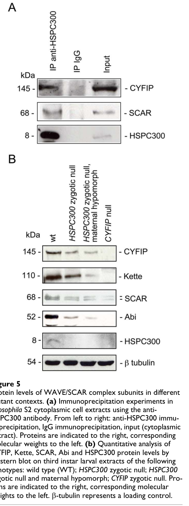

## Question

# Gene Research for Functional Annotation

## ⚠️ CRITICAL: Gene/Protein Identification Context

**BEFORE YOU BEGIN RESEARCH:** You MUST verify you are researching the CORRECT gene/protein. Gene symbols can be ambiguous, especially for less well-characterized genes from non-model organisms.

### Target Gene/Protein Identity (from UniProt):
- **UniProt Accession:** Q8MLQ0
- **Protein Description:** SubName: Full=Haematopoietic stem/progenitor cell protein 300, isoform A {ECO:0000313|EMBL:AAM68291.1}; SubName: Full=Haematopoietic stem/progenitor cell protein 300, isoform B {ECO:0000313|EMBL:AHN56605.1};
- **Gene Information:** Name=HSPC300 {ECO:0000313|EMBL:AAM68291.1, ECO:0000313|FlyBase:FBgn0061198}; Synonyms=Brk1 {ECO:0000313|EMBL:AAM68291.1}, dHSPC {ECO:0000313|EMBL:AAM68291.1}, dHSPC300 {ECO:0000313|EMBL:AAM68291.1}, Dmel\CG30173 {ECO:0000313|EMBL:AAM68291.1}, SIP1 {ECO:0000313|EMBL:AAM68291.1}; ORFNames=CG30173 {ECO:0000313|EMBL:AAM68291.1, ECO:0000313|FlyBase:FBgn0061198}, Dmel_CG30173 {ECO:0000313|EMBL:AAM68291.1};
- **Organism (full):** Drosophila melanogaster (Fruit fly).
- **Protein Family:** Belongs to the BRK1 family.
- **Key Domains:** BRICK1. (IPR033378)

### MANDATORY VERIFICATION STEPS:

1. **Check if the gene symbol "HSPC300" matches the protein description above**
2. **Verify the organism is correct:** Drosophila melanogaster (Fruit fly).
3. **Check if protein family/domains align with what you find in literature**
4. **If you find literature for a DIFFERENT gene with the same or similar symbol, STOP**

### If Gene Symbol is Ambiguous or You Cannot Find Relevant Literature:

**DO NOT PROCEED WITH RESEARCH ON A DIFFERENT GENE.** Instead:
- State clearly: "The gene symbol 'HSPC300' is ambiguous or literature is limited for this specific protein"
- Explain what you found (e.g., "Found extensive literature on a different gene with the same symbol in a different organism")
- Describe the protein based ONLY on the UniProt information provided above
- Suggest that the protein function can be inferred from domain/family information

### Research Target:

Please provide a comprehensive research report on the gene **HSPC300** (gene ID: HSPC300, UniProt: Q8MLQ0) in DROME.

The research report should be a detailed narrative explaining the function, biological processes, and localization of the gene product. Citations should be given for all claims.

You should prioritize authoritative reviews and primary scientific literature when conducting research. You can supplement
this with annotations you find in gene/protein databases, but these can be outdated or inaccurate.

We are specifically interested in the primary function of the gene - for enzymes, what reaction is catalyzed, and what is the substrate specificity? For transporters, what is the substrate? For structural proteins or adapters, what is the broader structural role? For signaling molecules, what is the role in the pathway.

We are interested in where in or outside the cell the gene product carries out its function.

We are also interested in the signaling or biochemical pathways in which the gene functions. We are less interested in broad pleiotropic effects, except where these elucidate the precise role.

Include evidence where possible. We are interested in both experimental evidence as well as inference from structure, evolution, or bioinformatic analysis. Precise studies should be prioritized over high-throughput, where available.

## Output

Question: You are an expert researcher providing comprehensive, well-cited information.

Provide detailed information focusing on:
1. Key concepts and definitions with current understanding
2. Recent developments and latest research (prioritize 2023-2024 sources)
3. Current applications and real-world implementations
4. Expert opinions and analysis from authoritative sources
5. Relevant statistics and data from recent studies

Format as a comprehensive research report with proper citations. Include URLs and publication dates where available.
Always prioritize recent, authoritative sources and provide specific citations for all major claims.

# Gene Research for Functional Annotation

## ⚠️ CRITICAL: Gene/Protein Identification Context

**BEFORE YOU BEGIN RESEARCH:** You MUST verify you are researching the CORRECT gene/protein. Gene symbols can be ambiguous, especially for less well-characterized genes from non-model organisms.

### Target Gene/Protein Identity (from UniProt):
- **UniProt Accession:** Q8MLQ0
- **Protein Description:** SubName: Full=Haematopoietic stem/progenitor cell protein 300, isoform A {ECO:0000313|EMBL:AAM68291.1}; SubName: Full=Haematopoietic stem/progenitor cell protein 300, isoform B {ECO:0000313|EMBL:AHN56605.1};
- **Gene Information:** Name=HSPC300 {ECO:0000313|EMBL:AAM68291.1, ECO:0000313|FlyBase:FBgn0061198}; Synonyms=Brk1 {ECO:0000313|EMBL:AAM68291.1}, dHSPC {ECO:0000313|EMBL:AAM68291.1}, dHSPC300 {ECO:0000313|EMBL:AAM68291.1}, Dmel\CG30173 {ECO:0000313|EMBL:AAM68291.1}, SIP1 {ECO:0000313|EMBL:AAM68291.1}; ORFNames=CG30173 {ECO:0000313|EMBL:AAM68291.1, ECO:0000313|FlyBase:FBgn0061198}, Dmel_CG30173 {ECO:0000313|EMBL:AAM68291.1};
- **Organism (full):** Drosophila melanogaster (Fruit fly).
- **Protein Family:** Belongs to the BRK1 family.
- **Key Domains:** BRICK1. (IPR033378)

### MANDATORY VERIFICATION STEPS:

1. **Check if the gene symbol "HSPC300" matches the protein description above**
2. **Verify the organism is correct:** Drosophila melanogaster (Fruit fly).
3. **Check if protein family/domains align with what you find in literature**
4. **If you find literature for a DIFFERENT gene with the same or similar symbol, STOP**

### If Gene Symbol is Ambiguous or You Cannot Find Relevant Literature:

**DO NOT PROCEED WITH RESEARCH ON A DIFFERENT GENE.** Instead:
- State clearly: "The gene symbol 'HSPC300' is ambiguous or literature is limited for this specific protein"
- Explain what you found (e.g., "Found extensive literature on a different gene with the same symbol in a different organism")
- Describe the protein based ONLY on the UniProt information provided above
- Suggest that the protein function can be inferred from domain/family information

### Research Target:

Please provide a comprehensive research report on the gene **HSPC300** (gene ID: HSPC300, UniProt: Q8MLQ0) in DROME.

The research report should be a detailed narrative explaining the function, biological processes, and localization of the gene product. Citations should be given for all claims.

You should prioritize authoritative reviews and primary scientific literature when conducting research. You can supplement
this with annotations you find in gene/protein databases, but these can be outdated or inaccurate.

We are specifically interested in the primary function of the gene - for enzymes, what reaction is catalyzed, and what is the substrate specificity? For transporters, what is the substrate? For structural proteins or adapters, what is the broader structural role? For signaling molecules, what is the role in the pathway.

We are interested in where in or outside the cell the gene product carries out its function.

We are also interested in the signaling or biochemical pathways in which the gene functions. We are less interested in broad pleiotropic effects, except where these elucidate the precise role.

Include evidence where possible. We are interested in both experimental evidence as well as inference from structure, evolution, or bioinformatic analysis. Precise studies should be prioritized over high-throughput, where available.

# Functional annotation report: *Drosophila melanogaster* HSPC300 (CG30173; UniProt Q8MLQ0)

## Identity and principal function

**The target is fly HSPC300, not a similarly named human or plant protein.** Qurashi and colleagues cloned the predicted *D. melanogaster* gene **CG30173** as **HSPC300** and detected an approximately 8-kDa protein. This independently supports the gene–organism identification supplied with UniProt Q8MLQ0. The supplied UniProt record assigns it to the BRK1/BRICK1 family (InterPro IPR033378); the literature uses Brick1/BRK1 for conserved homologues, but the accession, domain assignment, and stated isoforms were not independently established by these experiments. (qurashi2007hspc300andits pages 1-2, derivery2008freebrick1is pages 1-2)

**Best-supported annotation:** HSPC300 is a small **structural/regulatory subunit of the five-membered SCAR/WAVE regulatory complex (WRC)**, alongside SCAR/WAVE, CYFIP, Kette/Nap1, and Abi. In flies, its strongest experimentally demonstrated molecular role is helping maintain the abundance and function of this complex. The WRC connects upstream guidance and Rac-family signaling to **SCAR-mediated activation of Arp2/3**, which builds branched actin networks; **SCAR, not HSPC300, is the direct Arp2/3-activating subunit**. HSPC300 is therefore not annotated as an enzyme or transporter, and no independent HSPC300-catalyzed reaction or transported substrate has been demonstrated. (qurashi2007hspc300andits pages 1-2, qurashi2007hspc300andits pages 8-10, qurashi2007hspc300andits pages 6-8, derivery2008freebrick1is pages 1-2)

## Direct evidence in the target organism

**Complex membership and stability.** Anti-HSPC300 immunoprecipitation from fly S2-cell **cytoplasmic extracts** recovered both CYFIP and SCAR, unlike control immunoglobulin. In HSPC300-mutant third-instar larvae, CYFIP, Kette, SCAR, and Abi protein levels fell considerably. These observations establish association with, and an in-vivo stabilizing contribution to, the fly WRC; co-immunoprecipitation does **not** establish direct pairwise contact between HSPC300 and each recovered protein, and the fly experiments did not determine the mechanism by which other subunits decline. Qurashi and colleagues’ Figure 5 displays both the association and subunit-abundance results. (qurashi2007hspc300andits pages 6-8, qurashi2007hspc300andits media c1d9e1a2)

**Localization.** Fly HSPC300 transcripts occur across developmental stages, while validated antibody staining shows particularly prominent protein accumulation in the **embryonic central nervous system**, including longitudinal axon tracts and commissures. The biochemical association was measured in cytoplasmic cell extracts. Together these results place its demonstrated activity **inside cells**, notably in developing neurons and presynaptic motoneurons; they do not establish secretion, an extracellular function, or an exact nanoscale position at the plasma membrane or growth cone. (qurashi2007hspc300andits pages 1-2, qurashi2007hspc300andits pages 2-3, qurashi2007hspc300andits pages 6-8)

**Axon and synapse development.** Strong depletion of maternal **and** zygotic HSPC300 disrupts embryonic CNS axon bundles; partial maternal depletion with zygotic loss produces midline-crossing, commissural, and fasciculation defects. By contrast, zygotic-null embryos can initially appear normal because maternally contributed HSPC300 persists, along with near-normal CYFIP and SCAR. Later mutant larvae have shorter, poorly organized neuromuscular junctions (NMJs) with excess small buds. Neuronal expression of wild-type HSPC300 rescues the NMJ morphology, whereas muscle-directed expression does not, identifying a **presynaptic neuronal requirement**. The mutant allele affecting HSPC300 without disrupting transcripts of its adjacent genes, together with transgenic rescue of lethality, strengthens gene attribution. (qurashi2007hspc300andits pages 2-3, qurashi2007hspc300andits pages 12-13, qurashi2007hspc300andits pages 3-6, qurashi2007hspc300andits pages 6-8)

In one NMJ analysis, mutant synapse length normalized to muscle area was **1.36 × 10⁻³ ± 0.11 µm⁻¹**, compared with **2.06 × 10⁻³ ± 0.137 µm⁻¹** in wild type—approximately **66%** of control. Bud counts were **6.42 ± 0.60** versus **3.51 ± 0.39** per synapse, respectively; both reported comparisons had *p* < 0.001. These are morphological measurements, **not** measurements of actin-polymerization rate or neurotransmission. (qurashi2007hspc300andits pages 3-6, qurashi2007hspc300andits pages 6-8)

## Signaling pathway and recent developments

The established pathway-level interpretation is **guidance-receptor/Rac-associated input → WRC containing HSPC300 → SCAR/WAVE → Arp2/3-dependent actin organization**. WRC integrity can affect both availability and positioning of the SCAR activator. A complementary fly experiment found that artificially membrane-tethered WAVE could rescue photoreceptor axon-targeting defects despite loss of other WRC subunits in an *abi* mutant background; this demonstrates that complex integrity and membrane recruitment can be experimentally separated, but it is **not** a direct HSPC300 rescue experiment. (qurashi2007hspc300andits pages 1-2, qurashi2007hspc300andits pages 6-8, stephan2011membranetargetedwavemediates pages 1-2, stephan2011membranetargetedwavemediates pages 2-4)

A particularly relevant **October 2024** study connected the fly WRC to the netrin receptor **Frazzled (Fra)**. Fra co-immunoprecipitated with tagged HSPC300 in fly cells and embryonic lysates; disrupting Fra’s WRC-interacting receptor sequence (**WIRS**) weakened that association. Purified Fra cytoplasmic domain also bound reconstituted *Drosophila* WRC in a WIRS-dependent manner. Thus, Fra binds the **intact WRC** directly, but these experiments do **not** establish that Fra directly contacts the HSPC300 subunit. In flies lacking functional *fra*, wild-type Fra expression reduced the proportion of segments with failed EW-axon midline crossing from **56% to 13%**, whereas WIRS-deficient Fra left **42%** defective, supporting a role for receptor–WRC coupling in attractive guidance. (chaudhari2024ahumandcc pages 8-9, chaudhari2024ahumandcc pages 6-8)

**An important negative result qualifies gene-specific attribution:** in a sensitized Fra background, reducing CYFIP or SCAR increased EW-axon non-crossing from **33% to 49% or 46%**, respectively, but removing one copy of **hspc300** had **no detectable effect**. The study therefore supports Fra–WRC signaling more strongly than an individually demonstrated HSPC300 dosage requirement in that assay. Persistent maternal protein or a different dosage threshold is plausible, but was not established as the explanation there. (chaudhari2024ahumandcc pages 8-9)

## Conservation, limitations, and research use

Experiments **primarily in human cells** provide a plausible structural interpretation: free BRK1/HSPC300 can form trimers, enter newly synthesized WAVE complexes, and restore WRC assembly and cell morphology after BRK1 depletion. This assembly-precursor model is consistent with the fly complex-stability phenotype, **but should be labeled cross-species inference rather than a demonstrated assembly trajectory for fly Q8MLQ0**. Earlier biochemical work discussed by the fly investigators also found that removing HSPC300 need not abolish purified-complex assembly or Arp2/3 activation *in vitro*. Consequently, the defensible fly annotation is **maintenance and regulation of a functional SCAR/WAVE complex in vivo**, not an assertion that HSPC300 independently nucleates actin or is invariably required for catalysis by a purified complex. (qurashi2007hspc300andits pages 8-10, derivery2008freebrick1is pages 1-2, derivery2008freebrick1is pages 2-3, derivery2008freebrick1is pages 3-4)

The principal real-world application of this annotation is **experimental**, not an established therapy: *Drosophila* HSPC300 loss-of-function and neuron-specific rescue provide a model for testing WRC-dependent axon architecture and synapse formation; recombinant fly WRC and Fra interaction assays provide a means of probing receptor-to-actin coupling. Human DCC-associated mirror-movement disease motivates the comparative 2024 work, but the disease-causing variant is in **DCC**, not evidence of a human or fly HSPC300 disease association. No HSPC300-targeted clinical implementation follows from the cited fly experiments. (chaudhari2024ahumandcc pages 1-3, qurashi2007hspc300andits pages 3-6, chaudhari2024ahumandcc pages 6-8, chaudhari2024ahumandcc pages 14-16)

### Principal sources

- Qurashi A *et al.* **25 September 2007**. “HSPC300 and its role in neuronal connectivity.” *Neural Development* **2**:18. https://doi.org/10.1186/1749-8104-2-18. Direct target-gene identification, fly localization, genetics, protein association, stability, and rescue. (qurashi2007hspc300andits pages 1-2, qurashi2007hspc300andits pages 6-8)
- Chaudhari K *et al.* **October 2024**. “A human DCC variant causing mirror movement disorder reveals that the WAVE regulatory complex mediates axon guidance by netrin-1–DCC.” *Science Signaling* **17**:eadk2345. https://doi.org/10.1126/scisignal.adk2345. Recent fly Fra–WRC biochemistry and guidance genetics, including a negative *hspc300* heterozygote result. (chaudhari2024ahumandcc pages 1-3, chaudhari2024ahumandcc pages 6-8, chaudhari2024ahumandcc pages 8-9)
- Derivery E *et al.* **18 June 2008**. “Free Brick1 Is a Trimeric Precursor in the Assembly of a Functional Wave Complex.” *PLoS ONE* **3**:e2462. https://doi.org/10.1371/journal.pone.0002462. Mechanistic **ortholog** evidence, principally from human cells. (derivery2008freebrick1is pages 1-2, derivery2008freebrick1is pages 3-4)
- Stephan R *et al.* **2011**. “Membrane-targeted WAVE mediates photoreceptor axon targeting in the absence of the WAVE complex in Drosophila.” *Molecular Biology of the Cell* **22**:4079–4092. https://doi.org/10.1091/mbc.e11-02-0121. Fly WRC and membrane-recruitment context, not an HSPC300-specific perturbation. (stephan2011membranetargetedwavemediates pages 1-2, stephan2011membranetargetedwavemediates pages 2-4)

References

1. (qurashi2007hspc300andits pages 1-2): A. Qurashi, A. Qurashi, H. B. Şahin, Pilar Carrera, Pilar Carrera, A. Gautreau, Annette Schenck, Annette Schenck, and A. Giangrande. Hspc300 and its role in neuronal connectivity. Neural Development, 2:18-18, Sep 2007. URL: https://doi.org/10.1186/1749-8104-2-18, doi:10.1186/1749-8104-2-18. This article has 42 citations and is from a peer-reviewed journal.

2. (derivery2008freebrick1is pages 1-2): Emmanuel Derivery, Jenny Fink, Davy Martin, Anne Houdusse, Matthieu Piel, Theresia E. Stradal, Daniel Louvard, and Alexis Gautreau. Free brick1 is a trimeric precursor in the assembly of a functional wave complex. PLoS ONE, 3:e2462, Jun 2008. URL: https://doi.org/10.1371/journal.pone.0002462, doi:10.1371/journal.pone.0002462. This article has 81 citations and is from a peer-reviewed journal.

3. (qurashi2007hspc300andits pages 8-10): A. Qurashi, A. Qurashi, H. B. Şahin, Pilar Carrera, Pilar Carrera, A. Gautreau, Annette Schenck, Annette Schenck, and A. Giangrande. Hspc300 and its role in neuronal connectivity. Neural Development, 2:18-18, Sep 2007. URL: https://doi.org/10.1186/1749-8104-2-18, doi:10.1186/1749-8104-2-18. This article has 42 citations and is from a peer-reviewed journal.

4. (qurashi2007hspc300andits pages 6-8): A. Qurashi, A. Qurashi, H. B. Şahin, Pilar Carrera, Pilar Carrera, A. Gautreau, Annette Schenck, Annette Schenck, and A. Giangrande. Hspc300 and its role in neuronal connectivity. Neural Development, 2:18-18, Sep 2007. URL: https://doi.org/10.1186/1749-8104-2-18, doi:10.1186/1749-8104-2-18. This article has 42 citations and is from a peer-reviewed journal.

5. (qurashi2007hspc300andits media c1d9e1a2): A. Qurashi, A. Qurashi, H. B. Şahin, Pilar Carrera, Pilar Carrera, A. Gautreau, Annette Schenck, Annette Schenck, and A. Giangrande. Hspc300 and its role in neuronal connectivity. Neural Development, 2:18-18, Sep 2007. URL: https://doi.org/10.1186/1749-8104-2-18, doi:10.1186/1749-8104-2-18. This article has 42 citations and is from a peer-reviewed journal.

6. (qurashi2007hspc300andits pages 2-3): A. Qurashi, A. Qurashi, H. B. Şahin, Pilar Carrera, Pilar Carrera, A. Gautreau, Annette Schenck, Annette Schenck, and A. Giangrande. Hspc300 and its role in neuronal connectivity. Neural Development, 2:18-18, Sep 2007. URL: https://doi.org/10.1186/1749-8104-2-18, doi:10.1186/1749-8104-2-18. This article has 42 citations and is from a peer-reviewed journal.

7. (qurashi2007hspc300andits pages 12-13): A. Qurashi, A. Qurashi, H. B. Şahin, Pilar Carrera, Pilar Carrera, A. Gautreau, Annette Schenck, Annette Schenck, and A. Giangrande. Hspc300 and its role in neuronal connectivity. Neural Development, 2:18-18, Sep 2007. URL: https://doi.org/10.1186/1749-8104-2-18, doi:10.1186/1749-8104-2-18. This article has 42 citations and is from a peer-reviewed journal.

8. (qurashi2007hspc300andits pages 3-6): A. Qurashi, A. Qurashi, H. B. Şahin, Pilar Carrera, Pilar Carrera, A. Gautreau, Annette Schenck, Annette Schenck, and A. Giangrande. Hspc300 and its role in neuronal connectivity. Neural Development, 2:18-18, Sep 2007. URL: https://doi.org/10.1186/1749-8104-2-18, doi:10.1186/1749-8104-2-18. This article has 42 citations and is from a peer-reviewed journal.

9. (stephan2011membranetargetedwavemediates pages 1-2): Raiko Stephan, Christina Gohl, Astrid Fleige, Christian Klämbt, and Sven Bogdan. Membrane-targeted wave mediates photoreceptor axon targeting in the absence of the wave complex in drosophila. Molecular Biology of the Cell, 22:4079-4092, Nov 2011. URL: https://doi.org/10.1091/mbc.e11-02-0121, doi:10.1091/mbc.e11-02-0121. This article has 28 citations and is from a domain leading peer-reviewed journal.

10. (stephan2011membranetargetedwavemediates pages 2-4): Raiko Stephan, Christina Gohl, Astrid Fleige, Christian Klämbt, and Sven Bogdan. Membrane-targeted wave mediates photoreceptor axon targeting in the absence of the wave complex in drosophila. Molecular Biology of the Cell, 22:4079-4092, Nov 2011. URL: https://doi.org/10.1091/mbc.e11-02-0121, doi:10.1091/mbc.e11-02-0121. This article has 28 citations and is from a domain leading peer-reviewed journal.

11. (chaudhari2024ahumandcc pages 8-9): Karina Chaudhari, Kaiyue Zhang, Patricia T. Yam, Yixin Zang, Daniel A. Kramer, Sarah Gagnon, Sabrina Schlienger, Sara Calabretta, Jean-Francois Michaud, Meagan Collins, Junmei Wang, Myriam Srour, Baoyu Chen, Frédéric Charron, and Greg J. Bashaw. A human dcc variant causing mirror movement disorder reveals that the wave regulatory complex mediates axon guidance by netrin-1–dcc. Science Signaling, Oct 2024. URL: https://doi.org/10.1126/scisignal.adk2345, doi:10.1126/scisignal.adk2345. This article has 5 citations and is from a domain leading peer-reviewed journal.

12. (chaudhari2024ahumandcc pages 6-8): Karina Chaudhari, Kaiyue Zhang, Patricia T. Yam, Yixin Zang, Daniel A. Kramer, Sarah Gagnon, Sabrina Schlienger, Sara Calabretta, Jean-Francois Michaud, Meagan Collins, Junmei Wang, Myriam Srour, Baoyu Chen, Frédéric Charron, and Greg J. Bashaw. A human dcc variant causing mirror movement disorder reveals that the wave regulatory complex mediates axon guidance by netrin-1–dcc. Science Signaling, Oct 2024. URL: https://doi.org/10.1126/scisignal.adk2345, doi:10.1126/scisignal.adk2345. This article has 5 citations and is from a domain leading peer-reviewed journal.

13. (derivery2008freebrick1is pages 2-3): Emmanuel Derivery, Jenny Fink, Davy Martin, Anne Houdusse, Matthieu Piel, Theresia E. Stradal, Daniel Louvard, and Alexis Gautreau. Free brick1 is a trimeric precursor in the assembly of a functional wave complex. PLoS ONE, 3:e2462, Jun 2008. URL: https://doi.org/10.1371/journal.pone.0002462, doi:10.1371/journal.pone.0002462. This article has 81 citations and is from a peer-reviewed journal.

14. (derivery2008freebrick1is pages 3-4): Emmanuel Derivery, Jenny Fink, Davy Martin, Anne Houdusse, Matthieu Piel, Theresia E. Stradal, Daniel Louvard, and Alexis Gautreau. Free brick1 is a trimeric precursor in the assembly of a functional wave complex. PLoS ONE, 3:e2462, Jun 2008. URL: https://doi.org/10.1371/journal.pone.0002462, doi:10.1371/journal.pone.0002462. This article has 81 citations and is from a peer-reviewed journal.

15. (chaudhari2024ahumandcc pages 1-3): Karina Chaudhari, Kaiyue Zhang, Patricia T. Yam, Yixin Zang, Daniel A. Kramer, Sarah Gagnon, Sabrina Schlienger, Sara Calabretta, Jean-Francois Michaud, Meagan Collins, Junmei Wang, Myriam Srour, Baoyu Chen, Frédéric Charron, and Greg J. Bashaw. A human dcc variant causing mirror movement disorder reveals that the wave regulatory complex mediates axon guidance by netrin-1–dcc. Science Signaling, Oct 2024. URL: https://doi.org/10.1126/scisignal.adk2345, doi:10.1126/scisignal.adk2345. This article has 5 citations and is from a domain leading peer-reviewed journal.

16. (chaudhari2024ahumandcc pages 14-16): Karina Chaudhari, Kaiyue Zhang, Patricia T. Yam, Yixin Zang, Daniel A. Kramer, Sarah Gagnon, Sabrina Schlienger, Sara Calabretta, Jean-Francois Michaud, Meagan Collins, Junmei Wang, Myriam Srour, Baoyu Chen, Frédéric Charron, and Greg J. Bashaw. A human dcc variant causing mirror movement disorder reveals that the wave regulatory complex mediates axon guidance by netrin-1–dcc. Science Signaling, Oct 2024. URL: https://doi.org/10.1126/scisignal.adk2345, doi:10.1126/scisignal.adk2345. This article has 5 citations and is from a domain leading peer-reviewed journal.

## Artifacts

- [Edison artifact artifact-00](HSPC300-deep-research-falcon_artifacts/artifact-00.md)

## Citations

1. chaudhari2024ahumandcc pages 8-9
2. stephan2011membranetargetedwavemediates pages 1-2
3. stephan2011membranetargetedwavemediates pages 2-4
4. chaudhari2024ahumandcc pages 6-8
5. chaudhari2024ahumandcc pages 1-3
6. chaudhari2024ahumandcc pages 14-16
7. https://doi.org/10.1186/1749-8104-2-18.
8. https://doi.org/10.1126/scisignal.adk2345.
9. https://doi.org/10.1371/journal.pone.0002462.
10. https://doi.org/10.1091/mbc.e11-02-0121.
11. https://doi.org/10.1186/1749-8104-2-18,
12. https://doi.org/10.1371/journal.pone.0002462,
13. https://doi.org/10.1091/mbc.e11-02-0121,
14. https://doi.org/10.1126/scisignal.adk2345,