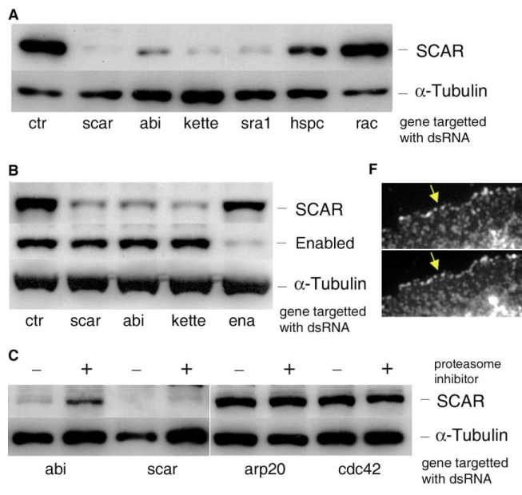

## Question

# Gene Research for Functional Annotation

## ⚠️ CRITICAL: Gene/Protein Identification Context

**BEFORE YOU BEGIN RESEARCH:** You MUST verify you are researching the CORRECT gene/protein. Gene symbols can be ambiguous, especially for less well-characterized genes from non-model organisms.

### Target Gene/Protein Identity (from UniProt):
- **UniProt Accession:** P55162
- **Protein Description:** RecName: Full=Membrane-associated protein Hem; AltName: Full=dHem-2;
- **Gene Information:** Name=Hem; Synonyms=HEM2; ORFNames=CG5837;
- **Organism (full):** Drosophila melanogaster (Fruit fly).
- **Protein Family:** Belongs to the HEM-1/HEM-2 family. .
- **Key Domains:** Nck-associated_protein-1. (IPR019137); Nckap1 (PF09735)

### MANDATORY VERIFICATION STEPS:

1. **Check if the gene symbol "Hem" matches the protein description above**
2. **Verify the organism is correct:** Drosophila melanogaster (Fruit fly).
3. **Check if protein family/domains align with what you find in literature**
4. **If you find literature for a DIFFERENT gene with the same or similar symbol, STOP**

### If Gene Symbol is Ambiguous or You Cannot Find Relevant Literature:

**DO NOT PROCEED WITH RESEARCH ON A DIFFERENT GENE.** Instead:
- State clearly: "The gene symbol 'Hem' is ambiguous or literature is limited for this specific protein"
- Explain what you found (e.g., "Found extensive literature on a different gene with the same symbol in a different organism")
- Describe the protein based ONLY on the UniProt information provided above
- Suggest that the protein function can be inferred from domain/family information

### Research Target:

Please provide a comprehensive research report on the gene **Hem** (gene ID: Hem, UniProt: P55162) in DROME.

The research report should be a detailed narrative explaining the function, biological processes, and localization of the gene product. Citations should be given for all claims.

You should prioritize authoritative reviews and primary scientific literature when conducting research. You can supplement
this with annotations you find in gene/protein databases, but these can be outdated or inaccurate.

We are specifically interested in the primary function of the gene - for enzymes, what reaction is catalyzed, and what is the substrate specificity? For transporters, what is the substrate? For structural proteins or adapters, what is the broader structural role? For signaling molecules, what is the role in the pathway.

We are interested in where in or outside the cell the gene product carries out its function.

We are also interested in the signaling or biochemical pathways in which the gene functions. We are less interested in broad pleiotropic effects, except where these elucidate the precise role.

Include evidence where possible. We are interested in both experimental evidence as well as inference from structure, evolution, or bioinformatic analysis. Precise studies should be prioritized over high-throughput, where available.

## Output

Question: You are an expert researcher providing comprehensive, well-cited information.

Provide detailed information focusing on:
1. Key concepts and definitions with current understanding
2. Recent developments and latest research (prioritize 2023-2024 sources)
3. Current applications and real-world implementations
4. Expert opinions and analysis from authoritative sources
5. Relevant statistics and data from recent studies

Format as a comprehensive research report with proper citations. Include URLs and publication dates where available.
Always prioritize recent, authoritative sources and provide specific citations for all major claims.

# Gene Research for Functional Annotation

## ⚠️ CRITICAL: Gene/Protein Identification Context

**BEFORE YOU BEGIN RESEARCH:** You MUST verify you are researching the CORRECT gene/protein. Gene symbols can be ambiguous, especially for less well-characterized genes from non-model organisms.

### Target Gene/Protein Identity (from UniProt):
- **UniProt Accession:** P55162
- **Protein Description:** RecName: Full=Membrane-associated protein Hem; AltName: Full=dHem-2;
- **Gene Information:** Name=Hem; Synonyms=HEM2; ORFNames=CG5837;
- **Organism (full):** Drosophila melanogaster (Fruit fly).
- **Protein Family:** Belongs to the HEM-1/HEM-2 family. .
- **Key Domains:** Nck-associated_protein-1. (IPR019137); Nckap1 (PF09735)

### MANDATORY VERIFICATION STEPS:

1. **Check if the gene symbol "Hem" matches the protein description above**
2. **Verify the organism is correct:** Drosophila melanogaster (Fruit fly).
3. **Check if protein family/domains align with what you find in literature**
4. **If you find literature for a DIFFERENT gene with the same or similar symbol, STOP**

### If Gene Symbol is Ambiguous or You Cannot Find Relevant Literature:

**DO NOT PROCEED WITH RESEARCH ON A DIFFERENT GENE.** Instead:
- State clearly: "The gene symbol 'Hem' is ambiguous or literature is limited for this specific protein"
- Explain what you found (e.g., "Found extensive literature on a different gene with the same symbol in a different organism")
- Describe the protein based ONLY on the UniProt information provided above
- Suggest that the protein function can be inferred from domain/family information

### Research Target:

Please provide a comprehensive research report on the gene **Hem** (gene ID: Hem, UniProt: P55162) in DROME.

The research report should be a detailed narrative explaining the function, biological processes, and localization of the gene product. Citations should be given for all claims.

You should prioritize authoritative reviews and primary scientific literature when conducting research. You can supplement
this with annotations you find in gene/protein databases, but these can be outdated or inaccurate.

We are specifically interested in the primary function of the gene - for enzymes, what reaction is catalyzed, and what is the substrate specificity? For transporters, what is the substrate? For structural proteins or adapters, what is the broader structural role? For signaling molecules, what is the role in the pathway.

We are interested in where in or outside the cell the gene product carries out its function.

We are also interested in the signaling or biochemical pathways in which the gene functions. We are less interested in broad pleiotropic effects, except where these elucidate the precise role.

Include evidence where possible. We are interested in both experimental evidence as well as inference from structure, evolution, or bioinformatic analysis. Precise studies should be prioritized over high-throughput, where available.

# Functional annotation report: *Hem* (P55162) in *Drosophila melanogaster*

## Identity and scope

The supplied UniProt record identifies the target as *D. melanogaster* **Hem**, ORF **CG5837**, protein **dHem-2** (P55162), with a HEM-1/HEM-2-family, Nck-associated-protein-1/Nckap1 domain assignment. Crucially, primary genetic work established that the Drosophila gene historically called ***kette*** encodes **DHEM-2**: a *kette* deletion removed the previously named *Dhem-2* transcription unit, and sequencing four *kette* alleles identified causative mutations. Thus the *kette* literature is relevant to the supplied dHem-2 identity. The original paper predates the CG5837 and P55162 identifiers, so the accession-to-locus cross-reference here relies on the UniProt identifiers supplied in the question rather than an independently verified cross-reference in that paper. [UniProt P55162](https://www.uniprot.org/uniprotkb/P55162/entry); [Hummel *et al.*, April 2000](https://doi.org/10.1101/gad.14.7.863). (hummel2000thedrosophilahem2nap1 pages 4-5)

**Names must not be conflated across species.** Fly DHEM-2/Kette is a HEM/NAP-family WAVE-complex subunit; human hematopoietic **HEM1/NCKAP1L** is a related but different protein, not the fly gene. The Nckap1-family annotation is consistent with this assignment, although a family/domain match alone would not establish a particular signaling mechanism. (hamp2016drosophilakettecoordinates pages 1-3, park2010hem‐1puttingthe pages 4-4, rottner2021waveregulatorycomplex pages 1-2)

## Primary molecular function and pathway

**Hem/Kette is a regulatory scaffold of the SCAR/WAVE regulatory complex (WRC), not an enzyme or transporter.** The conserved WRC comprises a HEM-2/NAP1/Kette-family subunit, Sra1/CYFIP, Abi, HSPC300/BRK1 and SCAR/WAVE. Kette and Sra1 form much of its elongated structural platform, while SCAR/WAVE supplies the actin- and Arp2/3-interacting WCA/VCA output region. Consequently, there is no established catalytic reaction or transported substrate to assign to Hem itself. [Rottner, Stradal and Chen, May 2021](https://doi.org/10.1016/j.cub.2021.01.086). (rottner2021waveregulatorycomplex pages 1-2, rottner2021waveregulatorycomplex pages 2-3)

The best-supported signaling sequence is **local receptor and Rac-family signaling → recruitment/activation of the WRC → exposure of SCAR/WAVE’s WCA region → Arp2/3 activation → branched cortical actin assembly**. Structural and biochemical studies summarized in the 2021 WRC review show that the resting complex is autoinhibited; Rac-GTP binds the **Sra1/CYFIP** side of the complex and helps release the sequestered WCA region. Phospholipids and receptor interactions can cooperate in membrane recruitment. This detailed allosteric model is substantially based on reconstituted and non-fly WRCs; fly genetics and cell biology establish the pathway’s physiological relevance, but do not demonstrate that Rac directly binds fly Kette. (rottner2021waveregulatorycomplex pages 1-2, rottner2021waveregulatorycomplex pages 2-3, rottner2021waveregulatorycomplex pages 3-4)

Direct fly experiments define what Kette contributes. In adherent S2R+ cells, *kette* RNAi impaired cortical actin and protrusions and reduced SCAR protein by **approximately 90%**, similar to depletion of Abi or Sra1; proteasome inhibitors partially restored SCAR after depletion of complex components. SCAR and Kette colocalized at protrusions. Yet an isolated SCAR PVCA region still drove **Arp2/3-dependent** ectopic actin assembly after Kette depletion. Together, these findings support a role in **stabilizing, positioning and regulating SCAR**, rather than Kette itself catalyzing actin nucleation. Proteasome-inhibitor and colocalization results do not establish direct Kette–SCAR binding or identify Kette as a ubiquitination enzyme. [Kunda *et al.*, 28 October 2003](https://doi.org/10.1016/j.cub.2003.10.005). (kunda2003abisra1and pages 3-5, kunda2003abisra1and pages 5-7, kunda2003abisra1and media fc191286, kunda2003abisra1and media a757fa35)

## Where the protein functions

Hem/Kette acts **inside cells**, principally as part of a cytoplasmic WRC recruited to the **cell cortex and membrane-associated sites of actin remodeling**; it is not established as an extracellular protein. Fly immunofluorescence showed Kette with SCAR at protrusions, and adult-head gel filtration placed substantial Kette, Abi and WAVE in **approximately 400–500-kDa** complexes. In *kette* mutant larval brains, WAVE and other WRC proteins declined, whereas neuronal Kette re-expression restored complex protein levels. These observations provide stronger evidence for neuronal WRC membership than the protein name “membrane-associated” alone. [Kunda *et al.*, 2003](https://doi.org/10.1016/j.cub.2003.10.005); [Stephan *et al.*, 1 November 2011](https://doi.org/10.1091/mbc.e11-02-0121). (stephan2011membranetargetedwavemediates pages 7-9, kunda2003abisra1and pages 3-5, kunda2003abisra1and media fc191286, kunda2003abisra1and media a757fa35)

An important qualification is that the original *kette* study **predicted six transmembrane segments** and entertained a receptor-like model. That was a historical sequence-based proposal, **not experimentally validated membrane topology**; the subsequently established WRC scaffold and cytosol-to-membrane recruitment model is the more defensible functional annotation. In fly photoreceptor experiments, artificially membrane-tethered WAVE restored axon targeting much better than cytoplasmic WAVE when **Abi**, rather than Kette, was absent; this demonstrates the importance of membrane-localized WAVE activity but must not be described as a direct *kette*-mutant rescue. [Hummel *et al.*, 2000](https://doi.org/10.1101/gad.14.7.863); [Stephan *et al.*, 2011](https://doi.org/10.1091/mbc.e11-02-0121). (hummel2000thedrosophilahem2nap1 pages 7-8, rottner2021waveregulatorycomplex pages 1-2, stephan2011membranetargetedwavemediates pages 9-11)

## Experimental biological roles

**Axon guidance and neuronal morphology.** Loss-of-function *kette* embryos have abnormal midline-neuron axons, fused or disrupted commissures and longitudinal tracts, displaced glia, and disordered actin organization. *kette* genetically interacts with *dock*, which encodes an NCK-family adaptor, and activated DRAC1 partly rescues the neuronal phenotype. These experiments establish a Rac-linked role in organizing the actin-dependent cellular machinery needed for axonal projections; the genetic interactions alone do not prove a direct Kette–Dock or Kette–Rac protein interaction. [Hummel *et al.*, April 2000](https://doi.org/10.1101/gad.14.7.863). (hummel2000thedrosophilahem2nap1 pages 6-7, hummel2000thedrosophilahem2nap1 pages 4-5)

**Myoblast fusion: a more specific cell-interface function.** Transmission electron microscopy of *kette* mutants revealed persistent electron-dense myoblast junctional plaques, about **200 nm to 1 μm** long, and GFP failed to diffuse through a fusion pore; nevertheless, actin-rich finger-like protrusions still formed. Reducing N-cadherin gene dosage alleviated the fusion defect. Kette therefore helps coordinate **junction dissolution and progression to fusion-pore formation**, rather than being universally required for all protrusions. Genetic rescue and dosage experiments further implicate the balance between the Arp2/3 activators SCAR/WAVE and WASp in fusion-competent myoblasts; whether Kette directly removes junctional N-cadherin has not been established. [Hamp *et al.*, September 2016](https://doi.org/10.1242/jcs.175638). (hamp2016drosophilakettecoordinates pages 6-8, hamp2016drosophilakettecoordinates pages 8-10, hamp2016drosophilakettecoordinates pages 3-6)

**Macrophage behavior is supporting pathway evidence, not a Kette-specific phenotype.** A fly study showed that loss of **SCAR** compromises embryonic macrophage migration and processing of engulfed apoptotic corpses, with reduced phagocytic burden partly restoring motility. It places these processes in a Hem/Kette-containing SCAR/WAVE pathway, but its SCAR-mutant findings should not be represented as direct results of *Hem/kette* knockout. [Evans *et al.*, January 2013](https://doi.org/10.1038/cdd.2012.166). (evans2013scarwavemediatedprocessingof pages 1-2)

## Recent research and interpretation

A **2024** primary study gives a more precise receptor-to-WRC link in flies. The cytoplasmic **WRC-interacting receptor sequence (WIRS)** of the netrin receptor **Frazzled** mediated binding to purified Drosophila WRC and association in fly cells and embryos. In *fra* mutant embryos, **56%** of examined EW commissural axons failed to cross the midline; neuronal expression of wild-type Fra reduced this defect to **13%**, whereas Fra lacking WIRS left **42%** defective. Genetic interactions involving the WRC subunits CYFIP and SCAR also supported a role in Fra-dependent attraction. This places the *Hem/Kette*-containing complex in a plausible membrane-receptor-to-actin pathway, **but the study did not independently perturb or demonstrate Fra binding to Kette**; its quantitative phenotypes are Fra/WRC-level, not Hem-specific measurements. [Chaudhari *et al.*, October 2024](https://doi.org/10.1126/scisignal.adk2345). (chaudhari2024ahumandcc pages 8-9, chaudhari2024ahumandcc pages 6-8)

The evidence below separates direct Kette experiments from results on its broader complex.

| Study / publication date / URL | Direct experiment | Implication for Hem/Kette | Interpretation / limitations |
|---|---|---|---|
| Hummel, Leifker & Klämbt, *Genes & Development*; April 2000. [DOI](https://doi.org/10.1101/gad.14.7.863) | The *kette* transcription unit was mapped to the previously described *Dhem-2* gene. A *kette* deletion removed *Dhem-2*, and sequencing four *kette* alleles identified two truncating mutations plus missense substitutions, establishing that *kette* encodes DHEM-2 (hummel2000thedrosophilahem2nap1 pages 4-5). Activated DRAC1 expressed in CNS midline cells partially rescued *kette* commissural and connective defects (hummel2000thedrosophilahem2nap1 pages 6-7). | **Direct, high-confidence identity and genetic-pathway evidence:** DHEM-2 is Kette, and Kette functions in Rac-linked actin organization during axon guidance. | The mapping supports interpreting the user-supplied P55162 Hem/dHem-2 identity as Kette, although the paper predates the CG5837 and P55162 nomenclature. RAC rescue establishes functional interaction or pathway placement, not direct Kette–Rac binding. The early six-transmembrane description was a prediction, not validated membrane topology (hummel2000thedrosophilahem2nap1 pages 7-8). |
| Kunda *et al.*, *Current Biology*; 28 October 2003. [DOI](https://doi.org/10.1016/j.cub.2003.10.005) | In Drosophila S2R+ cells, Kette RNAi reduced SCAR protein by approximately 90%; similar results occurred in UC88 cells. Proteasome inhibitors partially restored SCAR after loss of complex components, including a lesser Kette-RNAi effect, and Figure 3F showed Kette–SCAR colocalization at cellular protrusions (kunda2003abisra1and pages 3-5, kunda2003abisra1and media fc191286, kunda2003abisra1and media a757fa35). Kette depletion also impaired cortical actin and protrusion formation, whereas the isolated SCAR PVCA domain could still activate Arp2/3 (kunda2003abisra1and pages 5-7). | **Direct biochemical and cell-biological evidence:** Kette stabilizes SCAR within the WAVE regulatory complex and helps localize WRC activity to the protrusive cortex; it is not itself the catalytic Arp2/3 activator. | RNAi and proteasome-inhibitor data strongly support complex-dependent SCAR stabilization, but do not prove that Kette directly ubiquitinates or protects SCAR. Colocalization does not establish direct physical binding. The catalytically competent PVCA-domain result places Kette upstream of SCAR-mediated Arp2/3 activation. |
| Stephan *et al.*, *Molecular Biology of the Cell*; 1 November 2011. [DOI](https://doi.org/10.1091/mbc.e11-02-0121) | Gel filtration of adult fly-head lysates placed much Abi, WAVE and Kette together in approximately 400–500-kDa complexes. WAVE and other WRC proteins were strongly reduced in *kette* mutant brain lysates, and neuronal Kette re-expression restored complex integrity (stephan2011membranetargetedwavemediates pages 7-9). Separately, membrane-tethered WAVE rescued *abi* mutant axon-targeting defects far better than cytoplasmic WAVE, and rescue required WAVE’s Arp2/3-activating VCA region (stephan2011membranetargetedwavemediates pages 9-11). | **Direct in-vivo complex evidence:** neuronal Kette is a structural and stabilizing WRC subunit. The membrane-targeting experiment supports the broader model that an intact WRC recruits and activates WAVE at membranes. | The 400–500-kDa fraction is consistent with a WRC but is not by itself a purified-complex mass determination. Crucially, membrane-tethered WAVE was tested as rescue of **Abi deficiency**, not directly in *kette* mutants; it should not be reported as Kette-specific rescue. |
| Hamp *et al.*, *Journal of Cell Science*; September 2016. [DOI](https://doi.org/10.1242/jcs.175638) | TEM and high-pressure freezing showed persistent electron-dense junctional plaques of approximately 200 nm to 1 μm in *kette* mutant myoblasts, while wild-type plaques were approximately 500 nm. Cytoplasmic GFP failed to pass through a fusion pore in mutants, although actin-rich finger-like protrusions still formed (hamp2016drosophilakettecoordinates pages 3-6). Lowering N-cadherin dosage alleviated the fusion defect, and expression of Kette or WRC-pathway components produced cell-type-dependent rescue (hamp2016drosophilakettecoordinates pages 6-8, hamp2016drosophilakettecoordinates pages 22-26). | **Direct tissue-level evidence:** Kette promotes dissolution of N-cadherin-containing myoblast junctions and progression to fusion-pore formation while coordinating Scar/WAVE- and WASp-dependent actin remodeling. | The data distinguish junction dissolution from protrusion formation, but do not demonstrate that Kette directly removes N-cadherin. Rescue by Scar/WAVE or other pathway components indicates functional coupling and dosage sensitivity rather than biochemical equivalence. |
| Chaudhari *et al.*, *Science Signaling*; October 2024. [DOI](https://doi.org/10.1126/scisignal.adk2345) | Frazzled bound the Drosophila WRC through a cytoplasmic WIRS motif in S2R+ cells, embryonic lysates and purified-protein assays (chaudhari2024ahumandcc pages 6-8). In *fra* mutants, 56% of EW commissural axons failed to cross the midline; FraWT expression reduced defects to 13%, whereas FraΔWIRS left 42% defective (chaudhari2024ahumandcc pages 8-9). | **Recent, direct WRC-level evidence:** a membrane axon-guidance receptor can recruit the fly WRC through WIRS, providing a current receptor-to-WRC-to-actin mechanism relevant to Hem/Kette-containing complexes. | **Not Kette-specific:** the experiments assayed the complete WRC, HSPC300, CYFIP and SCAR, but did not independently mutate, deplete or bind Kette/Hem. The results refine the pathway context for Hem/Kette but cannot establish a unique Kette–Fra interaction (chaudhari2024ahumandcc pages 8-9, chaudhari2024ahumandcc pages 6-8). |

*Table: Compact grading of direct and pathway-level evidence for Drosophila Hem/DHEM-2/Kette, from molecular identity and WRC stabilization to tissue functions and recent receptor coupling. Limitations distinguish Kette-specific experiments from findings that apply only to the complete WRC.*

**Bottom line.** The defensible primary annotation for fly Hem/dHem-2/Kette is **intracellular HEM/NCKAP1-family scaffold of the SCAR/WAVE complex**, maintaining functional SCAR/WAVE and coupling spatial cues to Arp2/3-dependent branched actin at remodeling membranes. Its best-established site-specific activities are cortical protrusion regulation, neuronal axon organization and myoblast-interface remodeling. The most pertinent 2024 advance defines a Frazzled–WRC connection, not a new Hem-specific catalytic activity, membrane topology or therapeutic implementation. (hummel2000thedrosophilahem2nap1 pages 4-5, stephan2011membranetargetedwavemediates pages 7-9, kunda2003abisra1and pages 3-5, hamp2016drosophilakettecoordinates pages 3-6, chaudhari2024ahumandcc pages 6-8)

References

1. (hummel2000thedrosophilahem2nap1 pages 4-5): Thomas Hummel, Karin Leifker, and Christian Klämbt. The drosophila hem-2/nap1 homolog kette controls axonal pathfinding and cytoskeletal organization. Genes & development, 14 7:863-73, Apr 2000. URL: https://doi.org/10.1101/gad.14.7.863, doi:10.1101/gad.14.7.863. This article has 108 citations and is from a highest quality peer-reviewed journal.

2. (hamp2016drosophilakettecoordinates pages 1-3): Julia Hamp, Andreas Löwer, Christine Dottermusch-Heidel, Lothar Beck, Bernard Moussian, Matthias Flötenmeyer, and Susanne-Filiz Önel. Drosophila kette coordinates myoblast junction dissolution and the ratio of scar-to-wasp during myoblast fusion. Journal of Cell Science, 129:3426-3436, Sep 2016. URL: https://doi.org/10.1242/jcs.175638, doi:10.1242/jcs.175638. This article has 16 citations and is from a domain leading peer-reviewed journal.

3. (park2010hem‐1puttingthe pages 4-4): Heon Park, Maia M. Chan, and Brian M. Iritani. Hem‐1: putting the “wave” into actin polymerization during an immune response. FEBS Letters, 584:4923-4932, Dec 2010. URL: https://doi.org/10.1016/j.febslet.2010.10.018, doi:10.1016/j.febslet.2010.10.018. This article has 52 citations and is from a peer-reviewed journal.

4. (rottner2021waveregulatorycomplex pages 1-2): Klemens Rottner, Theresia E.B. Stradal, and Baoyu Chen. Wave regulatory complex. Current Biology, 31:R512-R517, May 2021. URL: https://doi.org/10.1016/j.cub.2021.01.086, doi:10.1016/j.cub.2021.01.086. This article has 145 citations and is from a highest quality peer-reviewed journal.

5. (rottner2021waveregulatorycomplex pages 2-3): Klemens Rottner, Theresia E.B. Stradal, and Baoyu Chen. Wave regulatory complex. Current Biology, 31:R512-R517, May 2021. URL: https://doi.org/10.1016/j.cub.2021.01.086, doi:10.1016/j.cub.2021.01.086. This article has 145 citations and is from a highest quality peer-reviewed journal.

6. (rottner2021waveregulatorycomplex pages 3-4): Klemens Rottner, Theresia E.B. Stradal, and Baoyu Chen. Wave regulatory complex. Current Biology, 31:R512-R517, May 2021. URL: https://doi.org/10.1016/j.cub.2021.01.086, doi:10.1016/j.cub.2021.01.086. This article has 145 citations and is from a highest quality peer-reviewed journal.

7. (kunda2003abisra1and pages 3-5): Patricia Kunda, Gavin Craig, Veronica Dominguez, and Buzz Baum. Abi, sra1, and kette control the stability and localization of scar/wave to regulate the formation of actin-based protrusions. Current Biology, 13:1867-1875, Oct 2003. URL: https://doi.org/10.1016/j.cub.2003.10.005, doi:10.1016/j.cub.2003.10.005. This article has 425 citations and is from a highest quality peer-reviewed journal.

8. (kunda2003abisra1and pages 5-7): Patricia Kunda, Gavin Craig, Veronica Dominguez, and Buzz Baum. Abi, sra1, and kette control the stability and localization of scar/wave to regulate the formation of actin-based protrusions. Current Biology, 13:1867-1875, Oct 2003. URL: https://doi.org/10.1016/j.cub.2003.10.005, doi:10.1016/j.cub.2003.10.005. This article has 425 citations and is from a highest quality peer-reviewed journal.

9. (kunda2003abisra1and media fc191286): Patricia Kunda, Gavin Craig, Veronica Dominguez, and Buzz Baum. Abi, sra1, and kette control the stability and localization of scar/wave to regulate the formation of actin-based protrusions. Current Biology, 13:1867-1875, Oct 2003. URL: https://doi.org/10.1016/j.cub.2003.10.005, doi:10.1016/j.cub.2003.10.005. This article has 425 citations and is from a highest quality peer-reviewed journal.

10. (kunda2003abisra1and media a757fa35): Patricia Kunda, Gavin Craig, Veronica Dominguez, and Buzz Baum. Abi, sra1, and kette control the stability and localization of scar/wave to regulate the formation of actin-based protrusions. Current Biology, 13:1867-1875, Oct 2003. URL: https://doi.org/10.1016/j.cub.2003.10.005, doi:10.1016/j.cub.2003.10.005. This article has 425 citations and is from a highest quality peer-reviewed journal.

11. (stephan2011membranetargetedwavemediates pages 7-9): Raiko Stephan, Christina Gohl, Astrid Fleige, Christian Klämbt, and Sven Bogdan. Membrane-targeted wave mediates photoreceptor axon targeting in the absence of the wave complex in drosophila. Molecular Biology of the Cell, 22:4079-4092, Nov 2011. URL: https://doi.org/10.1091/mbc.e11-02-0121, doi:10.1091/mbc.e11-02-0121. This article has 28 citations and is from a domain leading peer-reviewed journal.

12. (hummel2000thedrosophilahem2nap1 pages 7-8): Thomas Hummel, Karin Leifker, and Christian Klämbt. The drosophila hem-2/nap1 homolog kette controls axonal pathfinding and cytoskeletal organization. Genes & development, 14 7:863-73, Apr 2000. URL: https://doi.org/10.1101/gad.14.7.863, doi:10.1101/gad.14.7.863. This article has 108 citations and is from a highest quality peer-reviewed journal.

13. (stephan2011membranetargetedwavemediates pages 9-11): Raiko Stephan, Christina Gohl, Astrid Fleige, Christian Klämbt, and Sven Bogdan. Membrane-targeted wave mediates photoreceptor axon targeting in the absence of the wave complex in drosophila. Molecular Biology of the Cell, 22:4079-4092, Nov 2011. URL: https://doi.org/10.1091/mbc.e11-02-0121, doi:10.1091/mbc.e11-02-0121. This article has 28 citations and is from a domain leading peer-reviewed journal.

14. (hummel2000thedrosophilahem2nap1 pages 6-7): Thomas Hummel, Karin Leifker, and Christian Klämbt. The drosophila hem-2/nap1 homolog kette controls axonal pathfinding and cytoskeletal organization. Genes & development, 14 7:863-73, Apr 2000. URL: https://doi.org/10.1101/gad.14.7.863, doi:10.1101/gad.14.7.863. This article has 108 citations and is from a highest quality peer-reviewed journal.

15. (hamp2016drosophilakettecoordinates pages 6-8): Julia Hamp, Andreas Löwer, Christine Dottermusch-Heidel, Lothar Beck, Bernard Moussian, Matthias Flötenmeyer, and Susanne-Filiz Önel. Drosophila kette coordinates myoblast junction dissolution and the ratio of scar-to-wasp during myoblast fusion. Journal of Cell Science, 129:3426-3436, Sep 2016. URL: https://doi.org/10.1242/jcs.175638, doi:10.1242/jcs.175638. This article has 16 citations and is from a domain leading peer-reviewed journal.

16. (hamp2016drosophilakettecoordinates pages 8-10): Julia Hamp, Andreas Löwer, Christine Dottermusch-Heidel, Lothar Beck, Bernard Moussian, Matthias Flötenmeyer, and Susanne-Filiz Önel. Drosophila kette coordinates myoblast junction dissolution and the ratio of scar-to-wasp during myoblast fusion. Journal of Cell Science, 129:3426-3436, Sep 2016. URL: https://doi.org/10.1242/jcs.175638, doi:10.1242/jcs.175638. This article has 16 citations and is from a domain leading peer-reviewed journal.

17. (hamp2016drosophilakettecoordinates pages 3-6): Julia Hamp, Andreas Löwer, Christine Dottermusch-Heidel, Lothar Beck, Bernard Moussian, Matthias Flötenmeyer, and Susanne-Filiz Önel. Drosophila kette coordinates myoblast junction dissolution and the ratio of scar-to-wasp during myoblast fusion. Journal of Cell Science, 129:3426-3436, Sep 2016. URL: https://doi.org/10.1242/jcs.175638, doi:10.1242/jcs.175638. This article has 16 citations and is from a domain leading peer-reviewed journal.

18. (evans2013scarwavemediatedprocessingof pages 1-2): I R Evans, P A Ghai, V Urbančič, K-L Tan, and W Wood. Scar/wave-mediated processing of engulfed apoptotic corpses is essential for effective macrophage migration in drosophila. Cell Death and Differentiation, 20:709-720, Jan 2013. URL: https://doi.org/10.1038/cdd.2012.166, doi:10.1038/cdd.2012.166. This article has 70 citations and is from a domain leading peer-reviewed journal.

19. (chaudhari2024ahumandcc pages 8-9): Karina Chaudhari, Kaiyue Zhang, Patricia T. Yam, Yixin Zang, Daniel A. Kramer, Sarah Gagnon, Sabrina Schlienger, Sara Calabretta, Jean-Francois Michaud, Meagan Collins, Junmei Wang, Myriam Srour, Baoyu Chen, Frédéric Charron, and Greg J. Bashaw. A human dcc variant causing mirror movement disorder reveals that the wave regulatory complex mediates axon guidance by netrin-1–dcc. Science Signaling, Oct 2024. URL: https://doi.org/10.1126/scisignal.adk2345, doi:10.1126/scisignal.adk2345. This article has 5 citations and is from a domain leading peer-reviewed journal.

20. (chaudhari2024ahumandcc pages 6-8): Karina Chaudhari, Kaiyue Zhang, Patricia T. Yam, Yixin Zang, Daniel A. Kramer, Sarah Gagnon, Sabrina Schlienger, Sara Calabretta, Jean-Francois Michaud, Meagan Collins, Junmei Wang, Myriam Srour, Baoyu Chen, Frédéric Charron, and Greg J. Bashaw. A human dcc variant causing mirror movement disorder reveals that the wave regulatory complex mediates axon guidance by netrin-1–dcc. Science Signaling, Oct 2024. URL: https://doi.org/10.1126/scisignal.adk2345, doi:10.1126/scisignal.adk2345. This article has 5 citations and is from a domain leading peer-reviewed journal.

21. (hamp2016drosophilakettecoordinates pages 22-26): Julia Hamp, Andreas Löwer, Christine Dottermusch-Heidel, Lothar Beck, Bernard Moussian, Matthias Flötenmeyer, and Susanne-Filiz Önel. Drosophila kette coordinates myoblast junction dissolution and the ratio of scar-to-wasp during myoblast fusion. Journal of Cell Science, 129:3426-3436, Sep 2016. URL: https://doi.org/10.1242/jcs.175638, doi:10.1242/jcs.175638. This article has 16 citations and is from a domain leading peer-reviewed journal.

## Artifacts

- [Edison artifact artifact-00](Hem-deep-research-falcon_artifacts/artifact-00.md)

## Citations

1. evans2013scarwavemediatedprocessingof pages 1-2
2. stephan2011membranetargetedwavemediates pages 7-9
3. stephan2011membranetargetedwavemediates pages 9-11
4. hamp2016drosophilakettecoordinates pages 3-6
5. chaudhari2024ahumandcc pages 6-8
6. chaudhari2024ahumandcc pages 8-9
7. hamp2016drosophilakettecoordinates pages 1-3
8. rottner2021waveregulatorycomplex pages 1-2
9. rottner2021waveregulatorycomplex pages 2-3
10. rottner2021waveregulatorycomplex pages 3-4
11. hamp2016drosophilakettecoordinates pages 6-8
12. hamp2016drosophilakettecoordinates pages 8-10
13. hamp2016drosophilakettecoordinates pages 22-26
14. UniProt P55162
15. Hummel *et al.*, April 2000
16. Rottner, Stradal and Chen, May 2021
17. Kunda *et al.*, 28 October 2003
18. Kunda *et al.*, 2003
19. Stephan *et al.*, 1 November 2011
20. Hummel *et al.*, 2000
21. Stephan *et al.*, 2011
22. Hamp *et al.*, September 2016
23. Evans *et al.*, January 2013
24. Chaudhari *et al.*, October 2024
25. DOI
26. https://www.uniprot.org/uniprotkb/P55162/entry
27. https://doi.org/10.1101/gad.14.7.863
28. https://doi.org/10.1016/j.cub.2021.01.086
29. https://doi.org/10.1016/j.cub.2003.10.005
30. https://doi.org/10.1091/mbc.e11-02-0121
31. https://doi.org/10.1242/jcs.175638
32. https://doi.org/10.1038/cdd.2012.166
33. https://doi.org/10.1126/scisignal.adk2345
34. https://doi.org/10.1101/gad.14.7.863,
35. https://doi.org/10.1242/jcs.175638,
36. https://doi.org/10.1016/j.febslet.2010.10.018,
37. https://doi.org/10.1016/j.cub.2021.01.086,
38. https://doi.org/10.1016/j.cub.2003.10.005,
39. https://doi.org/10.1091/mbc.e11-02-0121,
40. https://doi.org/10.1038/cdd.2012.166,
41. https://doi.org/10.1126/scisignal.adk2345,