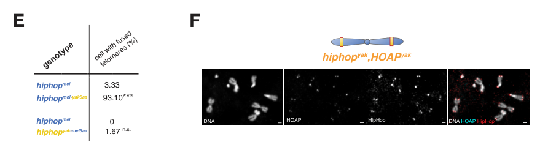

## Question

# Gene Research for Functional Annotation

## ⚠️ CRITICAL: Gene/Protein Identification Context

**BEFORE YOU BEGIN RESEARCH:** You MUST verify you are researching the CORRECT gene/protein. Gene symbols can be ambiguous, especially for less well-characterized genes from non-model organisms.

### Target Gene/Protein Identity (from UniProt):
- **UniProt Accession:** Q7JWP6
- **Protein Description:** RecName: Full=HP1-HOAP-interacting protein {ECO:0000303|PubMed:20057353};
- **Gene Information:** Name=HipHop {ECO:0000303|PubMed:20057353, ECO:0000312|FlyBase:FBgn0036815}; ORFNames=CG6874 {ECO:0000312|FlyBase:FBgn0036815};
- **Organism (full):** Drosophila melanogaster (Fruit fly).
- **Protein Family:** Not specified in UniProt
- **Key Domains:** HipHop_N. (IPR062499); HipHop (PF29689)

### MANDATORY VERIFICATION STEPS:

1. **Check if the gene symbol "HipHop" matches the protein description above**
2. **Verify the organism is correct:** Drosophila melanogaster (Fruit fly).
3. **Check if protein family/domains align with what you find in literature**
4. **If you find literature for a DIFFERENT gene with the same or similar symbol, STOP**

### If Gene Symbol is Ambiguous or You Cannot Find Relevant Literature:

**DO NOT PROCEED WITH RESEARCH ON A DIFFERENT GENE.** Instead:
- State clearly: "The gene symbol 'HipHop' is ambiguous or literature is limited for this specific protein"
- Explain what you found (e.g., "Found extensive literature on a different gene with the same symbol in a different organism")
- Describe the protein based ONLY on the UniProt information provided above
- Suggest that the protein function can be inferred from domain/family information

### Research Target:

Please provide a comprehensive research report on the gene **HipHop** (gene ID: HipHop, UniProt: Q7JWP6) in DROME.

The research report should be a detailed narrative explaining the function, biological processes, and localization of the gene product. Citations should be given for all claims.

You should prioritize authoritative reviews and primary scientific literature when conducting research. You can supplement
this with annotations you find in gene/protein databases, but these can be outdated or inaccurate.

We are specifically interested in the primary function of the gene - for enzymes, what reaction is catalyzed, and what is the substrate specificity? For transporters, what is the substrate? For structural proteins or adapters, what is the broader structural role? For signaling molecules, what is the role in the pathway.

We are interested in where in or outside the cell the gene product carries out its function.

We are also interested in the signaling or biochemical pathways in which the gene functions. We are less interested in broad pleiotropic effects, except where these elucidate the precise role.

Include evidence where possible. We are interested in both experimental evidence as well as inference from structure, evolution, or bioinformatic analysis. Precise studies should be prioritized over high-throughput, where available.

## Output

Question: You are an expert researcher providing comprehensive, well-cited information.

Provide detailed information focusing on:
1. Key concepts and definitions with current understanding
2. Recent developments and latest research (prioritize 2023-2024 sources)
3. Current applications and real-world implementations
4. Expert opinions and analysis from authoritative sources
5. Relevant statistics and data from recent studies

Format as a comprehensive research report with proper citations. Include URLs and publication dates where available.
Always prioritize recent, authoritative sources and provide specific citations for all major claims.

# Gene Research for Functional Annotation

## ⚠️ CRITICAL: Gene/Protein Identification Context

**BEFORE YOU BEGIN RESEARCH:** You MUST verify you are researching the CORRECT gene/protein. Gene symbols can be ambiguous, especially for less well-characterized genes from non-model organisms.

### Target Gene/Protein Identity (from UniProt):
- **UniProt Accession:** Q7JWP6
- **Protein Description:** RecName: Full=HP1-HOAP-interacting protein {ECO:0000303|PubMed:20057353};
- **Gene Information:** Name=HipHop {ECO:0000303|PubMed:20057353, ECO:0000312|FlyBase:FBgn0036815}; ORFNames=CG6874 {ECO:0000312|FlyBase:FBgn0036815};
- **Organism (full):** Drosophila melanogaster (Fruit fly).
- **Protein Family:** Not specified in UniProt
- **Key Domains:** HipHop_N. (IPR062499); HipHop (PF29689)

### MANDATORY VERIFICATION STEPS:

1. **Check if the gene symbol "HipHop" matches the protein description above**
2. **Verify the organism is correct:** Drosophila melanogaster (Fruit fly).
3. **Check if protein family/domains align with what you find in literature**
4. **If you find literature for a DIFFERENT gene with the same or similar symbol, STOP**

### If Gene Symbol is Ambiguous or You Cannot Find Relevant Literature:

**DO NOT PROCEED WITH RESEARCH ON A DIFFERENT GENE.** Instead:
- State clearly: "The gene symbol 'HipHop' is ambiguous or literature is limited for this specific protein"
- Explain what you found (e.g., "Found extensive literature on a different gene with the same symbol in a different organism")
- Describe the protein based ONLY on the UniProt information provided above
- Suggest that the protein function can be inferred from domain/family information

### Research Target:

Please provide a comprehensive research report on the gene **HipHop** (gene ID: HipHop, UniProt: Q7JWP6) in DROME.

The research report should be a detailed narrative explaining the function, biological processes, and localization of the gene product. Citations should be given for all claims.

You should prioritize authoritative reviews and primary scientific literature when conducting research. You can supplement
this with annotations you find in gene/protein databases, but these can be outdated or inaccurate.

We are specifically interested in the primary function of the gene - for enzymes, what reaction is catalyzed, and what is the substrate specificity? For transporters, what is the substrate? For structural proteins or adapters, what is the broader structural role? For signaling molecules, what is the role in the pathway.

We are interested in where in or outside the cell the gene product carries out its function.

We are also interested in the signaling or biochemical pathways in which the gene functions. We are less interested in broad pleiotropic effects, except where these elucidate the precise role.

Include evidence where possible. We are interested in both experimental evidence as well as inference from structure, evolution, or bioinformatic analysis. Precise studies should be prioritized over high-throughput, where available.

# Functional annotation report: *Drosophila melanogaster* HipHop

**Identity and scope.** The target is **HipHop/CG6874**, the *D. melanogaster* HP1–HOAP-interacting protein specified as **UniProt Q7JWP6** in the query—not an unrelated similarly named protein. In the original discovery study, CG6874 was isolated with HOAP and named HipHop because it associates with both HOAP and heterochromatin protein 1 (HP1). The sperm-specific telomere protein **K81 is a distinct paralog**, not another name for this gene. The supplied database assignments, HipHop_N (IPR062499) and HipHop (PF29689), fit the protein’s characterized interaction function; the domain-catalog identifiers themselves are supplied annotations, whereas experimental deletion mapping places HOAP/HP1-interaction activity within HipHop’s **first 99 amino acids**. (gao2010hiphopinteractswith pages 2-3, gao2010hiphopinteractswith pages 1-2, vedelek2015crossspeciesinteractionbetween pages 4-6, lin2024adaptiveproteincoevolution pages 11-14)

## Primary function and molecular mechanism

HipHop is best annotated as a **chromosome-end-protection protein and protein-interaction component of telomeric chromatin**, not as an enzyme, transporter, or telomerase subunit. Its primary job is to help assemble and maintain a protective cap that prevents natural chromosome ends from undergoing end-to-end fusion. In flies, telomere length is maintained through the telomeric retrotransposons **HeT-A, TART, and TAHRE**, rather than conventional telomerase-mediated repeat addition. End protection is therefore distinguishable from the mechanism that elongates the chromosome. The HipHop–HOAP-associated portion of the cap binds telomeric chromatin without requiring a particular terminal DNA sequence. (gao2010hiphopinteractswith pages 2-3, zhang2016mtvanssdna pages 1-2, chen2022thenanocut&amp;runtechnique pages 1-2)

The interaction is experimentally supported rather than inferred from a shared location: Gao and colleagues recovered CG6874 in anti-HOAP immunoprecipitates and corroborated association using reciprocal immunoprecipitation, GST pull-downs, and expression experiments in S2 cells. HipHop and HOAP also depend on one another for normal protein stability. Depleting HipHop produces abundant mitotic telomere fusions, establishing that this association matters to chromosome-end protection. On an engineered chromosome end lacking the usual telomeric retrotransposons, chromatin immunoprecipitation detected an approximately **11-kb protective protein-enriched domain**, with peak enrichment reaching **320-fold for HipHop** and **270-fold for HOAP**. This is particularly strong evidence that recognition of a natural chromosome end is not contingent on HeT-A/TART/TAHRE sequence. (gao2010hiphopinteractswith pages 2-3, gao2010hiphopinteractswith pages 1-2, gao2010hiphopinteractswith pages 5-6)

**Assembly context.** HipHop–HOAP is associated principally with the double-stranded telomeric chromatin domain. A related capping module containing **Moi, Tea, and Ver** (MTV) binds and protects single-stranded DNA *in vitro*. Loss of HOAP disrupts Tea and Ver localization, whereas loss of Tea does not substantially abolish HipHop or HOAP foci. These findings support an *upstream HipHop–HOAP chromatin-assembly role* and subsequent recruitment of Tea/MTV; they do **not** demonstrate that HipHop itself binds single-stranded DNA, or conclusively establish a native single-stranded overhang on fly telomeres. Likewise, the designation “terminin” usefully describes interacting fly capping factors but should not be taken to mean that the complete complex has been purified with a settled stoichiometry: biochemical reconstitution has demonstrated subcomplexes more securely than a complete assembly. (zhang2016mtvanssdna pages 5-6, zhang2016mtvanssdna pages 8-10, zhang2016mtvanssdna pages 10-12, vedelek2015crossspeciesinteractionbetween pages 6-8)

## Where HipHop acts

HipHop works **inside the nucleus on chromosome-associated chromatin**, predominantly at chromosome ends. Antibody staining, telomeric chromatin immunoprecipitation, and profiling of functional GFP-tagged HipHop support that localization. The 2022 peer-reviewed nanoCUT&RUN study detected HipHop broadly across HeT-A, TART, and TAHRE elements, without a strong preferred DNA-binding motif; mapped enrichment also extended into assembled subtelomeric regions. An unexpected, weaker signal in **centric heterochromatin—especially at X- and fourth-chromosome centromeres**—accords with a genetic observation that a hiphop hypomorph alters heterochromatin-dependent position-effect variegation. Centromeric occupancy is observed, but a direct centromere-protection function has **not** been demonstrated. (chen2022thenanocut&amp;runtechnique pages 5-7, chen2022thenanocut&amp;runtechnique pages 7-10, cui2021tamingactivetransposons pages 15-18, chen2022thenanocut&amp;runtechnique pages 1-2)

Loading of HipHop at ends is connected to genome-surveillance machinery: its telomeric signal is markedly reduced in **Mre11- and Nbs-deficient** cells, while an ATM mutant retains more substantial signal. These observations implicate the MRN/ATM-associated capping pathway but do not show that HipHop is itself a kinase or a direct ATM substrate. In a **2023** direct comparison after DNA-break-inducing drug treatment, HOAP showed phosphatase-sensitive phosphorylation shifts whereas HipHop did **not** show detectable phosphorylation under the tested etoposide/bleomycin conditions. (gao2010hiphopinteractswith pages 5-6, on2023telomerecappingprotein pages 4-5, on2023telomerecappingprotein pages 1-2)

## Telomeric retrotransposon regulation and developmental role

HipHop has a second, experimentally supported role in **restraining transcription of telomeric retrotransposons**. In the *hiphop*^HA hypomorph, HeT-A RNA in ovaries rose progressively, reaching approximately **40–180 times** the control level around maternal day 35. HeT-A Orf1 protein and telomeric ribonucleoprotein also accumulated, whereas a HeT-A reporter inserted away from a telomere did not show the same significant derepression. This contrast points toward regulation linked to the *telomeric chromatin location*, rather than indiscriminate repression of every HeT-A copy. Lower HP1 dosage enhanced the phenotype, supporting an HP1-related silencing mechanism; however, the measured reduction in HP1 occupancy by ChIP was **not statistically significant**, so diminished HP1 recruitment remains a plausible mechanism, not a directly established molecular step. Genetic interaction with the piRNA-associated factor Rhino also cautions against claiming complete independence from piRNA biology. (cui2021tamingactivetransposons pages 4-6, cui2021tamingactivetransposons pages 6-8, cui2021tamingactivetransposons pages 8-10)

Capping and retrotransposon control intersect but can have different thresholds. In mutant larval cells, investigators counted Orf1p foci in **more than 100 nuclei per genotype** and found significantly fewer foci with *hiphop*^HA/deficiency (**P < 0.0001**), consistent with impaired HeT-A RNP-sphere formation. An evolved mutant stock did not show runaway accumulation of telomeric copies after approximately **260 generations** despite its germline transcriptional phenotype. Together, these findings motivate a role in productive targeting or retention of retrotransposon machinery at chromosome ends; neither fewer foci nor the stock comparison, however, directly measures individual transposition events or proves that HipHop is itself the targeting receptor. (cui2021tamingactivetransposons pages 13-15, cui2021tamingactivetransposons pages 15-18)

The requirement for maternal HipHop is particularly apparent during rapid early embryonic divisions. Embryos from more severely depleted mothers develop chromosome bridges and early arrest; fusion-junction signatures were recovered in **9 of 12** tested mutant PCR clones versus **0 of 8** wild-type clones. By contrast, more than **80%** of embryos from mothers homozygous for the less severely affected hypomorph hatched after normalization to controls. These genotype-dependent outcomes explain why marked telomeric transcriptional derepression can coexist with viability while a more severe maternal capping deficit causes chromosome fusion. (cui2021tamingactivetransposons pages 10-13, cui2021tamingactivetransposons pages 18-20)

## Recent research, 2023–2024

The strongest directly HipHop-focused development identified for **2024** is a **November 2024 bioRxiv preprint**, which warrants that publication-status qualification. Researchers substituted *D. yakuba* HipHop for the native *D. melanogaster* protein in flies. The heterospecific protein accumulated at telomeres, yet native HOAP failed to localize there, and end protection failed. Substitution of **six HipHop residues** in the proposed HOAP-interaction surface was sufficient to switch the phenotype: cells with fused telomeres were reported at **3.33%** for the matched *D. melanogaster* control, **93.10%** for a *melanogaster* HipHop carrying the six *yakuba* residues, and **1.67%** for the reciprocal *yakuba* HipHop carrying the six *melanogaster* residues. Supplying matching *D. yakuba* HOAP restored recruitment, protection, and viability. The reciprocal substitutions and partner rescue make an unusually strong functional case for a **coevolved HipHop–HOAP interface**, while not amounting to a solved atomic structure. The same study links maternally supplied HipHop to establishment of protection on paternal chromosomes after the sperm-specific paralog K81 is replaced at fertilization. (lin2024adaptiveproteincoevolution pages 4-6, lin2024adaptiveproteincoevolution pages 6-9, lin2024adaptiveproteincoevolution pages 9-11, lin2024adaptiveproteincoevolution pages 11-14, lin2024adaptiveproteincoevolution media 3f04c7d1)

A **2023** study directly assayed HipHop alongside HOAP during induced DNA damage and found the detectable phosphorylation response on **HOAP, not HipHop**; this is a useful constraint on proposed signaling mechanisms, not proof that HipHop can never be modified. A separate 2023 study of **BEAF32-dependent TART regulation** provides relevant telomeric-chromatin context but should **not** be represented as a direct functional perturbation of HipHop. The peer-reviewed 2022 nanoCUT&RUN work remains particularly informative for its chromosomal localization. (on2023telomerecappingprotein pages 4-5, on2023telomerecappingprotein pages 1-2, sokolova2023theinsulatorbeaf32 pages 1-2, chen2022thenanocut&amp;runtechnique pages 1-2)

The following evidence matrix separates observations from mechanistic inferences and records study dates and links.

| Function / observation | Strongest direct experimental evidence | Interpretation and limitation | Source, publication date, DOI / URL |
|---|---|---|---|
| **Identity and HOAP-HP1 interaction** | *D. melanogaster* **CG6874** was recovered from anti-HOAP immunoprecipitates. Reciprocal immunoprecipitation, GST pull-down, and S2-cell co-expression confirmed association with HOAP and HP1. Deletion mapping placed interaction activity within the **N-terminal 99 amino acids**. HipHop depletion caused abundant mitotic telomere fusions and destabilized HOAP (gao2010hiphopinteractswith pages 2-3, gao2010hiphopinteractswith pages 1-2). | Establishes CG6874/HipHop as a non-enzymatic telomere-capping adaptor or structural component. The database designation **HipHop_N/PF29689** is consistent with the experimentally mapped N-terminal region, but it is user-supplied annotation, not an independently solved structure or demonstrated catalytic domain. | Gao *et al.*, **19 February 2010**, *EMBO Journal* 29:819-829. [doi:10.1038/emboj.2009.394](https://doi.org/10.1038/emboj.2009.394) |
| **Upstream assembly of telomere complexes; distinction from ssDNA-binding MTV** | In **HOAP/cav mutants**, Tea and Ver failed to localize normally, whereas loss of Tea did not substantially eliminate HipHop or HOAP foci. Purified Moi-Tea-Ver (**MTV**) bound sequence-independent ssDNA and protected it from exonuclease; HipHop was not shown to bind ssDNA in these assays (zhang2016mtvanssdna pages 8-10, zhang2016mtvanssdna pages 5-6, zhang2016mtvanssdna pages 6-8). | Supports a model in which HOAP-HipHop organizes duplex telomeric chromatin upstream of Tea/MTV. The demonstrated ssDNA-binding activity belongs to MTV, not HipHop. A native *Drosophila* telomeric ssDNA overhang remained unproven (zhang2016mtvanssdna pages 10-12). | Zhang *et al.*, **11 November 2016**, *PLOS Genetics* 12:e1006435. [doi:10.1371/journal.pgen.1006435](https://doi.org/10.1371/journal.pgen.1006435) |
| **Telomeric-retrotransposon silencing and HeT-A RNP targeting** | In **hiphopHA/deficiency** ovaries, HeT-A RNA rose progressively to about **40-180-fold** by approximately day 35; derepression was telomere specific. Reduced HP1/Su(var)205 or Rhino dosage enhanced derepression, but the reduction in HP1 ChIP occupancy did **not** reach statistical significance. Mutants had significantly fewer HeT-A Orf1p nuclear foci (**more than 100 nuclei per genotype; P<0.0001**), suggesting impaired HeT-A-sphere formation (cui2021tamingactivetransposons pages 4-6, cui2021tamingactivetransposons pages 8-10, cui2021tamingactivetransposons pages 15-18). | Strong evidence that HipHop helps repress telomeric elements and contributes to RNP targeting or stabilization. HP1 involvement is genetically supported, but a direct loss of HP1 occupancy was not molecularly established; reduced Orf1p foci are not direct measurements of transposition. | Cui *et al.*, **23 November 2021**, *PLOS Genetics* 17:e1009925. [doi:10.1371/journal.pgen.1009925](https://doi.org/10.1371/journal.pgen.1009925) |
| **Embryonic chromosome-end protection** | Maternal hiphop hypomorphism produced chromosome bridges, segregation defects, and fusion-PCR products: fusion signatures occurred in **9/12** hiphop-mutant clones versus **0/8** wild-type clones. Stronger maternal depletion caused extensive early arrest, whereas more than **80%** of embryos from homozygous hypomorphic mothers still hatched after normalization (cui2021tamingactivetransposons pages 10-13, cui2021tamingactivetransposons pages 18-20). | Demonstrates a particularly stringent maternal requirement for HipHop during rapid early-embryonic divisions. It also shows that telomeric-transcript derepression and complete capping failure can be partially separable phenotypes. | Cui *et al.*, **23 November 2021**, *PLOS Genetics* 17:e1009925. [doi:10.1371/journal.pgen.1009925](https://doi.org/10.1371/journal.pgen.1009925) |
| **Genome-wide localization** | GFP-targeted nanoCUT&RUN, with biological replicates, no-tag controls, and strain-specific genomic-DNA controls, detected HipHop broadly across HeT-A, TART, and TAHRE without a strong sequence motif. Enrichment extended into subtelomeric sequence and unexpectedly occurred in centric heterochromatin, especially at X- and chromosome-4 centromeres (chen2022thenanocut&amp;runtechnique pages 7-10, chen2022thenanocut&amp;runtechnique pages 5-7, chen2022thenanocut&amp;runtechnique pages 1-2). | Confirms predominantly nuclear, chromosome-end-associated localization and supports sequence-independent chromatin binding. Centromeric enrichment suggests a possible broader heterochromatin function but does not by itself prove centromeric biological activity. | Chen *et al.*, **1 September 2022**, *PLOS Genetics* 18:e1010351. [doi:10.1371/journal.pgen.1010351](https://doi.org/10.1371/journal.pgen.1010351) |
| **No detected DNA-damage-induced HipHop phosphorylation** | Phos-tag analysis of endogenous FLAG-tagged proteins after **50 micromolar etoposide** or **10 micromolar bleomycin** detected phosphatase-sensitive phosphorylation shifts for HOAP but not HipHop; HipHop migration was unchanged by treatment or phosphatase (on2023telomerecappingprotein pages 4-5, on2023telomerecappingprotein pages 1-2, on2023telomerecappingprotein pages 2-4). | Under the tested conditions, the ATM-Nbs-responsive phosphoprotein is HOAP, not HipHop. This negative result does not exclude other HipHop modifications, sites, stresses, or developmental contexts. | On, Kato, and Itoh, **2023**, *Journal of Insect Biotechnology and Sericology* 92:1-15. No DOI was verified in the available record. |
| **Coevolved HipHop-HOAP interface** | Replacing *D. melanogaster* HipHop with *D. yakuba* HipHop caused lethal telomere uncapping and loss of HOAP recruitment. Substituting only **six residues** in the HOAP-interaction surface converted fusion incidence from **3.33%** in the control to **93.10%**; the reciprocal six-residue substitution reduced it to **1.67%**. Providing *D. yakuba* HOAP restored localization, end protection, and viability (lin2024adaptiveproteincoevolution pages 4-6, lin2024adaptiveproteincoevolution pages 6-9, lin2024adaptiveproteincoevolution media 3f04c7d1). | Provides unusually precise in-vivo evidence that HipHop's primary structural function depends on a species-matched HOAP-binding interface. These findings were reported in a **November 2024 preprint** and had not undergone journal peer review at that date. | Lin, Futeran, and Levine, **11 November 2024**, bioRxiv preprint. [doi:10.1101/2024.11.11.623029](https://doi.org/10.1101/2024.11.11.623029) |

*Table: A compact evidence matrix summarizing the strongest mechanistic, localization, regulatory, and evolutionary findings for Drosophila melanogaster HipHop/CG6874 (Q7JWP6), with limitations and source dates.*

## Research uses and annotation judgment

HipHop is a **fly research model for sequence-independent telomere capping, chromosome-end establishment after fertilization, and the conflict between host chromosome protection and telomeric retrotransposons**. Experimental implementations include RNAi and maternal-genotype tests for fusion, ChIP and GFP-based nanoCUT&RUN for chromatin occupancy, assays of telomeric RNA and Orf1p foci, and cross-species gene swaps to test interaction specificity. These are research applications; the reviewed work does not establish a clinical use for HipHop. The most defensible functional annotation is **nuclear, telomere-enriched HOAP/HP1-interacting end-protection factor with a genetically supported role in telomeric-retrotransposon silencing**. Direct catalytic activity, HipHop-specific substrate chemistry, direct single-stranded-DNA binding, and a necessary centromeric function should not be added without further evidence. (gao2010hiphopinteractswith pages 2-3, cui2021tamingactivetransposons pages 8-10, zhang2016mtvanssdna pages 8-10, chen2022thenanocut&amp;runtechnique pages 1-2, lin2024adaptiveproteincoevolution pages 6-9)

### Principal sources and publication dates

- Gao *et al.* **2010**, *The EMBO Journal* 29:819–829, original identification and biochemical/capping experiments: https://doi.org/10.1038/emboj.2009.394. (gao2010hiphopinteractswith pages 2-3)
- Raffa *et al.* **2011**, *Nucleus* 2:383–391, expert synthesis of fly terminin and sequence-independent protection: https://doi.org/10.4161/nucl.2.5.17873. (raffa2011termininaprotein pages 5-6)
- Zhang *et al.* **11 November 2016**, *PLOS Genetics* 12:e1006435, Tea/MTV recruitment and purified-complex DNA-binding experiments: https://doi.org/10.1371/journal.pgen.1006435. (zhang2016mtvanssdna pages 8-10, zhang2016mtvanssdna pages 5-6)
- Cui *et al.* **23 November 2021**, *PLOS Genetics* 17:e1009925, HipHop capping and telomeric-transposon regulation: https://doi.org/10.1371/journal.pgen.1009925. (cui2021tamingactivetransposons pages 10-13, cui2021tamingactivetransposons pages 15-18)
- Chen *et al.* **1 September 2022**, *PLOS Genetics* 18:e1010351, peer-reviewed nanoCUT&RUN localization study: https://doi.org/10.1371/journal.pgen.1010351. (chen2022thenanocut&amp;runtechnique pages 1-2)
- On, Kato & Itoh **2023**, *Journal of Insect Biotechnology and Sericology* 92:1–15, HOAP versus HipHop DNA-damage phosphorylation comparison; a DOI was not verified in the available record. (on2023telomerecappingprotein pages 1-2)
- Lin, Futeran & Levine **November 2024**, **bioRxiv preprint**, HipHop–HOAP cross-species interface and rescue: https://doi.org/10.1101/2024.11.11.623029. (lin2024adaptiveproteincoevolution pages 1-4, lin2024adaptiveproteincoevolution pages 6-9)

References

1. (gao2010hiphopinteractswith pages 2-3): Guanjun Gao, Jean-Claude Walser, Michelle L Beaucher, Patrizia Morciano, Natalia Wesolowska, Jie Chen, and Yikang S Rong. Hiphop interacts with hoap and hp1 to protect drosophila telomeres in a sequence‐independent manner. The EMBO Journal, 29:819-829, Feb 2010. URL: https://doi.org/10.1038/emboj.2009.394, doi:10.1038/emboj.2009.394. This article has 113 citations.

2. (gao2010hiphopinteractswith pages 1-2): Guanjun Gao, Jean-Claude Walser, Michelle L Beaucher, Patrizia Morciano, Natalia Wesolowska, Jie Chen, and Yikang S Rong. Hiphop interacts with hoap and hp1 to protect drosophila telomeres in a sequence‐independent manner. The EMBO Journal, 29:819-829, Feb 2010. URL: https://doi.org/10.1038/emboj.2009.394, doi:10.1038/emboj.2009.394. This article has 113 citations.

3. (vedelek2015crossspeciesinteractionbetween pages 4-6): Balázs Vedelek, András Blastyák, and Imre M. Boros. Cross-species interaction between rapidly evolving telomere-specific drosophila proteins. PLoS ONE, 10:e0142771, Nov 2015. URL: https://doi.org/10.1371/journal.pone.0142771, doi:10.1371/journal.pone.0142771. This article has 9 citations and is from a peer-reviewed journal.

4. (lin2024adaptiveproteincoevolution pages 11-14): Sung-Ya Lin, Hannah Futeran, and Mia T. Levine. Adaptive protein coevolution preserves telomere integrity. bioRxiv, Nov 2024. URL: https://doi.org/10.1101/2024.11.11.623029, doi:10.1101/2024.11.11.623029. This article has 1 citations.

5. (zhang2016mtvanssdna pages 1-2): Yi Zhang, Liang Zhang, Xiaona Tang, Shilpa R. Bhardwaj, Jingyun Ji, and Yikang S. Rong. Mtv, an ssdna protecting complex essential for transposon-based telomere maintenance in drosophila. PLOS Genetics, 12:e1006435, Nov 2016. URL: https://doi.org/10.1371/journal.pgen.1006435, doi:10.1371/journal.pgen.1006435. This article has 39 citations and is from a domain leading peer-reviewed journal.

6. (chen2022thenanocut&amp;runtechnique pages 1-2): Tao Chen, Xiaolu Wei, Cécile Courret, Min Cui, Lin Cheng, Jing Wu, Kami Ahmad, Amanda M. Larracuente, and Yikang S. Rong. The nanocut&amp;run technique visualizes telomeric chromatin in drosophila. BioRxiv, Apr 2022. URL: https://doi.org/10.1101/2022.04.20.488892, doi:10.1101/2022.04.20.488892. This article has 8 citations.

7. (gao2010hiphopinteractswith pages 5-6): Guanjun Gao, Jean-Claude Walser, Michelle L Beaucher, Patrizia Morciano, Natalia Wesolowska, Jie Chen, and Yikang S Rong. Hiphop interacts with hoap and hp1 to protect drosophila telomeres in a sequence‐independent manner. The EMBO Journal, 29:819-829, Feb 2010. URL: https://doi.org/10.1038/emboj.2009.394, doi:10.1038/emboj.2009.394. This article has 113 citations.

8. (zhang2016mtvanssdna pages 5-6): Yi Zhang, Liang Zhang, Xiaona Tang, Shilpa R. Bhardwaj, Jingyun Ji, and Yikang S. Rong. Mtv, an ssdna protecting complex essential for transposon-based telomere maintenance in drosophila. PLOS Genetics, 12:e1006435, Nov 2016. URL: https://doi.org/10.1371/journal.pgen.1006435, doi:10.1371/journal.pgen.1006435. This article has 39 citations and is from a domain leading peer-reviewed journal.

9. (zhang2016mtvanssdna pages 8-10): Yi Zhang, Liang Zhang, Xiaona Tang, Shilpa R. Bhardwaj, Jingyun Ji, and Yikang S. Rong. Mtv, an ssdna protecting complex essential for transposon-based telomere maintenance in drosophila. PLOS Genetics, 12:e1006435, Nov 2016. URL: https://doi.org/10.1371/journal.pgen.1006435, doi:10.1371/journal.pgen.1006435. This article has 39 citations and is from a domain leading peer-reviewed journal.

10. (zhang2016mtvanssdna pages 10-12): Yi Zhang, Liang Zhang, Xiaona Tang, Shilpa R. Bhardwaj, Jingyun Ji, and Yikang S. Rong. Mtv, an ssdna protecting complex essential for transposon-based telomere maintenance in drosophila. PLOS Genetics, 12:e1006435, Nov 2016. URL: https://doi.org/10.1371/journal.pgen.1006435, doi:10.1371/journal.pgen.1006435. This article has 39 citations and is from a domain leading peer-reviewed journal.

11. (vedelek2015crossspeciesinteractionbetween pages 6-8): Balázs Vedelek, András Blastyák, and Imre M. Boros. Cross-species interaction between rapidly evolving telomere-specific drosophila proteins. PLoS ONE, 10:e0142771, Nov 2015. URL: https://doi.org/10.1371/journal.pone.0142771, doi:10.1371/journal.pone.0142771. This article has 9 citations and is from a peer-reviewed journal.

12. (chen2022thenanocut&amp;runtechnique pages 5-7): Tao Chen, Xiaolu Wei, Cécile Courret, Min Cui, Lin Cheng, Jing Wu, Kami Ahmad, Amanda M. Larracuente, and Yikang S. Rong. The nanocut&amp;run technique visualizes telomeric chromatin in drosophila. BioRxiv, Apr 2022. URL: https://doi.org/10.1101/2022.04.20.488892, doi:10.1101/2022.04.20.488892. This article has 8 citations.

13. (chen2022thenanocut&amp;runtechnique pages 7-10): Tao Chen, Xiaolu Wei, Cécile Courret, Min Cui, Lin Cheng, Jing Wu, Kami Ahmad, Amanda M. Larracuente, and Yikang S. Rong. The nanocut&amp;run technique visualizes telomeric chromatin in drosophila. BioRxiv, Apr 2022. URL: https://doi.org/10.1101/2022.04.20.488892, doi:10.1101/2022.04.20.488892. This article has 8 citations.

14. (cui2021tamingactivetransposons pages 15-18): Ming Cui, Yaofu Bai, Kaili Li, and Yi-Kang S. Rong. Taming active transposons at drosophila telomeres: the interconnection between hiphop’s roles in capping and transcriptional silencing. PLOS Genetics, 17:e1009925, Nov 2021. URL: https://doi.org/10.1371/journal.pgen.1009925, doi:10.1371/journal.pgen.1009925. This article has 16 citations and is from a domain leading peer-reviewed journal.

15. (on2023telomerecappingprotein pages 4-5): K On, Y Kato, and M Itoh. Telomere capping protein hoap is phosphorylated via the atm-nbs pathway following treatment with dsb inducing drugs in drosophila. Unknown journal, 2023.

16. (on2023telomerecappingprotein pages 1-2): K On, Y Kato, and M Itoh. Telomere capping protein hoap is phosphorylated via the atm-nbs pathway following treatment with dsb inducing drugs in drosophila. Unknown journal, 2023.

17. (cui2021tamingactivetransposons pages 4-6): Ming Cui, Yaofu Bai, Kaili Li, and Yi-Kang S. Rong. Taming active transposons at drosophila telomeres: the interconnection between hiphop’s roles in capping and transcriptional silencing. PLOS Genetics, 17:e1009925, Nov 2021. URL: https://doi.org/10.1371/journal.pgen.1009925, doi:10.1371/journal.pgen.1009925. This article has 16 citations and is from a domain leading peer-reviewed journal.

18. (cui2021tamingactivetransposons pages 6-8): Ming Cui, Yaofu Bai, Kaili Li, and Yi-Kang S. Rong. Taming active transposons at drosophila telomeres: the interconnection between hiphop’s roles in capping and transcriptional silencing. PLOS Genetics, 17:e1009925, Nov 2021. URL: https://doi.org/10.1371/journal.pgen.1009925, doi:10.1371/journal.pgen.1009925. This article has 16 citations and is from a domain leading peer-reviewed journal.

19. (cui2021tamingactivetransposons pages 8-10): Ming Cui, Yaofu Bai, Kaili Li, and Yi-Kang S. Rong. Taming active transposons at drosophila telomeres: the interconnection between hiphop’s roles in capping and transcriptional silencing. PLOS Genetics, 17:e1009925, Nov 2021. URL: https://doi.org/10.1371/journal.pgen.1009925, doi:10.1371/journal.pgen.1009925. This article has 16 citations and is from a domain leading peer-reviewed journal.

20. (cui2021tamingactivetransposons pages 13-15): Ming Cui, Yaofu Bai, Kaili Li, and Yi-Kang S. Rong. Taming active transposons at drosophila telomeres: the interconnection between hiphop’s roles in capping and transcriptional silencing. PLOS Genetics, 17:e1009925, Nov 2021. URL: https://doi.org/10.1371/journal.pgen.1009925, doi:10.1371/journal.pgen.1009925. This article has 16 citations and is from a domain leading peer-reviewed journal.

21. (cui2021tamingactivetransposons pages 10-13): Ming Cui, Yaofu Bai, Kaili Li, and Yi-Kang S. Rong. Taming active transposons at drosophila telomeres: the interconnection between hiphop’s roles in capping and transcriptional silencing. PLOS Genetics, 17:e1009925, Nov 2021. URL: https://doi.org/10.1371/journal.pgen.1009925, doi:10.1371/journal.pgen.1009925. This article has 16 citations and is from a domain leading peer-reviewed journal.

22. (cui2021tamingactivetransposons pages 18-20): Ming Cui, Yaofu Bai, Kaili Li, and Yi-Kang S. Rong. Taming active transposons at drosophila telomeres: the interconnection between hiphop’s roles in capping and transcriptional silencing. PLOS Genetics, 17:e1009925, Nov 2021. URL: https://doi.org/10.1371/journal.pgen.1009925, doi:10.1371/journal.pgen.1009925. This article has 16 citations and is from a domain leading peer-reviewed journal.

23. (lin2024adaptiveproteincoevolution pages 4-6): Sung-Ya Lin, Hannah Futeran, and Mia T. Levine. Adaptive protein coevolution preserves telomere integrity. bioRxiv, Nov 2024. URL: https://doi.org/10.1101/2024.11.11.623029, doi:10.1101/2024.11.11.623029. This article has 1 citations.

24. (lin2024adaptiveproteincoevolution pages 6-9): Sung-Ya Lin, Hannah Futeran, and Mia T. Levine. Adaptive protein coevolution preserves telomere integrity. bioRxiv, Nov 2024. URL: https://doi.org/10.1101/2024.11.11.623029, doi:10.1101/2024.11.11.623029. This article has 1 citations.

25. (lin2024adaptiveproteincoevolution pages 9-11): Sung-Ya Lin, Hannah Futeran, and Mia T. Levine. Adaptive protein coevolution preserves telomere integrity. bioRxiv, Nov 2024. URL: https://doi.org/10.1101/2024.11.11.623029, doi:10.1101/2024.11.11.623029. This article has 1 citations.

26. (lin2024adaptiveproteincoevolution media 3f04c7d1): Sung-Ya Lin, Hannah Futeran, and Mia T. Levine. Adaptive protein coevolution preserves telomere integrity. bioRxiv, Nov 2024. URL: https://doi.org/10.1101/2024.11.11.623029, doi:10.1101/2024.11.11.623029. This article has 1 citations.

27. (sokolova2023theinsulatorbeaf32 pages 1-2): Olesya Sokolova, Valeriya Morgunova, Tatyana V. Sizova, Pavel A. Komarov, Oxana M. Olenkina, Dmitry S. Babaev, Elena A. Mikhaleva, Dmitry A. Kwon, Maksim Erokhin, and Alla Kalmykova. The insulator beaf32 controls the spatial-temporal expression profile of the telomeric retrotransposon tart in the drosophila germline. Development, Jun 2023. URL: https://doi.org/10.1242/dev.201678, doi:10.1242/dev.201678. This article has 15 citations and is from a domain leading peer-reviewed journal.

28. (zhang2016mtvanssdna pages 6-8): Yi Zhang, Liang Zhang, Xiaona Tang, Shilpa R. Bhardwaj, Jingyun Ji, and Yikang S. Rong. Mtv, an ssdna protecting complex essential for transposon-based telomere maintenance in drosophila. PLOS Genetics, 12:e1006435, Nov 2016. URL: https://doi.org/10.1371/journal.pgen.1006435, doi:10.1371/journal.pgen.1006435. This article has 39 citations and is from a domain leading peer-reviewed journal.

29. (on2023telomerecappingprotein pages 2-4): K On, Y Kato, and M Itoh. Telomere capping protein hoap is phosphorylated via the atm-nbs pathway following treatment with dsb inducing drugs in drosophila. Unknown journal, 2023.

30. (raffa2011termininaprotein pages 5-6): Grazia D. Raffa, Laura Ciapponi, Giovanni Cenci, and Maurizio Gatti. Terminin: a protein complex that mediates epigenetic maintenance of drosophila telomeres. Nucleus, 2:383-391, Sep 2011. URL: https://doi.org/10.4161/nucl.2.5.17873, doi:10.4161/nucl.2.5.17873. This article has 107 citations and is from a peer-reviewed journal.

31. (lin2024adaptiveproteincoevolution pages 1-4): Sung-Ya Lin, Hannah Futeran, and Mia T. Levine. Adaptive protein coevolution preserves telomere integrity. bioRxiv, Nov 2024. URL: https://doi.org/10.1101/2024.11.11.623029, doi:10.1101/2024.11.11.623029. This article has 1 citations.

## Artifacts

- [Edison artifact artifact-00](HipHop-deep-research-falcon_artifacts/artifact-00.md)

## Citations

1. zhang2016mtvanssdna pages 10-12
2. gao2010hiphopinteractswith pages 2-3
3. raffa2011termininaprotein pages 5-6
4. on2023telomerecappingprotein pages 1-2
5. gao2010hiphopinteractswith pages 1-2
6. vedelek2015crossspeciesinteractionbetween pages 4-6
7. lin2024adaptiveproteincoevolution pages 11-14
8. zhang2016mtvanssdna pages 1-2
9. gao2010hiphopinteractswith pages 5-6
10. zhang2016mtvanssdna pages 5-6
11. zhang2016mtvanssdna pages 8-10
12. vedelek2015crossspeciesinteractionbetween pages 6-8
13. cui2021tamingactivetransposons pages 15-18
14. on2023telomerecappingprotein pages 4-5
15. cui2021tamingactivetransposons pages 4-6
16. cui2021tamingactivetransposons pages 6-8
17. cui2021tamingactivetransposons pages 8-10
18. cui2021tamingactivetransposons pages 13-15
19. cui2021tamingactivetransposons pages 10-13
20. cui2021tamingactivetransposons pages 18-20
21. lin2024adaptiveproteincoevolution pages 4-6
22. lin2024adaptiveproteincoevolution pages 6-9
23. lin2024adaptiveproteincoevolution pages 9-11
24. zhang2016mtvanssdna pages 6-8
25. on2023telomerecappingprotein pages 2-4
26. lin2024adaptiveproteincoevolution pages 1-4
27. doi:10.1038/emboj.2009.394
28. doi:10.1371/journal.pgen.1006435
29. doi:10.1371/journal.pgen.1009925
30. doi:10.1371/journal.pgen.1010351
31. doi:10.1101/2024.11.11.623029
32. https://doi.org/10.1038/emboj.2009.394
33. https://doi.org/10.1371/journal.pgen.1006435
34. https://doi.org/10.1371/journal.pgen.1009925
35. https://doi.org/10.1371/journal.pgen.1010351
36. https://doi.org/10.1101/2024.11.11.623029
37. https://doi.org/10.1038/emboj.2009.394.
38. https://doi.org/10.4161/nucl.2.5.17873.
39. https://doi.org/10.1371/journal.pgen.1006435.
40. https://doi.org/10.1371/journal.pgen.1009925.
41. https://doi.org/10.1371/journal.pgen.1010351.
42. https://doi.org/10.1101/2024.11.11.623029.
43. https://doi.org/10.1038/emboj.2009.394,
44. https://doi.org/10.1371/journal.pone.0142771,
45. https://doi.org/10.1101/2024.11.11.623029,
46. https://doi.org/10.1371/journal.pgen.1006435,
47. https://doi.org/10.1101/2022.04.20.488892,
48. https://doi.org/10.1371/journal.pgen.1009925,
49. https://doi.org/10.1242/dev.201678,
50. https://doi.org/10.4161/nucl.2.5.17873,