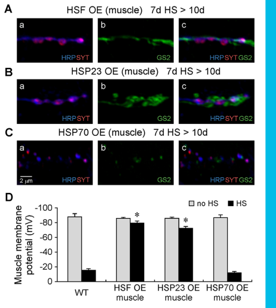

## Question

# Gene Research for Functional Annotation

## ⚠️ CRITICAL: Gene/Protein Identification Context

**BEFORE YOU BEGIN RESEARCH:** You MUST verify you are researching the CORRECT gene/protein. Gene symbols can be ambiguous, especially for less well-characterized genes from non-model organisms.

### Target Gene/Protein Identity (from UniProt):
- **UniProt Accession:** P02516
- **Protein Description:** RecName: Full=Heat shock protein 23;
- **Gene Information:** Name=Hsp23; ORFNames=CG4463;
- **Organism (full):** Drosophila melanogaster (Fruit fly).
- **Protein Family:** Belongs to the small heat shock protein (HSP20) family.
- **Key Domains:** A-crystallin/Hsp20_dom. (IPR002068); Alpha-crystallin/sHSP_animal. (IPR001436); HSP20-like_chaperone. (IPR008978); HSP20 (PF00011)

### MANDATORY VERIFICATION STEPS:

1. **Check if the gene symbol "Hsp23" matches the protein description above**
2. **Verify the organism is correct:** Drosophila melanogaster (Fruit fly).
3. **Check if protein family/domains align with what you find in literature**
4. **If you find literature for a DIFFERENT gene with the same or similar symbol, STOP**

### If Gene Symbol is Ambiguous or You Cannot Find Relevant Literature:

**DO NOT PROCEED WITH RESEARCH ON A DIFFERENT GENE.** Instead:
- State clearly: "The gene symbol 'Hsp23' is ambiguous or literature is limited for this specific protein"
- Explain what you found (e.g., "Found extensive literature on a different gene with the same symbol in a different organism")
- Describe the protein based ONLY on the UniProt information provided above
- Suggest that the protein function can be inferred from domain/family information

### Research Target:

Please provide a comprehensive research report on the gene **Hsp23** (gene ID: Hsp23, UniProt: P02516) in DROME.

The research report should be a detailed narrative explaining the function, biological processes, and localization of the gene product. Citations should be given for all claims.

You should prioritize authoritative reviews and primary scientific literature when conducting research. You can supplement
this with annotations you find in gene/protein databases, but these can be outdated or inaccurate.

We are specifically interested in the primary function of the gene - for enzymes, what reaction is catalyzed, and what is the substrate specificity? For transporters, what is the substrate? For structural proteins or adapters, what is the broader structural role? For signaling molecules, what is the role in the pathway.

We are interested in where in or outside the cell the gene product carries out its function.

We are also interested in the signaling or biochemical pathways in which the gene functions. We are less interested in broad pleiotropic effects, except where these elucidate the precise role.

Include evidence where possible. We are interested in both experimental evidence as well as inference from structure, evolution, or bioinformatic analysis. Precise studies should be prioritized over high-throughput, where available.

## Output

Question: You are an expert researcher providing comprehensive, well-cited information.

Provide detailed information focusing on:
1. Key concepts and definitions with current understanding
2. Recent developments and latest research (prioritize 2023-2024 sources)
3. Current applications and real-world implementations
4. Expert opinions and analysis from authoritative sources
5. Relevant statistics and data from recent studies

Format as a comprehensive research report with proper citations. Include URLs and publication dates where available.
Always prioritize recent, authoritative sources and provide specific citations for all major claims.

# Gene Research for Functional Annotation

## ⚠️ CRITICAL: Gene/Protein Identification Context

**BEFORE YOU BEGIN RESEARCH:** You MUST verify you are researching the CORRECT gene/protein. Gene symbols can be ambiguous, especially for less well-characterized genes from non-model organisms.

### Target Gene/Protein Identity (from UniProt):
- **UniProt Accession:** P02516
- **Protein Description:** RecName: Full=Heat shock protein 23;
- **Gene Information:** Name=Hsp23; ORFNames=CG4463;
- **Organism (full):** Drosophila melanogaster (Fruit fly).
- **Protein Family:** Belongs to the small heat shock protein (HSP20) family.
- **Key Domains:** A-crystallin/Hsp20_dom. (IPR002068); Alpha-crystallin/sHSP_animal. (IPR001436); HSP20-like_chaperone. (IPR008978); HSP20 (PF00011)

### MANDATORY VERIFICATION STEPS:

1. **Check if the gene symbol "Hsp23" matches the protein description above**
2. **Verify the organism is correct:** Drosophila melanogaster (Fruit fly).
3. **Check if protein family/domains align with what you find in literature**
4. **If you find literature for a DIFFERENT gene with the same or similar symbol, STOP**

### If Gene Symbol is Ambiguous or You Cannot Find Relevant Literature:

**DO NOT PROCEED WITH RESEARCH ON A DIFFERENT GENE.** Instead:
- State clearly: "The gene symbol 'Hsp23' is ambiguous or literature is limited for this specific protein"
- Explain what you found (e.g., "Found extensive literature on a different gene with the same symbol in a different organism")
- Describe the protein based ONLY on the UniProt information provided above
- Suggest that the protein function can be inferred from domain/family information

### Research Target:

Please provide a comprehensive research report on the gene **Hsp23** (gene ID: Hsp23, UniProt: P02516) in DROME.

The research report should be a detailed narrative explaining the function, biological processes, and localization of the gene product. Citations should be given for all claims.

You should prioritize authoritative reviews and primary scientific literature when conducting research. You can supplement
this with annotations you find in gene/protein databases, but these can be outdated or inaccurate.

We are specifically interested in the primary function of the gene - for enzymes, what reaction is catalyzed, and what is the substrate specificity? For transporters, what is the substrate? For structural proteins or adapters, what is the broader structural role? For signaling molecules, what is the role in the pathway.

We are interested in where in or outside the cell the gene product carries out its function.

We are also interested in the signaling or biochemical pathways in which the gene functions. We are less interested in broad pleiotropic effects, except where these elucidate the precise role.

Include evidence where possible. We are interested in both experimental evidence as well as inference from structure, evolution, or bioinformatic analysis. Precise studies should be prioritized over high-throughput, where available.

## Research report: Drosophila melanogaster **Hsp23** (CG4463; UniProt **P02516**) — functional annotation

### 0) Target verification (gene/protein identity)
The literature evidence used here explicitly maps **Hsp23** to **CG4463** and **UniProt P02516** in *Drosophila melanogaster*, describing it as a **cytosolic small heat shock protein (sHSP/HSP20 family)** containing the conserved **α‑crystallin domain**, consistent with the UniProt-provided identification context. (dabbaghizadeh2018structureandfunction pages 51-55, morrow2015drosophilasmallheat pages 5-8, jagla2018developmentalexpressionand pages 1-3)

### 1) Key concepts and definitions (current understanding)

#### 1.1 Small heat shock proteins (sHSPs)
Small heat shock proteins are a class of evolutionarily conserved **molecular chaperones** that are typically stress-inducible and are characterized by a conserved **~80 aa α‑crystallin domain**; a key mechanistic distinction emphasized in Drosophila-focused reviews is that sHSPs can **prevent nonspecific protein aggregation in an ATP‑independent manner**, acting as part of the proteostasis network. (jagla2018developmentalexpressionand pages 1-3)

#### 1.2 Hsp23 as an sHSP in Drosophila
In *D. melanogaster*, Hsp23 is one of the canonical sHSPs (clustered with other sHSP genes at cytological position **67B**) and is described as a ~**20.6 kDa** cytosolic protein; it belongs to the same Drosophila sHSP group that includes Hsp22, Hsp26, and Hsp27 and shares the α‑crystallin domain typical of the family. (dabbaghizadeh2018structureandfunction pages 51-55, jagla2018developmentalexpressionand pages 1-3, dabbaghizadeh2018structureandfunction pages 48-51)

### 2) Molecular function and mechanism

#### 2.1 Primary molecular function: ATP-independent chaperone/proteostasis factor
Direct functional descriptions in Drosophila sHSP reviews and developmental summaries frame Hsp23 as part of the **ATP-independent sHSP chaperone system** that buffers proteotoxic stress by limiting aggregation and helping maintain protein homeostasis, particularly during environmental stress and sensitive developmental windows. (jagla2018developmentalexpressionand pages 1-3, morrow2003heatshockproteins pages 1-2)

#### 2.2 Cytoskeletal association and morphogenesis
Beyond generic chaperoning, multiple syntheses cite evidence that Hsp23 can **bind cytoskeletal elements** (including **actin and microtubules**) and has been linked to **embryo morphogenetic processes** (e.g., ventral furrow formation) and association with microtubule-related complexes together with other sHSPs. (morrow2015drosophilasmallheat pages 5-8, dabbaghizadeh2018structureandfunction pages 55-58)

**Interpretation:** these observations support a model in which Hsp23’s chaperone-like activity is deployed in spatially organized cellular contexts (e.g., cytoskeleton-associated proteostasis), potentially stabilizing or coordinating folding/assembly of cytoskeleton-proximal proteins under stress and in development. (morrow2015drosophilasmallheat pages 5-8, kawasaki2016smallheatshock pages 5-6)

### 3) Subcellular localization (where it acts)

#### 3.1 Predominantly cytosolic/cytoplasmic
Hsp23 is reported as a **cytoplasmic/cytosolic** sHSP (in contrast to Hsp22, which is mitochondrial), consistent with its proposed roles in cytoplasmic proteostasis and cytoskeletal interactions. (dabbaghizadeh2018structureandfunction pages 51-55, dabbaghizadeh2018structureandfunction pages 55-58)

#### 3.2 CNS and synapse-associated localization
In a Drosophila neurodevelopmental study focused on synapse regulation, sHsp23 is observed in **CNS cytoplasm** and to **concentrate at NMJ synaptic boutons** together with sHsp26, and the proteins are reported/predicted to physically interact in that context. (santana2020smallheatshock pages 4-5)

#### 3.3 Perinuclear proteostasis-associated organization in muscle under heat stress
In a heat-shock-induced flight muscle degeneration model, muscle-directed Hsp23 overexpression reshapes the distribution of ubiquitinated proteins into **perinuclear ring-like puncta** and preserves the **perinuclear microtubule network** under stress, implying that Hsp23 can organize stress-associated proteostasis near the nucleus and cytoskeleton. (kawasaki2016smallheatshock pages 5-6, kawasaki2016smallheatshock media 8b569353)

### 4) Regulation and pathway context

#### 4.1 Canonical heat shock response: HSF → Hsp23
Hsp23 is described as **heat-inducible** and among strongly heat-responsive sHSP transcripts; heat shock factor (**HSF**) is reported to bind tightly to the **Hsp23 promoter** after heat stress via heat shock elements. (dabbaghizadeh2018structureandfunction pages 51-55)

#### 4.2 Oxidative stress/insulin signaling axis: dFOXO → Hsp23
A mechanistic study of oxidative-stress transcriptional control in Drosophila reports that **dFOXO directly targets multiple sHSP promoters including Hsp23**, and that inducible sHSPs are activated when dFOXO activity rises during oxidative stress, positioning Hsp23 at the intersection of oxidative stress and proteostasis regulation. (Donovan & Marr, *J Biol Chem*, **Sep 2016**, https://doi.org/10.1074/jbc.m116.723049) (donovan2016dfoxoactivateslarge pages 2-3)

#### 4.3 Developmental hormone regulation and chromatin features
Drosophila developmental reviews indicate that sHSP promoters (including Hsp23) are maintained in an **active chromatin state** enabling both HSF-dependent and HSF-independent expression, and that **ecdysone** can regulate ovarian and larval/prepupal sHSP expression through elements distinct from classical heat shock elements; GA repeat features (binding GAGA factors) are highlighted as a general promoter property. (Jagla et al., *Int J Mol Sci*, **Nov 2018**, https://doi.org/10.3390/ijms19113441) (jagla2018developmentalexpressionand pages 1-3)

### 5) Biological roles: development, stress tolerance, and aging

#### 5.1 Developmental/tissue expression
Multiple sources describe Hsp23 as developmentally regulated and tissue-specific. Zygotic expression is reported to begin at **embryonic stage 11** and be restricted to the **CNS**, including specific neuronal/glial lineages (MP2 neurons, VUM cells, dorsal midline glia). (Morrow & Tanguay, *Semin Cell Dev Biol*, **Oct 2003**, https://doi.org/10.1016/j.semcdb.2003.09.023) (morrow2003heatshockproteins pages 1-2)

Transcriptome-based summaries also highlight high Hsp23 transcript levels in **early embryos (4–6 h AEL)** and **testis**, and high to extremely high transcription in the **CNS**. (jagla2018developmentalexpressionand pages 1-3)

#### 5.2 Germline/ovary isoforms and maternal effects
Hsp23 is reported to exist in at least two isoforms in ovaries: a native form (Hsp23a) present without stress and a more acidic form (Hsp23b) induced by heat shock; developmental review evidence further indicates that **maternal loading/overexpression of Hsp23 in oocytes increases thermal tolerance of offspring embryos** and improves larval performance, supporting a direct thermoprotective function during early development. (jagla2018developmentalexpressionand pages 3-6)

#### 5.3 Aging-associated induction
Hsp23 is described as upregulated with aging (in particular in thoraces/abdomen), with one synthesis reporting induction **up to ~5-fold** in those tissues. (dabbaghizadeh2018structureandfunction pages 55-58)

### 6) Perturbation phenotypes and functional studies (experimental evidence)

#### 6.1 Flight muscle proteostasis and degeneration protection (heat stress model)
A primary experimental study developed a Drosophila model of heat-shock-stress-induced flight motor degeneration and showed that heat stress causes a prominent failure of flight muscle proteostasis, including increased ubiquitin-positive aggregates; in this system:

* **Muscle-specific Hsp23 overexpression** protects flight muscle and also provides **cell-nonautonomous protection** of motor neurons and glia after heat stress, whereas **Hsp70 overexpression does not** protect in the same paradigm. (Kawasaki et al., *Dis Model Mech*, **Sep 2016**, https://doi.org/10.1242/dmm.026385) (kawasaki2016smallheatshock pages 4-5)
* Hsp23 overexpression is associated with **organized perinuclear ubiquitin puncta** and preservation of the **microtubule cytoskeleton** following heat shock, supporting a mechanistic link between Hsp23 and stress-resilient proteostasis/cytoskeletal integrity. (kawasaki2016smallheatshock pages 5-6, kawasaki2016smallheatshock media 8b569353)

**Statistics/data reported in the study excerpt:** group sizes are explicitly given for key comparisons (e.g., WT no-HS n=10, HS n=10; Hsp23 OE no-HS n=6, HS n=8; Hsp70 OE no-HS n=7, HS n=8), with significance threshold reported as **P≤0.01** for relevant comparisons. (kawasaki2016smallheatshock pages 4-5)

#### 6.2 Synapse number and neuronal activity (developmental context)
In motor neurons, sHsp23 overexpression is reported to **reduce synapse number** (as quantified by active zones per NMJ) and is interpreted as **not required for synapse formation**, but detrimental in excess, suggesting dosage sensitivity and a role in tuning synapse development/neuronal activity. (Santana et al., *PLOS ONE*, **May 2020**, https://doi.org/10.1371/journal.pone.0233231) (santana2020smallheatshock pages 4-5)

#### 6.3 Loss-of-function/essentiality and redundancy
Review-level synthesis suggests that elimination/loss of Hsp23 often produces **no obvious deleterious developmental phenotype under standard laboratory conditions**, consistent with redundancy among sHSPs; however, other syntheses cite that preventing Hsp23 expression can reduce lifespan and impair stress resistance, indicating context dependence (environmental conditions, tissue specificity, genetic background). (morrow2015drosophilasmallheat pages 5-8, dabbaghizadeh2018structureandfunction pages 51-55)

### 7) Recent developments and latest research (2023–2024 prioritized)

#### 7.1 2023: pharmacologic TOR pathway modulation alters Hsp23 among chaperones in fly CNS
A 2023 transcriptomic analysis of Torin-2 (TORC1/2 inhibitor) effects in Drosophila heads reports that “protein folding (heat shock proteins)” pathways are altered and lists **Hsp23** among heat shock proteins/chaperones affected in the CNS transcriptional response. (Vershinina et al., *Int J Mol Sci*, **May 2023**, https://doi.org/10.3390/ijms24109095) (kawasaki2016smallheatshock media 530d147d)

**Interpretation:** while not Hsp23-specific mechanistic work, this links Hsp23 transcriptional modulation to nutrient-sensing/geroprotective pharmacology contexts and supports ongoing use of Hsp23 as a stress/proteostasis-responsive node in systems-level studies. (kawasaki2016smallheatshock media 530d147d)

#### 7.2 2024: nuclear/cytoskeletal factors modulate heat shock gene expression including Hsp23 (metadata-level)
A 2024 study on Moesin–Mediator complex interactions reports effects on expression of heat shock genes including **Hsp23** (from retrieved metadata/snippet), pointing to continued refinement of the transcriptional machinery controlling Hsp genes beyond HSF itself. (Kristó et al., *Open Biology*, **Oct 2024**, https://doi.org/10.1098/rsob.240110) (kawasaki2016smallheatshock media 530d147d)

**Limitation:** Full quantitative details for Hsp23 changes in this 2024 paper were not extractable from the available evidence snippets in this run, so no numeric claim is made here. (kawasaki2016smallheatshock media 530d147d)

### 8) Current applications and real-world implementations

1. **Stress physiology and degeneration models in Drosophila**: Hsp23 is actively used as a manipulable effector in **environmental stress–induced muscle degeneration** paradigms to dissect proteostasis, tissue vulnerability, and cell-nonautonomous protection mechanisms. (kawasaki2016smallheatshock pages 4-5)
2. **Developmental neurobiology**: Hsp23 is used as a factor influencing synapse development/activity, with overexpression and knockdown strategies in motor neurons as an implementation of functional annotation at the organismal NMJ. (santana2020smallheatshock pages 4-5)
3. **Developmental thermotolerance engineering (maternal effects)**: manipulating Hsp23 in the female germline/oocytes provides a functional route to test embryo thermoprotection, relevant to adaptation to thermal extremes. (jagla2018developmentalexpressionand pages 3-6)
4. **Aging/proteostasis biomarkers**: Hsp23’s age-associated upregulation supports its use as a marker/readout in studies connecting aging, stress responses, and proteostasis systems. (dabbaghizadeh2018structureandfunction pages 55-58, morrow2003heatshockproteins pages 1-2)

### 9) Expert opinions and authoritative synthesis (interpretive analysis)

Authoritative Drosophila-focused reviews emphasize that the Drosophila sHSPs (including Hsp23) are not only acute heat-shock responders but also show **distinct developmental programs** and **tissue specificity**, supporting the modern view that sHSPs are deployed for **developmental robustness** as well as stress survival. (morrow2015drosophilasmallheat pages 5-8, jagla2018developmentalexpressionand pages 1-3)

Mechanistic integration supported by the evidence indicates that Hsp23 lies at an intersection of:
* canonical heat-shock transcription (**HSF**) (dabbaghizadeh2018structureandfunction pages 51-55),
* oxidative stress/insulin signaling (**dFOXO**) (donovan2016dfoxoactivateslarge pages 2-3), and
* developmental endocrine regulation (**ecdysone**) with chromatin-based promoter priming (jagla2018developmentalexpressionand pages 1-3),
consistent with a role as a context-dependent cytosolic proteostasis factor deployed across stress and development. (jagla2018developmentalexpressionand pages 1-3)

### 10) Key statistics and data points (from retrieved sources)
* **Protein size/localization:** Hsp23 is reported as ~**20.6 kDa** and **cytosolic**. (dabbaghizadeh2018structureandfunction pages 51-55)
* **Aging induction:** a synthesis reports age-associated induction **up to ~5-fold** in thorax/abdomen. (dabbaghizadeh2018structureandfunction pages 55-58)
* **Heat-stress degeneration model sample sizes:** WT no-HS **n=10**, HS **n=10**; HSF OE no-HS **n=6**, HS **n=6**; Hsp23 OE no-HS **n=6**, HS **n=8**; Hsp70 OE no-HS **n=7**, HS **n=8**; with **P≤0.01** criteria reported for key effects. (kawasaki2016smallheatshock pages 4-5)

### 11) Visual evidence from primary literature (figures)
Cropped figure regions from Kawasaki et al. show that muscle-specific Hsp23 overexpression preserves neuromuscular structure/function and reorganizes ubiquitinated proteins while maintaining microtubule integrity after heat shock. (kawasaki2016smallheatshock media 8b569353, kawasaki2016smallheatshock media 530d147d, kawasaki2016smallheatshock media f1945a67)

### 12) Evidence summary table
| Aspect | Key findings | Best supporting sources |
|---|---|---|
| identity/domains | - Verified target is **Drosophila melanogaster Hsp23 = CG4463 = UniProt P02516**.  - Member of the **small heat shock protein (sHSP/HSP20) family** with the conserved **α-crystallin domain**; Drosophila encodes 12 sHsps, with Hsp23 among the canonical clustered genes at **67B**.  - Reported size is ~**20.6 kDa** and Hsp23 is described as a **cytosolic** sHSP. | Jagla et al., 2018, https://doi.org/10.3390/ijms19113441 (jagla2018developmentalexpressionand pages 1-3); Morrow & Tanguay, 2015, https://doi.org/10.1007/978-3-319-16077-1_25 (morrow2015drosophilasmallheat pages 5-8); Dabbaghizadeh, 2018 (dabbaghizadeh2018structureandfunction pages 51-55, dabbaghizadeh2018structureandfunction pages 48-51) |
| molecular function | - As an sHSP, Hsp23 is inferred to act as an **ATP-independent molecular chaperone** that helps prevent nonspecific protein aggregation.  - Hsp23 is implicated in **proteostasis maintenance** during environmental stress and in development.  - Additional evidence links Hsp23 to **cytoskeletal interactions** with **actin and microtubules**, consistent with roles in morphogenesis and structural protection. | Jagla et al., 2018, https://doi.org/10.3390/ijms19113441 (jagla2018developmentalexpressionand pages 1-3); Morrow & Tanguay, 2015, https://doi.org/10.1007/978-3-319-16077-1_25 (morrow2015drosophilasmallheat pages 5-8); Dabbaghizadeh, 2018 (dabbaghizadeh2018structureandfunction pages 55-58) |
| localization | - Hsp23 is reported as primarily **cytoplasmic/cytosolic** rather than mitochondrial.  - In the nervous system study, sHsp23 localizes in **CNS cytoplasm** and is enriched at **NMJ synaptic boutons** with sHsp26.  - In stressed flight muscle, HSP23 overexpression reorganizes ubiquitin-positive material into **perinuclear ring-like puncta** and is associated with preservation of the **microtubule network**. | Dabbaghizadeh, 2018 (dabbaghizadeh2018structureandfunction pages 51-55, dabbaghizadeh2018structureandfunction pages 55-58); Santana et al., 2020, https://doi.org/10.1371/journal.pone.0233231 (santana2020smallheatshock pages 4-5); Kawasaki et al., 2016, https://doi.org/10.1242/dmm.026385 (kawasaki2016smallheatshock pages 5-6, kawasaki2016smallheatshock media 8b569353) |
| regulation | - **HSF** binds the **Hsp23 promoter** after heat stress; Hsp23 is strongly **heat inducible** and also reported as **cold inducible**.  - **dFOXO** directly targets inducible sHSP genes including **Hsp23** during **oxidative stress**, placing Hsp23 in FOXO-linked proteostasis control.  - Hsp23 expression can also be induced by **ecdysone**, and sHsp promoters remain in an active chromatin state permitting **HSF-dependent and HSF-independent** transcription. | Donovan & Marr, 2016, https://doi.org/10.1074/jbc.m116.723049 (donovan2016dfoxoactivateslarge pages 2-3); Jagla et al., 2018, https://doi.org/10.3390/ijms19113441 (jagla2018developmentalexpressionand pages 1-3); Dabbaghizadeh, 2018 (dabbaghizadeh2018structureandfunction pages 51-55, dabbaghizadeh2018structureandfunction pages 55-58) |
| developmental/tissue expression | - Hsp23 is developmentally regulated and maternally relevant; **zygotic expression begins at embryonic stage 11** and is restricted to the **CNS**, including **MP2 neurons**, **VUM cells** and later **dorsal midline glia**.  - High expression is reported in **early embryos (4–6 h AEL)**, **testis**, and broadly in the **CNS**; expression is also seen in **germline, nervous system, muscle/heart**, and adult **gonads/brain**.  - In ovaries, at least two isoforms are described: **Hsp23a** present without stress and more acidic **Hsp23b** induced by heat shock. | Morrow & Tanguay, 2003, https://doi.org/10.1016/j.semcdb.2003.09.023 (morrow2003heatshockproteins pages 1-2); Jagla et al., 2018, https://doi.org/10.3390/ijms19113441 (jagla2018developmentalexpressionand pages 3-6, jagla2018developmentalexpressionand pages 1-3); Morrow & Tanguay, 2015, https://doi.org/10.1007/978-3-319-16077-1_25 (morrow2015drosophilasmallheat pages 5-8) |
| phenotypes/functional studies | - **Muscle-specific HSP23 overexpression** protects against **heat-shock-induced degeneration** of the flight motor, with both **cell-autonomous muscle protection** and **cell-nonautonomous protection** of neurons and glia; **HSP70 overexpression did not protect** in the same assay.  - HSP23 overexpression preserves muscle **proteostasis**, promotes clearance/reorganization of ubiquitinated aggregates, and protects the **microtubule cytoskeleton** after heat shock.  - In developing motor neurons, **excess sHsp23 reduces synapse number**, suggesting dosage-sensitive effects; maternal loading/overexpression of Hsp23 in oocytes improves **embryo thermal tolerance** and later larval performance. | Kawasaki et al., 2016, https://doi.org/10.1242/dmm.026385 (kawasaki2016smallheatshock pages 5-6, kawasaki2016smallheatshock pages 4-5, kawasaki2016smallheatshock media 8b569353); Santana et al., 2020, https://doi.org/10.1371/journal.pone.0233231 (santana2020smallheatshock pages 4-5, santana2020smallheatshock pages 2-4); Jagla et al., 2018, https://doi.org/10.3390/ijms19113441 (jagla2018developmentalexpressionand pages 3-6) |
| quantitative data | - Hsp23 is reported to increase with age, including **up to ~5-fold** in **thoraces/abdomen** in one synthesis.  - Experimental sample sizes for the flight-muscle protection assay included WT **n=10/10** (no HS/HS), HSF OE **n=6/6**, HSP23 OE **n=6/8**, and HSP70 OE **n=7/8**; protection reached **P≤0.01** in the cited analysis.  - Figure-based evidence shows preserved **muscle membrane potential**, protected **neuromuscular synapses**, organized **ubiquitin puncta**, and preserved **microtubules** with HSP23 OE after HS, although exact numeric values were not extracted from the available context. | Dabbaghizadeh, 2018 (dabbaghizadeh2018structureandfunction pages 55-58); Kawasaki et al., 2016, https://doi.org/10.1242/dmm.026385 (kawasaki2016smallheatshock pages 5-6, kawasaki2016smallheatshock pages 4-5, kawasaki2016smallheatshock media 8b569353) |

*Table: This table summarizes evidence-based functional annotation for Drosophila melanogaster Hsp23 (CG4463; UniProt P02516), including identity, regulation, localization, developmental expression, and phenotype data. It is designed as a compact reference using only claims supported by the cited evidence IDs.*

### 13) Gaps and recommendations for further annotation work
1. **Direct biochemical chaperone assays for Hsp23 specifically** (e.g., defined client proteins, oligomeric states, and quantitative anti-aggregation assays) were not present in the retrieved evidence snippets; the ATP-independent chaperone role is supported at the family level and by in vivo proteostasis phenotypes. (jagla2018developmentalexpressionand pages 1-3, kawasaki2016smallheatshock pages 5-6)
2. **2023–2024 Hsp23-specific mechanistic papers** in *D. melanogaster* were limited in the retrieved corpus; the newest accessible items were systems-level transcriptomics (2023) and heat shock gene regulation machinery (2024) without extractable numeric Hsp23 effects from snippets. (kawasaki2016smallheatshock media 530d147d)

### References (URLs and publication dates)
- Morrow G, Tanguay RM. *Heat shock proteins and aging in Drosophila melanogaster.* **Oct 2003**. https://doi.org/10.1016/j.semcdb.2003.09.023 (morrow2003heatshockproteins pages 1-2)
- Morrow G, Tanguay RM. *Drosophila Small Heat Shock Proteins: An Update on Their Features and Functions.* **Jan 2015**. https://doi.org/10.1007/978-3-319-16077-1_25 (morrow2015drosophilasmallheat pages 5-8)
- Donovan MR, Marr MT. *dFOXO Activates Large and Small Heat Shock Protein Genes in Response to Oxidative Stress to Maintain Proteostasis in Drosophila.* **Sep 2016**. https://doi.org/10.1074/jbc.m116.723049 (donovan2016dfoxoactivateslarge pages 2-3)
- Kawasaki F, et al. *Small heat shock proteins mediate cell-autonomous and -nonautonomous protection in a Drosophila model for environmental-stress-induced degeneration.* **Sep 2016**. https://doi.org/10.1242/dmm.026385 (kawasaki2016smallheatshock pages 5-6, kawasaki2016smallheatshock pages 4-5)
- Jagla T, et al. *Developmental expression and functions of the small heat shock proteins in Drosophila.* **Nov 2018**. https://doi.org/10.3390/ijms19113441 (jagla2018developmentalexpressionand pages 3-6, jagla2018developmentalexpressionand pages 1-3)
- Santana E, et al. *Small heat shock proteins determine synapse number and neuronal activity during development.* **May 2020**. https://doi.org/10.1371/journal.pone.0233231 (santana2020smallheatshock pages 4-5, santana2020smallheatshock pages 2-4)
- Vershinina YS, et al. *Transcriptomic Analysis of the Effect of Torin-2 on the Central Nervous System of Drosophila melanogaster.* **May 2023**. https://doi.org/10.3390/ijms24109095 (kawasaki2016smallheatshock media 530d147d)
- Kristó I, et al. *Moesin contributes to heat shock gene response through direct binding to the Med15 subunit of the Mediator complex in the nucleus.* **Oct 2024**. https://doi.org/10.1098/rsob.240110 (kawasaki2016smallheatshock media 530d147d)

References

1. (dabbaghizadeh2018structureandfunction pages 51-55): A Dabbaghizadeh. Structure and function of mitochondrial small heat shock protein 22 in drosophila melanogaster. Unknown journal, 2018.

2. (morrow2015drosophilasmallheat pages 5-8): Geneviève Morrow and Robert M. Tanguay. Drosophila small heat shock proteins: an update on their features and functions. ArXiv, pages 579-606, Jan 2015. URL: https://doi.org/10.1007/978-3-319-16077-1\_25, doi:10.1007/978-3-319-16077-1\_25. This article has 37 citations.

3. (jagla2018developmentalexpressionand pages 1-3): Teresa Jagla, Magda Dubińska-Magiera, Preethi Poovathumkadavil, Małgorzata Daczewska, and Krzysztof Jagla. Developmental expression and functions of the small heat shock proteins in drosophila. International Journal of Molecular Sciences, 19:3441, Nov 2018. URL: https://doi.org/10.3390/ijms19113441, doi:10.3390/ijms19113441. This article has 54 citations.

4. (dabbaghizadeh2018structureandfunction pages 48-51): A Dabbaghizadeh. Structure and function of mitochondrial small heat shock protein 22 in drosophila melanogaster. Unknown journal, 2018.

5. (morrow2003heatshockproteins pages 1-2): Geneviève Morrow and Robert M. Tanguay. Heat shock proteins and aging in drosophila melanogaster. Seminars in cell & developmental biology, 14 5:291-9, Oct 2003. URL: https://doi.org/10.1016/j.semcdb.2003.09.023, doi:10.1016/j.semcdb.2003.09.023. This article has 136 citations and is from a peer-reviewed journal.

6. (dabbaghizadeh2018structureandfunction pages 55-58): A Dabbaghizadeh. Structure and function of mitochondrial small heat shock protein 22 in drosophila melanogaster. Unknown journal, 2018.

7. (kawasaki2016smallheatshock pages 5-6): Fumiko Kawasaki, Noelle L. Koonce, Linda Guo, Shahroz Fatima, Catherine Qiu, Mackenzie T. Moon, Yunzhen Zheng, and Richard W. Ordway. Small heat shock proteins mediate cell-autonomous and -nonautonomous protection in a drosophila model for environmental-stress-induced degeneration. Disease Models & Mechanisms, 9:953-964, Sep 2016. URL: https://doi.org/10.1242/dmm.026385, doi:10.1242/dmm.026385. This article has 30 citations and is from a domain leading peer-reviewed journal.

8. (santana2020smallheatshock pages 4-5): Elena Santana, Teresa de los Reyes, and Sergio Casas-Tintó. Small heat shock proteins determine synapse number and neuronal activity during development. PLOS ONE, 15:e0233231, May 2020. URL: https://doi.org/10.1371/journal.pone.0233231, doi:10.1371/journal.pone.0233231. This article has 23 citations and is from a peer-reviewed journal.

9. (kawasaki2016smallheatshock media 8b569353): Fumiko Kawasaki, Noelle L. Koonce, Linda Guo, Shahroz Fatima, Catherine Qiu, Mackenzie T. Moon, Yunzhen Zheng, and Richard W. Ordway. Small heat shock proteins mediate cell-autonomous and -nonautonomous protection in a drosophila model for environmental-stress-induced degeneration. Disease Models & Mechanisms, 9:953-964, Sep 2016. URL: https://doi.org/10.1242/dmm.026385, doi:10.1242/dmm.026385. This article has 30 citations and is from a domain leading peer-reviewed journal.

10. (donovan2016dfoxoactivateslarge pages 2-3): Marissa R. Donovan and Michael T. Marr. Dfoxo activates large and small heat shock protein genes in response to oxidative stress to maintain proteostasis in drosophila. Journal of Biological Chemistry, 291:19042-19050, Sep 2016. URL: https://doi.org/10.1074/jbc.m116.723049, doi:10.1074/jbc.m116.723049. This article has 52 citations and is from a domain leading peer-reviewed journal.

11. (jagla2018developmentalexpressionand pages 3-6): Teresa Jagla, Magda Dubińska-Magiera, Preethi Poovathumkadavil, Małgorzata Daczewska, and Krzysztof Jagla. Developmental expression and functions of the small heat shock proteins in drosophila. International Journal of Molecular Sciences, 19:3441, Nov 2018. URL: https://doi.org/10.3390/ijms19113441, doi:10.3390/ijms19113441. This article has 54 citations.

12. (kawasaki2016smallheatshock pages 4-5): Fumiko Kawasaki, Noelle L. Koonce, Linda Guo, Shahroz Fatima, Catherine Qiu, Mackenzie T. Moon, Yunzhen Zheng, and Richard W. Ordway. Small heat shock proteins mediate cell-autonomous and -nonautonomous protection in a drosophila model for environmental-stress-induced degeneration. Disease Models & Mechanisms, 9:953-964, Sep 2016. URL: https://doi.org/10.1242/dmm.026385, doi:10.1242/dmm.026385. This article has 30 citations and is from a domain leading peer-reviewed journal.

13. (kawasaki2016smallheatshock media 530d147d): Fumiko Kawasaki, Noelle L. Koonce, Linda Guo, Shahroz Fatima, Catherine Qiu, Mackenzie T. Moon, Yunzhen Zheng, and Richard W. Ordway. Small heat shock proteins mediate cell-autonomous and -nonautonomous protection in a drosophila model for environmental-stress-induced degeneration. Disease Models & Mechanisms, 9:953-964, Sep 2016. URL: https://doi.org/10.1242/dmm.026385, doi:10.1242/dmm.026385. This article has 30 citations and is from a domain leading peer-reviewed journal.

14. (kawasaki2016smallheatshock media f1945a67): Fumiko Kawasaki, Noelle L. Koonce, Linda Guo, Shahroz Fatima, Catherine Qiu, Mackenzie T. Moon, Yunzhen Zheng, and Richard W. Ordway. Small heat shock proteins mediate cell-autonomous and -nonautonomous protection in a drosophila model for environmental-stress-induced degeneration. Disease Models & Mechanisms, 9:953-964, Sep 2016. URL: https://doi.org/10.1242/dmm.026385, doi:10.1242/dmm.026385. This article has 30 citations and is from a domain leading peer-reviewed journal.

15. (santana2020smallheatshock pages 2-4): Elena Santana, Teresa de los Reyes, and Sergio Casas-Tintó. Small heat shock proteins determine synapse number and neuronal activity during development. PLOS ONE, 15:e0233231, May 2020. URL: https://doi.org/10.1371/journal.pone.0233231, doi:10.1371/journal.pone.0233231. This article has 23 citations and is from a peer-reviewed journal.

## Artifacts

- [Edison artifact artifact-00](Hsp23-deep-research-falcon_artifacts/artifact-00.md)

## Citations

1. jagla2018developmentalexpressionand pages 1-3
2. santana2020smallheatshock pages 4-5
3. dabbaghizadeh2018structureandfunction pages 51-55
4. donovan2016dfoxoactivateslarge pages 2-3
5. morrow2003heatshockproteins pages 1-2
6. jagla2018developmentalexpressionand pages 3-6
7. dabbaghizadeh2018structureandfunction pages 55-58
8. kawasaki2016smallheatshock pages 4-5
9. morrow2015drosophilasmallheat pages 5-8
10. dabbaghizadeh2018structureandfunction pages 48-51
11. kawasaki2016smallheatshock pages 5-6
12. santana2020smallheatshock pages 2-4
13. https://doi.org/10.1074/jbc.m116.723049
14. https://doi.org/10.3390/ijms19113441
15. https://doi.org/10.1016/j.semcdb.2003.09.023
16. https://doi.org/10.1242/dmm.026385
17. https://doi.org/10.1371/journal.pone.0233231
18. https://doi.org/10.3390/ijms24109095
19. https://doi.org/10.1098/rsob.240110
20. https://doi.org/10.1007/978-3-319-16077-1_25
21. https://doi.org/10.1007/978-3-319-16077-1\_25,
22. https://doi.org/10.3390/ijms19113441,
23. https://doi.org/10.1016/j.semcdb.2003.09.023,
24. https://doi.org/10.1242/dmm.026385,
25. https://doi.org/10.1371/journal.pone.0233231,
26. https://doi.org/10.1074/jbc.m116.723049,