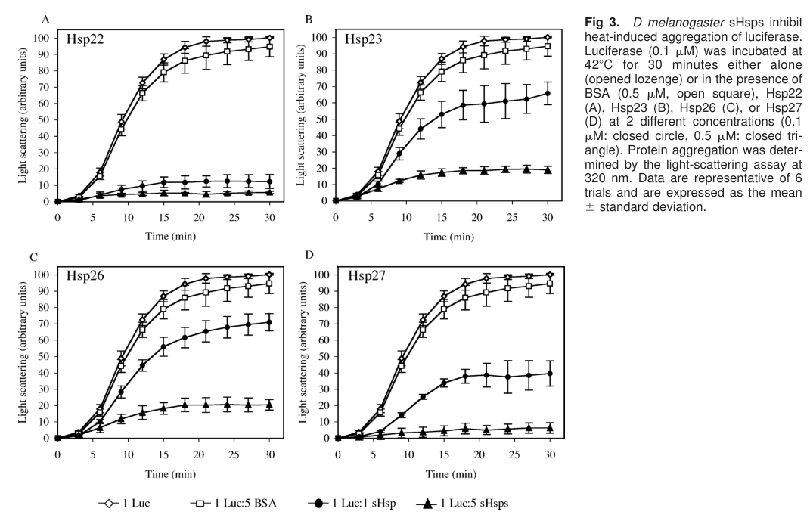

## Question

# Gene Research for Functional Annotation

## ⚠️ CRITICAL: Gene/Protein Identification Context

**BEFORE YOU BEGIN RESEARCH:** You MUST verify you are researching the CORRECT gene/protein. Gene symbols can be ambiguous, especially for less well-characterized genes from non-model organisms.

### Target Gene/Protein Identity (from UniProt):
- **UniProt Accession:** P02517
- **Protein Description:** RecName: Full=Heat shock protein 26;
- **Gene Information:** Name=Hsp26; ORFNames=CG4183;
- **Organism (full):** Drosophila melanogaster (Fruit fly).
- **Protein Family:** Belongs to the small heat shock protein (HSP20) family.
- **Key Domains:** A-crystallin/Hsp20_dom. (IPR002068); Alpha-crystallin/sHSP_animal. (IPR001436); HSP20-like_chaperone. (IPR008978); HSP20 (PF00011)

### MANDATORY VERIFICATION STEPS:

1. **Check if the gene symbol "Hsp26" matches the protein description above**
2. **Verify the organism is correct:** Drosophila melanogaster (Fruit fly).
3. **Check if protein family/domains align with what you find in literature**
4. **If you find literature for a DIFFERENT gene with the same or similar symbol, STOP**

### If Gene Symbol is Ambiguous or You Cannot Find Relevant Literature:

**DO NOT PROCEED WITH RESEARCH ON A DIFFERENT GENE.** Instead:
- State clearly: "The gene symbol 'Hsp26' is ambiguous or literature is limited for this specific protein"
- Explain what you found (e.g., "Found extensive literature on a different gene with the same symbol in a different organism")
- Describe the protein based ONLY on the UniProt information provided above
- Suggest that the protein function can be inferred from domain/family information

### Research Target:

Please provide a comprehensive research report on the gene **Hsp26** (gene ID: Hsp26, UniProt: P02517) in DROME.

The research report should be a detailed narrative explaining the function, biological processes, and localization of the gene product. Citations should be given for all claims.

You should prioritize authoritative reviews and primary scientific literature when conducting research. You can supplement
this with annotations you find in gene/protein databases, but these can be outdated or inaccurate.

We are specifically interested in the primary function of the gene - for enzymes, what reaction is catalyzed, and what is the substrate specificity? For transporters, what is the substrate? For structural proteins or adapters, what is the broader structural role? For signaling molecules, what is the role in the pathway.

We are interested in where in or outside the cell the gene product carries out its function.

We are also interested in the signaling or biochemical pathways in which the gene functions. We are less interested in broad pleiotropic effects, except where these elucidate the precise role.

Include evidence where possible. We are interested in both experimental evidence as well as inference from structure, evolution, or bioinformatic analysis. Precise studies should be prioritized over high-throughput, where available.

## Output

Question: You are an expert researcher providing comprehensive, well-cited information.

Provide detailed information focusing on:
1. Key concepts and definitions with current understanding
2. Recent developments and latest research (prioritize 2023-2024 sources)
3. Current applications and real-world implementations
4. Expert opinions and analysis from authoritative sources
5. Relevant statistics and data from recent studies

Format as a comprehensive research report with proper citations. Include URLs and publication dates where available.
Always prioritize recent, authoritative sources and provide specific citations for all major claims.

# Gene Research for Functional Annotation

## ⚠️ CRITICAL: Gene/Protein Identification Context

**BEFORE YOU BEGIN RESEARCH:** You MUST verify you are researching the CORRECT gene/protein. Gene symbols can be ambiguous, especially for less well-characterized genes from non-model organisms.

### Target Gene/Protein Identity (from UniProt):
- **UniProt Accession:** P02517
- **Protein Description:** RecName: Full=Heat shock protein 26;
- **Gene Information:** Name=Hsp26; ORFNames=CG4183;
- **Organism (full):** Drosophila melanogaster (Fruit fly).
- **Protein Family:** Belongs to the small heat shock protein (HSP20) family.
- **Key Domains:** A-crystallin/Hsp20_dom. (IPR002068); Alpha-crystallin/sHSP_animal. (IPR001436); HSP20-like_chaperone. (IPR008978); HSP20 (PF00011)

### MANDATORY VERIFICATION STEPS:

1. **Check if the gene symbol "Hsp26" matches the protein description above**
2. **Verify the organism is correct:** Drosophila melanogaster (Fruit fly).
3. **Check if protein family/domains align with what you find in literature**
4. **If you find literature for a DIFFERENT gene with the same or similar symbol, STOP**

### If Gene Symbol is Ambiguous or You Cannot Find Relevant Literature:

**DO NOT PROCEED WITH RESEARCH ON A DIFFERENT GENE.** Instead:
- State clearly: "The gene symbol 'Hsp26' is ambiguous or literature is limited for this specific protein"
- Explain what you found (e.g., "Found extensive literature on a different gene with the same symbol in a different organism")
- Describe the protein based ONLY on the UniProt information provided above
- Suggest that the protein function can be inferred from domain/family information

### Research Target:

Please provide a comprehensive research report on the gene **Hsp26** (gene ID: Hsp26, UniProt: P02517) in DROME.

The research report should be a detailed narrative explaining the function, biological processes, and localization of the gene product. Citations should be given for all claims.

You should prioritize authoritative reviews and primary scientific literature when conducting research. You can supplement
this with annotations you find in gene/protein databases, but these can be outdated or inaccurate.

We are specifically interested in the primary function of the gene - for enzymes, what reaction is catalyzed, and what is the substrate specificity? For transporters, what is the substrate? For structural proteins or adapters, what is the broader structural role? For signaling molecules, what is the role in the pathway.

We are interested in where in or outside the cell the gene product carries out its function.

We are also interested in the signaling or biochemical pathways in which the gene functions. We are less interested in broad pleiotropic effects, except where these elucidate the precise role.

Include evidence where possible. We are interested in both experimental evidence as well as inference from structure, evolution, or bioinformatic analysis. Precise studies should be prioritized over high-throughput, where available.

## Research report: Functional annotation of **Hsp26** (CG4183; UniProt **P02517**) in *Drosophila melanogaster*

### 1) Target verification and disambiguation
The research target is the *Drosophila melanogaster* small heat shock protein **Hsp26**, encoded by **CG4183** and annotated in UniProt as **P02517**. This protein is one of the canonical Drosophila small heat shock proteins (sHsps) and belongs to the α‑crystallin/HSP20 family; it is part of the well-known sHsp gene cluster at cytological locus **67B**. Evidence explicitly mapping Hsp26 to UniProt P02517 and to the Drosophila sHsp cluster is provided in Drosophila-focused reviews and experimental studies. (morrow2015drosophilasmallheat pages 1-3, jagla2018developmentalexpressionand pages 1-3, morrow2006differencesinthe pages 1-3)

### 2) Key concepts and definitions (current understanding)
#### 2.1 Small heat shock proteins (sHsps)
Small heat shock proteins are a ubiquitous class of molecular chaperones defined by a conserved **α‑crystallin domain (ACD; ~80 aa)** flanked by more variable N‑ and C‑terminal regions. They typically assemble as **dimers** (ACD-mediated) that serve as building blocks for **dynamic oligomers**, and they function primarily as **ATP-independent “holdase” chaperones**: they bind misfolded/unfolding proteins to prevent nonspecific aggregation and keep clients in a folding-competent state for subsequent refolding or processing by ATP-dependent chaperone systems. (morrow2015drosophilasmallheat pages 1-3, jagla2018developmentalexpressionand pages 1-3)

Drosophila sHsps additionally exhibit extensive developmental regulation and tissue specificity, indicating roles beyond acute heat shock, including proteostasis support during development and in specialized tissues (e.g., germline). (jagla2018developmentalexpressionand pages 1-3, jagla2018developmentalexpressionand pages 3-6)

#### 2.2 Drosophila sHsp genomic organization and regulation
*Drosophila melanogaster* encodes **12 sHsp genes**; eight (including **Hsp26**) are tightly clustered within ~**12 kb** at locus **67B**. This clustering correlates with shared and specialized regulatory architectures enabling rapid stress-inducible transcription while also permitting tissue-/development-specific expression. (jagla2018developmentalexpressionand pages 1-3, morrow2015drosophilasmallheat pages 1-3)

Mechanistically, regulation integrates canonical **HSF/HSE** heat-shock transcriptional control with **chromatin accessibility features** (e.g., **GA repeats** associated with GAGA factor binding/open chromatin and polymerase pausing) and proposed **DNA looping** involving HSEs positioned around nucleosomes to facilitate cooperative HSF action. (jagla2018developmentalexpressionand pages 1-3)

### 3) Experimentally supported properties of Hsp26
#### 3.1 Primary molecular function: ATP-independent holdase chaperone
The most direct experimental characterization of Drosophila Hsp26’s molecular function is biochemical: Hsp26 suppresses heat-induced aggregation of model substrates and preserves refoldability of denatured proteins.

In comparative in vitro assays (Hsp22, Hsp23, Hsp26, Hsp27), Hsp26 inhibited heat-induced aggregation of **citrate synthase** and **firefly luciferase**, but was **less efficient** than Hsp22/Hsp27. Hsp26 required approximately a **5-fold molar excess** to reach suppression levels achieved by Hsp22/Hsp27 near 1:1 ratios in citrate synthase aggregation assays. (morrow2006differencesinthe pages 1-3, morrow2006differencesinthe media b2b8460d)

In a luciferase refolding paradigm (heat denaturation at 42°C followed by recovery in reticulocyte lysate + ATP), luciferase activity recovery after denaturation in the presence of Hsp26 was **35.7% ± 3.5%**, compared with **54.9% ± 2.8%** (Hsp22) and **42.8% ± 3.3%** (Hsp27). These results support the canonical sHsp “holdase” model in which Hsp26 maintains substrates in a refolding-competent state for ATP-dependent systems, but with substrate-binding/hand-off properties distinct from other Drosophila sHsps. (morrow2006differencesinthe pages 6-8)

**Figure evidence:** The comparative aggregation inhibition data (Hsp26 vs other sHsps) are shown in the cropped Figure 2/3 panels retrieved from the source paper. (morrow2006differencesinthe media b2b8460d, morrow2006differencesinthe media c3df5a3b)

**Interpretation:** In functional annotation terms, Hsp26 is best described as an ATP-independent chaperone that buffers proteostasis by binding destabilized proteins during stress and facilitating their downstream handling by ATP-driven chaperone/refolding pathways. (jagla2018developmentalexpressionand pages 1-3, morrow2006differencesinthe pages 6-8)

#### 3.2 Cellular localization
Hsp26 is reported to be **predominantly cytosolic/cytoplasmic** and displays a **granular cytosolic staining pattern** that differs from the distribution of Hsp23, suggesting sHsp specialization within shared compartments. (morrow2006differencesinthe pages 1-3, morrow2006differencesinthe pages 3-4)

A **minor nuclear fraction** has been detected: Hsp26 was observed in the **nuclear matrix** of embryos and S2 cells (alongside Hsp27), while whole-cell immunostaining indicates it is mainly cytoplasmic, consistent with a model in which nuclear association is limited/conditional. (morrow2015drosophilasmallheat pages 3-5)

#### 3.3 Isoforms and post-translational modification (PTM)
Hsp26 exists as multiple molecular forms: reports summarize the presence of **five isoforms**, and note that **three serines can be phosphorylated** and that **ubiquitination** of Hsp26 has been observed in fly neurons. These modifications are consistent with broader sHsp regulation paradigms (oligomer dynamics, localization, and client handling), although specific mechanistic consequences for Hsp26 remain incompletely resolved. (morrow2015drosophilasmallheat pages 3-5, morrow2015drosophilasmallheat pages 5-8)

#### 3.4 Developmental and tissue-specific expression
Hsp26 is not only stress inducible but is also strongly regulated during development. It is described as highly expressed in **early embryos (4–6 h after egg laying)**, and enriched in **ovaries** and **testes**. (jagla2018developmentalexpressionand pages 1-3)

More specifically in the germline, Hsp26 mRNA is present in **nurse cells** and later in the **oocyte**, and in males Hsp26 is expressed in germline cell types including **primary spermatocytes**, some **spermatogonia**, and **spermatids**, reflecting specialized regulatory elements for spermatocyte expression. (jagla2018developmentalexpressionand pages 3-6)

Genetic evidence suggests essential roles in development at the family level: ubiquitous RNAi knockdown of multiple sHsps including Hsp26 caused **lethality**, supporting that sHsps (including Hsp26) contribute indispensably to proteostasis and tissue robustness during development. (jagla2018developmentalexpressionand pages 1-3)

#### 3.5 Stress regulation and pathways
Hsp26 is a canonical heat shock gene regulated by HSF/HSE logic in the 67B cluster; it is described as among the most abundant stress-responsive transcripts in Drosophila S2 cells after heat stress, and HSF binding at its promoter is reported in review-level summaries. (dabbaghizadeh2018structureandfunction pages 51-55, jagla2018developmentalexpressionand pages 1-3)

### 4) Recent developments (prioritizing 2023–2024)
#### 4.1 2024: Nuclear Mediator–HSF axis where Hsp26 shows distinctive regulatory behavior
A 2024 study in *Open Biology* investigated nuclear functions of Moesin and the Mediator subunit **Med15**, showing that Med15 knockdown in ovaries reduced basal expression of several Hsp genes; however, **Hsp26 (and Hsp70Ba)** were explicit **exceptions** and did not show the basal reduction observed for other Hsp genes under those conditions. The authors place this within an HSF–Med15–Moesin nuclear interaction framework regulating Hsp gene expression. (kristo2024moesincontributesto pages 7-8, kristo2024moesincontributesto pages 8-9)

**Functional implication:** This suggests that within the Hsp gene set, Hsp26 may have distinct promoter architecture, compensatory regulation, or tissue-specific control that makes it less dependent on Med15 for basal expression in ovaries—an important nuance for pathway annotation of Hsp26 regulation. (kristo2024moesincontributesto pages 8-9)

Citation details: Kristó et al., *Open Biology*, **Oct 2024**, https://doi.org/10.1098/rsob.240110 (kristo2024moesincontributesto pages 7-8)

#### 4.2 2024: Environmental toxicology uses hsp26 as a stress-response readout (microplastics exposure)
A 2024 *Biology* (MDPI) study evaluated polyethylene terephthalate microplastic exposure in *Drosophila*, and assayed stress genes including **hsp26** in third-instar larval gut after **48 h** exposure at **10, 20, and 40 g/L** PET microplastics using RT-PCR. The available extracted text contains the assay design but did not include the numeric hsp26 result values (fold-changes/statistics), so quantitative conclusions about hsp26 induction from this study cannot be asserted here. (kauts2024impactofpolyethylene pages 4-5)

Citation details: Kauts et al., *Biology*, **Apr 2024**, https://doi.org/10.3390/biology13050293 (kauts2024impactofpolyethylene pages 4-5)

#### 4.3 2024: High-level synthesis of heat shock response and sHsp roles
A 2024 review in *International Journal of Molecular Sciences* summarizes conserved heat shock response concepts and notes the canonical Drosophila sHsps (Hsp22/23/26/27) as an intracellular, developmentally regulated set clustered at 67B, consistent with earlier Drosophila-focused literature. This source is useful for framing but does not add Hsp26-specific mechanistic data. (singh2024heatshockresponse pages 15-16)

Citation details: Singh et al., *IJMS*, **Apr 2024**, https://doi.org/10.3390/ijms25084209 (singh2024heatshockresponse pages 15-16)

### 5) Current applications and real-world implementations
#### 5.1 Proteostasis and stress biology assays (biochemical benchmarking)
Hsp26 is used in comparative chaperone biochemistry to dissect sHsp specialization (substrate preferences, binding/hand-off efficiency). The quantitative differences in aggregation suppression and luciferase refolding efficiency across Hsp22/23/26/27 provide an implementation pathway for using Hsp26 in mechanistic proteostasis studies and for benchmarking engineered or mutant sHsps. (morrow2006differencesinthe pages 6-8, morrow2006differencesinthe pages 1-3, morrow2006differencesinthe media b2b8460d)

#### 5.2 Systems biology / regulatory network studies of the heat shock response
In 2024, Hsp26 was included among the Hsp genes surveyed to test Mediator-dependent basal heat shock gene expression programs, demonstrating its use as a readout gene in nuclear actin/Mediator/HSF regulatory studies. (kristo2024moesincontributesto pages 7-8, kristo2024moesincontributesto pages 8-9)

#### 5.3 Environmental and toxicology biomarker panels
Hsp26 is employed as one of the stress-gene readouts in environmental exposure experiments in Drosophila (e.g., PET microplastics). More broadly, reviews cite work using hsp26 transcriptional changes as part of toxicant response panels (e.g., aromatic hydrocarbons), though numeric effect sizes are not present in the accessible excerpt. (kauts2024impactofpolyethylene pages 4-5, morrow2015drosophilasmallheat pages 27-28)

### 6) Expert interpretation and analysis (authoritative sources)
Drosophila-focused reviews emphasize that sHsps—including Hsp26—should be annotated not only as heat-inducible chaperones but also as **developmentally deployed proteostasis factors** with strong **tissue specificity**, particularly in germline and nervous system. This framing argues against a simplistic “stress-only” functional label and supports a dual annotation: (i) general proteostasis/stress buffering and (ii) developmental robustness in specialized tissues. (jagla2018developmentalexpressionand pages 1-3, jagla2018developmentalexpressionand pages 3-6)

Reviews further highlight that sHsps have diverse intracellular localizations in Drosophila; Hsp26’s mostly cytosolic distribution with a minor nuclear matrix pool suggests it could participate in both cytosolic protein quality control and conditional nuclear proteostasis/transcriptional environments, consistent with the observation of nuclear interactors in two-hybrid screens summarized in Drosophila sHsp reviews. (morrow2015drosophilasmallheat pages 3-5, morrow2015drosophilasmallheat pages 18-20)

### 7) Quantitative data and statistics (from available evidence)
**Biochemical chaperone function (primary quantitative dataset):**
- Luciferase refolding recovery (mean ± SD): **35.7% ± 3.5%** for Hsp26; **54.9% ± 2.8%** for Hsp22; **42.8% ± 3.3%** for Hsp27; **30.7% ± 6.7%** for Hsp23 (assay: 42°C denaturation, recovery in reticulocyte lysate + ATP). (morrow2006differencesinthe pages 6-8)
- Citrate synthase aggregation inhibition: Hsp26 required ~**5× molar excess** to achieve suppression comparable to Hsp22/Hsp27 at ~1:1; Hsp22/Hsp27 reduced aggregation from 100 to 17 arbitrary units at 1:1 in the excerpted summary. (morrow2006differencesinthe pages 1-3)

**Regulatory network perturbation (partial quantitative dataset):**
- Med15 RNAi in ovaries reduced Med15 transcript by ~**70%** (qPCR), and most surveyed Hsp genes decreased basally except **Hsp26**, which did not show that reduction in the excerpted results. Hsp26-specific fold-change was not provided in the excerpt. (kristo2024moesincontributesto pages 7-8)

**Toxicology biomarker study design (quantitative exposure context, but missing gene-result values):**
- PET microplastics exposure: **10/20/40 g/L** for **48 h** in larval gut, with RT-PCR targeting **hsp26** among stress genes; hsp26 quantitative outcomes were not present in the retrieved excerpt. (kauts2024impactofpolyethylene pages 4-5)

### 8) Evidence gaps and limitations
Despite strong evidence that Hsp26 is an ATP-independent holdase chaperone with defined subcellular distribution and robust developmental/stress regulation, available evidence in the retrieved texts is limited for:
- Identification of **endogenous client proteins** (beyond reported interactions) and their functional consequences. (morrow2015drosophilasmallheat pages 18-20, morrow2015drosophilasmallheat pages 5-8)
- **Quantitative** 2023–2024 Hsp26-specific expression fold-changes across stresses/toxicants and in vivo phenotypic effect sizes (e.g., lifespan % changes), which are referenced in reviews but not numerically present in the accessible excerpts. (morrow2015drosophilasmallheat pages 27-28, morrow2015drosophilasmallheat pages 5-8)

### 9) Concise functional annotation statement (evidence-based)
**Hsp26 (CG4183; UniProt P02517)** is a predominantly **cytosolic** small heat shock protein with an **α‑crystallin domain** that functions as an **ATP-independent holdase chaperone**, suppressing heat-induced protein aggregation and maintaining denatured substrates in a refolding-competent state; it is also **developmentally regulated**, with high expression in **early embryos** and **germline tissues**, and exhibits **multiple isoforms** and stress-associated PTMs (phosphorylation/ubiquitination). (jagla2018developmentalexpressionand pages 1-3, morrow2006differencesinthe pages 6-8, morrow2015drosophilasmallheat pages 3-5, jagla2018developmentalexpressionand pages 3-6)

### Summary evidence table
| Category | Key findings | Evidence type | Key citation (paper + year + URL) | PaperQA citation id |
|---|---|---|---|---|
| identity | Verified target is **Drosophila melanogaster Hsp26** = **CG4183**, **UniProt P02517**; one of the canonical Drosophila small heat shock proteins (sHsps), in the HSP20/α-crystallin family, clustered with other sHsp genes at **67B** on chromosome 3L. | review/database synthesis | Morrow & Tanguay 2015 — https://doi.org/10.1007/978-3-319-16077-1_25; Jagla et al. 2018 — https://doi.org/10.3390/ijms19113441 | (morrow2015drosophilasmallheat pages 1-3, jagla2018developmentalexpressionand pages 1-3) |
| domains | Hsp26 contains the conserved **α-crystallin domain (ACD)** typical of sHsps; Drosophila sHsps are ATP-independent holdase chaperones, and most fly sHsps including Hsp26 also carry an **N-terminal WDPF motif** implicated in client binding. | review | Jagla et al. 2018 — https://doi.org/10.3390/ijms19113441; Morrow & Tanguay 2015 — https://doi.org/10.1007/978-3-319-16077-1_25 | (jagla2018developmentalexpressionand pages 1-3, morrow2015drosophilasmallheat pages 1-3) |
| localization | Hsp26 is **predominantly cytosolic/cytoplasmic**, with a **granular cytosolic staining pattern** distinct from Hsp23; a **minor fraction** was also detected in the **nuclear matrix** of embryos and S2 cells. | cell biology/review | Morrow et al. 2006 — https://doi.org/10.1379/csc-166.1; Morrow & Tanguay 2015 — https://doi.org/10.1007/978-3-319-16077-1_25 | (morrow2006differencesinthe pages 1-3, morrow2006differencesinthe pages 3-4, morrow2015drosophilasmallheat pages 3-5) |
| PTMs/isoforms | Hsp26 exists in **five isoforms**; **three serines can be phosphorylated**; **ubiquitination** has been observed in fly neurons. PTMs may affect localization/function, but specific mechanistic consequences for Hsp26 remain unresolved. | biochemical/review | Morrow & Tanguay 2015 — https://doi.org/10.1007/978-3-319-16077-1_25 | (morrow2015drosophilasmallheat pages 3-5, morrow2015drosophilasmallheat pages 5-8) |
| chaperone assays | In vitro, Hsp26 inhibits heat-induced aggregation of **citrate synthase (CS)** and **luciferase**, but is generally **less effective than Hsp22 and Hsp27**. Hsp26 needed about a **5-fold molar excess** to match inhibition achieved by Hsp22/Hsp27 at ~1:1 ratio in CS assays; in luciferase refolding assays, activity recovery was **35.7% ± 3.5%** for Hsp26 versus **54.9% ± 2.8%** for Hsp22 and **42.8% ± 3.3%** for Hsp27. | biochemical | Morrow et al. 2006 — https://doi.org/10.1379/csc-166.1 | (morrow2006differencesinthe pages 6-8, morrow2006differencesinthe pages 1-3, morrow2006differencesinthe media b2b8460d) |
| developmental expression | Hsp26 shows strong **developmental regulation**: highly expressed in **early embryos (4–6 h AEL)**, **ovaries**, and **testis**; expressed in **brain and gonads** early in development; in oogenesis its mRNA is present in **nurse cells** and later the **oocyte**; in males it is detected in **primary spermatocytes**, some **spermatogonia**, and **spermatids**. | genetics/developmental biology/review | Jagla et al. 2018 — https://doi.org/10.3390/ijms19113441; Dabbaghizadeh 2018 (secondary source) | (jagla2018developmentalexpressionand pages 1-3, jagla2018developmentalexpressionand pages 3-6, dabbaghizadeh2018structureandfunction pages 51-55) |
| stress regulation | Hsp26 is a classic **heat-inducible** sHsp and among the most abundant heat-responsive transcripts in **S2 cells**; its promoter is bound by **HSF** after heat stress. Expression control integrates **HSE/HSF**, **GAGA-factor/open chromatin**, and **DNA-looping** mechanisms. Hsp26 is also reported as **cold-inducible** in review-level summaries. | molecular genetics/review | Jagla et al. 2018 — https://doi.org/10.3390/ijms19113441; Dabbaghizadeh 2018 (secondary source) | (jagla2018developmentalexpressionand pages 1-3, dabbaghizadeh2018structureandfunction pages 51-55, dabbaghizadeh2018structureandfunction pages 55-58) |
| interactions/clients | Direct physiological client repertoire remains incompletely defined. Reported interactions include **myosin 10A** (suggesting roles in **filopodial/cytoskeletal dynamics**) and a two-hybrid interaction with **lawc**, a factor linked to the **nuclear proteasome regulator dREGγ**; possible association with **DmUbc9** has been proposed. | cell biology/genetics/review | Morrow & Tanguay 2015 — https://doi.org/10.1007/978-3-319-16077-1_25 | (morrow2015drosophilasmallheat pages 5-8, morrow2015drosophilasmallheat pages 18-20) |
| phenotypes/applications | Overexpression studies summarized in reviews report that Hsp26 can **increase lifespan** and **oxidative-stress resistance**; however, its direct thermoprotective effect in larvae appears **small** and it had **no effect on neural function** in one summarized assay. Hsp26 is also used as a **stress-response biomarker** in Drosophila toxicology/stress biology studies. | genetics/application/review | Morrow & Tanguay 2015 — https://doi.org/10.1007/978-3-319-16077-1_25; Kauts et al. 2024 — https://doi.org/10.3390/biology13050293 | (morrow2015drosophilasmallheat pages 5-8, kauts2024impactofpolyethylene pages 4-5) |
| notes/limitations | Evidence for Hsp26 is substantial for **family membership, localization, stress/developmental expression, and in vitro holdase activity**, but still limited for **bona fide endogenous clients**, **pathway-specific mechanisms**, and **quantitative 2023–2024 Hsp26-specific functional studies**. The 2024 PET-microplastics paper assayed hsp26 by RT-PCR in larval gut after **48 h** at **10/20/40 g/L**, but the extracted text did **not provide numeric hsp26 results**. | evidence appraisal | Kauts et al. 2024 — https://doi.org/10.3390/biology13050293; Morrow et al. 2006 — https://doi.org/10.1379/csc-166.1 | (kauts2024impactofpolyethylene pages 4-5, morrow2006differencesinthe pages 6-8) |

*Table: This table summarizes the experimentally supported properties of Drosophila melanogaster Hsp26 (P02517/CG4183), including localization, chaperone activity, regulation, and known limitations of the evidence base. It is useful as a compact reference for functional annotation grounded in primary and review literature.*

References

1. (morrow2015drosophilasmallheat pages 1-3): Geneviève Morrow and Robert M. Tanguay. Drosophila small heat shock proteins: an update on their features and functions. ArXiv, pages 579-606, Jan 2015. URL: https://doi.org/10.1007/978-3-319-16077-1\_25, doi:10.1007/978-3-319-16077-1\_25. This article has 37 citations.

2. (jagla2018developmentalexpressionand pages 1-3): Teresa Jagla, Magda Dubińska-Magiera, Preethi Poovathumkadavil, Małgorzata Daczewska, and Krzysztof Jagla. Developmental expression and functions of the small heat shock proteins in drosophila. International Journal of Molecular Sciences, 19:3441, Nov 2018. URL: https://doi.org/10.3390/ijms19113441, doi:10.3390/ijms19113441. This article has 54 citations.

3. (morrow2006differencesinthe pages 1-3): Geneviève Morrow, John J. Heikkila, and Robert M. Tanguay. Differences in the chaperone-like activities of the four main small heat shock proteins of drosophila melanogaster. Cell Stress &amp; Chaperones, 11:51-60, Jan 2006. URL: https://doi.org/10.1379/csc-166.1, doi:10.1379/csc-166.1. This article has 123 citations and is from a peer-reviewed journal.

4. (jagla2018developmentalexpressionand pages 3-6): Teresa Jagla, Magda Dubińska-Magiera, Preethi Poovathumkadavil, Małgorzata Daczewska, and Krzysztof Jagla. Developmental expression and functions of the small heat shock proteins in drosophila. International Journal of Molecular Sciences, 19:3441, Nov 2018. URL: https://doi.org/10.3390/ijms19113441, doi:10.3390/ijms19113441. This article has 54 citations.

5. (morrow2006differencesinthe media b2b8460d): Geneviève Morrow, John J. Heikkila, and Robert M. Tanguay. Differences in the chaperone-like activities of the four main small heat shock proteins of drosophila melanogaster. Cell Stress &amp; Chaperones, 11:51-60, Jan 2006. URL: https://doi.org/10.1379/csc-166.1, doi:10.1379/csc-166.1. This article has 123 citations and is from a peer-reviewed journal.

6. (morrow2006differencesinthe pages 6-8): Geneviève Morrow, John J. Heikkila, and Robert M. Tanguay. Differences in the chaperone-like activities of the four main small heat shock proteins of drosophila melanogaster. Cell Stress &amp; Chaperones, 11:51-60, Jan 2006. URL: https://doi.org/10.1379/csc-166.1, doi:10.1379/csc-166.1. This article has 123 citations and is from a peer-reviewed journal.

7. (morrow2006differencesinthe media c3df5a3b): Geneviève Morrow, John J. Heikkila, and Robert M. Tanguay. Differences in the chaperone-like activities of the four main small heat shock proteins of drosophila melanogaster. Cell Stress &amp; Chaperones, 11:51-60, Jan 2006. URL: https://doi.org/10.1379/csc-166.1, doi:10.1379/csc-166.1. This article has 123 citations and is from a peer-reviewed journal.

8. (morrow2006differencesinthe pages 3-4): Geneviève Morrow, John J. Heikkila, and Robert M. Tanguay. Differences in the chaperone-like activities of the four main small heat shock proteins of drosophila melanogaster. Cell Stress &amp; Chaperones, 11:51-60, Jan 2006. URL: https://doi.org/10.1379/csc-166.1, doi:10.1379/csc-166.1. This article has 123 citations and is from a peer-reviewed journal.

9. (morrow2015drosophilasmallheat pages 3-5): Geneviève Morrow and Robert M. Tanguay. Drosophila small heat shock proteins: an update on their features and functions. ArXiv, pages 579-606, Jan 2015. URL: https://doi.org/10.1007/978-3-319-16077-1\_25, doi:10.1007/978-3-319-16077-1\_25. This article has 37 citations.

10. (morrow2015drosophilasmallheat pages 5-8): Geneviève Morrow and Robert M. Tanguay. Drosophila small heat shock proteins: an update on their features and functions. ArXiv, pages 579-606, Jan 2015. URL: https://doi.org/10.1007/978-3-319-16077-1\_25, doi:10.1007/978-3-319-16077-1\_25. This article has 37 citations.

11. (dabbaghizadeh2018structureandfunction pages 51-55): A Dabbaghizadeh. Structure and function of mitochondrial small heat shock protein 22 in drosophila melanogaster. Unknown journal, 2018.

12. (kristo2024moesincontributesto pages 7-8): Ildikó Kristó, Zoltán Kovács, Anikó Szabó, Péter Borkúti, Alexandra Gráf, Ádám Tamás Sánta, Aladár Pettkó-Szandtner, Edit Ábrahám, Viktor Honti, Zoltán Lipinszki, and Péter Vilmos. Moesin contributes to heat shock gene response through direct binding to the med15 subunit of the mediator complex in the nucleus. Open Biology, Oct 2024. URL: https://doi.org/10.1098/rsob.240110, doi:10.1098/rsob.240110. This article has 1 citations and is from a peer-reviewed journal.

13. (kristo2024moesincontributesto pages 8-9): Ildikó Kristó, Zoltán Kovács, Anikó Szabó, Péter Borkúti, Alexandra Gráf, Ádám Tamás Sánta, Aladár Pettkó-Szandtner, Edit Ábrahám, Viktor Honti, Zoltán Lipinszki, and Péter Vilmos. Moesin contributes to heat shock gene response through direct binding to the med15 subunit of the mediator complex in the nucleus. Open Biology, Oct 2024. URL: https://doi.org/10.1098/rsob.240110, doi:10.1098/rsob.240110. This article has 1 citations and is from a peer-reviewed journal.

14. (kauts2024impactofpolyethylene pages 4-5): Simran Kauts, Yachana Mishra, and Mahendra P. Singh. Impact of polyethylene terephthalate microplastics on drosophila melanogaster biological profiles and heat shock protein levels. Biology, 13:293, Apr 2024. URL: https://doi.org/10.3390/biology13050293, doi:10.3390/biology13050293. This article has 20 citations.

15. (singh2024heatshockresponse pages 15-16): Manish Kumar Singh, Yoonhwa Shin, Songhyun Ju, Sunhee Han, Wonchae Choe, Kyung-Sik Yoon, Sung Soo Kim, and Insug Kang. Heat shock response and heat shock proteins: current understanding and future opportunities in human diseases. International Journal of Molecular Sciences, 25:4209, Apr 2024. URL: https://doi.org/10.3390/ijms25084209, doi:10.3390/ijms25084209. This article has 212 citations.

16. (morrow2015drosophilasmallheat pages 27-28): Geneviève Morrow and Robert M. Tanguay. Drosophila small heat shock proteins: an update on their features and functions. ArXiv, pages 579-606, Jan 2015. URL: https://doi.org/10.1007/978-3-319-16077-1\_25, doi:10.1007/978-3-319-16077-1\_25. This article has 37 citations.

17. (morrow2015drosophilasmallheat pages 18-20): Geneviève Morrow and Robert M. Tanguay. Drosophila small heat shock proteins: an update on their features and functions. ArXiv, pages 579-606, Jan 2015. URL: https://doi.org/10.1007/978-3-319-16077-1\_25, doi:10.1007/978-3-319-16077-1\_25. This article has 37 citations.

18. (dabbaghizadeh2018structureandfunction pages 55-58): A Dabbaghizadeh. Structure and function of mitochondrial small heat shock protein 22 in drosophila melanogaster. Unknown journal, 2018.

## Artifacts

- [Edison artifact artifact-00](Hsp26-deep-research-falcon_artifacts/artifact-00.md)

## Citations

1. jagla2018developmentalexpressionand pages 1-3
2. morrow2006differencesinthe pages 6-8
3. morrow2015drosophilasmallheat pages 3-5
4. jagla2018developmentalexpressionand pages 3-6
5. kristo2024moesincontributesto pages 8-9
6. kristo2024moesincontributesto pages 7-8
7. kauts2024impactofpolyethylene pages 4-5
8. singh2024heatshockresponse pages 15-16
9. morrow2006differencesinthe pages 1-3
10. morrow2015drosophilasmallheat pages 1-3
11. morrow2006differencesinthe pages 3-4
12. morrow2015drosophilasmallheat pages 5-8
13. dabbaghizadeh2018structureandfunction pages 51-55
14. morrow2015drosophilasmallheat pages 27-28
15. morrow2015drosophilasmallheat pages 18-20
16. dabbaghizadeh2018structureandfunction pages 55-58
17. https://doi.org/10.1098/rsob.240110
18. https://doi.org/10.3390/biology13050293
19. https://doi.org/10.3390/ijms25084209
20. https://doi.org/10.1007/978-3-319-16077-1_25;
21. https://doi.org/10.3390/ijms19113441
22. https://doi.org/10.3390/ijms19113441;
23. https://doi.org/10.1007/978-3-319-16077-1_25
24. https://doi.org/10.1379/csc-166.1;
25. https://doi.org/10.1379/csc-166.1
26. https://doi.org/10.3390/biology13050293;
27. https://doi.org/10.1007/978-3-319-16077-1\_25,
28. https://doi.org/10.3390/ijms19113441,
29. https://doi.org/10.1379/csc-166.1,
30. https://doi.org/10.1098/rsob.240110,
31. https://doi.org/10.3390/biology13050293,
32. https://doi.org/10.3390/ijms25084209,