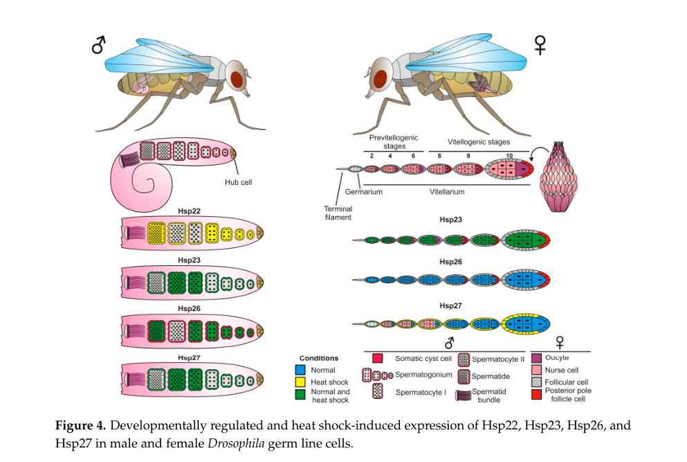

## Question

# Gene Research for Functional Annotation

## ⚠️ CRITICAL: Gene/Protein Identification Context

**BEFORE YOU BEGIN RESEARCH:** You MUST verify you are researching the CORRECT gene/protein. Gene symbols can be ambiguous, especially for less well-characterized genes from non-model organisms.

### Target Gene/Protein Identity (from UniProt):
- **UniProt Accession:** P02518
- **Protein Description:** RecName: Full=Heat shock protein 27;
- **Gene Information:** Name=Hsp27; ORFNames=CG4466;
- **Organism (full):** Drosophila melanogaster (Fruit fly).
- **Protein Family:** Belongs to the small heat shock protein (HSP20) family.
- **Key Domains:** A-crystallin/Hsp20_dom. (IPR002068); Alpha-crystallin/sHSP_animal. (IPR001436); HSP20-like_chaperone. (IPR008978); HSP20 (PF00011)

### MANDATORY VERIFICATION STEPS:

1. **Check if the gene symbol "Hsp27" matches the protein description above**
2. **Verify the organism is correct:** Drosophila melanogaster (Fruit fly).
3. **Check if protein family/domains align with what you find in literature**
4. **If you find literature for a DIFFERENT gene with the same or similar symbol, STOP**

### If Gene Symbol is Ambiguous or You Cannot Find Relevant Literature:

**DO NOT PROCEED WITH RESEARCH ON A DIFFERENT GENE.** Instead:
- State clearly: "The gene symbol 'Hsp27' is ambiguous or literature is limited for this specific protein"
- Explain what you found (e.g., "Found extensive literature on a different gene with the same symbol in a different organism")
- Describe the protein based ONLY on the UniProt information provided above
- Suggest that the protein function can be inferred from domain/family information

### Research Target:

Please provide a comprehensive research report on the gene **Hsp27** (gene ID: Hsp27, UniProt: P02518) in DROME.

The research report should be a detailed narrative explaining the function, biological processes, and localization of the gene product. Citations should be given for all claims.

You should prioritize authoritative reviews and primary scientific literature when conducting research. You can supplement
this with annotations you find in gene/protein databases, but these can be outdated or inaccurate.

We are specifically interested in the primary function of the gene - for enzymes, what reaction is catalyzed, and what is the substrate specificity? For transporters, what is the substrate? For structural proteins or adapters, what is the broader structural role? For signaling molecules, what is the role in the pathway.

We are interested in where in or outside the cell the gene product carries out its function.

We are also interested in the signaling or biochemical pathways in which the gene functions. We are less interested in broad pleiotropic effects, except where these elucidate the precise role.

Include evidence where possible. We are interested in both experimental evidence as well as inference from structure, evolution, or bioinformatic analysis. Precise studies should be prioritized over high-throughput, where available.

## Output

Question: You are an expert researcher providing comprehensive, well-cited information.

Provide detailed information focusing on:
1. Key concepts and definitions with current understanding
2. Recent developments and latest research (prioritize 2023-2024 sources)
3. Current applications and real-world implementations
4. Expert opinions and analysis from authoritative sources
5. Relevant statistics and data from recent studies

Format as a comprehensive research report with proper citations. Include URLs and publication dates where available.
Always prioritize recent, authoritative sources and provide specific citations for all major claims.

# Gene Research for Functional Annotation

## ⚠️ CRITICAL: Gene/Protein Identification Context

**BEFORE YOU BEGIN RESEARCH:** You MUST verify you are researching the CORRECT gene/protein. Gene symbols can be ambiguous, especially for less well-characterized genes from non-model organisms.

### Target Gene/Protein Identity (from UniProt):
- **UniProt Accession:** P02518
- **Protein Description:** RecName: Full=Heat shock protein 27;
- **Gene Information:** Name=Hsp27; ORFNames=CG4466;
- **Organism (full):** Drosophila melanogaster (Fruit fly).
- **Protein Family:** Belongs to the small heat shock protein (HSP20) family.
- **Key Domains:** A-crystallin/Hsp20_dom. (IPR002068); Alpha-crystallin/sHSP_animal. (IPR001436); HSP20-like_chaperone. (IPR008978); HSP20 (PF00011)

### MANDATORY VERIFICATION STEPS:

1. **Check if the gene symbol "Hsp27" matches the protein description above**
2. **Verify the organism is correct:** Drosophila melanogaster (Fruit fly).
3. **Check if protein family/domains align with what you find in literature**
4. **If you find literature for a DIFFERENT gene with the same or similar symbol, STOP**

### If Gene Symbol is Ambiguous or You Cannot Find Relevant Literature:

**DO NOT PROCEED WITH RESEARCH ON A DIFFERENT GENE.** Instead:
- State clearly: "The gene symbol 'Hsp27' is ambiguous or literature is limited for this specific protein"
- Explain what you found (e.g., "Found extensive literature on a different gene with the same symbol in a different organism")
- Describe the protein based ONLY on the UniProt information provided above
- Suggest that the protein function can be inferred from domain/family information

### Research Target:

Please provide a comprehensive research report on the gene **Hsp27** (gene ID: Hsp27, UniProt: P02518) in DROME.

The research report should be a detailed narrative explaining the function, biological processes, and localization of the gene product. Citations should be given for all claims.

You should prioritize authoritative reviews and primary scientific literature when conducting research. You can supplement
this with annotations you find in gene/protein databases, but these can be outdated or inaccurate.

We are specifically interested in the primary function of the gene - for enzymes, what reaction is catalyzed, and what is the substrate specificity? For transporters, what is the substrate? For structural proteins or adapters, what is the broader structural role? For signaling molecules, what is the role in the pathway.

We are interested in where in or outside the cell the gene product carries out its function.

We are also interested in the signaling or biochemical pathways in which the gene functions. We are less interested in broad pleiotropic effects, except where these elucidate the precise role.

Include evidence where possible. We are interested in both experimental evidence as well as inference from structure, evolution, or bioinformatic analysis. Precise studies should be prioritized over high-throughput, where available.

# Research Report: Functional Annotation of *Drosophila melanogaster* Hsp27 (UniProt P02518)

## 0) Target verification (critical identity check)
The target protein is *Drosophila melanogaster* small heat shock protein 27 (Hsp27), and UniProt accession **P02518** is explicitly listed as **“P02518 (Hsp27)”** in a phylogenetic analysis of *Drosophila* small heat shock proteins (sHsps), supporting that the literature discussed here concerns the correct organism and protein family. (morrow2015drosophilasmallheat pages 3-5)

**Important limitation:** within the retrieved full-text sources, I did not find an explicit mapping between UniProt P02518 and the FlyBase ORF identifier **CG4466**; therefore, the CG4466 linkage is treated as **user-provided UniProt context** rather than independently re-verified from the tool-retrieved literature.

## 1) Key concepts and definitions (current understanding)

### 1.1 Small heat shock proteins (sHsps/HSP20 family)
Small heat shock proteins (sHsps; also called the HSP20 family) are low-molecular-weight, stress-inducible chaperones that typically act as **ATP-independent “holdases”**, binding non-native proteins to prevent irreversible aggregation and maintain proteostasis. (morrow2015drosophilasmallheat pages 1-3, jagla2018developmentalexpressionand pages 1-3)

A defining feature of sHsps is the **α-crystallin domain (ACD)** (Pfam **PF00011**), generally located in the C-terminal part of the protein and flanked by a variable N-terminal region (NTR) and a short C-terminal extension. The ACD supports dimerization, and dimers assemble into larger oligomers that are important for substrate binding and chaperone function. (morrow2015drosophilasmallheat pages 1-3)

### 1.2 What “function” means for Hsp27
Hsp27 is **not an enzyme** and does not catalyze a chemical reaction. Its primary biochemical function is **molecular chaperone activity** (ATP-independent anti-aggregation/holdase activity), with context-specific roles in:
- **Proteostasis networks** (cooperation with ATP-dependent chaperones like Hsp70), (morrow2015drosophilasmallheat pages 13-16)
- Potential routing of misfolded proteins toward **autophagy or proteasome-linked degradation** pathways, (morrow2015drosophilasmallheat pages 18-20)
- Specific developmental/stress contexts (e.g., germline development), (jagla2018developmentalexpressionand pages 3-6)
- Stress-related physiology including immune defense and apoptosis modulation. (morrow2015drosophilasmallheat pages 10-13)

## 2) Molecular and cellular function of *D. melanogaster* Hsp27

### 2.1 Core molecular function: ATP-independent chaperone/anti-aggregation (“holdase”)
Across *Drosophila* sHsps, Hsp27 is part of the set of ATP-independent chaperones that prevent nonspecific aggregation of misfolded proteins under stress and non-stress contexts. (morrow2015drosophilasmallheat pages 1-3, jagla2018developmentalexpressionand pages 1-3)

**Direct experimental support (reviewed primary data):** Hsp27 can prevent heat-induced aggregation of model substrates such as **citrate synthase and luciferase** and can maintain heat-denatured luciferase in a **refoldable** state. (morrow2015drosophilasmallheat pages 13-16)

### 2.2 Cooperation with Hsp70 (handoff for refolding)
In a cell-based assay context summarized in the sHsp review literature, Hsp27 can assist refolding of **nuclear luciferase** in *Drosophila* S2 cells, and the refolding depends on **Hsp70 machinery**, consistent with a holdase role upstream of ATP-dependent refolding. (morrow2015drosophilasmallheat pages 13-16)

### 2.3 Quantitative structure–function relationships (oligomerization and mutant effects)
A DmHsp27-focused structural/functional study (thesis) reports that purified **DmHsp27WT** resolves into **two stable oligomeric species** by size exclusion chromatography:
- Peak #1: ~**725 kDa** (elution ~**13.4 mL**)
- Peak #2: ~**540 kDa** (elution ~**14.6 mL**) and ~**1.8×** more abundant than peak #1
Re-injection indicates these are stable, distinct species under the assay conditions. (moutaoufik2017étudedela pages 97-106)

Mutations of conserved ACD arginines (**R122G, R131G, R135G**) shift assembly into a **single larger oligomer** around ~**1100 kDa** (elution ~**11 mL**). (moutaoufik2017étudedela pages 97-106, moutaoufik2017étudedela pages 106-111)

**Quantitative assay conditions and outcomes:**
- Luciferase heat-aggregation assay: **0.1 µM** luciferase at **42 °C**, with **0.4 µM** DmHsp27; WT and oligomer fractions prevented aggregation similarly (3 independent experiments with SEM/SD reported). (moutaoufik2017étudedela pages 97-106, moutaoufik2017étudedela pages 88-91)
- Insulin reduction-aggregation assay: **52 µM insulin**, DTT to **20 mM**, with **13 µM** DmHsp27; WT/peak fractions prevented about **half** of insulin aggregation, while R122G and R131G were reported to **completely prevent** insulin aggregation (n=3, SEM/SD). (moutaoufik2017étudedela pages 97-106, moutaoufik2017étudedela pages 106-111, moutaoufik2017étudedela pages 88-91)

### 2.4 N-terminal motifs and mechanistic interpretation
Developmental review data indicate *Drosophila* sHsps (including Hsp27 by implication) contain a hydrophobic **WDPF** motif in the N-terminal region (absent from Hsp22), hypothesized to contribute to client binding. (jagla2018developmentalexpressionand pages 1-3)

The DmHsp27-focused structural/functional work further highlights the functional importance of the N-terminal region (NTR):
- Deleting the entire NTR disrupts oligomerization and **abolishes chaperone function**.
- A conserved **FGFG motif** (F29–G32) modulates oligomeric state and chaperone activity; specific substitutions (e.g., G30R/G32R) can yield a single higher oligomer with high activity in insulin aggregation assays.
- Heat can partially and reversibly activate DmHsp27 and promote formation of ~1100 kDa oligomers. (moutaoufik2017étudedela pages 141-145)

## 3) Subcellular localization and tissue/developmental context

### 3.1 Nuclear localization as a distinctive feature
In the *Drosophila* sHsp family overview, Hsp27 is specifically described as **nuclear** (in contrast to other sHsps with mitochondrial, cytosolic, or other localizations). (morrow2015drosophilasmallheat pages 3-5)

### 3.2 Oogenesis: stage-dependent nuclear ↔ cytoplasmic/perinuclear distribution
A developmental review compiling primary studies reports Hsp27 localization dynamics during oogenesis:
- In nurse cells: **nuclear** up to germarium stage ~6, then **perinuclear/cytoplasmic** from stage ~8.
- In follicle cells: nuclear in posterior pole follicle cells at stages ~8–10.
- After heat shock: Hsp27 predominantly detected in somatic follicle cells surrounding germline cysts.
These observations underpin hypotheses that Hsp27 supports germline development (division/differentiation) and ovarian integrity under environmental stress; nuclear localization in transcriptionally active cells was discussed as consistent with roles linked to RNA synthesis/processing. (jagla2018developmentalexpressionand pages 3-6)

The oogenesis localization pattern is also visually summarized in the retrieved figure (Jagla et al., 2018, Figure 4). (jagla2018developmentalexpressionand media 282d88f4)

### 3.3 Broad developmental expression and essentiality
Transcriptomic and functional genetic evidence summarized in the developmental review indicates:
- **High** expression in **testis** and **ovaries**,
- High transcription across the **central nervous system (CNS)**,
- High expression in early embryos (4–6 h after egg laying),
- **Ubiquitous RNAi knockdown** of Hsp27 yields **lethality**, supporting an essential developmental role. (jagla2018developmentalexpressionand pages 1-3)

## 4) Pathways and biological processes associated with Hsp27

### 4.1 Proteostasis under proteotoxic stress (polyQ models)
In cell assays summarized by a *Drosophila* sHsp review, Hsp27 partially reduces **insoluble** polyglutamine aggregates (EGFP-Htt-Q119) without altering soluble polyQ protein levels. (morrow2015drosophilasmallheat pages 13-16)

The same review synthesis notes Hsp27 was reported to be more effective than Hsp26 in suppressing **41Q-induced neurodegeneration**, implicating functional differences among sHsps in proteotoxic contexts. (morrow2015drosophilasmallheat pages 18-20)

### 4.2 Autophagy and proteasome-linked quality control (hypothesized/indirect evidence)
Hsp27 is discussed as potentially acting through **chaperone-mediated autophagy (CMA)** or **chaperone-assisted selective autophagy (CASA)**; the review notes that further studies are needed to clarify the mechanism. Functional interplay with **Atg7** is suggested in the context of attenuating polyQ toxicity. (morrow2015drosophilasmallheat pages 18-20)

Additionally, hsp27 is reported to be upregulated in parallel with **19S and 20S proteasome subunits**, and Hsp27 can bind the ubiquitin-conjugating enzyme **DmUbc9**, supporting connectivity to ubiquitin/proteasome-associated proteostasis networks. (morrow2015drosophilasmallheat pages 18-20)

### 4.3 Innate immunity (p38 MAPK-dependent host defense)
Hsp27 is required for proper **p38 MAPK–dependent host defense**, and hsp27 mutants are described as more susceptible to infection; pathogen/endosymbiont interactions can modulate hsp27 expression (e.g., Wolbachia down-regulation). (morrow2015drosophilasmallheat pages 10-13)

### 4.4 Apoptosis modulation (selective interaction with hid pathway)
Hsp27 is reported to reduce **hid-induced lethality** but not lethality induced by **reaper** or **grim**, implying selective pathway interactions rather than universal apoptosis blockade. (morrow2015drosophilasmallheat pages 10-13)

## 5) Recent developments (prioritizing 2023–2024) and current research directions

### 5.1 2024 literature signal: starvation endurance
A 2024 preprint review of sHsps and environmental stress states that **silencing *D. melanogaster* hsp27 reduces the ability to endure starvation**, citing a primary source (not retrieved here), but does not provide survival-time statistics in the accessible excerpt. (Bwambale et al., 2024-10; https://doi.org/10.20944/preprints202410.1567.v1) (bwambale2024environmentalstressand pages 8-9)

### 5.2 Evidence gap for 2023–2024 Hsp27-specific primary studies in this tool run
Within the current retrieval results, I did not obtain accessible 2023–2024 primary articles that directly and specifically focus on *D. melanogaster* Hsp27 (P02518) with extractable mechanistic/quantitative results. Therefore, the most detailed mechanistic and quantitative support in this report comes from authoritative earlier reviews (2015; 2018) and a DmHsp27-focused 2017 structural/functional analysis. (morrow2015drosophilasmallheat pages 3-5, jagla2018developmentalexpressionand pages 1-3, moutaoufik2017étudedela pages 97-106)

## 6) Current applications and real-world implementations

### 6.1 Research applications in vivo
Based on the curated evidence base, Hsp27 is used/implicated in *Drosophila* as:
- A genetic and mechanistic handle on **proteotoxicity/aggregation** phenotypes (polyQ models) and chaperone network function. (morrow2015drosophilasmallheat pages 13-16, morrow2015drosophilasmallheat pages 18-20)
- A modulator/biomarker axis for **stress physiology** (oxidative stress resistance in overexpression contexts; starvation tolerance in knockdown contexts). (morrow2015drosophilasmallheat pages 10-13, bwambale2024environmentalstressand pages 8-9)
- A locus informing **developmental robustness** and germline/oogenesis biology via stage-specific localization and essentiality. (jagla2018developmentalexpressionand pages 3-6, jagla2018developmentalexpressionand pages 1-3)

### 6.2 Practical implementation patterns
The studies summarized here imply common experimental implementations:
- **Transgenic/RNAi manipulation** (ubiquitous RNAi lethality; stress and immunity phenotypes), (jagla2018developmentalexpressionand pages 1-3, morrow2015drosophilasmallheat pages 10-13)
- **Cell-based proteostasis assays** (S2 cells; nuclear luciferase refolding), (morrow2015drosophilasmallheat pages 13-16)
- **Biochemical reconstitution** (SEC-defined oligomers; luciferase and insulin aggregation readouts at defined concentrations). (moutaoufik2017étudedela pages 97-106, moutaoufik2017étudedela pages 88-91)

## 7) Expert synthesis and interpretation (authoritative analysis)

### 7.1 Mechanistic model (best-supported)
Collectively, the evidence supports a model where *Drosophila* Hsp27:
1. Forms dynamic oligomers (hundreds of kDa to ~1.1 MDa) whose distribution is sensitive to sequence features in both the ACD (conserved arginines) and NTR motifs, (moutaoufik2017étudedela pages 97-106, moutaoufik2017étudedela pages 141-145)
2. Acts as an ATP-independent holdase that reduces aggregation of diverse substrates, (morrow2015drosophilasmallheat pages 13-16, moutaoufik2017étudedela pages 88-91)
3. Cooperates with ATP-dependent chaperones (Hsp70) for refolding in cellular contexts, (morrow2015drosophilasmallheat pages 13-16)
4. Has functional specializations connected to its **nuclear and developmentally regulated localization**, notably in oogenesis and likely additional tissues with high expression (gonads, CNS). (jagla2018developmentalexpressionand pages 3-6, jagla2018developmentalexpressionand pages 1-3)

### 7.2 Pathway-level hypothesis space (less certain)
Review synthesis suggests plausible integration with:
- **Autophagy pathways** (CMA/CASA; Atg7) as routes for handling aggregation-prone proteins, but the mechanism is explicitly presented as needing further clarification. (morrow2015drosophilasmallheat pages 18-20)
- **Ubiquitin/proteasome networks**, based on coordinated induction with proteasome subunits and interaction with DmUbc9. (morrow2015drosophilasmallheat pages 18-20)

## 8) Consolidated evidence table
The following table summarizes major functional-annotation claims with their strongest supporting sources.

| Functional aspect (definition) | Key findings/claims | Evidence type (in vitro/in vivo/review) | Subcellular localization/tissue context | Pathways/partners | Source (author year, DOI/URL if present) |
|---|---|---|---|---|---|
| Target identity and family membership | Hsp27 corresponds to Drosophila melanogaster small heat shock protein Hsp27, explicitly associated with UniProt P02518 in sHsp phylogeny; it belongs to the small heat shock protein/HSP20 family and carries the conserved α-crystallin domain (ACD; PF00011), the defining domain of sHsps. (morrow2015drosophilasmallheat pages 3-5, morrow2015drosophilasmallheat pages 1-3) | Review; family/domain synthesis | Drosophila melanogaster; intracellular protein | sHsp/HSP20 family; α-crystallin domain | Morrow & Tanguay 2015, https://doi.org/10.1007/978-3-319-16077-1_25 (morrow2015drosophilasmallheat pages 3-5, morrow2015drosophilasmallheat pages 1-3) |
| Molecular function: ATP-independent chaperone | Drosophila sHsps, including Hsp27, act as ATP-independent chaperones that bind misfolded proteins, prevent nonspecific aggregation, and help maintain proteostasis; DmHsp27 is further described as having chaperone-like activity in functional assays. (morrow2015drosophilasmallheat pages 1-3, moutaoufik2017étudedela pages 88-91, jagla2018developmentalexpressionand pages 1-3) | Review plus functional study | General intracellular proteostasis | Proteostasis network | Morrow & Tanguay 2015, https://doi.org/10.1007/978-3-319-16077-1_25; Jagla et al. 2018, https://doi.org/10.3390/ijms19113441; Moutaoufik 2017 (morrow2015drosophilasmallheat pages 1-3, moutaoufik2017étudedela pages 88-91, jagla2018developmentalexpressionand pages 1-3) |
| Basal localization | Hsp27 is specifically noted as nuclear among Drosophila sHsps; DmHsp27 is also described as nuclear-localized and stress up-regulated. (morrow2015drosophilasmallheat pages 3-5, moutaoufik2017étudedela pages 88-91) | Review; functional/structural study | Nucleus | Localization likely linked to specialized client handling | Morrow & Tanguay 2015, https://doi.org/10.1007/978-3-319-16077-1_25; Moutaoufik 2017 (morrow2015drosophilasmallheat pages 3-5, moutaoufik2017étudedela pages 88-91) |
| Oogenesis localization and developmental context | During oogenesis, Hsp27 is nuclear in nurse cells through germarium stage 6, then shifts to perinuclear/cytoplasmic localization from stage 8; it is also nuclear in posterior pole follicle cells at stages 8-10. After heat shock, Hsp27 is predominantly detected in somatic follicle cells around germline cysts. Authors propose roles in germ cell division/differentiation, ovarian integrity under stress, and possibly RNA synthesis/processing in transcriptionally active cells. (jagla2018developmentalexpressionand pages 3-6) | Review summarizing primary developmental studies | Nurse cells, oocytes, posterior pole follicle cells, somatic follicle cells; ovary | Developmental regulation; possible phosphorylation-dependent localization | Jagla et al. 2018, https://doi.org/10.3390/ijms19113441 (jagla2018developmentalexpressionand pages 3-6) |
| Developmental expression and essentiality | Transcriptomic datasets show Hsp27 is highly expressed in testis and ovaries, has high CNS transcription, and is highly expressed in early embryos (4-6 h AEL). Ubiquitous RNAi knockdown of Hsp27 caused lethality, supporting an essential developmental role. (jagla2018developmentalexpressionand pages 1-3) | Review summarizing transcriptomics and RNAi | Testis, ovaries, CNS, early embryo | Developmental gene regulation; stress-independent expression programs | Jagla et al. 2018, https://doi.org/10.3390/ijms19113441 (jagla2018developmentalexpressionand pages 1-3) |
| In vitro anti-aggregation chaperone activity | Hsp27 can prevent heat-induced aggregation of model substrates such as citrate synthase and luciferase, and maintain heat-denatured luciferase in a refoldable state. (morrow2015drosophilasmallheat pages 13-16) | In vitro and cell-based functional assays summarized in review | Assay substrates; S2 cells for some experiments | Chaperone action on denatured substrates | Morrow & Tanguay 2015, https://doi.org/10.1007/978-3-319-16077-1_25 (morrow2015drosophilasmallheat pages 13-16) |
| Refolding cooperation with Hsp70 | Hsp27 assists refolding of nuclear luciferase in S2 cells, and this refolding requires Hsp70 machinery, supporting a holdase/co-chaperone role upstream of ATP-dependent refolding. (morrow2015drosophilasmallheat pages 13-16) | Cell-based functional assays summarized in review | Nuclear luciferase in S2 cells | Hsp70 refolding machinery | Morrow & Tanguay 2015, https://doi.org/10.1007/978-3-319-16077-1_25 (morrow2015drosophilasmallheat pages 13-16) |
| Polyglutamine proteotoxicity suppression | In S2-cell assays, Hsp27 partially reduces insoluble EGFP-Htt-Q119 polyglutamine aggregates, with no effect on soluble polyQ protein levels; review synthesis also notes Hsp27 was more effective than Hsp26 at suppressing 41Q-induced neurodegeneration. (morrow2015drosophilasmallheat pages 13-16, morrow2015drosophilasmallheat pages 18-20) | Cell-based assay; review synthesis of in vivo neurodegeneration work | S2 cells; neurodegeneration models | PolyQ proteostasis | Morrow & Tanguay 2015, https://doi.org/10.1007/978-3-319-16077-1_25 (morrow2015drosophilasmallheat pages 13-16, morrow2015drosophilasmallheat pages 18-20) |
| Autophagy/proteostasis linkage | Hsp27 is implicated in autophagy-related proteostasis; review authors note that further work is needed to determine whether Hsp27 acts via chaperone-mediated autophagy (CMA) or chaperone-assisted selective autophagy (CASA), and suggest functional interplay with Atg7 in attenuation of polyQ toxicity. (morrow2015drosophilasmallheat pages 18-20) | Review/hypothesis based on prior studies | General intracellular proteostasis context | Atg7; CMA/CASA; autophagy-proteostasis crosstalk | Morrow & Tanguay 2015, https://doi.org/10.1007/978-3-319-16077-1_25 (morrow2015drosophilasmallheat pages 18-20) |
| Ubiquitin-proteasome network links | hsp27 is co-upregulated with 19S and 20S proteasome subunits, and Hsp27 can bind the ubiquitin-conjugating enzyme DmUbc9, supporting links to ubiquitin/proteasome-associated protein quality control. (morrow2015drosophilasmallheat pages 18-20) | Review summarizing expression/protein interaction findings | General intracellular context | Proteasome subunits; DmUbc9 | Morrow & Tanguay 2015, https://doi.org/10.1007/978-3-319-16077-1_25 (morrow2015drosophilasmallheat pages 18-20) |
| Innate immunity | Proper Hsp27 expression is required for p38 MAPK-dependent host defense, and hsp27 mutants are more susceptible to infection; pathogens/endosymbionts can modulate hsp27 expression. (morrow2015drosophilasmallheat pages 10-13) | In vivo findings summarized in review | Host defense context | p38 MAPK innate immune pathway | Morrow & Tanguay 2015, https://doi.org/10.1007/978-3-319-16077-1_25 (morrow2015drosophilasmallheat pages 10-13) |
| Apoptosis modulation | Hsp27 specifically reduces hid-induced lethality but does not suppress reaper- or grim-induced lethality, indicating selective modulation of apoptotic signaling rather than broad anti-apoptotic suppression. (morrow2015drosophilasmallheat pages 10-13) | In vivo genetic findings summarized in review | Developmental/cell death context | hid pathway; possible Ras/MAPK-related regulation discussed for sHsps | Morrow & Tanguay 2015, https://doi.org/10.1007/978-3-319-16077-1_25 (morrow2015drosophilasmallheat pages 10-13) |
| Stress resistance and starvation tolerance | Reports on oxidative-stress protection are mixed: some studies found no change in oxidative-stress resistance upon Hsp27 loss, whereas others reported increased resistance upon Hsp27 overexpression. A 2024 review further states that silencing Drosophila hsp27 reduces the ability to endure starvation, although the reviewed excerpt does not provide quantitative survival values. (morrow2015drosophilasmallheat pages 10-13, bwambale2024environmentalstressand pages 8-9) | Review summarizing in vivo studies | Whole-animal stress physiology | Oxidative stress responses; starvation tolerance | Morrow & Tanguay 2015, https://doi.org/10.1007/978-3-319-16077-1_25; Bwambale et al. 2024, https://doi.org/10.20944/preprints202410.1567.v1 (morrow2015drosophilasmallheat pages 10-13, bwambale2024environmentalstressand pages 8-9) |

*Table: This table summarizes curated functional-annotation evidence for Drosophila melanogaster Hsp27 (UniProt P02518) from the provided sources only. It highlights what is well supported experimentally versus what remains more inferential or review-based, including localization, proteostasis roles, developmental functions, immunity, apoptosis, and stress tolerance.*

## 9) Key statistics and data (from retrieved sources)
- **Oligomer sizes (SEC):** ~725 kDa and ~540 kDa Hsp27WT species (peak#2 ~1.8× more abundant); ACD arginine mutants shift to ~1100 kDa oligomers. (moutaoufik2017étudedela pages 97-106)
- **Chaperone assay conditions:** luciferase (0.1 µM) at 42°C with Hsp27 (0.4 µM), aggregation by light scattering at 320 nm; insulin (52 µM) + DTT (20 mM) with Hsp27 (13 µM), monitored at 320 nm; n=3 with SEM/SD reported. (moutaoufik2017étudedela pages 97-106, moutaoufik2017étudedela pages 88-91)
- **Assay outcomes (semi-quantitative):** WT prevents ~half of insulin aggregation; R122G/R131G mutants completely prevent insulin aggregation under the reported conditions. (moutaoufik2017étudedela pages 97-106, moutaoufik2017étudedela pages 106-111)
- **In vivo phenotype summaries (non-quantitative in retrieved text):** ubiquitous RNAi knockdown causes lethality; hsp27 mutants are more susceptible to infection; Hsp27 reduces hid-induced lethality but not reaper/grim-induced lethality. (jagla2018developmentalexpressionand pages 1-3, morrow2015drosophilasmallheat pages 10-13)

## 10) References (with publication dates and URLs where available)
- Morrow G, Tanguay RM. **2015**. *Drosophila Small Heat Shock Proteins: An Update on Their Features and Functions.* (Book chapter via Springer; retrieved as “ArXiv” record). DOI/URL: https://doi.org/10.1007/978-3-319-16077-1_25 (morrow2015drosophilasmallheat pages 1-3, morrow2015drosophilasmallheat pages 3-5)
- Jagla T, Dubińska-Magiera M, Poovathumkadavil P, Daczewska M, Jagla K. **2018-11**. *Developmental Expression and Functions of the Small Heat Shock Proteins in Drosophila.* *Int J Mol Sci* 19:3441. DOI/URL: https://doi.org/10.3390/ijms19113441 (jagla2018developmentalexpressionand pages 1-3, jagla2018developmentalexpressionand pages 3-6, jagla2018developmentalexpressionand media 282d88f4)
- Moutaoufik MT. **2017**. *Étude de la structure et de la fonction de la petite protéine de choc thermique DmHsp27.* (Thesis/monograph; venue not specified in retrieved metadata). (moutaoufik2017étudedela pages 97-106, moutaoufik2017étudedela pages 88-91, moutaoufik2017étudedela pages 141-145)
- Bwambale J, Aisu J, Mugwanya M. **2024-10**. *Environmental Stress and Small Heat Shock Proteins in Selected Animals: A Comprehensive Review of Literature.* Preprint DOI/URL: https://doi.org/10.20944/preprints202410.1567.v1 (bwambale2024environmentalstressand pages 8-9)

References

1. (morrow2015drosophilasmallheat pages 3-5): Geneviève Morrow and Robert M. Tanguay. Drosophila small heat shock proteins: an update on their features and functions. ArXiv, pages 579-606, Jan 2015. URL: https://doi.org/10.1007/978-3-319-16077-1\_25, doi:10.1007/978-3-319-16077-1\_25. This article has 37 citations.

2. (morrow2015drosophilasmallheat pages 1-3): Geneviève Morrow and Robert M. Tanguay. Drosophila small heat shock proteins: an update on their features and functions. ArXiv, pages 579-606, Jan 2015. URL: https://doi.org/10.1007/978-3-319-16077-1\_25, doi:10.1007/978-3-319-16077-1\_25. This article has 37 citations.

3. (jagla2018developmentalexpressionand pages 1-3): Teresa Jagla, Magda Dubińska-Magiera, Preethi Poovathumkadavil, Małgorzata Daczewska, and Krzysztof Jagla. Developmental expression and functions of the small heat shock proteins in drosophila. International Journal of Molecular Sciences, 19:3441, Nov 2018. URL: https://doi.org/10.3390/ijms19113441, doi:10.3390/ijms19113441. This article has 54 citations.

4. (morrow2015drosophilasmallheat pages 13-16): Geneviève Morrow and Robert M. Tanguay. Drosophila small heat shock proteins: an update on their features and functions. ArXiv, pages 579-606, Jan 2015. URL: https://doi.org/10.1007/978-3-319-16077-1\_25, doi:10.1007/978-3-319-16077-1\_25. This article has 37 citations.

5. (morrow2015drosophilasmallheat pages 18-20): Geneviève Morrow and Robert M. Tanguay. Drosophila small heat shock proteins: an update on their features and functions. ArXiv, pages 579-606, Jan 2015. URL: https://doi.org/10.1007/978-3-319-16077-1\_25, doi:10.1007/978-3-319-16077-1\_25. This article has 37 citations.

6. (jagla2018developmentalexpressionand pages 3-6): Teresa Jagla, Magda Dubińska-Magiera, Preethi Poovathumkadavil, Małgorzata Daczewska, and Krzysztof Jagla. Developmental expression and functions of the small heat shock proteins in drosophila. International Journal of Molecular Sciences, 19:3441, Nov 2018. URL: https://doi.org/10.3390/ijms19113441, doi:10.3390/ijms19113441. This article has 54 citations.

7. (morrow2015drosophilasmallheat pages 10-13): Geneviève Morrow and Robert M. Tanguay. Drosophila small heat shock proteins: an update on their features and functions. ArXiv, pages 579-606, Jan 2015. URL: https://doi.org/10.1007/978-3-319-16077-1\_25, doi:10.1007/978-3-319-16077-1\_25. This article has 37 citations.

8. (moutaoufik2017étudedela pages 97-106): MT Moutaoufik. Étude de la structure et de la fonction de la petite protéine de choc thermique dmhsp27. Unknown journal, 2017.

9. (moutaoufik2017étudedela pages 106-111): MT Moutaoufik. Étude de la structure et de la fonction de la petite protéine de choc thermique dmhsp27. Unknown journal, 2017.

10. (moutaoufik2017étudedela pages 88-91): MT Moutaoufik. Étude de la structure et de la fonction de la petite protéine de choc thermique dmhsp27. Unknown journal, 2017.

11. (moutaoufik2017étudedela pages 141-145): MT Moutaoufik. Étude de la structure et de la fonction de la petite protéine de choc thermique dmhsp27. Unknown journal, 2017.

12. (jagla2018developmentalexpressionand media 282d88f4): Teresa Jagla, Magda Dubińska-Magiera, Preethi Poovathumkadavil, Małgorzata Daczewska, and Krzysztof Jagla. Developmental expression and functions of the small heat shock proteins in drosophila. International Journal of Molecular Sciences, 19:3441, Nov 2018. URL: https://doi.org/10.3390/ijms19113441, doi:10.3390/ijms19113441. This article has 54 citations.

13. (bwambale2024environmentalstressand pages 8-9): Jamada Bwambale, Justus Aisu, and Muziri Mugwanya. Environmental stress and small heat shock proteins in selected animals: a comprehensive review of literature. Oct 2024. URL: https://doi.org/10.20944/preprints202410.1567.v1, doi:10.20944/preprints202410.1567.v1.

## Artifacts

- [Edison artifact artifact-00](Hsp27-deep-research-falcon_artifacts/artifact-00.md)

## Citations

1. morrow2015drosophilasmallheat pages 3-5
2. morrow2015drosophilasmallheat pages 1-3
3. morrow2015drosophilasmallheat pages 13-16
4. morrow2015drosophilasmallheat pages 18-20
5. jagla2018developmentalexpressionand pages 3-6
6. morrow2015drosophilasmallheat pages 10-13
7. jagla2018developmentalexpressionand pages 1-3
8. bwambale2024environmentalstressand pages 8-9
9. https://doi.org/10.20944/preprints202410.1567.v1
10. https://doi.org/10.1007/978-3-319-16077-1_25
11. https://doi.org/10.1007/978-3-319-16077-1_25;
12. https://doi.org/10.3390/ijms19113441;
13. https://doi.org/10.3390/ijms19113441
14. https://doi.org/10.1007/978-3-319-16077-1\_25,
15. https://doi.org/10.3390/ijms19113441,
16. https://doi.org/10.20944/preprints202410.1567.v1,