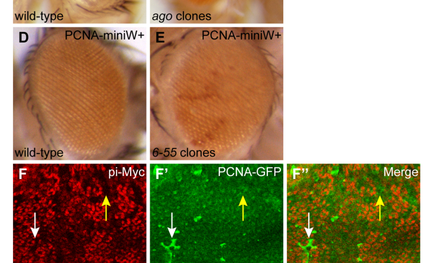

## Question

# Gene Research for Functional Annotation

## ⚠️ CRITICAL: Gene/Protein Identification Context

**BEFORE YOU BEGIN RESEARCH:** You MUST verify you are researching the CORRECT gene/protein. Gene symbols can be ambiguous, especially for less well-characterized genes from non-model organisms.

### Target Gene/Protein Identity (from UniProt):
- **UniProt Accession:** P02828
- **Protein Description:** RecName: Full=Heat shock protein 83; AltName: Full=HSP 82;
- **Gene Information:** Name=Hsp83 {ECO:0000312|FlyBase:FBgn0001233}; Synonyms=Hsp82 {ECO:0000312|FlyBase:FBgn0001233}, Hsp90 {ECO:0000303|PubMed:23509070, ECO:0000312|FlyBase:FBgn0001233}; ORFNames=CG1242 {ECO:0000312|FlyBase:FBgn0001233};
- **Organism (full):** Drosophila melanogaster (Fruit fly).
- **Protein Family:** Belongs to the heat shock protein 90 family. .
- **Key Domains:** HATPase_C_sf. (IPR036890); HATPase_dom. (IPR003594); Heat_shock_protein_90_CS. (IPR019805); HSP90_C. (IPR037196); Hsp90_fam. (IPR001404)

### MANDATORY VERIFICATION STEPS:

1. **Check if the gene symbol "Hsp83" matches the protein description above**
2. **Verify the organism is correct:** Drosophila melanogaster (Fruit fly).
3. **Check if protein family/domains align with what you find in literature**
4. **If you find literature for a DIFFERENT gene with the same or similar symbol, STOP**

### If Gene Symbol is Ambiguous or You Cannot Find Relevant Literature:

**DO NOT PROCEED WITH RESEARCH ON A DIFFERENT GENE.** Instead:
- State clearly: "The gene symbol 'Hsp83' is ambiguous or literature is limited for this specific protein"
- Explain what you found (e.g., "Found extensive literature on a different gene with the same symbol in a different organism")
- Describe the protein based ONLY on the UniProt information provided above
- Suggest that the protein function can be inferred from domain/family information

### Research Target:

Please provide a comprehensive research report on the gene **Hsp83** (gene ID: Hsp83, UniProt: P02828) in DROME.

The research report should be a detailed narrative explaining the function, biological processes, and localization of the gene product. Citations should be given for all claims.

You should prioritize authoritative reviews and primary scientific literature when conducting research. You can supplement
this with annotations you find in gene/protein databases, but these can be outdated or inaccurate.

We are specifically interested in the primary function of the gene - for enzymes, what reaction is catalyzed, and what is the substrate specificity? For transporters, what is the substrate? For structural proteins or adapters, what is the broader structural role? For signaling molecules, what is the role in the pathway.

We are interested in where in or outside the cell the gene product carries out its function.

We are also interested in the signaling or biochemical pathways in which the gene functions. We are less interested in broad pleiotropic effects, except where these elucidate the precise role.

Include evidence where possible. We are interested in both experimental evidence as well as inference from structure, evolution, or bioinformatic analysis. Precise studies should be prioritized over high-throughput, where available.

## Output

Question: You are an expert researcher providing comprehensive, well-cited information.

Provide detailed information focusing on:
1. Key concepts and definitions with current understanding
2. Recent developments and latest research (prioritize 2023-2024 sources)
3. Current applications and real-world implementations
4. Expert opinions and analysis from authoritative sources
5. Relevant statistics and data from recent studies

Format as a comprehensive research report with proper citations. Include URLs and publication dates where available.
Always prioritize recent, authoritative sources and provide specific citations for all major claims.

# Gene Research for Functional Annotation

## ⚠️ CRITICAL: Gene/Protein Identification Context

**BEFORE YOU BEGIN RESEARCH:** You MUST verify you are researching the CORRECT gene/protein. Gene symbols can be ambiguous, especially for less well-characterized genes from non-model organisms.

### Target Gene/Protein Identity (from UniProt):
- **UniProt Accession:** P02828
- **Protein Description:** RecName: Full=Heat shock protein 83; AltName: Full=HSP 82;
- **Gene Information:** Name=Hsp83 {ECO:0000312|FlyBase:FBgn0001233}; Synonyms=Hsp82 {ECO:0000312|FlyBase:FBgn0001233}, Hsp90 {ECO:0000303|PubMed:23509070, ECO:0000312|FlyBase:FBgn0001233}; ORFNames=CG1242 {ECO:0000312|FlyBase:FBgn0001233};
- **Organism (full):** Drosophila melanogaster (Fruit fly).
- **Protein Family:** Belongs to the heat shock protein 90 family. .
- **Key Domains:** HATPase_C_sf. (IPR036890); HATPase_dom. (IPR003594); Heat_shock_protein_90_CS. (IPR019805); HSP90_C. (IPR037196); Hsp90_fam. (IPR001404)

### MANDATORY VERIFICATION STEPS:

1. **Check if the gene symbol "Hsp83" matches the protein description above**
2. **Verify the organism is correct:** Drosophila melanogaster (Fruit fly).
3. **Check if protein family/domains align with what you find in literature**
4. **If you find literature for a DIFFERENT gene with the same or similar symbol, STOP**

### If Gene Symbol is Ambiguous or You Cannot Find Relevant Literature:

**DO NOT PROCEED WITH RESEARCH ON A DIFFERENT GENE.** Instead:
- State clearly: "The gene symbol 'Hsp83' is ambiguous or literature is limited for this specific protein"
- Explain what you found (e.g., "Found extensive literature on a different gene with the same symbol in a different organism")
- Describe the protein based ONLY on the UniProt information provided above
- Suggest that the protein function can be inferred from domain/family information

### Research Target:

Please provide a comprehensive research report on the gene **Hsp83** (gene ID: Hsp83, UniProt: P02828) in DROME.

The research report should be a detailed narrative explaining the function, biological processes, and localization of the gene product. Citations should be given for all claims.

You should prioritize authoritative reviews and primary scientific literature when conducting research. You can supplement
this with annotations you find in gene/protein databases, but these can be outdated or inaccurate.

We are specifically interested in the primary function of the gene - for enzymes, what reaction is catalyzed, and what is the substrate specificity? For transporters, what is the substrate? For structural proteins or adapters, what is the broader structural role? For signaling molecules, what is the role in the pathway.

We are interested in where in or outside the cell the gene product carries out its function.

We are also interested in the signaling or biochemical pathways in which the gene functions. We are less interested in broad pleiotropic effects, except where these elucidate the precise role.

Include evidence where possible. We are interested in both experimental evidence as well as inference from structure, evolution, or bioinformatic analysis. Precise studies should be prioritized over high-throughput, where available.

## Research report: Functional annotation of **Hsp83** (UniProt **P02828**) in *Drosophila melanogaster*

### 0) Target verification (mandatory disambiguation)
The target protein is **Heat shock protein 83 (Hsp83; also called Hsp82/Hsp90)** from **
*Drosophila melanogaster***, corresponding to the cytosolic **Hsp90-family ATP-dependent molecular chaperone**. Drosophila genetics papers explicitly refer to **Hsp83 as the Hsp90 homolog** and study loss-of-function alleles of **Hsp83** in *D. melanogaster* (yue1999geneticanalysisof pages 1-2, bandura2013themolecularchaperone pages 3-4). This aligns with the UniProt description for P02828 (cytosolic Hsp90 family chaperone) and with canonical Hsp90 cycle/co-chaperone dependencies (prodromou2022advancestowardsunderstanding pages 1-3, oostenhawle2023organismalrolesof pages 1-3).

### 1) Key concepts and definitions (current understanding)

#### 1.1 Core molecular function
Hsp83 is best understood as the **cytosolic Hsp90 ATP-dependent chaperone** that promotes **late-stage folding/maturation, stabilization, and activation** of diverse client proteins, especially those central to signaling and development (prodromou2022advancestowardsunderstanding pages 1-3, oostenhawle2023organismalrolesof pages 1-3). Mechanistically, Hsp90 proteins are **dimeric**, undergoing an **ATP-driven conformational cycle** involving **ATP binding/hydrolysis** and large structural rearrangements that enable remodeling/maturation of clients (prodromou2022advancestowardsunderstanding pages 1-3, somogyvari2022hsp90fromcellular pages 5-6).

#### 1.2 Chaperone cycle partners (co-chaperones)
Hsp90/Hsp83 function is regulated by **co-chaperones** that modulate client recruitment and ATPase cycling. Key named regulators include **Cdc37** (kinase client recruitment), **p23**, and **Aha1**, as well as **TPR-domain** proteins such as **Hop** that bind the conserved **MEEVD** C-terminal motif typical of cytosolic Hsp90s (prodromou2022advancestowardsunderstanding pages 1-3, somogyvari2022hsp90fromcellular pages 3-5). This co-chaperone control is context-specific and central to how Hsp83 supports distinct pathways at different times and tissues (oostenhawle2023organismalrolesof pages 1-3).

### 2) Drosophila-specific functional annotation (processes, pathways, localization)

#### 2.1 Subcellular localization
Direct immunofluorescence in Drosophila testes shows **predominantly cytoplasmic Hsp83** in spermatocytes, with **weak but reproducible nuclear staining** in primary spermatocytes, plus strong staining of spermatid bundles and punctate staining along sperm tails (yue1999geneticanalysisof pages 5-7). This pattern is consistent with a primarily cytosolic chaperone that can also be present in/near nuclei in specific developmental contexts.

#### 2.2 Essentiality and organismal roles in development
Hsp83 is **essential**: strong Hsp83 point mutations are lethal as homozygotes (yue1999geneticanalysisof pages 1-2). In a large Drosophila developmental screen for cell-cycle-exit regulators, an Hsp83 allele (6-55; predicted P380S) showed pupal lethality in animals composed entirely of homozygous mutant cells (bandura2013themolecularchaperone pages 3-4). Broader synthesis across metazoans emphasizes Hsp90’s centrality to organismal proteostasis, signaling, development, and stress adaptation, which provides a framework for interpreting Hsp83 pleiotropy (oostenhawle2023organismalrolesof pages 1-3).

#### 2.3 Spermatogenesis: requirement for microtubule-dependent processes
A canonical Drosophila genetic analysis found **eight transheterozygous Hsp83 mutant combinations** that yield viable adults, all with **sterile males** and sterile/weakly fertile females (yue1999geneticanalysisof pages 1-2). Phenotypically, **all stages of spermatogenesis involving microtubule function are affected**, from early mitotic divisions through sperm maturation and individualization/motility (yue1999geneticanalysisof pages 1-2). In a viable male-sterile allele (*scratch*), Hsp83/Hsp90 protein was reduced by **~3-fold** (ovaries, testes, male bodies), correlating with fully penetrant male sterility (yue1999geneticanalysisof pages 5-7). Biochemically, only a small fraction of Hsp83 co-purifies with taxol-stabilized microtubule proteins, and Hsp83 does not remain bound through repeated microtubule assembly/disassembly, supporting an **indirect role** via stabilization/maturation of microtubule effectors and/or signaling components rather than direct tubulin polymerization (yue1999geneticanalysisof pages 1-2).

#### 2.4 Oogenesis, maternal contribution, and embryonic patterning
A focused review on maternal heat shock proteins summarizes Drosophila evidence that Hsp83 contributes to **female fertility and oogenesis** and is involved in **maternal mRNA handling**, including effects on **
*nanos* mRNA localization** important for anterior–posterior patterning (christians2017heatshockproteins pages 3-6). The same synthesis notes that some Hsp83 mutant combinations can have **very low viability (<1%)** and surviving females can be weakly fertile or sterile, indicating strong reproductive sensitivity to reduced Hsp83 function (christians2017heatshockproteins pages 3-6).

#### 2.5 Hormone signaling pathway 1: Ecdysone receptor activation (steroid receptor biology)
A key Drosophila primary study demonstrated that the **ecdysone receptor heterodimer EcR/USP requires an Hsp83/Hsp90-containing multichaperone complex for activation**. Purified components—Hsp83 (Hsp90), Hsc70, Hop, Hip, FKBP52, and p23—were sufficient to reconstitute functional EcR/USP DNA binding in vitro, and activation required **ATP hydrolysis and Mg2+** (arbeitman2000molecularchaperonesactivate pages 3-4, arbeitman2000molecularchaperonesactivate pages 4-5). Pharmacological inhibition by the Hsp90 inhibitor **geldanamycin** nearly abolished DNA binding, quantified as **~58-fold inhibition** by phosphorimager analysis, and inhibition mapped to EcR rather than USP (arbeitman2000molecularchaperonesactivate pages 5-7).

In vivo functional relevance was supported by an ecdysone-inducible reporter assay: pretreatment with **0.1 mg/ml** and **1.0 mg/ml** geldanamycin reduced reporter activity to **71%** and **21%** of control (experiments repeated three times), consistent with a role for Hsp83/Hsp90 in receptor maturation (arbeitman2000molecularchaperonesactivate pages 7-8).

#### 2.6 Hormone signaling pathway 2: Juvenile hormone (JH) receptor Met nuclear import
In Drosophila juvenile hormone signaling, Hsp83 physically interacts with the JH receptor **Methoprene-tolerant (Met)**, and JH increases the Met–Hsp83 interaction. Hsp83 loss-of-function attenuates JH binding and reduces JH-induced **nuclear import** of Met, decreasing JH-responsive transcription of **Kr-h1** (he2014heatshockprotein pages 1-2). This provides direct evidence that Hsp83 can regulate signaling by controlling receptor localization and competence.

#### 2.7 Cell cycle exit and developmental proliferation control
Hsp83 promotes **timely cell cycle exit** during pupal development. In Hsp83(6-55) mutant clones, E2F-dependent transcription increases and cells show ectopic S phase and mitosis after neighboring cells have exited the cell cycle (bandura2013themolecularchaperone pages 3-4, bandura2013themolecularchaperone pages 4-7). Flow cytometry at ~24–28 hr after puparium formation showed that **~10%** of mutant-clone cells retained **G2 (4N)** DNA content, whereas nearly all wild-type cells were in **G1 (2N)** at that stage (bandura2013themolecularchaperone pages 4-7). This phenotype is also documented visually in Figures 1–2 of the same paper (bandura2013themolecularchaperone media 1b422e67, bandura2013themolecularchaperone media c9b82fe2).

### 3) Recent developments and latest research (prioritizing 2023–2024)

#### 3.1 2023: organismal and inter-tissue roles of Hsp90
A 2023 review synthesizes emerging evidence that metazoan Hsp90 function extends beyond cell-autonomous proteostasis to **inter-tissue stress signaling and organismal coordination of proteostasis**, influencing development, aging, immunity, and evolution (oostenhawle2023organismalrolesof pages 1-3). Although not exclusively Drosophila-focused, this review is widely relevant to interpreting Hsp83 phenotypes as outcomes of altered signaling-client maturation and organism-wide proteostasis capacity.

#### 3.2 2023: tissue proteostasis response where Hsp83 is not induced
A 2023 Nature Communications study in Drosophila larval fat body found that **Nacα reduction activates a heat shock response**, with upregulation of Hsp70/Hsp40 class genes and oxidative stress markers, but **Hsp83 (and another Hsp90-family gene Gp93) did not change** in that context (qRT-PCR, n=4 batches) (yamada2023nacαprotectsthe pages 11-12). This provides recent evidence that Hsp83 can act as a constitutive proteostasis factor whose transcription is not necessarily an inducible output in all proteotoxic stress states.

#### 3.3 2024: structural proteomics and orthology context (supporting identity)
A 2024 bioRxiv preprint on host–microbe protein mimicry explicitly references **Drosophila cytoplasmic Hsp83 (UniProt P02828)** in phylogenetic/structural analyses, supporting consistent use of P02828 as Drosophila Hsp83 in recent bioinformatic pipelines (paper retrieved; not cited for functional claims here beyond identity alignment).

### 4) Current applications and real-world implementations

1. **Endocrine and developmental biology model:** Hsp83 is experimentally tractable as a required factor for activation of the steroid receptor **EcR/USP** and the JH receptor **Met**, enabling mechanistic dissection of hormone-controlled development and metamorphosis (he2014heatshockprotein pages 1-2, arbeitman2000molecularchaperonesactivate pages 5-7).
2. **Chemical biology / target validation platform:** Hsp90 inhibitors (e.g., **geldanamycin**) can be used in Drosophila cells/assays to perturb receptor maturation and transcriptional outputs, as shown for ecdysone signaling (arbeitman2000molecularchaperonesactivate pages 7-8).
3. **Developmental cell-cycle control:** Drosophila Hsp83 mutant mosaic analysis provides an in vivo platform to study how proteostasis capacity couples to **cell cycle exit** and APC/C-related regulation (bandura2013themolecularchaperone pages 4-7).
4. **Evolution and robustness (canalization) in natural populations:** Hsp83 serves as a mechanistic entry point to study buffering of cryptic genetic variation under environmental stress (chen2012hsp90isimportant pages 1-2).

### 5) Expert opinions and analysis (authoritative synthesis)
A consistent expert synthesis across Hsp90 literature is that Hsp90 proteins are not generic “holdases” but ATP-driven machines that support **signal transduction proteomes** by stabilizing and enabling conformational maturation of clients (notably kinases and nuclear receptors), with outcomes depending on specific co-chaperone complexes and cellular context (prodromou2022advancestowardsunderstanding pages 1-3, oostenhawle2023organismalrolesof pages 1-3). The Drosophila primary studies fit this model: Hsp83 acts upstream of (i) steroid receptor activation (EcR), (ii) hormone receptor nuclear import (Met), and (iii) developmental control of proliferation/cell cycle exit, each of which plausibly depends on a limited set of Hsp83 clients and co-chaperone states (he2014heatshockprotein pages 1-2, bandura2013themolecularchaperone pages 4-7, arbeitman2000molecularchaperonesactivate pages 5-7).

### 6) Statistics and data highlights (recent and foundational)

- **Ecdysone receptor activation:** Geldanamycin causes **~58-fold inhibition** of EcRE DNA binding in vitro (phosphorimager quantification) and reduces an ecdysone-inducible reporter to **71%** (0.1 mg/ml) or **21%** (1.0 mg/ml) of control (3 repeats) (arbeitman2000molecularchaperonesactivate pages 5-7, arbeitman2000molecularchaperonesactivate pages 7-8).
- **Cell cycle exit defect:** A genetic screen examined **~185,500 animals** and identified **61 mutant lines**; Hsp83 mutant clones show **~10%** G2 (4N) cells vs near-complete G1 (2N) in wild-type at 24–28 hr APF, with visible ectopic PCNA/BrdU/PH3 signals (bandura2013themolecularchaperone pages 3-4, bandura2013themolecularchaperone pages 4-7, bandura2013themolecularchaperone media 1b422e67).
- **Spermatogenesis:** **Eight** viable transheterozygous Hsp83 mutant combinations yield adults with **sterile males**; the *scratch* allele shows an **~3-fold reduction** in Hsp83/Hsp90 protein (yue1999geneticanalysisof pages 1-2, yue1999geneticanalysisof pages 5-7).
- **Natural populations:** Screening **>4500 flies** from **42** populations identified low-frequency insertion/deletion variants near Hsp83 associated with reduced expression and reduced fitness/robustness, including extinction of inbred mutant populations at slightly elevated temperature (chen2012hsp90isimportant pages 1-2).
- **2023 tissue stress response:** In larval fat body, qRT-PCR (n=4 batches) shows Hsp83 expression **unchanged** under Nacα knockdown despite induction of other stress genes (yamada2023nacαprotectsthe pages 11-12).

### Evidence summary table
| Aspect | Key findings | Quantitative/statistical details | Key source (author year) with URL | Citation ID |
|---|---|---|---|---|
| Molecular function / co-chaperones | Hsp83 is the sole cytosolic Hsp90-family chaperone in *D. melanogaster* and functions as an ATP-dependent molecular chaperone that promotes late-stage folding, maturation, stabilization, and activation of signaling clients. Its cycle is regulated by co-chaperones including Cdc37, p23, Aha1, and TPR-domain proteins such as Hop that bind the conserved MEEVD tail. | General Hsp90 reviews report Hsp90 at ~1–2% of total cellular protein and >300 confirmed clients across systems; these values are not Drosophila-specific but are widely used to contextualize Hsp83 function. | van Oosten-Hawle 2023 https://doi.org/10.3390/biom13020251; Prodromou & Bjorklund 2022 https://doi.org/10.3390/biom12050600 | (prodromou2022advancestowardsunderstanding pages 1-3, oostenhawle2023organismalrolesof pages 1-3) |
| Localization | Drosophila Hsp83 is primarily cytosolic, consistent with its designation as the sole cytosolic Hsp90. In testes, immunostaining showed strong cytoplasmic signal in spermatocytes, weak but reproducible nuclear staining in primary spermatocytes, cortical mesh-like staining, strong staining in spermatid bundles, and punctate signal along sperm tails. | In one viable allele (*scratch*), Hsp90 protein levels were reduced about threefold in ovaries, testes, and male bodies, providing a quantitative context for the observed localization/phenotype analyses. | Yue et al. 1999 https://doi.org/10.1093/genetics/151.3.1065; Castorena et al. 2007 https://doi.org/10.1128/jvi.00189-07 | (yue1999geneticanalysisof pages 5-7) |
| Developmental roles | Hsp83 is essential for viability and normal development. Homozygous point mutants are lethal, while certain transheterozygous combinations produce viable adults with strong reproductive defects, showing that partial Hsp83 function can support development but not normal gametogenesis. | Eight transheterozygous mutant combinations yielded viable adults; some stronger combinations had very low viability (<1%) in later summaries of the underlying mutant series. | Yue et al. 1999 https://doi.org/10.1093/genetics/151.3.1065; Christians 2017 https://doi.org/10.1007/978-3-319-51409-3_1 | (yue1999geneticanalysisof pages 1-2, christians2017heatshockproteins pages 3-6) |
| Spermatogenesis | Hsp83 is required throughout spermatogenesis, especially for processes dependent on microtubule function. Mutant males are sterile, with defects spanning early mitoses, sperm maturation, individualization, and motility; evidence supports an indirect role through maintenance of signaling/microtubule effectors rather than direct structural assembly of microtubules. | All eight viable transheterozygous combinations had sterile males; in the *scratch* allele, male sterility was fully penetrant and correlated with an ~3-fold reduction in Hsp90 protein. | Yue et al. 1999 https://doi.org/10.1093/genetics/151.3.1065 | (yue1999geneticanalysisof pages 1-2, yue1999geneticanalysisof pages 5-7) |
| Oogenesis / maternal function | Hsp83 also contributes to female fertility, oogenesis, and maternal RNA regulation. It interacts with the translational regulator Cup during oogenesis, localizes maternal transcripts, and affects *nanos* mRNA localization, linking Hsp83 to anterior–posterior patterning in embryos. | Surviving females from some mutant combinations were weakly fertile or sterile; one summarized mutant combination (R48C + S592F) caused oogenesis arrest beyond stage 9. | Christians 2017 https://doi.org/10.1007/978-3-319-51409-3_1 | (christians2017heatshockproteins pages 3-6) |
| Cell cycle exit | Hsp83 is required for timely terminal cell cycle exit in pupal tissues. Partial loss of function increases E2F-dependent transcription, causes ectopic S phase and mitosis after wild-type cells have become postmitotic, and appears to impair APC/C-Cdh1/Fzr-dependent shutdown of proliferation. | A screen of ~185,500 animals identified 61 mutant lines; in pupal wings ~1% of mutant cells were PH3-positive at 28 h APF, and flow cytometry showed ~10% of mutant-clone cells retained G2 (4N) DNA content whereas almost all wild-type cells were in G1 (2N). | Bandura et al. 2013 https://doi.org/10.1371/journal.pgen.1003835 | (bandura2013themolecularchaperone pages 3-4, bandura2013themolecularchaperone pages 4-7, bandura2013themolecularchaperone media 1b422e67) |
| Hormone signaling (juvenile hormone) | Hsp83 facilitates juvenile hormone signaling by promoting nuclear import of the JH receptor Methoprene-tolerant (Met). Hsp83 physically interacts with Met, JH enhances this interaction, and Hsp83 loss of function reduces JH binding and JH-responsive transcription of *Kr-h1*. | A 120-bp juvenile hormone response region (JHRR) in the *Kr-h1* promoter was identified; the excerpt does not provide numeric effect sizes for Hsp83-dependent changes in reporter activity or nuclear import. | He et al. 2014 https://doi.org/10.1074/jbc.m114.582825 | (he2014heatshockprotein pages 1-2) |
| Stress response expression | In a 2023 Drosophila larval fat body proteostasis study, Hsp83 expression did not increase during Nacα knockdown despite strong induction of Hsp70/Hsp40-class stress genes and oxidative-stress markers. This suggests that Hsp83 is not a universally induced output of all proteotoxic stress states and may remain constitutive in some tissues/conditions. | qRT-PCR was performed on mid-third-instar larval fat body with n = 4 batches; Hsp83 and Gp93 were unchanged, whereas *Hsp70Ba*, *DnaJ-1*, and *Stip1* were upregulated qualitatively. | Yamada et al. 2023 https://doi.org/10.1038/s41467-023-41103-1 | (yamada2023nacαprotectsthe pages 11-12) |
| Evolutionary buffering | Hsp83/Hsp90 buffers cryptic genetic variation and supports fitness in natural fly populations. Reduced Hsp83 expression from naturally occurring insertions lowers fecundity and longevity and weakens robustness, especially under inbreeding and mild heat stress, supporting the classic “capacitor” model in a population context. | >4500 flies from 42 wild populations were screened; Hsp83 insertions were low-frequency, reduced expression, and inbred mutant populations went extinct at slightly elevated temperature whereas inbred wild-type populations persisted. | Chen & Wagner 2012 https://doi.org/10.1186/1471-2148-12-25; van Oosten-Hawle 2023 https://doi.org/10.3390/biom13020251 | (chen2012hsp90isimportant pages 1-2, oostenhawle2023organismalrolesof pages 1-3) |

*Table: This table summarizes experimentally supported functional annotation evidence for Drosophila melanogaster Hsp83 (UniProt P02828). It highlights molecular function, localization, developmental and signaling roles, and quantitative findings useful for gene/protein annotation.*

### Visual evidence (selected)
Bandura et al. 2013 Figures 1–2 provide direct in vivo evidence (reporters, BrdU/PH3 staining, and flow cytometry) that partial loss of Hsp83 impairs developmental cell cycle exit and leaves a measurable fraction of cells in G2 in pupal tissues (bandura2013themolecularchaperone media 1b422e67, bandura2013themolecularchaperone media c9b82fe2).

### Practical functional annotation statement (concise)
**Hsp83 (P02828) encodes the essential cytosolic Hsp90 ATP-dependent chaperone in 
*D. melanogaster*, operating via an ATPase-driven cycle regulated by co-chaperones (e.g., Hop, p23, Aha1, Cdc37) to mature key signaling clients. Experimentally, Hsp83 is required for activation of the EcR/USP ecdysone receptor, supports juvenile hormone signaling by enabling Met nuclear import, is essential for proper spermatogenesis (microtubule-dependent steps), contributes to maternal/oogenic functions, and promotes timely developmental cell cycle exit.** (he2014heatshockprotein pages 1-2, bandura2013themolecularchaperone pages 4-7, yue1999geneticanalysisof pages 5-7, arbeitman2000molecularchaperonesactivate pages 5-7)

References

1. (yue1999geneticanalysisof pages 1-2): Lin Yue, Timothy L Karr, Debra F Nathan, Hewson Swift, Shaila Srinivasan, and Susan Lindquist. Genetic analysis of viable hsp90 alleles reveals a critical role in drosophila spermatogenesis. Genetics, 151:1065-1079, Mar 1999. URL: https://doi.org/10.1093/genetics/151.3.1065, doi:10.1093/genetics/151.3.1065. This article has 171 citations and is from a domain leading peer-reviewed journal.

2. (bandura2013themolecularchaperone pages 3-4): Jennifer L. Bandura, Huaqi Jiang, Derek W. Nickerson, and Bruce A. Edgar. The molecular chaperone hsp90 is required for cell cycle exit in drosophila melanogaster. PLoS Genetics, 9:e1003835, Sep 2013. URL: https://doi.org/10.1371/journal.pgen.1003835, doi:10.1371/journal.pgen.1003835. This article has 30 citations and is from a domain leading peer-reviewed journal.

3. (prodromou2022advancestowardsunderstanding pages 1-3): Chrisostomos Prodromou and Dennis M. Bjorklund. Advances towards understanding the mechanism of action of the hsp90 complex. Biomolecules, 12:600, Apr 2022. URL: https://doi.org/10.3390/biom12050600, doi:10.3390/biom12050600. This article has 52 citations.

4. (oostenhawle2023organismalrolesof pages 1-3): Patricija van Oosten-Hawle. Organismal roles of hsp90. Biomolecules, 13:251, Jan 2023. URL: https://doi.org/10.3390/biom13020251, doi:10.3390/biom13020251. This article has 32 citations.

5. (somogyvari2022hsp90fromcellular pages 5-6): Milán Somogyvári, Saba Khatatneh, and Csaba Sőti. Hsp90: from cellular to organismal proteostasis. Cells, 11:2479, Aug 2022. URL: https://doi.org/10.3390/cells11162479, doi:10.3390/cells11162479. This article has 44 citations.

6. (somogyvari2022hsp90fromcellular pages 3-5): Milán Somogyvári, Saba Khatatneh, and Csaba Sőti. Hsp90: from cellular to organismal proteostasis. Cells, 11:2479, Aug 2022. URL: https://doi.org/10.3390/cells11162479, doi:10.3390/cells11162479. This article has 44 citations.

7. (yue1999geneticanalysisof pages 5-7): Lin Yue, Timothy L Karr, Debra F Nathan, Hewson Swift, Shaila Srinivasan, and Susan Lindquist. Genetic analysis of viable hsp90 alleles reveals a critical role in drosophila spermatogenesis. Genetics, 151:1065-1079, Mar 1999. URL: https://doi.org/10.1093/genetics/151.3.1065, doi:10.1093/genetics/151.3.1065. This article has 171 citations and is from a domain leading peer-reviewed journal.

8. (christians2017heatshockproteins pages 3-6): Elisabeth S. Christians. Heat shock proteins and maternal contribution to oogenesis and early embryogenesis. Advances in anatomy, embryology, and cell biology, 222:1-27, Jan 2017. URL: https://doi.org/10.1007/978-3-319-51409-3\_1, doi:10.1007/978-3-319-51409-3\_1. This article has 9 citations.

9. (arbeitman2000molecularchaperonesactivate pages 3-4): Michelle N Arbeitman and David S Hogness. Molecular chaperones activate the drosophila ecdysone receptor, an rxr heterodimer. Cell, 101:67-77, Mar 2000. URL: https://doi.org/10.1016/s0092-8674(00)80624-8, doi:10.1016/s0092-8674(00)80624-8. This article has 201 citations and is from a highest quality peer-reviewed journal.

10. (arbeitman2000molecularchaperonesactivate pages 4-5): Michelle N Arbeitman and David S Hogness. Molecular chaperones activate the drosophila ecdysone receptor, an rxr heterodimer. Cell, 101:67-77, Mar 2000. URL: https://doi.org/10.1016/s0092-8674(00)80624-8, doi:10.1016/s0092-8674(00)80624-8. This article has 201 citations and is from a highest quality peer-reviewed journal.

11. (arbeitman2000molecularchaperonesactivate pages 5-7): Michelle N Arbeitman and David S Hogness. Molecular chaperones activate the drosophila ecdysone receptor, an rxr heterodimer. Cell, 101:67-77, Mar 2000. URL: https://doi.org/10.1016/s0092-8674(00)80624-8, doi:10.1016/s0092-8674(00)80624-8. This article has 201 citations and is from a highest quality peer-reviewed journal.

12. (arbeitman2000molecularchaperonesactivate pages 7-8): Michelle N Arbeitman and David S Hogness. Molecular chaperones activate the drosophila ecdysone receptor, an rxr heterodimer. Cell, 101:67-77, Mar 2000. URL: https://doi.org/10.1016/s0092-8674(00)80624-8, doi:10.1016/s0092-8674(00)80624-8. This article has 201 citations and is from a highest quality peer-reviewed journal.

13. (he2014heatshockprotein pages 1-2): Qianyu He, Di Wen, Qiangqiang Jia, Chunlai Cui, Jian Wang, Subba R. Palli, and Sheng Li. Heat shock protein 83 (hsp83) facilitates methoprene-tolerant (met) nuclear import to modulate juvenile hormone signaling. Journal of Biological Chemistry, 289:27874-27885, Oct 2014. URL: https://doi.org/10.1074/jbc.m114.582825, doi:10.1074/jbc.m114.582825. This article has 106 citations and is from a domain leading peer-reviewed journal.

14. (bandura2013themolecularchaperone pages 4-7): Jennifer L. Bandura, Huaqi Jiang, Derek W. Nickerson, and Bruce A. Edgar. The molecular chaperone hsp90 is required for cell cycle exit in drosophila melanogaster. PLoS Genetics, 9:e1003835, Sep 2013. URL: https://doi.org/10.1371/journal.pgen.1003835, doi:10.1371/journal.pgen.1003835. This article has 30 citations and is from a domain leading peer-reviewed journal.

15. (bandura2013themolecularchaperone media 1b422e67): Jennifer L. Bandura, Huaqi Jiang, Derek W. Nickerson, and Bruce A. Edgar. The molecular chaperone hsp90 is required for cell cycle exit in drosophila melanogaster. PLoS Genetics, 9:e1003835, Sep 2013. URL: https://doi.org/10.1371/journal.pgen.1003835, doi:10.1371/journal.pgen.1003835. This article has 30 citations and is from a domain leading peer-reviewed journal.

16. (bandura2013themolecularchaperone media c9b82fe2): Jennifer L. Bandura, Huaqi Jiang, Derek W. Nickerson, and Bruce A. Edgar. The molecular chaperone hsp90 is required for cell cycle exit in drosophila melanogaster. PLoS Genetics, 9:e1003835, Sep 2013. URL: https://doi.org/10.1371/journal.pgen.1003835, doi:10.1371/journal.pgen.1003835. This article has 30 citations and is from a domain leading peer-reviewed journal.

17. (yamada2023nacαprotectsthe pages 11-12): Takayuki Yamada, Yuto Yoshinari, Masayuki Tobo, Okiko Habara, and Takashi Nishimura. Nacα protects the larval fat body from cell death by maintaining cellular proteostasis in drosophila. Nature Communications, Sep 2023. URL: https://doi.org/10.1038/s41467-023-41103-1, doi:10.1038/s41467-023-41103-1. This article has 10 citations and is from a highest quality peer-reviewed journal.

18. (chen2012hsp90isimportant pages 1-2): Bing Chen and Andreas Wagner. Hsp90 is important for fecundity, longevity, and buffering of cryptic deleterious variation in wild fly populations. BMC Evolutionary Biology, 12:25-25, Feb 2012. URL: https://doi.org/10.1186/1471-2148-12-25, doi:10.1186/1471-2148-12-25. This article has 102 citations and is from a domain leading peer-reviewed journal.

## Artifacts

- [Edison artifact artifact-00](Hsp83-deep-research-falcon_artifacts/artifact-00.md)

## Citations

1. oostenhawle2023organismalrolesof pages 1-3
2. yue1999geneticanalysisof pages 5-7
3. yue1999geneticanalysisof pages 1-2
4. bandura2013themolecularchaperone pages 3-4
5. christians2017heatshockproteins pages 3-6
6. arbeitman2000molecularchaperonesactivate pages 5-7
7. arbeitman2000molecularchaperonesactivate pages 7-8
8. he2014heatshockprotein pages 1-2
9. bandura2013themolecularchaperone pages 4-7
10. prodromou2022advancestowardsunderstanding pages 1-3
11. arbeitman2000molecularchaperonesactivate pages 3-4
12. arbeitman2000molecularchaperonesactivate pages 4-5
13. https://doi.org/10.3390/biom13020251;
14. https://doi.org/10.3390/biom12050600
15. https://doi.org/10.1093/genetics/151.3.1065;
16. https://doi.org/10.1128/jvi.00189-07
17. https://doi.org/10.1007/978-3-319-51409-3_1
18. https://doi.org/10.1093/genetics/151.3.1065
19. https://doi.org/10.1371/journal.pgen.1003835
20. https://doi.org/10.1074/jbc.m114.582825
21. https://doi.org/10.1038/s41467-023-41103-1
22. https://doi.org/10.1186/1471-2148-12-25;
23. https://doi.org/10.3390/biom13020251
24. https://doi.org/10.1093/genetics/151.3.1065,
25. https://doi.org/10.1371/journal.pgen.1003835,
26. https://doi.org/10.3390/biom12050600,
27. https://doi.org/10.3390/biom13020251,
28. https://doi.org/10.3390/cells11162479,
29. https://doi.org/10.1007/978-3-319-51409-3\_1,
30. https://doi.org/10.1016/s0092-8674(00
31. https://doi.org/10.1074/jbc.m114.582825,
32. https://doi.org/10.1038/s41467-023-41103-1,
33. https://doi.org/10.1186/1471-2148-12-25,