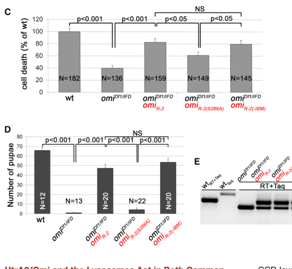

## Question

# Gene Research for Functional Annotation

## ⚠️ CRITICAL: Gene/Protein Identification Context

**BEFORE YOU BEGIN RESEARCH:** You MUST verify you are researching the CORRECT gene/protein. Gene symbols can be ambiguous, especially for less well-characterized genes from non-model organisms.

### Target Gene/Protein Identity (from UniProt):
- **UniProt Accession:** Q9VFJ3
- **Protein Description:** RecName: Full=Serine protease HTRA2, mitochondrial {ECO:0000303|PubMed:18259196}; EC=3.4.21.108; AltName: Full=High temperature requirement protein A2 {ECO:0000250|UniProtKB:O43464}; Short=DmHtrA2 {ECO:0000312|EMBL:BAE72064.1}; Short=HtrA2 {ECO:0000303|PubMed:18259196}; AltName: Full=Omi stress-regulated endoprotease {ECO:0000303|PubMed:18259196}; Short=dOmi {ECO:0000303|PubMed:18259196}; Contains: RecName: Full=Serine protease HTRA2, mitochondrial, long {ECO:0000303|PubMed:18259196}; Contains: RecName: Full=Serine protease HTRA2, mitochondrial, short {ECO:0000303|PubMed:18259196}; Flags: Precursor;
- **Gene Information:** Name=HtrA2 {ECO:0000312|FlyBase:FBgn0038233}; Synonyms=Omi/HtrA2 {ECO:0000303|PubMed:18259196}; ORFNames=CG8464;
- **Organism (full):** Drosophila melanogaster (Fruit fly).
- **Protein Family:** Belongs to the peptidase S1C family. .
- **Key Domains:** PDZ. (IPR001478); PDZ_6. (IPR041489); PDZ_sf. (IPR036034); Peptidase_S1_PA. (IPR009003); Peptidase_S1C. (IPR001940)

### MANDATORY VERIFICATION STEPS:

1. **Check if the gene symbol "HtrA2" matches the protein description above**
2. **Verify the organism is correct:** Drosophila melanogaster (Fruit fly).
3. **Check if protein family/domains align with what you find in literature**
4. **If you find literature for a DIFFERENT gene with the same or similar symbol, STOP**

### If Gene Symbol is Ambiguous or You Cannot Find Relevant Literature:

**DO NOT PROCEED WITH RESEARCH ON A DIFFERENT GENE.** Instead:
- State clearly: "The gene symbol 'HtrA2' is ambiguous or literature is limited for this specific protein"
- Explain what you found (e.g., "Found extensive literature on a different gene with the same symbol in a different organism")
- Describe the protein based ONLY on the UniProt information provided above
- Suggest that the protein function can be inferred from domain/family information

### Research Target:

Please provide a comprehensive research report on the gene **HtrA2** (gene ID: HtrA2, UniProt: Q9VFJ3) in DROME.

The research report should be a detailed narrative explaining the function, biological processes, and localization of the gene product. Citations should be given for all claims.

You should prioritize authoritative reviews and primary scientific literature when conducting research. You can supplement
this with annotations you find in gene/protein databases, but these can be outdated or inaccurate.

We are specifically interested in the primary function of the gene - for enzymes, what reaction is catalyzed, and what is the substrate specificity? For transporters, what is the substrate? For structural proteins or adapters, what is the broader structural role? For signaling molecules, what is the role in the pathway.

We are interested in where in or outside the cell the gene product carries out its function.

We are also interested in the signaling or biochemical pathways in which the gene functions. We are less interested in broad pleiotropic effects, except where these elucidate the precise role.

Include evidence where possible. We are interested in both experimental evidence as well as inference from structure, evolution, or bioinformatic analysis. Precise studies should be prioritized over high-throughput, where available.

## Output

Question: You are an expert researcher providing comprehensive, well-cited information.

Provide detailed information focusing on:
1. Key concepts and definitions with current understanding
2. Recent developments and latest research (prioritize 2023-2024 sources)
3. Current applications and real-world implementations
4. Expert opinions and analysis from authoritative sources
5. Relevant statistics and data from recent studies

Format as a comprehensive research report with proper citations. Include URLs and publication dates where available.
Always prioritize recent, authoritative sources and provide specific citations for all major claims.

# Gene Research for Functional Annotation

## ⚠️ CRITICAL: Gene/Protein Identification Context

**BEFORE YOU BEGIN RESEARCH:** You MUST verify you are researching the CORRECT gene/protein. Gene symbols can be ambiguous, especially for less well-characterized genes from non-model organisms.

### Target Gene/Protein Identity (from UniProt):
- **UniProt Accession:** Q9VFJ3
- **Protein Description:** RecName: Full=Serine protease HTRA2, mitochondrial {ECO:0000303|PubMed:18259196}; EC=3.4.21.108; AltName: Full=High temperature requirement protein A2 {ECO:0000250|UniProtKB:O43464}; Short=DmHtrA2 {ECO:0000312|EMBL:BAE72064.1}; Short=HtrA2 {ECO:0000303|PubMed:18259196}; AltName: Full=Omi stress-regulated endoprotease {ECO:0000303|PubMed:18259196}; Short=dOmi {ECO:0000303|PubMed:18259196}; Contains: RecName: Full=Serine protease HTRA2, mitochondrial, long {ECO:0000303|PubMed:18259196}; Contains: RecName: Full=Serine protease HTRA2, mitochondrial, short {ECO:0000303|PubMed:18259196}; Flags: Precursor;
- **Gene Information:** Name=HtrA2 {ECO:0000312|FlyBase:FBgn0038233}; Synonyms=Omi/HtrA2 {ECO:0000303|PubMed:18259196}; ORFNames=CG8464;
- **Organism (full):** Drosophila melanogaster (Fruit fly).
- **Protein Family:** Belongs to the peptidase S1C family. .
- **Key Domains:** PDZ. (IPR001478); PDZ_6. (IPR041489); PDZ_sf. (IPR036034); Peptidase_S1_PA. (IPR009003); Peptidase_S1C. (IPR001940)

### MANDATORY VERIFICATION STEPS:

1. **Check if the gene symbol "HtrA2" matches the protein description above**
2. **Verify the organism is correct:** Drosophila melanogaster (Fruit fly).
3. **Check if protein family/domains align with what you find in literature**
4. **If you find literature for a DIFFERENT gene with the same or similar symbol, STOP**

### If Gene Symbol is Ambiguous or You Cannot Find Relevant Literature:

**DO NOT PROCEED WITH RESEARCH ON A DIFFERENT GENE.** Instead:
- State clearly: "The gene symbol 'HtrA2' is ambiguous or literature is limited for this specific protein"
- Explain what you found (e.g., "Found extensive literature on a different gene with the same symbol in a different organism")
- Describe the protein based ONLY on the UniProt information provided above
- Suggest that the protein function can be inferred from domain/family information

### Research Target:

Please provide a comprehensive research report on the gene **HtrA2** (gene ID: HtrA2, UniProt: Q9VFJ3) in DROME.

The research report should be a detailed narrative explaining the function, biological processes, and localization of the gene product. Citations should be given for all claims.

You should prioritize authoritative reviews and primary scientific literature when conducting research. You can supplement
this with annotations you find in gene/protein databases, but these can be outdated or inaccurate.

We are specifically interested in the primary function of the gene - for enzymes, what reaction is catalyzed, and what is the substrate specificity? For transporters, what is the substrate? For structural proteins or adapters, what is the broader structural role? For signaling molecules, what is the role in the pathway.

We are interested in where in or outside the cell the gene product carries out its function.

We are also interested in the signaling or biochemical pathways in which the gene functions. We are less interested in broad pleiotropic effects, except where these elucidate the precise role.

Include evidence where possible. We are interested in both experimental evidence as well as inference from structure, evolution, or bioinformatic analysis. Precise studies should be prioritized over high-throughput, where available.

# Functional annotation report: *Drosophila melanogaster* HtrA2

## Identity and principal function

**Identity verified.** The requested UniProt accession **Q9VFJ3** corresponds to the fly gene **HtrA2**, also called **Omi/HtrA2**, **dOmi**, or **CG8464**. Fly studies identify CG8464 as the single *D. melanogaster* Omi/HtrA2 homolog, encoding a 422-amino-acid protein with a mitochondrial-targeting region, a serine-protease domain and a C-terminal PDZ domain. The studies discussed below concern this fly protein; results obtained only with human HTRA2 are not treated as evidence for Q9VFJ3. (challa2007drosophilaomia pages 1-2, khan2008theinteractionof pages 2-3, yun2008lossoffunctionanalysissuggests pages 2-3)

**Best-supported molecular annotation:** HtrA2 is a mitochondrial **serine endopeptidase** that hydrolyzes peptide bonds in protein substrates. Its catalytic Ser266 is required for cleavage of fly inhibitor-of-apoptosis proteins and for its principal demonstrated physiological roles in spermatogonial germ-cell death and male fertility. The PDZ domain is conserved, but a specific PDZ-dependent reaction in the fly has not been established by the experiments reviewed here. (khan2008theinteractionof pages 3-4, khan2008theinteractionof pages 4-5, yacobisharon2013alternativegermcell pages 7-9, yacobisharon2013alternativegermcell media f03176f3)

## Reaction, substrates and specificity

Biochemical experiments distinguish **substrate cleavage** from HtrA2’s separate ability to **bind** inhibitor-of-apoptosis proteins (IAPs). Recombinant or immunoprecipitated fly dOmi cleaves β-casein; purified fly HtrA2 also cleaves the designed HtrA2-optimal fluorescent peptide **H2-Opt**, but not a control peptide. These are activity-assay substrates, not evidence that either is a physiological fly target. (khan2008theinteractionof pages 2-3, tain2009drosophilahtra2is pages 1-2)

**DIAP1 is a directly demonstrated fly substrate.** Mature dOmi cleaves the linker between DIAP1’s BIR1 and BIR2 domains **between Ile165 and Gly166** and can further degrade its BIR1-containing region. Replacing Ile165 with aspartate reduces cleavage at that site and shifts cleavage nearby, consistent with preference for a nonpolar aliphatic residue immediately before the scissile bond. The Ser266Ala catalytic mutant fails to cleave DIAP1. Wild-type, but not Ser266Ala, also cleaves **DIAP2** in biochemical assays. These observations establish selected substrates and a cleavage-site preference; they do **not** establish a comprehensive substrate-recognition sequence or identify the endogenous substrate responsible for the testis phenotype. (khan2008theinteractionof pages 3-4, khan2008theinteractionof pages 4-5)

## Where the protein acts

HtrA2 is synthesized as a precursor and imported into **mitochondria**, where its mature protein is associated with the **intermembrane-space compartment**. Colocalization and mitochondrial fractionation support this location. N-terminal processing yields approximately **37- and 35-kDa mature products** with different exposed N termini and IAP-binding properties. These are processed protein forms—often termed long and short—not evidence, by themselves, for two independently transcribed genes. During UV-induced cell death in fly S2 cells, dOmi moves from mitochondria into the **cytosol**, where DIAP proteins are accessible. Thus, its well-supported locations are mitochondrial under the examined basal conditions and cytosolic following an examined apoptotic stimulus; release need not occur in every tissue in which the enzyme functions. (khan2008theinteractionof pages 2-3, challa2007drosophilaomia pages 1-2, challa2007drosophilaomia pages 1-1, khan2008theinteractionof pages 3-4, challa2007drosophilaomia pages 2-5)

Processing exposes IAP-binding motifs that allow mature dOmi forms to associate with DIAP1. In cell and eye-overexpression systems, dOmi can promote death through DIAP1 antagonism and proteolysis, relieving DIAP1-mediated restraint on caspase signaling. This is a demonstrated **capacity**, not proof that HtrA2 is obligatory for routine fly apoptosis: a fly HtrA2-null study found normal development and no detectable deficit in wing-disc apoptosis after γ irradiation, staurosporine or UV under its tested conditions. (khan2008theinteractionof pages 1-2, challa2007drosophilaomia pages 1-1, tain2009drosophilahtra2is pages 2-3)

## Physiological pathway with the strongest genetic evidence: testis germ-cell death

During normal adult spermatogenesis, approximately **20%–30% of newly emerging spermatogonial cysts** undergo spontaneous programmed death. This differs from conventional effector-caspase-dependent apoptosis: the dying cysts display reactive-oxygen-species accumulation, lysosomal activity and features subsequently characterized as **programmed necrosis**. HtrA2 loss substantially suppresses this process. Heterozygosity for specified HtrA2 deficiencies or a protease-domain lesion reduced measured germ-cell death by approximately **50%–60%**; genomic rescue restored it to roughly **80% of wild-type levels** in the reported mutant background. (yacobisharon2013alternativegermcell pages 2-3, yacobisharon2013alternativegermcell pages 5-7, yacobisharon2013alternativegermcell pages 7-9, napoletano2017p53dependentprogrammednecrosis pages 4-5)

The decisive separation-of-function test compared rescue constructs: **Ser266Ala markedly impaired rescue**, whereas disruption of the proposed **IAP-binding motifs did not**. The corresponding Figure 6C–D comparisons support that distinction. Consequently, the defensible pathway annotation is **protease-dependent, largely IAP-binding-independent promotion of spermatogonial death**—not simply DIAP1 cleavage followed by canonical apoptosis. Its immediate physiological proteolytic target in these germ cells remains unknown. (yacobisharon2013alternativegermcell pages 7-9, yacobisharon2013alternativegermcell pages 5-7, yacobisharon2013alternativegermcell media f03176f3)

The testis pathway also involves **Pink1**, but not detectably **Parkin** in the reported germ-cell-death assay: *pink1* loss lowered death by approximately **40%**, while *parkin* loss had no significant effect. HtrA2-mutant testes had approximately **50% fewer LysoTracker-positive spermatogonia**; combined HtrA2 and cathepsin-D lesions lowered germ-cell death to about **20% of wild type**, compared with about **40%** in either single mutant. These genetic findings support partially overlapping and partially parallel mitochondrial–lysosomal contributions. They do not identify a protein cleaved by HtrA2 in this pathway or establish that HtrA2 directly cleaves Pink1 or a lysosomal protein. (yacobisharon2013alternativegermcell pages 9-10)

HtrA2’s catalytic function also matters for **male fertility**. One mutant combination generated only approximately **2%** of wild-type progeny; a wild-type or IAP-binding-deficient rescue construct restored production to approximately **75%**, whereas catalytic-site mutation provided little rescue. Sterility should not be attributed exclusively to the altered frequency of germ-cell death: most cysts normally survive, and mutant spermatogenesis has additional abnormalities. (yacobisharon2013alternativegermcell pages 7-9, yun2008lossoffunctionanalysissuggests pages 5-6, yacobisharon2013alternativegermcell media f03176f3)

## Mitochondrial maintenance and Pink1: evidence and disagreement

A second proposed role is protection of mitochondrial integrity during stress and aging. In one fly null-mutant study, aged animals had **mild mitochondrial ultrastructural abnormalities**, poorer locomotor performance, stress sensitivity and shortened lifespan, without a broad whole-fly respiratory defect. Double-mutant and overexpression experiments led its authors to place HtrA2 **downstream of Pink1, in a branch parallel to Parkin** rather than as Pink1’s principal effector. (tain2009drosophilahtra2is pages 4-6, tain2009drosophilahtra2is pages 3-4)

An independent fly loss-of-function study reached a narrower conclusion: *omi* mutants had largely **normal-looking testis and flight-muscle mitochondria**, lacked the characteristic muscle degeneration and dopaminergic-neuron loss reported for *pink1/parkin* mutants, and did not support an essential HtrA2 role in their mitochondrial-integrity pathway assays. Its mutants did have spermatogenesis defects, stress sensitivity and shortened lifespan. Taken together, the studies support a possible **context-dependent Pink1-associated role**, especially in the testis, but not annotation of fly HtrA2 as an indispensable component of canonical **Pink1–Parkin mitophagy**. Nor has direct cleavage of misfolded mitochondrial proteins by Q9VFJ3 been established by these genetic experiments. (yun2008lossoffunctionanalysissuggests pages 5-6, tain2009drosophilahtra2is pages 4-6, yun2008lossoffunctionanalysissuggests pages 7-8, castro2012geneticanalysisof pages 1-2)

## Current interpretation and applications

A **February 2024** review of developmental cell death emphasizes the distinction that resolves the apparent apoptosis paradox: fly HtrA2 can antagonize IAPs under some experimental conditions, but its demonstrated requirement in physiological testis germ-cell death concerns **catalytic activity rather than IAP inhibition**. Its useful research applications are accordingly as a genetically tractable model for separating protease catalysis from IAP binding, testing mitochondrial–lysosomal cell-death mechanisms, and examining Pink1-associated biology. These are **experimental-model applications**, not evidence of an established clinical intervention targeting the fly protein. In the 2023–2024 literature located for this report, recent discussion chiefly synthesized earlier fly experiments rather than establishing a new endogenous Q9VFJ3 cleavage substrate. (umargamwala2024understandingdevelopmentalcell pages 11-12, yacobisharon2013alternativegermcell media f03176f3)

**Annotation confidence.** High: fly gene identity, mitochondrial targeting/processing, serine-protease activity, direct DIAP1 cleavage, and catalytic dependence of the reported germ-cell-death and fertility phenotypes. Conditional: cytosolic proapoptotic action after experimental release. Less resolved: exact endogenous mitochondrial and germ-cell substrates, the fly PDZ domain’s mechanistic contribution, and how broadly the proposed Pink1-associated mitochondrial-maintenance role applies across tissues. (challa2007drosophilaomia pages 1-2, khan2008theinteractionof pages 4-5, yacobisharon2013alternativegermcell pages 7-9, tain2009drosophilahtra2is pages 4-6, yun2008lossoffunctionanalysissuggests pages 5-6)

### Selected sources and publication dates

- Challa *et al.*, “Drosophila Omi, a mitochondrial-localized IAP antagonist and proapoptotic serine protease,” *The EMBO Journal*, **July 2007**. https://doi.org/10.1038/sj.emboj.7601745 (challa2007drosophilaomia pages 1-2, challa2007drosophilaomia pages 1-1)
- Khan *et al.*, “The interaction of DIAP1 with dOmi/HtrA2 regulates cell death in Drosophila,” *Cell Death & Differentiation*, **February 2008**. https://doi.org/10.1038/cdd.2008.19 (khan2008theinteractionof pages 3-4, khan2008theinteractionof pages 4-5)
- Yun *et al.*, “Loss-of-function analysis suggests that Omi/HtrA2 is not an essential component of the pink1/parkin pathway in vivo,” *Journal of Neuroscience*, **December 2008**. https://doi.org/10.1523/JNEUROSCI.5141-08.2008 (yun2008lossoffunctionanalysissuggests pages 2-3, yun2008lossoffunctionanalysissuggests pages 5-6)
- Tain *et al.*, “Drosophila HtrA2 is dispensable for apoptosis but acts downstream of PINK1 independently from Parkin,” *Cell Death & Differentiation*, **March 2009**. https://doi.org/10.1038/cdd.2009.23 (tain2009drosophilahtra2is pages 2-3, tain2009drosophilahtra2is pages 4-6)
- Yacobi-Sharon *et al.*, “Alternative germ cell death pathway in Drosophila involves HtrA2/Omi, lysosomes, and a caspase-9 counterpart,” *Developmental Cell*, **April 2013**. https://doi.org/10.1016/j.devcel.2013.02.002 (yacobisharon2013alternativegermcell pages 5-7, yacobisharon2013alternativegermcell pages 7-9, yacobisharon2013alternativegermcell media f03176f3)
- Napoletano *et al.*, “p53-dependent programmed necrosis controls germ cell homeostasis during spermatogenesis,” *PLOS Genetics*, **September 2017**. https://doi.org/10.1371/journal.pgen.1007024 (napoletano2017p53dependentprogrammednecrosis pages 4-5)
- Umargamwala *et al.*, “Understanding Developmental Cell Death Using Drosophila as a Model System,” *Cells*, **February 2024**. https://doi.org/10.3390/cells13040347 (umargamwala2024understandingdevelopmentalcell pages 11-12)

References

1. (challa2007drosophilaomia pages 1-2): Madhavi Challa, Srinivas Malladi, Brett J Pellock, Douglas Dresnek, Shankar Varadarajan, Y Whitney Yin, Kristin White, and Shawn B Bratton. Drosophila omi, a mitochondrial‐localized iap antagonist and proapoptotic serine protease. The EMBO Journal, 26:3144-3156, Jul 2007. URL: https://doi.org/10.1038/sj.emboj.7601745, doi:10.1038/sj.emboj.7601745. This article has 66 citations.

2. (khan2008theinteractionof pages 2-3): F. S. Khan, M. Fujioka, P. Datta, T. Fernandes‐Alnemri, J. B. Jaynes, and E. Alnemri. The interaction of diap1 with domi/htra2 regulates cell death in drosophila. Cell Death and Differentiation, 15:1073-1083, Feb 2008. URL: https://doi.org/10.1038/cdd.2008.19, doi:10.1038/cdd.2008.19. This article has 36 citations and is from a domain leading peer-reviewed journal.

3. (yun2008lossoffunctionanalysissuggests pages 2-3): Jina Yun, Joseph H. Cao, Mark W. Dodson, Ira E. Clark, Pankaj Kapahi, Ruhena B. Chowdhury, and Ming Guo. Loss-of-function analysis suggests that omi/htra2 is not an essential component of the pink1/parkin pathway in vivo. The Journal of Neuroscience, 28:14500-14510, Dec 2008. URL: https://doi.org/10.1523/jneurosci.5141-08.2008, doi:10.1523/jneurosci.5141-08.2008. This article has 101 citations.

4. (khan2008theinteractionof pages 3-4): F. S. Khan, M. Fujioka, P. Datta, T. Fernandes‐Alnemri, J. B. Jaynes, and E. Alnemri. The interaction of diap1 with domi/htra2 regulates cell death in drosophila. Cell Death and Differentiation, 15:1073-1083, Feb 2008. URL: https://doi.org/10.1038/cdd.2008.19, doi:10.1038/cdd.2008.19. This article has 36 citations and is from a domain leading peer-reviewed journal.

5. (khan2008theinteractionof pages 4-5): F. S. Khan, M. Fujioka, P. Datta, T. Fernandes‐Alnemri, J. B. Jaynes, and E. Alnemri. The interaction of diap1 with domi/htra2 regulates cell death in drosophila. Cell Death and Differentiation, 15:1073-1083, Feb 2008. URL: https://doi.org/10.1038/cdd.2008.19, doi:10.1038/cdd.2008.19. This article has 36 citations and is from a domain leading peer-reviewed journal.

6. (yacobisharon2013alternativegermcell pages 7-9): Keren Yacobi-Sharon, Yuval Namdar, and Eli Arama. Alternative germ cell death pathway in drosophila involves htra2/omi, lysosomes, and a caspase-9 counterpart. Developmental cell, 25 1:29-42, Apr 2013. URL: https://doi.org/10.1016/j.devcel.2013.02.002, doi:10.1016/j.devcel.2013.02.002. This article has 153 citations and is from a highest quality peer-reviewed journal.

7. (yacobisharon2013alternativegermcell media f03176f3): Keren Yacobi-Sharon, Yuval Namdar, and Eli Arama. Alternative germ cell death pathway in drosophila involves htra2/omi, lysosomes, and a caspase-9 counterpart. Developmental cell, 25 1:29-42, Apr 2013. URL: https://doi.org/10.1016/j.devcel.2013.02.002, doi:10.1016/j.devcel.2013.02.002. This article has 153 citations and is from a highest quality peer-reviewed journal.

8. (tain2009drosophilahtra2is pages 1-2): L. Tain, Ruhena B. Chowdhury, R. Tao, H. Plun-Favreau, N. Moisoi, L. Martins, J. Downward, Alexander J. Whitworth, and N. Tapon. Drosophila htra2 is dispensable for apoptosis but acts downstream of pink1 independently from parkin. Cell Death &amp; Differentiation, 16:1118-1125, Mar 2009. URL: https://doi.org/10.1038/cdd.2009.23, doi:10.1038/cdd.2009.23. This article has 106 citations and is from a domain leading peer-reviewed journal.

9. (challa2007drosophilaomia pages 1-1): Madhavi Challa, Srinivas Malladi, Brett J Pellock, Douglas Dresnek, Shankar Varadarajan, Y Whitney Yin, Kristin White, and Shawn B Bratton. Drosophila omi, a mitochondrial‐localized iap antagonist and proapoptotic serine protease. The EMBO Journal, 26:3144-3156, Jul 2007. URL: https://doi.org/10.1038/sj.emboj.7601745, doi:10.1038/sj.emboj.7601745. This article has 66 citations.

10. (challa2007drosophilaomia pages 2-5): Madhavi Challa, Srinivas Malladi, Brett J Pellock, Douglas Dresnek, Shankar Varadarajan, Y Whitney Yin, Kristin White, and Shawn B Bratton. Drosophila omi, a mitochondrial‐localized iap antagonist and proapoptotic serine protease. The EMBO Journal, 26:3144-3156, Jul 2007. URL: https://doi.org/10.1038/sj.emboj.7601745, doi:10.1038/sj.emboj.7601745. This article has 66 citations.

11. (khan2008theinteractionof pages 1-2): F. S. Khan, M. Fujioka, P. Datta, T. Fernandes‐Alnemri, J. B. Jaynes, and E. Alnemri. The interaction of diap1 with domi/htra2 regulates cell death in drosophila. Cell Death and Differentiation, 15:1073-1083, Feb 2008. URL: https://doi.org/10.1038/cdd.2008.19, doi:10.1038/cdd.2008.19. This article has 36 citations and is from a domain leading peer-reviewed journal.

12. (tain2009drosophilahtra2is pages 2-3): L. Tain, Ruhena B. Chowdhury, R. Tao, H. Plun-Favreau, N. Moisoi, L. Martins, J. Downward, Alexander J. Whitworth, and N. Tapon. Drosophila htra2 is dispensable for apoptosis but acts downstream of pink1 independently from parkin. Cell Death &amp; Differentiation, 16:1118-1125, Mar 2009. URL: https://doi.org/10.1038/cdd.2009.23, doi:10.1038/cdd.2009.23. This article has 106 citations and is from a domain leading peer-reviewed journal.

13. (yacobisharon2013alternativegermcell pages 2-3): Keren Yacobi-Sharon, Yuval Namdar, and Eli Arama. Alternative germ cell death pathway in drosophila involves htra2/omi, lysosomes, and a caspase-9 counterpart. Developmental cell, 25 1:29-42, Apr 2013. URL: https://doi.org/10.1016/j.devcel.2013.02.002, doi:10.1016/j.devcel.2013.02.002. This article has 153 citations and is from a highest quality peer-reviewed journal.

14. (yacobisharon2013alternativegermcell pages 5-7): Keren Yacobi-Sharon, Yuval Namdar, and Eli Arama. Alternative germ cell death pathway in drosophila involves htra2/omi, lysosomes, and a caspase-9 counterpart. Developmental cell, 25 1:29-42, Apr 2013. URL: https://doi.org/10.1016/j.devcel.2013.02.002, doi:10.1016/j.devcel.2013.02.002. This article has 153 citations and is from a highest quality peer-reviewed journal.

15. (napoletano2017p53dependentprogrammednecrosis pages 4-5): Francesco Napoletano, Benjamin Gibert, Keren Yacobi-Sharon, Stéphane Vincent, Clémentine Favrot, Patrick Mehlen, Victor Girard, Margaux Teil, Gilles Chatelain, Ludivine Walter, Eli Arama, and Bertrand Mollereau. P53-dependent programmed necrosis controls germ cell homeostasis during spermatogenesis. PLOS Genetics, 13:e1007024, Sep 2017. URL: https://doi.org/10.1371/journal.pgen.1007024, doi:10.1371/journal.pgen.1007024. This article has 95 citations and is from a domain leading peer-reviewed journal.

16. (yacobisharon2013alternativegermcell pages 9-10): Keren Yacobi-Sharon, Yuval Namdar, and Eli Arama. Alternative germ cell death pathway in drosophila involves htra2/omi, lysosomes, and a caspase-9 counterpart. Developmental cell, 25 1:29-42, Apr 2013. URL: https://doi.org/10.1016/j.devcel.2013.02.002, doi:10.1016/j.devcel.2013.02.002. This article has 153 citations and is from a highest quality peer-reviewed journal.

17. (yun2008lossoffunctionanalysissuggests pages 5-6): Jina Yun, Joseph H. Cao, Mark W. Dodson, Ira E. Clark, Pankaj Kapahi, Ruhena B. Chowdhury, and Ming Guo. Loss-of-function analysis suggests that omi/htra2 is not an essential component of the pink1/parkin pathway in vivo. The Journal of Neuroscience, 28:14500-14510, Dec 2008. URL: https://doi.org/10.1523/jneurosci.5141-08.2008, doi:10.1523/jneurosci.5141-08.2008. This article has 101 citations.

18. (tain2009drosophilahtra2is pages 4-6): L. Tain, Ruhena B. Chowdhury, R. Tao, H. Plun-Favreau, N. Moisoi, L. Martins, J. Downward, Alexander J. Whitworth, and N. Tapon. Drosophila htra2 is dispensable for apoptosis but acts downstream of pink1 independently from parkin. Cell Death &amp; Differentiation, 16:1118-1125, Mar 2009. URL: https://doi.org/10.1038/cdd.2009.23, doi:10.1038/cdd.2009.23. This article has 106 citations and is from a domain leading peer-reviewed journal.

19. (tain2009drosophilahtra2is pages 3-4): L. Tain, Ruhena B. Chowdhury, R. Tao, H. Plun-Favreau, N. Moisoi, L. Martins, J. Downward, Alexander J. Whitworth, and N. Tapon. Drosophila htra2 is dispensable for apoptosis but acts downstream of pink1 independently from parkin. Cell Death &amp; Differentiation, 16:1118-1125, Mar 2009. URL: https://doi.org/10.1038/cdd.2009.23, doi:10.1038/cdd.2009.23. This article has 106 citations and is from a domain leading peer-reviewed journal.

20. (yun2008lossoffunctionanalysissuggests pages 7-8): Jina Yun, Joseph H. Cao, Mark W. Dodson, Ira E. Clark, Pankaj Kapahi, Ruhena B. Chowdhury, and Ming Guo. Loss-of-function analysis suggests that omi/htra2 is not an essential component of the pink1/parkin pathway in vivo. The Journal of Neuroscience, 28:14500-14510, Dec 2008. URL: https://doi.org/10.1523/jneurosci.5141-08.2008, doi:10.1523/jneurosci.5141-08.2008. This article has 101 citations.

21. (castro2012geneticanalysisof pages 1-2): I. P. D. Castro, A. C. Costa, D. Lam, R. Tufi, V. Fedele, N. Moisoi, D. Dinsdale, E. Deas, Shy Loh, and L. M. Martins. Genetic analysis of mitochondrial protein misfolding in drosophila melanogaster. Cell Death and Differentiation, 19:1308-1316, Feb 2012. URL: https://doi.org/10.1038/cdd.2012.5, doi:10.1038/cdd.2012.5. This article has 155 citations and is from a domain leading peer-reviewed journal.

22. (umargamwala2024understandingdevelopmentalcell pages 11-12): Ruchi Umargamwala, Jantina Manning, Loretta Dorstyn, Donna Denton, and Sharad Kumar. Understanding developmental cell death using drosophila as a model system. Cells, 13:347, Feb 2024. URL: https://doi.org/10.3390/cells13040347, doi:10.3390/cells13040347. This article has 14 citations.

## Artifacts

- [Edison artifact artifact-00](HtrA2-deep-research-falcon_artifacts/artifact-00.md)

## Citations

1. yacobisharon2013alternativegermcell pages 9-10
2. umargamwala2024understandingdevelopmentalcell pages 11-12
3. challa2007drosophilaomia pages 1-2
4. khan2008theinteractionof pages 2-3
5. yun2008lossoffunctionanalysissuggests pages 2-3
6. khan2008theinteractionof pages 3-4
7. khan2008theinteractionof pages 4-5
8. yacobisharon2013alternativegermcell pages 7-9
9. challa2007drosophilaomia pages 1-1
10. challa2007drosophilaomia pages 2-5
11. khan2008theinteractionof pages 1-2
12. yacobisharon2013alternativegermcell pages 2-3
13. yacobisharon2013alternativegermcell pages 5-7
14. yun2008lossoffunctionanalysissuggests pages 5-6
15. yun2008lossoffunctionanalysissuggests pages 7-8
16. castro2012geneticanalysisof pages 1-2
17. https://doi.org/10.1038/sj.emboj.7601745
18. https://doi.org/10.1038/cdd.2008.19
19. https://doi.org/10.1523/JNEUROSCI.5141-08.2008
20. https://doi.org/10.1038/cdd.2009.23
21. https://doi.org/10.1016/j.devcel.2013.02.002
22. https://doi.org/10.1371/journal.pgen.1007024
23. https://doi.org/10.3390/cells13040347
24. https://doi.org/10.1038/sj.emboj.7601745,
25. https://doi.org/10.1038/cdd.2008.19,
26. https://doi.org/10.1523/jneurosci.5141-08.2008,
27. https://doi.org/10.1016/j.devcel.2013.02.002,
28. https://doi.org/10.1038/cdd.2009.23,
29. https://doi.org/10.1371/journal.pgen.1007024,
30. https://doi.org/10.1038/cdd.2012.5,
31. https://doi.org/10.3390/cells13040347,