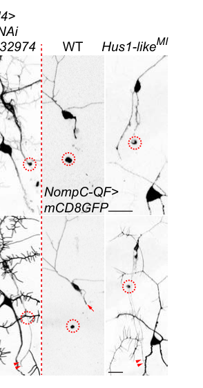

## Question

# Gene Research for Functional Annotation

## ⚠️ CRITICAL: Gene/Protein Identification Context

**BEFORE YOU BEGIN RESEARCH:** You MUST verify you are researching the CORRECT gene/protein. Gene symbols can be ambiguous, especially for less well-characterized genes from non-model organisms.

### Target Gene/Protein Identity (from UniProt):
- **UniProt Accession:** Q9VN60
- **Protein Description:** RecName: Full=Checkpoint protein Hus1-like {ECO:0000255|PIRNR:PIRNR011312};
- **Gene Information:** Name=Hus1-like {ECO:0000312|FlyBase:FBgn0026417}; Synonyms=Hus1 {ECO:0000312|FlyBase:FBgn0026417}; ORFNames=CG2525 {ECO:0000312|FlyBase:FBgn0026417};
- **Organism (full):** Drosophila melanogaster (Fruit fly).
- **Protein Family:** Belongs to the HUS1 family.
- **Key Domains:** HUS1. (IPR016580); HUS1/Mec3. (IPR007150); Hus1 (PF04005)

### MANDATORY VERIFICATION STEPS:

1. **Check if the gene symbol "Hus1-like" matches the protein description above**
2. **Verify the organism is correct:** Drosophila melanogaster (Fruit fly).
3. **Check if protein family/domains align with what you find in literature**
4. **If you find literature for a DIFFERENT gene with the same or similar symbol, STOP**

### If Gene Symbol is Ambiguous or You Cannot Find Relevant Literature:

**DO NOT PROCEED WITH RESEARCH ON A DIFFERENT GENE.** Instead:
- State clearly: "The gene symbol 'Hus1-like' is ambiguous or literature is limited for this specific protein"
- Explain what you found (e.g., "Found extensive literature on a different gene with the same symbol in a different organism")
- Describe the protein based ONLY on the UniProt information provided above
- Suggest that the protein function can be inferred from domain/family information

### Research Target:

Please provide a comprehensive research report on the gene **Hus1-like** (gene ID: Hus1-like, UniProt: Q9VN60) in DROME.

The research report should be a detailed narrative explaining the function, biological processes, and localization of the gene product. Citations should be given for all claims.

You should prioritize authoritative reviews and primary scientific literature when conducting research. You can supplement
this with annotations you find in gene/protein databases, but these can be outdated or inaccurate.

We are specifically interested in the primary function of the gene - for enzymes, what reaction is catalyzed, and what is the substrate specificity? For transporters, what is the substrate? For structural proteins or adapters, what is the broader structural role? For signaling molecules, what is the role in the pathway.

We are interested in where in or outside the cell the gene product carries out its function.

We are also interested in the signaling or biochemical pathways in which the gene functions. We are less interested in broad pleiotropic effects, except where these elucidate the precise role.

Include evidence where possible. We are interested in both experimental evidence as well as inference from structure, evolution, or bioinformatic analysis. Precise studies should be prioritized over high-throughput, where available.

## Output

Question: You are an expert researcher providing comprehensive, well-cited information.

Provide detailed information focusing on:
1. Key concepts and definitions with current understanding
2. Recent developments and latest research (prioritize 2023-2024 sources)
3. Current applications and real-world implementations
4. Expert opinions and analysis from authoritative sources
5. Relevant statistics and data from recent studies

Format as a comprehensive research report with proper citations. Include URLs and publication dates where available.
Always prioritize recent, authoritative sources and provide specific citations for all major claims.

# Gene Research for Functional Annotation

## ⚠️ CRITICAL: Gene/Protein Identification Context

**BEFORE YOU BEGIN RESEARCH:** You MUST verify you are researching the CORRECT gene/protein. Gene symbols can be ambiguous, especially for less well-characterized genes from non-model organisms.

### Target Gene/Protein Identity (from UniProt):
- **UniProt Accession:** Q9VN60
- **Protein Description:** RecName: Full=Checkpoint protein Hus1-like {ECO:0000255|PIRNR:PIRNR011312};
- **Gene Information:** Name=Hus1-like {ECO:0000312|FlyBase:FBgn0026417}; Synonyms=Hus1 {ECO:0000312|FlyBase:FBgn0026417}; ORFNames=CG2525 {ECO:0000312|FlyBase:FBgn0026417};
- **Organism (full):** Drosophila melanogaster (Fruit fly).
- **Protein Family:** Belongs to the HUS1 family.
- **Key Domains:** HUS1. (IPR016580); HUS1/Mec3. (IPR007150); Hus1 (PF04005)

### MANDATORY VERIFICATION STEPS:

1. **Check if the gene symbol "Hus1-like" matches the protein description above**
2. **Verify the organism is correct:** Drosophila melanogaster (Fruit fly).
3. **Check if protein family/domains align with what you find in literature**
4. **If you find literature for a DIFFERENT gene with the same or similar symbol, STOP**

### If Gene Symbol is Ambiguous or You Cannot Find Relevant Literature:

**DO NOT PROCEED WITH RESEARCH ON A DIFFERENT GENE.** Instead:
- State clearly: "The gene symbol 'Hus1-like' is ambiguous or literature is limited for this specific protein"
- Explain what you found (e.g., "Found extensive literature on a different gene with the same symbol in a different organism")
- Describe the protein based ONLY on the UniProt information provided above
- Suggest that the protein function can be inferred from domain/family information

### Research Target:

Please provide a comprehensive research report on the gene **Hus1-like** (gene ID: Hus1-like, UniProt: Q9VN60) in DROME.

The research report should be a detailed narrative explaining the function, biological processes, and localization of the gene product. Citations should be given for all claims.

You should prioritize authoritative reviews and primary scientific literature when conducting research. You can supplement
this with annotations you find in gene/protein databases, but these can be outdated or inaccurate.

We are specifically interested in the primary function of the gene - for enzymes, what reaction is catalyzed, and what is the substrate specificity? For transporters, what is the substrate? For structural proteins or adapters, what is the broader structural role? For signaling molecules, what is the role in the pathway.

We are interested in where in or outside the cell the gene product carries out its function.

We are also interested in the signaling or biochemical pathways in which the gene functions. We are less interested in broad pleiotropic effects, except where these elucidate the precise role.

Include evidence where possible. We are interested in both experimental evidence as well as inference from structure, evolution, or bioinformatic analysis. Precise studies should be prioritized over high-throughput, where available.

# Functional annotation of *Drosophila melanogaster* Hus1-like (Q9VN60)

## Identity and principal function

**Identity check:** The target is the fruit-fly gene *Hus1-like* (also *Hus1*; CG2525; FlyBase FBgn0026417), encoding UniProt Q9VN60—not a mammalian HUS1 gene. The supplied UniProt annotation assigns it to the HUS1 family and identifies HUS1/HUS1-Mec3 domains. An independent comparative review lists fly Hus1-like as the HUS1/Mec3 counterpart among PCNA-like DNA-checkpoint-clamp proteins. This supports its annotation as a **structural checkpoint-clamp subunit**, not an enzyme or transporter; the review does not itself establish clamp assembly in flies. Database records: https://www.uniprot.org/uniprotkb/Q9VN60/entry and https://flybase.org/reports/FBgn0026417.html. (hochwagen2006checkingyourbreaks pages 6-7)

The best-supported molecular model places Hus1-like in the **9-1-1 checkpoint clamp**, whose three conserved subunits are RAD9, HUS1 and RAD1. The ring acts as a DNA-associated platform for damage- and replication-stress signaling. The role of Q9VN60 *within a purified fly clamp*, its direct binding partners and its precise biochemical activity have not been demonstrated by the studies identified here; those details remain homology-based assignments. In particular, the RAD17 discussed as a fly checkpoint *loader* must not be confused with the unrelated naming of the Rad17 *clamp subunit* in budding yeast. (hochwagen2006checkingyourbreaks pages 6-7, li2021theatrchek1pathwaya pages 8-11, zheng2023structuresof911 pages 1-3, zheng2023structuresof911 pages 12-13)

The evidence grades underlying this annotation are summarized below.

| Annotation | Evidence and species | Qualification |
|---|---|---|
| **Identity and family:** *D. melanogaster* Hus1-like is CG2525/FBgn0026417, UniProt Q9VN60, a HUS1-family protein containing HUS1 and HUS1/Mec3 domains and predicted to be a PCNA-like checkpoint-clamp subunit. | Identity and domains are from the supplied UniProt record. A comparative review assigns fly Hus1-like to the conserved Mec3/HUS1 PCNA-like clamp class (hochwagen2006checkingyourbreaks pages 6-7). | **High confidence for identity and family; inferred molecular role.** The comparative review does not directly demonstrate CG2525 complex assembly or clamp activity. |
| **Direct fly phenotype:** Hus1-like normally restrains injured sensory-axon regrowth. The MI11259 insertion abolished its expression and increased regeneration of class III dendritic-arborization neurons; a separate insertion in neighboring *ctrip* caused no regeneration phenotype. | Direct *D. melanogaster* mutant study by Li et al., 2021 (li2021theatrchek1pathway pages 4-6, li2021theatrchek1pathwaya pages 8-11). | **Moderate direct evidence.** The neighboring-gene control supports attribution to Hus1-like, but no Hus1-like transgenic rescue or gene-specific RNAi replication was reported. |
| **Conserved mechanism:** HUS1/Mec3 is one subunit of the heterotrimeric PCNA-like 9-1-1 ring. Rad24–RFC loads the yeast clamp preferentially onto pre-existing DNA gaps of approximately 5 nt or longer; human structures confirm the RAD9–RAD1–HUS1 ring and regulated recruitment surfaces. | Biochemistry and cryo-EM in *S. cerevisiae* (zheng2023structuresof911 pages 1-3, zheng2023structuresof911 pages 12-13); structural and biochemical studies using human proteins (hara2024structuralbasisfor pages 2-4, hara2024structuralbasisfor pages 4-6). | **Strong conserved-system evidence but indirect for Q9VN60.** In budding yeast, Rad17 is a 9-1-1 clamp subunit and Rad24 is the alternative-loader subunit; these names must not be conflated with Drosophila or mammalian RAD17 loader proteins. |
| **Localization:** Hus1-like is predicted to operate in the nucleus at damaged or replication-stressed chromosomal DNA as part of a topologically loaded checkpoint clamp. | Conserved 9-1-1 mechanisms place the clamp at 5′-recessed ssDNA–dsDNA junctions and DNA gaps (yates2025dnadamageand pages 17-19). | **Inference only for fly Hus1-like.** No direct CG2525 localization, chromatin-recruitment, or damage-focus experiment was identified; localization observations for fly Mei-41/ATR or human ATR cannot be reassigned to Hus1-like (li2021theatrchek1pathway pages 4-6). |

*Table: Evidence hierarchy for functional annotation of Drosophila Hus1-like/Q9VN60, separating direct fly findings from conserved yeast and human checkpoint-clamp mechanisms. It highlights unresolved questions about rescue, complex biochemistry, and localization.*

## Checkpoint pathway and biochemical context

In established yeast and mammalian systems, an alternative RAD17–RFC clamp loader (Rad24–RFC in budding yeast) loads 9-1-1 onto DNA containing a recessed **5′ single-strand/double-strand junction**. RPA-coated single-stranded DNA helps organize checkpoint signaling; loaded 9-1-1 provides a platform for recruitment of TopBP1/Dpb11, which activates ATR/Mec1. ATR-associated signaling can then engage downstream checkpoint kinases. This is a mechanistic explanation for Hus1-like’s *predicted* role, **not** a substrate-specificity assay on fly Q9VN60. The human/yeast pathway also contains species-dependent interactions, so individual recruitment mechanisms should not be transferred to flies without testing. (yates2025dnadamageand pages 17-19, yates2025dnadamageand pages 5-7)

Recent research sharpens—but does not directly validate—the prediction for flies. **Zheng and colleagues, *Cell Reports*, 25 July 2023** (https://doi.org/10.1016/j.celrep.2023.112694), used *Saccharomyces cerevisiae* proteins to resolve multiple cryo-EM intermediates of Rad24–RFC loading the Ddc1–Mec3–Rad17 clamp. In their biochemical system, a pre-existing DNA gap was favored over an isolated recessed 5′ end: approximately **5–30-nucleotide gaps** supported loading, whereas a nick or one-nucleotide gap did not under the tested conditions. These numbers describe *yeast clamp loading*, not measured DNA-substrate preferences of Drosophila Hus1-like. (zheng2023structuresof911 pages 3-5, zheng2023structuresof911 pages 7-8, zheng2023structuresof911 pages 12-13)

**Hara and colleagues, *Journal of Biological Chemistry*, March 2024** (https://doi.org/10.1016/j.jbc.2024.105751), structurally and biochemically characterized interaction surfaces on the **human** 9-1-1 clamp, including a RAD9 surface bound by RHINO. This reinforces the view of 9-1-1 as a protein-recruitment scaffold, but neither a fly RHINO interaction nor equivalent binding residues in Q9VN60 were established. A current expert synthesis—**Yates, Zhang and Burgers, *Annual Review of Biochemistry*, June 2025** (https://doi.org/10.1146/annurev-biochem-072324-031915)—likewise identifies 9-1-1 as a DNA-damage co-sensor while noting that details of recognition of the loaded clamp by TopBP1 and ATR remain unresolved. (hara2024structuralbasisfor pages 2-4, hara2024structuralbasisfor pages 4-6, yates2025dnadamageand pages 19-21)

## Direct evidence in Drosophila and biological process

The clearest gene-specific experiment is **Li and colleagues, *Nature Communications*, June 2021** (https://doi.org/10.1038/s41467-021-24131-7). Their *Hus1-like*^MI11259^ insertion **abolished detectable Hus1-like expression** and increased axon regrowth after injury in larval class III dendritic-arborization sensory neurons. Because the insertion also mapped near the promoter of neighboring *ctrip*, the investigators tested an independent *ctrip* insertion; it **did not** produce the regeneration phenotype. Figure 3 shows the Hus1-like mutant and controls in the regeneration assay. Thus, Hus1-like has direct fly genetic evidence for **restraining sensory-axon regeneration**; the neighboring-gene control strengthens, but does not replace, a Hus1-like-specific rescue experiment. (li2021theatrchek1pathway pages 4-6, li2021theatrchek1pathwaya pages 8-11, li2021theatrchek1pathway media 8d53ea10)

In the same study, neuron-targeted depletion of checkpoint-associated *Rad1*, *Rad17*, *Atrip/mus304*, *TopBP1/mus101* and *Claspin* also enhanced regeneration. These parallel perturbations make participation of Hus1-like in an ATR/Mei-41–CHK1/Grapes-associated pathway plausible, but they are **not** physical-interaction measurements on Hus1-like. Tests of injury-associated phospho-His2Av and several RPA perturbations did not support a requirement for the conventional DNA-damage-sensing step in this neuronal assay. Consequently, the proposed neuronal role is checkpoint-component-dependent **without demonstrated DNA damage as the initiating signal**; it should not be mistaken for proof that fly Hus1-like loads onto neuronal DNA gaps after injury. (li2021theatrchek1pathway pages 4-6, li2021theatrchek1pathwaya pages 8-11)

The authors further linked Piezo-dependent mechanosensation and nitric-oxide signaling to ATR–CHK1-mediated inhibition of regeneration. Their reported improvements in post-injury touch responses and synapse-associated regrowth were tested particularly with *mus101*, *Rad17* and *mei41* manipulations—not as functional-recovery outcomes of *Hus1-like*^MI11259^ itself. Similarly, the mouse HUS1-knockout finding of **5–10-fold** increased hydroxyurea sensitivity in a particular cultured-cell background is useful comparative evidence for HUS1-family genome-maintenance functions, but is **not a fly Hus1-like statistic**. (li2021theatrchek1pathwaya pages 11-14, weiss2000inactivationofmouse pages 6-9)

## Site of action and limits of the annotation

For the **canonical DNA-checkpoint role**, the expected site of action is **inside the nucleus, on chromosomal DNA at suitable DNA junctions**, because 9-1-1 is a topologically loaded DNA clamp in the biochemically characterized systems. However, the cited fly work does **not** directly visualize Q9VN60, show its recruitment to chromatin, or establish whether it occupies the nucleus in injured neurons. Nuclear observations about ATR/Mei-41 or human ATR cannot be reassigned to Hus1-like. No extracellular, membrane-transporter or catalytic localization is indicated by the available evidence. (li2021theatrchek1pathway pages 4-6, yates2025dnadamageand pages 17-19)

**Assessment:** Q9VN60 is confidently identified as the *D. melanogaster* HUS1-family protein and is best annotated as a **predicted 9-1-1 checkpoint-clamp scaffold component** involved in ATR-associated signaling. Its experimentally demonstrated fly phenotype is suppression of sensory-neuron axon regrowth. Direct Q9VN60 complex purification, DNA-junction loading/substrate assays, intracellular localization, and rescue of the insertion phenotype remain important gaps. The 2023–2024 structural advances concern yeast or human 9-1-1; no comparably specific 2023–2024 experimental study of fly Q9VN60 was identified in the literature examined. (hochwagen2006checkingyourbreaks pages 6-7, li2021theatrchek1pathway pages 4-6, hara2024structuralbasisfor pages 2-4, zheng2023structuresof911 pages 12-13)

References

1. (hochwagen2006checkingyourbreaks pages 6-7): Andreas Hochwagen and Angelika Amon. Checking your breaks: surveillance mechanisms of meiotic recombination. Current Biology, 16:R217-R228, Mar 2006. URL: https://doi.org/10.1016/j.cub.2006.03.009, doi:10.1016/j.cub.2006.03.009. This article has 191 citations and is from a highest quality peer-reviewed journal.

2. (li2021theatrchek1pathwaya pages 8-11): Feng Li, Tsz Y. Lo, Leann Miles, Qin Wang, H. Noristani, Dan Li, Jingwen Niu, Shannon Trombley, Jessica I Goldshteyn, Chuxi Wang, Shuchao Wang, Jingyun Qiu, K. Pogoda, K. Mandal, M. Brewster, P. Rompolas, Ye He, P. Janmey, Gareth M. Thomas, Shu-Xin Li, and Yuanquan Song. The atr-chek1 pathway inhibits axon regeneration in response to piezo-dependent mechanosensation. BioRxiv, Jun 2021. URL: https://doi.org/10.1101/2020.06.03.132126, doi:10.1101/2020.06.03.132126. This article has 66 citations.

3. (zheng2023structuresof911 pages 1-3): Fengwei Zheng, Roxana E. Georgescu, Nina Y. Yao, Michael E. O’Donnell, and Huilin Li. Structures of 9-1-1 dna checkpoint clamp loading at gaps from start to finish and ramification on biology. Cell Reports, 42:112694, Jul 2023. URL: https://doi.org/10.1016/j.celrep.2023.112694, doi:10.1016/j.celrep.2023.112694. This article has 15 citations and is from a highest quality peer-reviewed journal.

4. (zheng2023structuresof911 pages 12-13): Fengwei Zheng, Roxana E. Georgescu, Nina Y. Yao, Michael E. O’Donnell, and Huilin Li. Structures of 9-1-1 dna checkpoint clamp loading at gaps from start to finish and ramification on biology. Cell Reports, 42:112694, Jul 2023. URL: https://doi.org/10.1016/j.celrep.2023.112694, doi:10.1016/j.celrep.2023.112694. This article has 15 citations and is from a highest quality peer-reviewed journal.

5. (li2021theatrchek1pathway pages 4-6): Feng Li, Tsz Y. Lo, Leann Miles, Qin Wang, Dan Li, Jingwen Niu, Jessica I Goldshteyn, Chuxi Wang, Shuchao Wang, Jingyun Qiu, Shannon Trombley, Katarzyna Pogoda, Megan Brewster, Panteleimon Rompolas, Ye He, Paul A. Janmey, Gareth M. Thomas, and Yuanquan Song. The atr-chek1 pathway inhibits axon regeneration in response to piezo-dependent mechanosensation. Nature Communications, Jun 2021. URL: https://doi.org/10.1038/s41467-021-24131-7, doi:10.1038/s41467-021-24131-7. This article has 66 citations and is from a highest quality peer-reviewed journal.

6. (hara2024structuralbasisfor pages 2-4): Kodai Hara, Kensuke Tatsukawa, Kiho Nagata, Nao Iida, Asami Hishiki, Eiji Ohashi, and Hiroshi Hashimoto. Structural basis for intra- and intermolecular interactions on rad9 subunit of 9-1-1 checkpoint clamp implies functional 9-1-1 regulation by rhino. Journal of Biological Chemistry, 300:105751, Mar 2024. URL: https://doi.org/10.1016/j.jbc.2024.105751, doi:10.1016/j.jbc.2024.105751. This article has 7 citations and is from a domain leading peer-reviewed journal.

7. (hara2024structuralbasisfor pages 4-6): Kodai Hara, Kensuke Tatsukawa, Kiho Nagata, Nao Iida, Asami Hishiki, Eiji Ohashi, and Hiroshi Hashimoto. Structural basis for intra- and intermolecular interactions on rad9 subunit of 9-1-1 checkpoint clamp implies functional 9-1-1 regulation by rhino. Journal of Biological Chemistry, 300:105751, Mar 2024. URL: https://doi.org/10.1016/j.jbc.2024.105751, doi:10.1016/j.jbc.2024.105751. This article has 7 citations and is from a domain leading peer-reviewed journal.

8. (yates2025dnadamageand pages 17-19): Luke A. Yates, Xiaodong Zhang, and Peter M. Burgers. Dna damage and replication stress checkpoints. Annual Review of Biochemistry, 94:195-221, Jun 2025. URL: https://doi.org/10.1146/annurev-biochem-072324-031915, doi:10.1146/annurev-biochem-072324-031915. This article has 40 citations and is from a domain leading peer-reviewed journal.

9. (yates2025dnadamageand pages 5-7): Luke A. Yates, Xiaodong Zhang, and Peter M. Burgers. Dna damage and replication stress checkpoints. Annual Review of Biochemistry, 94:195-221, Jun 2025. URL: https://doi.org/10.1146/annurev-biochem-072324-031915, doi:10.1146/annurev-biochem-072324-031915. This article has 40 citations and is from a domain leading peer-reviewed journal.

10. (zheng2023structuresof911 pages 3-5): Fengwei Zheng, Roxana E. Georgescu, Nina Y. Yao, Michael E. O’Donnell, and Huilin Li. Structures of 9-1-1 dna checkpoint clamp loading at gaps from start to finish and ramification on biology. Cell Reports, 42:112694, Jul 2023. URL: https://doi.org/10.1016/j.celrep.2023.112694, doi:10.1016/j.celrep.2023.112694. This article has 15 citations and is from a highest quality peer-reviewed journal.

11. (zheng2023structuresof911 pages 7-8): Fengwei Zheng, Roxana E. Georgescu, Nina Y. Yao, Michael E. O’Donnell, and Huilin Li. Structures of 9-1-1 dna checkpoint clamp loading at gaps from start to finish and ramification on biology. Cell Reports, 42:112694, Jul 2023. URL: https://doi.org/10.1016/j.celrep.2023.112694, doi:10.1016/j.celrep.2023.112694. This article has 15 citations and is from a highest quality peer-reviewed journal.

12. (yates2025dnadamageand pages 19-21): Luke A. Yates, Xiaodong Zhang, and Peter M. Burgers. Dna damage and replication stress checkpoints. Annual Review of Biochemistry, 94:195-221, Jun 2025. URL: https://doi.org/10.1146/annurev-biochem-072324-031915, doi:10.1146/annurev-biochem-072324-031915. This article has 40 citations and is from a domain leading peer-reviewed journal.

13. (li2021theatrchek1pathway media 8d53ea10): Feng Li, Tsz Y. Lo, Leann Miles, Qin Wang, H. Noristani, Dan Li, Jingwen Niu, Shannon Trombley, Jessica I Goldshteyn, Chuxi Wang, Shuchao Wang, Jingyun Qiu, K. Pogoda, K. Mandal, M. Brewster, P. Rompolas, Ye He, P. Janmey, Gareth M. Thomas, Shu-Xin Li, and Yuanquan Song. The atr-chek1 pathway inhibits axon regeneration in response to piezo-dependent mechanosensation. BioRxiv, Jun 2021. URL: https://doi.org/10.1101/2020.06.03.132126, doi:10.1101/2020.06.03.132126. This article has 66 citations.

14. (li2021theatrchek1pathwaya pages 11-14): Feng Li, Tsz Y. Lo, Leann Miles, Qin Wang, H. Noristani, Dan Li, Jingwen Niu, Shannon Trombley, Jessica I Goldshteyn, Chuxi Wang, Shuchao Wang, Jingyun Qiu, K. Pogoda, K. Mandal, M. Brewster, P. Rompolas, Ye He, P. Janmey, Gareth M. Thomas, Shu-Xin Li, and Yuanquan Song. The atr-chek1 pathway inhibits axon regeneration in response to piezo-dependent mechanosensation. BioRxiv, Jun 2021. URL: https://doi.org/10.1101/2020.06.03.132126, doi:10.1101/2020.06.03.132126. This article has 66 citations.

15. (weiss2000inactivationofmouse pages 6-9): Robert S. Weiss, Tamar Enoch, and Philip Leder. Inactivation of mouse hus1 results in genomic instability and impaired responses to genotoxic stress. Genes & development, 14 15:1886-98, Aug 2000. URL: https://doi.org/10.1101/gad.14.15.1886, doi:10.1101/gad.14.15.1886. This article has 170 citations and is from a highest quality peer-reviewed journal.

## Artifacts

- [Edison artifact artifact-00](Hus1-like-deep-research-falcon_artifacts/artifact-00.md)

## Citations

1. hochwagen2006checkingyourbreaks pages 6-7
2. yates2025dnadamageand pages 17-19
3. hara2024structuralbasisfor pages 2-4
4. hara2024structuralbasisfor pages 4-6
5. yates2025dnadamageand pages 5-7
6. yates2025dnadamageand pages 19-21
7. weiss2000inactivationofmouse pages 6-9
8. https://www.uniprot.org/uniprotkb/Q9VN60/entry
9. https://flybase.org/reports/FBgn0026417.html.
10. https://doi.org/10.1016/j.celrep.2023.112694
11. https://doi.org/10.1016/j.jbc.2024.105751
12. https://doi.org/10.1146/annurev-biochem-072324-031915
13. https://doi.org/10.1038/s41467-021-24131-7
14. https://doi.org/10.1016/j.cub.2006.03.009,
15. https://doi.org/10.1101/2020.06.03.132126,
16. https://doi.org/10.1016/j.celrep.2023.112694,
17. https://doi.org/10.1038/s41467-021-24131-7,
18. https://doi.org/10.1016/j.jbc.2024.105751,
19. https://doi.org/10.1146/annurev-biochem-072324-031915,
20. https://doi.org/10.1101/gad.14.15.1886,