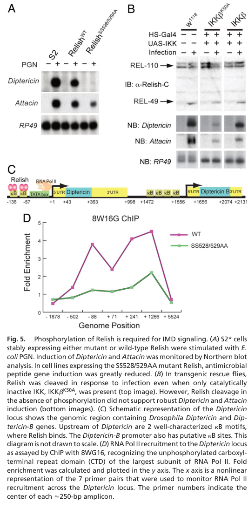

## Question

# Gene Research for Functional Annotation

## ⚠️ CRITICAL: Gene/Protein Identification Context

**BEFORE YOU BEGIN RESEARCH:** You MUST verify you are researching the CORRECT gene/protein. Gene symbols can be ambiguous, especially for less well-characterized genes from non-model organisms.

### Target Gene/Protein Identity (from UniProt):
- **UniProt Accession:** Q9VEZ5
- **Protein Description:** RecName: Full=Inhibitor of nuclear factor kappa-B kinase subunit beta {ECO:0000305}; Short=I-kappaB kinase subunit beta {ECO:0000312|FlyBase:FBgn0024222}; EC=2.7.11.10; AltName: Full=Cactus kinase IKK {ECO:0000303|Ref.6}; AltName: Full=IKK-like protein {ECO:0000303|Ref.1}; AltName: Full=Immune response deficient protein 5 {ECO:0000303|PubMed:11156609}; AltName: Full=Lipopolysaccharide-activated kinase {ECO:0000303|PubMed:10636911}; Short=DLAK {ECO:0000303|PubMed:10636911};
- **Gene Information:** Name=IKKbeta {ECO:0000312|FlyBase:FBgn0024222}; Synonyms=DIK {ECO:0000303|Ref.1}, ird5 {ECO:0000303|PubMed:11156609}; ORFNames=CG4201 {ECO:0000312|FlyBase:FBgn0024222};
- **Organism (full):** Drosophila melanogaster (Fruit fly).
- **Protein Family:** Belongs to the protein kinase superfamily. Ser/Thr protein
- **Key Domains:** IKK. (IPR051180); Kinase-like_dom_sf. (IPR011009); Prot_kinase_dom. (IPR000719); Ser/Thr_kinase_AS. (IPR008271); Pkinase (PF00069)

### MANDATORY VERIFICATION STEPS:

1. **Check if the gene symbol "IKKbeta" matches the protein description above**
2. **Verify the organism is correct:** Drosophila melanogaster (Fruit fly).
3. **Check if protein family/domains align with what you find in literature**
4. **If you find literature for a DIFFERENT gene with the same or similar symbol, STOP**

### If Gene Symbol is Ambiguous or You Cannot Find Relevant Literature:

**DO NOT PROCEED WITH RESEARCH ON A DIFFERENT GENE.** Instead:
- State clearly: "The gene symbol 'IKKbeta' is ambiguous or literature is limited for this specific protein"
- Explain what you found (e.g., "Found extensive literature on a different gene with the same symbol in a different organism")
- Describe the protein based ONLY on the UniProt information provided above
- Suggest that the protein function can be inferred from domain/family information

### Research Target:

Please provide a comprehensive research report on the gene **IKKbeta** (gene ID: IKKbeta, UniProt: Q9VEZ5) in DROME.

The research report should be a detailed narrative explaining the function, biological processes, and localization of the gene product. Citations should be given for all claims.

You should prioritize authoritative reviews and primary scientific literature when conducting research. You can supplement
this with annotations you find in gene/protein databases, but these can be outdated or inaccurate.

We are specifically interested in the primary function of the gene - for enzymes, what reaction is catalyzed, and what is the substrate specificity? For transporters, what is the substrate? For structural proteins or adapters, what is the broader structural role? For signaling molecules, what is the role in the pathway.

We are interested in where in or outside the cell the gene product carries out its function.

We are also interested in the signaling or biochemical pathways in which the gene functions. We are less interested in broad pleiotropic effects, except where these elucidate the precise role.

Include evidence where possible. We are interested in both experimental evidence as well as inference from structure, evolution, or bioinformatic analysis. Precise studies should be prioritized over high-throughput, where available.

## Output

Question: You are an expert researcher providing comprehensive, well-cited information.

Provide detailed information focusing on:
1. Key concepts and definitions with current understanding
2. Recent developments and latest research (prioritize 2023-2024 sources)
3. Current applications and real-world implementations
4. Expert opinions and analysis from authoritative sources
5. Relevant statistics and data from recent studies

Format as a comprehensive research report with proper citations. Include URLs and publication dates where available.
Always prioritize recent, authoritative sources and provide specific citations for all major claims.

# Gene Research for Functional Annotation

## ⚠️ CRITICAL: Gene/Protein Identification Context

**BEFORE YOU BEGIN RESEARCH:** You MUST verify you are researching the CORRECT gene/protein. Gene symbols can be ambiguous, especially for less well-characterized genes from non-model organisms.

### Target Gene/Protein Identity (from UniProt):
- **UniProt Accession:** Q9VEZ5
- **Protein Description:** RecName: Full=Inhibitor of nuclear factor kappa-B kinase subunit beta {ECO:0000305}; Short=I-kappaB kinase subunit beta {ECO:0000312|FlyBase:FBgn0024222}; EC=2.7.11.10; AltName: Full=Cactus kinase IKK {ECO:0000303|Ref.6}; AltName: Full=IKK-like protein {ECO:0000303|Ref.1}; AltName: Full=Immune response deficient protein 5 {ECO:0000303|PubMed:11156609}; AltName: Full=Lipopolysaccharide-activated kinase {ECO:0000303|PubMed:10636911}; Short=DLAK {ECO:0000303|PubMed:10636911};
- **Gene Information:** Name=IKKbeta {ECO:0000312|FlyBase:FBgn0024222}; Synonyms=DIK {ECO:0000303|Ref.1}, ird5 {ECO:0000303|PubMed:11156609}; ORFNames=CG4201 {ECO:0000312|FlyBase:FBgn0024222};
- **Organism (full):** Drosophila melanogaster (Fruit fly).
- **Protein Family:** Belongs to the protein kinase superfamily. Ser/Thr protein
- **Key Domains:** IKK. (IPR051180); Kinase-like_dom_sf. (IPR011009); Prot_kinase_dom. (IPR000719); Ser/Thr_kinase_AS. (IPR008271); Pkinase (PF00069)

### MANDATORY VERIFICATION STEPS:

1. **Check if the gene symbol "IKKbeta" matches the protein description above**
2. **Verify the organism is correct:** Drosophila melanogaster (Fruit fly).
3. **Check if protein family/domains align with what you find in literature**
4. **If you find literature for a DIFFERENT gene with the same or similar symbol, STOP**

### If Gene Symbol is Ambiguous or You Cannot Find Relevant Literature:

**DO NOT PROCEED WITH RESEARCH ON A DIFFERENT GENE.** Instead:
- State clearly: "The gene symbol 'IKKbeta' is ambiguous or literature is limited for this specific protein"
- Explain what you found (e.g., "Found extensive literature on a different gene with the same symbol in a different organism")
- Describe the protein based ONLY on the UniProt information provided above
- Suggest that the protein function can be inferred from domain/family information

### Research Target:

Please provide a comprehensive research report on the gene **IKKbeta** (gene ID: IKKbeta, UniProt: Q9VEZ5) in DROME.

The research report should be a detailed narrative explaining the function, biological processes, and localization of the gene product. Citations should be given for all claims.

You should prioritize authoritative reviews and primary scientific literature when conducting research. You can supplement
this with annotations you find in gene/protein databases, but these can be outdated or inaccurate.

We are specifically interested in the primary function of the gene - for enzymes, what reaction is catalyzed, and what is the substrate specificity? For transporters, what is the substrate? For structural proteins or adapters, what is the broader structural role? For signaling molecules, what is the role in the pathway.

We are interested in where in or outside the cell the gene product carries out its function.

We are also interested in the signaling or biochemical pathways in which the gene functions. We are less interested in broad pleiotropic effects, except where these elucidate the precise role.

Include evidence where possible. We are interested in both experimental evidence as well as inference from structure, evolution, or bioinformatic analysis. Precise studies should be prioritized over high-throughput, where available.

# Functional annotation report: *Drosophila melanogaster* IKKβ/Ird5

## Identity and scope

**The protein specified by UniProt Q9VEZ5 is the fruit-fly IKKβ kinase, encoded by *IKKbeta*, also called *ird5* and CG4201—not human IKBKB or another fly IKK-family protein.** The accession, CG4201 identifier and domain annotations come from the UniProt information supplied with the question. Independently, fly-specific biochemical studies identify Ird5 as the catalytic DmIKKβ subunit and Kenny as its regulatory IKKγ partner. Recombinant IKKβ phosphorylates protein substrate, corroborating its annotation as an IKK-family serine/threonine protein kinase. The cited experiments establish Ird5 biology but do not independently sequence-verify the Q9VEZ5 accession. (erturkhasdemir2009tworolesfor pages 1-2, erturkhasdemir2009tworolesfor pages 2-3, kietz2023drosophilacaspasesas pages 2-3)

## Primary molecular function: phosphorylation of Relish

Ird5’s best-established direct substrate is **Relish**, the fly NF-κB-family transcription-factor precursor. As the catalytic component of the Ird5–Kenny complex, it transfers phosphate to Relish, principally on **Ser528 and Ser529**, immediately before the Relish cleavage position Asp545. Mass spectrometry identified these as the immune-inducible sites detected in the study; purified wild-type IKKβ phosphorylated Relish in vitro, whereas catalytically inactive **K50A** did not. A phosphosite-specific antibody detected phosphorylated wild-type Relish but not the **SS528/529AA** mutant. This combination of biochemical, mutational and cellular evidence is substantially stronger than inference from kinase-domain homology alone. (erturkhasdemir2009tworolesfor pages 2-3)

The experimentally supported reaction can be summarized as **ATP + Relish–Ser528/Ser529 → ADP + phosphorylated Relish**; the two serines denote established acceptor sites, not a claim that every Relish molecule is modified at both sites simultaneously. The alanine double substitution reduced *total in-vitro* Relish phosphorylation by approximately **30%**, so these are not necessarily IKKβ’s only possible sites under assay conditions. They are, however, the principal *immune-inducible* sites established in this work; other constitutively phosphorylated Relish residues should not automatically be assigned to Ird5. Phosphoamino-acid analysis found predominantly phosphoserine, with minor phosphothreonine and phosphotyrosine in the in-vitro assay; “serine/threonine kinase” therefore describes its established family and predominant functional specificity rather than proving absolute exclusion of other phosphorylation in vitro. (erturkhasdemir2009tworolesfor pages 2-3)

**Phosphorylation and Relish cleavage serve distinct purposes.** DREDD is the caspase that cleaves Relish; Ird5 is **not** that protease. The IKK complex helps enable cleavage, but kinase-dead IKKβ still supported infection-induced cleavage in fly rescue experiments. Likewise, SS528/529AA Relish was cleaved, entered nuclei and bound DNA. What failed was efficient antimicrobial-gene activation: the phosphosite mutant impaired induction of *Diptericin* and *Attacin*, and chromatin immunoprecipitation showed diminished RNA polymerase II recruitment to the *Diptericin* locus. Thus Ird5 has a **kinase-dependent role in making Relish transcriptionally effective** and a separable **kinase-independent, complex-level role associated with its processing**. Figure 5 of the primary study directly contrasts these outcomes; it should not be read as showing that Ird5 itself cleaves Relish. (erturkhasdemir2009tworolesfor pages 4-5, erturkhasdemir2009tworolesfor media 87ea04f7)

## Pathway, biological process and specificity

Ird5 primarily functions in the fly **IMD innate-immune pathway**. Recognition of bacterial **DAP-type peptidoglycan** by PGRP-LC or PGRP-LE leads through IMD-associated DREDD/DIAP2 and TAK1–TAB2 signaling to the Ird5–Kenny IKK complex. Ird5-dependent Relish phosphorylation, together with DREDD-dependent Relish processing, permits the N-terminal Relish transcription-factor fragment to activate antimicrobial-effector genes. Kenny is the complex’s regulatory component, **not** the enzyme that phosphorylates Relish. Experimental readouts include bacterial- or peptidoglycan-induced Relish modification and *Diptericin*, *Attacin* and *Cecropin* expression in fly cells and flies. The fly system is an experimental implementation for dissecting conserved innate NF-κB signaling, not evidence that Q9VEZ5 itself has a human clinical application. (cammaratamouchtouris2022dynamicregulationof pages 2-4, kietz2023drosophilacaspasesas pages 2-3, erturkhasdemir2009tworolesfor pages 1-2, silverman2000adrosophilaiκb pages 3-5)

**IMD should not be conflated with Toll–Cactus signaling.** Depletion of the Drosophila IKK components disrupted the tested antibacterial Relish response but did **not** significantly inhibit Toll/torso–Pelle-induced *Drosomycin* expression; depletion of Toll effectors Dif and Dorsal did inhibit that response. Early biochemical work reported that DmIKKβ *can* phosphorylate Cactus in vitro. That observation establishes biochemical capability, **not** that Cactus is Ird5’s physiological substrate in Toll signaling: the genetic pathway test argues against assigning Ird5 as the required Toll-activated Cactus kinase. The name “Cactus kinase IKK” therefore needs this qualification in a functional annotation. Likewise, the historical name “lipopolysaccharide-activated kinase” reflects an experimental stimulus; it should not replace the more specific current description of the bacterial peptidoglycan–IMD–Relish pathway. (silverman2000adrosophilaiκb pages 6-8, silverman2000adrosophilaiκb pages 5-6, silverman2001nfκbsignalingpathways pages 3-5, cammaratamouchtouris2022dynamicregulationof pages 2-4)

## Where the protein acts

Ird5 functions **inside the cell**, as part of an IKK signaling complex upstream of Relish-dependent nuclear transcription; it is not an extracellular antimicrobial peptide. The downstream **cleaved N-terminal Relish fragment**, rather than Ird5 itself, is the species shown to enter the nucleus. Available experiments support intracellular complex activity but do not establish a comprehensive endogenous, steady-state subcellular map for Ird5; accordingly, a precise claim of exclusive cytosolic or nuclear residence would overstate the evidence reviewed here. (erturkhasdemir2009tworolesfor pages 1-2, cammaratamouchtouris2022dynamicregulationof pages 2-4, silverman2000adrosophilaiκb pages 1-2)

Ird5 also undergoes regulated **autophagic/lysosomal trafficking**. In fly-cell and larval fat-body experiments, its Kenny partner binds the autophagy protein Atg8a through a short LIR motif and promotes Ird5 localization to autophagic and Cathepsin-L-positive lysosomal compartments. Disrupting Kenny’s LIR impaired this targeting without eliminating its interaction with Ird5. Autophagy-deficient flies displayed poorly terminated IMD signaling and intestinal hyperplasia, linking complex turnover to immune restraint. These observations identify a **route of degradation**, not a claim that lysosomes are Ird5’s constitutive site of kinase action. (tusco2017kennymediatesselective pages 8-9, tusco2017kennymediatesselective pages 2-3, tusco2017kennymediatesselective pages 9-10)

## Time-resolved evidence and recent understanding

Relish phosphorylation and cleavage were detectable **within 1 minute** of peptidoglycan treatment in S2* cells, with phosphorylation nearly undetectable by **2 hours**. In flies challenged with live *E. coli*, phosphorylated, cleaved Relish was detectable **within 30 minutes** and phosphorylation was nearly undetectable **4 hours** after septic injury. These are response kinetics under the reported experimental conditions, **not** estimates of Ird5 turnover or universal infection-response times. (erturkhasdemir2009tworolesfor pages 2-3)

A recent authoritative review—Kietz and Meinander, appearing in a **2023** journal volume—continues to place catalytic Ird5 with regulatory Kenny downstream of DREDD-associated signaling in fly IMD immunity. For the *precise catalytic reaction*, the more decisive sources remain the primary 2000 and 2009 experiments; the reviewed 2023–2024 material did not establish a replacement fly-specific direct substrate or overturn the Relish Ser528/529 mechanism. The 2023 review was recorded with a 2022 DOI/publication date in the retrieved metadata, so its online and issue dates should not be conflated. (kietz2023drosophilacaspasesas pages 2-3, silverman2000adrosophilaiκb pages 1-2, erturkhasdemir2009tworolesfor pages 2-3)

The following evidence table separates directly tested biochemical functions from pathway assignment and localization observations. (erturkhasdemir2009tworolesfor pages 2-3, silverman2000adrosophilaiκb pages 5-6, tusco2017kennymediatesselective pages 2-3)

| Functional annotation claim | Evidence/experiment with precise distinctions and measured timing | Interpretation and limitations | Primary source DOI URL and year |
|---|---|---|---|
| **Identity and complex:** *D. melanogaster* Q9VEZ5 corresponds to CG4201/*ird5*, the catalytic IKKβ subunit; Kenny is the regulatory IKKγ/NEMO-like subunit. | DmIKKβ associated with DmIKKγ in yeast two-hybrid and biochemical analyses; later fly-specific work explicitly identifies Ird5 and Kenny as the catalytic and regulatory components of the two-subunit IKK complex. (erturkhasdemir2009tworolesfor pages 1-2, silverman2000adrosophilaiκb pages 1-2) | Strong evidence for the protein’s complex-level role. The Q9VEZ5–CG4201 accession cross-reference derives from the supplied UniProt record; these experiments establish the Ird5/DmIKKβ biology rather than independently validating the database accession. | [10.1101/gad.817800](https://doi.org/10.1101/gad.817800) (2000); [10.1073/pnas.0812022106](https://doi.org/10.1073/pnas.0812022106) (2009) |
| **Direct kinase reaction and substrate specificity:** Ird5/IKKβ transfers phosphate from ATP principally to serine residues in Relish, with Ser528 and Ser529 established as direct immune-regulated targets. | LC–MS/MS identified Ser528/Ser529 as the only PGN-inducible sites detected. Recombinant wild-type IKKβ phosphorylated Relish in vitro, whereas kinase-dead K50A did not; phospho-Ser528/529 antibody recognized phosphorylated wild-type but not SS528/529AA Relish. The double mutant reduced total in-vitro phosphorylation by about **30%**. Relish phosphorylation/cleavage appeared within **1 min** after PGN stimulation of S2* cells and was nearly undetectable by **2 h**; in infected flies it appeared within **30 min** and was nearly undetectable by **4 h**. (erturkhasdemir2009tworolesfor pages 2-3) | Highest-confidence direct substrate assignment is Relish Ser528/Ser529. The residual ~70% in-vitro labeling does **not** establish every other phosphorylated residue as a physiological target; kinase assays also detected predominantly phosphoserine with minor phosphothreonine and phosphotyrosine, so “Ser/Thr kinase” describes family/catalytic preference rather than absolute exclusivity. | [10.1073/pnas.0812022106](https://doi.org/10.1073/pnas.0812022106) (2009) |
| **Catalytic versus noncatalytic functions:** IKKβ kinase activity drives Relish transcriptional competence, whereas the IKK complex also facilitates DREDD-mediated Relish cleavage without requiring IKKβ catalysis. | Kinase-dead K50A rescued infection-induced Relish cleavage but supported only weak antimicrobial-peptide induction. SS528/529AA Relish was cleaved, entered nuclei and bound DNA, yet markedly impaired *Diptericin*/*Attacin* induction and RNA polymerase II recruitment to the *Diptericin* locus. Purified active DREDD, but not DREDD-C408A or inhibitor-treated DREDD, directly cleaved Relish. (erturkhasdemir2009tworolesfor pages 4-5, erturkhasdemir2009tworolesfor media 87ea04f7) | Separates two mechanisms: a kinase-independent/scaffolding contribution to proteolytic activation and a kinase-dependent phosphorylation step needed for productive transcription. Ird5 is not itself the Relish protease. | [10.1073/pnas.0812022106](https://doi.org/10.1073/pnas.0812022106) (2009) |
| **Pathway assignment:** Ird5–Kenny is principally an IMD–Relish antibacterial-signaling complex, not the physiological Toll–Cactus kinase. | Depleting either DmIKK component inhibited LPS-responsive Relish cleavage and *Attacin*, *Cecropin* and *Diptericin* expression but did not block torso–Pelle/Toll-dependent *Drosomycin* induction; combined Dif/Dorsal depletion did block that Toll output. Recombinant DmIKKβ phosphorylated Cactus in vitro, including its N-terminal regulatory region. (silverman2000adrosophilaiκb pages 3-5, silverman2000adrosophilaiκb pages 6-8, silverman2000adrosophilaiκb pages 5-6) | Genetic pathway evidence strongly assigns Ird5 to IMD rather than Toll. In-vitro Cactus phosphorylation demonstrates biochemical capacity but, because Ird5 depletion did not disrupt the tested Toll response, it is insufficient to annotate Cactus as a validated physiological Ird5 substrate; contemporary analysis regarded the Toll-activated Cactus kinase as unresolved. (silverman2001nfκbsignalingpathways pages 3-5) | [10.1101/gad.817800](https://doi.org/10.1101/gad.817800) (2000) |
| **Intracellular disposition and turnover:** Ird5 is an intracellular signaling-complex component that can be delivered to autophagosomes/autolysosomes through Kenny. | Kenny contains an Atg8a-binding LIR motif (ESFVIL, residues 5–10). LIR disruption impaired lysosomal targeting without abolishing Kenny–Ird5 interaction; fluorescent Ird5 colocalized with Atg8a and Cathepsin-L compartments, and its degradation was chloroquine-sensitive. Kenny depletion altered Ird5 puncta, while autophagy defects caused IKK-complex accumulation and prolonged IMD activation. (tusco2017kennymediatesselective pages 8-9, tusco2017kennymediatesselective pages 2-3, tusco2017kennymediatesselective pages 9-10) | Supports regulated cytoplasmic-to-autophagic trafficking and lysosomal turnover, not secretion or constitutive residence in lysosomes. Fluorescent-protein localization under experimental conditions should not be overinterpreted as a complete endogenous steady-state localization map. | [10.1038/s41467-017-01287-9](https://doi.org/10.1038/s41467-017-01287-9) (2017) |
| **Recent synthesis:** the current model still places catalytic Ird5 with regulatory Kenny downstream of DREDD/ubiquitin signaling in the IMD pathway. | A 2023 authoritative review synthesizes evidence that DREDD-dependent signaling recruits the Kenny–Ird5 IKK complex and connects it to Relish-dependent gene activation and survival after Gram-negative infection. (kietz2023drosophilacaspasesas pages 2-3) | Useful confirmation that the model remains current, but it is a review—not a new discovery or independent residue-level validation. Searches found no 2023–2024 fly-specific study that supersedes the direct Ser528/Ser529 mechanism. | [10.1038/s41418-022-01038-4](https://doi.org/10.1038/s41418-022-01038-4) (published online 2022; journal issue 2023) |

*Table: Evidence hierarchy for Drosophila Ird5/IKKβ, separating direct biochemical findings from genetic pathway placement, intracellular trafficking, and review-level synthesis. It also flags why in-vitro Cactus phosphorylation and residual mutant labeling should not be overinterpreted.*

### Principal sources and dates

- **Silverman et al. (October 2000), *Genes & Development***, “A Drosophila IκB kinase complex required for Relish cleavage and antibacterial immunity.” Foundational biochemical and IMD-versus-Toll experiments. https://doi.org/10.1101/gad.817800 (silverman2000adrosophilaiκb pages 1-2, silverman2000adrosophilaiκb pages 5-6)
- **Ertürk-Hasdemir et al. (June 2009), *Proceedings of the National Academy of Sciences***, “Two roles for the Drosophila IKK complex in the activation of Relish and the induction of antimicrobial peptide genes.” Direct phosphosite, kinase-dead rescue and transcriptional-mechanism experiments. https://doi.org/10.1073/pnas.0812022106 (erturkhasdemir2009tworolesfor pages 1-2, erturkhasdemir2009tworolesfor pages 2-3, erturkhasdemir2009tworolesfor media 87ea04f7)
- **Tusco et al. (November 2017), *Nature Communications***, “Kenny mediates selective autophagic degradation of the IKK complex to control innate immune responses.” Evidence for regulated intracellular turnover. https://doi.org/10.1038/s41467-017-01287-9 (tusco2017kennymediatesselective pages 8-9, tusco2017kennymediatesselective pages 2-3)
- **Cammarata-Mouchtouris et al. (September 2022), *Biomedicines***, “Dynamic Regulation of NF-κB Response in Innate Immunity: The Case of the IMD Pathway in Drosophila.” Pathway-level synthesis. https://doi.org/10.3390/biomedicines10092304 (cammaratamouchtouris2022dynamicregulationof pages 2-4)
- **Kietz and Meinander (2023 journal volume; retrieved DOI metadata dated July 2023), *Cell Death & Differentiation***, “Drosophila caspases as guardians of host-microbe interactions.” Recent review of DREDD and Ird5–Kenny signaling. https://doi.org/10.1038/s41418-022-01038-4 (kietz2023drosophilacaspasesas pages 2-3)

References

1. (erturkhasdemir2009tworolesfor pages 1-2): Deniz Ertürk-Hasdemir, Meike Broemer, François Leulier, William S. Lane, Nicholas Paquette, Daye Hwang, Chan-Hee Kim, Svenja Stöven, Pascal Meier, and Neal Silverman. Two roles for the drosophila ikk complex in the activation of relish and the induction of antimicrobial peptide genes. Proceedings of the National Academy of Sciences, 106:9779-9784, Jun 2009. URL: https://doi.org/10.1073/pnas.0812022106, doi:10.1073/pnas.0812022106. This article has 228 citations and is from a highest quality peer-reviewed journal.

2. (erturkhasdemir2009tworolesfor pages 2-3): Deniz Ertürk-Hasdemir, Meike Broemer, François Leulier, William S. Lane, Nicholas Paquette, Daye Hwang, Chan-Hee Kim, Svenja Stöven, Pascal Meier, and Neal Silverman. Two roles for the drosophila ikk complex in the activation of relish and the induction of antimicrobial peptide genes. Proceedings of the National Academy of Sciences, 106:9779-9784, Jun 2009. URL: https://doi.org/10.1073/pnas.0812022106, doi:10.1073/pnas.0812022106. This article has 228 citations and is from a highest quality peer-reviewed journal.

3. (kietz2023drosophilacaspasesas pages 2-3): Christa Kietz and Annika Meinander. Drosophila caspases as guardians of host-microbe interactions. Cell Death and Differentiation, 30:227-236, Jul 2023. URL: https://doi.org/10.1038/s41418-022-01038-4, doi:10.1038/s41418-022-01038-4. This article has 24 citations and is from a domain leading peer-reviewed journal.

4. (erturkhasdemir2009tworolesfor pages 4-5): Deniz Ertürk-Hasdemir, Meike Broemer, François Leulier, William S. Lane, Nicholas Paquette, Daye Hwang, Chan-Hee Kim, Svenja Stöven, Pascal Meier, and Neal Silverman. Two roles for the drosophila ikk complex in the activation of relish and the induction of antimicrobial peptide genes. Proceedings of the National Academy of Sciences, 106:9779-9784, Jun 2009. URL: https://doi.org/10.1073/pnas.0812022106, doi:10.1073/pnas.0812022106. This article has 228 citations and is from a highest quality peer-reviewed journal.

5. (erturkhasdemir2009tworolesfor media 87ea04f7): Deniz Ertürk-Hasdemir, Meike Broemer, François Leulier, William S. Lane, Nicholas Paquette, Daye Hwang, Chan-Hee Kim, Svenja Stöven, Pascal Meier, and Neal Silverman. Two roles for the drosophila ikk complex in the activation of relish and the induction of antimicrobial peptide genes. Proceedings of the National Academy of Sciences, 106:9779-9784, Jun 2009. URL: https://doi.org/10.1073/pnas.0812022106, doi:10.1073/pnas.0812022106. This article has 228 citations and is from a highest quality peer-reviewed journal.

6. (cammaratamouchtouris2022dynamicregulationof pages 2-4): Alexandre Cammarata-Mouchtouris, Adrian Acker, Akira Goto, Di Chen, Nicolas Matt, and Vincent Leclerc. Dynamic regulation of nf-κb response in innate immunity: the case of the imd pathway in drosophila. Biomedicines, 10:2304, Sep 2022. URL: https://doi.org/10.3390/biomedicines10092304, doi:10.3390/biomedicines10092304. This article has 49 citations.

7. (silverman2000adrosophilaiκb pages 3-5): Neal Silverman, Rui Zhou, Svenja Stöven, Niranjan Pandey, Dan Hultmark, and Tom Maniatis. A <i>drosophila</i> iκb kinase complex required for relish cleavage and antibacterial immunity. Genes &amp; Development, 14:2461-2471, Oct 2000. URL: https://doi.org/10.1101/gad.817800, doi:10.1101/gad.817800. This article has 441 citations and is from a highest quality peer-reviewed journal.

8. (silverman2000adrosophilaiκb pages 6-8): Neal Silverman, Rui Zhou, Svenja Stöven, Niranjan Pandey, Dan Hultmark, and Tom Maniatis. A <i>drosophila</i> iκb kinase complex required for relish cleavage and antibacterial immunity. Genes &amp; Development, 14:2461-2471, Oct 2000. URL: https://doi.org/10.1101/gad.817800, doi:10.1101/gad.817800. This article has 441 citations and is from a highest quality peer-reviewed journal.

9. (silverman2000adrosophilaiκb pages 5-6): Neal Silverman, Rui Zhou, Svenja Stöven, Niranjan Pandey, Dan Hultmark, and Tom Maniatis. A <i>drosophila</i> iκb kinase complex required for relish cleavage and antibacterial immunity. Genes &amp; Development, 14:2461-2471, Oct 2000. URL: https://doi.org/10.1101/gad.817800, doi:10.1101/gad.817800. This article has 441 citations and is from a highest quality peer-reviewed journal.

10. (silverman2001nfκbsignalingpathways pages 3-5): Neal Silverman and Tom Maniatis. Nf-κb signaling pathways in mammalian and insect innate immunity. Genes &amp; Development, 15:2321-2342, Sep 2001. URL: https://doi.org/10.1101/gad.909001, doi:10.1101/gad.909001. This article has 1283 citations and is from a highest quality peer-reviewed journal.

11. (silverman2000adrosophilaiκb pages 1-2): Neal Silverman, Rui Zhou, Svenja Stöven, Niranjan Pandey, Dan Hultmark, and Tom Maniatis. A <i>drosophila</i> iκb kinase complex required for relish cleavage and antibacterial immunity. Genes &amp; Development, 14:2461-2471, Oct 2000. URL: https://doi.org/10.1101/gad.817800, doi:10.1101/gad.817800. This article has 441 citations and is from a highest quality peer-reviewed journal.

12. (tusco2017kennymediatesselective pages 8-9): Radu Tusco, Anne-Claire Jacomin, Ashish Jain, Bridget S. Penman, Kenneth Bowitz Larsen, Terje Johansen, and Ioannis P. Nezis. Kenny mediates selective autophagic degradation of the ikk complex to control innate immune responses. Nature Communications, Nov 2017. URL: https://doi.org/10.1038/s41467-017-01287-9, doi:10.1038/s41467-017-01287-9. This article has 63 citations and is from a highest quality peer-reviewed journal.

13. (tusco2017kennymediatesselective pages 2-3): Radu Tusco, Anne-Claire Jacomin, Ashish Jain, Bridget S. Penman, Kenneth Bowitz Larsen, Terje Johansen, and Ioannis P. Nezis. Kenny mediates selective autophagic degradation of the ikk complex to control innate immune responses. Nature Communications, Nov 2017. URL: https://doi.org/10.1038/s41467-017-01287-9, doi:10.1038/s41467-017-01287-9. This article has 63 citations and is from a highest quality peer-reviewed journal.

14. (tusco2017kennymediatesselective pages 9-10): Radu Tusco, Anne-Claire Jacomin, Ashish Jain, Bridget S. Penman, Kenneth Bowitz Larsen, Terje Johansen, and Ioannis P. Nezis. Kenny mediates selective autophagic degradation of the ikk complex to control innate immune responses. Nature Communications, Nov 2017. URL: https://doi.org/10.1038/s41467-017-01287-9, doi:10.1038/s41467-017-01287-9. This article has 63 citations and is from a highest quality peer-reviewed journal.

## Artifacts

- [Edison artifact artifact-00](IKKbeta-deep-research-falcon_artifacts/artifact-00.md)

## Citations

1. erturkhasdemir2009tworolesfor pages 2-3
2. kietz2023drosophilacaspasesas pages 2-3
3. cammaratamouchtouris2022dynamicregulationof pages 2-4
4. erturkhasdemir2009tworolesfor pages 1-2
5. erturkhasdemir2009tworolesfor pages 4-5
6. tusco2017kennymediatesselective pages 8-9
7. tusco2017kennymediatesselective pages 2-3
8. tusco2017kennymediatesselective pages 9-10
9. 10.1101/gad.817800
10. 10.1073/pnas.0812022106
11. 10.1038/s41467-017-01287-9
12. 10.1038/s41418-022-01038-4
13. https://doi.org/10.1101/gad.817800
14. https://doi.org/10.1073/pnas.0812022106
15. https://doi.org/10.1038/s41467-017-01287-9
16. https://doi.org/10.1038/s41418-022-01038-4
17. https://doi.org/10.3390/biomedicines10092304
18. https://doi.org/10.1073/pnas.0812022106,
19. https://doi.org/10.1038/s41418-022-01038-4,
20. https://doi.org/10.3390/biomedicines10092304,
21. https://doi.org/10.1101/gad.817800,
22. https://doi.org/10.1101/gad.909001,
23. https://doi.org/10.1038/s41467-017-01287-9,