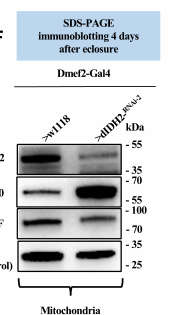

## Question

# Gene Research for Functional Annotation

## ⚠️ CRITICAL: Gene/Protein Identification Context

**BEFORE YOU BEGIN RESEARCH:** You MUST verify you are researching the CORRECT gene/protein. Gene symbols can be ambiguous, especially for less well-characterized genes from non-model organisms.

### Target Gene/Protein Identity (from UniProt):
- **UniProt Accession:** B7Z0E0
- **Protein Description:** RecName: Full=Isocitrate dehydrogenase [NADP] {ECO:0000256|PIRNR:PIRNR000108}; EC=1.1.1.42 {ECO:0000256|PIRNR:PIRNR000108};
- **Gene Information:** Name=Idh {ECO:0000313|EMBL:ACL83265.2, ECO:0000313|FlyBase:FBgn0001248}; Synonyms=cIdh {ECO:0000313|EMBL:ACL83265.2}, CT22171 {ECO:0000313|EMBL:ACL83265.2}, dIDH2 {ECO:0000313|EMBL:ACL83265.2}, Dmel\CG7176 {ECO:0000313|EMBL:ACL83265.2}, ICDH {ECO:0000313|EMBL:ACL83265.2}, IDH {ECO:0000313|EMBL:ACL83265.2}, idh {ECO:0000313|EMBL:ACL83265.2}, IDH (CG7176) {ECO:0000313|EMBL:ACL83265.2}, IDH-NADP {ECO:0000313|EMBL:ACL83265.2}, Idh-NADP {ECO:0000313|EMBL:ACL83265.2}, IDH1 {ECO:0000313|EMBL:ACL83265.2}, IDH2 {ECO:0000313|EMBL:ACL83265.2}, isocitrate dehydrogenase {ECO:0000313|EMBL:ACL83265.2}, l(3)L3852 {ECO:0000313|EMBL:ACL83265.2}; ORFNames=CG7176 {ECO:0000313|EMBL:ACL83265.2, ECO:0000313|FlyBase:FBgn0001248}, Dmel_CG7176 {ECO:0000313|EMBL:ACL83265.2};
- **Organism (full):** Drosophila melanogaster (Fruit fly).
- **Protein Family:** Belongs to the isocitrate and isopropylmalate
- **Key Domains:** IsoCit/isopropylmalate_DH_CS. (IPR019818); Isocitrate_DH_NADP. (IPR004790); IsoPropMal-DH-like_dom. (IPR024084); Iso_dh (PF00180)

### MANDATORY VERIFICATION STEPS:

1. **Check if the gene symbol "Idh" matches the protein description above**
2. **Verify the organism is correct:** Drosophila melanogaster (Fruit fly).
3. **Check if protein family/domains align with what you find in literature**
4. **If you find literature for a DIFFERENT gene with the same or similar symbol, STOP**

### If Gene Symbol is Ambiguous or You Cannot Find Relevant Literature:

**DO NOT PROCEED WITH RESEARCH ON A DIFFERENT GENE.** Instead:
- State clearly: "The gene symbol 'Idh' is ambiguous or literature is limited for this specific protein"
- Explain what you found (e.g., "Found extensive literature on a different gene with the same symbol in a different organism")
- Describe the protein based ONLY on the UniProt information provided above
- Suggest that the protein function can be inferred from domain/family information

### Research Target:

Please provide a comprehensive research report on the gene **Idh** (gene ID: Idh, UniProt: B7Z0E0) in DROME.

The research report should be a detailed narrative explaining the function, biological processes, and localization of the gene product. Citations should be given for all claims.

You should prioritize authoritative reviews and primary scientific literature when conducting research. You can supplement
this with annotations you find in gene/protein databases, but these can be outdated or inaccurate.

We are specifically interested in the primary function of the gene - for enzymes, what reaction is catalyzed, and what is the substrate specificity? For transporters, what is the substrate? For structural proteins or adapters, what is the broader structural role? For signaling molecules, what is the role in the pathway.

We are interested in where in or outside the cell the gene product carries out its function.

We are also interested in the signaling or biochemical pathways in which the gene functions. We are less interested in broad pleiotropic effects, except where these elucidate the precise role.

Include evidence where possible. We are interested in both experimental evidence as well as inference from structure, evolution, or bioinformatic analysis. Precise studies should be prioritized over high-throughput, where available.

## Output

Question: You are an expert researcher providing comprehensive, well-cited information.

Provide detailed information focusing on:
1. Key concepts and definitions with current understanding
2. Recent developments and latest research (prioritize 2023-2024 sources)
3. Current applications and real-world implementations
4. Expert opinions and analysis from authoritative sources
5. Relevant statistics and data from recent studies

Format as a comprehensive research report with proper citations. Include URLs and publication dates where available.
Always prioritize recent, authoritative sources and provide specific citations for all major claims.

# Gene Research for Functional Annotation

## ⚠️ CRITICAL: Gene/Protein Identification Context

**BEFORE YOU BEGIN RESEARCH:** You MUST verify you are researching the CORRECT gene/protein. Gene symbols can be ambiguous, especially for less well-characterized genes from non-model organisms.

### Target Gene/Protein Identity (from UniProt):
- **UniProt Accession:** B7Z0E0
- **Protein Description:** RecName: Full=Isocitrate dehydrogenase [NADP] {ECO:0000256|PIRNR:PIRNR000108}; EC=1.1.1.42 {ECO:0000256|PIRNR:PIRNR000108};
- **Gene Information:** Name=Idh {ECO:0000313|EMBL:ACL83265.2, ECO:0000313|FlyBase:FBgn0001248}; Synonyms=cIdh {ECO:0000313|EMBL:ACL83265.2}, CT22171 {ECO:0000313|EMBL:ACL83265.2}, dIDH2 {ECO:0000313|EMBL:ACL83265.2}, Dmel\CG7176 {ECO:0000313|EMBL:ACL83265.2}, ICDH {ECO:0000313|EMBL:ACL83265.2}, IDH {ECO:0000313|EMBL:ACL83265.2}, idh {ECO:0000313|EMBL:ACL83265.2}, IDH (CG7176) {ECO:0000313|EMBL:ACL83265.2}, IDH-NADP {ECO:0000313|EMBL:ACL83265.2}, Idh-NADP {ECO:0000313|EMBL:ACL83265.2}, IDH1 {ECO:0000313|EMBL:ACL83265.2}, IDH2 {ECO:0000313|EMBL:ACL83265.2}, isocitrate dehydrogenase {ECO:0000313|EMBL:ACL83265.2}, l(3)L3852 {ECO:0000313|EMBL:ACL83265.2}; ORFNames=CG7176 {ECO:0000313|EMBL:ACL83265.2, ECO:0000313|FlyBase:FBgn0001248}, Dmel_CG7176 {ECO:0000313|EMBL:ACL83265.2};
- **Organism (full):** Drosophila melanogaster (Fruit fly).
- **Protein Family:** Belongs to the isocitrate and isopropylmalate
- **Key Domains:** IsoCit/isopropylmalate_DH_CS. (IPR019818); Isocitrate_DH_NADP. (IPR004790); IsoPropMal-DH-like_dom. (IPR024084); Iso_dh (PF00180)

### MANDATORY VERIFICATION STEPS:

1. **Check if the gene symbol "Idh" matches the protein description above**
2. **Verify the organism is correct:** Drosophila melanogaster (Fruit fly).
3. **Check if protein family/domains align with what you find in literature**
4. **If you find literature for a DIFFERENT gene with the same or similar symbol, STOP**

### If Gene Symbol is Ambiguous or You Cannot Find Relevant Literature:

**DO NOT PROCEED WITH RESEARCH ON A DIFFERENT GENE.** Instead:
- State clearly: "The gene symbol 'Idh' is ambiguous or literature is limited for this specific protein"
- Explain what you found (e.g., "Found extensive literature on a different gene with the same symbol in a different organism")
- Describe the protein based ONLY on the UniProt information provided above
- Suggest that the protein function can be inferred from domain/family information

### Research Target:

Please provide a comprehensive research report on the gene **Idh** (gene ID: Idh, UniProt: B7Z0E0) in DROME.

The research report should be a detailed narrative explaining the function, biological processes, and localization of the gene product. Citations should be given for all claims.

You should prioritize authoritative reviews and primary scientific literature when conducting research. You can supplement
this with annotations you find in gene/protein databases, but these can be outdated or inaccurate.

We are specifically interested in the primary function of the gene - for enzymes, what reaction is catalyzed, and what is the substrate specificity? For transporters, what is the substrate? For structural proteins or adapters, what is the broader structural role? For signaling molecules, what is the role in the pathway.

We are interested in where in or outside the cell the gene product carries out its function.

We are also interested in the signaling or biochemical pathways in which the gene functions. We are less interested in broad pleiotropic effects, except where these elucidate the precise role.

Include evidence where possible. We are interested in both experimental evidence as well as inference from structure, evolution, or bioinformatic analysis. Precise studies should be prioritized over high-throughput, where available.

# Functional annotation of *Drosophila melanogaster* Idh (UniProt B7Z0E0)

## Identity and primary function

**Identity verified.** The supplied UniProt accession B7Z0E0 identifies *D. melanogaster* **Idh**, also called **CG7176** (FlyBase **FBgn0001248**). Fly-specific studies independently identify CG7176 as the NADP-dependent isocitrate dehydrogenase locus and the fly ortholog of mammalian IDH1 and IDH2. The similarly named fly **Idh3b** belongs to the distinct, NAD-dependent mitochondrial IDH3 enzyme; its experimental phenotypes must not be assigned to B7Z0E0. The supplied isocitrate-dehydrogenase family and domain annotations are consistent with, but less specific than, the fly biochemical and genetic evidence. (reitman2015geneticdissectionof pages 2-3, murari2022idh2mediatedregulationof pages 2-3, yang2017isocitrateprotectsdj1 pages 3-6, duncan2017mutantsfordrosophilaisocitratedehydrogenase pages 9-10)

The principal reaction is **isocitrate + NADP⁺ → α-ketoglutarate (2-oxoglutarate) + CO₂ + NADPH**: oxidative decarboxylation of isocitrate coupled to reduction of **NADP⁺, not NAD⁺**. This places Idh at the isocitrate-to-α-ketoglutarate connection of central carbon metabolism and makes it a source of reducing equivalents for NADPH-dependent antioxidant systems. Purified fly NADP-IDH provides direct substrate evidence: an Oregon-R reference preparation had reported apparent *K*m values of **22.3 µM for isocitrate** and **11.8 µM for NADP⁺**. These are historical enzyme-preparation measurements, not isoform-specific kinetic constants for an individually purified B7Z0E0 product. (yang2017isocitrateprotectsdj1 pages 2-3, murari2022idh2mediatedregulationof pages 2-3, bentley1983characterizationofa pages 7-9)

## Where the protein functions

**Both cytosolic and mitochondrial Idh products are reported.** Yang and colleagues describe one cytosolic isoform, **IDHc**, and two mitochondrial isoforms, **IDHm1** and **IDHm2**, expressed from the fly Idh locus. In a separate direct test, Murari and colleagues detected CG7176/dIDH2 protein by immunoblot in preparations of flight-muscle mitochondria; this establishes that **at least part** of the gene product is mitochondrial, not that every transcript or protein form resides there. The mitochondrial form acts locally in mitochondrial redox metabolism; the cytosolic form supplies activity outside mitochondria. Precise submitochondrial localization of each fly isoform is less firmly established by these experiments than the organelle-level assignment. (yang2017isocitrateprotectsdj1 pages 3-6, murari2022idh2mediatedregulationof pages 2-3, murari2022idh2mediatedregulationof media d1378833)

An earlier biochemical fractionation recovered **13.5–16.4%** of whole-adult NADP-IDH activity in the mitochondrial fraction, with most activity in the supernatant. Mitochondrial and supernatant preparations shared electrophoretic IDH-NADP variants. This is useful independent evidence for activity in both compartments, but the 1972 experiment did **not** molecularly assign each measured activity to a particular modern CG7176 transcript. The presence of cytosolic activity should not be interpreted as evidence for a complete cytosolic tricarboxylic-acid cycle. (fox1972thesolublecitric pages 8-11)

## Biological pathways and mechanistic evidence

**NADPH-dependent redox protection.** A P-element insertion in an exon shared by the Idh isoforms decreased Idh transcript abundance, enzyme activity, and the **NADPH/NADP⁺ ratio**; precise excision reversed these defects. Mutants accumulated reactive-oxygen-species signals and were unusually sensitive to rotenone. At 30 days, their climbing performance was approximately **30% lower** and dopaminergic-neuron number approximately **10% lower** than in revertant controls, with loss concentrated in particular neuronal clusters. Because this lesion affects a shared exon, those experiments establish a *locus-wide* role, not the fraction attributable to each isoform. (yang2017isocitrateprotectsdj1 pages 3-6)

The upstream **DJ-1β–Keap1–CncC/Nrf2 stress-response pathway** regulates this metabolic function. Under rotenone stress, Idh transcript abundance in DJ-1β-null flies was **1.51-fold lower** than in controls in the reported RNA-seq comparison (**false-discovery rate 0.0290009**). Mitochondrial Idh-isoform transcripts were especially affected; altering Keap1 restored their expression, while CncC activated an Idh-promoter reporter in a manner sensitive to mutation of a candidate antioxidant-response element. Overexpressed mitochondrial isoforms improved survival and dopaminergic-neuron outcomes in oxidatively stressed DJ-1β mutants. These promoter-reporter and genetic results support transcriptional regulation but are not, by themselves, a direct measurement of CncC binding at the endogenous locus. (yang2017isocitrateprotectsdj1 pages 3-6, yang2017isocitrateprotectsdj1 pages 6-8, yang2017isocitrateprotectsdj1 pages 8-10)

**Mitochondrial respiratory-chain assembly.** In a 2022 *Science Advances* study, three muscle-directed CG7176 RNAi constructs gave graded effects on the oxidative-phosphorylation system: **complex-I activity declined with each**, whereas stronger knockdowns also affected other complexes. Blue-native-gel analysis localized prominent early defects to assembly or stability of the mitochondrial complex-I **Q and N modules**. Idh depletion raised the **NADP⁺:NADPH ratio** and hydrogen peroxide measurements, connecting loss of NADPH-generating capacity to an oxidizing mitochondrial environment. Knockdown of enzymes involved in peroxide elimination produced related assembly defects, whereas superoxide-dismutase knockdown did not produce comparable assembly defects under the tested conditions. Thus, the authors favor a peroxide-linked mechanism; Idh itself is a metabolic enzyme, **not** a demonstrated structural complex-I subunit. (murari2022idh2mediatedregulationof pages 2-3, murari2022idh2mediatedregulationof pages 3-5, murari2022idh2mediatedregulationof pages 5-7)

With stronger muscle knockdown, mitochondrial labile iron and lipid-peroxidation signals increased. **Ferrostatin-1 and liproxstatin-1 rescued early lethality and characteristic mitochondrial morphology but did not restore respiratory-complex assembly**. This distinction is important: the data support ferroptotic injury downstream of, or alongside, the redox/assembly disturbance rather than establishing ferroptosis as its sole initiating cause. Transcriptomic analysis of the affected flight muscle found **294 transcripts induced ≥1.5-fold** at adjusted *P* < 0.05, including genes implicated in mitochondrial protein homeostasis and iron–sulfur-cluster biogenesis; these are responses to Idh depletion rather than additional catalytic functions of Idh. (murari2022idh2mediatedregulationof pages 3-5, murari2022idh2mediatedregulationof pages 5-7, murari2022idh2mediatedregulationof pages 9-10)

**α-Ketoglutarate supply.** The product α-ketoglutarate links the Idh reaction to downstream metabolism and to α-ketoglutarate-requiring chromatin enzymes. Following mild fly head trauma, a 2017 study observed changes in Idh transcript processing/abundance and proposed feedback through α-ketoglutarate, histone demethylation, and intron retention. That feedback is an **author-proposed model**, not direct proof that altered Idh catalysis caused the epigenetic response. (sen2017smoothanhnrnpl pages 1-2)

## Research applications, mutant specificity, and recency

CG7176 manipulation is used experimentally to probe neuronal oxidative-stress protection, respiratory-complex assembly, and metabolic mechanisms relevant to cancer. In the cancer model, engineered **Idh-R195H**—homologous to human IDH1-R132H—raised fly D-2-hydroxyglutarate **more than 25-fold** when expressed ubiquitously; expression in particular lineages produced blood-cell and neuronal phenotypes. **α-Ketoglutarate-to-D-2-hydroxyglutarate conversion is a neomorphic property of that engineered allele, not the established normal function of wild-type B7Z0E0.** These are research-model applications, not evidence of a fly-Idh-directed clinical implementation. (reitman2015geneticdissectionof pages 1-2, reitman2015geneticdissectionof pages 3-4)

The most informative directly gene-targeted, peer-reviewed mechanistic study located here was published **11 May 2022**. Targeted searches did not establish a comparably specific **2023–2024** primary study that experimentally characterizes CG7176; recent papers concerning other IDH genes, human tumors, or central metabolism therefore cannot replace the fly-specific evidence above. Outstanding distinctions include isoform-resolved flux and kinetics, precise localization within mitochondria, and how much cytosolic versus mitochondrial Idh contributes in each tissue. (murari2022idh2mediatedregulationof pages 1-2, murari2022idh2mediatedregulationof pages 2-3, yang2017isocitrateprotectsdj1 pages 3-6)

The following table separates direct observations from their principal interpretation limits.

| Question | Best direct observation and uncertainty | Primary source DOI / publication year | Citation ID |
|---|---|---|---|
| Identity and cofactor specificity | *D. melanogaster* **Idh/CG7176** is the single fly ortholog of mammalian IDH1/IDH2 and encodes an **NADP-dependent** IDH found in cytosolic and mitochondrial compartments. It is distinct from the NAD-dependent IDH3 complex. | [10.1182/blood-2014-05-577940](https://doi.org/10.1182/blood-2014-05-577940) (2015) | (reitman2015geneticdissectionof pages 2-3) |
| Reaction and substrate kinetics | Purified Oregon-R (**OR**) NADP-IDH had apparent Km values of **22.3 µM for isocitrate** and **11.8 µM for NADP⁺**. These whole-enzyme measurements predate molecular assignment to CG7176; they support but do not independently prove the modern gene-level annotation. | [10.1007/BF00498919](https://doi.org/10.1007/BF00498919) (1983) | (bentley1983characterizationofa pages 7-9) |
| Cellular localization | Differential centrifugation recovered **13.5–16.4%** of total adult-fly NADP-IDH activity in mitochondria, with most activity in the supernatant. Mitochondrial and supernatant fractions displayed the same electrophoretic variants. Because this work preceded molecular definition of CG7176 isoforms, the percentages are **not isoform-specific**. | [10.1007/BF00486086](https://doi.org/10.1007/BF00486086) (1972) | (fox1972thesolublecitric pages 8-11) |
| Modern mitochondrial evidence | Anti-dIDH2 immunoblotting of purified thoracic mitochondrial preparations showed that **at least a fraction of CG7176 protein is mitochondrial** (Fig. 1F). This does not imply that every CG7176 product is mitochondrial because the locus also produces cytosolic isoforms. | [10.1126/sciadv.abl8716](https://doi.org/10.1126/sciadv.abl8716) (2022) | (murari2022idh2mediatedregulationof pages 2-3, murari2022idh2mediatedregulationof media d1378833) |
| NADPH and antioxidant function | A P-element insertion in an exon shared by all Idh isoforms reduced Idh mRNA, enzyme activity, and the **NADPH/NADP⁺ ratio**; precise excision restored them. Mutants accumulated ROS and were oxidative-stress sensitive. This establishes locus-wide function but not each isoform's separate contribution. | [10.1371/journal.pgen.1006975](https://doi.org/10.1371/journal.pgen.1006975) (2017) | (yang2017isocitrateprotectsdj1 pages 3-6, yang2017isocitrateprotectsdj1 pages 2-3) |
| DJ-1–Keap1–CncC/Nrf2 regulation | Under rotenone stress, Idh was **1.51-fold downregulated** in DJ-1β-null flies (FDR **0.0290009**). Keap1 mutation restored mitochondrial Idh-isoform expression and oxidative-stress survival; CncC activated an Idh promoter reporter through a candidate antioxidant-response element. Direct endogenous CncC occupancy was not demonstrated. | [10.1371/journal.pgen.1006975](https://doi.org/10.1371/journal.pgen.1006975) (2017) | (yang2017isocitrateprotectsdj1 pages 3-6, yang2017isocitrateprotectsdj1 pages 6-8, yang2017isocitrateprotectsdj1 pages 8-10) |
| Complex-I and OXPHOS assembly | Three muscle-specific CG7176 RNAi lines produced graded defects. Blue-native PAGE and in-gel assays showed reduced **complex-I assembly or activity in all three**, while stronger knockdowns also affected complexes II, IV, and V. Assembly-intermediate analysis localized prominent early defects to the complex-I **Q and N matrix modules**. RNAi phenotypes may include secondary effects of chronic redox imbalance. | [10.1126/sciadv.abl8716](https://doi.org/10.1126/sciadv.abl8716) (2022) | (murari2022idh2mediatedregulationof pages 2-3, murari2022idh2mediatedregulationof pages 5-7) |
| Ferroptosis and adaptive response | CG7176 knockdown increased the NADP⁺:NADPH ratio, hydrogen peroxide, mitochondrial labile Fe²⁺, and lipid peroxidation without increasing caspase activity. Ferrostatin-1 plus liproxstatin-1 rescued early lethality and ferroptotic mitochondrial morphology but **did not restore OXPHOS assembly**, placing ferroptosis largely downstream of the assembly defect. RNA-seq identified **294 transcripts induced at least 1.5-fold with adjusted P below 0.05**, including mitochondrial-proteostasis and Fe–S-cluster genes. | [10.1126/sciadv.abl8716](https://doi.org/10.1126/sciadv.abl8716) (2022) | (murari2022idh2mediatedregulationof pages 3-5, murari2022idh2mediatedregulationof pages 9-10, murari2022idh2mediatedregulationof pages 5-7) |
| Engineered neomorphic activity | Ubiquitous expression of engineered **Idh-R195H**, homologous to human IDH1-R132H, elevated D-2-hydroxyglutarate by **more than 25-fold** and produced blood-cell and neuronal phenotypes. This is an acquired neomorphic activity of a cancer-model allele and **must not be assigned to wild-type B7Z0E0/CG7176**. | [10.1182/blood-2014-05-577940](https://doi.org/10.1182/blood-2014-05-577940) (2015) | (reitman2015geneticdissectionof pages 1-2) |

*Table: Direct experimental evidence for Drosophila Idh/CG7176, covering catalytic specificity, localization, redox biology, OXPHOS assembly, and engineered neomorphic activity. Caveats distinguish gene-specific findings from older activity measurements and mutant-only effects.*

### Principal primary sources

- Murari *et al.*, **11 May 2022**, *Science Advances*, “IDH2-mediated regulation of the biogenesis of the oxidative phosphorylation system.” https://doi.org/10.1126/sciadv.abl8716 (murari2022idh2mediatedregulationof pages 1-2, murari2022idh2mediatedregulationof pages 2-3)
- Yang *et al.*, **21 August 2017**, *PLOS Genetics*, “Isocitrate protects DJ-1 null dopaminergic cells from oxidative stress through NADP⁺-dependent isocitrate dehydrogenase.” https://doi.org/10.1371/journal.pgen.1006975 (yang2017isocitrateprotectsdj1 pages 3-6, yang2017isocitrateprotectsdj1 pages 2-3)
- Reitman *et al.*, **8 January 2015**, *Blood*, “Genetic dissection of leukemia-associated IDH1 and IDH2 mutants and D-2-hydroxyglutarate in Drosophila.” https://doi.org/10.1182/blood-2014-05-577940 (reitman2015geneticdissectionof pages 1-2)
- Bentley *et al.*, **August 1983**, *Biochemical Genetics*, purified fly NADP-IDH kinetics. https://doi.org/10.1007/bf00498919 (bentley1983characterizationofa pages 7-9)
- Fox *et al.*, **October 1972**, *Biochemical Genetics*, fly tissue and intracellular NADP-IDH activity. https://doi.org/10.1007/bf00486086 (fox1972thesolublecitric pages 8-11)

References

1. (reitman2015geneticdissectionof pages 2-3): Zachary J. Reitman, Sergey A. Sinenko, Eric P. Spana, and Hai Yan. Genetic dissection of leukemia-associated idh1 and idh2 mutants and d-2-hydroxyglutarate in drosophila. Blood, 125 2:336-45, Jan 2015. URL: https://doi.org/10.1182/blood-2014-05-577940, doi:10.1182/blood-2014-05-577940. This article has 41 citations and is from a highest quality peer-reviewed journal.

2. (murari2022idh2mediatedregulationof pages 2-3): Anjaneyulu Murari, Naga S. V. Goparaju, Shauna-Kay Rhooms, Kaniz F. B. Hossain, Felix G. Liang, Christian J. Garcia, Cindy Osei, Tong Liu, Hong Li, Richard N. Kitsis, Rajesh Patel, and Edward Owusu-Ansah. Idh2-mediated regulation of the biogenesis of the oxidative phosphorylation system. Science Advances, May 2022. URL: https://doi.org/10.1126/sciadv.abl8716, doi:10.1126/sciadv.abl8716. This article has 28 citations and is from a highest quality peer-reviewed journal.

3. (yang2017isocitrateprotectsdj1 pages 3-6): Jinsung Yang, Min Ju Kim, Woongchang Yoon, Eun Young Kim, Hyunjin Kim, Yoonjeong Lee, Boram Min, Kyung Shin Kang, Jin H. Son, Hwan Tae Park, Jongkyeong Chung, and Hyongjong Koh. Isocitrate protects dj-1 null dopaminergic cells from oxidative stress through nadp+-dependent isocitrate dehydrogenase (idh). PLOS Genetics, 13:e1006975, Aug 2017. URL: https://doi.org/10.1371/journal.pgen.1006975, doi:10.1371/journal.pgen.1006975. This article has 55 citations and is from a domain leading peer-reviewed journal.

4. (duncan2017mutantsfordrosophilaisocitratedehydrogenase pages 9-10): Dianne M. Duncan, Paula Kiefel, and I. Duncan. Mutants for<i>drosophila</i>isocitrate dehydrogenase 3b are defective in mitochondrial function and larval cell death. G3 Genes|Genomes|Genetics, 7:789-799, Mar 2017. URL: https://doi.org/10.1534/g3.116.037366, doi:10.1534/g3.116.037366. This article has 28 citations.

5. (yang2017isocitrateprotectsdj1 pages 2-3): Jinsung Yang, Min Ju Kim, Woongchang Yoon, Eun Young Kim, Hyunjin Kim, Yoonjeong Lee, Boram Min, Kyung Shin Kang, Jin H. Son, Hwan Tae Park, Jongkyeong Chung, and Hyongjong Koh. Isocitrate protects dj-1 null dopaminergic cells from oxidative stress through nadp+-dependent isocitrate dehydrogenase (idh). PLOS Genetics, 13:e1006975, Aug 2017. URL: https://doi.org/10.1371/journal.pgen.1006975, doi:10.1371/journal.pgen.1006975. This article has 55 citations and is from a domain leading peer-reviewed journal.

6. (bentley1983characterizationofa pages 7-9): Michael M. Bentley, Roy G. Meidinger, and John H. Williamson. Characterization of a low-activity allele of nadp+-dependent isocitrate dehydrogenase from drosophila melanogaster. Biochemical Genetics, 21:725-733, Aug 1983. URL: https://doi.org/10.1007/bf00498919, doi:10.1007/bf00498919. This article has 15 citations and is from a peer-reviewed journal.

7. (murari2022idh2mediatedregulationof media d1378833): Anjaneyulu Murari, Naga S. V. Goparaju, Shauna-Kay Rhooms, Kaniz F. B. Hossain, Felix G. Liang, Christian J. Garcia, Cindy Osei, Tong Liu, Hong Li, Richard N. Kitsis, Rajesh Patel, and Edward Owusu-Ansah. Idh2-mediated regulation of the biogenesis of the oxidative phosphorylation system. Science Advances, May 2022. URL: https://doi.org/10.1126/sciadv.abl8716, doi:10.1126/sciadv.abl8716. This article has 28 citations and is from a highest quality peer-reviewed journal.

8. (fox1972thesolublecitric pages 8-11): David J. Fox, Marianne Conscience-Egli, and Erika Abächerli. The soluble citric acid cycle enzymes ofdrosophila melanogaster. ii. tissue and intracellular distribution of aconitase and nadp-dependent isocitrate dehydrogenase. Biochemical Genetics, 7:163-175, Oct 1972. URL: https://doi.org/10.1007/bf00486086, doi:10.1007/bf00486086. This article has 23 citations and is from a peer-reviewed journal.

9. (yang2017isocitrateprotectsdj1 pages 6-8): Jinsung Yang, Min Ju Kim, Woongchang Yoon, Eun Young Kim, Hyunjin Kim, Yoonjeong Lee, Boram Min, Kyung Shin Kang, Jin H. Son, Hwan Tae Park, Jongkyeong Chung, and Hyongjong Koh. Isocitrate protects dj-1 null dopaminergic cells from oxidative stress through nadp+-dependent isocitrate dehydrogenase (idh). PLOS Genetics, 13:e1006975, Aug 2017. URL: https://doi.org/10.1371/journal.pgen.1006975, doi:10.1371/journal.pgen.1006975. This article has 55 citations and is from a domain leading peer-reviewed journal.

10. (yang2017isocitrateprotectsdj1 pages 8-10): Jinsung Yang, Min Ju Kim, Woongchang Yoon, Eun Young Kim, Hyunjin Kim, Yoonjeong Lee, Boram Min, Kyung Shin Kang, Jin H. Son, Hwan Tae Park, Jongkyeong Chung, and Hyongjong Koh. Isocitrate protects dj-1 null dopaminergic cells from oxidative stress through nadp+-dependent isocitrate dehydrogenase (idh). PLOS Genetics, 13:e1006975, Aug 2017. URL: https://doi.org/10.1371/journal.pgen.1006975, doi:10.1371/journal.pgen.1006975. This article has 55 citations and is from a domain leading peer-reviewed journal.

11. (murari2022idh2mediatedregulationof pages 3-5): Anjaneyulu Murari, Naga S. V. Goparaju, Shauna-Kay Rhooms, Kaniz F. B. Hossain, Felix G. Liang, Christian J. Garcia, Cindy Osei, Tong Liu, Hong Li, Richard N. Kitsis, Rajesh Patel, and Edward Owusu-Ansah. Idh2-mediated regulation of the biogenesis of the oxidative phosphorylation system. Science Advances, May 2022. URL: https://doi.org/10.1126/sciadv.abl8716, doi:10.1126/sciadv.abl8716. This article has 28 citations and is from a highest quality peer-reviewed journal.

12. (murari2022idh2mediatedregulationof pages 5-7): Anjaneyulu Murari, Naga S. V. Goparaju, Shauna-Kay Rhooms, Kaniz F. B. Hossain, Felix G. Liang, Christian J. Garcia, Cindy Osei, Tong Liu, Hong Li, Richard N. Kitsis, Rajesh Patel, and Edward Owusu-Ansah. Idh2-mediated regulation of the biogenesis of the oxidative phosphorylation system. Science Advances, May 2022. URL: https://doi.org/10.1126/sciadv.abl8716, doi:10.1126/sciadv.abl8716. This article has 28 citations and is from a highest quality peer-reviewed journal.

13. (murari2022idh2mediatedregulationof pages 9-10): Anjaneyulu Murari, Naga S. V. Goparaju, Shauna-Kay Rhooms, Kaniz F. B. Hossain, Felix G. Liang, Christian J. Garcia, Cindy Osei, Tong Liu, Hong Li, Richard N. Kitsis, Rajesh Patel, and Edward Owusu-Ansah. Idh2-mediated regulation of the biogenesis of the oxidative phosphorylation system. Science Advances, May 2022. URL: https://doi.org/10.1126/sciadv.abl8716, doi:10.1126/sciadv.abl8716. This article has 28 citations and is from a highest quality peer-reviewed journal.

14. (sen2017smoothanhnrnpl pages 1-2): Arko Sen, Katherine Gurdziel, Jenney Liu, Wen Qu, Oluwademi O. Nuga, Rayanne B. Burl, Maik Hüttemann, Roger Pique-Regi, and Douglas. M. Ruden. Smooth, an hnrnp-l homolog, might decrease mitochondrial metabolism by post-transcriptional regulation of isocitrate dehydrogenase (idh) and other metabolic genes in the sub-acute phase of traumatic brain injury. Frontiers in Genetics, Nov 2017. URL: https://doi.org/10.3389/fgene.2017.00175, doi:10.3389/fgene.2017.00175. This article has 33 citations and is from a peer-reviewed journal.

15. (reitman2015geneticdissectionof pages 1-2): Zachary J. Reitman, Sergey A. Sinenko, Eric P. Spana, and Hai Yan. Genetic dissection of leukemia-associated idh1 and idh2 mutants and d-2-hydroxyglutarate in drosophila. Blood, 125 2:336-45, Jan 2015. URL: https://doi.org/10.1182/blood-2014-05-577940, doi:10.1182/blood-2014-05-577940. This article has 41 citations and is from a highest quality peer-reviewed journal.

16. (reitman2015geneticdissectionof pages 3-4): Zachary J. Reitman, Sergey A. Sinenko, Eric P. Spana, and Hai Yan. Genetic dissection of leukemia-associated idh1 and idh2 mutants and d-2-hydroxyglutarate in drosophila. Blood, 125 2:336-45, Jan 2015. URL: https://doi.org/10.1182/blood-2014-05-577940, doi:10.1182/blood-2014-05-577940. This article has 41 citations and is from a highest quality peer-reviewed journal.

17. (murari2022idh2mediatedregulationof pages 1-2): Anjaneyulu Murari, Naga S. V. Goparaju, Shauna-Kay Rhooms, Kaniz F. B. Hossain, Felix G. Liang, Christian J. Garcia, Cindy Osei, Tong Liu, Hong Li, Richard N. Kitsis, Rajesh Patel, and Edward Owusu-Ansah. Idh2-mediated regulation of the biogenesis of the oxidative phosphorylation system. Science Advances, May 2022. URL: https://doi.org/10.1126/sciadv.abl8716, doi:10.1126/sciadv.abl8716. This article has 28 citations and is from a highest quality peer-reviewed journal.

## Artifacts

- [Edison artifact artifact-00](Idh-deep-research-falcon_artifacts/artifact-00.md)

## Citations

1. fox1972thesolublecitric pages 8-11
2. sen2017smoothanhnrnpl pages 1-2
3. reitman2015geneticdissectionof pages 2-3
4. bentley1983characterizationofa pages 7-9
5. reitman2015geneticdissectionof pages 1-2
6. duncan2017mutantsfordrosophilaisocitratedehydrogenase pages 9-10
7. reitman2015geneticdissectionof pages 3-4
8. NADP
9. 10.1182/blood-2014-05-577940
10. 10.1007/BF00498919
11. 10.1007/BF00486086
12. 10.1126/sciadv.abl8716
13. 10.1371/journal.pgen.1006975
14. https://doi.org/10.1182/blood-2014-05-577940
15. https://doi.org/10.1007/BF00498919
16. https://doi.org/10.1007/BF00486086
17. https://doi.org/10.1126/sciadv.abl8716
18. https://doi.org/10.1371/journal.pgen.1006975
19. https://doi.org/10.1007/bf00498919
20. https://doi.org/10.1007/bf00486086
21. https://doi.org/10.1182/blood-2014-05-577940,
22. https://doi.org/10.1126/sciadv.abl8716,
23. https://doi.org/10.1371/journal.pgen.1006975,
24. https://doi.org/10.1534/g3.116.037366,
25. https://doi.org/10.1007/bf00498919,
26. https://doi.org/10.1007/bf00486086,
27. https://doi.org/10.3389/fgene.2017.00175,