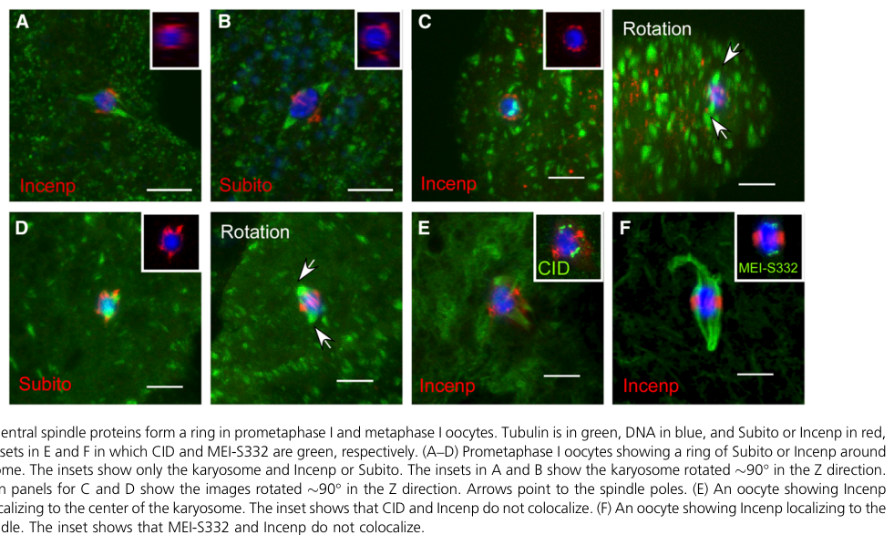

## Question

# Gene Research for Functional Annotation

## ⚠️ CRITICAL: Gene/Protein Identification Context

**BEFORE YOU BEGIN RESEARCH:** You MUST verify you are researching the CORRECT gene/protein. Gene symbols can be ambiguous, especially for less well-characterized genes from non-model organisms.

### Target Gene/Protein Identity (from UniProt):
- **UniProt Accession:** A0A0B4LFQ2
- **Protein Description:** SubName: Full=Inner centromere protein, isoform C {ECO:0000313|EMBL:AHN55954.1};
- **Gene Information:** Name=Incenp {ECO:0000313|EMBL:AHN55954.1, ECO:0000313|FlyBase:FBgn0260991}; Synonyms=anon-WO0118547.171 {ECO:0000313|EMBL:AHN55954.1}, dIncenp {ECO:0000313|EMBL:AHN55954.1}, Dmel\CG12165 {ECO:0000313|EMBL:AHN55954.1}, DmINCENP {ECO:0000313|EMBL:AHN55954.1}, INCENP {ECO:0000313|EMBL:AHN55954.1}, incenp {ECO:0000313|EMBL:AHN55954.1}, mat(2)ea-C {ECO:0000313|EMBL:AHN55954.1}, mat(2)earlyQA26 {ECO:0000313|EMBL:AHN55954.1}; ORFNames=CG12165 {ECO:0000313|EMBL:AHN55954.1, ECO:0000313|FlyBase:FBgn0260991}, Dmel_CG12165 {ECO:0000313|EMBL:AHN55954.1};
- **Organism (full):** Drosophila melanogaster (Fruit fly).
- **Protein Family:** Not specified in UniProt
- **Key Domains:** Not specified in UniProt

### MANDATORY VERIFICATION STEPS:

1. **Check if the gene symbol "Incenp" matches the protein description above**
2. **Verify the organism is correct:** Drosophila melanogaster (Fruit fly).
3. **Check if protein family/domains align with what you find in literature**
4. **If you find literature for a DIFFERENT gene with the same or similar symbol, STOP**

### If Gene Symbol is Ambiguous or You Cannot Find Relevant Literature:

**DO NOT PROCEED WITH RESEARCH ON A DIFFERENT GENE.** Instead:
- State clearly: "The gene symbol 'Incenp' is ambiguous or literature is limited for this specific protein"
- Explain what you found (e.g., "Found extensive literature on a different gene with the same symbol in a different organism")
- Describe the protein based ONLY on the UniProt information provided above
- Suggest that the protein function can be inferred from domain/family information

### Research Target:

Please provide a comprehensive research report on the gene **Incenp** (gene ID: Incenp, UniProt: A0A0B4LFQ2) in DROME.

The research report should be a detailed narrative explaining the function, biological processes, and localization of the gene product. Citations should be given for all claims.

You should prioritize authoritative reviews and primary scientific literature when conducting research. You can supplement
this with annotations you find in gene/protein databases, but these can be outdated or inaccurate.

We are specifically interested in the primary function of the gene - for enzymes, what reaction is catalyzed, and what is the substrate specificity? For transporters, what is the substrate? For structural proteins or adapters, what is the broader structural role? For signaling molecules, what is the role in the pathway.

We are interested in where in or outside the cell the gene product carries out its function.

We are also interested in the signaling or biochemical pathways in which the gene functions. We are less interested in broad pleiotropic effects, except where these elucidate the precise role.

Include evidence where possible. We are interested in both experimental evidence as well as inference from structure, evolution, or bioinformatic analysis. Precise studies should be prioritized over high-throughput, where available.

## Output

Question: You are an expert researcher providing comprehensive, well-cited information.

Provide detailed information focusing on:
1. Key concepts and definitions with current understanding
2. Recent developments and latest research (prioritize 2023-2024 sources)
3. Current applications and real-world implementations
4. Expert opinions and analysis from authoritative sources
5. Relevant statistics and data from recent studies

Format as a comprehensive research report with proper citations. Include URLs and publication dates where available.
Always prioritize recent, authoritative sources and provide specific citations for all major claims.

# Gene Research for Functional Annotation

## ⚠️ CRITICAL: Gene/Protein Identification Context

**BEFORE YOU BEGIN RESEARCH:** You MUST verify you are researching the CORRECT gene/protein. Gene symbols can be ambiguous, especially for less well-characterized genes from non-model organisms.

### Target Gene/Protein Identity (from UniProt):
- **UniProt Accession:** A0A0B4LFQ2
- **Protein Description:** SubName: Full=Inner centromere protein, isoform C {ECO:0000313|EMBL:AHN55954.1};
- **Gene Information:** Name=Incenp {ECO:0000313|EMBL:AHN55954.1, ECO:0000313|FlyBase:FBgn0260991}; Synonyms=anon-WO0118547.171 {ECO:0000313|EMBL:AHN55954.1}, dIncenp {ECO:0000313|EMBL:AHN55954.1}, Dmel\CG12165 {ECO:0000313|EMBL:AHN55954.1}, DmINCENP {ECO:0000313|EMBL:AHN55954.1}, INCENP {ECO:0000313|EMBL:AHN55954.1}, incenp {ECO:0000313|EMBL:AHN55954.1}, mat(2)ea-C {ECO:0000313|EMBL:AHN55954.1}, mat(2)earlyQA26 {ECO:0000313|EMBL:AHN55954.1}; ORFNames=CG12165 {ECO:0000313|EMBL:AHN55954.1, ECO:0000313|FlyBase:FBgn0260991}, Dmel_CG12165 {ECO:0000313|EMBL:AHN55954.1};
- **Organism (full):** Drosophila melanogaster (Fruit fly).
- **Protein Family:** Not specified in UniProt
- **Key Domains:** Not specified in UniProt

### MANDATORY VERIFICATION STEPS:

1. **Check if the gene symbol "Incenp" matches the protein description above**
2. **Verify the organism is correct:** Drosophila melanogaster (Fruit fly).
3. **Check if protein family/domains align with what you find in literature**
4. **If you find literature for a DIFFERENT gene with the same or similar symbol, STOP**

### If Gene Symbol is Ambiguous or You Cannot Find Relevant Literature:

**DO NOT PROCEED WITH RESEARCH ON A DIFFERENT GENE.** Instead:
- State clearly: "The gene symbol 'Incenp' is ambiguous or literature is limited for this specific protein"
- Explain what you found (e.g., "Found extensive literature on a different gene with the same symbol in a different organism")
- Describe the protein based ONLY on the UniProt information provided above
- Suggest that the protein function can be inferred from domain/family information

### Research Target:

Please provide a comprehensive research report on the gene **Incenp** (gene ID: Incenp, UniProt: A0A0B4LFQ2) in DROME.

The research report should be a detailed narrative explaining the function, biological processes, and localization of the gene product. Citations should be given for all claims.

You should prioritize authoritative reviews and primary scientific literature when conducting research. You can supplement
this with annotations you find in gene/protein databases, but these can be outdated or inaccurate.

We are specifically interested in the primary function of the gene - for enzymes, what reaction is catalyzed, and what is the substrate specificity? For transporters, what is the substrate? For structural proteins or adapters, what is the broader structural role? For signaling molecules, what is the role in the pathway.

We are interested in where in or outside the cell the gene product carries out its function.

We are also interested in the signaling or biochemical pathways in which the gene functions. We are less interested in broad pleiotropic effects, except where these elucidate the precise role.

Include evidence where possible. We are interested in both experimental evidence as well as inference from structure, evolution, or bioinformatic analysis. Precise studies should be prioritized over high-throughput, where available.

# Functional annotation of *Drosophila melanogaster Incenp*

## Identity and scope

**Identity verified at the gene level.** The supplied UniProt accession [A0A0B4LFQ2](https://www.uniprot.org/uniprotkb/A0A0B4LFQ2/entry) is identified as *D. melanogaster* inner centromere protein, isoform C. Independently, the original cloning study identified fly inner centromere protein (**DmINCENP**) with the locus **CG12165**, matching the supplied *Incenp* gene name and organism. This is not an annotation transferred from human INCENP. The studies below generally investigate the *fly gene*, endogenous protein, RNA interference, or experimental transgenes; they do **not** establish a function unique to accession A0A0B4LFQ2 or distinguish isoform C from other fly INCENP isoforms. (adams2001essentialrolesof pages 3-3, adams2001essentialrolesof pages 3-4)

## Primary molecular function and protein architecture

INCENP is the **nonenzymatic scaffold, targeting subunit, and activator** of the chromosomal passenger complex (CPC). Its principal partner, **Aurora B/ial**, is the catalytic serine/threonine kinase; **Borealin/Borr** and **Survivin/Deterin** contribute to CPC localization. Thus, it would be incorrect to annotate INCENP itself as the enzyme that phosphorylates histones or kinetochore proteins. Purified fly INCENP and Aurora B bind in vitro, and removal of INCENP disrupts Aurora B localization and Aurora-B-dependent histone H3 serine-10 phosphorylation in cells. Conversely, Aurora B is required for normal centromeric accumulation and subsequent spindle transfer of INCENP. (adams2001essentialrolesof pages 1-2, chang2006drosophilaincenpis pages 1-3, mckim2022highwaytohell‐thy pages 1-4)

The conserved **C-terminal IN-box** binds and supports activation of Aurora B; the **N-terminal targeting region** associates with the Borealin–Deterin localization module. Fly oocyte experiments specifically tested deletion of N-terminal residues 22–30 and IN-box-based targeting constructs, linking these regions to CPC localization and Aurora B recruitment. A predicted coiled-coil region and additional chromatin-/microtubule-associated regions contribute to the protein’s architecture. Full-length purified DmINCENP also associates directly with polymerized microtubules: **64% of added INCENP cosedimented** in the reported assay, whereas the GST control did not. Residue coordinates derive from the sequences and constructs used in those studies and should **not** be assumed to map identically onto isoform C without sequence alignment. (wang2020oocytespindleassembly pages 5-8, wang2020oocytespindleassembly pages 8-11, adams2001essentialrolesof pages 3-3, adams2001essentialrolesof pages 6-7)

## Where INCENP acts and what it does

**Mitosis.** Fly INCENP is an intracellular, dynamically relocating *chromosomal passenger*: it associates with condensing chromosome arms in prophase, enriches at the **inner centromere** by metaphase, then moves to **central-spindle/midzone microtubules** in anaphase and the **midbody** during telophase. This localization positions Aurora B activity for chromosome alignment, sister-kinetochore disjunction, segregation, and completion of cytokinesis. In cultured fly cells, depletion of INCENP or Aurora B reduces H3S10 phosphorylation and prevents normal metaphase alignment; cells can nonetheless proceed into abnormal anaphase with lagging chromatin, and cytokinesis frequently fails. The experiments did *not* find an absolute requirement for INCENP to place the kinesin Pavarotti at the telophase midbody, refining rather than generalizing its cytokinesis role. (adams2001essentialrolesof pages 3-3, adams2001essentialrolesof pages 1-2, adams2001essentialrolesof pages 9-10)

**Oocyte meiosis.** The spatial pattern is importantly different from a simple mitotic-centromere annotation. In fixed *Drosophila* prometaphase/metaphase-I oocytes, INCENP forms a **ring around the karyosome and is prominent at the central spindle**; it does not visibly overlap with the centromeric markers CID or MEI-S332 under those conditions. It can also associate with chromosome chromatin when microtubules are disrupted. Direct inspection of the published Figure 1 supports the distinction between oocyte central-spindle localization and centromeric markers. Germline depletion of either *Incenp* or *aurB* eliminated spindle microtubule accumulation around chromosomes in **all 42 CPC-RNAi oocytes examined**. This identifies a particularly strong requirement for INCENP-dependent CPC activity in **chromosome-directed, acentrosomal spindle assembly**, rather than simply in a later cytokinetic step. (radford2012thechromosomalpassenger pages 3-5, radford2012thechromosomalpassenger media ec5904bb, radford2012thechromosomalpassenger pages 5-7)

Oocyte targeting-and-rescue experiments further distinguish CPC pools. An untagged, RNAi-resistant *Incenp* transgene restored kinetochore and spindle assembly, homolog biorientation, and fertility after endogenous *Incenp* depletion. Borealin-dependent association with chromatin helps recruit the CPC initially; INCENP/CPC and HP1 subsequently appear on spindle microtubules, and the central-spindle kinesin **Subito** participates in organizing this localization. Artificially directing the Aurora-B-recruiting IN-box to centromeres could promote kinetochore formation and kinetochore-fiber growth **without restoring the normal central spindle**, whereas directing it separately to microtubules was also insufficient to reconstruct the intact spindle. These manipulations support coordinated chromosome-to-spindle targeting rather than a single sufficient site of CPC activity. Evidence for particular HP1-mediated transfer steps remains a mechanistic model, not a fully identified phosphorylation reaction. (wang2020oocytespindleassembly pages 5-8, wang2020oocytespindleassembly pages 8-11, wang2020oocytespindleassembly pages 17-21)

## Specific biochemical and signaling pathways

- **CPC–Aurora B–histone pathway:** INCENP targets and supports Aurora B kinase. In fly mitotic cells, INCENP depletion reduced phosphorylation of histone H3 at **Ser10**; the substrate and phosphorylation reaction belong to **Aurora B**, not INCENP. In the original cultured-cell experiment, reduced H3 phosphorylation was observed in **74% of INCENP-negative prometaphase cells at 36 hours** after RNAi, compared with **79% of Aurora-B-negative cells at 24 hours** in the respective treatment. These are condition-specific cell measurements, not organism-wide penetrance estimates. (adams2001essentialrolesof pages 6-7)
- **CPC–Polo signaling at centromeres:** Fly INCENP physically interacts with **Polo** and places it near Aurora B at inner centromeres in early mitosis. Aurora B complexed with INCENP phosphorylates the Polo activation-loop residue **Thr182** in vitro; depleting INCENP or Aurora B reduces activated Polo-T182 signal at centromeres/kinetochores while largely preserving the centrosomal signal. This defines a spatially restricted kinase-activation platform relevant to kinetochore function and chromosome alignment, not Polo catalysis by INCENP. (carmena2012thechromosomalpassenger pages 4-5, carmena2012thechromosomalpassenger pages 5-7)
- **Meiotic cohesion-protection pathway:** INCENP binds **MEI-S332/Shugoshin**, and the INCENP–Aurora B complex phosphorylates MEI-S332 in vitro, with **S124–S126** the preferred candidate region. *incenp* mutations disrupt MEI-S332 localization at meiotic centromeres and are associated with premature sister-chromatid separation. Supporting the phosphorylation/localization link, **94%** of wild-type versus **33.3%** of S124–S126-to-alanine MEI-S332-expressing **mitotic S2 cells** showed high centromeric MEI-S332 signal; that numerical comparison was **not measured in meiocytes**. Direct in-vivo phosphorylation at a particular serine and the proposed timing-dependent Polo/INCENP feedback remain less securely established than the binding, in-vitro kinase, and localization results. (resnick2006incenpandaurora pages 1-2, resnick2006incenpandaurora pages 7-8, resnick2006incenpandaurora pages 8-10)
- **Opposing regulation:** In fly oocytes, protein phosphatase 2A **B55 and B56** counteract Aurora B’s spindle-assembly activity, while B56-associated pathways also regulate cohesion and kinetochore attachment. This is pathway context for INCENP-associated Aurora B, **not** evidence that INCENP has intrinsic phosphatase activity. (mckim2022highwaytohell‐thy pages 4-5)

**Developmental consequence.** In the embryonic nervous system, loss of *Incenp* produces polyploid/enlarged cells and cytokinesis defects and disrupts the asymmetric distribution of the neuroblast fate determinant **Prospero**. The demonstrated result is faulty localization/segregation in *Incenp* mutants; direct phosphorylation of Prospero by Aurora B or direct action on myosin was proposed, not established. (chang2006drosophilaincenpis pages 6-8, chang2006drosophilaincenpis pages 8-9)

The following evidence summary separates direct fly experiments from recent pathway context.

| Experimental system | Molecular observation | Functional annotation or limitation | Dated source / DOI URL |
|---|---|---|---|
| *D. melanogaster* cultured mitotic cells | DmINCENP bound DmAurora B in vitro; full-length DmINCENP bound polymerized microtubules directly, with **64%** cosedimenting. RNAi impaired H3S10 phosphorylation, chromosome alignment, segregation, and cytokinesis. | Establishes INCENP as a nonenzymatic CPC scaffold, Aurora-B targeting/activation factor, and microtubule-associated passenger—not a kinase. The study identified the locus as **CG12165** but did not test UniProt isoform C specifically. (adams2001essentialrolesof pages 3-3, adams2001essentialrolesof pages 3-4, adams2001essentialrolesof pages 6-7) | Adams et al., **14 May 2001**, *J Cell Biol*. [https://doi.org/10.1083/jcb.153.4.865](https://doi.org/10.1083/jcb.153.4.865) |
| Embryonic nervous system and neuroblasts | A loss-of-function *Incenp* allele eliminated detectable mitotic H3S10 phosphorylation and produced polyploid or multinucleate cells, multiple centrosomes, cytokinesis failure, and abnormal Prospero asymmetry. | Demonstrates developmental requirements for CPC-dependent Aurora-B activity, cytokinesis, and asymmetric division. Proposed direct regulation of Prospero or myosin machinery was not established. (chang2006drosophilaincenpis pages 6-8, chang2006drosophilaincenpis pages 8-9) | Chang et al., **March 2006**, *J Cell Sci*. [https://doi.org/10.1242/jcs.02834](https://doi.org/10.1242/jcs.02834) |
| Male meiosis plus mitotic S2-cell validation | INCENP interacted directly with MEI-S332/Shugoshin; INCENP–Aurora B phosphorylated MEI-S332, principally within **S124–S126**. In mitotic S2 cells, high centromeric signal occurred in **94%** of wild-type versus **33.3%** of S124–126AAA-expressing prometaphase/metaphase cells. *incenp* mutants showed defective meiotic MEI-S332 localization and premature sister separation. | Supports an INCENP–Aurora-B–MEI-S332 pathway that protects meiotic sister-centromere cohesion. The 94%/33.3% localization comparison came from mitotic S2 cells, not male meiocytes; the exact in-vivo phosphosite remains inferred from mutant and in-vitro assays. (resnick2006incenpandaurora pages 7-8, resnick2006incenpandaurora pages 8-10) | Resnick et al., **July 2006**, *Dev Cell*. [https://doi.org/10.1016/j.devcel.2006.04.021](https://doi.org/10.1016/j.devcel.2006.04.021) |
| Cultured cells and larval neuroblasts | INCENP physically associated with Polo at inner centromeres. Aurora B directly phosphorylated the Polo activation-loop residue **T182**; INCENP or Aurora-B depletion reduced centromeric/kinetochore Polo-T182 phosphorylation while sparing centrosomal activation. | Defines INCENP as a centromeric platform coordinating Aurora B and Polo. Polo-T182 activation promotes chromosome alignment and kinetochore function; it is not catalytic activity intrinsic to INCENP. (carmena2012thechromosomalpassenger pages 4-5, carmena2012thechromosomalpassenger pages 5-7) | Carmena et al., **January 2012**, *PLoS Biol*. [https://doi.org/10.1371/journal.pbio.1001250](https://doi.org/10.1371/journal.pbio.1001250) |
| Acentrosomal female-meiotic oocytes | Germline RNAi against either *Incenp* or *aurB/ial* caused a completely penetrant absence of spindle microtubules around the karyosome (**42/42 CPC-RNAi oocytes**). INCENP normally formed a chromosome-associated/central-spindle ring and did not visibly colocalize with CID or MEI-S332 in fixed metaphase-I oocytes. | Demonstrates that the INCENP–Aurora-B CPC initiates chromosome-directed acentrosomal spindle assembly and supports Subito localization and homolog biorientation. Oocyte localization differs from canonical mitotic inner-centromere enrichment. (radford2012thechromosomalpassenger pages 3-5, radford2012thechromosomalpassenger media ec5904bb, radford2012thechromosomalpassenger pages 5-7) | Radford et al., **October 2012**, *Genetics*. [https://doi.org/10.1534/genetics.112.143495](https://doi.org/10.1534/genetics.112.143495) |
| Oocyte INCENP domain-targeting and RNAi rescue | Untagged RNAi-resistant *Incenp* restored kinetochore/spindle assembly, homolog biorientation, and fertility. N-terminal residues **22–30** supported Borealin/Deterin recruitment, while the C-terminal IN-box recruited Aurora B; chromosome and microtubule interactions were both required for a normal spindle. | Refines INCENP’s targeting/scaffold architecture and implicates Borealin–HP1-mediated chromosome recruitment followed by CPC transfer to the central spindle. Evidence inspected here derives from the 2020–2021 preprint text; the peer-reviewed article appeared in 2021. It was not isoform-C-specific. (wang2020oocytespindleassembly pages 8-11, wang2020oocytespindleassembly pages 5-8, wang2020oocytespindleassembly pages 17-21) | Wang et al., preprint **3 June 2020**, [https://doi.org/10.1101/2020.06.03.132142](https://doi.org/10.1101/2020.06.03.132142); peer-reviewed **2021**, *J Cell Biol*, [https://doi.org/10.1083/jcb.202006018](https://doi.org/10.1083/jcb.202006018) |
| Fertilized eggs carrying paternal-*loss* sperm | Paternal chromatin aberrantly recruited INCENP and formed ectopic anastral spindles in **96.4% (27/28)** of mutant-fertilized eggs versus **0% (0/36)** controls; paternal H3S10 phosphorylation occurred in **15/15** mutant eggs. Maternal *aurB* knockdown suppressed the pronuclear phenotype. | Shows a real-world developmental consequence of CPC substrate recognition: retained paternal H3/H4 makes sperm chromatin susceptible to an inappropriate CPC-driven pseudomeiotic division. INCENP was localized but not independently depleted, so causal perturbation targeted Aurora B/CPC activity. (dubruille2023histoneremovalin pages 2-4, dubruille2023histoneremovalin pages 1-2) | Dubruille et al., **10 November 2023**, *Science*. [https://doi.org/10.1126/science.adh0037](https://doi.org/10.1126/science.adh0037) |
| Female-meiotic oocytes; SPC105R domain analysis | SPC105R residues 1–123 contain PP1- and Aurora-B-regulated SLRK/RISF motifs; residues 124–473 support lateral attachments and homolog biorientation, while the C-terminal domain recruits NDC80, BUBR1, MEI-S332, and PP2A. | Provides 2024 pathway context for CPC/Aurora-B control of kinetochore attachments, not a direct INCENP assay. “SPC105R C-terminal domain” must not be confused with **INCENP isoform C**; the study supplies no evidence that A0A0B4LFQ2 was specifically tested. (joshi2024meiosisspecificfunctionsof pages 4-5, joshi2024meiosisspecificfunctionsof pages 1-2) | Joshi et al., **1 August 2024**, *Mol Biol Cell*. [https://doi.org/10.1091/mbc.e24-02-0067](https://doi.org/10.1091/mbc.e24-02-0067) |

*Table: Fly-specific evidence defining INCENP’s CPC scaffold, targeting, localization, and developmental functions. The table separates direct assays from pathway context and flags the absence of isoform-C-specific validation.*

## Developments in 2023–2024 and research use

A **10 November 2023 *Science*** study added a distinctive *in vivo* application of CPC localization as a readout of chromatin identity. When mutant *paternal loss* sperm retained histones H3/H4, **INCENP was observed on paternal chromosomes and their ectopic spindle** during female meiosis. Ectopic paternal spindles occurred in **96.4% (27/28)** of the mutant-fertilized eggs examined versus **0/36** controls; paternal H3S10 phosphorylation was seen in **15/15** tested mutant eggs. Maternal **Aurora B knockdown** suppressed the abnormal paternal-pronucleus phenotype. The experiment therefore implicates an inappropriately recruited maternal CPC, but manipulates **Aurora B rather than INCENP itself**, and does not identify an isoform-C-specific property. [Dubruille *et al.*, *Science*, 2023](https://doi.org/10.1126/science.adh0037). (dubruille2023histoneremovalin pages 2-4, dubruille2023histoneremovalin pages 1-2)

A **1 August 2024 *Molecular Biology of the Cell*** study delineated the oocyte kinetochore scaffold **SPC105R**: its N-terminal region contains motifs regulated by Aurora B and PP1; its C-terminal region recruits outer-kinetochore and cohesion-protection factors, including BUBR1, MEI-S332, and PP2A. This refines the likely **downstream cellular setting** for INCENP-localized Aurora B, but is primarily an **SPC105R domain study**, not an experiment identifying a new INCENP domain, a confirmed direct INCENP substrate, or isoform-C-specific function. [Joshi *et al.*, *Mol Biol Cell*, 2024](https://doi.org/10.1091/mbc.e24-02-0067). (joshi2024meiosisspecificfunctionsof pages 1-2)

As an expert synthesis, McKim’s [2022 *BioEssays* review](https://doi.org/10.1002/bies.202100202) argues that the CPC’s **combined chromatin and microtubule association** helps explain its oocyte spindle-assembly and chromosome-error-correction functions; possible microtubule-mediated delivery back toward kinetochores is identified as a **model**, not a settled transport mechanism. Experimentally, fly INCENP depletion, domain targeting, rescue, immunolocalization, and partner-association assays are established ways of dissecting cell division and fertility in this model organism. No evidence assembled here supports presenting **fly INCENP isoform C itself** as an approved therapeutic target or a clinically implemented diagnostic. (mckim2022highwaytohell‐thy pages 1-4, wang2020oocytespindleassembly pages 8-11, wang2020oocytespindleassembly pages 5-8)

**Bottom line:** For A0A0B4LFQ2, the best-supported **gene-level** annotation is an intracellular, chromosome- and spindle-associated **CPC scaffold/activator that positions Aurora B signaling** to coordinate mitotic chromosome behavior and cytokinesis, meiotic sister-centromere cohesion, and especially acentrosomal spindle assembly in fly oocytes. Attribution of those experimentally established *Incenp* functions **specifically to isoform C** awaits isoform-resolved sequence and functional validation. (adams2001essentialrolesof pages 1-2, resnick2006incenpandaurora pages 1-2, radford2012thechromosomalpassenger pages 5-7, adams2001essentialrolesof pages 3-3)

References

1. (adams2001essentialrolesof pages 3-3): Richard R. Adams, Helder Maiato, William C. Earnshaw, and Mar Carmena. Essential roles of <i>drosophila</i> inner centromere protein (incenp) and aurora b in histone h3 phosphorylation, metaphase chromosome alignment, kinetochore disjunction, and chromosome segregation. The Journal of Cell Biology, 153:865-880, May 2001. URL: https://doi.org/10.1083/jcb.153.4.865, doi:10.1083/jcb.153.4.865. This article has 603 citations.

2. (adams2001essentialrolesof pages 3-4): Richard R. Adams, Helder Maiato, William C. Earnshaw, and Mar Carmena. Essential roles of <i>drosophila</i> inner centromere protein (incenp) and aurora b in histone h3 phosphorylation, metaphase chromosome alignment, kinetochore disjunction, and chromosome segregation. The Journal of Cell Biology, 153:865-880, May 2001. URL: https://doi.org/10.1083/jcb.153.4.865, doi:10.1083/jcb.153.4.865. This article has 603 citations.

3. (adams2001essentialrolesof pages 1-2): Richard R. Adams, Helder Maiato, William C. Earnshaw, and Mar Carmena. Essential roles of <i>drosophila</i> inner centromere protein (incenp) and aurora b in histone h3 phosphorylation, metaphase chromosome alignment, kinetochore disjunction, and chromosome segregation. The Journal of Cell Biology, 153:865-880, May 2001. URL: https://doi.org/10.1083/jcb.153.4.865, doi:10.1083/jcb.153.4.865. This article has 603 citations.

4. (chang2006drosophilaincenpis pages 1-3): Chih-Jui Chang, Sarah Goulding, Richard R. Adams, William C. Earnshaw, and Mar Carmena. Drosophila incenp is required for cytokinesis and asymmetric cell division during development of the nervous system. Journal of Cell Science, 119:1144-1153, Mar 2006. URL: https://doi.org/10.1242/jcs.02834, doi:10.1242/jcs.02834. This article has 31 citations and is from a domain leading peer-reviewed journal.

5. (mckim2022highwaytohell‐thy pages 1-4): Kim S. McKim. Highway to hell‐thy meiotic divisions: chromosome passenger complex functions driven by microtubules. BioEssays, Nov 2022. URL: https://doi.org/10.1002/bies.202100202, doi:10.1002/bies.202100202. This article has 7 citations and is from a peer-reviewed journal.

6. (wang2020oocytespindleassembly pages 5-8): Lin-Ing Wang, Tyler DeFosse, Janet K. Jang, Rachel A. Battaglia, Victoria F. Wagner, and Kim S. McKim. Oocyte spindle assembly depends on multiple interactions between hp1 and the cpc. bioRxiv, Jun 2020. URL: https://doi.org/10.1101/2020.06.03.132142, doi:10.1101/2020.06.03.132142. This article has 1 citations.

7. (wang2020oocytespindleassembly pages 8-11): Lin-Ing Wang, Tyler DeFosse, Janet K. Jang, Rachel A. Battaglia, Victoria F. Wagner, and Kim S. McKim. Oocyte spindle assembly depends on multiple interactions between hp1 and the cpc. bioRxiv, Jun 2020. URL: https://doi.org/10.1101/2020.06.03.132142, doi:10.1101/2020.06.03.132142. This article has 1 citations.

8. (adams2001essentialrolesof pages 6-7): Richard R. Adams, Helder Maiato, William C. Earnshaw, and Mar Carmena. Essential roles of <i>drosophila</i> inner centromere protein (incenp) and aurora b in histone h3 phosphorylation, metaphase chromosome alignment, kinetochore disjunction, and chromosome segregation. The Journal of Cell Biology, 153:865-880, May 2001. URL: https://doi.org/10.1083/jcb.153.4.865, doi:10.1083/jcb.153.4.865. This article has 603 citations.

9. (adams2001essentialrolesof pages 9-10): Richard R. Adams, Helder Maiato, William C. Earnshaw, and Mar Carmena. Essential roles of <i>drosophila</i> inner centromere protein (incenp) and aurora b in histone h3 phosphorylation, metaphase chromosome alignment, kinetochore disjunction, and chromosome segregation. The Journal of Cell Biology, 153:865-880, May 2001. URL: https://doi.org/10.1083/jcb.153.4.865, doi:10.1083/jcb.153.4.865. This article has 603 citations.

10. (radford2012thechromosomalpassenger pages 3-5): Sarah J Radford, Janet K Jang, and Kim S McKim. The chromosomal passenger complex is required for meiotic acentrosomal spindle assembly and chromosome biorientation. Genetics, 192:417-429, Oct 2012. URL: https://doi.org/10.1534/genetics.112.143495, doi:10.1534/genetics.112.143495. This article has 74 citations and is from a domain leading peer-reviewed journal.

11. (radford2012thechromosomalpassenger media ec5904bb): Sarah J Radford, Janet K Jang, and Kim S McKim. The chromosomal passenger complex is required for meiotic acentrosomal spindle assembly and chromosome biorientation. Genetics, 192:417-429, Oct 2012. URL: https://doi.org/10.1534/genetics.112.143495, doi:10.1534/genetics.112.143495. This article has 74 citations and is from a domain leading peer-reviewed journal.

12. (radford2012thechromosomalpassenger pages 5-7): Sarah J Radford, Janet K Jang, and Kim S McKim. The chromosomal passenger complex is required for meiotic acentrosomal spindle assembly and chromosome biorientation. Genetics, 192:417-429, Oct 2012. URL: https://doi.org/10.1534/genetics.112.143495, doi:10.1534/genetics.112.143495. This article has 74 citations and is from a domain leading peer-reviewed journal.

13. (wang2020oocytespindleassembly pages 17-21): Lin-Ing Wang, Tyler DeFosse, Janet K. Jang, Rachel A. Battaglia, Victoria F. Wagner, and Kim S. McKim. Oocyte spindle assembly depends on multiple interactions between hp1 and the cpc. bioRxiv, Jun 2020. URL: https://doi.org/10.1101/2020.06.03.132142, doi:10.1101/2020.06.03.132142. This article has 1 citations.

14. (carmena2012thechromosomalpassenger pages 4-5): Mar Carmena, Xavier Pinson, Melpi Platani, Zeina Salloum, Zhenjie Xu, Anthony Clark, Fiona MacIsaac, Hiromi Ogawa, Ulrike Eggert, David M. Glover, Vincent Archambault, and William C. Earnshaw. The chromosomal passenger complex activates polo kinase at centromeres. PLoS Biology, 10:e1001250, Jan 2012. URL: https://doi.org/10.1371/journal.pbio.1001250, doi:10.1371/journal.pbio.1001250. This article has 153 citations and is from a highest quality peer-reviewed journal.

15. (carmena2012thechromosomalpassenger pages 5-7): Mar Carmena, Xavier Pinson, Melpi Platani, Zeina Salloum, Zhenjie Xu, Anthony Clark, Fiona MacIsaac, Hiromi Ogawa, Ulrike Eggert, David M. Glover, Vincent Archambault, and William C. Earnshaw. The chromosomal passenger complex activates polo kinase at centromeres. PLoS Biology, 10:e1001250, Jan 2012. URL: https://doi.org/10.1371/journal.pbio.1001250, doi:10.1371/journal.pbio.1001250. This article has 153 citations and is from a highest quality peer-reviewed journal.

16. (resnick2006incenpandaurora pages 1-2): Tamar D. Resnick, David L. Satinover, Fiona MacIsaac, P. Todd Stukenberg, William C. Earnshaw, Terry L. Orr-Weaver, and Mar Carmena. Incenp and aurora b promote meiotic sister chromatid cohesion through localization of the shugoshin mei-s332 in drosophila. Developmental cell, 11 1:57-68, Jul 2006. URL: https://doi.org/10.1016/j.devcel.2006.04.021, doi:10.1016/j.devcel.2006.04.021. This article has 171 citations and is from a highest quality peer-reviewed journal.

17. (resnick2006incenpandaurora pages 7-8): Tamar D. Resnick, David L. Satinover, Fiona MacIsaac, P. Todd Stukenberg, William C. Earnshaw, Terry L. Orr-Weaver, and Mar Carmena. Incenp and aurora b promote meiotic sister chromatid cohesion through localization of the shugoshin mei-s332 in drosophila. Developmental cell, 11 1:57-68, Jul 2006. URL: https://doi.org/10.1016/j.devcel.2006.04.021, doi:10.1016/j.devcel.2006.04.021. This article has 171 citations and is from a highest quality peer-reviewed journal.

18. (resnick2006incenpandaurora pages 8-10): Tamar D. Resnick, David L. Satinover, Fiona MacIsaac, P. Todd Stukenberg, William C. Earnshaw, Terry L. Orr-Weaver, and Mar Carmena. Incenp and aurora b promote meiotic sister chromatid cohesion through localization of the shugoshin mei-s332 in drosophila. Developmental cell, 11 1:57-68, Jul 2006. URL: https://doi.org/10.1016/j.devcel.2006.04.021, doi:10.1016/j.devcel.2006.04.021. This article has 171 citations and is from a highest quality peer-reviewed journal.

19. (mckim2022highwaytohell‐thy pages 4-5): Kim S. McKim. Highway to hell‐thy meiotic divisions: chromosome passenger complex functions driven by microtubules. BioEssays, Nov 2022. URL: https://doi.org/10.1002/bies.202100202, doi:10.1002/bies.202100202. This article has 7 citations and is from a peer-reviewed journal.

20. (chang2006drosophilaincenpis pages 6-8): Chih-Jui Chang, Sarah Goulding, Richard R. Adams, William C. Earnshaw, and Mar Carmena. Drosophila incenp is required for cytokinesis and asymmetric cell division during development of the nervous system. Journal of Cell Science, 119:1144-1153, Mar 2006. URL: https://doi.org/10.1242/jcs.02834, doi:10.1242/jcs.02834. This article has 31 citations and is from a domain leading peer-reviewed journal.

21. (chang2006drosophilaincenpis pages 8-9): Chih-Jui Chang, Sarah Goulding, Richard R. Adams, William C. Earnshaw, and Mar Carmena. Drosophila incenp is required for cytokinesis and asymmetric cell division during development of the nervous system. Journal of Cell Science, 119:1144-1153, Mar 2006. URL: https://doi.org/10.1242/jcs.02834, doi:10.1242/jcs.02834. This article has 31 citations and is from a domain leading peer-reviewed journal.

22. (dubruille2023histoneremovalin pages 2-4): Raphaëlle Dubruille, Marion Herbette, Maxime Revel, Béatrice Horard, Ching-Ho Chang, and Benjamin Loppin. Histone removal in sperm protects paternal chromosomes from premature division at fertilization. Science, 382:725-731, Nov 2023. URL: https://doi.org/10.1126/science.adh0037, doi:10.1126/science.adh0037. This article has 35 citations and is from a highest quality peer-reviewed journal.

23. (dubruille2023histoneremovalin pages 1-2): Raphaëlle Dubruille, Marion Herbette, Maxime Revel, Béatrice Horard, Ching-Ho Chang, and Benjamin Loppin. Histone removal in sperm protects paternal chromosomes from premature division at fertilization. Science, 382:725-731, Nov 2023. URL: https://doi.org/10.1126/science.adh0037, doi:10.1126/science.adh0037. This article has 35 citations and is from a highest quality peer-reviewed journal.

24. (joshi2024meiosisspecificfunctionsof pages 4-5): Jay N. Joshi, Neha Changela, Lia Mahal, Janet Jang, Tyler Defosse, Lin-Ing Wang, Arunika Das, Joanatta G. Shapiro, and Kim McKim. Meiosis-specific functions of kinetochore protein spc105r required for chromosome segregation in <i>drosophila</i> oocytes. Molecular Biology of the Cell, Aug 2024. URL: https://doi.org/10.1091/mbc.e24-02-0067, doi:10.1091/mbc.e24-02-0067. This article has 6 citations and is from a domain leading peer-reviewed journal.

25. (joshi2024meiosisspecificfunctionsof pages 1-2): Jay N. Joshi, Neha Changela, Lia Mahal, Janet Jang, Tyler Defosse, Lin-Ing Wang, Arunika Das, Joanatta G. Shapiro, and Kim McKim. Meiosis-specific functions of kinetochore protein spc105r required for chromosome segregation in <i>drosophila</i> oocytes. Molecular Biology of the Cell, Aug 2024. URL: https://doi.org/10.1091/mbc.e24-02-0067, doi:10.1091/mbc.e24-02-0067. This article has 6 citations and is from a domain leading peer-reviewed journal.

## Artifacts

- [Edison artifact artifact-00](Incenp-deep-research-falcon_artifacts/artifact-00.md)

## Citations

1. adams2001essentialrolesof pages 6-7
2. joshi2024meiosisspecificfunctionsof pages 1-2
3. adams2001essentialrolesof pages 3-3
4. adams2001essentialrolesof pages 3-4
5. adams2001essentialrolesof pages 1-2
6. chang2006drosophilaincenpis pages 1-3
7. wang2020oocytespindleassembly pages 5-8
8. wang2020oocytespindleassembly pages 8-11
9. adams2001essentialrolesof pages 9-10
10. radford2012thechromosomalpassenger pages 3-5
11. radford2012thechromosomalpassenger pages 5-7
12. wang2020oocytespindleassembly pages 17-21
13. carmena2012thechromosomalpassenger pages 4-5
14. carmena2012thechromosomalpassenger pages 5-7
15. resnick2006incenpandaurora pages 1-2
16. resnick2006incenpandaurora pages 7-8
17. resnick2006incenpandaurora pages 8-10
18. chang2006drosophilaincenpis pages 6-8
19. chang2006drosophilaincenpis pages 8-9
20. dubruille2023histoneremovalin pages 2-4
21. dubruille2023histoneremovalin pages 1-2
22. joshi2024meiosisspecificfunctionsof pages 4-5
23. A0A0B4LFQ2
24. https://doi.org/10.1083/jcb.153.4.865
25. https://doi.org/10.1242/jcs.02834
26. https://doi.org/10.1016/j.devcel.2006.04.021
27. https://doi.org/10.1371/journal.pbio.1001250
28. https://doi.org/10.1534/genetics.112.143495
29. https://doi.org/10.1101/2020.06.03.132142
30. https://doi.org/10.1083/jcb.202006018
31. https://doi.org/10.1126/science.adh0037
32. https://doi.org/10.1091/mbc.e24-02-0067
33. Dubruille *et al.*, *Science*, 2023
34. Joshi *et al.*, *Mol Biol Cell*, 2024
35. 2022 *BioEssays* review
36. https://www.uniprot.org/uniprotkb/A0A0B4LFQ2/entry
37. https://doi.org/10.1083/jcb.153.4.865](https://doi.org/10.1083/jcb.153.4.865
38. https://doi.org/10.1242/jcs.02834](https://doi.org/10.1242/jcs.02834
39. https://doi.org/10.1016/j.devcel.2006.04.021](https://doi.org/10.1016/j.devcel.2006.04.021
40. https://doi.org/10.1371/journal.pbio.1001250](https://doi.org/10.1371/journal.pbio.1001250
41. https://doi.org/10.1534/genetics.112.143495](https://doi.org/10.1534/genetics.112.143495
42. https://doi.org/10.1101/2020.06.03.132142](https://doi.org/10.1101/2020.06.03.132142
43. https://doi.org/10.1083/jcb.202006018](https://doi.org/10.1083/jcb.202006018
44. https://doi.org/10.1126/science.adh0037](https://doi.org/10.1126/science.adh0037
45. https://doi.org/10.1091/mbc.e24-02-0067](https://doi.org/10.1091/mbc.e24-02-0067
46. https://doi.org/10.1002/bies.202100202
47. https://doi.org/10.1083/jcb.153.4.865,
48. https://doi.org/10.1242/jcs.02834,
49. https://doi.org/10.1002/bies.202100202,
50. https://doi.org/10.1101/2020.06.03.132142,
51. https://doi.org/10.1534/genetics.112.143495,
52. https://doi.org/10.1371/journal.pbio.1001250,
53. https://doi.org/10.1016/j.devcel.2006.04.021,
54. https://doi.org/10.1126/science.adh0037,
55. https://doi.org/10.1091/mbc.e24-02-0067,