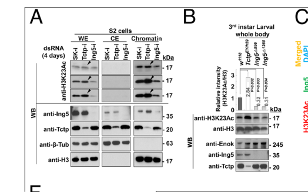

## Question

# Gene Research for Functional Annotation

## ⚠️ CRITICAL: Gene/Protein Identification Context

**BEFORE YOU BEGIN RESEARCH:** You MUST verify you are researching the CORRECT gene/protein. Gene symbols can be ambiguous, especially for less well-characterized genes from non-model organisms.

### Target Gene/Protein Identity (from UniProt):
- **UniProt Accession:** Q9VJY8
- **Protein Description:** RecName: Full=Inhibitor of growth protein 5 {ECO:0000305}; AltName: Full=Inhibitor of growth family member 5 {ECO:0000312|FlyBase:FBgn0032516};
- **Gene Information:** Name=Ing5 {ECO:0000312|FlyBase:FBgn0032516}; ORFNames=CG9293 {ECO:0000312|FlyBase:FBgn0032516};
- **Organism (full):** Drosophila melanogaster (Fruit fly).
- **Protein Family:** Belongs to the ING family. .
- **Key Domains:** ING_fam. (IPR028651); ING_N_histone-binding. (IPR024610); Zinc_finger_PHD-type_CS. (IPR019786); Znf_FYVE_PHD. (IPR011011); Znf_PHD. (IPR001965)

### MANDATORY VERIFICATION STEPS:

1. **Check if the gene symbol "Ing5" matches the protein description above**
2. **Verify the organism is correct:** Drosophila melanogaster (Fruit fly).
3. **Check if protein family/domains align with what you find in literature**
4. **If you find literature for a DIFFERENT gene with the same or similar symbol, STOP**

### If Gene Symbol is Ambiguous or You Cannot Find Relevant Literature:

**DO NOT PROCEED WITH RESEARCH ON A DIFFERENT GENE.** Instead:
- State clearly: "The gene symbol 'Ing5' is ambiguous or literature is limited for this specific protein"
- Explain what you found (e.g., "Found extensive literature on a different gene with the same symbol in a different organism")
- Describe the protein based ONLY on the UniProt information provided above
- Suggest that the protein function can be inferred from domain/family information

### Research Target:

Please provide a comprehensive research report on the gene **Ing5** (gene ID: Ing5, UniProt: Q9VJY8) in DROME.

The research report should be a detailed narrative explaining the function, biological processes, and localization of the gene product. Citations should be given for all claims.

You should prioritize authoritative reviews and primary scientific literature when conducting research. You can supplement
this with annotations you find in gene/protein databases, but these can be outdated or inaccurate.

We are specifically interested in the primary function of the gene - for enzymes, what reaction is catalyzed, and what is the substrate specificity? For transporters, what is the substrate? For structural proteins or adapters, what is the broader structural role? For signaling molecules, what is the role in the pathway.

We are interested in where in or outside the cell the gene product carries out its function.

We are also interested in the signaling or biochemical pathways in which the gene functions. We are less interested in broad pleiotropic effects, except where these elucidate the precise role.

Include evidence where possible. We are interested in both experimental evidence as well as inference from structure, evolution, or bioinformatic analysis. Precise studies should be prioritized over high-throughput, where available.

## Output

Question: You are an expert researcher providing comprehensive, well-cited information.

Provide detailed information focusing on:
1. Key concepts and definitions with current understanding
2. Recent developments and latest research (prioritize 2023-2024 sources)
3. Current applications and real-world implementations
4. Expert opinions and analysis from authoritative sources
5. Relevant statistics and data from recent studies

Format as a comprehensive research report with proper citations. Include URLs and publication dates where available.
Always prioritize recent, authoritative sources and provide specific citations for all major claims.

# Gene Research for Functional Annotation

## ⚠️ CRITICAL: Gene/Protein Identification Context

**BEFORE YOU BEGIN RESEARCH:** You MUST verify you are researching the CORRECT gene/protein. Gene symbols can be ambiguous, especially for less well-characterized genes from non-model organisms.

### Target Gene/Protein Identity (from UniProt):
- **UniProt Accession:** Q9VJY8
- **Protein Description:** RecName: Full=Inhibitor of growth protein 5 {ECO:0000305}; AltName: Full=Inhibitor of growth family member 5 {ECO:0000312|FlyBase:FBgn0032516};
- **Gene Information:** Name=Ing5 {ECO:0000312|FlyBase:FBgn0032516}; ORFNames=CG9293 {ECO:0000312|FlyBase:FBgn0032516};
- **Organism (full):** Drosophila melanogaster (Fruit fly).
- **Protein Family:** Belongs to the ING family. .
- **Key Domains:** ING_fam. (IPR028651); ING_N_histone-binding. (IPR024610); Zinc_finger_PHD-type_CS. (IPR019786); Znf_FYVE_PHD. (IPR011011); Znf_PHD. (IPR001965)

### MANDATORY VERIFICATION STEPS:

1. **Check if the gene symbol "Ing5" matches the protein description above**
2. **Verify the organism is correct:** Drosophila melanogaster (Fruit fly).
3. **Check if protein family/domains align with what you find in literature**
4. **If you find literature for a DIFFERENT gene with the same or similar symbol, STOP**

### If Gene Symbol is Ambiguous or You Cannot Find Relevant Literature:

**DO NOT PROCEED WITH RESEARCH ON A DIFFERENT GENE.** Instead:
- State clearly: "The gene symbol 'Ing5' is ambiguous or literature is limited for this specific protein"
- Explain what you found (e.g., "Found extensive literature on a different gene with the same symbol in a different organism")
- Describe the protein based ONLY on the UniProt information provided above
- Suggest that the protein function can be inferred from domain/family information

### Research Target:

Please provide a comprehensive research report on the gene **Ing5** (gene ID: Ing5, UniProt: Q9VJY8) in DROME.

The research report should be a detailed narrative explaining the function, biological processes, and localization of the gene product. Citations should be given for all claims.

You should prioritize authoritative reviews and primary scientific literature when conducting research. You can supplement
this with annotations you find in gene/protein databases, but these can be outdated or inaccurate.

We are specifically interested in the primary function of the gene - for enzymes, what reaction is catalyzed, and what is the substrate specificity? For transporters, what is the substrate? For structural proteins or adapters, what is the broader structural role? For signaling molecules, what is the role in the pathway.

We are interested in where in or outside the cell the gene product carries out its function.

We are also interested in the signaling or biochemical pathways in which the gene functions. We are less interested in broad pleiotropic effects, except where these elucidate the precise role.

Include evidence where possible. We are interested in both experimental evidence as well as inference from structure, evolution, or bioinformatic analysis. Precise studies should be prioritized over high-throughput, where available.

# Functional annotation report: *Drosophila melanogaster* Ing5 (Q9VJY8)

## Identity and principal function

**Identity verified.** The requested protein is fruit-fly Ing5, also called **CG9293**, not human ING5 or the distinct fly proteins Ing1 and Ing3. Fly-specific studies explicitly identify CG9293 as Ing5 and place it in the inhibitor-of-growth (ING) family; the reported ING-family region and C-terminal plant homeodomain (PHD) zinc finger agree with the domain annotations supplied for UniProt Q9VJY8. The 2023 study estimates approximately 58% amino-acid identity between fly Ing5 and human ING5, but that similarity does not make findings in the two species interchangeable. (huang2016regulationofkat6 pages 1-5, kim2023tctpaunique pages 2-3)

**Best-supported annotation:** Ing5 is a **nonenzymatic, chromatin-regulatory subunit** of the fly Enok–Br140–Eaf6 lysine-acetyltransferase complex. Its experimentally demonstrated contribution is to promote Enok association with nuclear chromatin and appropriate histone H3 lysine-23 acetylation (**H3K23ac**). **Enok, not Ing5, is the catalytic acetyltransferase**; assigning Ing5 an independent acetyl-transfer reaction or enzymatic substrate specificity would be incorrect. Ing5’s relevant molecular partners include Enok/Br140 and the negative regulator translationally controlled tumor protein (**Tctp**). (huang2016regulationofkat6 pages 1-5, kim2023tctpaunique pages 9-10, kim2023tctpaunique pages 7-7, huang2016regulationofkat6 pages 5-9)

The following evidence summary distinguishes directly tested fly functions from an important exception to the Enok–Ing5 partnership.

| Annotation | Fly-specific observation | Strength / caveat | Source DOI and citation ID |
|---|---|---|---|
| Enok-complex chromatin reader/regulator; H3K23 acetylation | Ing5 (CG9293) is a nonenzymatic subunit of the Enok–Br140–Eaf6 lysine-acetyltransferase complex. Fly-complex components contribute to Enok-mediated H3K23 acetylation; Ing5-null larvae show reduced H3K23ac. Its PHD domain supports a reader/regulatory role, but direct H3K4me3 binding by **fly Ing5** has not been demonstrated. | Strong biochemical, genetic and in-vivo acetylation evidence; catalytic activity resides in Enok, not Ing5. | [10.1128/MCB.00055-16](https://doi.org/10.1128/MCB.00055-16) (huang2016regulationofkat6 pages 1-5, kim2023tctpaunique media 1d400f5d) |
| Localization, Tctp binding and Enok recruitment | Ing5 occurs in cytosolic and nuclear fractions. Tctp directly binds the Ing5 PHD-containing region (residues 205–285) and restrains nuclear translocation. Ing5 RNAi reduced nuclear/chromatin Enok to **0.4-fold** of control, whereas Ing5 overexpression increased it approximately **1.7-fold**. | Strong evidence from fractionation, co-IP, GST pull-down, imaging and genetic manipulation. The PHD region mediates Tctp binding; this does not itself prove histone-mark recognition. | [10.1073/pnas.2218361120](https://doi.org/10.1073/pnas.2218361120) (kim2023tctpaunique pages 9-10, kim2023tctpaunique pages 7-9, kim2023tctpaunique pages 7-7, kim2023tctpaunique pages 3-3) |
| EGFR and Hippo/Yki pathway regulation | Ing5 depletion increased EGFR-pathway reporters and reduced the intervein regulators *net* and *blistered*. It also reduced Yki-target reporters, while elevated Yki activity rescued small-wing size. Ing5 loss alone did not cause generalized overgrowth, but with dysregulated Crumbs/Yki signaling it promoted context-dependent tumor-like growth, particularly with Enok depletion. | Substantial in-vivo reporter and genetic-interaction evidence, but the direct Ing5-regulated genes and causal chromatin loci remain unresolved. | [10.1073/pnas.2218361120](https://doi.org/10.1073/pnas.2218361120) (kim2023tctpaunique pages 4-5, kim2023tctpaunique pages 5-6, kim2023tctpaunique pages 7-9) |
| Boundary condition: Ing5-independent Enok function | In circulating larval crystal-cell differentiation, Enok and Br140 regulate Notch-dependent *lozenge* expression, but an *Ing5* deletion did not block crystal-cell formation. This Enok function was also independent of Enok catalytic activity despite reduced H3K23ac in *Ing5* mutants. | Important counterexample showing that Ing5 is not universally required for Enok function; evidence comes from a 2020 bioRxiv preprint rather than a peer-reviewed article. | [10.1101/2020.07.27.222620](https://doi.org/10.1101/2020.07.27.222620) (genais2020thedrosophilamoz pages 8-11) |

*Table: Fly-specific evidence supports Ing5 as a nonenzymatic regulator of Enok chromatin recruitment and H3K23 acetylation, with developmental links to EGFR and Hippo/Yki signaling. The final row defines an important context in which Enok acts independently of Ing5.*

## Molecular mechanism and cellular location

Fly Ing5 is present in **both cytosolic and nuclear fractions** of S2 cells and colocalizes with Tctp in larval salivary-gland cytosol and nuclei. Yeast two-hybrid screening, reciprocal co-immunoprecipitation, and *in-vitro* pull-down support a physical Ing5–Tctp interaction: Tctp binds an Ing5 fragment spanning residues **205–285** that contains the PHD region, whereas deletion of the PHD region abolishes detectable binding in that assay. The protein therefore operates at the **nuclear chromatin interface**, but has a regulated cytosolic pool rather than an exclusively nuclear localization. (kim2023tctpaunique pages 2-3, kim2023tctpaunique pages 3-3)

Tctp reduction redistributes Ing5 from cytosol toward the nucleus/chromatin **without increasing total Ing5 protein**. In S2-cell co-immunoprecipitations, added Tctp diminishes Ing5 association with Enok-complex subunits; the authors interpret this as inhibition of complex formation and Enok chromatin recruitment. In wing discs, Ing5 knockdown reduced measured nuclear/chromatin-associated Enok to **0.4 times** control, whereas Ing5 overexpression raised it to approximately **1.7 times** control. Tctp knockdown increased nuclear Enok approximately **2.4-fold**, an effect diminished by simultaneous Ing5 knockdown. These perturbations directly support a targeting/regulatory role for Ing5; they do not establish that Ing5 alone recognizes particular genomic DNA sequences. (kim2023tctpaunique pages 9-10, kim2023tctpaunique pages 7-7)

H3K23ac provides a biochemical readout. Ing5-null larvae had reduced H3K23ac, while a strong Tctp hypomorph had approximately **2.8-fold** higher larval H3K23ac; sampled mutant tissues showed approximately **two- to threefold** increases. Enok depletion also substantially diminished the Tctp-knockdown-induced nuclear accumulation of Ing5 in **89%** of examined wing discs, suggesting reciprocal Enok-dependent nuclear retention. The proposed Tctp → Ing5 localization → Enok chromatin occupancy → H3K23ac feedback model is supported by these interventions, although its precise transport machinery and gene-by-gene chromatin targets remain unresolved. The paper’s Figure 7 directly displays the Ing5-mutant acetylation and Enok-dependent localization results. (kim2023tctpaunique pages 9-10, kim2023tctpaunique pages 7-9, kim2023tctpaunique pages 10-10, kim2023tctpaunique media 1d400f5d)

**Domain-based inference versus measurement:** ING-family PHD fingers can recognize methylated histone H3, and biochemical work reviewed for **mammalian ING5** links its PHD finger to H3K4me3 and acetyltransferase stimulation. This makes histone-mark reading by fly Ing5 plausible, but the fly experiments above directly establish **Tctp binding to its PHD-containing region**, not an isolated measurement of fly Ing5’s histone-mark affinity or a fly-specific H3K4me3 binding constant. Likewise, the fly annotation does not establish a separate FYVE-domain-mediated membrane-localization function: the decisive cellular observations here concern cytosol, nucleus and chromatin. (huang2016regulationofkat6 pages 1-5, kim2023tctpaunique pages 3-3)

## Biological processes and signaling

Ing5’s strongest fly phenotypes concern **differentiation, cell fate and tissue patterning**, rather than uniform inhibition of proliferation. In the 2023 loss-of-function study, homozygous null animals developed slowly, arrested around the prepupal period and died; mutant adult clones exhibited antenna-to-leg transformations, disordered eye ommatidia, thoracic clefts and abnormal wing veins. In contrast, tested eye/wing mutant clones showed no comparably large general defect in growth or proliferation, and ectopic Ing5 expression did not inhibit wing growth. These context-dependent observations caution against annotating fly Ing5 simply as a general antiproliferative protein on the basis of mammalian cancer studies. (kim2023tctpaunique pages 3-4, kim2023tctpaunique pages 4-5, kim2023tctpaunique pages 3-3)

**EGFR–Ras–ERK signaling.** In wing discs depleted of Ing5, the EGFR-responsive *pointed* and *argos* reporters increased, while the intervein regulators *net* and *blistered* decreased. Lowering EGFR-pathway activity genetically suppressed the excess-wing-vein phenotype. Thus, in this developmental setting Ing5 acts as a **negative regulator of EGFR-associated outputs**, possibly through maintenance of inhibitory intervein gene expression; the studies do not yet show that Ing5 binds those promoters directly. In eyes already driven by excess EGFR or activated Rolled/ERK, additional Ing5 knockdown increased eye size by approximately **20–30%** and enhanced roughness, consistent with context-dependent effects on survival and differentiation. (kim2023tctpaunique pages 3-4, kim2023tctpaunique pages 4-5, kim2023tctpaunique pages 6-7)

**Hippo–Yorkie (Yki) signaling.** Ing5 depletion reduced reporters for several Yki-responsive genes, including *expanded*, *bantam*, *dMyc* and *cyclin E*. Increasing Yki activity genetically restored small-wing size in Ing5-depleted animals. This supports **positive regulation of Yki-associated organ-size output** in wings, while leaving the direct biochemical connection between Ing5/Enok chromatin activity and those specific genes unresolved. The apparently different EGFR and Yki effects are not contradictory: they were assessed using distinct pathway outputs and tissue contexts. (kim2023tctpaunique pages 5-6)

Ing5 depletion alone did **not** establish a general tumor phenotype. Under experimentally heightened Crumbs/Yki signaling, however, Ing5 loss exacerbated eye-tissue abnormalities; combined Ing5 and Enok depletion produced especially severe overgrowth and folding. Reducing Tctp suppressed several Ing5- or Enok-associated defects. These fly-genetic interactions demonstrate a conditional restraint on abnormal growth, **not** a demonstrated human cancer treatment or proof that all fly Ing5 phenotypes arise through one direct transcriptional target. (kim2023tctpaunique pages 7-9, kim2023tctpaunique pages 6-7, kim2023tctpaunique pages 10-10)

## Important boundary on the annotation

**Not every Enok-dependent process requires Ing5.** A 2020 *bioRxiv preprint* examined circulating larval crystal cells and found that Enok and Br140 were needed for Notch-dependent expression of the RUNX-family factor *lozenge*, whereas an *Ing5* deletion did **not** prevent crystal-cell formation. That study also found this Enok function did not require its acetyltransferase activity, even though *Ing5* mutation mildly reduced H3K23ac in the examined hemocytes. This is a valuable direct counterexample to the assertion that Ing5 is obligatory for every Enok function; its preprint status should be retained when weighing the result. Similarly, reports concerning fly Enok–Elg1/PCNA cell-cycle regulation or Enok–PRC1-associated developmental chromatin do not, by themselves, prove that **Ing5 individually** executes every such activity. (genais2020thedrosophilamoz pages 8-11, huang2016regulationofkat6 pages 5-9, kang2017bivalentcomplexesof pages 1-2)

## Research maturity and application

The major recent **fly-specific mechanistic advance** identified here is the 2023 experimental demonstration of Tctp-regulated Ing5 trafficking and Enok chromatin recruitment. The available 2024 literature encountered did not establish an additional comparably direct fly-Ing5 mechanism. In practical research, *Ing5* deletion/RNAi and rescue, fluorescent pathway reporters, chromatin fractionation and H3K23ac measurements constitute experimentally implemented tools for probing chromatin-dependent developmental signaling. A proposed application is using these flies to investigate conserved ING–KAT6 regulation; transferring the Tctp mechanism to human disease, or inferring human treatment efficacy, remains speculative. (kim2023tctpaunique pages 1-2, kim2023tctpaunique pages 9-10, kim2023tctpaunique pages 10-10)

### Key sources and publication dates

- **Kim et al., published 4 April 2023**, “Tctp, a unique Ing5-binding partner, inhibits the chromatin binding of Enok in Drosophila,” *Proceedings of the National Academy of Sciences* **120**, e2218361120. Primary source for fly Ing5 null phenotypes, localization, Tctp binding, signaling genetics and H3K23ac. https://doi.org/10.1073/pnas.2218361120 (kim2023tctpaunique pages 1-2, kim2023tctpaunique pages 9-10)
- **Genais et al., preprint posted 28 July 2020**, “The Drosophila MOZ homolog Enok controls Notch-dependent induction of the RUNX gene lozenge independently of its histone-acetyl transferase activity.” Primary, **not peer-reviewed in the version examined**, for Ing5-independent Enok action in crystal-cell differentiation. https://doi.org/10.1101/2020.07.27.222620 (genais2020thedrosophilamoz pages 8-11, genais2020thedrosophilamoz pages 1-5)
- **Huang, Abmayr and Workman, 2016**, “Regulation of KAT6 Acetyltransferases and Their Roles in Cell Cycle Progression, Stem Cell Maintenance, and Human Disease,” *Molecular and Cellular Biology* **36**, 1900–1907. Authoritative review of Enok-complex composition and acetylation specificity; accepted manuscript posted **16 May 2016**. https://doi.org/10.1128/MCB.00055-16 (huang2016regulationofkat6 pages 1-5, huang2016regulationofkat6 pages 5-9)
- **Kang et al., 2017**, “Bivalent complexes of PRC1 with orthologs of BRD4 and MOZ/MORF target developmental genes in Drosophila,” *Genes & Development* **31**, 1988–2002. Broader chromatin-context evidence for Enok/Br140-containing assemblies, not a standalone demonstration of an Ing5-specific PRC1 function. https://doi.org/10.1101/gad.305987.117 (kang2017bivalentcomplexesof pages 1-2)

References

1. (huang2016regulationofkat6 pages 1-5): Fu Huang, Susan M. Abmayr, and Jerry L. Workman. Regulation of kat6 acetyltransferases and their roles in cell cycle progression, stem cell maintenance, and human disease. Molecular and Cellular Biology, 36:1900-1907, Jul 2016. URL: https://doi.org/10.1128/mcb.00055-16, doi:10.1128/mcb.00055-16. This article has 113 citations and is from a domain leading peer-reviewed journal.

2. (kim2023tctpaunique pages 2-3): Lee-Hyang Kim, Ja-Young Kim, Yu-Ying Xu, Mi Ae Lim, Bon Seok Koo, Jung Hae Kim, Sung-Eun Yoon, Young-Joon Kim, Kwang-Wook Choi, Jae Won Chang, and Sung-Tae Hong. Tctp, a unique ing5-binding partner, inhibits the chromatin binding of enok in drosophila. Proceedings of the National Academy of Sciences of the United States of America, Apr 2023. URL: https://doi.org/10.1073/pnas.2218361120, doi:10.1073/pnas.2218361120. This article has 5 citations and is from a highest quality peer-reviewed journal.

3. (kim2023tctpaunique pages 9-10): Lee-Hyang Kim, Ja-Young Kim, Yu-Ying Xu, Mi Ae Lim, Bon Seok Koo, Jung Hae Kim, Sung-Eun Yoon, Young-Joon Kim, Kwang-Wook Choi, Jae Won Chang, and Sung-Tae Hong. Tctp, a unique ing5-binding partner, inhibits the chromatin binding of enok in drosophila. Proceedings of the National Academy of Sciences of the United States of America, Apr 2023. URL: https://doi.org/10.1073/pnas.2218361120, doi:10.1073/pnas.2218361120. This article has 5 citations and is from a highest quality peer-reviewed journal.

4. (kim2023tctpaunique pages 7-7): Lee-Hyang Kim, Ja-Young Kim, Yu-Ying Xu, Mi Ae Lim, Bon Seok Koo, Jung Hae Kim, Sung-Eun Yoon, Young-Joon Kim, Kwang-Wook Choi, Jae Won Chang, and Sung-Tae Hong. Tctp, a unique ing5-binding partner, inhibits the chromatin binding of enok in drosophila. Proceedings of the National Academy of Sciences of the United States of America, Apr 2023. URL: https://doi.org/10.1073/pnas.2218361120, doi:10.1073/pnas.2218361120. This article has 5 citations and is from a highest quality peer-reviewed journal.

5. (huang2016regulationofkat6 pages 5-9): Fu Huang, Susan M. Abmayr, and Jerry L. Workman. Regulation of kat6 acetyltransferases and their roles in cell cycle progression, stem cell maintenance, and human disease. Molecular and Cellular Biology, 36:1900-1907, Jul 2016. URL: https://doi.org/10.1128/mcb.00055-16, doi:10.1128/mcb.00055-16. This article has 113 citations and is from a domain leading peer-reviewed journal.

6. (kim2023tctpaunique media 1d400f5d): Lee-Hyang Kim, Ja-Young Kim, Yu-Ying Xu, Mi Ae Lim, Bon Seok Koo, Jung Hae Kim, Sung-Eun Yoon, Young-Joon Kim, Kwang-Wook Choi, Jae Won Chang, and Sung-Tae Hong. Tctp, a unique ing5-binding partner, inhibits the chromatin binding of enok in drosophila. Proceedings of the National Academy of Sciences of the United States of America, Apr 2023. URL: https://doi.org/10.1073/pnas.2218361120, doi:10.1073/pnas.2218361120. This article has 5 citations and is from a highest quality peer-reviewed journal.

7. (kim2023tctpaunique pages 7-9): Lee-Hyang Kim, Ja-Young Kim, Yu-Ying Xu, Mi Ae Lim, Bon Seok Koo, Jung Hae Kim, Sung-Eun Yoon, Young-Joon Kim, Kwang-Wook Choi, Jae Won Chang, and Sung-Tae Hong. Tctp, a unique ing5-binding partner, inhibits the chromatin binding of enok in drosophila. Proceedings of the National Academy of Sciences of the United States of America, Apr 2023. URL: https://doi.org/10.1073/pnas.2218361120, doi:10.1073/pnas.2218361120. This article has 5 citations and is from a highest quality peer-reviewed journal.

8. (kim2023tctpaunique pages 3-3): Lee-Hyang Kim, Ja-Young Kim, Yu-Ying Xu, Mi Ae Lim, Bon Seok Koo, Jung Hae Kim, Sung-Eun Yoon, Young-Joon Kim, Kwang-Wook Choi, Jae Won Chang, and Sung-Tae Hong. Tctp, a unique ing5-binding partner, inhibits the chromatin binding of enok in drosophila. Proceedings of the National Academy of Sciences of the United States of America, Apr 2023. URL: https://doi.org/10.1073/pnas.2218361120, doi:10.1073/pnas.2218361120. This article has 5 citations and is from a highest quality peer-reviewed journal.

9. (kim2023tctpaunique pages 4-5): Lee-Hyang Kim, Ja-Young Kim, Yu-Ying Xu, Mi Ae Lim, Bon Seok Koo, Jung Hae Kim, Sung-Eun Yoon, Young-Joon Kim, Kwang-Wook Choi, Jae Won Chang, and Sung-Tae Hong. Tctp, a unique ing5-binding partner, inhibits the chromatin binding of enok in drosophila. Proceedings of the National Academy of Sciences of the United States of America, Apr 2023. URL: https://doi.org/10.1073/pnas.2218361120, doi:10.1073/pnas.2218361120. This article has 5 citations and is from a highest quality peer-reviewed journal.

10. (kim2023tctpaunique pages 5-6): Lee-Hyang Kim, Ja-Young Kim, Yu-Ying Xu, Mi Ae Lim, Bon Seok Koo, Jung Hae Kim, Sung-Eun Yoon, Young-Joon Kim, Kwang-Wook Choi, Jae Won Chang, and Sung-Tae Hong. Tctp, a unique ing5-binding partner, inhibits the chromatin binding of enok in drosophila. Proceedings of the National Academy of Sciences of the United States of America, Apr 2023. URL: https://doi.org/10.1073/pnas.2218361120, doi:10.1073/pnas.2218361120. This article has 5 citations and is from a highest quality peer-reviewed journal.

11. (genais2020thedrosophilamoz pages 8-11): Thomas Genais, Delhia Gigan, Benoit Augé, Douaa Moussalem, Lucas Waltzer, Marc Haenlin, and Vanessa Gobert. The drosophila moz homolog enok controls notch-dependent induction of the runx gene lozenge independently of its histone-acetyl transferase activity. bioRxiv, Jul 2020. URL: https://doi.org/10.1101/2020.07.27.222620, doi:10.1101/2020.07.27.222620. This article has 2 citations.

12. (kim2023tctpaunique pages 10-10): Lee-Hyang Kim, Ja-Young Kim, Yu-Ying Xu, Mi Ae Lim, Bon Seok Koo, Jung Hae Kim, Sung-Eun Yoon, Young-Joon Kim, Kwang-Wook Choi, Jae Won Chang, and Sung-Tae Hong. Tctp, a unique ing5-binding partner, inhibits the chromatin binding of enok in drosophila. Proceedings of the National Academy of Sciences of the United States of America, Apr 2023. URL: https://doi.org/10.1073/pnas.2218361120, doi:10.1073/pnas.2218361120. This article has 5 citations and is from a highest quality peer-reviewed journal.

13. (kim2023tctpaunique pages 3-4): Lee-Hyang Kim, Ja-Young Kim, Yu-Ying Xu, Mi Ae Lim, Bon Seok Koo, Jung Hae Kim, Sung-Eun Yoon, Young-Joon Kim, Kwang-Wook Choi, Jae Won Chang, and Sung-Tae Hong. Tctp, a unique ing5-binding partner, inhibits the chromatin binding of enok in drosophila. Proceedings of the National Academy of Sciences of the United States of America, Apr 2023. URL: https://doi.org/10.1073/pnas.2218361120, doi:10.1073/pnas.2218361120. This article has 5 citations and is from a highest quality peer-reviewed journal.

14. (kim2023tctpaunique pages 6-7): Lee-Hyang Kim, Ja-Young Kim, Yu-Ying Xu, Mi Ae Lim, Bon Seok Koo, Jung Hae Kim, Sung-Eun Yoon, Young-Joon Kim, Kwang-Wook Choi, Jae Won Chang, and Sung-Tae Hong. Tctp, a unique ing5-binding partner, inhibits the chromatin binding of enok in drosophila. Proceedings of the National Academy of Sciences of the United States of America, Apr 2023. URL: https://doi.org/10.1073/pnas.2218361120, doi:10.1073/pnas.2218361120. This article has 5 citations and is from a highest quality peer-reviewed journal.

15. (kang2017bivalentcomplexesof pages 1-2): Hyuckjoon Kang, Youngsook L. Jung, Kyle A. McElroy, Barry M. Zee, Heather A. Wallace, Jessica L. Woolnough, Peter J. Park, and Mitzi I. Kuroda. Bivalent complexes of prc1 with orthologs of brd4 and moz/morf target developmental genes in drosophila. Genes & Development, 31:1988-2002, Oct 2017. URL: https://doi.org/10.1101/gad.305987.117, doi:10.1101/gad.305987.117. This article has 49 citations and is from a highest quality peer-reviewed journal.

16. (kim2023tctpaunique pages 1-2): Lee-Hyang Kim, Ja-Young Kim, Yu-Ying Xu, Mi Ae Lim, Bon Seok Koo, Jung Hae Kim, Sung-Eun Yoon, Young-Joon Kim, Kwang-Wook Choi, Jae Won Chang, and Sung-Tae Hong. Tctp, a unique ing5-binding partner, inhibits the chromatin binding of enok in drosophila. Proceedings of the National Academy of Sciences of the United States of America, Apr 2023. URL: https://doi.org/10.1073/pnas.2218361120, doi:10.1073/pnas.2218361120. This article has 5 citations and is from a highest quality peer-reviewed journal.

17. (genais2020thedrosophilamoz pages 1-5): Thomas Genais, Delhia Gigan, Benoit Augé, Douaa Moussalem, Lucas Waltzer, Marc Haenlin, and Vanessa Gobert. The drosophila moz homolog enok controls notch-dependent induction of the runx gene lozenge independently of its histone-acetyl transferase activity. bioRxiv, Jul 2020. URL: https://doi.org/10.1101/2020.07.27.222620, doi:10.1101/2020.07.27.222620. This article has 2 citations.

## Artifacts

- [Edison artifact artifact-00](Ing5-deep-research-falcon_artifacts/artifact-00.md)

## Citations

1. genais2020thedrosophilamoz pages 8-11
2. kim2023tctpaunique pages 5-6
3. kang2017bivalentcomplexesof pages 1-2
4. kim2023tctpaunique pages 2-3
5. kim2023tctpaunique pages 9-10
6. kim2023tctpaunique pages 7-7
7. kim2023tctpaunique pages 7-9
8. kim2023tctpaunique pages 3-3
9. kim2023tctpaunique pages 4-5
10. kim2023tctpaunique pages 10-10
11. kim2023tctpaunique pages 3-4
12. kim2023tctpaunique pages 6-7
13. kim2023tctpaunique pages 1-2
14. genais2020thedrosophilamoz pages 1-5
15. 10.1128/MCB.00055-16
16. 10.1073/pnas.2218361120
17. 10.1101/2020.07.27.222620
18. https://doi.org/10.1128/MCB.00055-16
19. https://doi.org/10.1073/pnas.2218361120
20. https://doi.org/10.1101/2020.07.27.222620
21. https://doi.org/10.1101/gad.305987.117
22. https://doi.org/10.1128/mcb.00055-16,
23. https://doi.org/10.1073/pnas.2218361120,
24. https://doi.org/10.1101/2020.07.27.222620,
25. https://doi.org/10.1101/gad.305987.117,