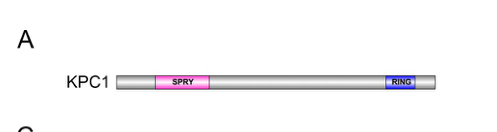

## Question

# Gene Research for Functional Annotation

## ⚠️ CRITICAL: Gene/Protein Identification Context

**BEFORE YOU BEGIN RESEARCH:** You MUST verify you are researching the CORRECT gene/protein. Gene symbols can be ambiguous, especially for less well-characterized genes from non-model organisms.

### Target Gene/Protein Identity (from UniProt):
- **UniProt Accession:** Q9VFC4
- **Protein Description:** RecName: Full=RING-type E3 ubiquitin transferase {ECO:0000256|ARBA:ARBA00012483}; EC=2.3.2.27 {ECO:0000256|ARBA:ARBA00012483};
- **Gene Information:** Name=Kpc1 {ECO:0000313|EMBL:AAF55136.1, ECO:0000313|FlyBase:FBgn0038296}; Synonyms=dKPC1 {ECO:0000313|EMBL:AAF55136.1}, dKpc1 {ECO:0000313|EMBL:AAF55136.1}, Dmel\CG6752 {ECO:0000313|EMBL:AAF55136.1}; ORFNames=CG6752 {ECO:0000313|EMBL:AAF55136.1, ECO:0000313|FlyBase:FBgn0038296}, Dmel_CG6752 {ECO:0000313|EMBL:AAF55136.1};
- **Organism (full):** Drosophila melanogaster (Fruit fly).
- **Protein Family:** Not specified in UniProt
- **Key Domains:** B30.2/SPRY. (IPR001870); B30.2/SPRY_sf. (IPR043136); ConA-like_dom_sf. (IPR013320); RNF123/RKP/RSPRY1. (IPR045129); SPRY_dom. (IPR003877)

### MANDATORY VERIFICATION STEPS:

1. **Check if the gene symbol "Kpc1" matches the protein description above**
2. **Verify the organism is correct:** Drosophila melanogaster (Fruit fly).
3. **Check if protein family/domains align with what you find in literature**
4. **If you find literature for a DIFFERENT gene with the same or similar symbol, STOP**

### If Gene Symbol is Ambiguous or You Cannot Find Relevant Literature:

**DO NOT PROCEED WITH RESEARCH ON A DIFFERENT GENE.** Instead:
- State clearly: "The gene symbol 'Kpc1' is ambiguous or literature is limited for this specific protein"
- Explain what you found (e.g., "Found extensive literature on a different gene with the same symbol in a different organism")
- Describe the protein based ONLY on the UniProt information provided above
- Suggest that the protein function can be inferred from domain/family information

### Research Target:

Please provide a comprehensive research report on the gene **Kpc1** (gene ID: Kpc1, UniProt: Q9VFC4) in DROME.

The research report should be a detailed narrative explaining the function, biological processes, and localization of the gene product. Citations should be given for all claims.

You should prioritize authoritative reviews and primary scientific literature when conducting research. You can supplement
this with annotations you find in gene/protein databases, but these can be outdated or inaccurate.

We are specifically interested in the primary function of the gene - for enzymes, what reaction is catalyzed, and what is the substrate specificity? For transporters, what is the substrate? For structural proteins or adapters, what is the broader structural role? For signaling molecules, what is the role in the pathway.

We are interested in where in or outside the cell the gene product carries out its function.

We are also interested in the signaling or biochemical pathways in which the gene functions. We are less interested in broad pleiotropic effects, except where these elucidate the precise role.

Include evidence where possible. We are interested in both experimental evidence as well as inference from structure, evolution, or bioinformatic analysis. Precise studies should be prioritized over high-throughput, where available.

## Output

Question: You are an expert researcher providing comprehensive, well-cited information.

Provide detailed information focusing on:
1. Key concepts and definitions with current understanding
2. Recent developments and latest research (prioritize 2023-2024 sources)
3. Current applications and real-world implementations
4. Expert opinions and analysis from authoritative sources
5. Relevant statistics and data from recent studies

Format as a comprehensive research report with proper citations. Include URLs and publication dates where available.
Always prioritize recent, authoritative sources and provide specific citations for all major claims.

# Gene Research for Functional Annotation

## ⚠️ CRITICAL: Gene/Protein Identification Context

**BEFORE YOU BEGIN RESEARCH:** You MUST verify you are researching the CORRECT gene/protein. Gene symbols can be ambiguous, especially for less well-characterized genes from non-model organisms.

### Target Gene/Protein Identity (from UniProt):
- **UniProt Accession:** Q9VFC4
- **Protein Description:** RecName: Full=RING-type E3 ubiquitin transferase {ECO:0000256|ARBA:ARBA00012483}; EC=2.3.2.27 {ECO:0000256|ARBA:ARBA00012483};
- **Gene Information:** Name=Kpc1 {ECO:0000313|EMBL:AAF55136.1, ECO:0000313|FlyBase:FBgn0038296}; Synonyms=dKPC1 {ECO:0000313|EMBL:AAF55136.1}, dKpc1 {ECO:0000313|EMBL:AAF55136.1}, Dmel\CG6752 {ECO:0000313|EMBL:AAF55136.1}; ORFNames=CG6752 {ECO:0000313|EMBL:AAF55136.1, ECO:0000313|FlyBase:FBgn0038296}, Dmel_CG6752 {ECO:0000313|EMBL:AAF55136.1};
- **Organism (full):** Drosophila melanogaster (Fruit fly).
- **Protein Family:** Not specified in UniProt
- **Key Domains:** B30.2/SPRY. (IPR001870); B30.2/SPRY_sf. (IPR043136); ConA-like_dom_sf. (IPR013320); RNF123/RKP/RSPRY1. (IPR045129); SPRY_dom. (IPR003877)

### MANDATORY VERIFICATION STEPS:

1. **Check if the gene symbol "Kpc1" matches the protein description above**
2. **Verify the organism is correct:** Drosophila melanogaster (Fruit fly).
3. **Check if protein family/domains align with what you find in literature**
4. **If you find literature for a DIFFERENT gene with the same or similar symbol, STOP**

### If Gene Symbol is Ambiguous or You Cannot Find Relevant Literature:

**DO NOT PROCEED WITH RESEARCH ON A DIFFERENT GENE.** Instead:
- State clearly: "The gene symbol 'Kpc1' is ambiguous or literature is limited for this specific protein"
- Explain what you found (e.g., "Found extensive literature on a different gene with the same symbol in a different organism")
- Describe the protein based ONLY on the UniProt information provided above
- Suggest that the protein function can be inferred from domain/family information

### Research Target:

Please provide a comprehensive research report on the gene **Kpc1** (gene ID: Kpc1, UniProt: Q9VFC4) in DROME.

The research report should be a detailed narrative explaining the function, biological processes, and localization of the gene product. Citations should be given for all claims.

You should prioritize authoritative reviews and primary scientific literature when conducting research. You can supplement
this with annotations you find in gene/protein databases, but these can be outdated or inaccurate.

We are specifically interested in the primary function of the gene - for enzymes, what reaction is catalyzed, and what is the substrate specificity? For transporters, what is the substrate? For structural proteins or adapters, what is the broader structural role? For signaling molecules, what is the role in the pathway.

We are interested in where in or outside the cell the gene product carries out its function.

We are also interested in the signaling or biochemical pathways in which the gene functions. We are less interested in broad pleiotropic effects, except where these elucidate the precise role.

Include evidence where possible. We are interested in both experimental evidence as well as inference from structure, evolution, or bioinformatic analysis. Precise studies should be prioritized over high-throughput, where available.

# Functional annotation report: *Drosophila melanogaster* Kpc1

## Identity and evidence base

**The target is fly Kpc1/dKpc1, encoded by CG6752—not mammalian KPC1/RNF123.** The supplied UniProt annotation maps accession **Q9VFC4** to *D. melanogaster* Kpc1 (FlyBase **FBgn0038296**). Independently, Li and colleagues identify **CG6752/dKpc1** as the fly homolog of human KPC1, with 30% protein identity and 48% similarity. Their predicted 1,332-amino-acid, approximately 151-kDa protein has an N-terminal SPRY region and a C-terminal RING-finger domain, consistent with the supplied B30.2/SPRY and RNF123-related domain annotations. The accession and FlyBase-ID mapping come from the supplied record; the paper independently verifies the CG6752 identity and domain architecture. (li2020ageneticscreen pages 5-8, li2020ageneticscreen pages 8-10)

The principal directly relevant experimental source located is **Li et al., “A genetic screen in Drosophila reveals an unexpected role for the KIP1 ubiquitination-promoting complex in male fertility,” *PLOS Genetics*, published 30 December 2020**, https://doi.org/10.1371/journal.pgen.1009217. Its genetic rescue, protein-interaction, modification and localization experiments provide substantially stronger fly-specific annotation than domain prediction alone. (li2020ageneticscreen pages 5-8, li2020ageneticscreen pages 8-10, li2020ageneticscreen pages 10-12)

## Primary molecular function and substrate specificity

**Best-supported functional assignment:** dKPC1 is the RING-containing component of a sperm-associated **KPC1–KPC2 ubiquitination complex**. Reciprocal co-immunoprecipitation of testis extracts establishes that dKPC1 associates with dKPC2, the fly homolog of the adaptor UBAC1; loss of either protein markedly depletes its partner, and restoring the missing component restores detection of the other. These results establish an in-vivo complex and mutual protein stability, although co-immunoprecipitation alone does not prove direct binding between purified proteins. (li2020ageneticscreen pages 8-10, li2020ageneticscreen pages 10-12, li2020ageneticscreen pages 12-14, li2020ageneticscreen media b69c4ffe)

As a **predicted RING-type E3 ubiquitin transferase** (the supplied UniProt record assigns EC 2.3.2.27), dKPC1 is expected to facilitate transfer of ubiquitin from a charged E2 enzyme to a protein substrate. The strongest fly-specific candidate is **dKPC2 itself**: deubiquitinase and phosphatase treatments support assignment of an approximately 49-kDa unmodified dKPC2 species and approximately 58-kDa monoubiquitinated and phosphorylated–monoubiquitinated species. Modified dKPC2 species disappear when dKPC1 is disrupted. The authors accordingly conclude that dKPC1 is **likely** the E3 responsible for dKPC2 monoubiquitination. They did **not** report a purified-component ubiquitin-transfer assay, catalytic-RING mutant, E2 specificity, acceptor-lysine site or kinetic parameters; direct enzymatic transfer to dKPC2 therefore remains **strongly supported but unproven**. No broader fly substrate specificity has been established. (li2020ageneticscreen pages 8-10, li2020ageneticscreen pages 10-12, li2020ageneticscreen pages 5-8)

A SPRY-region dKpc1 allele retains detectable dKPC1 protein but disrupts its association with dKPC2 and abolishes detectable modified dKPC2. This connects the region to productive complex formation, **not** to a demonstrated catalytic role of SPRY itself. There is an internal description inconsistency: the paper’s supplementary Figure S8 calls the allele a **six-base-pair insertion**, whereas its main discussion describes a **two-amino-acid deletion**; the biochemical phenotype does not depend on choosing between those descriptions. (li2020ageneticscreen pages 8-10, li2020ageneticscreen pages 10-12, li2020ageneticscreen pages 18-20)

**Amo is a downstream localization client, not a demonstrated ubiquitination substrate.** Although dKPC1 is necessary for correct localization of the polycystin-2/TRPP2 homolog Amo, neither dKPC1 nor dKPC2 co-immunoprecipitated with Amo. The investigators could not convincingly detect Amo ubiquitination, and its total abundance in mutant testes remained similar to wild type. Thus, neither direct Amo binding nor ubiquitin-dependent Amo degradation or cleavage explains the established phenotype. Mammalian KPC substrates such as p27Kip1 or the NF-κB1 precursor p105 must likewise **not** be annotated as substrates of fly CG6752 without fly-specific evidence. (li2020ageneticscreen pages 17-18, li2020ageneticscreen pages 10-12, li2020ageneticscreen pages 12-14)

## Cellular location, pathway and physiological role

Immunoblotting detects dKPC1 in testes and sperm, but not in the tested female samples or males from which testes were removed. Antibody staining places it in a restricted region **at the tip of the mature sperm flagellum**, partially coincident with Amo. This is the experimentally demonstrated site most relevant to its function; the study does not resolve whether dKPC1 is membrane-bound there, nor does it establish its distribution throughout other developmental stages or tissues. (li2020ageneticscreen pages 10-12, li2020ageneticscreen pages 5-8, li2020ageneticscreen media 90ff79c1)

The pathway can be stated conservatively as **dKPC1–dKPC2 complex integrity and dKPC2 modification → correct Amo enrichment at the sperm-tail tip → sperm storage in the female reproductive tract → male fertility**. dKpc1 insertion mutants and independent male-germline RNAi lose tip-localized Amo; females mated to these males have empty seminal receptacles and the males are sterile. **Precise excision** of the disruptive insertion restores dKPC1 expression, Amo localization, sperm storage and fertility, supporting attribution to CG6752 rather than a coincidental background mutation. The proposed intervening step—modification of an unidentified trafficking factor or sperm-tail membrane environment—is a model, **not** an identified molecular pathway or substrate. (li2020ageneticscreen pages 10-12, li2020ageneticscreen pages 5-8, li2020ageneticscreen pages 12-14, li2020ageneticscreen media 23785a1e)

The strongest quantitative biochemical result is an approximately **fourfold increase in unmodified, 49-kDa dKPC2** in dKpc1-mutant testes relative to precise-excision controls, measured in **three independent experiments** (*P* < 0.001); this does not mean total dKPC2 increased, because the modified forms were depleted. Reported fertility rescue is also significant (*P* < 0.001). These are fly experiments, not human fertility statistics. (li2020ageneticscreen pages 17-18, li2020ageneticscreen pages 18-20, li2020ageneticscreen pages 10-12)

The following table separates observations from interpretations and remaining limits. (li2020ageneticscreen pages 8-10, li2020ageneticscreen pages 10-12, li2020ageneticscreen pages 5-8, li2020ageneticscreen pages 12-14)

| Feature | Direct fly observation | Interpretation / remaining limit |
|---|---|---|
| Identity and architecture | Li et al. identify *D. melanogaster* **CG6752/dKpc1** as a human KPC1 homolog (30% identity; 48% similarity), encoding a predicted 1,332-aa, ~151-kDa protein with an N-terminal SPRY region and C-terminal RING-finger domain. (li2020ageneticscreen pages 10-12, li2020ageneticscreen pages 5-8) | Supports annotation of Q9VFC4 as a SPRY-containing RING E3-ligase homolog. Architecture is predicted; the study did not solve its structure or directly assay RING catalysis. |
| dKPC1–dKPC2 complex | Reciprocal co-immunoprecipitation from testes demonstrated association. dKPC1 was undetectable in dKpc2-mutant testes, while dKPC2 was strongly depleted in dKpc1 mutants; re-expression restored the missing partner. (li2020ageneticscreen pages 8-10, li2020ageneticscreen pages 10-12, li2020ageneticscreen pages 12-14) | Strong evidence that dKPC1 and dKPC2 form an in-vivo complex and reciprocally stabilize each other. It does not establish binding stoichiometry or prove that association is direct. |
| dKPC2 modification | Testes contained unmodified dKPC2 at ~49 kDa and a ~58-kDa doublet interpreted by deubiquitinase/phosphatase treatment as monoubiquitinated and phosphorylated–monoubiquitinated forms. Loss of dKPC1 eliminated modified forms; unmodified dKPC2 increased ~4-fold relative to precise-excision control across three experiments (*P*<0.001). (li2020ageneticscreen pages 8-10, li2020ageneticscreen pages 17-18, li2020ageneticscreen pages 18-20) | Strong genetic and biochemical evidence that dKPC1 is required for dKPC2 monoubiquitination and stability, making dKPC2 a candidate substrate. Direct transfer by purified dKPC1, linkage/site specificity, E2 partner, kinetics, and catalytic RING dependence were not demonstrated. |
| Flagellar-tip localization and Amo | dKPC1 localized with Amo at the mature sperm-tail tip. dKpc1 mutation or germline RNAi removed Amo from this tip; total testis Amo abundance remained near wild type. A SPRY-region allele produced dKPC1 but disrupted dKPC2 association, tip localization, dKPC2 modification, and Amo localization. (li2020ageneticscreen pages 8-10, li2020ageneticscreen pages 10-12, li2020ageneticscreen pages 5-8, li2020ageneticscreen pages 12-14) | Supports a role in the final targeting or retention of Amo at a specialized flagellar membrane domain—not Amo synthesis or bulk stability. Figure S8 calls the SPRY lesion a 6-bp insertion, whereas the main narrative calls it a two-amino-acid deletion; conclusions should not depend on resolving that wording inconsistency. |
| Fertility and sperm storage | dKpc1 insertion mutants and germline knockdown males were sterile, and female seminal receptacles were empty after mating. Precise transposon excision restored dKPC1 expression, Amo localization, sperm storage, and fertility (*P*<0.001). (li2020ageneticscreen pages 17-18, li2020ageneticscreen pages 10-12, li2020ageneticscreen pages 5-8) | Mutation, independent RNAi, and precise-excision rescue provide strong causal evidence that dKpc1 is required in the male germ line for functional sperm storage and fertility. |
| Direct substrate and mechanism | Neither dKPC1 nor dKPC2 co-immunoprecipitated with Amo; Amo ubiquitination was not convincingly detected, and its abundance was unchanged in mutants. (li2020ageneticscreen pages 17-18, li2020ageneticscreen pages 12-14) | No direct fly substrate has been conclusively established. Amo is a downstream trafficking client, not a demonstrated ubiquitination substrate; unidentified membrane-trafficking factors may mediate the effect. |

*Table: Evidence grading for *Drosophila melanogaster* CG6752/dKpc1 (Q9VFC4), based on Li et al., published 30 December 2020 in *PLOS Genetics*: https://doi.org/10.1371/journal.pgen.1009217. The table separates direct observations from mechanistic inference and unresolved questions.*

## Recent research and practical significance

A search prioritizing **2023–2024** work did not identify a newer primary experiment that independently establishes a substrate, catalytic mechanism or different location for fly **CG6752**. A later polycystin study—**Nikonorova et al., “Polycystins recruit cargo to distinct ciliary extracellular vesicle subtypes in *C. elegans*,” *Nature Communications*, April 2025**, https://doi.org/10.1038/s41467-025-57512-3—provides organism-distinct ciliary context, **not new experimental evidence about Drosophila Kpc1**. The 2020 fly study therefore remains the relevant direct source for this annotation. (nikonorova2025polycystinsrecruitcargo pages 13-14, li2020ageneticscreen pages 5-8)

In practice, the demonstrated application is **a genetic model for studying how ubiquitination-associated machinery influences flagellar localization of a polycystin channel and sperm function**. The available dKpc1 insertion and RNAi perturbations, precise-excision rescue, validated protein antibodies and Amo-localization assay provide experimental ways to test that mechanism. No clinical implementation, established human disease association for fly CG6752, or validated diagnostic use follows from these data. **Annotation priority:** record the KPC1–KPC2 association, sperm-tip localization and requirement for Amo targeting and male fertility as experimentally supported; label E3 activity and dKPC2 as its direct substrate as inferred rather than biochemically proven. (li2020ageneticscreen pages 15-17, li2020ageneticscreen pages 5-8, li2020ageneticscreen pages 12-14)

References

1. (li2020ageneticscreen pages 5-8): Weizhe Li, Jinqing Liang, Patricia Outeda, Stacey Turner, Barbara T. Wakimoto, and Terry Watnick. A genetic screen in drosophila reveals an unexpected role for the kip1 ubiquitination-promoting complex in male fertility. PLOS Genetics, 16:e1009217, Dec 2020. URL: https://doi.org/10.1371/journal.pgen.1009217, doi:10.1371/journal.pgen.1009217. This article has 7 citations and is from a domain leading peer-reviewed journal.

2. (li2020ageneticscreen pages 8-10): Weizhe Li, Jinqing Liang, Patricia Outeda, Stacey Turner, Barbara T. Wakimoto, and Terry Watnick. A genetic screen in drosophila reveals an unexpected role for the kip1 ubiquitination-promoting complex in male fertility. PLOS Genetics, 16:e1009217, Dec 2020. URL: https://doi.org/10.1371/journal.pgen.1009217, doi:10.1371/journal.pgen.1009217. This article has 7 citations and is from a domain leading peer-reviewed journal.

3. (li2020ageneticscreen pages 10-12): Weizhe Li, Jinqing Liang, Patricia Outeda, Stacey Turner, Barbara T. Wakimoto, and Terry Watnick. A genetic screen in drosophila reveals an unexpected role for the kip1 ubiquitination-promoting complex in male fertility. PLOS Genetics, 16:e1009217, Dec 2020. URL: https://doi.org/10.1371/journal.pgen.1009217, doi:10.1371/journal.pgen.1009217. This article has 7 citations and is from a domain leading peer-reviewed journal.

4. (li2020ageneticscreen pages 12-14): Weizhe Li, Jinqing Liang, Patricia Outeda, Stacey Turner, Barbara T. Wakimoto, and Terry Watnick. A genetic screen in drosophila reveals an unexpected role for the kip1 ubiquitination-promoting complex in male fertility. PLOS Genetics, 16:e1009217, Dec 2020. URL: https://doi.org/10.1371/journal.pgen.1009217, doi:10.1371/journal.pgen.1009217. This article has 7 citations and is from a domain leading peer-reviewed journal.

5. (li2020ageneticscreen media b69c4ffe): Weizhe Li, Jinqing Liang, Patricia Outeda, Stacey Turner, Barbara T. Wakimoto, and Terry Watnick. A genetic screen in drosophila reveals an unexpected role for the kip1 ubiquitination-promoting complex in male fertility. PLOS Genetics, 16:e1009217, Dec 2020. URL: https://doi.org/10.1371/journal.pgen.1009217, doi:10.1371/journal.pgen.1009217. This article has 7 citations and is from a domain leading peer-reviewed journal.

6. (li2020ageneticscreen pages 18-20): Weizhe Li, Jinqing Liang, Patricia Outeda, Stacey Turner, Barbara T. Wakimoto, and Terry Watnick. A genetic screen in drosophila reveals an unexpected role for the kip1 ubiquitination-promoting complex in male fertility. PLOS Genetics, 16:e1009217, Dec 2020. URL: https://doi.org/10.1371/journal.pgen.1009217, doi:10.1371/journal.pgen.1009217. This article has 7 citations and is from a domain leading peer-reviewed journal.

7. (li2020ageneticscreen pages 17-18): Weizhe Li, Jinqing Liang, Patricia Outeda, Stacey Turner, Barbara T. Wakimoto, and Terry Watnick. A genetic screen in drosophila reveals an unexpected role for the kip1 ubiquitination-promoting complex in male fertility. PLOS Genetics, 16:e1009217, Dec 2020. URL: https://doi.org/10.1371/journal.pgen.1009217, doi:10.1371/journal.pgen.1009217. This article has 7 citations and is from a domain leading peer-reviewed journal.

8. (li2020ageneticscreen media 90ff79c1): Weizhe Li, Jinqing Liang, Patricia Outeda, Stacey Turner, Barbara T. Wakimoto, and Terry Watnick. A genetic screen in drosophila reveals an unexpected role for the kip1 ubiquitination-promoting complex in male fertility. PLOS Genetics, 16:e1009217, Dec 2020. URL: https://doi.org/10.1371/journal.pgen.1009217, doi:10.1371/journal.pgen.1009217. This article has 7 citations and is from a domain leading peer-reviewed journal.

9. (li2020ageneticscreen media 23785a1e): Weizhe Li, Jinqing Liang, Patricia Outeda, Stacey Turner, Barbara T. Wakimoto, and Terry Watnick. A genetic screen in drosophila reveals an unexpected role for the kip1 ubiquitination-promoting complex in male fertility. PLOS Genetics, 16:e1009217, Dec 2020. URL: https://doi.org/10.1371/journal.pgen.1009217, doi:10.1371/journal.pgen.1009217. This article has 7 citations and is from a domain leading peer-reviewed journal.

10. (nikonorova2025polycystinsrecruitcargo pages 13-14): Inna A. Nikonorova, Elizabeth desRanleau, Katherine C. Jacobs, Josh Saul, Jonathon D. Walsh, Juan Wang, and Maureen M. Barr. Polycystins recruit cargo to distinct ciliary extracellular vesicle subtypes in c. elegans. Nature Communications, Apr 2025. URL: https://doi.org/10.1038/s41467-025-57512-3, doi:10.1038/s41467-025-57512-3. This article has 16 citations and is from a highest quality peer-reviewed journal.

11. (li2020ageneticscreen pages 15-17): Weizhe Li, Jinqing Liang, Patricia Outeda, Stacey Turner, Barbara T. Wakimoto, and Terry Watnick. A genetic screen in drosophila reveals an unexpected role for the kip1 ubiquitination-promoting complex in male fertility. PLOS Genetics, 16:e1009217, Dec 2020. URL: https://doi.org/10.1371/journal.pgen.1009217, doi:10.1371/journal.pgen.1009217. This article has 7 citations and is from a domain leading peer-reviewed journal.

## Artifacts

- [Edison artifact artifact-00](Kpc1-deep-research-falcon_artifacts/artifact-00.md)

## Citations

1. li2020ageneticscreen pages 5-8
2. li2020ageneticscreen pages 8-10
3. li2020ageneticscreen pages 10-12
4. li2020ageneticscreen pages 12-14
5. li2020ageneticscreen pages 18-20
6. li2020ageneticscreen pages 17-18
7. nikonorova2025polycystinsrecruitcargo pages 13-14
8. li2020ageneticscreen pages 15-17
9. https://doi.org/10.1371/journal.pgen.1009217.
10. https://doi.org/10.1038/s41467-025-57512-3—provides
11. https://doi.org/10.1371/journal.pgen.1009217,
12. https://doi.org/10.1038/s41467-025-57512-3,