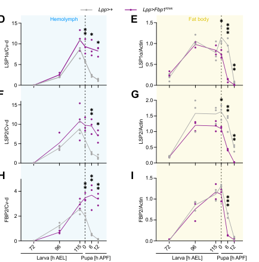

## Question

# Gene Research for Functional Annotation

## ⚠️ CRITICAL: Gene/Protein Identification Context

**BEFORE YOU BEGIN RESEARCH:** You MUST verify you are researching the CORRECT gene/protein. Gene symbols can be ambiguous, especially for less well-characterized genes from non-model organisms.

### Target Gene/Protein Identity (from UniProt):
- **UniProt Accession:** P11995
- **Protein Description:** RecName: Full=Larval serum protein 1 alpha chain; AltName: Full=Hexamerin-1-alpha; Flags: Precursor;
- **Gene Information:** Name=Lsp1alpha; Synonyms=LSP1-a; ORFNames=CG2559;
- **Organism (full):** Drosophila melanogaster (Fruit fly).
- **Protein Family:** Belongs to the hemocyanin family. .
- **Key Domains:** Di-copper_centre_dom_sf. (IPR008922); Hemocyanin/hexamerin. (IPR013788); Hemocyanin/hexamerin_mid_dom. (IPR000896); Hemocyanin_C. (IPR005203); Hemocyanin_C_sf. (IPR037020)

### MANDATORY VERIFICATION STEPS:

1. **Check if the gene symbol "Lsp1alpha" matches the protein description above**
2. **Verify the organism is correct:** Drosophila melanogaster (Fruit fly).
3. **Check if protein family/domains align with what you find in literature**
4. **If you find literature for a DIFFERENT gene with the same or similar symbol, STOP**

### If Gene Symbol is Ambiguous or You Cannot Find Relevant Literature:

**DO NOT PROCEED WITH RESEARCH ON A DIFFERENT GENE.** Instead:
- State clearly: "The gene symbol 'Lsp1alpha' is ambiguous or literature is limited for this specific protein"
- Explain what you found (e.g., "Found extensive literature on a different gene with the same symbol in a different organism")
- Describe the protein based ONLY on the UniProt information provided above
- Suggest that the protein function can be inferred from domain/family information

### Research Target:

Please provide a comprehensive research report on the gene **Lsp1alpha** (gene ID: Lsp1alpha, UniProt: P11995) in DROME.

The research report should be a detailed narrative explaining the function, biological processes, and localization of the gene product. Citations should be given for all claims.

You should prioritize authoritative reviews and primary scientific literature when conducting research. You can supplement
this with annotations you find in gene/protein databases, but these can be outdated or inaccurate.

We are specifically interested in the primary function of the gene - for enzymes, what reaction is catalyzed, and what is the substrate specificity? For transporters, what is the substrate? For structural proteins or adapters, what is the broader structural role? For signaling molecules, what is the role in the pathway.

We are interested in where in or outside the cell the gene product carries out its function.

We are also interested in the signaling or biochemical pathways in which the gene functions. We are less interested in broad pleiotropic effects, except where these elucidate the precise role.

Include evidence where possible. We are interested in both experimental evidence as well as inference from structure, evolution, or bioinformatic analysis. Precise studies should be prioritized over high-throughput, where available.

## Output

Question: You are an expert researcher providing comprehensive, well-cited information.

Provide detailed information focusing on:
1. Key concepts and definitions with current understanding
2. Recent developments and latest research (prioritize 2023-2024 sources)
3. Current applications and real-world implementations
4. Expert opinions and analysis from authoritative sources
5. Relevant statistics and data from recent studies

Format as a comprehensive research report with proper citations. Include URLs and publication dates where available.
Always prioritize recent, authoritative sources and provide specific citations for all major claims.

# Gene Research for Functional Annotation

## ⚠️ CRITICAL: Gene/Protein Identification Context

**BEFORE YOU BEGIN RESEARCH:** You MUST verify you are researching the CORRECT gene/protein. Gene symbols can be ambiguous, especially for less well-characterized genes from non-model organisms.

### Target Gene/Protein Identity (from UniProt):
- **UniProt Accession:** P11995
- **Protein Description:** RecName: Full=Larval serum protein 1 alpha chain; AltName: Full=Hexamerin-1-alpha; Flags: Precursor;
- **Gene Information:** Name=Lsp1alpha; Synonyms=LSP1-a; ORFNames=CG2559;
- **Organism (full):** Drosophila melanogaster (Fruit fly).
- **Protein Family:** Belongs to the hemocyanin family. .
- **Key Domains:** Di-copper_centre_dom_sf. (IPR008922); Hemocyanin/hexamerin. (IPR013788); Hemocyanin/hexamerin_mid_dom. (IPR000896); Hemocyanin_C. (IPR005203); Hemocyanin_C_sf. (IPR037020)

### MANDATORY VERIFICATION STEPS:

1. **Check if the gene symbol "Lsp1alpha" matches the protein description above**
2. **Verify the organism is correct:** Drosophila melanogaster (Fruit fly).
3. **Check if protein family/domains align with what you find in literature**
4. **If you find literature for a DIFFERENT gene with the same or similar symbol, STOP**

### If Gene Symbol is Ambiguous or You Cannot Find Relevant Literature:

**DO NOT PROCEED WITH RESEARCH ON A DIFFERENT GENE.** Instead:
- State clearly: "The gene symbol 'Lsp1alpha' is ambiguous or literature is limited for this specific protein"
- Explain what you found (e.g., "Found extensive literature on a different gene with the same symbol in a different organism")
- Describe the protein based ONLY on the UniProt information provided above
- Suggest that the protein function can be inferred from domain/family information

### Research Target:

Please provide a comprehensive research report on the gene **Lsp1alpha** (gene ID: Lsp1alpha, UniProt: P11995) in DROME.

The research report should be a detailed narrative explaining the function, biological processes, and localization of the gene product. Citations should be given for all claims.

You should prioritize authoritative reviews and primary scientific literature when conducting research. You can supplement
this with annotations you find in gene/protein databases, but these can be outdated or inaccurate.

We are specifically interested in the primary function of the gene - for enzymes, what reaction is catalyzed, and what is the substrate specificity? For transporters, what is the substrate? For structural proteins or adapters, what is the broader structural role? For signaling molecules, what is the role in the pathway.

We are interested in where in or outside the cell the gene product carries out its function.

We are also interested in the signaling or biochemical pathways in which the gene functions. We are less interested in broad pleiotropic effects, except where these elucidate the precise role.

Include evidence where possible. We are interested in both experimental evidence as well as inference from structure, evolution, or bioinformatic analysis. Precise studies should be prioritized over high-throughput, where available.

# Functional annotation report: *Drosophila melanogaster* Lsp1alpha

## Identity and principal function

**Identity verified.** The supplied UniProt record [P11995](https://www.uniprot.org/uniprotkb/P11995/entry) identifies **Lsp1alpha** (also LSP1-a; **CG2559**) as the precursor of larval serum protein 1 alpha chain in *Drosophila melanogaster*. Independent fly studies identify LSP1α as the X-linked alpha component of larval serum protein 1 (LSP1), distinct from its beta and gamma components; one sequence-based study identifies alpha as NP_511138 and gamma as NP_523868. This report concerns the fly protein, not a similarly named protein in another organism. (weake2007thenondosagecompensated pages 1-2, weake2007thenondosagecompensated pages 8-9)

**Primary functional annotation:** LSP1α is a secreted **hexamerin storage-protein subunit**. Its established role is to contribute protein-bound amino acids to a large circulating larval reserve that is retrieved into the fat body around pupariation and supports development during the non-feeding pupal period. It is **not characterized as an enzyme or a substrate transporter**: there is no established reaction, catalytic substrate specificity, or transported small-molecule substrate to assign to P11995. Its functional “cargo” is primarily the amino acids contained within the protein itself. (valzania2023atemporalallocation pages 1-4, valzania2023atemporalallocation pages 4-6, valzania2023atemporalallocation pages 6-9)

The supplied UniProt/InterPro annotations place P11995 in the hemocyanin family and identify hemocyanin/hexamerin and hemocyanin-C-related domains. That assignment is consistent with the insect storage-hexamerin literature and LSP1’s assembly from related alpha, beta, and gamma polypeptides. **Structural similarity to hemocyanins does not demonstrate copper-dependent oxygen transport or phenoloxidase activity in LSP1α**; neither activity was established in the LSP1α experiments reviewed here. Studies of another insect arylphorin illustrate the distinction: a hemocyanin-related storage protein can lack copper. Exact subunit stoichiometries within circulating LSP1α-containing complexes remain unresolved. (valzania2023atemporalallocation pages 1-4, addisonUnknownyearlarvalserumprotein pages 23-30, markl2004quaternaryandsubunit pages 13-14)

The following table separates direct findings about alpha from conclusions that apply to the larger storage-protein system.

| Claim | Direct alpha-specific evidence | Family-level or uncertain | Citations |
|---|---|---|---|
| **Identity** | The target is *Drosophila melanogaster* **Lsp1alpha**, the X-linked alpha subunit of larval serum protein 1. It is highly expressed in third-instar larval fat body and is distinct from Lsp1beta and Lsp1gamma. | The supplied UniProt record provides the exact mapping **P11995 = CG2559 = Lsp1alpha**. The cited literature independently verifies the fly gene and protein identity but does not itself state P11995. | (weake2007thenondosagecompensated pages 1-2, weake2007thenondosagecompensated pages 2-3) |
| **Hemocyanin-family structure; no established enzyme or oxygen-carrier activity** | The supplied UniProt and InterPro annotations assign P11995 hemocyanin and hexamerin domains; experiments characterize LSP1alpha as a circulating storage hexamerin. | A hemocyanin-related fold establishes structural and evolutionary affiliation, not copper binding, oxygen transport, or phenoloxidase activity. No such activity has been demonstrated for LSP1alpha, so no catalytic reaction or small-molecule substrate should be assigned. | (valzania2023atemporalallocation pages 1-4, valzania2023atemporalallocation pages 6-9) |
| **Fat-body production and hemolymph secretion** | Fat-body-specific RNAi suppresses *Lsp1alpha* expression, and LSP1alpha-specific immunoblots detect the protein in late-larval hemolymph. Experimentally muscle-expressed LSP1alpha-HA is secreted into hemolymph and enters native-size circulating complexes. | The fat body is the supported physiological source; muscle expression was an experimental tracing strategy rather than a native source. The exact LSP1alpha stoichiometry in heterogeneous circulating complexes remains unresolved. | (valzania2023atemporalallocation pages 1-4, valzania2023atemporalallocation pages 4-6, valzania2023atemporalallocation pages 20-22) |
| **FBP1-dependent reuptake at the larval-pupal transition** | Circulating LSP1alpha declines as fat-body LSP1alpha rises at the transition. *Fbp1* RNAi retains LSP1alpha in hemolymph, reduces its fat-body accumulation, and blocks entry of independently produced LSP1alpha-HA into fat-body cells. | FBP1 is required for uptake but lacks a transmembrane domain and is itself secreted; it is therefore not an established membrane endocytic receptor. An unidentified fat-cell surface receptor may internalize FBP1-containing complexes. | (valzania2023atemporalallocation pages 4-6, valzania2023atemporalallocation pages 6-9, valzania2023atemporalallocation media 49fc2bfb, valzania2023atemporalallocation pages 20-22) |
| **Nutrient, TOR, and ecdysone-stage regulation** | Low dietary amino acids or fat-body TORC1 suppression strongly reduces *Lsp1alpha* and other storage-protein transcripts. *Lsp1alpha* production peaks near the end of feeding, whereas ecdysone-induced *Fbp1* expression times subsequent LSP1alpha uptake. | Nutrient and TOR control applies to the broader storage-protein program, not uniquely to LSP1alpha. Ecdysone chiefly controls uptake timing through *Fbp1* rather than directly inducing *Lsp1alpha* transcription. | (valzania2023atemporalallocation pages 1-4, valzania2023atemporalallocation pages 6-9) |
| **Storage function and developmental fitness** | LSP1alpha enters the circulating and subsequently retrieved storage-protein pool, supporting a role as a reservoir of protein-bound amino acids for non-feeding pupal development. | Strong effects on mass, eclosion, fertility, locomotion, starvation resistance, lifespan, and allometry were measured mainly after **combined fat-body Lsp1alpha plus Lsp2 RNAi** or *Fbp1* RNAi. These phenotypes cannot be attributed to LSP1alpha alone because LSP paralogs are co-regulated and compensatory. | (valzania2023atemporalallocation pages 1-4, valzania2023atemporalallocation pages 4-6, valzania2023atemporalallocation pages 6-9, valzania2023atemporalallocation pages 20-22) |
| **Muscle attachment is gamma-specific evidence** | The cited muscle-attachment study provides no direct evidence for LSP1alpha. | RNAi-induced muscle detachment and localization at tendon and muscle-attachment sites were demonstrated for **Lsp1gamma**, not Lsp1alpha. These findings must not be transferred to P11995 without alpha-specific testing. | (green2016acommonsuite pages 8-10) |

*Table: Evidence-grade separation of direct LSP1alpha findings from family-level inference, combined-genotype phenotypes, and Lsp1gamma-specific results. This prevents unsupported assignment of enzymatic, oxygen-transport, receptor, or muscle-attachment functions to P11995.*

## Site of action and developmental pathway

**Production and extracellular residence.** Lsp1alpha transcript is abundant in third-instar larval fat body. In the recent study by Valzania and colleagues, fat-body-directed knockdown suppressed *Lsp1alpha* expression, and an LSP1α-specific antibody detected the protein in late-larval hemolymph. Thus, its principal physiological site of synthesis is the **fat body**, whereas an important site where the secreted protein resides and serves as a reserve is the **extracellular hemolymph**. The authors also detected experimentally expressed, HA-tagged LSP1α in hemolymph after producing it in muscle; that muscle expression was a trafficking experiment, **not evidence that muscle is its normal source**. Historical radiolabeling of excised fat body and larval-serum-protein measurements support the same production-and-secretion model for LSP1 as a complex. (weake2007thenondosagecompensated pages 1-2, valzania2023atemporalallocation pages 1-4, valzania2023atemporalallocation pages 4-6, addisonUnknownyearlarvalserumprotein pages 30-36)

**Timing and regulation.** The pathway can be summarized as **larval feeding and amino-acid availability → fat-body TORC1-dependent *Lsp* expression → circulating storage-protein complexes → ecdysone-timed FBP1 expression → fat-body reuptake at the larval–pupal transition → reserve available during non-feeding development**. In the Valzania study, lowering dietary amino acids in early third instar, or suppressing fat-body TORC1 with TSC1/TSC2, markedly reduced *Lsp1alpha* and other *Lsp/Fbp* transcripts. *Lsp1alpha* expression peaks near the end of larval feeding. In contrast, experimental suppression of the developmental ecdysone rise impaired the peak in *Fbp1* expression without similarly suppressing *Lsp* expression: the evidence therefore places ecdysone chiefly at the **timing-of-reuptake step**, not as a demonstrated direct inducer of *Lsp1alpha* transcription. These gene-expression measurements used three biological replicates per time point. (valzania2023atemporalallocation pages 1-4, valzania2023atemporalallocation pages 18-20)

**Reuptake, not simply intracellular synthesis.** Around the larval–pupal transition, LSP1α falls in hemolymph while increasing in fat-body extracts. Fat-body *Fbp1* RNAi instead retains LSP1α in circulation and reduces its accumulation in fat body. Particularly informative, investigators made **LSP1α–HA outside the fat body**, in muscle, and then traced its appearance in fat-body cells: uptake occurred at the transition but was blocked by fat-body *Fbp1* RNAi. This distinguishes retrieval of circulating alpha protein from merely detecting protein synthesized locally. The immunoblot time courses were quantified from three replicates per time point. (valzania2023atemporalallocation pages 4-6, valzania2023atemporalallocation media 49fc2bfb, valzania2023atemporalallocation pages 20-22)

**Mechanistic qualification.** FBP1 is *required* for efficient LSP1α retrieval, but calling it a proven transmembrane “LSP receptor” overstates the evidence. The study found processed FBP1 circulating in hemolymph and noted that it lacks an apparent transmembrane domain; authors proposed that an **as-yet-unidentified fat-body surface receptor** may internalize FBP1-associated complexes. Native gels support associations among circulating LSPs and FBPs but do not definitively establish every binding contact or the exact composition of every complex. The downstream cellular degradation steps that liberate LSP1α-derived amino acids were not resolved specifically for alpha in these experiments. (valzania2023atemporalallocation pages 1-4, valzania2023atemporalallocation pages 4-6, valzania2023atemporalallocation pages 6-9)

## Biological significance and quantitative evidence

The scale of storage is substantial, but published percentages describe **the combined hexamerin pool, not LSP1α alone**. Valzania and colleagues state that circulating hexamerins account for **more than 10% of total late-larval protein mass**, and summarize older estimates that larval serum proteins can comprise **up to 90% of circulating hemolymph protein**; these figures use different denominators and should not be interpreted as LSP1α-specific concentrations. (valzania2023atemporalallocation pages 1-4, valzania2023atemporalallocation pages 6-9)

Perturbing storage-protein supply has a developmental trade-off. The study’s main fitness comparison used **combined fat-body *Lsp1alpha* plus *Lsp2* RNAi**, termed “pan-Lsp” silencing, or separately used *Fbp1* RNAi to block retrieval. The combined *Lsp1alpha/Lsp2* knockdown increased larval dry mass by approximately **22%**, but adult dry mass by only **6%**; *Fbp1* knockdown reduced adult dry mass by approximately **10%**. Both principal interventions produced partial pupal lethality and an **eclosion delay exceeding 30 hours among survivors**, together with impaired adult fitness measures. The authors interpret this as a trade-off between spending amino-acid resources to build larval stores and making those stores available for later pupal structures. **None of those mass, delay, or fitness estimates demonstrates an effect of *Lsp1alpha* loss alone.** (valzania2023atemporalallocation pages 4-6, valzania2023atemporalallocation pages 6-9, valzania2023atemporalallocation pages 20-22)

Alpha-specific phenotype assignment is especially difficult because silencing any one of the three *Lsp1* genes reduced expression of other *Lsp1* genes in the same study, whereas *Lsp2* knockdown increased *Lsp1* expression. Earlier genetics also described viable flies carrying mutations affecting all *Lsp1* genes. Thus, storage function and retrieval of LSP1α are directly supported, but its **indispensability and quantitative individual contribution** under normal or nutritionally stressful conditions remain less certain than the pool-level developmental effects. (valzania2023atemporalallocation pages 1-4, weake2007thenondosagecompensated pages 2-3)

## Recent research, applications, and boundaries of the annotation

The main mechanistic advance appeared as a **December 2023 preprint** and was subsequently published as Valzania, Alami and Léopold, “A temporal allocation of amino acid resources ensures fitness and body allometry in *Drosophila*,” *Developmental Cell* **59**, 2277–2286.e6 (**2024**), [https://doi.org/10.1016/j.devcel.2024.05.018](https://doi.org/10.1016/j.devcel.2024.05.018); the accessible experimental text and Figure 2 examined here are from its [2023 preprint](https://doi.org/10.1101/2023.12.08.570599). This work provides a practical experimental framework—alpha-specific immunoblotting, fat-body RNAi, native gels, and tissue-of-origin tracing of LSP1α–HA—for studying extracellular nutrient storage and developmental resource allocation. (valzania2023atemporalallocation pages 1-4, valzania2023atemporalallocation pages 4-6, valzania2023atemporalallocation pages 9-13, valzania2023atemporalallocation media 49fc2bfb)

A **September 2024 preprint** by Yoshida, Kashio and Miura used fat-body Golgi-proximity labeling and larval-hemolymph proteomics to study the secretory pathway during disc regeneration. It described LSP1 proteins among familiar fat-body-secreted hemolymph proteins, but its functional regeneration tests concerned other factors; **it does not establish an LSP1α-specific regeneration function**. [https://doi.org/10.1101/2024.09.02.609068](https://doi.org/10.1101/2024.09.02.609068). (yoshida2024secretomeanalysisby pages 3-6, yoshida2024secretomeanalysisby pages 6-8)

A separate **2016** study implicated **LSP1γ**, not LSP1α, in tendon-associated muscle attachment: the gamma-directed knockdown caused muscle detachment and tagged gamma localized near tendon cells. That result must **not** be transferred to P11995 as an established structural or coagulation function. Likewise, the 2007 finding that X-linked *Lsp1alpha* escapes normal male dosage compensation—female:male transcript ratio **1.81 ± 0.14** in third-instar larvae—is informative gene regulation, not evidence of a second biochemical activity. [Green *et al.*, *Genetics*, November 2016, https://doi.org/10.1534/genetics.116.189787](https://doi.org/10.1534/genetics.116.189787); [Weake and Scott, *BMC Molecular Biology*, 19 May 2007, https://doi.org/10.1186/1471-2199-8-35](https://doi.org/10.1186/1471-2199-8-35). (green2016acommonsuite pages 8-10, green2016acommonsuite pages 10-11, weake2007thenondosagecompensated pages 2-3)

**Conclusion.** The most defensible annotation for *D. melanogaster* P11995 is **fat-body-produced, hemolymph-secreted LSP1α, a hemocyanin-related hexamerin subunit that participates in reversible developmental storage of protein-bound amino acids**. Direct alpha-specific tracing establishes its FBP1-dependent return to the fat body at the larval–pupal transition. The membrane uptake receptor, precise complex stoichiometry, alpha-specific post-uptake catabolism, and any non-storage biochemical role remain unresolved. (valzania2023atemporalallocation pages 1-4, valzania2023atemporalallocation pages 4-6, valzania2023atemporalallocation pages 6-9, valzania2023atemporalallocation media 49fc2bfb)

References

1. (weake2007thenondosagecompensated pages 1-2): Vikki M. Weake and Maxwell J Scott. The non-dosage compensated lsp1α gene of drosophila melanogaster escapes acetylation by mof in larval fat body nuclei, but is flanked by two dosage compensated genes. BMC Molecular Biology, 8:35-35, May 2007. URL: https://doi.org/10.1186/1471-2199-8-35, doi:10.1186/1471-2199-8-35. This article has 8 citations and is from a peer-reviewed journal.

2. (weake2007thenondosagecompensated pages 8-9): Vikki M. Weake and Maxwell J Scott. The non-dosage compensated lsp1α gene of drosophila melanogaster escapes acetylation by mof in larval fat body nuclei, but is flanked by two dosage compensated genes. BMC Molecular Biology, 8:35-35, May 2007. URL: https://doi.org/10.1186/1471-2199-8-35, doi:10.1186/1471-2199-8-35. This article has 8 citations and is from a peer-reviewed journal.

3. (valzania2023atemporalallocation pages 1-4): Luca Valzania, Aya Alami, and Pierre Léopold. A temporal allocation of amino acid resources ensures fitness and body allometry. bioRxiv, Dec 2023. URL: https://doi.org/10.1101/2023.12.08.570599, doi:10.1101/2023.12.08.570599. This article has 0 citations.

4. (valzania2023atemporalallocation pages 4-6): Luca Valzania, Aya Alami, and Pierre Léopold. A temporal allocation of amino acid resources ensures fitness and body allometry. bioRxiv, Dec 2023. URL: https://doi.org/10.1101/2023.12.08.570599, doi:10.1101/2023.12.08.570599. This article has 0 citations.

5. (valzania2023atemporalallocation pages 6-9): Luca Valzania, Aya Alami, and Pierre Léopold. A temporal allocation of amino acid resources ensures fitness and body allometry. bioRxiv, Dec 2023. URL: https://doi.org/10.1101/2023.12.08.570599, doi:10.1101/2023.12.08.570599. This article has 0 citations.

6. (addisonUnknownyearlarvalserumprotein pages 23-30): C Addison. Larval serum protein genes of drosophila. Unknown journal, Unknown year.

7. (markl2004quaternaryandsubunit pages 13-14): J�rgen Markl, Thorsten Burmester, Heinz Decker, Anette Savel-Niemann, J. Robin Harris, Michaela S�ling, Ulrike Naumann, and Klaus Scheller. Quaternary and subunit structure of calliphora arylphorin as deduced from electron microscopy, electrophoresis, and sequence similarities with arthropod hemocyanin. Journal of Comparative Physiology B, 162:665-680, Dec 2004. URL: https://doi.org/10.1007/bf00301616, doi:10.1007/bf00301616. This article has 56 citations.

8. (weake2007thenondosagecompensated pages 2-3): Vikki M. Weake and Maxwell J Scott. The non-dosage compensated lsp1α gene of drosophila melanogaster escapes acetylation by mof in larval fat body nuclei, but is flanked by two dosage compensated genes. BMC Molecular Biology, 8:35-35, May 2007. URL: https://doi.org/10.1186/1471-2199-8-35, doi:10.1186/1471-2199-8-35. This article has 8 citations and is from a peer-reviewed journal.

9. (valzania2023atemporalallocation pages 20-22): Luca Valzania, Aya Alami, and Pierre Léopold. A temporal allocation of amino acid resources ensures fitness and body allometry. bioRxiv, Dec 2023. URL: https://doi.org/10.1101/2023.12.08.570599, doi:10.1101/2023.12.08.570599. This article has 0 citations.

10. (valzania2023atemporalallocation media 49fc2bfb): Luca Valzania, Aya Alami, and Pierre Léopold. A temporal allocation of amino acid resources ensures fitness and body allometry. bioRxiv, Dec 2023. URL: https://doi.org/10.1101/2023.12.08.570599, doi:10.1101/2023.12.08.570599. This article has 0 citations.

11. (green2016acommonsuite pages 8-10): Nicole Green, Nadia Odell, Molly Zych, Cheryl Clark, Zong-Heng Wang, Bridget Biersmith, Clara Bajzek, Kevin R Cook, Mitchell S Dushay, and Erika R Geisbrecht. A common suite of coagulation proteins function in<i>drosophila</i>muscle attachment. Genetics, 204:1075-1087, Nov 2016. URL: https://doi.org/10.1534/genetics.116.189787, doi:10.1534/genetics.116.189787. This article has 26 citations and is from a domain leading peer-reviewed journal.

12. (addisonUnknownyearlarvalserumprotein pages 30-36): C Addison. Larval serum protein genes of drosophila. Unknown journal, Unknown year.

13. (valzania2023atemporalallocation pages 18-20): Luca Valzania, Aya Alami, and Pierre Léopold. A temporal allocation of amino acid resources ensures fitness and body allometry. bioRxiv, Dec 2023. URL: https://doi.org/10.1101/2023.12.08.570599, doi:10.1101/2023.12.08.570599. This article has 0 citations.

14. (valzania2023atemporalallocation pages 9-13): Luca Valzania, Aya Alami, and Pierre Léopold. A temporal allocation of amino acid resources ensures fitness and body allometry. bioRxiv, Dec 2023. URL: https://doi.org/10.1101/2023.12.08.570599, doi:10.1101/2023.12.08.570599. This article has 0 citations.

15. (yoshida2024secretomeanalysisby pages 3-6): Yutaka Yoshida, Soshiro Kashio, and Masayuki Miura. Secretome analysis by proximal labeling in golgi apparatus for identifying fat body derived humoral factors in drosophila disc regeneration. bioRxiv, Sep 2024. URL: https://doi.org/10.1101/2024.09.02.609068, doi:10.1101/2024.09.02.609068. This article has 2 citations.

16. (yoshida2024secretomeanalysisby pages 6-8): Yutaka Yoshida, Soshiro Kashio, and Masayuki Miura. Secretome analysis by proximal labeling in golgi apparatus for identifying fat body derived humoral factors in drosophila disc regeneration. bioRxiv, Sep 2024. URL: https://doi.org/10.1101/2024.09.02.609068, doi:10.1101/2024.09.02.609068. This article has 2 citations.

17. (green2016acommonsuite pages 10-11): Nicole Green, Nadia Odell, Molly Zych, Cheryl Clark, Zong-Heng Wang, Bridget Biersmith, Clara Bajzek, Kevin R Cook, Mitchell S Dushay, and Erika R Geisbrecht. A common suite of coagulation proteins function in<i>drosophila</i>muscle attachment. Genetics, 204:1075-1087, Nov 2016. URL: https://doi.org/10.1534/genetics.116.189787, doi:10.1534/genetics.116.189787. This article has 26 citations and is from a domain leading peer-reviewed journal.

## Artifacts

- [Edison artifact artifact-00](Lsp1alpha-deep-research-falcon_artifacts/artifact-00.md)

## Citations

1. green2016acommonsuite pages 8-10
2. weake2007thenondosagecompensated pages 1-2
3. weake2007thenondosagecompensated pages 8-9
4. valzania2023atemporalallocation pages 1-4
5. valzania2023atemporalallocation pages 4-6
6. valzania2023atemporalallocation pages 6-9
7. markl2004quaternaryandsubunit pages 13-14
8. weake2007thenondosagecompensated pages 2-3
9. valzania2023atemporalallocation pages 20-22
10. valzania2023atemporalallocation pages 18-20
11. valzania2023atemporalallocation pages 9-13
12. yoshida2024secretomeanalysisby pages 3-6
13. yoshida2024secretomeanalysisby pages 6-8
14. green2016acommonsuite pages 10-11
15. P11995
16. https://doi.org/10.1016/j.devcel.2024.05.018
17. 2023 preprint
18. https://doi.org/10.1101/2024.09.02.609068
19. Green *et al.*, *Genetics*, November 2016, https://doi.org/10.1534/genetics.116.189787
20. Weake and Scott, *BMC Molecular Biology*, 19 May 2007, https://doi.org/10.1186/1471-2199-8-35
21. https://www.uniprot.org/uniprotkb/P11995/entry
22. https://doi.org/10.1016/j.devcel.2024.05.018](https://doi.org/10.1016/j.devcel.2024.05.018
23. https://doi.org/10.1101/2023.12.08.570599
24. https://doi.org/10.1101/2024.09.02.609068](https://doi.org/10.1101/2024.09.02.609068
25. https://doi.org/10.1534/genetics.116.189787](https://doi.org/10.1534/genetics.116.189787
26. https://doi.org/10.1186/1471-2199-8-35](https://doi.org/10.1186/1471-2199-8-35
27. https://doi.org/10.1186/1471-2199-8-35,
28. https://doi.org/10.1101/2023.12.08.570599,
29. https://doi.org/10.1007/bf00301616,
30. https://doi.org/10.1534/genetics.116.189787,
31. https://doi.org/10.1101/2024.09.02.609068,