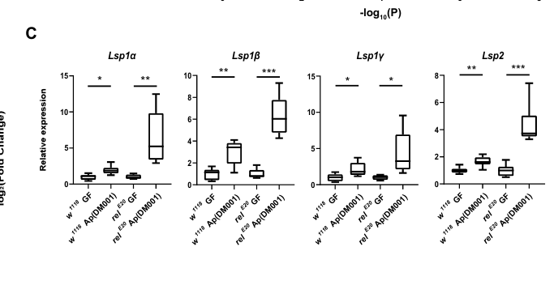

## Question

# Gene Research for Functional Annotation

## ⚠️ CRITICAL: Gene/Protein Identification Context

**BEFORE YOU BEGIN RESEARCH:** You MUST verify you are researching the CORRECT gene/protein. Gene symbols can be ambiguous, especially for less well-characterized genes from non-model organisms.

### Target Gene/Protein Identity (from UniProt):
- **UniProt Accession:** P11996
- **Protein Description:** RecName: Full=Larval serum protein 1 beta chain; AltName: Full=Hexamerin-1-beta; Flags: Precursor;
- **Gene Information:** Name=Lsp1beta; Synonyms=Lsp1-b; ORFNames=CG4178;
- **Organism (full):** Drosophila melanogaster (Fruit fly).
- **Protein Family:** Belongs to the hemocyanin family. .
- **Key Domains:** Di-copper_centre_dom_sf. (IPR008922); Hemocyanin/hexamerin. (IPR013788); Hemocyanin/hexamerin_mid_dom. (IPR000896); Hemocyanin_C. (IPR005203); Hemocyanin_C_sf. (IPR037020)

### MANDATORY VERIFICATION STEPS:

1. **Check if the gene symbol "Lsp1beta" matches the protein description above**
2. **Verify the organism is correct:** Drosophila melanogaster (Fruit fly).
3. **Check if protein family/domains align with what you find in literature**
4. **If you find literature for a DIFFERENT gene with the same or similar symbol, STOP**

### If Gene Symbol is Ambiguous or You Cannot Find Relevant Literature:

**DO NOT PROCEED WITH RESEARCH ON A DIFFERENT GENE.** Instead:
- State clearly: "The gene symbol 'Lsp1beta' is ambiguous or literature is limited for this specific protein"
- Explain what you found (e.g., "Found extensive literature on a different gene with the same symbol in a different organism")
- Describe the protein based ONLY on the UniProt information provided above
- Suggest that the protein function can be inferred from domain/family information

### Research Target:

Please provide a comprehensive research report on the gene **Lsp1beta** (gene ID: Lsp1beta, UniProt: P11996) in DROME.

The research report should be a detailed narrative explaining the function, biological processes, and localization of the gene product. Citations should be given for all claims.

You should prioritize authoritative reviews and primary scientific literature when conducting research. You can supplement
this with annotations you find in gene/protein databases, but these can be outdated or inaccurate.

We are specifically interested in the primary function of the gene - for enzymes, what reaction is catalyzed, and what is the substrate specificity? For transporters, what is the substrate? For structural proteins or adapters, what is the broader structural role? For signaling molecules, what is the role in the pathway.

We are interested in where in or outside the cell the gene product carries out its function.

We are also interested in the signaling or biochemical pathways in which the gene functions. We are less interested in broad pleiotropic effects, except where these elucidate the precise role.

Include evidence where possible. We are interested in both experimental evidence as well as inference from structure, evolution, or bioinformatic analysis. Precise studies should be prioritized over high-throughput, where available.

## Output

Question: You are an expert researcher providing comprehensive, well-cited information.

Provide detailed information focusing on:
1. Key concepts and definitions with current understanding
2. Recent developments and latest research (prioritize 2023-2024 sources)
3. Current applications and real-world implementations
4. Expert opinions and analysis from authoritative sources
5. Relevant statistics and data from recent studies

Format as a comprehensive research report with proper citations. Include URLs and publication dates where available.
Always prioritize recent, authoritative sources and provide specific citations for all major claims.

# Gene Research for Functional Annotation

## ⚠️ CRITICAL: Gene/Protein Identification Context

**BEFORE YOU BEGIN RESEARCH:** You MUST verify you are researching the CORRECT gene/protein. Gene symbols can be ambiguous, especially for less well-characterized genes from non-model organisms.

### Target Gene/Protein Identity (from UniProt):
- **UniProt Accession:** P11996
- **Protein Description:** RecName: Full=Larval serum protein 1 beta chain; AltName: Full=Hexamerin-1-beta; Flags: Precursor;
- **Gene Information:** Name=Lsp1beta; Synonyms=Lsp1-b; ORFNames=CG4178;
- **Organism (full):** Drosophila melanogaster (Fruit fly).
- **Protein Family:** Belongs to the hemocyanin family. .
- **Key Domains:** Di-copper_centre_dom_sf. (IPR008922); Hemocyanin/hexamerin. (IPR013788); Hemocyanin/hexamerin_mid_dom. (IPR000896); Hemocyanin_C. (IPR005203); Hemocyanin_C_sf. (IPR037020)

### MANDATORY VERIFICATION STEPS:

1. **Check if the gene symbol "Lsp1beta" matches the protein description above**
2. **Verify the organism is correct:** Drosophila melanogaster (Fruit fly).
3. **Check if protein family/domains align with what you find in literature**
4. **If you find literature for a DIFFERENT gene with the same or similar symbol, STOP**

### If Gene Symbol is Ambiguous or You Cannot Find Relevant Literature:

**DO NOT PROCEED WITH RESEARCH ON A DIFFERENT GENE.** Instead:
- State clearly: "The gene symbol 'Lsp1beta' is ambiguous or literature is limited for this specific protein"
- Explain what you found (e.g., "Found extensive literature on a different gene with the same symbol in a different organism")
- Describe the protein based ONLY on the UniProt information provided above
- Suggest that the protein function can be inferred from domain/family information

### Research Target:

Please provide a comprehensive research report on the gene **Lsp1beta** (gene ID: Lsp1beta, UniProt: P11996) in DROME.

The research report should be a detailed narrative explaining the function, biological processes, and localization of the gene product. Citations should be given for all claims.

You should prioritize authoritative reviews and primary scientific literature when conducting research. You can supplement
this with annotations you find in gene/protein databases, but these can be outdated or inaccurate.

We are specifically interested in the primary function of the gene - for enzymes, what reaction is catalyzed, and what is the substrate specificity? For transporters, what is the substrate? For structural proteins or adapters, what is the broader structural role? For signaling molecules, what is the role in the pathway.

We are interested in where in or outside the cell the gene product carries out its function.

We are also interested in the signaling or biochemical pathways in which the gene functions. We are less interested in broad pleiotropic effects, except where these elucidate the precise role.

Include evidence where possible. We are interested in both experimental evidence as well as inference from structure, evolution, or bioinformatic analysis. Precise studies should be prioritized over high-throughput, where available.

# Functional annotation report: *Drosophila melanogaster* Lsp1beta

## Identity and principal function

**Lsp1beta** (also written *Lsp1b* or *Lsp1β*; gene designation CG4178 in the supplied UniProt record) encodes the **larval serum protein 1 β-chain, LSP1β**. The identity is independently corroborated by a *D. melanogaster* proteomic study that identifies LSP1β as **UniProt P11996**, separately from LSP1γ (P11997) and LSP2 (Q24388). Another larval-hemolymph study explicitly classifies Lsp1b as a **hexamerin**. The specified hemocyanin/hexamerin and hemocyanin-C domains are therefore consistent with the literature; their individual InterPro identifiers were supplied in the question rather than independently established by the retrieved experiments. (farkas2014apocrinesecretionin pages 15-16, handke2013thehemolymphproteome pages 7-8)

**The best-supported primary function is extracellular amino-acid storage.** LSP1β is a proteinaceous reserve within circulating larval serum protein complexes: the animal accumulates these complexes while feeding and draws on storage proteins during the nonfeeding wandering and pupal stages. It is **not annotated here as an enzyme, membrane transporter, or signaling receptor**; there is no established catalytic reaction or small-molecule transport substrate for P11996. Its stored resource is the amino acids making up the protein itself, rather than a demonstrated ligand carried by its β-chain. Hexamerins are evolutionarily related to oxygen-carrying hemocyanins, but oxygen transport or copper binding should **not** be inferred for LSP1β merely from a hemocyanin-like domain: loss of these activities is characteristic of characterized insect storage hexamerins, whereas a direct P11996 metal-binding assay was not identified. (handke2013thehemolymphproteome pages 5-7, valzania2023atemporalallocation pages 1-4, martins2010thefourhexamerin pages 1-2, addisonUnknownyearlarvalserumprotein pages 30-36)

## Molecular organization and site of action

LSP1 is a **multisubunit storage-protein assembly**, with distinct α-, β-, and γ-chain genes. Historical Drosophila biochemical and genetic evidence describes association of related LSP1 chains into heterohexamers, apparently with variable subunit combinations; it does not establish an obligatory α:β:γ ratio or show that the β-chain alone is indispensable for assembly. Thus the broader structural role of LSP1β is as a **constituent of a soluble reserve complex**, not as a load-bearing tissue component. Native-gel experiments in newer work also suggest multiple circulating complexes containing LSP and fat-body proteins, without determining a β-specific complex composition. (addisonUnknownyearlarvalserumprotein pages 23-30, addisonUnknownyearlarvalserumprotein pages 30-36, valzania2023atemporalallocation pages 1-4)

**Localization is predominantly extracellular hemolymph during the storage phase.** Proteomics directly detected Lsp1b in larval hemolymph; the late-third-instar fat body is the principal site of LSP synthesis and secretion. At the larval–pupal transition, circulating storage proteins are retrieved into fat-body cells, providing a route to stored resources during metamorphosis. Tagged **LSP1α and LSP2**, not tagged LSP1β, were directly followed from hemolymph into fat-body cells in the recent uptake experiments. Accordingly, β-chain retrieval is strongly plausible for circulating LSP1 complexes but was **not individually visualized** in those experiments. Detection of P11996 in a salivary-gland proteomic dataset is additional evidence of presence in that preparation, not proof that salivary glands are its main site of synthesis or action. (handke2013thehemolymphproteome pages 7-8, valzania2023atemporalallocation pages 1-4, valzania2023atemporalallocation pages 4-6, farkas2014apocrinesecretionin pages 15-16)

The fat body is not necessarily the *only* tissue exhibiting Lsp1beta activity. A single-cell analysis identified a **PL-Lsp cluster comprising approximately 3% of larval hemocytes**; Lsp1beta was a cluster marker, and a *Mi{MIC}Lsp1beta* reporter labeled hemocytes, predominantly in the circulating compartment. This shows a minority hemocyte-associated expression pattern, **not** that hemocytes contribute most circulating LSP1β, secrete it, or perform a demonstrated β-specific immune function. It also qualifies the newer fat-body-RNAi study’s assay-dependent conclusion that the fat body was the sole source of its measured Lsp expression. (cattenoz2020temporalspecificityand pages 6-7, cattenoz2020temporalspecificityand pages 7-9, valzania2023atemporalallocation pages 1-4)

## Nutrient-storage pathway and developmental regulation

A recent mechanistic model is **dietary amino acids → fat-body TORC1-dependent Lsp production → accumulation of circulating hexamerins → developmentally timed, FBP1-dependent retrieval into the fat body → use of stored resources during nonfeeding development**. In the accessible December 2023 study, reducing dietary amino acids or inhibiting fat-body TORC1 suppressed *Lsp* expression. *Fbp1* expression peaked somewhat later and, unlike *Lsp* expression in that experiment, depended on the ecdysone rise at the larval–pupal transition. Fat-body *Fbp1* RNAi prevented uptake of experimentally secreted LSP1α-HA and LSP2-HA and left storage proteins in the hemolymph. FBP1 itself was also found circulating; the investigators cautioned that an additional, unidentified membrane component might mediate endocytosis. **FBP1-dependent trafficking of LSP1β is a complex-level inference, not a β-specific uptake result.** (valzania2023atemporalallocation pages 1-4, valzania2023atemporalallocation pages 4-6, valzania2023atemporalallocation pages 6-9)

The same study performed fat-body-directed **Lsp1β RNAi**, but loss of any one of the α-, β-, or γ-chain transcripts also sharply reduced the other *Lsp1* transcripts. This coordinated response supports a shared production program while preventing a clean interpretation of β-RNAi as removal of **only** the β-chain. Crucially, the experiments described as **“pan-Lsp silencing” combined *Lsp1α* and *Lsp2* RNAi**, rather than specifically deleting *Lsp1beta*. Those animals had **22% greater larval dry mass**, but only **6% greater adult dry mass**; combined storage disruption also impaired pupal/adult fitness and delayed eclosion by **more than 30 hours**. These are informative demonstrations of the physiological importance of the **storage-protein pool**, **not quantitative phenotypes assignable specifically to P11996**. (valzania2023atemporalallocation pages 1-4, valzania2023atemporalallocation pages 4-6)

Older hemolymph proteomics provides an independent physiological check: Lsp1b was identified with **6,144 total peptide spectral counts** in the fed-versus-starved comparison and was markedly reduced in starved larvae. The authors emphasized that spectral counting only approximates abundance and, importantly, starvation also delayed larval development; the reduction cannot therefore be interpreted as a precisely measured direct nutrient-sensing response of LSP1β alone. (handke2013thehemolymphproteome pages 5-7, handke2013thehemolymphproteome pages 7-8)

## Recent gene-targeted evidence: gut microbiota and developmental timing

A **2023 peer-reviewed primary study** supplies the clearest targeted developmental test of *Lsp1beta*. In larval midgut, mono-association with *Acetobacter pomorum* increased *Lsp1β* expression; induction was greater when the IMD-pathway transcription factor **Relish** was defective. The reported tests of induction gave **P = 0.0026** in wild type and **P = 3.6 × 10⁻⁵** in *relE20* larvae, using six biological replicates. **Enterocyte-directed Lsp1β RNAi** increased relative pupariation time from **1.00 to 1.14** in germ-free larvae and from **1.00 to 1.62** in *A. pomorum*-associated larvae; the corresponding tests used **six independent observations of 30 larvae** each. Lsp2 RNAi produced a similar directional effect. The directly supported conclusion is that enterocyte *Lsp1beta* expression contributes to normal—and particularly bacterium-associated—larval developmental timing. The identity of the bacterial signal, the causal link from gut expression to circulating LSP1β protein, and an independent β-mutant/rescue confirmation remain unresolved; the study’s IMD–LSP mechanism is explicitly presented as a proposed model. The cited cropped Figure 8 panels document the gene-expression and pupariation comparisons. (lee2023drosophilagutimmune pages 14-15, lee2023drosophilagutimmune pages 12-14, lee2023drosophilagutimmune media d92e7457, lee2023drosophilagutimmune media ecb4528b)

**Do not transfer newer Lsp2-specific findings to Lsp1β.** A September 2026 *Nature* study linked **Lsp2** to adult mTORC1-dependent translation and lifespan, but reported that the Lsp1 genes, including *Lsp1β*, were absent or not strongly induced by the tested adult protein diets. Its translation and lifespan perturbations were of **Lsp2**, not a demonstration that adult LSP1β is a signaling molecule. (wang2026lsp2linksmtorc1 pages 2-3, wang2026lsp2linksmtorc1 pages 6-6)

The following table separates direct β-chain observations from evidence about shared storage complexes.

| Claim | Key assay and exact defensible result | Interpretation or limit |
|---|---|---|
| **Identity: D. melanogaster LSP1β is UniProt P11996** | Proteomic identification listed **LSP1 beta, P11996**, apparent mass **95.9 kDa**, separately from LSP1γ (P11997) and LSP2 (Q24388) (farkas2014apocrinesecretionin pages 15-16) | Strong accession-level confirmation; “storage/transport” and “secreted” were annotations rather than results of a catalytic assay. |
| **Lsp1β is an abundant larval hemolymph hexamerin responsive to feeding and development** | Larval-hemolymph LC–MS/MS detected Lsp1b with **6,144 total spectral counts** and classified it as a hexamerin strongly reduced after 24-hour starvation (handke2013thehemolymphproteome pages 5-7, handke2013thehemolymphproteome pages 7-8) | Direct evidence for hemolymph presence and nutritional or developmental regulation. Starvation also delayed development, and spectral counting was approximate, so direct nutrient control cannot be separated from failure to reach peak late-larval expression. |
| **Fat-body Lsp1 genes are coordinately regulated** | Fat-body-specific Lsp1β RNAi suppressed its target, but silencing **any** of Lsp1α, Lsp1β, or Lsp1γ also drastically reduced the other Lsp1 transcripts (valzania2023atemporalallocation pages 1-4) | Supports coordinated LSP1-subunit production; Lsp1β RNAi is therefore not a clean β-chain-specific loss-of-function test. |
| **Circulating hexamerins are retrieved through an FBP1-dependent process** | Fbp1 RNAi prevented fat-body entry of experimentally secreted, HA-tagged **LSP1α and LSP2** at the larval–pupal transition (valzania2023atemporalallocation pages 4-6) | Strong uptake evidence for the tested hexamerins, but LSP1β was **not tagged or directly tracked**; extension to β is a family- or complex-level inference. |
| **Gut Lsp1β promotes larval developmental rate** | Myo1A-driven enterocyte Lsp1β RNAi increased relative pupariation time from **1.00 to 1.14** in germ-free larvae and from **1.00 to 1.62** in *Acetobacter pomorum*-associated larvae; each condition used **six independent observations of 30 larvae** (lee2023drosophilagutimmune pages 14-15, lee2023drosophilagutimmune pages 12-14) | Direct gene-targeted RNAi evidence for a contribution to normal and microbiota-stimulated development. No mutant rescue was reported, and RNAi specificity remains a limitation. |
| **Lsp1β participates in an Ap–IMD-responsive gut program** | *A. pomorum* induced gut Lsp1β expression in wild type (**P = 0.0026**) and in the Relish mutant relE20 (**P = 3.6 × 10⁻⁵**); six biological replicates were analyzed (lee2023drosophilagutimmune pages 14-15) | Supports repression of bacterially induced Lsp1β expression by IMD–Relish signaling; the relevant bacterial metabolite or host intermediate remains unidentified. |
| **A small hemocyte population expresses Lsp1β** | Single-cell RNA-seq identified a circulating PL-Lsp cluster comprising approximately **3% of larval hemocytes**; a MiMIC Lsp1beta reporter was detected in circulating and resident hemocytes (cattenoz2020temporalspecificityand pages 6-7, cattenoz2020temporalspecificityand pages 7-9) | Demonstrates hemocyte-associated transcription or reporter activity, not secretion or a hemocyte-specific function. It does not establish hemocytes as the dominant systemic source. |
| **Major pan-Lsp phenotypes are not β-specific** | The storage and allometry experiments called pan-Lsp silencing used combined fat-body **Lsp1α RNAi plus Lsp2 RNAi**, not Lsp1β RNAi (valzania2023atemporalallocation pages 4-6, valzania2023atemporalallocation pages 6-9) | Effects on growth, metamorphosis, adult fitness, and allometry support a collective hexamerin-storage function but must **not** be assigned specifically to Lsp1β P11996. |

*Table: Evidence-strength summary for Drosophila melanogaster Lsp1β (P11996), separating direct β-chain findings from family-level inference and combined-Lsp phenotypes.*

## Evidence-based annotation and limitations

The defensible annotation is **“secreted larval hexamerin/LSP1 β-subunit contributing to a hemolymph amino-acid reserve for metamorphosis.”** Its principal action is in the **extracellular hemolymph**; its major developmental source is the **larval fat body**, with expression also detected in a small hemocyte population and functionally implicated in larval gut enterocytes. Nutrient-responsive TOR signaling regulates production, whereas the ecdysone-timed FBP1 pathway regulates retrieval of **tested related storage proteins**. Neither a β-specific enzymatic activity, oxygen-transport reaction, fixed hexamer stoichiometry, demonstrated hemocyte immune function, nor adult LSP1β-dependent mTORC1/lifespan mechanism is established by these sources. (valzania2023atemporalallocation pages 1-4, valzania2023atemporalallocation pages 4-6, cattenoz2020temporalspecificityand pages 6-7, cattenoz2020temporalspecificityand pages 7-9, lee2023drosophilagutimmune pages 14-15, addisonUnknownyearlarvalserumprotein pages 30-36, wang2026lsp2linksmtorc1 pages 2-3)

### Principal sources and dates

- **Lee et al., October 2023**, *Molecules and Cells*, “Drosophila Gut Immune Pathway Suppresses Host Development-Promoting Effects of Acetic Acid Bacteria”: https://doi.org/10.14348/molcells.2023.0141. Direct enterocyte *Lsp1β* RNAi and *A. pomorum*/IMD experiments. (lee2023drosophilagutimmune pages 14-15)
- **Valzania, Alami & Léopold, December 2023**, accessible **bioRxiv preprint**, “A temporal allocation of amino acid resources ensures fitness and body allometry”: https://doi.org/10.1101/2023.12.08.570599. Fat-body *Lsp1β* knockdown, TOR regulation and complex-level storage/FBP1 experiments. A **2024 peer-reviewed version** is indexed as *Developmental Cell* 59:2277–2286.e6, https://doi.org/10.1016/j.devcel.2024.05.018; because its full text was not retrieved here, the detailed experimental claims above are tied to the examined 2023 version. (valzania2023atemporalallocation pages 1-4, valzania2023atemporalallocation pages 4-6)
- **Cattenoz et al., March 2020**, *The EMBO Journal*, “Temporal specificity and heterogeneity of Drosophila immune cells”: https://doi.org/10.15252/embj.2020104486. Single-cell and reporter evidence for Lsp1beta-associated hemocytes. (cattenoz2020temporalspecificityand pages 6-7, cattenoz2020temporalspecificityand pages 7-9)
- **Handke et al., June 2013**, *PLOS ONE*, “The Hemolymph Proteome of Fed and Starved Drosophila Larvae”: https://doi.org/10.1371/journal.pone.0067208. Direct Lsp1b hemolymph detection and starvation comparison. (handke2013thehemolymphproteome pages 5-7, handke2013thehemolymphproteome pages 7-8)
- **Farkaš et al., April 2014**, *PLOS ONE*, “Apocrine Secretion in Drosophila Salivary Glands”: https://doi.org/10.1371/journal.pone.0094383. Independent P11996 protein-name identification. (farkas2014apocrinesecretionin pages 15-16)

References

1. (farkas2014apocrinesecretionin pages 15-16): Robert Farkaš, Zuzana Ďatková, Lucia Mentelová, Péter Löw, Denisa Beňová-Liszeková, Milan Beňo, Miklós Sass, Pavel Řehulka, Helena Řehulková, Otakar Raška, Lubomír Kováčik, Jana Šmigová, Ivan Raška, and Bernard M. Mechler. Apocrine secretion in drosophila salivary glands: subcellular origin, dynamics, and identification of secretory proteins. PLoS ONE, 9:e94383, Apr 2014. URL: https://doi.org/10.1371/journal.pone.0094383, doi:10.1371/journal.pone.0094383. This article has 50 citations and is from a peer-reviewed journal.

2. (handke2013thehemolymphproteome pages 7-8): Björn Handke, Ingrid Poernbacher, Sandra Goetze, Christian H. Ahrens, Ulrich Omasits, Florian Marty, Nikiana Simigdala, Imke Meyer, Bernd Wollscheid, Erich Brunner, Ernst Hafen, and Christian F. Lehner. The hemolymph proteome of fed and starved drosophila larvae. PLoS ONE, 8:e67208, Jun 2013. URL: https://doi.org/10.1371/journal.pone.0067208, doi:10.1371/journal.pone.0067208. This article has 86 citations and is from a peer-reviewed journal.

3. (handke2013thehemolymphproteome pages 5-7): Björn Handke, Ingrid Poernbacher, Sandra Goetze, Christian H. Ahrens, Ulrich Omasits, Florian Marty, Nikiana Simigdala, Imke Meyer, Bernd Wollscheid, Erich Brunner, Ernst Hafen, and Christian F. Lehner. The hemolymph proteome of fed and starved drosophila larvae. PLoS ONE, 8:e67208, Jun 2013. URL: https://doi.org/10.1371/journal.pone.0067208, doi:10.1371/journal.pone.0067208. This article has 86 citations and is from a peer-reviewed journal.

4. (valzania2023atemporalallocation pages 1-4): Luca Valzania, Aya Alami, and Pierre Léopold. A temporal allocation of amino acid resources ensures fitness and body allometry. bioRxiv, Dec 2023. URL: https://doi.org/10.1101/2023.12.08.570599, doi:10.1101/2023.12.08.570599. This article has 0 citations.

5. (martins2010thefourhexamerin pages 1-2): Juliana R Martins, Francis MF Nunes, Alexandre S Cristino, Zilá LP Simões, and Márcia MG Bitondi. The four hexamerin genes in the honey bee: structure, molecular evolution and function deduced from expression patterns in queens, workers and drones. BMC Molecular Biology, 11:23-23, Mar 2010. URL: https://doi.org/10.1186/1471-2199-11-23, doi:10.1186/1471-2199-11-23. This article has 146 citations and is from a peer-reviewed journal.

6. (addisonUnknownyearlarvalserumprotein pages 30-36): C Addison. Larval serum protein genes of drosophila. Unknown journal, Unknown year.

7. (addisonUnknownyearlarvalserumprotein pages 23-30): C Addison. Larval serum protein genes of drosophila. Unknown journal, Unknown year.

8. (valzania2023atemporalallocation pages 4-6): Luca Valzania, Aya Alami, and Pierre Léopold. A temporal allocation of amino acid resources ensures fitness and body allometry. bioRxiv, Dec 2023. URL: https://doi.org/10.1101/2023.12.08.570599, doi:10.1101/2023.12.08.570599. This article has 0 citations.

9. (cattenoz2020temporalspecificityand pages 6-7): Pierre B Cattenoz, Rosy Sakr, Alexia Pavlidaki, Claude Delaporte, Andrea Riba, Nacho Molina, Nivedita Hariharan, Tina Mukherjee, and Angela Giangrande. Temporal specificity and heterogeneity of drosophila immune cells. The EMBO Journal, Mar 2020. URL: https://doi.org/10.15252/embj.2020104486, doi:10.15252/embj.2020104486. This article has 154 citations.

10. (cattenoz2020temporalspecificityand pages 7-9): Pierre B Cattenoz, Rosy Sakr, Alexia Pavlidaki, Claude Delaporte, Andrea Riba, Nacho Molina, Nivedita Hariharan, Tina Mukherjee, and Angela Giangrande. Temporal specificity and heterogeneity of drosophila immune cells. The EMBO Journal, Mar 2020. URL: https://doi.org/10.15252/embj.2020104486, doi:10.15252/embj.2020104486. This article has 154 citations.

11. (valzania2023atemporalallocation pages 6-9): Luca Valzania, Aya Alami, and Pierre Léopold. A temporal allocation of amino acid resources ensures fitness and body allometry. bioRxiv, Dec 2023. URL: https://doi.org/10.1101/2023.12.08.570599, doi:10.1101/2023.12.08.570599. This article has 0 citations.

12. (lee2023drosophilagutimmune pages 14-15): Jaegeun Lee, Xinge Song, Bom Hyun, Che Ok Jeon, and Seogang Hyun. Drosophila gut immune pathway suppresses host development-promoting effects of acetic acid bacteria. Molecules and Cells, 46:637-653, Oct 2023. URL: https://doi.org/10.14348/molcells.2023.0141, doi:10.14348/molcells.2023.0141. This article has 18 citations and is from a peer-reviewed journal.

13. (lee2023drosophilagutimmune pages 12-14): Jaegeun Lee, Xinge Song, Bom Hyun, Che Ok Jeon, and Seogang Hyun. Drosophila gut immune pathway suppresses host development-promoting effects of acetic acid bacteria. Molecules and Cells, 46:637-653, Oct 2023. URL: https://doi.org/10.14348/molcells.2023.0141, doi:10.14348/molcells.2023.0141. This article has 18 citations and is from a peer-reviewed journal.

14. (lee2023drosophilagutimmune media d92e7457): Jaegeun Lee, Xinge Song, Bom Hyun, Che Ok Jeon, and Seogang Hyun. Drosophila gut immune pathway suppresses host development-promoting effects of acetic acid bacteria. Molecules and Cells, 46:637-653, Oct 2023. URL: https://doi.org/10.14348/molcells.2023.0141, doi:10.14348/molcells.2023.0141. This article has 18 citations and is from a peer-reviewed journal.

15. (lee2023drosophilagutimmune media ecb4528b): Jaegeun Lee, Xinge Song, Bom Hyun, Che Ok Jeon, and Seogang Hyun. Drosophila gut immune pathway suppresses host development-promoting effects of acetic acid bacteria. Molecules and Cells, 46:637-653, Oct 2023. URL: https://doi.org/10.14348/molcells.2023.0141, doi:10.14348/molcells.2023.0141. This article has 18 citations and is from a peer-reviewed journal.

16. (wang2026lsp2linksmtorc1 pages 2-3): Jun Wang, Zi-Xin Cai, Jiao-Jiao Gu, Shi-Qi Xiong, Jian-Han Yi, Meng Yang, Ke-Xin Chang, Xin-Rui Ning, Yi-Lin Wen, Yan Yan, Jiong-Ming Lu, Yi-Rong Wang, and Zong-Zhao Zhai. Lsp2 links mtorc1 to top mrna translation and lifespan in drosophila. Nature, 658:465-473, Sep 2026. URL: https://doi.org/10.1038/s41586-026-11029-x, doi:10.1038/s41586-026-11029-x. This article has 2 citations and is from a highest quality peer-reviewed journal.

17. (wang2026lsp2linksmtorc1 pages 6-6): Jun Wang, Zi-Xin Cai, Jiao-Jiao Gu, Shi-Qi Xiong, Jian-Han Yi, Meng Yang, Ke-Xin Chang, Xin-Rui Ning, Yi-Lin Wen, Yan Yan, Jiong-Ming Lu, Yi-Rong Wang, and Zong-Zhao Zhai. Lsp2 links mtorc1 to top mrna translation and lifespan in drosophila. Nature, 658:465-473, Sep 2026. URL: https://doi.org/10.1038/s41586-026-11029-x, doi:10.1038/s41586-026-11029-x. This article has 2 citations and is from a highest quality peer-reviewed journal.

## Artifacts

- [Edison artifact artifact-00](Lsp1beta-deep-research-falcon_artifacts/artifact-00.md)

## Citations

1. farkas2014apocrinesecretionin pages 15-16
2. valzania2023atemporalallocation pages 1-4
3. valzania2023atemporalallocation pages 4-6
4. lee2023drosophilagutimmune pages 14-15
5. handke2013thehemolymphproteome pages 7-8
6. handke2013thehemolymphproteome pages 5-7
7. martins2010thefourhexamerin pages 1-2
8. cattenoz2020temporalspecificityand pages 6-7
9. cattenoz2020temporalspecificityand pages 7-9
10. valzania2023atemporalallocation pages 6-9
11. lee2023drosophilagutimmune pages 12-14
12. https://doi.org/10.14348/molcells.2023.0141.
13. https://doi.org/10.1101/2023.12.08.570599.
14. https://doi.org/10.1016/j.devcel.2024.05.018;
15. https://doi.org/10.15252/embj.2020104486.
16. https://doi.org/10.1371/journal.pone.0067208.
17. https://doi.org/10.1371/journal.pone.0094383.
18. https://doi.org/10.1371/journal.pone.0094383,
19. https://doi.org/10.1371/journal.pone.0067208,
20. https://doi.org/10.1101/2023.12.08.570599,
21. https://doi.org/10.1186/1471-2199-11-23,
22. https://doi.org/10.15252/embj.2020104486,
23. https://doi.org/10.14348/molcells.2023.0141,
24. https://doi.org/10.1038/s41586-026-11029-x,