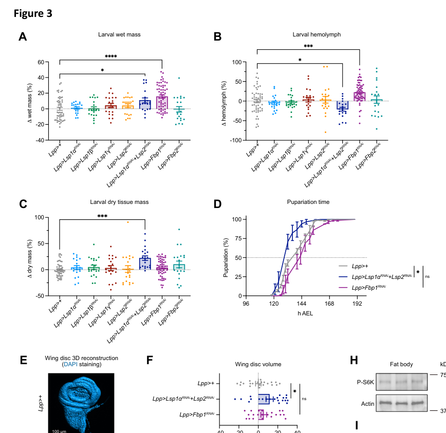

## Question

# Gene Research for Functional Annotation

## ⚠️ CRITICAL: Gene/Protein Identification Context

**BEFORE YOU BEGIN RESEARCH:** You MUST verify you are researching the CORRECT gene/protein. Gene symbols can be ambiguous, especially for less well-characterized genes from non-model organisms.

### Target Gene/Protein Identity (from UniProt):
- **UniProt Accession:** P11997
- **Protein Description:** RecName: Full=Larval serum protein 1 gamma chain; AltName: Full=Hexamerin-1-gamma; Flags: Precursor;
- **Gene Information:** Name=Lsp1gamma; Synonyms=Lsp1-g; ORFNames=CG6821;
- **Organism (full):** Drosophila melanogaster (Fruit fly).
- **Protein Family:** Belongs to the hemocyanin family. .
- **Key Domains:** Di-copper_centre_dom_sf. (IPR008922); Hemocyanin/hexamerin. (IPR013788); Hemocyanin/hexamerin_mid_dom. (IPR000896); Hemocyanin_C. (IPR005203); Hemocyanin_C_sf. (IPR037020)

### MANDATORY VERIFICATION STEPS:

1. **Check if the gene symbol "Lsp1gamma" matches the protein description above**
2. **Verify the organism is correct:** Drosophila melanogaster (Fruit fly).
3. **Check if protein family/domains align with what you find in literature**
4. **If you find literature for a DIFFERENT gene with the same or similar symbol, STOP**

### If Gene Symbol is Ambiguous or You Cannot Find Relevant Literature:

**DO NOT PROCEED WITH RESEARCH ON A DIFFERENT GENE.** Instead:
- State clearly: "The gene symbol 'Lsp1gamma' is ambiguous or literature is limited for this specific protein"
- Explain what you found (e.g., "Found extensive literature on a different gene with the same symbol in a different organism")
- Describe the protein based ONLY on the UniProt information provided above
- Suggest that the protein function can be inferred from domain/family information

### Research Target:

Please provide a comprehensive research report on the gene **Lsp1gamma** (gene ID: Lsp1gamma, UniProt: P11997) in DROME.

The research report should be a detailed narrative explaining the function, biological processes, and localization of the gene product. Citations should be given for all claims.

You should prioritize authoritative reviews and primary scientific literature when conducting research. You can supplement
this with annotations you find in gene/protein databases, but these can be outdated or inaccurate.

We are specifically interested in the primary function of the gene - for enzymes, what reaction is catalyzed, and what is the substrate specificity? For transporters, what is the substrate? For structural proteins or adapters, what is the broader structural role? For signaling molecules, what is the role in the pathway.

We are interested in where in or outside the cell the gene product carries out its function.

We are also interested in the signaling or biochemical pathways in which the gene functions. We are less interested in broad pleiotropic effects, except where these elucidate the precise role.

Include evidence where possible. We are interested in both experimental evidence as well as inference from structure, evolution, or bioinformatic analysis. Precise studies should be prioritized over high-throughput, where available.

## Output

Question: You are an expert researcher providing comprehensive, well-cited information.

Provide detailed information focusing on:
1. Key concepts and definitions with current understanding
2. Recent developments and latest research (prioritize 2023-2024 sources)
3. Current applications and real-world implementations
4. Expert opinions and analysis from authoritative sources
5. Relevant statistics and data from recent studies

Format as a comprehensive research report with proper citations. Include URLs and publication dates where available.
Always prioritize recent, authoritative sources and provide specific citations for all major claims.

# Gene Research for Functional Annotation

## ⚠️ CRITICAL: Gene/Protein Identification Context

**BEFORE YOU BEGIN RESEARCH:** You MUST verify you are researching the CORRECT gene/protein. Gene symbols can be ambiguous, especially for less well-characterized genes from non-model organisms.

### Target Gene/Protein Identity (from UniProt):
- **UniProt Accession:** P11997
- **Protein Description:** RecName: Full=Larval serum protein 1 gamma chain; AltName: Full=Hexamerin-1-gamma; Flags: Precursor;
- **Gene Information:** Name=Lsp1gamma; Synonyms=Lsp1-g; ORFNames=CG6821;
- **Organism (full):** Drosophila melanogaster (Fruit fly).
- **Protein Family:** Belongs to the hemocyanin family. .
- **Key Domains:** Di-copper_centre_dom_sf. (IPR008922); Hemocyanin/hexamerin. (IPR013788); Hemocyanin/hexamerin_mid_dom. (IPR000896); Hemocyanin_C. (IPR005203); Hemocyanin_C_sf. (IPR037020)

### MANDATORY VERIFICATION STEPS:

1. **Check if the gene symbol "Lsp1gamma" matches the protein description above**
2. **Verify the organism is correct:** Drosophila melanogaster (Fruit fly).
3. **Check if protein family/domains align with what you find in literature**
4. **If you find literature for a DIFFERENT gene with the same or similar symbol, STOP**

### If Gene Symbol is Ambiguous or You Cannot Find Relevant Literature:

**DO NOT PROCEED WITH RESEARCH ON A DIFFERENT GENE.** Instead:
- State clearly: "The gene symbol 'Lsp1gamma' is ambiguous or literature is limited for this specific protein"
- Explain what you found (e.g., "Found extensive literature on a different gene with the same symbol in a different organism")
- Describe the protein based ONLY on the UniProt information provided above
- Suggest that the protein function can be inferred from domain/family information

### Research Target:

Please provide a comprehensive research report on the gene **Lsp1gamma** (gene ID: Lsp1gamma, UniProt: P11997) in DROME.

The research report should be a detailed narrative explaining the function, biological processes, and localization of the gene product. Citations should be given for all claims.

You should prioritize authoritative reviews and primary scientific literature when conducting research. You can supplement
this with annotations you find in gene/protein databases, but these can be outdated or inaccurate.

We are specifically interested in the primary function of the gene - for enzymes, what reaction is catalyzed, and what is the substrate specificity? For transporters, what is the substrate? For structural proteins or adapters, what is the broader structural role? For signaling molecules, what is the role in the pathway.

We are interested in where in or outside the cell the gene product carries out its function.

We are also interested in the signaling or biochemical pathways in which the gene functions. We are less interested in broad pleiotropic effects, except where these elucidate the precise role.

Include evidence where possible. We are interested in both experimental evidence as well as inference from structure, evolution, or bioinformatic analysis. Precise studies should be prioritized over high-throughput, where available.

# Functional annotation report: *Drosophila melanogaster* Lsp1gamma

**Identity and conclusion.** The requested protein is larval serum protein 1 gamma (LSP1γ; gene *Lsp1gamma*, also written *Lsp1g*; CG6821; UniProt [P11997](https://www.uniprot.org/uniprotkb/P11997/entry)), **not** LSP1α, LSP1β, or a similarly named protein from another organism. The supplied UniProt identity describes a precursor in the hemocyanin/hexamerin family, with hemocyanin middle and C-terminal regions and a di-copper-centre-domain-superfamily annotation. Independently, a *D. melanogaster* study identifies LSP1γ as one of the three LSP1 storage-protein subunits and experimentally measures *Lsp1g* with gene-specific primers and RNAi. The family annotation is consistent with that literature, but does **not** establish copper binding or oxygen transport by LSP1γ. (valzania2023atemporalallocation pages 1-4, valzania2023atemporalallocation pages 6-9)

**Primary function.** LSP1γ is best annotated as a **larval amino-acid storage-protein subunit**. Hexamerins package amino acids in abundant protein reserves made while larvae can feed, allowing those resources to be allocated during non-feeding pupal development. This is a structural/nutritional role, not a demonstrated catalytic reaction, substrate-transport activity, or signaling-ligand function. The functional assignment is strong for the LSP system; direct experiments tracing amino acids specifically through purified LSP1γ were not identified. (valzania2023atemporalallocation pages 1-4, valzania2023atemporalallocation pages 6-9)

The distinction between gene-specific findings and broader hexamerin-system findings is important for this annotation:

| Annotation aspect | Evidence-bound finding | Evidence status and limitation |
| --- | --- | --- |
| Identity and structure | *Drosophila melanogaster* Lsp1gamma, also called Lsp1γ or Lsp1g, corresponds to CG6821 and UniProt P11997. The user-supplied UniProt record describes a precursor hemocyanin-family hexamerin with hemocyanin middle, C-terminal, and di-copper-centre-domain-superfamily annotations. | The identity and domains come from the supplied UniProt record. Literature recognizes LSP1γ as an LSP1 subunit, but copper binding, oxygen transport, and oxygenase activity have not been demonstrated; homology does not prove these activities. (valzania2023atemporalallocation pages 1-4) |
| Primary function | LSP1γ is best annotated as a component of the larval hexamerin system that stores amino acids in protein-bound form during feeding for use during non-feeding metamorphosis. | Strong LSP-family and system-level evidence supports this function, but no study cited here directly traces amino acids from purified LSP1γ specifically. (valzania2023atemporalallocation pages 1-4, valzania2023atemporalallocation pages 6-9) |
| Synthesis site and timing | Gene-specific qRT-PCR and fat-body RNAi place Lsp1g production in larval fat-body cells. Expression peaks near the end of larval feeding and declines after feeding stops in early pupae. | Direct, gene-specific transcript evidence used Lsp1g primers and an Lsp1g RNAi reagent. The work first appeared as a December 2023 preprint and was subsequently published in 2024. (valzania2023atemporalallocation pages 1-4, valzania2023atemporalallocation pages 6-9) |
| Action site and trafficking | The LSP system is secreted from fat-body cells into the hemolymph as circulating complexes and returns to the fat body near the larva-to-pupa transition through an FBP1-dependent process. | Secretion, complex formation, and uptake were directly assayed for LSP1α and LSP2, not with a tagged LSP1γ construct or γ-specific antibody. Participation of LSP1γ in this traffic is therefore inferred from its family membership and coordinated expression. (valzania2023atemporalallocation pages 4-6, valzania2023atemporalallocation pages 20-22) |
| Nutrient and TOR regulation | Dietary amino-acid restriction strongly reduces storage-protein transcription, while suppression of fat-body TORC1 abolishes Lsp and Fbp expression. Lsp1g production therefore lies downstream of nutrient-sensitive fat-body TORC1 signaling. | Direct transcript-level evidence includes Lsp1g. It does not show direct phosphorylation of LSP1γ by TORC1 or regulation of a catalytic activity. (valzania2023atemporalallocation pages 1-4) |
| Ecdysone-dependent timing | The late-larval ecdysone rise induces Fbp1, establishing a developmental timer for FBP1-dependent recovery of circulating storage proteins by the fat body. Blocking the ecdysone peak did not reduce the tested Lsp genes. | Fbp1 regulation and uptake of LSP1α and LSP2 were directly tested; involvement of LSP1γ in this uptake is a pathway-level inference. The evidence does not support describing ecdysone as a direct inducer of Lsp1g. (valzania2023atemporalallocation pages 1-4, valzania2023atemporalallocation pages 6-9) |
| Co-regulation and redundancy | Silencing Lsp1a, Lsp1b, or Lsp1g markedly reduces the other Lsp1 transcripts, whereas Lsp2 depletion increases all three Lsp1 genes, indicating coordinated regulation and compensation. | Direct gene-expression evidence. Because individual RNAi treatments perturb the paralog network, they do not cleanly isolate a unique molecular function for LSP1γ. (valzania2023atemporalallocation pages 1-4) |
| Phenotype and limitations | Single fat-body Lsp1g RNAi was not assigned a significant effect in the displayed larval wet-mass, hemolymph-volume, or dry-mass assays. Strong developmental, allometric, fertility, and lifespan effects came mainly from combined Lsp1a and Lsp2 depletion or Fbp1 depletion. | No definitive γ-specific organismal phenotype was established. Effects of combined knockdown demonstrate the importance of the broader hexamerin pool and must not be attributed specifically to LSP1γ. (valzania2023atemporalallocation pages 6-9, valzania2023atemporalallocation pages 20-22) |

*Table: This table distinguishes direct Lsp1γ findings from conclusions inferred from the broader Drosophila hexamerin system. It supports a primary amino-acid-storage annotation while identifying unresolved γ-specific biochemistry, trafficking, and phenotypes.*

## Site of synthesis, site of action, and developmental timing

The **larval fat body** is the supported site of *Lsp1g* production. In the accessible primary study, fat-body-directed RNAi suppressed storage-protein gene expression, and gene-specific quantitative RT-PCR placed *Lsp1g*, alongside the other *Lsp* genes, at an expression peak toward the end of larval feeding; expression subsequently declined in early pupae. These are principally transcript-level findings for γ. The expected **site of storage action is extracellular larval hemolymph**: LSP-family proteins circulate there as large protein complexes before resources return to fat-body cells around the larva-to-pupa transition. Importantly, the study’s direct hemolymph immunoblots, tagged-protein secretion tests, and uptake tests examined **LSP1α and LSP2**, not a γ-tagged protein or γ-specific antibody. Hemolymph localization and reuptake of LSP1γ itself are therefore well-motivated **family-level inferences**, rather than separately demonstrated protein-level results in that study. (valzania2023atemporalallocation pages 1-4, valzania2023atemporalallocation pages 4-6, valzania2023atemporalallocation pages 20-22)

## Regulation and biochemical pathway

LSP1γ belongs to a **nutrition-sensitive fat-body storage program**. Reducing dietary amino acids in early third-instar larvae sharply reduced *Lsp* and *Fbp* expression; suppressing fat-body TORC1 by expressing TSC1/TSC2 abolished their expression. Silencing any one of *Lsp1a*, *Lsp1b*, or *Lsp1g* also markedly reduced the other two *Lsp1* transcripts, whereas *Lsp2* silencing increased all three. Thus, γ participates in a co-regulated and partly compensatory storage-protein network; these experiments do not demonstrate that TORC1 directly modifies the LSP1γ protein. The reported RT-PCR/regulatory experiments used three biological replicates per condition. (valzania2023atemporalallocation pages 1-4, valzania2023atemporalallocation pages 6-9, valzania2023atemporalallocation pages 13-16)

A second, developmentally timed step recovers circulating reserves. At the larva-to-pupa transition, an **ecdysone-dependent increase in *Fbp1*** accompanies fat-body uptake of circulating LSP complexes. Fat-body *Fbp1* knockdown retained measured LSPs in hemolymph and reduced their accumulation in fat-body cells; tagged LSP1α and LSP2 failed to enter fat-body cells when *Fbp1* was suppressed. The investigators also detected circulating FBP1 and FBP2, complicating an earlier simple model of these proteins as membrane-bound receptors; they proposed that uptake of FBP1-containing complexes may require an as-yet-unidentified cell-surface receptor. **Ecdysone is supported as a timer of *Fbp1*-dependent uptake, not as a direct inducer of *Lsp1g***: preventing the tested ecdysone peak abolished *Fbp1* expression without affecting the tested *Lsp* genes. Direct demonstration that γ itself enters through this route remains outstanding. (valzania2023atemporalallocation pages 1-4, valzania2023atemporalallocation pages 4-6, valzania2023atemporalallocation pages 6-9)

## Physiological evidence and quantitative context

The authors estimated that the **circulating hexamerin pool exceeds 10% of total late-larval protein mass**. In system-level perturbations, combined fat-body *Lsp1a*/*Lsp2* silencing increased larval dry tissue mass by approximately **22%**, but adult dry mass by only **6%**; *Fbp1* silencing reduced adult dry mass by approximately **10%**. Blocking storage-protein production or reuptake also produced partial pupal lethality and delayed emergence of surviving adults by **more than 30 hours**. These results support a temporal allocation of protein resources between larval growth and pupal organ formation, but the measured effects **must not be assigned specifically to LSP1γ**. Single *Lsp1g* RNAi was included in the larval-mass assays; the inspected panels do not establish a significant γ-specific change in wet mass, hemolymph volume, or dry tissue mass. The study reports 20–58 animals for its body-measurement assays, depending on the experiment. (valzania2023atemporalallocation pages 6-9, valzania2023atemporalallocation pages 4-6, valzania2023atemporalallocation pages 13-16, valzania2023atemporalallocation pages 20-22, valzania2023atemporalallocation media f8f77c64)

## Research status and interpretation

The most informative accessible gene-specific work is Valzania, Alami and Léopold’s **December 2023 preprint**, [*A temporal allocation of amino acid resources ensures fitness and body allometry*](https://doi.org/10.1101/2023.12.08.570599). A journal version appeared in *Developmental Cell* in **September 2024**: [*A temporal allocation of amino acid resources ensures fitness and body allometry in Drosophila*](https://doi.org/10.1016/j.devcel.2024.05.018). The mechanistic details and numbers above were checked against the accessible **2023 text**; the 2024 publication was identified by its bibliographic record, not independently checked for revisions. The study supplies a practical fly-genetics implementation—fat-body-targeted, gene-specific RNAi and RT-PCR for *Lsp1g*, coupled to nutritional and developmental perturbations—rather than evidence for a clinical or industrial application of this protein. (valzania2023atemporalallocation pages 1-4, valzania2023atemporalallocation pages 6-9, valzania2023atemporalallocation pages 13-16)

**Annotation with confidence boundaries:** *Lsp1gamma* encodes a fat-body-produced larval hexamerin subunit whose primary inferred role is to contribute protein-bound amino acids to the extracellular hemolymph storage pool for metamorphosis. Fat-body expression, its developmental/nutritional regulation, and its coordination with other *Lsp1* genes have direct γ-specific experimental support. γ-specific complex composition, direct hemolymph protein measurements, uptake mechanism, and a nonredundant organismal phenotype remain less securely established than the corresponding properties of the LSP system as a whole. (valzania2023atemporalallocation pages 1-4, valzania2023atemporalallocation pages 4-6, valzania2023atemporalallocation pages 20-22)

References

1. (valzania2023atemporalallocation pages 1-4): Luca Valzania, Aya Alami, and Pierre Léopold. A temporal allocation of amino acid resources ensures fitness and body allometry. bioRxiv, Dec 2023. URL: https://doi.org/10.1101/2023.12.08.570599, doi:10.1101/2023.12.08.570599. This article has 0 citations.

2. (valzania2023atemporalallocation pages 6-9): Luca Valzania, Aya Alami, and Pierre Léopold. A temporal allocation of amino acid resources ensures fitness and body allometry. bioRxiv, Dec 2023. URL: https://doi.org/10.1101/2023.12.08.570599, doi:10.1101/2023.12.08.570599. This article has 0 citations.

3. (valzania2023atemporalallocation pages 4-6): Luca Valzania, Aya Alami, and Pierre Léopold. A temporal allocation of amino acid resources ensures fitness and body allometry. bioRxiv, Dec 2023. URL: https://doi.org/10.1101/2023.12.08.570599, doi:10.1101/2023.12.08.570599. This article has 0 citations.

4. (valzania2023atemporalallocation pages 20-22): Luca Valzania, Aya Alami, and Pierre Léopold. A temporal allocation of amino acid resources ensures fitness and body allometry. bioRxiv, Dec 2023. URL: https://doi.org/10.1101/2023.12.08.570599, doi:10.1101/2023.12.08.570599. This article has 0 citations.

5. (valzania2023atemporalallocation pages 13-16): Luca Valzania, Aya Alami, and Pierre Léopold. A temporal allocation of amino acid resources ensures fitness and body allometry. bioRxiv, Dec 2023. URL: https://doi.org/10.1101/2023.12.08.570599, doi:10.1101/2023.12.08.570599. This article has 0 citations.

6. (valzania2023atemporalallocation media f8f77c64): Luca Valzania, Aya Alami, and Pierre Léopold. A temporal allocation of amino acid resources ensures fitness and body allometry. bioRxiv, Dec 2023. URL: https://doi.org/10.1101/2023.12.08.570599, doi:10.1101/2023.12.08.570599. This article has 0 citations.

## Artifacts

- [Edison artifact artifact-00](Lsp1gamma-deep-research-falcon_artifacts/artifact-00.md)

## Citations

1. valzania2023atemporalallocation pages 1-4
2. valzania2023atemporalallocation pages 6-9
3. valzania2023atemporalallocation pages 4-6
4. valzania2023atemporalallocation pages 20-22
5. valzania2023atemporalallocation pages 13-16
6. P11997
7. *A temporal allocation of amino acid resources ensures fitness and body allometry*
8. *A temporal allocation of amino acid resources ensures fitness and body allometry in Drosophila*
9. https://www.uniprot.org/uniprotkb/P11997/entry
10. https://doi.org/10.1101/2023.12.08.570599
11. https://doi.org/10.1016/j.devcel.2024.05.018
12. https://doi.org/10.1101/2023.12.08.570599,