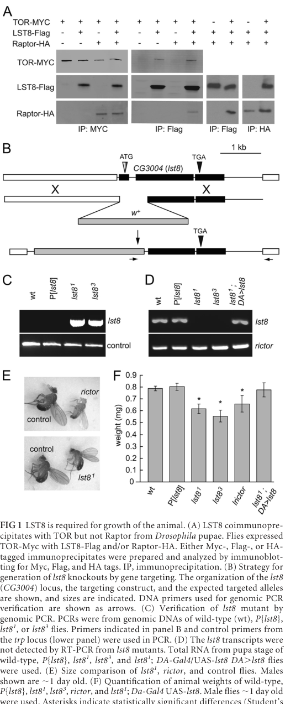

## Question

# Gene Research for Functional Annotation

## ⚠️ CRITICAL: Gene/Protein Identification Context

**BEFORE YOU BEGIN RESEARCH:** You MUST verify you are researching the CORRECT gene/protein. Gene symbols can be ambiguous, especially for less well-characterized genes from non-model organisms.

### Target Gene/Protein Identity (from UniProt):
- **UniProt Accession:** Q9W328
- **Protein Description:** RecName: Full=Protein LST8 homolog;
- **Gene Information:** Name=Lst8; ORFNames=CG3004;
- **Organism (full):** Drosophila melanogaster (Fruit fly).
- **Protein Family:** Belongs to the WD repeat LST8 family. .
- **Key Domains:** Beta-prop_EML-like_2nd. (IPR055442); MLST8. (IPR037588); WD40/YVTN_repeat-like_dom_sf. (IPR015943); WD40_PAC1. (IPR020472); WD40_repeat_CS. (IPR019775)

### MANDATORY VERIFICATION STEPS:

1. **Check if the gene symbol "Lst8" matches the protein description above**
2. **Verify the organism is correct:** Drosophila melanogaster (Fruit fly).
3. **Check if protein family/domains align with what you find in literature**
4. **If you find literature for a DIFFERENT gene with the same or similar symbol, STOP**

### If Gene Symbol is Ambiguous or You Cannot Find Relevant Literature:

**DO NOT PROCEED WITH RESEARCH ON A DIFFERENT GENE.** Instead:
- State clearly: "The gene symbol 'Lst8' is ambiguous or literature is limited for this specific protein"
- Explain what you found (e.g., "Found extensive literature on a different gene with the same symbol in a different organism")
- Describe the protein based ONLY on the UniProt information provided above
- Suggest that the protein function can be inferred from domain/family information

### Research Target:

Please provide a comprehensive research report on the gene **Lst8** (gene ID: Lst8, UniProt: Q9W328) in DROME.

The research report should be a detailed narrative explaining the function, biological processes, and localization of the gene product. Citations should be given for all claims.

You should prioritize authoritative reviews and primary scientific literature when conducting research. You can supplement
this with annotations you find in gene/protein databases, but these can be outdated or inaccurate.

We are specifically interested in the primary function of the gene - for enzymes, what reaction is catalyzed, and what is the substrate specificity? For transporters, what is the substrate? For structural proteins or adapters, what is the broader structural role? For signaling molecules, what is the role in the pathway.

We are interested in where in or outside the cell the gene product carries out its function.

We are also interested in the signaling or biochemical pathways in which the gene functions. We are less interested in broad pleiotropic effects, except where these elucidate the precise role.

Include evidence where possible. We are interested in both experimental evidence as well as inference from structure, evolution, or bioinformatic analysis. Precise studies should be prioritized over high-throughput, where available.

## Output

Question: You are an expert researcher providing comprehensive, well-cited information.

Provide detailed information focusing on:
1. Key concepts and definitions with current understanding
2. Recent developments and latest research (prioritize 2023-2024 sources)
3. Current applications and real-world implementations
4. Expert opinions and analysis from authoritative sources
5. Relevant statistics and data from recent studies

Format as a comprehensive research report with proper citations. Include URLs and publication dates where available.
Always prioritize recent, authoritative sources and provide specific citations for all major claims.

# Gene Research for Functional Annotation

## ⚠️ CRITICAL: Gene/Protein Identification Context

**BEFORE YOU BEGIN RESEARCH:** You MUST verify you are researching the CORRECT gene/protein. Gene symbols can be ambiguous, especially for less well-characterized genes from non-model organisms.

### Target Gene/Protein Identity (from UniProt):
- **UniProt Accession:** Q9W328
- **Protein Description:** RecName: Full=Protein LST8 homolog;
- **Gene Information:** Name=Lst8; ORFNames=CG3004;
- **Organism (full):** Drosophila melanogaster (Fruit fly).
- **Protein Family:** Belongs to the WD repeat LST8 family. .
- **Key Domains:** Beta-prop_EML-like_2nd. (IPR055442); MLST8. (IPR037588); WD40/YVTN_repeat-like_dom_sf. (IPR015943); WD40_PAC1. (IPR020472); WD40_repeat_CS. (IPR019775)

### MANDATORY VERIFICATION STEPS:

1. **Check if the gene symbol "Lst8" matches the protein description above**
2. **Verify the organism is correct:** Drosophila melanogaster (Fruit fly).
3. **Check if protein family/domains align with what you find in literature**
4. **If you find literature for a DIFFERENT gene with the same or similar symbol, STOP**

### If Gene Symbol is Ambiguous or You Cannot Find Relevant Literature:

**DO NOT PROCEED WITH RESEARCH ON A DIFFERENT GENE.** Instead:
- State clearly: "The gene symbol 'Lst8' is ambiguous or literature is limited for this specific protein"
- Explain what you found (e.g., "Found extensive literature on a different gene with the same symbol in a different organism")
- Describe the protein based ONLY on the UniProt information provided above
- Suggest that the protein function can be inferred from domain/family information

### Research Target:

Please provide a comprehensive research report on the gene **Lst8** (gene ID: Lst8, UniProt: Q9W328) in DROME.

The research report should be a detailed narrative explaining the function, biological processes, and localization of the gene product. Citations should be given for all claims.

You should prioritize authoritative reviews and primary scientific literature when conducting research. You can supplement
this with annotations you find in gene/protein databases, but these can be outdated or inaccurate.

We are specifically interested in the primary function of the gene - for enzymes, what reaction is catalyzed, and what is the substrate specificity? For transporters, what is the substrate? For structural proteins or adapters, what is the broader structural role? For signaling molecules, what is the role in the pathway.

We are interested in where in or outside the cell the gene product carries out its function.

We are also interested in the signaling or biochemical pathways in which the gene functions. We are less interested in broad pleiotropic effects, except where these elucidate the precise role.

Include evidence where possible. We are interested in both experimental evidence as well as inference from structure, evolution, or bioinformatic analysis. Precise studies should be prioritized over high-throughput, where available.

# Functional annotation of *Drosophila melanogaster* Lst8 (CG3004; UniProt Q9W328)

## Identity and principal function

**Identity verified.** The supplied UniProt accession Q9W328 identifies the intended fly protein as Lst8/CG3004. Independently, a primary genetic study identified **CG3004 as the only predicted LST8 gene in *D. melanogaster***, demonstrated its association with fly TOR, and described a protein with seven WD40 repeats. Its reported sequence identity is 49.2% to mouse mLST8 and 42.1% to yeast LST8. These findings agree with the supplied WD-repeat LST8-family annotation; the publication identifies CG3004 but does not itself establish the UniProt accession mapping. No similarly named protein from another species is substituted for the research target here. (wang2012lst8regulatescell pages 3-3, wang2012lst8regulatescell pages 2-3)

**Primary annotation:** fly LST8 is an **intracellular, non-enzymatic TOR-complex-associated WD40 protein** whose clearest experimentally demonstrated requirement is to enable **TOR complex 2 (TORC2) signaling and cell-autonomous growth**. TOR is the protein kinase: LST8 is not assigned its own catalytic reaction, transported substrate, or transporter activity. Fly tagged-protein experiments show LST8 co-immunoprecipitating with TOR but not directly with Raptor; Raptor is unnecessary for the observed LST8–TOR association. Association with TOR should not be confused with an essential functional requirement in every TOR complex. (wang2012lst8regulatescell pages 3-3, wang2012lst8regulatescell pages 2-3, wang2012lst8regulatescell pages 7-8)

The table summarizes what is directly established in flies and where interpretation remains qualified.

| Question | Direct fly evidence | Interpretation / limitation | Source (date and DOI URL) |
|---|---|---|---|
| Is this the correct gene/protein? | **CG3004** was the only predicted *Drosophila melanogaster* LST8 gene. Its protein is defined by **seven WD40 repeats** and shares **49.2% identity with mouse mLST8** and **42.1% with yeast LST8**, consistent with Q9W328 and the WD-repeat LST8 family. (wang2012lst8regulatescell pages 1-2, wang2012lst8regulatescell pages 3-3) | Strong primary-literature verification of the supplied Q9W328 identity; the paper identifies CG3004 as fly LST8 but does not itself state the UniProt accession. | Wang et al., 2012-06. [https://doi.org/10.1128/MCB.06474-11](https://doi.org/10.1128/MCB.06474-11) |
| What is its molecular role? | Tagged LST8 **co-immunoprecipitated with TOR but not Raptor** from fly pupae; Raptor was unnecessary for LST8–TOR binding. (wang2012lst8regulatescell pages 3-3) | LST8 is a non-enzymatic WD40 adaptor/scaffold associated with the TOR kinase-domain region—not a kinase, enzyme, or transporter. Failure to co-IP Raptor does not prove that LST8 never occurs in TORC1. | Wang et al., 2012-06. [https://doi.org/10.1128/MCB.06474-11](https://doi.org/10.1128/MCB.06474-11) |
| What happens after complete loss of Lst8? | Homologous-recombination alleles **lst8¹** and **lst8³** lacked detectable transcript. Homozygotes were viable but had smaller bodies, wings, and eyes and approximately **25% lower body weight**; ubiquitous UAS-*lst8* rescued growth. (wang2012lst8regulatescell pages 3-3, wang2012lst8regulatescell media c8363e2a) | Demonstrates that Lst8 promotes growth but—unlike *Tor* or *Rheb*—is not required for viability under standard laboratory conditions. | Wang et al., 2012-06. [https://doi.org/10.1128/MCB.06474-11](https://doi.org/10.1128/MCB.06474-11) |
| Does Lst8 control cell size or proliferation? | Mosaic mutant eye cells formed ommatidia **83.3% ± 2.5%** the size of neighboring controls; flow cytometry showed reduced wing-disc cell volume without altered cell-cycle phasing. In a distinct whole-mutant/fully mutant-eye assay, individual ommatidia were reported as approximately **29% smaller**. (wang2012lst8regulatescell pages 3-4, wang2012lst8regulatescell pages 4-5) | Supports a primarily **cell-autonomous cell-size** function rather than reduced cell number or altered proliferation. The 83.3% and ~29% values derive from different genetic/measurement contexts and should not be combined. | Wang et al., 2012-06. [https://doi.org/10.1128/MCB.06474-11](https://doi.org/10.1128/MCB.06474-11) |
| Is Lst8 required for TORC1? | Loss of Lst8 left basal **dS6K phosphorylation unchanged** and did not cause the fed-state punctate Atg8-GFP pattern expected from TORC1 inhibition. Rheb still elevated dS6K phosphorylation and enlarged mutant ommatidia and posterior wing compartments; TOR–Raptor–Rheb drove strong TORC1 output even without Lst8. (wang2012lst8regulatescell pages 3-4, wang2012lst8regulatescell pages 4-5, wang2012lst8regulatescell pages 5-7) | In the tested fly tissues and outputs, Lst8 is **dispensable for basal and Rheb-stimulated TORC1 signaling**. This does not exclude subtler substrate-, tissue-, or condition-dependent TORC1 contributions. | Wang et al., 2012-06. [https://doi.org/10.1128/MCB.06474-11](https://doi.org/10.1128/MCB.06474-11); Frappaolo & Giansanti, 2023-11. [https://doi.org/10.3390/cells12222622](https://doi.org/10.3390/cells12222622) |
| Is Lst8 required for TORC2? | Lst8 loss strongly reduced or abolished phosphorylation of Drosophila Akt at **Ser505**, the TORC2-dependent hydrophobic-motif site; Lst8 re-expression restored it. The phenotype resembled *rictor* loss. (wang2012lst8regulatescell pages 3-4, wang2012lst8regulatescell pages 7-8, frappaolo2023usingdrosophilamelanogaster pages 7-8) | The best-supported primary function is as an **essential structural/functional TORC2 subunit** that enables TOR kinase output, despite its physical association with TOR shared by both complexes. | Wang et al., 2012-06. [https://doi.org/10.1128/MCB.06474-11](https://doi.org/10.1128/MCB.06474-11); Frappaolo & Giansanti, 2023-11. [https://doi.org/10.3390/cells12222622](https://doi.org/10.3390/cells12222622) |
| Is Akt–FOXO the growth mechanism? | Phosphomimetic active Akt did not rescue mutant ommatidial size, and *foxo* loss did not restore organismal growth. (wang2012lst8regulatescell pages 8-9, wang2012lst8regulatescell pages 7-8) | Akt Ser505 is a robust TORC2 activity marker, but **Akt–FOXO signaling alone is insufficient** to explain Lst8-dependent growth. | Wang et al., 2012-06. [https://doi.org/10.1128/MCB.06474-11](https://doi.org/10.1128/MCB.06474-11) |
| What downstream pathway explains growth better? | Loss of Lst8 disrupted **dMyc nuclear localization** and Myc-dependent transcription. dMyc overexpression fully rescued reduced body weight and small-eye/wing phenotypes, while combining *dmyc* and *lst8* loss did not exacerbate growth defects. (kuo2015targetofrapamycin pages 1-2, frappaolo2023usingdrosophilamelanogaster pages 7-8) | Genetic epistasis supports a **TORC2–Lst8 → Myc nuclear function → growth-gene expression** pathway. It does not establish that Lst8 directly binds or phosphorylates Myc. | Kuo et al., 2015-05. [https://doi.org/10.1038/srep10339](https://doi.org/10.1038/srep10339); Frappaolo & Giansanti, 2023-11. [https://doi.org/10.3390/cells12222622](https://doi.org/10.3390/cells12222622) |
| Does Lst8 interact with the Golgi protein GOLPH3? | GST-Lst8 pulled down dGOLPH3-HA from fly tissue; purified **GST-Lst8 directly bound purified 6×His-dGOLPH3**, and yeast two-hybrid testing independently supported interaction. Pull-down experiments were repeated three times with identical results. (frappaolo2022golph3proteincontrols pages 2-3, frappaolo2022golph3proteincontrols pages 9-10) | Establishes direct biochemical binding, but not its physiological stoichiometry, affinity, effect on TORC2, or subcellular site. The authors state that whether GOLPH3 functions with Lst8 in TORC2 requires further investigation. | Frappaolo et al., 2022-11. [https://doi.org/10.1038/s41419-022-05438-9](https://doi.org/10.1038/s41419-022-05438-9); Frappaolo & Giansanti, 2023-11. [https://doi.org/10.3390/cells12222622](https://doi.org/10.3390/cells12222622) |
| Where does fly Lst8 act in the cell? | Direct fly evidence places LST8 in an **intracellular TOR-containing protein complex** through pupal co-IP, but the cited studies do not provide organelle-resolved imaging or fractionation for Lst8 itself. (wang2012lst8regulatescell pages 3-3) | **Precise subcellular localization remains unresolved.** dGOLPH3 is Golgi-associated and controls Rheb recruitment to Golgi membranes, but those observations do **not** demonstrate Golgi localization of Lst8; the review explicitly says the location where GOLPH3 engages other TOR components remains to be tested. (frappaolo2022golph3proteincontrols pages 2-3, frappaolo2023usingdrosophilamelanogaster pages 7-8, frappaolo2023usingdrosophilamelanogaster pages 8-10) | Frappaolo et al., 2022-11. [https://doi.org/10.1038/s41419-022-05438-9](https://doi.org/10.1038/s41419-022-05438-9); Frappaolo & Giansanti, 2023-11. [https://doi.org/10.3390/cells12222622](https://doi.org/10.3390/cells12222622) |

*Table: Direct evidence for the identity, molecular function, pathway specificity, growth effects, interactions, and localization limits of Drosophila CG3004/Lst8 (Q9W328). Distinct assays and cross-species or Golgi-localization inferences are explicitly separated.*

## Molecular mechanism and pathway placement

TOR forms distinct complexes: TORC1 is organized around TOR and Raptor and signals, among other outputs, to S6 kinase; TORC2 contains TOR with Rictor and Sin1 and phosphorylates the hydrophobic-motif site **Ser505 of fly Akt**. Although LST8 is conventionally described as a shared TOR-associated component, **physical association does not mean that its loss disables both pathways**. In fly *lst8* null mutants, basal S6K phosphorylation remained at control levels, the examined fat-body autophagy response was preserved, and overexpressed Rheb still raised S6K phosphorylation and stimulated growth. Coexpression of TOR, Raptor, and Rheb likewise produced strong TORC1 output without LST8. By contrast, Akt Ser505 phosphorylation was strongly reduced or lost and restored by LST8 re-expression. The experimentally justified distinction is therefore **required for the measured TORC2 output, but dispensable for the measured basal and Rheb-stimulated TORC1 outputs**—not proof of zero TORC1 contribution in every tissue or condition. (wang2012lst8regulatescell pages 3-4, wang2012lst8regulatescell pages 4-5, wang2012lst8regulatescell pages 7-8, frappaolo2023usingdrosophilamelanogaster pages 7-8)

The WD40-repeat architecture supports a **protein-interaction/scaffolding role** rather than catalysis. In the better structurally resolved mammalian complex, the seven WD40 repeats form a β-propeller contacting the mTOR kinase-domain insertion; mLST8 helps position Sin1 for substrate recruitment, and mutations of predicted mTOR-contact residues disrupt mTORC2 integrity and activity. This provides a plausible molecular explanation for the conserved fly phenotype, **but the cited atomic contacts and residue substitutions were characterized for mammalian mLST8, not independently mapped onto Q9W328**. Ragupathi, Kim and Jacinto’s 2024 expert review distinguishes this structural contribution from Sin1’s substrate-recruitment role. (ragupathi2024themtorc2signaling pages 5-7, ragupathi2024themtorc2signaling pages 3-5)

## Biological consequences and quantitative evidence

Wang and colleagues generated two targeted fly null alleles, *lst8¹* and *lst8³*, with no detectable *lst8* transcript. Homozygotes remained viable—unlike the cited *Tor* or *Rheb* mutants—but weighed **approximately 25% less** than controls and had smaller wings and eyes; a wild-type *lst8* transgene rescued the growth defect. Mosaic eye cells lacking LST8 produced ommatidia **83.3% ± 2.5%** of neighboring control size, and wing-disc flow cytometry supported reduced cell volume without a detectable shift in cell-cycle phasing. A separate whole-mutant-eye comparison reported ommatidia approximately **29% smaller**; these percentages arise from different assays and are not interchangeable. Rescue limited to the posterior wing compartment restored growth there without correcting the anterior compartment, supporting a **local, cell-autonomous effect on cell size**, rather than simply a systemic growth defect. The paper’s original Figures 1–2 document the targeting, rescue, and tissue-size comparisons. (wang2012lst8regulatescell pages 3-3, wang2012lst8regulatescell pages 3-4, wang2012lst8regulatescell pages 4-5, wang2012lst8regulatescell media c8363e2a, wang2012lst8regulatescell media 6962a15a)

**Akt phosphorylation is an informative pathway readout, but not a sufficient explanation of growth.** A constitutively active phosphomimetic Akt did not rescue *lst8*-mutant eye-cell size, and removing *foxo* did not restore overall growth. Subsequently, Kuo and colleagues found that *lst8* loss impaired **dMyc nuclear localization and Myc-dependent transcription**; ectopic dMyc rescued reduced body weight and eye/wing growth, while combined *dmyc* and *lst8* loss did not worsen the tested growth defects. Together these experiments place a **TORC2/LST8-dependent Myc transcriptional program** in growth control. They do **not** demonstrate that LST8 directly binds or phosphorylates Myc. (wang2012lst8regulatescell pages 7-8, kuo2015targetofrapamycin pages 1-2, frappaolo2023usingdrosophilamelanogaster pages 7-8)

## Cellular localization and additional interaction

**The exact organelle at which fly LST8 acts has not been established by the cited fly experiments.** Its co-immunoprecipitation with intracellular TOR demonstrates complex association, not a spatially resolved location; its growth effects in eye, wing and fat-body cells identify tissues of function rather than an organelle. The 2023 fly-focused review describes plasma-membrane models for TORC2 activation, but these should not be presented as direct microscopy of *Drosophila* LST8. Equally, **dMyc’s altered nuclear localization is not evidence that LST8 itself is nuclear**. The defensible localization annotation is *intracellular, TOR-associated; precise subcellular site unresolved in flies*. (wang2012lst8regulatescell pages 3-3, frappaolo2023usingdrosophilamelanogaster pages 5-7, kuo2015targetofrapamycin pages 1-2)

Frappaolo and colleagues found another direct **biochemical interaction**: GST-tagged fly LST8 pulled down dGOLPH3 from fly material, and purified GST-LST8 bound purified His-tagged dGOLPH3; yeast two-hybrid experiments provided additional support. The authors demonstrated **GOLPH3-dependent Golgi recruitment of Rheb**, not Golgi localization of LST8. Their 2023 assessment explicitly notes that where GOLPH3 meets other TOR components remains unresolved and treats a GOLPH3–LST8 contribution to TORC2 as a **hypothesis**, not an established signaling mechanism. Thus, neither GOLPH3 binding nor Rheb’s Golgi localization warrants labeling Q9W328 a Golgi-resident protein. (frappaolo2022golph3proteincontrols pages 2-3, frappaolo2022golph3proteincontrols pages 9-10, frappaolo2023usingdrosophilamelanogaster pages 8-10)

## Research status and practical relevance

The **2023 fly-specific synthesis** continues to identify the 2012 knockout work, the 2015 Myc epistasis study, and the 2022 GOLPH3 interaction as the directly relevant mechanistic findings for fly LST8. The **2024 mTORC2 review** refines the conserved structural interpretation and emphasizes that complex assembly, substrates and spatial regulation remain active research areas; its mammalian structural and localization conclusions must not be assigned uncritically to fly LST8. A useful next discriminating experiment would be endogenous fly-LST8 localization coupled to complex-specific interaction or activity measurements at the proposed membranes; this is a research need, **not an existing finding**. (frappaolo2023usingdrosophilamelanogaster pages 7-8, frappaolo2023usingdrosophilamelanogaster pages 8-10, ragupathi2024themtorc2signaling pages 5-7, ragupathi2024themtorc2signaling pages 1-3)

Fly null alleles, tissue-restricted rescue, phospho-Akt Ser505 and phospho-S6K assays constitute **real-world research implementations** for distinguishing TORC2-dependent growth from TORC1 signaling. Therapeutic relevance is presently **cross-species and preclinical**: in human RICTOR-amplified non-small-cell lung-cancer models, disrupting **human mLST8** impaired mTORC2 formation and Akt signaling and reduced proliferation and mouse-xenograft growth. This does not establish a fly-specific therapy or a clinically validated LST8 drug. The 2024 review reports that rapamycin-based drugs primarily target mTORC1 and that developing selective mTORC2 inhibitors remains an outstanding translational problem. (wang2012lst8regulatescell pages 3-4, kim2020rictoramplificationpromotes pages 10-13, ragupathi2024themtorc2signaling pages 1-3, ragupathi2024themtorc2signaling pages 28-30)

### Principal literature and dates

- Wang T, *et al.* **June 2012.** “LST8 Regulates Cell Growth via Target-of-Rapamycin Complex 2 (TORC2).” *Molecular and Cellular Biology* 32:2203–2213. https://doi.org/10.1128/MCB.06474-11. Primary fly knockout, interaction, rescue and signaling experiments. (wang2012lst8regulatescell pages 3-3, wang2012lst8regulatescell pages 7-8)
- Kuo Y, *et al.* **May 2015.** “Target of Rapamycin Complex 2 regulates cell growth via Myc in Drosophila.” *Scientific Reports* 5. https://doi.org/10.1038/srep10339. Fly genetic and Myc-pathway experiments. (kuo2015targetofrapamycin pages 1-2)
- Frappaolo A, *et al.* **November 2022.** “GOLPH3 protein controls organ growth by interacting with TOR signaling proteins in Drosophila.” *Cell Death & Disease* 13. https://doi.org/10.1038/s41419-022-05438-9. Fly GOLPH3–LST8 biochemical interaction. (frappaolo2022golph3proteincontrols pages 2-3)
- Frappaolo A and Giansanti MG. **November 2023.** “Using *Drosophila melanogaster* to Dissect the Roles of the mTOR Signaling Pathway in Cell Growth.” *Cells* 12:2622. https://doi.org/10.3390/cells12222622. Recent fly-focused expert review. (frappaolo2023usingdrosophilamelanogaster pages 7-8, frappaolo2023usingdrosophilamelanogaster pages 8-10)
- Ragupathi A, Kim C and Jacinto E. **25 January 2024.** “The mTORC2 signaling network: targets and cross-talks.” *Biochemical Journal* 481:45–91. https://doi.org/10.1042/BCJ20220325. Recent mechanistic review, principally for mammalian-complex context. (ragupathi2024themtorc2signaling pages 1-3, ragupathi2024themtorc2signaling pages 5-7)
- Kim LC, Rhee CH and Chen J. **November 2020.** “RICTOR Amplification Promotes NSCLC Cell Proliferation through Formation and Activation of mTORC2 at the Expense of mTORC1.” *Molecular Cancer Research* 18:1675–1684. https://doi.org/10.1158/1541-7786.MCR-20-0262. Human-cell and mouse-xenograft comparison, **not fly evidence**. (kim2020rictoramplificationpromotes pages 10-13)

References

1. (wang2012lst8regulatescell pages 3-3): Tao Wang, Rachel Blumhagen, Uyen Lao, Ying Kuo, and Bruce A. Edgar. Lst8 regulates cell growth via target-of-rapamycin complex 2 (torc2). Molecular and Cellular Biology, 32:2203-2213, Jun 2012. URL: https://doi.org/10.1128/mcb.06474-11, doi:10.1128/mcb.06474-11. This article has 56 citations and is from a domain leading peer-reviewed journal.

2. (wang2012lst8regulatescell pages 2-3): Tao Wang, Rachel Blumhagen, Uyen Lao, Ying Kuo, and Bruce A. Edgar. Lst8 regulates cell growth via target-of-rapamycin complex 2 (torc2). Molecular and Cellular Biology, 32:2203-2213, Jun 2012. URL: https://doi.org/10.1128/mcb.06474-11, doi:10.1128/mcb.06474-11. This article has 56 citations and is from a domain leading peer-reviewed journal.

3. (wang2012lst8regulatescell pages 7-8): Tao Wang, Rachel Blumhagen, Uyen Lao, Ying Kuo, and Bruce A. Edgar. Lst8 regulates cell growth via target-of-rapamycin complex 2 (torc2). Molecular and Cellular Biology, 32:2203-2213, Jun 2012. URL: https://doi.org/10.1128/mcb.06474-11, doi:10.1128/mcb.06474-11. This article has 56 citations and is from a domain leading peer-reviewed journal.

4. (wang2012lst8regulatescell pages 1-2): Tao Wang, Rachel Blumhagen, Uyen Lao, Ying Kuo, and Bruce A. Edgar. Lst8 regulates cell growth via target-of-rapamycin complex 2 (torc2). Molecular and Cellular Biology, 32:2203-2213, Jun 2012. URL: https://doi.org/10.1128/mcb.06474-11, doi:10.1128/mcb.06474-11. This article has 56 citations and is from a domain leading peer-reviewed journal.

5. (wang2012lst8regulatescell media c8363e2a): Tao Wang, Rachel Blumhagen, Uyen Lao, Ying Kuo, and Bruce A. Edgar. Lst8 regulates cell growth via target-of-rapamycin complex 2 (torc2). Molecular and Cellular Biology, 32:2203-2213, Jun 2012. URL: https://doi.org/10.1128/mcb.06474-11, doi:10.1128/mcb.06474-11. This article has 56 citations and is from a domain leading peer-reviewed journal.

6. (wang2012lst8regulatescell pages 3-4): Tao Wang, Rachel Blumhagen, Uyen Lao, Ying Kuo, and Bruce A. Edgar. Lst8 regulates cell growth via target-of-rapamycin complex 2 (torc2). Molecular and Cellular Biology, 32:2203-2213, Jun 2012. URL: https://doi.org/10.1128/mcb.06474-11, doi:10.1128/mcb.06474-11. This article has 56 citations and is from a domain leading peer-reviewed journal.

7. (wang2012lst8regulatescell pages 4-5): Tao Wang, Rachel Blumhagen, Uyen Lao, Ying Kuo, and Bruce A. Edgar. Lst8 regulates cell growth via target-of-rapamycin complex 2 (torc2). Molecular and Cellular Biology, 32:2203-2213, Jun 2012. URL: https://doi.org/10.1128/mcb.06474-11, doi:10.1128/mcb.06474-11. This article has 56 citations and is from a domain leading peer-reviewed journal.

8. (wang2012lst8regulatescell pages 5-7): Tao Wang, Rachel Blumhagen, Uyen Lao, Ying Kuo, and Bruce A. Edgar. Lst8 regulates cell growth via target-of-rapamycin complex 2 (torc2). Molecular and Cellular Biology, 32:2203-2213, Jun 2012. URL: https://doi.org/10.1128/mcb.06474-11, doi:10.1128/mcb.06474-11. This article has 56 citations and is from a domain leading peer-reviewed journal.

9. (frappaolo2023usingdrosophilamelanogaster pages 7-8): Anna Frappaolo and Maria Grazia Giansanti. Using drosophila melanogaster to dissect the roles of the mtor signaling pathway in cell growth. Cells, 12:2622, Nov 2023. URL: https://doi.org/10.3390/cells12222622, doi:10.3390/cells12222622. This article has 28 citations.

10. (wang2012lst8regulatescell pages 8-9): Tao Wang, Rachel Blumhagen, Uyen Lao, Ying Kuo, and Bruce A. Edgar. Lst8 regulates cell growth via target-of-rapamycin complex 2 (torc2). Molecular and Cellular Biology, 32:2203-2213, Jun 2012. URL: https://doi.org/10.1128/mcb.06474-11, doi:10.1128/mcb.06474-11. This article has 56 citations and is from a domain leading peer-reviewed journal.

11. (kuo2015targetofrapamycin pages 1-2): Ying Kuo, Huanwei Huang, Tao Cai, and Tao Wang. Target of rapamycin complex 2 regulates cell growth via myc in drosophila. Scientific Reports, May 2015. URL: https://doi.org/10.1038/srep10339, doi:10.1038/srep10339. This article has 28 citations and is from a peer-reviewed journal.

12. (frappaolo2022golph3proteincontrols pages 2-3): Anna Frappaolo, Angela Karimpour-Ghahnavieh, Giuliana Cesare, Stefano Sechi, Roberta Fraschini, Thomas Vaccari, and Maria Grazia Giansanti. Golph3 protein controls organ growth by interacting with tor signaling proteins in drosophila. Cell Death &amp; Disease, Nov 2022. URL: https://doi.org/10.1038/s41419-022-05438-9, doi:10.1038/s41419-022-05438-9. This article has 17 citations and is from a peer-reviewed journal.

13. (frappaolo2022golph3proteincontrols pages 9-10): Anna Frappaolo, Angela Karimpour-Ghahnavieh, Giuliana Cesare, Stefano Sechi, Roberta Fraschini, Thomas Vaccari, and Maria Grazia Giansanti. Golph3 protein controls organ growth by interacting with tor signaling proteins in drosophila. Cell Death &amp; Disease, Nov 2022. URL: https://doi.org/10.1038/s41419-022-05438-9, doi:10.1038/s41419-022-05438-9. This article has 17 citations and is from a peer-reviewed journal.

14. (frappaolo2023usingdrosophilamelanogaster pages 8-10): Anna Frappaolo and Maria Grazia Giansanti. Using drosophila melanogaster to dissect the roles of the mtor signaling pathway in cell growth. Cells, 12:2622, Nov 2023. URL: https://doi.org/10.3390/cells12222622, doi:10.3390/cells12222622. This article has 28 citations.

15. (ragupathi2024themtorc2signaling pages 5-7): Aparna Ragupathi, Christian Kim, and Estela Jacinto. The mtorc2 signaling network: targets and cross-talks. Biochemical Journal, 481:45-91, Jan 2024. URL: https://doi.org/10.1042/bcj20220325, doi:10.1042/bcj20220325. This article has 139 citations and is from a domain leading peer-reviewed journal.

16. (ragupathi2024themtorc2signaling pages 3-5): Aparna Ragupathi, Christian Kim, and Estela Jacinto. The mtorc2 signaling network: targets and cross-talks. Biochemical Journal, 481:45-91, Jan 2024. URL: https://doi.org/10.1042/bcj20220325, doi:10.1042/bcj20220325. This article has 139 citations and is from a domain leading peer-reviewed journal.

17. (wang2012lst8regulatescell media 6962a15a): Tao Wang, Rachel Blumhagen, Uyen Lao, Ying Kuo, and Bruce A. Edgar. Lst8 regulates cell growth via target-of-rapamycin complex 2 (torc2). Molecular and Cellular Biology, 32:2203-2213, Jun 2012. URL: https://doi.org/10.1128/mcb.06474-11, doi:10.1128/mcb.06474-11. This article has 56 citations and is from a domain leading peer-reviewed journal.

18. (frappaolo2023usingdrosophilamelanogaster pages 5-7): Anna Frappaolo and Maria Grazia Giansanti. Using drosophila melanogaster to dissect the roles of the mtor signaling pathway in cell growth. Cells, 12:2622, Nov 2023. URL: https://doi.org/10.3390/cells12222622, doi:10.3390/cells12222622. This article has 28 citations.

19. (ragupathi2024themtorc2signaling pages 1-3): Aparna Ragupathi, Christian Kim, and Estela Jacinto. The mtorc2 signaling network: targets and cross-talks. Biochemical Journal, 481:45-91, Jan 2024. URL: https://doi.org/10.1042/bcj20220325, doi:10.1042/bcj20220325. This article has 139 citations and is from a domain leading peer-reviewed journal.

20. (kim2020rictoramplificationpromotes pages 10-13): Laura C. Kim, Christopher H. Rhee, and Jin Chen. <i>rictor</i> amplification promotes nsclc cell proliferation through formation and activation of mtorc2 at the expense of mtorc1. Molecular Cancer Research, 18:1675-1684, Nov 2020. URL: https://doi.org/10.1158/1541-7786.mcr-20-0262, doi:10.1158/1541-7786.mcr-20-0262. This article has 10 citations and is from a peer-reviewed journal.

21. (ragupathi2024themtorc2signaling pages 28-30): Aparna Ragupathi, Christian Kim, and Estela Jacinto. The mtorc2 signaling network: targets and cross-talks. Biochemical Journal, 481:45-91, Jan 2024. URL: https://doi.org/10.1042/bcj20220325, doi:10.1042/bcj20220325. This article has 139 citations and is from a domain leading peer-reviewed journal.

## Artifacts

- [Edison artifact artifact-00](Lst8-deep-research-falcon_artifacts/artifact-00.md)

## Citations

1. kuo2015targetofrapamycin pages 1-2
2. kim2020rictoramplificationpromotes pages 10-13
3. frappaolo2023usingdrosophilamelanogaster pages 7-8
4. frappaolo2023usingdrosophilamelanogaster pages 8-10
5. frappaolo2023usingdrosophilamelanogaster pages 5-7
6. https://doi.org/10.1128/MCB.06474-11
7. https://doi.org/10.3390/cells12222622
8. https://doi.org/10.1038/srep10339
9. https://doi.org/10.1038/s41419-022-05438-9
10. https://doi.org/10.1128/MCB.06474-11](https://doi.org/10.1128/MCB.06474-11
11. https://doi.org/10.3390/cells12222622](https://doi.org/10.3390/cells12222622
12. https://doi.org/10.1038/srep10339](https://doi.org/10.1038/srep10339
13. https://doi.org/10.1038/s41419-022-05438-9](https://doi.org/10.1038/s41419-022-05438-9
14. https://doi.org/10.1128/MCB.06474-11.
15. https://doi.org/10.1038/srep10339.
16. https://doi.org/10.1038/s41419-022-05438-9.
17. https://doi.org/10.3390/cells12222622.
18. https://doi.org/10.1042/BCJ20220325.
19. https://doi.org/10.1158/1541-7786.MCR-20-0262.
20. https://doi.org/10.1128/mcb.06474-11,
21. https://doi.org/10.3390/cells12222622,
22. https://doi.org/10.1038/srep10339,
23. https://doi.org/10.1038/s41419-022-05438-9,
24. https://doi.org/10.1042/bcj20220325,
25. https://doi.org/10.1158/1541-7786.mcr-20-0262,